# General Science
## Grade 4

Based on Single National Curriculum 2020
One Nation, One Curriculum

The cover page features various scientific illustrations:
*   Two young students, a girl and a boy, wearing white lab coats and safety goggles, holding laboratory flasks with pink and blue liquids.
*   An anatomical illustration of a human heart.
*   An anatomical diagram of the human respiratory system showing the nasal cavity, trachea, and lungs.
*   A circular inset showing a monarch butterfly on a pink flower.
*   An illustration of green moss plants.
*   A diagram of a simple pulley system with a weight.
*   An illustration of a compound light microscope.

Punjab Curriculum and Textbook Board, Lahore

# Chapter 01
# Characteristics and Life Process of Organisms

The image shows a variety of animals in a natural setting, including an elephant, a giraffe, a bear climbing a tree, a lion, a tiger, a polar bear, a sheep, a deer, and several birds (an owl and a cockatoo) perched on tree branches.

* Why are plants essential?
* How can we differentiate between plants and animals?
* How do leaves get water?

## Students' Learning Outcomes

**After studying this chapter, the students will be able to:**

1. Compare and contrast characteristics that distinguish major groups of living things (plants and animals).
2. Classify animals in terms of vertebrates and invertebrates with examples and analyze the differences and similarities in vertebrates and invertebrates.
3. Classify plants in term of flowering and non-flowering with examples and analyze the differences and similarities in flowering and non-flowering plants.
4. Recognize and appreciate diversity in life (both plants and animals) and identify ways to protect diversity.
5. Identify major parts and organs in animals (teeth, bones, lungs, heart, stomach, muscles and brain).
6. Relate the parts and organs of body of animals to their functions e.g. teeth breakdown food, bones support the body, lungs take air in, the heart circulates blood, the stomach helps to digest food, muscles move the body.
7. Identify parts of a plant body (leaves, stem, flowers, seeds roots).
8. Relate the structures of plants to their functions i.e., roots absorb water and nutrition and anchor the plant, leaves make food the stem transport water and food, flowers produce seeds and seeds produce new plants.

On the way from your home to school, you see many things daily. Make a list of these things. Decide which of them are living things and which are non-living?

## Characteristics of Living Things

<table>
  <thead>
    <tr>
        <th>Living things use food to remain alive.</th>
        <th>Living things breathe.</th>
    </tr>
  </thead>
  <tbody>
    <tr>
        <td>An illustration showing a goat eating grass, a boy eating a meal, and a plant being watered.</td>
        <td>An illustration showing a plant with arrows indicating gas exchange, a boy breathing, and a cat.</td>
    </tr>
    <tr>
        <th>Living things can move on their own.</th>
        <th>Living things reproduce offsprings of their own kinds.</th>
    </tr>
    <tr>
        <td>An illustration of a horse running.</td>
        <td>An illustration of a hen with her chicks.</td>
    </tr>
    <tr>
        <th>Living things can grow.</th>
        <th>Living things have the ability to sense.</th>
    </tr>
    <tr>
        <td>An illustration showing the growth stages of a human from a baby to an adult.</td>
        <td>An illustration showing a hand pulling away from a hot pan on a fire.</td>
    </tr>
  </tbody>
</table>

Can you think of some more characteristics of living things?

> ### Point to Ponder!
>
> List down a few characteristics of a vehicle that are also found in living things.

## Characteristics of Major Groups of Living Things

Do you know that both plants and animals are living things? You might have seen animals like butterfly, bird, goat, cow and fish, and trees of apple, banana, orange and mango. If both plants and animals are living, then what difference do they have between them?

The two major groups of living things are:
1. plants
2. animals

### Similarities and Differences between Plants and Animals

> #### Activity 1.1
> Look at the pictures. Study the similarities and differences between a mango tree and a goat.
>
> [The image shows a goat standing on a rock and a large mango tree laden with fruit.]

<table>
  <tbody>
    <tr>
        <td>Plants</td>
        <td>Similarities</td>
        <td>Animals</td>
    </tr>
    <tr>
        <td>1. Usually green in colour.</td>
        <td>1. Grow.</td>
        <td>1. Usually of various colours.</td>
    </tr>
    <tr>
        <td>2. Prepare their own food.</td>
        <td>2. Respire.</td>
        <td>2. Depend on plants and other animals for their food.</td>
    </tr>
    <tr>
        <td>3. Cannot move from one place to other.</td>
        <td>3. Reproduce.</td>
        <td>3. Can move from one place to other.</td>
    </tr>
  </tbody>
</table>

> #### Interesting information
> This is a Venn diagram. Similarities are written in its centre and differences are written on its sides.
>
> [The image shows a diagram of two overlapping circles, representing a Venn diagram.]

> ### Do you know?
> 1. Living things have characteristics of excretion and sensitivity.
> 2. Both plants and animals need food, sunlight, water and air.
> 3. Plants provide oxygen to the environment. Thank you, plants!

## Classification of Animals

### Activity 1.2
Put your hand on the back of your neck, and move your hand downward. Did you feel a line of bones? This is called the backbone or vertebral column.

* How many vertebrae are there on the backbone? Please search and share your findings with your classmates.

[The image shows a human anatomical diagram highlighting the vertebral column in the back.]

Based on whether they have a backbone or not animals are divided into two major groups:
1. Vertebrates
2. Invertebrates

**Vertebrates** are the animals having backbone.
**Invertebrates** are the animals having no backbone.

Pictures of some vertebrates are given below:

<table>
  <tbody>
    <tr>
        <td>[The image shows a Fish]</td>
        <td>[The image shows a Frog]</td>
        <td>[The image shows a Lizard]</td>
        <td>[The image shows a Pigeon]</td>
        <td>[The image shows a Cat]</td>
    </tr>
    <tr>
        <td>Fish</td>
        <td>Frog</td>
        <td>Lizard</td>
        <td>Pigeon</td>
        <td>Cat</td>
    </tr>
    <tr>
        <td colspan="5">Vertebrates</td>
    </tr>
  </tbody>
</table>

Pictures of some invertebrates are given below:

<table>
  <tbody>
    <tr>
        <td>[The image shows a Cockroach]</td>
        <td>[The image shows a Honey bee]</td>
        <td>[The image shows a Butterfly]</td>
        <td>[The image shows a Starfish]</td>
        <td>[The image shows a Snail]</td>
    </tr>
    <tr>
        <td>Cockroach</td>
        <td>Honey bee</td>
        <td>Butterfly</td>
        <td>Starfish</td>
        <td>Snail</td>
    </tr>
    <tr>
        <td colspan="5">Invertebrates</td>
    </tr>
  </tbody>
</table>

> ### Activity 1.3
> Collect and paste the pictures of various animals in your scrapbook. Divide them into vertebrates and invertebrates. Which of these are found in Pakistan?

## Classification of Plants

The plants are divided into two major groups:
1. Flowering plants
2. Non-flowering plants

### 1. Flowering Plants
Plants having flowers grow are called flowering plants. Mustard, sunflower, rose, guava and lemon are examples of flowering plants. Flowering plants may be herbs, shrubs, and trees. Flowering plants are of various colours and sizes.
Pictures of some flowering plants are given below:

<table>
  <thead>
    <tr>
        <th>Mustard</th>
        <th>Rose</th>
        <th>Sunflower</th>
    </tr>
  </thead>
  <tbody>
    <tr>
        <td>A plant with yellow flowers</td>
        <td>A red rose flower with green leaves</td>
        <td>A large yellow sunflower</td>
    </tr>
    <tr>
        <td>Mustard</td>
        <td>Rose</td>
        <td>Sunflower</td>
    </tr>
    <tr>
        <td>An apple hanging from a branch</td>
        <td>Lemons hanging from a branch</td>
        <td>Guava fruits on a branch</td>
    </tr>
    <tr>
        <td>Apple</td>
        <td>Lemon</td>
        <td>Guava</td>
    </tr>
    <tr>
        <td colspan="3">Flowering plants</td>
    </tr>
  </tbody>
</table>

## 2. Non-Flowering Plants

The plants on which flowers do not grow are called non-flowering plants. Moss, fern and conifers (for example pine, juniper, thuja, sago palm) are examples of non-flowering plants. Pictures of some non-flowering plants are given below:

<table>
  <thead>
    <tr>
        <th>A picture of a Moss plant</th>
        <th>A picture of a Fern plant</th>
        <th>A picture of a Pine tree</th>
    </tr>
  </thead>
  <tbody>
    <tr>
        <td>Moss</td>
        <td>Fern</td>
        <td>Pine</td>
    </tr>
    <tr>
        <th>A picture of a Juniper tree</th>
        <th>A picture of a Thuja plant</th>
        <th>A picture of a Sago palm plant</th>
    </tr>
    <tr>
        <td>Juniper</td>
        <td>Thuja</td>
        <td>Sago palm</td>
    </tr>
    <tr>
        <td colspan="3">Non-flowering Plants</td>
    </tr>
  </tbody>
</table>

> ### Interesting Information
> Conifers are found in the northern areas of Pakistan in places like, Murree, Swat, Kaghan and Chilas. Conifers are very important for our economy. Their wood is used for making furniture, construction materials and ornamental things. These are also used to make paper. The seeds of some conifers are used as dry fruit such as pine nut (chilghoza).

### Activity 1.4

Draw this Venn diagram in your scrapbook. Write the similarities and differences between flowering and non-flowering plants in it.

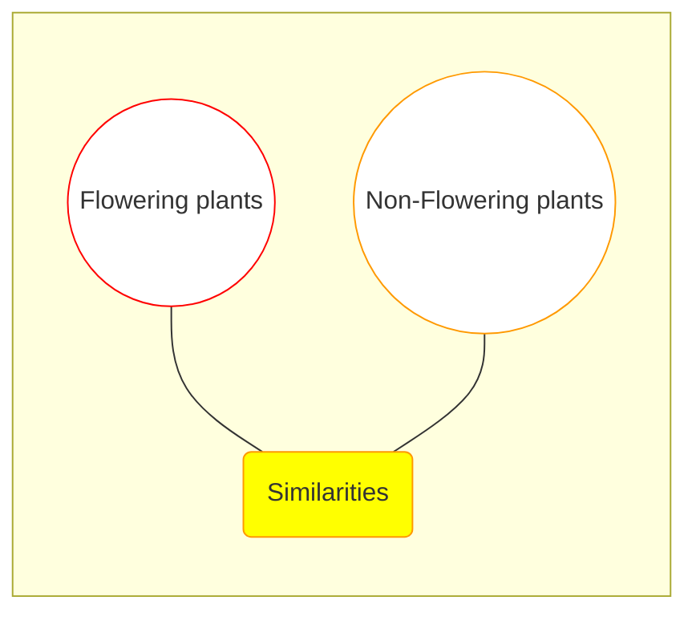

### Activity 1.5
Paste pictures of various plants in your scrapbook. Divide them into flowering and non-flowering plants. Which of these are found in Pakistan?

### Biodiversity
Just look around you and observe the living things. Do all the living things look alike? If no then why? All these living things are different in their functions and structures. Various types of living things found at a particular place is called Biodiversity. We still do not know the actual number and kinds of living things present on the Earth.

Some of living things have become extinct. The existence of many living things is in danger due to many factors such as destruction of habitat, change of climate, Earth and scarcity of water over years.

> **Do you know?**
> 1. Government of Pakistan has started plantation of billions of trees to stop the climate change.
> 2. Located near Lahore, Changa Manga is the largest man-made forest in the world.
>
> A photograph showing a lush green forest area with many tall trees and grass.
>
> **Changa Manga forest**

# Major Body Parts and their Functions

Teeth, bones, lungs, heart, brain and muscles are the major human body parts that we will study here.

The following diagram illustrates the major human body parts:

*   **Brain**: Located in the head.
*   **Teeth**: Located in the mouth.
*   **Windpipe**: Connecting the throat to the lungs.
*   **Heart**: Located in the chest cavity.
*   **Lungs**: Located on either side of the heart.
*   **Liver**: Located in the upper right part of the abdomen.
*   **Stomach**: Located in the upper left part of the abdomen.
*   **Kidney**: Located in the back of the abdominal cavity.
*   **Blood Vessels**: Distributed throughout the body (shown in the arm).
*   **Small Intestine**: Located in the central abdominal area.
*   **Large Intestine**: Surrounding the small intestine.
*   **Muscles**: Shown on the upper leg (thigh).
*   **Bone**: Shown in the lower leg.

Major human body parts

## Teeth

Can you swallow large pieces of bread or meat without chewing? Digestion essentially starts by chewing. Teeth help breaking down the food into smaller pieces. There are four types of teeth that perform various functions.

<table>
  <tbody>
    <tr>
        <td>Name</td>
        <td>Picture</td>
        <td>Functions</td>
    </tr>
    <tr>
        <th>Incisors</th>
        <th>An image of a sharp, chisel-shaped tooth with a single root.</th>
        <th>Biting and cutting food</th>
    </tr>
    <tr>
        <th>Canines</th>
        <th>An image of a pointed, cone-shaped tooth with a single root.</th>
        <th>Piercing and tearing food</th>
    </tr>
    <tr>
        <th>Premolars</th>
        <th>An image of a tooth with a flat biting surface and two cusps.</th>
        <th>Chewing and grinding food</th>
    </tr>
    <tr>
        <th>Molars</th>
        <th>An image of a large tooth with a wide, flat biting surface and multiple roots.</th>
        <th>Chewing and grinding food</th>
    </tr>
  </tbody>
</table>

### Interesting Information

A tiger has large canines whereas a rat has large incisors. A tiger uses its canines for piercing the prey and rat uses its incisors for biting food or killing prey.

The section includes two photographs:
1. A close-up of a rat's mouth showing long, sharp front teeth labeled as **incisors**.
2. A tiger with its mouth open, showing long, sharp side teeth labeled as **canines**.

### Do you know?

1. Which three body parts are in pairs?
2. Do all the teeth have the same shape?
3. What is the difference between molar and premolar?
4. How many teeth does a human being have?

## Bones

Press your hand. Is there something hard in it? The hard part of the hand is called bone. Most of the bones in the human body are hard. They are of various size and shape. For example, the bones of the arm are longer than the finger bones.

Joints are the areas where two or more bones meet. All the bones of the body make a frame called skeleton. Can you tell the functions of bones? What would happen if there are no bones in a human body?

The image shows the front and back view of a human skeleton with the following parts labeled:

*   **Skull**: The bone structure of the head.
*   **Bone of arm**: The long bones in the upper and lower arm.
*   **Ribs**: The bones forming the cage around the chest.
*   **Backbone**: The series of vertebrae extending from the skull to the pelvis.
*   **Hipbone**: The large bone forming the pelvis.
*   **Bones of hand**: The small bones making up the wrist, palm, and fingers.
*   **Bone of Leg**: The long bones of the upper and lower leg.
*   **Bones of knee joint**: The area where the thigh bone and shin bone meet.
*   **Bones of ankle**: The bones connecting the leg to the foot.

**Bones of the human body**

### Activity 1.6
Complete the table.

<table>
  <thead>
    <tr>
        <th>Name of the Bones</th>
        <th>Function</th>
    </tr>
  </thead>
  <tbody>
    <tr>
        <td>Skull</td>
        <td></td>
    </tr>
    <tr>
        <td>Ribs</td>
        <td></td>
    </tr>
    <tr>
        <td>Bones of hand</td>
        <td></td>
    </tr>
    <tr>
        <td>Bones of leg</td>
        <td></td>
    </tr>
  </tbody>
</table>

### For Your Information
There are 206 bones in the human skeleton. The bones of arm and leg are hollow. They have bone marrow which helps to produce blood.

### Lungs

### Activity 1.7
Observe and examine the lungs of a goat.
1. What is the colour of the lungs?
2. Why are the lungs spongy?
3. What will happen if air is filled into the lungs through windpipe?

When we breathe, which part of our body is filled with air? During breathing air enters our lungs through nose. From nose air goes into a windpipe. The windpipe open in the two lungs. The lungs are surrounded by ribs. The lungs keep on expanding and contracting. The exchange of oxygen between blood and air takes place in the lungs.

The following diagram illustrates the human respiratory system:
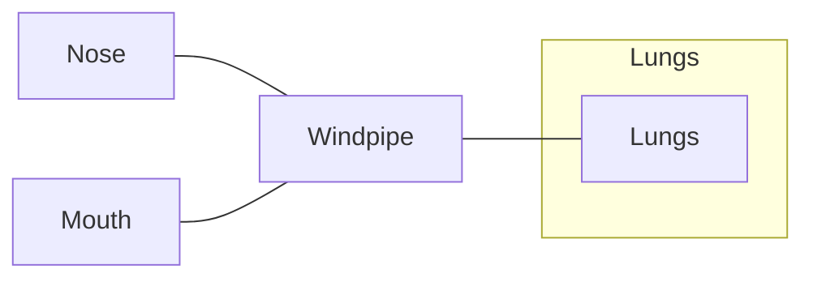
**Lungs**

### Heart

Put your hand on the upper left side of your chest. Do you feel anything beating there? The beat you felt is that of the heart. It is surrounded by the ribs. The heart works continuously like a pump throughout lifetime. The muscles of the heart contract and relax. This keeps on circulating blood all over the body through blood vessels.

An illustration of a human heart showing various arteries and veins.
**Heart**

### Stomach

The stomach is a bag like organ. It is located on the left side of our body below the heart. It is the biggest part of digestive tract. It secretes digestive juice. The muscles of stomach move and grind the food. The digestive juice breaks down (digests) the food.

An illustration of a human stomach connected to the esophagus and small intestine.
**Stomach**

### Muscles

The muscles of the human body are attached to the bones. They are soft and pink or red in colour. You must have seen the meat of cow, goat, or hen. What is their colour?

Muscles perform various functions. Muscles work with the bones and joints to help you move hands, arm, feet and legs.

Due to these movements we can sit, walk, run and jump. Our heart pumps blood with the help of muscles. Muscles move food through the digestive system. It is also due to muscles that our lungs expand and contract, during breathing.

An illustration of the human muscular system shown on a running figure.
**Muscles**

### Do you know?

When the muscles contract, they pull various parts of our bones. Due to this, the bone moves at the joint. Joint is a place where bones are connected. For example, elbow, wrist, knee etc. Muscles work in pairs. When one muscle contracts, the other one relaxes.

The image shows two diagrams of a human arm illustrating the working of muscles:
1.  In the first diagram (arm bent), the bicep muscle is labeled "Muscle contracts" and the tricep muscle is labeled "Muscle relaxes".
2.  In the second diagram (arm extended), the bicep muscle is labeled "Muscle relaxes" and the tricep muscle is labeled "Muscle contracts".
**Working of muscles**

### Interesting Information

When we smile, 14 muscles are needed.
There are almost 600 muscles in a human body. Almost half of the body weight is due to muscles.

### Brain

The brain is the most important part of our body. It is located within our skull. It controls all the functions of our body. It collects information from different parts of our body and decides the type of response our body should give.

The image shows a profile silhouette of a human head with the brain highlighted inside the skull area.
**Brain**

### Parts of Plants and their Functions

#### Activity 1.8

Take a small flowering plant. Observe its various parts. Draw a sketch of the plant and label the parts of the plant.

The five important parts of a flowering plant, are root, stem, leaf, flower and seed. Each of these parts performs its particular function.

### Root
The root is present under the ground. Its branches spread in different directions. The roots anchor plants in the soil and absorb water and minerals from it.

### Stem
The stem grows above the ground. A stem has many branches. There are many leaves on the stem and its branches. The stem transports water and minerals from root to the leaves. It also supports the plant.

**A flowering plant**
The diagram shows a plant with the following labeled parts:
- Fruit
- Flower
- Leaf
- Stem
- Root

---

> ### Activity 1.9
> Take two soft plants having white flowers, for example Petunia. Wash their roots thoroughly with water. Take two bottles or glasses, and pour water in them. In one of the glasses, put few drops of red ink. Then put a plant in each glass in such a way that their roots remain under the water. Leave the plants for few hours or overnight. What did you observe? Cut the stem of the two plants and tell the difference between the two.

**Transportation of water from roots to leaves**
The illustration shows two glasses:
1. A glass with clear water containing a plant with white flowers.
2. A glass with red-colored water containing a plant whose flowers have turned red.

---

### Leaves

> ### Activity 1.10
> Take a leaf. Draw its sketch. What is the shape of the leaf? Collect a few leaves of various shapes. Keep them between the pages of a newspaper and place a heavy object such as a book over them. After three days, take the leaves out. Paste these on the scrapbook. Identify and write the names of the parts of the leaf.

**Leaf**
The diagram shows a leaf with the following labeled parts:
- **Midrib:** The central vein of the leaf.
- **Vein:** The smaller branches extending from the midrib.
- **Petiole:** The stalk that joins a leaf to a stem.
- **Lamina:** The broad, green part of the leaf.

When you look at a plant, what is the first thing you notice? The first thing you usually notice in a plant, is its leaves. Leaves are of different sizes and shapes. Usually the colour of the leaves is green. One of the most important functions of the leaves is to make food for the plant.

### Flowers
The flowering plants have beautiful flowers, of different sizes and colours. Fruits and seeds are formed from the flowers. What other function can flowers have?

A photograph shows a pink lily flower with yellow anthers.
**Flower**

### Seeds

> ### Activity 1.11
> Take soil in a box or a flower pot. Sow few seeds in it. Then pour some water on it. Observe after one week. You will observe tiny plants, sprouting from the soil. What do you think, how was the plant formed by a seed?

When seeds are formed within the flower the area surrounding the seed ripens into fruit. Some fruits such as mango, apricot, peach have only one seed. Some fruits have many seeds such as watermelon, papaya, guava etc. When a seed is sown, a new plant grows (germinates) from it.

<table>
  <thead>
    <tr>
        <th>An image of a mango and its seed</th>
        <th>An image of a sliced watermelon showing seeds</th>
        <th>An image of a sliced papaya showing many seeds</th>
    </tr>
  </thead>
  <tbody>
    <tr>
        <td>Mango</td>
        <td>Watermelon</td>
        <td>Papaya</td>
    </tr>
    <tr>
        <td colspan="3">Fruits and their seeds</td>
    </tr>
  </tbody>
</table>

> ### Activity 1.12
> Imagine you woke up in the morning, and looked out of the window. You saw that all the plants have dried up. What will happen next? Write a story with the following hints:
> **Hints:**
> * Beautification of the environment and plants.
> * Plants as food for animals.
> * Importance of plants in providing oxygen.
> * Forests and rainfall.
> * Need of water and oxygen for the existence of living things

# KEY POINTS

1. Living things have been divided into two main groups; the plants and animals.
2. Plants prepare their own food themselves whereas animals depend on plants or other animals for food.
3. Both plants and animals need food, sunlight, water and air.
4. The animals have been divided into two groups; the vertebrates and invertebrates.
5. The plants have been divided into two major groups; the flowering and non-flowering plants.
6. Various kinds of living things found at a particular place is called biodiversity.
7. Teeth, bones, lungs, heart, stomach, muscles and brain are the major parts of the human body.
8. The function of teeth is to breakdown food, the function of bones is to protect body parts, the function of lungs is to bring air into the body, the function of heart is to pump blood in the body, the function of stomach is to grind the food, the function of muscles is to move body, the function of brain is to control the function of other body parts.
9. Root, stem, leaf, flower and seed are the major parts of plant.
10. The function of roots is to anchor the plant into the ground and absorb water and minerals from the soil.
11. The function of stem is to transport water and food.
12. The function of leaves is to prepare food and produce oxygen.
13. The function of flowers is to produce seed and the function of seeds is to produce new plants.

**Weblinks:** Use the following weblinks to enhance your knowledge about the topics in this chapter.

<table>
  <tbody>
    <tr>
        <td>1.</td>
        <td>vertebrates and invertebrates</td>
        <td>https://www.nationalgeographic.org/photo/vertebrate-invertebrate</td>
    </tr>
    <tr>
        <td>2.</td>
        <td>biodiversity</td>
        <td>https://www.nationalgeographic.org/encyclopedia/biodiversity</td>
    </tr>
    <tr>
        <td>3.</td>
        <td>Parts of plant</td>
        <td>https://www.youtube.com/watch?v=X6TLFZUC9gl</td>
    </tr>
  </tbody>
</table>

# EXERCISES

**1. Tick (✓) the correct answer.**

i. Which characteristic is common among butterfly, bird and bat?
(a) teeth
(b) hair
(c) bones
(c) wings

ii. Many plants produce fruits:
(a) to protect seeds.
(b) to produce food for the seeds.
(c) to store water for the seed germination.
(d) to stop seeds from dispersal.

iii. Which one of the following is an example of invertebrate?
(a) cat
(b) butterfly
(c) lizard
(d) frog

iv. Which part of a plant is absent in non- flowering plants?
(a) root
(b) seed
(c) fruit
(d) leaf

v. Which one of the following is a non- flowering plant?
(a) apple
(b) rose
(c) mango
(d) pine

vi. Which statement is correct for all the vertebrates?
(a) Have fur
(b) Have more than four legs
(c) Have backbone
(d) Can fly in air

**2. Write short answers.**

i. Write any four characteristics of living things?
ii. Write any three differences between plants and animals?
iii. Differentiate between vertebrates and invertebrates.
iv. Write names of different types of teeth and their functions.
v. What functions do bones and muscles perform together?
vi. Describe the functions of lungs and heart?

### 3. Constructed Response Questions:
The diagrams show a tiger skull and a rat skull.

The first diagram shows the **Skull of tiger** with arrows pointing to the long, sharp **canines** at the front of the jaw.

The second diagram shows the **Skull of rat** with arrows pointing to the prominent, curved **incisors** at the front of the jaw.

A tiger has large canines. A rat has large incisors. Rat and tiger eat different types of food.

(a) What does a tiger do with its canines?
(b) What does a rat do with its incisors?

### 4. Investigate:
i. How are the invertebrates useful for humans?
ii. What is the importance of biodiversity?
iii. What is the importance of a flower?

# Project:

## Simulating the heart's pumping of blood

List of things:
i. Balloon
ii. Red color
iii. Jar
iv. Water
v. Scissors
vi. Two straws (one blue and one pink)
vii. Adhesive tape

The following images illustrate the steps of the project:
- Figure 1: A red balloon being cut with scissors.
- Figure 2: A glass jar filled halfway with water and red coloring.
- Figure 3: The mouth of the jar covered with the stretched balloon.
- Figure 4: Two straws (pink and blue) inserted through holes in the balloon cover.
- Figure 5: The setup with straws secured and the blue straw's tip taped shut.
- Figure 6: A close-up of the straws inserted into the balloon membrane on the jar.

i. Cut the balloon as shown in figure 1.
ii. Fill half of the jar with water and add few drops of red colour as shown in figure 2.
iii. Cover the mouth of the jar by stretching the balloon as shown in figure 3.
iv. Make two holes on the balloon at a distance of about one inch. In one hole put blue straw and in other one the pink straw, so that they fit into the holes as shown in figure 4.
v. Cover the holes around the straws with the adhesive tape and also cover the tip of the blue straw with adhesive tape.
vi. Press the middle part of the balloon between the two straws with your figures. Repeat this.
vii. What is your observation? You will observe that red liquid comes out of the pink straw. In the same way, the blood is pumped by the heart.

# Chapter 02
# Ecosystem

[The image shows a vibrant ecosystem illustration featuring a pond and a forest edge. In the water, there are fish, turtles on a log, lily pads with flowers, and a frog jumping. On the land, there is a deer, a raccoon, and various plants including cattails, grass, and trees.]

> Are the living organisms affected by non-living things?

> Are the seeds living things?

> Why are the habitats of living organisms different from one another?

## Students' Learning Outcomes

**After studying this chapter, the students will be able to:**

1. Recognize what is an ecosystem (e.g., forests, ponds, rivers, grasslands and deserts).
2. Explain biotic (plants, animals and humans) and abiotic factor (light, temperature, soil and water) and their linkages.
3. Analyse the way these biotic and abiotic constituents create a balance to sustain any ecosystem.
4. Recognize the interactions between animals and plants and the importance of maintaining balance within an ecosystem.
5. Describe a few food chains and analyse their structure to understand their function.
6. Describe the role of living things at each link in a simple food chain (e.g., plants produce their own food; some animals eat plants, while other animals eat the animals that eat plants).
7. Identify and describe common predators and their prey.
8. Recognize and explain that some living things in an ecosystem compete with each other for food and space.
9. Recognize the value of a balanced ecosystem.
10. Interpret that human actions such as urbanization, pollution and deforestation affect food chains in an ecosystem.
11. Identify various actions and roles that humans can play in preserving various ecosystems.

If we look around, we see a variety of living and non-living things. All the living and non-living things around an organism form its environment. The living and non-living components of an environment interact with one another.

Every living thing lives in a particular environment. Fish lives in water, a tiger lives in forest and human beings live in villages and cities. The birds build their nests on the trees and the ants live underground in their nests. Can you name some other animals that live in their particular environments?

### Activity 2.1
Match the animals with their living environment:

<table>
  <thead>
    <tr>
        <th>Animal Image</th>
        <th>Animal Image</th>
        <th>Animal Image</th>
    </tr>
  </thead>
  <tbody>
    <tr>
        <td>Image of a fish</td>
        <td>Image of an ant</td>
        <td>Image of a parrot on a branch</td>
    </tr>
    <tr>
        <th>Environment Image</th>
        <th>Environment Image</th>
        <th>Environment Image</th>
    </tr>
    <tr>
        <td>Image of a forest/pond area</td>
        <td>Image of a garden/pond area</td>
        <td>Image of an anthill</td>
    </tr>
  </tbody>
</table>

### Ecosystem
The living and non-living components of an environment make the ecosystem. The types of ecosystem on Earth differ from wet to dry, cold to hot. They include forest, grassland, ocean, river, pond, desert and snowy areas.

> ### For Your Information
> 1. The largest desert of the world is "Sahara". It is located in the continent Africa.
> 2. The desert located in Mianwali and Bhakkar in Pakistan is called "Thal". The desert located in southern parts of Punjab is called "Cholistan".
> 3. The desert located in Sindh is called "Thar".

The image displays six different types of ecosystems:
1.  **Polar region**: Shows an icy landscape with water and ice floes.
2.  **Grassland**: Shows a vast open field with tall grass and some animals.
3.  **Desert**: Shows large sand dunes under a clear sky.
4.  **Pond**: Shows a small body of water with lily pads and surrounding vegetation.
5.  **Marine**: Shows an underwater scene with dolphins, coral reefs, and various fish.
6.  **Forest**: Shows a dense area of trees and lush greenery.

**Various ecosystems**

> ### Point to Ponder!
> In the desert the days are extremely hot and the nights are extremely cold. Why?

### Activity 2.2
Write the name of living things given below under their particular ecosystem:

Grass, Plant, Lotus, Thick Shrubs, Snake, Penguin, Polar Bear, Camel, Lion, Tiger, Elephant, Deer, Fish, Frog, Antelope, Sheep, Goat.

<table>
  <thead>
    <tr>
        <th>Forest</th>
        <th>Grassland</th>
        <th>Pond</th>
        <th>Desert</th>
        <th>Polar region</th>
    </tr>
  </thead>
</table>

## Components of Ecosystem
There are two components of an ecosystem.
1. Abiotic Components
2. Biotic Components

### Abiotic Components
The non-living components of an ecosystem are called abiotic components. These include temperature, air, water, light and soil.

### Biotic Components
The living components of an ecosystem are called biotic components. The biotic components are divided into three groups, which are given below:

#### 1. Producers
The plants produce food for themselves and for animals with the help of photosynthesis process. That is why, they are called producers. All the plants e.g., herbs, climbers, shrubs and trees are producers. Aquatic plants (for example lotus) and algae are also producers. These are a major source of food for the aquatic animals.

<table>
    <tr>
        <th>[colspan=2] Images showing examples of Producers (lotus flowers and garden plants) and Consumers (a heron eating a fish and a panda eating bamboo).</th>
    </tr>
    <tr>
        <td>Producers</td>
        <td>Consumers</td>
    </tr>
</table>#### 2. Consumers
The living things which obtain their food from other living things are called consumers. They cannot make their own food. They depend on plants and other animals for their food. All the animals are consumers.

#### 3. Decomposers
The living things which breakdown the dead bodies of plants and animals into simple components for their food are called decomposers. Some bacteria and many fungi are the main decomposers.

<table>
    <tr>
        <th>Image showing examples of Decomposers (bacteria and a mushroom).</th>
    </tr>
    <tr>
        <td>Decomposers</td>
    </tr>
</table>

### Interesting Information
Corals are a part of beautiful ecosystem under sea. Corals usually live in form of a colony which is called coral reef. They are also called rainforest of oceans. They look like stones but actually these are animals.
[The image shows a vibrant underwater coral reef with various types of colorful corals and small fish.]

### Activity 2.3
Observe the picture and answer the questions given below.
1. Name the abiotic and biotic components in this environment.
2. How do the abiotic and biotic components interact with one another?
[The image shows a pond ecosystem with lily pads on the surface, fish swimming underwater, aquatic plants, and rocks on the pond bed.]

### Balanced Ecosystem
The Sun is the main source of energy in an ecosystem. The plants make food with the help of sunlight, carbon dioxide and water. They also produce oxygen in this process. This oxygen is used by animals for respiration. During respiration, animals produce carbon dioxide which is used by plants to make food. Such self-sustaining and durable ecosystem is called balanced ecosystem.

All living things are essential for one another. They affect the lives of one another. Some animals benefit or harm one another.

### Point to Ponder!
> If the number of aquatic producers increases in a pond beyond the limit then fish and other living things die due to lack of oxygen. Why?

### Food Chain
Living things depend on one another for obtaining food. Plants make food with the help of sunlight and water. The animals which eat plants are called herbivores. Rabbits, goats, deers and cows are plant eaters, so they are called herbivores.

The animals which eat other animals are called carnivores. Lions, tigers, crocodiles and sharks are meat eaters, so they are called carnivores.

The animals which eat both plants and animals are called omnivores. Men, bears, crows, etc. are the example of the omnivores.

The following diagram shows a Venn diagram illustrating the relationship between Carnivores, Omnivores, and Herbivores with examples of animals:

*   **Carnivores (Left Circle):** Tiger, Eagle, Crocodile, Shark, Spider.
*   **Omnivores (Intersection of Carnivores and Herbivores):** Human, Squirrel, Bear, Crow, Hen.
*   **Herbivores (Right Circle):** Horse, Cow, Goat, Giraffe, Rabbit.

Producers make food, which is used by herbivores. The herbivores are eaten by carnivores. These carnivores may be eaten by other carnivores. The series of eating and being eaten in an ecosystem is called food chain. Grasshopper eats a plant and is eaten by rat. The rat becomes a prey of owl. This is an example of food chain.

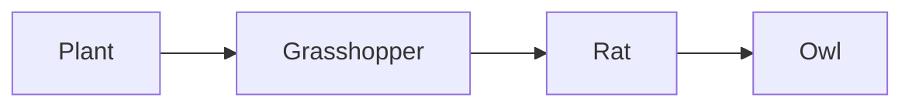
**Food chain**

> ### Activity 2.4
> 1. Observe an ecosystem near your school and identify the following:
>    - i. Producers
>    - ii. Herbivores
>    - iii. Carnivores
>    - iv. Omnivores
> 2. Make a food chain using the identified components.

## Links of Food Chain
A food chain consists of three links.
1. In any food chain the first living thing is a producer (for example plant and algae).
2. The second main link is the herbivore animals for example rat, zebra and goat.
3. The third main link is carnivores for example lion, fox and snake.

### Activity 2.5
Label the following food chains using the terms producers, herbivores, carnivores and omnivores:

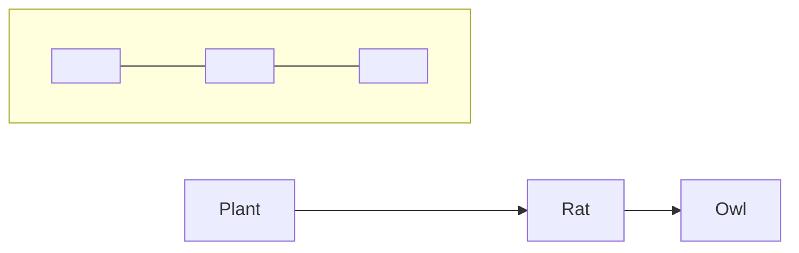
(Note: The diagram above represents the first food chain: Plant $\rightarrow$ Rat $\rightarrow$ Owl, with empty boxes for labeling below each.)

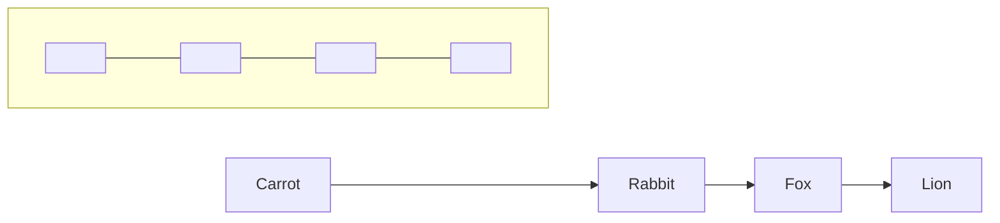
(Note: The diagram above represents the second food chain: Carrot $\rightarrow$ Rabbit $\rightarrow$ Fox $\rightarrow$ Lion, with empty boxes for labeling below each.)

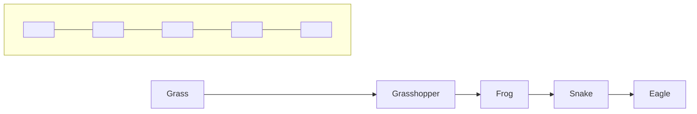
(Note: The diagram above represents the third food chain: Grass $\rightarrow$ Grasshopper $\rightarrow$ Frog $\rightarrow$ Snake $\rightarrow$ Eagle, with empty boxes for labeling below each.)

### Predator- Prey Relationship
An animal which eats another living thing by hunting and killing is called a predator. For example, lions, tigers, sharks and lizards. The living thing which is hunted, killed and eaten by a predator is called a prey. For example zebras, deers, rats and fish. The interaction between predator and prey is called predation. For example, deer is killed and eaten by lion. Here, lion is the predator and deer is its prey. Similarly, goat is predator and grass is its prey.

The image shows a lion standing over a carcass it has hunted in a grassy field.
**Predation**

## Competition among Organisms

All the organisms living in an ecosystem depend on the resources which are available in that area. Every area can provide food and place to a limited number of living things. The limited resources in an ecosystem compel the living things to compete for food and place. For example, in the grassland all the herbivores compete for grass.

The image shows two deer-like animals fighting or competing in a grassland setting.
**Competition**

> ### Point to Ponder!
> The animals which live in grassland must be very alert and fast runners to survive. Why?

## Impacts of Human Actions on Food Chain in an Ecosystem

In the ancient times, human actions had little impact on their environment. Now a days, there are numerous visible impacts of human beings on the environment. With the increase in the population, humans established cities. For this purpose, they cut forests, build roads and factories. These actions polluted the environment and water resources. Human beings did serious damage to the ecosystem of the land and oceans. The cutting of forests destroyed the habitats of wildlife. Human beings also started unnecessary hunting of animals. Because of all such activities of human beings, several wild organisms have become extinct and many others have become endangered.

## Role of Human to Save the Ecosystem

Human beings have done serious damage to the environment, but now they are trying to save the ecosystem as well. Some steps that are being taken to save the ecosystem are as follows:

1. Wildlife parks have been made to save the habitats of living things, e.g., Margalla National Park in Islamabad.
2. Tree plantation is being done and artificial forests are being created to provide the natural habitat to living things.
3. Environmental awareness campaign has been organized to save the environment and habitats of living things.

The image shows a globe surrounded by green plants, flowers, butterflies, and a bee, representing a healthy ecosystem.
**Ecosystem**

> ### Do you know?
>
> **World Earth Day:** This day is celebrated all over the world on the 22nd April to promote environmental protection. On this day, in Pakistan lights are switched off from 8 pm to 9 pm every year.
>
> **Plantation Day:** Plantation day can be observed everyday but in the schools across Pakistan, it is celebrated in August as 'tree plantation week'.
>
> Children are shown planting saplings in the soil.
> **Tree plantation**

## Key Points

1. The abiotic and biotic components of any environment form the ecosystem.
2. The living things which prepare their own food are called producers.
3. The living things which cannot prepare their own food are called consumers.
4. Any activity that may affect any component of an ecosystem may make it unbalanced.
5. The animals which eat plants are called herbivores.
6. The animals which eat other animals are called carnivores.
7. The animals which eat plants and other animals are called omnivores.
8. Every food chain begins at a producer and ends at an animal.
9. The animal which eats by killing other living things is called predator.
10. An organism that is killed and eaten by a predator is called prey.
11. The relationship between prey and predator is called predation.
12. An area can provide food and place to a limited number of organisms.
13. At present, human beings have great impact on environment.
14. Human beings have caused serious damage to the environment but they are also trying to save it.
15. Ecosystems are saved by creating the wildlife parks and tree plantation for the protection of habitat of living things.

**Weblinks:** Use the following weblinks to enhance your knowledge about the topics in this chapter.

<table>
  <tbody>
    <tr>
        <td>1.</td>
        <td>Habitats of animals</td>
        <td>https://kids.nationalgeographic.com/explore/nature/habitats/</td>
    </tr>
    <tr>
        <td>2.</td>
        <td>Food chain</td>
        <td>https://www.nationalgeographic.org/encyclopedia/food-chain/</td>
    </tr>
    <tr>
        <td>3.</td>
        <td>Relationships of living things in the ecosystem</td>
        <td>https://www.nationalgeographic.org/activity/ecological-relationships/</td>
    </tr>
  </tbody>
</table>

# Exercises

### 1. Tick ( ✓ ) the correct answer.
i. What is an ecosystem?
(a) System of non-living things is an environment.
(b) Area having a group of living and dead things.
(c) System of living things in an environment.
(d) The collection of abiotic and biotic components in an area.

ii. All the biotic components are:
(a) animals
(b) producers
(c) living things
(d) non-living things

iii. Food chain:
(a) begins with producer
(b) begins with consumer
(c) begins with decomposer
(d) ends with producer

iv. For the conservation of ecosystem:
(a) forests are being cut
(b) roads are being built
(c) tree plantation is being done
(d) factories are being installed

v. If insecticides are used for controlling the population of insects, the population of birds will:
(a) increase
(b) decrease
(c) decrease first then will increase later
(d) increase first, then will decrease later

### 2. Write short answers.
i. Define environment.
ii. Write the names of three biotic components of an ecosystem.
iii. Write the names of three abiotic components of an ecosystem.

iv. Draw a simple food chain.
v. If the food resources increase, what will be the effect on the population of predators?
vi. Write two human activities which are affecting the ecosystem.

### 3. Constructed Response Questions:
What is the relationship between biodiversity and competition among living things in a balanced ecosystem?

### 4. Investigate:
The ostriches are the tallest and heaviest birds, but they cannot fly. In order to escape from their predator, they fight with their strong claws or runaway with a speed of 70 kilometer per hour. The light brown coloured females lay eggs and sit on them at the day time. The black coloured male warms the eggs at night.

a) Why does female ostrich warm eggs at day time?
b) Why does male ostrich warm eggs at night?

The first image shows a light brown female ostrich sitting on several large white eggs in a sandy, scrubby environment.
**Female ostrich**

The second image shows a black male ostrich sitting on several large white eggs in a similar sandy, scrubby environment.
**Male ostrich**

## 5. Project:

Make an ecosystem model using abiotic and biotic components of ecosystem.

For this project, you will need at least two bottles.

i. Cut the bottles as shown in the picture. Pour some water in the first bottle to show aquatic ecosystem. Put soil and a small plant in the second bottle to show land ecosystem,.
ii. Now connect ecosystems of both the bottles (connect soil with water with a thick thread) so that the plant may receive water and minerals.
iii. Observe it daily and write a report of the results.

The following diagram illustrates the steps for creating the ecosystem model:

1.  **Preparation:** Two plastic bottles are shown. Arrows indicate where to "Cut" the bottles—one near the top and one near the bottom.
2.  **Assembly:** The top half of one bottle (containing soil and a plant) is inverted and placed into the bottom half of another bottle (containing water).
3.  **Components:**
    *   **Plant:** Growing in the top section.
    *   **Soil:** Filling the top section around the plant roots.
    *   **Thick thread:** Running from the soil down through the bottle cap/opening into the water below.
    *   **Water:** Filling the bottom section of the model.

# Chapter 03
# Human Health

The image shows several young men playing football on a green grass field. They are wearing athletic uniforms (jerseys and shorts).

* Why we do exercise?
* What is the importance of pure water?
* What kind of food should we eat to stay healthy?

## Students' Learning Outcomes

**After studying this chapter, the students will be able to:**

1. Observe and recognize some common symptoms of illness (e.g., fever, coughing and flu).
2. Differentiate between contagious diseases (hepatitis, TB, flue and non-contagious (cancer, diabetes).
3. Relate the transfer of common communicable diseases (e.g., touching, sneezing, and coughing) to human contact.
4. Explain some methods of preventing common diseases and their transmission (e.g., vaccination, washing hands, wearing mask).
5. Describe the importance of maintaining good health.
6. Recognize everyday behaviours that promote good health (e.g., a balanced diet, drinking clean water, exercising regularly, brushing teeth, getting enough sleep).
7. Define balanced diet and explain its components.
8. Identify common food sources included in a balanced diet (e.g., fruits, vegetables, grains, milk and meat group).
9. Understand the value of clean drinking water and inquire about the factors that generally make it unclean.
10. Explore a few ways that can help make water clean and suitable for drinking water (water filtration and boiling).

# Symptoms, Transmission and Prevention of Communicable Diseases

Health is a great gift of Almighty Allah. We realize the importance of health when we are sick. There may be many causes of a disease, for example germs, scarcity of food and air pollution etc. It is important to observe the symptoms of a disease to diagnose. Have you ever observed fever, cough and flue?

The human body temperature is $98.6^{\circ}\text{F}$ or $37^{\circ}\text{C}$. If our body temperature rises from this limit it is called fever. Cough is an instant response of our body. It is due to the soreness and scratchiness of the throat.

> ### Do you know?
> 1. Fever is not a disease but a symptom of disease.
> 2. The human body temperature is measured by a thermometer.
> 3. The body temperature of humans is usually measured in Fahrenheit degrees, which is written as $^{\circ}\text{F}$. It can also be measured in Celsius which is written as $^{\circ}\text{C}$
> 4. The coughing removes obstruction of windpipe, such as mucus of windpipe.
> 5. The viruses and bacteria present in the nose are expelled out due to sneezing.
> 6. Flu is a disease as well as symptom of many diseases.

<table>
  <thead>
    <tr>
        <th>A baby being checked for fever with a thermometer</th>
        <th>A woman sneezing into a tissue due to flu</th>
        <th>A man coughing into his hand</th>
    </tr>
  </thead>
  <tbody>
    <tr>
        <td>Fever</td>
        <td>Flu</td>
        <td>Coughing</td>
    </tr>
  </tbody>
</table>

## Contagious Disease

If any of your classfellows has flu then usually the teacher advises him to take rest at home. Why does the teacher say this? The teacher advises because the other children may not get flu. Flu is a disease which is transmitted from one person to another.

A disease which can be transmitted from one person to another is called contagious disease. Flu, polio, TB, hepatitis and COVID-19 etc., are the examples of contagious diseases. The flu patient complains about congested or runny nose and headache.

Polio is caused by a particular type of germ called virus. This virus settles in the throat and intestine of human being. It paralyzes the legs permanently. There is no treatment of this disease. Polio virus is transmitted through food, water and air.

Tuberculosis (TB) is caused by a particular type of germ called bacteria. It usually affects the lungs. TB, flu and COVID-19 are transmitted from one person to another through coughing, sneezing, use of articles of the affected person and conversation.

The inflammatory condition of the liver is called hepatitis. The germs of this disease are transmitted through polluted water, food or blood.

[The image shows a young boy using crutches to walk.]
A polio patient

> ### Interesting Information
> The cause of COVID-19 is a virus, which is called corona virus. It affects the entire body including lungs. In 2019-2020 this virus has affected the entire world and due to which millions of people died. It is transmitted from one person to another through social contacts and respiration.

## Non-Contagious Disease
Non-Contagious disease is not transmitted from one person to another. For example, diabetes and cancer.

In diabetes the sugar level in the blood increases. The common symptoms of diabetes are excessive thirst and hunger, urination, fatigue and weight loss. It affects the several organs such as heart, kidneys and eyes etc.

Cancer can attack any part of the body e.g., liver, stomach, intestine and blood. In cancer, there is uncontrolled increase in the number of cells in the affected organ. It may remain confined to any particular organ or may spread in the whole body.

> ### Interesting Information
> For the treatment of cancer there are hospitals in many cities of Pakistan. Kiran (Karachi), Nori (Islamabad), Shaukat Khanum Memorial Hospital (Lahore, Peshawar, Karachi), Inmol (Lahore), Baitulskoon (Karachi) are major hospitals of Pakistan.
>
> <table>
  <thead>
    <tr>
        <th>&gt;</th>
        <th>Inmol</th>
        <th>Shaukat Khanum Memorial Hospital</th>
        <th>Baitulskoon</th>
    </tr>
  </thead>
  <tbody>
    <tr>
        <td>&gt; [The image shows the exterior of Inmol hospital building.]</td>
        <td>[The image shows the exterior of Shaukat Khanum Memorial Hospital building.]</td>
        <td>[The image shows the exterior of Baitulskoon hospital building.]</td>
        <td></td>
    </tr>
    <tr>
        <td>&gt;</td>
        <td colspan="3"></td>
    </tr>
  </tbody>
</table>

# Prevention of Contagious Diseases

Washing hands, wearing mask and vaccination, are some of the ways to remain safe from contagious diseases.

## Washing Hands

We should wash our hands throughly for at least 20 seconds with soap before and after meals. We should also wash hands after using the toilet.

### Seven Steps for Hand Wash

<table>
  <thead>
    <tr>
        <th>Image Description</th>
        <th>Instruction</th>
        <th>Image Description</th>
        <th>Instruction</th>
    </tr>
  </thead>
  <tbody>
    <tr>
        <td>Hands rubbing together palm to palm.</td>
        <td>1. Rub hands palm to palm.</td>
        <td>One hand rubbing the back of the other hand.</td>
        <td>2. Rub the back of both hands.</td>
    </tr>
    <tr>
        <td>Hands with fingers interlaced, rubbing palms together.</td>
        <td>3. Palm to palm with the finger interlock.</td>
        <td>Fingers of one hand interlocked with the other, rubbing against the opposing palm.</td>
        <td>4. Back of fingers to opposing palm, with interlocked fingers.</td>
    </tr>
    <tr>
        <td>One hand grasping and rotating around the thumb of the other hand.</td>
        <td>5. Rub thumb in a rotating manner followed by the area between index finger and thumb. Repeat for both the thumbs.</td>
        <td>Finger tips of one hand rubbing in the palm of the other hand.</td>
        <td>6. Rub the finger tips into palm of your opposite hand. Repeat for both hands</td>
    </tr>
    <tr>
        <td>One hand grasping and rotating around the wrist of the other hand.</td>
        <td>7. Rub both wrists in a rotating manner, rinse and dry thoroughly.</td>
        <td rowspan="2">**Do you know?**  Global hand washing day is celebrated on 15th October every year.</td>
        <td rowspan="2"></td>
    </tr>
  </tbody>
</table>

## Wearing Mask

Do you know about a mask as a protection against COVID-19? What are the benefits of wearing a mask? Mask is a protective barrier between your nose, mouth and environment. It does not allow germs to enter the body through the nose and mouth. Do you know the proper way to wear the mask? Do not wear a used mask. Dispose off the use mask in a proper way.

The image shows a series of illustrations titled "Proper way to put on mask":
1. An illustration showing a person with arms crossed, indicating a "no" or incorrect action, next to icons of germs.
2. Steps 1 through 4 showing a person correctly handling and placing a mask over their nose and mouth.

## Vaccination

Do you know about vaccination? In vaccination the weak or dead germs of a disease are injected into the body. The antibodies are produced against the weak or killed germs in the blood. These antibodies remain in the body to fight the germs. Polio is a dangerous disease, which may cause lifelong disability.

Government of Pakistan has launched a campaign, to administer polio drops for prevention of this disease. Polio drops should be administered to the children up to the age of five years. Have you been given polio drops?

The image shows two scenes under the caption "Vaccination":
- On the left, a healthcare worker is administering an injection to a young child held by a woman.
- On the right, a healthcare worker is administering oral polio drops to a child.

> ### Do you know?
> **National Cleanliness Day:** Cleanliness day is observed on 30th January. This day creates awareness among people to keep their home, workplace, road and public places clean.

# Ways of Maintaining Good Health

What should we do for maintaining a good health? We can maintain good health by following few basic ways, for example:

1. **Balanced diet:** This means that we should take all types of food (milk, cereals, meat, vegetables and fruits) in a proper quantity.
2. **Drinking clean water:** It is necessary to drink clean water for good health. Most of the diseases are caused by drinking polluted water.
3. **Exercise:** One must exercise regularly to remain fit, e.g., walking, running and playing.
4. **Brushing teeth:** Brush your teeth twice a day, once in the morning after getting up and at night before going to sleep.
5. **Getting enough sleep:** It is necessary to have sound and complete sleep, as it improves quality of life and health. Children must sleep for at least 8 to 10 hours daily.

> ### Activity 3.1
> Make a list of ways to live a healthy life. Make a weekly chart and mark it, with what you have practiced?

> ### Point to Ponder!
> If you do not sleep at night, how will you feel in the morning?

# Balance Diet and its Components

> ### Activity 3.2
> Prepare a list of food items that you take. For example, rice, bread, vegetables, meat, fruits etc. Out of these, which food do you take the most? Which food do you take least? Can you remain healthy if you take only one type of food?

We take various types of foods. For example grains, milk, and meat. The food has been divided into four groups:

1. **Dairy group:** It includes milk and things made of milk such as butter, cheese and yogurt etc.
2. **Grain group:** It includes wheat, rice, barley, pearl millet, maize and pulses etc.
3. **Protein group:** It includes beef, mutton, fish, chicken, and eggs etc.

4. **Fruit and Vegetable group:** It includes fruits such as apple, orange, banana, mango, grapes, papaya etc., and vegetables such as lady finger(okra), turnip, radish, carrot, cabbage, and potatoes etc.

<table>
  <thead>
    <tr>
        <th>Dairy group</th>
        <th>Grain group</th>
    </tr>
  </thead>
  <tbody>
    <tr>
        <td>An image showing various dairy products including milk bottles, cheese, yogurt, and butter.</td>
        <td>An image showing various grain products including bread, buns, pasta, and cereals.</td>
    </tr>
    <tr>
        <th>Protein group</th>
        <th>Fruit and vegetable group</th>
    </tr>
    <tr>
        <td>An image showing various protein sources including chicken, fish, meat, eggs, and nuts.</td>
        <td>An image showing various fruits and vegetables including tomatoes, oranges, peppers, grapes, and carrots.</td>
    </tr>
    <tr>
        <td colspan="2">Four food groups</td>
    </tr>
  </tbody>
</table>

It is necessary for us to take proper quantity of food from different food groups to fulfil the needs of our body. We can strengthen our defense (immune) system by maintaining a balanced diet. A strong immune system helps to stay healthy and energetic. The need of food components for each person varies. A diet that contains different kinds of food in proper quantities to fulfil the need of the body is called a balanced diet.

<table>
  <tbody>
    <tr>
        <td>An image of a plate divided into sections showing a variety of foods from all food groups (vegetables</td>
        <td>fruits</td>
        <td>grains</td>
        <td>proteins</td>
        <td>and dairy) in balanced proportions.</td>
    </tr>
    <tr>
        <td>Balanced diet</td>
        <td colspan="4"></td>
    </tr>
  </tbody>
</table>

### Interesting information
Minerals such as calcium, iron, sodium, chlorine, fluorine, and iodine etc., are very important for our growth. These are found in vegetables, fruits, meat and dry fruits etc. Calcium is found in milk, yogurt etc.

### Point to Ponder!
The height of children increases rapidly in the early age. What type of food they should take more at this age?

### Activity 3.3
1. Design a menu for your lunch box. Give reasons; why were these food items chosen?
2. Prepare a list of food items necessary to be eaten for better health.

## Value of Clean Drinking Water

### Activity 3.4
Pour clean water in two glasses. Put a little soil in one glass and stir it. The water of the glass will become turbid. If you are asked from which of the two glasses you would like to drink water? What will be your answer? Give reason for your choice.

The image shows two glasses: one filled with clear, transparent water and the other filled with brown, turbid water containing soil.

Clean water is necessary because water is life. Sixty percent of human body consists of water. Blood circulates in the body and provides oxygen and food to every part of the body due to water. Germs are present in the polluted water. Drinking polluted water may cause diseases like cholera, typhoid and hepatitis. Clean water is essential for a healthy life.

### Do you know?
**World Water Day:** Every year on 22nd March global water day is celebrated. The purpose of celebrating this day is to provide awareness among the people to avoid wastage of water.

## Causes of Water Pollution
Air consists of various gases, dirt and particles. All of these mix with the rainwater. Such rain water reaches in ponds, canals, rivers and lakes, etc. and makes them polluted. The poisonous water coming from homes, factories, insecticides, fertilizers and garbage is also polluting water.

### Making water clean and safe for drinking
There are many ways to make water clean and suitable for drinking.

#### Boiling
Keep on heating water in a pot till it reaches boiling point. Then let it boil for another 5 to 10 minutes. Due to this, the germs present in water will be killed. This is the easiest way to clean water.

The image shows a pot of water on a stove with steam rising from it, captioned "Boiling water".

#### Filtration
Have you ever seen making of tea? When the tea is passed through a sieve then it filters the tea leaves. Tea is collected in the cup without tea leaves. Water is also passed through the filter for cleaning in the similar way. The particles present in water cannot pass through pores of the filter and we get clean water. The process by which the particles present in water are separated by a filter is called filtration.

The first diagram illustrates "The process of filtration" using laboratory equipment:
*   A hand pours liquid into a **Funnel**.
*   Inside the funnel is **Filter paper** which catches **Particles**.
*   The funnel sits in a **Flask**.
*   The liquid at the bottom of the flask is labeled **Water obtained**.

The second image shows a "Simple filtration plant", which is a multi-stage domestic water purification system with three vertical filter canisters.

> **Point to Ponder!**
>
> Does the filtration process kill the germs is present in water?

# Key Points

1. The human body temperature is $98.6^{\circ}\text{F}$ or $37^{\circ}\text{C}$. If the temperature of our body increases above this temperature it is called fever.
2. Fever also occurs during flu and infection.
3. The diseases transmitted from one person to another are called contagious diseases, TB, Polio, Hepatitis and COVID-19 etc., are some examples of these.
4. Preventive measures that can be taken to avoid contagious diseases are washing hands, wearing mask and getting vaccinated.
5. Vaccination improves immunity of the body. The process of vaccination is done by administrating weak or killed germs through drops or injection.
6. The diet having proper proportion of food components from each group is called a balanced diet.
7. Balanced diet, drinking clean water, exercise, brushing teeth, having sound and deep sleep are necessary for good health.
8. Food has been divided into four groups i.e., milk, grain, meat, fruits and vegetables.
9. There are germs in polluted water which cause various diseases.
10. Boiling of water and filtration are the two methods of cleaning water.

**Weblinks:** Use the following weblinks to enhance your knowledge about the topics in this chapter.

<table>
  <tbody>
    <tr>
        <td>1.</td>
        <td>Germs</td>
        <td>https://www.nationalgeographic.org/media/infectious-agents/</td>
    </tr>
    <tr>
        <td>2.</td>
        <td>Food</td>
        <td>https://www.nationalgeographic.org/article/food/</td>
    </tr>
    <tr>
        <td>3.</td>
        <td>Filtration</td>
        <td>https://kids.nationalgeographic.com/explore/books/how-things-?work/water-wonders/</td>
    </tr>
  </tbody>
</table>

# Exercises

### 1. Tick (✓) the correct answer.

i. If our body temperature increases from 98.6°F to 101°F then its cause is:
(a) hot weather
(b) fever
(c) sitting in the sun
(d) sitting near fire

ii. Which of the following has the highest amount of Calcium?
(a) meat
(b) rice
(c) milk
(d) pulse

iii. If you have flu, what you will do to keep others safe from infection?
(a) will exercise
(b) will sleep for more time
(c) will sit in the sun
(d) will wear mask

iv. Which one of the following causes polio?
(a) bacteria
(b) virus
(c) house fly
(d) mosquito

v. Mainly protection against contagious diseases is done by:
(a) wearing mask, washing hand, vaccination
(b) wearing mask, washing hand, sunbathing
(c) washing hands, sunbathing, sleeping more
(d) vaccination, washing hand, staying indoors

### 2. Write short answers.

i. Write any three reasons of illness.
ii. Differentiate between contagious and non-contagious diseases.
iii. How does coughing benefit the body?
iv. How does vaccination protect us from diseases?
v. What is meant by a balanced diet?

### 3. Constructed Response Questions:

Look at the picture of drinking water filtration plant for the public. Write your answer for the following questions.

The image shows a group of people, including adults and children, gathered at a public water filtration or dispensing station. Some individuals are filling containers with water.

i. What is the function of a filter?
ii. Does filtration also remove the germs?
iii. How can germs be killed in water?
iv. How can water be made safe for drinking?

### 4. Investigate:
Interview a doctor or a health worker and enquire about the principles of living a healthy life. Write the responses in the table given below.

<table>
  <thead>
    <tr>
        <th>Serial No</th>
        <th></th>
    </tr>
  </thead>
  <tbody>
    <tr>
        <td>1.</td>
        <td></td>
    </tr>
    <tr>
        <td>2.</td>
        <td></td>
    </tr>
    <tr>
        <td>3.</td>
        <td></td>
    </tr>
    <tr>
        <td>4.</td>
        <td></td>
    </tr>
    <tr>
        <td>5.</td>
        <td></td>
    </tr>
  </tbody>
</table>

### Project:
Observe the kitchen of your home and find out the factors which may cause diseases.

<table>
  <thead>
    <tr>
        <th>Serial No</th>
        <th>Factor</th>
        <th>Cause of Spreading Disease</th>
        <th>Way of Prevention</th>
    </tr>
  </thead>
  <tbody>
    <tr>
        <td>1.</td>
        <td></td>
        <td></td>
        <td></td>
    </tr>
    <tr>
        <td>2.</td>
        <td></td>
        <td></td>
        <td></td>
    </tr>
    <tr>
        <td>3.</td>
        <td></td>
        <td></td>
        <td></td>
    </tr>
    <tr>
        <td>4.</td>
        <td></td>
        <td></td>
        <td></td>
    </tr>
    <tr>
        <td>5.</td>
        <td colspan="3"></td>
    </tr>
  </tbody>
</table>

# Chapter 04
# Matter and Its Characteristics

The background of the page features a scenic landscape of a coastline with large waves crashing against rocks, snowy mountains in the distance, and trees on the right side.

*   Do you know the name of few metals?
*   What is the external appearance of metals?
*   Why does ice float on water?

## Students' Learning Outcomes

**After studying this chapter, the students will be able to:**

1.  Describe matter and its states.
2.  Describe characteristics of each state of matter with examples.
3.  Compare and sort objects and materials on the basis of physical properties (e.g., mass, volume, states of matter, ability to float or sink in water).
4.  Explore the properties of metals (i.e., appearance, texture, colour density).
5.  Identify properties of metal (conducting heat and electricity) and relate these properties to use of metals (i.e., a copper electric wire, an iron cooking pot).

Observe the pictures given below. What are the objects shown in the pictures made up of? Do all of these objects have mass and occupy space?

<table>
  <thead>
    <tr>
        <th>A computer set</th>
        <th>A badminton racket</th>
        <th>A table tennis paddle</th>
        <th>An analog clock</th>
    </tr>
  </thead>
  <tbody>
    <tr>
        <td colspan="4">Various objects</td>
    </tr>
  </tbody>
</table>

> Everything which has mass and occupies space is called matter.

## States of Matter and its Characteristics
Matter exists in three states i.e., solid, liquid and gas.

<table>
  <thead>
    <tr>
        <th>A brick</th>
        <th>Water being poured into a glass</th>
        <th>Steam rising from a pot</th>
    </tr>
  </thead>
  <tbody>
    <tr>
        <td>Solid</td>
        <td>Liquid</td>
        <td>Gas</td>
    </tr>
    <tr>
        <td colspan="3">Three states of matter</td>
    </tr>
  </tbody>
</table>

### Properties of Matter
Now we will study the properties of solid, liquid and gas.

#### Solid
Press your book, table, pen or chair. Have these things become smaller on pressing? Many things do not become smaller on pressing. Their volume does not change. Such things are called solids.

> Solids have definite shape and volume.

#### Liquid
> **Activity 4.1**
>
> Pour water in three vessels having different shapes. What have you observed? Is the shape of water in these vessels same or different? When a liquid is poured in any vessel, then it gets the shape of that vessel. It means the shape of the liquid changes. There is no definite shape of liquid.
>
> (The image shows a glass, a conical flask, and a pitcher of different shapes and sizes.)

### Activity 4.2
Take a cup of water and pour it into a glass. Observe whether the volume of water is same which was in the cup. Does it become less or more? Remember that water changes its shape but its volume remains definite.

> Liquids have definite volume but their shape is not definite

### Gas

### Activity 4.3
Take three balloons of different shapes. Inflate all the balloons. Observe the shape of the balloons. Is the shape of all balloons same? What do you conclude from this activity?

The image shows three inflated balloons of different shapes and colors: a pink heart-shaped balloon, a blue round balloon, and a red round balloon.

Air is the combination of various gases. Gas has no definite shape and volume. Gas spread throughout the available space. Gas are not visible to us. We can feel the fragrance or odour of the gas. For example we can smell the fragrance of a flower. Can gas be pressed? Press an inflated balloon.

> Gases have neither a fixed shape nor definite volume.

The image shows a pair of hands pressing down on a blue inflated balloon.
**Pressing a balloon**

### Point to Ponder!
Why does an inflated balloon burst when placed in the sunshine?

## Classification of Objects on the Basis of Physical Properties
Objects are classified on the basis of their physical properties. These include mass, volume, temperature, ability to conduct heat or electricity, ability to float or sink in water.

## Mass

### Activity 4.4

Tie a balloon not inflated at one end of the wooden rod. Tie an inflated balloon at the other end of the wooden rod as shown in the picture. Which end of the wooden rod tilts down and why?

The image shows a simple balance scale made of a wooden rod. On one side, a deflated blue balloon is tied. On the other side, an inflated blue balloon is tied. The side with the inflated balloon is tilted downwards.

> Amount of matter in an object is called mass.

### Do you know?

1. The mass of a matter never changes in any condition.
2. Mass is measured in gram or kilogram. 1 Kilogram = 1000 grams

## Volume

### Activity 4.5

1. Observe the objects given below.
2. Which object has occupied more space?

<table>
  <thead>
    <tr>
        <th>Football</th>
        <th>Book</th>
        <th>Pen</th>
        <th>Glass</th>
    </tr>
  </thead>
  <tbody>
    <tr>
        <td>An image of a black and white soccer ball.</td>
        <td>An image of a closed black book.</td>
        <td>An image of a black fountain pen.</td>
        <td>An image of a glass half-filled with water.</td>
    </tr>
  </tbody>
</table>

> Space that an object occupies is called its volume.

## States of Matter and Arrangement of Particles

All the matters consist of very tiny particles. The arrangement of particles in solid, liquid and gas is different.

## Arrangement of Particles in Solids

In solids the particles are strongly attached with one another. These particles have strong forces of attraction. The particles vibrate but do not change their fixed position. Solids cannot be easily pressed. Solids maintain their definite shape and volume.

The image shows a grid of green circles tightly packed in rows and columns, representing the arrangement of particles in a solid.
**Arrangement of particles in solid**

### Activity 4.6

Put a piece of wood in a cloth bag. Make a small hole at the bottom of the bag. Try to take out the wooden piece out of this hole, but it will not come out. Why? The shape of the solid will remain same and wooden piece would not come out of the hole.

The image shows a wooden block inside a white plastic bag.

## Arrangement of Particles in Liquid

Liquid particles are close to one another. The force of attraction among them is weaker than that in solids. The particles keep on colliding with one another. They can also move near or far from one another and thus liquids can flow.

The volume of liquids is definite, but their shape is not definite. The liquid takes the shape of the vessel in which it is poured. We have done this in activity 4.2.

The image shows green circles packed closely but randomly, representing the arrangement of particles in a liquid.
**Arrangement of particles in liquid**

### Activity 4.7

1. Pour water in a transparent plastic bag. Tie a knot at the top of the bag. Now make a hole at bottom of the plastic bag. Observe what happens?
   The water flows out of the hole. Because of weak forces of attraction among the particles of liquids, they can flow fast. That's why the shape of liquid is not definite.
2. Press a soft plastic bottle filled with water. Write your observation.

The image shows a hand holding a tied plastic bag filled with water, with water leaking out from a hole at the bottom.

## Arrangement of Particles in Gas

The particles in gas are at more distance from one another. They move fast because of weak forces of attraction. The gas particles can move freely in all directions, to occupy all the available space. That's why, gases have no definite shape and volume.

The image shows a square container with green circular particles spread far apart and randomly distributed.
**Arrangement of particles in gas**

### Activity 4.8

Take a piece of ice in a beaker or in any pot. Heat it. You will see that the solid ice changes into water. Heat it more. Keep a steel plate in an inclined way over the beaker.

The water will change into vapours i.e., gas. Vapours will gather at the steel plate. After becoming cool it can be collected drop by drop in a cup. Now, if you put this water in a freezer, after a few hours it can be changed into solid ice.

What conclusion have you made from this activity? Write your observations.

The diagram illustrates the experiment:
- A burner is heating a beaker of boiling water.
- Steam (vapours) rises from the beaker.
- An inclined steel plate is positioned above the beaker.
- Water droplets condense on the plate and fall into a bowl.

## Ability to conduct heat and electricity

### Activity 4.9

Put a few objects such as steel spoon, plastic scale, pencil etc., in a glass or beaker as shown in the picture. Pour some warm water into the beaker. Wait for 1-2 minutes. Touch the outer end of these objects. Write your observation, in the following table.

<table>
  <thead>
    <tr>
        <th>Objects</th>
        <th></th>
        <th>Form of Matter</th>
        <th></th>
        <th>End is hot or not</th>
        <th></th>
    </tr>
  </thead>
  <tbody>
    <tr>
        <td>Steel spoon</td>
        <td>Metal</td>
        <td></td>
        <td colspan="3"></td>
    </tr>
    <tr>
        <td>Plastic scale</td>
        <td>Plastic</td>
        <td></td>
        <td colspan="3"></td>
    </tr>
    <tr>
        <td>Pencil</td>
        <td>Wood</td>
        <td colspan="4"></td>
    </tr>
  </tbody>
</table>

The image shows a glass beaker containing warm water with a steel spoon, a plastic ruler, and a pencil placed inside it.

The objects that allow heat or electricity to pass through are called conductors of heat. For example, iron, copper, etc. The objects that do not allow heat or electricity to pass through are called non-conductors of heat. For example, wood, rubber etc.

## Ability of Matter to Float or Sink

### Activity 4.10
Take water in a glass or pot as shown in the given picture. Put various things in it. For example, rubber, pencil, piece of paper, wooden piece etc. Observe, what happens.
1. Write the names of objects which float in water.
2. Write the names of objects which sink in water.

[The image shows a rectangular glass container filled with water. Inside, various objects are shown: a rubber duck, a piece of paper, and a wooden piece are floating on the surface. A pencil, a spoon, and some marbles are sunk at the bottom.]

## Physical Properties of Metals

### Activity 4.11
Make a list of objects present in your home which are made of metals. Observe their properties. There are many objects around us which are made of metals for example ornaments, knives, spoons and cooking utensils.

Metal is a specific type of matter having the following properties:

### Appearance of Metals
All the metals are shiny.

<table>
  <thead>
    <tr>
        <th></th>
        <th colspan="3">Appearance of metals</th>
    </tr>
  </thead>
  <tbody>
    <tr>
        <td>[The image shows golden spoons and a knife]</td>
        <td>[The image shows golden bangles]</td>
        <td>[The image shows a silver ring]</td>
        <td></td>
    </tr>
  </tbody>
</table>

### Texture of Metals
The metals are usually solid. Some metals are hard and strong e.g., iron. That's why these are used to make various tools and machines. Some metals are soft such as gold, silver and copper. Due to this property these are used to make foil sheets and wires.

<table>
  <tbody>
    <tr>
        <td rowspan="4">[The image shows a bundle of copper wires]</td>
        <td>[The image shows a coil of gold wire]</td>
    </tr>
    <tr>
        <td>Gold</td>
    </tr>
    <tr>
        <td>[The image shows a coil of aluminum wire]</td>
    </tr>
    <tr>
        <td>Aluminum</td>
    </tr>
    <tr>
        <td colspan="2">Copper   Texture of metals</td>
    </tr>
  </tbody>
</table>

> ### For your information
> Silver foils are used in beautification of sweets. Aluminum foil is used to cover cooked food and other things.

The image shows sweets decorated with silver coating and a roll of aluminum foil.
*   **Silver coating** (Sweets with silver foil)
*   **Aluminum** (Roll of aluminum foil)

### Colour of Metals
Metals have various colours. Gold is yellow. Copper is red, Silver is white. Tin and Nickel are light pink. Zinc, Chromium and Aluminum are light blue in colour. Most of the metals are grey in colour.

<table>
  <thead>
    <tr>
        <th>Chromiun</th>
        <th>Aluminum</th>
        <th>Zinc</th>
    </tr>
  </thead>
  <tbody>
    <tr>
        <td>The image shows a cylindrical piece of Chromium.</td>
        <td>The image shows a stack of Aluminum rods.</td>
        <td>The image shows a flat sheet of Zinc.</td>
    </tr>
    <tr>
        <td colspan="3">Colour of metals</td>
    </tr>
  </tbody>
</table>

### Density of Metals
Look at the given picture. The volume of both the objects is same, but why one is at a more height?

Two objects having equal volume may have different masses. You have seen in activity 4.10 that some objects float on water and some sink in water. What is the reason?

The floating and sinking of objects depends on their density. The objects having less density than that of water, float on water. The objects that have more density than the density of water sink in it.

The image shows a balance scale with two cubes of equal volume. The cube on the left is lower (labeled "High density") and the cube on the right is higher (labeled "Low density").
*   **High density** (Lower side of the scale)
*   **Low density** (Higher side of the scale)
*   **Density** (Label for the diagram)

> The mass present in a definite volume is called its density.

The metals usually have more density. If you tap any metal you can hear the resonance of the metal. This is due to its density.

> ### Activity 4.12
>
> Put a brick on one pan of the balance and a bigger piece of foam on the other pan. Which pan will tilt and why?
>
> [The image shows a balance scale with a small, dense rectangular block (brick) on the left pan and a larger, less dense triangular prism (foam) on the right pan. The scale is tilted towards the left pan containing the brick.]

> ### Do you know?
>
> 1. On the basis of density, metals are called heavy metals (zinc, mercury, chromium etc.) and light metals (magnesium, aluminum and titanium etc.).
> 2. Some metals have magnetic properties and attracted by a magnet. Have you ever observed what metals are attracted to a magnet?

### Metal as Conductor

Metals such as copper, aluminum and silver allow electricity to pass through them. These metals are good conductors of electricity. These types of metals are used to make electric wires. Metals are also good conductors of heat such as iron, copper and aluminum etc. That's why, the metals are used in making cooking utensils.

<table>
  <tbody>
    <tr>
        <td>[The image shows four panels illustrating uses of metals: a steel pot, a collection of aluminum bowls, a coil of aluminum wire, and a coil of copper wire.]</td>
        <td colspan="3"></td>
    </tr>
    <tr>
        <td>Steel utensil</td>
        <td>Aluminum utensils</td>
        <td>Aluminum wire</td>
        <td>Copper wire</td>
    </tr>
    <tr>
        <td colspan="4">Uses of metals</td>
    </tr>
  </tbody>
</table>

# Key Points

1. Matter occurs in three states i.e., solid, liquid and gas.
2. Solid has definite shape and volume.
3. Liquid has definite volume but does not have definite shape.
4. Gas has no definite shape and no definite volume.
5. The space that an object occupies is called its volume.
6. The quantity of matter in any object is called its mass.
7. All the matters consist of very tiny particles.
8. In solid, the particles are strongly attached with one another.
9. The particles of liquid are near to one another. The forces of attraction among them are weaker than solids.
10. The particles in gas are at more distance from one another. They move fast because of weak forces of attraction.
11. The objects that allow heat or electricity to pass through them are called conductors of heat. The objects that do not allow heat to pass through them are called non-conductors of heat.
12. All the metals are shiny.
13. Usually the metals are solid and hard.
14. The metals which are good conductors of electricity are used to make electric wires. The metals which are good conductors of heat are used to make cooking utensils.

**Weblinks:** Use the following weblinks to enhance your knowledge about the topics in this chapter.

<table>
  <tbody>
    <tr>
        <td>1.</td>
        <td>Matter</td>
        <td>https://www.nationalgeographic.org/video/definitions-field-matter/</td>
    </tr>
    <tr>
        <td>2.</td>
        <td>Factors for the change of state of matters.</td>
        <td>https://www.youtube.com/watch?v=ydBcvY20mkc</td>
    </tr>
  </tbody>
</table>

# Exercises

1. **Tick ($\checkmark$) the correct answer.**
   i. Which one of these has the most volume?
      (a) book
      (b) pencil
      (c) scale
      (d) cricket bat

   ii. Which one of these groups is the correct example of the three states of matter?
       (a) snow, rain, cloud
       (b) dew, rain, water vapours
       (c) snow, cloud, steam
       (d) rain, water vapours, cloud

   iii. Put two spoons made of steel and wood in a cup of hot water. After few minutes the steel spoon becomes hot whereas the wooden spoon does not become hot. What does it show?
        (a) The steel became hot soon in the presence of wood.
        (b) Metal is a better conductor of heat than wood.
        (c) Wood is a better conductor of heat than metal.
        (d) Metal heats the water quickly than wood.

   iv. A piece of ice has been put into a glass of water. Which picture is showing the correct position of the ice?

The image shows four glasses of water labeled A, B, C, and D, each containing a single ice cube at different depths:
- **A**: The ice cube is at the very bottom of the glass.
- **B**: The ice cube is suspended in the middle of the water.
- **C**: The ice cube is floating near the top but fully submerged.
- **D**: The ice cube is floating at the surface with a portion above the water line.

   v. Water, ice and steam all have different temperatures. What is the order from coldest to hottest?
      (a) steam, ice, water
      (b) ice, steam, water
      (c) steam, water, ice
      (d) ice, water, steam

vi. Study the following table.

<table>
  <thead>
    <tr>
        <th>Properties of matter No.1</th>
        <th>Properties of matter No.2</th>
    </tr>
  </thead>
  <tbody>
    <tr>
        <td>a. Transmits heat quickly</td>
        <td>a. Transmits heat slowly</td>
    </tr>
    <tr>
        <td>b. Solid</td>
        <td>b. Solid</td>
    </tr>
    <tr>
        <td>c. Does not dissolve in water</td>
        <td>c. Dissolves in water</td>
    </tr>
  </tbody>
</table>

According to the above table which statement is correct about matter No.1 and matter No.2?
(a) Matter No. 1 is glass and matter No.2 is soil.
(b) Matter No.1 is copper and matter No. 2 is wood.
(c) Matter No. 1 is iron and matter No.2 is sugar.
(d) Matter No.1 is cork and matter No.2 is gold.

**2. Write short answers**
i- Define matter and write the name of its three states.
ii- Write the differences between solids and liquids.
iii- Which state of matter has lowest density?
iv- Write the arrangement of particles in solid.
v- Why are the cooking utensils made up of metals?

**3. Constructed Response Question:**
i- Why do the electricians wear rubber gloves while repairing electric switchboard?

**4. Investigate:**
i- Why is metal used in making the bell?
ii- Why are metals preferred for making ornaments?

**5. Project:**
Collect five things made up of metals. Observe them and write their

<table>
  <thead>
    <tr>
        <th>Serial No.</th>
        <th>Metal</th>
        <th>Appearance</th>
        <th>Texture</th>
        <th>Colour</th>
    </tr>
  </thead>
  <tbody>
    <tr>
        <td>1.</td>
        <td></td>
        <td></td>
        <td></td>
        <td></td>
    </tr>
    <tr>
        <td>2.</td>
        <td></td>
        <td></td>
        <td></td>
        <td></td>
    </tr>
    <tr>
        <td>3.</td>
        <td></td>
        <td></td>
        <td></td>
        <td></td>
    </tr>
    <tr>
        <td>4.</td>
        <td></td>
        <td></td>
        <td></td>
        <td></td>
    </tr>
    <tr>
        <td>5.</td>
        <td colspan="4"></td>
    </tr>
  </tbody>
</table>

# Chapter 5
# Forms of Energy and Energy Transfer

The image shows a large-scale renewable energy farm featuring rows of solar panels in the foreground and several wind turbines in the background under a blue sky with scattered clouds.

*   **Why should we use energy sources in a responsible manner?**
*   **What is the basic source of energy on Earth?**
*   **Why do motor vehicles need fuel?**

## Students' Learning Outcomes
**After studying this chapter, the students will be able to:**

1.  Identify sources of energy (e.g., the Sun, flowing water, wind, coal, oil, gas).
2.  Recognize that energy is needed to do work (e.g. for moving objects), heating and lighting.
3.  Describe and demonstrate the transformation of energy.
4.  Understand the importance of conservation of energy.
5.  Recognize the role and responsibility of humans to conserve energy resources.
6.  Relate familiar physical phenomena (i.e., shadows, reflections, and rainbows) to the behaviour of light.
7.  Relate familiar physical phenomena (i.e., vibrating objects, echoes) to the production and behaviour of sound.
8.  Recognize that warmer objects have a higher temperature than cooler objects.
9.  Investigate the changes that occur when a hot object is brought in contact with a cold object.
10. Identify ways to measure temperature and understand its unit.
11. Describe and demonstrate that electrical energy in a circuit can be transformed into other forms of energy (e.g., heat, light, sound).
12. Explain and provide reasoning that a simple electric circuit requires a complete electrical pathway.

Energy is the ability to do work. Human beings and animals use energy for their movements. We observe energy as light in lamps, as heat in the heaters, and as sound in doorbells. Have you ever thought from where do we get energy?

The Sun is the biggest source of energy for the Earth. We see the energy of the Sun as light and feel it as heat. Among other sources of energy are flowing water, air, coal, oil, gas, and wood.

### Sources of Energy

<table>
  <tbody>
    <tr>
        <td rowspan="2">A sack of coal labeled Coal</td>
        <td rowspan="2">A large hydroelectric dam with water rushing through spillways</td>
        <td>A red jerrycan labeled OIL</td>
        <td colspan="2"></td>
    </tr>
    <tr>
        <td>Coal</td>
        <td>Fast Flowing Water</td>
        <td>Oil</td>
    </tr>
    <tr>
        <td rowspan="2">A stack of wooden logs</td>
        <td rowspan="2">[empty]</td>
        <td>A red gas cylinder labeled FLAMMABLE GAS</td>
        <td colspan="2"></td>
    </tr>
    <tr>
        <td>Wood</td>
        <td>[empty]</td>
        <td>Natural Gas</td>
    </tr>
  </tbody>
</table>

Let's look at different sources of energy.

**Mini Exercise:** Answer the following questions:

<table>
  <tbody>
    <tr>
        <td>An illustration of a sailboat on the water.</td>
        <td>An illustration of two small green plants growing from soil.</td>
        <td>An illustration of a person pushing a wheelbarrow.</td>
    </tr>
    <tr>
        <td>Which energy does the sail-boat use?</td>
        <td>From where do plants get energy for growth?</td>
        <td>From where do we get energy to do work?</td>
    </tr>
    <tr>
        <td>An illustration of water flowing through a dam at night with lights.</td>
        <td>An illustration of a red public transit bus.</td>
        <td>An illustration of a ceiling fan in a room.</td>
    </tr>
    <tr>
        <td>How can we get energy from water?</td>
        <td>From where do the vehicles get energy?</td>
        <td>Which energy runs a fan?</td>
    </tr>
  </tbody>
</table>

## Transformation of Energy

One form of energy can be transformed into another form. For example, one of the ways of generating electricity is through fast-flowing water. This process is called hydroelectricity. When the river water stored in a high dam, lake is released downwards, it runs very fast through tunnels which have turbines in them. The fast-running water turns the turbines at high speed and the generators connected to the turbines produce electricity.

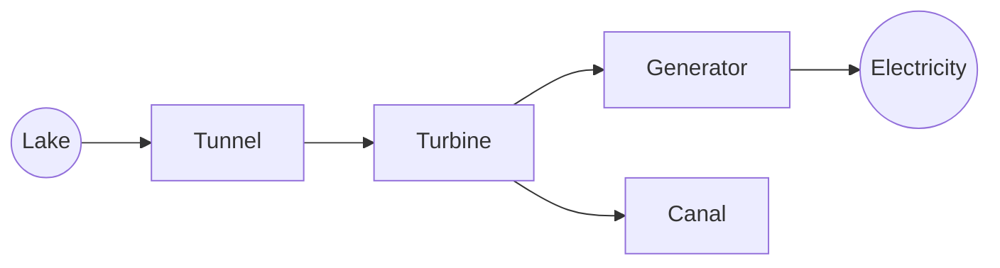
**Hydroelectric Dam**

<table>
    <tr>
        <th>Let's Think!</th>
        <th>Info Box</th>
    </tr>
    <tr>
        <td>Which energy is changed into hydroelectricity?</td>
        <td>The world consumes as much energy in 1 second as we can use in a car for 156 years. It means that within a blink of an eye, the world consumes an energy equal to 322,000 litres of petrol.</td>
    </tr>
</table>In a thermal power station, coal, oil or gas is burned to change water into steam. This steam is used to run turbines and the turbines run generators to produce electricity.

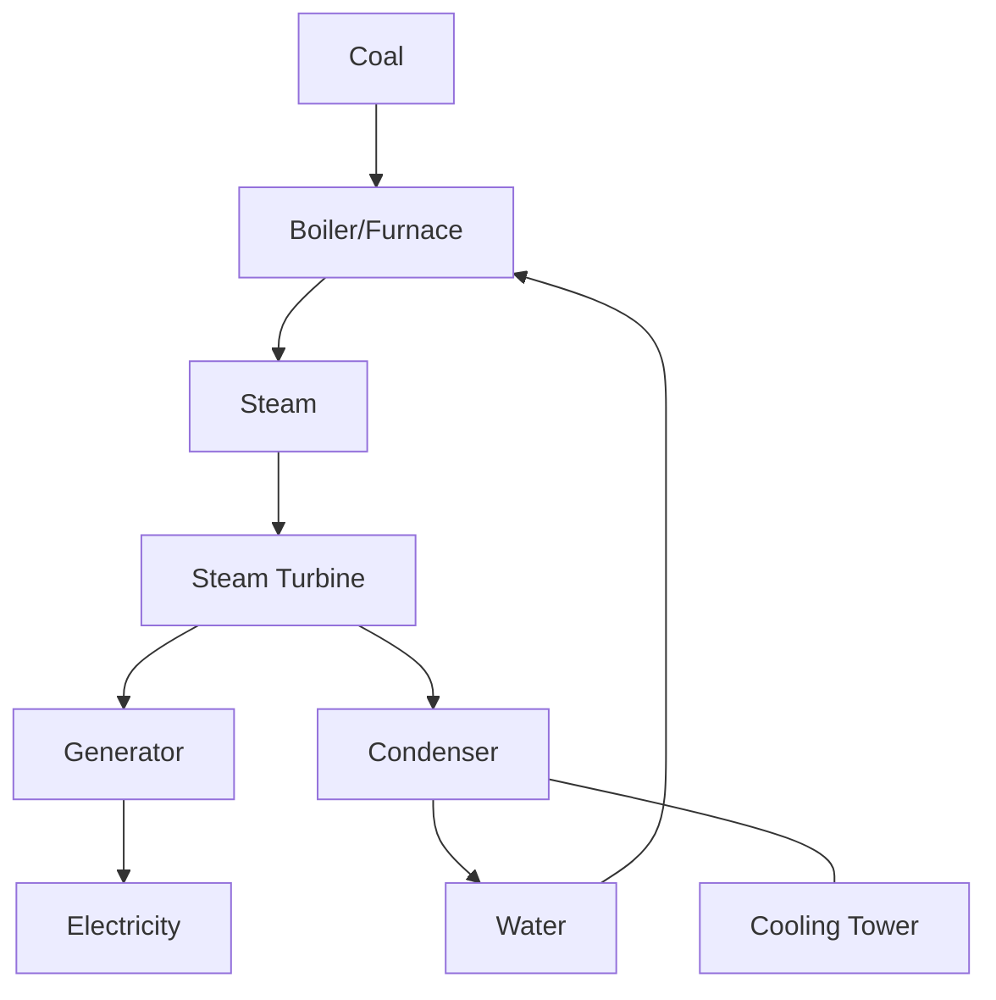
**Thermal Power Station**

<table>
    <tr>
        <th>Assignment</th>
        <th>Do you know?</th>
    </tr>
    <tr>
        <td>Make a chart to show the transformations of energy in a thermal power station. &lt;br/&gt;&lt;br/&gt; [Image: A thermal power station with cooling towers emitting steam.]</td>
        <td>Windmills produce electricity from the fast wind energy. &lt;br/&gt;&lt;br/&gt; [Image: A row of wind turbines in a field.]</td>
    </tr>
</table>## Conservation of Energy
Sources of energy like coal, oil and gas are limited resources on Earth. We are unable to increase the amounts of these, because they were made in millions of years. However, we can save these resources by consuming them carefully. As our population increases, the limited energy sources cannot support us to fulfil our needs endlessly. We have to keep a balance between the facilities we need for a comfortable life and the limited supply of energy. This is why, we also need to create awareness among people for using the existing energy sources wisely. We should also explore clean and renewable sources of energy so that not only we but also the next generations do not face energy shortage.

## Light
Light is a form of energy that helps us to see the things around us. The Sun, stars, and lightning are some of the natural sources of light. Candle, oil lamp, torchlight and electric bulb are some of the artificial sources of light. When light leaves its source, it travels in all directions in straight lines and it can pass through some objects. When light cannot pass through an object, a shadow of that object is formed behind it.

---

**Demonstration of Light Properties:**

<table>
    <tr>
        <th>Light passing through glass</th>
        <th>Light blocked by an object forming a shadow</th>
    </tr>
    <tr>
        <td>[Diagram: A torch shining a beam of light through a transparent glass pane. The beam continues on the other side.] &lt;br/&gt; **Torch** &lt;br/&gt; **Glass**</td>
        <td>[Diagram: A torch shining a beam of light at a toy figure. The light is blocked by the toy, and a shadow of the toy is cast onto a screen behind it.] &lt;br/&gt; **Torch** &lt;br/&gt; **Ray of light** &lt;br/&gt; **toy**</td>
    </tr>
</table>

### Activity 5.1

1. Light a candle or lamp in a dark room.
2. Put your hand between the lamp and the wall.
3. What do you see on the wall?
4. Is the shadow on the wall looks like your hand?
5. Bring your hand near the lamp. Does the size of the shadow change?

The image shows a hand held in front of a light source, casting a larger shadow of the hand onto a wall.

### Reflection of Light

In the morning, you usually see your image in the mirror. Can you see your image in dark? When light strikes the shiny and smooth surface of a mirror, it bounces back and enters our eye. In this way, we can see our image in the mirror. This is called the reflection of light.

The image shows a young girl looking at her reflection in a mirror.

### Rainbow

### Activity 5.2

Prism is a three-faced transparent object, which divides light into different colours.

1. Use a pencil to make a narrow hole in a cardboard sheet.
2. Place this cardboard in the sunlight to get a narrow ray of light.
3. Place a prism in front of this ray of light. Rotate the prism slowly until you see the sunlight divided into different colours on the screen.

The image shows a white beam of light passing through a glass prism and dispersing into a spectrum of rainbow colours (red, orange, yellow, green, blue, indigo, and violet).

There are seven colours in sunlight (red, orange, yellow, green, blue, indigo, violet). After rain, some drops of water are suspended in the air. When sunlight passes through water droplets, they divide it into seven colours like a prism. This is called rainbow.

The image shows a real rainbow appearing in the sky over a landscape with trees and people.

## Sound Energy

Sound is the form of energy that is produced by vibration in an object. These vibrations reach our ears through the particles of the air. In this way, we hear sounds.

> ### Activity 5.3
> 1. Shake the school bell strongly.
> 2. Do you hear any sound?
> 3. Touch the bell with your finger. Do you feel vibrations?
> 4. What is produced from the vibrations of this metal object (bell)?
>
> [The image shows a golden school bell.]

Vibrating objects produce sounds. Sound needs some medium to travel. Most of the sounds reach us by travelling through air.

<table>
    <tr>
        <th>Do you know?</th>
        <th>Info Box</th>
    </tr>
    <tr>
        <td>When we speak, our vocal cords in the throat vibrate and produce sounds.</td>
        <td>Sound cannot travel in space. This is why we cannot hear the sounds of the explosions in the Sun.</td>
    </tr>
</table>Sound is also reflected similarly as light. When sound bounces back from an object at a certain distance and we hear it again, it is called an echo.

> ### Info Box
> Bats use echoes to catch their preys in darkness. They emit sounds from their mouth and by sensing the echoes, they find their way in darkness to reach their preys.
>
> [The image shows a bat flying with its wings spread.]

<table>
    <tr>
        <th>Do you know?</th>
        <th>Do you know?</th>
    </tr>
    <tr>
        <td>A hard and smooth object reflects sound better.</td>
        <td>To hear a clear echo, the reflecting surface should be at least 17 metres away from the source of sound.</td>
    </tr>
</table>

# Heat

Heat is a form of energy that always travels from a hot object to a cold object. We use the term "temperature" to measure the hotness or coldness of an object. The temperature of an object shows how much hot or cold that object is. The instrument used to measure temperature is called thermometer.

> ### Let's Think!
> Why do we wait for a hot drink to get it cool down a bit before drinking it while we can readily drink a cold drink without waiting for it to get warmer?

The image shows two thermometers side-by-side, one in Centigrade (°C) and one in Fahrenheit (°F), with labels for their parts.

<table>
    <tr>
        <th>Centigrade (°C)</th>
        <th>Fahrenheit (°F)</th>
        <th>Parts Labelled</th>
    </tr>
    <tr>
        <td>100</td>
        <td>220</td>
        <td>Glass Tube</td>
    </tr>
    <tr>
        <td>90</td>
        <td>200</td>
        <td></td>
    </tr>
    <tr>
        <td>80</td>
        <td>180</td>
        <td>Scale</td>
    </tr>
    <tr>
        <td>70</td>
        <td>160</td>
        <td></td>
    </tr>
    <tr>
        <td>60</td>
        <td>140</td>
        <td></td>
    </tr>
    <tr>
        <td>50</td>
        <td>120</td>
        <td></td>
    </tr>
    <tr>
        <td>40</td>
        <td>100</td>
        <td></td>
    </tr>
    <tr>
        <td>30</td>
        <td>80</td>
        <td></td>
    </tr>
    <tr>
        <td>20</td>
        <td>60</td>
        <td>Mercury</td>
    </tr>
    <tr>
        <td>10</td>
        <td>40</td>
        <td></td>
    </tr>
    <tr>
        <td>0</td>
        <td>20</td>
        <td></td>
    </tr>
    <tr>
        <td>-10</td>
        <td>0</td>
        <td></td>
    </tr>
    <tr>
        <td>-20</td>
        <td>-20</td>
        <td>Bulb</td>
    </tr>
</table>**Centigrade thermometer** | **Fahrenheit thermometer**

## Thermometer and Different Units of Temperature

When the bulb of a thermometer touches a hot object, the mercury or alcohol present in its bulb expands and rises in the glass tube of thermometer. Similarly, when the bulb touches a cold object, the mercury or alcohol contracts and falls in the glass tube of thermometer.

> ### Pop Quiz
> Why does the hot tea get cold after some time?

Doctors usually measure temperature in Fahrenheit scale. Its symbol is °F. Centigrade is also a unit of temperature. Its symbol is °C. We usually use centigrade unit in weather forecast. It is also used by doctors in some countries.

## Electrical Energy

Electricity or electrical energy is produced by generators. This electricity is supplied to our homes through wires. Cells and batteries are also the sources of electrical energy. These are used in toys, torchlights, remote controls, and portable devices. We use electric energy for running many devices in our homes. Electrical energy can be transformed into other forms of energy like heat, light and sound.

<table>
  <thead>
    <tr>
        <th>In heater, the electrical energy changes into heat.</th>
        <th>In electric bulb, the electrical energy changes into light.</th>
        <th>In loudspeaker the electrical energy changes into sound.</th>
    </tr>
  </thead>
  <tbody>
    <tr>
        <td>[An image of an electric room heater.]</td>
        <td>[An image of a glowing incandescent light bulb.]</td>
        <td>[An image of a loudspeaker.]</td>
    </tr>
  </tbody>
</table>

## Simple Electric Circuit
The path of current is called an electric circuit. Let's make a simple electric circuit

### Activity 5.4
1. Fix a torch bulb in a holder.
2. Use metal wires to join the bulb with a cell or battery and the switch as shown in the diagram.
3. Turn the switch "ON". Does the bulb light up?
4. Now, turn the switch "OFF". Why does the bulb not remain lighted?

When the switch is turned "ON", the path of electric current is complete and the bulb is lighted.

**Diagram of a Simple Electric Circuit:**
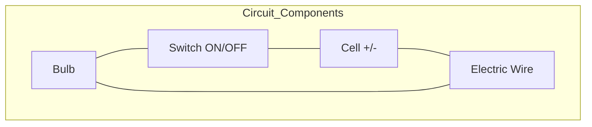

## Key Points
1. The life on Earth continues due to the transformations of one form of energy into another.
2. The natural sources of energy are limited. Therefore, we should use the energy sources responsibly.
3. The Sun is the biggest source of energy on Earth.
4. Light helps us to see things. We see shadows, images and rainbow due to light.
5. Sound is produced by vibrating objects. Echo is the sound that is heard after the sound bounces back from an object.
6. Heat is a form of energy that always travels from a hot object to a cold object.

7. The temperature of hot objects is higher than the temperature of cold objects.
8. Electrical energy can easily be transformed into other forms of energy.
9. The path of current is called an electric circuit.

**Weblinks:** Use the following weblinks to enhance your knowledge about the topics in this chapter.

<table>
  <tbody>
    <tr>
        <td>1.</td>
        <td>Circuit</td>
        <td>https://www.nationalgeographic.org/activity/circuits-friends/</td>
    </tr>
    <tr>
        <td>2.</td>
        <td>Rainbow</td>
        <td>https://www.nationalgeographic.org/encyclopedia/rainbow/</td>
    </tr>
    <tr>
        <td>3.</td>
        <td>Echo</td>
        <td>https://www.youtube.com/watch?v=K-zrBalt-38</td>
    </tr>
  </tbody>
</table>

# Exercises

### 1- Tick (✓) the correct answer.

i. Which of the following is NOT a form of energy?
(a) Light
(b) Sound
(c) Glass
(d) Heat

ii. We hear echo when sound:
(a) reaches us direct from the source.
(b) comes after bouncing back from a wall at a certain distance.
(c) comes from a loudspeaker.
(d) is very loud.

iii. How many colours are there in sunlight?
(a) 1
(b) 3
(c) 5
(d) 7

iv. If you take your hand first nearer to a lit lamp and then away from it, the shadow of your hand:
(a) will not form.
(b) will be smaller.
(c) will be larger.
(d) will be of the same size.

v. Electrical energy can be transformed into:
(a) heat.
(b) light.
(c) sound.
(d) Plastic

### 2- Write short answers.
i. Can light, sound and heat travel through vacuum?
ii. If sound cannot travel through vacuum, how do the astronauts talk with each other?
iii. How do we sense the buzzing of a mosquito?
iv. Into which two forms of energy is the electrical energy transformed in a television set?
v. When can we see rainbow? How is it formed?

### 3. Constructed Response Questions:
i. If we bring a thermometer near a lighted bulb, will the thermometer show any change in temperature?
If yes, would the temperature rise or fall? Explain.

An illustration shows a lighted light bulb hanging from a ceiling fixture and a thermometer placed horizontally below it.

ii. You are holding a glass of cold water in a room.
The temperature of different things is as follows:
Your body temperature $37\text{ °C}$
Water temperature $05\text{ °C}$
Room temperature $30\text{ °C}$
Draw arrows in the picture to show the directions of the heat flow.

An illustration shows a hand holding a glass of cold water. Labels indicate the temperatures:
*   Room temperature: $30\text{ °C}$
*   Water temperature: $05\text{ °C}$
*   Body (hand) temperature: $37\text{ °C}$

iii. Sidra has a reflector in her torchlight. Ali's torchlight has no reflector. Which torchlight will shine more light on a wall five metres away? Tick ($\checkmark$) the box for your answer.

[ ] Ali's torch
[ ] Sidra's torch

(Images of two torches are shown, one without a reflector and one with a curved reflector behind the bulb.)

### 4. Investigate:

Here is a simple electric circuit consisting a battery, a bulb and an electric wire. The electric path of the circuit has been broken and the bulb does not light up. The electric path needs to be completed so that the bulb can light up by using the electric energy of the battery. We have a cotton bud, a plastic ball pen, an ice-cream stick, a nail, a key and a pencil. Which thing or things should we connect at the ends of the wire so that the electric circuit becomes complete and the bulb lights up?

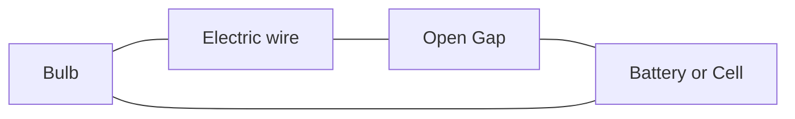

(Illustrations of various objects are shown: a metal nail, a metal key, a wooden ice-cream stick, a cotton bud, and a pencil.)

### Project:

**Let us make a telephone:**

You need the following things for this project:
* Two paper cups
* Two small pieces of twig
* String or thin wire (7 metres)
* Pencil or nail for making holes in paper cups

(A photograph shows two white paper cups connected by a string.)

(A diagram shows the assembly:)

Paper Cup --- String or wire --- Paper Cup

# Chapter 6
# Force and Motion

The image shows a red bowling ball hitting white bowling pins with red stripes, causing them to scatter.

*Why are different bodies sometimes found in a state of rest or motion?*

*If an object is thrown upwards, why does it always fall down?*

*What is the importance of gears in a mountain bicycle?*

## Students' Learning Outcomes

**After studying this chapter, the students will be able to:**

1. Describe force and motion with examples from daily life.
2. Identify gravity as a force that draws objects to Earth.
3. Investigate that friction works against the direction of motion.
4. Provide reasoning with evidence that friction can be either detrimental or useful under different circumstances.
5. Recognize that simple machines, (e.g., levers, pulleys, gears, ramps) help make motion easier (e.g., make lifting things easier, reduce the amount of force required, change the distance or change the direction of the force).

Have a look at your surroundings. You will notice some bodies are stationary and some others are moving. Can you tell how to produce motion in the bodies at rest. For example, how can a toy car be moved? When you push or pull a toy car with your hand, it causes the toy car to move.

[The image shows children interacting with a toy car: one girl is pushing it from behind, one boy is sitting inside, and another boy is pulling it from the front with a string.]

### Force

The act of pushing or pulling a body is called force. Force is used to move or stop a body. For example, we either pull a door towards us or push it away to open it.

[The image shows a man pulling a door open.]

While pushing or pulling, we apply some force on a body. When applied, a force increases or decreases the speed of a body. Force can also change the direction of motion. For example, applying force on a ball with a cricket bat changes its direction of motion.

[The image shows a cricketer hitting a ball with a bat.]

> **Do you know?**
>
> When you pick up an object, you pull it.
> When you throw an object, you push it.

> **Info Box**
>
> Applied force changes the shape of an object.

A force acting on a body can change its shape. For example, if we press an empty aluminum can it will be compressed.

> **Point to Ponder!**
>
> Can you tell where force is used in daily life?

<table>
  <tbody>
    <tr>
        <td>Empty Can</td>
        <td>Crushed Can</td>
    </tr>
    <tr>
        <td>[The image shows an upright, intact yellow aluminum can.]</td>
        <td>[The image shows a hand crushing the yellow aluminum can.]</td>
    </tr>
  </tbody>
</table>

# Activity 6.1

Which force (push or pull) must be applied to change the shapes of the following objects?

<table>
  <thead>
    <tr>
        <th>Image of a plastic water bottle</th>
        <th>Image of colorful paper clips in a jar</th>
        <th>Image of a metal spring</th>
    </tr>
  </thead>
  <tbody>
    <tr>
        <td>Plastic bottle</td>
        <td>Paper clips</td>
        <td>Spring</td>
    </tr>
    <tr>
        <th>Image of a tube of toothpaste on a wooden surface</th>
        <th>Image of colorful rubber bands</th>
        <th>Image of colorful cylinders of play dough</th>
    </tr>
    <tr>
        <td>Toothpaste</td>
        <td>Rubber bands</td>
        <td>Play dough</td>
    </tr>
  </tbody>
</table>

## Motion

You may have seen different types of swings in a park or playground. How do they move?

An illustration of a playground shows children engaged in various activities:
- Two girls playing with marbles on the grass.
- A girl on a swing set.
- A boy sliding down a slide.
- Children playing on a merry-go-round.
- Two children on a see-saw.
- A Ferris wheel and a tent in the background.
- A girl standing and holding a drink.

The seesaw moves up and down. The merry-go-round moves in a circle and the swing moves back and forth. Which kind of movement do you observe in a park.

An object (body) changes its position during the movement. For example, a seesaw is in a state of rest until children sit and apply force on it. As a result, seesaw moves up and down. Thus, a process in which a an objects changes its position is called **motion**.

The image shows two children playing on a seesaw in a park. One child is on the left side and the other is on the right side.

### Activity 6.2
Observe the objects in the picture given below and tell:
1. Which object moves up and down?
2. Which object moves back and forth?
3. Which object moves in a circle?

> ### Point to Ponder!
> The image shows two children playing on swings.
> **How do the children sitting on a swing move?**

The large illustration at the bottom of the page shows various objects in motion within a home setting:
*   A man sitting in a rocking chair reading a newspaper.
*   A baby's cradle.
*   A ceiling fan spinning.
*   A boy playing with a yo-yo.
*   A girl holding a string with a weight.
*   A grandfather clock with a swinging pendulum.

## Gravity
Look at the following pictures and tell:
1. Why do the leaves of a tree fall to the ground, after leaving the branches.
2. Why does the fountain water fall on the ground?
3. Why does a football thrown upward return to the ground after reaching a certain height?

The page shows three images side-by-side:
1. A water fountain with water spraying up and falling back into a pool.
2. A tree with orange leaves falling from its branches to the ground.
3. A person kicking a football into the air, showing its curved trajectory back to the ground.

<table>
  <tbody>
    <tr>
        <td>Fountain</td>
        <td>Falling Leaves</td>
        <td>Kicked Football</td>
    </tr>
  </tbody>
</table>

You may have noticed that whatever is thrown upward, it returns to the ground. The Earth actually pulls every object towards itself with a specific force. This force is called **the gravity of the Earth.**

### Activity 6.3
Tie a pencil to a piece of thread and hang it with something. Is gravity acting on the pencil? Now cut the thread. What do you observe? When the thread breaks, the pencil falls to the ground. Explain the reason.

The activity is illustrated with two panels:
- Left panel: A girl holding a stick with a pencil hanging from it by a thread.
- Right panel: The same girl holding the stick after the thread has been cut, showing the pencil falling towards the ground.

## Friction

You have often observed that when you kick a football, it stops after covering a certain distance. Why does it stop? Certainly, there is a force acting on football that stops it. What force is this?

Friction is the force that stops or tends to stop moving objects. Friction occurs when a body moves in contact with another body. Friction always acts against the direction of movement.

### Advantages of Friction

Friction plays very important role in our daily lives. Igniting a match stick, penetration of the nail into the wood or wall, slowing and stopping the vehicles by brakes are all possible due to friction.

An illustration shows a boy kicking a ball on a carpeted floor in a room with a chair, lamp, and picture on the wall.

Below the text, three photographs illustrate the advantages of friction:
1. A hand striking a matchstick against a matchbox, creating a flame.
2. A car on a road with black skid marks behind its tires, showing the effect of braking.
3. A nail driven into a block of wood.

<table>
  <tbody>
    <tr>
        <td>Do you know?</td>
        <td>Point to Ponder!</td>
    </tr>
    <tr>
        <td>We cannot walk on Earth without friction. If there is less friction, it becomes difficult to walk.</td>
        <td>What would happen if there was no friction?</td>
    </tr>
  </tbody>
</table>

Let's observe the role of friction in daily life:

### Activity 6.4

1. Stretch a paper sheet on a hardboard. Place a plastic sheet on another hardboard.
2. Using a pen, write your name on both of them in turns.
3. What do you observe?

It is easy to write on paper while it is difficult to write on a plastic sheet.
Discuss its reason with your classmates.

[An illustration shows a hand writing "My name is Hurrem" on a paper sheet attached to a clipboard, and another hand attempting to write on a plastic sheet attached to a clipboard.]

### Disadvantages of Friction
Friction is very useful in our daily life but sometimes it can be harmful. For example, friction generates heat and noise, and wears down things. If a car is driven non-stop downhill with frequent braking, its brakes and tyres get worn out or even burst. Walking on rough and rocky ground also wears down our shoes by friction.

> **Point to Ponder!**
>
> How can we reduce friction?

[Two images are shown: one of the soles of shoes that are heavily worn out with holes, labeled "Wear out Shoes", and another of car tires with worn-down treads, labeled "Worn over tyres".]

Similarly, friction causes wear and tear on the moving parts of machines over time. If friction is not reduced, these machines eventually break down.

> **Caution!**
>
> The worn out tyre of the vehicle must be replaced otherwise the risk of accident increases.

### Simple Machine
The use of machines in our lives is increasing day by day. What is the reason for this? Machines make our work easier by changing the amount and direction of force applied. Lever, pulley, gear, ramp (inclined plane) are some of the simple machines we use daily.

> **Do you know?**
>
> Modern machines such as cars are made up of a combination of simple machines. Each machine has to be provided energy constantly to keep it working.
>
> [Image of a complex car engine showing various gears and belts.]

## Lever
A lever is a simple machine that can be used to push or lift heavy objects. The lever is like a simple rod that turns around a certain point called fulcrum.

[The following illustrations show examples of levers in daily life:]
*   **Seesaw:** Two children playing on a seesaw. The pivot point in the middle is labeled **Fulcrum**.
*   **Scissors:** A hand using scissors to cut paper. The screw holding the blades together is labeled **Fulcrum**.
*   **Crowbar:** A person using a long rod to lift a large rock. The small stone acting as a pivot is labeled **Fulcrum**.

By applying force (effort) to one end of the lever, the weight (load) at the other end is lifted.

[Diagram of a lever system:]
*   A blue rectangular beam rests on a triangular pivot.
*   **Load:** A large rock placed on the left end of the beam.
*   **Fulcrum:** The triangular pivot point under the beam.
*   **Effort:** A downward arrow pointing to the right end of the beam.

### Activity 6.5

1. Take a ruler, a pencil and a book.
2. Place one end of the ruler under the book, as shown in the figure.
3. Place the pencil under the ruler near the book. Apply force on the other end of the ruler to lift the book.
4. What do you observe?

[The illustration shows a ruler acting as a lever. One end of the ruler is under a green book. A pencil is placed under the ruler near the book to act as a fulcrum. Labels indicate the Ruler, Book, and Pencil.]

In this activity, the pencil acts as the fulcrum while the book is the weight (load) that can be easily lifted with the help of force (effort).

> **Point to Ponder!**
>
> If we change the position of pencil (fulcrum), what will be its effect on force (effort) and weight (load)?

### Pulley

A pulley is a simple machine, consisting of a grooved wheel and a rope. The load is lifted up by applying force (effort) on one end of the rope passing over the pulley.

As pulling a weight is easier than lifting, this simple machine can easily lift heavy objects. For example, a bucket of water can be easily drawn from a well by using a pulley. A flag can be raised or lowered on a pole with the help of a pulley. When the rope is pulled down, the flag is lifted upwards.

[Diagram of a pulley system: A grooved wheel is attached to a fixed support. A rope passes over the wheel. One end of the rope is labeled "Effort" with a downward arrow, and the other end is attached to a blue box labeled "Load". The wheel itself is labeled "Pulley" and the cord is labeled "Rope".]

[Two illustrations:
1. **Flag Hoisting**: A girl is pulling a rope on a flagpole to raise a flag.
2. **Water being drawn from a well**: A boy is using a pulley system to pull a bucket of water out of a stone well.]

Changing the direction of force makes it easier to work with the pulley. For example, if we want to lift heavy objects with the help of pulley, we have to apply the effort downwards.

## Gear

Gear is a simple machine which consists of toothed wheels of different sizes. The teeth of these wheels fit in with each other and move together. With the help of gears, we can increase or decrease the speed.

In everyday life, gears of various sizes are used in bicycles, grinders and sugarcane juice machines.

The image shows a large gear wheel interlocked with a smaller gear wheel.
*   Large gear
*   Small gear

## Inclined Plane

Inclined plane is a simple machine with one end relatively higher than the other. It requires less force and energy to move objects from one place to another. It allows us to move objects easily from bottom to top and top to bottom. The following figures show different types of inclined planes.

The first image shows a metal ramp leading up to a doorway.
**Ramp/ or inclined plane**

The second image shows a worker pushing a wheelbarrow up a wooden plank inclined against a wall.
**Load Carried up on a ramp**

> ### Point to Ponder!
>
> Which simple machines are used in a bicycle?
>
> (The image shows a red bicycle with various components like wheels, pedals, and gears.)

# Key Points

1. The process of pushing or pulling of a body is called force.
2. The process in which a body changes its position is called motion.
3. The Earth pulls bodies towards itself with a specific force. This force is called gravity.
4. Friction is the force that stops or tends to stop moving objects.
5. Igniting a match stick and walking on ground are the advantages of friction while wearing-out of tyres or machine parts are the disadvantages of friction.
6. Lever, pulley, gear and inclined plane are simple machines that make our work easier.

> Web version of PCTB Textbook
> Not for Sale

**Weblinks:** Use the following weblinks to enhance your knowledge about the topics in this chapter

<table>
  <tbody>
    <tr>
        <td>1.</td>
        <td>Gravity</td>
        <td>https://www.science-sparks.com/gravity-experiments-for-kids-galileo/</td>
    </tr>
    <tr>
        <td>2.</td>
        <td>Friction</td>
        <td>https://www.australiangeographic.com.au/education-resources/2017/12/ags-friction/</td>
    </tr>
  </tbody>
</table>

# Exercises

**1- Tick (✓) on the correct answer.**

i. What is force?
(a) Push
(b) Pull
(c) Lift
(d) Push and pull

ii. When a body changes its position, it is called:
(a) friction
(b) force
(c) motion
(d) gravity

iii. All bodies are attracted towards the Earth due to:
(a) force
(b) friction
(c) gravity
(d) motion

iv. If we apply the same force on a toy car, it will travel longer on:
(a) rocky soil
(b) marble floor
(c) floor of bricks
(d) ground

v. Which machine consists of a grooved wheel?
(a) Lever
(b) Pulley
(c) Inclined plane
(d) Gear

**2- Write short answers.**

i. How force and motion are related? Explain.
ii. What is gravity? On which objects does it act?
iii. Define friction. In which direction does it act?
iv. What is a machine? How does it work for us?
v. Why cannot we walk on ice easily?

3. **Constructed Response Questions:**
    i. Look at these shoes. Which one is suitable for walking on a rocky surface? Which one would you use in the playground? Which one is for using on an icy surface? Explain the reasons in your answers.

    <table>
  <tbody>
    <tr>
        <td>[The image shows three types of footwear in a row:]</td>
        <td colspan="2"></td>
    </tr>
    <tr>
        <td>An ice skate with a metal blade on the bottom.</td>
        <td>A blue soccer cleat with studs on the sole.</td>
        <td>A tan, high-top rugged hiking or combat boot with a thick treaded sole.</td>
    </tr>
  </tbody>
</table>

    ii. This patient is sitting in a wheelchair. Which machine will be useful to take him on the stage? Why?

    <table>
  <tbody>
    <tr>
        <td rowspan="2">An illustration of a person pushing another person in a wheelchair towards a stage with stairs.</td>
        <td>An illustration of a seesaw (lever).</td>
        <td></td>
    </tr>
    <tr>
        <th>[empty cell]</th>
        <th>An illustration of an inclined plane (ramp).</th>
    </tr>
  </tbody>
</table>

## 4. Investigate:

Imagine you are writing on your notebook with a pencil. Answer the following questions based on your observation:

a) What force do you use (push or pull) while writing?
b) What is the role of friction in writing on the paper with a pencil?
c) After using a pencil, why do we need to sharpen it?

## 5. Project:

### Making a Pulley for Hoisting a Flag

Make a flagpole in the school playground with the help of a bamboo pole, an iron hanger, a small wooden reel, a rope, the flag of Pakistan, a plumb line, and some bricks. Hoist the national flag of Pakistan with this pulley.

The image shows a school building with a flagpole set up in the yard. The flagpole is made of a bamboo pole secured in the ground with bricks. At the top of the pole, an iron hanger and a wooden reel are used to create a simple pulley system. A rope passes through the pulley, and the national flag of Pakistan is attached to it. A plumb line is shown on the ground near the base of the pole to ensure it is vertical.

# Chapter 7
# Earth and its Resources

The image shows a globe of the Earth surrounded by various natural resources: logs of wood, a cart of coal, gold bars, and large green leaves.

*   *From where do oceans get water?*
*   *Dead animals decompose, but where do their skeletons kept in the museums come from?*
*   *Do living organisms in the soil breathe?*

## Students' Learning Outcomes

**After studying this chapter, the students will be able to:**

1.  Recognize that Earth's surface is made up of land and water and is surrounded by air.
2.  Recognize that water in rivers and streams flows from mountains to oceans or lakes.
3.  Identify some of Earth's natural resources (e.g., water, wind, soil, forests, oil, natural gas, minerals) that are used in everyday life.
4.  Recognize that some remains (fossils) of animals and plants that lived on the Earth a long time ago are found in rocks, soil and under the sea.
5.  Differentiate between renewable and non-renewable resources.
6.  Investigate the impact of human activities on the Earth's natural resources.
7.  Suggest the ways to conserve the natural resources.

Most of us get the items we require such as grocery, clothes and other appliances etc. We hardly think from where their basic material come? How many of us know that all basic materials we get are obtained from land, sea, or air. Hence, they are called natural resources.

There is no substitute for natural resources. If people do not use them responsibly, there is a risk that they will be finished soon.

<table>
  <tbody>
    <tr>
        <td>Point to Ponder!</td>
        <td>Info Box</td>
    </tr>
    <tr>
        <td>What will happen if natural resources run out?</td>
        <td>Only 11% of the land worldwide is cultivated.</td>
    </tr>
  </tbody>
</table>

## Earth and its Physical Characteristics

If you look at the globe of the Earth, you will see that the areas in blue represent water and the areas in green or khaki represent land. Almost 71% of the Earth's surface is water and the remaining 29% is land. Although we are unable to see air, it surrounds us everywhere on the Earth. Even soil and water have air in them!

The image shows a physical globe of the Earth on a stand, illustrating the distribution of land and water.
**Globe**

> ### Activity 7.1
> 1. Take a plastic bottle and make a small hole on its lid with the help of a hot nail.
> 2. Similarly, make another hole in the bottom of the bottle.
> 3. Fix a small piece of paper on the lid of the bottle with the help of an adhesive tape or glue. One end of paper should stick to the surface of the lid while the other end should remain free.
> 4. Fix the mouth of the balloon on the lid of the bottle.
> 5. Press the bottle repeatedly.
> 
> What do you observe?
>
> The image shows a green plastic bottle with a purple balloon attached to its lid, demonstrating the experiment.

Air entered the bottle through the hole and inflated the balloon. This shows that air is present everywhere around us.

## Distribution of Water on Earth's Surface

About 97% of the water present on Earth is in the oceans. The remaining 3% is present in glaciers, rivers, streams and lakes. Rainwater is added in rivers and streams. From there, the water flows to lakes and oceans. The snow falling on mountains also melts and becomes water. This water also flows to rivers and streams and finally falls into the lakes and oceans.

An illustration shows the water cycle on Earth, featuring mountains with snow, rain falling from clouds, a river flowing into a lake, and the ocean.
**Water on Earth**

## Earth's Resources

The Earth is rich in many resources including water, air, soil, forests, coal, oil, natural gas and minerals. We use natural resources to make different things. The properties of natural resources make them useful for a variety of purposes. For example, clay is used to make bricks and pottery while sand is commonly used to construct buildings and make glass.

> ### Do you know?
>
> The pencil in your geometry box is made from the wood of a tree and the rubber is obtained from the secretion of a rubber tree.
>
> An image shows a wooden pencil and a blue and red eraser.

Let us understand some important natural resources and their importance in daily life:

### Water

All living things need water to survive. We use water for drinking, cooking and washing clothes and dishes. Water is also very important for plants and crops. Running water is also used to generate electricity.

An image shows a glass of clear water.
**Drinking Water**

An image shows a person using a hose to water garden plants.
**Water sprinkling on plants**

### Activity 7.2
Take a glass and put some soil in it. Afterwards, slowly add some water to the soil and shake it for a while. Air bubbles start coming out of the soil. This proves that there is air in the soil.

### Air
Air is vital for the survival of life on Earth. Air is present everywhere on the Earth's surface as well as in soil and water. Due to this, living beings can breathe inside soil and water. Fast-blowing air is also used for generating electricity using wind mill.

<table>
  <thead>
    <tr>
        <th>Wind Mill</th>
        <th>Fish inside Water</th>
    </tr>
  </thead>
  <tbody>
    <tr>
        <td>An image showing wind turbines (wind mills) in a field with power lines.</td>
        <td>An image showing a fish in water with air bubbles rising to the surface.</td>
    </tr>
  </tbody>
</table>

### Soil
Soil is the outer layer of the Earth which contains water, air, fertile matter and gravel. Soil provides essential nutrients to plants for growth. It also provides shelter to many organisms. It is also used to make bricks, glass and utensils.

> ### Info Box
> World Soil Day is celebrated on December 5 every year.

<table>
  <thead>
    <tr>
        <th>Plant Growth</th>
        <th>Pot Making</th>
    </tr>
  </thead>
  <tbody>
    <tr>
        <td>An image showing green plants growing in a field.</td>
        <td>An image showing hands shaping a clay pot on a potter's wheel.</td>
    </tr>
  </tbody>
</table>

### Forest
The part of the Earth that is completely covered with trees is called a forest. Forests not only provide us timber but are also natural habitats for animals. They also provide us fresh and oxygenated air.

> ### Do you know?
> Forests cover 5.2% of the total area of Pakistan. One of the largest natural forest of Pakistan is located at Ziarat in Balochistan province.

[thead]Forest
An image showing a dense evergreen forest on a mountainside.

## Natural Oil

Found underground, crude oil is a major source of energy worldwide. Once extracted, this oil is processed in refineries to produce fuel for cars and other means of transport. It is also used for generating electricity.

The image shows fuel pump nozzles labeled "Petrol" and "Diesel".

> ### Point to Ponder!
> Which natural resources are used to generate electricity?

> ### Info Box
> Among the by-products of the crude oil are kerosene, petrol, diesel, engine oil, grease, petroleum jelly and tarcoal.

## Natural Gas

Natural gas is extracted from the Earth. It is used for generating electricity, producing fertilizers, and as a fuel for cooking and heating in homes.

The image shows a gas stove burner with a blue flame.

> ### Pop Quiz
> What is the difference between charcoal and mineral coal?

> ### Info Box
> The second largest mine of natural salt in the world is located at Khewra (Pind Dadan Khan) in Pakistan.

## Minerals

The solid non-living chemicals present in the Earth are called minerals. They are obtained by digging the Earth. Gold, silver, copper, iron and salt are some of such minerals. They are used to make many items such as wires, coins, jewellery and utensils. Mineral coal is also an important natural resource that is used as a fuel.

The following images represent different minerals:
- A stack of gold bars (Gold)
- A pile of dark grey metallic rocks (Iron)
- Large pinkish-white salt crystals and a small jar of refined salt (Salt)

<table>
  <tbody>
    <tr>
        <td>Gold</td>
        <td>Iron</td>
        <td>Salt</td>
    </tr>
  </tbody>
</table>

### Activity 7.3

Which minerals are used to make the items shown in the following pictures?

<table>
  <thead>
    <tr>
        <th>Image Description</th>
        <th>Mineral Name (Blank)</th>
    </tr>
  </thead>
  <tbody>
    <tr>
        <td>A gold ring</td>
        <td>[ ]</td>
    </tr>
    <tr>
        <td>Copper pots and pans</td>
        <td>[ ]</td>
    </tr>
    <tr>
        <td>An iron hand pump</td>
        <td>[ ]</td>
    </tr>
    <tr>
        <td>A salt lamp carved like an elephant</td>
        <td>[ ]</td>
    </tr>
    <tr>
        <td>Copper electrical wires</td>
        <td>[ ]</td>
    </tr>
    <tr>
        <td>Ceramic pottery (plates and cups)</td>
        <td>[ ]</td>
    </tr>
  </tbody>
</table>

### Fossils

Have you ever noticed that when you walk on soft sand or wet soil, you leave your footprints on the surface. Can these marks be preserved forever? Let's learn this through an activity:

The image shows a series of footprints left in soft sand.
**Foot Print**

### Activity 7.4

1. Prepare a mixture in a pot by adding water into one part cement and two parts sand.
2. Now level the surface of this mixture.
3. Stamp your footprint on it and leave it for a week.

You will notice that the mixture in the pot has become solid and turned into stone. Your footprint is also preserved in it.

The images show:
1. A person pouring a cement and sand mixture into a round container.
2. A finished solid block with a footprint impression in the center.

Thousands of years ago, many huge animals lived in this world. When they died, their imprints were trapped under rock and soil layers, which are called fossils.

The following images show examples of fossils:
- A fossilized skull of a dinosaur.
- A fossilized skeleton of a small animal.
- An imprint of a dragonfly in rock.
**Fossils**

<table>
    <tr>
        <th>Info Box</th>
        <th>Do you know?</th>
    </tr>
    <tr>
        <td>Dinosaurs were lizard-like giant animals which lived on the Earth millions of years ago, but are now extinct.</td>
        <td>The skeletons of many extinct animals have been preserved in soil layers and rocks. Paleontologists explore and unearth these fossils.</td>
    </tr>
    <tr>
        <td>An illustration of a raptor-like dinosaur.</td>
        <td>A photograph of a dinosaur skeleton on display.</td>
    </tr>
</table>### Activity 7.5

1. Take a cardboard or plastic disposable glass. Fill it half with wet soil.
2. Press a small plastic toy, coin or oyster (sea-shell) into this soil to make a mark.
3. Now put a quarter of Plaster of Paris in another glass and mix it with water to make a thin mixture.
4. Pour this mixture over the mark in the first glass.
5. Now leave this glass for two to three days so that it dries.
6. Once dry, cut the glass and remove the fossil present inside. Use a brush to remove the soil present on fossil.
7. Now compare your fossil with the imprint that you have made in the soil.

The following images demonstrate the steps of the activity:
- Pressing an object into wet soil.
- Removing the object to leave an imprint.
- Mixing Plaster of Paris in a cup.
- The imprint in the soil before pouring the mixture.
- Pouring the Plaster of Paris mixture into the cup with the soil imprint.

## Non-Renewable Resources

Some natural resources such as coal, petrol, diesel and natural gas take millions of years to form. Such limited resources are called non-renewable resources. Once they are used, they cannot be replaced easily.

<table>
  <thead>
    <tr>
        <th>Natural Gas</th>
        <th>Coal</th>
        <th>Petrol</th>
    </tr>
  </thead>
  <tbody>
    <tr>
        <td>An image of a gas stove with blue flames.</td>
        <td>An image of burning coal.</td>
        <td>An image of a petrol pump nozzle.</td>
    </tr>
  </tbody>
</table>

## Renewable Resources

The natural resources which can be replaced after use are called renewable resources. Air, water, soil, forests and solar energy are renewable resources. Some of these resources are also used as fuel alternates.

<table>
  <thead>
    <tr>
        <th>Solar Energy</th>
        <th>Wind Energy</th>
        <th>Energy of Flowing Water</th>
    </tr>
  </thead>
  <tbody>
    <tr>
        <td>An image of solar panels in a field.</td>
        <td>An image of wind turbines on a grassy hill.</td>
        <td>An image of water flowing through a dam.</td>
    </tr>
  </tbody>
</table>

## Effect of Human Activities on Natural Resources

The irresponsible use of natural resources cause serious and sometimes irreparable damage to our environment.

Growing population, excessive use of fossil fuels and deforestation mainly and rapidly reduce land resources. Due to this, people worldwide face problems such as climate change, pollution and lack of clean drinking water.

If we do not use natural resources responsibly, a time will come when renewable resources like trees, animals, soil water, and air will run out or become unusable. This is why, responsible use of natural resources and preservation of environment are highly essential for the survival of life on Earth.

<table>
    <tr>
        <th>Tree Cutting</th>
        <th>Burning Gas</th>
        <th>Dying Fish</th>
    </tr>
    <tr>
        <td>A forest area with many cut tree stumps.</td>
        <td>An industrial factory with a tall chimney emitting white smoke.</td>
        <td>Dead fish lying on a polluted or dried-up riverbed.</td>
    </tr>
</table>## Conservation of Natural Resources

All living beings depend on natural resources to survive. No matter whether we live in city or village, we need air to breathe, clean water to drink and food to eat. Nature provides us all these things. Everyone can contribute to the conservation of natural resources.

**We should:**

1. Plant trees on a large scale. Trees not only provide oxygen but are also natural habitats for many animals.
2. Recycle paper, plastic, glass and other materials instead of throwing them away. Recycling saves natural resources by reusing such items.
3. Use renewable resources such as wind, water and solar energy to generate electricity.
4. Protect air, water and land from pollution.
5. Use water and electricity responsibly.

<table>
    <tr>
        <th>Tree Plantation</th>
        <th>Save Water</th>
        <th>Recycling</th>
    </tr>
    <tr>
        <td>Hands planting a small sapling in the soil.</td>
        <td>A hand turning off a tap dripping into a bowl of water.</td>
        <td>A green recycling bin with the text "PLEASE RECYCLE" and the recycling symbol.</td>
    </tr>
</table>

# Key Points

1. The Earth's surface consists of land and water which is surrounded by air.
2. About 71% of the Earth's surface is water and the remaining 29% is land.
3. When water falls from the sky as rain, it joins the rivers and streams that flow towards lakes and oceans.
4. The Earth is rich in many resources including water, air, soil, forests, oil, natural gas and minerals.
5. The imprints or remains of dead organisms are called fossils.
6. Some natural resources such as coal, petrol, diesel and natural gas take millions of years to form. Such limited resources are called non-renewable resources.
7. Natural resources that can be regained after their use are called renewable resources.
8. People's irresponsible use of natural resources is causing serious and occasionally irreparable damage to Earth's environment.
9. Recycling saves natural resources by making things reusable.

**Weblinks:** Use the following weblinks to enhance your knowledge about the topics in this chapter.

<table>
  <tbody>
    <tr>
        <td>1.</td>
        <td>Minerals and Gems</td>
        <td>https://www.nationalgeographic.com/science/earth/inside-the-earth/minerals-gems/</td>
    </tr>
    <tr>
        <td>2.</td>
        <td>Conservation of Water Resources</td>
        <td>https://www.nationalgeographic.com/environment/freshwater/water-conservation-tips/</td>
    </tr>
  </tbody>
</table>

# Exercises

**1- Tick (✓) the correct answer.**

i. Glass is made from:
(a) soil.
(b) sand.
(c) salt.
(d) rubber.

ii. About what percentage of the Earth's surface is land?
(a) 1 percent
(b) 21 percent
(c) 29 percent
(d) 30 percent

iii. The solid non-living chemicals present in the Earth are:
(a) soil.
(b) minerals.
(c) stones.
(d) fossils.

iv. To make things reusable is called:
(a) recycling.
(b) conservation of resources.
(c) care.
(d) cycling.

v. An example of non-renewable resources is:
(a) oil.
(b) soil.
(c) air.
(d) solar energy.

**2- Write short answers.**

i. What are fossils? About which organisms do they provide information?
ii. Why are forests called renewable resources?
iii. How does water reach oceans and lakes?
iv. Describe any two advantages and disadvantages of deforestation.
v. Differentiate between renewable and non-renewable resources.

### 3. Constructed Response Questions:

i. We found the skulls of various animals during an excavation. How do we know about their feed?

The image shows two different animal skulls:
- On the left is a Triceratops-like skull with three horns and a large bony frill.
- On the right is a long, narrow skull of a carnivorous dinosaur (like a Spinosaurus or similar theropod) with sharp teeth.

ii. Jellyfish is a soft invertebrate. Can we obtain a fossil of jellyfish?

### 4. Investigate:

i. Is there anything that is not made from natural resources?
ii. Water is a renewable resource. There should be plenty of water for every human being on the Earth but why is it not so?
iii. Is it possible that we have more resources than those of the past?

### 5. Project:

Make a model of the flow of water from a glacier to the sea by using materials like chipboard, clay, soil, sand, water, lime, green and blue crayons, toy carts, and pebbles.

The image shows a 3D model illustration of a landscape featuring:
- Snow-capped mountains (glaciers) at the top.
- Rivers flowing down from the mountains through a forested valley.
- A small lake in the middle of the valley.
- Agricultural fields or settlements near the lower part of the river.
- The river emptying into a blue body of water (the sea) at the base of the model.

# Chapter 8
# Earth's Weather and Climate

The background image shows a dramatic sky with a bright sun, a rainbow, and a lightning strike over a dark, stormy cloud.

*   How does the weather change?
*   Why is climate different at different locations worldwide?
*   Why do hilly areas become spots of recreation during summer?

## Students' Learning Outcomes
**After studying this chapter, the students will be able to:**
1. Understand the difference between weather and climate.
2. Relate that weather changes with changing geographical location.
3. Recognize that average temperature and precipitation can change with seasons and location.

Sometime weather around us change suddenly. It may also continue the same for many days. It is sometimes sunny or rainy and sometimes hot or cold. Various factors including sunlight, air pressure, wind speed, and clouds play important roles in the change of weather.

## Weather and Climate

The daily condition of the environment or atmosphere of a location is called its weather. The duration of weather may be one or more days. Weather is described in terms of temperature, humidity in air, precipitation (rain or snow), clouds and winds of that particular location.

> ### Do you know?
> Annual rotation of the Earth around the Sun and the tilt of the Earth on its axis are responsible for changes in the weather.

The following images illustrate different weather conditions:
- **Rain**: People walking in a flooded street with vehicles.
- **Intensive sun (summer)**: Sunlight reflecting off water with vegetation in the background.
- **Storm**: Dark clouds and palm trees swaying in heavy wind and rain.

Is your region hot or cold? Climate is the general and long-lasting weather conditions in a region on Earth.

> ### Do you know?
> Meteorology is the study of weather conditions. The experts who work in this field are called meteorologists.

### Difference between Weather and Climate

<table>
  <thead>
    <tr>
        <th>Weather</th>
        <th>Climate</th>
    </tr>
  </thead>
  <tbody>
    <tr>
        <td>Short duration conditions of an environment</td>
        <td>Average long duration conditions of weather</td>
    </tr>
    <tr>
        <td>For example; Yesterday, the weather was a little cold.</td>
        <td>For example; This year, it is expected that Monsoon rains will begin early.</td>
    </tr>
  </tbody>
</table>

> ### Do you know?
> The climate of a region affects the living habits, diet, growth and skin tones of people. In cold regions, people wear warm clothes and the people living in hot regions wear thin and light clothes.

### Interesting Information

Weather conditions are analysed by using the following instruments:

<table>
  <tbody>
    <tr>
        <td>Instrument to measure the air pressure</td>
        <td>Instrument to measure the speed and direction of wind</td>
        <td>Instrument to measure the amount of rain</td>
        <td>Instrument to measure the temperature of air</td>
    </tr>
    <tr>
        <td>[An image of a round dial barometer]</td>
        <td>[An image of a cup anemometer with a wind vane]</td>
        <td>[An image of a cylindrical rain gauge]</td>
        <td>[An image of a vertical liquid-in-glass thermometer]</td>
    </tr>
    <tr>
        <td>Barometer</td>
        <td>Anemometer</td>
        <td>Rain Gauge</td>
        <td>Thermometer</td>
    </tr>
  </tbody>
</table>

The movement of winds and clouds in the upper atmosphere of a region helps us predict the change in weather conditions for the next few days. Meteorologists (weather experts) keep us informed about changes in the weather for the next few days. They provide us information about conditions like rain, wind, storm, or heat wave in advance.

### Activity 8.1

Observe the weather and temperatures for one week and complete the given table:

<table>
  <tbody>
    <tr>
        <td>Days</td>
        <td>Monday</td>
        <td>Tuesday</td>
        <td>Wednesday</td>
        <td>Thursday</td>
        <td>Friday</td>
        <td>Saturday</td>
        <td>Sunday</td>
    </tr>
    <tr>
        <td>Maximum Temperature</td>
        <td></td>
        <td></td>
        <td></td>
        <td></td>
        <td></td>
        <td></td>
        <td></td>
    </tr>
    <tr>
        <td>Minimum Temperature</td>
        <td></td>
        <td></td>
        <td></td>
        <td></td>
        <td></td>
        <td></td>
        <td></td>
    </tr>
    <tr>
        <td>Weather</td>
        <td colspan="7"></td>
    </tr>
  </tbody>
</table>

You can use the following symbols to represent average conditions of the weather of the day.

<table>
  <tbody>
    <tr>
        <td>[Icon of a bright sun]</td>
        <td>[Icon of wind blowing lines]</td>
        <td>[Icon of a cloud with lightning bolts]</td>
        <td>[Icon of a cloud with round hail pellets]</td>
    </tr>
    <tr>
        <td>Warm and dry</td>
        <td>Windy</td>
        <td>Rain with thunder</td>
        <td>Hailing</td>
    </tr>
    <tr>
        <td>[Icon of a sun behind a cloud]</td>
        <td>[Icon of two clouds]</td>
        <td>[Icon of a cloud with raindrops]</td>
        <td>[Icon of a cloud with snowflakes]</td>
    </tr>
    <tr>
        <td>Partial cloudy</td>
        <td>Cloudy</td>
        <td>Drizzling</td>
        <td>Snowing</td>
    </tr>
  </tbody>
</table>

> ### Do you know?
> The maximum rainfall on a single day in Islamabad was recorded on July 23, 2001. On that day, 620 mm rain was recorded.

> ### Interesting Information
> The highest daytime temperature was recorded as 58 degrees centigrade in Libya, Africa in 1922.

## Relationship between Geographical Location and Climate

Geographical location of a region is an important factor for determining its climate. Many other factors affect the climate of any geographical location. These include temperature, air pressure, speed and direction of wind, humidity, rain and snow. Have you ever thought why the weather changes with the arrival of spring, summer or winter?

The climate or weather changes of any region depend on the vertical or slanting fall of the sun rays on the Earth.

Based on climate, the Earth can be divided into three zones:
1. Tropical Zone
2. Temperate Zone
3. Polar Zone

### 1- Tropical Zone
Tropical Zone consists of the regions located around the equator. Here, the Sun rays fall vertically. That is why the climate of this zone is hot.

### 2- Temperate Zone
Temperate zone is located between tropical and polar zones. Here the sun rays fall in slanting position. The climate of this zone is mild or moderate.

### 3- Polar Zone
This zone covers the North Pole and the South Pole,

> ### Do you know?
> The hottest temperatures in Pakistan were 53.5 degrees centigrade in Mohenjodaro in Sindh on May 26, 2010 and in Turbat, Balochistan May 28, 2017.

> ### Do you know?
> The Equator is an imaginary line that divides the Earth into two equal parts.

The page includes an illustration of a globe showing the Equator as a red line across the middle.

Below that is a diagram of the Earth showing the different climate zones:
*   **Polar Zone**: Located at the very top and bottom (North and South poles).
*   **Temperate Zone**: Located between the Polar and Tropical zones in both hemispheres.
*   **Tropical Zone**: Located in the center, spanning across the Equator.
*   **Equator**: The central line dividing the Earth horizontally.

and the regions near them. Here, the sun rays are more slanting. This is why, the climate in this zone is the coldest on Earth.

<table>
  <tbody>
    <tr>
        <td>Interesting Information</td>
        <td>Do you know?</td>
    </tr>
    <tr>
        <td>Water bodies make the climate of the adjacent land areas milder.  The higher a region is from the sea level, the cooler its climate is. Duration of winters are also longer in higher regions.</td>
        <td>The lowest temperature recorded in a city area in Pakistan was -18 degrees centigrade in Quetta on January 8, 1970. Whereas, it was -51 degrees centigrade at the K2 peak.</td>
    </tr>
  </tbody>
</table>

## Global Change in Climate
The heat, smoke and gases released from factories, vehicles and other human activities not only pollute our environment but also cause an increase in the average temperature of the Earth. It is called global warming. Global warming is very harmful for climate and life on land and in water.

The image shows a split illustration of the Earth. One half shows a healthy green and blue planet with a sun, while the other half shows a dark, polluted planet with factory smoke, industrial gears, and a thermometer indicating rising temperatures.
**Human Activities on the Earth**

### Activity 8.2
Identify the climate (dry, mild, desert and snow) in the following pictures:

<table>
  <thead>
    <tr>
        <th>Image Description</th>
        <th>Climate Type</th>
    </tr>
  </thead>
  <tbody>
    <tr>
        <td>A lush green field with orange flowers under a blue sky with white clouds.</td>
        <td>[ ]</td>
    </tr>
    <tr>
        <td>A vast mountain range covered in thick white snow.</td>
        <td>[ ]</td>
    </tr>
    <tr>
        <td>A sandy desert with rolling dunes under a clear sky.</td>
        <td>[ ]</td>
    </tr>
    <tr>
        <td>Cracked, parched earth under a hazy sky, indicating extreme drought.</td>
        <td>[ ]</td>
    </tr>
  </tbody>
</table>

# Key Points

1. The temporary change in the conditions of an environment is called weather.
2. The general weather conditions of a region are called its climate.
3. Weather conditions and climate affect the natural ecosystem.
4. Many factors affect the weather and climate of a geographical location.

**Weblinks:** Use the following weblinks to enhance your knowledge about the topics in this chapter

<table>
  <tbody>
    <tr>
        <td>1.</td>
        <td>Weather map</td>
        <td>https://www.nationalgeographic.org/activity/create-weather-map/</td>
    </tr>
    <tr>
        <td>2.</td>
        <td>Climate</td>
        <td>https://www.nationalgeographic.com/science/earth/earths-atmosphere/climate/</td>
    </tr>
    <tr>
        <td>3.</td>
        <td>Change in Climate</td>
        <td>https://kids.nationalgeographic.com/explore/science/climate-change/</td>
    </tr>
  </tbody>
</table>

# Exercises

**1. Tick (✓) the correct answer.**

i. If it rains suddenly, what do you observe?
(a) Weather condition
(b) Climate
(c) Weather and climate
(d) Location

ii. Which zone of the Earth receives vertical sun rays?
(a) Temperate
(b) Tropical
(c) Polar
(d) All of these

iii. The climate of the regions of Polar Zones is:
(a) extremely cold.
(b) warm.
(c) humid.
(d) mild.

iv. Due to the smoke and gases emitted from factories and vehicles, the average temperature of the Earth is:
(a) increasing.
(b) decreasing.
(c) not affected.
(d) increasing and decreasing in turns.

v. Based on climate, in how many zones is the Earth divided?
(a) 2
(b) 3
(c) 4
(d) 5

**2- Write short answers.**
* i. Differentiate between weather and climate.
* ii. What is the relation between climate and the height from sea level?
* iii. Why does climate change with distance from the Equator?
* iv. Why is the climate in the Polar Zone extremely cold?
* v. Based on climate, in which zone is Pakistan located?

**3. Constructed Response Questions:**
* i. Identify the different zones on the figure of the Earth, on the basis of climate.
* ii. What is the climate of these zones? Describe the reasons.
* iii. In winter, the temperature of Skardu, a city of Gilgit Baltistan is below zero degree centigrade while the temperature of Karachi is mild. Why is it so?

The image shows a diagram of the Earth divided into horizontal climatic zones:
*   The top and bottom caps are light purple (Polar Zones).
*   The middle sections are light pink (Temperate Zones).
*   The central band around the equator is orange (Torrid/Tropical Zone).

**4. Investigate:**
How many weather conditions are there on the Moon? Does the Moon also have storms, rains, and snowfall like the Earth? What kind of a climate is there on the Moon?

**5. Project:**
* i. Construct a simple wind vane by using cardboard or old carton, scissors, straw, board pins and coloured chart paper as shown in the pictures.
* ii. Make a simple rain gauge by a transparent plastic bottle, scissors, adhesive tape, and a paper strip marked in milimetre scale. Use this rain gauge to compare the amount of rain that fell in three days during a rainy season.

The page includes four photographs illustrating the projects:
1.  Hands assembling a straw and cardboard arrow for a wind vane.
2.  A completed wind vane mounted on a circular base with directional markings.
3.  Hands applying a scale to a plastic bottle to make a rain gauge.
4.  A completed rain gauge placed outdoors.

# Chapter 9
# Solar System and Our Earth

The image shows a representation of the Solar System with the Sun at the center and various planets orbiting it on elliptical paths.

*How are day and night formed?*
*Why does the Moon change shape during a month?*
*Where do the stars go during daytime?*

## Students' Learning Outcomes

**After studying this chapter, the students will be able to:**

1. Describe and demonstrate the Solar System with the sun at the centre and the planets revolving around the sun.
2. Identify the sun as a source of heat and light for the Solar System.
3. Recognize that the Earth has a Moon that revolves around it, and from earth the Moon looks different at different times of the month.
4. Investigate and describe how day and night are related to Earth's daily rotation about its axis.
5. Provide evidence of Earth's rotation from the changing appearance of shadows during the day.
6. Describe how seasons in Earth's Northern and Southern hemispheres are related to Earth's annual movement around the Sun.
7. Illustrate and explain how solar and lunar eclipses occur.

We see many stars at night on a clear sky. The Sun is one of those medium-sized stars. However, it is much larger than the Earth. Have you ever thought what is inside the Sun?

The Sun is a huge sphere of burning gases that emits light and heat. Due to the gravity of the Sun, many celestial bodies such as the planets including our Earth, the Moon, Comets, and Asteroids revolve around it.

The image shows a close-up of the Sun, appearing as a glowing, textured orange and red sphere of burning gases against the black background of space.

## The Solar System
The Sun is at the centre of the Solar System. The closest star to the Earth is the Sun. The Solar System consists of all the planets which revolve around the Sun. The planet which revolves the closest to the Sun is Mercury. After it, the planets in sequence are Venus, Earth, Mars, Jupiter, Saturn, Uranus, and Neptune.

The image illustrates the Solar System with the Sun on the far left and the eight planets in their respective orbits:
*   **Sun** (Large glowing section on the left)
*   **Mercury** (Smallest, closest to the Sun)
*   **Venus**
*   **Earth**
*   **Mars**
*   **Jupiter** (Largest planet)
*   **Saturn** (Planet with prominent rings)
*   **Uranus**
*   **Neptune** (Farthest from the Sun)

Life on the Earth is dependent on the Sun, because it is the biggest source of light and heat for our Earth.

<table>
  <tbody>
    <tr>
        <td>Do you know?</td>
        <td>Point to Ponder!</td>
        <td>Do you know?</td>
    </tr>
    <tr>
        <td>The Sun looks larger to us than the other stars, because it is very near to the Earth.</td>
        <td>Have you ever thought why cannot we see the stars in the daytime?</td>
        <td>The circular path of a planet around the Sun is called an orbit. The time taken by a planet to complete one orbit is called an orbital period.</td>
    </tr>
  </tbody>
</table>

<table>
  <thead>
    <tr>
        <th>Planets</th>
        <th>Relative size</th>
        <th>Distance from the Sun (Million kilometres)</th>
        <th>Diameter (kilometres)</th>
    </tr>
  </thead>
  <tbody>
    <tr>
        <td>Mercury</td>
        <td>Small brownish planet</td>
        <td>50</td>
        <td>4,900</td>
    </tr>
    <tr>
        <td>Venus</td>
        <td>Orange-brown planet</td>
        <td>110</td>
        <td>12,100</td>
    </tr>
    <tr>
        <td>Earth</td>
        <td>Blue and white planet with continents</td>
        <td>150</td>
        <td>12,800</td>
    </tr>
    <tr>
        <td>Mars</td>
        <td>Reddish-brown planet</td>
        <td>228</td>
        <td>6,780</td>
    </tr>
    <tr>
        <td>Jupiter</td>
        <td>Large gas giant with orange and white bands</td>
        <td>780</td>
        <td>142,800</td>
    </tr>
    <tr>
        <td>Saturn</td>
        <td>Gas giant with prominent rings</td>
        <td>1,430</td>
        <td>120,800</td>
    </tr>
    <tr>
        <td>Uranus</td>
        <td>Light blue planet</td>
        <td>2,870</td>
        <td>51,800</td>
    </tr>
    <tr>
        <td>Neptune</td>
        <td>Dark blue planet</td>
        <td>4,497</td>
        <td>49,400</td>
    </tr>
  </tbody>
</table>

### Interesting Information
Venus is the third brightest object in the sky after the Sun and the Moon. Jupiter is the largest planet in the Solar System.

### Do you know?
In addition to the eight planets in the Solar System, five dwarf planets including Pluto, millions of asteroids and comets move in their orbits around the Sun.

### Activity 9.1

Work in groups. Each group will make a model of the Solar System.

1. Collect eight objects of round shape in different sizes. For example, choose a grain of gram for Mercury, a little walnut for Venus, big walnut for Earth, playing marble for Mars, basketball for Jupiter, football for Saturn, grapefruit for Uranus, and tennis ball for Neptune.
   You may also make (as alternatives) balls of different sizes from clay or plasticine and paint them with different colours.
2. Make your model of the Solar System according to the order and size of the planets and arrange it on the table.
3. Show the Sun in your model too.

Some groups can prepare the models of the Solar System on charts according to the sequence and size of the planets. The posters should be coloured and displayed in the classroom.

[The image shows a physical model of the solar system with various sized balls representing planets arranged in a line on a white surface.]

### Quick Quiz

[The image shows a diagram of the Sun and eight planets numbered 1 to 8 in order of distance from the Sun.]

Write the names of the planets in this picture.

### The Moon

The Moon is the brightest object in the night sky. It is the natural satellite of the Earth. It completes one revolution around the Earth in about 29.5 days. We see the Moon in a new shape almost every day. When the Moon is thin-shaped, it is called the crescent. When it is perfectly round, it is called the full moon.

Among all celestial bodies, the Moon is the closest to the Earth. It is at a distance of about 384,000 kilometres from the Earth. The size of the Moon is much smaller than that of the Earth. Its diameter is about 3,500 kilometres.

<table>
    <tr>
        <th>Interesting Information</th>
        <th>Do you know?</th>
    </tr>
    <tr>
        <td>The Moon also rotates about its own axis. The duration in which it completes one revolution around the Earth, it also completes one rotation about its own axis. That is why, we can see only the same one half of the surface of the Moon. We never see the other half.</td>
        <td>The Moon completes one revolution around the Earth in 27.3 days. Since the Earth also revolves, a complete revolution of the Moon is completed in 29.5 days for us.</td>
    </tr>
</table>

## Ebb and Flow of the Moon

Does the Moon always have the same shape? In what shape does the Moon look on the Eid ul Fitr? On that day, what is the date of lunar month?

The ebb and flow of the moon occurs due to its rotation around the Earth. We see the side of the Moon which reflect the sunlight on the Earth. The other side of the Moon is called the dark side. On the first day of the lunar month, we see a very narrow lining of sunlight on the edge of the Moon. That is called crescent. It is seen from the Earth as in the Position 1 below in the figure.

During its rotation around the Earth, the Moon travels all the stages from Position 2 to 5. During this period, its size gradually increases in the sky. At Position 5, it becomes the full moon (which is locally called as 'badar' in Pakistan). Following that, the Moon's bright part gradually becomes smaller to the eye and it eventually disappears.

The following diagram illustrates the phases of the Moon as it orbits the Earth, with sunlight coming from the Sun on the left.

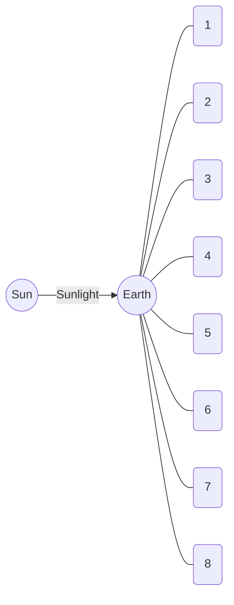

**Shapes of the Moon as seen from the Earth**

<table>
  <tbody>
    <tr>
        <td>1</td>
        <td>2</td>
        <td>3</td>
        <td>4</td>
        <td>5</td>
        <td>6</td>
        <td>7</td>
        <td>8</td>
    </tr>
    <tr>
        <td>[Image: New Moon/Crescent]</td>
        <td>[Image: Waxing Crescent]</td>
        <td>[Image: First Quarter]</td>
        <td>[Image: Waxing Gibbous]</td>
        <td>[Image: Full Moon]</td>
        <td>[Image: Waning Gibbous]</td>
        <td>[Image: Last Quarter]</td>
        <td>[Image: Waning Crescent]</td>
    </tr>
    <tr>
        <td>Crescent</td>
        <td></td>
        <td></td>
        <td></td>
        <td>Full Moon</td>
        <td colspan="3"></td>
    </tr>
  </tbody>
</table>
<table>
    <tr>
        <th>Do you know?</th>
        <th>Interesting Information</th>
    </tr>
    <tr>
        <td>The Moon has no atmosphere. Moreover, there is no water on the Moon. That is why, no life exists on the Moon.</td>
        <td>Except Mercury and Venus, all planets in the Solar System have moons. Jupiter and Saturn have the highest number of moons.</td>
    </tr>
</table>## Rotational Movement of the Earth

Our Earth not only revolves in its orbit around the Sun but it also rotates about its own axis. The axis is an imaginary line that passes through the north and south poles of the Earth.

It is day at the parts of the Earth that face the Sun. Meanwhile, it is night time for the parts that do not face the Sun.

The Earth completes one rotation around its axis in 24 hours.

[The image shows a globe of the Earth tilted on its axis. A red dashed line represents the Axis, labeled 'N' at the top (North Pole) and 'S' at the bottom (South Pole). The Earth is shown with sunlight illuminating one side while the other remains in shadow.]

<table>
    <tr>
        <th>Interesting Information</th>
        <th>Do you know?</th>
    </tr>
    <tr>
        <td>Day and night occur due to the rotational motion of the Earth. The Earth rotates from west to east. This is why, the Sun appears to rise in the east and set in the west.</td>
        <td>Every planet is at a different distance from the Sun and revolves at different speed. Therefore, the duration of day is different on different planets.</td>
    </tr>
</table>### Activity 9.2
1. Shine a torchlight on a globe. As shown in the picture, the globe represents the Earth and the torchlight represents the Sun.
2. Is the entire surface of the globe lighted? Is only the part of the globe which faces the torchlight lighted? Is the other side of the globe that does not face the torchlight dark?
3. Now, rotate the globe slowly in the front of the torchlight. It is daytime in the parts of the Earth that faces the light and it is night-time on remaining parts.

The image shows a hand holding a lit torch (labeled "Torch") shining light onto a globe (labeled "Globe"). One half of the globe is illuminated by the light, representing day, while the other half is in shadow, representing night.

## Changing Shadows with the Axial Rotation of the Earth
During the Earth's axial rotation, the Sun appears to rise in those parts of the Earth that face the Sun. At that time, we see long shadows of the trees and other objects. As the Earth keeps rotating, the shadows gradually become shorter in size. At noon time, the shadow of any object is the smallest in size. On further rotation of the Earth, the size of shadows gradually increases in the opposite direction. Just before the sunset, the shadows again become long as they were in the morning.

### Activity 9.3
1. Select a location in your school playground under the sunlight. Fix a stick on the ground.
2. Observe the shadow of the stick three or four times (for example, at 8:00 am, 10:00 am, 12:00 pm and 2:00 pm) and mark the length of the shadows with a line each time.

Did you observe any difference in the lengths of the shadows?
The sizes of shadows change first from long to short and from short to long afterwards.

The image shows a yellow sun in the sky and a vertical stick fixed in the ground casting a shadow.

# Annual Rotation of the Earth around the Sun

The revolution of the Earth around the Sun is called the orbital motion. The path of the Earth's revolution around the Sun is almost circular. The Earth completes one revolution around the Sun in about 365 days. This period is called one year. The Earth's axis is tilted towards one side. Due to this, the sun rays fall vertically at the Northern Hemisphere of the Earth. In this way, the days get longer and the nights get shorter. This marks the summer season in the Northern Hemisphere.

During the same time, the Southern Hemisphere of the Earth receives slanting sun rays. In that part, the days get shorter and nights get longer. This marks the winter season there.

### Change of seasons in the Northern Hemisphere of the Earth

The following diagram illustrates the Earth's orbit around the Sun and the resulting seasons:

*   **21 March:** Equal day and night (Spring)
*   **22 June:** Longest day (Summer)
*   **23 September:** Equal day and night (Autumn)
*   **22 December:** Longest night (Winter)

> **Point to Ponder!**
> How would we have the seasons if the Earth was not tilted on its axis?

### Activity 9.4

1.  Pass a long needle through a rubber ball.
2.  Draw an almost circular path on the table, as shown in picture.
3.  Light an electric bulb at the centre of circle.
4.  Bend the needle a little towards right.
5.  Hold the ball by needle and place it at points 1, 2, 3 and 4 of the path so that the tilt does not change.
6.  Observe the light falling on the ball, when it is at these four points.

The diagram for the activity shows a central light bulb representing the Sun, with four positions of a tilted ball (Earth) labeled 1, 2, 3, and 4 in an orbital path.

*   What will be the season in the part of Earth (ball) which receives the vertical light?
*   What will be the season in the part of Earth (ball) at which light is slanting and does not fall vertically?

> The annual rotation of the Earth and the tilt in its axis cause changes in seasons.

## Lunar Eclipse
During the revolution of the Moon around the Earth, sometimes the Earth comes between the Sun and the Moon. Due to it, the sunlight does not reach the Moon. Therefore, a shadow of the Earth is formed on the Moon and it looks dark. This is called lunar eclipse.

The diagram shows the Sun, Earth, and Moon aligned in a straight line. The Earth is in the middle, casting a cone-shaped shadow (Shadow of Earth) onto the Moon. This alignment is labeled as **Lunar Eclipse**.

> ### Activity 9.5
> 1. Place a torchlight, a football and a tennis ball in one line as shown in figure.
> 2. Light the torchlight and observe the shadow of football on the tennis ball.
>
> The diagram for this activity shows a **Torch** (representing the Sun), a **Football** (representing the Earth), and a **Tennis ball** (representing the Moon) placed on stands in a straight line. The light from the torch is blocked by the football, casting a shadow on the tennis ball.
>
> If you consider the tennis ball as Moon, football as Earth and torchlight as Sun, does this model shows a lunar eclipse? Explain.

## Solar Eclipse
During the revolution of the moon around the Earth, the Moon comes between the Earth and the Sun. In this condition, the Sun is hidden behind the Moon and is not visible from the Earth. A shadow of the Moon falls on the Earth. It is called solar eclipse. The complete solar eclipse is very rare. Usually, we see partial solar eclipses. It is because the Moon is much smaller than Earth. So, its shadow falls only at a small part of the Earth. Therefore, the solar eclipse can be seen only in those parts of the Earth.

The diagram shows the Sun, Moon, and Earth aligned. The Moon is in the middle, casting a shadow on the Earth.
*   **Rays of Sun** are shown passing the Moon.
*   The darker, central part of the shadow on Earth is labeled **Complete Solar Eclipse**.
*   The lighter, outer part of the shadow on Earth is labeled **Partial Solar Eclipse**.
*   The overall alignment is labeled **Solar Eclipse**.

### Activity 9.6

1. Place a torchlight, a football and a tennis ball in one line as shown in figure.
2. In this activity, place the tennis ball nearer to the football.
3. Light the torchlight and observe the shadow of tennis ball on the football.

Does the shadow fall only on some part of the football?
If you consider the tennis ball as the Moon, football as the Earth and torchlight as the Sun, doest this model show solar eclipse? Explain.
Why is the solar eclipse usually partial.

> **Point to Ponder!**
> Can any planet come between Sun and Earth, during its rotation? Explain.

> **Interesting Information**
> Earth rotates at its own axis and revolves around the sun as well.

> **Point to Ponder!**
> Which force is responsible for the movement of the Moon around the Earth?
> Does the force of the Sun also act on Moon?

The image shows a demonstration setup:
- A **Torch** is placed on the left, emitting a beam of light.
- A **Tennis ball** is placed in the middle on a blue stand.
- A **Football** is placed on the right on a blue stand.
- The light from the torch hits the tennis ball, creating a **Tennis ball shadow** on the surface of the **Football**.

---

## Key Points

1. Our Solar System consists of the Sun, eight planets, asteroids, and comets.
2. The Sun is the source of light and heat not only for our Earth but also for the entire Solar System.
3. The Moon completes its revolution around the Earth in 29.5 days.
4. Day and night are formed due to the Earth's rotation around its axis.
5. Seasons change during the year due to annual revolution of the Earth and the tilt of its axis.
6. When it is winter in the northern hemisphere of the Earth, it is summer in the southern hemisphere.
7. Solar eclipse occurs when the Moon comes between the Earth and the Sun. In this condition, the shadow of the Moon falls on the Earth.
8. Lunar eclipse occurs when the Earth comes between the Sun and the Moon. In this condition, the shadow of the Earth falls on the Moon.

**Weblinks:** Use the following weblinks to enhance your knowledge about the topics in this chapter.

<table>
  <tbody>
    <tr>
        <td>1.</td>
        <td>Solar System</td>
        <td>https://www.nationalgeographic.org/topics/resource-library-solar-system/</td>
    </tr>
    <tr>
        <td>2.</td>
        <td>Phases of the Moon</td>
        <td>https://www.natgeokids.com/au/discover/science/space/the-phases-of-the-Moon/</td>
    </tr>
    <tr>
        <td>3.</td>
        <td>Solar and Lunar Eclipse</td>
        <td>https://www.nationalgeographic.org/encyclopedia/eclipse/</td>
    </tr>
  </tbody>
</table>

# Exercises

### 1- Tick (✓) the correct answer.

i. The gravity of which body keeps the planets and other celestial bodies together in the Solar System?
(a) Jupiter
(b) Earth
(c) Sun
(d) Moon

ii. The Earth completes its rotation around the Sun in 365 days. This period is called:
(a) a solar year
(b) a solar month
(c) lunar month.
(d) lunar year.

iii. Due to the annual revolution of Earth and tilt of its axis:
(a) day and night are formed.
(b) seasons change.
(c) a lunar month
(d) a lunar year

iv. On the globe, in which part of the Earth is Pakistan situated?
(a) Northern hemisphere
(b) Southern hemisphere
(c) Equator
(d) Half in the northern hemisphere and half in the southern hemisphere

v. Which planet of the Solar System does not have any moon?
(a) Jupiter
(b) Venus
(c) Mars
(d) Saturn

### 2- Write short answers.

i. We can only see one side of the Moon. Explain.

ii. If there were no tilt in the Earth's axis, how would it have affected the seasons?
iii. When it is winter in the Northern Hemisphere then what will be the season in Southern Hemisphere?
iv. Which planet is closest to the Sun?
v. Why is the Solar Eclipse usually partial?

### 3. Constructed Response Questions:

i. Which phenomena are shown in the following figure?

The figure shows two diagrams of celestial alignments:
1.  **Left Diagram:** The Sun is on the left, the Moon is in the middle, and the Earth is on the right, all aligned. This represents a **Solar Eclipse**.
2.  **Right Diagram:** The Sun is on the right, the Earth is in the middle, and the Moon is on the left, all aligned. This represents a **Lunar Eclipse**.

ii. In the following picture, each arrowhead shows the axial or orbital movement of the Earth and the Moon. Write the correct type of movement in the box given near each arrowhead.

The diagram shows the Sun at the center with the Earth orbiting it, and the Moon orbiting the Earth. There are four empty boxes pointing to different movements:
*   An arrow showing the Earth's rotation on its axis.
*   An arrow showing the Moon's orbit around the Earth.
*   An arrow showing the Earth's orbit around the Sun.
*   An arrow showing the Sun's rotation on its axis.

In how many days, the Moon completes its one revolution around the Earth? \_\_\_\_\_\_\_\_\_\_\_\_\_\_\_
In how many days, the Earth completes its one revolution around the Sun? \_\_\_\_\_\_\_\_\_\_\_\_\_\_\_

iii. Identify the season in the southern hemisphere as per given figure. Write the correct season in the boxes given near the dates.

The diagram shows the Earth's orbit around the Sun, illustrating the seasons.
*   **Center:** Sun
*   **Top Position:** 21 March (Earth with tilted axis)
*   **Right Position:** 22 December (Earth with tilted axis) [ ] (Empty box for season)
*   **Bottom Position:** 23 September (Earth with tilted axis)
*   **Left Position:** 22 June (Earth with tilted axis, labels for "Axis", "Equator", and "Earth")

### 4. Investigate:
If the Sun stops providing light and heat, what will be its effects on the Earth? Would life be possible on the Earth?

### 5. Project:
Make two groups in the class. One group will make the model of a lunar eclipse and the other group will make model of solar eclipse.

# Chapter 10
# Technology in Everyday Life

The background image features a digital network theme with various icons inside hexagonal shapes, including a musical note, a location pin, a star, a heart, a refresh symbol, a Wi-Fi signal, and a speech bubble. In the center, there is a large circular share icon.

Below the main title, there are three green circular callouts with questions:
*   What are the benefits of the first aid?
*   How do mobile phones affect our lives?
*   What models can we make from paper?

## Students' Learning Outcomes

**After studying this chapter, the students will be able to:**

1.  Practice techniques of folding, cutting, tearing and pasting papers, cardboard to make objects and patterns.
2.  Design paper bags, envelopes, cards and face mask.
3.  Design models of sphere, cube, prism, cylinder and cone with clay or play dough.
4.  Design hammer, wheels, rollers and gears using clay or play dough.
5.  Operate tablets/mobile phones for use of calculator, alarm clock and calendar.
6.  Operate mobile phones for taking snapshots.
7.  Recognize the items of first aid box.
8.  Use digital and clinical thermometer externally to measure body temperature.
9.  Check blood pressure by digital blood pressure monitor.

Building models of different things like means of transportation, household items, and electronics is not only a pastime activity but also an opportunity for making new inventions.

We live in an age of speed and technology. As the means of communications have developed rapidly, we can remain in touch with our loved ones with audio and video chats on our computers and mobile phones. Indeed, mobile phones with their clocks, calendars, and cameras have fitted many devices in one device.

<table>
    <tr>
        <td>An analog wall clock showing the time as approximately 10:10.</td>
        <td>A desk calendar showing dates.</td>
        <td>A vintage-style film camera.</td>
    </tr>
    <tr>
        <td>**Clock**</td>
        <td>**Calendar**</td>
        <td>**Camera**</td>
    </tr>
</table>While technology makes our lives easier, we also need to know basic healthcare and especially the first aid to save lives in emergency situations.

## Basic Craft Making

Unless we practise things, we cannot understand how complex or simple they are. In this chapter, we will use paper and cardboard for making models. While doing so, we will also practise various ways of shaping paper such as folding, cutting, tearing, and pasting.

### Folding, Cutting, Tearing and Pasting Paper / Cardboard to Make Objects or Patterns

Paper and cardboard are highly flexible materials for making simple and complex models.

<table>
    <tr>
        <td>A single sheet of white paper.</td>
        <td>A stack of multi-colored paper sheets.</td>
        <td>A stack of brown cardboard sheets.</td>
    </tr>
    <tr>
        <td>**White paper**</td>
        <td>**Coloured paper**</td>
        <td>**Cardboard**</td>
    </tr>
</table>

We need some skills for folding, cutting, tearing and pasting paper and cardboard. Let us practise these processes by the following activities:

## Folding

### Activity 10.1

1. Stretch the sheet of paper on a flat smooth surface preferably on a table top. Draw a line from where to fold the paper.
2. Keep pressing one edge of the paper with your one hand, turn the paper with your other hand to fold it along the line. To make a crease rub your finger over the fold or use a ruler edge to press the fold.

The images show hands pressing a white sheet of paper on a blue surface to create a fold.
Folding paper

## Cutting Paper and Cardboard

Paper can be cut easily by using a paper cutter or a knife. Paper is folded along the line where it is to be cut. Blade of paper knife is inserted inside the fold. Then pressing the fold with one hand, the paper cutter is pushed forward as shown in the picture. Paper and cardboard can also be cut with the help of scissors. It is better if we draw a line and then cut along the line carefully.

The first image shows a hand using a yellow paper cutter to cut along a fold in a white sheet of paper. The second image shows hands using scissors to cut a white sheet of paper.

<table>
    <tr>
        <th>Cutting paper with cutter</th>
        <th>Cutting paper with scissors</th>
    </tr>
</table>> ### Pop Quiz
> Why is using a paper cutter better than using a scissors?

# Tearing

> ## Activity 10.2
>
> 1. If you want to tear a piece of paper, first fold it and make a crease. Tear a little of it at edge by pulling it apart on both sides with both hands.
> 2. Spread the paper on a flat surface. Keep on pressing the paper on one side of crease with your one hand, pull away the other part of the paper with your other hand.
>
> Two photographs showing hands tearing a white piece of paper along a crease on a blue surface.
>
> Tearing from the crease

# Pasting a Paper
Normally, gum or glue is applied on the back side of the paper to be pasted.

> ## Activity 10.3
>
> 1. Put the paper on a flat surface with its front side facing downward. Apply the glue evenly on all over the paper.
>
> A photograph showing a hand applying a glue stick to the back of a small piece of paper.
>
> 2. Pick the paper up and place it carefully on the desired place keeping the glued side downward. Rub it with your finger to paste it evenly.
>
> A photograph showing hands pressing down and smoothing a small piece of paper onto a larger white sheet.

# Making a Paper Bag

When we buy things from a shop, the shopkeeper puts those things in a paper bag so that we can take them home easily. Let's learn how to make a paper bag for ourselves.

### Activity 10.4

You need a sheet of paper (A4 Size) and glue for joining the edges.

1. Fold the sheet from two sides such that the two edges overlap in the middle. Glue the edges to join them together.
2. Fold a small part from the bottom inward as shown by a curved arrow.
3. Pull apart both sides of the folded flap as shown in the picture.

<table>
    <tr>
        <th>1</th>
        <th>2</th>
        <th>3</th>
        <th>4</th>
    </tr>
    <tr>
        <td>A rectangular sheet of paper with two sides folded to the center and glued.</td>
        <td>The bottom of the folded paper is folded upwards.</td>
        <td>The bottom fold is opened up into a diamond shape.</td>
        <td>The top and bottom flaps of the diamond are folded towards the center.</td>
    </tr>
</table>4. Fold up a little more than half of the lower flap. Repeat the same for the upper flap and paste over the lower flap by using glue. Your paper bag is ready. You can open it from the top to put anything in it.
5. You can attach two strips on both sides on top of the bag to hold it.

<table>
    <tr>
        <th>5</th>
    </tr>
    <tr>
        <td>The finished paper bag standing upright with yellow handles attached.</td>
    </tr>
</table># Making an Envelope

### Activity 10.5

1. Take a paper of square shape. Fold the paper vertically in half. Open this fold and fold it horizontally in half. Then open it. Place the paper on the table in such a way that its corners be on vertical and horizontal lines.
2. Fold the left corner to meet at the centre. Repeat with the right corner.

> **Do you know?**
>
> When disposed irresponsibly, polythene bags cause trash and block waterways. When burned, they produce harmful gases. This is why, it is strongly advised to use paper bags instead of polythene bags.

3. Fold the bottom corner up a little above the centre. Apply glue along its edges and fix it on the sides of envelop

The following diagrams illustrate the steps for folding an envelope:
1. A square piece of paper with diagonal fold lines.
2. The left and right corners are folded into the center.
3. The bottom corner is folded up past the center and glued to the side flaps.
4. The top corner is folded down to close the envelope.

4. Similarly fold the top corner upto a little below the centre. This becomes the top flap. This can be glued after putting a card or a letter in the envelope.

## Making a Greeting Card

### Activity 10.6

1. Cut a card in the size of your choice. Create or trace a design of balloons and ribbons on it with a pencil. Express your sentiments by writing "Eid Greeting".
2. Fill colours in it using markers.

The image shows a sample greeting card decorated with colorful balloons and a pink pleated ribbon with a yellow flower.

The following layout shows the design for the inner and outer parts of the card:

**Inner of the card**
The left side features a drawing of a dandelion with seeds blowing away.
The right side has the following text:
Dear \_\_\_\_\_\_\_\_\_\_\_\_\_\_\_\_
\_\_\_\_\_\_\_\_\_\_\_\_\_\_\_\_\_\_\_\_\_
\_\_\_\_\_\_\_\_\_\_\_\_\_\_\_\_\_\_\_\_\_
\_\_\_\_\_\_\_\_\_\_\_\_\_\_\_\_\_\_\_\_\_
\_\_\_\_\_\_\_\_\_\_\_\_\_\_\_\_\_\_\_\_\_

**Outer of the card**
The left side features a colorful abstract design with the text "Eid Greeting".
The right side features a handprint flower design with the text:
From \_\_\_\_\_\_\_\_\_\_\_\_\_\_\_\_

> Make a card for your teacher or parents.

## Activity 10.7
### Making Mask
Make face masks of various designs using cardboard or chart paper yourself.

[The image shows three examples of decorative masks: a pink cat mask, a Spider-Man mask, and an orange superhero-style mask.]

> ### Info Box
> Face masks made of clothes are effective against germs and better protection during a pandemic.
>
> [The image shows three examples of protective cloth and medical masks.]

## Activity 10.8 | Preparation of Clay for Making Models
1. Take some clay.
2. Mix a little water in it and make a dough of clay.
3. Stretch and compress it many times like a dough of flour as if you are preparing flat bread.
4. This dough of clay is called kneaded clay which can be used for making clay models.

Let us learn to make the models of various shapes using kneaded clay.

## Activity 10.9
Do you recognize the following shapes? Make these shapes using play dough or kneaded clay.

[The image displays five 3D geometric shapes:]
*   **Prism** (a light blue triangular prism)
*   **Cone** (a reddish-brown cone)
*   **Cylinder** (a purple and white cylinder)
*   **Cube** (an orange cube)
*   **Sphere** (a purple sphere)

> Can you make any other shape other than these?

### Activity 10.10

Make a model of these shapes using play dough or kneaded clay.

<table>
    <tr>
        <th>Gear</th>
        <th>Hammer</th>
        <th>Wheel</th>
        <th>Roller</th>
    </tr>
    <tr>
        <td>(Illustration of an orange gear)</td>
        <td>(Illustration of a green hammer)</td>
        <td>(Illustration of a purple wheel)</td>
        <td>(Illustration of a wooden roller)</td>
    </tr>
</table>### Using of Mobile Phone
Initially designed as portable telephones to make communication easier and quicker, the mobile phones became smarter with several applications like alarm clock, calendar, camera and notepad to make things easier for the users. There are many other uses of a mobile phone as well:

(The image shows a smartphone screen displaying various app icons. Lines connect specific icons on the screen to larger versions of the icons on the right side of the page: Calculator, Calendar, Camera, and Clock.)

### Activity 10.11

#### Calculator
Click the menu button on your mobile phone screen as shown in the figure. Now click on calculator icon. As you get a calculator on the screen, find out the answer for $129 \times 27$. After that, solve it yourself. Is there any difference in the answers? Was the duration of time for solving yourself less or more than the calculator?

(Illustration of a Calculator icon with symbols: -, x, +, =)
**Calculator**

#### Clock Alarm
Click the icon on the mobile phone screen. Doing so will open a new alarm page. Set the alarm time for 10 minutes after it and observe its working. Can you change the alarm tone?

(Illustration of a blue Clock icon)
**Clock**

### Calendar
Tap the calendar icon. As the calendar appears on the screen, find the day of your birthday. Does this calendar indicate the important days of the year?

[The image shows a blue and white calendar icon with the number 31 on it, labeled "Calendar".]

### Camera
Click on the camera icon on your phone screen. Take snaps of your friends. How will you take your own picture? What is it called? Can you record a video too?

[The image shows a grey camera icon, labeled "Camera".]

> If you do not see any application in the menu of your mobile phone, what can you do?

### The First Aid Box
A temporary and emergency care given to an injured or a sick person is called the first aid. The purpose for the first aid is to provide immediate relief to a person in an urgent medical condition.

Have you seen a First Aid Box?

A First Aid Box contains the following items that are used for providing instant first aid to a patient or injured of an accident:

[The image shows a red first aid box with a white crescent and circle symbol, labeled "First Aid Box".]

#### Handbook of First Aid Box
This handbook provides basic information about measuring body temperature, dressing wounds, stopping blood loss, and other emergency treatments of the patients or victims.

#### Tweezers and Scissors
Tweezers are used for picking up shards, thorns, or other bits from a wound. Scissors are used for cutting the bandages.

#### Cotton and Spirit
Cotton and spirit are used to clean the wound before bandaging.

#### Bandage Spirit
Cotton or other cloth bandages are wrapped and sealed with medical adhesive tape on small wounds.

### Items in the First Aid Box

The image displays various items found in a first aid box:
*   **Cotton**: A roll of cotton and loose cotton.
*   **Medicines**: Various tablets and a medicine bottle.
*   **Cream**: A tube of antiseptic cream.
*   **Handbook of First Aid**: A red instructional book.
*   **Thermometer**: A digital thermometer showing 94.0 °F.
*   **Bandage**: Adhesive bandages (plasters).
*   **Cold pack**: An instant cold pack.
*   **Scissor**: A pair of medical scissors.
*   **Spirit**: A bottle of surgical spirit.
*   **Swabs**: A stack of sterile swabs.
*   **Tweezer**: A pair of red tweezers.
*   **Gauze**: Rolls of sterile gauze.
*   **Medical tap**: A roll of medical adhesive tape.

#### Gauze
Gauzes are used to cover wounds and for absorbing seeping blood.

#### Medical Tape
It is used to dress up the bandages.

#### Medicines and Creams
Some medicines and creams are also kept in the box to relieve the pain, inflammation and minor injuries.

#### Instant Cold Pack
It is a pack that is activated by shaking and which immediately cools an aching or inflamed part of body. It is used to reduce inflammation and pain.

#### Thermometer
It is a device used to measure body temperature.

First aid boxes are available at pharmacies and medical stores. We can also make our own by keeping some basic materials in a box or any container.

> ### Activity 10.12
> Make your own First Aid Box using items available at your home.

## Measuring Body Temperature using First Aid Box

Body temperature indicates whether a person has a fever or not. Clinical thermometer and thermal strips are used to measure body temperature. Let us learn its use.

### Activity 10.13

1. Take a thermal strip from the first aid box.
2. Place it on the forehead of a person or a child as shown in the picture.
3. Keep it pressed for one minute.
4. Read the temperature shown on the scale and note it.

[The image shows a thermal strip being held against a child's forehead. Below it is a close-up of a thermal strip showing a Celsius scale with readings: 35, 36, 37, 38, 39, 40.]

### Activity 10.14

1. Take a digital or clinical thermometer from the first aid box. Ensure that its bulb is sterilized.
2. Shake it a couple of times to bring the mercury or alcohol level down into the bulb. It is not needed for digital thermometer.
3. Put the bulb of the thermometer under the armpit of your friend for one minute.
4. Remove thermometer from armpit of your friend and read the temperature on its scale.
5. Add 1 in this reading. This will give you the correct internal temperature of the body.

[The image shows a person placing a digital thermometer under the armpit of a child.]

### Do you know?
The normal temperature of human body is 98.6°F. If the temperature of a person is more than this, it indicates fever.

### Info Box
A doctor can measure body temperature by putting thermometer under the tongue.

> ### Activity 10.15
> Check your temperature. When doctor says that a person has 100°F fever, what does it mean?

## Checking Blood Pressure
The blood pressure of a person is required to remain within a limit for human health. Its normal limit is 120/80 mm Hg. Having high or low blood pressure can lead to different health problems.

The instrument used to measure blood pressure is called blood pressure apparatus. We can also check it using digital blood pressure monitor.

The image shows a digital blood pressure monitor displaying the following readings:
- SYS: 120
- DIA: 80
- Pulse: 70

> **Do you know?**
> Pressure of blood on our vessels is called blood pressure.

### How to Use Digital Blood Pressure Monitor
1. Put the cuff around the arm as shown in the figure.
2. Push the ON button of the automatic model.
3. The cuff will inflate by filling air inside it and reading will start appearing on the display screen.
4. Look at the display screen to see your blood pressure reading.
5. Push the exhaust button to release the air from the cuff and remove it from the arm.
6. Keep the record of blood pressure of the patients.

The page includes illustrations of the process:
- A person sitting with a blood pressure cuff attached to their arm.
- A hand pressing the "START" button on a digital monitor.
- A close-up of a digital monitor screen showing a reading of 130 (SYS), 89 (DIA), and 85 (Pulse), with a pen pointing to the record.

# Key Points

1. Paper or cardboard is used to make various objects and patterns.
2. Envelopes, bags, cards and face masks can be made using paper.
3. Play dough is a soft material like clay of some colour. It can be used to make shapes and models of various objects.
4. A mobile phone is basically used for making calls.
5. We can use a mobile phone as a calculator, alarm clock and a calendar.
6. A mobile phone is also used to take pictures.
7. A First Aid Box consists the items that are used to provide first aid to victims of some accidents.
8. Clinical or digital thermometer is used to measure the human body temperature.
9. Blood pressure monitor is used to check the blood pressure of a person.

# Weblinks

Use the following weblinks to enhance your knowledge about the topics in this chapter.

<table>
    <tr>
        <td>Origami for kids</td>
        <td>1.</td>
        <td>https://www.natgeokids.com/uk/kids-club/entertainment/general-entertainment/origami-for-kids/</td>
    </tr>
    <tr>
        <td>Thermometer</td>
        <td>2.</td>
        <td>https://www.nationalgeographic.org/encyclopedia/thermometer/</td>
    </tr>
    <tr>
        <td>First Aid kit</td>
        <td>3.</td>
        <td>https://www.nationalgeographic.com/news/2017/03/sponsor-content-not-all-first-aid-kids-are-created-equal/</td>
    </tr>
</table># Exercises

**1. Tick (✓) the correct answer.**

i. Clinical thermometer is used to:
(a) check sugar
(b) measure inflamation in the body
(c) check fever
(d) measure blood pressure

ii. The number of corners of a prism are:
(a) 3
(b) 4
(c) 5
(d) 6

iii. The surfaces of a cube are:
(a) 3 (b) 4
(c) 6 (d) 8

iv. Taking photographs of oneself is known as:
(a) portrait (b) selfie
(c) landscape (d) oneself

v. Which item is used to reduce inflammation as a first aid?
(a) medical tape (b) tweezer
(c) thermometer (d) instant cold pack

vi. The blood pressure 160/100 is:
(a) low blood pressure (b) high blood pressure
(c) normal blood pressure (d) not possible

## 2. Write short answer.
i. What is the difference between a cone and a prism?
ii. Can an envelope be made from a square-shaped paper? Explain.
iii. Why a line is drawn on a paper before cutting it with a scissors?
iv. Why a clinical thermometer is shaken for a few times before use?
v. Why any soil cannot be used to make a model?

## 3. Constructive Response Questions.
i. A circular shape is cut as shown in the following figure. What is the value in fraction of the total in each case? Write below each shape.

The image shows five circles divided into different fractional parts:
1. A blue circle divided into 2 equal halves.
2. A red circle divided into 3 equal parts.
3. A green circle divided into 4 equal parts.
4. A yellow circle divided into 6 equal parts.
5. A purple circle divided into 8 equal parts.

<table>
  <thead>
    <tr>
        <th>Blue Circle</th>
        <th>Red Circle</th>
        <th>Green Circle</th>
        <th>Yellow Circle</th>
        <th>Purple Circle</th>
    </tr>
  </thead>
  <tbody>
    <tr>
        <td>________________</td>
        <td>________________</td>
        <td>________________</td>
        <td>________________</td>
        <td>________________</td>
    </tr>
  </tbody>
</table>

ii. Identify the various items used in everyday life which look like a circle, a cube, a cylinder, a cone and a prism. Give two examples of each shape.

iii. Write below each shape, number of its corners, edges and surfaces.

The image shows five geometric shapes: a sphere, a cube, a triangular pyramid, a cone, and a triangular prism.

<table>
  <thead>
    <tr>
        <th></th>
        <th>Sphere</th>
        <th>Cube</th>
        <th>Triangular Pyramid</th>
        <th>Cone</th>
        <th>Triangular Prism</th>
    </tr>
  </thead>
  <tbody>
    <tr>
        <td>Corners</td>
        <td>__________</td>
        <td>__________</td>
        <td>__________</td>
        <td>__________</td>
        <td>__________</td>
    </tr>
    <tr>
        <td>Edges</td>
        <td>__________</td>
        <td>__________</td>
        <td>__________</td>
        <td>__________</td>
        <td>__________</td>
    </tr>
    <tr>
        <td>Surfaces</td>
        <td>__________</td>
        <td>__________</td>
        <td>__________</td>
        <td>__________</td>
        <td>__________</td>
    </tr>
  </tbody>
</table>

4. **Investigate:**
   Why mobile phone technology is progressing rapidly? How will be the mobile phone of the future?

5. **Project: Making a Nest**
   For the project you will need an empty pack of juice or milk, cotton or cloth, various items for decoration.

   1. Cut the front or back face of the pack large enough to allow a small bird to enter and exit easily.
   2. Make the interior comfortable by padding it with cotton or cloth.
   3. Drill a hole and insert a wire through the upper edge so that the nest can be hanged on a tree.
   4. Cover the pack with colour ribbons and packing paper to make it fancy-looking.
   5. Hang the nest somewhere near your home or school so that birds can use it. Observe if any bird uses it as its nest or not.

The image shows two bird nests made from decorated milk/juice cartons. One is green with a small roof and a perch, and the other is light blue with painted bird and branch designs. Both have wire hangers at the top.

# GLOSSARY

**Abiotic components:** The non-living components of an ecosystem (air, water, light, soil)
**Anemometer:** The instrument to measure the direction and speed of air (wind)
**Axial motion:** The movement of the Earth around its own axis
**Balanced diet:** The diet in which all components of food are present in proper amounts
**Barometer:** The instrument to measure the pressure of air
**Biodiversity:** Various kinds of organisms present in a specific region
**Biotic components:** The living organisms in an ecosystem (producer, consumers, decomposers)
**Climate:** The general weather conditions of a region
**Consumers:** The organisms which get food from other organisms (e.g., animals)
**Contagious disease:** A disease which can transmit from one individual to others
**Decomposers:** The organisms which decompose the dead bodies into simple components (some bacteria and fungi)
**Echo:** The sound heard when it bounces back after hitting an object
**Ecosystem:** The collective system of the living and the non-living components of environment
**Energy:** The ability to do work
**Environment:** All objects present in the surrounding of an organism
**Equator:** The line which divides the Earth into two equal parts
**Fever:** The condition in which the temperature of body rises above 98.6 °F
**Filtration:** The method of removing the harmful matter from water through filtering
**Flowering plant:** The plants which produces flowers
**Food chain:** The series of organisms, where one organism eats another and then is eaten by another organism
**Force:** Pull or push motion
**Friction:** The force that opposes motion of a body
**Gas:** The state of matter which has no specific shape and no specific volume
**Gear:** A simple machine which increases or decreases speed
**Generator:** A machine which produces electricity

# Glossary

<table>
  <tbody>
    <tr>
        <td>Global warming:</td>
        <td>The increase in the average temperature of Earth, due to pollution</td>
    </tr>
    <tr>
        <td>Heart:</td>
        <td>The organ responsible for the circulation of blood in body</td>
    </tr>
    <tr>
        <td>Hydroelectricity:</td>
        <td>The electricity produced by the movement of water</td>
    </tr>
    <tr>
        <td>Invertebrates:</td>
        <td>The animals without a backbone</td>
    </tr>
    <tr>
        <td>Joint:</td>
        <td>The point where two or more bones join</td>
    </tr>
    <tr>
        <td>Lever:</td>
        <td>A simple machine used to lift heavy objects</td>
    </tr>
    <tr>
        <td>Light:</td>
        <td>A type of energy that helps us to see the things of the surrounding</td>
    </tr>
    <tr>
        <td>Liquid:</td>
        <td>The state of the matter that has a specific volume but has no specific shape</td>
    </tr>
    <tr>
        <td>Lungs:</td>
        <td>The pair of organs responsible for the exchange of gases between blood and air</td>
    </tr>
    <tr>
        <td>Mass:</td>
        <td>The amount of matter in a body</td>
    </tr>
    <tr>
        <td>Motion:</td>
        <td>The change in the position of a body</td>
    </tr>
    <tr>
        <td>Orbital motion:</td>
        <td>The Earth's annual rotation around the Sun</td>
    </tr>
    <tr>
        <td>Organ:</td>
        <td>The part of the body which performs specific functions</td>
    </tr>
    <tr>
        <td>Producers:</td>
        <td>The organisms which prepare their food themselves (plants, algae etc.)</td>
    </tr>
    <tr>
        <td>Pulley:</td>
        <td>A simple machine that consists of grooved wheel and a rope</td>
    </tr>
    <tr>
        <td>Rain gauge:</td>
        <td>The instrument to measure the amount of rain</td>
    </tr>
    <tr>
        <td>Ramp (Incline Plane):</td>
        <td>A simple machine of slanting shape used to move objects up and down</td>
    </tr>
    <tr>
        <td>Reflection:</td>
        <td>The phenomenon in which light comes back after striking a shiny surface</td>
    </tr>
    <tr>
        <td>Skeleton:</td>
        <td>The overall structure made of the bones of the body</td>
    </tr>
    <tr>
        <td>Soil:</td>
        <td>The outer part of the Earth surface consists of it.</td>
    </tr>
    <tr>
        <td>The Solar System:</td>
        <td>The Sun and the eight planets which revolve around it</td>
    </tr>
    <tr>
        <td>Thermal power station:</td>
        <td>A power plant where electricity is generated by burning coal, oil or gas</td>
    </tr>
    <tr>
        <td>Thermometer:</td>
        <td>The instrument to measure temperature</td>
    </tr>
    <tr>
        <td>Vaccination:</td>
        <td>Creating defence against diseases by introducing the dead or weakened germs of diseases</td>
    </tr>
    <tr>
        <td>Vertebrates:</td>
        <td>The animals which have a backbone</td>
    </tr>
    <tr>
        <td>Vibration:</td>
        <td>The back-and-forth movements in a body</td>
    </tr>
    <tr>
        <td>Volume:</td>
        <td>The space occupied by a body or an object</td>
    </tr>
    <tr>
        <td>Weather:</td>
        <td>The daily climatic conditions of an area</td>
    </tr>
  </tbody>
</table>

NO_CONTENT_HERE

# قومی ترانہ

کشورِ حسین شاد باد	پاک سر زمین شاد باد
پاکستان!	ارضِ	تُو نشانِ عزمِ عالی شان

مرکزِ یقین شاد باد

قُوّتِ اُخُوّتِ عوام	پاک سر زمین کا نظام
پائندہ، تابندہ باد	قوم، ملک، سلطنت

شاد باد منزلِ مراد

رہبرِ ترقّی و کمال	پرچمِ ستارہ و ہلال
استقبال!	جانِ	ترجمانِ ماضی، شانِ حال

سایۂ خدائے ذوالجلال

(حفیظ جالندھری)

The image shows the Minar-e-Pakistan monument in Lahore, set against a light blue background with a green crescent and star emblem above it.

# قومی ترانہ

کشورِ حسین شاد باد	پاک سرزمین شاد باد
ارضِ پاکستان	تُو نشانِ عزمِ عالی شان
مرکزِ یقین شاد باد

قُوّتِ اُخوّتِ عوام	پاک سرزمین کا نظام
پائندہ تابندہ باد	قوم ، مُلک ، سلطنت
شاد باد منزلِ مُراد

رہبرِ ترقّی و کمال	پرچمِ ستارہ و ہِلال
جانِ استقبال	ترجمانِ ماضی، شانِ حال
سایۂ خدائے ذوالجلال