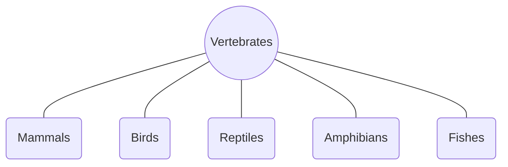
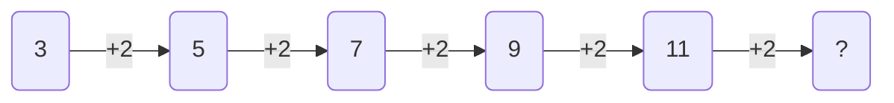
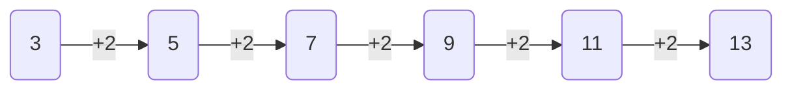
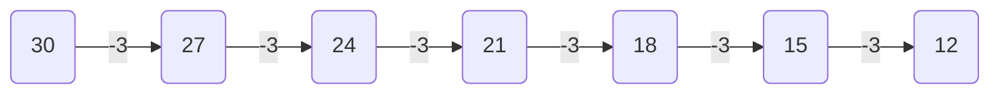
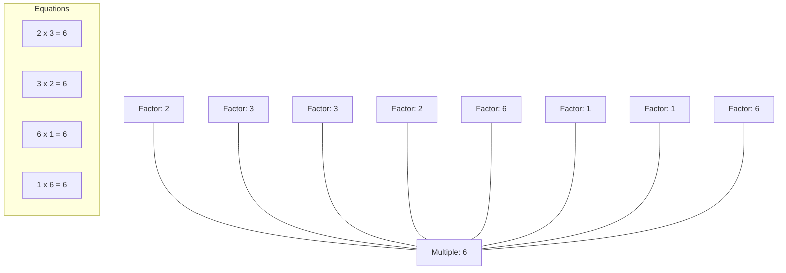
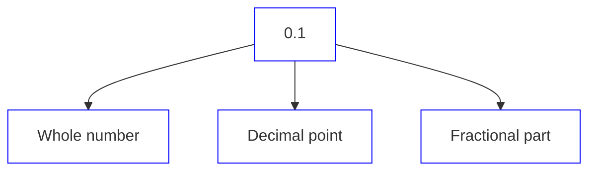

# Grade 4 Mathematics

Based on Single National Curriculum 2020
One Nation, One Curriculum

The cover page features various mathematical illustrations:

*   **Geometry and Angles:**
    *   A diagram showing a full rotation of $360^\circ$ around point A.
    *   An angle diagram labeled with:
        *   O (Vertex)
        *   (Initial ray) pointing towards A
        *   (Terminal ray) pointing towards B
        *   (Angle) indicated between the rays.
    *   A straight line diagram showing a $180^\circ$ angle at point B, with points C and A on either side.
*   **Arithmetic and Operations:**
    *   A prime factorization or division ladder:
        <table>
  <tbody>
    <tr>
        <td>2</td>
        <td>8</td>
    </tr>
    <tr>
        <td>2</td>
        <td>4</td>
    </tr>
    <tr>
        <td>2</td>
        <td>2</td>
    </tr>
    <tr>
        <td></td>
        <td>1</td>
    </tr>
  </tbody>
</table>
    *   Large colorful circles containing mathematical operators:
        *   Minus ($-$) in red
        *   Multiplication ($\times$) in purple
        *   Division ($\div$) in light blue
        *   Addition ($+$) in green
*   **Measurement:**
    *   An analog clock showing the time approximately 1:33.
*   **Shapes and Solids:**
    *   A pie chart with three segments (one teal, two white).
    *   A collection of 3D geometric solids including cubes, prisms, a cone, a pyramid, and hexagonal prisms in various colors (green, blue, yellow, pink, purple, red).


Punjab Curriculum and Textbook Board, Lahore

بِسْمِ اللهِ الرَّحْمٰنِ الرَّحِيْمِ
(In the Name of Allah, the Most Compassionate, the Most Merciful)

# Mathematics
## Grade 4

~~Web version of PCTB Textbooks~~
~~Not for Sale~~

Based on Single National Curriculum 2020
**ONE NATION, ONE CURRICULUM**

The image shows the logo of the Punjab Curriculum and Textbook Board, which is a circular emblem containing Urdu script.

**PUNJAB CURRICULUM AND**
**TEXTBOOK BOARD, LAHORE**

This book is based on Single National Curriculum 2020 and has been approved by the National Review Committee

All rights are reserved with the Punjab Curriculum and Textbook Board, Lahore. No part of this book can be copied, translated, reproduced or used for preparation of test papers, guidebooks, keynotes and helping books.

# Contents

<table>
  <thead>
    <tr>
        <th>Unit #</th>
        <th></th>
        <th>Topics</th>
        <th></th>
        <th>Page #</th>
        <th></th>
    </tr>
  </thead>
  <tbody>
    <tr>
        <td>1</td>
        <td>Whole Numbers</td>
        <td>1</td>
        <td colspan="3"></td>
    </tr>
    <tr>
        <td rowspan="2"></td>
        <td>* Addition and Subtraction</td>
        <td>13</td>
        <td colspan="3"></td>
    </tr>
    <tr>
        <td>* Multiplication and Division</td>
        <td>22</td>
        <td colspan="3"></td>
    </tr>
    <tr>
        <td>2</td>
        <td>Factors and Multiples</td>
        <td>35</td>
        <td colspan="3"></td>
    </tr>
    <tr>
        <td>3</td>
        <td>Fractions</td>
        <td>49</td>
        <td colspan="3"></td>
    </tr>
    <tr>
        <td>4</td>
        <td>Decimals</td>
        <td>70</td>
        <td colspan="3"></td>
    </tr>
    <tr>
        <td>5</td>
        <td>Measurements</td>
        <td>93</td>
        <td colspan="3"></td>
    </tr>
    <tr>
        <td></td>
        <td>* Time</td>
        <td>112</td>
        <td colspan="3"></td>
    </tr>
    <tr>
        <td>6</td>
        <td>Geometry</td>
        <td>129</td>
        <td colspan="3"></td>
    </tr>
    <tr>
        <td>7</td>
        <td>Data Handling</td>
        <td>162</td>
        <td colspan="3"></td>
    </tr>
    <tr>
        <td></td>
        <td>Answers</td>
        <td>175</td>
        <td colspan="3"></td>
    </tr>
    <tr>
        <td></td>
        <td>Glossary</td>
        <td>182</td>
        <td colspan="3"></td>
    </tr>
  </tbody>
</table>

**Supervision: Muhammad Rafique Tahir**
Joint Educational Advisor
National Curriculum Council, Ministry of Federal Education and Professional Training, Islamabad
**Focal Person Punjab (Single National Curriculum):** Aamir Riaz, Director (Curriculum), PCTB
**Authors:** Sadia Manzoor, Madeeha Nuzhat Varaich

### National Review Committee Members

**Muhammad Akhtar Shirani**
Punjab Curriculum & Textbook Board, Lahore

**Sherzad Ali**
Sir Syed Ahmad Khan Govt. Boys Higher Secondary School No. 1, Gilgit

**Tayyaba Saqib**
Pak Turk Maarif International School & Colleges, H/9, Islamabad

**Abbas Khan**
Directorate of Curriculum & Teacher Education, Abbottabad, KPK

**Dr. Razia Fakir Muhammad**
Aga Khan University, Institute for Education Development, Karachi

**Saeeda Parveen**
Islamabad College for Girls, F-6/2, Islamabad

**Gul Muhammad**
Bureau of Curriculum & Extension Centre, Quetta

**Raihana Ghulam Hussain**
F.G. Sir Syed Public School (Girls) II, Rawalpindi

**Dr. Muhammad Irfan Ali**
Islamabad Model College for Boys, G-11/1, Islamabad

**Technical Assistant:** Nighat Lone, Asfundyar Khan
**Desk Officer:** Sikandra Ali (National Curriculum Council)
**Director (Manuscripts), PCTB:** Farida Sadiq
**Deputy Director (Art & Design):** Ghulam Mohayy-ud-Din
**Supervised By:** Muhammad Akhtar Shirani (SS), Madiha Mehmood (SS)
**Consultant:** Muhammad Yahya Naoman
**Designers:** Abdul Jabbar, Muhammad Wazir Malik, Faisal Ghafoor Sheikh, Akmal Shehzad, Minal Tariq
**Illustrators:** Uffaq Aamir, Ayatullah, Shutterstock
**Composer:** Junaid Akram

<table>
    <tr>
        <th>Experimental Edition</th>
    </tr>
</table>
<table>
  <thead>
    <tr>
        <th>Published by:</th>
        <th></th>
        <th>Printed by</th>
        <th></th>
        <th>Date</th>
        <th></th>
    </tr>
  </thead>
  <tbody>
    <tr>
        <td>Punjab Curriculum And Textbook Board Lahore</td>
        <td>GF PRINTING PRESS LAHORE.</td>
        <td>February, 2022</td>
        <td colspan="3"></td>
    </tr>
  </tbody>
</table>
<table>
  <thead>
    <tr>
        <th>PMIU</th>
        <th></th>
        <th>PEF</th>
        <th></th>
        <th>PEIMA</th>
        <th></th>
        <th>MLWC</th>
        <th></th>
        <th>LNFBE</th>
        <th></th>
        <th>Total</th>
        <th></th>
    </tr>
  </thead>
  <tbody>
    <tr>
        <td>579690</td>
        <td>155915</td>
        <td>62751</td>
        <td>157</td>
        <td>53195</td>
        <td>851,708</td>
        <td colspan="6"></td>
    </tr>
  </tbody>
</table>

Unit 1 Whole Numbers


# Learning Outcomes

**After completing this section, you will be able to:**

*   Identify place values of digits up to one hundred thousand (100 000).
*   Read numbers up to one hundred thousand (100 000).
*   Write numbers up to one hundred thousand (100 000).
*   Write numbers in words up to one hundred thousand (100 000).
*   Compare and order numbers up to 5-digit.

The page features an illustration of a tiger lying in a grassy landscape with green hills and trees in the background under a blue sky with clouds.

> A tiger hunts alone. It eats 39 916 g of meat at a time. How can we write this quantity in words?


1
Not For Sale - PESRP

Mathematics 4 | Unit 1: Whole Numbers


# Numbers up to One Hundred Thousand

The image shows a boy asking a question:
> The length of the great wall of China is 21 196 km. How can we read and write 21 196 in words?

The image shows a girl explaining:
> The number which is greater than 3-digits, we leave space after every 3-digits from the right side of that number, i.e. 21 196.
> We read and write the number in words as "twenty-one thousand one hundred ninety-six".

The image shows a girl in a headscarf saying:
> Let us write 69 273 in the place value chart.

**Key Fact**
> To write the number as sum of place values is called expanded form.

<table>
  <thead>
    <tr>
        <th colspan="3">Second Period<br/>Thousands</th>
        <th colspan="3">First Period<br/>Ones</th>
    </tr>
    <tr>
        <th>Hundred Thousands</th>
        <th>Ten Thousands</th>
        <th>Thousands</th>
        <th>Hundreds</th>
        <th>Tens</th>
        <th>Ones</th>
    </tr>
  </thead>
  <tbody>
    <tr>
        <td></td>
        <td>6</td>
        <td>9</td>
        <td>2</td>
        <td>7</td>
        <td>3</td>
    </tr>
  </tbody>
</table>

We write 69 273 in words as "sixty-nine thousand two hundred seventy-three". The expanded form of this number is:
$$69\ 273 = 60\ 000 + 9\ 000 + 200 + 70 + 3$$

> **TEACHING POINT:** Give flashcards of place values to the children. Write some numbers on the writing board and by pointing every digit of the number one by one, ask the children to show correct place value card of that digit.


2
Not For Sale - PESRP

Mathematics 4 | Unit 1: Whole Numbers


> Now, we write place and place value of every digit in 69 273.

### Try Yourself
Tell the place and place value of every digit in 42 918. Also write this number in words.

'6' is at the ten thousands place and its place value $= 6 \times 10\ 000 = 60\ 000$
'9' is at the thousands place and its place value $= 9 \times 1\ 000 = 9\ 000$
'2' is at the hundreds place and its place value $= 2 \times 100 = 200$
'7' is at the tens place and its place value $= 7 \times 10 = 70$
'3' is at the ones place and its place value $= 3 \times 1 = 3$

> The cost of a laptop is Rs 78 500. Let's write the place and place value of digits 78 500. Also write it in expanded form and in words.

'7' is at the ten thousands place and its place value $= 7 \times 10\ 000 = 70\ 000$
'8' is at the thousands place and its place value $= 8 \times 1\ 000 = 8\ 000$
'5' is at the hundreds place and its place value $= 5 \times 100 = 500$
'0' is at the tens place and its place value $= 0 \times 10 = 0$
'0' is at the ones place and its place value $= 0 \times 1 = 0$

**In expanded form:** $70\ 000 + 8\ 000 + 500 + 0 + 0$
**In words:** Seventy-eight thousand five hundred.
**In standard form:** 78 500

<table>
    <tr>
        <th>TEACHING POINT</th>
        <th>Ask the children to write a 5-digit number in the notebook. Then instruct them to write this number in words and write the place and place value of each digit of that number.</th>
    </tr>
</table>
3
Not For Sale - PESRP

Mathematics 4 | Unit 1: Whole Numbers


99 999 is the greatest 5-digit whole number. If we add 1 more to it, we get one hundred thousand that is the smallest 6-digit whole number.

> ### Try Yourself
> How many ten thousands are there in one hundred thousand?

$$
\begin{array}{r}
99\ 999 \\
+\quad 1 \\
\hline
100\ 000
\end{array}
$$

We write these numbers in the place value chart as:

<table>
  <thead>
    <tr>
        <th colspan="3">Second Period</th>
        <th colspan="3">First Period</th>
    </tr>
    <tr>
        <th colspan="3">Thousands</th>
        <th colspan="3">Ones</th>
    </tr>
    <tr>
        <th>Hundred Thousands</th>
        <th>Ten Thousands</th>
        <th>Thousands</th>
        <th>Hundreds</th>
        <th>Tens</th>
        <th>Ones</th>
    </tr>
  </thead>
  <tbody>
    <tr>
        <td></td>
        <td>9</td>
        <td>9</td>
        <td>9</td>
        <td>9</td>
        <td>9</td>
    </tr>
    <tr>
        <td>1</td>
        <td>0</td>
        <td>0</td>
        <td>0</td>
        <td>0</td>
        <td>0</td>
    </tr>
  </tbody>
</table>

> ### Try Yourself
> Can you tell what is the smallest and the greatest 5-digit whole numbers?

### Try It! Challenge

By using the given digits: **7, 2, 3, 6, 5**

*   Make the greatest 5-digit number and write it in words.
*   Make the smallest 5-digit number and write the place value of each digit of that number.
*   Write 3-different numbers whose digit at thousands place is 3.
*   Make a 5-digit whole number whose sum of digits of ten thousands place and tens place is 8 and the difference is 2.
*   Write such a whole number in which no digit is repeated.


4
Not For Sale - PESRP

Mathematics 4 | Unit 1: Whole Numbers


# Exercise 1

1. Write the following numbers in the expanded form:
   - (a) 75 432
   - (b) 37 911
   - (c) 10 956
   - (d) 46 743
   - (e) 86 594
   - (f) 19 223
   - (g) 22 167
   - (h) 57 890
   - (i) 36 789
   - (j) 78 324
   - (k) 41 452
   - (l) 56 432

2. Write the following numbers given in their expanded form into standard form:
   - (a) 20 000 + 1 000 + 100 + 70 + 1 = \_\_\_\_\_\_\_\_\_\_
   - (b) 30 000 + 9 000 + 200 + 30 + 5 = \_\_\_\_\_\_\_\_\_\_
   - (c) 60 000 + 5 000 + 300 + 40 + 3 = \_\_\_\_\_\_\_\_\_\_
   - (d) 50 000 + 6 000 + 700 + 90 + 0 = \_\_\_\_\_\_\_\_\_\_

3. Write the place and place value of the coloured digits.
   - (a) 76 **1**02
   - (b) **2**4 360
   - (c) 94 **6**15
   - (d) 65 49**6**
   - (e) **7**3 456
   - (f) 18 **6**54
   - (g) 34 5**6**6
   - (h) **8**6 042
   - (i) 56 3**2**4

4. Write the following numbers in words:
   - (a) 74 325
   - (b) 43 711
   - (c) 19 560
   - (d) 75 434
   - (e) 67 459
   - (f) 25 302
   - (g) 36 721
   - (h) 78 065
   - (i) 62 897
   - (j) 37 264
   - (k) 45 129
   - (l) 43 275

5. Write the following in numerals:
   - (a) Twenty-five thousand six hundred
   - (b) Seventy-eight thousand four hundred two
   - (c) Forty-one thousand sixty-one
   - (d) Ninety-eight thousand three hundred one
   - (e) Seventy-two thousand five hundred forty-six
   - (f) Twelve thousand five hundred fifty-five
   - (g) Ninety-eight thousand five
   - (h) Forty-eight thousand four hundred forty-four
   - (i) Eighty-eight thousand three hundred twenty


5 | Not For Sale - PESRP

Mathematics 4 | Unit 1: Whole Numbers


# Comparing and Ordering Numbers

> The diameter of Earth is 12 742 km. The diameter of Venus is 12 104 km. How can we compare the diameters of both planets?

> We can compare the numbers easily with the help of place value of digits in the numbers.

The image shows a diagram of the solar system with the Sun and planets labeled: Mercury, Venus, Earth, Mars, Jupiter, Saturn, Uranus, and Neptune.

<table>
  <thead>
    <tr>
        <th colspan="2">Second Period</th>
        <th colspan="3">First Period</th>
    </tr>
    <tr>
        <th colspan="2">Thousands</th>
        <th colspan="3">Ones</th>
    </tr>
    <tr>
        <th>Ten Thousands</th>
        <th>Thousands</th>
        <th>Hundreds</th>
        <th>Tens</th>
        <th>Ones</th>
    </tr>
  </thead>
  <tbody>
    <tr>
        <td>1</td>
        <td>2</td>
        <td>7</td>
        <td>4</td>
        <td>2</td>
    </tr>
    <tr>
        <td>1</td>
        <td>2</td>
        <td>1</td>
        <td>0</td>
        <td>4</td>
    </tr>
  </tbody>
</table>

### Try Yourself
Compare 62 323 and 62 199, by using correct symbol.

(i) First compare the digit at the greatest place value. The digits of both the numbers at ten thousands place is '1'.
(ii) The digits of both the numbers at thousands place is '2'.
(iii) At hundreds place the digit '7' is greater than the digit '1'.

So, 12 742 is greater than 12 104 that is:
$$12 742 > 12 104$$

So, diameter of Earth is greater than Venus.

### Key Fact
To compare numbers, compare digits from left to right until you find two different digits.


6
Not For Sale - PESRP

Mathematics 4 | Unit 1: Whole Numbers


> Let's find out which number is smaller than the given numbers.
> 32 979 and 40 322

### Try Yourself
Compare the greatest and the smallest 5-digit number.

<table>
  <thead>
    <tr>
        <th></th>
        <th colspan="2">Second Period</th>
        <th colspan="3">First Period</th>
    </tr>
    <tr>
        <th></th>
        <th colspan="2">Thousands</th>
        <th colspan="3">Ones</th>
    </tr>
    <tr>
        <th>Ten Thousands</th>
        <th>Thousands</th>
        <th>Hundreds</th>
        <th>Tens</th>
        <th>Ones</th>
        <th></th>
    </tr>
  </thead>
  <tbody>
    <tr>
        <td>3</td>
        <td>2</td>
        <td>9</td>
        <td>7</td>
        <td>9</td>
        <td></td>
    </tr>
    <tr>
        <td>4</td>
        <td>0</td>
        <td>3</td>
        <td>2</td>
        <td>2</td>
        <td></td>
    </tr>
  </tbody>
</table>

Here, the digit '3' at ten thousands place is smaller than the digit '4'.
So, 32 979 is smaller than 40 322 that is:
$$32 979 < 40 322$$

### Try Yourself
Compare 8 799; 22 234 and 22 229.

The price of three mobile phone sets are Rs 62 870, Rs 78 200 and Rs 75 110 respectively. Compare their prices and write it in an ascending and descending order.

[The image shows three mobile phone sets of different colors: green, pink, and blue.]

<table>
  <thead>
    <tr>
        <th></th>
        <th colspan="2">Second Period</th>
        <th colspan="3">First Period</th>
    </tr>
    <tr>
        <th></th>
        <th colspan="2">Thousands</th>
        <th colspan="3">Ones</th>
    </tr>
    <tr>
        <th>Ten Thousands</th>
        <th>Thousands</th>
        <th>Hundreds</th>
        <th>Tens</th>
        <th>Ones</th>
        <th></th>
    </tr>
  </thead>
  <tbody>
    <tr>
        <td>6</td>
        <td>2</td>
        <td>8</td>
        <td>7</td>
        <td>0</td>
        <td></td>
    </tr>
    <tr>
        <td>7</td>
        <td>8</td>
        <td>2</td>
        <td>0</td>
        <td>0</td>
        <td></td>
    </tr>
    <tr>
        <td>7</td>
        <td>5</td>
        <td>1</td>
        <td>1</td>
        <td>0</td>
        <td></td>
    </tr>
  </tbody>
</table>

* In 62 870, the digit at ten thousands place is the smallest. Therefore, 62 870 is the smallest number.


7
Not For Sale - PESRP

Mathematics 4 | Unit 1: Whole Numbers


*   In 78 200 and 75 110, the digits at ten thousands place are equal. In their thousands place digit '8' is greater than '5'. Therefore, 78 200 is greater than 75 110.
*   Let's write these numbers in an ascending order.
    Ascending order: 62 870 ; 75 110 ; 78 200
*   Let's write these numbers in descending order.
    Descending order: 78 200 ; 75 110 ; 62 870

> **Key Fact**
>
> The arrangement of numbers from the smallest to the greatest is called an ascending order. The arrangement of numbers from the greatest to the smallest is called descending order.

### Try It! Challenge
Make two 4-digit and three 5-digit numbers. In every number the digit at the thousand place is '5' and digit at ones place is '9'. Then compare these numbers and write in descending order.

## Exercise 2

1. Compare the following numbers by using symbols (<, >, =):

<table>
  <tbody>
    <tr>
        <td>(a) 84 325 \_\_\_\_\_\_\_\_ 93 417</td>
        <td>(b) 4 853 \_\_\_\_\_\_\_\_ 19 314</td>
    </tr>
    <tr>
        <td>(c) 56 708 \_\_\_\_\_\_\_\_ 32 156</td>
        <td>(d) 23 612 \_\_\_\_\_\_\_\_ 23 612</td>
    </tr>
    <tr>
        <td>(e) 65 356 \_\_\_\_\_\_\_\_ 65 358</td>
        <td>(f) 74 932 \_\_\_\_\_\_\_\_ 74 542</td>
    </tr>
    <tr>
        <td>(g) 68 709 \_\_\_\_\_\_\_\_ 68 709</td>
        <td>(h) 32 567 \_\_\_\_\_\_\_\_ 23 578</td>
    </tr>
  </tbody>
</table>

> **TEACHING POINT**
> Call some students in front of the class and give them flashcards different numbers. Now ask them to compare numbers and write in ascending and descending order.


8
Not For Sale - PESRP

Mathematics 4 Unit 1: Whole Numbers


2. Write the following numbers in an ascending order:
(a) 40 131; 40 735; 31 273 (b) 30 817; 28 211; 43 181
(c) 70 442; 58 375; 84 176 (d) 67 319; 22 342; 97 323
(e) 83 624; 36 241; 63 283 (f) 48 326; 23 634; 43 124
(g) 59 312; 60 337; 24 085 (h) 89 675; 84 675; 89 546

3. Write the following numbers in descending order:
(a) 83 401; 97 035; 12 337 (b) 18 017; 18 221; 13 411
(c) 42 734; 53 358; 48 176 (d) 36 121; 34 222; 37 923
(e) 16 483; 23 601; 36 243 (f) 12 683; 24 313; 24 391
(g) 32 531; 36 537; 28 540 (h) 98 754; 78 543; 89 654

# I have learnt to:

* identify the place value of digits up to one hundred thousand.
* read the numbers up to one hundred thousand.
* write the numbers up to one hundred thousand.
* read and write the numbers in words up to one hundred thousand.
* compare and order numbers up to 5-digit.

> ### Vocabulary
> * Numbers
> * Digit
> * Place Value
> * Compare
> * Order
> * Ascending
> * Descending


9
Not For Sale - PESRP

Mathematics 4 | Unit 1: Whole Numbers


# Review Exercise

1. Choose the correct options and fill in the blanks.
   (a) The smallest 6-digit number is \_\_\_\_\_\_\_\_\_\_.
   (i) 111 111 (ii) 100 000 (iii) 101 010 (iv) 111 000

   (b) Comparison of numbers always starts from the \_\_\_\_\_\_\_\_\_\_.
   (i) right (ii) left (iii) last (iv) above

   (c) In number 38 101, the place value of digit '8' is \_\_\_\_\_\_\_\_\_\_.
   (i) 800 (ii) 8 (iii) 80 (iv) 8000

   (d) The greatest 5-digit number is \_\_\_\_\_\_\_\_\_\_.
   (i) 91 100 (ii) 90 101 (iii) 99 999 (iv) 90 000

   (e) 34 011 is greater than \_\_\_\_\_\_\_\_\_\_.
   (i) 34 010 (ii) 34 111 (iii) 34 210 (iv) 34 212

   (f) 31 108 is smaller than \_\_\_\_\_\_\_\_\_\_.
   (i) 31 106 (ii) 31 107 (iii) 30 100 (iv) 31 109

2. Write the following numbers in words:
   (a) 43 567 (b) 97 741 (c) 52 016
   (d) 46 743 (e) 58 649 (f) 95 202
   (g) 10 007 (h) 86 950 (i) 60 000
   (j) 60 032 (k) 52 901 (l) 36 427


10
Not For Sale - PESRP

Mathematics 4 Unit 1: Whole Numbers


### 3. Write the following numbers in the expanded form:

<table>
  <tbody>
    <tr>
        <td>a</td>
        <td>53 672</td>
        <td>b</td>
        <td>74 311</td>
        <td>c</td>
        <td>25 609</td>
    </tr>
    <tr>
        <td>d</td>
        <td>65 743</td>
        <td>e</td>
        <td>78 945</td>
        <td>f</td>
        <td>92 502</td>
    </tr>
    <tr>
        <td>g</td>
        <td>16 272</td>
        <td>h</td>
        <td>69 078</td>
        <td>i</td>
        <td>27 869</td>
    </tr>
    <tr>
        <td>j</td>
        <td>32 786</td>
        <td>k</td>
        <td>41 902</td>
        <td>l</td>
        <td>64 753</td>
    </tr>
  </tbody>
</table>

### 4. Write the following in numerals:

(a) Fifty-one thousand five hundred eighty-six
(b) Eighty-two thousand four hundred four
(c) Fifteen thousand sixty hundred sixty
(d) Twenty-one thousand one hundred five
(e) Twenty-three thousand five hundred six
(f) Ninety-six thousand one hundred twenty-five
(g) Sixty-seven thousand three

### 5. Write the place and place value of the coloured digits.

*(Note: Coloured digits are represented in **bold**)*

<table>
  <tbody>
    <tr>
        <td>a</td>
        <td>65 0**2**1</td>
        <td>b</td>
        <td>**2**4 360</td>
        <td>c</td>
        <td>46 **7**15</td>
    </tr>
    <tr>
        <td>d</td>
        <td>6**0** 704</td>
        <td>e</td>
        <td>57 5**6**4</td>
        <td>f</td>
        <td>2**6** 514</td>
    </tr>
    <tr>
        <td>g</td>
        <td>**5**2 663</td>
        <td>h</td>
        <td>34 **5**40</td>
        <td colspan="2"></td>
    </tr>
  </tbody>
</table>


11
Not For Sale - PESRP

Mathematics 4 Unit 1: Whole Numbers


6. Write the following in standard form:
(a) 40 000 + 4 000 + 600 + 80 + 3 \_\_\_\_\_\_\_\_\_\_\_\_\_\_
(b) 90 000 + 0 000 + 000 + 50 + 4 \_\_\_\_\_\_\_\_\_\_\_\_\_\_
(c) 20 000 + 9 000 + 100 + 00 + 4 \_\_\_\_\_\_\_\_\_\_\_\_\_\_
(d) 10 000 + 6 000 + 700 + 80 + 5 \_\_\_\_\_\_\_\_\_\_\_\_\_\_

7. Compare the following numbers by using symbols (<, >, =):

<table>
  <tbody>
    <tr>
        <td>a</td>
        <td>5 847 __________ 31 341</td>
        <td>b</td>
        <td>34 875 __________ 98 317</td>
    </tr>
    <tr>
        <td>c</td>
        <td>50 678 __________ 45 321</td>
        <td>d</td>
        <td>75 326 __________ 21 635</td>
    </tr>
    <tr>
        <td>e</td>
        <td>76 643 __________ 76 643</td>
        <td>f</td>
        <td>37 256 __________ 54 490</td>
    </tr>
    <tr>
        <td>g</td>
        <td>66 809 __________ 24 351</td>
        <td>h</td>
        <td>32 674 __________ 26 228</td>
    </tr>
  </tbody>
</table>

8. Write the following numbers in an ascending order.
(a) 94 041; 84 405; 33 731
(b) 19 375; 12 921; 14 131
(c) 45 034; 37 358; 42 876
(d) 36 172; 35 242; 37 723

9. Write the following numbers in descending order:
(a) 12 683; 14 601; 18 624
(b) 16 283; 26 133; 14 394
(c) 23 913; 30 536; 22 480
(d) 54 788; 54 786; 54 790


12
Not For Sale - PESRP

# Addition and Subtraction

## Learning Outcomes
**After completing this section, you will be able to:**
* Add numbers up to 5-digit.
* Solve real life number stories involving addition of numbers up to 5-digit.
* Subtract numbers up to 5-digit.
* Solve real life situations involving subtraction of numbers up to 5-digit.

An illustration shows an aeroplane flying in a blue sky with clouds and a sun.

> An aeroplane covers 10 882 km distance from Peshawar to Toronto. The same plane covers approximately 11 233 km distance from Toronto to Lahore. Find the total distance covered during these two flights.


13
Not For Sale - PESRP

Mathematics 4 | Unit 1: Addition and Subtraction


# Addition

> In town 'A', the number of casted votes were 54 372. In town 'B', the number of casted votes were 25 617. Can you find out how many votes were casted in both the towns altogether?

> To find the total number of casted votes, we add them.

<table>
  <thead>
    <tr>
        <th></th>
        <th>Ten Thousands</th>
        <th>Thousands</th>
        <th>Hundreds</th>
        <th>Tens</th>
        <th>Ones</th>
    </tr>
  </thead>
  <tbody>
    <tr>
        <td>Casted votes in town 'A' =</td>
        <td>5</td>
        <td>4</td>
        <td>3</td>
        <td>7</td>
        <td>2</td>
    </tr>
    <tr>
        <td>Casted votes in town 'B' =</td>
        <td>+ 2</td>
        <td>5</td>
        <td>6</td>
        <td>1</td>
        <td>7</td>
    </tr>
    <tr>
        <td>Total votes =</td>
        <td>7</td>
        <td>9</td>
        <td>9</td>
        <td>8</td>
        <td>9</td>
    </tr>
  </tbody>
</table>

So, total 79 989 votes were casted in both the towns altogether.

A publishing house published 25 575 storybooks. Considering the popularity of the storybook, the second edition was also published. In the second edition, 42 915 storybooks were published. Find the total number of storybooks published in both editions.

### Try Yourself
Add 51 292 and 32 602.

> [!NOTE]
> Instruct the students to make two 5-digit numbers and ask them to add these numbers and tell the method of addition.


14
Not For Sale - PESRP

Mathematics 4 | Unit 1: Addition and Subtraction


> Here, we add the number of storybooks published to get the total quantity.

<table>
  <thead>
    <tr>
        <th></th>
        <th>Ten Thousands</th>
        <th>Thousands</th>
        <th>Hundreds</th>
        <th>Tens</th>
        <th>Ones</th>
    </tr>
  </thead>
  <tbody>
    <tr>
        <td>The number of storybooks published in the first edition =</td>
        <td>2</td>
        <td>① 5</td>
        <td>5</td>
        <td>① 7</td>
        <td>5</td>
    </tr>
    <tr>
        <td>The number of storybooks published in the second edition =</td>
        <td>+ 4</td>
        <td>2</td>
        <td>9</td>
        <td>1</td>
        <td>5</td>
    </tr>
    <tr>
        <td>Total quantity =</td>
        <td>6</td>
        <td>8</td>
        <td>4</td>
        <td>9</td>
        <td>0</td>
    </tr>
  </tbody>
</table>

So, total 68 490 number of storybooks were published in both editions.

### Try Yourself
Find the sum of the greatest 5-digit and the smallest 4-digit whole numbers.

### Challenge
### Try It!
Complete the following addition table:

<table>
  <thead>
    <tr>
        <th></th>
        <th>Ten Thousands</th>
        <th>Thousands</th>
        <th>Hundreds</th>
        <th>Tens</th>
        <th>Ones</th>
    </tr>
  </thead>
  <tbody>
    <tr>
        <td></td>
        <td>5</td>
        <td></td>
        <td></td>
        <td>3</td>
        <td></td>
    </tr>
    <tr>
        <td>+</td>
        <td></td>
        <td>2</td>
        <td>9</td>
        <td></td>
        <td>4</td>
    </tr>
    <tr>
        <td></td>
        <td>7</td>
        <td>9</td>
        <td>4</td>
        <td>1</td>
        <td>8</td>
    </tr>
  </tbody>
</table>

> [Teaching Point] With the help of different examples, explain the concept of addition also explain the rule of carrying during the process of addition.


15 | Not For Sale - PESRP

Mathematics 4 | Unit 1: Addition and Subtraction


# Exercise 1

1. Solve the following:

(a)
<table>
  <thead>
    <tr>
        <th></th>
        <th>T.th</th>
        <th>Th</th>
        <th>H</th>
        <th>T</th>
        <th>O</th>
    </tr>
  </thead>
  <tbody>
    <tr>
        <td></td>
        <td>1</td>
        <td>3</td>
        <td>9</td>
        <td>2</td>
        <td>7</td>
    </tr>
    <tr>
        <td>+</td>
        <td></td>
        <td>2</td>
        <td>4</td>
        <td>1</td>
        <td>5</td>
    </tr>
    <tr>
        <td>______________________________________</td>
        <td colspan="5"></td>
    </tr>
  </tbody>
</table>

(b)
<table>
  <thead>
    <tr>
        <th></th>
        <th>T.th</th>
        <th>Th</th>
        <th>H</th>
        <th>T</th>
        <th>O</th>
    </tr>
  </thead>
  <tbody>
    <tr>
        <td></td>
        <td>3</td>
        <td>5</td>
        <td>3</td>
        <td>2</td>
        <td>1</td>
    </tr>
    <tr>
        <td>+</td>
        <td></td>
        <td>4</td>
        <td>6</td>
        <td>4</td>
        <td>9</td>
    </tr>
    <tr>
        <td>______________________________________</td>
        <td colspan="5"></td>
    </tr>
  </tbody>
</table>

(c)
<table>
  <thead>
    <tr>
        <th></th>
        <th>T.th</th>
        <th>Th</th>
        <th>H</th>
        <th>T</th>
        <th>O</th>
    </tr>
  </thead>
  <tbody>
    <tr>
        <td></td>
        <td>7</td>
        <td>5</td>
        <td>6</td>
        <td>7</td>
        <td>9</td>
    </tr>
    <tr>
        <td>+</td>
        <td>1</td>
        <td>6</td>
        <td>8</td>
        <td>2</td>
        <td>8</td>
    </tr>
    <tr>
        <td>______________________________________</td>
        <td colspan="5"></td>
    </tr>
  </tbody>
</table>

(d)
<table>
  <thead>
    <tr>
        <th></th>
        <th>T.th</th>
        <th>Th</th>
        <th>H</th>
        <th>T</th>
        <th>O</th>
    </tr>
  </thead>
  <tbody>
    <tr>
        <td></td>
        <td>3</td>
        <td>5</td>
        <td>3</td>
        <td>1</td>
        <td>2</td>
    </tr>
    <tr>
        <td>+</td>
        <td>2</td>
        <td>4</td>
        <td>5</td>
        <td>6</td>
        <td>8</td>
    </tr>
    <tr>
        <td>______________________________________</td>
        <td colspan="5"></td>
    </tr>
  </tbody>
</table>

2. Solve the following:
(a) 58 134 + 45 367
(b) 78 954 + 12 236
(c) 89 764 + 97 856
(d) 53 241 + 67 543
(e) 98 756 + 56 744
(f) 65 432 + 87 643
(g) 42 115 + 61 537
(h) 58 764 + 65 744
(i) 54 312 + 68 534

3. Nida bought a laptop for Rs 59 453 and spent Rs 12 652 on repairing. How much total amount did she spend?

4. In January, 83 215 people travelled and in February, 21 084 people travelled from an airport. How many passengers travelled in two months?

5. In a library, there are 42 725 books. Administration decided to add 22 500 new books.
(a) Find the total number of books in the library.
(b) If 23 890 more books are added then find the total number of books.

6. A bus covered 23 672 km distance in the first month, in the second month the same bus covered a distance of 31 716 km.
(a) Find the total distance covered in two months.
(b) In which month did it cover more distance?


16
Not For Sale - PESRP

Mathematics 4 Unit 1: Addition and Subtraction


# Subtraction

The animals that have backbone in their body are called vertebrates. If there are 66 178 types of vertebrates out of which 32 900 types are fish. How many vertebrates are there other than fish?


The diagram shows the classification of Vertebrates into five groups: Mammals (represented by a horse, dolphin, and bat), Birds (represented by a flamingo, penguin, and duck), Reptiles (represented by a lizard, turtle, and snake), Amphibians (represented by a frog, salamander, and newt), and Fishes (represented by various fish species).

> To find this quantity we have to subtract 32 900 from 66 178.

<table>
  <thead>
    <tr>
        <th></th>
        <th>Ten Thousands</th>
        <th>Thousands</th>
        <th>Hundreds</th>
        <th>Tens</th>
        <th>Ones</th>
    </tr>
  </thead>
  <tbody>
    <tr>
        <td>Total types of vertebrates =</td>
        <td>6</td>
        <td><sup>⑤</sup>6</td>
        <td><sup>⑩</sup>1</td>
        <td>7</td>
        <td>8</td>
    </tr>
    <tr>
        <td>Types of fish =</td>
        <td>- 3</td>
        <td>2</td>
        <td>9</td>
        <td>0</td>
        <td>0</td>
    </tr>
    <tr>
        <td>Remaining types =</td>
        <td>3</td>
        <td>3</td>
        <td>2</td>
        <td>7</td>
        <td>8</td>
    </tr>
  </tbody>
</table>

So, 33 278 types of vertebrates are there other than fish.

### Try Yourself
Make any two 5-digit numbers and subtract the smallest number from the greatest number.


17
Not For Sale - PESRP

Mathematics 4 | Unit 1: Addition and Subtraction


A total of 55 661 people visited the Pakistan Monument in December. In January, 12 255 less people visited as compared to December. How many people visited the Monument in January?

[The image shows a photograph of the Pakistan Monument at night, illuminated with golden lights.]

> Here, we will subtract 12 255 from 55 661 to find out how many visitors who visited in January.

<table>
  <thead>
    <tr>
        <th></th>
        <th>Ten Thousands</th>
        <th>Thousands</th>
        <th>Hundreds</th>
        <th>Tens</th>
        <th>Ones</th>
    </tr>
  </thead>
  <tbody>
    <tr>
        <td>Number of visitors came in December =</td>
        <td>5</td>
        <td>5</td>
        <td>6</td>
        <td>~~6~~ <sup>5</sup></td>
        <td><sup>10</sup>1</td>
    </tr>
    <tr>
        <td>Number of less visitors came in January as compared to December =</td>
        <td>- 1</td>
        <td>2</td>
        <td>2</td>
        <td>5</td>
        <td>5</td>
    </tr>
    <tr>
        <td>Difference =</td>
        <td>4</td>
        <td>3</td>
        <td>4</td>
        <td>0</td>
        <td>6</td>
    </tr>
  </tbody>
</table>

So, in January 43 406 visitors came to visit the Pakistan Monument.

### Try Yourself
Subtract the greatest 4-digit number from the smallest 5-digit number.

### Try It! Challenge
Find two numbers from the given numbers whose sum is 78 448 and the difference is 15 400.

46 924 | 72 876 | 31 524 | 66 234 | 89 076

> **TEACHING POINT:** Make small groups of students and ask them to write two 5-digit numbers and then subtract smaller number from greater number.


18
Not For Sale - PESRP

Mathematics 4 | Unit 1: Addition and Subtraction


# Exercise 2

1. Solve the following:

(a)
<table>
  <thead>
    <tr>
        <th></th>
        <th>T.th</th>
        <th>Th</th>
        <th>H</th>
        <th>T</th>
        <th>O</th>
    </tr>
  </thead>
  <tbody>
    <tr>
        <td></td>
        <td>4</td>
        <td>3</td>
        <td>5</td>
        <td>6</td>
        <td>2</td>
    </tr>
    <tr>
        <td>-</td>
        <td></td>
        <td>7</td>
        <td>3</td>
        <td>6</td>
        <td>6</td>
    </tr>
    <tr>
        <td>__________________________________________</td>
        <td colspan="5"></td>
    </tr>
  </tbody>
</table>

(b)
<table>
  <thead>
    <tr>
        <th></th>
        <th>T.th</th>
        <th>Th</th>
        <th>H</th>
        <th>T</th>
        <th>O</th>
    </tr>
  </thead>
  <tbody>
    <tr>
        <td></td>
        <td>5</td>
        <td>6</td>
        <td>8</td>
        <td>4</td>
        <td>8</td>
    </tr>
    <tr>
        <td>-</td>
        <td>3</td>
        <td>4</td>
        <td>3</td>
        <td>8</td>
        <td>9</td>
    </tr>
    <tr>
        <td>__________________________________________</td>
        <td colspan="5"></td>
    </tr>
  </tbody>
</table>

(c)
<table>
  <thead>
    <tr>
        <th></th>
        <th>T.th</th>
        <th>Th</th>
        <th>H</th>
        <th>T</th>
        <th>O</th>
    </tr>
  </thead>
  <tbody>
    <tr>
        <td></td>
        <td>9</td>
        <td>3</td>
        <td>9</td>
        <td>2</td>
        <td>1</td>
    </tr>
    <tr>
        <td>-</td>
        <td>2</td>
        <td>4</td>
        <td>6</td>
        <td>1</td>
        <td>8</td>
    </tr>
    <tr>
        <td>__________________________________________</td>
        <td colspan="5"></td>
    </tr>
  </tbody>
</table>

(d)
<table>
  <thead>
    <tr>
        <th></th>
        <th>T.th</th>
        <th>Th</th>
        <th>H</th>
        <th>T</th>
        <th>O</th>
    </tr>
  </thead>
  <tbody>
    <tr>
        <td></td>
        <td>6</td>
        <td>5</td>
        <td>6</td>
        <td>7</td>
        <td>5</td>
    </tr>
    <tr>
        <td>-</td>
        <td>1</td>
        <td>6</td>
        <td>4</td>
        <td>4</td>
        <td>7</td>
    </tr>
    <tr>
        <td>__________________________________________</td>
        <td colspan="5"></td>
    </tr>
  </tbody>
</table>

(e)
<table>
  <thead>
    <tr>
        <th></th>
        <th>T.th</th>
        <th>Th</th>
        <th>H</th>
        <th>T</th>
        <th>O</th>
    </tr>
  </thead>
  <tbody>
    <tr>
        <td></td>
        <td>5</td>
        <td>3</td>
        <td>5</td>
        <td>2</td>
        <td>1</td>
    </tr>
    <tr>
        <td>-</td>
        <td>3</td>
        <td>4</td>
        <td>6</td>
        <td>4</td>
        <td>9</td>
    </tr>
    <tr>
        <td>__________________________________________</td>
        <td colspan="5"></td>
    </tr>
  </tbody>
</table>

(f)
<table>
  <thead>
    <tr>
        <th></th>
        <th>T.th</th>
        <th>Th</th>
        <th>H</th>
        <th>T</th>
        <th>O</th>
    </tr>
  </thead>
  <tbody>
    <tr>
        <td></td>
        <td>3</td>
        <td>3</td>
        <td>2</td>
        <td>7</td>
        <td>5</td>
    </tr>
    <tr>
        <td>-</td>
        <td>2</td>
        <td>6</td>
        <td>2</td>
        <td>3</td>
        <td>8</td>
    </tr>
    <tr>
        <td>__________________________________________</td>
        <td colspan="5"></td>
    </tr>
  </tbody>
</table>

(g)
<table>
  <thead>
    <tr>
        <th></th>
        <th>T.th</th>
        <th>Th</th>
        <th>H</th>
        <th>T</th>
        <th>O</th>
    </tr>
  </thead>
  <tbody>
    <tr>
        <td></td>
        <td>9</td>
        <td>6</td>
        <td>2</td>
        <td>3</td>
        <td>7</td>
    </tr>
    <tr>
        <td>-</td>
        <td>7</td>
        <td>3</td>
        <td>4</td>
        <td>5</td>
        <td>5</td>
    </tr>
    <tr>
        <td>__________________________________________</td>
        <td colspan="5"></td>
    </tr>
  </tbody>
</table>

(h)
<table>
  <thead>
    <tr>
        <th></th>
        <th>T.th</th>
        <th>Th</th>
        <th>H</th>
        <th>T</th>
        <th>O</th>
    </tr>
  </thead>
  <tbody>
    <tr>
        <td></td>
        <td>6</td>
        <td>7</td>
        <td>4</td>
        <td>5</td>
        <td>3</td>
    </tr>
    <tr>
        <td>-</td>
        <td>3</td>
        <td>2</td>
        <td>5</td>
        <td>1</td>
        <td>4</td>
    </tr>
    <tr>
        <td>__________________________________________</td>
        <td colspan="5"></td>
    </tr>
  </tbody>
</table>

2. Solve the following:
(a) 45 158 - 34 756
(b) 97 843 - 61 732
(c) 99 754 - 67 584
(d) 25 341 - 16 753
(e) 85 964 - 74 544
(f) 63 541 - 58 463

3. Saad had Rs 52 490. He bought a bicycle for Rs 15 873.
(a) How much money was left with him?
(b) If the price of the bicycle is Rs 18 759, then how much money will be left?


19 | Not For Sale - PESRP

Mathematics 4 | Unit 1: Addition and Subtraction


4. In godown, there are 66 375 bags of wheat and rice. If number of wheat bags are 44 468 then find out the number of rice bags.

5. The students of class 3 collected Rs 35 278 for a welfare institution while the students of class 4 collected Rs 32 184. How much more amount collected by class 3 than class 4?

6. A candidate got 62 436 votes from one constituency while the other candidate got 86 733 votes. How much more votes did the second candidate get than the first candidate?

> ### I have learnt to:
> * add numbers up to 5-digit.
> * solve real-life situations related to addition.
> * subtract numbers up to 5-digit.
> * solve real-life situations related to subtraction.

## Review Exercise

1. Choose the correct options and fill in the blanks.

(a) The sum of 36 529 and 41 372 is equal to:
(i) 77 904 (ii) 77 903 (iii) 77 901 (iv) 77 902

(b) The sum of 17 278 and 62 354 is equal to:
(i) 78 234 (ii) 34 2211 (iii) 79 632 (iv) 213 455

(c) Ayesha had Rs 23 456. Her friend gave her Rs 13 131 more. Now, she has Rs \_\_\_\_\_\_\_\_\_\_.
(i) 36 587 (ii) 35 467 (iii) 36 434 (iv) 34 567

(d) When we subtract 73 810 from 89 654 then we will get \_\_\_\_\_\_\_\_\_\_.
(i) 12 345 (ii) 13 245 (iii) 14 765 (iv) 15 844


20
Not For Sale - PESRP

Mathematics 4 | Unit 1: Addition and Subtraction


(e) In a pond, there were 87 654 fish. If 34 567 fish are shifted to another pond then \_\_\_\_\_\_\_\_\_\_ fish will be left in the first pond.
(i) 53 123 (ii) 53 456 (iii) 53 087 (iv) 53 567

## 2. Solve the following:

(a)
<table>
  <thead>
    <tr>
        <th></th>
        <th>T.th</th>
        <th>Th</th>
        <th>H</th>
        <th>T</th>
        <th>O</th>
    </tr>
  </thead>
  <tbody>
    <tr>
        <td></td>
        <td>6</td>
        <td>7</td>
        <td>4</td>
        <td>3</td>
        <td>6</td>
    </tr>
    <tr>
        <td>+</td>
        <td>5</td>
        <td>4</td>
        <td>8</td>
        <td>3</td>
        <td>9</td>
    </tr>
  </tbody>
</table>

(b)
<table>
  <thead>
    <tr>
        <th></th>
        <th>T.th</th>
        <th>Th</th>
        <th>H</th>
        <th>T</th>
        <th>O</th>
    </tr>
  </thead>
  <tbody>
    <tr>
        <td></td>
        <td>6</td>
        <td>3</td>
        <td>5</td>
        <td>6</td>
        <td>3</td>
    </tr>
    <tr>
        <td>+</td>
        <td>4</td>
        <td>2</td>
        <td>8</td>
        <td>2</td>
        <td>7</td>
    </tr>
  </tbody>
</table>

(c)
<table>
  <thead>
    <tr>
        <th></th>
        <th>T.th</th>
        <th>Th</th>
        <th>H</th>
        <th>T</th>
        <th>O</th>
    </tr>
  </thead>
  <tbody>
    <tr>
        <td></td>
        <td>7</td>
        <td>8</td>
        <td>9</td>
        <td>3</td>
        <td>8</td>
    </tr>
    <tr>
        <td>+</td>
        <td>1</td>
        <td>2</td>
        <td>4</td>
        <td>7</td>
        <td>5</td>
    </tr>
  </tbody>
</table>

(d)
<table>
  <thead>
    <tr>
        <th></th>
        <th>T.th</th>
        <th>Th</th>
        <th>H</th>
        <th>T</th>
        <th>O</th>
    </tr>
  </thead>
  <tbody>
    <tr>
        <td></td>
        <td>6</td>
        <td>7</td>
        <td>3</td>
        <td>4</td>
        <td>3</td>
    </tr>
    <tr>
        <td>+</td>
        <td>4</td>
        <td>1</td>
        <td>2</td>
        <td>3</td>
        <td>5</td>
    </tr>
  </tbody>
</table>

(e)
<table>
  <thead>
    <tr>
        <th></th>
        <th>T.th</th>
        <th>Th</th>
        <th>H</th>
        <th>T</th>
        <th>O</th>
    </tr>
  </thead>
  <tbody>
    <tr>
        <td></td>
        <td>8</td>
        <td>3</td>
        <td>8</td>
        <td>9</td>
        <td>3</td>
    </tr>
    <tr>
        <td>-</td>
        <td>2</td>
        <td>3</td>
        <td>1</td>
        <td>0</td>
        <td>1</td>
    </tr>
  </tbody>
</table>

(f)
<table>
  <thead>
    <tr>
        <th></th>
        <th>T.th</th>
        <th>Th</th>
        <th>H</th>
        <th>T</th>
        <th>O</th>
    </tr>
  </thead>
  <tbody>
    <tr>
        <td></td>
        <td>3</td>
        <td>3</td>
        <td>2</td>
        <td>7</td>
        <td>5</td>
    </tr>
    <tr>
        <td>-</td>
        <td>1</td>
        <td>6</td>
        <td>2</td>
        <td>3</td>
        <td>8</td>
    </tr>
  </tbody>
</table>

## 3. Solve the following:
(a) 45 234 + 12 345
(b) 24 567 + 13 466
(c) 90 766 + 38 967
(d) 46 525 - 23 145
(e) 76 247 - 74 166
(f) 46 016 - 20 989

4. In the first week, 23 456 people went to visit the beach and in the second week 34 567 people went to visit the beach. Find:
(a) the total number of people visited the beach in two weeks.
(b) in which week less people visited the beach and by how much difference?

5. There were 12 345 cattle in a farm. If 34 567 more cattle are added, then find:
(a) how many cattle were there in the farm altogether?
(b) if 26 754 were goats out of the total, then what was the number of cattle other than goats?

6. There are 45 765 trees in a forest. If 32 124 are cactus trees, then find the number of trees other than cactus?

7. Arsalan has Rs 51 346. He wants to buy a laptop which costs Rs 75 432. How much more amount does he need to buy the laptop?


21
Not For Sale - PESRP

# Multiplication and Division


### Learning Outcomes

**After completing this section, you will be able to:**

*   Multiply numbers up to 5-digit by numbers up to 3-digit.
*   Solve real life situations involving multiplication of numbers up to 5-digit by 3-digit.
*   Divide numbers up to 4-digit by numbers up to 2-digit.
*   Solve real life situations involving division of numbers up to 4-digit by a number up to 2-digit.
*   Solve real life situations using appropriate operations of addition, subtraction, multiplication and division of numbers up to 2-digit.
*   Recognize a given increasing and decreasing pattern by stating a pattern rule.
*   Describe the pattern found in a given table or chart.
*   Complete the given increasing and decreasing number sequence.

The image depicts a solar system theme with planets orbiting the sun:
*   **Neptune** (blue planet)
*   **Uranus** (teal planet with rings)
*   **Jupiter** (large striped planet)
*   **Venus** (tan planet)
*   **Earth** (blue and green planet)
*   **Mercury** (small reddish-orange planet)
*   **Sun** (large orange/yellow star in the corner)

> The Earth completes its revolution around the sun in 365 days approximately. In how many days will it complete 3 revolutions?


22
Not For Sale - PESRP

Mathematics 4 | Unit 1: Multiplication and Division


# Multiplication

> If a person walks 6 213 steps in a day, find out how many steps will he walk in 3 days?

> By multiplying 6 213 with 3 we will find out the total number of steps. Multiply every digit of 6 213 with 3.

**Step 1** Multiply 3 ones with 3.
<table>
  <tbody>
    <tr>
        <td>Th</td>
        <td>H</td>
        <td>T</td>
        <td>O</td>
        <td></td>
    </tr>
    <tr>
        <td>6</td>
        <td>2</td>
        <td>1</td>
        <td>3</td>
        <td></td>
    </tr>
    <tr>
        <td>×</td>
        <td></td>
        <td></td>
        <td>3</td>
        <td></td>
    </tr>
    <tr>
        <td colspan="4">____________________</td>
        <td></td>
    </tr>
    <tr>
        <td></td>
        <td></td>
        <td></td>
        <td></td>
        <td>9</td>
    </tr>
  </tbody>
</table>

**Step 2** Multiply 1 tens with 3.
<table>
  <tbody>
    <tr>
        <td>Th</td>
        <td>H</td>
        <td>T</td>
        <td>O</td>
        <td></td>
    </tr>
    <tr>
        <td>6</td>
        <td>2</td>
        <td>1</td>
        <td>3</td>
        <td></td>
    </tr>
    <tr>
        <td>×</td>
        <td></td>
        <td></td>
        <td>3</td>
        <td></td>
    </tr>
    <tr>
        <td colspan="4">____________________</td>
        <td></td>
    </tr>
    <tr>
        <td></td>
        <td></td>
        <td></td>
        <td>3</td>
        <td>9</td>
    </tr>
  </tbody>
</table>

**Step 3** Multiply 2 hundreds with 3.
<table>
  <tbody>
    <tr>
        <td>Th</td>
        <td>H</td>
        <td>T</td>
        <td>O</td>
        <td></td>
    </tr>
    <tr>
        <td>6</td>
        <td>2</td>
        <td>1</td>
        <td>3</td>
        <td></td>
    </tr>
    <tr>
        <td>×</td>
        <td></td>
        <td></td>
        <td>3</td>
        <td></td>
    </tr>
    <tr>
        <td colspan="4">____________________</td>
        <td></td>
    </tr>
    <tr>
        <td></td>
        <td></td>
        <td>6</td>
        <td>3</td>
        <td>9</td>
    </tr>
  </tbody>
</table>

**Step 4** Multiply 6 thousands with 3.
<table>
  <tbody>
    <tr>
        <td>Th</td>
        <td>H</td>
        <td>T</td>
        <td>O</td>
        <td></td>
    </tr>
    <tr>
        <td>6</td>
        <td>2</td>
        <td>1</td>
        <td>3</td>
        <td></td>
    </tr>
    <tr>
        <td>×</td>
        <td></td>
        <td></td>
        <td>3</td>
        <td></td>
    </tr>
    <tr>
        <td colspan="4">____________________</td>
        <td></td>
    </tr>
    <tr>
        <td>1</td>
        <td>8</td>
        <td>6</td>
        <td>3</td>
        <td>9</td>
    </tr>
  </tbody>
</table>

So, he will walk 18 639 steps in 3 days.

> Ask the students to write a 4-digit number and a 1-digit number. Multiply the 5-digit number with the 3-digit number.


23
Not For Sale - PESRP

Mathematics 4 | Unit 1: Multiplication and Division


Find the product of 10 231 and 65.

<table>
  <tbody>
    <tr>
        <td>1</td>
        <td>0</td>
        <td>2</td>
        <td>3</td>
        <td>1</td>
        <td>Multiplicand</td>
        <td colspan="2"></td>
    </tr>
    <tr>
        <td>×</td>
        <td></td>
        <td></td>
        <td>6</td>
        <td>5</td>
        <td>Multiplier</td>
        <td colspan="2"></td>
    </tr>
    <tr>
        <td></td>
        <td></td>
        <td>①</td>
        <td>①</td>
        <td></td>
        <td></td>
        <td></td>
        <td></td>
    </tr>
    <tr>
        <td></td>
        <td>5</td>
        <td>1</td>
        <td>1</td>
        <td>5</td>
        <td>5</td>
        <td>10 231 × 5</td>
        <td></td>
    </tr>
    <tr>
        <td>+</td>
        <td>6</td>
        <td>1</td>
        <td>3</td>
        <td>8</td>
        <td>6</td>
        <td>0</td>
        <td>10 231 × 60</td>
    </tr>
    <tr>
        <td></td>
        <td>6</td>
        <td>6</td>
        <td>5</td>
        <td>0</td>
        <td>1</td>
        <td>5</td>
        <td>Product</td>
    </tr>
  </tbody>
</table>

$10\ 231 \times 65 = 665\ 015$

The cost of one cell phone is Rs 78 450. If a company sold 525 cell phones. Then, find out in how much amount did he sell all the cell phones?

> By multiplying the price of one cell phone with total number of cell phones, we will get the total amount.

Cost of one cell phone = Rs 78 450
Total cell phones = 525
The cost of 525 cell phones = $78\ 450 \times 525$
= Rs 41 186 250

<table>
  <tbody>
    <tr>
        <td>T.th</td>
        <td>Th</td>
        <td>H</td>
        <td>T</td>
        <td>O</td>
        <td></td>
        <td colspan="4"></td>
    </tr>
    <tr>
        <td></td>
        <td>7</td>
        <td>8</td>
        <td>4</td>
        <td>5</td>
        <td>0</td>
        <td></td>
        <td colspan="3"></td>
    </tr>
    <tr>
        <td>×</td>
        <td></td>
        <td></td>
        <td>5</td>
        <td>2</td>
        <td>5</td>
        <td></td>
        <td colspan="3"></td>
    </tr>
    <tr>
        <td></td>
        <td></td>
        <td>①</td>
        <td>①</td>
        <td></td>
        <td></td>
        <td></td>
        <td colspan="3"></td>
    </tr>
    <tr>
        <td></td>
        <td>3</td>
        <td>9</td>
        <td>2</td>
        <td>2</td>
        <td>5</td>
        <td>0</td>
        <td>78 450 × 5</td>
        <td colspan="2"></td>
    </tr>
    <tr>
        <td></td>
        <td>①</td>
        <td>①</td>
        <td></td>
        <td></td>
        <td></td>
        <td></td>
        <td colspan="3"></td>
    </tr>
    <tr>
        <td></td>
        <td>1</td>
        <td>5</td>
        <td>6</td>
        <td>9</td>
        <td>0</td>
        <td>0</td>
        <td>0</td>
        <td>78 450 × 20</td>
        <td></td>
    </tr>
    <tr>
        <td>①</td>
        <td></td>
        <td></td>
        <td></td>
        <td></td>
        <td></td>
        <td></td>
        <td colspan="3"></td>
    </tr>
    <tr>
        <td>+</td>
        <td>3</td>
        <td>9</td>
        <td>2</td>
        <td>2</td>
        <td>5</td>
        <td>0</td>
        <td>0</td>
        <td>0</td>
        <td>78 450 × 500</td>
    </tr>
    <tr>
        <td></td>
        <td>4</td>
        <td>1</td>
        <td>1</td>
        <td>8</td>
        <td>6</td>
        <td>2</td>
        <td>5</td>
        <td>0</td>
        <td></td>
    </tr>
  </tbody>
</table>

So, the company sold 525 cell phones for Rs 41 186 250.

### Try Yourself
Multiply the greatest 4-digit number with the greatest 3-digit number. Multiply the smallest 3-digit number with the smallest 5-digit number.


Not For Sale - PESRP | 24

Mathematics 4 | Unit 1: Multiplication and Division


> Now, we will multiply 32 and 5 in a different way.

First of all, write 32 in the expanded form.
$$32 = 30 + 2$$

(i) Now, write 30 + 2 horizontally and 5 vertically in a grid as shown in the table.

<table>
  <tbody>
    <tr>
        <td>30</td>
        <td>2</td>
    </tr>
    <tr>
        <td>5</td>
        <td></td>
    </tr>
  </tbody>
</table>

(ii) Multiply each number in the horizontal cells by the number 5 in the vertical cells.

(iii) Finally, add all the obtained numbers.
$$150 + 10 = 160$$

<table>
  <tbody>
    <tr>
        <td>×</td>
        <td>30</td>
        <td>2</td>
    </tr>
    <tr>
        <td>5</td>
        <td>150</td>
        <td>10</td>
    </tr>
  </tbody>
</table>

So, 160 is the product of 32 and 5.

# Exercise 1

1. Solve the following:
   (a) $631 \times 4$
   (b) $431 \times 35$
   (c) $8,434 \times 31$
   (d) $8,046 \times 678$
   (e) $7,601 \times 546$
   (f) $41,175 \times 80$
   (g) $79,762 \times 15$
   (h) $63,506 \times 303$
   (i) $11,098 \times 237$

2. A shopkeeper sold 34,523 m cloth in a week. How much cloth will he sell in 21 weeks?

3. Majid earns Rs 11,045 in a day. Find:
   (a) how much money will he earn in 365 days?
   (b) how much money will he earn in 2 years?

4. In a factory, 20,134 notebooks were printed in a day. How many notebooks will be printed in 210 days?

5. Each member of a group give Rs 34,156 for a tour of Naran and Kagan. If there are 345 members of the group, then how much money will the group collect altogether?


25 | Not For Sale - PESRP

# Division

84 students from a school went to visit the river side. They were given a boat to visit. 6 students could visit the river side in one round. In how many rounds will all the students visit the river?

Dividing the total number of students by 6, find out the number of rounds taken by the boat, so that all the students will have a boat ride.

Number of students visited the river side = 84  
Number of students who could visit the river side in one round = 6  
Total number of rounds = 84 ÷ 6

- In 84, divide the highest place value digit '8' by 6.
- Recall the table of 6. 1 × 6 = 6
- Write '1' as the quotient and write 6 below 8.
- Subtract 6 from 8. 8 − 6 = 2
- Drop down 4 next to 2. Now, we have number 24.
- 4 × 6 = 24
- Write '4' at ones place in the quotient and write 24 below 24 and subtract. So, the remainder will be 0.

<table>
  <thead>
    <tr>
        <th>Divisor</th>
        <th>Quotient</th>
        <th>Dividend</th>
        <th>Remainder</th>
    </tr>
  </thead>
  <tbody>
    <tr>
        <td>6</td>
        <td>1 4</td>
        <td>8 4</td>
        <td>0</td>
    </tr>
  </tbody>
</table>

84 ÷ 6 = 14

So, in 14 rounds all the students will visit the river side.

Mathematics 4 | Unit 1: Multiplication and Division


Divide 9 528 by 48 and find quotient and remainder.

$$
\begin{array}{r|l}
 & 198 \\
\hline
48 & 9528 \\
 & -48 \downarrow \\
\hline
 & 472 \\
 & -432 \downarrow \\
\hline
 & 408 \\
 & -384 \\
\hline
 & 24
\end{array}
$$

$9\ 528 \div 48$
Quotient = 198
Remainder = 24

> **Girl:** I have 1 455 lego blocks. Can I pack them equally in 12 packets?
>
> **Boy:** For this, 1 455 will have to be divided by 12.

Number of lego blocks = 1455
Number of packets = 12
The number of lego blocks in each packet = $1455 \div 12$

$$
\begin{array}{r|l}
 & 121 \\
\hline
12 & 1455 \\
 & -12 \downarrow \\
\hline
 & 25 \\
 & -24 \downarrow \\
\hline
 & 15 \\
 & -12 \\
\hline
 & 3
\end{array}
$$

So, the number of blocks in each packet = 121
Remaining blocks = 3

<table>
    <tr>
        <th>Teaching Point</th>
    </tr>
    <tr>
        <td>Ask the students to write some 4-digit numbers and some 2-digit numbers. Divide a 4-digit number by a 2-digit number.</td>
    </tr>
</table>
27
Not For Sale - PESRP

Mathematics 4 | Unit 1: Multiplication and Division


A company sold two types of USBs, Type-1 and Type-2. Total 9 655 USBs were sold. In which 3 571 USBs were of Type-1. Find:

(a) how many Type-2 USBs were sold?
(b) if Type-2 USBs were sold to three shopkeepers, then how many USBs each of them got?

> To find the number of Type-2 USBs, subtract the Type-1 from the total number of USBs.

$$9655 - 3571 = 6084$$

(a) So, 6 084 Type-2 USBs were sold.

> To find out the number of USBs that each shopkeeper gets, we divide 6 084 by 3.

(b) So, each shopkeeper gets 2 028 Type-2 USBs.

<table>
  <tbody>
    <tr>
        <td>2</td>
        <td>0</td>
        <td>2</td>
        <td>8</td>
        <td colspan="2"></td>
    </tr>
    <tr>
        <td>3</td>
        <td>6</td>
        <td>0</td>
        <td>8</td>
        <td>4</td>
        <td></td>
    </tr>
    <tr>
        <td></td>
        <td>- 6</td>
        <td>↓</td>
        <td></td>
        <td></td>
        <td></td>
    </tr>
    <tr>
        <td></td>
        <td>0</td>
        <td>0</td>
        <td></td>
        <td></td>
        <td></td>
    </tr>
    <tr>
        <td></td>
        <td>- 0</td>
        <td>0</td>
        <td>↓</td>
        <td></td>
        <td></td>
    </tr>
    <tr>
        <td></td>
        <td></td>
        <td>0</td>
        <td>0</td>
        <td>8</td>
        <td></td>
    </tr>
    <tr>
        <td></td>
        <td></td>
        <td>-</td>
        <td>6</td>
        <td>↓</td>
        <td></td>
    </tr>
    <tr>
        <td></td>
        <td></td>
        <td></td>
        <td>2</td>
        <td>4</td>
        <td></td>
    </tr>
    <tr>
        <td></td>
        <td></td>
        <td>-</td>
        <td>2</td>
        <td>4</td>
        <td></td>
    </tr>
    <tr>
        <td></td>
        <td></td>
        <td></td>
        <td></td>
        <td>0</td>
        <td></td>
    </tr>
  </tbody>
</table>

### Try Yourself
A shopkeeper has three coloured blocks. The blocks in blue colour are 245. The red blocks are three times more than blue blocks. The green blocks are 415 less than the red blocks. Find the total number of blocks?


28
Not For Sale - PESRP

Mathematics 4 | Unit 1: Multiplication and Division


> **Try It!** Challenge
>
> The numbers given in the boxes are the product of the numbers given in the two circles next to these squares. Find and write the correct numbers in the blank circles.
>
> ```mermaid
> graph TD
>     C1(( )) --- B1[2 808]
>     C2(( )) --- B1
>     C2 --- B2[2 340]
>     C3(( )) --- B2
>     C1 --- B3[ ]
>     C4((12)) --- B3
>     C4 --- B4[ ]
>     C3 --- B4
> ```
> *(Note: The diagram shows a network where circles contain factors and squares contain products of adjacent circles. One circle is labeled 12, and two squares are labeled 2 808 and 2 340.)*

# Exercise 2

1. Solve the following:
   (a) $3 \overline{) 585}$
   (b) $4 \overline{) 1816}$
   (c) $42 \overline{) 6972}$
   (d) $22 \overline{) 7546}$
   (e) $23 \overline{) 9568}$
   (f) $31 \overline{) 9641}$
   (g) $12 \overline{) 2868}$
   (h) $32 \overline{) 7392}$
   (i) $133 \div 11$
   (j) $1056 \div 8$
   (k) $1848 \div 88$
   (l) $4662 \div 42$
   (m) $6125 \div 10$
   (n) $2060 \div 23$

2. In 45 relief camps, 2 205 blankets were distributed. How many blankets did each camp get?
3. If 1 107 chairs are placed in 27 rows, then how many chairs will be there in a row?
4. If 3 036 biscuits are packed in 11 boxes, then find out how many biscuits are there in a box?
5. If 6 666 books are to be kept in 33 cupboards in a library, then how many books will be there in each cupboard?
6. Saad bought 10 washing machines for Rs 78 950 and an oven for Rs 21 550. Find:
   (a) how much money did he spend altogether?
   (b) how much more amount did he spend on washing machines than an oven?
   (c) how much amount did he spend on a washing machine?
7. In 30 bags, 1 350 kg rice are packed. Find:
   (a) how many kilogram of rice are in one bag?
   (b) how many kilogram of rice will be packed in 38 bags?


29 | Not For Sale - PESRP

Mathematics 4 | Unit 1: Multiplication and Division


# Patterns

> Ibrahim learns few new words with meanings every week. In the first week, he learnt 3 words. In the second week, he learnt 5 words, in the third week 7 words, in the fourth week 9 words and in the fifth week he learnt 11 words. If he keeps learning new words like this then find the number of words he would learn in the sixth week?

Write in order all the number of words that he learnt:
3, 5, 7, 9, 11, \_\_\_\_\_\_

Now, identify the rule in this order.





So, he would learn 13 words in the sixth week.
Ibrahim is learning with a special order. Here, the rule is "adding 2" means to get the next term, we add 2 in the previous term. This sequence is known as arithmetic sequence.

### Key Fact
The rule of number pattern tells us how one member or number in this pattern is obtained from another member or number.

### Try Yourself
Find the next two terms of this sequence.
5, 10, 15, 20, \_\_\_\_\_\_, \_\_\_\_\_\_

---

30, 27, 24, 21, 18, \_\_\_\_\_\_, \_\_\_\_\_\_

> Now, observe the pattern given above, identify the rule and find out the next two terms.

If we look at terms of this pattern we observe that we get the next term by subtracting 3 from the previous term.



So, the rule of pattern is subtracting 3.
The next two terms of this pattern will be 15 and 12.


30
Not For Sale - PESRP

Mathematics 4 | Unit 1: Multiplication and Division


We can observe different patterns in charts or tables. Look at the given hundreds chart.

The pattern of pink boxes shows that each next number is obtained by adding 10 to the previous number.

If we move from 95 to the top, along the blue boxes, we can observe that every next digit in the pattern is being formed by subtracting 11 from the previous number.

<table>
  <tbody>
    <tr>
        <td>1</td>
        <td>2</td>
        <td>3</td>
        <td>4</td>
        <td>5</td>
        <td>6</td>
        <td>7 [pink]</td>
        <td>8</td>
        <td>9</td>
        <td>10</td>
    </tr>
    <tr>
        <td>11</td>
        <td>12</td>
        <td>13</td>
        <td>14</td>
        <td>15</td>
        <td>16</td>
        <td>17 [pink]</td>
        <td>18</td>
        <td>19</td>
        <td>20</td>
    </tr>
    <tr>
        <td>21</td>
        <td>22</td>
        <td>23</td>
        <td>24</td>
        <td>25</td>
        <td>26</td>
        <td>27 [pink]</td>
        <td>28</td>
        <td>29</td>
        <td>30</td>
    </tr>
    <tr>
        <td>31</td>
        <td>32</td>
        <td>33</td>
        <td>34</td>
        <td>35</td>
        <td>36</td>
        <td>37 [pink]</td>
        <td>38</td>
        <td>39</td>
        <td>40</td>
    </tr>
    <tr>
        <td>41</td>
        <td>42</td>
        <td>43</td>
        <td>44</td>
        <td>45</td>
        <td>46</td>
        <td>47 [pink]</td>
        <td>48</td>
        <td>49</td>
        <td>50</td>
    </tr>
    <tr>
        <td>51 [blue]</td>
        <td>52</td>
        <td>53</td>
        <td>54</td>
        <td>55</td>
        <td>56</td>
        <td>57 [pink]</td>
        <td>58</td>
        <td>59</td>
        <td>60</td>
    </tr>
    <tr>
        <td>61</td>
        <td>62 [blue]</td>
        <td>63</td>
        <td>64</td>
        <td>65</td>
        <td>66</td>
        <td>67 [pink]</td>
        <td>68</td>
        <td>69</td>
        <td>70</td>
    </tr>
    <tr>
        <td>71</td>
        <td>72</td>
        <td>73 [blue]</td>
        <td>74</td>
        <td>75</td>
        <td>76</td>
        <td>77 [pink]</td>
        <td>78</td>
        <td>79</td>
        <td>80</td>
    </tr>
    <tr>
        <td>81</td>
        <td>82</td>
        <td>83</td>
        <td>84 [blue]</td>
        <td>85</td>
        <td>86</td>
        <td>87 [pink]</td>
        <td>88</td>
        <td>89</td>
        <td>90</td>
    </tr>
    <tr>
        <td>91</td>
        <td>92</td>
        <td>93</td>
        <td>94</td>
        <td>95 [blue]</td>
        <td>96</td>
        <td>97 [pink]</td>
        <td>98</td>
        <td>99</td>
        <td>100</td>
    </tr>
  </tbody>
</table>

> ### Try Yourself
> Observe the hundreds chart and find at least 2 patterns of different mathematical operations. Also find the rules of that patterns.

The table below shows the number of pages of a story Sehrish reads daily. If she continued to read the pages of the story with the same pattern, then how many pages would she read by Friday?

If we observe the terms of the number pattern in this table, we will find that two pages are being added everyday. Its means, this is the pattern of addition.

Rule of pattern: Adding 2
2, 4, 6, 8, 10, 12, 14

So, Sehrish will read 14 pages till Friday.

<table>
  <thead>
    <tr>
        <th>Pages Read</th>
        <th>Days</th>
    </tr>
  </thead>
  <tbody>
    <tr>
        <td>2</td>
        <td>Saturday</td>
    </tr>
    <tr>
        <td>4</td>
        <td>Sunday</td>
    </tr>
    <tr>
        <td>6</td>
        <td>Monday</td>
    </tr>
    <tr>
        <td>8</td>
        <td>Tuesday</td>
    </tr>
    <tr>
        <td>10</td>
        <td>Wednesday</td>
    </tr>
    <tr>
        <td>12</td>
        <td>Thursday</td>
    </tr>
  </tbody>
</table>

> ### Try It! Challenge
> Complete the patterns.
> (a) 2, 3, 5, 8, 12, \_\_\_\_, \_\_\_\_.
> (b) 40, 35, 29, 22, \_\_\_\_, \_\_\_\_.

<table>
    <tr>
        <th>TEACHING POINT</th>
        <th>Divide the students into two groups, ask them to make at least 5 patterns. Give the pattern developed by one group to the other group and ask them to identify the rules of these patterns.</th>
    </tr>
</table>
31 | Not For Sale - PESRP

Mathematics 4 | Unit 1: Multiplication and Division


# Exercise 3

1. Observe the given patterns, describe the rule and write the next two terms.
   a) 11, 15, 19, 23, 27, \_\_\_\_\_\_, \_\_\_\_\_\_.
   b) 30, 60, 90, 120, 150, \_\_\_\_\_\_, \_\_\_\_\_\_.
   c) 6, 12, 18, 24, 30, \_\_\_\_\_\_, \_\_\_\_\_\_.
   d) 850, 800, 750, 700, 650, \_\_\_\_\_\_, \_\_\_\_\_\_.
   e) 106, 103, 100, 97, 94 \_\_\_\_\_\_, \_\_\_\_\_\_.
   f) 284, 288, 292, 296, \_\_\_\_\_\_, \_\_\_\_\_\_.
   g) 560, 540, 520, 500, \_\_\_\_\_\_, \_\_\_\_\_\_.

2. Observe the given chart and find at least 5 patterns. Also set the rules for these patterns.

<table>
  <tbody>
    <tr>
        <td>1</td>
        <td>2</td>
        <td>3</td>
        <td>4</td>
        <td>5</td>
        <td>6</td>
        <td>7</td>
        <td>8</td>
        <td>9</td>
        <td>10</td>
    </tr>
    <tr>
        <td>11</td>
        <td>12</td>
        <td>13</td>
        <td>14</td>
        <td>15</td>
        <td>16</td>
        <td>17</td>
        <td>18</td>
        <td>19</td>
        <td>20</td>
    </tr>
    <tr>
        <td>21</td>
        <td>22</td>
        <td>23</td>
        <td>24</td>
        <td>25</td>
        <td>26</td>
        <td>27</td>
        <td>28</td>
        <td>29</td>
        <td>30</td>
    </tr>
    <tr>
        <td>31</td>
        <td>32</td>
        <td>33</td>
        <td>34</td>
        <td>35</td>
        <td>36</td>
        <td>37</td>
        <td>38</td>
        <td>39</td>
        <td>40</td>
    </tr>
    <tr>
        <td>41</td>
        <td>42</td>
        <td>43</td>
        <td>44</td>
        <td>45</td>
        <td>46</td>
        <td>47</td>
        <td>48</td>
        <td>49</td>
        <td>50</td>
    </tr>
    <tr>
        <td>51</td>
        <td>52</td>
        <td>53</td>
        <td>54</td>
        <td>55</td>
        <td>56</td>
        <td>57</td>
        <td>58</td>
        <td>59</td>
        <td>60</td>
    </tr>
    <tr>
        <td>61</td>
        <td>62</td>
        <td>63</td>
        <td>64</td>
        <td>65</td>
        <td>66</td>
        <td>67</td>
        <td>68</td>
        <td>69</td>
        <td>70</td>
    </tr>
    <tr>
        <td>71</td>
        <td>72</td>
        <td>73</td>
        <td>74</td>
        <td>75</td>
        <td>76</td>
        <td>77</td>
        <td>78</td>
        <td>79</td>
        <td>80</td>
    </tr>
    <tr>
        <td>81</td>
        <td>82</td>
        <td>83</td>
        <td>84</td>
        <td>85</td>
        <td>86</td>
        <td>87</td>
        <td>88</td>
        <td>89</td>
        <td>90</td>
    </tr>
    <tr>
        <td>91</td>
        <td>92</td>
        <td>93</td>
        <td>94</td>
        <td>95</td>
        <td>96</td>
        <td>97</td>
        <td>98</td>
        <td>99</td>
        <td>100</td>
    </tr>
  </tbody>
</table>

3. Observe the table given below and describe the rule of pattern.

a) Rule: \_\_\_\_\_\_\_\_\_\_
<table>
  <thead>
    <tr>
        <th>Weeks</th>
        <th>Height of the plant</th>
    </tr>
  </thead>
  <tbody>
    <tr>
        <td>1</td>
        <td>4 cm</td>
    </tr>
    <tr>
        <td>2</td>
        <td>8 cm</td>
    </tr>
    <tr>
        <td>3</td>
        <td>12 cm</td>
    </tr>
    <tr>
        <td>4</td>
        <td>16 cm</td>
    </tr>
    <tr>
        <td>5</td>
        <td>20 cm</td>
    </tr>
  </tbody>
</table>

b) Rule: \_\_\_\_\_\_\_\_\_\_
<table>
  <thead>
    <tr>
        <th>Boxes of blocks</th>
        <th>Total number of blocks</th>
    </tr>
  </thead>
  <tbody>
    <tr>
        <td>1</td>
        <td>20</td>
    </tr>
    <tr>
        <td>2</td>
        <td>40</td>
    </tr>
    <tr>
        <td>3</td>
        <td>60</td>
    </tr>
    <tr>
        <td>4</td>
        <td>80</td>
    </tr>
    <tr>
        <td>5</td>
        <td>100</td>
    </tr>
  </tbody>
</table>


32
Not For Sale - PESRP

Mathematics 4 | Unit 1: Multiplication and Division


# I have learnt to:

*   multiply 5-digit numbers with 3-digit numbers.
*   solve real-life situation related to multiplication of 5-digit numbers with 3-digit numbers.
*   divide 4-digit numbers by 2-digit numbers.
*   solve real-life situations of division of 4-digit numbers by 2-digit numbers.
*   solve real-life situations using appropriate operations of addition, subtraction, multiplication and division of numbers.
*   recognize increasing and decreasing pattern by stating a pattern rule.
*   describe the pattern found in a given table or chart.
*   complete the increasing or decreasing number sequence.

### Vocabulary
*   Multiply
*   Division
*   Pattern
*   Table

# Review Exercise

1. Choose the correct options and fill in the blanks.

(a) There are 4 500 plants in 90 rows. Each row contains equal number of plants. Find the number of plants in a row. \_\_\_\_\_\_\_\_\_\_\_\_\_\_\_\_.
(i) 100 (ii) 10 (iii) 5 (iv) 50

(b) If the price of one book is Rs 250, then the price of 22 books will be \_\_\_\_\_\_\_\_\_\_\_\_\_\_\_\_.
(i) Rs 5 555 (ii) Rs 5 550 (iii) Rs 5 500 (iv) Rs 5 000

(c) By dividing 3 960 by 88, we will get \_\_\_\_\_\_\_\_\_\_\_\_\_\_\_\_.
(i) 41 (ii) 47 (iii) 46 (iv) 45


33 | Not For Sale - PESRP

Mathematics 4 | Unit 1: Multiplication and Division


(d) The next term in 6, 18, 30, 42, is \_\_\_\_\_\_\_\_\_\_.
(i) 48 (ii) 54 (iii) 56 (iv) 46

(e) The next term in 88, 78, 68, is \_\_\_\_\_\_\_\_\_\_.
(i) 98 (ii) 58 (iii) 48 (iv) 47

2. Solve the following:
(a) $245 \times 2$
(b) $743 \times 12$
(c) $4\ 324 \times 41$
(d) $1\ 245 \times 13$
(e) $67\ 453 \times 345$
(f) $78\ 965 \times 453$

3. Solve the following:
(a) $380 \div 5$
(b) $196 \div 12$
(c) $2\ 925 \div 6$
(d) $3\ 294 \div 61$
(e) $1\ 766 \div 22$
(f) $2\ 205 \div 49$

4. A bus has the capacity of 45 passengers. How many buses would be needed for 1 575 passengers?

5. A car covers a distance of 1 288 km in 23 hours. Find:
(a) how much distance would it cover in one hour?
(b) how much distance would it cover in 11 hours?

6. A man pays Rs 23 452 as one month installment of the car. Find:
(a) how much amount will he pay in 2 years?
(b) how much amount will he pay in 3 years?

7. Zaeem has 1 867 lego blocks. His sister gives him 4 more boxes of lego blocks. There are 1 205 lego blocks in each box. How many lego blocks Zaeem has in total?

8. Observe the given patterns, identify the rule and write the next two terms.
(a) 3, 9, 15, 21, \_\_\_\_\_, \_\_\_\_\_
(b) 100, 90, 80, 70, 60, \_\_\_\_\_, \_\_\_\_\_
(c) 12, 18, 24, 30, 36, \_\_\_\_\_, \_\_\_\_\_
(d) 2, 10, 18, 26, 34, \_\_\_\_\_, \_\_\_\_\_
(e) 106, 95, 84, 73, 62, \_\_\_\_\_, \_\_\_\_\_


34
Not For Sale - PESRP

# Unit 2 Factors and Multiples


## Learning Outcomes

**After completing this unit, you will be able to:**

*   Identify divisibility rules for 2, 3, 5, and 10.
*   Use divisibility tests for 2, 3, 5 and 10 on numbers up to 5-digits.
*   Identify and differentiate 2-digit prime and composite numbers.
*   Find factors of a number up to 50.
*   List the first ten multiples of a 1-digit number.
*   Differentiate between factors and multiples.
*   Factorize a number by using prime factors.
*   Determine common factors of two or more 2-digit numbers.
*   Determine common multiples of two or more 2-digit numbers.

The image shows a library setting with two children, a girl wearing a hijab and a boy, sitting at separate desks reading books. Behind them are bookshelves filled with colorful books.

> Maria works in a library. There are 24 Mathematics books. She wants to put these books in 4 shelves so that each shelf has equal number of books. In how many ways can she put the books?


35
Not For Sale - PESRP

Mathematics 4 | Unit 2: Factors and Multiples


# Divisibility Rule

The divisibility rule tells that a number is divisible by another number or not. Here, are some rules that would help us.

> If the digit at the ones place is 0, 2, 4, 6 or 8, then the number is divisible by 2.
>
> # 2
>
> *   5422
> *   8614
> *   366
> *   188
> *   980
>
> All these numbers are divisible by 2.

> If the sum of all digits of a number is divisible by 3, then the number is divisible by 3.
>
> # 3
>
> *   2991
> *   6879
> *   324
> *   5757
> *   63
>
> All these numbers are divisible by 3.
>
> 63 is divisible by 3.
> $\because 6 + 3 = 9$
> 9 is divisible by 3.

### Try Yourself
Amir has Rs 5040. Is this amount divisible by 3?


36
Not For Sale - PESRP

Mathematics 4 | Unit 2: Factors and Multiples


> If the digit at the ones place is 0 or 5, then the number is divisible by 5.
>
> # 5
>
> [The image shows a large blue number 5 next to a stack of colorful blocks with numbers on them: 450, 355, 5950, 7845, and 9690. A cartoon girl is standing next to the blocks.]
>
> All these numbers are divisible by 5.

### Try Yourself
The total number of pages in a book are 98 230.
Can we divide these pages into groups of 5?

> If the digit at the ones place is 0, then the number is divisible by 10.
>
> # 10
>
> [The image shows a large green number 10 next to a stack of colorful blocks with numbers on them: 120, 100, 5740, 950, and 80. A cartoon boy with a telescope is standing next to the blocks.]
>
> All these numbers are divisible by 10.

<table>
    <tr>
        <th>Key Fact</th>
        <th>Try It! Challenge</th>
    </tr>
    <tr>
        <td>If a number is divisible by 2 and 5, then the number is also divisible by 10.</td>
        <td>Write 5 numbers that are completely divisible by 2, 3, 5 and 10.</td>
    </tr>
    <tr>
        <td></td>
    </tr>
    <tr>
        <td>TEACHING POINT</td>
        <td>Give flashcards of numbers to students. By using divisibility rules, list numbers that are divisible by 2,3,4,5 or 10.</td>
    </tr>
</table>
37
Not For Sale - PESRP

Mathematics 4 | Unit 2: Factors and Multiples


# Exercise 1

1. Tick (✓) the numbers that are divisible by 2.

<table>
  <tbody>
    <tr>
        <td>a</td>
        <td>b</td>
        <td>c</td>
        <td>d</td>
        <td>e</td>
    </tr>
    <tr>
        <td>16</td>
        <td>43</td>
        <td>98</td>
        <td>134</td>
        <td>6 781</td>
    </tr>
    <tr>
        <td>f</td>
        <td>g</td>
        <td>h</td>
        <td>i</td>
        <td>j</td>
    </tr>
    <tr>
        <td>2 114</td>
        <td>9 226</td>
        <td>67</td>
        <td>540</td>
        <td>82 420</td>
    </tr>
  </tbody>
</table>

2. Tick (✓) the numbers that are divisible by 3.

<table>
  <tbody>
    <tr>
        <td>a</td>
        <td>b</td>
        <td>c</td>
        <td>d</td>
    </tr>
    <tr>
        <td>20</td>
        <td>27</td>
        <td>165</td>
        <td>125</td>
    </tr>
    <tr>
        <td>e</td>
        <td>f</td>
        <td>g</td>
        <td>h</td>
    </tr>
    <tr>
        <td>6 720</td>
        <td>8 955</td>
        <td>52 110</td>
        <td>21 945</td>
    </tr>
  </tbody>
</table>

3. Tick (✓) the numbers that are divisible by 5.

<table>
  <tbody>
    <tr>
        <td>a</td>
        <td>b</td>
        <td>c</td>
        <td>d</td>
    </tr>
    <tr>
        <td>30</td>
        <td>50</td>
        <td>7 895</td>
        <td>2 298</td>
    </tr>
  </tbody>
</table>

4. Tick (✓) the numbers that are divisible by 10.

<table>
  <tbody>
    <tr>
        <td>a</td>
        <td>b</td>
        <td>c</td>
        <td>d</td>
    </tr>
    <tr>
        <td>56 560</td>
        <td>1 982</td>
        <td>42 420</td>
        <td>130</td>
    </tr>
  </tbody>
</table>


38
Not For Sale - PESRP

Mathematics 4 | Unit 2: Factors and Multiples


# Factors and Multiples

> Fawad wants to put 6 sharpeners in rows so that each row has an equal number of sharpeners. In how many ways can he do this?

> Fawad will keep them in the following ways:

*   **2 rows of 3 sharpeners**
    *   Illustration: Two rows, each containing 3 sharpeners.
    *   $2 \times 3 = 6$

*   **3 rows of 2 sharpeners**
    *   Illustration: Three rows, each containing 2 sharpeners.
    *   $3 \times 2 = 6$

*   **6 rows of 1 sharpener**
    *   Illustration: Six rows, each containing 1 sharpener.
    *   $6 \times 1 = 6$

*   **1 row of 6 sharpeners**
    *   Illustration: One row containing 6 sharpeners.
    *   $1 \times 6 = 6$

---

### Relationship between Factors and Multiples

The following diagram illustrates the relationship using the number 6:



1, 2, 3 and 6 divides 6 completely. Therefore 1, 2, 3 and 6 are factors of 6 and 6 is their multiple.

> **Multiple** is the product when we multiply one number by an other number.

> **Key Fact**
> When a number completely divides the other number then number is called factor of that number.


39 | Not For Sale - PESRP

Mathematics 4 | Unit 2: Factors and Multiples


Let's find out the factors of 7.

The factors of 7 are 1 and 7.
So, 7 is a prime number.

$$7 = 1 \times 7$$
$$7 = 7 \times 1$$

> **Key Fact**
> Every number is a factor of itself and 1 is the factor of every number.

> The numbers greater than 1 which have two factors, 1 and the number itself. Such numbers are called prime numbers.

Let's find out the factors of 21.

$$21 = 1 \times 21$$
$$21 = 3 \times 7$$
$$21 = 7 \times 3$$
$$21 = 21 \times 1$$

So, 1, 3, 7 and 21 are factors of 21.
Therefore, 21 is a composite number.

### Try Yourself
What is the greatest composite number between 1 and 100 and what is the smallest composite number?

> The numbers whose factors are more than two, called composite numbers.

Find out the first 10 multiples of 2.
To find the first 10 multiples of 2, recall the table of 2.
So, the first 10 multiples of 2 are as follows:

2, 4, 6, 8, 10, 12, 14, 16, 18, 20

### Try Yourself
How many factors are multiple of 10?

**Multiplication Wheel for 2:**
The diagram shows a central circle with "$\times 2$". Around it are numbers 1 through 10, and an outer ring shows the corresponding multiples:
*   $1 \times 2 = 2$
*   $2 \times 2 = 4$
*   $3 \times 2 = 6$
*   $4 \times 2 = 8$
*   $5 \times 2 = 10$
*   $6 \times 2 = 12$
*   $7 \times 2 = 14$
*   $8 \times 2 = 16$
*   $9 \times 2 = 18$
*   $10 \times 2 = 20$

> **TEACHING POINT:** To remind the students tell the difference between factor and multiple. Ask them to write some numbers in their notebook and find their factors and multiples. Give some flashcards of numbers to students and ask them to separate out prime and composite numbers.


40
Not For Sale - PESRP

Mathematics 4 | Unit 2: Factors and Multiples


Find out the first 10 multiples of 7.

To find the first 10 multiples of 7, recall the table of 7.

So, the first 10 multiples of 7 are as follows:

> 7, 14, 21, 28, 35, 42, 49, 56, 63, 70

The following diagram shows the multiplication table of 7 in a circular format:
- Center: $\times 7$
- Inner ring (multipliers): 1, 2, 3, 4, 5, 6, 7, 8, 9, 10
- Outer ring (multiples): 7, 14, 21, 28, 35, 42, 49, 56, 63, 70

Let's consider the factors and multiples of 8.

<table>
    <tr>
        <th>Factors of 8</th>
        <th>Multiples of 8</th>
    </tr>
    <tr>
        <td>$8 = 1 \times 8$</td>
        <td>The following diagram shows the multiplication table of 8 in a circular format:</td>
    </tr>
    <tr>
        <td>$8 = 2 \times 4$</td>
        <td>- Center: $8 \times$</td>
    </tr>
    <tr>
        <td>$8 = 4 \times 2$</td>
        <td>- Inner ring (multipliers): 1, 2, 3, 4, 5, 6, 7, 8, 9, 10</td>
    </tr>
    <tr>
        <td>$8 = 8 \times 1$</td>
        <td>- Outer ring (multiples): 8, 16, 24, 32, 40, 48, 56, 64, 72, 80</td>
    </tr>
</table>1, 2, 4 and 8 are the factors of 8.
The first 10 multiples of 8 are as follow:

> 8, 16, 24, 32, 40, 48, 56, 64, 72, 80

> **Try It!**
> Write 5 prime numbers.

# Exercise 2

1. Write all composite numbers between 30 and 50.
2. Encircle the prime numbers.
(a) 15 (b) 31 (c) 42 (d) 67
(e) 11 (f) 52 (g) 98 (h) 89


41 | Not For Sale - PESRP

Mathematics 4 | Unit 2: Factors and Multiples


3. Write the first 15 prime numbers.

4. Identify the composite numbers and colour them.

<table>
  <tbody>
    <tr>
        <td>1</td>
        <td>11</td>
        <td>21</td>
        <td>31</td>
        <td>41</td>
        <td>51</td>
        <td>61</td>
        <td>71</td>
        <td>81</td>
        <td>91</td>
    </tr>
    <tr>
        <td>2</td>
        <td>12</td>
        <td>22</td>
        <td>32</td>
        <td>42</td>
        <td>52</td>
        <td>62</td>
        <td>72</td>
        <td>82</td>
        <td>92</td>
    </tr>
    <tr>
        <td>3</td>
        <td>13</td>
        <td>23</td>
        <td>33</td>
        <td>43</td>
        <td>53</td>
        <td>63</td>
        <td>73</td>
        <td>83</td>
        <td>93</td>
    </tr>
    <tr>
        <td>4</td>
        <td>14</td>
        <td>24</td>
        <td>34</td>
        <td>44</td>
        <td>54</td>
        <td>64</td>
        <td>74</td>
        <td>84</td>
        <td>94</td>
    </tr>
    <tr>
        <td>5</td>
        <td>15</td>
        <td>25</td>
        <td>35</td>
        <td>45</td>
        <td>55</td>
        <td>65</td>
        <td>75</td>
        <td>85</td>
        <td>95</td>
    </tr>
    <tr>
        <td>6</td>
        <td>16</td>
        <td>26</td>
        <td>36</td>
        <td>46</td>
        <td>56</td>
        <td>66</td>
        <td>76</td>
        <td>86</td>
        <td>96</td>
    </tr>
    <tr>
        <td>7</td>
        <td>17</td>
        <td>27</td>
        <td>37</td>
        <td>47</td>
        <td>57</td>
        <td>67</td>
        <td>77</td>
        <td>87</td>
        <td>97</td>
    </tr>
    <tr>
        <td>8</td>
        <td>18</td>
        <td>28</td>
        <td>38</td>
        <td>48</td>
        <td>58</td>
        <td>68</td>
        <td>78</td>
        <td>88</td>
        <td>98</td>
    </tr>
    <tr>
        <td>9</td>
        <td>19</td>
        <td>29</td>
        <td>39</td>
        <td>49</td>
        <td>59</td>
        <td>69</td>
        <td>79</td>
        <td>89</td>
        <td>99</td>
    </tr>
    <tr>
        <td>10</td>
        <td>20</td>
        <td>30</td>
        <td>40</td>
        <td>50</td>
        <td>60</td>
        <td>70</td>
        <td>80</td>
        <td>90</td>
        <td>100</td>
    </tr>
  </tbody>
</table>

5. Find the factors of the given numbers.

*   a. 12
*   b. 15
*   c. 32
*   d. 10
*   e. 27
*   f. 22
*   g. 6
*   h. 49
*   i. 40
*   j. 38

6. Find the first 10 multiples of the given numbers.

*   a. 3
*   b. 5
*   c. 8
*   d. 2
*   e. 7
*   f. 6
*   g. 4
*   h. 9


42
Not For Sale - PESRP

Mathematics 4 | Unit 2: Factors and Multiples


# Prime Factorization

Let's find out the factors of 8.
> $8 = 1 \times 8$
> $8 = 2 \times 4$

Let's find the prime factors of 8.
Prime factors of 8 = 2, 2, 2
2, 2 and 2 are the prime factors of 8.
Prime factorization of 8 = $2 \times 2 \times 2$

<table>
  <tbody>
    <tr>
        <td>2</td>
        <td>8</td>
    </tr>
    <tr>
        <td>2</td>
        <td>4</td>
    </tr>
    <tr>
        <td>2</td>
        <td>2</td>
    </tr>
    <tr>
        <td></td>
        <td>1</td>
    </tr>
  </tbody>
</table>

> **Do you know what is prime factorization?**

> The process of writing a number as a product of its factors is called factorization. The factorization in which all factors are prime is called prime factorization.

Find the factors of 30 that are prime.
Prime factors of 30 = 2, 3, 5
Prime factorization of 30 = $2 \times 3 \times 5$

<table>
  <tbody>
    <tr>
        <td>2</td>
        <td>30</td>
    </tr>
    <tr>
        <td>3</td>
        <td>15</td>
    </tr>
    <tr>
        <td>5</td>
        <td>5</td>
    </tr>
    <tr>
        <td></td>
        <td>1</td>
    </tr>
  </tbody>
</table>

## Common Prime Factors
> When two or more numbers have the same prime factors, those factors are called the common prime factors.

<table>
    <tr>
        <td>[The image shows a teaching point icon]</td>
        <td>Write a few numbers on the writing board and ask the students to find the factors using prime factorization.</td>
    </tr>
</table>
43
Not For Sale - PESRP

Mathematics 4 | Unit 2: Factors and Multiples


Find the common prime factors of 12 and 16.

Prime factorization of $12 = 2 \times 2 \times 3$
Prime factorization of $16 = 2 \times 2 \times 2 \times 2$

Common prime factors $= 2, 2$

<table>
  <tbody>
    <tr>
        <td>2</td>
        <td>12</td>
        <td></td>
        <td>2</td>
        <td>16</td>
    </tr>
    <tr>
        <td>2</td>
        <td>6</td>
        <td></td>
        <td>2</td>
        <td>8</td>
    </tr>
    <tr>
        <td>3</td>
        <td>3</td>
        <td></td>
        <td>2</td>
        <td>4</td>
    </tr>
    <tr>
        <td></td>
        <td>1</td>
        <td></td>
        <td>2</td>
        <td>2</td>
    </tr>
    <tr>
        <td></td>
        <td></td>
        <td></td>
        <td>1</td>
        <td></td>
    </tr>
  </tbody>
</table>

***

Find the common prime factors of 18 and 27.

Prime factorization of $18 = 2 \times 3 \times 3$
Prime factorization of $27 = 3 \times 3 \times 3$

Common prime factors $= 3, 3$

<table>
  <tbody>
    <tr>
        <td>2</td>
        <td>18</td>
        <td></td>
        <td>3</td>
        <td>27</td>
    </tr>
    <tr>
        <td>3</td>
        <td>9</td>
        <td></td>
        <td>3</td>
        <td>9</td>
    </tr>
    <tr>
        <td>3</td>
        <td>3</td>
        <td></td>
        <td>3</td>
        <td>3</td>
    </tr>
    <tr>
        <td></td>
        <td>1</td>
        <td></td>
        <td></td>
        <td>1</td>
    </tr>
  </tbody>
</table>

***

Find the common prime factors of 9, 15 and 12.

Prime factorization of $9 = 3 \times 3$
Prime factorization of $15 = 3 \times 5$
Prime factorization of $12 = 2 \times 2 \times 3$

Common prime factor $= 3$

***

### Try Yourself
Find the common prime factors of 30 and 45.

> Write a few numbers on the writing board and ask the students to find the common prime factors using prime factorization.


44
Not For Sale - PESRP

Mathematics 4 | Unit 2: Factors and Multiples


# Common Multiples

Find the common multiples of 6 and 8.

To find the common multiples of two or more number, first we write some multiples of these numbers, then we will encircle the common multiples.

Now, we write the multiples of numbers, then encircle the common multiples.

Multiples of 6 = 6, 12, 18, (24), 30, 36, 42, (48), 54, 60
Multiples of 8 = 8, 16, (24), 32, 40, (48), 56, 64, 72, 80

First two common multiples of 6 and 8 are 24 and 48.

> A number that is a multiple of two or more numbers is called the common multiple.

### Find common multiple of 10, 12 and 15.

Multiples of 10 = 10, 20, 30, 40, 50, (60), 70, 80, 90
Multiples of 12 = 12, 24, 36, 48, (60), 72, 84, 96, 108
Multiples of 15 = 15, 30, 45, (60), 75, 90, 105, 120, 135

The first common multiple of 10, 12 and 15 is 60.

### Try Yourself
1. Find the first two common multiples of 9 and 15.
2. Find the first common multiple of 8 and 24.

# Exercise 3

1. Find the prime factors of the given numbers.

*   a) 17
*   b) 21
*   c) 34
*   d) 18
*   e) 44
*   f) 33
*   g) 4
*   h) 14
*   i) 48
*   j) 39

> **TEACHING POINT:** Write a few numbers on the writing board and ask the students to find the common multiples of the numbers.


45 | Not For Sale - PESRP

Mathematics 4 | Unit 2: Factors and Multiples


2. Find the common prime factors of the given numbers.

<table>
    <tr>
        <td>a) 6, 18</td>
        <td>b) 10, 20</td>
        <td>c) 24, 32, 18</td>
    </tr>
    <tr>
        <td>d) 14, 30</td>
        <td>e) 7, 21, 28</td>
        <td>f) 20, 25, 15</td>
    </tr>
    <tr>
        <td>g) 4, 8</td>
        <td>h) 13, 39</td>
        <td>i) 5, 30, 12</td>
    </tr>
</table>3. Find the first common multiple of the given numbers.

<table>
    <tr>
        <td>a) 3, 5</td>
        <td>b) 9, 12</td>
        <td>c) 10, 20, 30</td>
    </tr>
    <tr>
        <td>d) 12, 22</td>
        <td>e) 8, 4, 16</td>
        <td>f) 51, 17, 34</td>
    </tr>
    <tr>
        <td>g) 7, 14</td>
        <td>h) 6, 15</td>
        <td>i) 2, 5, 10</td>
    </tr>
</table># I have learnt to:

* identify the divisibility rule of 2, 3, 5 and 10.
* use the divisibility rule of 2, 3, 5 and 9 for 5-digit numbers.
* identify and differentiate between prime and composite numbers.
* find the factors of numbers up to 50.
* find the multiples of 1-digit numbers.
* differentiate between factors and multiples.
* find the common prime factors by prime factorization.
* find the common factors of two or more numbers.
* find the common multiples of two or more numbers.

### Vocabulary
* Prime Numbers
* Composite Numbers
* Divisibility Rule
* Factors
* Multiples
* Prime Factorization


46
Not For Sale - PESRP

Mathematics 4 Unit 2: Factors and Multiples


# Review Exercise

1. Choose the correct options and fill in the blanks.
(a) 13 is a \_\_\_\_\_\_\_\_\_\_\_\_\_\_\_ number.
(i) composite (ii) common (iii) multiple (iv) prime

(b) If \_\_\_\_\_\_\_\_\_\_\_\_\_\_\_ of all the digits of a number is divisible by 3, then that number is divisible by 3.
(i) sum (ii) difference (iii) product (iv) quotient

(c) Prime factorization of 24 is:
(i) $8 \times 3$ (ii) $1 \times 24$ (iii) $2 \times 2 \times 2 \times 3$ (iv) $2 \times 6 \times 2$

(d) The common prime factor of 2 and 4 is \_\_\_\_\_\_\_\_\_\_\_\_\_\_\_.
(i) 1 (ii) 2 (iii) 4 (iv) 8

(e) The first common multiple of 5 and 10 is \_\_\_\_\_\_\_\_\_\_\_\_\_\_\_.
(i) 5 (ii) 10 (iii) 20 (iv) 50

1. Tick ($\checkmark$) the given boxes in the table by using divisibility rule.

<table>
  <thead>
    <tr>
        <th></th>
        <th>Numbers</th>
        <th>Divisible by 2</th>
        <th>Divisible by 3</th>
        <th>Divisible by 5</th>
        <th>Divisible by 10</th>
    </tr>
  </thead>
  <tbody>
    <tr>
        <td>a</td>
        <td>112</td>
        <td>[ ]</td>
        <td>[ ]</td>
        <td>[ ]</td>
        <td>[ ]</td>
    </tr>
    <tr>
        <td>b</td>
        <td>986</td>
        <td>[ ]</td>
        <td>[ ]</td>
        <td>[ ]</td>
        <td>[ ]</td>
    </tr>
    <tr>
        <td>c</td>
        <td>5 409</td>
        <td>[ ]</td>
        <td>[ ]</td>
        <td>[ ]</td>
        <td>[ ]</td>
    </tr>
    <tr>
        <td>d</td>
        <td>5 600</td>
        <td>[ ]</td>
        <td>[ ]</td>
        <td>[ ]</td>
        <td>[ ]</td>
    </tr>
    <tr>
        <td>e</td>
        <td>81 810</td>
        <td>[ ]</td>
        <td>[ ]</td>
        <td>[ ]</td>
        <td>[ ]</td>
    </tr>
    <tr>
        <td>f</td>
        <td>5 912</td>
        <td>[ ]</td>
        <td>[ ]</td>
        <td>[ ]</td>
        <td>[ ]</td>
    </tr>
    <tr>
        <td>g</td>
        <td>53 800</td>
        <td>[ ]</td>
        <td>[ ]</td>
        <td>[ ]</td>
        <td>[ ]</td>
    </tr>
    <tr>
        <td>h</td>
        <td>2 134</td>
        <td>[ ]</td>
        <td>[ ]</td>
        <td>[ ]</td>
        <td>[ ]</td>
    </tr>
  </tbody>
</table>


47
Not For Sale - PESRP

Mathematics 4 | Unit 2: Factors and Multiples


3. Write the first 12 composite numbers.

4. Write prime numbers between 21 and 60.

5. Find the factors of the given numbers.
(a) 10 (b) 25 (c) 35 (d) 46
(e) 23 (f) 16 (g) 4 (h) 47
(i) 38 (j) 20

6. Find the first 6 multiples of the given numbers.
(a) 2 (b) 6 (c) 5 (d) 9

7. Find the prime factors of the given numbers.
(a) 5 (b) 19 (c) 22 (d) 15
(e) 40 (f) 21 (g) 8 (h) 30
(i) 41 (j) 38

8. Find the common prime factors of the given numbers.
(a) 4, 20 (b) 16, 24 (c) 28, 56, 14
(d) 17, 34 (e) 12, 6, 18 (f) 5, 10, 20

9. Find the first common multiple of the given numbers.
(a) 2, 7 (b) 6, 10 (c) 12, 14, 18
(d) 15, 30 (e) 5, 15, 20 (f) 6, 12, 15


48
Not For Sale - PESRP

# Unit 3 Fractions


## Learning Outcomes

**After completing this unit, you will be able to:**
* Recognize like and unlike fractions.
* Compare two unlike fractions by converting them to equivalent fractions with the same denominator.
* Simplify fractions to the lowest form.
* Identify (unit, proper, improper) fractions and mixed numbers.
* Convert improper fractions into mixed numbers and vice versa.
* Arrange fractions in an ascending and descending order.
* Add fractions with like denominators.
* Subtract fractions with like denominators.
* Multiply a fraction (proper, improper) and mixed number by a non-zero whole number.
* Multiply two fractions (proper, improper) and mixed numbers.
* Divide a fraction (proper, improper) and mixed numbers by a whole number.
* Analyze real life situations involving fractions by identifying appropriate number operations.

The image shows a young boy in a garden filled with red roses and green foliage. He is reaching out to touch one of the roses.

> Danyal designed a garden in his home. On one-tenth of the garden he grew roses. On the remaining part, he grew other plants. How many parts did he use to grow other plants?


49
Not For Sale - PESRP

Mathematics 4 Unit 3: Fractions


# Like and Unlike Fractions

> Komal and Waleed start to read a storybook. Komal reads $\frac{3}{4}$ pages of the storybook in one day and Waleed read $\frac{1}{4}$ pages of the storybook.

We represent these fractions by using diagram.

*   A circle divided into 4 equal parts with 3 parts shaded pink.
    $$\frac{3}{4}$$
*   A circle divided into 4 equal parts with 1 part shaded blue.
    $$\frac{1}{4}$$

> The denominators of both the fractions are same i.e., '4'. Therefore, $\frac{3}{4}$ and $\frac{1}{4}$ are like fractions.

> Fractions with same denominators are called Like Fractions.

Now, consider $\frac{2}{7}$, $\frac{3}{7}$ and $\frac{6}{7}$.

*   A circle divided into 7 equal parts with 2 parts shaded pink.
    $$\frac{2}{7}$$
*   A circle divided into 7 equal parts with 3 parts shaded pink.
    $$\frac{3}{7}$$
*   A circle divided into 7 equal parts with 6 parts shaded pink.
    $$\frac{6}{7}$$

As 7 is the denominator for all three fractions. Therefore, $\frac{2}{7}$, $\frac{3}{7}$ and $\frac{6}{7}$ are like fractions.


50
Not For Sale - PESRP

Mathematics 4 Unit 3: Fractions


Let's consider $\frac{4}{9}$ and $\frac{2}{3}$.

The image shows two visual representations of fractions:
1. A $3 \times 3$ grid (9 squares total) with 4 squares shaded in light blue. This represents $\frac{4}{9}$.
2. A rectangle divided into 3 equal vertical columns, with 2 columns shaded in pink. This represents $\frac{2}{3}$.

The denominators for $\frac{4}{9}$ and $\frac{2}{3}$ are different.

> Fractions with different denominators are called Unlike Fractions.

Therefore, $\frac{4}{9}$ and $\frac{2}{3}$ are unlike fractions.

### Try Yourself
Separate the like and unlike fractions.
(a) $\frac{1}{8}, \frac{3}{8}$
(b) $\frac{4}{5}, \frac{7}{11}, \frac{1}{9}$
(c) $\frac{3}{7}, \frac{4}{5}$
(d) $\frac{4}{6}, \frac{5}{6}, \frac{1}{6}$

## Comparing unlike fractions

> Hadia and Muaz have 2 pizzas of the same size. Hadia cuts her pizza into two equal pieces and ate one piece. Muaz cuts his pizza into 5 equal pieces and ate 3 of it. Who ate more pizza?

<table>
    <tr>
        <td>![Icon]</td>
        <td>Write different fractions on the writing board and ask the students to identify like and unlike fractions.</td>
    </tr>
</table>
51
Not For Sale - PESRP

Mathematics 4 | Unit 3: Fractions


To find who ate more pizza.
* Write the eaten part of the pizza in fraction.
* Convert fraction into their equivalent fractions.

We can show these fractions with the help of a figure.

The image shows two pizzas:
1. A pizza divided into 2 equal halves, each labeled $\frac{1}{2}$.
2. A pizza divided into 5 equal slices, each labeled $\frac{1}{5}$.

Now, compare $\frac{1}{2}$ and $\frac{3}{5}$. To compare these fractions, we will convert these fractions into like fractions.
To convert these into like fractions, we multiply the numerator and denominator with same number to make their denominators same.

$$\frac{1}{2} = \frac{1 \times 5}{2 \times 5} = \frac{5}{10}$$
$$\frac{3}{5} = \frac{3 \times 2}{5 \times 2} = \frac{6}{10}$$

As, number 6 is greater than number 5.
Therefore,
$$\frac{6}{10} > \frac{5}{10}$$
or
$$\frac{3}{5} > \frac{1}{2}$$

So, Muaz ate more pizza.

> **Key Fact**
> Fractions are to be called equivalent fractions, in which numerators and denominators are different but having the same value.

> **Key Fact**
> In like fractions, which fraction has greater numerator is called greater fraction.

### Try Yourself
Compare the following:
(a) $\frac{1}{4}, \frac{3}{5}$
(b) $\frac{6}{7}, \frac{2}{9}$
(c) $\frac{9}{10}, \frac{2}{5}$
(d) $\frac{7}{8}, \frac{2}{4}$

> Make groups of students and give them some flashcards with square grid. Ask them to colour different squares and write in fractional form.


52
Not For Sale - PESRP

Mathematics 4 | Unit 3: Fractions


# Simplification of Fractions

> Hamid solves 5 questions out of 10 i.e., $\frac{5}{10}$. Can we write this in the lowest form?

Common factor of 5 and 10 is 5. To write in the lowest form, divide numerator and denominator of the fraction by 5.

$$\frac{5}{10} = \frac{5 \div 5}{10 \div 5} = \frac{1}{2}$$

Now, there is no common factor of 1 and 2.
So, $\frac{1}{2}$ is the lowest form of $\frac{5}{10}$.

Let's write $\frac{12}{14}$ in the lowest form.

Common factor of 12 and 14 is 2. Dividing their numerator and denominator by 2.

$$\frac{12}{14} = \frac{12 \div 2}{14 \div 2} = \frac{6}{7}$$

Now, there is no common factor of 6 and 7.
So, $\frac{6}{7}$ is the lowest form of $\frac{12}{14}$.

### Key Fact
To write fraction in its lowest form, divide numerator and denominator with their common factor.

### Try Yourself
Asad have 18 candies. He eats 6 candies i.e., $\frac{6}{18}$ candies. Write this fraction in its lowest form.

# Types of Fractions

## Unit fractions

> A farmer cultivates sugarcane on one-fourth of his field. It means that he cultivates $\frac{1}{4}$ of his field.

[The image shows a field of sugarcane.]


53 | Not For Sale - PESRP

Mathematics 4 | Unit 3: Fractions


When the numerator of any fraction is 1, then the fraction is called a unit fraction. So, $\frac{1}{4}$ is a unit fraction.

It can be shown with the help of a diagram.

A square divided into four equal triangles by its diagonals. One of the four triangles is shaded blue, representing $\frac{1}{4}$.

> **Key Fact**
>
> Fraction with 1 as a numerator is called unit fraction.

## Proper fractions

A boy says: "I have a chocolate. I ate its 3 pieces out of 10 equal parts. It means that I have eaten $\frac{3}{10}$ of the chocolate."

An image shows a chocolate bar with some pieces broken off.

It can be shown with the help of a diagram.

A rectangle divided into 10 equal vertical strips. The last 3 strips on the right are shaded teal, representing $\frac{3}{10}$.

> **Key Fact**
>
> Fraction with numerator smaller than its denominator is called proper fraction.

In fraction $\frac{3}{10}$, the numerator 3 is smaller than the denominator 10.

So, $\frac{3}{10}$ is a proper fraction.

## Improper fractions

A girl says: "Consider the following figures:"

Two diagrams are shown:

1. A square divided into three equal vertical rectangles. All three rectangles are shaded pink.
   $$\frac{3}{3}$$

2. Two squares divided into four equal triangles by their diagonals.
   - The first square has all 4 triangles shaded blue.
   - The second square has 3 out of 4 triangles shaded blue.
   $$\frac{4}{4} + \frac{3}{4} = \frac{7}{4}$$


54
Not For Sale - PESRP

Mathematics 4 | Unit 3: Fractions


### Key Fact
These are improper fractions as:
* In $\frac{3}{3}$, numerator and denominator are same.
* In $\frac{7}{4}$, numerator is greater than the denominator.

### Key Fact
The fraction with numerator greater than its denominator is called improper fraction.

## Mixed numbers
> Subhan has two packs of juice. He drinks one full and other half pack. How can we write it in fraction?

We can show it with the help of figure as:

<table>
    <tr>
        <th>1</th>
        <th>$\frac{1}{2}$</th>
        <th></th>
    </tr>
    <tr>
        <td>[Blue shaded rectangle]</td>
        <td>[Half blue shaded rectangle]</td>
        <td>[Unshaded rectangle]</td>
    </tr>
</table>We can write it in mixed number as:
$$1\frac{1}{2} = 1 + \frac{1}{2}$$

Mixed number is the sum of whole number '1' and proper fraction '$\frac{1}{2}$'.

### Key Fact
A mixed number / mixed fraction consists of a whole number and a proper fraction.

# Conversion of fractions

## Conversion of improper fractions to mixed numbers
> Waheed covers a distance of $\frac{7}{3}$ km from school to home daily. How much distance does he cover daily. Write it in mixed number.

[Illustration of a school building]


55 | Not For Sale - PESRP

Mathematics 4 | Unit 3: Fractions


To convert the improper fraction $\frac{7}{3}$ into mixed number, we divide numerator by denominator.

$$
\begin{array}{r}
2 \\
3 \enclose{longdiv}{7} \\
- 6 \\
\hline
1
\end{array}
$$

$$ \frac{7}{3} = 2 + \frac{1}{3} = 2\frac{1}{3} $$

> **Key Fact**
>
> Mixed number = $\text{Quotient} \frac{\text{Remainder}}{\text{Divisor}}$

$\frac{7}{3}$ in mixed number can be written like this:

$$ 7 \div 3 = 2\frac{1}{3} $$

The following diagram illustrates the conversion:
- A rectangle divided into 3 equal pink parts representing $\frac{3}{3}$
- plus (+)
- A rectangle divided into 3 equal pink parts representing $\frac{3}{3}$
- plus (+)
- A rectangle divided into 3 equal parts with 1 part shaded blue representing $\frac{1}{3}$

$$ \frac{3}{3} + \frac{3}{3} + \frac{1}{3} $$
$$ = 1 + 1 + \frac{1}{3} $$
$$ = 2 + \frac{1}{3} $$
$$ = 2\frac{1}{3} $$

> **Try Yourself**
>
> Convert $\frac{9}{4}$ and $\frac{11}{6}$ into mixed number.

## Conversion of mixed number to improper fractions

Ahmad walks $2\frac{1}{3}$ hours in a garden daily. Convert the mixed number into improper fraction.


56
Not For Sale - PESRP

Mathematics 4 | Unit 3: Fractions


$$2 \frac{1}{3} = \frac{(2 \times 3) + 1}{3} = \frac{6 + 1}{3} = \frac{7}{3}$$

$\frac{7}{3}$ is an improper fraction.

> **Key Fact**
>
> When we convert mixed number into improper fraction, its denominator does not change.

Let's convert $6 \frac{2}{3}$ into improper fraction.

$$6 \frac{2}{3} = \frac{(6 \times 3) + 2}{3}$$
$$= \frac{18 + 2}{3}$$
$$= \frac{20}{3}$$

So, $\frac{20}{3}$ is an improper fraction.

> **Try Yourself**
>
> Convert $4 \frac{1}{4}$ into improper fraction.

## Ordering of fractions

> Ali, Usman and Kamal invest in a business. Ali's share is $\frac{2}{3}$, Usman's share is $\frac{1}{2}$ and Kamal's share is $\frac{1}{4}$. How will we write their shares in an ascending and descending order?

> To write in order, first we convert these fractions into like fractions by method of equivalent fraction.

$$\frac{2}{3} = \frac{2 \times 4}{3 \times 4} = \frac{8}{12}$$
$$\frac{1}{2} = \frac{1 \times 6}{2 \times 6} = \frac{6}{12}$$
$$\frac{1}{4} = \frac{1 \times 3}{4 \times 3} = \frac{3}{12}$$


57 | Not For Sale - PESRP

Mathematics 4 | Unit 3: Fractions


Now, we compare numerator of these fractions.
Numerators of these fractions are 8, 6 and 3.

$$8 > 6$$
So, $\frac{8}{12}$ is greater than $\frac{6}{12}$
$$\frac{8}{12} > \frac{6}{12}$$
$6 > 3$ so, $\frac{6}{12}$ is greater than $\frac{3}{12}$.
$$\frac{6}{12} > \frac{3}{12}$$
So, $\frac{8}{12} > \frac{6}{12} > \frac{3}{12}$
Thus, $\frac{2}{3} > \frac{1}{2} > \frac{1}{4}$

We can write these fractions in an ascending order.
$$\frac{1}{4}, \frac{1}{2}, \frac{2}{3}$$

We can write these fractions in descending order.
$$\frac{2}{3}, \frac{1}{2}, \frac{1}{4}$$

> **Try It! Challenge**
> I am a mixed number between 2 and 10. I am nearer to 8 than 4. If you separate my fractional part then I am an odd number. Who am I? \_\_\_\_\_\_\_\_\_\_

# Exercise 1

1. Encircle the unlike fractions of the following:
(a) $\frac{3}{5}, \frac{1}{2}$
(b) $\frac{7}{9}, \frac{4}{9}$
(c) $\frac{6}{11}, \frac{1}{11}$
(d) $\frac{2}{8}, \frac{3}{8}$
(e) $\frac{6}{10}, \frac{1}{5}$
(f) $\frac{5}{9}, \frac{2}{7}$

> Make groups of students, give them flashcards of different fractions (improper and mixed number). Ask them to convert improper fractions into mixed numbers and vice versa.


58
Not For Sale - PESRP

Mathematics 4 | Unit 3: Fractions


2. Compare the given fractions and write symbols of <, > or =.

(a) $\frac{1}{2}$ [ ] $\frac{3}{6}$
(b) $\frac{4}{5}$ [ ] $\frac{9}{10}$
(c) $\frac{6}{12}$ [ ] $\frac{1}{2}$
(d) $\frac{1}{7}$ [ ] $\frac{5}{8}$
(e) $\frac{2}{9}$ [ ] $\frac{5}{6}$
(f) $\frac{8}{12}$ [ ] $\frac{5}{7}$
(g) $\frac{1}{3}$ [ ] $\frac{1}{4}$
(h) $\frac{4}{11}$ [ ] $\frac{7}{10}$

3. Write the following fractions into the lowest form:

(a) $\frac{4}{20}$
(b) $\frac{2}{12}$
(c) $\frac{30}{45}$
(d) $\frac{9}{27}$
(e) $\frac{12}{16}$
(f) $\frac{15}{25}$
(g) $\frac{16}{24}$
(h) $\frac{4}{18}$
(i) $\frac{14}{20}$
(j) $\frac{17}{34}$

4. Encircle the proper fractions among the given fractions and tick($\checkmark$) the mixed number.

(a) $\frac{2}{5}$
(b) $\frac{7}{8}$
(c) $2\frac{3}{4}$
(d) $3\frac{4}{7}$
(e) $1\frac{1}{2}$
(f) $\frac{3}{8}$
(g) $\frac{9}{11}$
(h) $3\frac{7}{11}$
(i) $\frac{6}{7}$
(j) $11\frac{1}{2}$

5. Convert improper fractions into mixed number.

(a) $\frac{8}{5}$
(b) $\frac{11}{6}$
(c) $\frac{13}{10}$
(d) $\frac{20}{9}$
(e) $\frac{15}{2}$

6. Convert mixed numbers into improper fraction.

(a) $2\frac{3}{5}$
(b) $7\frac{5}{6}$
(c) $4\frac{1}{7}$
(d) $5\frac{3}{11}$
(e) $6\frac{1}{3}$
(f) $2\frac{4}{13}$

7. Write the given fractions in an ascending and descending order.

(a) $\frac{3}{5}, \frac{3}{9}, \frac{3}{7}$
(b) $\frac{3}{4}, \frac{1}{3}, \frac{6}{7}$
(c) $\frac{3}{5}, \frac{2}{10}, \frac{4}{15}$

8. Ali has three full and one half pizza. How can we write this in mixed number?

9. Mahad buys $1\frac{1}{2}$ kg of mangoes. Write this in improper fraction.


59
Not For Sale - PESRP

Mathematics 4 | Unit 3: Fractions


# Addition and Subtraction of Fractions

## Addition of Fractions

> Shehzad walks $\frac{5}{7}$ km on Saturday and $\frac{2}{7}$ km on Sunday. How many kilometres does he walk in two days?

> Add the fractions to find the total distance.

Walks on Saturday = $\frac{5}{7}$ km
Walks on Sunday = $\frac{2}{7}$ km
Walks in both days = $\frac{5}{7} + \frac{2}{7}$
$= \frac{5 + 2}{7} = \frac{7}{7} = 1$ km

So, Shehzad walks 1 km in two days.

Visual representation of the addition:
A circle divided into 7 parts with 5 parts shaded blue ($\frac{5}{7}$) plus a circle divided into 7 parts with 2 parts shaded blue ($\frac{2}{7}$) equals a circle with all 7 parts shaded blue ($\frac{7}{7} = 1$).

---

Add $\frac{5}{7}$, $\frac{1}{7}$ and $\frac{2}{7}$.
$\frac{5}{7} + \frac{1}{7} + \frac{2}{7} = \frac{5 + 1 + 2}{7}$
$= \frac{8}{7}$
$= 1\frac{1}{7}$

### Try Yourself
Add the following fractions:
(a) $\frac{3}{4} + \frac{1}{4}$
(b) $\frac{9}{10} + \frac{7}{10}$
(c) $\frac{3}{9} + \frac{7}{9}$

---

## Subtraction of Fractions

> Faria buys $\frac{9}{10}$ m ribbon for her shirt and $\frac{7}{10}$ m ribbon for her scarf. How much more ribbon does she buy for the shirt?

An image of a blue dress is shown next to the text.

> **TEACHING POINT:** Make groups of the students, ask them to write different fractions (with same denominators) in notebook and ask them to add these fractions.


60
Not For Sale - PESRP

Mathematics 4 | Unit 3: Fractions


> Ribbon for shirt = $\frac{9}{10}$ m
>
> Ribbon for scarf = $\frac{7}{10}$ m
>
> Difference = $\frac{9}{10} - \frac{7}{10}$
>
> $= \frac{9 - 7}{10}$
>
> $= \frac{2}{10}$ m

So, Faria buys $\frac{2}{10}$ m more ribbon for her shirt.

Subtract $\frac{4}{11}$ from $\frac{5}{11}$.

$\frac{5}{11} - \frac{4}{11} = \frac{5 - 4}{11}$

$= \frac{1}{11}$

### Try Yourself
Solve the following fractions:
(a) $\frac{5}{8} - \frac{3}{8}$
(b) $\frac{10}{11} - \frac{5}{11}$
(c) $\frac{7}{12} - \frac{5}{12}$

### Try It! Challenge
Maryam wants to make three kinds of biscuits. She needs $\frac{2}{7}$ cup of flour for the first kind, $\frac{5}{7}$ cup of flour for the second and $\frac{3}{7}$ cup of flour for the third. How much flour will she need to make three kinds of biscuits?

Make groups of the students, ask them to write different fractions (with same denominators) in notebook and ask them to subtract these fractions.


61 | Not For Sale - PESRP

Mathematics 4 Unit 3: Fractions


# Exercise 2

1. Solve the following fractions and write the answer in the lowest form:
   (a) $\frac{6}{7} + \frac{5}{7}$
   (b) $\frac{11}{13} + \frac{11}{13}$
   (c) $\frac{5}{17} + \frac{11}{17}$
   (d) $\frac{7}{15} + \frac{8}{15}$
   (e) $\frac{5}{16} + \frac{5}{16}$
   (f) $\frac{2}{19} + \frac{12}{19}$

2. Subtract the smallest fractions from the greatest fraction.
   (a) $\frac{2}{3}, \frac{3}{3}$
   (b) $\frac{1}{11}, \frac{7}{11}$
   (c) $\frac{11}{12}, \frac{7}{12}$
   (d) $\frac{7}{21}, \frac{15}{21}$
   (e) $\frac{2}{5}, \frac{4}{5}$
   (f) $\frac{8}{10}, \frac{4}{10}$
   (g) $\frac{2}{13}, \frac{1}{13}$
   (h) $\frac{5}{15}, \frac{3}{15}$

3. A painter paints $\frac{7}{13}$ part of the wall in the first day and $\frac{3}{13}$ part on the second day.
   (a) how much wall does he paint in two days?
   (b) on which day does he paint more and how much?

4. $\frac{5}{14}$ kg of artificial fertilizer and $\frac{7}{14}$ kg of natural fertilizer have been used in a field. How much quantity of both fertilizers is used?

5. Saba did her maths homework in $\frac{2}{10}$ hours and her sister did her maths homework in $\frac{7}{10}$ hours. How many hours did both take to complete their homework?

6. Shiraz and Omar invest money in a business. Shiraz gets $\frac{7}{11}$ share and Omar gets $\frac{10}{11}$ share of the profit. Who has more share and how much?


62
Not For Sale - PESRP

Mathematics 4 | Unit 3: Fractions


# Multiplication of Fractions

## Multiplication of a Fraction by a non-zero Whole Number

> **Boy:** Government wants to construct 90 homes in an area. $\frac{5}{6}$ of total homes are completed. How many homes are completed?

> **Girl:** To find the number of completed homes, we have to multiply the fraction with total number of homes.

Total number of homes = 90
Completed homes = $\frac{5}{6}$ of 90
$= \frac{5}{6} \times 90$
$= \frac{5 \times 90^{15}}{6_1}$
$= 75$

So, the government has completed 75 homes.

### Try Yourself
Multiply the following fractions and whole numbers:
(a) $\frac{5}{8} \times 12$
(b) $\frac{5}{11} \times 22$
(c) $\frac{6}{8} \times 4$

---

Multiply 5 and $\frac{1}{2}$.

[The image shows five squares, each half-shaded blue, representing $\frac{1}{2} + \frac{1}{2} + \frac{1}{2} + \frac{1}{2} + \frac{1}{2}$. These are equal to two fully shaded squares and one half-shaded square.]

$\frac{1}{2} + \frac{1}{2} + \frac{1}{2} + \frac{1}{2} + \frac{1}{2} = 1 + 1 + \frac{1}{2}$

$$5 \times \frac{1}{2} = \frac{5 \times 1}{2} = 2 + \frac{1}{2}$$
$$= \frac{5}{2} = 2\frac{1}{2}$$

> **Teaching Point:** Make groups of students, give them flashcards of different fractions and ask them to multiply.


63 | Not For Sale - PESRP

Mathematics 4 | Unit 3: Fractions


> Let's multiply $\frac{3}{4}$ and $\frac{5}{6}$.
>
> $$\frac{3}{4} \times \frac{5}{6} = \frac{3 \times 5}{4 \times 6}$$
>
> $$= \frac{15}{24}$$

> Nadia has $6 \frac{2}{3}$ kg of birds grain. Haris takes $\frac{3}{4}$ kg of it from Nadia. How many kilogram of grain does he take from Nadia?

To find, how much grain Haris takes from Nadia we have to multiply $6 \frac{2}{3}$ and $\frac{3}{4}$.

$$6 \frac{2}{3} \times \frac{3}{4} = \frac{20}{3} \times \frac{3}{4}$$
$$= \frac{20 \times 3}{3 \times 4}$$
$$= \frac{60}{12} = 5 \text{ kg}$$

So, Haris takes 5kg of birds grain from Nadia.

> Let's multiply $4 \frac{2}{5}$ with $5 \frac{1}{2}$.

$$5 \frac{1}{2} \times 4 \frac{2}{5} = \frac{11}{2} \times \frac{22}{5}$$
$$= \frac{11 \times 22}{2 \times 5}$$
$$= \frac{\cancel{242}^{121}}{\cancel{10}_5}$$
$$= \frac{121}{5} = 24 \frac{1}{5}$$

> **Key Fact**
>
> When we multiply two mixed numbers, their product will usually be a mixed number.


64
Not For Sale - PESRP

Mathematics 4 | Unit 3: Fractions


# Division of Fraction by a Whole Number

> Zaman drinks $35\frac{1}{2}$ litres of water in 10 days. How much water does he drink daily?

To find, how much water he drinks daily, we will divide $35\frac{1}{2}$ by 10.

$$35\frac{1}{2} \div 10 = 35\frac{1}{2} \times \frac{1}{10}$$ Replace the division symbol by multiplication and 10 by $\frac{1}{10}$.

$$= \frac{71}{2} \times \frac{1}{10}$$
$$= \frac{71}{20}$$
$$= 3\frac{11}{20} \text{ l}$$

So, Zaman drinks $3\frac{11}{20}$ litres of water daily.

Let's divide $\frac{3}{4}$ by 7.

$$\frac{3}{4} \div 7 = \frac{3}{4} \times \frac{1}{7}$$
$$= \frac{3 \times 1}{4 \times 7}$$
$$= \frac{3}{28}$$

***

### Try It! Challenge
$\frac{4}{8}$ of 480 animals in the Zoo are rabbits and $\frac{1}{2}$ of them are white.
Tell in fraction how many rabbits are white?

***

> **TEACHING POINT:** Make groups of students, give them flashcards of different fractions and whole numbers and ask them to divide these fractions by whole numbers.


65
Not For Sale - PESRP

Mathematics 4 | Unit 3: Fractions


# Exercise 3

1. Multiply the following:
(a) $\frac{6}{7} , 4$
(b) $9 , \frac{5}{6}$
(c) $\frac{13}{11} , 11$
(d) $\frac{8}{9} , 6$
(e) $\frac{1}{10} , 2$
(f) $\frac{6}{13} , 1$
(g) $\frac{7}{11} , 2$
(h) $3 \frac{2}{3} , 1$

2. Solve the given fractions.
(a) $\frac{6}{2} \times \frac{3}{6}$
(b) $\frac{9}{11} \times \frac{5}{10}$
(c) $\frac{3}{17} \times 3 \frac{3}{4}$
(d) $7 \frac{1}{7} \times 1 \frac{5}{8}$
(e) $\frac{2}{9} \times 1 \frac{5}{6} \times \frac{5}{6}$
(f) $\frac{8}{12} \times 3 \frac{8}{11} \times \frac{5}{7}$
(g) $\frac{4}{3} \times \frac{1}{4} \times 7 \frac{7}{10}$

3. Solve the following:
(a) $\frac{7}{20} \div 2$
(b) $\frac{2}{15} \div 5$
(c) $\frac{20}{35} \div 9$
(d) $\frac{21}{27} \div 3$
(e) $\frac{14}{16} \div 7$
(f) $\frac{15}{20} \div 21$
(g) $\frac{18}{24} \div 3$
(h) $\frac{14}{18} \div 18$

4. If the weight of 5 packets of sugar is $4 \frac{7}{8}$ kg, then what will be the weight of 1 packet of sugar?

5. Ayesha's age is $\frac{1}{2}$ of her sister's age. If her sister is 20 years old then how much old is Ayesha?

6. Kamal will distribute $4 \frac{1}{2}$ packets of candies among 6 children.
(a) How many packets of candies will each child get?
(b) If he distributes these packets among 9 children, then how many packets of candies will each child get?

7. The distance between Hamid's home and Masjid is $2 \frac{3}{4}$ kilometre. If Hamid goes to Masjid to offer the Salah five times, then how much distance does he cover daily?


66
Not For Sale - PESRP

Mathematics 4 | Unit 3: Fractions


# I have learnt to:

*   recognize like and unlike fractions.
*   compare two unlike fractions by converting into equivalent fractions with the same denominators.
*   simplify fractions to the lowest form.
*   identify (unit, proper, improper) fractions and mixed numbers / mixed fractions.
*   convert improper fractions into mixed numbers / mixed fractions and vice versa.
*   arrange fractions in an ascending and descending order.
*   add fractions with like denominators.
*   subtract fractions with like denominators.
*   multiply a fraction (proper, improper) and mixed number by a whole number.
*   multiply two fractions (proper, improper) and mixed numbers / mixed fractions.
*   divide a fraction (proper, improper) and mixed number / mixed fraction by a whole number.
*   analyze real life situations involving fractions by identifying appropriate number operations.

### Vocabulary
*   Fractions
*   Like Fractions
*   Unlike Fractions
*   Unit Fractions
*   Common Factor
*   Equivalent fractions
*   Proper fractions
*   Improper fractions
*   Mixed Numbers / mixed fractions


67
Not For Sale - PESRP

Mathematics 4 Unit 3: Fractions


# Review Exercise

1. Choose the correct options and fill in the blanks.
(a) \_\_\_\_\_\_\_\_\_\_\_\_ is a proper fraction.
(i) $\frac{5}{4}$ (ii) $\frac{9}{7}$ (iii) $\frac{1}{2}$ (iv) $\frac{4}{2}$

(b) \_\_\_\_\_\_\_\_\_\_\_\_ is an improper fraction.
(i) $\frac{5}{4}$ (ii) $\frac{1}{2}$ (iii) $3\frac{5}{9}$ (iv) $\frac{4}{7}$

(c) $\frac{1}{4} + \frac{3}{4}$ is equal to \_\_\_\_\_\_\_\_\_\_\_\_.
(i) $\frac{1}{4}$ (ii) $\frac{3}{4}$ (iii) 1 (iv) $\frac{2}{4}$

(d) $\frac{7}{6} - \frac{2}{6}$ is equal to \_\_\_\_\_\_\_\_\_\_\_\_.
(i) $\frac{9}{6}$ (ii) $\frac{2}{6}$ (iii) $\frac{1}{6}$ (iv) $\frac{5}{6}$

(e) The product of $\frac{7}{6}$ and 5 is \_\_\_\_\_\_\_\_\_\_\_\_.
(i) $\frac{34}{6}$ (ii) $\frac{34}{7}$ (iii) $\frac{35}{7}$ (iv) $\frac{35}{6}$

2. Tick ($\checkmark$) the like fractions.
(a) $\frac{4}{9}, \frac{1}{9}, \frac{2}{9}$
(b) $\frac{5}{7}, \frac{6}{11}, \frac{2}{13}$
(c) $\frac{2}{17}, \frac{9}{23}, \frac{11}{12}$
(d) $\frac{6}{14}, \frac{1}{14}, \frac{2}{14}$
(e) $\frac{4}{13}, \frac{1}{5}, \frac{6}{7}$
(f) $\frac{3}{10}, \frac{9}{10}, \frac{1}{10}$

3. Compare the given fractions and write symbols of $<, >$ or $=$.
(a) $\frac{9}{10}$ [ ] $\frac{5}{7}$
(b) $\frac{2}{24}$ [ ] $\frac{1}{12}$
(c) $\frac{6}{11}$ [ ] $\frac{3}{5}$
(d) $\frac{8}{9}$ [ ] $\frac{1}{2}$

4. Write the given fractions into the lowest form.
(a) $\frac{52}{18}$
(b) $\frac{17}{51}$
(c) $\frac{9}{19}$
(d) $\frac{22}{33}$

5. Encircle the unit fractions and tick ($\checkmark$) the improper fractions.
(a) $\frac{9}{9}$
(b) $\frac{1}{6}$
(c) $\frac{7}{2}$
(d) $\frac{11}{5}$
(e) $\frac{1}{9}$


68
Not For Sale - PESRP

Mathematics 4 Unit 3: Fractions


6. Convert the improper fractions into mixed numbers.
(a) $\frac{7}{5}$ (b) $\frac{11}{8}$ (c) $\frac{17}{4}$ (d) $\frac{5}{4}$

7. Convert the mixed numbers into improper fractions.
(a) $1 \frac{3}{5}$ (b) $3 \frac{5}{10}$ (c) $6 \frac{4}{7}$ (d) $2 \frac{1}{9}$

8. Write the given fractions in an ascending and descending order.
(a) $\frac{4}{8}, \frac{5}{2}, \frac{6}{7}, \frac{1}{6}$ (b) $\frac{2}{9}, \frac{8}{9}, \frac{5}{6}, \frac{1}{3}$ (c) $\frac{4}{12}, \frac{7}{18}, \frac{3}{10}, \frac{5}{6}$

9. Add the given fractions.
(a) $\frac{1}{3}, \frac{2}{3}$ (b) $\frac{11}{12}, \frac{7}{12}$ (c) $\frac{9}{5}, \frac{4}{5}$ (d) $\frac{3}{9}, \frac{7}{9}$

10. Solve the given fractions.
(a) $\frac{9}{10} - \frac{3}{10}$ (b) $\frac{8}{13} - \frac{2}{13}$ (c) $\frac{6}{17} - \frac{1}{17}$ (d) $\frac{4}{7} - \frac{3}{7}$

11. Solve the given fractions.
(a) $\frac{9}{5} \times 7$ (b) $4 \frac{2}{11} \times \frac{9}{10}$ (c) $\frac{1}{2} \times 7 \frac{8}{9}$ (d) $3 \frac{2}{11} \times 1 \frac{5}{14}$
(e) $1 \frac{1}{4} \times 7 \frac{3}{9}$ (f) $\frac{1}{6} \div 9$ (g) $4 \frac{7}{12} \div 1$

12. In a garden $\frac{7}{12}$ of the trees are mango trees. In another garden $\frac{9}{12}$ of the trees are mango trees. How many mango trees are there altogether?

13. Hania has $12 \frac{4}{7}$ m of ribbon. She wants to cut it into 8 equal pieces. What will be the length of each piece?

14. Jamal reads $\frac{2}{7}$ of 140 pages of a book and Farhan reads 2 times more pages than Jamal. How many pages does Farhan read?


69
Not For Sale - PESRP

Unit 4: Decimals


# Decimals

## Learning Outcomes

**After completing this unit, you will be able to:**

*   Recognize a decimal number as an alternative way of writing a fraction.
*   Express a decimal number as a fraction whose denominator is 10, 100 or 1000.
*   Identify and recognize the place value of a digit in decimals (up to 3-decimal places).
*   Convert a given fraction into a decimal if:
    - Denominator of the fraction is 10, 100 or 1000.
    - Denominator of the fraction is not 10, 100 or 1000 but can be converted into 10, 100 or 1000.
*   Convert a decimal (up to 3-decimal places) into fraction.
*   Add and subtract 3-digit numbers (up to 2-decimal places).
*   Multiply a 2-digit number (up to 1-decimal place) by 10, 100, and 1000.
*   Multiply a 2-digit number with 1-decimal place by a 1-digit number.
*   Divide a 2-digit number with 1-decimal place by a 1-digit number.
*   Solve real life situations involving 2-digit numbers with 1-decimal place using appropriate operations.
*   Round off a whole number to the nearest 10, 100, and 1000.
*   Round off decimal (with 1 or 2-decimal places) to the nearest whole number.

The image shows a modern two-story farm house with a large swimming pool in the foreground, surrounded by green grass and palm trees.

> In a farm house, there is a pool. It covers $\frac{1}{100}$ of the farm house. What is another way of writing this fraction?


70
Not For Sale - PESRP

Mathematics 4 | Unit 4: Decimals


# Decimal Numbers

### Tenths

> There are Mathematics books in 1 out of the 10 cupboards in the library. How can we write it in fraction?

> There are Mathematics books in 1 cupboard. We can write it as 1 out of 10 in a fraction like $\frac{1}{10}$.

We can show this as:

<table>
  <tbody>
    <tr>
        <td>$\frac{1}{10}$</td>
    </tr>
  </tbody>
</table>

1 out of 10 parts = $\frac{1}{10}$ (Fraction)
= 0.1 (Decimal)



> **Key Fact**
> The word decimal comes from Latin word decimus that means the tenth part.

we can write it as 0.1 and read it as 'zero point one'.

> **Key Fact**
> Decimal is a fraction with a denominator of 10, 100 and 1000.


71
Not For Sale - PESRP

Mathematics 4 | Unit 4: Decimals


Look at this shape.

3 out of 10 equal parts are coloured.
We write this in fraction as $\frac{3}{10}$.
In decimals, we write it as 0.3 and read 'zero point three'.

The image shows a vertical rectangle divided into 10 equal horizontal sections. The top 3 sections are coloured light blue.
$$\frac{3}{10} = 0.3$$

> **How do we express un-coloured parts in decimal?**

7 out of 10 parts are not coloured in this figure.
We write this in fraction as $\frac{7}{10}$.
In decimal fraction, we write it as 0.7 and read 'zero point seven'.

## Hundredths

> **If we divide a square shape into 100 equal parts and colour one part then, how will we represent it in decimal fraction?**

1 out of 100 parts = $\frac{1}{100}$
1 out of 100 parts = 0.01

We can write it as 0.01 and read 'zero point zero one'.

The image shows a large square grid divided into 10x10 (100) small squares. Only one small square in the top right corner is coloured pink.
$$\rightarrow \frac{1}{100} = 0.01$$


72
Not For Sale - PESRP

Mathematics 4 | Unit 4: Decimals


Look at this figure.

77 out of 100 equal parts are coloured.

We write this in fraction as $\frac{77}{100}$.

In decimals, we write it as 0.77 and read 'zero point seven seven'.

[The image shows a 10x10 grid where 77 squares are shaded in light blue.]
$$\frac{77}{100} = 0.77$$

### Thousandths

> If we divide a cube shape into 1000 equal parts and colour one part. How will we represent it in decimal?

1 out of 1000 parts = $\frac{1}{1000}$

1 out of 1000 parts = 0.001

In decimals, we write it as 0.001 and read 'zero point zero zero one'.

#### Try Yourself
Ahmer solves 89 MCQ's out of 100 in a test. Write it in decimal?

#### Try Yourself
Write the hundredths part of one thousand in decimal.

## Place Value of Digits in Decimals

> Hashim covers distance of 1.75 km to go from school to home daily. How can we represent this decimal in place value chart?

> [!NOTE]
> **Teaching Point:** Give squared shape flashcards to students and ask them to divide each square into 10 equal parts. Students will colour some parts and represent it in decimal.


73 | Not For Sale - PESRP

Mathematics 4 | Unit 4: Decimals


In 1.75, 1 is a whole number and 75 is a fractional part. We read it as 'one point seven five'. We represent it in place value chart as:

<table>
  <tbody>
    <tr>
        <td>Ones</td>
        <td>Decimal Point</td>
        <td>Tenths</td>
        <td>Hundredths</td>
    </tr>
    <tr>
        <td>1</td>
        <td>.</td>
        <td>7</td>
        <td>5</td>
    </tr>
  </tbody>
</table>

> **Try Yourself**
> Write 4 kg 987 g of wheat quantity in decimals and write place value of each digit.

> **What will be the value of each digit in the place value chart?**

The value of each digit is represented by its place on the place value chart as above.

'1' is at ones place, the place value of 1 is
$$1 \times 1 = 1$$

'7' is at tenths place, the place value of 7 is
$$7 \times 0.1 = 0.7$$

'5' is at hundredths place, the place value of 5 is
$$5 \times 0.01 = 0.05$$

> **Key Fact**
> In decimals, value of each digit depends upon its place in the chart.

We will write it in expanded form as:
$$1.75 = 1 + \frac{7}{10} + \frac{5}{100}$$
$$1.75 = 1 + 0.7 + 0.05$$

How will we represent 21.304 in place value chart and what will be the place value of each digit?

We will represent 21.304 in place value chart as:

<table>
  <tbody>
    <tr>
        <td>Tens</td>
        <td>Ones</td>
        <td>Decimal point</td>
        <td>Tenths</td>
        <td>Hundredths</td>
        <td>Thousandths</td>
    </tr>
    <tr>
        <td>2</td>
        <td>1</td>
        <td>.</td>
        <td>3</td>
        <td>0</td>
        <td>4</td>
    </tr>
  </tbody>
</table>

> **TEACHING POINT:** Give some flashcards with different digits to the students and ask them to make a number and stand in a row and tell the place value of each digit. Then ask the students to change their position and make a new number and repeat this with different numbers.


74
Not For Sale - PESRP

Mathematics 4 | Unit 4: Decimals


We read it as 'twenty one point three zero four'.
The place and place value of each digit:

> '2' is at tens place, the place value of 2 is:
> $$2 \times 10 = 20$$
> '1' is at ones place, the place value of 1 is:
> $$1 \times 1 = 1$$
> '3' is at tenths place, the place value of 3 is:
> $$3 \times 0.1 = 0.3$$
> '0' is at hundredths place, the place value of 0 is:
> $$0 \times 0.01 = 0.00$$
> '4' is at thousandths place, the place value of 4 is:
> $$4 \times 0.001 = 0.004$$

Expanded form of 21.304 is:
$$21.304 = 20 + 1 + \frac{3}{10} + \frac{0}{100} + \frac{4}{1000}$$
$$21.304 = 20 + 1 + 0.3 + 0.00 + 0.004$$

> ### Try It!
> Write the place value of each digit in 200.149 and express in expanded form.

# Exercise 1

1. Write the given fractions in decimals.
(a) $\frac{16}{100}$
(b) $\frac{1}{10}$
(c) $\frac{324}{1000}$
(d) $\frac{2}{100}$
(e) $\frac{70}{1000}$

2. Write the place value of the coloured digits.
(a) 1.5<u>6</u>
(b) 45.9<u>8</u>7
(c) <u>3</u>21.17
(d) 6.89<u>7</u>
(e) 6.34<u>0</u>
(f) 1<u>2</u>.123
(g) 78.<u>8</u>08
(h) 4.<u>0</u>09


75 | Not For Sale - PESRP

Mathematics 4 | Unit 4: Decimals


3. Colour the shapes with the help of the given decimals.

(a) 0.2
A circle divided into 10 equal sectors.

(b) 0.7
A rectangle divided into 10 equal vertical strips.

(c) 0.9
A rectangle divided into a 5x2 grid, making 10 equal squares.

4. Fill in the blanks.

(a) 7.45
(i) '7' is at ones place,
the place value of 7 is:
$7 \times \text{\_\_\_\_\_\_} = \text{\_\_\_\_\_\_}$
(ii) '4' is at tenths place,
the place value of 4 is:
$4 \times \text{\_\_\_\_\_\_} = \text{\_\_\_\_\_\_}$
(iii) '5' is at hundredths place,
the place value of 5 is:
$5 \times \text{\_\_\_\_\_\_} = \text{\_\_\_\_\_\_}$

(b) 26.9
(i) '2' is at tens place,
the place value of 2 is:
$2 \times \text{\_\_\_\_\_\_} = \text{\_\_\_\_\_\_}$
(ii) '6' is at ones place,
the place value of 6 is:
$6 \times \text{\_\_\_\_\_\_} = \text{\_\_\_\_\_\_}$
(iii) '9' is at tenths place,
the place value of 9 is:
$9 \times \text{\_\_\_\_\_\_} = \text{\_\_\_\_\_\_}$

(c) 87.391
(i) '8' is at tens place,
the place value of 8 is:
$8 \times \text{\_\_\_\_\_\_} = \text{\_\_\_\_\_\_}$
(ii) '7' is at ones place,
the place value of 7 is:
$7 \times \text{\_\_\_\_\_\_} = \text{\_\_\_\_\_\_}$
(iii) '3' is at tenths place,
the place value of 3 is:
$3 \times \text{\_\_\_\_\_\_} = \text{\_\_\_\_\_\_}$
(iv) '9' is at hundredths place,
the place value of 9 is:
$9 \times \text{\_\_\_\_\_\_} = \text{\_\_\_\_\_\_}$
(v) '1' is at the thousandths place,
the place value of 1 is:
$1 \times \text{\_\_\_\_\_\_} = \text{\_\_\_\_\_\_}$

(d) 99.999
(i) '9' is at tens place,
the place value of 9 is:
$9 \times \text{\_\_\_\_\_\_} = \text{\_\_\_\_\_\_}$
(ii) '9' is at ones place,
the place value of 9 is:
$9 \times \text{\_\_\_\_\_\_} = \text{\_\_\_\_\_\_}$
(iii) '9' is at tenths place,
the place value of 9 is:
$9 \times \text{\_\_\_\_\_\_} = \text{\_\_\_\_\_\_}$
(iv) '9' is at hundredths place,
the place value of 9 is:
$9 \times \text{\_\_\_\_\_\_} = \text{\_\_\_\_\_\_}$
(v) '9' is at thousandths place,
the place value of 9 is:
$9 \times \text{\_\_\_\_\_\_} = \text{\_\_\_\_\_\_}$


76
Not For Sale - PESRP

Mathematics 4 | Unit 4: Decimals


# Conversion of a fraction into a decimal and decimal into a fraction

## Conversion of fraction into decimal

> In the science practical exam, 38 out of 100 students are working on the light experiment. Write it in fraction, then convert it into the decimal.

38 students out of 100 = $\frac{38}{100}$

Convert $\frac{38}{100}$ into decimals.

As, there are 2 zeros after 1 in denominator of $\frac{38}{100}$.

We will count in numerator, 2 digits from right to left and then put decimal point.

$\frac{38}{100} = 0.38$

<table>
    <tr>
        <td></td>
        <td>0.38</td>
    </tr>
    <tr>
        <td>100</td>
        <td>) 380</td>
    </tr>
    <tr>
        <td></td>
        <td>300</td>
    </tr>
    <tr>
        <td></td>
        <td>800</td>
    </tr>
    <tr>
        <td></td>
        <td>800</td>
    </tr>
    <tr>
        <td></td>
        <td>0</td>
    </tr>
</table>### Key Fact
To convert fractions with denominator of 10, 100 or 1000:
* Count the number of zeros in the denominator.
* Count the digit in the numerator from right to left.
* Put the decimal point according to the number of zeros.

> Amar has Rs 1000. He buys a toy for Rs 299. Write the amount spent by Amar in decimals.

299 out of 1000 = $\frac{299}{1000}$

Convert $\frac{299}{1000}$ into decimals.

There are 3 zeros after 1 in denominator of $\frac{299}{1000}$.

We will count 3 digits from right to left in numerator and put decimal point before it.

$\frac{299}{1000} = 0.299$

### Try Yourself
About 95 out of 100 patients were recovering from the Corona Virus in Pakistan. Write it in decimal?

<table>
    <tr>
        <td>Teaching Point</td>
    </tr>
    <tr>
        <td>Write fractions with denominator of 10, 100 and 1000 on the writing board and convert into decimals. Ask the students to explain the method of conversion.</td>
    </tr>
</table>
77 | Not For Sale - PESRP

Mathematics 4 | Unit 4: Decimals


> Asad's teacher divided the students in groups of 5. Out of 5 students, 2 students participated in a game. Write it in decimal.

Number of students participated in a game = $\frac{2}{5}$

> In fraction, $\frac{2}{5}$, the denominator is not 10, 100 or 1000. Therefore, we will convert $\frac{2}{5}$ into an equivalent fraction with the denominator of 10.

Convert $\frac{2}{5}$ into equivalent fraction.

$$\frac{2}{5} = \frac{2 \times 2}{5 \times 2} = \frac{4}{10}$$

Convert $\frac{4}{10}$ into decimal.

$$\frac{4}{10} = 0.4$$

So, 0.4 students participated in a game from each group.

Convert $\frac{4}{25}$ into decimal.

Convert $\frac{4}{25}$ into equivalent fraction whose denominator is 100

$$\frac{4}{25} = \frac{4 \times 4}{25 \times 4} = \frac{16}{100}$$

Convert $\frac{16}{100}$ into decimal.

$$\frac{16}{100} = 0.16$$


78
Not For Sale - PESRP

Mathematics 4 | Unit 4: Decimals


# Conversion of a decimal into a fraction

> The height of an elephant is 3.2 m. Write it as fraction.

To find the height of the elephant in fraction, remove decimal point and place 1 at the decimal point in denominator, then count the digits after the decimal point which is 1, then put one zero (0) at the right side of 1 in the denominator.

$$3.2 = \frac{32}{10}$$

### Try Yourself
> The highest temperature of Multan is 44.1°C. what will be this temperature in fraction?

### Convert 5.234 into fraction.
To convert 5.234 into fraction, remove the decimal point, we write 1 at the place of decimal point and put 3 zeros after 1, because there are 3 digits at the right side of the decimal point.

$$5.234 = \frac{5234}{1000}$$

### Key Fact
Decimal number is also known as decimal fraction.

### Try It! Challenge
Show 7.74 in the place value chart and convert 7.74 into fraction.

> **TEACHING POINT:** Write some decimal fractions on the writing board. Ask the students to convert decimal fraction into fraction and also tell the method of conversion.


79 | Not For Sale - PESRP

Mathematics 4 | Unit 4: Decimals


# Exercise 2

1. Represent these into decimal.
(a) $\frac{24}{100}$
(b) $\frac{5}{1000}$
(c) $\frac{6}{10}$
(d) $\frac{12}{500}$
(e) $\frac{3}{250}$
(f) $\frac{47}{25}$
(g) $\frac{60}{200}$
(h) $\frac{606}{1000}$
(i) $\frac{80}{1000}$
(j) $\frac{1}{50}$

2. Convert the following decimal into fraction and write them in lowest form:
(a) 1.3
(b) 2.04
(c) 6.98
(d) 5.5
(e) 0.68
(f) 21.72
(g) 7.87
(h) 0.98
(i) 11.11
(j) 6.10

# Addition and Subtraction of Decimals

## Addition of Decimals

> **Girl character:** There are 0.45 units of minerals and 0.25 units of water in soil. What will be the quantity of both altogether?

[The image shows a diagram of the water cycle and soil layers. It includes labels for Precipitation, Surface runoff, Throughflow, Lake, Water table, and infiltration into porous and non-porous soils.]

> **Boy character:** To find out the quantity of both things in soil, we will have to add both quantities.

<table>
  <thead>
    <tr>
        <th></th>
        <th>Ones</th>
        <th>Decimal Point</th>
        <th>Tenths</th>
        <th>Hundredths</th>
    </tr>
  </thead>
  <tbody>
    <tr>
        <td>The quantity of minerals in soil =</td>
        <td>0</td>
        <td>.</td>
        <td>4<sup>①</sup></td>
        <td>5</td>
    </tr>
    <tr>
        <td>The quantity of water in soil =</td>
        <td>+ 0</td>
        <td>.</td>
        <td>2</td>
        <td>5</td>
    </tr>
    <tr>
        <td>Total quantity of minerals and water in soil =</td>
        <td>0</td>
        <td>.</td>
        <td>7</td>
        <td>0</td>
    </tr>
  </tbody>
</table>

The total quantity of water and minerals in soil will be 0.70 units.

> [Teaching Point Icon] Make groups of students, ask them to write some decimal numbers in their notebook and then add.


80
Not For Sale - PESRP

Mathematics 4 | Unit 4: Decimals


### Key Fact
To add the decimals, always write the value at the same place in a column. Add ones in ones, tenths in tenths and hundredths in hundredths.

### Try Yourself
Ali has 2.98 kg of sugar and 1.09 kg of rice. How much total amount of sugar and rice will he have?

## Subtraction of Decimals

> The temperature of Karachi in January is 20.8°C and in June is 40.1°C. Which month is colder and by how much degrees?

> To find the difference between temperatures of two months, we will subtract the temperatures.

The image shows two thermometers. The first one, under a sun icon, shows a high temperature (approx 40°C). The second one, under a snowflake icon, shows a lower temperature (approx 21°C).

<table>
  <thead>
    <tr>
        <th></th>
        <th>Tens</th>
        <th>Ones</th>
        <th>Decimal Point</th>
        <th>Tenths</th>
    </tr>
  </thead>
  <tbody>
    <tr>
        <td>Temperature in June =</td>
        <td><sup>3</sup>~~4~~</td>
        <td><sup>9</sup>~~10~~</td>
        <td>.</td>
        <td><sup>10</sup>1</td>
    </tr>
    <tr>
        <td>Temperature in January =</td>
        <td>- 2</td>
        <td>0</td>
        <td>.</td>
        <td>8</td>
    </tr>
    <tr>
        <td>Difference between the temperatures =</td>
        <td>1</td>
        <td>9</td>
        <td>.</td>
        <td>3</td>
    </tr>
  </tbody>
</table>

So, January is 19.3°C colder than June.

> [!IMPORTANT]
> **TEACHING POINT:** Teacher will write 3-digit decimal number (up to 2-decimal places) on the writing board. Students will explain the method of subtraction.


81 | Not For Sale - PESRP

Mathematics 4 | Unit 4: Decimals


### Key Fact
To subtract the decimals, always write the value at the same place in a column. Subtract ones from ones, tenths from tenths and hundredths from hundredths.

### Key Fact
Always subtract smaller decimal number from the greater decimal number.

### Try It! Challenge
If the sum of two decimals is 12.8, then find the first decimal fraction if the second decimal fraction is 7.9. What do we add in 12.8 to get 25.8?

### Try Yourself
Sara has two ribbons. The length of one ribbon is 42.9 cm and the other is 56.8 cm. What is the difference between their lengths?

## Exercise 3

1. Add the following:
   - (a) 9.11, 8.03
   - (b) 43.1, 12.7
   - (c) 52.9, 2.2
   - (d) 5.69, 2.98
   - (e) 6.02, 1.89
   - (f) 49.3, 21.6

2. Solve the following:
   - (a) $4.91 - 3.92$
   - (b) $7.34 - 2.86$
   - (c) $5.06 - 2.76$
   - (d) $7.88 - 6.19$
   - (e) $9.80 - 1.09$
   - (f) $78.9 - 7.84$

3. Zubair bought a chocolate for Rs 45.7 and a candy for Rs 10.2. How much amount did he spend altogether?

4. The mass of apples is 38.9 kg and mass of guava is 42.6 kg.
   - (a) find the difference between mass of apples and guavas.
   - (b) find the total mass.


82
Not For Sale - PESRP

Mathematics 4 | Unit 4: Decimals


# Multiplication and Division of Decimals

## Multiplication of Decimals with 10, 100 and 1000

> The length of grain of a rice is 0.9 cm. If Sameer has 10, 100 and 1 000 such grains of rice. How will we calculate the total length?

[An illustration shows a boy asking the question and a sack of rice.]

> To find the length of such 10, 100 and 1 000 grains of rice, we will multiply the length of grains of rice by 10, 100 and 1 000 respectively.

[An illustration shows a girl explaining the solution.]

The total length of 10 grains of rice is $= 0.9 \times 10$
$= \frac{9}{10} \times 10 = 9\text{cm}$

The total length of 100 grains of rice is $= 0.9 \times 100$
$= \frac{9}{10} \times 100 = 90\text{cm}$

The total length of 1 000 grains of rice is $= 0.9 \times 1 000$
$= \frac{9}{10} \times 1 000 = 900\text{cm}$

### Key Fact
* To multiply any decimal number by 10, we move the decimal point 1 place to the right.
* To multiply the decimal number by 100, we move the decimal point 2 places to the right.
* To multiply decimal number by 1 000, we move the decimal point 3 places to the right.


83 | Not For Sale - PESRP

Mathematics 4 | Unit 4: Decimals


# Multiplication of Decimals with 1-digit number

> Ahmad runs 1.7 km daily. How many kilometres will he run in one week?

To find out how many kilometres will he run in a week, we will multiply 1.7 by 7.

<table>
    <tr>
        <th></th>
        <th>Ones</th>
        <th>Decimal Point</th>
        <th>Tenths</th>
        <th></th>
    </tr>
    <tr>
        <td></td>
        <td>&lt;sup&gt;④&lt;/sup&gt;1</td>
        <td>.</td>
        <td>7</td>
        <td>$\rightarrow$ 1-decimal place</td>
    </tr>
    <tr>
        <td>$\times$</td>
        <td></td>
        <td></td>
        <td>7</td>
        <td></td>
    </tr>
    <tr>
        <td></td>
        <td>**11**</td>
        <td>**.**</td>
        <td>**9**</td>
        <td>$\rightarrow$ 1-decimal place</td>
    </tr>
</table>Ahmed will run in one week = 11.9km

### Try Yourself
A bus covers a distance of 8.5km when it travels between two towns. If it takes five rounds in a day then, how many kilometres does it travel?

Multiply 5.5 by 3.

<table>
    <tr>
        <th></th>
        <th>Ones</th>
        <th>Decimal Point</th>
        <th>Tenths</th>
        <th></th>
    </tr>
    <tr>
        <td></td>
        <td>&lt;sup&gt;①&lt;/sup&gt;5</td>
        <td>.</td>
        <td>5</td>
        <td>$\rightarrow$ 1-decimal place</td>
    </tr>
    <tr>
        <td>$\times$</td>
        <td></td>
        <td></td>
        <td>3</td>
        <td></td>
    </tr>
    <tr>
        <td></td>
        <td>**16**</td>
        <td>**.**</td>
        <td>**5**</td>
        <td>$\rightarrow$ 1-decimal place</td>
    </tr>
</table>### Key Fact
In multiplication of decimals, the place of decimal point in product is equal to the sum of decimal places of multiplicand and multiplier.

> [!NOTE]
> **TEACHING POINT:** Make groups of the students. Ask them to write one place decimal number and multiply by 1-digit number.


84
Not For Sale - PESRP

Mathematics 4 | Unit 4: Decimals


# Division of Decimals

## Division of Decimals by Whole Numbers

> Komal divides 6.6 kg apples in 3 baskets. How many kilograms of apples are there in each basket?

To find how many kilograms of apple in each basket, we will divide 6.6 by 3.

Total apples = 6.6kg
Total baskets = 3
Apples in each basket = $6.6 \div 3 = 2.2\text{kg}$
So, there are 2.2kg apples in each basket.

<table>
    <tr>
        <td></td>
        <td>2 . 2</td>
    </tr>
    <tr>
        <td>3</td>
        <td>6 . 6</td>
    </tr>
    <tr>
        <td>-</td>
        <td>6</td>
    </tr>
    <tr>
        <td></td>
        <td>0 6</td>
    </tr>
    <tr>
        <td>-</td>
        <td>6</td>
    </tr>
    <tr>
        <td></td>
        <td>0</td>
    </tr>
</table>Maham has 9.5m ribbon. If she divides it into 5 equal pieces, then find the length of each piece.

Length of ribbon = 9.5m
Total pieces = 5
Length of one piece = $9.5 \div 5 = 1.9\text{m}$
So, the length of each piece of ribbon will be 1.9m.

<table>
    <tr>
        <td></td>
        <td>1 . 9</td>
    </tr>
    <tr>
        <td>5</td>
        <td>9 . 5</td>
    </tr>
    <tr>
        <td>-</td>
        <td>5</td>
    </tr>
    <tr>
        <td></td>
        <td>4 5</td>
    </tr>
    <tr>
        <td>-</td>
        <td>4 5</td>
    </tr>
    <tr>
        <td></td>
        <td>0</td>
    </tr>
</table>### Try Yourself
Divide 2.8 by 4.

### Try It! Challenge
Write decimals with one decimal place which when divides by 4 will give 1.2, 0.2 and 0.4.

> **TEACHING POINT:** Ask the students to write decimals with 1-decimal place and divide it by 1-digit number.


85
Not For Sale - PESRP

Mathematics 4 | Unit 4: Decimals


# Exercise 4

1. Solve the following:
   (a) $5.9 \times 10$
   (b) $4.8 \times 100$
   (c) $0.3 \times 1000$
   (d) $8.2 \times 10$
   (e) $4.3 \times 1000$
   (f) $9.1 \times 100$

2. Solve the following:
   (a) $5.6 \times 8$
   (b) $7.1 \times 2$
   (c) $4.9 \times 4$
   (d) $3.4 \times 3$
   (e) $1.3 \times 7$
   (f) $9.8 \times 9$

3. Solve the following:
   (a) $1.4 \div 2$
   (b) $1.8 \div 9$
   (c) $6.4 \div 4$
   (d) $8.4 \div 6$
   (e) $2.7 \div 3$
   (f) $2.6 \div 2$

4. Saba uses $9.8\text{ ml}$ of oil to bake a cake. How much oil will she use to bake 10 such cakes?

5. A tailor uses $2.5\text{ m}$ cloth to make a shirt. How much cloth will he use to make 8 similar shirts?

6. The length of one piece of rope is $7.2\text{ m}$. Iram cuts this rope into 4 equal pieces.
   (a) what will be the length of each piece?
   (b) if she will cut the rope into 2 equal pieces. What will be the length of each piece?

7. Ahmed solves 5 questions of Mathematics in $8.5$ minutes. How long does he take to solve 1 question?

# Estimation

### Round off whole numbers to the nearest 10, 100 and 1 000

In a garden, there are 5271 mango trees. How can we round off the number of trees to the nearest 10, 100 and 1000?

[The image shows a cartoon boy with question marks above his head, looking at a text box containing the question about mango trees. To the right is a photograph of a lush mango orchard.]


86
Not For Sale - PESRP

Mathematics 4 | Unit 4: Decimals


> We follow some rules to round off any number to the nearest 10, 100 and 1 000.

### While rounding off to the nearest 10:
* If the digit at ones place is less than 5, then the digit at ones place is replaced by "0".
  So, $43 \approx 40$
* If the digit at ones place is equal to 5 or greater than 5, then the digit at ones place is replaced by "0" and the digit at tens place is increased by "1".
  So, $58 \approx 60$

### While rounding off to the nearest 100:
* If the digit at tens place is less than 5, then the digit at tens and ones places are replaced by "0".
  So, $523 \approx 500$
* If the digit at tens place is equal to 5 or greater than 5, then the digit at tens and ones places are replaced by "0" and the digit at hundreds place is increased by "1".
  So, $879 \approx 900$

### While rounding off to the nearest 1 000:
* If the digit at hundreds place is less than 5, then the digit at hundreds, tens and ones places are replaced by "0".
  So, $1\ 324 \approx 1\ 000$
* If the digit at hundreds place is equal to 5 or greater than 5, then the digit at hundreds, tens and ones places are replaced by "0" and the digit at thousands place is increased by "1".
  So, $4\ 508 \approx 5\ 000$

<table>
    <tr>
        <th>TEACHING POINT</th>
    </tr>
    <tr>
        <td>Write some whole numbers on the board and explain the method of rounding off numbers to the nearest whole number. Ask the students to round off these numbers to the nearest 10, 100 and 1000.</td>
    </tr>
</table>
87
Not For Sale - PESRP

Mathematics 4 | Unit 4: Decimals


> ### Try Yourself
> Write 6789 by rounding off to the nearest 10, 100 and 1000.

## Round off decimals to the nearest Whole Number

Children spend approximately 1.7 hours in practical work of Science. How can we round off this time to the nearest whole number?
(The image shows children in a science laboratory conducting experiments with flasks and test tubes.)

We follow same rules to round off any decimals to the nearest whole number.

While rounding off decimals to the nearest whole number:
*   If the digit at the right side of the decimal point is less than 5, then write the digit at the ones place as it is and remove the decimal point and the digit at tenth place.
*   If the digit at the right side of the decimal point is equal to 5 or greater than 5, then add "1" to the digit at ones place and remove the decimal point and the digit at tenth place.

In 1.7, the digit after the decimal point is greater than 5 so, we add 1 to the digit at the ones place.

$$So, \quad 1.7 \approx 2$$

<table>
    <tr>
        <th>TEACHING POINT</th>
        <th>Write some decimals on the writing board and explain the method of rounding off decimals to the nearest whole number.</th>
    </tr>
</table>
88
Not For Sale - PESRP

Mathematics 4 | Unit 4: Decimals


Let's round off 2.45 to the nearest whole number.

As, in 2.45 the digit right of the decimal point is less than 5 so,

So, $2.45 \approx 2$

> **Key Fact**
>
> Estimation means to find a number that is the nearest to the original number but not exact.

> **Try It! Challenge**
>
> Write 3 decimals which can be rounded off to 68.

# Exercise 5

1. Round off the following whole numbers to the nearest 10, 100 and 1000:
   (a) 9871 (b) 5467 (c) 1212 (d) 6343
   (e) 5555 (f) 3498 (g) 1289 (h) 4545
   (i) 1111

2. Round off the following decimal fractions to the nearest whole number:
   (a) 5.61 (b) 54.2 (c) 987.4 (d) 12.7
   (e) 8.98 (f) 6.5 (g) 76.4 (h) 8.19
   (i) 87.87

> **Try It! Challenge**
>
> Write pairs of 3-digit decimals up to 2-decimal places whose product is 1, 2 and 3 decimal places respectively. Verify your answer.


89 | Not For Sale - PESRP

Mathematics 4 | Unit 4: Decimals


# I have learnt to:

* recognize a decimal number as an alternative way of writing a fraction.
* express a decimal number as a fraction whose denominator is 10, 100 or 1 000.
* identify and recognize the place value of a digit in decimals (up to 3-decimal places).
* convert a given fraction into a decimal if:
    - denominator of the fraction is 10, 100 or 1 000.
    - denominator of the fraction is not 10, 100 or 1 000 but can be converted into 10, 100 or 1 000.
* convert a decimal (up to 3-decimal places) into fraction.
* add and subtract 3-digit numbers (up to 2-decimal places).
* multiply a 2-digit number (up to 1-decimal place) by 10, 100, and 1 000.
* multiply a 2-digit number with 1-decimal place by a 1-digit number.
* divide a 2-digit number with 1-decimal place by a 1-digit number.
* solve real life situations involving 2-digit numbers with 1-decimal place using appropriate operations.
* round off a whole number to the nearest 10, 100, and 1 000.
* round off decimal (with 1 or 2-decimal places) to the nearest whole number.

> ### Vocabulary
> * Fractions
> * Decimals
> * Denominator
> * Tenths
> * Hundredths
> * Whole Numbers
> * Round Off
> * Decimal Places
> * Thousandths


90
Not For Sale - PESRP

Mathematics 4 | Unit 4: Decimals


# Review Exercise

1. Choose the correct options and fill in the blanks.

 (a) Decimal is a fraction with the denominator is power of \_\_\_\_\_\_\_\_.
 (i) 10 (ii) 2 (iii) 15 (iv) 0

 (b) When we divide a shape into 10 equal parts, then each part is called \_\_\_\_\_\_\_\_.
 (i) hundredths (ii) tenths (iii) one (iv) half

 (c) To add the decimals always \_\_\_\_\_\_\_\_ ones in ones, tenths in tenths and hundreds in hundredths.
 (i) add (ii) subtract (iii) multiply (iv) divide

 (d) When we multiply any decimal by 100, we move the decimal \_\_\_\_\_\_\_\_ place to the right.
 (i) 1 (ii) 2 (iii) 3 (iv) 0

 (e) \_\_\_\_\_\_\_\_ means to find a number that is nearest to the original number but not exact.
 (i) Decimal (ii) Fraction (iii) Round off (iv) Estimation

2. Represent the following in decimals:
 (a) $\frac{17}{100}$ (b) $\frac{15}{200}$ (c) $\frac{4}{20}$ (d) $\frac{19}{100}$ (e) $\frac{200}{250}$

3. Convert the following decimals into fractions:
 (a) 6.7 (b) 45.56 (c) 1.02 (d) 7.87 (e) 15.8

4. Add the following:
 (a) 6.03, 5.56 (b) 8.28, 1.24 (c) 12.8, 3.14


91 | Not For Sale - PESRP

Mathematics 4 | Unit 4: Decimals


5. Solve the following:
(a) $7.59 - 2.48$ (b) $6.19 - 4.21$ (c) $5.06 - 1.09$

6. Solve the following:
(a) $1.3 \times 10$ (b) $8.9 \times 100$ (c) $4.5 \times 1,000$
(d) $8.2 \times 7$ (e) $9.3 \times 3$ (f) $7.1 \times 6$

7. Solve the following:
(a) $6.8 \div 4$ (b) $8.8 \div 2$ (c) $8.1 \div 9$
(d) $3.5 \div 7$ (e) $4.8 \div 6$ (f) $5.1 \div 3$

8. Round off the whole number to the nearest 10, 100 and 1,000.
(a) 3,429 (b) 1,009 (c) 7,824
(d) 8,417 (e) 4,090 (f) 1,717

9. Round off the decimals to the nearest whole number.
(a) 4.17 (b) 78.3 (c) 13.45
(d) 0.98 (e) 41.41 (f) 9.82

10. The length of a wire is 3.41 m and length of another wire is 7.56 m.
(a) what will be the total length?
(b) what is the difference between the lengths of the wires?

11. The capacity of a pack of juice is 3.4 litre.
(a) what will be the capacity of such 7 packs?
(b) if the capacity of a pack of juice is 2.8 litre, what will be the capacity of 5 such packs?

12. The mass of 4 boxes of pencils is 1.8 kg. What will be the mass of 1 box?


92
Not For Sale - PESRP

Unit 5 Measurement


# Measurement

## Learning Outcomes

**After completing this unit, you will be able to:**

*   Use standard metric units to measure the length of different objects.
*   Convert larger into smaller metric units (2-digit numbers with one decimal place):
    - kilometres into metres
    - metres into centimetres
    - centimetres into millimetres
*   Add and subtract measures of length in same units.
*   Use standard metric units to measure the mass of different objects.
*   Convert larger into smaller metric units (2-digit numbers with one decimal place):
    - kilograms into grams
    - grams into milligrams
*   Add and subtract measures of mass in same units.
*   Use standard metric units to measure the capacity of different containers.
*   Convert larger into smaller metric units (2-digit numbers with one decimal place) litres into millilitres.
*   Add and subtract measure of capacity in same units.
*   Solve real life situations involving conversion, addition and subtraction of measures of length, mass and capacity.

The image shows a vibrant underwater scene with various sea creatures including a seahorse, a pink fish, a jellyfish, a swordfish, a crab, a tortoise, and a blue and yellow fish among coral and seaweed.

> Faiq visits a seaside with his friends. There they see a tortoise and a seahorse. Which animal is taller and heavier?


93
Not For Sale - PESRP

Mathematics 4 | Unit 5: Measurement


# Length

> Fawaz wants to know the length of his classroom. How will he measure its length?

The image shows a classroom with desks, chairs, and a chalkboard.

> To measure the length of the classroom, we will use measuring tape.

The image shows a yellow measuring tape.

We measure the length of short objects (book, table, geometry box) in centimetres and the length of long objects in metres.

> How can we measure the distance between two places?

We will use the unit of kilometre to measure the distance between two places. These units of length are closely related to each other.

*   $1\text{cm} = 10\text{ mm}$
*   $1\text{m} = 100\text{ cm}$
*   $1\text{km} = 1\ 000\text{ m}$

## Conversion of units of Length

### Kilometres to Metres

> The distance between the first and the last station of Lahore Metro Bus is 27 km. How will we find this distance in metres?

The image shows two red metro buses on a dedicated track.

> **TEACHING POINT:** Give flashcards of objects (ribbons, ropes) with different length to the students. Ask them to separate the objects according to their unit of length.


94
Not For Sale - PESRP

Mathematics 4 | Unit 5: Measurement


> To find this distance in metre, we will multiply 27 by 1 000.

**Key Fact**
1km = 1000m

Convert 27 km into metre.
$$27\text{km} = 27 \times 1\ 000\text{m}$$
$$= 27\ 000\text{m}$$

> To convert 45km 7m into metre. First convert 45km into metres then add 7m in it.

Convert 45km 7m into metre.
$$45\text{km } 7\text{m} = 45\text{km} + 7\text{m}$$
$$= 45 \times 1000\text{m} + 7\text{m}$$
$$= 45000\text{m} + 7\text{m}$$
$$= 45\ 007\text{m}$$

### Try Yourself
The distance between Faisal Masjid and Damen Koh is 7.2 km. Convert this distance into metres?

## Conversion of Metres to Cenitmetres

**Key Fact**
1m = 100cm

> The height of Wall of China is 7 m approxmately. What will be its height in centimetres?

> To find the height of Wall of China in centimetres, we will multiply 7 m by 100.

Let's convert 7 m into centimetre.
$$7\text{ m} = 7 \times 100\text{ cm}$$
$$= 700\text{ cm}$$

The students write some distances in kilometre on the writing board and ask them to convert these into metre.


95 | Not For Sale - PESRP

Mathematics 4 | Unit 5: Measurement


### Convert 13 m 38 cm into centimetres.

> To convert 13m 38cm into centimetre. First convert 13 m into cm then add 38cm in it.

$$13\text{m } 38\text{cm} = 13\text{m} + 38\text{cm}$$
$$= 13 \times 100\text{cm} + 38\text{cm}$$
$$= 1300\text{cm} + 38\text{cm}$$
$$= 1338\text{cm}$$

#### Try Yourself
The length of Whale is about 25m. What will be its length in centimetre?

### Conversion of Centimetres to Millimetres

> Tania has a 78 cm long toy car. What will be its length in millimetre?

Multiply by 10 to convert cm into mm.
$$78\text{cm} = 78 \times 10\text{mm}$$
$$= 780\text{mm}$$
The length of toy car will be 780mm.

> **Key Fact**
> $1\text{cm} = 10\text{mm}$

### Convert 56cm 7mm into mm.

> To convert 56cm 7mm into mm first we convert 56cm into mm and then add 7mm in it.

$$56\text{cm } 7\text{mm} = 56\text{cm} + 7\text{mm}$$
$$= 56 \times 10\text{mm} + 7\text{mm}$$
$$= 560\text{mm} + 7\text{mm}$$
$$= 567\text{mm}$$

#### Try Yourself
* Ahmed buys a bag. The length of bag is 42cm. What will be the length of bag in mm?
* If the length of alligator is 4.1m, then what will be its length in cm?

> Students will write some distances in metres on the writing board and them convert into centimetres.


96
Not For Sale - PESRP

Mathematics 4 | Unit 5: Measurement


# Exercise 1

1. Tick ($\checkmark$) the correct units of length.

(a)
An image of a pencil.
m / cm

(b)
An image of a paperclip.
mm / cm

(c)
An image of a school building.
m / cm

(d)
An image of a winding road.
m / km

2. Convert these units of length.
(a) 12 km into m
(b) 56 km 930 m into m
(c) 88 m into cm
(d) 60 m 78 cm into cm
(e) 3.2 cm into mm
(f) 55 cm 2 mm into mm

## Addition and Subtraction in Units of Length

> The distance between Faiza's home and her office is 2km 600m and distance between her office and market is 3 km 200 m. What will be the distance between her home to market?

> To find the distance between Faiza's home and market, we will add the distances between them.

<table>
  <thead>
    <tr>
        <th>Distance between home and market</th>
        <th>=</th>
        <th>5km 800m</th>
    </tr>
  </thead>
  <tbody>
    <tr>
        <td>Distance between home and office</td>
        <td>=</td>
        <td>2km 600m</td>
    </tr>
    <tr>
        <td>Distance between office and market</td>
        <td>= +</td>
        <td>3km 200m</td>
    </tr>
  </tbody>
</table>

The distance between Faiza's home to market will be 5 km 800 m.


97
Not For Sale - PESRP

Mathematics 4 | Unit 5: Measurement


Now, to convert this distance into metres we will convert 5 km into metre and add 800m in it.

$$5\text{km} + 800\text{m} = 5\text{km} + 800\text{m}$$
$$= 5 \times 1000\text{m} + 800\text{m}$$
$$= 5000\text{m} + 800\text{m}$$
$$= 5\ 800\text{m}$$

The distance between Faiza's home and market will be 5 800m.

> The height of the minaret of Faisal Masjid is 90m and the height of the minaret of Badshahi Masjid is 70m approximately. What is the difference between the height of two minarets?

The page includes images of the Badshahi Masjid and Faisal Masjid.

> To find the difference between the height of two minarets, we will subtract their heights.

Subtract 70 m from 90 m.

<table>
  <tbody>
    <tr>
        <td>Height of minaret of Faisal Masjid</td>
        <td>=</td>
        <td>90m</td>
    </tr>
    <tr>
        <td>Height of minaret of Badshahi Masjid</td>
        <td>=</td>
        <td>- 70m</td>
    </tr>
    <tr>
        <td>[hr]</td>
        <td colspan="2"></td>
    </tr>
    <tr>
        <td>Difference between the heights</td>
        <td>=</td>
        <td>20m</td>
    </tr>
    <tr>
        <td>[hr]</td>
        <td colspan="2"></td>
    </tr>
  </tbody>
</table>

**Key Fact**
To add/subtract the units of length, always add/subtract same units.

The difference between the height of minarets of Faisal Masjid and Badshahi Masjid is 20m.

<table>
    <tr>
        <td>Teaching Point</td>
        <td>Give ribbons of different lengths to students. Ask them to measure the length of these ribbons. Add and subtract the lengths.</td>
    </tr>
</table>
98
Not For Sale - PESRP

Mathematics 4 | Unit 5: Measurement


# Exercise 2

1. Solve the given units of length.
   (a) 22km + 33km
   (b) 88km + 6km 17m
   (c) 82m + 22m
   (d) 71cm 2mm + 11cm 6mm
   (e) 21m 16cm + 20m 14cm
   (f) 74km 122m + 13m

2. Solve the given units of length.
   (a) 99km - 74km
   (b) 52km 48m - 6km 22m
   (c) 47m - 10m
   (d) 35cm 5mm - 25cm 1mm
   (e) 21m 16cm - 20m 14cm
   (f) 74km 122m - 13m

3. Tahir has two pieces of rope. The length of one piece is 38m 87cm and length of the other piece is 61m 12cm. What will be the total length?

4. Ahmed buys 140cm ribbon to wrap the gift box. Convert the length into millimetres?

5. Kamal covers distance of 2km 712m to go from school to home. He covers distance of 1km 216m to go from home to Masjid.
   (a) find the difference between the distances.
   (b) convert the difference into metres.

6. The length of Ahmed's room is 5m 56cm and his sister's room is 4m 44cm.
   (a) what will be the total length of both rooms in cm?
   (b) what is the difference between the length of both rooms?


99 | Not For Sale - PESRP

Mathematics 4 | Unit 5: Measurement


# Mass

> Wajid bought a computer table. He wants to find the mass of his table. Which unit will he use to find its mass?

> He will use the unit of kilogram to find the mass of the computer table.

### Key Fact
* We use grams to measure the mass of light objects.
* We use kilogram to measure the mass of heavy objects.
* We use milligram to measure the mass of small objects like beads, grain of wheat or medicines.

> We want to find the mass of an elephant. Which unit will we use to find its mass?

To find the mass of an elephant, we will use kilogram. These units of mass are closely related to each other.

$$1\text{kg} = 1\ 000\text{g}$$
$$1\text{g} = 1\ 000\text{mg}$$

<table>
    <tr>
        <th>TEACHING POINT</th>
    </tr>
    <tr>
        <td>Show objects of different masses to students and ask them to sort out the objects according to the units of mass.</td>
    </tr>
</table>
100
Not For Sale - PESRP

Mathematics 4 | Unit 5: Measurement


# Conversion of units of Mass

## Conversion of Kilograms to Grams

> The mass of the human brain is 1.5kg. What will be the mass of brain in grams?

> To find the mass of brain in grams, we multiply 1.5kg by 1 000.

### Key Fact
$1\text{kg} = 1\ 000\text{g}$

$$1.5\text{kg} = 1.5 \times 1\ 000\text{g}$$
$$= \frac{15}{10} \times 1\ 000\text{g} = 1\ 500\text{g}$$

The mass of brain is 1500 grams.

### Try Yourself
The mass of a water melon is 3kg. What will be its mass in grams?

### Convert 60kg 234g into grams.

> To convert 60kg 234g into grams, first convert 60kg into grams and then add 234g in it.

$$60\text{kg } 234\text{g} = 60\text{kg} + 234\text{g}$$
$$= 60 \times 1\ 000\text{g} + 234\text{g}$$
$$= 60\ 000\text{g} + 234\text{g}$$
$$= 60\ 234\text{g}$$

<table>
    <tr>
        <th>TEACHING POINT</th>
    </tr>
    <tr>
        <td>The students will write mass of some objects in kilograms on the writing board and convert into grams.</td>
    </tr>
</table>
101 | Not For Sale - PESRP

Mathematics 4 | Unit 5: Measurement


# Conversion of Grams to Milligrams

> Umar buys 500g rice. What will be the mass of rice in milligrams?

A girl is shown in a speech bubble asking the question. Next to her is an illustration of a sack of rice.

> We multiply 500g by 1 000 to convert grams into milligrams.

$$500\text{g} = 500 \times 1\ 000\text{mg}$$
$$= 500\ 000\text{mg}$$

An illustration of a boy is pointing towards the calculation.

## Let's convert 45g 12mg into mg.

A boy in a speech bubble explains:
> To convert 45g 12mg into mg first convert 45g into milligrams and then add 12mg in it.

### Try Yourself
The mass of human heart is 230g. What will be the mass of heart in milligrams?

$$45\text{g } 12\text{mg} = 45\text{g} + 12\text{mg}$$
$$= 45 \times 1\ 000\text{mg} + 12\text{mg}$$
$$= 45\ 000\text{mg} + 12\text{mg}$$
$$= 45\ 012\text{mg}$$

### Try It! Challenge
The mass of the bulb is 12mg and mass of tube light is 25g. Tell how much tube light is heavier in milligrams than bulb?

<table>
    <tr>
        <td>TEACHING POINT</td>
        <td>To remind the students write some mass in grams on the board and ask them to convert these into milligram.</td>
    </tr>
</table>
102
Not For Sale - PESRP

Mathematics 4 | Unit 5: Measurement


# Addition and Subtraction of Units of Mass

## Addition of Units of Mass

> Amar has a bag of coins whose mass is 5 kg 600 g. Imran has a bag of coins of mass 2 kg 200 g. What will be the mass of both bags in grams?

> To find the total mass of both bags, we have to add the mass of both bags.

<table>
  <tbody>
    <tr>
        <td>The mass of Amar's bag</td>
        <td>=</td>
        <td>5kg</td>
        <td>600g</td>
    </tr>
    <tr>
        <td>The mass of Imran's bag</td>
        <td>= +</td>
        <td>2kg</td>
        <td>200g</td>
    </tr>
    <tr>
        <td>The mass of both bags</td>
        <td>=</td>
        <td>7kg</td>
        <td>800g</td>
    </tr>
  </tbody>
</table>

So, the mass of both bags is 7 kg 800g. Now to convert it into grams we convert 7 kg into grams and then add 800g in it.

$$7\text{kg } 800\text{g} = 7\text{kg} + 800\text{g}$$
$$= 7 \times 1\ 000\text{g} + 800\text{g}$$
$$= 7\ 000\text{g} + 800\text{g}$$
$$= 7\ 800\text{g}$$

> **Key Fact**
> To add the units of mass always add the same units. Add kg into kg, g into g and mg into mg.

So, the mass of both bags is 7 800g.


103 | Not For Sale - PESRP

Mathematics 4 | Unit 5: Measurement


# Subtraction of Units of Mass

> Asma bakes a cake. Its mass is 500 g and Shazia bakes a cake. Its mass is 750 g. What is the difference between the masses of the two cakes?

> To find the difference between the masses of two cakes, we will subtract.

<table>
    <tr>
        <td>Mass of Shazia's cake</td>
        <td>=</td>
        <td>750g</td>
    </tr>
    <tr>
        <td>Mass of Asma's cake</td>
        <td>=</td>
        <td>- 500g</td>
    </tr>
    <tr>
        <td>Difference between the masses</td>
        <td>=</td>
        <td>250g</td>
    </tr>
</table>Difference between the masses of the two cakes is 250g.

### Try It! <sup>Challenge</sup>
The mass of two boxes is 6.9 kg. If the mass of one box is 4.5 kg, then what will be the mass of the other box?

## Exercise 3

1. Convert the following units of mass:
   - (a) 65 kg into g
   - (b) 23 kg 139 g into g
   - (c) 89g into mg
   - (d) 43 g 699 mg into mg
   - (e) 1.9 g into mg
   - (f) 0.8 kg into g

2. Solve the following:
   - (a) 36kg + 76kg
   - (b) 18kg + 17kg 17g
   - (c) 8.2g + 2.2g
   - (d) 71g 2mg + 11g 560mg
   - (e) 21g 16mg + 60g 14mg
   - (f) 94kg 122g + 23g

> **TEACHING POINT:** Give some flashcards with different masses to the students. Ask them to add and subtract the masses and convert the units.


104
Not For Sale - PESRP

Mathematics 4 | Unit 5: Measurement


3. Solve the following:
   (a) 99kg - 24kg
   (b) 58kg 458g - 29kg 303g
   (c) 904g - 154g
   (d) 39g 500mg - 25g 100mg

4. Usman has two fish in a jar. The mass of one fish is 29g 20mg and the mass of the other is 20g 14mg. What is the difference between the masses of the two fish in mg?

5. A shopkeeper sells 49kg 208g of sugar and 65kg 750g of flour. Find the total quantity of sugar and flour in grams?

6. Jamal weighs 67kg 278g and his father weighs 89kg 924g.
   (a) what is the difference between their masses?
   (b) convert the difference between their masses into grams.

# Capacity

The image shows a water bottle on the left. On the right, a girl in a speech bubble says:
> Waleed has a water bottle. He wants to find out the capacity of the water bottle. How will he find the capacity?

Below, a boy pointing upwards says in a speech bubble:
> To find the capacity of the water bottle, we use the unit of litre.

<table>
    <tr>
        <th>Teaching Point</th>
    </tr>
    <tr>
        <td>Make two groups of students and give them containers with different capacities and ask them to seperate the containers according to units of capacity.</td>
    </tr>
</table>
105 | Not For Sale - PESRP

Mathematics 4 | Unit 5: Measurement


We use millilitre to measure the capacity of small containers (glass, cup). We use the unit of litre to measure the capacity of large containers.

> If we want to find the capacity of a tub, then how will we find its capacity?

We will use the unit of litre to find the capacity of a tub. The units of capacity are closely related to each other.

$$1\ell = 1\ 000m\ell$$

## Conversion of units of capacity

### Litres to Millilitres

> Minahil drinks 3 litres of water in a day. How many millilitres of water does she drink in a day?

[The image shows a girl sitting on a sofa drinking water from a glass, with a pitcher on a table nearby.]

> To convert litres into millilitres, we multiply litres by 1 000.

$$3\ell = 3 \times 1\ 000m\ell = 3\ 000m\ell$$

Minahil drinks $3\ 000m\ell$ of water in a day.

> [TEACHING POINT] The students are given some flashcards with units of litres. They are asked to convert litre into millilitre.


106
Not For Sale - PESRP

Mathematics 4 | Unit 5: Measurement


Convert $10\ell$ $345\text{ m}\ell$ into $\text{m}\ell$.

> **Try Yourself**
> In a human body the quantity of water is $42\ell$. Convert this quantity into $\text{m}\ell$.

[An illustration of a girl in a headscarf is shown with a speech bubble containing the following text:]
> To convert $10\ell$ $345\text{ m}\ell$ into $\text{m}\ell$, first convert $10\ell$ into $\text{m}\ell$ and then add $345\text{ m}\ell$ in it.

$$10\ell\ 345\text{m}\ell = 10\ell + 345\text{m}\ell$$
$$= 10 \times 1,000\text{m}\ell + 345\text{m}\ell$$
$$= 10,000\text{m}\ell + 345\text{m}\ell$$
$$= 10,345\text{m}\ell$$

## Exercise 4

1. Convert the following units of capacities:
   - (a) $9\ell$ into $\text{m}\ell$
   - (b) $74\ell$ into $\text{m}\ell$
   - (c) $56\ell$ into $\text{m}\ell$
   - (d) $90\ell$ into $\text{m}\ell$
   - (e) $67\ell$ into $\text{m}\ell$
   - (f) $1.6\ell$ into $\text{m}\ell$

2. The capacity of an oil tanker is $98\ell$. Convert it into millilitres.

3. Faria uses 1.7 litres of milk to make milkshake. Convert the quantity of milk into millilitres.


107 | Not For Sale - PESRP

Mathematics 4 | Unit 5: Measurement


# Addition and Subtraction in Units of Capacity

> Maryam uses $56\text{m}\ell$ of oil to make a pizza and $78\text{m}\ell$ of oil to make biscuits. How much oil does she use to make both things?

To find the total quantity of oil used in both things, we will add the quantity of both.

> The quantity of oil used to make pizza = $56\text{m}\ell$
> The quantity of oil used to make biscuits = $+ 78\text{m}\ell$
> Total quantity of oil used in both things = $134\text{m}\ell$

So, Maryam uses $134\text{m}\ell$ of oil in both things.

Add $1.2\ell$ and $7.6\ell$ and convert it into millilitres.

<table>
  <tbody>
    <tr>
        <td>1.2ℓ</td>
        <td></td>
    </tr>
    <tr>
        <td>+</td>
        <td>7.6ℓ</td>
    </tr>
    <tr>
        <td></td>
        <td>----</td>
    </tr>
    <tr>
        <td></td>
        <td>8.8ℓ</td>
    </tr>
  </tbody>
</table>

Now, we convert it into millilitres.
$8.8 \times 1\,000\text{m}\ell = 8\,800\text{m}\ell$

### Key Fact
To add the units of capacity, always add the same units, litres to litres and millilitres to millilitres.

> A fish jar has $20\ell$ water and other jar has $18\ell$ water. How much more water is in one jar than the other? Give your answer in millilitres.

To find the difference between the capacity of both jars, we will subtract the quantities.

[The image shows a fish tank with several colorful fish swimming inside.]

<table>
    <tr>
        <td>[The image shows a teaching point icon with a hourglass.]</td>
        <td>Make two groups of students. Put some flashcards of litres and millilitres in the basket. Ask them to pick some cards and add them.</td>
    </tr>
</table>
108
Not For Sale - PESRP

Mathematics 4 | Unit 5: Measurement


Lets' subtract $18\ell$ from $20\ell$.

<table>
  <thead>
    <tr>
        <th>Difference between the capacity of jars</th>
        <th>=</th>
        <th>2ℓ</th>
    </tr>
  </thead>
  <tbody>
    <tr>
        <td>The capacity of water in a jar</td>
        <td>=</td>
        <td>20ℓ</td>
    </tr>
    <tr>
        <td>The capacity of water in another jar</td>
        <td>=</td>
        <td>- 18ℓ</td>
    </tr>
  </tbody>
</table>

The difference between the capacity of both jars is $2\ell$.

To find the capacity of water in $m\ell$ we multiply $2\ell$ by $1\ 000$.
$$2\ell = 2 \times 1\ 000m\ell = 2\ 000m\ell$$
One jar has $2\ 000m\ell$ more water.

> **Key Fact**
> To subtract the units of capacity always subtract the same quantities, litres from litres, millilitres from millilitres.

> **Try Yourself**
> A juice pack has $250\ m\ell$ juice and another juice pack has $400\ m\ell$. What is the difference between the capacity of both juice packs?

# Exercise 5

1. Solve the following:
   - (a) $3\ell\ 109m\ell + 5\ell\ 304m\ell$
   - (b) $6.5\ell + 4.2\ell$
   - (c) $122m\ell + 76m\ell$
   - (d) $34\ell\ 200m\ell + 92\ell$
   - (e) $41\ell\ 200m\ell + 404\ell\ 478m\ell$

2. Solve the following:
   - (a) $22\ell\ 500m\ell - 10\ell\ 109m\ell$
   - (b) $55\ell - 32\ell$
   - (c) $2.2m\ell - 1.5m\ell$
   - (d) $4\ell\ 878m\ell - 3\ell\ 760m\ell$
   - (e) $78\ell\ 209m\ell - 16\ell\ 142m\ell$

3. Zara has two containers. The capacity of one container is $67\ell\ 198m\ell$ and the other is $84\ell\ 300m\ell$.
   - (a) what is the total capacity of the containers?
   - (b) what is the difference between the capacity of both containers?

4. A shopkeeper sells $72.8\ell$ milk on Saturday and $92.6\ell$ milk on Sunday. On which day does he sell less milk and how much? Give your answer in millilitres.

> **TEACHING POINT:** Make two groups of students. Put some flashcards of litres and millilitres in the basket. Ask them to pick some cards and subtract.


109 | Not For Sale - PESRP

Mathematics 4 | Unit 5: Measurement


# I have learnt to:

*   use standard metric units to measure the length of different objects.
*   convert larger into smaller metric units (2-digit numbers with one decimal place).
    *   kilometres into metres
    *   metres into centimetres
    *   centimetres into millimetres
*   add and subtract measures of length in same units.
*   use standard metric units to measure the mass of different objects.
*   convert larger into smaller metric units (2-digit numbers with one decimal place).
    *   kilograms into grams
    *   grams into milligrams
*   add and subtract measures of mass in same units.
*   use standard metric units to measure the capacity of different containers.
*   convert larger into smaller metric units (2-digit numbers with one decimal place) litres into millilitres.
*   add and subtract measure of capacity in same units.
*   solve real life situations involving conversion, addition and subtraction of measures of length, mass and capacity.

> ### Vocabulary
> *   Length
> *   Kilometre
> *   Metre
> *   Centimetre
> *   Millimetre
> *   Mass
> *   Kilogram
> *   Gram
> *   Capacity
> *   Litre
> *   Millilitre

## Review Exercise

1. Choose the correct options and fill in the blanks.
    (a) There are \_\_\_\_\_\_\_\_\_\_\_\_\_\_\_ metre in one kilometre.
    (i) 1 (ii) 10 (iii) 100 (iv) 1 000

    (b) There are \_\_\_\_\_\_\_\_\_\_\_\_\_\_\_ grams in one kilogram.
    (i) 1 (ii) 10 (iii) 100 (iv) 1 000

    (c) To convert cm into mm, multiply it by \_\_\_\_\_\_\_\_\_\_\_\_\_\_\_.
    (i) 10 000 (ii) 100 (iii) 10 (iv) 1 000


110
Not For Sale - PESRP

Mathematics 4 | Unit 5: Measurement


(d) One metre is equal to \_\_\_\_\_\_\_\_\_\_\_\_\_\_\_ centimetres.
* (i) 1 000
* (ii) 10
* (iii) 1
* (iv) 100

(e) One litre is equal to 1 000 \_\_\_\_\_\_\_\_\_\_\_\_\_\_\_
* (i) grams
* (ii) metres
* (iii) millilitres
* (iv) litres

### 2. Convert the given units.
(a) 105 km into m
(b) 3.4 m into cm
(c) 66 kg into g
(d) 60 g 498 mg into mg
(e) 0.5 g into mg
(f) 76$\ell$ 2 m$\ell$ into m$\ell$
(g) 9.8$\ell$ into m$\ell$
(h) 90 cm into mm

### 3. Solve the given units.
(a) 5kg 299g + 9kg
(b) 4.5m + 2.8m
(c) 78kg 700g + 81kg 172g
(d) 212$\ell$ 200m$\ell$ + 92$\ell$ 500m$\ell$
(e) 119$\ell$ 329m$\ell$ + 365$\ell$ 262m$\ell$
(f) 65g 313mg + 98g 198mg

### 4. Solve the given units.
(a) 506kg - 417kg
(b) 85m 405cm - 13m 21cm
(c) 84kg 711g - 75kg 680g
(d) 78$\ell$ 805m$\ell$ - 63$\ell$ 214m$\ell$
(e) 98$\ell$ 788m$\ell$ - 45$\ell$ 659m$\ell$

### 5. The height of K-2 is 8 km 611m and Mount Everest is 8km 848m.
(a) what is the difference between their heights? Give your answer in metres.
(b) find the total height of the mountains?

### 6. On Eid, Asim buys a goat and a camel to sacrifice. The goat weighs 55kg and the camel weighs 200kg.
(a) find the total mass of both animals.
(b) convert the total mass into grams.

### 7. The capacity of a bucket is 87$\ell$ and a tub is 112$\ell$ 456m$\ell$.
What is the total capacity in millilitres?


111 | Not For Sale - PESRP

# Time

## Learning Outcomes

**After completing this section, you will be able to:**

* Read and write the time using digital and analog clocks on 12-hour and 24-hour format.
* Convert hours into minutes and minutes into seconds.
* Convert years into months, months into days, and weeks into days.
* Add and subtract measures of time without carrying and borrowing.
* Solve simple real-life situations involving conversion, addition and subtraction of measures of time.

The image shows a koala climbing a tree in a landscape with green hills, trees, and a path under a blue sky with clouds.

> Koala likes to sleep. It can sleep 20 hours in a day.
> How many seconds does it sleep in a day?


112
Not For Sale - PESRP

Mathematics 4 | Unit 5: Time


# Time

> It's time for the science experiment. Hour hand is on 10 and minute hand is on 2. It means that the time is 10 minutes past 10. What is this third hand used for?

The third hand of the clock is second hand. When the second hand moves from one small mark to another small mark, then 1 second passes. Now, the time is 10 minutes past 10 and 30 sec. This time can be written as 10:10:30.

The image shows a science lab setting with a clock on the wall showing 10:10:30.

Two clocks are shown to demonstrate the passage of 5 seconds:
*   **Clock 1:** Shows 10:10:30 (Hour hand on 10, minute hand on 2, second hand on 6).
*   **After 5 seconds**
*   **Clock 2:** Shows 10:10:35 (Hour hand on 10, minute hand on 2, second hand on 7).

### Key Fact
*   When minute hand completes one revolution, one hour passes.
*   When second hand completes one revolution, one minute passes.

<table>
  <thead>
    <tr>
        <th>Clock Image Description</th>
        <th>Time in Words</th>
        <th>Time in Digits</th>
    </tr>
  </thead>
  <tbody>
    <tr>
        <td>A clock showing the hour hand past 1, the minute hand on 4, and the second hand on 6.</td>
        <td>20 minutes past 1 and 30 seconds</td>
        <td>1:20:30</td>
    </tr>
    <tr>
        <td>A clock showing the hour hand near 4, the minute hand on 9, and the second hand on 3.</td>
        <td>45 minutes past 3 and 15 seconds</td>
        <td>3:45:15</td>
    </tr>
  </tbody>
</table>

Show a real clock to the students and explain what is meant by 1 second.


113 | Not For Sale - PESRP

Mathematics 4 | Unit 5: Time


> To see the time we also use another clock except an analog clock. Can you name of this?

> Yes! it is known as digital clock. Digital clock is also used to read the time. It shows time in the digits form.

Digital clock showing:
```
      a.m.
11 : 09 : 45
```

Its 9 past 11 and 45 sec.

There are 24 hours in a day, to show the time on the clocks. There are two methods.

**Method I: 12 hours clock:**
* We use a.m. to read the time after 12 midnight to before 12 noon.
* We use p.m. to read the time after 12 noon to before 12 midnight.

**Method II: 24 hours clock:**
* A day runs from midnight to midnight and is divided into 24 hours.
* Time is shown in 4 or 6 digits.
* 12 O'clock midnight is expressed as 00:00 hours and 12 O'clock noon is expressed as 12:00 hours.

Now, read the time given on this clock.
Here p.m. means, the time is between 12 noon and 12 midnight.

Digital clock showing:
```
      p.m.
11 : 09 : 45
```

### Try Yourself
Can you tell what time is it?

Digital clock showing:
```
      p.m.
09 : 09 : 51
```

> [!NOTE]
> Ask the students to write about their daily routine by correctly using the 12 hours clock time.


114
Not For Sale - PESRP

Mathematics 4 | Unit 5: Time


The following diagram compares the 12-hour clock and the 24-hour clock over a full day, starting from midnight.

<table>
  <thead>
    <tr>
        <th>Time on 12 hours clock:</th>
        <th></th>
        <th>midnight</th>
        <th>1</th>
        <th>2</th>
        <th>3</th>
        <th>4</th>
        <th>5</th>
        <th>6</th>
        <th>7</th>
        <th>8</th>
        <th>9</th>
        <th>10</th>
        <th>11</th>
        <th>noon</th>
        <th>1</th>
        <th>2</th>
        <th>3</th>
        <th>4</th>
        <th>5</th>
        <th>6</th>
        <th>7</th>
        <th>8</th>
        <th>9</th>
        <th>10</th>
        <th>11</th>
        <th>midnight</th>
    </tr>
    <tr>
        <th>Time on 24 hours clock:</th>
        <th></th>
        <th>00 00</th>
        <th>01 00</th>
        <th>02 00</th>
        <th>03 00</th>
        <th>04 00</th>
        <th>05 00</th>
        <th>06 00</th>
        <th>07 00</th>
        <th>08 00</th>
        <th>09 00</th>
        <th>10 00</th>
        <th>11 00</th>
        <th>12 00</th>
        <th>13 00</th>
        <th>14 00</th>
        <th>15 00</th>
        <th>16 00</th>
        <th>17 00</th>
        <th>18 00</th>
        <th>19 00</th>
        <th>20 00</th>
        <th>21 00</th>
        <th>22 00</th>
        <th>23 00</th>
        <th>00 00</th>
    </tr>
    <tr>
        <th>Period:</th>
        <th></th>
        <th colspan="12">am</th>
        <th colspan="12">pm</th>
        <th></th>
    </tr>
  </thead>
</table>

We can see that in 12 hours format, we write 11 p.m. as 11:00 and in 24 hours format 11 p.m. is written as 23:00.

Let us observe the time which is given in the following clocks. All the three clocks are showing the same time.

**3 minutes past 3 and 42 seconds**

[The image shows an analog clock with the hour hand just past 3, the minute hand at 3 minutes, and the second hand at 42 seconds.]

<table>
  <tbody>
    <tr>
        <td>[The image shows a digital clock displaying 3:03:42 p.m.]</td>
        <td>[The image shows a digital clock displaying 15:03:42]</td>
    </tr>
    <tr>
        <td>Format to write time in 12-hours</td>
        <td>Format to write time in 24-hours</td>
    </tr>
  </tbody>
</table>

> **Try Yourself**
> Write 5 a.m. and 5 p.m. in 12-hour and 24 hour format.

> [A cartoon character says:] We did not use the number 24 in 24 hour format. We use numbers from 0 to 23.

<table>
    <tr>
        <th>[Teaching Point Icon]</th>
        <th>Ask the students to write about their daily routine by using correct 12 hours and 24 hours clock time.</th>
    </tr>
</table>
115
Not For Sale - PESRP

Mathematics 4 Unit 5: Time


# Exercise 1

1. Colour the correct time of your daily activities using the 12 hours clock format.

<table>
  <thead>
    <tr>
        <th>Daily activities</th>
        <th colspan="2">Time in 12 hour</th>
        <th></th>
    </tr>
  </thead>
  <tbody>
    <tr>
        <td>a</td>
        <td>Getting up for the school</td>
        <td>6:00 a.m.</td>
        <td>6:00 p.m.</td>
    </tr>
    <tr>
        <td>b</td>
        <td>Going to the school</td>
        <td>7:45 a.m.</td>
        <td>7:45 p.m.</td>
    </tr>
    <tr>
        <td>c</td>
        <td>Lunch time in the school</td>
        <td>12:30 a.m.</td>
        <td>12:30 p.m.</td>
    </tr>
    <tr>
        <td>d</td>
        <td>Playing time in the evening</td>
        <td>4:30 a.m.</td>
        <td>4:30 p.m.</td>
    </tr>
    <tr>
        <td>e</td>
        <td>Isha Salah</td>
        <td>8:00 a.m.</td>
        <td>8:00 p.m.</td>
    </tr>
    <tr>
        <td>f</td>
        <td>Sleeping time at night</td>
        <td>10:25 a.m.</td>
        <td>10:25 p.m.</td>
    </tr>
  </tbody>
</table>


116
Not For Sale - PESRP

Mathematics 4 | Unit 5: Time


2. With the help of clocks, write the correct time in 24- hour format.

(a)
Look at the clock and tell the time when does Numan take his breakfast?
[The image shows a boy eating breakfast. The clock shows the hour hand between 7 and 8, and the minute hand at 6, indicating 07:30.]
[ ]

(b)
Look at the clock and tell the time when does Farheen play with her friends?
[The image shows a girl on a slide at a playground. The clock shows the hour hand between 4 and 5, and the minute hand at 7, indicating 16:35.]
[ ]

(c)
Look at the clock and tell the time when does Junaid go to sleep?
[The image shows a boy sleeping in bed at night. The clock shows the hour hand at 10 and the minute hand at 12, indicating 22:00.]
[ ]

3. Look at the following clocks and tell the time in hours, minutes and seconds:

(a)
[The clock shows the hour hand at 6, the minute hand at 12, and the second hand at 4.]
[ ]

(b)
[The clock shows the hour hand at 6, the minute hand at 12, and the second hand at 7.]
[ ]

(c)
[The clock shows the hour hand at 6, the minute hand at 12, and the second hand at 8.]
[ ]

(d)
[The clock shows the hour hand at 2, the minute hand at 12, and the second hand at 10.]
[ ]


117 | Not For Sale - PESRP

Mathematics 4 Unit 5: Time


4. Draw hour, minute and second hands according to the given time.

*   [Image of an empty clock face]
    **2:15:30**
*   [Image of an empty clock face]
    **6:25:03**
*   [Image of an empty clock face]
    **10:22:55**
*   [Image of an empty clock face]
    **8:20:01**
*   [Image of an empty clock face]
    **12:42:16**
*   [Image of an empty clock face]
    **9:11:31**

# Conversion of Hours, Minutes and Seconds

## Conversion of Hours into Minutes

> [Illustration of a boy thinking]
> At least 8 hours of sleep a day is essential for good health. How many minutes are there in 8 hours?

[Illustration of a boy sleeping in a bed]

As, there are 60 minutes in an hour, therefore to convert hours into minutes, we will multiply hours by 60.

$$8\text{ h} = 8 \times 60\text{ min}$$
$$= 480\text{min}$$

So, there are 480 minutes in 8 hours.


118
Not For Sale - PESRP

Mathematics 4 | Unit 5: Time


### Convert 3 hours 32 min into minutes.

To convert 3 h 32 min into minutes, first convert 3 hours into minutes then add 32 min in it.

$$3 \text{ h } 32 \text{ min} = 3 \text{ h} + 32 \text{ min}$$
$$= 3 \times 60 \text{ min} + 32 \text{ min}$$
$$= 180 \text{ min} + 32 \text{ min}$$
$$= 212 \text{ min}$$

> **Try Yourself**
>
> Convert 5 hours 5 min into minutes.

### Conversion of Minutes into Seconds

> Saad solved the division question in 6 min. In how many seconds did he solve the question?

To convert minutes into seconds, we multiply minutes by 60.

$$6 \text{min} = 6 \times 60 \text{ sec}$$
$$= 360 \text{ sec}$$

So, Saad solved the questions in 360 sec.

### Key Fact
* 1 min = 60 sec
* 1 hour = 60 min

### Convert 12 min 12 sec into seconds.

To convert 12 min 12 sec into seconds first we convert 12 minutes into seconds and then we will add 12 sec in it.

$$12 \text{ min } 12 \text{ sec} = 12 \text{ min} + 12 \text{ sec}$$
$$= 12 \times 60 \text{ sec} + 12 \text{ sec}$$
$$= 720 \text{ sec} + 12 \text{ sec}$$
$$= 732 \text{ sec}$$

> **Try It!** (Challenge)
>
> How many seconds are there in one day?

<table>
    <tr>
        <th>Teaching Point</th>
    </tr>
    <tr>
        <td>Write the time in hours on the writing board and ask the students to convert these hours into minutes. Give some flashcards of minutes and ask them to convert them into seconds.</td>
    </tr>
</table>
119 | Not For Sale - PESRP

Mathematics 4 | Unit 5: Time


# Exercise 2

1. Convert the following time into minutes:
   - (a) 6h
   - (b) 201h
   - (c) 14 h 12min
   - (d) 5h 55min
   - (e) 17h 28min
   - (f) 22h 26min
   - (g) 11h 48min
   - (h) 22h 15min
   - (i) 9h 43min
   - (j) 18h 6min
   - (k) 27h 38min
   - (l) 42h 26min

2. Convert the following time into seconds:
   - (a) 77min
   - (b) 43min
   - (c) 1min 13sec
   - (d) 8min 32sec
   - (e) 6min 53sec
   - (f) 63min 58sec
   - (g) 88min 59sec
   - (h) 65min 37sec
   - (i) 214min 24sec
   - (j) 100min 11sec
   - (k) 176min 18sec
   - (l) 432min 03sec

# Conversion of Years, Months and Days

## Conversion of Years into Months

An illustration shows a girl reading a book with a speech bubble and a diagram of the solar system.

> **Speech Bubble:** The planet Jupiter completes one revolution around the Sun in about 12 years. In how many months does it complete a revolution?

**Solar System Diagram Description:**
The diagram shows the Sun and the planets in their orbits: Mercury, Venus, Earth, Mars, Jupiter, Saturn, Uranus, and Neptune.

There are 12 months in a year, therefore, to convert 12 years into months, we will multiply number of years by 12.

$$12 \text{ years} = 12 \times 12 \text{ months}$$
$$= 144 \text{ months}$$

Planet Jupiter completes one revolution around the sun in 144 months.


120
Not For Sale - PESRP

Mathematics 4 | Unit 5: Time


### Convert 4 years 11 months into months.

> To convert 4 years 11 months into months, first we convert 4 years into months and then add 11 months in it.

4 years 11 months = 4 years + 11 months
= 4 × 12 months + 11 months
= 48 months + 11 months
= 59 months

### Conversion of Months into Days

> It takes about 2 months to climb Mount Everest during the favourable weather. How many days are there in 2 months?

To convert months into days, we multiply the number of months by 30.
2 months = 2 × 30 days
= 60 days

There are 60 days in 2 months.

### Convert 5 months 44 days into days.

> To convert 5 months 44 days into days, first we convert 5 months into days and then add 44 days in it.

5 months 44 days = 5 months + 44 days
= 5 × 30 days + 44 days
= 150 days + 44 days
= 194 days

<table>
    <tr>
        <th>Try Yourself</th>
    </tr>
    <tr>
        <td>Convert 10 months 22 days into days.</td>
    </tr>
</table>> **Teaching Point:** Give some flashcards to the students in which years are written and ask them to convert these into months.


121 | Not For Sale - PESRP

Mathematics 4 | Unit 5: Time


# Conversions of Weeks into Days

> A shark can live about 6 weeks without food. How many days are there in 6 weeks?

There are 7 days in a week. Therefore, to convert weeks into days, we multiply number of weeks by 7.

$$6 \text{ weeks} = 6 \times 7 \text{ days}$$
$$= 42 \text{ days}$$

There are 42 days in 6 weeks.

### Key Fact
* 1 day = 24 hours
* 1 week = 7 days
* 1 month = 30 days
* 1 year = 12 months

**Convert 8 weeks 20 days into days.**

> To convert 8 weeks 20 days into days, first we convert 8 weeks into days and then add 20 days in it.

$$8 \text{ weeks } 20 \text{ days} = 8 \text{ weeks} + 20 \text{ days}$$
$$= 8 \times 7 \text{ days} + 20 \text{ days}$$
$$= 56 \text{ days} + 20 \text{ days}$$
$$= 76 \text{ days}$$

### Try It! Challenge
How many weeks are there in 4 years?
How many days are there in 12 years?

## Exercise 3

1. Convert the following into months:
   (a) 9 years
   (b) 4 years
   (c) 12 years
   (d) 21 years
   (e) 8 years 3 months
   (f) 5 years 4 months
   (g) 20 years 6 months
   (h) 17 years 10 months
   (i) 30 years 11 months
   (j) 29 years 7 months
   (k) 15 years 11 months
   (l) 43 years 7 months


122
Not For Sale - PESRP

Mathematics 4 | Unit 5: Time


2. Convert the following into days:
(a) 11 weeks (b) 8 weeks (c) 5 weeks
(d) 25 weeks (e) 9 weeks 6 days (f) 7 weeks 1 day
(g) 2 weeks 5 days (h) 4 weeks 3 days (i) 32 weeks 4 days
(j) 27 months 3 days (k) 41 months 12 days (l) 54 months 13 days

# Addition and Subtraction of Measures of Time

During an information tour, the students spent 3 hours 15 minutes in Army museum and 2 hours 22 minutes in Science museum. How much time did they spend at both places?

> To find the total time, they spent at both places, we add the time and convert into minutes.

<table>
  <tbody>
    <tr>
        <td>Time spent in Army museum</td>
        <td>=</td>
        <td>3h</td>
        <td>15min</td>
    </tr>
    <tr>
        <td>Time spent in Science museum</td>
        <td>=</td>
        <td>+ 2h</td>
        <td>22min</td>
    </tr>
    <tr>
        <td>Total time spent</td>
        <td>=</td>
        <td>5h</td>
        <td>37min</td>
    </tr>
  </tbody>
</table>

They spent 5 hours 37 minutes. Now, we will convert this time into minutes.

$$5\text{ h } 37\text{ min} = 5\text{ h} + 37\text{min}$$
$$= 5 \times 60\text{ min} + 37\text{min}$$
$$= 300\text{ min} + 37\text{min}$$
$$= 337\text{ min}$$

So, the students spent 337 minutes at both places.


123 | Not For Sale - PESRP

Mathematics 4 | Unit 5: Time


The government launched two projects simultaneously. The first project took 3 years, 7 months and the second project 1 year, 2 months to complete. Find how much less time did the second project take to complete? Write your answer in months.

> To find out how much less time the second project is completed in. We subtract the time duration and convert it into months.

> **Key Fact**
> To add/subtract the units of time always start from ones.

<table>
  <thead>
    <tr>
        <th></th>
        <th>Years</th>
        <th>Months</th>
    </tr>
  </thead>
  <tbody>
    <tr>
        <td>Duration of the first project =</td>
        <td>3</td>
        <td>7</td>
    </tr>
    <tr>
        <td>Duration of the second project =</td>
        <td>-1</td>
        <td>2</td>
    </tr>
    <tr>
        <td>Difference of time between two projects =</td>
        <td>2</td>
        <td>5</td>
    </tr>
  </tbody>
</table>

The second project took 2 years 5 months less time than the first project.
Convert this duration into months.

$$2 \text{ years } 5 \text{ months} = 2 \text{ years} + 5 \text{ months}$$
$$= 2 \times 12 \text{ months} + 5 \text{ months}$$
$$= 24 \text{ months} + 5 \text{ months}$$
$$= 29 \text{ months}$$

The second project took 29 months less than the first project.


124
Not For Sale - PESRP

Mathematics 4 Unit 5: Time


# Exercise 4

1. Solve the following:
 (a) 34 h 11 min 13 sec + 11 h 18 min 32 sec
 (b) 24 h 34 min 37 sec + 2 h 21 min 11 sec
 (c) 54 h 19 min 45 sec + 43 h 20 min 10 sec
 (d) 5 h 15 min 31 sec + 4 h 4 min 25 sec
 (e) 14 years 7 months 2 days and 7 years 4 months 2 days
 (f) 51 h 02 min 8 sec + 37 h 11 min 09 sec
 (g) 49 years 2 months 5 days + 40 years 5 months 11 days
 (h) 27 years 3 months 5 days + 32 years 6 months 4 days

2. Solve the following:
 (a) 45 h 45 min 49 sec - 10 h 23 min 38 sec
 (b) 57 h 22 min 27 sec - 33 h 11 min 12 sec
 (c) 65 h 28 min 56 sec - 54 h 20 min 45 sec
 (d) 6 h 26 min 42 sec - 5 h 15 min 31 sec
 (e) 25 years 8 months 3 days - 23 years 6 months 1 day
 (f) 62 h 53 min 29 sec - 51 h 42 min 08 sec
 (g) 88 years 11 months 29 days - 46 years 10 months 15 days
 (h) 37 years 6 months 29 days - 17 years 6 months 18 days

3. Ahmed went to his grandmother's home on Sunday and he stays there for 2 hours and 20 minutes. On Monday, he went to his aunt's home and he spent 4 hours and 23 minutes. Find:
 (a) how much time did he spend at his relative's home?
 (b) write the time in minutes.

4. Ejaz travelled 6 hours 34 minutes 45 seconds in a bus and 4 hours 20 minutes 12 seconds in a train. Find:
 (a) how much more time did he travel in the bus than the train?
 (b) how much did he travel altogether?

5. Maha takes 9 hours 23 minutes to complete a picture while Rohan takes 7 hours 10 minutes to complete the same picture. Find:
 (a) how much more time does Maha take?
 (b) the total time they take altogether.


125
Not For Sale - PESRP

Mathematics 4 | Unit 5: Time


# I have learnt to:

* read and write the time using digital and analog clocks on 12-hour and 24-hour format.
* convert hours into minutes and minutes into seconds.
* convert years into months, months into days and weeks into days.
* add and subtract measures of time without carrying and borrowing.
* solve simple real life situations involving conversion, addition and subtraction of measures of time.

> ### Vocabulary
> * Months
> * Weeks
> * Conversions
> * Addition
> * Subtraction
> * Years
> * Time
> * Hours
> * Minutes
> * Seconds
> * Days

# Review Exercise

1. Choose the correct options and fill in the blanks.
   (a) There is 13:50 in 24 hour clock, what time will be in 12-hour clock?
   (i) 1:50 a.m. (ii) 3:50 p.m. (iii) 1:50 p.m. (iv) 12:50 p.m.
   
   (b) There is 3:55 p.m. in 12 hour clock, what time will be in 24-hour clock?
   (i) 13:55 (ii) 14:55 (iii) 15:55 (iv) 16:55
   
   (c) Which time is the longest from the following?
   (i) 2 years (ii) 12 months (iii) 1 year 3 months (iv) 350 days
   
   (d) There are \_\_\_\_\_\_\_\_\_\_ months in 2 years 6 months.
   (i) 21 (ii) 28 (iii) 26 (iv) 30
   
   (e) To convert years into months, we multiply the given years by \_\_\_\_.
   (i) 24 (ii) 10 (iii) 11 (iv) 12


126
Not For Sale - PESRP

Mathematics 4 | Unit 5: Time


2. Colour the correct time boxes by using the 12-hour format.

<table>
  <thead>
    <tr>
        <th></th>
        <th>Daily activities</th>
        <th colspan="2">Time in 12 hour</th>
    </tr>
  </thead>
  <tbody>
    <tr>
        <td>a</td>
        <td>Time of Fajar Salah</td>
        <td>[ ] 5:00 a.m.</td>
        <td>[ ] 5:00 p.m.</td>
    </tr>
    <tr>
        <td>b</td>
        <td>Breakfast time</td>
        <td>[ ] 7:30 a.m.</td>
        <td>[ ] 7:30 p.m.</td>
    </tr>
    <tr>
        <td>c</td>
        <td>School's assembly time</td>
        <td>[ ] 8:00 a.m.</td>
        <td>[ ] 8:00 p.m.</td>
    </tr>
    <tr>
        <td>d</td>
        <td>Break time in school</td>
        <td>[ ] 12:20 a.m.</td>
        <td>[ ] 12:20 p.m.</td>
    </tr>
    <tr>
        <td>e</td>
        <td>Time to watch TV in the evening</td>
        <td>[ ] 6:00 a.m.</td>
        <td>[ ] 6:00 p.m.</td>
    </tr>
    <tr>
        <td>f</td>
        <td>Dinner time</td>
        <td>[ ] 7:25 a.m.</td>
        <td>[ ] 7:25 p.m.</td>
    </tr>
  </tbody>
</table>

3. Convert the following into minutes:
(a) 8h
(b) 112h
(c) 15h 13min
(d) 7h 15min
(e) 28h 39min
(f) 33h 25min
(g) 11h 13min
(h) 23h 16min
(i) 6h 54min

4. Convert the following into seconds:
(a) 78min
(b) 33min
(c) 4min 17sec
(d) 9min 42sec
(e) 2min 53sec
(f) 21min 11sec
(g) 97min 47sec
(h) 48min 47sec
(i) 433min 44sec

5. Convert the following into months:
(a) 5 years
(b) 3 years
(c) 22 years
(d) 32 years
(e) 9 years 4 months
(f) 15 years 10 months
(g) 29 years 8 months
(h) 19 years 11 months
(i) 54 years 9 months


127 | Not For Sale - PESRP

Mathematics 4 Unit 5: Time


6. Convert the following into days:
   (a) 15 weeks (b) 9 weeks (c) 6 weeks
   (d) 27 weeks (e) 11 weeks 2 days (f) 9 weeks 5 days
   (g) 11 weeks 6 days (h) 56 weeks 4 days (i) 43 weeks 3 days

7. Solve the following:
   (a) 37h 11min 38sec + 32h 34min 16sec
   (b) 44h 25min 38sec + 32h 34min 06sec
   (c) 6h 25min 35sec + 3h 13min 14sec

8. Solve the following:
   (a) 38h 33min 38sec - 00h 22min 26sec
   (b) 56h 56min 58sec - 44h 43min 37sec
   (c) 37h 54min 49sec - 21h 32min 00sec

9. Afnan spends 5 hours 23 minutes for studying and 1 hour 20 minutes for playing.
   (a) how much time does he spend in both activities?
   (b) write the total time in minutes.

10. A cook takes 2 hours 43 minutes 54 second to make a savoury dish and 1 hour 12 minutes 24 seconds to make a dessert. Find how much more time does he take to make the savoury dish.

11. Asfand Yar spends 7 years 4 months 2 days in Saudi Arabia and 2 years 7 months 7 days in UAE.
    (a) how much time does he spend out of the country?
    (b) write the total time in days.

12. Farheen completes her medical education in 4 years 10 months 7 days and her house job in 2 years 2 days. How much time did she spend in medical education and house job?


128
Not For Sale - PESRP

Unit 6 Geometry


# Geometry

## Learning Outcomes

**After completing this unit, you will be able to:**
* Recognize and identify parallel and non-parallel lines.
* Recognize an angle formed by intersection of two rays.
* Measure angles in degree (°) by using protractor.
* Draw an angle of given measurement and use the symbol ($\angle$) to represent it.
* Differentiate acute, obtuse and right angles.
* Measure angles using protractor where
    - Upper scale of protractor reads the measure of angle from left to right.
    - Lower scale of protractor reads the measure of angle from right to left.
* Identify right angles in 2-D shapes.
* Describe radius, diameter and circumference of a circle.
* Find perimeter of a 2-D figures on a square grid.
* Recognize that perimeter is measured in units of length.
* Find area of 2-D figures on a square grid.
* Recognize that area of a square is measured in metre square (m<sup>2</sup>) and centimetre square (cm<sup>2</sup>).
* Recognize lines of symmetry in two-dimensional (2-D) shapes.
* Complete a symmetrical figure with respect to a given line of symmetry on square grid/dot pattern.
* Compare and sort 3-D objects (cubes, cuboids, pyramids, cylinder, cone, sphere).

The image shows a colorful illustration of two children in a playroom. A girl is sitting at a small table with alphabet blocks and a teddy bear nearby. A boy is sitting on the floor reading a book with "123" on the cover. Around them are various geometric-shaped objects including a soccer ball (sphere), a blue ball, and books.


129
Not For Sale - PESRP

Mathematics 4 | Unit 6: Geometry


# Horizontal and vertical lines

> Look at the figure given below.

An illustration shows a boom barrier (gate arm) with a "Stop!" sign.
- A vertical blue double-headed arrow is drawn over the orange support post, labeled: **Vertical line $\rightarrow$**
- A horizontal blue double-headed arrow is drawn along the barrier arm, labeled: **Horizontal line $\downarrow$**

Look at these lines. Lines XY and AB are horizontal lines.

$\longleftrightarrow$
X &emsp;&emsp;&emsp;&emsp;&emsp;&emsp;&emsp;&emsp;&emsp;&emsp;&emsp;&emsp; Y

$\longleftrightarrow$
A &emsp;&emsp;&emsp;&emsp;&emsp;&emsp;&emsp;&emsp;&emsp;&emsp;&emsp;&emsp;&emsp;&emsp;&emsp;&emsp;&emsp;&emsp; B

Look at these lines. Lines YZ and WX are vertical lines.

$\updownarrow$ W
 
 
 
 
 
 
 
 
 
 
$\updownarrow$ X

&emsp;&emsp;&emsp;&emsp;&emsp;&emsp;&emsp;&emsp;&emsp; $\updownarrow$ Y
 
 
 
 
&emsp;&emsp;&emsp;&emsp;&emsp;&emsp;&emsp;&emsp;&emsp; $\updownarrow$ Z


130
Not For Sale - PESRP

Mathematics 4 | Unit 6: Geometry


# Parallel and Non-parallel lines

### Parallel Lines:
Look at the following figures.

The image shows a road with white dashed lane markings and solid white lines on the edges, illustrating parallel lines in a real-world perspective. Below it is an illustration of railway tracks, where the two long metal rails are parallel to each other.

The lines which never meet each other and the distance between them always remain same are called parallel lines.

Railway tracks and signs marked on the road are examples of parallel lines.

Look at the two lines given below:

$\overleftrightarrow{A \quad \quad \quad \quad B}$
$\overleftrightarrow{C \quad \quad \quad \quad D}$

AB and CD are parallel lines which keep going straight on both ends and never meet each other. We can show them by using a symbol as:

$AB \parallel CD$

It is read as: AB is parallel to CD.

> ### Try Yourself
> Look at the things in your surroundings. Can you see parallel lines?


131 | Not For Sale - PESRP

Mathematics 4 | Unit 6: Geometry


## Non-parallel lines:

> Let's take a look on these figures:

The image shows three examples of non-parallel lines:
1. A pair of scissors where the two blades represent lines AB and CD intersecting at point O.
2. A beach chair where the frame supports represent lines AB and CD intersecting at point O.
3. A geometric diagram showing two lines AB and CD that are not parallel and would intersect at a point O if extended.

In the given figures, AB and CD intersect each other at point O. All such lines which intersect each other at any point are called non-parallel lines.

> Non-parallel lines are those lines which intersect each other at any point if they are extended.

### Try It! Challenge
Look at the things around us. Can you distinguish between parallel and non-parallel lines?

<table>
    <tr>
        <th>Teaching Point</th>
        <th>Draw some parallel and non-parallel lines on the board and explain the difference between them.</th>
    </tr>
</table>
132
Not For Sale - PESRP

Mathematics 4 | Unit 6: Geometry


# Exercise 1

1. Identify parallel and non-parallel lines from the given lines and write their names as well.

(a)
Two horizontal parallel lines with arrows at both ends.
____________________

(b)
Two intersecting lines, one horizontal and one vertical, forming a cross.
____________________

(c)
Two vertical parallel lines with arrows at both ends.
____________________

(d)
Two intersecting lines forming an 'X' shape.
____________________

(e)
Two slanted parallel lines with arrows at both ends.
____________________

(f)
Two intersecting lines forming a wide 'X' shape.
____________________

# Angle

An image of a pair of scissors is shown. The blades and handles are labeled with points A, B, C, and D. Next to it is a geometric diagram representing the scissors:
Two lines, AB and CD, intersect at point O.
- Point C is at the top left.
- Point B is at the top right.
- Point A is at the bottom left.
- Point D is at the bottom right.
- The intersection point is O.
- Angles are indicated at the intersection point O.

> **Let's look at the figures on the left. Here line AB and CD intersect each other at point O.**

> **When two non-parallel lines intersect each other at a point, different angles are formed at the common point.**

<table>
    <tr>
        <th>TEACHING POINT</th>
        <th>Draw some non-parallel lines on the board and explain about angles.</th>
    </tr>
</table>
133 | Not For Sale - PESRP

Mathematics 4 | Unit 6: Geometry


Look at these figures:

[The image shows three examples of angles in real life: the corner of a chalkboard, the opening of a book, and the hands of a clock showing approximately 2:45.]

Rays shown in the pictures given above are making different angles.

The following non-parallel lines OA and OB which are intersecting each other at point O, are making an angle AOB.

[Diagram of an angle:
- Point O is the vertex.
- Ray OA is the horizontal line labeled "(Initial ray)".
- Ray OB is the slanted line labeled "(Terminal ray)".
- The space between the rays is labeled "(angle)".]

Here, we call OA initial ray and OB terminal ray.
Their common point O is called vertex of the angle. We can write this angle as:

$$\angle AOB \text{ or } \angle BOA$$

The symbol $\angle$ is used to represent an angle.

> ### Try Yourself
> Look at the clock and find what angles are its hands making?
> [Image of a clock showing approximately 5:00.]

## Measurement and Construction of Angles

[Illustration of a boy speaking]
> Fozia has a geometry box. There is a protractor in it. By using it, we can draw and measure an angle.

[Image of a semi-circular protractor showing degree markings from 0 to 180 in both clockwise and counter-clockwise directions.]


134
Not For Sale - PESRP

Mathematics 4 | Unit 6: Geometry


An illustration shows a semi-circular protractor with various parts labeled:
- **outer scale**: The scale on the outer edge of the protractor, numbered from 0 to 180 from left to right.
- **inner scale**: The scale on the inner edge of the protractor, numbered from 0 to 180 from right to left.
- **baseline**: The straight horizontal line at the bottom of the protractor.
- **centre point**: The point marked 'O' at the exact middle of the baseline.

> ### Key Fact
> * The unit of measurement of an angle is degree. We represent it by the symbol '°'.
> * A protractor has 180 small parts and each small part is equal to 1 degree.

**Baseline:** The straight line at the bottom of the protractor is called the baseline.

**Centre point:** The middle of baseline is called centre point of the protractor.

**Scale:** There are two scales in every protractor, an inner scale and an outer scale.

**Inner scale:** It starts from 0° and is up to 180°. The measurement of an angle is taken from right to left on this scale.

**Outer scale:** It also starts from 0° and is up to 180°. The measurement of an angle is taken from left to right on this scale.

### Measurement of an Angle:

An illustration shows an angle formed by two rays, OA and OB, meeting at vertex O. A curved dashed line indicates the angle between the rays.
> $\angle AOB$ is an angle. We measure it by using a protractor.

<table>
    <tr>
        <th>TEACHING POINT</th>
        <th>Show protractor to the students and tell them about its parts.</th>
    </tr>
</table>
135 | Not For Sale - PESRP

Mathematics 4 | Unit 6: Geometry


*   Place centre point of the protractor on the vertex O of angle AOB.
*   Place the base line of protractor exactly on the ray OA.
*   Look at the value of the angle on the inner side.

The image shows a protractor placed over an angle AOB. The ray OA lies along the $0^{\circ}$ line on the right side (inner scale). The ray OB passes through the $50^{\circ}$ mark on the inner scale.

Here, the angle measures $50^{\circ}$ on the inner side.

This angle is: $\angle AOB = 50^{\circ}$

> ### Try Yourself
> Measure the angles given below by using a protractor.
> 
> 1. An obtuse angle with rays pointing up-left and right.
> 2. An acute angle with rays pointing up-right and right.

## Construction of Angles:

> Draw an angle ABC of $180^{\circ}$ by using a protractor.

To draw an angle by using a protractor, first draw a ray BC with the help of a ruler.

The image shows a horizontal line segment with point B on the right and point C on the left, with an arrow pointing left from C.


136
Not For Sale - PESRP

Mathematics 4 | Unit 6: Geometry


Place centre point of the protractor on point B and place baseline of the protractor exactly on ray BC.

> ### Try Yourself
> Draw an angle of 60° and 140° by using a protractor.

The image shows a protractor placed on a straight line. The center of the protractor is at point B. Ray BC extends to the left through the 0° mark on the outer scale (180° on the inner scale). Ray BA extends to the right through the 180° mark on the outer scale (0° on the inner scale).

> ### Key Fact
> This angle can also be drawn by using the inner scale.

Look at the outer scale on the protractor and mark point A on the angle 180°.

The image shows a straight line with point C on the left, point B in the middle, and point A on the right. Above point B, it is labeled 180°.

Remove the protractor and join point B to point A.
$$\angle ABC = 180^\circ$$

## Difference between Acute, Obtuse, and Right Angle

As you know the unit of measurement of an angle is degree. The following ray AB completes 360° in one revolution around its initial point A.

The image shows a ray starting at point A and extending to point B. A circular arrow around point A indicates a full revolution of 360°.


137
Not For Sale - PESRP

Mathematics 4 | Unit 6: Geometry


> Look at the angles formed in the following figures. They are of different measurements.

The image shows three examples of angles in everyday objects:
1.  A clock showing the time approximately 12:35, with an angle formed between the hands.
2.  A flag of Pakistan on a pole, showing a $90^\circ$ angle between the pole and the base.
3.  A pair of scissors partially open, showing an acute angle between the blades.

---

An angle of measure $90^\circ$ is called a right angle. Angle AOB in the figure is a right angle.

$$\angle AOB = 90^\circ$$

The figure shows a vertical ray OA and a horizontal ray OB meeting at vertex O, forming a $90^\circ$ angle.

---

All the angles which measure less than $90^\circ$ (right angle) are called acute angles. $\angle EFG$ in the given figure is an acute angle.

$$\angle EFG = 45^\circ$$

The image shows a slice of pizza forming an acute angle, and a geometric diagram of $\angle EFG$ measuring $45^\circ$.

---

### Try Yourself
Which of the following angles is an acute angle?

The image shows two clocks:
1.  Clock 1: The hands are at 12 and 3, forming a $90^\circ$ (right) angle.
2.  Clock 2: The hands are at 12 and 1, forming an acute angle.


138
Not For Sale - PESRP

Mathematics 4 | Unit 6: Geometry


All the angles which measure greater than $90^\circ$ (but less than $180^\circ$) are called obtuse angles. $\angle R$ in the given figure is an obtuse angle.

[Image of an open hand fan showing an obtuse angle]

[Diagram of an angle $\angle SRQ$ measuring $135^\circ$]
$$\angle R = 135^\circ$$

### Try Yourself
Which of the following angles is an obtuse angle?

[Image of two clocks:
1. Clock showing approximately 4:55.
2. Clock showing 3:00.]

Measure the angles and write their types.

[Diagrams of three angles with text boxes below each for measurement and type:]

1. [A right angle ($90^\circ$) indicated with a yellow square symbol.]
   ____________________
   ____________________

2. [An acute angle indicated with a pink arc.]
   ____________________
   ____________________

3. [An obtuse angle indicated with a blue arc.]
   ____________________
   ____________________

> [Teaching Point Icon] Give students flashcards of different angles and ask them to categorize them as right, acute and obtuse angles.


139
Not For Sale - PESRP

Mathematics 4 | Unit 6: Geometry


# Right angle in 2-D shapes

### Square:

Dania has a square picture frame. Do you know which angles are formed at each corner of the frame?

A square picture frame is shown with right angle symbols in each corner.

Below it, a geometric square is drawn with the following properties:
- All four corners are marked with $90^\circ$ and right angle symbols.
- All four sides have a single tick mark, indicating they are equal in length.

> All sides of a square figure are equal in length and all angles are right angles.

### Rectangle:

Hina has a rectangular colour box. Do you know which angles are there in a rectangle?

A rectangular box of colored pencils is shown.

> The lengths of opposite sides in a rectangle are equal. Like a square, all the angles of a rectangle are right angles.

A geometric rectangle labeled ABCD is shown:
- Vertex A: $90^\circ$
- Vertex B: $90^\circ$
- Vertex C: $90^\circ$
- Vertex D: $90^\circ$
- All corners have right angle symbols.

<table>
    <tr>
        <th>Teaching Point</th>
    </tr>
    <tr>
        <td>Ask the students to draw a square and a rectangle, measure all the angles by using a protractor and tell which of them are right angles.</td>
    </tr>
</table>
140
Not For Sale - PESRP

Mathematics 4 | Unit 6: Geometry


# Exercise 2

1. Write the type of angles in the following:

(a)
An acute angle formed by rays BA and BC, with vertex at B.
\_\_\_\_\_\_\_\_\_\_\_\_\_\_\_\_\_\_\_\_\_\_\_\_\_\_\_\_\_\_

(b)
A right angle formed by rays FE and FD, with vertex at F.
\_\_\_\_\_\_\_\_\_\_\_\_\_\_\_\_\_\_\_\_\_\_\_\_\_\_\_\_\_\_

(c)
An obtuse angle formed by rays HG and HI, with vertex at H.
\_\_\_\_\_\_\_\_\_\_\_\_\_\_\_\_\_\_\_\_\_\_\_\_\_\_\_\_\_\_

(d)
An acute angle formed by rays KJ and KL, with vertex at K.
\_\_\_\_\_\_\_\_\_\_\_\_\_\_\_\_\_\_\_\_\_\_\_\_\_\_\_\_\_\_

2. Measure the following angles:

*   Angle ABC (Acute angle)
*   Angle FGE (Acute angle)
*   Angle JIK (Acute angle)
*   Angle MNO (Right angle)
*   Angle QRP (Acute angle)

3. Construct the angles of the given measurements.
(a) 60°
(b) 30°
(c) 115°
(d) 90°

4. Measure the angles in the following figures and write their names as well:

*   A square divided by a diagonal line, showing various interior angles (right angles and acute/obtuse angles created by the diagonal).
*   A pentagonal shape (irregular) with various interior angles highlighted at each vertex.


141 | Not For Sale - PESRP

Mathematics 4 | Unit 6: Geometry


# Circle:

A girl is reading a book and says:
> Tahir has a cycle which has two wheels. What is the shape of these wheels?

A boy is riding a bicycle.

Another boy answers:
> The shape of wheels is like a circle.

Let's look at the following figures:

The image shows four circular objects:
1. A car tire rim.
2. A compact disc (CD).
3. An analog wall clock.
4. A whole pizza.

All these figures are of circular shape. The figures which have no edge or side are called circular figures. Each circle has a centre point.

**Centre Point**

A diagram shows a circle with a point in the middle labeled "O".

A boy explains:
> There is a point in the centre of a circle from which the distance of all the points of the circle is same. This point is called the centre point of a circle.
>
> Point "O" is the centre point of the circle given on the left. A circle is identified by the name of its centre. We can call this circle "O".

A boy with glasses points to a definition:
> A circle is a set of points in which all the points are at an equal distance from its centre.


142
Not For Sale - PESRP

Mathematics 4 | Unit 6: Geometry


## Radius of a Circle:
The line segment which joins any point on the circle to its centre is called radius of the circle. Usually, the radius of a circle is represented by "r".

In the figure given below, OA is the radius of the circle. We can write it as r = OA

The image shows two diagrams:
1. A clock face where the center is labeled 'O' and a line points to the number 3, labeled as (centre).
2. A circle with center 'O' and a point 'A' on the circumference. A line segment connects O and A, labeled with 'r' and the word (Radius).

There can be more than one radius in a circle. Here all line segments OB, OC, OD, OE, OF, and OG are the radii of the circle.

The image shows two illustrations:
1. A bicycle wheel with many spokes radiating from the center hub to the outer rim, illustrating multiple radii.
2. A geometric circle with center 'O' and several line segments (radii) extending to points on the circumference labeled C, E, G, B, D, and F.

> ### Key Fact
> The length of all the radii in a circle is same.


143
Not For Sale - PESRP

Mathematics 4 | Unit 6: Geometry


## Diameter of a Circle:
The line segment which joins any two points on a circle and passes through its centre is called a diameter.

A circle is shown with a horizontal line segment passing through the center point O. The endpoints on the circle are labeled A and B. The line segment AB is labeled as "Diameter".

> **Key Fact**
>
> Diameter of a circle is twice of its radius.

The relationship between radius and diameter is illustrated as follows:
An arrow labeled "$\times 2$" points from "radius (r)" to "diameter (d)".
The formula is given as: $2r = d$

## Circumference of a circle:
A girl is shown reading a book with a speech bubble:
> Tahir has a cycle. How much distance does its wheel cover in one complete revolution?

An illustration shows a bicycle wheel rolling along a straight line.
- The wheel starts at a point.
- It makes one full rotation.
- The distance on the ground from the start point to the end point of one rotation is labeled: "Distance covered in one revolution".

A boy is shown with a speech bubble:
> Distance covered in one revolution is equal to circumference of a circle.

Beside him is a diagram of a circle with center O. An arrow follows the outer boundary of the circle, and a label points to this boundary: "Circumference of a circle".
Below the circle, it says: "Let's look at this circle."

<table>
    <tr>
        <th>Teaching Point</th>
        <th>Draw some circles on the board and tell the students about each part of a circle. Ask them to draw a circle in the notebooks and write the names of its parts.</th>
    </tr>
</table>
144
Not For Sale - PESRP

Mathematics 4 | Unit 6: Geometry


# Exercise 3

1. Draw the parts of the following circles:

<table>
    <tr>
        <th>Circle</th>
        <th>Circle</th>
        <th>Circle</th>
    </tr>
    <tr>
        <td>(Empty circle)</td>
        <td>(Empty circle)</td>
        <td>(Empty circle)</td>
    </tr>
    <tr>
        <td>**Diameter of a circle**</td>
        <td>**Radius of a circle**</td>
        <td>**Centre of a circle**</td>
    </tr>
</table>2. Write the name of parts of the circles.

<table>
  <tbody>
    <tr>
        <td>(a)</td>
        <td rowspan="2">A circle with centre R, diameter PQ, and radius RS.</td>
        <td>(b)</td>
        <td rowspan="2">A circle with centre O, diameter JK, and radius OL.</td>
        <td>(c)</td>
        <td rowspan="2">A circle with centre C, diameter AB, and radius CD.</td>
    </tr>
    <tr>
        <td>Centre: \_\_\_\_\_\_\_\_\_\_</td>
        <td>Centre: \_\_\_\_\_\_\_\_\_\_</td>
        <td>Centre: \_\_\_\_\_\_\_\_\_\_</td>
    </tr>
    <tr>
        <td>Diameter: \_\_\_\_\_\_\_\_\_\_</td>
        <td>Diameter: \_\_\_\_\_\_\_\_\_\_</td>
        <td>Diameter: \_\_\_\_\_\_\_\_\_\_</td>
        <td colspan="3"></td>
    </tr>
    <tr>
        <td>Radius: \_\_\_\_\_\_\_\_\_\_</td>
        <td>Radius: \_\_\_\_\_\_\_\_\_\_</td>
        <td>Radius: \_\_\_\_\_\_\_\_\_\_</td>
        <td colspan="3"></td>
    </tr>
  </tbody>
</table>

# Perimeter and Area

### Perimeter:

An illustration shows a child thinking with a speech bubble:
> Zahid's room is of rectangular shape. What is meant by its perimeter?

Beside the text is a picture of a well-organized child's bedroom with a bed, a desk, shelves, and a round rug on the floor.


145 | Not For Sale - PESRP

Mathematics 4 | Unit 6: Geometry


> Total length of the boundary of a room is called its perimeter. We can find the perimeter of a room with the help of a square grid.

The image shows a rectangular room outlined in pink on a square grid.
- The top and bottom sides span 5 grid units (labeled 1, 2, 3, 4, 5).
- The left and right sides span 3 grid units (labeled 1, 2, 3).
- A single grid box is labeled as 1 m.

To find the perimeter, we shall add the lengths of all the sides. As the small box is 1 metre long, so we add the lengths of all the sides to find the perimeter.

Perimeter of the rectangular room $= 5\text{ m} + 3\text{ m} + 5\text{ m} + 3\text{ m} = 16\text{ m}$

Let's find the perimeter of given figure.

The image shows a square outlined in pink on a square grid.
- The top and bottom sides span 3 grid units (labeled 1, 2, 3).
- The left and right sides span 3 grid units (labeled 1, 2, 3).

To find the perimeter of a square, we shall add the lengths of all the sides.
Perimeter of a square $= 3\text{ cm} + 3\text{ cm} + 3\text{ cm} + 3\text{ cm} = 12\text{ cm}$

### Try Yourself
Find the perimeter

The image shows a rectangle outlined in pink on a square grid.
- The top and bottom sides span 3 grid units.
- The left and right sides span 4 grid units.

> **Key Fact**
> Total length of the surroundings of a closed figure is called perimeter of that figure.


146
Not For Sale - PESRP

Mathematics 4 | Unit 6: Geometry


# Area:

> Fawaz's room is of square shape. How many tiles of 1 square metre are required for flooring?

To find the number of tiles we have to find area of the room first. In the figure below, the area of the room is shown on a square gird.

The number of square boxes in this square grid represents the area of the room.

Number of squares = 49
Therefore area of the room = 49m<sup>2</sup>
So, 49 tiles of 1m<sup>2</sup> are required.

A square grid of 9x9 cells is shown. Inside it, a pink outlined square of 7x7 cells is highlighted. The top row of the pink square is numbered 1 to 7. The bottom-right cell of the pink square is numbered 49.
A single small square is labeled: $\square = 1\text{m}^2$

Find the area of rectangular figure.

A square grid of 9x9 cells is shown. Inside it, a pink outlined rectangle of 6x7 cells is highlighted. The top row of the pink rectangle is numbered 1 to 6. The bottom-right cell of the pink rectangle is numbered 42. An arrow points to one of the squares labeled $1\text{m}^2$.

Number of square boxes = 42
Therefore, area of the figure = 42 m<sup>2</sup>

### Try Yourself
Find the area.

A pink box contains a blue grid of 6x6 squares. Inside the grid, a shape is outlined in blue. The shape consists of:
- A top row of 4 squares.
- A second row of 6 squares.
- A third row of 6 squares.
- A fourth row of 6 squares.
- A fifth row of 6 squares.
- A bottom row of 4 squares.
(Total squares in the blue shape = 32)


147 | Not For Sale - PESRP

Mathematics 4 | Unit 6: Geometry


### Key Fact
The surface covered by a square is called its area. Area of a square figure can be calculated in centimetre square and metre square.

### Try Yourself
Draw a square and a rectangular figure on the square grid with same perimeter and area.

# Exercise 4

**1. Find the perimeter of the given figures.**

(a)
[A blue square on a grid. The square is 4 units by 4 units. One side is labeled 'm'.]

(b)
[A pink rectangle on a grid. The rectangle is 6 units wide and 3 units high. One side is labeled 'cm'.]

(c)
[A pink rectangle on a grid. The rectangle is 5 units wide and 3 units high. One side is labeled 'm'.]

**2. Find the area of the given figures.**

(a)
[A blue square on a grid. The square is 2 units by 2 units. One side is labeled 'cm'.]

(b)
[A pink rectangle on a grid. The rectangle is 10 units wide and 6 units high.]

(c)
[A blue rectangle on a grid. The rectangle is 3 units wide and 1 unit high. One side is labeled 'cm'.]

(d)
[A single square unit on a grid is labeled 'm'.]

> **TEACHING POINT:** Give a square grid paper to the students and ask them to draw squares and rectangles of different lengths on it and find their perimeter and area.


148
Not For Sale - PESRP

Mathematics 4 | Unit 6: Geometry


# Symmetry:

> Ahmed's teacher drew a star on his notebook for doing good work.

A drawing of a five-pointed star is shown with a vertical dashed line passing through its center from point A at the top to point B at the bottom.

> If we draw a line AB as shown in the figure. We see that the star looks the same on both sides. The line AB is called line of symmetry.

Let's look at these figures.

The following figures are shown, each with a vertical line of symmetry dividing them into two identical halves:
*   A drawing of a house with a triangular roof and square windows.
*   A drawing of an upward-pointing arrow.
*   A drawing of a pink apple.
*   A drawing of a pink triangle.
*   A drawing of a pink rectangle.

The line of symmetry divides all these figures into two equal parts.

> ### Key Fact
> Symmetry means when we turn, flip, or rotate a figure, it takes exactly the same shape as before.


149
Not For Sale - PESRP

Mathematics 4 | Unit 6: Geometry


# Completing Symmetrical Figures:

> If one half of a symmetrical figure is given, we can complete it by drawing its remaining half.

**Key Fact**
There can be more than one line of symmetry for different figures.

Let's complete the following figures with the help of line of symmetry.

The following diagrams show the process of completing a figure using a vertical line of symmetry on a grid:
- **Step 1:** A grid shows the left half of a T-shaped figure with a vertical dashed red line of symmetry on the right edge of the shape.
- **Step 2 (Result):** An arrow points to the completed figure, where the right half has been drawn as a mirror image of the left half across the vertical line of symmetry.

The following diagrams show the process of completing a figure using a horizontal line of symmetry on a grid:
- **Step 1:** A grid shows the top half of a jagged, star-like crown shape with a horizontal dashed red line of symmetry at the bottom edge of the shape.
- **Step 2 (Result):** An arrow points to the completed figure, where the bottom half has been drawn as a mirror image of the top half across the horizontal line of symmetry.

> **TEACHING POINT:** Give cards of different shapes to the students and ask them to identify symmetrical shapes.


150
Not For Sale - PESRP

Mathematics 4
Unit 6: Geometry


Let's complete the following symmetrical figures on dot patterns.

The page displays two examples of completing symmetrical figures on a dot grid.

**Example 1 (Left):**
- **Top Image:** Shows a blue outline of a half-figure drawn on a dot grid above a horizontal pink line of symmetry.
- **Bottom Image:** Shows the completed symmetrical figure. The original blue outline is reflected across the pink line of symmetry to create a full, closed shape.

**Example 2 (Right):**
- **Top Image:** Shows a pink outline of a half-figure drawn on a dot grid above a horizontal pink line of symmetry.
- **Bottom Image:** Shows the completed symmetrical figure. The original pink outline is reflected across the pink line of symmetry, with the reflected part drawn in blue, to create a full, closed shape.


**TEACHING POINT**
Give different dotted cards of half-figures to the students and ask them to complete the figures.

151
Not For Sale - PESRP

Mathematics 4 | Unit 6: Geometry


# Exercise 5

1. Mark ($\checkmark$) on the figures where you can see line of symmetry.

(a)
[A drawing of a candy wrapper with a horizontal dotted line through the center.]
[ ]

(b)
[A drawing of a hexagon with a horizontal dotted line through the center.]
[ ]

(c)
[A drawing of a downward-pointing arrow with a vertical dotted line through the center.]
[ ]

(d)
[A drawing of a five-pointed star with a diagonal dotted line through one of its points.]
[ ]

2. Complete the given figures.

[The page shows three grid-based drawing exercises for completing symmetrical figures:]

*   **First figure:** A dot grid showing the top half of a symmetrical castle-like shape above a solid horizontal red line.
*   **Second figure:** A square grid showing the left half of a symmetrical jagged shape to the left of a vertical dotted red line.
*   **Third figure:** A square grid showing the top half of a symmetrical geometric shape above a horizontal dotted red line.


152
Not For Sale - PESRP

Mathematics 4 | Unit 6: Geometry


# Comparison of 3-D shapes

### Cube:

> Atif's father gave a gift on his birthday. Can you tell the shape of the gift box?

[The image shows a red gift box with a white ribbon, which is in the shape of a cube.]

This is a cube. All the surfaces of a cube are of squared shape. In a cube, length, width and height are same.

**Properties:**
* 8 vertices
* 6 surfaces
* 12 edges

[Diagram of a cube with labels pointing to its parts:]
* (Vertex) - pointing to a corner
* (Edge) - pointing to a line where two surfaces meet
* (Surface) - pointing to a flat face

### Cuboid:

This is a cuboid. All the surfaces of a cuboid are of rectangular shape.

**Properties:**
* 8 vertices
* 6 surfaces
* 12 edges

[Diagram of a cuboid with labels pointing to its parts:]
* (Vertex) - pointing to a corner
* (Edge) - pointing to a line where two surfaces meet
* (Surface) - pointing to a flat face

> **Key Fact**
> * 2-D figure have only, length and width.
> * 3-D shapes have length, width and height.
> * All 3-D shapes are made by combining 2-D figures.


153 | Not For Sale - PESRP

Mathematics 4 | Unit 6: Geometry


### Sphere:
This is a sphere. It has a curved surface. It does not have vertices and edges.

> **Properties:**
> * 0 vertices
> * 1 surface
> * 0 edges

The image shows a blue sphere with a label pointing to its **Curved surface**.

---

### Cylinder:
This is a cylinder. It has three surfaces, one curved and the two plane (circular).

> **Properties:**
> * 0 vertices
> * 3 surfaces
> * 2 edges

The image shows a pink cylinder with the following labels:
* **Plane surface** (top circular face)
* **Edge** (top circular boundary)
* **Curved surface** (side face)
* **Edge** (bottom circular boundary)
* **Plane surface** (bottom circular face)

---

### Cone:
This is a cone. It has two surfaces, one curved and the other plane (circular).

> **Properties:**
> * 1 vertex
> * 2 surfaces
> * 1 edge

The image shows a green cone with the following labels:
* **Vertex** (the top point)
* **Curved surface** (the side face)
* **Plane surface** (the bottom circular face)
* **Curved edge** (the boundary of the base)

---

> [!NOTE]
> Give flashcards of different figures to the students and ask them to sort out 3-D figures from them. Ask the students to write their names as well and compare their properties.


154
Not For Sale - PESRP

Mathematics 4 | Unit 6: Geometry


### Pyramid:
This is a pyramid with base as a square. It has five surfaces, one square and four triangular.

> **Properties:**
> * 5 vertices
> * 5 surfaces
> * 8 edges

[The image shows a square-based pyramid with labels: "Vertex" pointing to the top point, "Edge" pointing to a side line, and "Surface" pointing to a triangular face.]

# Exercise 6

1. Write the names of these figures and label their vertices, edges, and surfaces.

(a) [Image of a cube]
<table>
  <tbody>
    <tr>
        <td>Name:</td>
        <td>____________________</td>
    </tr>
    <tr>
        <td>Vertices:</td>
        <td>____________________</td>
    </tr>
    <tr>
        <td>Edges:</td>
        <td>____________________</td>
    </tr>
    <tr>
        <td>Faces:</td>
        <td>____________________</td>
    </tr>
  </tbody>
</table>

(b) [Image of a rectangular prism / cuboid]
<table>
  <tbody>
    <tr>
        <td>Name:</td>
        <td>____________________</td>
    </tr>
    <tr>
        <td>Vertices:</td>
        <td>____________________</td>
    </tr>
    <tr>
        <td>Edges:</td>
        <td>____________________</td>
    </tr>
    <tr>
        <td>Faces:</td>
        <td>____________________</td>
    </tr>
  </tbody>
</table>

(c) [Image of a cylinder]
<table>
  <tbody>
    <tr>
        <td>Name:</td>
        <td>____________________</td>
    </tr>
    <tr>
        <td>Vertices:</td>
        <td>____________________</td>
    </tr>
    <tr>
        <td>Edges:</td>
        <td>____________________</td>
    </tr>
    <tr>
        <td>Faces:</td>
        <td>____________________</td>
    </tr>
  </tbody>
</table>

(d) [Image of a sphere]
<table>
  <tbody>
    <tr>
        <td>Name:</td>
        <td>____________________</td>
    </tr>
    <tr>
        <td>Vertices:</td>
        <td>____________________</td>
    </tr>
    <tr>
        <td>Edges:</td>
        <td>____________________</td>
    </tr>
    <tr>
        <td>Faces:</td>
        <td>____________________</td>
    </tr>
  </tbody>
</table>

(e) [Image of a cone]
<table>
  <tbody>
    <tr>
        <td>Name:</td>
        <td>____________________</td>
    </tr>
    <tr>
        <td>Vertices:</td>
        <td>____________________</td>
    </tr>
    <tr>
        <td>Edges:</td>
        <td>____________________</td>
    </tr>
    <tr>
        <td>Faces:</td>
        <td>____________________</td>
    </tr>
  </tbody>
</table>

(f) [Image of a square-based pyramid]
<table>
  <tbody>
    <tr>
        <td>Name:</td>
        <td>____________________</td>
    </tr>
    <tr>
        <td>Vertices:</td>
        <td>____________________</td>
    </tr>
    <tr>
        <td>Edges:</td>
        <td>____________________</td>
    </tr>
    <tr>
        <td>Faces:</td>
        <td>____________________</td>
    </tr>
  </tbody>
</table>


155 | Not For Sale - PESRP

Mathematics 4 Unit 6: Geometry


2. Mark ($\checkmark$) the figure which has the given properties.

<table>
  <thead>
    <tr>
        <th></th>
        <th>Properties</th>
        <th colspan="3">3-D shapes</th>
    </tr>
  </thead>
  <tbody>
    <tr>
        <td>(a)</td>
        <td>* 0 vertices<br/>* 3 surfaces<br/>* 2 edges</td>
        <td>[ ] A green cone</td>
        <td>[ ] A yellow cylinder</td>
        <td>[ ] An orange triangular pyramid</td>
    </tr>
    <tr>
        <td>(b)</td>
        <td>* 8 vertices<br/>* 6 flat surfaces<br/>* 12 edges</td>
        <td>[ ] A yellow cylinder</td>
        <td>[ ] An orange triangular pyramid</td>
        <td>[ ] A pink cube</td>
    </tr>
    <tr>
        <td>(c)</td>
        <td>* 0 vertices<br/>* 1 surface<br/>* 0 edges</td>
        <td>[ ] A blue sphere</td>
        <td>[ ] An orange rectangular prism (cuboid)</td>
        <td>[ ] A yellow cylinder</td>
    </tr>
    <tr>
        <td>(d)</td>
        <td>* 5 vertices<br/>* 5 surface<br/>* 8 edges</td>
        <td>[ ] A pink cube</td>
        <td>[ ] An orange square-based pyramid</td>
        <td>[ ] A green cone</td>
    </tr>
    <tr>
        <td>(e)</td>
        <td>* 1 vertex<br/>* 2 surfaces<br/>* 1 edge</td>
        <td>[ ] A green cone</td>
        <td>[ ] A pink cube</td>
        <td>[ ] An orange rectangular prism (cuboid)</td>
    </tr>
    <tr>
        <td>(f)</td>
        <td>* 8 vertices<br/>* 6 rectangular surfaces<br/>* 12 edges</td>
        <td>[ ] A yellow cylinder</td>
        <td>[ ] An orange triangular pyramid</td>
        <td>[ ] An orange rectangular prism (cuboid)</td>
    </tr>
  </tbody>
</table>


156
Not For Sale - PESRP

Mathematics 4 | Unit 6: Geometry


# I have learnt to:

*   recognize and identify parallel and non-parallel lines.
*   recognize an angle formed by intersection of two rays.
*   measure angles in degree (°) by using protractor.
*   draw an angle of given measurement and use the symbol ($\angle$) to represent it.
*   differentiate acute, obtuse and right angles.
*   measure angles using protractor.
*   identify right angles in 2-D shapes.
*   describe radius, diameter and circumference of a circle.
*   find perimeter of a 2-D figures on a square grid.
*   recognize that perimeter is measured in units of length.
*   find area of 2-D figures on a square grid.
*   recognize that area of a square is measured in square metre (m<sup>2</sup>) and square centimetre (cm<sup>2</sup>).
*   recognize lines of symmetry in two-dimensional (2-D) shapes.
*   complete a symmetrical figure with respect to a given line of symmetry on square grid/dot pattern.
*   compare and sorting 3-D objects (cubes, cuboids, pyramids, cylinder, cone, sphere).

> **Vocabulary**
> *   Parallel lines
> *   Non-parallel lines
> *   Angle
> *   Right angle
> *   Acute angle
> *   Obtuse angle
> *   Symmetry
> *   3-D shapes
> *   2-D shapes
> *   Sphere
> *   Cube
> *   Cylinder
> *   Cuboid
> *   Cone
> *   Pyramid


157 | Not For Sale - PESRP

Mathematics 4 | Unit 6: Geometry


# Review Exercise

### 1. Choose the correct options and fill in the blanks.

(a) The lines which keep going straight and never meet each other are called:
(i) horizontal lines
(ii) vertical lines
(iii) non-parallel lines
(iv) parallel lines

(b) There are \_\_\_\_\_\_\_\_\_\_\_\_\_\_\_ small parts in a protractor and each part is equal to 1 degree.
(i) 150
(ii) 120
(iii) 180
(iv) 360

(c) When horizontal and vertical lines intersect each other at a point, they form:
(i) right angles
(ii) obtuse angles
(iii) acute angles
(iv) horizontal angles

(d) An angle less than \_\_\_\_\_\_\_\_\_\_\_\_\_\_\_ is called acute angle.
(i) 90°
(ii) 80°
(iii) 100°
(iv) 180°

(e) The length of boundary of a circle is called \_\_\_\_\_\_\_\_\_\_\_\_\_\_\_ of the circle.
(i) circumference
(ii) centre
(iii) diameter
(iv) radius

(f) The area covered by a closed figure is the \_\_\_\_\_\_\_\_\_\_\_\_\_\_\_ of that figure.
(i) length
(ii) side
(iii) perimeter
(iv) area

(g) Line of symmetry divides a figure into \_\_\_\_\_\_\_\_\_\_\_\_\_\_\_ equal parts.
(i) 5
(ii) 4
(iii) 3
(iv) 2


158
Not For Sale - PESRP

Mathematics 4 | Unit 6: Geometry


2. Encircle the parallel lines from the given lines.

(a) Two horizontal lines with arrows at both ends, one above the other, pointing in the same direction.
(b) Two lines intersecting at a 90-degree angle (perpendicular lines).
(c) Two lines intersecting at an acute/obtuse angle.

3. Differentiate right, acute and obtuse angle in the following:

(a) An angle less than 90 degrees.
\_\_\_\_\_\_\_\_\_\_\_\_\_\_\_\_\_\_\_\_

(b) An angle greater than 90 degrees.
\_\_\_\_\_\_\_\_\_\_\_\_\_\_\_\_\_\_\_\_

(c) An angle of exactly 90 degrees.
\_\_\_\_\_\_\_\_\_\_\_\_\_\_\_\_\_\_\_\_

4. Draw the angles of the given measurements.

(a) 135°
(b) 95°
(c) 70°
(d) 20°

5. Label the circle.

A diagram of a circle with four parts indicated by arrows pointing to boxes:
*   (a) Arrow pointing to the diameter (the line segment passing through the center).
*   (b) Arrow pointing to the center point of the circle.
*   (c) Arrow pointing to the circumference (the outer boundary of the circle).
*   (d) Arrow pointing to the radius (the line segment from the center to the boundary).

<table>
  <tbody>
    <tr>
        <td>(a) [ ]</td>
        <td>(b) [ ]</td>
    </tr>
    <tr>
        <td>(c) [ ]</td>
        <td>(d) [ ]</td>
    </tr>
  </tbody>
</table>


159
Not For Sale - PESRP

Mathematics 4 | Unit 6: Geometry


6. Find the perimeter and area of the given figures.

(a)
A light blue rectangle on a grid. The rectangle is 5 units wide and 3 units high. The unit is labeled as "m".

(b)
A square outlined in pink on a grid. The square is 3 units wide and 3 units high. The unit is labeled as "cm".

(c)
A light blue rectangle on a grid. The rectangle is 8 units wide and 4 units high. A legend indicates that 1 grid square length is 1m ($\leftrightarrow$ 1m, $\updownarrow$ 1m).

7. Identify the symmetry in the given figures and draw lines of symmetry, where possible.

(a)
An eight-pointed star-like polygon (octagram variant).

(b)
An irregular pentagon.

(c)
A symmetric five-sided polygon resembling a house or a pencil tip.

(d)
An M-shaped polygon.

8. Complete the given figures.

(a)
A grid showing the bottom half of a symmetric stepped shape below a horizontal dashed blue line of symmetry. The task is to draw the top half.

(b)
A grid showing the right half of a symmetric blue shape to the right of a vertical dashed red line of symmetry. The task is to draw the left half.


160
Not For Sale - PESRP

Mathematics 4 | Unit 6: Geometry


(c)
A vertical pink line of symmetry is shown on a grid of dots. To the right of the line, a blue trapezoid-like shape is drawn. The task is to draw the reflection of the shape on the left side of the line.

(d)
A diagonal pink line of symmetry is shown on a grid of dots. To the right of the line, a blue irregular polygon is drawn. The task is to draw the reflection of the shape on the left side of the line.

9. Encircle the figures which have the following properties:

(a) 6 plane surfaces
- A blue cube.
- A light blue cylinder.
- A light orange rectangular prism (cuboid).

(b) 1 vertex
- A light blue cylinder.
- A light orange rectangular prism (cuboid).
- A light green inverted cone.


161
Not For Sale - PESRP

Unit 7 Data Handling


# Data Handling

### Learning Outcomes

**After completing this unit, you will be able to:**

* Read simple bar graphs given in horizontal and vertical form.
* Interpret real life situations using data presented in bar graphs.
* Read line graph.
* Interpret real life situations using data presented in line graphs.
* Read Pie Chart.
* Interpret real life situations using data presented in a Pie Chart.

The page features a collage of images showing various animals: a salamander, a crocodile, a fish underwater, a small mammal, and a bird (cassowary).

**Animals living in water and on land**

**Types of Vertebrates**

<table>
  <tbody>
    <tr>
        <td>Category</td>
        <td>Value</td>
    </tr>
    <tr>
        <td>Birds</td>
        <td>10425</td>
    </tr>
    <tr>
        <td>Reptiles</td>
        <td>10711</td>
    </tr>
    <tr>
        <td>Mammals</td>
        <td>5513</td>
    </tr>
    <tr>
        <td>Fish</td>
        <td>32900</td>
    </tr>
    <tr>
        <td>Amphibians</td>
        <td>7302</td>
    </tr>
  </tbody>
</table>


162
Not For Sale - PESRP

Mathematics 4 Unit 7: Data Handling


# Bar Graph

> Nida did a survey of three sections of her class in which she asked about the blood groups of students. She has prepared a bar graph based on this information. How can we read this graph?

[Image: A collage of various blood group symbols like AB+, O+, B+, A-, etc.]

> In the vertical direction of this graph, a small square is representing 5 students. If we look at each bar one after the other, we can obtain the following information from it:

### No. of students vs Blood groups

<table>
  <thead>
    <tr>
        <th>Blood groups</th>
        <th>No. of students</th>
    </tr>
  </thead>
  <tbody>
    <tr>
        <td>AB+</td>
        <td>15</td>
    </tr>
    <tr>
        <td>A+</td>
        <td>25</td>
    </tr>
    <tr>
        <td>B+</td>
        <td>20</td>
    </tr>
    <tr>
        <td>O+</td>
        <td>35</td>
    </tr>
    <tr>
        <td>A-</td>
        <td>5</td>
    </tr>
    <tr>
        <td>O-</td>
        <td>0</td>
    </tr>
  </tbody>
</table>

**Scale:** A small square in vertical direction is showing 5 students.

* No student has O- blood group.
* The students having O+ blood group are maximum in number.
* The students having A- blood group are minimum in number.
* Total number of students with blood groups A+ and AB+ is 40
* 20 students have blood group B+.
* Nida collected information of 100 students.

> The bar graph given above is a vertical bar graph. Similarly, a horizontal bar graph can be drawn as well.


163
Not For Sale - PESRP

Mathematics 4 | Unit 7: Data Handling


The following graph is about the students who were absent from school for three months.

In this graph, the bar is horizontal. That is why it is called a horizontal bar graph.

> **Key Fact**
>
> The width of each bar in a bar graph is same.

### Horizontal Bar Graph: Absent Students

<table>
  <thead>
    <tr>
        <th>Classes</th>
        <th>No. of absent students</th>
    </tr>
  </thead>
  <tbody>
    <tr>
        <td>8</td>
        <td>1</td>
    </tr>
    <tr>
        <td>7</td>
        <td>2</td>
    </tr>
    <tr>
        <td>6</td>
        <td>1</td>
    </tr>
    <tr>
        <td>5</td>
        <td>2</td>
    </tr>
    <tr>
        <td>4</td>
        <td>4</td>
    </tr>
    <tr>
        <td>3</td>
        <td>12</td>
    </tr>
    <tr>
        <td>2</td>
        <td>10</td>
    </tr>
    <tr>
        <td>1</td>
        <td>14</td>
    </tr>
  </tbody>
</table>
**No. of absent students**
**Scale:** A small square in horizontal direction is showing 2 students.

We can obtain the following information from this graph:
* The maximum number of absent students was in class 1.
* The minimum number of absent students was in classes 6 and 8.
* The difference between absent students of class 1 and class 8 is 13. ($14 - 1 = 13$)
* The number of absent students in classes 5 and 7 is same, i.e. 2.
* The number of absent students in classes 6 and 8 is same, i.e. 1.
* The information of 46 students in total is shown in this bar graph.

> **Try Yourself**
>
> In which classes, difference between the number of absent students is the least?

<table>
    <tr>
        <td>![Icon]</td>
        <td>Draw graphs about favourite subjects, foods, hobbies of students and ask questions about them.</td>
    </tr>
</table>
164
Not For Sale - PESRP

Mathematics 4 | Unit 7: Data Handling


# Exercise 1

1. The minimum time for suggested sleep for children of four months to eighteen years is shown by using the following bar graphs. Look at the graph closely to answer the questions.

**Children of different ages vs Sleep duration**

<table>
  <thead>
    <tr>
        <th>Children of different ages</th>
        <th>Sleep duration (hours)</th>
    </tr>
  </thead>
  <tbody>
    <tr>
        <td>13-18 years</td>
        <td>8</td>
    </tr>
    <tr>
        <td>6-12 years</td>
        <td>10</td>
    </tr>
    <tr>
        <td>3-5 years</td>
        <td>12</td>
    </tr>
    <tr>
        <td>1-2 years</td>
        <td>13</td>
    </tr>
    <tr>
        <td>Infants</td>
        <td>14</td>
    </tr>
  </tbody>
</table>

Scale: A small square in horizontal direction is equal to 2 hours.

(a) For the children of 6 to 12 years, suggested time duration of sleep is \_\_\_\_\_\_\_\_\_\_\_\_\_\_\_\_.

(b) For which age group, the time duration of sleep is maximum? \_\_\_\_\_\_\_\_\_\_\_\_\_\_\_\_ and how much? \_\_\_\_\_\_\_\_\_\_\_\_\_\_\_\_

(c) The sleep duration for the children of age 13 to 18 years is \_\_\_\_\_\_\_\_ hours less than the sleep duration for children of age 3 to 5 years.

(d) For which age group the time duration for sleep is minimum \_\_\_\_\_\_\_\_\_\_\_\_\_\_\_\_ and how much? \_\_\_\_\_\_\_\_\_\_\_\_\_\_\_\_.


165 | Not For Sale - PESRP

Mathematics 4 | Unit 7: Data Handling


2. In April 2020, people from different areas and provinces of Pakistan participated in games. The number of participants is shown with the help of this bar graph. Read the graph and answer the questions.

### People participating in games

Scale: One vertical square = 10 people

<table>
  <thead>
    <tr>
        <th>Area / Province</th>
        <th>Number of people</th>
    </tr>
  </thead>
  <tbody>
    <tr>
        <td>AJ&amp;K</td>
        <td>5</td>
    </tr>
    <tr>
        <td>Balochistan</td>
        <td>10</td>
    </tr>
    <tr>
        <td>Gilgit Baltistan</td>
        <td>15</td>
    </tr>
    <tr>
        <td>Islamabad</td>
        <td>20</td>
    </tr>
    <tr>
        <td>Khyber Pakhtunkhwa</td>
        <td>10</td>
    </tr>
    <tr>
        <td>Punjab</td>
        <td>40</td>
    </tr>
    <tr>
        <td>Sindh</td>
        <td>30</td>
    </tr>
  </tbody>
</table>

**Different areas and provinces of Pakistan**

(a) The maximum number of people are from \_\_\_\_\_\_\_\_\_\_\_\_\_\_\_\_ and their quantity is \_\_\_\_\_\_\_\_\_\_\_\_\_\_\_\_.

(b) The minimum number of people are from \_\_\_\_\_\_\_\_\_\_\_\_\_\_\_\_ and their quantity is \_\_\_\_\_\_\_\_\_\_\_\_\_\_\_\_.

(c) From which province 30 people participated? \_\_\_\_\_\_\_\_\_\_\_\_\_\_\_\_

(d) In which two provinces the people are of the same quantity? \_\_\_\_\_\_\_\_\_\_\_\_\_\_\_\_

(e) What is the total number of people who participated in the games? \_\_\_\_\_\_\_\_\_\_\_\_\_\_\_\_

# Line Graph

> The number of people who came in a Masjid everyday to offer Zuhr Salah for a week is represented by this graph. What type of graph is it and what information can we obtain from this graph?


166
Not For Sale - PESRP

Mathematics 4 | Unit 7: Data Handling


> This is a line graph. It is drawn by joining different points which represent the values of some data.

### Total number of people come in Masjid to offer Salah in a week

**No. of people coming to Masjid**
<table>
  <thead>
    <tr>
        <th>Y-Axis (People)</th>
        <th>Monday</th>
        <th>Tuesday</th>
        <th>Wednesday</th>
        <th>Thursday</th>
        <th>Friday</th>
        <th>Saturday</th>
        <th>Sunday</th>
        <th>X-Axis (Days)</th>
    </tr>
  </thead>
  <tbody>
    <tr>
        <td>90</td>
        <td></td>
        <td></td>
        <td></td>
        <td></td>
        <td></td>
        <td></td>
        <td></td>
        <td></td>
    </tr>
    <tr>
        <td>80</td>
        <td></td>
        <td></td>
        <td></td>
        <td></td>
        <td>●</td>
        <td></td>
        <td></td>
        <td></td>
    </tr>
    <tr>
        <td>70</td>
        <td></td>
        <td>●</td>
        <td></td>
        <td></td>
        <td></td>
        <td>●</td>
        <td></td>
        <td></td>
    </tr>
    <tr>
        <td>60</td>
        <td></td>
        <td></td>
        <td>●</td>
        <td>●</td>
        <td></td>
        <td></td>
        <td></td>
        <td></td>
    </tr>
    <tr>
        <td>50</td>
        <td>●</td>
        <td></td>
        <td></td>
        <td></td>
        <td></td>
        <td></td>
        <td>●</td>
        <td></td>
    </tr>
    <tr>
        <td>40</td>
        <td></td>
        <td></td>
        <td></td>
        <td></td>
        <td></td>
        <td></td>
        <td></td>
        <td></td>
    </tr>
    <tr>
        <td>30</td>
        <td></td>
        <td></td>
        <td></td>
        <td></td>
        <td></td>
        <td></td>
        <td></td>
        <td></td>
    </tr>
    <tr>
        <td>20</td>
        <td></td>
        <td></td>
        <td></td>
        <td></td>
        <td></td>
        <td></td>
        <td></td>
        <td></td>
    </tr>
    <tr>
        <td>10</td>
        <td></td>
        <td></td>
        <td></td>
        <td></td>
        <td></td>
        <td></td>
        <td></td>
        <td></td>
    </tr>
    <tr>
        <td>0</td>
        <td colspan="8"></td>
    </tr>
  </tbody>
</table>
**Days of Week**

**Scale:** A small square in vertical direction is representing 10 people who came to the Masjid.

By reading this line graph, we can find out easily that how many people came to offer Salah and on which day.
(a) 55 people came to offer Salah on Monday.
(b) On Tuesday, 70 people came while on Wednesday 60 people came to offer Salah.
(c) The least number of people came to offer Salah was on Sunday who were only 50.
(d) The maximum number of people, i.e. 80 came on Friday.

**Key Fact**
> Usually, a line graph represents data which changes with time.

<table>
    <tr>
        <td>TEACHING POINT</td>
        <td>Tell the students how to read a line graph with the help of examples. Familiarize them with the concept of scale and tell them to read the scale of a graph.</td>
    </tr>
</table>
167 | Not For Sale - PESRP

Mathematics 4 | Unit 7: Data Handling


> A graph is drawn with the help of maximum temperatures of a city during 5 weeks.

**Maximum Temperatures of a City**

<table>
  <thead>
    <tr>
        <th>Weeks</th>
        <th>Temperature (in centigrade)</th>
    </tr>
  </thead>
  <tbody>
    <tr>
        <td>First week</td>
        <td>6</td>
    </tr>
    <tr>
        <td>Second week</td>
        <td>9</td>
    </tr>
    <tr>
        <td>Third week</td>
        <td>9</td>
    </tr>
    <tr>
        <td>Fourth week</td>
        <td>12</td>
    </tr>
    <tr>
        <td>Fifth week</td>
        <td>17</td>
    </tr>
  </tbody>
</table>

Scale: A small square in vertical direction is representing 1 degree centigrade.

In this line graph, we can see that:
* Except the second and third week, the temperature throughout the week has increased gradually.
* In the second and third week, the temperature remained the same, i.e. 9 degree centigrade.
* The minimum temperature was recorded in the first week, i.e. 6 degree centigrade.
* The maximum temperature was recorded in the fifth week, i.e. 17 degree centigrade.
* In five weeks, the difference between the maximum and minimum temperatures is 11 degree centigrade.

### Try It! Challenge

Observe the given line graph and find the mistake in it.

<table>
  <thead>
    <tr>
        <th>City</th>
        <th>Jhelum</th>
        <th>Sialkot</th>
        <th>Mansehra</th>
        <th>KPK</th>
        <th>Kalar kahar</th>
    </tr>
  </thead>
  <tbody>
    <tr>
        <td>Distance from Islamabad in kilometres</td>
        <td>119</td>
        <td>266</td>
        <td>161</td>
        <td>183</td>
        <td>131</td>
    </tr>
  </tbody>
</table>

**Distance from Islamabad**

<table>
  <thead>
    <tr>
        <th>City</th>
        <th>Distance (in kilometres)</th>
    </tr>
  </thead>
  <tbody>
    <tr>
        <td>Jhelum</td>
        <td>119</td>
    </tr>
    <tr>
        <td>Sialkot</td>
        <td>300</td>
    </tr>
    <tr>
        <td>Mansehra</td>
        <td>161</td>
    </tr>
    <tr>
        <td>KPK</td>
        <td>183</td>
    </tr>
    <tr>
        <td>Kalar Kahar</td>
        <td>131</td>
    </tr>
  </tbody>
</table>


168
Not For Sale - PESRP

Mathematics 4 | Unit 7: Data Handling


# Exercise 2

1. In a superstore, the number of customers who came for shopping for a week, is shown in this line graph. Read the graph carefully to answer the given questions.

**Total number of customers in a week**

<table>
  <thead>
    <tr>
        <th>Days</th>
        <th>Total no. of customers</th>
    </tr>
  </thead>
  <tbody>
    <tr>
        <td>Monday</td>
        <td>700</td>
    </tr>
    <tr>
        <td>Tuesday</td>
        <td>300</td>
    </tr>
    <tr>
        <td>Wednesday</td>
        <td>500</td>
    </tr>
    <tr>
        <td>Thursday</td>
        <td>400</td>
    </tr>
    <tr>
        <td>Friday</td>
        <td>600</td>
    </tr>
    <tr>
        <td>Saturday</td>
        <td>900</td>
    </tr>
    <tr>
        <td>Sunday</td>
        <td>1000</td>
    </tr>
  </tbody>
</table>

(a) On what day did the maximum number of customers come and how many?
(b) Is the total number of customers coming on Monday and Thursday more or less than the number of customers coming on Sunday?
(c) On what day did the minimum number of customers come and how many?
(d) How many customers came on Friday.

2. During a week of August, the maximum temperature (in centigrade) in Peshawar is shown in this line graph. Read it to answer the questions.

**Temperature in a week**

<table>
  <thead>
    <tr>
        <th>Days</th>
        <th>Temperature (in centigrade)</th>
    </tr>
  </thead>
  <tbody>
    <tr>
        <td>Monday</td>
        <td>38</td>
    </tr>
    <tr>
        <td>Tuesday</td>
        <td>36</td>
    </tr>
    <tr>
        <td>Wednesday</td>
        <td>30</td>
    </tr>
    <tr>
        <td>Thursday</td>
        <td>35</td>
    </tr>
    <tr>
        <td>Friday</td>
        <td>35</td>
    </tr>
    <tr>
        <td>Saturday</td>
        <td>34</td>
    </tr>
    <tr>
        <td>Sunday</td>
        <td>32</td>
    </tr>
  </tbody>
</table>


169 | Not For Sale - PESRP

Mathematics 4 | Unit 7: Data Handling


(a) On what day the temperature was the highest?
(b) Which two days had the same temperature and how much?
(c) What was the lowest temperature and on which day?
(d) What was the temperature on Friday?

# Pie Chart

> The types of traffic that passed on the road near my house during ten minutes, the information regarding this is given below by using pie chart.

### Pie Chart
The following table represents the data shown in the pie chart:

<table>
  <tbody>
    <tr>
        <td>Vehicle Type</td>
        <td>Number</td>
    </tr>
    <tr>
        <td>Cars</td>
        <td>68</td>
    </tr>
    <tr>
        <td>Motorcycles</td>
        <td>44</td>
    </tr>
    <tr>
        <td>Buses</td>
        <td>5</td>
    </tr>
    <tr>
        <td>Rickshaws</td>
        <td>18</td>
    </tr>
    <tr>
        <td>Cycles</td>
        <td>12</td>
    </tr>
    <tr>
        <td>Trucks</td>
        <td>6</td>
    </tr>
  </tbody>
</table>

> **Key Fact**
> A pie chart is also called a circle graph. It can be divided into many sectors and each sector represents only one type of thing.

> Pie chart is also used to organize and represent the given information. In this chart, we represent the obtained information by using the sectors of a circle.

In this pie chart, we can see that:
* During 10 minutes, the most frequently passing vehicle is a car which is shown by the blue sector.
* Motorcycle is the second most frequently passing vehicle.
* Only a few trucks passed, i.e. 6 and buses passed in the least number, i.e. 5.
* Rickshaws and cycles passed in the numbers of 18 and 12, respectively.
* By looking at this chart we can find that during 10 minutes a total of 153 vehicles passed from this road.


170
Not For Sale - PESRP

Mathematics 4 | Unit 7: Data Handling


In the following pie chart, information of 1250 people taking admission in different courses during a vacation is shown.

(a) The most number of admissions were taken in calligraphy.
(b) The least number of admissions were taken in baking.
$= 1250 - (500 + 200 + 400)$
$= 1250 - 1100$
$= 150$
So, 150 people got admission in the baking course.
(c) What fraction of people got admission in graphic designing.
Fraction of people getting admission in graphic designing $= \frac{\cancel{400}^8}{\cancel{1250}_{25}} = \frac{8}{25}$

**Number of admissions in courses**
<table>
  <tbody>
    <tr>
        <td>Course</td>
        <td>Number of admissions</td>
    </tr>
    <tr>
        <td>Calligraphy</td>
        <td>500</td>
    </tr>
    <tr>
        <td>Painting</td>
        <td>200</td>
    </tr>
    <tr>
        <td>Graphic designing</td>
        <td>400</td>
    </tr>
    <tr>
        <td>Baking</td>
        <td>?</td>
    </tr>
  </tbody>
</table>

# Exercise 3

1. The food components present in a boiled egg are shown in this pie chart. Read the chart carefully to answer the given questions.
(a) What is the quantity of fat in the boiled egg?
(b) What component is present in the most amount?
(c) What is the total quantity of fat and proteins?
(d) How much less is the quantity of proteins than the quantity of sodium?
(e) What is the component that is present in the least amount in a boiled egg?

**The quantity of food components in boiled egg**
<table>
  <tbody>
    <tr>
        <td>Component</td>
        <td>Quantity</td>
    </tr>
    <tr>
        <td>Starch</td>
        <td>0.6</td>
    </tr>
    <tr>
        <td>Fat</td>
        <td>5</td>
    </tr>
    <tr>
        <td>Cholestrol</td>
        <td>187</td>
    </tr>
    <tr>
        <td>Sodium</td>
        <td>62</td>
    </tr>
    <tr>
        <td>Potassium</td>
        <td>63</td>
    </tr>
    <tr>
        <td>Proteins</td>
        <td>6</td>
    </tr>
  </tbody>
</table>

> Tell the students the method of reading a pie chart with the help of different examples. Tell them that a complete pie chart represents a 'total' and its sectors represent different parts of that "total."


171 | Not For Sale - PESRP

Mathematics 4 | Unit 7: Data Handling


2. A survey in a village was carried out to find which cattle are bred by the people of the village.

(a) Which cattle is bred the most?
(b) Which cattle is bred the least?
(c) Is the total number of sheep and goats more or less than the total number of donkeys and buffaloes, and how many more or less?
(d) Write in the form of fraction, what part is the number of bulls to the total number of cattle?

**cattles of village**
<table>
  <tbody>
    <tr>
        <td>Sector</td>
        <td>Value</td>
    </tr>
    <tr>
        <td>sheep</td>
        <td>58</td>
    </tr>
    <tr>
        <td>buffaloes</td>
        <td>98</td>
    </tr>
    <tr>
        <td>donkeys</td>
        <td>35</td>
    </tr>
    <tr>
        <td>bulls</td>
        <td>74</td>
    </tr>
    <tr>
        <td>goats</td>
        <td>100</td>
    </tr>
  </tbody>
</table>

# I have learnt to:

* read simple bar graphs given in horizontal and vertical form.
* interpret real life situations using data presented in bar graphs.
* read line graph.
* interpret real life situations using data presented in line graphs.
* read a pie chart.
* interpret real life situations using data presented in a pie chart.

**Vocabulary**
* Data
* Bar Graph
* Horizontal Bar Graph
* Sector
* Vertical Bar Graph
* Line Graph
* Pie Chart

# Review Exercise

1. Choose the correct options and fill in the blanks.
(a) It is important that in a bar graph, the \_\_\_\_\_\_\_\_\_\_\_\_\_\_\_\_ of each bar is same.
(i) length (ii) colour (iii) width (iv) value

(b) Bar graphs can be of \_\_\_\_\_\_\_\_\_\_\_\_\_\_\_\_ types.
(i) two (ii) three (iii) four (iv) five

(c) \_\_\_\_\_\_\_\_\_\_\_\_\_\_\_\_ is also called a circle graph.
(i) Pie chart (ii) Line graph (iii) Vertical bar graph (iv) Horizontal bar graph

(d) \_\_\_\_\_\_\_\_\_\_\_\_\_\_\_\_ is drawn by joining the dots representing the quantity of a given value in the question.
(i) Pie chart (ii) Line graph (iii) Vertical bar graph (iv) Horizontal bar graph


172
Not For Sale - PESRP

Mathematics 4 | Unit 7: Data Handling


2. Mehwish's weight from birth to 7 years is shown in the following bar graph. Read the graph to answer the questions.

> Scale: One square in vertical direction is representing 4kg.

### Mehwish's weight
<table>
  <thead>
    <tr>
        <th>Age in Years</th>
        <th>Weight (in kilograms)</th>
    </tr>
  </thead>
  <tbody>
    <tr>
        <td>First year</td>
        <td>8</td>
    </tr>
    <tr>
        <td>Second year</td>
        <td>10</td>
    </tr>
    <tr>
        <td>Third year</td>
        <td>14</td>
    </tr>
    <tr>
        <td>Fourth year</td>
        <td>14</td>
    </tr>
    <tr>
        <td>Fifth year</td>
        <td>18</td>
    </tr>
    <tr>
        <td>Sixth year</td>
        <td>22</td>
    </tr>
    <tr>
        <td>Seventh year</td>
        <td>30</td>
    </tr>
  </tbody>
</table>

(a) What was Mehwish's weight at the age of one year?
(b) In what years Mehwish's weight was same and how much?
(c) What was the age duration in which Mehwish's weight increased the most and how much?
(d) What was the age duration in which Mehwish's weight increased the least and how much?
(e) How much did Mehwish's weight increase in total from the age of 1 year to 7 years?

3. Ahad has planted different flowers in his garden. Their number and type is shown in this bar graph. Read the graph to answer the questions.

### Ahad's garden
<table>
  <thead>
    <tr>
        <th>Types of flowers</th>
        <th>Number of flowers</th>
    </tr>
  </thead>
  <tbody>
    <tr>
        <td>Rose</td>
        <td>4</td>
    </tr>
    <tr>
        <td>Chrysanthemum</td>
        <td>2</td>
    </tr>
    <tr>
        <td>Tulip</td>
        <td>3</td>
    </tr>
    <tr>
        <td>Daffodil</td>
        <td>2</td>
    </tr>
    <tr>
        <td>Gul-e-qasidi</td>
        <td>5</td>
    </tr>
    <tr>
        <td>Spring flower</td>
        <td>8</td>
    </tr>
  </tbody>
</table>

> Scale: One square in horizontal direction is representing 2 flowers.

(a) How many roses are there in Ahad's garden?
(b) How much less are the tulips than the Gul-e-qasidi?
(c) Which flowers are present in the most number in Ahad's garden and how many are they?
(d) Write in fraction form the number of tulips as compared to the total number of all the flowers.
(e) Which flowers are present in the least number and how many are they?


173 | Not For Sale - PESRP

Mathematics 4 | Unit 7: Data Handling


4. Ibrahim set up a stall of cupcakes on the spring festival of his school. Ibrahim drew a line graph of the cupcakes sold in each hour from 9 in the morning to 2 in the afternoon. Look at the graph to answer the questions.

(a) How many cupcakes were sold in the third hour?
(b) In which hour were the most cupcakes sold and what was their number?
(c) In which two hours were same number of cupcakes sold? What was their number?
(d) How many cupcakes were sold in the first hour?

**Cupcakes**
<table>
  <tbody>
    <tr>
        <td>Time in Hours (X)</td>
        <td>Cupcakes (Y)</td>
    </tr>
    <tr>
        <td>1</td>
        <td>3</td>
    </tr>
    <tr>
        <td>2</td>
        <td>6</td>
    </tr>
    <tr>
        <td>3</td>
        <td>8</td>
    </tr>
    <tr>
        <td>4</td>
        <td>14</td>
    </tr>
    <tr>
        <td>5</td>
        <td>6</td>
    </tr>
  </tbody>
</table>

5. Arham asked 20 members of his family about their favourite flavours of ice-cream. Arham prepared a pie chart based on the answers given by all the family members.

**Flavours in ice-cream**
<table>
  <tbody>
    <tr>
        <td>Flavour</td>
        <td>Number of People</td>
    </tr>
    <tr>
        <td>Pistachio</td>
        <td>1</td>
    </tr>
    <tr>
        <td>Vanilla</td>
        <td>2</td>
    </tr>
    <tr>
        <td>Kulfa</td>
        <td>6</td>
    </tr>
    <tr>
        <td>Mango</td>
        <td>4</td>
    </tr>
    <tr>
        <td>Chocolate</td>
        <td>4</td>
    </tr>
    <tr>
        <td>Strawberry</td>
        <td>3</td>
    </tr>
  </tbody>
</table>

(a) How many people like vanilla ice-cream?
(b) Which flavour is liked the most?
(c) Which flavour is liked by the same number of people and how many?
(d) How much less are the number of people preffering pistachio ice-cream than the number of people preffering kulfa ice-cream?
(e) There are 20 family members in total while people preffering chocolate ice-cream are 4. How will you show this number as a fraction?


174
Not For Sale - PESRP

Mathematics 4 Answers


# (Answers)
## Unit 1 Whole Numbers

### Exercise 1
1. (a) $70000 + 5000 + 400 + 30 + 2$
   (b) $30000 + 7000 + 900 + 10 + 1$
   (c) $10000 + 0000 + 900 + 50 + 6$
   (d) $40000 + 6000 + 700 + 40 + 3$
   (e) $80000 + 6000 + 500 + 90 + 4$
   (f) $10000 + 9000 + 200 + 20 + 3$
   (g) $20000 + 2000 + 100 + 60 + 7$
   (h) $50000 + 7000 + 800 + 90 + 0$
   (i) $30000 + 6000 + 700 + 80 + 9$
   (j) $70000 + 8000 + 300 + 20 + 4$
   (k) $40000 + 1000 + 400 + 50 + 2$
   (l) $50000 + 6000 + 400 + 30 + 2$

2. (a) 21171 (b) 39235 (c) 65343 (d) 56790

3. (a) tens 00 (b) ten thousands 20000 (c) thousands 4000 (d) ones 6
   (e) ten thousands 70000 (f) thousands 8000 (g) hundreds 500 (h) thousands 6000 (i) ones 4

4. (a) seventy-four thousand three hundred twenty-five
   (b) forty-three thousand seven hundred eleven
   (c) nineteen thousand five hundred sixty
   (d) seventy-five thousand four hundred thirty-four
   (e) sixty-seven thousand four hundred fifty-nine
   (f) twenty-five thousand three hundred two
   (g) thirty-six thousand seven hundred twenty-one
   (h) seventy-eight thousand sixty-five
   (i) sixty-two thousand eight hundred ninety-seven
   (j) thirty-seven thousand two hundred sixty-four
   (k) fourty-five thousand one hundred twenty-nine
   (l) forty-three thousand two hundred seventy-five

5. (a) 25600 (b) 78402 (c) 41061 (d) 98301 (e) 72546
   (f) 12555 (g) 98005 (h) 48444 (i) 88320

### Exercise 2
1. (a) < (b) < (c) > (d) = (e) < (f) > (g) = (h) <
2. (a) 31273; 40131; 40735 (b) 28211; 30817; 43181 (c) 58375; 70442; 84176
   (d) 22342; 67319; 97323 (e) 36241; 63283; 83624 (f) 23634; 43124; 48326
   (g) 24085; 59312; 60337 (h) 84675; 89546; 89675
3. (a) 97035; 83401; 12337 (b) 18221; 18017; 13411 (c) 53358; 48176; 42734
   (d) 37923; 36121; 34222 (e) 36243; 23601; 16483 (f) 24391; 24313; 12683
   (g) 36537; 32531; 28540 (h) 98754; 89654; 78543

### Review Exercise
1. (a) ii (b) ii (c) iv (d) iii (e) i (f) iv
2. (a) forty-three thousand five hundred sixty-seven
   (b) ninety-seven thousand seven hundred forty-one
   (c) fifty-two thousand sixteen
   (d) forty-six thousand seven hundred forty-three
   (e) fifty-eight thousand six hundred forty-nine
   (f) ninety-five thousand two hundred two
   (g) ten thousand seven
   (h) eighty-six thousand nine hundred fifty
   (i) sixty thousand
   (j) sixty thousand thirty-two
   (k) fifty-two thousand nine hundred one
   (l) thirty-six thousand four hundred twenty-seven


175
Not For Sale - PESRP

Mathematics 4 Answers


3. (a) $50000 + 3000 + 600 + 70 + 2$ (b) $70000 + 4000 + 300 + 10 + 1$
(c) $20000 + 5000 + 600 + 00 + 9$ (d) $60000 + 5000 + 700 + 40 + 3$
(e) $70000 + 8000 + 900 + 40 + 5$ (f) $90000 + 2000 + 500 + 00 + 2$
(g) $10000 + 6000 + 200 + 70 + 2$ (h) $60000 + 9000 + 000 + 70 + 8$
(i) $20000 + 7000 + 800 + 60 + 9$ (j) $30000 + 2000 + 700 + 80 + 6$
(k) $40000 + 1000 + 900 + 00 + 2$ (l) $60000 + 4000 + 700 + 50 + 3$

4. (a) 51568 (b) 82404 (c) 15660 (d) 21105 (e) 23506 (f) 96125 (g) 67003

5. (a) thousand 5000 (b) ten thousand 20000 (c) ten thousand 40000 (d) tens 00
(e) ones 4 (f) thousand 6000 (g) ten thousand 50000 (h) ten thousand 30000

6. (a) 44683 (b) 90054 (c) 29104 (d) 16785

7. (a) < (b) < (c) > (d) > (e) = (f) < (g) < (h) >

8. (a) 33731, 8405, 94041 (b) 12921, 14131, 19375
(c) 37358, 42876, 45034 (d) 35242, 36172, 37723

9. (a) 18624, 14601, 12683 (b) 26133, 16283, 14394
(c) 30536, 23913, 22480 (d) 54790, 54788, 54786

### Addition and Subtraction

#### Exercise 1
1. (a) 16342 (b) 39970 (c) 92507 (d) 59880
2. (a) 103501 (b) 91190 (c) 187620 (d) 120784 (e) 155500 (f) 153075
(g) 103652 (h) 124508 (i) 122846
3. Rs 72105
4. 104299
5. (a) 65225 (b) 89115 books
6. (a) 55388 (b) second month

#### Exercise 2
1. (a) 36196 (b) 22459 (c) 69303 (d) 49228 (e) 18872 (f) 7037 (g) 22782 (h) 34939
2. (a) 10402 (b) 36111 (c) 32170 (d) 8588 (e) 11420 (f) 5078
3. (a) Rs 36617 (b) Rs 33731
4. 21907
5. Rs 3094
6. 24297

#### Review Exercise
1. (a) iii (b) iii (c) i (d) iv (e) iii
2. (a) 122275 (b) 106390 (c) 91413 (d) 26108 (e) 60792 (f) 7037
3. (a) 57579 (b) 38033 (c) 129733 (d) 23380 (e) 2081 (f) 25027
4. (a) 58023 people (b) 11111 first week
5. (a) 46912 cattle (b) 20158
6. 13641 trees
7. Rs 24086

### Multiplication and Division

#### Exercise 1
1. (a) 2524 (b) 15085 (c) 261454 (d) 5455188 (e) 4150146 (f) 3294000
(g) 1196430 (h) 19242318 (i) 2630226
2. 724983m
3. (a) Rs 4031425 (b) Rs 8062850
4. 4228140 books
5. Rs 11783820

#### Exercise 2
1. (a) 195 (b) 454 (c) 166 (d) 343 (e) 416 (f) 311 (g) 239 (h) 231 (i) 12 r1
(j) 132 (k) 21 (l) 111 (m) 612 r5 (n) 89 r13
2. 49 blankets
3. 41 rows
4. 276 biscuits
5. 202 books
6. (a) Rs 100,500 (b) Rs 57400 (c) Rs 7895
7. (a) 45 kg (b) 1710 kg

#### Exercise 3
1. a) 31, 35 by adding 4
b) 180, 210 by adding 30
c) 36, 42 by adding 6
d) 600, 550 by subtracting 50
e) 91, 88 subtracting 3
f) 300, 304 by adding 4
g) 480, 460 by subtracting 20

3. a) adding 4
b) adding 20


176
Not For Sale - PESRP

Mathematics 4 Answers


## Review Exercise
1. (a) iv (b) iii (c) iv (d) ii (e) ii
2. (a) 490 (b) 8916 (c) 177284 (d) 16185 (e) 23271285 (f) 35771145
3. (a) 76 (b) 16 r4 (c) 487 r3 (d) 54 (e) 80 r6 (f) 45
4. 35 buses
5. (a) 56 km (b) 616 km
6. (a) Rs 562848 (b) Rs 844272
7. 6687 blocks
8. (a) 27, 33 adding 6 (b) 50, 40 subtracting 10 (c) 42, 48 adding 6 (d) 42, 50 adding 8 (e) 51, 40 subtracting 11

# Unit 2 Factors and Multiples

### Exercise 1
1. a, c, d, f, g, i, j
2. b, c, e, f, g, h
3. a, b, c
4. a, c, d

### Exercise 2
1. 32, 33, 34, 35, 36, 38, 39, 40, 42, 44, 45, 46, 48, 49
2. b, d, e, h
3. 2, 3, 5, 7, 11, 13, 17, 19, 23, 29, 31, 37, 41, 43, 47
5. (a) 12, 6, 4, 3, 2, 1 (b) 15, 5, 3, 1 (c) 32, 16, 8, 4, 2, 1 (d) 10, 5, 2, 1 (e) 27, 9, 3, 1 (f) 22, 11, 2, 1 (g) 6, 3, 2, 1 (h) 49, 7, 1 (i) 40, 20, 10, 8, 5, 4, 2, 1 (j) 38, 19, 2, 1
6. (a) 3, 6, 9, 12, 15, 18, 21, 24, 27, 30
(b) 5, 10, 15, 20, 25, 30, 35, 40, 45, 50
(c) 8, 16, 24, 32, 40, 48, 56, 64, 72, 80
(d) 2, 4, 6, 8, 10, 12, 14, 16, 18, 20
(e) 7, 14, 21, 28, 35, 42, 49, 56, 63, 70
(f) 6, 12, 18, 24, 30, 36, 42, 48, 54, 60
(g) 4, 8, 12, 16, 20, 24, 28, 32, 36, 40
(h) 9, 18, 27, 36, 45, 54, 63, 72, 81, 90

### Exercise 3
1. (a) 17 (b) 3, 7 (c) 2, 17 (d) 2, 3, 3 (e) 11, 2, 2 (f) 11, 3 (g) 2, 2 (h) 7, 2 (i) 2, 2, 2, 2, 3 (j) 3, 13
2. (a) 2, 3 (b) 2, 5 (c) 2 (d) 2 (e) 7 (f) 5 (g) 2, 2 (h) 13 (i) No common factor
3. (a) 15 (b) 36 (c) 60 (d) 132 (e) 16 (f) 102 (g) 14 (h) 30 (i) 10

### Review Exercise
1. (a) iv (b) i (c) iii (d) ii (e) ii
2. (a) 2 (b) 2 (c) 3 (d) 2, 5, 10 (e) 2, 3, 5, 10 (f) 2 (g) 2, 5, 10 (h) 2
3. 4, 6, 8, 9, 10, 12, 14, 15, 16, 18, 20, 21
4. 23, 29, 31, 37, 41, 43, 47, 53, 59
5. (a) 1, 2, 5, 10 (b) 1, 5, 25 (c) 1, 5, 7, 35 (d) 1, 2, 23, 46 (e) 1, 23 (f) 1, 2, 4, 8, 16 (g) 1, 2, 4 (h) 1, 47 (i) 1, 2, 19, 38 (j) 1, 2, 4, 5, 10, 20
6. (a) 2, 4, 6, 8, 10, 12 (b) 6, 12, 18, 24, 30, 36 (c) 5, 10, 15, 20, 25, 30 (d) 9, 18, 27, 36, 45, 54
7. (a) 5 (b) 19 (c) 2, 11 (d) 3, 5 (e) 2, 2, 2, 5 (f) 3, 7 (g) 2, 2, 2 (h) 2, 3, 5 (i) 41 (j) 2, 19
8. (a) 2, 2 (b) 2, 2, 2 (c) 2, 7 (d) 17 (e) 2, 3 (f) 5
9. (a) 14 (b) 30 (c) 252 (d) 30 (e) 60 (f) 60

# Unit 3 Fractions

### Exercise 1
1. a, e, f
2. (a) = (b) < (c) = (d) < (e) < (f) < (g) > (h) <
3. (a) $\frac{1}{5}$ (b) $\frac{1}{6}$ (c) $\frac{2}{3}$ (d) $\frac{1}{3}$ (e) $\frac{3}{4}$ (f) $\frac{3}{5}$ (g) $\frac{2}{3}$ (h) $\frac{2}{9}$ (i) $\frac{7}{10}$ (j) $\frac{1}{2}$
4. j, h, e, d = mixed number
5. (a) $1 \frac{3}{5}$ (b) $2 \frac{1}{5}$ (c) $1 \frac{3}{10}$ (d) $2 \frac{2}{9}$ (e) $7 \frac{1}{2}$
a, b, c, f, g, i = proper fractions
6. (a) $\frac{13}{5}$ (b) $\frac{47}{6}$ (c) $\frac{29}{7}$ (d) $\frac{58}{11}$ (e) $\frac{19}{3}$ (f) $\frac{30}{13}$


177
Not For Sale - PESRP

Mathematics 4 | Answers


7. (a) $\frac{3}{9}, \frac{3}{7}, \frac{3}{5}$ ascending order; $\frac{3}{5}, \frac{3}{7}, \frac{3}{9}$ descending order
(b) $\frac{1}{3}, \frac{3}{4}, \frac{6}{7}$ ascending order; $\frac{6}{7}, \frac{3}{4}, \frac{1}{3}$ descending order
(c) $\frac{2}{10}, \frac{4}{15}, \frac{3}{5}$ ascending order; $\frac{3}{5}, \frac{4}{15}, \frac{2}{10}$ descending order
8. $3 \frac{1}{2}$
9. $\frac{3}{2}$ kg

### Exercise 2
1. (a) $\frac{11}{7}$ (b) $\frac{22}{13}$ (c) $\frac{16}{17}$ (d) 1 (e) $\frac{5}{8}$ (f) $\frac{14}{19}$
2. (a) $\frac{1}{3}$ (b) $\frac{6}{11}$ (c) $\frac{1}{3}$ (d) $\frac{8}{21}$ (e) $\frac{2}{5}$ (f) $\frac{2}{5}$ (g) $\frac{1}{13}$ (h) $\frac{2}{15}$
3. (a) $\frac{10}{13}$ (b) $\frac{4}{13}$, first day
4. $\frac{12}{14} = \frac{6}{7}$
5. $\frac{9}{10}$ hours
6. Omer's share, $\frac{3}{11}$

### Exercise 3
1. (a) $\frac{24}{7}$ (b) $\frac{45}{6} = \frac{15}{2}$ (c) 13 (d) $\frac{16}{3}$ (e) $\frac{1}{5}$ (f) $\frac{6}{13}$ (g) $\frac{14}{11}$ (h) $\frac{11}{3}$
2. (a) $\frac{3}{2}$ (b) $\frac{9}{22}$ (c) $\frac{45}{68}$ (d) $\frac{325}{28}$ (e) $\frac{55}{162}$ (f) $\frac{410}{231}$ (g) $\frac{77}{30}$
3. (a) $\frac{7}{40}$ (b) $\frac{2}{75}$ (c) $\frac{4}{63}$ (d) $\frac{7}{27}$ (e) $\frac{1}{8}$ (f) $\frac{1}{28}$ (g) $\frac{1}{4}$ (h) $\frac{7}{162}$
4. (a) $\frac{39}{40}$ kg
5. (a) 10 years
6. (a) $\frac{3}{4}$ packets (b) $\frac{1}{2}$ packets
7. $\frac{55}{4}$ km

### Review Exercise
1. (a) iii (b) i (c) iii (d) iv (e) iv
2. a, d, f
3. (a) $>$ (b) $=$ (c) $<$ (d) $>$
4. (a) $\frac{26}{9}$ (b) $\frac{1}{3}$ (c) $\frac{9}{19}$ (d) $\frac{2}{3}$
5. a, c, d = improper fraction; e, b = unit fraction
6. (a) $1 \frac{2}{5}$ (b) $1 \frac{3}{8}$ (c) $4 \frac{1}{4}$ (d) $1 \frac{1}{4}$
7. (a) $\frac{8}{5}$ (b) $\frac{35}{10}$ (c) $\frac{46}{7}$ (d) $\frac{19}{9}$
8. (a) $\frac{1}{6}, \frac{4}{8}, \frac{6}{7}, \frac{5}{2}$ = ascending order; $\frac{5}{2}, \frac{6}{7}, \frac{4}{8}, \frac{1}{6}$ = descending order
(b) $\frac{2}{9}, \frac{1}{3}, \frac{5}{6}, \frac{8}{9}$ = ascending order; $\frac{8}{9}, \frac{5}{6}, \frac{1}{3}, \frac{2}{9}$ = descending order
(c) $\frac{3}{10}, \frac{4}{12}, \frac{7}{18}, \frac{5}{6}$ = ascending order; $\frac{5}{6}, \frac{7}{18}, \frac{4}{12}, \frac{3}{10}$ = descending order
9. (a) $\frac{3}{3} = 1$ (b) $\frac{3}{2}$ (c) $\frac{13}{5}$ (d) $\frac{10}{9}$
10. (a) $\frac{3}{5}$ (b) $\frac{6}{13}$ (c) $\frac{5}{17}$ (d) $\frac{1}{7}$
11. (a) $\frac{63}{5}$ (b) $\frac{207}{55}$ (c) $\frac{71}{18}$ (d) $\frac{95}{22}$ (e) $\frac{55}{6}$ (f) $\frac{1}{54}$ (g) $\frac{55}{12}$
12. $\frac{4}{3}$ trees
13. $\frac{11}{7}$ m
14. 80

## Unit 4 Decimals
### Exercise 1
1. (a) 0.16 (b) 0.1 (c) 0.324 (d) 0.02 (e) 0.070
2. (a) 0.5 (b) 0.08 (c) 300 (d) 0.09 (e) 0.000 (f) 2 (g) 0.008 (h) 0.0
4. (a) (i) 1, 7 (ii) 0.1, 0.4, (iii) 0.01, 0.05
(b) (i) 10, 20 (ii) 1, 6 (iii) 0.1, 0.9
(c) (i) 10, 80 (ii) 1, 7 (iii) 0.1, 0.3 (iv) 0.01, 0.09 (v) 0.001, 0.001
(d) (i) 10, 90 (ii) 1, 9 (iii) 0.1, 0.9 (iv) 0.01, 0.09 (v) 0.001, 0.009


178
Not For Sale - PESRP

Mathematics 4 Answers


### Exercise 2
1. (a) 0.24 (b) 0.005 (c) 0.6 (d) 0.024 (e) 0.012 (f) 1.88 (g) 0.300 (h) 0.606 (i) 0.080 (j) 0.02
2. (a) $\frac{13}{10}$ (b) $\frac{51}{25}$ (c) $\frac{349}{50}$ (d) $\frac{11}{2}$ (e) $\frac{17}{25}$ (f) $21\frac{18}{25}$ (g) $7\frac{87}{100}$ (h) $\frac{49}{50}$ (i) $11\frac{11}{100}$ (j) $6\frac{1}{10}$

### Exercise 3
1. (a) 17.14 (b) 55.8 (c) 55.1 (d) 8.67 (e) 7.91 (f) 70.9
2. (a) 0.99 (b) 4.48 (c) 2.30 (d) 1.69 (e) 8.71 (f) 71.06
3. Rs 55.9
4. (a) 3.7kg (b) 81.5kg

### Exercise 4
1. (a) 59 (b) 480 (c) 300 (d) 82 (e) 4300 (f) 910
2. (a) 44.8 (b) 14.2 (c) 19.6 (d) 10.2 (e) 9.1 (f) 88.2
3. (a) 0.7 (b) 0.2 (c) 1.6 (d) 1.4 (e) 0.9 (f) 1.3
4. 98ml
5. 20m
6. (a) 1.8m (b) 3.6m
7. 1.7min

### Exercise 5
1. (a) 9870, 9900, 10000 (b) 5470, 5500, 5000 (c) 1210, 1200, 1000 (d) 6340, 6300, 6000
(e) 5560, 5600, 6000 (f) 3500, 3500, 3000 (g) 1290, 1300, 1000 (h) 4550, 4500, 5000
(i) 1110, 1100, 1000
2. (a) 6 (b) 54 (c) 987 (d) 13 (e) 9 (f) 7 (g) 76 (h) 8 (i) 88

### Review Exercise
1. (a) i (b) ii (c) i (d) ii (e) iv
2. (a) 0.17 (b) 0.075 (c) 0.20 (d) 0.19 (e) 0.800
3. (a) $6\frac{7}{10}$ (b) $45\frac{14}{25}$ (c) $1\frac{1}{50}$ (d) $7\frac{87}{100}$ (e) $15\frac{4}{5}$
4. (a) 11.59 (b) 9.52 (c) 15.94
5. (a) 5.11 (b) 1.98 (c) 3.97
6. (a) 13 (b) 890 (c) 4500 (d) 57.4 (e) 27.9 (f) 42.6
7. (a) 1.7 (b) 4.4 (c) 0.9 (d) 0.5 (e) 0.8 (f) 1.7
8. (a) 3430, 3400, 3000 (b) 1010, 1000, 1000 (c) 7820, 7800, 8000 (d) 8420, 8400, 8000
(e) 4090, 4100, 4000 (f) 1720, 1700, 2000
9. (a) 4 (b) 78 (c) 13 (d) 1 (e) 41 (f) 10
10. (a) 10.97m (b) 4.15m
11. (a) 23.8ℓ (b) 14ℓ
12. 0.45kg

## Unit 5 Measurements

### Exercise 1
1. (a) cm (b) cm (c) m (d) km
2. (a) 12000m (b) 56930m (c) 8800cm (d) 6078cm (e) 32mm (f) 552mm

### Exercise 2
1. (a) 55km (b) 94km 17m (c) 104m (d) 82cm 8mm (e) 41m 30cm (f) 74km 135m
2. (a) 25km (b) 46km 26m (c) 37m (d) 10cm 4mm (e) 1m 2cm (f) 74km 109m
3. 99m 99cm
4. 1400mm
5. (a) 1km 496m (b) 1496m
6. (a) 1000cm (b) 1m 12cm

### Exercise 3
1. (a) 65000g (b) 23139g (c) 89000mg (d) 43699mg (e) 1900mg (f) 800g
2. (a) 112kg (b) 35kg 17g (c) 10.4g (d) 82g 562mg (e) 81g 30mg (f) 94kg 145g
3. (a) 75kg (b) 29kg 155g (c) 750g (d) 14g 400mg
4. 9g 6mg
5. 114kg 958g, 114958g
6. (a) 22kg 646g (b) 22646g


179
Not For Sale - PESRP

Mathematics 4 Answers


### Exercise 4
1. (a) 9000m$\ell$ (b) 74000m$\ell$ (c) 56000m$\ell$ (d) 90000m$\ell$ (e) 67000m$\ell$ (f) 1600m$\ell$
2. 98000m$\ell$
3. 1700m$\ell$

### Exercise 5
1. (a) 8$\ell$ 413m$\ell$ (b) 10.7$\ell$ (c) 198m$\ell$ (d) 126$\ell$ 200m$\ell$ (e) 445$\ell$ 678m$\ell$
2. (a) 12$\ell$ 391m$\ell$ (b) 23$\ell$ (c) 0.7m$\ell$ (d) 1$\ell$ 118m$\ell$ (e) 62$\ell$ 67m$\ell$
3. (a) 151$\ell$ 498m$\ell$ (b) 17$\ell$ 102m$\ell$
4. sells less milk on Saturday, 19800 m$\ell$

### Review Exercise
1. (a) iv (b) iv (c) iii (d) iv (e) iii
2. (a) 105000m (b) 340cm (c) 66000g (d) 60498mg (e) 500mg (f) 76002m$\ell$ (g) 9800m$\ell$ (h) 900mm
3. (a) 14kg 299g (b) 7.3m (c) 159kg 872g (d) 304$\ell$ 700m$\ell$ (e) 484$\ell$ 591m$\ell$ (f) 163g 511mg
4. (a) 89kg (b) 72m 384cm (c) 9kg 31g (d) 15$\ell$ 591m$\ell$ (e) 53$\ell$ 129m$\ell$
5. (a) 237m (b) 17km 459m
6. (a) 255kg (b) 255000g
7. 199456m$\ell$

# Time
### Exercise 1
1. (a) 6:00 a.m. (b) 7:45 a.m. (c) 12:30 p.m. (d) 4:30 p.m. (e) 8:00 p.m. (f) 10:25 p.m.
2. (a) 7:30:15 (b) 5:30:35 (c) 8:59:58
3. (a) 5:00:15 (b) 5:00:35 (c) 7:40:00 (d) 3:10:00

### Exercise 2
1. (a) 360min (b) 12060min (c) 852min (d) 355min (e) 1048min (f) 1346min (g) 708min (h) 1335min (i) 583min (j) 1086min (k) 1658min (l) 2546min
2. (a) 4620sec (b) 2580sec (c) 73sec (d) 512sec (e) 413sec (f) 3838sec (g) 5339sec (h) 3937sec (i) 12864sec (j) 6011sec (k) 10578sec (l) 25923sec

### Exercise 3
1. (a) 108months (b) 48months (c) 144 months (d) 252months (e) 99months (f) 64months (g) 246months (h) 214months (i) 371months (j) 355months (k) 191months (l) 523months
2. (a) 77months (b) 56days (c) 35days (d) 175days (e) 69days (f) 50days (g) 19days (h) 31months (i) 228days (j) 813days (k) 1242days (l) 1633days

### Exercise 4
1. (a) 45hr 29min 45sec (b) 26h 55min 48sec (c) 97hr 39min 55sec (d) 9hr 19min 56sec (e) 21 years 11 months 4 days (f) 88hr 13min 17sec (g) 89 years 7 months 16 days (h) 59 years 9 months 9 days
2. (a) 35hr 22min 11sec (b) 24h 11min 15sec (c) 11hr 8min 11sec (d) 1hr 11min 11sec (e) 2 years 2 months 2 days (f) 11hr 11min 21sec (g) 42 years 1 months 14 days (h) 20 years 0 months 11 days
3. (a) 6hr 43min (b) 403 min
4. (a) 2hr 14min 33sec (b) 10hr 54min 57sec
5. (a) 2hr 13min (b) 16hr 33min

### Review Exercise
1. (a) iii (b) iii (c) i (d) iv (e) iv
2. (a) 5:00a.m. (b) 7:30a.m. (c) 8:00a.m. (d) 12:20p.m. (e) 6:00p.m. (f) 7:25p.m.
3. (a) 480min (b) 6720min (c) 913min (d) 435min (e) 1719min


180
Not For Sale - PESRP

Mathematics 4 | Answers


(f) 2005min (g) 673min (h) 1396min (i) 414min
4. (a) 4680sec (b) 1980sec (c) 257sec (d) 582sec (e) 173sec
(f) 1271sec (g) 5867sec (h) 2927sec (i) 26024sec
5. (a) 60 months (b) 36 months (c) 264 months (d) 384 months (e) 112 months (f) 190 months (g) 356 months (h) 239 months (i) 657 months
6. (a) 105 days (b) 63 days (c) 42 days (d) 189 days (e) 79 days (f) 68 days (g) 83 days (h) 396 days (i) 304 days
7. (a) 69h 45min 54sec (b) 76h 59min 44sec (c) 9h 38min 49sec
8. (a) 38h 11min 12sec (b) 12h 13min 21sec (c) 16h 22min 49sec
9. (a) 6h 43min (b) 403min
10. 1h 31min 30sec 11. (a) 9 years 11 months 9 days (b) 3579 days
12. 6 years 10 months 9 days

## Unit 6 Geometry

### Exercise 1
1. parallel = a,c,e non-parallel = b,d,f

### Exercise 2
1. (a) acute angle (b) right angle (c) obtuse angle (d) acute angle

### Exercise 3
2. (a) centre = R, diameter = PQ, radius = PR, RQ, RS
(b) centre = L, diameter = JK, radius = LJ, LK
(c) centre = C, diameter = AB, radius = CD, AC, CB

### Exercise 4
1. (a) 20m (b) 22cm (c) 20m
2. (a) 4cm<sup>2</sup> (b) 84m<sup>2</sup> (c) 8cm<sup>2</sup> (d) 1m<sup>2</sup>

### Exercise 5
1. a,b

### Review Exercise
1. (a) iv (b) iv (c) i (d) i (e) i (f) iv (g) iv
2. a
3. (a) acute angle (b) obtuse angle (c) right angle
5. (a) diameter (b) centre (c) circumference (d) radius
6. (a) 20m, 24m<sup>2</sup> (b) 16cm, 16m<sup>2</sup> (c) 28m, 45m<sup>2</sup>
9. (a) cuboid, cube (b) cone

## Unit 7 Data Handling

### Exercise 1
1. (a) 9h (b) infant, 14h (c) 3h (d) 13-18 years children, 7
2. (a) punjab, 40 (b) AJ&K, 5 (c) Sindh (d) Balochistan and Khyber Pakhtunkhwa (e) 130 people

### Exercise 2
1. (a) Sunday, 1000 (b) more, 100 (c) Tuesday, 300 (d) 600
2. (a) Monday (b) Thursday and Friday (c) 30°C, Wednesday (d) 35°C

### Exercise 3
1. (a) 5 (b) cholesterol (c) 11 (d) 56 (e) Starch
2. (a) goats (b) donkeys (c) 25, more (d) $\frac{74}{365}$

### Review Exercise
1. (a) iii (b) i (c) i (d) ii
2. (a) 8kg (b) third and fourth year, 14kg (c) sixth and seventh year, 8kg (d) first and second year, 2kg (e) 22kg
3. (a) 4 (b) 1 (c) 8, Spring flower (d) $\frac{4}{27}$ (e) 3, Chrysanthemum, 3 Daffodil
4. (a) 8 cupcakes (b) in fourth hour, 14 (c) second and fifth, 6 (d) 3 cupcakes
5. (a) 2 (b) Qulfa (c) mango, chocolate (d) 5 (e) $\frac{1}{5}$


181
Not For Sale - PESRP

Mathematics 4 Answers


# Glossary

**Expanded form:** To write the number as sum of place values is called expanded form.
**Ascending order:** The arrangement of numbers from the smallest to the greatest is called an ascending order.
**Descending order:** The arrangement of number from the greatest to the smallest is called descending order.
**Number pattern:** The number pattern is the sequence of numbers that can increase, decrease and repeat according to some rules.
**Prime numbers:** The number greater than 1 which have two factors, 1 and the number itself. Such numbers are called prime numbers.
**Composite numbers:** The numbers whose factors are more than two, called composite numbers.
**Factors:** When a number completely divides the other number then that number is called factor of that number.
**Multiples:** Multiple is the product when we multiply one number by an other number.
**Prime Factorization:** The process of writing a number as a product of its factors is called factorization. The factorization in which all factors are prime is called prime factorization.
**Common prime factor:** When two or more numbers have same prime factors then that factors are called common factors.
**Common multiple:** A number that is the multiple of two or more numbers is called the common multiple.

# Web Links

www.mathworksheets4kids.com/triangles.html
www.ixl.com/math/grade-5/types-of-triangles
www.mathsisfun.com/geometry/triangles-interac_ve.html
www.bbc.co.uk/schools/teachers/ks2_ac_vi_es/maths/angles
www.icteachers.co.uk/children/sats/symmetry.htmh
www.mathplayground.com/grade_5_games.html
www.mathgames.com/grade5
www.math-play.com/5th-grade-math-games.html
https://www.chinahighlights.com/greatwall/fact/great-wall-length.htm
https://historypak.com/murree-2/
https://www.universetoday.com/15055/diameter-of-earth/
https://en.wikipedia.org/wiki/Venus
https://en.wikipedia.org/wiki/Vertebrate
https://www.caringforkids.cps.ca/handouts/healthy_sleep_for_your_baby_and_child
https://www.webmd.com/diet/health-benefits-boiled-eggs#1
https://en.wikipedia.org/wiki/K2


182
Not For Sale - PESRP

The image features a stylized green line drawing of the Minar-e-Pakistan monument, topped with a green crescent and star emblem against a light blue background with wispy cloud-like strokes. Below the illustration is the National Anthem of Pakistan (Qaumi Taranah) written in Urdu calligraphy.

# قومی ترانہ

پاک سرزمین شاد باد | کشورِ حسین شاد باد
تُو نشانِ عزمِ عالی شان | ارضِ پاکستان
مرکزِ یقین شاد باد

پاک سرزمین کا نظام | قوّتِ اُخوّتِ عوام
قوم ، مُلک ، سلطنت | پائندہ تابندہ باد
شاد باد منزلِ مُراد

پرچمِ ستارہ و ہلال | رہبرِ ترقّی و کمال
ترجمانِ ماضی، شانِ حال | جانِ استقبال
سایۂ خدائے ذوالجلال


Punjab Curriculum and Textbook Board, Lahore