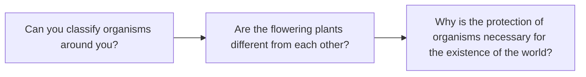
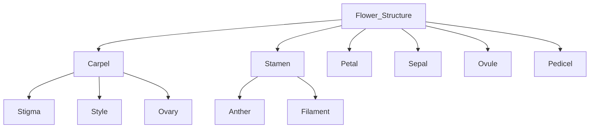
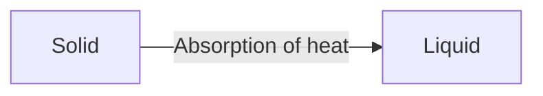
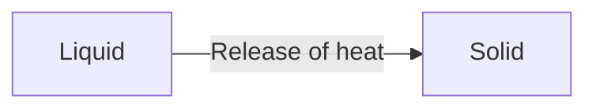
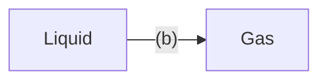
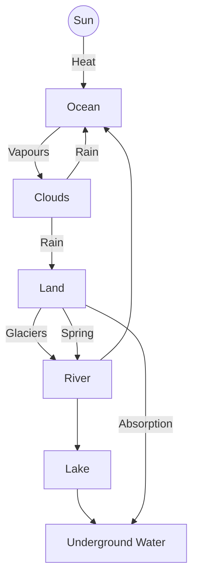

# General Science
## Grade 5

Based on Single National Curriculum 2020
One Nation, One Curriculum

The cover features various scientific illustrations including:
*   A boy and a girl in white lab coats conducting experiments with test tubes and flasks on a wooden table.
*   A light bulb.
*   A horseshoe magnet.
*   A honeybee.
*   A simple electrical circuit diagram with a battery and a bulb.
*   A molecular model.
*   An atomic model.
*   A hand holding a magnet attracting metal shavings.
*   A DNA double helix.
*   A cross-section of the Earth showing its layers.
*   Two capsules (medicine).
*   A round-bottom flask with orange liquid.
*   Mechanical gears.

Punjab Curriculum and Textbook Board, Lahore

بِسْمِ اللهِ الرَّحْمٰنِ الرَّحِيْمِ
(In the Name of Allah, the Most Compassionate, the Most Merciful.)

# GENERAL SCIENCE
# 5
Web Version of PCTB Textbook
Not For Sale

**Based on Single National Curriculum 2020**

**ONE NATION, ONE CURRICULUM**

The page contains a circular green emblem with Arabic script inside.

**PUNJAB CURRICULUM AND**
**TEXTBOOK BOARD, LAHORE**

**This textbook is based on Single National Curriculum 2020 and has been approved by the National Review Committee.**

All rights are reserved with the Punjab Curriculum and Textbook Board, Lahore.
No part of this textbook can be copied, translated, reproduced or used for preparation of test papers, guidebooks, keynotes and helping books.

# CONTENTS

<table>
  <thead>
    <tr>
        <th>Chapter</th>
        <th></th>
        <th>Contents</th>
        <th></th>
        <th>Page No.</th>
        <th></th>
    </tr>
  </thead>
  <tbody>
    <tr>
        <td>1</td>
        <td>Classification of Living Organisms</td>
        <td>1</td>
        <td colspan="3"></td>
    </tr>
    <tr>
        <td>2</td>
        <td>Microorganisms</td>
        <td>17</td>
        <td colspan="3"></td>
    </tr>
    <tr>
        <td>3</td>
        <td>Flowers and Seeds</td>
        <td>28</td>
        <td colspan="3"></td>
    </tr>
    <tr>
        <td>4</td>
        <td>Environmental Pollution</td>
        <td>41</td>
        <td colspan="3"></td>
    </tr>
    <tr>
        <td>5</td>
        <td>Physical and Chemical Changes of Matter</td>
        <td>51</td>
        <td colspan="3"></td>
    </tr>
    <tr>
        <td>6</td>
        <td>Light and Sound</td>
        <td>62</td>
        <td colspan="3"></td>
    </tr>
    <tr>
        <td>7</td>
        <td>Electricity and Magnetism</td>
        <td>78</td>
        <td colspan="3"></td>
    </tr>
    <tr>
        <td>8</td>
        <td>Structure of the Earth</td>
        <td>95</td>
        <td colspan="3"></td>
    </tr>
    <tr>
        <td>9</td>
        <td>Space and Satellites</td>
        <td>107</td>
        <td colspan="3"></td>
    </tr>
    <tr>
        <td>10</td>
        <td>Technology in Everyday Life</td>
        <td>117</td>
        <td colspan="3"></td>
    </tr>
    <tr>
        <td></td>
        <td>Glossary</td>
        <td>129</td>
        <td colspan="3"></td>
    </tr>
  </tbody>
</table>

**Supervision**
* Muhammad Rafiq Tahir
Joint Educational Advisor, National Curriculum Council, Ministry of Federal Education and Professional Training, Islamabad

**Focal Person Punjab (SNC)**
* Aamir Riaz, Director (Curriculum), Punjab Curriculum and Textbook Board, Lahore

**Authors:**
* Prof. Javed Mohsin Malik
Principal (Rtd.), Federal Ministry of Education
* Prof. Muhammad Ali Shahid (Aizaz-e-Fazeelat)
Director Technical (Rtd.), Punjab Textbook Board, Lahore

### National Review Committee Members
* Aamir Riaz, Punjab Curriculum and Textbook Board, Lahore
* Dr. Aneela Hassan, School Education Department, Punjab
* Muhammad Nadeem Asghar, QAED, Lahore
* Anwar Iqbal Saifi, The City School System, Islamabad
* Dinar Shah, Agha Khan Education Services, Gilgit Baltistan
* Bushra Muslim, Head Start School, Islamabad
* Dr. Shafqat Hussain, Directorate of Curriculum & Teacher Education, KPK
* Anam Iqbal, School Education Department, Punjab
* Dr. Sadia Bhutta, Agha Khan University, Karachi
* Sadaf Khan, FGEIs, Cantt. & Garrison, Islamabad
* Dr. Zulfiqar Ali Saqib, School Education Department, Punjab
* Samra Latif, Federal Directorate of Education, Islamabad
* Zobina Mushtaq, Bureau of Curriculum & Extension Centre, Balochistan

**Desk Officer:** Zehra Habib (National Curriculum Council)
**Technical Assistance:** Nighat Lone, Asfundyar Khan
**Director (Manuscripts), PCTB:** Muhammad Saleem Sagar
**Supervised by:** Muhammad Anwar Sajid
**Deputy Director (Art & Design):** Ghulam Mohayy-ud-Din
**Layout and Design:** Hafiz Inam-ul-Haq, Sameira Ismail
**Illustrations:** Mehar Bano Mahsood, Ayatullah, Hafiz Inam-ul-Haq, Sameira Ismail

**Experimental Edition**

## Q1 Classification of Living Organisms

### Guiding Questions

The following questions guide the learning in this chapter:

## Students' Learning Outcomes

After studying this chapter, the students will be able to:

1. Describe classification of organisms and its importance.

2. Classify the plants into two groups (monocots and dicots) and give example of each group.

3. Compare the structure of a monocot and dicot plant (with respect to their seeds, leaves and flowers).

4. Differentiate between vertebrates and invertebrates based on their characteristics.

5. Classify vertebrates into fish, amphibians, reptiles, birds and mammals on the basis of their characteristics.

6. Classify invertebrates into five groups (sponges, worms, insects, molluscs and echinoderms) on the basis of their characteristics.

7. Understand the concept of extinction and endangered species and the role of human actions in the loss of biodiversity.

8. Write some measures for conservation of endangered species.

# Classification of Organisms

There are numerous types of organisms found on our Earth. These organisms are different from each other. There are no similarities among them. Some have few similar characteristics.

### Activity 1.1

Write the names of organisms in their respective groups on the basis of similar characteristics.

Guava, fowl, pigeon, mango, sparrow, snake, rose, crocodile, sunflower, lizard, cat, tiger, cow, tortoise, goat and dove. For example, rose, fowl, snake and goat have been placed in separate groups.

<table>
  <thead>
    <tr>
        <th>Group 1</th>
        <th>Group 2</th>
        <th>Group 3</th>
        <th>Group 4</th>
    </tr>
  </thead>
  <tbody>
    <tr>
        <td>Rose</td>
        <td>Fowl</td>
        <td>Snake</td>
        <td>Goat</td>
    </tr>
  </tbody>
</table>

Why did you put rose and mango in one group? Why did you put fowl and pigeon in another group?

You placed the organisms of similar characteristics in one group. For example, you made a group of flowering plants with mango, guava, rose and sunflower. You made another group of organisms of other similar characteristics. For example, you made a group of fowl, pigeon, dove and sparrow. All of them have same characteristics.

You have separated the organisms on the basis of similarities and differences. Thus, you have classified the organisms.

To put organisms into separate groups on the basis of similarities and differences is called classification.

### Do you know?

As a wall is built of bricks stuck together, in the same manner the body of organisms is built of cells stuck together.

The following images illustrate the analogy between a brick wall and biological cells:
- A photograph of a red brick wall with white mortar.
- A diagram showing a grid of pinkish hexagonal cells, each containing a dark red nucleus.

<table>
  <tbody>
    <tr>
        <td>Wall made of bricks</td>
        <td>Cells of the body</td>
    </tr>
  </tbody>
</table>

## Importance of Classification

Due to classification, we can determine the similarities and differences among organisms.

Due to the structure and other characteristics of organisms, we can identify and study them. We can also know the relationship among organisms.

## Five Kingdom System
The organisms have been divided into five kingdoms on the basis of similarities and differences. The names of kingdoms are: Monera, Protista, Fungi, Plantae and Animalia.

### 1. Monera
These organisms are made of one cell. Their structure is very simple. These include bacteria (*singular: bacterium*). Bacteria are found everywhere on Earth. Some bacteria can prepare their food. Many bacteria obtain food from other organisms and dead bodies. Some bacteria cause diseases in plants and animals.

[The image shows a diagram of a Bacterium, representing Kingdom monera. It is an elongated cell with a protective wall and internal structures.]
**Bacterium**
**Kingdom monera**

### 2. Protista
Most of them live in water. This kingdom includes Amoeba, Paramecium and Algae e.g. *Spirogyra*. Amoeba and Paramecium are made of one cell. Algae may consist of one or many cells. Algae are found in rivers, ponds and ocean. They have chlorophyll.

[The image shows three organisms: Amoeba (an irregular-shaped single-celled organism), Paramecium (a slipper-shaped organism with cilia), and Spirogyra (green, ribbon-like filamentous algae).]
**Amoeba** | **Paramecium** | **Spirogyra**
:---:|:---:|:---:
**Kingdom protista**

### 3. Fungi
Some fungi are made of one cell. Many fungi are made up of more than one cell. Such fungi have filament-like bodies. Fungi need moisture for growth. They do not have chlorophyll. So, they cannot make their own food. They absorb food from the place where they live. Yeast is a microscopic fungi. *Rhizopus* is also called black bread mold. It grows on moist bread and fruits. The mushrooms are umbrella-like. They grow on piles of rotten matter.

The image shows three examples of fungi: a cluster of mushrooms, a diagram of Rhizopus (bread mold) showing sporangia and hyphae, and a microscopic view of budding Yeast cells.

**Kingdom fungi**

> **Do you know?**
> Some mushrooms can be eaten but some mushrooms are poisonous.

> **Interesting Information**
> More than 100 types of mushrooms have the ability to glow like fireflies at night.

### 4. Plantae
These organisms are made of more than one cell. They are called plants. They have chlorophyll in their leaves. So, they are able to make their food by using the energy of the Sun. Due to chlorophyll, their leaves are green in colour.

The image shows three examples of plants: a Flowering plant with pink blossoms, a Pine tree, and a Fern.

**Kingdom plantae**

### 5. Animalia
These organisms are also made of many cells. They are called animals. They do not have

The image shows three examples of animals: a Rabbit, a Duck, and a Crab.

**Kingdom animalia**

chlorophyll. So, they cannot make their food. They can move from one place to another.

> **Point to Ponder!**
>
> What is the difference between the paws of hen and duck?

# Classification and Characteristics of Flowering Plants

> **Activity 1.2**
>
> Take the seeds of wheat, rice, maize, pea, bean and gram. Find out in which seed there is one cotyledon and in which seed there are two cotyledons. Write your observations.

## Monocot Plants
The flowering plants whose seeds have one cotyledon are called monocot plants. Sugarcane, wheat, rice, bamboo and maize are the examples of monocot plants.

The image shows three examples of monocot plants:
1. **Bamboo**: Green stalks of bamboo growing closely together.
2. **Sugarcane**: Tall stalks of sugarcane with visible nodes.
3. **Maize**: Green maize (corn) plants with leaves.

**Monocot plants**

## Dicot Plants
The flowering plants whose seeds have two cotyledons are called dicot plants. Mango, guava, rose and pea, etc. are the examples of dicot plants.

The image shows three examples of dicot plants:
1. **Pea**: Green pea pods hanging from a vine.
2. **Rose**: A single red rose flower on a stem with leaves.
3. **Mango**: Ripe yellow mangoes hanging from a branch with green leaves.

**Dicot plants**

> ### Activity 1.3
> 1. Observe the leaves of monocot and dicot plants. What is the arrangement of veins in these leaves?
>
> In the leaves of a monocot plant, the veins are parallel to each other.
> The leaves of dicot plants have veins in the form of a net.
> The small leaves of a flower are called floral leaves.
> 2. Take the flowers of some monocot and dicot plants. Observe the flowers and count the number of floral leaves. The number of floral leaves in a flower of monocot plant is three or multiple of three. The number of floral leaves in a flower of dicot plant is four or five or their multiple.
>
> The following are the main differences between monocot and dicot plants.
>
> <table>
  <thead>
    <tr>
        <th>&gt;</th>
        <th>Part of Plant</th>
        <th>Monocot Plant</th>
        <th>Dicot Plant</th>
    </tr>
  </thead>
  <tbody>
    <tr>
        <td>&gt; Seed</td>
        <td>An image of a single cotyledon seed (e.g., corn kernel).</td>
        <td>An image of a seed with two cotyledons (e.g., bean).</td>
        <td></td>
    </tr>
    <tr>
        <td>&gt; Leaf</td>
        <td>An image of a long, narrow leaf with parallel venation.</td>
        <td>An image of a broad leaf with net-like (reticulate) venation.</td>
        <td></td>
    </tr>
    <tr>
        <td>&gt; Flower</td>
        <td>An image of a flower with three petals (multiple of three).</td>
        <td>An image of a flower with five petals (multiple of five).</td>
        <td></td>
    </tr>
    <tr>
        <td>&gt;</td>
        <td colspan="3"></td>
    </tr>
  </tbody>
</table>

> ### Activity 1.4
> 1. Paste leaves of monocot and dicot plants in scrapbook.
> 2. Paste dried and preserved flowering and non-flowering plants in the scrapbook.

## Classification and Characteristics of Animals
We have already studied in Grade-4 that animals have been divided into two main groups i.e. the vertebrates and invertebrates.

> ### Activity 1.5
> Look at the pictures of pigeon and butterfly. What differences you have seen between them? Write your observations.
>
> (The image shows a butterfly and a pigeon side-by-side for comparison.)

All vertebrates have backbone in their body. Most of them have internal skeleton made of bones. Their body has three main parts: head, abdomen and tail. The brain is present in the skull. They have the great ability to hear, see, smell, taste and feel. The blood circulates in the blood vessels of the body. The skin of vertebrates is covered with scales or feathers or hairs.

Various types of invertebrates are found on the Earth. They do not have any type of bone inside the body. Their body structure is of various types. Some are flat, some are round and some are segmented. The body parts of invertebrate are different in different groups.

## Classification of Vertebrates
The vertebrates are divided into five groups i.e. fish, amphibians, reptiles, birds and mammals.

### Fish
Fish live in water. Both ends of their body are pointed. The middle part is broad and thick i.e. the body is boat-shaped. This body shape is most suitable to swim. They have scales on their skin. Fish breathe through gills. Fish have fins and tail which help to swim. Reproduction in fish takes place through eggs. Their body temperature depends on the temperature of their surroundings.

The following images show various types of fish:
- **Rohu**: A silvery fish with a slightly curved back.
- **Shark**: A sleek, blue-grey predatory fish.
- **Catfish**: A grey fish with whisker-like barbels.
- **Goldfish**: A bright orange ornamental fish.
- **Butterfly fish**: A colorful fish with vertical stripes and a distinctive pattern.

**Fish**

### Amphibians
Amphibians can live on land and also in water. They respire through lungs and skin. Usually their skin is moist and loose. They live on land but lay eggs in water. Their body temperature also depends on the temperature of their surroundings. Their development takes place in water. Frog, toad, salamander and newt are the examples of amphibians.

The following images show various types of amphibians:
- **Frog**: A green amphibian with long hind legs for jumping.
- **Salamander**: A yellow and black patterned amphibian with a long tail.
- **Toad**: A brown amphibian with bumpy, dry skin.
- **Newt**: A dark-colored amphibian with an orange underside and a long tail.

**Amphibians**

> ### Do you know?
> Why amphibians could not flourish in the whole world? They are not found in desert and snow because they cannot go away from water. They depend on water for reproduction and development.

> ### Point to Ponder!
> What is the difference between a toad and a frog?

## Reptiles
Reptiles are called creeping animals. Their skin is thick, coarse and dry which protect their body from external effects. Reproduction in these animals takes place through eggs. They lay eggs on land. Their body temperature also depends on the temperature of their surroundings. Lizard, crocodile, snake and tortoise are the examples of reptiles.

The image shows various reptiles:
*   **Tortoise**
*   **Snake**
*   **Crocodile**
*   **Lizard**

> ### Do you know?
> 1. Dinosaurs were the largest reptiles of the ancient times but they have become extinct.
> 2. Compared to the amphibians, the reptiles flourished all over the world because they do not depend on water for reproduction.
>
> The image shows various types of **Dinosaurs**.

## Birds
The birds have feathers and beaks. Their bones are hollow, thus their weight is less. Along with lungs, they have air sacs. Birds can fly in the air. Some birds can swim in water e.g. duck. Some birds cannot fly and are called running birds e.g. Kiwi and Ostrich. All birds lay eggs. The birds that live in water have webbed feet e.g. duck. Their body temperature does not depend on the external environment. Sparrow, pigeon, kiwi, rooster, dove, parrot and ostrich are the examples of birds.

The image shows various birds: Dove, Sparrow, Kiwi, Ostrich, and Rooster.

### Birds

> **Do you know?**
>
> The largest flying bird is eagle which lives on high trees or rocks. Humming bird is the smallest bird. Hawk is a hunter bird. Penguin is a bird that lives on snow. Woodpeckers live in the holes that they make in tree trunk.

The image shows circular portraits of the following birds:
*   Hawk
*   Hummingbird
*   Eagle
*   Penguin
*   Woodpecker

> **For Your Information**
>
> 1. Birds have evolved from a generation of carnivore dinosaurs.
> 2. How are birds different from reptiles? The body temperature of birds does not depend on the temperature of external environment, so they remain active round the year. They show parental care. They make nests to live. They migrate from one place to other.

> **Interesting Information**
>
> A bird park is called 'Aviary'. There is a bird park in Islamabad at Lake View Park adjacent to Rawal Lake. This is the third in the world and largest bird park of Pakistan. There are 280 types of birds here whose number is more than 4,000.

The image shows three photos related to the bird park:
1.  A view of the aviary structure with walkways.
2.  An ostrich in an enclosure.
3.  The logo of "BirdPark LAKE VIEW PARK ISLAMABAD" featuring colorful parrots.

## Mammals

They have fur or hair on their body. Mammals give birth to their young ones and feed them on milk. The body temperature of mammals does not depend on the temperature of the external environment. Horse, cow, goat, tiger, cat and human are examples of mammals.

The following images show examples of mammals:
- A horse standing in a field. (Horse)
- A lion walking. (Lion)
- A cow with its calf. (Cow)
- A cat sitting. (Cat)

**Mammals**

### Interesting Information

1. **Polar bears** live in snowy regions of the North Pole. Its body has a thick covering of fur.
2. **Elephants** live in hot climate so its body is not covered by thick layer of hair or fur.
3. **Platypus** is a mammal. The female lays egg and feeds milk to the young ones.
4. **Kangaroo** keeps its newborn babies in external pouch on the belly.
5. **Bat** is a flying mammal.

The following images show the mammals mentioned above:
- A polar bear in the snow. (Polar Bear)
- An elephant with its calf. (Elephant)
- A platypus. (Platypus)
- A kangaroo with a joey in its pouch. (Kangaroo)
- A bat in flight. (Bat)

### Interesting Information

Among the vertebrates in the world, birds and mammals are the largest groups. What is the reason?
The reason is that both show parental care. Such as you must have seen how hen and cats take care of their young ones.

### Activity 1.6

Paste pictures of different animals in the scrapbook. Divide them into vertebrates and invertebrates. Also write which of these animals are found in Pakistan.

# Classification of Invertebrates

The major groups of invertebrates are sponges, worms, insects, molluscs (mollusks) and echinoderms.

## 1. Sponges

These are aquatic animals and most of them live in the ocean. They are of various colours. They usually remain attached to stones. The body is full of pores externally and canals internally. Water enters through the pores and exits through a large pore. If any body part breaks, they can form it again.

The image shows four different types of sponges in various colors (purple, yellow, green, and pink/red) attached to underwater surfaces.
**Sponges**

## 2. Worms

Worms are softbodied animals. Their body is round and cylindrical. They have no legs. The body of some worms is divided in segments e.g. earthworms and tapeworms. The body of some worms are not divided in segments e.g. flatworms and roundworms.

The image shows three types of worms:
*   **Earthworm**: A reddish-brown, segmented worm.
*   **Roundworm**: A long, thin, yellowish-white worm.
*   **Flatworm**: A flat, oval-shaped organism with internal structures visible.

**Worms**

## 3. Insects

The insects are invertebrates with jointed legs. Their body is segmented. The body is divided into three parts: head, thorax and abdomen. The number of legs is six or three pairs. The external surface of the body is hard, which is called exoskeleton. The exoskeleton protects and supports the body.

The image shows four examples of insects:
*   **Wasp**: A yellow and black striped flying insect.
*   **Cockroach**: A brown, flat-bodied insect with long antennae.
*   **Mosquito**: A thin insect with long legs and wings.
*   **Honeybee**: A fuzzy flying insect with labeled body parts:
    *   **Head**: The front part.
    *   **Thorax**: The middle part where legs and wings are attached.
    *   **Abdomen**: The rear part.

**Insects**

> ### Do you know?
> Stick insect looks like a stick and is green or brown in colour. It is also known as walking stick. Leaf insect looks like a leaf. Both of these hide in the environment to remain hidden from the enemy.

The image shows a Stick insect, which has a long, thin body resembling a twig, and a Leaf insect, which has a broad, flat body with vein-like patterns resembling a green leaf.

### 4. Molluscs
They are soft bodied animals. They live in ponds, lakes, rivers, oceans and on land. They move freely or remain attached to anything. Body of some molluscs is covered with shell e.g. snail and oyster whereas some are without shell e.g. octopus.

The image shows three examples of Molluscs:
*   **Octopus:** An aquatic animal with eight long tentacles and no shell.
*   **Oyster:** An aquatic animal with a rough, hard shell.
*   **Snail:** A land animal with a coiled shell on its back.

> ### For Your Information
> When a grain of salt or sand enters the body of oyster (a mollusc), it forms a pearl around the grain. It takes years to form a pearl.

### 5. Echinoderms
These animals are found only in the ocean. They do not have any head. The animals may be disc or star-shaped or a long one. The body has a spiny covering.

The image shows three examples of Echinoderms:
*   **Starfish:** A star-shaped marine animal with five arms.
*   **Sea anemone:** A colorful marine animal with many small tentacles.
*   **Brittle star:** A star-shaped marine animal with long, thin, flexible arms.

# Biodiversity

As we have read in previous class, the number of kinds of living things present at a particular place is called biodiversity. The type of plants and animals no longer found in this world are called extinct e.g. dinosaurs. Many organisms that are very likely to become extinct in near future are called endangered organisms such as Bengal tiger, Rhinoceros, etc. There are many endangered animals in Pakistan e.g. snow leopard, green turtle, hawk, Indus dolphin and markhor.

> ### Activity 1.7
>
> Take a chart paper. Cut pictures of various plants and animals from old newspapers or magazines and paste on the chart paper. You have placed all the organisms together at one place. What is it? This is biodiversity.
>
> [The activity box includes a collage of various plants and animals, including a tiger, a beetle, a bird, and flowers.]

## Human Impact on Biodiversity

The forests are being cut for cultivation and urbanization. The cutting of forests has destroyed the habitats of animals. Another human act of excessive hunting of animals has endangered animals.

> ### Do you know?
>
> 1. Pine trees in Bunair (KPK), Juniper in Ziarat (Balochistan) and Mangrove at the seashores in Sindh are disappearing at a fast rate.
> 2. Indus Dolphin is blind but it can differentiate between light and the dark. Due to construction of dam at Indus River, the dolphins have declined in number. Now they are found only between Jinnah and Kotri barrages.
>
> [An illustration of an Indus Dolphin is shown.]
> **Indus Dolphin**

## Conservation of Biodiversity

For the conservation of biodiversity, trade of endangered animals has been regularized. To save the habitats, the number of game reserves has been increased. National parks have been made all over the world where endangered animals are kept.

> ### Do you know?
>
> A game reserve (also known as a game park) is a large area of land where wild animals live safely. In some game reserves, animals are hunted in a controlled way.

### For Your Information

Mangroves are small trees that grow in coastal areas. They protect shorelines from damage. They act as nurseries for marine animals such as fish, crabs, prawns, etc. The Government of Pakistan earns foreign exchange from the export of these animals. Mangroves also reduce smoke and pollution of the city. Conservation of mangroves is very necessary.

[The image shows a dense growth of mangrove trees with their characteristic aerial roots visible above the water line along a shoreline.]
**Mangroves**

## Key Points

1. Due to classification, organisms can be identified and their relationships can be known.
2. To divide the organisms into groups on the basis of similarities and differences is called classification.
3. The large groups of organisms are called kingdoms.
4. The five kingdoms are Monera, Protista, Fungi, Plantae and Animalia.
5. Bacteria are examples of Monera. Yeast, Rhizopus, Mushrooms are examples of Fungi.
6. All the plants are included in kingdom Plantae and animals in kingdom Animalia.
7. The two groups of flowering plants are monocot and dicot plants.
8. Bamboo, sugarcane, maize, wheat and rice are examples of monocot and mango, guava, pumpkin and rose are examples of dicot plants.
9. There are differences in the seeds, leaves and flowers of monocot and dicot plants.
10. Animals have been divided into two groups i.e. vertebrates and invertebrates.
11. The major groups of vertebrates are Fish, Amphibians, Reptiles, Birds and Mammals.
12. The five major groups of invertebrates are Sponges, Worms, Insects, Molluscs and Echinoderms.
13. The number of kinds of organisms found at any particular place is called biodiversity.
14. Conservation of biodiversity is necessary because many organisms are now

> endangered. By conserving biodiversity, the organisms can be saved from extinction.
> 15. Cultivation, urbanization and deforestation have destroyed the habitats of organisms.

**Weblinks:** Use the following weblinks to enhance your knowledge about the topics in this chapter.

<table>
  <tbody>
    <tr>
        <td>Vertebrate, Invertebrate, Monocot and Dicot</td>
        <td>1. https://www.youtube.com/watch?v=7DqsZbSdbrk</td>
    </tr>
    <tr>
        <td>Animals</td>
        <td>2. https://kids.nationalgeographic.com/animals/</td>
    </tr>
  </tbody>
</table>

# Exercise

**1. Tick ($\checkmark$) the correct option.**

i. Which one of the following is the foot of an aquatic bird?

The image shows four types of bird feet:
*   **A:** A webbed foot (typical of aquatic birds like ducks).
*   **B:** A feathered foot with sharp talons (typical of birds of prey or owls).
*   **C:** A long-toed foot (typical of wading birds).
*   **D:** A perching foot with three toes forward and one back (typical of songbirds).

ii. The cat belongs to which group?
(a) Amphibians (b) Reptiles (c) Birds (d) Mammals

iii. A fish respires through which organ?
(a) Gills (b) Lungs (c) Air sacs (d) Skin

iv. What is the number of cotyledons in a gram seed?
(a) One (b) Two (c) Three (d) Four

v. Which group is found only in the ocean?
(a) Fish (b) Insects (c) Echinoderms (d) Amphibians

**2. Write short answers.**

i. Define biodiversity.
ii. State the importance of classification.
iii. Write the differences between:
(a) Worms and Insects (b) Amphibians and Reptiles
iv. What is the similarity between Fungi and Animals?
v. Write one characteristic and one example of Monera and Protista.

### 3. Constructed Response Questions:
i. Some animals have internal skeleton of cartilage such as Shark and Sting Ray. They feed on other animals by predation. What is the importance of cartilage in their life?
ii. Why does the body of a Zebra have black and white stripes?
iii. Why are the ears of elephant large?

The page includes illustrations of a shark, a zebra, and an elephant.

### 4. Investigate:
i. Investigate the factors responsible for the extinction of biodiversity.
ii. Give an example of extinct and endangered animals. Investigate what types of animals are most likely to be extinct?

### 5. Project: Album of Animals

**Material Required:**
i. Old newspapers and magazines
ii. Scissors
iii. Gum
iv. Coloured markers
v. Album

a. Cut pictures of two animals from each of the five groups of vertebrates. The pictures can also be obtained from the internet.
b. Paste the pictures on an album.
c. Write characteristics of each animal with its picture.
Example:
* It has fins and tails.
* Its body has scales.
* Its body is boat-shaped.

The page includes an illustration of a goldfish.

# O2 Microorganisms

## Overview

The page features educational content about microorganisms with visual representations including:
- A compound microscope on the left side
- A student microscope on the right side
- Illustrations of DNA helices, molecular structures, and microorganisms
- A sun symbol representing cellular processes

## Guiding Questions

The following questions frame the chapter's key concepts:

* Are all organisms just those which we see?
* Are all the invisible organisms harmful?
* Why is it necessary to brush the teeth after meals?

## Students' Learning Outcomes

After studying this chapter, the students will be able to:

1. Define and describe microorganisms.
2. Identify the main groups of microorganisms and give examples for each.
3. Describe the role of microorganisms in decomposition and discuss its harmful and beneficial effects.
4. Recognize some common diseases caused by microorganisms of each group.
5. Recognize that microorganisms get transmitted in humans and cause infectious diseases.
6. Discuss and deduce advantages and disadvantages (any three) of microorganisms by using some daily life examples.
7. Suggest preventive measures to protect themselves from these infections.

You must have observed dust particles in the beam of light that enters a dark room. Have you ever thought that our eyes cannot see very tiny objects. There are a lot of organisms present in our environment that we cannot see with our eyes. To see such things, we need a special instrument called microscope. The objects that cannot be seen by human eyes are visible as large and clear objects under the microscope.

[The image shows a beam of sunlight entering a room through a window, illuminating dust particles in the air.]

> ### Activity 2.1
> To make a simple microscope you will need a plastic cup, thin plastic sheet, rubber band, scissors and water. With the help of scissors make a hole at the base of the plastic cup so that you may put any tiny object into it. Put the thin plastic sheet over the cup and tie it properly with a rubber band. Put a drop of water over the plastic sheet. Put any tiny object at the base of the cup and observe it. You will see the object many times larger.
>
> [The image shows a series of four photos demonstrating the activity: 1. Materials needed (cup, scissors, rubber band, plastic, water, leaves). 2. A plastic cup with a sheet tied over it. 3. A hand holding the cup. 4. A close-up of the water drop on the plastic sheet acting as a lens.]

## Microorganisms
All those tiny organisms that can only be seen under a microscope are called microorganisms. These are present everywhere in our surroundings.

[The image shows three microscopic views of different microorganisms: a bacterium with flagella, two paramecia, and a green alga.]
**Microorganisms**

## Main Groups of Microorganisms
There are many types of microorganisms. They are divided into various groups on the basis

of their size, structure and need of food. Viruses and bacteria are the main groups of microorganisms. Some fungi are very small and they are also included in microorganisms.

### 1. Viruses
Viruses are very tiny infectious particles. They are the link between living and non-living things. They can reproduce only within an organism. Out of the body of organism, they are non-living. They are very harmful to living organisms. They cause diseases in human beings, animals and plants. For example, they cause hepatitis, polio, COVID-19 and flu in humans.

The following images represent different types of viruses:
- A spherical virus with green and red surface proteins labeled **Poliovirus**.
- A spherical virus with prominent red spikes labeled **COVID-19 virus**.
- A complex virus with a geometric head, a tail, and leg-like fibers labeled **Bacteriophage virus**.

**Viruses**

### 2. Bacteria
Bacteria are single-celled organisms. They are found in every type of environment. They are found in air, water, soil and inside living things. Few bacteria are harmful to organisms. They cause diseases in plants, animals and humans, e.g. pneumonia, tuberculosis and diarrhea, etc. A large number of bacteria are useful for humans. Some bacteria help in the digestion and absorption of food in our small intestine.

> **Interesting Information**
> 1. The bacteria which are beneficial for us are called useful bacteria. The number of harmful bacteria is very less.
> 2. The number of bacteria in your body is more than the cells of your body.
> 3. The number of bacteria in a small spoon of soil is almost equal to the number of people living in the continent Africa.

On the basis of shape, bacteria are divided into three types: round, rod-shaped and spiral.

The following images represent the shapes of bacteria:
- Spherical pink structures labeled **Round**.
- Green elongated structures labeled **Rod-shaped**.
- Green twisted, corkscrew-like structures labeled **Spiral**.

**Shapes of bacteria**

## 3. Fungi

Fungi are simple organisms that are neither like plants nor like animals in their characteristics. They cannot make their own food. They often grow on dead organisms or decaying matter. They decompose dead matter into simple materials. They then absorb these simple materials as their food. Some fungi obtain their food from living plants and animals and cause diseases in them e.g. ringworm and athlete's foot are human diseases due to fungi. Yeast, Mold and *Penicillium* are examples of microscopic fungi.

The images below show different types of fungi:
- An orange with green and white mold growth (Mold on orange).
- A microscopic view of fungal filaments (Fungi that cause athlete's foot).
- A microscopic view of oval-shaped yeast cells (Yeast).

> ### Interesting Information
> Mushrooms are large fungi. Many mushrooms are eaten as food. Some mushrooms are poisonous.
> 
> (Image of a red mushroom with white spots, known as Amanita muscaria)

> ### Point to Ponder!
> 1. Do you think that viruses are living organisms. Why?
> 2. In what types of environment can bacteria live?

### Role of Microorganisms as Decomposers
During decomposition, bacteria and fungi break the organic molecules of food and dead bodies into simple components. The organisms which do decomposition are called decomposers. The rate of decomposition increases with increase in temperature, humidity and oxygen. Sometimes, this process becomes troublesome for us. But this process is also useful to us.

#### Useful Effects of Decomposition
By decomposition, the complex matter present in the dead bodies of plants and animals break into simple components. During this process, carbon dioxide and nitrogen gases are released back in the environment. The producers e.g. plants use these simple materials again to make their food. In this way, decomposers recycle the matter of abiotic and biotic

components of the environment. If decomposers do not exist, it is impossible to break down dead organisms into their simple components to make these a part of the ecosystem.

### Harmful Effects of Decomposition

Microorganisms damage food and wood by the process of decomposition. Because of them milk is spoiled, bread gets mold, fruit and vegetables are decomposed.

> **Point to Ponder!**
>
> What if there were no decomposers in the world?

The image shows three examples of decomposition: decaying wood, moldy bread, and a rotten apple.
**Harmful effects of decomposition**

### Diseases Caused by Microorganisms

Many microorganisms are a cause of diseases in plants and animals. The microorganisms that cause diseases in their hosts are called pathogens. The diseases that occur due to them are called infections or infectious diseases. The infectious diseases can spread quickly from one organism to the others.

Hepatitis, Flu, Polio, COVID-19, Measles and Mumps, etc.

**Diseases Caused by Bacteria:**
Pneumonia, Typhoid, Cholera and Tuberculosis, etc.

**Diseases Caused by Fungi:**
Ringworm, Athlete's foot, Smut and Rust.

The image shows a child with leg braces sitting on the floor.
**A Polio Patient**

The following images show examples of diseases caused by fungi:
*   **Rust:** A leaf with orange-brown spots.
*   **Smut:** A cereal plant head covered in black fungal spores.
*   **Athlete's foot:** Peeling and irritated skin between toes.
*   **Ringworm:** Circular, red, itchy rashes on the skin.

**Diseases caused by fungi**

> ### Activity 2.2
>
> When a boy came home from school, he felt hungry. He saw raw chicken in the kitchen. He took a piece of chicken, put pepper and salt on it, cooked and ate it while watching TV. At midnight, he got up due to diarrhea, fever and stomach pain. In his school, there was an epidemic of diarrhea. So, his mother met the principal of the school. She asked the principal to investigate the items being sold at the canteen. The principal agreed to find out the reason for the spread of the epidemic in school.
>
> **In your opinion why did the boy fall ill?**

[The image shows two illustrations: one of a boy clutching his stomach in pain, and another of a boy looking at a germ through a magnifying glass.]

## Spread of infectious Diseases and Transmission to Humans
The five main ways for the transmission of infectious diseases are air, water, food, animals and direct contact.

### 1. Airborne Diseases:
When a patient of any particular infectious disease coughs, sneezes or talks then some viruses and bacteria are released out of his mouth and dispersed in the air. When a healthy person breathes in this air, these pathogens enter his body and he becomes sick. Such infectious diseases are called airborne diseases e.g. COVID-19, flu and TB.

### 2. Waterborne Diseases:
The pathogens of some diseases are transmitted through water. Such diseases occur when someone uses polluted water for drinking or in food. Diarrhea, typhoid, some diseases of eyes and skin are waterborne diseases.

### 3. Food-borne Diseases:
Pathogens of some diseases are present in contaminated food. On eating such types of food, these pathogens enter human body and cause diseases e.g. cholera, hepatitis and typhoid, etc.

### 4. Animal-borne Diseases:
Some animals also transmit pathogens from one human to the others. For example, when mosquito bites and sucks blood of a patient of malaria or dengue, it takes pathogens from patient. When it bites a healthy person, it transmits those pathogens into him.

### 5. Transmission of Diseases through Direct Contact:
Some diseases are transmitted by shaking hands or by touching articles used by the

patient. COVID-19, flu and hepatitis are examples of such diseases.

> ### Activity 2.3
>
> Do you want to know how far germs can travel on coughing and sneezing? For this you will need a balloon, tiny pieces of paper or glitters. Put the tiny pieces of papers inside the balloon. Then inflate the balloon and close the mouth of the balloon with two fingers. Now open the mouth of the balloon. What happened?
>
> The pieces of paper scattered out of the balloon. In this manner, the germs spread on coughing or sneezing by the patient.

The activity is illustrated with two images: one showing a green balloon and paper scraps, and another showing a child observing paper scraps scattered across a white sheet on the floor.

## Useful Role of Microorganisms in Everyday Life
All microorganisms are not harmful. The following are some benefits of microorganisms in everyday life:

### 1. Making Food Items
Bacteria and Yeasts are used in making food items. Yeasts are used to make bread and cheese while bacteria are used in making yoghurt.

The text is accompanied by two images:
1. A person holding a large ball of risen dough, captioned: "Use of yeast to raise the dough".
2. A bowl of white yoghurt with a spoon, captioned: "Use of bacteria in making yoghurt".

> ### Activity 2.4
>
> 1. Take flour in a pot. Mix yeast, sugar and water in it and make a dough.
> 2. Take same quantity of flour in another pot. Mix only sugar in it and make a dough.
> 3. Note the quantity of flour in both pots and leave them for an hour.
> 4. After one hour, observe the quantity of flour in both pots.
> 5. In which pot, has the dough risen? What is its reason? Why was sugar added along with yeast?

An image next to the activity shows two balls of dough side-by-side; the one on the left is significantly larger (risen) than the one on the right.

### 2. Cleaning of Environment
You know that some bacteria can decompose dead bodies. Such bacteria can also be used to decompose toxic materials present in sewage and industrial waste water.

Two images showing large industrial water treatment tanks with aeration processes occurring.
**Cleaning of environment**

### 3. Making of Medicines
Many microorganisms are used for making medicines. Fungi and bacteria are used to make antibiotics. These medicines are used to kill or inhibit the growth of disease causing bacteria.

> **Do you know?**
>
> Penicillin was the first antibiotic. It was derived originally from a type of fungi, known as *Penicillium*.
>
> [Image of a medicine bottle labeled Penicillin next to a petri dish showing fungal growth colonies]

<table>
    <tr>
        <th>Activity 2.5</th>
        <th>[Image showing a finger dipping into a plate of water with pepper]</th>
    </tr>
    <tr>
        <td>1. Take a deep plate and pour water so that one inch of your finger dips into it.</td>
        <td></td>
    </tr>
    <tr>
        <td>2. Now spray powdered black pepper on it.</td>
        <td></td>
    </tr>
    <tr>
        <td>3. Dip your finger into it. The black pepper will adhere to your finger.</td>
        <td></td>
    </tr>
    <tr>
        <td>4. Put a good quantity of soap on your finger. Again dip the finger into water. This time, the black pepper will move away from your finger.</td>
        <td>[Image showing pepper moving away from a soapy finger]</td>
    </tr>
    <tr>
        <td>Soap repels the germs in this manner.</td>
        <td></td>
    </tr>
</table>### Preventing the Infections
Following are the ways to prevent infections:
1. It is essential to wash hands before cooking and eating food and after using toilets.
2. Avoid touching your eyes, nose and mouth, as these are the points for germs to enter your body.

3. Get vaccinated at proper time. It is the important way to prevent many diseases.
4. Stay at home, if you have signs and symptoms of an infection so that you can take rest and prevent others from infection.
5. In case of any injury, cover the wound immediately with bandage and consult a physician.

> **Point to Ponder!**
> Can you tell more steps to prevent infection?

# Key Points

1. All those tiny organisms that can be seen only under the microscope are called microorganisms.
2. Viruses, bacteria and some fungi are the major groups of microorganisms.
3. Viruses are very tiny infectious particles.
4. Bacteria are single-celled microorganisms found in all types of environment.
5. Fungi are simple unicellular or multicellular organisms.
6. Some microorganisms do decomposition. They break down the complex matters of dead bodies into simple components.
7. The five major sources of the transmission of infectious diseases are air, water, animals, food and direct contact.
8. Many microorganisms are used to make medicines.
9. In order to prevent infections, we should keep ourselves neat and clean and get vaccinated at proper time.
10. Food items of daily use e.g. yoghurt and bread are prepared by using microorganisms.

**Weblinks:** Use the following weblinks to enhance your knowledge about the topics in this chapter.

<table>
  <tbody>
    <tr>
        <td>Microorganisms</td>
        <td>1. https://www.nationalgeographic.org/media/misunderstood-microbes/</td>
    </tr>
    <tr>
        <td>Yeast</td>
        <td>2. https://kidsdiscover.com/teacherresources/science-of-yeast-for-kids/</td>
    </tr>
  </tbody>
</table>

# Exercise

### 1. Tick ( $\checkmark$ ) the correct answer.
i. Mushrooms belong to which group?
(a) Viruses (b) Fungi (c) Bacteria (d) Protozoa

ii. What causes polio?
(a) Protozoa (b) Virus (c) Fungi (d) Bacteria

iii. *Penicillium* is an example of which group?
(a) Protozoa (b) Fungi (c) Bacteria (d) Viruses

iv. Food is contaminated due to the presence of \_\_\_\_\_\_ in the environment.
(a) Moisture (b) Microorganisms (c) Air (d) Heat

v. Which one of the following is not a microorganism?
(a) Bacteria (b) Virus (c) Algae (d) Ant

### 2. Write short answers.
i. What is a pathogen? How does it enter in the bodies of organisms?
ii. Why are some bacteria and fungi called decomposers?
iii. Write two benefits and two harmful effects of bacteria.
iv. How does the microorganism yeast work to soften and rise dough of flour?
v. How does a mosquito transmit disease?

### 3. Constructed Response Questions:
The soil of forests of hot climate is always hot and moist, whereas the soil of forests of cold climate is cold and dry. Out of these two areas, where the decomposition of fallen leaves will happen more quickly? Explain.

The image shows two contrasting forest environments:
- **Forest of hot climate**: A lush, green forest with dense vegetation, sunlight filtering through trees, and fallen logs on the ground.
- **Forest of cold climate**: A forest with bare trees and the ground completely covered in thick white snow.

### 4. Investigate:
i. "All microorganisms are harmful and cause diseases". Prove that this idea is incorrect.

ii. Many people use antibacterial soap to kill the bacteria present on their hands. But due to excessive use of soap, the chance of getting infection increases instead of decreasing. Why does it happen?

# 5. Project: The effect of quantity of sugar on the release of carbon dioxide from yeast.

### Material Required:
i. Teaspoon
ii. Rubber band
iii. Balloons
iv. Marker
v. Yeast
vi. Sugar
vii. Transparent bottles of one litre (4 in number)
viii. Warm water

### Procedure:
i. Take four transparent plastic bottles and label them as I, II, III and IV. Add a teaspoon of yeast in each bottle.

<table>
  <thead>
    <tr>
        <th>Bottle</th>
        <th></th>
        <th>Amount of Sugar (Teaspoons)</th>
        <th></th>
    </tr>
  </thead>
  <tbody>
    <tr>
        <td>I</td>
        <td>0</td>
        <td colspan="2"></td>
    </tr>
    <tr>
        <td>II</td>
        <td>1</td>
        <td colspan="2"></td>
    </tr>
    <tr>
        <td>III</td>
        <td>2</td>
        <td colspan="2"></td>
    </tr>
    <tr>
        <td>IV</td>
        <td>3</td>
        <td colspan="2"></td>
    </tr>
  </tbody>
</table>

ii. Add sugar in each bottle as per given table. Do not add sugar in the first bottle.
iii. Pour half cup of hot water in each bottle. Immediately, put a balloon at the mouth of each bottle and bind it strongly with rubber band.
iv. Shake each bottle strongly so that its contents can mix.
v. Leave all the bottles in this condition for twenty minutes.
vi. Then observe:
    a. Which balloon gets inflated the most?
    b. In which bottle, was the most carbon dioxide gas produced?

The image shows four bottles labeled I, II, III, and IV. Each bottle has a balloon attached to its neck.
- Bottle I: Small, uninflated blue balloon.
- Bottle II: Small, slightly inflated pink balloon.
- Bottle III: Medium, inflated orange balloon.
- Bottle IV: Large, fully inflated light blue balloon.

The background of the page features a field of sunflowers. At the top right, an illustration shows the life cycle of a sunflower in reverse order, from a fully grown plant in a pot to a seedling, and finally to seeds falling from the sun.

> Why do the butterflies sit on flowers?

> What will happen if all flowers run out?

> Are new plants grown only by using seeds?

# 03 Flowers and Seeds

## Students' Learning Outcomes
**After studying this chapter, the students will be able to:**

1. Examine and describe the structure of flower.
2. Describe pollination and describe its types with examples.
3. Define reproduction and differentiate between sexual and asexual reproduction in plants.
4. Describe the structure of a seed and demonstrate its germination.
5. Compare and contrast the structure and function of a gram and maize seed.
6. Illustrate the conditions necessary for seed germination.

# Flower

When you go to a garden, the colourful flowers attract your attention. Have you ever thought what these flowers are for? Apart from pleasing your eyes with their colours, in what other process of nature are they used?

The image shows a row of six different colourful flowers: a white star-shaped flower, a yellow flower, another white flower, a small yellow flower, a cluster of yellow and orange flowers, and a pink flower with dark veins.

> ### Activity 3.1
> Take a large flower. Separate its various parts with the help of tweezers. Keep the identical parts separate and draw their sketches. In this way, it will be easier for you to understand the structure of a flower.

## Structure of a Flower

A flower is a very important and attractive part of the plant. In some plants there is only one flower at a stalk e.g. rose. Some flowers are produced in bunches e.g. mustard. The stalk of the flower is called pedicel. The flower has four parts at the pedicel. These occur in the form of four whorls. The four parts of flower are sepals, petals, stamens and carpel.

The following diagram illustrates the internal structure of a flower with its various parts labeled:

**Structure a of flower**

The diagram shows:
- **Carpel** (the female reproductive part) consisting of the **Stigma** (top), **Style** (middle tube), and **Ovary** (base containing the ovule).
- **Stamen** (the male reproductive part) consisting of the **Anther** (pollen-bearing part) and **Filament** (supporting stalk).
- **Petal**: The large, colourful, leaf-like part of the flower.
- **Sepal**: The small, green, leaf-like structure at the base of the flower.
- **Ovule**: Located inside the ovary.
- **Pedicel**: The stalk of the flower.

<table>
  <thead>
    <tr>
        <th>No.</th>
        <th></th>
        <th>Name</th>
        <th></th>
        <th>Characteristics</th>
        <th></th>
        <th>Functions</th>
        <th></th>
    </tr>
  </thead>
  <tbody>
    <tr>
        <td>1</td>
        <td>Sepals</td>
        <td>These are green leaflets. Sepals form the first whorl.</td>
        <td>They protect the internal structures.</td>
        <td colspan="4"></td>
    </tr>
    <tr>
        <td>2</td>
        <td>Petals</td>
        <td>These are coloured leaflets. Petals form the second whorl.</td>
        <td>They attract insects and birds towards the flower.</td>
        <td colspan="4"></td>
    </tr>
    <tr>
        <td>3</td>
        <td>Stamen</td>
        <td>It consists of anther and filament.</td>
        <td>It is the male reproductive part.</td>
        <td colspan="4"></td>
    </tr>
    <tr>
        <td>3(a)</td>
        <td>Anther</td>
        <td>It is round or oval sac-shaped structure, which is usually yellow in colour.</td>
        <td>Here, pollen grains are formed.</td>
        <td colspan="4"></td>
    </tr>
    <tr>
        <td>3(b)</td>
        <td>Filament</td>
        <td>It is a long stalk-shaped structure.</td>
        <td>It gives support to the anther.</td>
        <td colspan="4"></td>
    </tr>
    <tr>
        <td>4</td>
        <td>Carpel</td>
        <td>It consists of stigma, style and ovary.</td>
        <td>It is the female reproductive part.</td>
        <td colspan="4"></td>
    </tr>
    <tr>
        <td>4(a)</td>
        <td>Stigma</td>
        <td>It is bottle-shaped part of the carpel.</td>
        <td>Pollen grains adhere to it and germinate to form the pollen tube.</td>
        <td colspan="4"></td>
    </tr>
    <tr>
        <td>4(b)</td>
        <td>Style</td>
        <td>It is neck-shaped part of the carpel, which is below the stigma.</td>
        <td>The pollen tube passes through the style.</td>
        <td colspan="4"></td>
    </tr>
    <tr>
        <td>4(c)</td>
        <td>Ovary</td>
        <td>It is an oval-shaped part of the carpel, which is below the style.</td>
        <td>It has one or more ovules.</td>
        <td colspan="4"></td>
    </tr>
  </tbody>
</table>

## Pollination and its Types

There are many pollen grains in the anther. There are male cells in each pollen grain. During reproduction, pollen grains are transferred from the anther of flower to the stigma. This process is called pollination. There are two types of pollination i.e. self pollination and cross pollination.

### Self-Pollination:

If pollen grains are transferred from the anther of a flower to the stigma of the same flower (A) or to the stigma of other flower of the same plant (B), it is called self pollination. It takes place in pea, cotton and tomato, etc.

### Cross Pollination

If pollen grains are transferred from the flower of one plant to the stigma of the flower (C) of another plant (of the same type), it is called cross pollination. It takes place in maize, papaya and rose, etc.

> **Point to Ponder!**
>
> Why is cross pollination must for papaya plants?

The image shows a diagram of two plants with yellow flowers. Arrows indicate the movement of pollen:
- Arrow A: Pollen moving within the same flower.
- Arrow B: Pollen moving from one flower to another flower on the same plant.
- Arrow C: Pollen moving from a flower on one plant to a flower on a different plant.

**(A and B) Self pollination, (C) Cross pollination**

> ### Do you know?
> 1. There may be more than one carpels in a flower e.g. China rose.
> 2. Most of the pollination takes place through insects and air. The structure of wind-pollinated flowers is different from insect-pollinated flowers. Other than wind and insects, pollination also takes place through bat and water.

## Types of Reproduction in Plants
The main difference between living and non-living things is the ability of reproduction. The life span of living things is limited. Sooner or later, they die. However, the life continues on the Earth. How? The living things have a characteristic. They produce new organisms of their kind so that their generation continues.

There are two types of reproduction in plants:
(a) Asexual reproduction
(b) Sexual reproduction

### Asexual Reproduction in Plants

> #### Activity 3.2
> Cut the rose stem into two or three pieces. Now plant one piece of stem in the soil of a pot. At least two nodes of stem should be inside the soil while there should be buds on the part which is above the soil. Before planting the piece of stem, remove its leaves. Then pour water in the pot. After few days, you will see that new leaves have appeared on the stem. This process is called stem cutting.

The image shows three stages of stem cutting in pots:
1. A pot with a bare stem cutting planted in soil.
2. The same pot after some time, showing a small rose bud and leaves growing from the stem.
3. The final stage showing a fully grown rose plant with multiple red flowers in the pot.

In asexual reproduction only one plant produces new plants. Flowers do not take part in this type of reproduction. The other parts of the plant e.g. root, stem and leaves give rise to new plant. The plants produced from these parts have a great similarity with the parent plant. Stem cutting, layering, bulb and tuber, etc. are the ways of asexual reproduction.

### i. Layering
Often some branches of shrubs become buried in the soil. It is called layer. A layer produces new roots. When we cut and separate it from the plant, it develops into a new plant. This process is called layering. Layering is also done artificially. Breeding of lemon, jasmine and lychee is done by layering.

[The image shows a plant with a branch bent down and buried in the soil, where it has developed new roots. This is labeled "Layering".]

### ii. Bulb
Observe an onion and a garlic. Where is their stem? Their short stem is located at the base. The other part of a bulb consists of thick fleshy leaves. At the start of suitable season, roots develop from the stem. When we cut the base with roots and bury it in the soil, it develops into a new plant. potato. It has 'eyes' on it, which are actually buds. When the pieces of potato having eyes are buried in the ground, new plants develop from them.

[The image shows a cross-section of an onion bulb with labels: Fleshy leaves, Stem, Roots, and the overall structure labeled "Bulb".]

[The image shows a potato with labels: Shoot, eye, roots, and the overall structure labeled "Tuber".]

### Sexual Reproduction in Plants
In flowering plants, sexual reproduction takes place through flowers. As a result of pollination, the pollen grain reaches stigma. Here, it germinates and forms a thin tube in the style called pollen tube. After passing through the style, pollen tube reaches the ovary. Then it enters the ovule. Male gametes are formed in the pollen tube and female gametes are formed in the ovule. The male and female gametes fuse to form a zygote. The zygote divides many times to form the embryo. Then the ovule becomes seed and ovary ripens to form the fruit.

[The image shows a diagram of a flower's reproductive parts during fertilization with labels: Pollen grain, Stigma, Style, Pollen tube, Ovary, Ovule, Male gamete, and Female gamete. The diagram is titled "Sexual reproduction in plant".]

<table>
  <thead>
    <tr>
        <th>Sexual Reproduction</th>
        <th>Asexual Reproduction</th>
    </tr>
  </thead>
  <tbody>
    <tr>
        <td>It involves two parents.</td>
        <td>It involves one parent.</td>
    </tr>
    <tr>
        <td>Male and female gametes fuse to form new plant.</td>
        <td>There is no fusion of male and female gametes.</td>
    </tr>
    <tr>
        <td>New plants do not completely resemble their parents.</td>
        <td>New plants completely resemble their parent.</td>
    </tr>
    <tr>
        <td>It is a slow process.</td>
        <td>It is a quick process.</td>
    </tr>
  </tbody>
</table>

## Structure of Seed
The outer covering of seed is called seed coat. It protects the tiny embryo which is present inside seed. There is a pore on seed coat. It is called micropyle. Embryo consists of cotyledons, which store food. The axis of embryo is between the two cotyledons. The end of axis towards the pointed end of seed is called radicle. When seed germinates, its radicle forms roots. The other end of the axis is called plumule. It gives rise to the shoot.

### Activity 3.3
Study the internal structure of bean seed.
1. Remove the seed coat.
2. Open the seed longitudinally.
   How many cotyledons did you see?
3. Draw the longitudinal section of the seed on your notebook.

**Internal Structure of a Bean Seed Diagram:**
The diagram shows a bean seed split open longitudinally.
- **Cotyledon:** The large fleshy parts of the seed.
- **Seed coat:** The outer protective layer.
- **Micropyle:** A small pore on the seed coat.
- **Radicle:** The part of the embryo that will become the root.
- **Plumule:** The part of the embryo that will become the shoot.

### Do you know?
Can you tell the names of these seeds?
The image shows four groups of seeds/nuts:
1. Cashew nuts
2. Walnuts
3. Peanuts
4. Almonds

## Germination of Seed
The germination of seed is a process in which a seedling comes out of the embryo of seed. During germination, seed absorbs water through its micropyle. As a result, seed swells and the seed coat bursts. The cotyledons of seed provide food to radicle and plumule. The

radicle grows towards the ground and gives rise to roots. Then the plumule grows upwards and gives rise to a tiny shoot. The cotyledons form the first leaflets of seed. These leaflets provide food to the growing roots and shoot till the new leaves appear on the stem.

### Activity 3.4

Predict what will happen if we wrap bean seeds in a wet paper, tissue paper or cotton and put them in a plastic bag.

1. Before sowing bean seeds, keep them soaked in water for the whole night.
2. Put saw dust or sand in a transparent plastic cup.
3. Sow the bean seeds in saw dust or sand so that you can observe them easily.
4. After pouring some water, place the cup at a place where it can get sunshine.
5. Keep on pouring some water everyday.

The following diagram illustrates the stages of seed germination in soil:
- **Embryo**: The initial stage of the seed underground.
- **Seed coat**: The outer layer of the seed.
- **Cotyledon**: The first leaf-like structures emerging from the seed.
- **Leaves**: The developed green leaves on the growing shoot.
- The diagram shows the root system growing downwards into the soil and the shoot system growing upwards.

6. Observe the seeds for two weeks and write your observations in the given table.

<table>
  <thead>
    <tr>
        <th>Days</th>
        <th>Observation of Changes in the Seed</th>
    </tr>
  </thead>
  <tbody>
    <tr>
        <td>3rd day</td>
        <td></td>
    </tr>
    <tr>
        <td>6th day</td>
        <td></td>
    </tr>
    <tr>
        <td>9th day</td>
        <td></td>
    </tr>
    <tr>
        <td>12th day</td>
        <td></td>
    </tr>
    <tr>
        <td>15th day</td>
        <td></td>
    </tr>
  </tbody>
</table>

7. Draw the changes that occurred during the fifteen days. Write the changes observed, e.g. measure the length of the plant.

# Structure of Maize Seed

### Activity 3.5
Take grains of maize. Observe a maize seed and draw a sketch of its external structure. Study its external structure and complete the given table.

<table>
  <thead>
    <tr>
        <th>Characteristics</th>
        <th>Observations</th>
    </tr>
  </thead>
  <tbody>
    <tr>
        <td>Colour</td>
        <td></td>
    </tr>
    <tr>
        <td>Shape</td>
        <td></td>
    </tr>
    <tr>
        <td>Structure of external surface</td>
        <td></td>
    </tr>
  </tbody>
</table>

The image shows an external view of a maize seed with the following parts labeled:
- Seed coat (the outermost layer)
- Endosperm (the upper large portion)
- Embryo (the lower portion)

Maize is a monocot plant i.e. there is one cotyledon in its seed. The maize seed is oval and flat in shape. Its external covering is in the form of a thin seed coat. There is an endosperm inside the seed, where food is stored. The embryo of maize seed consists of one cotyledon, a radicle and a plumule.

### Activity 3.6
To observe the internal structure of a maize seed:
1. Take the longitudinal section of a boiled maize seed.
2. Observe the internal structure of the seed.
3. Draw the sketch of the internal structure of the seed.

The image shows a longitudinal section of a maize seed with the following parts labeled:
- Seed coat
- Cotyledon
- Endosperm
- Plumule
- Radicle

# Structure of Gram Seed

### Activity 3.7
Take boiled and un-boiled grains of gram. Observe the gram seed and draw sketch of its external structure. Complete the given table.

<table>
  <thead>
    <tr>
        <th>Characteristics</th>
        <th>Observations</th>
    </tr>
  </thead>
  <tbody>
    <tr>
        <td>Colour</td>
        <td></td>
    </tr>
    <tr>
        <td>Shape</td>
        <td></td>
    </tr>
    <tr>
        <td>Structure of external surface</td>
        <td></td>
    </tr>
  </tbody>
</table>

The image shows an external view of a gram seed, which is heart-shaped or pear-shaped. It has a thick outer layer labeled as the **Seed coat**. At the base of the seed, there is a small opening labeled as the **Micropyle**.

There are two cotyledons in the gram seed. It is conical, pear-shaped and light brown in colour. The external covering consists of a thick seed coat. It has micropyle but no endosperm. There are two cotyledons beneath the seed coat. There is an axis between the two cotyledons. The lower end of the axis is radicle while the upper end is plumule.

> ### Activity 3.8
> 1. Take the longitudinal section of the boiled gram seed.
> 2. Observe and draw the internal structure of the seed.

The image shows the internal structure of a gram seed split open. It consists of two large, fleshy **Cotyledons**. Between them is the embryo axis, with the upper part labeled as **Plumule** and the lower part labeled as **Radical**.

### Comparison of Gram and Maize Seeds

<table>
  <thead>
    <tr>
        <th>Gram Seed</th>
        <th>Maize Seed</th>
    </tr>
  </thead>
  <tbody>
    <tr>
        <td>It has two cotyledons.</td>
        <td>It has one cotyledon.</td>
    </tr>
    <tr>
        <td>Endosperm is absent.</td>
        <td>Endosperm is present.</td>
    </tr>
    <tr>
        <td>Embryo is present at the center of the seed.</td>
        <td>Embryo is present at one side of the seed.</td>
    </tr>
  </tbody>
</table>

### Conditions Necessary for Seed Germination
All seeds need water, air (oxygen) and proper temperature to germinate.

> ### Activity 3.9
> 1. Take four test tubes and mark them as A, B, C and D.
> 2. Put wet cotton and four to five seeds in test tube A.
> 3. Put dry cotton and four to five seeds in test tube B.
> 4. Put cotton and four to five seeds in test tube C. Then pour water and then one or

two drops of oil over it.
5. Put four to five seeds in test tube D and fill half of the test tube with water.
6. Close the mouth of the four test tubes by corks.
7. Put test tube A, B and C in the laboratory at room temperature.
8. Put test tube D in a freezer.
9. Pour water in test tube A daily, after removing the cork so that seeds may not dry up.
10. Observe the seeds for one week and enter your observations in the given table.

<table>
  <tbody>
    <tr>
        <td>Test Tube</td>
        <td>Number of Germinated Seed</td>
    </tr>
    <tr>
        <th>A</th>
        <th></th>
    </tr>
    <tr>
        <th>B</th>
        <th></th>
    </tr>
    <tr>
        <th>C</th>
        <th></th>
    </tr>
    <tr>
        <th>D</th>
        <th></th>
    </tr>
  </tbody>
</table>

(i) In which test tube, the seeds germinated? Why the seeds did not germinate in the test tubes B, C and D.
(ii) Why were the drops of oil put on the water in test tube C.

In test tube A, all necessary conditions for germination i.e. water, air and suitable temperature are present. There is no water in test tube B and no air in tube C. Test tube D has no suitable temperature.

The following diagram illustrates the experimental setup:

<table>
  <thead>
    <tr>
        <th>A</th>
        <th>B</th>
        <th>C</th>
        <th>D</th>
    </tr>
  </thead>
  <tbody>
    <tr>
        <td>Test tube with cork, seeds on wet cotton.</td>
        <td>Test tube with cork, seeds on dry cotton.</td>
        <td>Test tube with cork, seeds on wet cotton, submerged in water with a layer of oil on top.</td>
        <td>Test tube with cork, seeds on wet cotton, submerged in water (placed in freezer).</td>
    </tr>
  </tbody>
</table>

From this experiment it is proved that water, air (oxygen) and suitable temperature are necessary conditions for seed germination.

# Key Points

1. The four parts of a flower are sepals, petals, stamens and carpel.
2. The transfer of pollen grains from anther to the stigma is called pollination.
3. The two types of pollination are self-pollination and cross pollination.
4. Reproduction is the process by which organisms produce new organisms of their own kind for the continuation of their generation.
5. In asexual reproduction, only one parent produces new organisms of its own kind. Sex cells are not involved in it.
6. Layering, stem cutting, bulb and tuber are the ways of asexual reproduction in plants.
7. The fusion of male and female gametes results in the formation of zygote. Zygote divides repeatedly and forms embryo.
8. Ovule forms seed. The ovary ripens to form fruit.
9. Maize is monocot plant i.e., its seed has one cotyledon.
10. The maize seed consists of seed coat, endosperm and embryo.
11. The gram seed has two cotyledons.
12. For seed germination the environmental conditions are water, air and suitable temperature.

**Weblinks:** Use the following weblinks to enhance your knowledge about the topics in this chapter.

<table>
  <tbody>
    <tr>
        <td>Video of Flower Blossoming</td>
        <td>1. https://www.youtube.com/watch?v=LjCzPp-MK48</td>
    </tr>
    <tr>
        <td>Pollinator</td>
        <td>2. https://www.nationalgeographic.com/news/2015/05/150524-bees-pollinators-animals-science-gardens-plants/</td>
    </tr>
  </tbody>
</table>

# Exercise

### 1. Tick (✓) the correct answer.

i. The given figure is of a dicot seed. Which statement is correct about it?

(a) Endosperm is present which stores food.
(b) There is no role of cotyledon in storing food.
(c) Cotyledon stores food for the embryo.
(d) Cotyledon appears in the form of protective cap.

The image shows a diagram of a dicot seed split open, revealing two cotyledons and the embryo (plumule and radicle) inside.

ii. In the given picture of a flower, which are the reproductive parts of the flower?
(a) A, B and D
(b) B, C and D
(c) A, B and C
(d) A, C and D

The image shows a diagram of a flower with labels:
- A: Anther
- B: Sepal
- C: Stigma/Style (Pistil)
- D: Ovary/Ovule

iii. The gram seed is covered by which structure?
(a) Cotyledon
(b) Seed coat
(c) Plumule
(d) Endosperm

iv. Which conditions are necessary for seed germination?
(a) Water, soil and air, darkness
(b) Air, water, light
(c) Water, temperature, air
(d) Temperature, soil, light

v. Which type of pollination is must for papaya?
(a) Self-pollination
(b) Cross pollination
(c) Both type of pollination
(d) None of these

### 2. Write short answers.
i. Can you tell the names and functions of the four parts of a flower?
ii. How will you compare self pollination and cross pollination?
iii. Compare gram and maize seed.
iv. Define reproduction.
v. Label the given picture:

The image shows a diagram of a flower with several blank lines pointing to different parts (petals, anthers, stigma, style, ovary, sepals, receptacle) for labeling.

### 3. Constructed Response Questions:

The image shows four petri dishes containing seeds in soil, labeled as follows:
- Plain water
- Water with salts
- Water with sugar
- Water with vinegar

i. Observe the given picture and tell what is the role of water in seed germination?

The page contains four photographs showing different pollinators interacting with flowers:
1. A butterfly on a cluster of small pink flowers.
2. A hummingbird hovering near a long purple flower spike.
3. A honeybee on a large purple and yellow daisy-like flower.
4. A bee approaching a light purple flower.

ii. Observe the given pictures. For which type of pollination, are the shapes and structures of flowers suitable?

### 4. Investigate:
If all the insects become extinct, what will be its effect on flowering plants?

### 5. Project:
i. Collect five different types of flowers. See in which flowers sepals, petals, stamens and carpels are present and in which these are not present. Compare these structures in different flowers.
ii. Using low-cost or no-cost materials, make a model of flower. Pictures of four models are given, for your guidance.

The page displays four examples of flower models:
1. A 3D model showing a green ovary and style with white petals and yellow anthers on a brown base.
2. A 3D model of a lily-like flower with orange-tipped petals and prominent stamens on a wooden base.
3. A cross-section diagram/model showing the internal reproductive parts of a flower (ovules, ovary, style, stigma, and stamens).
4. A 3D model of a yellow flower with green stem and leaves on a white base.

The image shows an industrial landscape with several tall chimneys emitting thick white and grey smoke into the sky, illustrating air pollution.

> What will happen if there are piles of garbage around us?

> How is the smoke harmful to us?

> How the use of polythene bags are harmful to the environment?

# 04 Environmental Pollution

## Students' Learning Outcomes
**After studying this chapter, the students will be able to:**

1. Define pollution and its types.
2. Explain the main causes of water, air and land pollution.
3. Explain the effects of water, air and land pollution (unclean or toxic water, smoke, smog, excess carbon dioxide or other gases, open garbage dumps, industrial water, etc.) on the environment and life.
4. Explain the effects of fossil fuels and releasing greenhouse gases in the air.
5. Differentiate between biodegradable and non-biodegradable materials.
6. Explain the impact of non-biodegradable materials on the environment.
7. Investigate possibilities and suggest ways to reduce non-biodegradable materials.

The particular place where an organism lives is called its environment. The environment means the plants, animals, humans, sunlight, water and air which are present around us. The plants and animals are the living components of environment. Sunlight, soil, water and air are the non-living components of environment.

## Environmental Pollution and its Types

> ### Activity 4.1
> 1. Light a small candle. Predict, the type of pollution being added by the burning candle?
> 2. Hold a glass over the flames of the candle for a while. Did you see any change at the surface of the glass?
> 3. You have seen the soot over the glass surface. You can also touch it. The soot is an example of pollution in the environment.

The image shows a hand holding a glass slide over a burning candle flame to collect soot.

Any change in the environment which is harmful to living things is called environmental pollution. The substances which cause pollution are called pollutants. Here we will study the types and causes of pollution.

> ### Activity 4.2
> Perform this activity in twenty minutes by forming four or five groups.
> 1. In first ten minutes discuss pollution.
> 2. In the next ten minutes make a list of causes of pollution in Pakistan.

> ### Point to Ponder!
> These days which one is the most dangerous environmental pollution in Pakistan?

There are three main types of pollution. These are air pollution, water pollution and land pollution.

### 1. Air Pollution
You would have seen smoke being emitted from vehicles and factories. Many poisonous

The following images illustrate sources of air pollution:
- **Forest fire smoke**: A photograph showing a large forest fire with thick orange flames and heavy grey smoke.
- **Industrial smoke**: A photograph showing silhouettes of factory chimneys emitting dark smoke against a hazy sky.
- **Vehicles smoke**: A photograph showing cars on a road with visible white exhaust smoke.

**Air pollution**

substances are present in smoke. Smoke pollutes the air. The burning of fuels in the kilns and homes produces carbon dioxide gas which pollutes the air. The fire in the forests also causes air pollution. Can you tell any other reason of air pollution?

## 2. Water Pollution

We discuss water pollution in our everyday life. Have we ever thought how the water is being polluted? The sewage, wastes of factories, insecticides and fertilizer, etc., are polluting water. The oil leakages from oil tankers and petroleum refineries are also polluting water.

[The image shows several large pipes discharging wastewater into a body of water.]
**Polluted sewerage water**
**Water pollution**

## 3. Land Pollution

The garbage of houses and cities remain scattered on the land. There is no proper arrangements for disposal of the garbage. Sometime people do not take care while throwing garbage on land. Some people throw wastes outside their vehicles while travelling. Thus, the cities and the villages do not remain neat and clean.

Other than this, insecticides and fertilizers have chemical substances. These remain in the soil for long periods and cause land pollution. Agricultural and poisonous substances of factories are also the cause of land pollution.

[The image shows a large pile of garbage and litter on a street.]
**Garbage**
**Land pollution**

### Activity 4.3

Write "Yes" or "No" in the given table

<table>
  <thead>
    <tr>
        <th>Reason of pollution</th>
        <th>Air pollution</th>
        <th>Water pollution</th>
        <th>Land pollution</th>
    </tr>
  </thead>
  <tbody>
    <tr>
        <td>Cutting of trees</td>
        <td>Yes</td>
        <td>No</td>
        <td>Yes</td>
    </tr>
    <tr>
        <td>Polluted water</td>
        <td></td>
        <td></td>
        <td></td>
    </tr>
    <tr>
        <td>Garbage</td>
        <td></td>
        <td></td>
        <td></td>
    </tr>
    <tr>
        <td>Industrial wastes</td>
        <td></td>
        <td></td>
        <td></td>
    </tr>
    <tr>
        <td>Use of chemical fertilizers or Insecticides</td>
        <td></td>
        <td></td>
        <td></td>
    </tr>
    <tr>
        <td>Plastic</td>
        <td></td>
        <td></td>
        <td></td>
    </tr>
    <tr>
        <td>Smoke from factories</td>
        <td></td>
        <td></td>
        <td></td>
    </tr>
    <tr>
        <td>Burning plastic and garbage</td>
        <td colspan="3"></td>
    </tr>
  </tbody>
</table>

# Effects of Pollution on Life

> ### Activity 4.4
> Can you fill the given table?
> <table>
  <thead>
    <tr>
        <th>&gt;</th>
        <th>Types of Pollution</th>
        <th>Effects of Pollution</th>
    </tr>
  </thead>
  <tbody>
    <tr>
        <td>&gt; Air pollution</td>
        <td></td>
        <td></td>
    </tr>
    <tr>
        <td>&gt; Water pollution</td>
        <td></td>
        <td></td>
    </tr>
    <tr>
        <td>&gt; Land pollution</td>
        <td></td>
        <td></td>
    </tr>
    <tr>
        <td>&gt;</td>
        <td colspan="2"></td>
    </tr>
  </tbody>
</table>

In Activity 4.3, your any answer will be correct or incorrect. It does not matter. Now we will study the effects of environmental pollution. Then you can correct your incorrect answer.

(i) Germs present in polluted water are causes of the diseases.
(ii) The poisonous substances present in the factory wastes pollute water and land environment.
(iii) Bacteria present in sewerage use most of the dissolved oxygen present in water. The aquatic animals e.g., fish die due to lack of oxygen.
(iv) The pollutants such as chemicals, carbon dioxide and other gases in polluted air cause throat, skin and eye diseases.
(v) Pollutant gases present in smog cause lungs diseases and allergy.
(vi) The poisonous substances emitting from the chimneys of factories and smoke dissolve in rain water and produce acid rain.
It is harming not only to buildings and trees but also to the aquatic life of streams, canals and lakes.
(vii) Poisonous substances and gases are produced by open garbage dumps. These substances cause air and water pollution.

The image shows a yellow bulldozer moving and leveling a large pile of trash in an open landfill.
**Disposing of garbage**

The following images illustrate the effects of pollution:
1. A photograph of dark, overcast clouds and rain falling over a landscape.
**Polluted rain water**
2. A photograph of a forest where many trees are dead, leafless, and skeletal.
**Effects of acid rain**
3. A photograph of several dead white fish floating on the surface of a body of water.
**Effects of pollution on aquatic life**

> **Do you know?**
>
> The pollutant gases of air combine together in presence of sunlight and produce smog. It is a combination of various gases. In winter, smog is present in the atmosphere. It reduces the visibility.

## Greenhouse Effect

Greenhouse is a house made of glass. Its roof and walls are made of green coloured glass. People grow vegetables and flowering plants in it. The greenhouse remains hot inside even in the winter season. The sun rays enter in the greenhouse through its glasses.

These rays produce heat inside. The heat cannot go out of the glass of greenhouse. So, the inner atmosphere remains hot.

[The image shows a greenhouse structure with glass panels and plants growing inside.]
**Greenhouse**

> **For Your Information**
>
> Our atmosphere mostly consists of nitrogen and oxygen. Carbon dioxide, methane, nitrogen oxide, ozone and water vapours are also present in atmosphere. These are called greenhouse gases.

Carbon dioxide and other gases present in atmosphere work like the glass of greenhouse. In other words, these gases allow the sunlight to reach the Earth, but do not allow heat to leave the Earth. It is called greenhouse effect. In this way our Earth remains hot. When fossil fuel is burnt, carbon dioxide and other greenhouse gases are emitted into the atmosphere. It results in the increase of temperature of the Earth. It is called global warming. The climate of the world is changing due to global warming. It is causing more rains and floods. The ice of North and South poles is melting at faster rates.

[The image is a diagram showing the Earth with its atmosphere. Sun rays are shown entering the atmosphere and reaching the Earth. Some heat is shown reflecting off the Earth and being trapped by a layer labeled "Greenhouse gases".]
**Greenhouse effect**

[The image on the left shows a flooded area with people in a boat. The image on the right shows a large glacier or ice shelf with a piece of ice breaking off into the water.]
**Flood** | **Melting of Ice**
**Effects of greenhouse gases**

> **Do you know?**
>
> Coal, crude oil and natural gas are all considered fossil fuel. They were formed from the fossilized, buried remains of plants and animals that lived millions of years ago on the Earth.

Due to it, the level of sea water is rising. If this process continues, the coasts and islands may disappear in the sea.

## Preventive Measures to Reduce Pollution

We should shift the factories away from the cities to reduce the effects of pollution. The smoke of factories should be made ineffective before releasing in the air. Polluted water should not be poured into rivers, canals and lakes. The garbage and solid wastes of houses and factories should be disposed off in a proper way. The number of vehicles need to be reduced and smoke emitting vehicles should be banned. Cutting of trees and forests should be reduced. There should be more tree plantation.

> ### Interesting Information
> The Government of Pakistan is launching awareness campaign for tree plantation. From 2018 the Government has taken an initiative of "Billion Tree Plantation" across the country. It will be achieved in five years.

## Biodegradable and Non-Biodegradable Materials

### Activity 4.5

Put the things given below in separate bags. Leave them for a week. Observe it after a week. Have any changes taken place?

The image shows six items for the activity:
1. A pile of wood logs.
2. Slices of bread.
3. A glass of water.
4. A leather jacket.
5. A pile of stones.
6. A variety of fruits.

<table>
  <tbody>
    <tr>
        <td>Wood</td>
        <td>Bread</td>
        <td>Water</td>
        <td>Leather</td>
        <td>Stone</td>
        <td>Fruit</td>
    </tr>
  </tbody>
</table>

Why it is appropriate to bury dead bodies and peels of vegetables? In fact the dead bodies are converted into simple components by bacteria and fungi. If you throw bread, rice, meat, fruits and vegetables on the ground, you will see they have disappeared after decomposition. The materials which are broken down by natural process into simple substances and become part of the soil are called **biodegradable materials**. The materials that do not break down into simple substances by natural process are called **non-biodegradable materials**.

<table>
    <tr>
        <td>Vegetables and Fruits</td>
        <td>Meat</td>
        <td>Paper</td>
    </tr>
</table>### Biodegradable Materials

<table>
    <tr>
        <td>Polythene Bags</td>
        <td>Plastic Bottle</td>
        <td>Computer Components</td>
    </tr>
</table>### Non-biodegradable Materials

## Ways to Reduce Non-biodegradable Things
To reduce pollution of non-biodegradable things, the principle of "4R" is applied. "4R" means to refuse, reduce, reuse, and recycle.

<table>
    <tr>
        <td>**Refuse**&lt;br/&gt;(Image of a plastic bottle with a red 'X' over it)</td>
        <td>**Reduce**&lt;br/&gt;(Diagram showing a large square, a downward arrow, and a small square)</td>
    </tr>
    <tr>
        <td>**Reuse**&lt;br/&gt;(Image of two arrows forming a circle)</td>
        <td>**Recycle**&lt;br/&gt;(Image of the universal recycling symbol)</td>
    </tr>
</table>

# Key Points

1. Any change in the environment which is harmful to living things is called pollution.
2. The three main types of pollution are air, water and land pollution.
3. The main causes of air pollution are the poisonous substances present in the smoke which is emitted by vehicles and factories.
4. The polluted water of sewage, waste substances of factories, insecticides, fertilizers and leaking oil are the main causes of water pollution.
5. Garbage from homes, fertilizers, wastes and spray of chemical substances, etc. are the main sources of land pollution.
6. The aquatic animals die due to water pollution. Smog causes diseases of lungs, throat, skin and eyes.
7. The temperature of Earth is increasing due to increase in the amount of carbon dioxide and other greenhouse gases which have been produced by burning of the fossil fuels. It is called global warming. Due to this, the climate of the world is changing.
8. Such matters which become part of the soil after broken down by natural process into simple substances are called biodegradable materials.
9. The matters that do not break down into simple substances by natural process are called non-biodegradable materials.
10. To reduce pollution caused by non-biodegradable materials, 4R principle is used.

**Weblinks:** Use the following weblinks to enhance your knowledge about the topics in this chapter.

<table>
  <tbody>
    <tr>
        <td>Greenhouse effect</td>
        <td>1. https://www.nationalgeographic.org/article/greenhouse-effect-our-planet/</td>
    </tr>
    <tr>
        <td>Pollution due to plastic</td>
        <td>2. https://kids.nationalgeographic.com/explore/nature/kids-vs-plastic/pollution/</td>
    </tr>
  </tbody>
</table>

# Exercise

**1. Tick ($\checkmark$) the correct option.**
i. Which disease is caused due to air pollution?
(a) Diarrhea
(b) Typhoid
(c) Lungs cancer
(d) Cholera

ii. The germs present in it cause typhoid.
(a) Sewerage water
(b) Fertilizers
(c) Factory waste
(d) Insecticides

iii. Which one of these is non-biodegradable?
(a) Feathers
(b) Paper
(c) Leaves of plants
(d) Polythene bag

iv. Which of the following is NOT a greenhouse gas?
(a) Oxygen
(b) Methane
(c) Ozone
(d) Carbon dioxide

v. Which one of the following acts causes most of the air pollution?
(a) Collecting rubber
(b) Burning rubber
(c) Reusing rubber
(d) Recycling rubber

**2. Write short answers.**
i. Write three causes of air pollution.
ii. What are the four effects of pollution on life?
iii. What is greenhouse effect?
iv. What will be the effects of global warming?
v. Write three ways of preventive measures to reduce pollution.

**3. Constructed Response Questions:**
i. What is the main cause of pollution?
ii. Why Government of Pakistan has banned the use of polythene bags?
iii. If it is written D2W on the polythene bags then why there is no ban on the use of such bags?

**4. Investigate:**
i. What is the relationship between diseases and pollution?

ii. Identify biodegradable and non-biodegradable materials present in your environment.

# 5. Project: Preparing Organic Fertilizer

### Material Required:
i. Plastic bucket
ii. Peels of vegetables, fruits and egg shells
iii. Grass
iv. Dry leaves
v. Water
vi. Wooden rod

The image shows a transparent plastic bucket with a green lid, filled with organic waste such as vegetable peels, egg shells, and grass.

### Procedure:
i. In a small plastic bucket put peels of vegetables, fruits, egg shells, dry leaves and some grass.
ii. Pour water so that all of these become wet.
iii. Stir with the help of a wooden rod so that these can get oxygen.
iv. When these things become brown it means the fertilizer has been made. It is called organic fertilizer. Now you can use it for plants.

The top half of the page features an illustration of the water cycle, showing the ocean, icebergs, mountains, and clouds with blue arrows indicating processes like evaporation, condensation, and precipitation.

Three circular callouts contain the following questions:
*   How can the changes occuring in matter be identified?
*   What is the difference between sweet and sweetest juice?
*   What we can do to dissolve sugar in water?

# 05 Physical and Chemical Changes of Matter

## Students' Learning Outcomes
**After studying this chapter, the students will be able to:**

1.  Identify observable changes in materials that do not result in new materials with different properties (e.g., dissolving, crushing aluminium can).
2.  Recognize that matter can be changed from one state to another by heating or cooling (candle wax).
3.  Describe and demonstrate the process of melting, freezing, boiling, evaporation and condensation.
4.  Identify ways of accelerating the process of dissolving materials in given amount of water and provide reasoning (i.e., increasing the temperature, stirring and breaking the solid into smaller pieces increases the process of dissolving).
5.  Distinguish between strong and weak concentrations of simple solutions.
6.  Identify observable changes in materials that make new materials with different properties (e.g., decaying, burning, rusting).
7.  Differentiate between physical and chemical changes with examples.

# Physical Changes Observed in Everyday Life

In the previous grade, we have already read that all the substances are made of matter. Matter has mass and occupies space. The three physical states of matter are solid, liquid and gas, in which the arrangement of particles is different. Here we will study the physical and chemical changes in matter.

## Physical Changes in Matter

In physical change only appearance of a substance / matter changes but chemical composition remains the same.

> ### Activity 5.1
>
> 1. Take two to three spoons of salt in a clean beaker or in any dish.
> 2. Pour half cup of warm water into the dish and keep it stirring till all the salt dissolved. Can you see the salt?
> 3. Heat the beaker or dish till all the water evaporates as vapours.
> 4. You will observe that salt is present in the dish.
>
> | Dissolving salt in water | Boil water | Leftover salt |
> | :---: | :---: | :---: |
> | A hand stirring salt into a shallow dish of water with a glass rod. | A shallow dish placed on a tripod stand over a Bunsen burner flame. | A shallow dish containing white solid residue (salt). |
>
> The dissolving of salt in water is a physical change. It only changes the state of matter. But matter having new properties is not formed. Physical state can be reversed. You saw in the activity that after the evaporation of water as vapours, salt remained there.

> ### Activity 5.2
>
> Take a soft drink aluminium can. Then crush it with a hammer. Have you observed any change? It has only squeezed. Its shape has changed. In your opinion, what type of change is this? Has the aluminum changed into new matter?
>
> (Image showing a crushed aluminium soda can)

# Changes in States of Matter

> ### Activity 5.3
> Heat solid wax in a beaker or dish. What do you observe? The wax melted and became liquid. Pour the melted wax in a dish and let it cool. What change do you see? The wax freezes on cooling and changes to solid again. The changes that occurred in wax is related to the physical state of matter.

## Processes Involved in Changes in States of Matter
You have seen in Activity 5.3 that the physical states of matter changes on heating or cooling. During the changes in the states of matter following processes occur:

### Melting
The process of change of solid state into liquid state by absorption of heat is called melting. You have observed that when solid wax was heated, it changed into liquid state. Similarly, when solid piece of ice absorbs heat, it becomes water by melting.

You know in solid the particles keep on vibrating but remain at fixed positions. When a solid gets heat, its particles start vibrating faster and do not remain at their position. The forces of attraction between them become weaker and they move away from each other. Thus, a solid is changed into its liquid state.

**Change of solid into liquid**

### Freezing
What happens, when water is kept in a freezer? During this process, heat is lost from water. As a result, the movement of its particles become slower and they come closer to each other. The force of attraction between particles becomes stronger. Thus the liquid is changed into solid. This process is called freezing.

**Change of liquid into solid**

### Boiling
When a liquid is heated continuously, the movement of its particles becomes faster. The space between the particles increases. Due to this the liquid is changed to vapours or gas. This process is called boiling.

**(a) Boiling of water**
**(b) Change of liquid into gas**

## Evaporation

You must have observed that if water falls on the floor, after some time the floor becomes dry. Why does it happen? From wet surfaces, water continuously moves into the surrounding air. This process occurs continuously from the surfaces of canals, lakes, rivers and oceans, etc. The change of water into water vapours is called evaporation. This process also takes place from the snow surface and from the leaves of plants.

The image shows a landscape with a body of water and trees, illustrating the process of evaporation from a water surface.
**Evaporation**

## Condensation

When you drink cold water or cold drink in a glass, you see water drops at the external surface of the glass. From where these drops of water have come? When water vapours present in air touch the cold external surface of glass, they lose heat. As a result, these water vapours change into liquid and stick with the external surface of the glass. This process is called condensation.

The diagram illustrates the change of gas into liquid. It shows a container with widely spaced particles (Gas) and an arrow pointing to a container with closely packed particles (Liquid).
**Change of gas into liquid**

> ### Do you know?
> 1. Wet clothes are dried due to evaporation.
> 2. Boiling a liquid requires high temperature.
> 3. The process of evaporation can take place at any temperature and at high temperature, the process of evaporation becomes rapid.
> 4. When our sweat dries, we feel cold owing to the process of condensation.

## Dissolving Substances in Water

You have observed in Activity 5.1 that salt dissolves in water. When a solid or liquid thing is placed in water, its particles dissolve uniformly in water and form a mixture called solution. There are two important components of a solution.

1. **Solute:** The substance that dissolves in water and is in less quantity is called solute e.g., sugar, salt.
2. **Solvent:** The substance that dissolves a solute and is in more quantity is called solvent i.e. water, milk.

Many things can dissolve in water and form a solution. The rate of dissolving of salt in water can be increased by the following ways:

### Stirring

> **Activity 5.4**
> 1. Take two beakers or glasses. Mark them as A and B.
> 2. Add a spoon of sugar (solute) in both the beakers.
> 3. Then pour a cup of water (solvent) in both beakers.
> 4. Stir sugar in beaker A with a glass rod. Do not stir sugar in beaker B.
> 5. What have you observed?

The image shows two beakers labeled A and B. In beaker A, a hand is stirring the water with a glass rod while sugar is being added. In beaker B, sugar is sitting at the bottom without stirring.
**Dissolving sugar in water**

In the above activity, the dissolving of sugar in such a manner is called stirring. When you stir sugar in beaker A it dissolved faster, whereas the sugar in beaker B dissolved slowly. If the sugar is not stirred even then it will dissolve but it will take more time.

### Increasing Temperature

> **Activity 5.5**
> 1. Take two beakers or glasses.
> 2. Mark them as A and B.
> 3. Pour one cup of hot water (solvent) in beaker A and pour a cup of cold water (solvent) in beaker B.
> 4. Put a spoon of sugar or sugar cube in both the beakers simultaneously.
> 5. Observe in which beaker the sugar dissolved quickly.

The image shows two glasses. Glass A contains hot water (indicated by a darker blue color) and glass B contains cold water (lighter blue). Sugar cubes are being dropped into both.
**Effect of temperature on dissolving sugar**

### Decreasing the Size of Particles

> **Activity 5.6**
> 1. Take two beakers or glasses.
> 2. Mark them as A and B.
> 3. Put a spoon of powder sugar or grains of sugar in glass A.
> 4. Put a sugar cube in glass B.
> 5. Now pour a cup of water in both the glasses.
> 6. Now observe in which glass the sugar will dissolve soon.

The image shows two glasses. Glass A is being filled with powdered sugar/grains from a spoon. Glass B contains a large sugar cube at the bottom.
**Dissolvent of sugar grains and sugar cube**

You observed that the powder sugar dissolved quickly whereas the cube of sugar dissolved slowly.

The dissolution of any solute depends on the size of its particles. The solutes which are made of small particles (e.g., powder sugar), dissolve in solvent faster as compared to the solutes made of large particles (e.g., sugar cube).

## Dilute and Concentrated Solution

> ### Activity 5.7
> 1. Pour equal quantity of water in five glasses.
> 2. Do not pour anything in the glass 1. Pour one spoon of coloured drink in glass 2, two spoons in glass 3, three spoons in glass 4 and four spoons in glass 5.
> 3. Observe and tell in which glass the colour of solution (drink) will be lightest and in which glass darkest?
>
> [The image shows five glasses numbered 1 to 5. Glass 1 contains clear water. Glass 2 has a light pink tint. Glass 3 is a darker pink. Glass 4 is red. Glass 5 is a deep, dark red.]

Drinks such as milk, tea and soft drinks are all solutions. A solution having minor quantity of solute is called **dilute solution**. A solution having more quantity of solute is called **concentrated solution**.

## Chemical Changes in Everyday Life
If you look around, you will see leaves of plants, branches, vegetables, fruits, papers and pieces of wood. These are being decomposed gradually. You must have seen rusted iron gates, doors, windows and other things. Have you ever thought why this happens?

## Chemical Changes in Matter
In chemical change both appearance and composition of substance / matter changes.

### Decaying
The remains of dead organisms and waste matter disappear gradually through decomposition. How does this happen? You have read about bacteria and fungi. They obtain their food by decomposing the dead bodies into simple components. This process is called decaying.

[The image shows a decaying apple and a decaying leaf.]
**Decaying**

### Burning
The fuel is burnt in the stove to cook food. When the fuel burns then you can see the flame. The flame develops during combustion reaction. This is called burning e.g., the burning of coal, wood, paper, match stick, etc.

[The image shows a burning matchstick.]
**Burning**

# Rusting

### Activity 5.8

1. Take three test tubes and mark them as A, B and C.

The diagram shows three test tubes, A, B, and C, each sealed with a cork and containing an iron nail under different conditions:
- **Test Tube A:** Contains an iron nail partially submerged in water with air above it. Labels indicate "Air", "Water", and "Rusted Nail".
- **Test Tube B:** Contains an iron nail submerged in boiled water with a layer of oil on top to block air. Labels indicate "Oil" and "Boiled Water".
- **Test Tube C:** Contains an iron nail in a dry environment. Label indicates "Dry Air".

2. Take water in test tube A and put a nail in it.
3. Take boiled water in test tube B and put a nail in it. Then put few drops of oil on it.
4. Dry test tube C properly and put a nail in it.
5. Seal the mouth of the three test tubes with a cork and leave them for a few days in similar conditions.
   (i) In which test tube did the iron nail become brown in colour?
   (ii) Why were boiled water and oil drops added in test tube B?
   (iii) In which test tube was the change in the colour of the nail was not possible? Why?

In this activity, you have observed that in one of the test tubes the colour of the nail changed. In this test tube, oxygen was present which reacted with iron. Due to this reaction, the colour of the iron changed.

The change that occurred on the iron due to the action of oxygen and water is called rusting.

$$Iron + Oxygen + Water = Rusting$$

The image shows a close-up of a heavily rusted iron padlock.
**Rusted iron lock**

> **Do you know?**
> To prevent iron from rusting, its surface is coated with paint, oil or chromium.

# Difference between Physical and Chemical Changes

We have already read that there are two types of changes: Physical changes and Chemical changes. If during a change of any material, if no new material is formed with different properties, then such change is called a physical change. Physical change can be reversed, such as on heating, the solid wax becomes liquid but remains a wax. On cooling the liquid wax becomes solid but remains a wax.

A change in which a new material (with different properties) is formed, is called chemical change. The burning of paper is a chemical change as ash is formed in the process. The chemical change cannot be reversed.

### Activity 5.9
To perform this activity, you will form four groups. Each group will write their observations on the worksheet.

<table>
  <thead>
    <tr>
        <th></th>
        <th>Work in group</th>
        <th>Observation</th>
    </tr>
  </thead>
  <tbody>
    <tr>
        <td>Group 1:</td>
        <td>Burn steel wool or dishwashing net over spirit lamp.</td>
        <td></td>
    </tr>
    <tr>
        <td>Group 2:</td>
        <td>Dip blue litmus paper in vinegar. Take it out and let it dry. Dip litmus paper in limewater.</td>
        <td></td>
    </tr>
    <tr>
        <td>Group 3:</td>
        <td>Burn paper.</td>
        <td></td>
    </tr>
    <tr>
        <td>Group 4:</td>
        <td>Take lukewarm milk and mix a spoon of yogurt to make yogurt.</td>
        <td></td>
    </tr>
  </tbody>
</table>

## Key Points

1. A material does not change into a new material having different properties due to physical change.
2. The process during which solid becomes liquid on absorption of heat is called melting.
3. The process during which heat is released from the liquid changing it into solid is called freezing.
4. On heating the change of liquid into gas is called boiling.

6. The change of gas into liquid is called condensation.
7. Solution is formed when a solid or liquid mixes with other liquid uniformly forming a mixture.
8. The minor component which is dissolved in a solution is called solute whereas the major component which dissolves the solute is called solvent.
9. A dilute solution is one that has a relatively small amount of dissolved solute. A concentrated solution is one that has a relatively large amount of dissolved solute.
10. The change that occurs on the surface of iron due to action of oxygen and water is called rusting.
11. In chemical change, a material combines with another one to form new material having new properties.

**Weblinks:** Use the following weblinks to enhance your knowledge about the topics in this chapter.

<table>
  <tbody>
    <tr>
        <td>Dissolution factors</td>
        <td>1.</td>
        <td>https://www.youtube.com/watch?v=qL5-Icc_TfY</td>
    </tr>
    <tr>
        <td>Conservation of matter</td>
        <td>2.</td>
        <td>https://www.nationalgeographic.org/article/conservation-matter-during-physical-and-chemical-changes/7th-grade/</td>
    </tr>
  </tbody>
</table>

# Exercise

### 1. Tick (✓) the correct answer.

i. The change of milk into yogurt is:
(a) Physical change
(b) Climate change
(c) Chemical change
(d) Change of colour

ii. Why did a person paint his iron gate?
1. To save from rusting
2. To save from sunlight
3. To make it beautiful
4. To save from water
Out of these which answer is correct?
(a) 1 and 2
(b) 1 and 3
(c) 2 and 3
(d) 1 and 4

iii. Which factor will not affect the dissolving of sugar in water?
(a) Adding salt in water.
(b) Making sugar powder by grinding.
(c) Heating water and sugar
(d) Stirring water and sugar

iv. Which one is not a chemical change?
(a) Seed germination
(b) Making paper boat
(c) Burning of wood
(d) Cooking food

v. What type of change is it when metal expands on heating?
(a) Permanent
(b) Chemical
(c) Physical
(d) Temporary

## 2. Write short answers.
i. Explain evaporation giving examples from everyday life.
ii. Define condensation.
iii. What is rusting and which type of change is this?
iv. Give an example of chemical change in which carbon dioxide is produced?
v. Explain the three states of matter and their interconversion.

## 3. Constructed Response Questions:
i. Weigh one fourth glass of vinegar and teaspoon of baking soda. Then mix them together. As a result, bubbles will be formed. Weigh this compound again. Now its weight will become less than the previous one. How will you explain the loss of the weight?

The image shows a sequence of four beakers illustrating the experiment:
1. A beaker containing a clear liquid (vinegar).
2. Baking soda being poured into the beaker.
3. The mixture reacting vigorously with white foam/bubbles.
4. The final mixture settled with ice or solid residue at the top.

ii. On mixing vinegar and boiling water, bubbles are produced. Out of the two, one is chemical change and the other one is physical change. Explain.

The image shows two panels:
- A pot of water boiling on a gas stove with steam and bubbles.
- A glass containing a white, frothy substance overflowing (reaction of vinegar and baking soda).

iii. A student weighs a piece of ice and then allows it to melt. In your opinion what will be the weight of water and why?

The image shows several blue-tinted ice cubes on a surface with water droplets.

### 4. Investigate:
i. Why is the formation of fertilizers from leaves a chemical change?

### 5. Project: Removal of Eggshell by Chemical Process

**Material Required:**
i. Egg
ii. Vinegar
iii. Vessel to keep egg

**Procedure:**
i. Take an egg in a vessel or jar. Pour vinegar on it so that the egg is immersed into it. Bubbles will be formed on the egg's surface.

ii. Leave it for 12 hours. Carefully take out the egg from the vessel, then wash it gently and observe the egg.

iii. You will observe that the shell of the egg has disappeared.

iv. What have you come to know from this observation?

The page includes a series of images illustrating the experiment:
- A top-down view of an egg in a jar being covered with vinegar, showing bubbles forming.
- Two side views of eggs in glass containers filled with liquid.
- A hand holding a translucent egg without its shell, demonstrating the result of the chemical process.

The image shows a bright sun in a yellow and orange sky. There are three hexagonal inset images: one showing a person's ear with a hand cupped behind it, another showing a person whispering or shouting with their hand near their mouth, and a third showing a flashlight beam in the dark.

> Why is the moonlight not hot like the sunlight?

> How can we recognize persons from their voices without seeing them?

> What are pleasant and unpleasant sounds?

# 06 Light and Sound

## Students' Learning Outcomes
**After studying this chapter, the students will be able to:**

1. Identify natural and artificial sources of light.
2. Justify that light emerges from a source and travels in a straight line.
3. Investigate luminous and non-luminous objects in daily life.
4. Identify and differentiate between transparent, opaque and translucent objects in their surroundings.
5. Investigate that light travels in a straight line.
6. Explain the formation of shadows.
7. Predict the location, size and shape of a shadow from a light source relative to the position of objects.
8. Demonstrate that shiny surfaces reflect light better than dull surfaces.
9. Describe and demonstrate how sound is produced by a vibrating body.
10. Identify variety of materials through which sound can travel.
11. Identify that speed of sound differs in solids, liquids and gaseous medium.
12. Define and describe the intensity of sound with examples.
13. Define noise and its harmful effects on human health.
14. Appreciate the role of human beings in reducing noise pollution.

The beauty and fascination of our universe is because of sunlight. Our day starts with the rising of the Sun. We can see objects around us due to its light. Sun and stars are the natural sources of light. All forms of life on Earth are due to light of the Sun. Have you ever thought what would have been the situation without the Sun? Nothing including human beings, birds, animals, vegetation, flowers and fruits would have existed.

Sometimes electricity supply is disrupted at night. Darkness spreads everywhere. We, then use artificial sources of light. Can you name some of such sources of light?

> **Do you know?**
> Light is a form of energy. Plants prepare their food using sunlight.

> **Interesting Information**
> Speed of light is the fastest in this universe. Light travels 300,000 km in one second in air or vacuum.

> **Point to Ponder!**
> The Moon is not a natural source of light. Why does it look bright?

### Activity 6.1
Some light sources are given below. Tick (✓) the natural sources of lights.

<table>
  <thead>
    <tr>
        <th>Image Description</th>
        <th>Selection</th>
    </tr>
  </thead>
  <tbody>
    <tr>
        <td>A lit candle</td>
        <td>[ ]</td>
    </tr>
    <tr>
        <td>The Sun</td>
        <td>[ ]</td>
    </tr>
    <tr>
        <td>Stars in the night sky</td>
        <td>[ ]</td>
    </tr>
    <tr>
        <td>A glowing electric bulb</td>
        <td>[ ]</td>
    </tr>
    <tr>
        <td>Lightning in the sky</td>
        <td>[ ]</td>
    </tr>
    <tr>
        <td>A firefly</td>
        <td>[ ]</td>
    </tr>
  </tbody>
</table>

### Luminous and Non Luminous Objects
The objects which emit light are called luminous objects. Non luminous objects are seen when light striking them is reflected towards our eyes.

> **Interesting Information**
> Fireflies and a few sea fish emit light due to some chemical reaction.
> (Image shows a deep-sea anglerfish with a bioluminescent lure)

### Activity 6.2

Tick ($\checkmark$) the non luminous objects from the objects given below.

<table>
  <tbody>
    <tr>
        <td>[ ] Chair</td>
        <td>[ ] Moon</td>
        <td>[ ] Human body</td>
        <td>[ ] Book page</td>
    </tr>
    <tr>
        <td>[ ] Lighted energy saver</td>
        <td>[ ] Oil lamp</td>
        <td>[ ] Candle</td>
        <td></td>
    </tr>
    <tr>
        <td>[ ] Firefly</td>
        <td>[ ] Stars</td>
        <td>[ ] Sun</td>
        <td></td>
    </tr>
  </tbody>
</table>

> **Interesting Information**
>
> The light from the Sun reaches the Earth after 8 minutes, whereas the light reflected from the Moon reaches us in 1.5 seconds.

## Transparent, Opaque and Translucent Objects

There are many types of non-luminous objects. Do all objects reflect light or some of them allow light to pass through them? Let us explore these objects through an activity.

### Activity 6.3

1. Place a glass full of water on the table in a dark room. Throw torch light on its one side as shown in the figure. Observe the other side of the glass. Has all the light passed through the water? Can you see clearly across the glass containing water?

The image shows a torch placed on a wooden table, shining a beam of light through a clear glass of water. The light beam passes through the glass and continues out the other side.

### Activity 6.3

2. Now fill the glass with milk. Repeat step one. What is your observation now? Has all the light passed through the glass containing milk?

[The image shows a torch on a table shining light through a glass of milk. The light is partially blocked and scattered by the milk.]

3. Now throw torch light on one side of a cardboard or a book. Does it allow light to pass through?
Can you see across the cardboard?

[The image shows a torch on a table shining light against a piece of cardboard. The light does not pass through the cardboard.]

i. The objects through which light can pass completely are called transparent objects. We can see clearly across them.
ii. The objects through which light can pass partially are called translucent objects. We cannot see clearly through them. We can see only a faint image of the object.
iii. The objects which do not allow light to pass through them are opaque objects. We cannot see across them.

### Activity 6.4

Identify the transparent, translucent and opaque objects from the given photographs.

<table>
  <tbody>
    <tr>
        <td>[The image shows a pair of eyeglasses]</td>
        <td>[The image shows a wooden door]</td>
        <td>[The image shows a window with glass panes]</td>
    </tr>
    <tr>
        <td>Glasses</td>
        <td>Door</td>
        <td>Window pane</td>
    </tr>
    <tr>
        <td>[The image shows a net curtain in front of a window]</td>
        <td>[The image shows a magnifying glass being held]</td>
        <td>[The image shows a red brick wall]</td>
    </tr>
    <tr>
        <td>Net curtain</td>
        <td>Magnifying glass</td>
        <td>Brick wall</td>
    </tr>
  </tbody>
</table>

<table>
    <tr>
        <td>Tissue paper</td>
        <td>Soft drink</td>
        <td>Packing tape</td>
    </tr>
    <tr>
        <td>Plastic sheet</td>
        <td>Iron sheet</td>
        <td>Plastic bottle</td>
    </tr>
</table>### Interesting Information
The sailors used light signals for communication before the invention of telephone or radio.

### Point to Ponder!
The light from the Sun reaches us after passing through the atmosphere. Is air transparent or translucent?

## Light Travels in a Straight Line
Light travels in a straight line. Let us investigate.

### Activity 6.5
1. Take three identical hard pieces of cardboard. Make holes in all of them at the same position. Place them vertically on the table as shown in the figure.

The illustration shows three vertical cardboard pieces with holes aligned in a straight line on a wooden base. A lighted candle is placed at one end, and an eye is shown at the other end, looking through the aligned holes to see the candle flame.

2. Place a lighted candle on the outside of the first cardboard. Adjust their positions. The candle will be visible only when all the holes and candle flames are in one straight line.

3. Can you see the candle flame from the hole of the last card?
4. Now displace one of the cardboards slightly. Try to see the candle again through the holes. Can you see the candle now?
5. What inference can you draw from your observations?

> **Light travels in a straight line.**

## Formation of Shadows
You have observed that light travels in a straight line. Have you ever thought what happens when a non transparent object comes in the path of light. Let us investigate by an experiment.

### Activity 6.6
1. Place a torch or candle on a table near a wall in a room.
2. Place your hand in between the wall and the light coming out from the candle or torch as shown in the figure.
3. What do you see on the wall?
4. Bring your hand near the candle. Is there any change in the size of the shadow?
5. Place your hand away from the candle and observe the shadow on the wall. Is it smaller or bigger than before?

What inference can you draw from the observations?

1. When a non transparent object blocks the path of light, a shadow of the object is formed.
2. Shadow is similar in shape of the object and is made in the opposite direction of the source of light.
3. When an object is nearer to the source of light, its shadow is bigger.
4. When an object is at greater distance from the source of light, its shadow becomes smaller.

The illustration shows three scenarios on a table:
- Top: A hand placed far from a candle creates a smaller shadow on the wall.
- Middle: A hand placed closer to the candle creates a larger shadow on the wall.
- Bottom: A hand placed very close to the candle creates the largest shadow on the wall.

<table>
    <tr>
        <th>Home Activity</th>
        <th>Point to Ponder!</th>
    </tr>
    <tr>
        <td>Using both hands, make a shadow that looks like various shapes of birds.</td>
        <td>1. What is the shape of a shadow of a rotating object?&lt;br/&gt;2. What does the shape of shadow of a transparent object look like?&lt;br/&gt;3. How is the shadow of a translucent object formed?</td>
    </tr>
</table>

## Reflection of Light

The bouncing back of light from a non transparent surface is called reflection. Let us investigate which surface reflects more and which type of surface reflects less?

> ### Point to Ponder!
> When you see the Sun setting, is it really present on the horizon?
>
> (The image shows a sunset over a body of water with the sun near the horizon.)

### Activity 6.7

1. Throw torch light on a mirror or shining steel plate in a dark room as shown in the figure.
2. Observe the light falling on the nearby wall after bouncing off from the mirror.
3. Now repeat the same procedure by throwing the light on a dull cardboard. What do you observe?
4. Is the light falling on the wall same in both cases?
5. You must have seen that more light is reflected from a smooth shining surface than a dull surface.

(The illustration shows two scenarios:
- Top: A torch beam hitting a mirror and reflecting a bright, clear spot onto a wall.
- Bottom: A torch beam hitting a dull surface and reflecting a faint, scattered light onto a wall.)

> ### Point to Ponder!
> Why do we see the image of a nearby tree or building in a lake?
>
> (The image shows a building and trees reflected clearly in the still water of a lake.)

> ### Point to Ponder!
> The light is not reflected by a dark surface. How can we read the dark print on a book?

## Sound

We feel an active and busy life around us due to various sounds. Early in the morning the chirping of birds seems pleasant.

Many of us enjoy music. We become alert after listening to some sounds. We talk to each other using sounds. But some sounds are very unpleasant such as pressure horns and noise of machines. How is the sound produced? Let us perform an experiment.

> ### Activity 6.8
>
> 1. Place a music speaker horizontally as shown in the figure.
> 2. Sprinkle some grains around its cone.
> 3. Switch on the speaker and play some music.
> 4. Observe the movement of the grains.
> 5. Are they jumping up and down i.e. vibrating very fast.
> 6. What inference can you draw from the activity?

The images show a speaker placed horizontally. Grains are placed on the speaker cone. When music is played, the grains are seen jumping and vibrating on the surface of the speaker.

You have observed in the above activity that sound is produced by vibrations.

**A vibrating object produces sound.**

> **Point to Ponder!**
>
> When we speak which thing vibrates in our throat?

> **Point to Ponder!**
>
> What vibrates in the given musical instruments?
>
> The image shows three musical instruments:
> *   **Guitar**: A stringed instrument.
> *   **Drum**: A percussion instrument with a drumstick.
> *   **Flute**: A woodwind instrument.

> **Do you know?**
>
> Buzzing of flies and mosquitoes is due to vibrations of their wings.

> **Point to Ponder!**
>
> Explosions are a regular feature on the Sun's surface. Why do we not hear the sounds on the Earth?

Can sound pass through water (liquid) and solid bodies? Let us observe by doing some experiments.

> **Activity 6.9**
>
> 1. Place your ear on the table surface.
> 2. Ask a classfellow to tap slowly on the table surface with his fingers at the far end.
> 3. Did you hear the sound?
> 4. What inference can you draw from this observation?
>
> [The illustration shows a boy with his ear pressed against a white table while a girl taps on the opposite end of the table.]

**Sound passes through solid objects.**

> **Activity 6.10**
>
> 1. Cut a plastic bottle from its bottom.
> 2. Bring your ear in contact with the neck of the bottle and ask your friend to strike two metallic spoons inside the water.
> 4. Do you hear the sound of striking spoons?
> 5. What inference can you draw from this observation?
>
> [The illustration shows a boy holding the neck of a cut plastic bottle to his ear, with the open bottom submerged in a tub of water. Inside the tub, a girl is striking two spoons together under the water.]

**Sound can also travel through water.**

## Speed of Sound in Different Materials

In old times, buggies or chariots pulled by horses were used in wars. The men from defending side would listen to the vibrations through the Earth's surface by putting their ears to it to detect the arrival of the coming army. While the sounds carried by the wind would reach much later. Let us experience a similar observation in the following activity.

> **Activity 6.11**
>
> 1. Select a long iron fence near your school.
> 2. Put your ear at one point of the fence.
> 3. Ask a classfellow to tap slowly the fence with a spoon at some distance away.
>
> [The illustration shows a boy with his ear pressed against a long metal fence while another boy taps the fence with a spoon further down the line.]

4. Did you hear the sound instantly and clearly?
5. If the fence is sufficiently long, you may hear two sounds. One through the iron fence and after a while another through the air.

> **Sounds travel faster through solid objects than the air.**

In solid objects, the particles are nearer than in water (liquid), hence the speed through solids is greater. The speed of sound in water is almost 5 times greater than in air and about 15 times in solid objects than air.

The following table shows the speed of sound through different mediums.

<table>
  <tbody>
    <tr>
        <td>Air</td>
        <td>340 metres per second</td>
    </tr>
    <tr>
        <td>Water</td>
        <td>1,500 metres per second</td>
    </tr>
    <tr>
        <td>Iron</td>
        <td>5,000 metres per second</td>
    </tr>
  </tbody>
</table>

> **Do you know?**
> There are no particles in the space. Therefore, sound cannot pass through space. A material medium is necessary for propagation of sound.

### Quick Quiz
You can produce sound by plucking a stretched metal string or blowing air through a pipe. What is common and what is the difference between the two actions?

> **Do you know?**
> Sound is a form of energy which produces vibrations in matter particles.

## Intensity of Sound

### Activity 6.12
We hear a variety of sounds in our surroundings. Some are faint or low sounds and some are loud. Identify the low and loud sounds produced by the following:

The images show:
- A small bird (sparrow) chirping.
- A lion roaring.
- A fighter jet flying.
- A cat meowing.
- A lightning strike.
- A person playing a flute.

Intensity of sound depends on its loudness. The louder the sound, the greater is its intensity. Does intensity of sound depend on its distance from the listener, as well? Let us find out by performing an activity.

> ### Activity 6.13
>
> You may have seen a little bell on the neck of a cattle.
> 1. Take one such bell and shake it. Observe its sound. Is it a low or loud sound?
> 2. Now ask a classfellow to take the bell at some distance outside the classroom and shake it. Do you hear the sound with same loudness or is the sound weak?
> 3. Tell the classfellow to take it further away and shake it again.
>
> What is the intensity of the sound? Is it louder than before? What inference can you draw from your observations?
>
> [The image shows a hand holding and ringing a golden bell.]

**The intensity of sound decreases with the increase of distance from its source.**

### Noise
We like some of the sounds we hear in our surroundings. They are called pleasant sounds. There are some other sounds which are harsh and irritant. We do not like to hear such sounds. They are called unpleasant sounds. Such sounds are called noise. The examples of these sounds are the dragging of a chair on the floor, the pressure horns of wagons and buses, etc. They produce noise pollution.

### Pleasant and Unpleasant Sounds

> ### Activity 6.14
>
> Mark ($\checkmark$) for the pleasant sounds and ($\times$) for unpleasant sounds in the small box of each picture:
>
> <table>
  <tbody>
    <tr>
        <td>&gt; [ ] A tractor working in a field</td>
        <td>[ ] A crow cawing on a branch</td>
        <td>[ ] A dog barking aggressively</td>
    </tr>
    <tr>
        <td>&gt; [ ] A water pump motor</td>
        <td>[ ] Heavy traffic congestion on a road</td>
        <td>[ ] A harmonium (musical instrument)</td>
    </tr>
    <tr>
        <td>&gt;</td>
        <td colspan="2"></td>
    </tr>
  </tbody>
</table>

## Harmful Effects of Noise on Human Health

> ### Activity 6.15
>
> Discuss in groups how you feel in a noisy environment. Recorded video of noisy environment can also be played. After ten minutes discussion, write the important points on the board. For example:
> 1. We cannot hear and understand the talks of one another.
> 2. Our thinking process is disturbed.
> 3. We cannot concentrate our attention on any task.
> 4. Noise not only affects our hearing ability but also disturbs other body functions. For example, digestive system, nervous system, headaches and blood pressure, etc.
> 5. We cannot study properly.
> 6. We cannot relax or sleep well.
> 7. Noise causes fatigue and anxiety.
>
> > **Do you know?**
> >
> > The animals are also affected badly by the noisy environment. The growth of sheep and hen is disrupted whereas cow gives less milk.

### Controlling Noise Pollution
The noise levels of our cities and industrial zones are much higher than the safe limits notified by the United Nations. Therefore, it is essential to take instant measures to overcome this menace.

The image shows a high-density traffic jam on a multi-lane city road, illustrating a major source of urban noise pollution.

> ### Activity 6.16
>
> Discuss various actions to control noise pollution. Write important points on the board. For example:
>
> The image shows two illustrations of noise control measures:
> 1. A school building with a "No Horn" sign (a horn symbol with a red diagonal strike-through) on the roadside.
> 2. A hospital building with a similar "No Horn" sign on the roadside to ensure a quiet environment for patients.

1. Use of horns be restricted. Their unwanted use near schools, hospitals, libraries and residential areas should be strictly banned.
2. The unnecessary use of loudspeakers should specially be restricted.
3. Broken roads and worn out tyres are also a big source of noise. They should be taken care of properly.
4. The use of good quality silencers and other noise absorbing devices in the motor vehicles and industries be ensured.
5. Bus stands, airports and factories should be planned away from residential areas.
6. Huge plantations be ensured around roads, railway lines, airports and factories. The trees not only absorb noise but also clean the polluted air.
7. Awareness in public should be promoted through media and other means regarding control of noise.

<table>
    <tr>
        <th>Quick Quiz</th>
        <th>Do you know?</th>
    </tr>
    <tr>
        <td>* Why do we like to live in calm and quiet places?&lt;br/&gt;* What benefit we may get from the awareness campaign regarding harmful effects of noise pollution?</td>
        <td>The astronauts who landed on the Moon could not talk to each other like us. It is because of no air on the Moon. They use wireless radio system attached to their dresses.</td>
    </tr>
</table># Key Points

1. Light is a form of energy which enables us to see objects around us.
2. We can see across transparent objects.
3. Faint image is seen across a translucent object.
4. Shadow is made behind opaque objects as light cannot pass through them.
5. Light travels in a straight line.
6. More light is reflected from a shining surface.
7. Sound is produced by a vibrating body.
8. Sound can pass through air, water and solid objects.
9. The speed of sound in air is less than in liquids and solids.
10. The intensity of sound decreases with increase of distance from its source.
11. Harsh and irritant sounds are unpleasant sounds. Such sounds are called noise.
12. Noise is harmful for human health. Therefore reducing noise is necessary.

> **Weblinks:** Use the following weblinks to enhance your knowledge about the topics in this chapter.

<table>
  <tbody>
    <tr>
        <td>History of Light</td>
        <td>https://video.nationalgeographic.com/video/short-film-showcase/00000157-70ff-d277-afdf-feff45fd0000</td>
    </tr>
    <tr>
        <td>Why sky is blue?</td>
        <td>https://spaceplace.nasa.gov/blue-sky/en/</td>
    </tr>
  </tbody>
</table>

# Exercise

### 1. Tick (✓) the correct answer.

i. How does light travel in air?
(a) In a circle
(b) Along curved path
(c) Along a straight line
(d) In dispersed path

ii. Which object reflects maximum light?
(a) White paper
(b) Coloured paper
(c) Mirror
(d) Brick wall

iii. Speed of sound is maximum in:
(a) a metal wire
(b) air
(c) water
(d) vacuum

iv. Which of the following sounds is called noise?
(a) Sound of a flute
(b) Rustling of leaves
(c) Pressure horn
(d) Chirping of birds

v. When water comes in the way of sound travelling through air:
(a) sound will stop
(b) sound will slow down
(c) sound will become fast
(d) no effect on the speed of sound

### 2. Write short answers.

i. What is a transparent object? Write the name of three transparent objects.
ii. When is your shadow the shortest and the longest in the sunlight.
iii. The Moon is non-luminous like our Earth. How does it look luminous to us?
iv. Can you be a winner while running with your shadow? Give the reason also.
v. When a train is moving away from you, will the intensity of its sound increase or decrease?

### 3. Constructed Response Questions:

i. "Ears are raised" is a phrase in Urdu. The ears of some animals such as hare and rat are actually raised up. When and why?

ii. Wood and charcoal are naturally non-luminous objects. Can they be made luminous? How?

iii. How can you compare the speed of light and speed of sound coming from lightning?

iv. Mark (✓) for pleasant sounds and mark (x) for unpleasant sounds in the given pictures.

The image shows a hare with its ears raised in a grassy field.
The image shows a lightning strike in a dark sky.

<table>
  <tbody>
    <tr>
        <td>[ ] Two colorful parrots on a branch</td>
        <td>[ ] Lightning in the sky</td>
        <td>[ ] A man playing an acoustic guitar</td>
    </tr>
    <tr>
        <td>[ ] Two loudspeakers on a pole</td>
        <td>[ ] A woman speaking into a microphone</td>
        <td>[ ] Two red air horns</td>
    </tr>
  </tbody>
</table>

### 4. Investigate:

i. Have you seen the ears of a frog, locust and fish? How do these animals hear sounds?

ii. By using torch, find out how much light passes from the objects given below?

<table>
  <tbody>
    <tr>
        <td>Objects</td>
        <td>Completely</td>
        <td>Partially</td>
        <td>Do not pass at all</td>
    </tr>
    <tr>
        <th>1. Window pane</th>
        <th></th>
        <th></th>
        <th></th>
    </tr>
    <tr>
        <th>2. Wax paper</th>
        <th></th>
        <th></th>
        <th></th>
    </tr>
    <tr>
        <th>3. White thin cloth (dupatta)</th>
        <th></th>
        <th></th>
        <th></th>
    </tr>
    <tr>
        <th>4. Geometry box</th>
        <th></th>
        <th></th>
        <th></th>
    </tr>
    <tr>
        <th>5. Kite paper</th>
        <th></th>
        <th></th>
        <th></th>
    </tr>
    <tr>
        <th>6. Tissue paper</th>
        <th></th>
        <th></th>
        <th></th>
    </tr>
    <tr>
        <th>7. Wooden door</th>
        <th></th>
        <th></th>
        <th></th>
    </tr>
    <tr>
        <th>8. Clean water</th>
        <th></th>
        <th></th>
        <th></th>
    </tr>
    <tr>
        <th>9. Cardboard</th>
        <th colspan="3"></th>
    </tr>
  </tbody>
</table>

### 5. Project:

i. Make a pinhole camera by using cardboard box, wax paper or tissue paper. Observe the image formed by it. On which principle of light does it work? What are the characteristics of its image?

ii. Make a simple musical instrument using a wooden board, iron nails, thin steel wires of different lengths and a hammer. On which principle does this instrument work? Observe also the intensity of sound produced by it.

# O7 Electricity and Magnetism

## Guiding Questions

* How and why does lightning occur?
* Why do we use fuse in most electric machines?
* How does the crane separate iron from scrap?

## Students' Learning Outcomes

After studying this chapter, the students will be able to:

1. Explain the phenomenon of static electricity in everyday life.
2. Describe charges and their properties.
3. Differentiate between conductors and insulators in daily life.
4. Describe flow of electric current in an electric circuit.
5. Describe and design an electric circuit and explain its components.
6. Recognize that magnets can be used to attract some metallic objects.
7. Describe and demonstrate that magnets have two poles and like poles repel and opposite poles attract.
8. Identify Earth as huge bar magnet and demonstrate it with experiment.
9. Describe the working of a magnetic compass.
10. Explain different types of magnets (permanent, temporary and electromagnet).

Every one of us is familiar with the use of electricity. We use electricity to light up a bulb or run an electric fan for air. In addition to that, television, Refrigerator, washing machine, electric iron and many other devices also work with electricity. You have already studied that electricity is a form of energy.

### Static Electricity
Electricity is commonly known as electric current. Current flows through metal cables but there is a kind of electricity which does not flow. Have you ever thought, why your hair are pushed apart and also raised on combing your dry hair? This happens because of static electricity. Let us perform an experiment to understand it.

The image shows a young girl with her hair standing up and spreading out, demonstrating the effect of static electricity.

### Charge

> **Activity 7.1**
> 1. Place a few paper bits on the table.
> 2. Pull a plastic comb through your dry hair twice or thrice in the same direction.
> 3. Bring the comb near the paper bits. Do the bits stick to it? Why does the comb attract these paper bits?
>
> The reason for this phenomenon is that the comb has acquired charge.
>
> **Charge is a basic property of matter.**

The illustrations for Activity 7.1 show:
1. A person combing their hair with a red plastic comb.
2. The same red comb being held near small bits of paper, which are being attracted and sticking to the comb.

### Types of Charge
Let us observe the types of charge by an experiment.

> **Activity 7.2**
> 1. Suspend an inflated balloon with the stand using a thread.
> 2. Bring a piece of woolen cloth near. Does the cloth attract the balloon towards it?

The illustration for Activity 7.2 shows a boy sitting at a table with a red balloon suspended from a stand by a thread. He is holding a blue piece of cloth near the balloon.

3. Rub the balloon vigorously with the woolen cloth and then remove it.
4. Bring the cloth nearer the balloon slowly, once again.
5. Does the cloth attract the balloon this time? You will observe that the cloth attracts balloon this time.

The reason is that there was no charge on both of them before rubbing. After rubbing they have acquired opposite charges due to which they attract each other. The balloon has acquired negative charge and the cloth positive charge.

> **There are two types of charge:**
> **Positive charge and negative charge.**

<table>
    <tr>
        <th>Do You Know?</th>
        <th>Point to Ponder!</th>
    </tr>
    <tr>
        <td>The clouds are charged due to rubbing with air. One end of the cloud becomes positive and the other negative. A spark is produced when clouds having opposite charges come near each other. We call it lightning. This is a kind of static electricity.</td>
        <td>When a plastic comb is pulled through dry hair, it is negatively charged. What is the charge on the hair? What causes the hair to push apart?</td>
    </tr>
</table>## Properties of Charge

### Activity 7.3

1. Suspend two inflated balloons with the stand using thread.
2. Place them at a small distance from each other as shown in the figure.
3. Bring the balloons closer by moving the stands. Do the balloons attract or repel each other?
4. Rub each balloon with a woolen cloth. Bring them close, again. Do they attract or repel each other?
5. Now rub one balloon with woolen cloth and the other with a plastic comb or ruler. Bring the balloons closer.

Do they attract or repel each other? What inference do you draw from your observations?

When balloons were rubbed with woolen cloth, both of them acquired negative charge. Due to which they repelled each other. When one balloon was rubbed with woolen cloth and the other with plastic object they acquired opposite charges. Hence, they attracted each other.

> **Similar charges repel each other and opposite charges attract each other.**

[The image shows two red balloons hanging from stands, repelling each other.]

### Do you know?
The smallest particle of a material is called atom. The atom contains further smallest particles electron and protons. Proton has a positive charge and electron has the same amount of negative charge. Protons and electrons are equal in number in an atom. As a whole, atom is neutral. It has no charge.

### How and Why?
When two different materials are rubbed together, the electrons from one material are transferred to the other. The material which loses electron becomes positively charged and the other which has now excess of electrons becomes negatively charged.

## Electric Current
Do you know that many toys have switches? When you turn ON the switches they start moving and stop when you turn them OFF. Why does it happen? You know that electric cell or a battery is used in these toys. The cell supplies energy for their working. An electric cell is shown in the figure. Its one end is positive and the other negative. The negative end has excess of electrons whereas there is a deficiency of electrons at its positive end. When both ends are joined through a metal wire and a switch, the electrons start moving from the end with excessive electrons to the end with deficiency of electrons. This flow of electrons or charge is called electric current.

[The image shows a toy car with batteries installed.]

> **Flow of charge is known as an electric current.**

A switch is used to control the flow of charge.

[The image shows a standard AA battery labeled with "Positive" at the terminal with the plus (+) sign and "Negative" at the flat end with the minus (-) sign. The label "Cell" is centered below it.]

# Electric Circuit and its Components

In our homes, we turn ON the switch to light a bulb or to run a fan. The same switch is also used to turn them OFF. Various electric circuits are made for this purpose.

## Simple Electric Circuit
Let us make a simple electric circuit.

> ### Activity 7.4
> 1. Insert a torch bulb in a holder.
> 2. Connect the bulb to a cell or battery through a switch with the help of metal wires as shown in the figure.
> 3. Turn the switch ON and observe the bulb. Does it start glowing?
> 4. Now, turn the switch OFF and observe the bulb. Why did it stop glowing? When the switch is turned ON then why does the bulb start glowing?
> 
> Bulb starts glowing because an electric current flows through it.
> 
> [The image shows a simple electric circuit diagram. A glowing bulb is connected via blue wires to a switch and a battery consisting of two cells. The components are labeled: Bulb, Switch, and Battery.]
> 
> Electric current passes through the cell or battery, bulb, switch and wires as shown in figure. They together provide a path for current to flow through.

> **Electric circuit is a path of flow of current.**

As you see in the figure that battery, bulb and switch are connected through wires in an electric circuit.

> **Bulb, battery or cell and switch are called the components of electric circuit.**

**Do you know?**
A battery consists of more than one cell.
[Image showing two cells connected in series to form a battery.]

Battery is a source of electric current. The switch is used to control the flow of current and glowing bulb indicates that current is passing through it.

**Point to Ponder!**
If battery connections are reversed in a closed circuit, will the bulb glow?

## Open and Closed Circuits
You have learnt that on turning the switch ON, the circuit becomes complete or CLOSED due to which the current starts flowing through it. On turning the switch OFF, the circuit becomes incomplete or OPEN, so the current stops flowing through the circuit. It is called open circuit.

The image shows two diagrams of simple electric circuits.
1. **Closed Circuit**: A circuit consisting of two batteries in a holder, a closed switch, and a glowing light bulb connected by wires in a continuous loop.
2. **Open Circuit**: A circuit consisting of two batteries in a holder, an open switch, and a light bulb that is not glowing, showing a break in the circuit.

## Conductors and Insulators

We have observed in the above activity that in case of closed circuit, electric current passes through its components. Does current pass through all kinds of materials in case of closed circuit? To know this, let us perform another experiment.

> ### Activity 7.5
>
> 1. Collect some objects made of different materials such as aluminium foil, pencil, iron wires, copper wires, an eraser, glass strip, plastic ruler, etc.
> 2. Can you predict, which material will allow the current to pass through it? Let us confirm it.
> 3. Make a circuit by connecting a bulb, a battery and a switch through wires.
> 4. Turn the switch ON. The bulb will glow, which indicates that the current is flowing through the circuit.
> 5. Now connect collected objects turn by turn in the circuit according to the figure. Observe the bulb. Which materials allow the bulb to glow and which ones do not?
>
> The image shows a circuit diagram for the experiment: a battery holder with two batteries, a closed switch, and a light bulb. A gap in the wire is bridged by a test "Material".
>
> The material which does not let the bulb glow, cannot conduct current. This shows that current can pass through some materials and cannot pass through some other materials.

> **The materials through which the current can pass are called conductors. On the other hand, the materials through which the current cannot pass are called insulators.**

The iron or copper wires and other metallic objects are conductors. The materials like wood, rubber and plastic, etc. are insulators.

We have observed in our homes that those parts of electrical appliances are made up of insulators which are to be touched or held with our hands. This is done to avoid the danger of electric shock. For example, electric iron is made of metal but its handle is of plastic. The handles of electric heaters and electric kettle are also made of insulators. Now-a-days, the bodies of the entire electric fans, washing machines and refrigerators are made up of plastic instead of metal.

> **Quick Quiz**
>
> Name any three conductors and insulators other than those mentioned here.

The page shows images of common household appliances: a washing machine, an electric kettle, an electric iron, and an electric pedestal fan.

> **Interesting Information**
>
> Usually the conductors of electricity are also the conductors of heat. However, diamond is insulator for electricity but conductor for heat. Hence, the jewelers can verify the real or fake diamond by touching it with their lips.

## Fuse and its Use

Electricity is commonly used in our homes to operate fans, television, refrigerator, iron and washing machine, etc. A fuse is used in a circuit for the safe use of electricity. What is a fuse? Let us perform an experiment to understand it.

The page shows an image of a ceramic fuse holder and a fuse link.

> ### Activity 7.6
> 1. Make a battery joining two cells. Connect thick copper wire to each end of the battery with the help of sellotape.
> 2. Take a piece of very thin metallic wire.
> 3. Touch the ends of the thin wire with the thick copper wires as shown in the figure.
> 4. Does the thin wire melt and break? What is its reason?
>
> [The illustration shows a simple circuit with two batteries connected in series. Thick blue wires connect the battery terminals to a small light bulb. A thin red wire, labeled "Fuse", is connected in series with the circuit. The thin wire is shown glowing/melting at a break point.]

When excessive current passes through the piece of thin wire, it becomes too hot and melts instantly. As a result, the circuit breaks and current stops flowing. Such a piece of thin wire is called a **fuse**.

> **Caution!**
> Do not touch switch, wire and electric devices with wet hands or bare foot.

> **Fuse is a piece of thin wire that is used in an electric circuit to protect electrical appliances.**

A fuse is used in an electric iron, washing machine, heater, oven, water pumps and other electric appliances. If due to some fault current starts flowing in any appliance, one may get an electric shock on touching it. If a fuse is used, it will blow immediately and current will stop flowing. In this way the electrical appliances and the person touching it both will be protected.

> **Point to Ponder!**
> You must have heard building set on fire by short circuit. How can it be avoided?

<table>
    <tr>
        <th>Interesting Information</th>
        <th>Do you know?</th>
    </tr>
    <tr>
        <td>There is a limit of electric current to pass through any electric appliance. The fuse is inserted accordingly. If the amount of current in the circuit exceeds this limit due to some fault, the fuse blows immediately. The flow of current in the circuit stops and the appliance is not damaged.</td>
        <td>Circuit breakers are used these days instead of fuse. They also work like a fuse. The instant tripping of a circuit breaker stops the current flow.&lt;br/&gt;&lt;br/&gt;[The image shows various types of modern circuit breakers and electrical components.]</td>
    </tr>
</table>## Magnet
Have you ever seen a piece of metal which has the ability to attract some materials? We call it a magnet. Which materials are attracted by a magnet, let us explore by an experiment.

# Magnetic and Non-Magnetic Materials

### Activity 7.7

1. Place some objects of different materials such as pencil, rubber, steel pins, copper wire, iron nails, steel clips, stone, etc. on the table.
2. Bring a strong magnet near these things turn by turn and observe if the magnet attracts them.
3. Write down the names of things which are attracted by the magnet. Write separately those which are not attracted by the magnet.

The image shows various objects being tested with a bar magnet: a pencil, a stone, steel pins, and an eraser. The magnet is shown attracting the steel pins.

> **Materials which are attracted by the magnet are called magnetic materials.**

These materials include things made up of iron, nickel and cobalt. For example, steel pins, iron nails, coins made up of nickel and cobalt, etc.

> **Materials which are not attracted by the magnet are called non-magnetic materials.**

The examples of non-magnetic materials are copper, wood, plastic, rubber, glass, etc.

> **Do you know?**
> Only magnetic materials can be magnetized to make magnets.

### Interesting Information
The image shows a rough, dark-colored rock known as lodestone.

Over 2,000 years ago, Greeks discovered a rock (lodestone) which could attract things containing iron. It is a natural magnet.

### Magnets of Different Shapes
The image displays four common types of magnets:

<table>
  <thead>
    <tr>
        <th>Shape Name</th>
        <th>Visual Description</th>
    </tr>
  </thead>
  <tbody>
    <tr>
        <td>U Magnet</td>
        <td>A red and silver magnet shaped like the letter 'U' or a horseshoe.</td>
    </tr>
    <tr>
        <td>Bar Magnet</td>
        <td>A rectangular block magnet with a red end and a silver end.</td>
    </tr>
    <tr>
        <td>Ring Magnet</td>
        <td>A circular, flat magnet with a hole in the center.</td>
    </tr>
    <tr>
        <td>Disc Magnet</td>
        <td>A solid, flat, circular magnet.</td>
    </tr>
  </tbody>
</table>

# Properties of a Magnet

Magnets have very interesting and useful properties. Let us perform the following activities to explore some of the properties of magnets.

### Activity 7.8

1. Suspend a pencil with the help of a thread as shown in the figure. Observe the direction along which it comes to rest.
2. Disturb its position and again observe its position after it comes to rest. Has its position changed? You will see that the pencil does not come to rest in any specific direction.
3. Now suspend a bar magnet. Observe its direction when it comes to rest. Disturb it and again observe in which direction it comes to rest. Repeat the process two or three times. Does it always come to rest in a specific direction? What is that direction?

[The image shows two illustrations. The top illustration shows a pencil suspended by a thread from a stand, resting horizontally. The bottom illustration shows a bar magnet with red (N) and blue (S) ends suspended by a thread from the same type of stand, also resting horizontally.]

> **A freely suspended magnet always points in the north-south direction.**

The end of bar magnet that points towards north is called its north pole and the end pointing towards south is called its south pole. Thus a magnet has two poles.

> **The ends of a magnet are called its magnetic poles.**

Usually, red colour is coated to show north pole that is labelled as (N). Blue colour is coated to show south pole (S).

**Point to Ponder!**
Can you make two magnets having one pole each by breaking a bar magnet?

**Investigate:** Find out which part of the magnet attracts strongly using a magnet and iron filing.

**Do you know?**
The magnetic force of the magnet is the strongest at the magnetic poles.

### Activity 7.9

1. Suspend a bar magnet with the help of a thread such that it can rotate freely as shown in figure.
2. Take another bar magnet. Bring its north pole near the north pole of the

suspended magnet. What do you observe?
3. Now bring the south pole of second magnet near the south pole of the suspended magnet. Observe what happens?
4. Repeat the process by bringing opposite poles near each other and observe them.
5. What do you conclude from these observations?

> **Two like magnetic poles repel each other while opposite poles attract each other.**

The illustration shows a bar magnet suspended by a thread from a stand. A hand is bringing another bar magnet close to it, demonstrating the interaction between poles.

## Earth - A Huge Magnet
Earth behaves like a huge bar magnet. Let us explore it by doing an experiment.

### Activity 7.10
1. Place a bar magnet along east-west direction on a table.
2. Suspend another bar magnet from a stand using a thread over it so that it can rotate freely as shown in the figure.
3. Observe the direction of suspended magnet when it comes to rest.

The illustration shows a bar magnet placed on a table and another bar magnet suspended directly above it. The suspended magnet aligns itself with the magnet on the table.

You will observe that the suspended magnet also comes to rest along the same direction as that of magnet below it but with opposite poles near each other.

### Activity 7.11
1. Remove the magnet placed on the table in the above experiment. In which direction does the suspended magnet come to rest now? Why does it happen?
2. The Earth compels the suspended magnet to do so. This happens as if a very large magnet is present in north-south direction inside the Earth.

The illustration shows a single bar magnet suspended from a stand, aligning itself in the north-south direction in the absence of other local magnets.

> **The Earth behaves like a huge bar magnet.**

# Magnetic Compass

### Activity 7.12
1. Place a sewing needle on the table. Make it a magnet by rubbing it a few times in the same direction with north or south pole of a strong bar magnet.
2. Tie one end of a thread with the needle and other with the pencil. Suspend it in an empty glass as shown in the figure so that it can move freely.
3. Observe in which direction the needle comes to rest?
4. Disturb the needle. Does it come to rest again in the same direction?
5. Does it stay always in north-south direction?

Magnetic compass is also made on this principle. It is used to find the directions at any place.

[The illustration shows a bar magnet being rubbed against a sewing needle in one direction. Below it, another illustration shows the magnetized needle suspended by a thread from a pencil resting across the top of a glass tumbler.]

## Working of Magnetic Compass
Let us perform an experiment to know the use of a magnetic compass.

### Activity 7.13
1. To know directions at any place put a magnetic compass on a table or ground. Its needle will stay along north-south direction.
2. Ensure there is no other magnet or an object made of iron near it.
3. Rotate the compass slowly until the north pole of the needle is aligned with the north direction (N) of the compass.

[The illustration shows a top-down view of a magnetic compass with the needle pointing towards 'N' (North). To the right, there is a "Do you know?" box.]

#### Do you know?
[The box contains images of an ATM machine and a Credit Card.]
A magnetic chip is built in a credit card of a bank. The ATM is programmed to read the data of the user present in the chip.

In this condition, the magnetic compass will indicate correctly the four directions marked on it.

## Types of Magnet
There are three types of magnet:
1. Temporary magnet
2. Permanent magnet
3. Electromagnet

### Temporary and Permanent Magnets
Let us perform an experiment to identify temporary and permanent magnets.

> ### Activity 7.14
>
> 1. Clamp a strong bar magnet in a horizontal position with a stand.
> 2. Bring a tiny iron nail near its one pole (say S). Does it stick to the magnet?
> 3. Take another iron nail and try to hang it with the first nail. Why does it stick to the first nail? The reason is that the first nail has become a magnet under the effect of strong magnetic force of the bar magnet.
> 4. Continue hanging as many as nails one by one as could be held by the magnet. It forms a chain of nails.
> 5. Now hang some steel nails to the other pole of the magnet in the same manner. What do you observe?
> 6. Now remove the iron chain by pulling the top nail away from the magnet. What happened and why? The iron nails will no longer support each other and fall down. Now remove the steel chain from the top. What do you observe?
>
> You will see that iron chain collapses whereas the steel chain did not. It means that iron nails temporarily become magnets. On the other hand, steel nails retain their magnetism and become permanent magnets.
>
> **Illustration Description:**
> The illustration shows a laboratory stand holding a horizontal bar magnet. The left side of the magnet is the South pole (S, blue) and the right side is the North pole (N, red).
> *   Hanging from the South pole is a chain of three **Iron Nails**.
> *   Hanging from the North pole is a chain of three **Steel Nails**.
> *   The stand consists of a vertical rod fixed to a wooden base.

> **Magnets made by iron are temporary magnets while the magnets made by steel are permanent magnets.**

## Electromagnet

Can a magnet be made with the help of an electric current. Let us perform an experiment.

### Activity 7.15

1. Wind an insulated copper wire very closely over an iron nail or a rod so that it becomes a long coil.
2. Attach the connecting wires to the two ends of the coil and connect them to battery through a switch as shown in the figure.
3. Keep the switch OFF and bring some steel pins near one end of the nail. Does the nail attract them?
4. Turn the switch ON and see if the nail attracts the pins now.
5. What inference do you draw from it? Predict what will happen if the current is switched OFF.
6. Turn the switch OFF to verify your prediction.
7. What do you conclude from this experiment?

The image shows a diagram of the experiment: an iron nail is wrapped in a coil of wire. The ends of the wire are connected to a circuit containing two batteries and a switch. When the switch is closed, the nail acts as a magnet and attracts several small steel pins.

> **When an iron nail or a rod is placed in a current carrying coil, it becomes a magnet. This is known as electromagnet.**

Electromagnet is a temporary magnet. It does not remain a magnet when the current is stopped in the coil.

<table>
    <tr>
        <th>Point to Ponder!</th>
        <th>Quick Quiz</th>
    </tr>
    <tr>
        <td>How will you identify the north and south poles of an electromagnet? If battery terminals are reversed do the poles also change?</td>
        <td>Electric crane can lift iron objects from the scrap easily. How are they dropped in a truck to be carried to a factory?</td>
    </tr>
</table>

# Key Points

1. Charge is a basic property of matter.
2. There are two kinds of charge: Positive charge and negative charge. Similar charges repel each other and opposite charges attract each other.
3. The flow of charge is called electric current.
4. The path of current flow is known as an electric circuit.
5. The bulb, cell and switch connected in an electric circuit are known as components of circuit.
6. Turning ON a switch allows current to flow in the circuit. It is called complete or closed circuit. Turning OFF the switch stops current flow in the circuit. It is called open or incomplete circuit.
7. The materials which allow the flow of electric current through them are called conductors.
8. The materials which do not allow the flow of current through them are called insulators.
9. A fuse is inserted in an electric circuit for safety purpose.
10. Magnet is a piece of metal which attracts objects made of iron, nickel and cobalt.
11. The materials which are attracted by a magnet are called magnetic materials.
12. A freely suspended magnet always stays in north-south direction.
13. The ends of a magnet are called magnetic poles.
14. Similar magnetic poles repel each other and opposite poles attract each other.
15. The Earth behaves as a huge bar magnet.
16. The magnetic compass is used to find directions accurately.
17. If current is passed through a coil wound around an iron nail or a rod, it behaves as a magnet. It is known as an electromagnet. This is a temporary magnet.

**Weblinks:** Use the following weblinks to enhance your knowledge about the topics in this chapter.

<table>
  <tbody>
    <tr>
        <td>Static Electricity</td>
        <td>https://kids.nationalgeographic.com/explore/science/all-charged-up-wiggly-water/</td>
    </tr>
    <tr>
        <td>Magnetism</td>
        <td>https://www.nationalgeographic.org/encyclopedia/magnetism/</td>
    </tr>
  </tbody>
</table>

# Exercise

**1. Tick ($\checkmark$) the correct answer.**
i. The flow of current in an electric circuit is controlled by:
(a) bulb (b) copper wire
(c) switch (d) rubber

ii. Current can easily pass through:
(a) steel paper clip (b) glass strip
(c) plastic comb (d) wooden spoon

iii. How many poles are there on a ring shaped magnet?
(a) 1 (b) 2 (c) 3 (d) 4

iv. A freely suspended bar magnet always stays along:
(a) east-west direction (b) north-south direction
(c) any direction (d) keeps oscillating

v. Which one is a true statement?
(a) North pole attracts north pole (b) North pole repels north pole
(c) South pole repels north pole (d) South pole attracts south pole

**2. Write short answers.**
i. Why does a bulb light up in a closed circuit?
ii. You are given a bulb. What other components are required to light it up?
iii. Why does an iron nail stuck to a magnet attract another nail?
iv. How are directions known using a magnetic compass?
v. A balloon is charged by rubbing it with a woolen cloth. Why does it stick to a wall when brought near it?

[The image shows a red balloon with negative charges (-) on its surface being held near a wooden wall. The wall has positive charges (+) induced on its surface where the balloon is close.]

**3. Constructed Response Questions:**
i. Two ring magnets are shown on a wooden stand. The upper magnet rises up and is suspended in air as shown in the figure.
a. Why does the upper magnet float in the air?
b. Label the N and S-poles of the magnets.

[The image shows a vertical wooden stand with two ring magnets. The bottom magnet sits on the base, and the top magnet is levitating above it. There are labels pointing to the poles of both magnets for the student to fill in. The top of the stand is labeled 'N'.]

ii. There is a bar magnet without any indication. How will you identify its south pole?
iii. There are three similar metal bars. One is a magnet, the second one is that of iron and third bar is of aluminium. How would you identify each bar?
iv. A plastic comb charged with a woolen cloth is touched with an iron key. What do you observe? Give an example of similar phenomenon in daily life.

The image shows a red plastic comb and a gold-colored iron key. Sparks are illustrated between the teeth of the comb and the key, representing static electricity discharge.

### 4. Investigate:
You are provided a bar magnet, paper pins, glass, plastic, aluminium and steel plates and a wooden board. Investigate which material allows magnetic attraction to pass through it?

### 5. Project:
i. You are provided with a water tub, cardboard, magnet and sellotape. Make a boat using the materials provided to you whose forward or backward motion can be controlled by another magnet.
ii. You are given a cardboard, torch bulb, electric cell, screws and connecting wires. Design and make a test board for 4 science quizzes so that the bulb lights up on the correct answer only.

The top of the page features three hexagonal frames showing:
1. A view of planet Earth from space.
2. A cross-section of the Earth showing its internal layers (crust, mantle, and core).
3. A pair of hands holding dark, rich soil.

The background is a scenic landscape of a blue lake surrounded by green mountains.

> Have you ever dug below the Earth's surface? Is there only soil underneath?

> From where does the water come in your home?

> The water is evaporating from lakes, rivers and oceans. Why do they not become dry?

# 08 Structure of the Earth

## Students' Learning Outcomes
**After studying this chapter, the students will be able to:**

1. Describe the structure of the Earth (i.e., crust, mantle and core) and the physical characteristics of these distinct parts.
2. Describe the sources of water on the Earth.
3. Identify similarities and differences among the different types of soil.
4. Investigate the composition and characteristics of different soils.

Our Earth is the only planet of the solar system where conditions are conducive for the existence of life. The air, water, soil, light and suitable temperature on the Earth provide basic requirements for the living environment. The growth of all living creatures on the Earth is possible due to them. What is the inner core of the Earth? Let us perform an activity to understand it.

> **Do you know?**
> The diameter of the Earth is 12,800 km and distance from the Sun is 150 million kilometre.

# Structure of the Earth

### Activity 8.1

1. Take a hard boiled egg.
2. Cut it into two equal parts with the help of a knife.
3. Observe closely the inner part of the egg. How many layers do you see?
4. Which is the thinnest layer and where is it located?
5. Which part of the egg is the biggest?
6. What is there in the middle of the egg?

You have observed that there are three layers within the egg. The outermost thin layer is its rind. There is yolk in the middle of the egg and in between the two layers is its white layer.

The image shows a comparison between a cross-section of a hard-boiled egg and a cross-section of the Earth.
*   **Egg Cross-section:** Shows the outer rind (shell), the white part, and the central yolk.
*   **Earth Cross-section:** Shows the outer Crust, the thick Mantle, and the central Core.

According to geologists, the parts of an egg resemble exactly the inner structure of the Earth as shown in the figure. The rind of the egg is like crust, white part is like mantle and the yolk is like core of the Earth.

## Crust
The outer shell of the Earth is called crust. It is that part on the Earth on which we live. This part contains lofty mountains, deep oceans, rivers, deserts, green fields, rural and urban dwellings. It consists of solid matter. The average thickness of the crust is about 5 km to 70 km. Even beneath the oceans, its thickness is about 5 km.

## Mantle
The layer of the Earth under the crust is called mantle. This is the biggest part of the Earth by volume. Its thickness is about 2,900 km. This part is extremely hot and highly thick fluid

like honey. This comes out of the Earth's surface in the form of lava during volcano eruption.

### Core
The central part of the Earth is called the core. It is the hottest part of the Earth. Its temperature is about 5,000°C.

The core consists of two parts:
a. Internal Core
b. External Core

Owing to extreme pressure, internal core is almost solid whereas external core is in the form of a thick black molten fluid which contains elements like iron and nickel.

[The image shows a cross-section diagram of the Earth's layers, shaped like a wedge. The layers are labeled from top to bottom as: Crust, Mantle, External Core, and Internal Core.]

> ### Quick Quiz
> A peach is cut into half. Label its parts showing resemblance with the structure of the Earth. Match the resemblance of its peel, pulp and seed with the parts of the Earth.
>
> [The image shows a cross-section of a peach with three lines pointing to the peel, the pulp, and the seed for labeling.]

<table>
    <tr>
        <th>Do you know?</th>
        <th>Interesting Information</th>
    </tr>
    <tr>
        <td>The soil on the Earth's surface is formed by a very slow process of rock weathering. It takes about 1,000 years to make only a 5 cm thick layer of soil.</td>
        <td>Although the volume of internal core of the Earth is 16% of the total volume of the Earth but its weight is 33% of the total weight of the Earth. It means that the internal core is made of very heavy material.</td>
    </tr>
</table>## Importance of Water
Water is a precious gift of nature. We cannot think of life on Earth without it. The 71% of the Earth surface is covered by water. About 2% of the water is frozen in the form of glaciers. About 97% is the salted water in the oceans. It is not drinkable. The fresh water available to

mankind is about 1%. There is acute shortage of water in many parts of the world. It is essential that we do not waste water.

> ### Activity 8.2
> Divide students into two groups. One group should make a chart of the sources of water and other group prepares chart about the uses of water. Hang the charts in classroom and discuss their contents.

## Sources of Water
The water on the Earth is found in all the three states i.e. solid, liquid and gas. The sources of fresh water are glaciers, rain, lakes, springs and underground water.

The image shows a scenic landscape featuring snow-capped mountains (glaciers), a clear blue lake, and lush green forests, representing various natural sources of water.

**Sources of Water**

<table>
    <tr>
        <th>Interesting Information</th>
        <th>Point to Ponder!</th>
    </tr>
    <tr>
        <td>The rain water which is absorbed by ground, passes through many layers of the Earth and becomes a part of underground water. It is filtered by various layers and becomes clean drinkable water.</td>
        <td>How do we use underground water? Make a list from your observations in your homes, school and the surrounding environment.</td>
    </tr>
    <tr>
        <td></td>
        <td>**Quick Quiz**</td>
    </tr>
    <tr>
        <td></td>
        <td>What are the sources of water in your school and home?</td>
    </tr>
</table>## Water Cycle
The rivers are filled up with water from rains and melting of ice and glaciers in the mountains every year in the summer season. This water finally falls into the oceans. Have

you ever thought that in this way the oceans should be over filled. But this does not happen.

Water undergoes in a big cyclical process called the water cycle. The warmth of the Sun evaporates water from water bodies to form clouds. The clouds release water as rain or snow. The rain water again flows through the lakes, streams and rivers and finally to the sea. Some water of the rain is absorbed by land and becomes part of the underground water. The process repeats again and again. This is how the total amount of water on the Earth does not change.

### Soil

Major part of the Earth is made up of rocks. Rocks are often broken down by strong sunshine, severe rains and fast winds blowing over thousands of years. This is a very slow process called weathering. This process converts rocks into small particles causing the formation of soil on the Earth's surface. Soil is composed of the small broken particles of rocks, minerals, water and air, etc. The upper part of the crust is made of this soil. It supports the growth of crops, vegetation and plants which are essential for the existence of life on the Earth just like air and water. What is in the soil? Let us explore.

> ### Activity 8.3
> 1. Take a sample of soil from your school garden.
> 2. Spread it on a white paper or chart. Look at it through a magnifying glass.
> 3. Are there some living organisms / insects?
> 4. Do you see some dead vegetation matter?
> 5. Are there some grains of rocks / minerals?
> 6. Do you feel moisture in the soil?
>
> [The image shows two children using magnifying glasses to examine soil samples on a table.]

**All these items are called components of the soil.**

> **For your Information**
> Humus is the organic matter produced by the decay of vegetables, plants and dead animal matter. It retains moisture in the soil and makes the soil fertile.

### Activity 8.4

1. Put a sample of soil in a glass bottle or a jar. Pour some water in it.
2. Shake well to mix the soil and water and place it on the table. Observe it after two hours.
3. Do you observe different layers? What is at the bottom of the jar?
4. What do you see above it in the roily water?
5. What is floating on the surface of water?

You will observe that the lowest most layer consists of gravel then sand, above it is sticky type soil suspended in water and the top surface is a layer of dead vegetation matter.

The image shows a glass jar containing water and soil that has settled into distinct layers. From top to bottom, the layers are:
- Floating organic matter (dead vegetation)
- Roily water with suspended particles
- A dark brown layer of sticky soil/clay
- A light brown layer of sand
- A bottom layer of coarse gravel

### Characteristics of Soil

The top layer of soil contains sufficient amount of humus. It is grey in colour. Below it is a layer of subsoil which contains clay. Its colour is brown or reddish. The lowest layer consists of gravel. The soil of different places may differ in particle size, weight, moisture, colour and texture.

### Activity 8.5

1. Collect samples of soil from three different places.
2. Observe each sample on the basis of their properties and write it in the specific column. Rub the soil sample with your fingers to know about its texture.

<table>
  <thead>
    <tr>
        <th>Properties</th>
        <th>Sample 1</th>
        <th>Sample 2</th>
        <th>Sample 3</th>
    </tr>
  </thead>
  <tbody>
    <tr>
        <td>i. Texture (coarse, smooth, soapy, sticky, silky, etc.)</td>
        <td></td>
        <td></td>
        <td></td>
    </tr>
    <tr>
        <td>ii. Colour (grey, dark grey, bluish grey, reddish, greenish, brown, etc.</td>
        <td></td>
        <td></td>
        <td></td>
    </tr>
    <tr>
        <td>iii. Size of Particles (larger, smaller, smallest)</td>
        <td colspan="3"></td>
    </tr>
  </tbody>
</table>

<table>
  <thead>
    <tr>
        <th>Properties</th>
        <th>Sample 1</th>
        <th>Sample 2</th>
        <th>Sample 3</th>
    </tr>
  </thead>
  <tbody>
    <tr>
        <td>iv. Weight (heavy, light, lightest)</td>
        <td></td>
        <td></td>
        <td></td>
    </tr>
    <tr>
        <td>v. Moisture (damp or dry)</td>
        <td></td>
        <td></td>
        <td></td>
    </tr>
    <tr>
        <td>vi. The place of the sample (garden, barren, canal side)</td>
        <td colspan="3"></td>
    </tr>
  </tbody>
</table>

## Types of Soil

You have analyzed the soil samples collected from different places. You have found that the soil samples are different from each other. Basically there are three types of soil:

1. Clay
2. Sand
3. Silt

### 1. Clay

Clay particles are very small in size. The soil is soft, sticky and brownish in colour. It can hold more water. It is very hard when dry. It is difficult to plough through it. The wet clay can be moulded into any shape. It retains its shape when dried and becomes more harder. It is used to make bricks and pottery.

The image shows a close-up texture of clay soil, which appears dense, fine-grained, and brownish-orange in color.
**Clay**

### 2. Sand

Sand consists of bigger particles of grey colour and light in weight. Water is drained through it rapidly. It consists of mostly silica grains. The sand soil feels gritty and coarse. Plants do not grow well in it as compared to other soil. It is found on coastal areas or river beds.

The image shows a close-up texture of sand, featuring coarse, granular particles with a mix of light grey, tan, and dark grains.
**Sand**

### 3. Silt
Silt is a mixture of sand, clay and humus. It is very useful for gardening, growth of plants and crops. The texture is smooth and silky. It can hold more water than sandy soil. The moisture present in this soil provides water and minerals to plants. It also holds strongly the plant roots.

A close-up photograph showing the fine, granular texture of silt soil.
**Silt**

> **Do you know?**
>
> Soil contains water and air which are essential for life. It is home of many living organisms such as earthworms, insects, beetles, rats, rabbits and many others.

A photograph showing various organisms living in the soil, including an earthworm and insects.

> **Point to Ponder!**
>
> In fact the brick wall is made of clay. How?

## Similarities and Difference among Different Types of Soil

### Activity 8.6
Make groups each consisting of 4 to 5 students. After a discussion on the characteristics of different soils, some groups make a chart of similarities and others on differences. Hang the charts in the classroom. The students should move around to see the work of other groups on the charts.

> **Do you know?**
>
> The bacteria and other microorganisms in the soil convert the wastes of living animals and dead plants into useful nutrients. They increase the fertility of the soil.

## Absorption of Water by Soil
Which soil absorbs more water? Let us explore.

### Activity 8.7
1. Arrange different types of soil (sandy, silty and clay).
2. Take three Styrofoam or plastic cups, make a drainage hole at the bottom of each cup.

3. Fill the three cups with each sample of soil.
4. Place each cup in a bigger beaker in order to collect the water as it drips through the soil.
5. Add the same measured quantity of water in each cup.
6. Allow all samples to remain undisturbed for about 10 minutes.
7. Measure the quantity of water that dripped from each cup using a graduated cylinder.

Record your observations in the following table by copying it in your notebook.

The image shows an experiment setup with three beakers. Each beaker contains a cup with a different soil sample (Sandy, Silty, and Clay). Water is being poured into each cup, and it is dripping through the soil into the beakers below.

<table>
  <thead>
    <tr>
        <th>Description</th>
        <th>Sandy Soil</th>
        <th>Silty Soil</th>
        <th>Clay Soil</th>
    </tr>
  </thead>
  <tbody>
    <tr>
        <td>1. Quantity of water added</td>
        <td></td>
        <td></td>
        <td></td>
    </tr>
    <tr>
        <td>2. Quantity of water that dripped through</td>
        <td></td>
        <td></td>
        <td></td>
    </tr>
    <tr>
        <td>3. Quantity of water that is absorbed</td>
        <td colspan="3"></td>
    </tr>
  </tbody>
</table>

What did you observe? You will see that water drained rapidly through sandy soil. The drainage of water through silty soil is less than the sandy soil whereas more water is absorbed by clay.

### Interesting Information
> Clay is useful to make pottery, sand for glass and silt is good for cultivation.

### Key Points
1. There are three parts of the Earth on the basis of its structure.
2. The outer layer is known as crust. It consists of sea and solid rocks.
3. The middle layer is mantle. It consists of extremely hot thick fluid.

4. The core is the central part of the Earth. It is the hottest and heaviest part of the Earth.
5. Oceans, glaciers, rivers, lakes, springs and underground water are sources of water.
6. There are three types of soil; sand, clay and silt.
7. Clay is useful to make pottery, sand for glass and silt is good for cultivation.
8. The decayed matter is called humus. It makes the soil fertile.

> **Weblinks:** Use the following weblinks to enhance your knowledge about the topics in this chapter.

<table>
  <tbody>
    <tr>
        <td>Structure of the Earth</td>
        <td>1. https://www.natgeokids.com/uk/discover/geography/physical-geography/structure-of-the-earth/</td>
    </tr>
    <tr>
        <td>How soil reduces changes in weather?</td>
        <td>2. https://video.nationalgeographic.com/video/0000015b-a120-d835-ad5b-b32aef720000</td>
    </tr>
  </tbody>
</table>

# Exercise

### 1. Tick (✓) the correct answer.
i. The outer layer of the Earth is called:
(a) external core (b) mantle (c) crust (d) inner core

ii. What are the main types of the soil?
(a) silt, sand and rock (b) clay, humus and sand
(c) sand, silt and clay (d) silt, humus and clay

iii. Which type of soil is good for growth of plants?
(a) sand (b) silt (c) clay (d) rock

iv. What is the role of living organisms in the soil?
(a) making soil soft and airy (b) making soil hard
(c) making soil unfit for cultivation (d) making the air dry

v. The amount of fresh water on the Earth is:
(a) about 1% (b) about 30% (c) about 70% (d) about 97%

vi. What is important in the natural manure?
(a) minerals (b) the decayed matter
(c) sand (d) salts

### 2. Write short answers.
i. What is the outer layer of the Earth called? What is its importance in our life?
ii. Which soil is useful to make pottery? What are its properties?

iii. Which matter is obtained from decayed plants and insects?
iv. What part of the Earth's surface consists of oceans? Why can we not drink sea water?
v. Where is the water found in the form of solid, liquid and gas (vapours)?

### 3. Constructed Response Questions:

i. Label the diagram of the water cycle.

The diagram shows a landscape with mountains, hills, a body of water, and the sun. There are arrows indicating the movement of water:
- An arrow points from the water surface up towards the sun (Evaporation).
- An arrow points from the clouds towards the land (Precipitation).
- An arrow points from the mountain snow down towards the hills.
- An arrow points from the land surface back into the body of water (Runoff).
- There are five empty boxes provided for labeling these processes.

ii. Which soil is used to plaster the village houses? Which property of the soil is useful to do so?
iii. How do the plant roots and other creatures inside the Earth breathe?
iv. Estimate the components of silt (fertile soil) from the given figure.

The figure is a pie chart showing the following estimated proportions:
- **Air**: Approximately 25% (one quarter of the circle)
- **Water**: Approximately 25% (one quarter of the circle)
- **Humus**: A small sliver, approximately 5%
- **Sand and other minerals**: The remaining portion, approximately 45%

<table>
  <tbody>
    <tr>
        <td>Components</td>
        <td>Percentage</td>
    </tr>
    <tr>
        <th>Air</th>
        <th></th>
    </tr>
    <tr>
        <th>Water</th>
        <th></th>
    </tr>
    <tr>
        <th>Humus</th>
        <th></th>
    </tr>
    <tr>
        <th>Sand and other minerals</th>
        <th></th>
    </tr>
  </tbody>
</table>

### 4. Investigate:
You have heard the devastation caused by floods. What is its reason? How can the surplus water of floods be made useful?

### 5. Project:

i. Find out from the plant nursery or a gardener which soil is useful for growing plants? Prepare such soil in pots in your home or school. Grow plants by putting seeds in that soil.
ii. Collect samples of sand, clay and silt from various places. Mix a little water in each sample. Which soil can be shaped into a lump? Make simple toys or pots from this soil. Dry them in the Sun. Colour their surfaces and place them on the shelf in the classroom.

Web Version of PCTB Textbook
Not For Sale

[The top half of the page features a composite image of space, including a view of Earth from orbit, a spiral galaxy, and various artificial satellites and spacecraft against a backdrop of stars and nebulae.]

> *What is the significance of a space suit?*

> *Why do the stars twinkle?*

> *Why and how is space walk done?*

# 09 Space and Satellites

## Students' Learning Outcomes

**After studying this chapter, the students will be able to:**

1. Define the term 'space' and emphasize the need to explore it.
2. Recognize the role of NASA (National Aeronautics and Space Administration) in space exploration.
3. Define the term 'satellite' and describe its importance.
4. Describe the natural satellites of the planets of the solar system.
5. Define artificial satellites and explain their importance in exploring the Earth and space.
6. Recognize the key milestones in space technology.
7. Describe the uses of various satellites in space i.e. geostationary, weather, communication and Global Positioning System (GPS).

A space scene is shown in the following photograph. Can you recognize the various objects in it? Make a list.

The photograph shows a composite space scene containing:
*   A space shuttle in flight.
*   The International Space Station (ISS).
*   A nebula or galaxy with red and blue gas clouds.
*   A satellite with solar panels.
*   Various stars in the background.

When we look up at the sky on a clear night, we see countless tiny lights commonly known as stars. But scientifically, they are not all stars. Infact they include galaxies, stars, planets, Moon and some other objects. All these objects are called heavenly bodies. These heavenly bodies are a part of the vast space around us which is collectively known as the universe. Different countries have sent artificial satellites and other bodies in space for research and surveillance purpose.

## Space Exploration

After seeing the heavenly bodies one becomes curious to know the realities of the Earth and space. The invention of a rocket made it possible to travel beyond our atmosphere into the vast space. We also could know how our Earth and solar system came into existence. The space age began on October 4, 1957 when Soviet Union launched Sputnik-1 in the orbit of the Earth.

The image shows Sputnik-1, a spherical satellite with four long radio antennas, orbiting above the Earth.

Sputnik-1

This was followed by United States of America and some other countries who launched many other spacecrafts. They are monitoring the weather conditions, long range radio and television transmission, precise navigation and exploration of the Earth resources.

### The Role of NASA
National Aeronautics and Space Administration (NASA) is an American Agency. It is responsible for space exploration and aviation.

As a result of its space activities, man stepped onto the Moon on 20th July, 1969. Moreover, NASA has sent spacecrafts to the other planets of the solar system for investigation purposes as well. The instruments and devices installed on them send valuable information regarding their environment.

While in space, need was felt to perform experiments in a gravity free environment. For that purpose, NASA launched a space station called Skylab on May 14, 1973, which remained moving around the Earth about six months.

An astronaut in a spacesuit stands on the lunar surface next to the Lunar Module.
**Human first step on the Moon**

A large modular space station with solar panels.
**Skylab**

> ### For your information!
> 
> MIR, the Russian Space Station orbited the Earth for 15 years at a height of 300 km. The scientists performed many fascinating experiments in it.
> 
> A photograph of the MIR space station in orbit.

centres of Russia, Japan, Canada and Europe. Its size is greater than a foot-ball ground. It has been orbiting the Earth at a height of 400 km for the last 20 years. It completes its one revolution around the Earth in 90 minutes. The scientists from all over the world visit this space station and many of them stay in it for several months. Space shuttles are used to commute from this station. More than 250 scientists have benefitted for their research

work in its specific and gravity free environment.

The image shows the International Space Station (ISS) orbiting Earth, with its large solar arrays visible against the backdrop of the planet and space.
**International Space Station**

> **Interesting information**
>
> Soviet Union sent Sputnik-2 in space on 3rd November, 1957 that carried first living thing, a dog named Laika.

## Satellite
An object moving around a very big heavenly body due to its gravity is called a satellite. The Moon revolves around the Earth. It is a natural satellite of the Earth.

The image illustrates the orbital relationship between the Sun, Earth, and Moon. The Earth is shown orbiting the Sun, and the Moon is shown orbiting the Earth.

## The Moons of other Planets
The Moon is the only natural satellite of the Earth. Likewise some other planets have their moons.

## The Moons of other Planets
The Moon is the only natural satellite of the Earth. Likewise some other planets have their moons.

<table>
  <thead>
    <tr>
        <th>Sr. No.</th>
        <th></th>
        <th>Planet</th>
        <th></th>
        <th>Moons</th>
        <th></th>
        <th>Sr. No.</th>
        <th></th>
        <th>Planet</th>
        <th></th>
        <th>Moons</th>
        <th></th>
    </tr>
  </thead>
  <tbody>
    <tr>
        <td>1</td>
        <td>Mars</td>
        <td>2</td>
        <td>4</td>
        <td>Uranus</td>
        <td>27</td>
        <td colspan="6"></td>
    </tr>
    <tr>
        <td>2</td>
        <td>Jupiter</td>
        <td>79</td>
        <td>5</td>
        <td>Neptune</td>
        <td>14</td>
        <td colspan="6"></td>
    </tr>
    <tr>
        <td>3</td>
        <td>Saturn</td>
        <td>82</td>
        <td colspan="9"></td>
    </tr>
  </tbody>
</table>

> ### Try it out
> Very fascinating moons of Jupiter and Saturn can be seen by using even a moderate power handy telescope. Seek help from the internet for location in the sky.

> ### Do you know?
> The bright object that we see on the horizon just before sunrise or after sunset is the planet Venus. It is also called morning star.

> ### Activity 9.1
> Students should find the names of moons of some planets using the internet or library.

> ### Do you know?
> The Earth rotates about its axis from the west to east. Hence, the Sun, Moon and stars appear to move from east to west.

The image shows a diagram of the Earth rotating on its axis. The axis is tilted, with the "North Pole" at the top and "South Pole" at the bottom. An arrow around the equator indicates rotation from "West" to "East".

## Artificial Satellites
The spaceships which are made by humans to revolve around the Earth are called artificial satellites. These are sent into space by a rocket and are given a right speed for their height. The higher the satellite, the slower is its speed and longer is the time required to complete its one orbit.

> ### Do you know?
> Hundreds of satellites have been sent into space. We can see some of them like moving stars in a clear night sky.

> ### Interesting Information
> A satellite carrying Hubble space radio telescope uses radio signals for space exploration and sends informations to us.
>
> The image shows the Hubble Space Telescope in orbit above the Earth's atmosphere. The telescope is cylindrical with solar panels extending from its sides, set against the blackness of space with the curved blue horizon of the Earth visible below.

## Importance of Artificial Satellites
Can you tell, what benefits we get from artificial satellites? Radio, television transmission and information by internet reach in each part of the world because of artificial satellites. We can make contact at far off places by telephone. We can correctly locate our position anywhere in the world. We can know about changes in the weather much earlier. This helps us to deal with floods, storms, forest fires and other disasters effectively.

## Uses of Various Satellites
### Geostationary Satellites
The satellites revolving in the orbits around the Earth with the same speed as that of the Earth are known as geo-stationary satellites. They orbit at a height of about 36,000 km and are positioned directly above the Equator. They appear stationary at one place all the time when viewed from the Earth. These are commonly used for communication purposes and transmit TV signals across the world.

An image shows a Geostationary Satellite in orbit above the Earth.

> **Interesting Information**
> The Earth rotates about its axis with a speed of 1,470 kilometres per hour over the Equator.

<table>
    <tr>
        <th>For your infomation!</th>
        <th>Do you know?</th>
    </tr>
    <tr>
        <td>For a satellite to stay in a particular orbit, it must be travelling at a specific speed. The lower the height, the faster it moves.</td>
        <td>The whole Earth can be covered by just three geo-stationary satellites for global transmission of radio and TV programmes. &lt;br/&gt;&lt;br/&gt; A diagram shows three satellites positioned around the Earth, covering the Pacific Ocean, Indian Ocean, and Atlantic Ocean.</td>
    </tr>
</table>### Weather Information
For weather information, Polar Orbiting Satellites are used. They pass the Earth from north pole to the south pole. They are used to survey the Earth. As the Earth spins under their orbits, the entire Earth can be seen through them. In addition to weather conditions these satellites are also used to survey the Earth, for navigation and observing other satellites.

An image shows a Polar Satellite orbiting the Earth from pole to pole.

### Communication Satellites

These satellites help to transmit signals of Radio, T.V and mobile phones from one place to another. There are over 200 Earth based stations for transmitting and receiving information through these satellites. You can also pick up the signals directly from these satellites through dish antennas.

[The image shows a communication satellite orbiting the Earth in space.]
**Communication Satellite**

> **Do you know?**
> The study of the Earth from orbiting satellites is known as remote sensing.

> **Point to Ponder!**
> Moon is a natural satellite of the Earth. Why is it not used for telecommunication?

### Global Positioning System

Global Positioning System is a process to know the location at a place. Commonly it is known as GPS. It is established by twenty four satellites at a height of 400 km orbiting the Earth in six sets of orbits. Four signals are received at any moment by a receiver or cell phone from satellites located at different places. The cell phone receiver works out the exact position of its location. The motorists use this system not only to tell where they are, but also to select the best route to their destination.

> **Do you know?**
> An aeroplane pilot, sailor or a desert hiker can now use a pocket size instrument or cell phone to find his position on the Earth within 10 metre accuracy.

### KEY MILESTONES IN SPACE TECHNOLOGY

<table>
  <tbody>
    <tr>
        <td>1.</td>
        <td>October 4, 1957</td>
        <td>Soviet Union launches 1st ever Sputnik -1.</td>
    </tr>
    <tr>
        <td>2.</td>
        <td>January 31, 1958</td>
        <td>United Sates of America launches Explorer 1 to explore Van Allen radiation belt.</td>
    </tr>
    <tr>
        <td>3.</td>
        <td>April 12, 1961</td>
        <td>Soviet Cosmonaut Yuri Gagarin becomes the first human to enter space and return safely.</td>
    </tr>
    <tr>
        <td>4.</td>
        <td>July 20, 1969</td>
        <td>Neil Armstrong became the first man to walk on the Moon in Apollo-11 mission.</td>
    </tr>
    <tr>
        <td>5.</td>
        <td>March, 1994</td>
        <td>Completion of Global Positioning System (GPS).</td>
    </tr>
  </tbody>
</table>

<table>
  <tbody>
    <tr>
        <td>6.</td>
        <td>November 20, 1998</td>
        <td>First piece of the International Space Station is launched.</td>
    </tr>
    <tr>
        <td>7.</td>
        <td>August 6, 2012</td>
        <td>Unmanned spacecraft, a robotic rover Curiosity landed on Mars. It was launched on November 26, 2011 and reached at Mars on August 6, 2012 to explore the environment of the Mars.</td>
    </tr>
  </tbody>
</table>

# Key Points

1. Space is the unlimited expanse in which all heavenly bodies such as Moon, Earth, Sun, stars and galaxies are located.
2. NASA is an American agency responsible for space exploration and aviation.
3. Satellite is an object which revolves around another big object due to its gravity.
4. Artificial satellites are the objects put into orbits around the Earth by human beings.
5. Geo-stationary satellites keep pace with the Earth and complete one orbit in one day.
6. Satellites are used for very useful purposes such as communication, navigation, TV display the world over, survey, weather monitoring and spying, etc.
7. International Space Station is a human made huge laboratory orbiting in space around the Earth.

**Weblinks:** Use the following weblinks to enhance your knowledge about the topics in this chapter.

<table>
  <tbody>
    <tr>
        <td>Space</td>
        <td>https://kids.nationalgeographic.com/explore/space/</td>
    </tr>
    <tr>
        <td>GPS</td>
        <td>https://www.nationalgeographic.org/encyclopedia/gps/</td>
    </tr>
  </tbody>
</table>

# Exercise

1. Tick ($\checkmark$) the correct answer.
   i. Countless shining lights seen at night on the sky are:
      (a) stars (b) moons
      (c) planets (d) different heavenly bodies
   ii. How long does it take for a geo-stationary satellite to complete one orbit?
      (a) one day (b) one week
      (c) one month (d) one year
   iii. First man to step on the Moon?
      (a) Edwin Aldrin (b) Neil Armstrong
      (c) Yuri Gagrin (d) Alan Shapard
   iv. The system locates the position of an object on the Earth's surface is:
      (a) GRS (b) GMS
      (c) GPS (d) PGS
   v. The first artificial satellite was sent into space in:
      (a) 1945 (b) 1957
      (c) 1969 (d) 1973

2. Write short answers.
   i. Write five benefits which we get from artificial satellites.
   ii. Moon is the natural satellite of the Earth. Is the Earth also a satellite of some bigger object? What is that object?
   iii. Why does a geo-stationary satellite appear to be stationary?
   iv. Why do the astronauts wear space dress? What are its benefits?
   v. Why can a telescope installed on a satellite take clearer photographs than from the Earth surface?

### 3. Constructed Response Questions:

i. What provides the force needed to keep artificial satellites moving around the Earth? Indicate its direction on the two satellites shown in the given figure.

The figure shows the Earth at the center with two artificial satellites orbiting it in a circular path indicated by a dashed line.

ii. Astronauts have to face a lot of problems in space. Can you name some of these problems?

iii. How do the astronauts breathe in your opinion?

iv. Why cannot you pour water in a glass in space?

### 4. Investigate:

Investigate in library or through internet what types of experiments are performed in the space station that cannot be done while living on the Earth's surface.

### 5. Project:

Find out from the library or internet, the first five astronauts who visited the space. Which country do they belong? What were the dates of their missions and how long did they stay in space?

[The top of the page features several illustrations: a hand holding a smartphone displaying "1122 CALL", an ambulance with "AMBULANCE 1122" on its side, a first aid kit being used on a person, a person using a hacksaw on a pipe, and a dump truck.]

> How will you check the level of the horizontal surface of a table?

> What will you use to keep a wall straight up?

> What is the significance of First Aid?

# 10 Technology in Everyday Life

## Students' Learning Outcomes
**After studying this chapter, the students will be able to:**

1. Enlist and practice safety procedures while carrying out the activities.
2. Make a model of footbridge and bookshelf.
3. Use spirit level / water level to level different objects (table, picture, frame, etc.).
4. Use a plumb line to install a flag pole vertically.
5. Prepare LED light strings working with 12 volt battery.
6. Make a musical instrument from easily available resources.
7. Make moveable wagon, bus, trolley, etc.
8. Use first aid box to dress a wound.
9. Practice shifting a person to hospital.
10. Practice earth quake, fire and flood drill.

## Safety Measures

1. Keep your area clean. Remove the unnecessary objects around you.
2. Workplace should not be wet to avoid slipping.
3. Be careful while using sharp tools. Put them at their proper place after use.
4. Be careful while working with fire. You should not wear polyester or nylon clothes as they catch fire instantly.
5. Avoid electricity operated tools and devices. If necessary, seek help of the teacher.
6. Do not use spit for folding or turning pages. Use a piece of foam soaked in clean water.

## A Few Principles while Working in a Laboratory

1. Wear apron before working in a laboratory.
2. Be aware of safety equipments; for example fire tools, water storage and first aid box or shelf.
3. The safety equipments should be near the entrance of the laboratory.
4. The chemical bottles are all labelled. If there is any without a label, do not try to use it.
5. Inform the lab attendant in case of any mishap.

# Making Technical Models

Model making is a very useful skill. It promotes working with hands. You may have seen a bridge made up of rope and wooden planks that is used by pedestrians to cross a river or a canal. Let us make a model of such a bridge.

## Making Models of Footbridge

### Activity 10.1

**Material Required:**

Skewers, ice cream sticks, paper, thread, glue. (A skewer is a long thin pointed piece of wood or metal.)

**Procedure:**

1. Sketch out your design on a paper. It will help you to assess how many skewers you will need.
2. Place your wooden skewers on your sketch and cut them to size.
3. Lay out two skewers for upper and lower supports of a side wall. Putting small skewers on the two supports form triangles at alternating angles. Join them by using thread and glue. One sidewall is ready. Make another sidewall in the same way.
4. Construct the deck by pasting ice-cream sticks on a strip of paper by using glue.
5. Lay out at least two horizontal skewers (beams) on which the two sidewalls can be placed vertically. Fix the walls with these skewers with the help of glue or thread.
6. Apply glue on the beams and fix the deck on it carefully. Let it dry for a few hours. Place the footbridge on two books as shown in the figure. The model of a footbridge is ready.

The following images illustrate the steps:
*   A diagram showing a truss bridge design with triangular supports.
*   A photo showing skewers being cut to size.
*   A photo showing the construction of the triangular side walls using skewers and glue.
*   A photo showing the assembly of the side walls and the deck made of ice-cream sticks.
*   An illustration of children playing with the finished model bridge placed across two books.

# Making Model of Bookshelf

> ### Activity 10.2
>
> Make a model of a bookshelf using glue and cardboard pieces as shown in the figure.
>
> [The image shows a three-shelf wooden-style model bookshelf made from cardboard.]

### Spirit Level
Have you ever seen a carpenter who levels the surface of a table top using a spirit level and a planer.

A spirit level is an instrument designed to check whether a surface is horizontal or not. A bubble tube is fitted in it that is filled with a liquid, usually coloured spirit, leaving a bubble in it.

[The image shows a yellow spirit level with a green bubble tube in the center.]

### Using Spirit Level
Spirit levels are used by carpenters, masons, frame makers, electricians, plumbers and some other professional workers.

> ### Activity 10.3
>
> 1. To check a horizontal surface of a table top, place the spirit level on the surface and observe the bubble.
> 2. If the bubble is exactly in the middle of the two marked lines on the tube, the surface is perfectly horizontal.
> 3. If the bubble is not in the centre and it is on any one side, the surface is not horizontal.
>
> [The image shows a person using a yellow spirit level on a wooden surface. A circular inset shows a close-up of the bubble centered between the two lines.]

> ### For Your Information
>
> In some spirit levels, three bubble tubes are installed as shown in the figure. One tube is meant for horizontal surface, while the other tubes are used to check a vertical surface and an inclined surface at an angle of 45°.
>
> [The image shows a yellow spirit level with three bubble tubes: one for horizontal leveling, one for vertical leveling, and one set at a 45° angle.]

## Plumb Line

Have you ever seen a mason constructing a brick wall? How does he check whether the wall is vertical or not? He uses a plumb line for that purpose.

A plumb bob is a weight with a pointed tip at the bottom. One end of a string is tied to it as shown in figure. This is used as a vertical reference line usually called as plumb line. The free end of the string passes through a hole in the centre of a square plate having each side equal to the diameter of the bob as shown in the figure.

Let us demonstrate how a plumb line is used to install a flag pole vertically.

### Activity 10.4

1. Fix the pole in the ground vertically.
2. Hold the square plate horizontally in contact with any side of the pole.
3. Allow the bob to fall downward.

Observe the bob carefully whether the hanging bob touches the pole or stays away. The pole will be exactly vertical, when the bob just touches the pole as shown in the figure.

The illustration shows a person holding a square plate against a flag pole. A string passes through the plate, hanging down with a conical plumb bob at the end. Labels indicate:
- Square plate
- String
- Plumb bob

## Assembling Technical Devices

Technical devices and machines are now widely used in our homes. They have made our life easy and comfortable. Manuals are provided along with every device. We are able to assemble and use these devices by following instructions written in the manuals.

### Preparing LED Light Strings

LEDs are the tiny light emitting bulbs. When a small voltage of 2 to 3 volts is applied across an LED, it starts glowing. Lights of different colours are emitted by different LEDs (Figure 1).

The image for Figure 1 shows three horizontal strings of LEDs in blue, red, and green colors.

**Figure 1**

The longer leg (wire) of an LED is positive (+) and the shorter one is negative (-) (Figure 2).

The image for Figure 2 shows three individual LEDs (yellow, green, and red) with their legs labeled. The longer leg is marked with a '+' and the shorter leg is marked with a '-'.

**Figure 2**

We can prepare decorating LED lights of one or more colours. Here we are going to prepare an LED light string of blue colour that could be lit by 12 V battery.

### Activity 10.5

**Material Required:**
32 LED bulbs, 12 V battery, 1 metre long and 5 cm wide cardboard strip, a steel nail, connecting wires, a cutter and pliers.

1. Take the cardboard strip and make 32 pairs of holes in it at equal distances with the help of a steel nail (Figure 3).

[The image shows a cardboard strip with two rows of small circular holes punched into it.]
**Figure 3**

2. Insert all LEDs in the holes (Figure 4), keeping positive legs (longer wires) at one side of the strip and the shorter negative legs at the other side.

3. Join all the 8 positive legs of set 1 together. Similarly, join their negative legs together on the other side. Repeat the same process for set 2, set 3 and set 4.

[The image shows blue LED bulbs inserted into the cardboard strip with their metal legs protruding through the bottom.]
**Figure 4**

4. Now join the negative side of set 1 to the positive side of set 2. In the same way, join the negative side of set 2 to the positive side of set 3 and negative side of set 3 to positive side of set 4. Finally, connect positive side of set 1 to the positive terminal of the 12 V battery and negative side of set 4 to the negative terminal of the battery. Yes, your LED light strip is ready.

> **Precautions!**
> 1. Make sure that positive legs of all LEDs are at one side of the cardboard strip and the negative legs on the other side. If an LED is not glowing, change its leg sides and check it again. If still it does not glow, it is a faulty LED. Replace it by a new one.
> 2. Never connect this LED light string to 220 V A.C. The circuits of LED light strings to be operated with 220 V A.C supply are different.

**Observations:**
* You will observe that when the battery is connected to the LEDs, these start glowing. When the battery is disconnected, LEDs stop glowing.

# Making a Musical Instrument

## Activity 10.6

**Material Required:**
An empty shoe box, cardboard tube or pipe, scissors, rubber bands and glue.

1. Cut a round hole of about 10 cm diameter on the top of an empty shoe box and a small hole on its one side.
2. Make small cuts on the tube and join it with the box as shown in the figure.
3. Stretch two rubber bands on the box on one side and two more on the other side of the tube.
4. Insert two pencils under the rubber bands on the box. Tilt one pencil slightly to make the lengths of the rubber bands effectively different.
5. Pluck the rubber bands with your finger. Do they produce low and loud tones? This is a simple guitar.

The illustrations show:
- A shoe box with a circular hole cut in the top.
- A completed model with a cardboard tube attached to the side as a neck, and rubber bands stretched across the hole over two pencils.

# Making a Model of a Movable Wagon

## Activity 10.7

You will need a cardboard (any old carton), two thin wooden sticks or reeds, scissors, packing tape, coloured paper and white chart paper.

1. Make a sketch of the floor of a wagon on a cardboard as shown in the figure.
2. Cut the cardboard along the blue line.
3. Fold the cardboard along the red line. Stick packing tape around them. This is the main structure of the wagon.
4. Make round sketches on the cardboard to make wheels. Cut them with scissors and drill hole in their centres.
5. Fix two thin wooden sticks or reeds under the wagon body using packing tape or glue.

The illustrations show:
- A net diagram for the wagon body (a central rectangle with four flaps).
- Four circular cardboard wheels with center holes.
- A pair of hands using tape to fix a wooden stick (axle) to the bottom of the cardboard wagon body.

6. Fix the four wheels on them.
7. Cut a paper of the size of the wagon. Fold it as shown and fix it over the wagon to make the roof of the wagon. The wagon is ready for a push to move forward.

The image shows a simple model of a wagon made from a rectangular base with four circular wheels and a curved paper roof.

### Activity 10.8
Make a model of a movable bus and trolley yourself as per similar instructions given in the Activity 10.7.

### First Aid
First aid is a temporary care given to a person who has got sudden illness or injury. Management of resources for dealing with emergency situation during the earthquake, fire, flood, etc. is called disaster management.

The image shows an open First Aid Box containing various medical supplies like bandages, ointments, and a stethoscope.
**First Aid Box**

### Dressing a Wound
#### Activity 10.9
If a person gets some injury or a wound on any part of the body, it must be dressed to prevent it from infection. Following steps can be taken for dressing a wound:

1. Take a pair of sterilized gloves from the First Aid Box and put on your hands.
2. Clean the wound with saline water.
3. Take a sterilized bandage from the First Aid Box and place it on the wound.
4. Press the bandage on the wound to stop bleeding.
5. If the bleeding seeps through the bandage, add another bandage on it and keep pressing it.
6. When the bleeding stops, take a gauze swab from the First Aid Kit and place it on the wound.
7. Take another gauze swab. Add a few drops of pyodine on it and place it over the wound.
8. Apply a bandage over the wound and dress it up properly.

The images illustrate the process of dressing a wound:
- The first illustration shows a person wearing blue gloves cleaning a wound on an arm with a cloth.
- The second illustration shows a person applying a white bandage wrap around the injured arm.

# Shifting a Person to Hospital

Hospitals are places where patients are treated properly. How can we shift a person who has been injured during an accident to the hospital?

Following steps should be taken:

### Step 1
* Support and shift the injured person to some safe place.

The image shows a two-panel illustration of an accident scene. In the first panel, a person is lying on the road near a car while others look on. In the second panel, people are assisting the injured person and moving them away from the road to a safer area with trees.

### Step 2
* Check if there is bleeding or fracture at any part of his / her body.
* If there is bleeding, apply a bandage using some piece of cloth at the injured part to stop/reduce bleeding.

The image shows a close-up of a person's arm being wrapped in a white cloth bandage to stop bleeding from a wound.
**Bandage to stop bleeding**

### Step 3
* Call an emergency ambulance service for help to shift the injured person to the hospital.
* Share the location where the ambulance service needs to reach for picking up the injured person.
* Also let them know of a nearby hospital where the patient can be shifted for emergency treatment.

The image shows an illustration of an ambulance and a hand holding a smartphone displaying the emergency number "1122" and a "CALL" button.

### Step 4
* On arrival of the ambulance, shift the injured person in it.

### Step 5
* Inform the relatives of the injured person at his / her home and inform them about the hospital where he / she is being shifted.

> **Activity 10.10**
>
> The teacher is requested to provide training to students and conduct a demonstration / rehearsal activity so that students can learn and practise for shifting a person to a hospital.

# Earthquake / Flood / Fire Drill

During the earthquake, we need to follow as indicated:

<table>
    <tr>
        <th>Drop</th>
        <th>Cover</th>
        <th>Hold on</th>
    </tr>
    <tr>
        <td>[An icon showing a person dropping to their knees]</td>
        <td>[An icon showing a person crawling under a table]</td>
        <td>[An icon showing a person holding onto a table leg]</td>
    </tr>
    <tr>
        <td></td>
    </tr>
    <tr>
        <td>If you are in classroom</td>
        <td>If you are in the lawn</td>
    </tr>
    <tr>
        <td>[A photo of students ducking under their desks in a classroom]</td>
        <td>[A photo of students sitting on the ground in an open lawn area with their hands over their heads]</td>
    </tr>
</table>When you are out of danger:

<table>
    <tr>
        <th>Hold on</th>
        <th>Stand up</th>
        <th>Exit</th>
    </tr>
    <tr>
        <td>[An icon showing a person still under the table]</td>
        <td>[An icon showing a person standing up from under the table]</td>
        <td>[An icon showing a person walking towards an exit]</td>
    </tr>
</table>> ### Activity 10.11
> 1. The teacher is requested to provide training to students and conduct a demonstration / rehearsal activity so that students can learn and practise an earthquake drill.
> 2. Coordinate with Rescue 1122 Unit to arrange a training session by them.

## Fire Drill
During a fire, we need to follow the emergency procedures as under:

> ### Activity 10.12
> 1. On hearing the fire alarm, we should stop what we are doing.
> 2. Make a line behind the teacher and exit the building.
> 3. Stand outside the building / classroom.
> 4. Ask the staff, if you need help.

<table>
    <tr>
        <th>For Your Information</th>
        <th>Fire Extinguisher</th>
    </tr>
    <tr>
        <td>If there is a fire extinguisher in your school then read the printed instructions on it. Use it carefully in case of emergency.</td>
        <td>[An illustration of a red fire extinguisher]</td>
    </tr>
</table>

# Key Points

1. Making a technical model is a useful skill.
2. Spirit level is used to check the level of horizontal surfaces.
3. A mason uses a plumb line to keep a wall vertically straight.
4. It is essential to know the correct operating method and various precautions for assembling and operating machines and technical tools.
5. The knowledge of first aid and natural disaster management practices can save substantial, financial and life losses.

**Weblinks:** Use the following weblinks to enhance your knowledge about the topics in this chapter.

<table>
  <tbody>
    <tr>
        <td>Show case</td>
        <td>https://video.nationalgeographic.com/video/short-film-showcase/00000147-0ff-d277-afdf-feff45fd0000</td>
    </tr>
    <tr>
        <td>LED decorating light</td>
        <td>https://spaceplace.nasa.gov/blue-sky/en/</td>
    </tr>
  </tbody>
</table>

# Exercise

### 1. Tick (✓) the correct answer.

i. We check the horizontal surface level by using a:
(a) plumb line
(b) metre rule
(c) spirit level
(d) triangle

ii. What does a mason use to keep a wall vertical?
(a) Metre rule
(b) Spirit level
(c) Triangle
(d) Plumb line

iii. Saline water is used for:
(a) cleaning wounds
(b) drinking by patients
(c) washing hands
(d) taking a bath

iv. Sterilized gauze is used:
(a) for checking blood pressure
(b) as bandage on wound
(c) for finding the body temperature
(d) for cleaning workplace

v. The emergency phone call number is:
(a) 2211
(b) 1133
(c) 1122
(d) 0911

**2. Write short answers.**
i. What do you need to make a model of a footbridge?
ii. What is the difference between the functions of spirit level and plumb line?
iii. What is an LED?
iv. You have to install a picture frame on the wall. How can it be kept straight horizontally as well as vertically?
v. What is meant by first aid?

**3. Constructed Response Questions:**
i. What sort of tools and equipments are required to make a wooden model?
ii. How does a musical instrument produce sound?
iii. Why is it necessary to join long wires of LEDs and short wires together while preparing a light string?

**4. Investigate:**
You are provided 6 volt battery, one strip of cardboard and 12 blue colour LEDs. How will you make a light for decoration?

**5. Project:**
Make a model of a cot (charpai) by using two reeds of different thickness, glue, knife, steel pins and nylon strings, etc.

The image shows a line drawing of a traditional cot (charpai) model. It has four cylindrical legs connected by a rectangular frame. The frame is woven with strings in a crisscross pattern across the main body, with a separate section of parallel strings at one end representing the tensioning part of the weave.

# Glossary

**Amphibians:** The vertebrates that can live both on land and in water; their development takes place in water.
**Animalia:** A kingdom that contains organisms that cannot make their own food.
**Atom:** The smallest particle of a substance.
**Bacteria:** Single celled organisms that live in all types of environments; these may be beneficial or harmful.
**Biodegradable:** A substance or object capable of being decomposed.
**Biodiversity:** The variety of living organisms at any particular place.
**Birds:** Vertebrates having feathers and beak and their development takes place through eggs.
**Chemical change:** A change that occurs in a matter resulting into a new substance.
**Classification:** The arrangement of organisms into separate groups according to their similarities and differences.
**Close circuit:** A complete path for the electric current to flow through it.
**Condensation:** The change of water vapours into liquid.
**Conductor:** The material which allows the electric current or heat to pass through it.
**Core:** The central part of the Earth.
**Crust:** The outermost layer of the Earth.
**Dicot plants:** The flowering plants whose seeds have two cotyledons.
**Echinoderms:** Spiny-skinned invertebrates which are found only in the sea.
**Electric circuit:** The path of electric current.
**Electric current:** Flow of electric charge.
**Electromagnet:** A temporary magnet made when electric current passes through a coil around an iron rod.
**Evaporation:** The process of turning water (liquid) into vapours.
**First Aid:** An instant treatment given to an injured person.
**Fish:** Vertebrates that live in water, breathe through gills and have scales on their bodies.
**Freezing:** When a liquid becomes solid on cooling.
**Fungi:** A kingdom that contains many celled organisms that obtain food by absorbing nutrients from the place where they live.
**Fuse:** A piece of thin wire inserted in an electric circuit or appliance for safety purpose.
**Humus:** The matter in the soil made up from dead plants and animals.
**Insects:** Invertebrate animals having jointed legs.
**Insulator:** The material which does not allow to pass electric current or heat through it.
**Luminous objects:** The objects which emit their own light.
**Magnetic Compass:** A device used to find the directions at any place.
**Magnetic objects:** The objects which are attracted by a magnet.
**Mammals:** Animals that give birth to young ones and feed them on milk.
**Mantle:** The part of the Earth in between the crust and core.

**Melting:** When a solid becomes liquid on heating.

**Micro-organisms:** All those too small organisms that can be seen only under a microscope.

**Microscope:** An instrument used to see objects that are too small to be seen by the naked eyes.

**Molluscs:** Soft bodied invertebrates; in some of them the body is enclosed in a shell.

**Monera:** A kingdom that contains single celled organisms such as bacteria.

**Monocot plants:** The flowering plants whose seeds have one cotyledon.

**Noise:** An unpleasant sound.

**Non-biodegradable:** A substance or material not capable of being decomposed.

**Opaque object:** The object which does not allow light to pass through it.

**Open Circuit:** It is an electric circuit with switch OFF and current does not flow through it.

**Pathogen:** Microorganism that causes diseases.

**Physical change:** A change that occurs in a matter resulting into no new substance.

**Planet:** A heavenly object which revolves around another bigger heavenly object due to its gravity.

**Plantae:** A kingdom that contains organisms that are usually green in colour and make their own food.

**Plumb line:** A device used to keep a wall vertically straight.

**Pollination:** The transfer of pollen grain from anther to the stigma.

**Protista:** A kingdom that contains organisms that have characteristics of both plants and animals such as bacteria.

**Reproduction:** The biological process by which new offsprings are produced by their parents.

**Reptiles:** Vertebrates with thick, scaly and dry skin, whose development takes place through eggs.

**Satellite:** A heavenly body which moves around the Earth or any other planet.

**Shadow:** The dark shade formed behind an opaque object when light falls on it.

**Spirit level:** A device to check the level of a horizontal surface.

**Sponge:** Invertebrate aquatic animals that have bodies full of pores.

**Static electricity:** The kind of electricity which does not flow in a circuit.

**Translucent object:** The object which allows light partially to pass through them.

**Transparent object:** The object which allows light to pass through it.

**Virus:** Small infectious particles having characteristics of both living and non-living organisms.

**Worms:** Invertebrate animals that have thin and soft bodies.

The image features the national flag of Pakistan (Crescent and Star) integrated with an illustration of the Minar-e-Pakistan monument.

# قومی ترانہ

کشورِ حسین شاد باد	پاک سرزمین شاد باد
ارضِ پاکستان	تُو نشانِ عزمِ عالی شان
مرکزِ یقین شاد باد

قُوّتِ اُخوّتِ عوام	پاک سرزمین کا نظام
پائندہ تابندہ باد	قوم ، مُلک ، سلطنت
شاد باد منزلِ مُراد

رہبرِ ترقّی و کمال	پرچمِ ستارہ و ہلال
جانِ اِستقبال	ترجمانِ ماضی، شانِ حال
سایۂ خدائے ذُوالجلال