# Mathematics
# Grade 5

Based on Single National Curriculum 2020
One Nation, One Curriculum

---

**Long Division Example:**
$$
\begin{array}{r}
4.5 \\
11 \enclose{longdiv}{49.5} \\
-44 \phantom{.0} \\
\hline 55 \\
-55 \\
\hline 0
\end{array}
$$

---

**Factor Tree:**
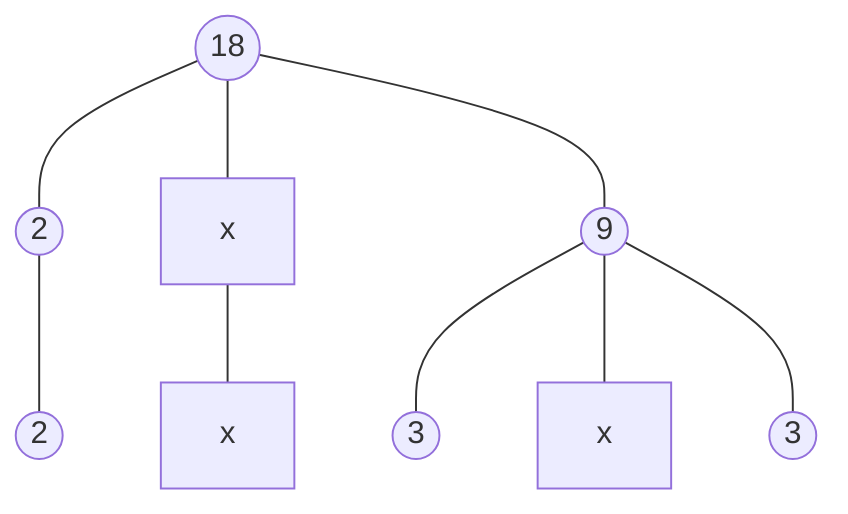
*(Note: The diagram shows the prime factorization of 18 as $2 \times 3 \times 3$)*

---

**Bar Chart:**
<table>
  <thead>
    <tr>
        <th>X-axis</th>
        <th>Y-axis (Value)</th>
    </tr>
  </thead>
  <tbody>
    <tr>
        <td>1</td>
        <td>6</td>
    </tr>
    <tr>
        <td>2</td>
        <td>4</td>
    </tr>
    <tr>
        <td>3</td>
        <td>3</td>
    </tr>
    <tr>
        <td>4</td>
        <td>2</td>
    </tr>
    <tr>
        <td>5</td>
        <td>7</td>
    </tr>
  </tbody>
</table>

---

**Prime Factorization Table:**
<table>
  <tbody>
    <tr>
        <td>2</td>
        <td>12</td>
    </tr>
    <tr>
        <td>2</td>
        <td>6</td>
    </tr>
    <tr>
        <td>3</td>
        <td>3</td>
    </tr>
    <tr>
        <td></td>
        <td>1</td>
    </tr>
  </tbody>
</table>

---

**Geometry - Angle Measurement:**
The image shows a reflex angle $\angle CDE$ measured as $210^\circ$. Below it is a protractor used for measuring angles, with points A, O, and B marked on the baseline.

---

**Geometry - Line Segment Measurement:**
A line segment AB is shown being measured with a ruler.
- Point A is at 0 cm.
- Point B is at 4 cm.
- Length of AB = 4 cm.

---


Punjab Curriculum and Textbook Board, Lahore

بِسْمِ اللهِ الرَّحْمٰنِ الرَّحِيْمِ
(In the Name of Allah, the Most Compassionate, the Most Merciful)

# Mathematics
# Grade 5

Based on Single National Curriculum 2020
**ONE NATION, ONE CURRICULUM**

Web version of PCTB Textbook
Not for Sale

The page contains a circular green seal with Arabic calligraphy inside.

**PUNJAB CURRICULUM AND TEXTBOOK BOARD, LAHORE**

**This book is based on Single National Curriculum 2020 and has been approved by the National Review Committee**

All rights are reserved with the Punjab Curriculum and Textbook Board, Lahore. No part of this book can be copied, translated, reproduced or used for preparation of test papers, guidebooks, keynotes and helping books.

# Contents

<table>
  <thead>
    <tr>
        <th>Sr.No</th>
        <th></th>
        <th>Unit</th>
        <th></th>
        <th>Page</th>
        <th></th>
    </tr>
  </thead>
  <tbody>
    <tr>
        <td>1</td>
        <td>Whole Numbers and Operations</td>
        <td>1</td>
        <td colspan="3"></td>
    </tr>
    <tr>
        <td>2</td>
        <td>HCF and LCM</td>
        <td>29</td>
        <td colspan="3"></td>
    </tr>
    <tr>
        <td>3</td>
        <td>Fractions</td>
        <td>40</td>
        <td colspan="3"></td>
    </tr>
    <tr>
        <td>4</td>
        <td>Decimals and Percentage</td>
        <td>54</td>
        <td colspan="3"></td>
    </tr>
    <tr>
        <td>5</td>
        <td>Distance and Time</td>
        <td>83</td>
        <td colspan="3"></td>
    </tr>
    <tr>
        <td>6</td>
        <td>Unitary Method</td>
        <td>107</td>
        <td colspan="3"></td>
    </tr>
    <tr>
        <td>7</td>
        <td>Geometry</td>
        <td>113</td>
        <td colspan="3"></td>
    </tr>
    <tr>
        <td>8</td>
        <td>Perimeter and Area</td>
        <td>145</td>
        <td colspan="3"></td>
    </tr>
    <tr>
        <td>9</td>
        <td>Data Handling</td>
        <td>158</td>
        <td colspan="3"></td>
    </tr>
    <tr>
        <td>10</td>
        <td>Answers</td>
        <td>171</td>
        <td colspan="3"></td>
    </tr>
    <tr>
        <td>11</td>
        <td>Glossary</td>
        <td>178</td>
        <td colspan="3"></td>
    </tr>
  </tbody>
</table>

> **Supervision: Muhammad Rafique Tahir**
> Joint Educational Advisor
> National Curriculum Council, Ministry of Federal Education and Professional Training, Islamabad
> **Focal Person Punjab (Single National Curriculum):** Aamir Riaz, Director (Curriculum), PCTB
> **Authors:** Sadia Manzoor, Madeeha Nuzhat Varaich

### National Review Committee Members

*   **Muhammad Akhtar Shirani**
    Punjab Curriculum & Textbook Board, Lahore
*   **Sherzad Ali**
    Sir Syed Ahmad Khan Govt. Boys Higher Secondary School No.1, Gilgit
*   **Tayyaba Saqib**
    Pak Turk Maarif International School & Colleges, H/9, Islamabad
*   **Abbas Khan**
    Directorate of Curriculum & Teacher Education, Abbottabad, KPK
*   **Dr. Razia Fakir Muhammad**
    Aga Khan University, Institute for Education Development, Karachi
*   **Saeeda Parveen**
    Islamabad College for Girls, F-6/2, Islamabad
*   **Gul Muhammad**
    Bureau of Curriculum & Extension Centre, Quetta
*   **Raihana Ghulam Hussain**
    F.G. Sir Syed Public School (Girls) II, Rawalpindi
*   **Dr. Muhammad Irfan Ali**
    Islamabad Model College for Boys, G-11/1, Islamabad

**Technical Assistant:** • Nighat Lone • Asfundyar Khan • Muhammad Sarfraz Ahmad
**Desk Officer:** Sikandra Ali (National Curriculum Council)
**Director (Manuscripts), PCTB:** Muhammad Saleem Sagar
**Deputy Director (Art & Design):** Ghulam Mohayy-ud-Din
**Supervised By:** Muhammad Akhtar Shirani (SS), Madiha Mehmood (SS)
**Consultant:** Muhammad Yahya Naoman
**Designers:** Faisal Ghafoor Sheikh, Muhammad Wazir Malik, Shahbaz Jabbar, Kamran Afzal, Minal Tariq
**Illustrators:** Uffaq Aamir, Ayatullah, Shutterstock
**Composer:** Muhammad Shahid Tai

**Experimental Edition**

Unit 1 Whole Numbers and Operations


# Whole Numbers and Operations

## Learning Outcomes

**After completing this unit, you will be able to:**

*   Read and write numbers up to 1,000,000 (one million) in words and numerals.
*   Add numbers up to 6-digit numbers.
*   Subtract numbers up to 6-digits.
*   Multiply numbers, up to 5-digits, by 10, 100, and 1 000.
*   Multiply numbers, up to 5-digits, by a number up to 3-digits.
*   Divide a number up to 5-digits by 10, 100 and 1 000
*   Divide numbers up to 5-digits by a number up to 2-digits.
*   Solve real-life situations involving operations of addition, subtraction, multiplication, and division.
*   Identify and apply a pattern rule to determine missing elements for a given pattern
*   Identify the pattern rule of a given increasing and decreasing pattern and extend the pattern for the next three terms
*   Describe the pattern found in a given table or chart.

The image shows a illustration of the Earth and the Moon in space.

> The minimum distance between the earth and the moon is about 363 104 km and the maximum distance is about 405 696 km. How will you write these distances in words?


1

Mathematics-5 Unit 1: Whole Numbers and Operations


# Numbers up to one Million

> According to a 2016 report, there are about 391000 types of plants in the world. How can we write this quantity in words?

The number which is greater than three digits, we leave space after every three digits from the right side of that number i.e. 391 000.
We read and write this quantity as "three hundred ninety-one thousand."

### Try Yourself
How many hundreds are there in one hundred thousands?
How many thousands are there in ten thousands?

Let's write 456 907 in a place value chart.

<table>
  <thead>
    <tr>
        <th colspan="3">Second Period</th>
        <th colspan="3">First Period</th>
    </tr>
    <tr>
        <th colspan="3">Thousands</th>
        <th colspan="3">Ones</th>
    </tr>
    <tr>
        <th>Hundred Thousands</th>
        <th>Ten Thousands</th>
        <th>Thousands</th>
        <th>Hundreds</th>
        <th>Tens</th>
        <th>Ones</th>
    </tr>
  </thead>
  <tbody>
    <tr>
        <td>4</td>
        <td>5</td>
        <td>6</td>
        <td>9</td>
        <td>0</td>
        <td>7</td>
    </tr>
  </tbody>
</table>

We write,
In numerals: 456 907
In words: Four hundred fifty-six thousand nine hundred seven.

> Let's write the place and place value of each digit in this number.

### Try Yourself
Find the place and place value of each digit in 237 112. Also write this number in words.


2

Mathematics-5 Unit 1: Whole Numbers and Operations


> "4" is at the hundred thousands place, so its place value = $4 \times 100,000 = 400,000$
> "5" is at the ten thousands place, so its place value = $5 \times 10,000 = 50,000$
> "6" is at the thousands place, so its place value = $6 \times 1,000 = 6,000$
> "9" is at the hundreds place, so its place value = $9 \times 100 = 900$
> "0" is at the tens place, so its place value = $0 \times 10 = 0$
> "7" is at the ones place, so its place value = $7 \times 1 = 7$

> Writing a number as the sum of the place value of its digits is called expanded form.

$456,907 = 400,000 + 50,000 + 6,000 + 900 + 0 + 7$

### Try Yourself
After Mount Everest, K-2 is the 2nd highest mountain in the world. It is situated in Gilgit Baltistan at the border of Pakistan and China. Its height is 861,100 centimetres.
a) Write it in expanded form.
b) Write the place value of each digit.
c) Write this height in words.

[The image shows a photograph of the snow-capped mountain K-2.]

> Let's write the place and place value of each digit in 987,516.

*   "9" is at hundred thousands place, so its place value = $9 \times 100,000 = 900,000$
*   "8" is at ten thousands place, so its place value = $8 \times 10,000 = 80,000$
*   "7" is at thousands place, so its place value = $7 \times 1,000 = 7,000$
*   "5" is at hundreds place, so its place value = $5 \times 100 = 500$
*   "1" is at tens place, so its place value = $1 \times 10 = 10$
*   "6" is at ones place, so its place value = $6 \times 1 = 6$

987,516 is read as "Nine hundred eighty-seven thousand five hundred sixteen".
In expanded form, we can write it as:
$987,516 = 900,000 + 80,000 + 7,000 + 500 + 10 + 6$

<table>
    <tr>
        <th>TEACHING POINT</th>
    </tr>
    <tr>
        <td>Give flash cards of place values written in numerals and words. Write a few numbers on the board and ask the students to tell place value of each digit.</td>
    </tr>
</table>
3

Mathematics-5 | Unit 1: Whole Numbers and Operations


### Try It! Challenge

**What number am I?**
I am a 6-digit number. My tens place digit is 5.
My ten thousands place digit is 3 less than my tens digit.
My ones place digit is the greatest 1-digit even number.
My thousands place digit is 3 times my ten thousands place digit.
My the greatest place value digit is the sum of my tens place digit and my ten thousands place digit.
My hundreds place digit is the ones digit of the smallest 2-digit number.

999 999 is the greatest 6-digit number.
If we add 1 more to it, we get one million (1 000 000) which is the smallest 7-digit number.
We can write this number with the help of a place value chart as shown below.

$$
\begin{array}{r}
\textcircled{1}\textcircled{1}\textcircled{1}\quad\textcircled{1}\textcircled{1} \\
999\ 999 \\
+\quad\quad\quad\quad 1 \\
\hline
1\ 000\ 000
\end{array}
$$

<table>
  <thead>
    <tr>
        <th colspan="3">Third Period</th>
        <th colspan="3">Second Period</th>
        <th colspan="3">First Period</th>
    </tr>
    <tr>
        <th colspan="3">Millions</th>
        <th colspan="3">Thousands</th>
        <th colspan="3">Ones</th>
    </tr>
    <tr>
        <th>Hundred Millions</th>
        <th>Ten Millions</th>
        <th>Millions</th>
        <th>Hundred Thousands</th>
        <th>Ten Thousands</th>
        <th>Thousands</th>
        <th>Hundreds</th>
        <th>Tens</th>
        <th>Ones</th>
    </tr>
  </thead>
  <tbody>
    <tr>
        <td></td>
        <td></td>
        <td></td>
        <td>9</td>
        <td>9</td>
        <td>9</td>
        <td>9</td>
        <td>9</td>
        <td>9</td>
    </tr>
    <tr>
        <td></td>
        <td></td>
        <td>1</td>
        <td>0</td>
        <td>0</td>
        <td>0</td>
        <td>0</td>
        <td>0</td>
        <td>0</td>
    </tr>
  </tbody>
</table>

# Exercise 1

1. Write the following numbers in words:
   a) 290 014
   b) 433 453
   c) 910 009
   d) 871 653
   e) 242 140
   f) 688 069
   g) 874 454
   h) 495 523

2. Write the following numbers in expanded form:
   a) 131 441
   b) 600 900
   c) 949 181
   d) 466 456
   e) 286 019
   f) 479 321
   g) 510 602
   h) 202 001

> Divide the students in groups and ask them to make a 6-digit number. Then ask them to tell the place and place value of each digit.


4

Mathematics-5 Unit 1: Whole Numbers and Operations


3. Match column A with column B.

<table>
  <thead>
    <tr>
        <th>Column A</th>
        <th>Column B</th>
    </tr>
  </thead>
  <tbody>
    <tr>
        <td>a) Eight hundred seven thousand eight hundred.</td>
        <td>808 808</td>
    </tr>
    <tr>
        <td>b) Two hundred seventy-eight thousand seventy-eight.</td>
        <td>206 002</td>
    </tr>
    <tr>
        <td>c) Eight hundred eight thousand eight hundred eight</td>
        <td>807 800</td>
    </tr>
    <tr>
        <td>d) Two hundred seven thousand five hundred five</td>
        <td>278 078</td>
    </tr>
    <tr>
        <td>e) Two hundred six thousand two</td>
        <td>207 505</td>
    </tr>
  </tbody>
</table>

4. Write the place and place value of the coloured digits.
a) <span style="color: #e91e63;">5</span>45 445
b) 846 <span style="color: #e91e63;">5</span>32
c) 682 <span style="color: #e91e63;">4</span>56
d) <span style="color: #e91e63;">9</span>80 714
e) 997 9<span style="color: #e91e63;">2</span>4
f) 425 41<span style="color: #e91e63;">9</span>
g) 817 6<span style="color: #e91e63;">5</span>6
h) 701 <span style="color: #e91e63;">2</span>32

5. According to 2017 census, the population of Islamabad is 114 825.
a) Write it in words.
b) Write it in expanded form.
c) Write the place of each digit in it.

6. The speed of light in vacuum is 299 792 kilometres per second.
a) Write it in words.
b) Write it in expanded form.
c) Write the place of each digit in it.


5

Mathematics-5 Unit 1: Whole Numbers and Operations


# Addition and Subtraction

## Addition
After the construction of a new national hospital, 40 655 beds were arranged during the first month. In the second month, 32 263 more beds were arranged. Find the total number of beds arranged in two months.

[The image shows a modern hospital building with a red cross symbol and the word "HOSPITAL" on it.]

> By adding the two quantities, we can find the total number of beds.

<table>
  <tbody>
    <tr>
        <td colspan="2"></td>
        <td>T.th</td>
        <td>Th</td>
        <td>H</td>
        <td>T</td>
        <td>O</td>
    </tr>
    <tr>
        <td colspan="2"></td>
        <td></td>
        <td></td>
        <td>①</td>
        <td></td>
        <td></td>
    </tr>
    <tr>
        <td>Number of beds in the first month =</td>
        <td>4</td>
        <td>0</td>
        <td>6</td>
        <td>5</td>
        <td>5</td>
        <td></td>
    </tr>
    <tr>
        <td>Number of beds in the second month =</td>
        <td>+ 3</td>
        <td>2</td>
        <td>2</td>
        <td>6</td>
        <td>3</td>
        <td></td>
    </tr>
    <tr>
        <td>Total beds =</td>
        <td>7</td>
        <td>2</td>
        <td>9</td>
        <td>1</td>
        <td>8</td>
        <td></td>
    </tr>
  </tbody>
</table>

Total number of beds arranged = 72 918

### Try Yourself
* Add 567 098 and 381 940.

There are 124 789 Mathematics books and 200 699 English books in a library. Find the total number of Mathematics and English books.

[The image shows a wooden bookshelf filled with colorful books.]


6

Mathematics-5 Unit 1: Whole Numbers and Operations


<table>
  <thead>
    <tr>
        <th></th>
        <th>H.th</th>
        <th>T.th</th>
        <th>Th</th>
        <th>H</th>
        <th>T</th>
        <th>O</th>
        <th></th>
    </tr>
  </thead>
  <tbody>
    <tr>
        <td>Mathematics books</td>
        <td>=</td>
        <td>1</td>
        <td>2</td>
        <td><sup>①</sup>4</td>
        <td><sup>①</sup>7</td>
        <td><sup>①</sup>8</td>
        <td>9</td>
    </tr>
    <tr>
        <td>English books</td>
        <td>= +</td>
        <td>2</td>
        <td>0</td>
        <td>0</td>
        <td>6</td>
        <td>9</td>
        <td>9</td>
    </tr>
    <tr>
        <td>Total books</td>
        <td>=</td>
        <td>3</td>
        <td>2</td>
        <td>5</td>
        <td>4</td>
        <td>8</td>
        <td>8</td>
    </tr>
  </tbody>
</table>

Total number of books = 325 488

Add 293 109 and 625 834.

<table>
  <thead>
    <tr>
        <th></th>
        <th>H.th</th>
        <th>T.th</th>
        <th>Th</th>
        <th>H</th>
        <th>T</th>
        <th>O</th>
    </tr>
  </thead>
  <tbody>
    <tr>
        <td></td>
        <td><sup>①</sup>2</td>
        <td>9</td>
        <td>3</td>
        <td>1</td>
        <td><sup>①</sup>0</td>
        <td>9</td>
    </tr>
    <tr>
        <td>+</td>
        <td>6</td>
        <td>2</td>
        <td>5</td>
        <td>8</td>
        <td>3</td>
        <td>4</td>
    </tr>
    <tr>
        <td></td>
        <td>9</td>
        <td>1</td>
        <td>8</td>
        <td>9</td>
        <td>4</td>
        <td>3</td>
    </tr>
  </tbody>
</table>

> ### Try Yourself
> Find the sum of the smallest and the greatest 6-digit numbers.

## Subtraction

During a tree planting campaign, 554 876 trees were planted in March. In April, 263 755 trees were planted. Find:
a) In which month more trees were planted?
b) How many more trees were planted?

The image shows two boys planting a tree. One boy is digging a hole with a shovel, and the other boy is watering a small plant from a watering can.

<table>
  <thead>
    <tr>
        <th></th>
        <th>H.th</th>
        <th>T.th</th>
        <th>Th</th>
        <th>H</th>
        <th>T</th>
        <th>O</th>
        <th></th>
    </tr>
  </thead>
  <tbody>
    <tr>
        <td>Trees planted in March</td>
        <td>=</td>
        <td><sup>4</sup>~~5~~</td>
        <td><sup>15</sup>~~5~~</td>
        <td>4</td>
        <td>8</td>
        <td>7</td>
        <td>6</td>
    </tr>
    <tr>
        <td>Trees planted in April</td>
        <td>= -</td>
        <td>2</td>
        <td>6</td>
        <td>3</td>
        <td>7</td>
        <td>5</td>
        <td>5</td>
    </tr>
    <tr>
        <td>Difference</td>
        <td>=</td>
        <td>2</td>
        <td>9</td>
        <td>1</td>
        <td>1</td>
        <td>2</td>
        <td>1</td>
    </tr>
  </tbody>
</table>

a) More trees were planted in March.
b) 291 121 more trees were planted.

> ### Try Yourself
> Make any two 6-digit numbers. Then find their difference.


7

Mathematics-5 | Unit 1: Whole Numbers and Operations


A toy factory manufactured 598 248 toys out of which 446 719 toys are of plastic. How many toys are non-plastic toys?

The image shows a factory assembly line where workers are assembling toys.

> To find the number of non-plastic toys, we will subtract 446 719 from 598 248.

<table>
  <thead>
    <tr>
        <th></th>
        <th>H.th</th>
        <th>T.th</th>
        <th>Th</th>
        <th>H</th>
        <th>T</th>
        <th>O</th>
    </tr>
  </thead>
  <tbody>
    <tr>
        <td>Total toys =</td>
        <td>5</td>
        <td>9</td>
        <td>~~8~~ <sup>7</sup></td>
        <td>~~2~~ <sup>10</sup></td>
        <td>~~4~~ <sup>3</sup></td>
        <td>~~8~~ <sup>10</sup></td>
    </tr>
    <tr>
        <td>Plastic toys = -</td>
        <td>4</td>
        <td>4</td>
        <td>6</td>
        <td>7</td>
        <td>1</td>
        <td>9</td>
    </tr>
    <tr>
        <td rowspan="2">Non-plastic toys =</td>
        <td>1</td>
        <td>5</td>
        <td>1</td>
        <td>5</td>
        <td>2</td>
        <td>9</td>
    </tr>
  </tbody>
</table>

The number of non-plastic toys = 151 529

Subtract 289 344 from 760 862.

<table>
  <thead>
    <tr>
        <th></th>
        <th>H.th</th>
        <th>T.th</th>
        <th>Th</th>
        <th>H</th>
        <th>T</th>
        <th>O</th>
    </tr>
  </thead>
  <tbody>
    <tr>
        <td></td>
        <td>~~7~~ <sup>6</sup></td>
        <td>~~6~~ <sup>10</sup> <sup>5</sup></td>
        <td>~~0~~ <sup>10</sup></td>
        <td>8</td>
        <td>~~6~~ <sup>5</sup></td>
        <td>~~2~~ <sup>10</sup></td>
    </tr>
    <tr>
        <td>-</td>
        <td>2</td>
        <td>8</td>
        <td>9</td>
        <td>3</td>
        <td>4</td>
        <td>4</td>
    </tr>
    <tr>
        <td></td>
        <td>4</td>
        <td>7</td>
        <td>1</td>
        <td>5</td>
        <td>1</td>
        <td>8</td>
    </tr>
  </tbody>
</table>

### Try Yourself
Find the difference of the smallest 6-digit number and the greatest 5-digit number.

> **TEACHING POINT:** Write the digits from 0-9 on the board and ask the students to make two 6-digit numbers. Then ask them to subtract the smaller number from the greater number.


8

Mathematics-5 Unit 1: Whole Numbers and Operations


# Exercise 2

1. Add the following:
    a) 100 700 + 291 562
    b) 417 381 + 309 201
    c) 591 727 + 702 929
    d) 319 898 + 428 888
    e) 766 442 + 611 222
    f) 542 001 + 621 416

2. Subtract the following:
    a) 209 856 - 205 660
    b) 788 991 - 206 070
    c) 395 108 - 165 439
    d) 673 265 - 656 600
    e) 686 898 - 333 333
    f) 744 762 - 565 656

3. Sadia bought a plot for Rs 659 814 and another plot for Rs 799 999. Find the total amount she spent.

4. Amaan has an annual income of Rs. 456 750. He spends Rs 125 295 on the construction of a Masjid. How much amount is he left with?

5. Lahore has a population of 459 814 in one town and 325 919 in the other.
    a) What is the total population of both the towns?
    b) What is the difference between their population?

6. The annual yield of mango orchard is 656 565 kg. In the second year, the yield of mango orchard decreased by 100 984 kg. How much mangoes were produced in the second year?

7. The government built 386 655 houses for the homeless in one year. The second year 24 521 fewer homes were built than the previous year. How many houses did the government build in both the years?

8. Fatima has Rs 954 888 in her bank account. If she withdraws Rs 135 600 from the bank to buy a laptop, how much money is she left with?

9. A factory owner gave Rs 448 870 as reward to his employees in one year. In the second year Rs 437 995 were given as reward.
    a) What is the total amount given as reward in both the years?
    b) In which year the factory owner gave less reward and how much less?

10. Farhan donates Rs 600 000 to two Edhi organizations. If he pays Rs 385 990 to one Edhi organization, how much will he pay to the other organization?


9

Mathematics-5 Unit 1: Whole Numbers and Operations


# Multiplication and Division

## Multiplication
If the price of a solar panel is Rs 18 250, then find:
* the price of 10 panels.
* the price of 100 panels.
* the price of 1 000 panels.

[The image shows two solar panels on a stand.]

> To find the price of 10, 100 and 1 000 panels, we multiply the price of one panel by 10, 100 and 1 000 respectively.

<table>
  <tbody>
    <tr>
        <td>Price of 10 panels</td>
        <td>=</td>
        <td>18 250 × 10</td>
        <td>=</td>
        <td>Rs 182 500</td>
    </tr>
    <tr>
        <td>Price of 100 panels</td>
        <td>=</td>
        <td>18 250 × 100</td>
        <td>=</td>
        <td>Rs 1 825 000</td>
    </tr>
    <tr>
        <td>Price of 1 000 panels</td>
        <td>=</td>
        <td>18 250 × 1000</td>
        <td>=</td>
        <td>Rs 18 250 000</td>
    </tr>
  </tbody>
</table>

### Key Fact
* When we multiply a whole number by 10, we put one zero to its right.
* When we multiply a whole number by 100, we put two zeros to its right.
* When we multiply a whole number by 1 000, we put three zeros to its right.


10

Mathematics-5 Unit 1: Whole Numbers and Operations


> Let's Multiply 34 523 by 10, 100 and 1 000.

$34\ 523 \times 10 = 345\ 230$
$34\ 523 \times 100 = 3\ 452\ 300$
$34\ 523 \times 1\ 000 = 34\ 523\ 000$

### Try Yourself
Find the product of:
a) $100 \times 100 = ?$
b) $1\ 000 \times 100 \times 10 = ?$
c) $1\ 000 \times 10 = ?$

> The price of a laptop is Rs 102 900. How much does 215 such laptops cost?

[Image of a laptop showing a globe on the screen]

> To find the price of 215 such laptops, we will multiply the cost of 1 laptop by 215 i.e. 102 900 by 215.

<table>
  <thead>
    <tr>
        <th></th>
        <th colspan="10"></th>
        <th colspan="2"></th>
    </tr>
    <tr>
        <th></th>
        <th colspan="10"></th>
        <th colspan="2"></th>
    </tr>
  </thead>
  <tbody>
    <tr>
        <td>Price of 1 laptop</td>
        <td>=</td>
        <td colspan="6">1</td>
        <td>0</td>
        <td>2</td>
        <td>9</td>
        <td>0</td>
        <td>0</td>
    </tr>
    <tr>
        <td>Number of laptops</td>
        <td>=</td>
        <td>×</td>
        <td colspan="3"></td>
        <td>2</td>
        <td>1</td>
        <td>5</td>
        <td colspan="4"></td>
    </tr>
    <tr>
        <td></td>
        <td></td>
        <td></td>
        <td></td>
        <td>5</td>
        <td>1</td>
        <td>4</td>
        <td>5</td>
        <td>0</td>
        <td>0</td>
        <td>→ 102900 × 5</td>
        <td colspan="2"></td>
    </tr>
    <tr>
        <td></td>
        <td></td>
        <td></td>
        <td>1</td>
        <td>0</td>
        <td>2</td>
        <td>9</td>
        <td>0</td>
        <td>0</td>
        <td>0</td>
        <td>→ 102900 × 10</td>
        <td colspan="2"></td>
    </tr>
    <tr>
        <td></td>
        <td></td>
        <td>+</td>
        <td>2</td>
        <td>0</td>
        <td>5</td>
        <td>8</td>
        <td>0</td>
        <td>0</td>
        <td>0</td>
        <td>0</td>
        <td>→ 102900 × 200</td>
        <td></td>
    </tr>
    <tr>
        <td>Total cost</td>
        <td>=</td>
        <td>2</td>
        <td>2</td>
        <td>1</td>
        <td>2</td>
        <td>3</td>
        <td>5</td>
        <td>0</td>
        <td>0</td>
        <td colspan="3"></td>
    </tr>
  </tbody>
</table>

The cost of 215 laptops = Rs 22 123 500


11

Mathematics-5 | Unit 1: Whole Numbers and Operations


> ### Try Yourself
> * Multiply the greatest 6-digit number by the greatest 3-digit number.
> * Multiply the smallest 6-digit number by the smallest 3-digit number.

A company buys 185 motorbikes. If the cost of one motorbike is Rs 79 459, what will be the total cost of 185 such motorbikes?

> To find the cost of 185 motorbikes, we will multiply 79 459 by 185.

<table>
  <tbody>
    <tr>
        <td>Price of 1 motorbike</td>
        <td>=</td>
        <td colspan="7">7 9 4 5 9</td>
        <td></td>
    </tr>
    <tr>
        <td>Total motorbikes</td>
        <td>=</td>
        <td>×</td>
        <td colspan="6">1 8 5</td>
        <td></td>
    </tr>
    <tr>
        <td colspan="2"></td>
        <td colspan="2"></td>
        <td>3</td>
        <td>9</td>
        <td>7</td>
        <td>2</td>
        <td>9</td>
        <td>5</td>
    </tr>
    <tr>
        <td colspan="2"></td>
        <td>6</td>
        <td>3</td>
        <td>5</td>
        <td>6</td>
        <td>7</td>
        <td>2</td>
        <td>0</td>
        <td></td>
    </tr>
    <tr>
        <td colspan="2"></td>
        <td>+</td>
        <td>7</td>
        <td>9</td>
        <td>4</td>
        <td>5</td>
        <td>9</td>
        <td>0</td>
        <td>0</td>
    </tr>
    <tr>
        <td>Total cost</td>
        <td>=</td>
        <td>1</td>
        <td>4</td>
        <td>6</td>
        <td>9</td>
        <td>9</td>
        <td>9</td>
        <td>1</td>
        <td>5</td>
    </tr>
  </tbody>
</table>

The cost of 185 motorbikes = Rs 14 699 915

Find the product of 23 678 and 32.

<table>
  <tbody>
    <tr>
        <td colspan="2"></td>
        <td>2</td>
        <td>3</td>
        <td>6</td>
        <td>7</td>
        <td>8</td>
        <td></td>
    </tr>
    <tr>
        <td>×</td>
        <td colspan="4"></td>
        <td>3</td>
        <td>2</td>
        <td></td>
    </tr>
    <tr>
        <td colspan="2"></td>
        <td>4</td>
        <td>7</td>
        <td>3</td>
        <td>5</td>
        <td>6</td>
        <td></td>
    </tr>
    <tr>
        <td>+</td>
        <td>7</td>
        <td>1</td>
        <td>0</td>
        <td>3</td>
        <td>4</td>
        <td>0</td>
        <td></td>
    </tr>
    <tr>
        <td colspan="2"></td>
        <td>7</td>
        <td>5</td>
        <td>7</td>
        <td>6</td>
        <td>9</td>
        <td>6</td>
    </tr>
  </tbody>
</table>

$32 \times 23\ 678 = 757\ 696$

Find the product of 60 392 and 425.

<table>
  <tbody>
    <tr>
        <td colspan="2"></td>
        <td>6</td>
        <td>0</td>
        <td>3</td>
        <td>9</td>
        <td>2</td>
        <td colspan="2"></td>
    </tr>
    <tr>
        <td>×</td>
        <td colspan="3"></td>
        <td>4</td>
        <td>2</td>
        <td>5</td>
        <td colspan="2"></td>
    </tr>
    <tr>
        <td colspan="2"></td>
        <td>3</td>
        <td>0</td>
        <td>1</td>
        <td>9</td>
        <td>6</td>
        <td>0</td>
        <td></td>
    </tr>
    <tr>
        <td></td>
        <td>1</td>
        <td>2</td>
        <td>0</td>
        <td>7</td>
        <td>8</td>
        <td>4</td>
        <td>0</td>
        <td></td>
    </tr>
    <tr>
        <td>+</td>
        <td>2</td>
        <td>4</td>
        <td>1</td>
        <td>5</td>
        <td>6</td>
        <td>8</td>
        <td>0</td>
        <td>0</td>
    </tr>
    <tr>
        <td></td>
        <td>2</td>
        <td>5</td>
        <td>6</td>
        <td>6</td>
        <td>6</td>
        <td>6</td>
        <td>0</td>
        <td>0</td>
    </tr>
  </tbody>
</table>

$425 \times 60\ 392 = 25\ 666\ 600$

<table>
    <tr>
        <th>TEACHING POINT</th>
        <th>Explain the method of multiplication of 5-digit numbers by 3-digit numbers. Ask the students to write few 5-digit and 3-digit numbers on their notebooks and find the product.</th>
    </tr>
</table>
12

Mathematics-5 | Unit 1: Whole Numbers and Operations


> There are 243 rows of apple trees in a farm. If each row has 21 apple trees, find the total trees in the farm.

First write both numbers in their expanded form.
$$243 = 200 + 40 + 3$$
$$21 = 20 + 1$$

Now write one number horizontally and the other one vertically in grid as shown in the table.

<table>
  <tbody>
    <tr>
        <td>×</td>
        <td>200</td>
        <td>40</td>
        <td>3</td>
    </tr>
    <tr>
        <td>20</td>
        <td></td>
        <td></td>
        <td></td>
    </tr>
    <tr>
        <td>1</td>
        <td colspan="3"></td>
    </tr>
  </tbody>
</table>

Now multiply every digit in horizontal grid by every digit in vertical grid one by one.

Finally, add the resulting products (in blue grids). This will give us the product of 243 and 21.

<table>
  <tbody>
    <tr>
        <td>×</td>
        <td>200</td>
        <td>40</td>
        <td>3</td>
        <td></td>
    </tr>
    <tr>
        <td>20</td>
        <td>4000</td>
        <td>800</td>
        <td>60</td>
        <td>4860</td>
    </tr>
    <tr>
        <td>1</td>
        <td>200</td>
        <td>40</td>
        <td>3</td>
        <td>243</td>
    </tr>
    <tr>
        <td></td>
        <td>4200</td>
        <td>840</td>
        <td>63</td>
        <td>5103</td>
    </tr>
  </tbody>
</table>

$$4000 + 800 + 60 + 200 + 40 + 3 = 5103$$

So, there are 5 103 apple trees altogether in the farm.

### Try Yourself
Find the product of 5 623 and 418 using box method.

> **TEACHING POINT:** Explain the box or grid method of multiplication to the students by multiplying various numbers.


13

Mathematics-5 | Unit 1: Whole Numbers and Operations


# Division

A mask manufacturing factory produced 45 000 masks which are to be packed in boxes of three different sizes. Find the number of boxes required if:

*   a small box has 10 masks in it.
*   a medium box has 100 masks in it.
*   a large box has 1 000 masks in it.

> To find the required number of boxes, we will divide the total number of masks by 10, 100 and 1 000 respectively.

Required number of small boxes having 10 masks each $= 45\ 000 \div 10 = 4\ 500$ boxes
Required number of medium boxes having 100 masks $= 45\ 000 \div 100 = 450$ boxes
Required number of large boxes having 1 000 masks $= 45\ 000 \div 1\ 000 = 45$ boxes

### Key Fact
*   When we divide a non-zero whole number having 0 at its ones place by 10, we remove one zero from its right.
*   When we divide a non-zero whole number having 0 at its ones and tens place by 100, we remove two zeros from its right.
*   When we divide a non-zero whole number having 0 at its ones, tens and hundreds place by 1 000, we remove three zeros from its right.

> **TEACHING POINT:** Explain the method of dividing a 5-digit number by 10, 100 and 1 000. Ask the students to write a few 5-digit numbers which have zeros at their ones, tens and hundreds places. Then ask them to divide these numbers by 10, 100 and 1 000.


14

Mathematics-5 Unit 1: Whole Numbers and Operations


> Let's divide 76 000 by 10, 100 and 1 000.

76 000 ÷ 10 = 7 600
76 000 ÷ 100 = 760
76 000 ÷ 1 000 = 76

> I have saved Rs 16 620 from my pocket money. I want to distribute this amount among 12 children. How can I find the amount each child will get?

> To find the amount each child will get, we will divide 16 620 by 12.

### Key Fact
When a number is divided by another number, the result is called the quotient and the left over quantity is called the remainder.

**Division Calculation:**

$$
\begin{array}{r|l}
\text{Quotient} \leftarrow & 1\ 3\ 8\ 5 \\
\hline
\text{Divisor} \leftarrow 1\ 2 & 1\ 6\ 6\ 2\ 0 \rightarrow \text{Dividend} \\
& -1\ 2 \\
\hline
& \phantom{0} 4\ 6 \\
& -3\ 6 \\
\hline
& \phantom{0} 1\ 0\ 2 \\
& -\phantom{0} 9\ 6 \\
\hline
& \phantom{0\ 0} 6\ 0 \\
& -\phantom{0} 6\ 0 \\
\hline
& \phantom{0\ 0\ 0} 0 \rightarrow \text{Remainder}
\end{array}
$$

### Try Yourself
Shahzad equally divided Rs 34 760 among 21 needy people. How much amount did each person get? Also find the remaining amount.

So, each child will get = Rs 1 385.

16 620 ÷ 12 = 1 385
Quotient = 1 385


15

Mathematics-5 | Unit 1: Whole Numbers and Operations


For Pakistan Day celebrations, 10 125 students participated from all over the country. If groups of 95 students are to be made, then find:
a) how many groups can be made?
b) find the number of un-grouped students.
c) if 720 students cannot participate due to some reason, then how many groups can be made?

To find the number of groups, we will divide the number of students by 95.

[The image shows a photograph of the Minar-e-Pakistan monument.]

$$
\begin{array}{r|l}
& 106 \\
\hline
95 & 10125 \\
& - \phantom{0}95 \downarrow \\
\hline
& \phantom{00}62 \\
& - \phantom{00}0 \downarrow \\
\hline
& \phantom{00}625 \\
& - \phantom{00}570 \\
\hline
& \phantom{000}55
\end{array}
$$

> **Try Yourself**
> If 532 more students participated, then how many groups will be made?

> $10\ 125 \div 95 = 106\ \text{r}\ 55$
> Quotient = 106, Remainder = 55
> a) Number of groups = 106
> b) Un-grouped students = 55

If 720 students cannot participate, then the number of remaining students can be found by subtracting 720 from 10 125. Then divide this amount by 95.

`10 125 - 720 = 9 405`

Now, we will divide this quantity by 95 to find the number of groups.

`9 405 ÷ 95 = 99`

c) So, 99 groups can be made.

$$
\begin{array}{r|l}
& 99 \\
\hline
95 & 9405 \\
& - 855 \downarrow \\
\hline
& \phantom{0}855 \\
& - \phantom{0}855 \\
\hline
& \phantom{000}0
\end{array}
$$


16

Mathematics-5 | Unit 1: Whole Numbers and Operations


Divide 45 205 by 74. Also find the quotient and remainder.

$$
\begin{array}{r|l}
 & 610 \\
\hline
74 & 45205 \\
- & 444 \\
\hline
 & 80 \\
- & 74 \\
\hline
 & 65 \\
- & 0 \\
\hline
 & 65
\end{array}
$$

> $45\ 205 \div 74 = 610 \text{ r } 65$
>
> Quotient = 610, Remainder = 65

# Exercise 3

1. Multiply the following numbers by 10, 100 and 1 000:
   a) 381
   b) 4 090
   c) 97 509
   d) 69 472
   e) 52 118

2. Divide the following numbers by 10, 100 and 1 000:
   a) 49 000
   b) 78 000
   c) 65 000
   d) 97 000
   e) 21 000

3. Multiply the following numbers:
   a) $624 \times 23$
   b) $2\ 456 \times 90$
   c) $1\ 092 \times 981$
   d) $78\ 543 \times 49$
   e) $45\ 201 \times 561$
   f) $11\ 256 \times 342$
   g) $90\ 902 \times 643$
   h) $56\ 219 \times 101$

> [!NOTE]
> Explain the method of division of 5-digit number by 2-digit number. Ask the students to write a few 5-digit and 2-digit numbers on their notebooks and divide them.


17

Mathematics-5 Unit 1: Whole Numbers and Operations


4. Divide the following numbers:
   a) $13\ 440 \div 15$
   b) $86\ 449 \div 29$
   c) $32\ 536 \div 56$
   d) $47\ 088 \div 48$
   e) $56\ 780 \div 20$
   f) $26\ 166 \div 98$
   g) $73\ 810 \div 11$
   h) $64\ 454 \div 32$

5. Aliya has Rs 22 580. She wants to distribute them among 18 needy people. Find:
   a) how much money will each person get?
   b) how much money will be left?

6. Omar's monthly income is Rs. 13 582. Find out his total income in 134 months.

7. A toy factory manufactures 28 550 toys in 25 days. How many toys will it manufacture in a day?

8. A poultry farm sells 76 012 eggs in a day. How many eggs will poultry farm sell in 56 days?

9. A laptop costs Rs 89 710. If Hammad buys 10 such laptops, how much amount will he need?

10. There are 145 boxes of pencils in one shop. Each box has 5 pencils. If 48 boxes are of blue pencils and the rest are of red pencils, then find:
    a) the total number of pencils.
    b) the number of red pencils.

# Number Patterns

> This week, Arham has started exercising. He increased his exercise time gradually. He exercised for 5 minutes on Monday, 11 minutes on Tuesday and 17 minutes on Wednesday. If he keeps increasing the time in the same manner, for how many minutes will he exercise on Thursday?

[The image shows a cartoon illustration of a boy in a blue shirt and grey cap talking, and another illustration of the same boy jumping rope.]


18

Mathematics-5 | Unit 1: Whole Numbers and Operations


First write the given values (duration/minutes) in sequence.

5, 11, 17, \_\_\_\_\_\_

Now try to find out a rule in it. Observe that time is increasing by 6 minutes everyday.

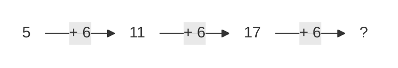

It means by adding 6 to 17, we will get the next number.

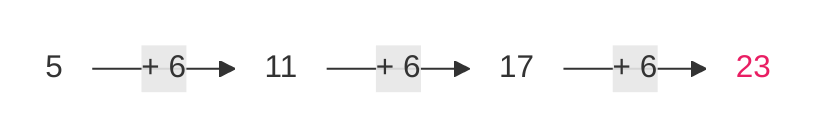

So, on Thursday Arham will exercise for 23 minutes.

> **Key Fact**
> The rule of a number pattern tells us how the next number in the pattern is obtained.

> We observed that the duration of Arham's exercise is increasing in a pattern whose rule is: Adding 6 minutes. So, this is addition pattern in which every next number is obtained by adding 6 to the previous number. It is called arithmetic sequence.

Look at this number pattern:

4, 12, 20, 28, 36, ...

*   find its rule.
*   find the next three terms.

If we look at the terms of this pattern, we see that by adding 8 to 4, we get 12. It means this is addition pattern.

<table>
    <tr>
        <th>Teaching Point</th>
    </tr>
    <tr>
        <td>Divide the students in 2 groups. Ask each group to make at least 5 patterns. Then exchange these patterns with other groups and ask them to identify the rules of the pattern.</td>
    </tr>
</table>
19

Mathematics-5 | Unit 1: Whole Numbers and Operations


4, 12, 20, 28, 36, ?, ?, ?
(Arrows between numbers indicate + 8)

So, this is addition pattern in which every next number is obtained by adding 8 to the previous number.

> $36 + 8 = 44$
> $44 + 8 = 52$
> $52 + 8 = 60$

So, the next three terms are:
**44, 52, 60**

### Try Yourself
Identify the rule for this pattern and find the next three terms. 52, 47, 42, \_\_\_, \_\_\_, \_\_\_

Now, observe this pattern. Identify the rule for this pattern and find the next three terms.
2, 4, 8, 16, \_\_\_, \_\_\_, \_\_\_

If we observe the terms of this pattern, we see that every next number is obtained by multiplying the previous number with 2. It means its a multiplication pattern.

2, 4, 8, 16, ?, ?, ?
(Arrows between numbers indicate $\times 2$)

So, its a multiplication pattern in which every next number is obtained by multiplying the previous number by 2.

Rule of the pattern: Multiplying by 2

So, its next 3 terms will be:
**32, 64, 128**

> $16 \times 2 = 32$
> $32 \times 2 = 64$
> $64 \times 2 = 128$


20

Mathematics-5 Unit 1: Whole Numbers and Operations


> ### Try Yourself
> Ahad planted a plant in the pot. He observed that the height of the plant is increasing by 4 cm daily. If on Monday the height of plant was 12 cm, find on which day the plant will be 36 cm high?

Look at this number pattern:
400 000, 40 000, 4 000, ...
* Find its rule.
* Find the next three terms.

If we look at the terms of this pattern, we see that by dividing 400000 by 10, we get 40000 and by dividing 40000 by 10, we get 4000.
It means this is division pattern.

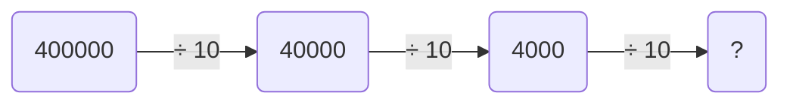

> $4000 \div 10 = 400$
> $400 \div 10 = 40$
> $40 \div 10 = 4$

Rule of pattern: dividing by 10.

So, its next 3 terms will be:
400, 40, 4

> ### Try Yourself
> Identify if this pattern in increasing or decreasing and then find the next three terms.
> 60, 600, 6 000, 60 000, \_\_\_\_, \_\_\_\_, \_\_\_\_


21

Mathematics-5 Unit 1: Whole Numbers and Operations


> We can also find patterns in a chart or table.
> Observe the given hundreds chart:

<table>
  <tbody>
    <tr>
        <td>1</td>
        <td>2</td>
        <td>3</td>
        <td>4</td>
        <td>5</td>
        <td>6</td>
        <td>7</td>
        <td>8</td>
        <td>9</td>
        <td>10</td>
    </tr>
    <tr>
        <td>11</td>
        <td>12</td>
        <td>13</td>
        <td>14</td>
        <td>15</td>
        <td>16</td>
        <td>17</td>
        <td>18</td>
        <td>19</td>
        <td>20</td>
    </tr>
    <tr>
        <td>21</td>
        <td>22</td>
        <td>23</td>
        <td>24</td>
        <td>25</td>
        <td>26</td>
        <td>27</td>
        <td>28</td>
        <td>29</td>
        <td>30</td>
    </tr>
    <tr>
        <td>31</td>
        <td>32</td>
        <td>33</td>
        <td>34</td>
        <td>35</td>
        <td>36</td>
        <td>37</td>
        <td>38</td>
        <td>39</td>
        <td>40</td>
    </tr>
    <tr>
        <td>41</td>
        <td>42</td>
        <td>43</td>
        <td>44</td>
        <td>45</td>
        <td>46</td>
        <td>47</td>
        <td>48</td>
        <td>49</td>
        <td>50</td>
    </tr>
    <tr>
        <td>51</td>
        <td>52</td>
        <td>53</td>
        <td>54</td>
        <td>55</td>
        <td>56</td>
        <td>57</td>
        <td>58</td>
        <td>59</td>
        <td>60</td>
    </tr>
    <tr>
        <td>61</td>
        <td>62</td>
        <td>63</td>
        <td>64</td>
        <td>65</td>
        <td>66</td>
        <td>67</td>
        <td>68</td>
        <td>69</td>
        <td>70</td>
    </tr>
    <tr>
        <td>71</td>
        <td>72</td>
        <td>73</td>
        <td>74</td>
        <td>75</td>
        <td>76</td>
        <td>77</td>
        <td>78</td>
        <td>79</td>
        <td>80</td>
    </tr>
    <tr>
        <td>81</td>
        <td>82</td>
        <td>83</td>
        <td>84</td>
        <td>85</td>
        <td>86</td>
        <td>87</td>
        <td>88</td>
        <td>89</td>
        <td>90</td>
    </tr>
    <tr>
        <td>91</td>
        <td>92</td>
        <td>93</td>
        <td>94</td>
        <td>95</td>
        <td>96</td>
        <td>97</td>
        <td>98</td>
        <td>99</td>
        <td>100</td>
    </tr>
  </tbody>
</table>
*(Note: In the chart above, the numbers 10, 19, 28, 37, 46, 55, 64, 73, 82, and 91 are highlighted in light blue.)*

By starting at 10, we can see that in the pattern being made in coloured boxes, every next number is obtained by adding 9 to the previous one.

By starting at 100, we can see that in the pattern being made in coloured boxes, every next number is obtained by subtracting 11 from the previous one.

<table>
  <tbody>
    <tr>
        <td>1</td>
        <td>2</td>
        <td>3</td>
        <td>4</td>
        <td>5</td>
        <td>6</td>
        <td>7</td>
        <td>8</td>
        <td>9</td>
        <td>10</td>
    </tr>
    <tr>
        <td>11</td>
        <td>12</td>
        <td>13</td>
        <td>14</td>
        <td>15</td>
        <td>16</td>
        <td>17</td>
        <td>18</td>
        <td>19</td>
        <td>20</td>
    </tr>
    <tr>
        <td>21</td>
        <td>22</td>
        <td>23</td>
        <td>24</td>
        <td>25</td>
        <td>26</td>
        <td>27</td>
        <td>28</td>
        <td>29</td>
        <td>30</td>
    </tr>
    <tr>
        <td>31</td>
        <td>32</td>
        <td>33</td>
        <td>34</td>
        <td>35</td>
        <td>36</td>
        <td>37</td>
        <td>38</td>
        <td>39</td>
        <td>40</td>
    </tr>
    <tr>
        <td>41</td>
        <td>42</td>
        <td>43</td>
        <td>44</td>
        <td>45</td>
        <td>46</td>
        <td>47</td>
        <td>48</td>
        <td>49</td>
        <td>50</td>
    </tr>
    <tr>
        <td>51</td>
        <td>52</td>
        <td>53</td>
        <td>54</td>
        <td>55</td>
        <td>56</td>
        <td>57</td>
        <td>58</td>
        <td>59</td>
        <td>60</td>
    </tr>
    <tr>
        <td>61</td>
        <td>62</td>
        <td>63</td>
        <td>64</td>
        <td>65</td>
        <td>66</td>
        <td>67</td>
        <td>68</td>
        <td>69</td>
        <td>70</td>
    </tr>
    <tr>
        <td>71</td>
        <td>72</td>
        <td>73</td>
        <td>74</td>
        <td>75</td>
        <td>76</td>
        <td>77</td>
        <td>78</td>
        <td>79</td>
        <td>80</td>
    </tr>
    <tr>
        <td>81</td>
        <td>82</td>
        <td>83</td>
        <td>84</td>
        <td>85</td>
        <td>86</td>
        <td>87</td>
        <td>88</td>
        <td>89</td>
        <td>90</td>
    </tr>
    <tr>
        <td>91</td>
        <td>92</td>
        <td>93</td>
        <td>94</td>
        <td>95</td>
        <td>96</td>
        <td>97</td>
        <td>98</td>
        <td>99</td>
        <td>100</td>
    </tr>
  </tbody>
</table>
*(Note: In the chart above, the numbers 100, 89, 78, 67, 56, 45, 34, 23, and 12 are highlighted in light blue.)*

### Try Yourself
Observe the hundreds chart and find 3 patterns of various arithmetic operations. Also identify the rules for the patterns.

> **TEACHING POINT:** Divide the students in groups. Ask each group to create a table of patterns. Then ask the other groups to identify the rules of the patterns given in the table.


22

Mathematics-5 Unit 1: Whole Numbers and Operations


> Munir has made a table showing the number of chocolate packets and the number of chocolates in each packet. What is the rule of the pattern found in his table?

<table>
  <thead>
    <tr>
        <th>No. of packets</th>
        <th>No. of chocolates</th>
    </tr>
  </thead>
  <tbody>
    <tr>
        <td>1</td>
        <td>9 × 1 = 9</td>
    </tr>
    <tr>
        <td>2</td>
        <td>9 × 2 = 18</td>
    </tr>
    <tr>
        <td>3</td>
        <td>9 × 3 = 27</td>
    </tr>
    <tr>
        <td>4</td>
        <td>9 × 4 = 36</td>
    </tr>
    <tr>
        <td>5</td>
        <td>9 × 5 = 45</td>
    </tr>
    <tr>
        <td>6</td>
        <td>9 × 6 = 54</td>
    </tr>
  </tbody>
</table>

Rule of pattern: Multiplying the numbers of packets by '9'

### Try Yourself
Identify the rules of these pattern and also find the next three terms.

a) 3, 6, 12, 24, \_\_\_\_\_\_\_, \_\_\_\_\_\_\_, \_\_\_\_\_\_\_.

b) 5, 7, 10, 14, \_\_\_\_\_\_\_, \_\_\_\_\_\_\_, \_\_\_\_\_\_\_.

c) 100, 96, 91, 85, 78, \_\_\_\_\_\_\_, \_\_\_\_\_\_\_, \_\_\_\_\_\_\_.

d) 8, 80, 800, 8 000, \_\_\_\_\_\_\_, \_\_\_\_\_\_\_, \_\_\_\_\_\_\_.

e) 900 000, 90 000, 9 000, \_\_\_\_\_\_\_, \_\_\_\_\_\_\_, \_\_\_\_\_\_\_.


23

Mathematics-5 Unit 1: Whole Numbers and Operations


# Exercise 4

1. Identify the rules of this patterns and also find the next 3 terms.
   a) 10, 40, 160, 640, \_\_\_\_\_\_\_\_, \_\_\_\_\_\_\_\_, \_\_\_\_\_\_\_\_.
   b) 22, 220, 2200, \_\_\_\_\_\_\_\_, \_\_\_\_\_\_\_\_, \_\_\_\_\_\_\_\_.
   c) 352, 176, 88, \_\_\_\_\_\_\_\_, \_\_\_\_\_\_\_\_, \_\_\_\_\_\_\_\_.
   d) 780, 880, 980, \_\_\_\_\_\_\_\_, \_\_\_\_\_\_\_\_, \_\_\_\_\_\_\_\_.
   e) 560, 540, 520, 500, \_\_\_\_\_\_\_\_, \_\_\_\_\_\_\_\_, \_\_\_\_\_\_\_\_.

2. Observe the given hundreds chart and identify at least 5 patterns of various arithmetic operations. Also find the rules of these patterns.

<table>
  <tbody>
    <tr>
        <td>1</td>
        <td>2</td>
        <td>3</td>
        <td>4</td>
        <td>5</td>
        <td>6</td>
        <td>7</td>
        <td>8</td>
        <td>9</td>
        <td>10</td>
    </tr>
    <tr>
        <td>11</td>
        <td>12</td>
        <td>13</td>
        <td>14</td>
        <td>15</td>
        <td>16</td>
        <td>17</td>
        <td>18</td>
        <td>19</td>
        <td>20</td>
    </tr>
    <tr>
        <td>21</td>
        <td>22</td>
        <td>23</td>
        <td>24</td>
        <td>25</td>
        <td>26</td>
        <td>27</td>
        <td>28</td>
        <td>29</td>
        <td>30</td>
    </tr>
    <tr>
        <td>31</td>
        <td>32</td>
        <td>33</td>
        <td>34</td>
        <td>35</td>
        <td>36</td>
        <td>37</td>
        <td>38</td>
        <td>39</td>
        <td>40</td>
    </tr>
    <tr>
        <td>41</td>
        <td>42</td>
        <td>43</td>
        <td>44</td>
        <td>45</td>
        <td>46</td>
        <td>47</td>
        <td>48</td>
        <td>49</td>
        <td>50</td>
    </tr>
    <tr>
        <td>51</td>
        <td>52</td>
        <td>53</td>
        <td>54</td>
        <td>55</td>
        <td>56</td>
        <td>57</td>
        <td>58</td>
        <td>59</td>
        <td>60</td>
    </tr>
    <tr>
        <td>61</td>
        <td>62</td>
        <td>63</td>
        <td>64</td>
        <td>65</td>
        <td>66</td>
        <td>67</td>
        <td>68</td>
        <td>69</td>
        <td>70</td>
    </tr>
    <tr>
        <td>71</td>
        <td>72</td>
        <td>73</td>
        <td>74</td>
        <td>75</td>
        <td>76</td>
        <td>77</td>
        <td>78</td>
        <td>79</td>
        <td>80</td>
    </tr>
    <tr>
        <td>81</td>
        <td>82</td>
        <td>83</td>
        <td>84</td>
        <td>85</td>
        <td>86</td>
        <td>87</td>
        <td>88</td>
        <td>89</td>
        <td>90</td>
    </tr>
    <tr>
        <td>91</td>
        <td>92</td>
        <td>93</td>
        <td>94</td>
        <td>95</td>
        <td>96</td>
        <td>97</td>
        <td>98</td>
        <td>99</td>
        <td>100</td>
    </tr>
  </tbody>
</table>


24

Mathematics-5 Unit 1: Whole Numbers and Operations


3. Observe the given tables and find the rules of the pattern.

a)
<table>
  <thead>
    <tr>
        <th>Position</th>
        <th>Term</th>
    </tr>
  </thead>
  <tbody>
    <tr>
        <td>12</td>
        <td>4</td>
    </tr>
    <tr>
        <td>15</td>
        <td>5</td>
    </tr>
    <tr>
        <td>18</td>
        <td>6</td>
    </tr>
    <tr>
        <td>21</td>
        <td>7</td>
    </tr>
    <tr>
        <td>24</td>
        <td>8</td>
    </tr>
  </tbody>
</table>

b)
<table>
  <thead>
    <tr>
        <th>Position</th>
        <th>Term</th>
    </tr>
  </thead>
  <tbody>
    <tr>
        <td>7</td>
        <td>12</td>
    </tr>
    <tr>
        <td>17</td>
        <td>22</td>
    </tr>
    <tr>
        <td>27</td>
        <td>32</td>
    </tr>
    <tr>
        <td>37</td>
        <td>42</td>
    </tr>
    <tr>
        <td>47</td>
        <td>52</td>
    </tr>
  </tbody>
</table>

c)
<table>
  <thead>
    <tr>
        <th>Position</th>
        <th>Term</th>
    </tr>
  </thead>
  <tbody>
    <tr>
        <td>20</td>
        <td>11</td>
    </tr>
    <tr>
        <td>31</td>
        <td>22</td>
    </tr>
    <tr>
        <td>42</td>
        <td>33</td>
    </tr>
    <tr>
        <td>53</td>
        <td>44</td>
    </tr>
    <tr>
        <td>64</td>
        <td>55</td>
    </tr>
  </tbody>
</table>

d)
<table>
  <thead>
    <tr>
        <th>Position</th>
        <th>Term</th>
    </tr>
  </thead>
  <tbody>
    <tr>
        <td>50</td>
        <td>100</td>
    </tr>
    <tr>
        <td>100</td>
        <td>200</td>
    </tr>
    <tr>
        <td>150</td>
        <td>300</td>
    </tr>
    <tr>
        <td>200</td>
        <td>400</td>
    </tr>
    <tr>
        <td>250</td>
        <td>500</td>
    </tr>
    <tr>
        <td>300</td>
        <td>600</td>
    </tr>
  </tbody>
</table>

# I Have Learnt to:

* read numbers up to 1 000 000 (one million) in numerals and words.
* write numbers up to 1 000 000 (one million) in numerals and words.
* add numbers up to 6-digit numbers.
* subtract numbers up to 6-digits numbers.
* multiply numbers up to 5-digits, by 10, 100, and 1 000.

<table>
    <tr>
        <th>Vocabulary</th>
        <th></th>
    </tr>
    <tr>
        <td>• Numbers</td>
        <td>• Digit</td>
    </tr>
    <tr>
        <td>• Place value</td>
        <td>• Addition</td>
    </tr>
    <tr>
        <td>• Subtraction</td>
        <td>• Multiply</td>
    </tr>
    <tr>
        <td>• Division</td>
        <td>• Pattern</td>
    </tr>
    <tr>
        <td>• Ascending</td>
        <td>• Descending</td>
    </tr>
    <tr>
        <td>• Table</td>
        <td>• Chart</td>
    </tr>
</table>
25

Mathematics-5 Unit 1: Whole Numbers and Operations


*   multiply numbers up to 5-digit by a number up to 3-digit.
*   divide a number up to 5-digit by 10, 100 and 1 000.
*   divide numbers up to 5-digit by a number up to 2-digit.
*   solve real-life situations involving operations of addition, subtraction, multiplication and division.
*   identify and apply a pattern rule to determine missing elements for a given pattern.
*   identify the pattern rule of a given increasing and decreasing pattern and extend the pattern for the next three terms.
*   describe the pattern found in a given table or chart.

# Review Exercise

1. Choose the correct options and fill in the blanks.

(a) We put space after every \_\_\_\_\_\_ digits in numbers.
(i) 2 (ii) 3 (iii) 4 (iv) 16

(b) The place value of 2 in the number 985 621 is \_\_\_\_\_\_.
(i) 2 (ii) 20 (iii) 200 (iv) 2 000

(c) In 856 211, the digit \_\_\_\_\_\_ is at thousands place.
(i) 2 (ii) 5 (iii) 6 (iv) 8

(d) When we multiply a number by \_\_\_\_\_\_, we put 3 zeros to the right side.
(i) 10 (ii) 100 (iii) 1 000 (iv) 1

(e) When we divide a number by \_\_\_\_\_\_ we remove one zero from the right side.
(i) 10 (ii) 100 (iii) 1 000 (iv) 1


26

Mathematics-5 Unit 1: Whole Numbers and Operations


2. Write the following numbers in words:
(a) 734 123 (b) 965 129 (c) 982 009 (d) 912 011

3. Solve the following:
(a) 212 121 + 56 234 (b) 18 315 + 102 376 (c) 727 191 + 92 921
(d) 139 657 + 247 777 (e) 532 481 + 100 008 (f) 200 454 + 126 654

4. Solve the following:
(a) 675 921 - 31 412 (b) 986 543 - 65 219 (c) 108 761 - 70 021
(d) 846 109 - 591 089 (e) 865 439 - 761 212 (f) 696 349 - 288 888

5. Solve the following:
(a) 12 356 × 122 (b) 65 781 × 100
(c) 62 825 × 522 (d) 37 564 × 519

6. Solve the following:
(a) 66 693 ÷ 33 (b) 35 788 ÷ 42 (c) 25 111 ÷ 69
(d) 28 000 ÷ 1 000 (e) 58 580 ÷ 10 (f) 28 104 ÷ 28

7. What are the rules for these patterns? Also find the next three terms of each pattern.
(a) 50, 100, 150, 200, \_\_\_\_\_\_\_, \_\_\_\_\_\_\_, \_\_\_\_\_\_\_.
(b) 180, 165, 150, 135, \_\_\_\_\_\_\_, \_\_\_\_\_\_\_, \_\_\_\_\_\_\_.
(c) 18, 90, 450, 2 250, \_\_\_\_\_\_\_, \_\_\_\_\_\_\_, \_\_\_\_\_\_\_.
(d) 6 100 000, 610 000, 61 000, \_\_\_\_\_\_\_, \_\_\_\_\_\_\_, \_\_\_\_\_\_\_.


27

Mathematics-5 Unit 1: Whole Numbers and Operations


8. Find the patterns in the given arithmetic sentences and complete them.

a)
$10 \times \text{\_\_\_\_\_\_} = 10$
$10 \times \text{\_\_\_\_\_\_} = 100$
$10 \times \text{\_\_\_\_\_\_} = 1\ 000$
$10 \times \text{\_\_\_\_\_\_} = 10\ 000$

b)
$\text{\_\_\_\_\_\_} \div 10 = 1\ 000$
$\text{\_\_\_\_\_\_} \div 100 = 100$
$\text{\_\_\_\_\_\_} \div 1\ 000 = 10$
$\text{\_\_\_\_\_\_} \div 10\ 000 = 1$

9. The price of a shop is Rs 456 721 and the price of a flat is Rs 987 676. Find the total price of the shop and the flat.

10. There are 768 121 children and 456 789 women in the City. How many more children are there than the women?

11. The price of a scanner is Rs 62,900 and the price of a laser printer is Rs 96 880. Find:
    a) the total price of both items
    b) the total price of 15 scanners and 3 laser printers.

12. 35 288 blocks are to be packed in 28 boxes. Find:
    a) how many blocks are there in each box?
    b) how many blocks will be left?
    c) how many blocks will be there in 555 remaining boxes?

13. Observe the given tables and find the rules of patterns given in them.

a)
<table>
  <thead>
    <tr>
        <th>Position</th>
        <th></th>
        <th>Term</th>
        <th></th>
    </tr>
  </thead>
  <tbody>
    <tr>
        <td>40</td>
        <td>2</td>
        <td colspan="2"></td>
    </tr>
    <tr>
        <td>80</td>
        <td>4</td>
        <td colspan="2"></td>
    </tr>
    <tr>
        <td>120</td>
        <td>6</td>
        <td colspan="2"></td>
    </tr>
    <tr>
        <td>160</td>
        <td>8</td>
        <td colspan="2"></td>
    </tr>
  </tbody>
</table>

b)
<table>
  <thead>
    <tr>
        <th>Position</th>
        <th></th>
        <th>Term</th>
        <th></th>
    </tr>
  </thead>
  <tbody>
    <tr>
        <td>1</td>
        <td>10</td>
        <td colspan="2"></td>
    </tr>
    <tr>
        <td>2</td>
        <td>20</td>
        <td colspan="2"></td>
    </tr>
    <tr>
        <td>3</td>
        <td>30</td>
        <td colspan="2"></td>
    </tr>
    <tr>
        <td>4</td>
        <td>40</td>
        <td colspan="2"></td>
    </tr>
  </tbody>
</table>


28

Unit 2 HCF and LCM


# HCF and LCM

## Learning Outcomes

**After completing this unit, you will be able to:**
* Find HCF of
    - two numbers up to 2-digit numbers
    - three numbers up to 2-digit numbers
* using prime factorization method and division method
* Find LCM of
    - two numbers up to 2-digit numbers
    - three numbers up to 2-digit numbers
    - using prime factorization method and division method
* Solve real life situations involving HCF and LCM.

The image shows several trays of small flowering plants (white and purple flowers) in a garden setting.

> Nida wants to plant 12 rose plants and 18 jasmine plants in rows in her home garden. If she wants to plant the same type of plant in one row, find the maximum number of plants that can be grown in one row.


29

Mathematics-5 | Unit 2: HCF and LCM


# Highest Common Factor (HCF)

> Sara has two pieces of ribbon whose lengths are 18 cm and 24 cm respectively. She wants to cut the ribbon into smaller pieces of equal length without any ribbon left. What will be the greatest possible length of each piece?

[The image shows two ribbons. One is 24cm long, divided into 6cm segments. The other is 18cm long, also divided into 6cm segments.]

> To cut both ribbons in equal lengths, we need to find the greatest number which can divide both 18 and 24 simultaneously.

**Factor Trees:**

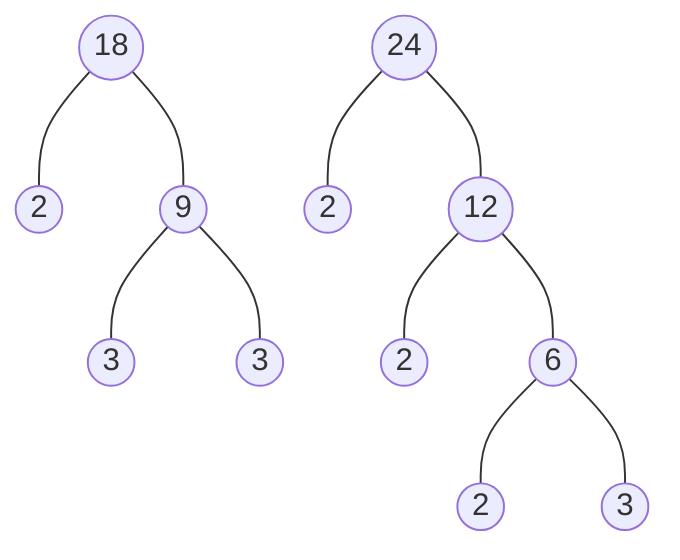

Prime factorization of 18 = **2** $\times$ **3** $\times$ 3
Prime factorization of 24 = **2** $\times$ **3** $\times$ 2 $\times$ 2
Common prime factors of 18 and 24 = 2, 3
product of common prime factors of 18 and 24 = 2 $\times$ 3 = 6
6 is the greatest factor which divides both 18 and 24 completely.
6 is called the HCF of 18 and 24.
So, the greatest possible length of each piece will be 6cm.

### Key Fact
The greatest number which divides 2 or more given numbers simultaneously is called their HCF.

<table>
    <tr>
        <th>Teaching Point</th>
    </tr>
    <tr>
        <td>Give ropes of different lengths to the students. Ask them to divide the pieces of ropes into equal lengths.</td>
    </tr>
</table>
30

Mathematics-5 Unit 2: HCF and LCM


Let's find the HCF of 12, 30 and 44 by using prime factorization.

<table>
  <tbody>
    <tr>
        <td>2</td>
        <td>12</td>
        <td></td>
        <td>2</td>
        <td>30</td>
        <td></td>
        <td>2</td>
        <td>44</td>
    </tr>
    <tr>
        <td>2</td>
        <td>6</td>
        <td></td>
        <td>3</td>
        <td>15</td>
        <td></td>
        <td>2</td>
        <td>22</td>
    </tr>
    <tr>
        <td>3</td>
        <td>3</td>
        <td></td>
        <td>5</td>
        <td>5</td>
        <td></td>
        <td>11</td>
        <td>11</td>
    </tr>
    <tr>
        <td></td>
        <td>1</td>
        <td></td>
        <td></td>
        <td>1</td>
        <td></td>
        <td></td>
        <td>1</td>
    </tr>
  </tbody>
</table>

Prime factorization of 12 = 2 × 2 × 3
Prime factorization of 30 = 2 × 3 × 5
Prime factorization of 44 = 2 × 2 × 11

Common prime factor = 2
HCF = 2

> Hammad has 36 red pencils and 54 blue pencils. He wants to put these pencils in boxes such that every box has equal number of pencils of the same colour. What will be the maximum number of pencils in each box?

> For this we will find the HCF of 36 and 54 by using division.

(i) Divide the greater number 54 by the smaller number 36 and find the remainder.
(ii) By dividing 36 by the remainder 18 will get zero as remainder.

$$
\begin{array}{r|l}
 & 1 \\ \hline
36 & 54 \\
 & 36 \\ \hline
 & 18 & 2 \\ \cline{2-3}
 & & 36 \\
 & & 36 \\ \hline
 & & 0
\end{array}
$$

(iii) The last divisor is 18. So, it is the HCF of 36 and 54.

HCF of 36 and 54 = 18

The maximum number of pencils of same colour in each box will be 18.


31

Mathematics-5 | Unit 2: HCF and LCM


> I want to find out the greatest number which completely divides 26, 48 and 60.

First divide the greatest number 60 by 48.

$$
\begin{array}{r|l}
 & 1 \\
\hline
48 & 60 \\
 & -48 \\
\hline
 & 12
\end{array}
\quad
\begin{array}{r|l}
 & 4 \\
\hline
12 & 48 \\
 & -48 \\
\hline
 & 0
\end{array}
$$

HCF of 48 and 60 is 12
Now, divide 26 by 12.

$$
\begin{array}{r|l}
 & 2 \\
\hline
12 & 26 \\
 & -24 \\
\hline
 & 2
\end{array}
\quad
\begin{array}{r|l}
 & 6 \\
\hline
2 & 12 \\
 & -12 \\
\hline
 & 0
\end{array}
$$

The number 2 is the last divisor. So, this is the greatest number which completely divides 26, 48 and 60.

### Key Fact
The HCF of two or more than two numbers, which have no common prime factor, is always 1.

### Try It!
Find three 2-digit numbers whose sum is 152 and whose HCF is 8.

# Exercise 1

1. Find the HCF of the following numbers by using prime factorization method:
   - a) 58, 72
   - b) 21, 48
   - c) 56, 70
   - d) 45, 90
   - e) 42, 49
   - f) 15, 18, 56
   - g) 42, 54, 64
   - h) 18, 30, 90
   - i) 12, 24, 36
   - j) 18, 36, 76
   - k) 5, 35, 40
   - l) 13, 52, 78

2. Find the HCF of the following numbers by using division method:
   - a) 13, 65
   - b) 25, 75
   - c) 42, 98
   - d) 16, 20, 70
   - e) 56, 84, 88
   - f) 57, 76, 95
   - g) 16, 32, 96
   - h) 20, 40, 80
   - i) 48, 76, 96
   - j) 24, 48, 72
   - k) 51, 65, 75
   - l) 13, 39, 78


32

Mathematics-5 | Unit 2: HCF and LCM


3. The lengths of the two ropes are 24 metres and 14 metres respectively. If Ali wants to cut the ropes into pieces of equal length without any rope left, find out what will be the maximum length of each piece?

4. For the Independence Day celebrations, 52 students in white dress, 65 students in green dress and 39 students in blue dress are to be arranged in equal rows in such a way that students of one colour dress will be in each row. What is the greatest number of students that could be in each row?

The image shows a celebratory graphic for the 14th of August (Independence Day of Pakistan) with a crescent and star, fireworks, and city silhouettes.

5. Find the greatest number that divides 16, 24 and 48 completely.

6. Ibrahim and Mehwish are preparing first aid kits for the students. They have 30 perforated adhesive bandages, 60 triangular bandages and 75 rectangular bandages. They must distribute these equally in the kits, with nothing left over. What is the greatest number of kits they can be made with this quantity of bandages?

The image shows a red first aid kit with a white cross.

# Least Common Multiple (LCM)

> For a Science project preparation, grade 4 students visit the science laboratory after every 8 days. While grade 5 students visit the laboratory after every 12 days. If the students of both grades visited the laboratory today, find out when will they again visit the laboratory on the same day?

The image shows two students in lab coats performing science experiments with beakers and test tubes.

### Method-1
Multiples of 8 and 12 will be used to find the day when the students of both grades will visit the laboratory on the same day.

Multiples of 8 are: 8, 16, **24**, 32, 40, **48**, ...
Multiples of 12 are: 12, **24**, 36, **48**, ...

The first two common multiples of 8 and 12 are 24, 48.
The smallest common multiples of 8 and 12 is 24.


33

Mathematics-5 | Unit 2: HCF and LCM


24 is called the least common multiple of 8 and 12.

So, the students of both grades will visit the laboratory together on the 24<sup>th</sup> day.

### Method-2

Now, we will find the LCM of 8 and 12 by using prime factorization.

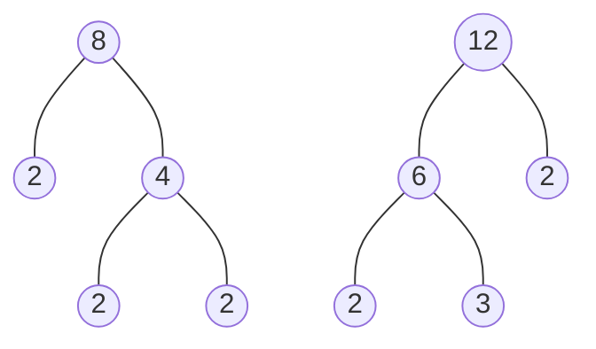

> **Key Fact**
> When we multiply any number by any other number, their product is called multiple of both numbers.

Prime factorization of 8 = ② × ② × 2
Prime factorization of 12 = ② × ② × 3
Common prime factors 8 and 12 = 2, 2
Non-common prime factors 8 and 12 = 2, 3

$$LCM = \left[ \text{Product of two or more than two common prime factors} \right] \times \left[ \text{Product of two or more than two non-common prime factors} \right]$$

LCM = (2 × 2) × (2 × 3)
LCM = 4 × 6 = 24

> **Key Fact**
> The LCM of two or more numbers is the smallest number which is completely divisible by the given numbers.

So, next time students of both grades will visit the laboratory together on 24<sup>th</sup> day.

<table>
    <tr>
        <th>TEACHING POINT</th>
    </tr>
    <tr>
        <td>Write pairs of numbers on the writing board. Ask the students to find the first two common multiples of these numbers.</td>
    </tr>
</table>
34

Mathematics-5 | Unit 2: HCF and LCM


Let's find out the LCM of 16, 30 and 64 by using prime factorization.

<table>
  <tbody>
    <tr>
        <td>2</td>
        <td>16</td>
        <td></td>
        <td>2</td>
        <td>30</td>
        <td></td>
        <td>2</td>
        <td>64</td>
    </tr>
    <tr>
        <td>2</td>
        <td>8</td>
        <td></td>
        <td>3</td>
        <td>15</td>
        <td></td>
        <td>2</td>
        <td>32</td>
    </tr>
    <tr>
        <td>2</td>
        <td>4</td>
        <td></td>
        <td>5</td>
        <td>5</td>
        <td></td>
        <td>2</td>
        <td>16</td>
    </tr>
    <tr>
        <td>2</td>
        <td>2</td>
        <td></td>
        <td></td>
        <td>1</td>
        <td></td>
        <td>2</td>
        <td>8</td>
    </tr>
    <tr>
        <td></td>
        <td>1</td>
        <td></td>
        <td></td>
        <td></td>
        <td></td>
        <td>2</td>
        <td>4</td>
    </tr>
    <tr>
        <td></td>
        <td></td>
        <td></td>
        <td></td>
        <td></td>
        <td></td>
        <td>2</td>
        <td>2</td>
    </tr>
    <tr>
        <td></td>
        <td></td>
        <td></td>
        <td></td>
        <td></td>
        <td></td>
        <td></td>
        <td>1</td>
    </tr>
  </tbody>
</table>

Prime factorization of 16 = ② × ② × ② × ②
Prime factorization of 30 = ② × 3 × 5
Prime factorization of 64 = ② × ② × ② × ② × 2 × 2

Common prime factors of 16, 30 and 64 = 2, 2, 2, 2
Non-common prime factors of 16, 30 and 64 = 2, 2, 3, 5

LCM = $\begin{bmatrix} \text{Product of two or more than} \\ \text{two common prime factors} \end{bmatrix} \times \begin{bmatrix} \text{Product of two or more than} \\ \text{two non-common prime factors} \end{bmatrix}$

LCM = $(2 \times 2 \times 2 \times 2) \times (2 \times 2 \times 3 \times 5)$
LCM = $16 \times 60 = 960$
So, the LCM of 16, 30 and 64 = 960

> Ali, Ahmad and Umar exercise after every 10, 18 and 20 days respectively. If they all are exercising today, when will they exercise on the same day again?

To find the day, when they will exercise together again, we will find the LCM of 10, 18 and 20.

<table>
  <tbody>
    <tr>
        <td>2</td>
        <td>18, 10, 20</td>
    </tr>
    <tr>
        <td>2</td>
        <td>9, 5, 10</td>
    </tr>
    <tr>
        <td>3</td>
        <td>9, 5, 5</td>
    </tr>
    <tr>
        <td>3</td>
        <td>3, 5, 5</td>
    </tr>
    <tr>
        <td>5</td>
        <td>1, 5, 5</td>
    </tr>
    <tr>
        <td></td>
        <td>1, 1, 1</td>
    </tr>
  </tbody>
</table>

LCM = Product of all prime factors
LCM = $2 \times 2 \times 3 \times 3 \times 5$
LCM = 180

They will again exercise together on the 180<sup>th</sup> day.

<table>
    <tr>
        <th>TEACHING POINT</th>
        <th>Ask the students to differentiate between HCF and LCM. Write two or three numbers on the board and ask them to find their LCM.</th>
    </tr>
</table>
35

Mathematics-5 | Unit 2: HCF and LCM


Find the LCM of 12, 20 and 30 by using division.

<table>
  <tbody>
    <tr>
        <td>2</td>
        <td>12, 20, 30</td>
    </tr>
    <tr>
        <td>2</td>
        <td>6, 10, 15</td>
    </tr>
    <tr>
        <td>3</td>
        <td>3, 5, 15</td>
    </tr>
    <tr>
        <td>5</td>
        <td>1, 5, 5</td>
    </tr>
    <tr>
        <td></td>
        <td>1, 1, 1</td>
    </tr>
  </tbody>
</table>

LCM = Product of all prime factors
LCM = $2 \times 2 \times 3 \times 5$
LCM = 60

So, the LCM of 12, 20 and 30 is 60.

> **Try It!** Challenge
>
> A welfare organization is distributing bundles of basic safety items among the people. If a packet of masks has 25 masks, a packet of gloves has 20 pairs of gloves and a packet of sanitizer has 5 sanitizer bottles in it, then find out the minimum number of packets of each item so that every bundle has one mask, one glove pair and one sanitizer bottle in it and no object is left over. (Hint : First find the LCM of 25, 20 and 5)

# Exercise 2

1. Find the LCM of the following numbers using prime factorization:
(a) 3, 21
(b) 12, 80
(c) 20, 15
(d) 4, 10, 16
(e) 9, 18, 27
(f) 10, 20, 35
(g) 20, 60, 75
(h) 30, 45, 90
(i) 16, 24, 36
(j) 18, 60, 75
(k) 49, 51, 56
(l) 13, 65, 71


36

Mathematics-5 Unit 2: HCF and LCM


2. Find the LCM of the following numbers using division:
(a) 14, 70 (b) 15, 30 (c) 45, 90 (d) 35, 60, 75
(e) 7, 21, 49 (f) 25, 45, 95 (g) 16, 32, 48 (h) 28, 32, 40
(i) 12, 14, 26 (j) 10, 20, 25 (k) 7, 14, 21 (l) 8, 32, 42

3. Find the minimum length of the ribbon which can completely be cut into pieces of length 45 cm, 75 cm and 85 cm without any left over.

4. Find the smallest number that can completely be divided by 42, 38 and 16 without leaving any remainder.

5. The tour buses for Badshahi Masjid leave the station every 25 minutes, for interior city every 15 minutes and for the zoo every 30 minutes. If the three buses leave the station simultaneously at 11:05 a.m, find out the time when the three buses will next leave the station simultaneously?

6. Boxes having 22 centimetre, 35 centimetre and 50 centimetre height respectively are to be stacked next to each other. What is the shortest possible height at which the three types of boxes will be at the same height?

7. Students of grade 5 have Mathematics test after every 3 days, English test after every 6 days and Science test after every 9 days. If all the three tests were conducted today, find out when will the three tests be conducted next on the same day?

# I Have Learnt to:

find HCF of:

* two numbers up to 2-digit numbers.
* three numbers up to 2-digit numbers by using prime factorization method and division method.


37

Mathematics-5 Unit 2: HCF and LCM


find LCM of:

*   two numbers up to 2-digit numbers.
*   three numbers up to 2-digit numbers using prime factorization method and division method.
*   solve real life situations involving HCF and LCM.

> ### Vocabulary
> *   HCF
> *   Prime Factorization
> *   Prime
> *   Multiples
> *   Factors
> *   LCM

# Review Exercise

1. Choose the correct options and fill in the blanks.

(a) The HCF of 20, 48 and 56 is \_\_\_\_\_\_\_\_\_\_.
(i) 4 (ii) 3 (iii) 5 (iv) 1

(b) The HCF of two or more than two numbers, which have no common prime factor, is always \_\_\_\_\_\_\_\_\_\_.
(i) 1000 (ii) 100 (iii) 10 (iv) 1

(c) Prime factorization of 16 is \_\_\_\_\_\_\_\_\_\_.
(i) $2 \times 8$ (ii) $1 \times 16$ (iii) $2 \times 2 \times 2 \times 2$ (iv) $2 \times 4 \times 2$

(d) The LCM of 33, 66 and 81 is \_\_\_\_\_\_\_\_\_\_.
(i) 1770 (ii) 1872 (iii) 1782 (iv) 1287

(e) The LCM of two or more prime numbers is always equal to their \_\_\_\_\_\_\_\_\_\_.
(i) Prime factor (ii) Quotient (iii) LCM (iv) Product


38

Mathematics-5 Unit 2: HCF and LCM


2. Find the HCF of the following numbers by using prime factorization:
(a) 15, 18 (b) 10, 20 (c) 25, 40 (d) 56, 88
(e) 10, 18, 22 (f) 20, 40, 82 (g) 16, 38, 98 (h) 39, 51, 75

3. Find the HCF of the following numbers using division:
(a) 20, 50 (b) 15, 45 (c) 60, 70, 80 (d) 22, 28, 32
(e) 44, 55, 99 (f) 34, 48, 62 (g) 30, 45, 70 (h) 26, 52, 65

4. Find the LCM of the following numbers using prime factorization:
(a) 2, 5 (b) 3, 7 (c) 5, 8 (d) 4, 10, 16
(e) 20, 25, 50 (f) 45, 90, 95 (g) 32, 70, 80 (h) 33, 66

5. Find the LCM of the following numbers using division:
(a) 4, 9 (b) 7, 11 (c) 14, 26 (d) 20, 40,
(e) 6, 24, 42 (f) 10, 20, 30 (g) 12, 18, 38 (h) 6, 15, 21

6. 84 apples, 56 bananas and 21 oranges were distributed equally among some children. If the same combination of all kinds of fruits is distributed among all the children, find out the maximum possible number of children who can get the fruits?

7. Three water containers contain 12 litres, 24 litres and 42 litres of water.
(a) Find the maximum capacity of a measuring container that can fully measure the quantity of water in all three containers.
(b) Find out how many times this container needs to be filled to empty each container?

8. Find the smallest number that can completely be divided by 32 and 55 without leaving any remainder.

9. Find the least number of stickers which can equally be distributed among 15, 12 and 10 children.


39

Unit 3 Fractions


# Fractions

## Learning Outcomes

**After completing this unit, you will be able to:**

*   Add and subtract two or three fractions with different denominators.
*   Multiply a fraction by a 1 - digit number and demonstrate with the help of diagram.
*   Multiply two or three fractions involving proper, improper fractions, and mixed numbers.
*   Solve real life situations involving multiplication of fractions.
*   Divide a fraction by another fraction involving proper, improper fraction, and mixed numbers.
*   Solve real life situations involving division of fractions.

[The background of the page features an illustration of a golden wheat field under a blue sky with white clouds.]

> According to a report of 2016, $\frac{2}{3}$ of the land in Pakistan is arable.
> How much part is not arable?


40

Mathematics-5 Unit 3: Fractions


# Addition and Subtraction of Fractions

## Addition of Fractions

> Yesterday, we spent $\frac{1}{2}$ hour and today we spent $\frac{1}{4}$ hour in the computer lab. How much time have we spent altogether in the computer lab?

> To find the total time spent in the computer lab, we need to add these fractions.

Time spent yesterday = $\frac{1}{2}$ h
Time spent today = $\frac{1}{4}$ h
Total time spent = ?

$\frac{1}{2} = \frac{1 \times 2}{2 \times 2} = \frac{2}{4}$ [Multiply the numerator and the denominator by 2 to make the denominator 4]

**Visual Representation of Equivalent Fractions:**
A circle divided into 2 parts with 1 part shaded green ($\frac{1}{2}$) is equal to a circle divided into 4 parts with 2 parts shaded green ($\frac{2}{4}$).

$\frac{2}{4} + \frac{1}{4} = \frac{2 + 1}{4} = \frac{3}{4}$

Now, add these like fractions.

**Visual Addition:**
(Circle with $\frac{1}{2}$ shaded) + (Circle with $\frac{1}{4}$ shaded) = (Circle with $\frac{2}{4}$ shaded) + (Circle with $\frac{1}{4}$ shaded) = (Circle with $\frac{3}{4}$ shaded)

$\frac{1}{2} + \frac{1}{4} = \frac{2}{4} + \frac{1}{4} = \frac{3}{4}$

The total time spent in the computer lab in 2 days is $\frac{3}{4}$ hours.

<table>
    <tr>
        <th>TEACHING POINT</th>
    </tr>
    <tr>
        <td>Use cut-outs of different shapes and ask the students to represent equivalent fraction using the shapes.</td>
    </tr>
</table>
41

Mathematics-5 Unit 3: Fractions


> **Key Fact**
> Two or more than two fractions whose numerators and denominators are different but they have same values are called equivalent fractions.

> **Try Yourself**
> What is the sum of $\frac{2}{3}$ and $\frac{5}{6}$?

Let's solve. $\frac{2}{5} + \frac{3}{10} + \frac{1}{20} = \square$

1. Find the LCM of 5, 10 and 20.
2. Multiply all the fractions by a number so that their denominators become equal to their LCM.

<table>
  <tbody>
    <tr>
        <td>2</td>
        <td>5, 10, 20</td>
    </tr>
    <tr>
        <td>2</td>
        <td>5, 5, 10</td>
    </tr>
    <tr>
        <td>5</td>
        <td>5, 5, 5</td>
    </tr>
    <tr>
        <td></td>
        <td>1, 1, 1</td>
    </tr>
  </tbody>
</table>

LCM of 5, 10 and 20 = $2 \times 2 \times 5 = 20$

$\frac{2}{5} = \frac{2 \times 4}{5 \times 4} = \frac{8}{20}$ , $\frac{3}{10} = \frac{3 \times 2}{10 \times 2} = \frac{6}{20}$ , $\frac{1}{20}$

Now, add these fractions
$$\frac{2}{5} + \frac{3}{10} + \frac{1}{20} = \frac{8}{20} + \frac{6}{20} + \frac{1}{20}$$
$$= \frac{8 + 6 + 1}{20}$$
$$= \frac{15}{20} = \frac{3}{4}$$

> **Try Yourself**
> Observe the given shapes. Write the addition sentence for them and solve.
>
> A rectangle divided into 8 equal parts with 3 parts shaded blue + A rectangle divided into 4 equal parts with 2 parts shaded orange.
>
> [ ] + [ ]
> = [ ]

<table>
    <tr>
        <th>TEACHING POINT</th>
        <th>Write different fractions on the board. Explain how to make their denominator same and then find their sum.</th>
    </tr>
</table>
42

Mathematics-5 Unit 3: Fractions


> Sidra used $1 \frac{3}{4}$ metre red ribbon and $\frac{7}{8}$ metre blue ribbon to decorate the gift boxes. Find the total length of the ribbon she used.

Convert the mixed fraction into improper fraction.

Red ribbon $= 1 \frac{3}{4} \text{ m} = \frac{7}{4} \text{ m}$

Blue ribbon $= \frac{7}{8} \text{ m}$

Total length of both ribbons $= \frac{7}{4} + \frac{7}{8}$
$= \frac{7 \times 2}{4 \times 2} + \frac{7}{8}$
$= \frac{14}{8} + \frac{7}{8}$
$= \frac{14 + 7}{8} = \frac{21}{8} = 2 \frac{5}{8}$

So, Sidra used $2 \frac{5}{8} \text{ m}$ ribbon.

### Key Fact
Mixed fraction is also known as mixed number.

## Subtraction of Fractions

> Sara uses $\frac{1}{2}$ spoon sugar and $\frac{1}{3}$ spoon of tea to make a cup of tea. Find how much more sugar she uses than the tea?

To find this, we will subtract the quantity of tea from the quantity of sugar.

Quantity of sugar $= \frac{1}{2}$
Quantity of tea $= \frac{1}{3}$

> Tell the students that while adding two fractions their order does not matter but when subtracting two fractions always subtract smaller fraction from the greater fraction otherwise they will get the wrong answer.


43

Mathematics-5 Unit 3: Fractions


Difference $= \frac{1}{2} - \frac{1}{3}$
$= \frac{1 \times 3}{2 \times 3} - \frac{1 \times 2}{3 \times 2} = \frac{3}{6} - \frac{2}{6} = \frac{3 - 2}{6} = \frac{1}{6}$

[The image shows a visual representation of the subtraction using rectangular bars divided into sections.]
$\frac{1}{2} - \frac{1}{3} = \frac{3}{6} - \frac{2}{6} = \frac{1}{6}$

So, Sara uses $\frac{1}{6}$ more spoon of sugar.

Let's subtract $\frac{3}{4}$ from $2\frac{2}{3}$.

> $2\frac{2}{3} = \frac{8}{3}$

(i) Convert the mixed fraction into the improper fraction.
(ii) Find the LCM of 3 and 4.
(iii) Now, multiply all the fractions by a number so that the denominators of all the fractions become equal to their LCM.
(iv) Subtract the fractions.

$2\frac{2}{3} - \frac{3}{4} = \frac{8}{3} - \frac{3}{4}$
$= \frac{8 \times 4}{3 \times 4} - \frac{3 \times 3}{4 \times 3}$
$= \frac{32}{12} - \frac{9}{12} = \frac{32 - 9}{12}$
$= \frac{23}{12} = 1\frac{11}{12}$

### Try Yourself
Subtract $\frac{7}{12}$ from the sum of $\frac{5}{9}$ and $\frac{2}{3}$.

### Try Yourself
Subtract $\frac{6}{9}$ from $\frac{5}{6}$.

### Key Fact
Always subtract the smaller fraction from the greater fraction.

### Try It! Challenge
Write two fractions whose difference is 1.


44

Mathematics-5 Unit 3: Fractions


# Exercise 1

1. Solve the following fractions:
   a) $\frac{1}{2} + \frac{2}{4}$
   b) $5\frac{2}{3} + 2\frac{5}{7}$
   c) $3\frac{4}{5} + \frac{5}{7}$
   d) $4\frac{7}{10} + \frac{6}{8}$
   e) $\frac{7}{9} + \frac{6}{8} + \frac{6}{3}$
   f) $1\frac{3}{10} + 6\frac{14}{20} + 2\frac{15}{40}$
   g) $\frac{24}{6} + \frac{31}{12} + \frac{43}{24}$
   h) $\frac{7}{8} + 4\frac{1}{4} + \frac{15}{16}$

2. Solve the following fractions:
   a) $\frac{3}{2} - \frac{2}{24}$
   b) $2\frac{16}{18} - 1\frac{4}{6}$
   c) $3\frac{5}{14} - 1\frac{2}{21}$
   d) $\frac{5}{6} - \frac{6}{11}$
   e) $4\frac{1}{6} - \frac{17}{18}$
   f) $\frac{21}{12} - \frac{8}{10}$
   g) $2\frac{13}{24} - \frac{4}{18}$
   h) $5\frac{1}{8} - \frac{5}{15}$

3. To practice for a marathon, Raheel ran $4\frac{1}{4}$ km on Monday, $\frac{7}{8}$ km on Tuesday and $\frac{15}{6}$ km on Wednesday. Find out how many kilometres did he run in three days?

4. Saad spent $2\frac{1}{2}$ hours for the preparation of Mathematics test and $1\frac{1}{4}$ hours for the preparation of Urdu test. Find:
   a) in which subject did he spend more time and by how much?
   b) how much time did he spend altogether?


45

Mathematics-5 Unit 3: Fractions


5. An electrician has $18 \frac{8}{9}$ m of wire. If he uses $\frac{2}{9}$ m and $2 \frac{1}{3}$ m in two rooms, then find:
a) how much wire did he use altogether?
b) how much wire is left?

# Multiplication and Division of Fractions

## Multiplication of Fractions
Ibrahim takes $\frac{3}{4}$ hours daily to complete his homework. How much time does he spend on his homework in a week?

> There are 7 days in a week, so to find the required time we will multiply $\frac{3}{4}$ hours by 7.

We can show the multiplication process by the given figures.
As, multiplication is repeated addition.
To multiply $\frac{3}{4}$ by 7, we will add $\frac{3}{4}$ seven times.

The following diagram illustrates the addition of seven circles, each with $\frac{3}{4}$ parts shaded yellow, resulting in five full circles and one circle with $\frac{1}{4}$ part shaded yellow.

$\frac{3}{4} + \frac{3}{4} + \frac{3}{4} + \frac{3}{4} + \frac{3}{4} + \frac{3}{4} + \frac{3}{4} = 5 + \frac{1}{4}$

$\frac{3 + 3 + 3 + 3 + 3 + 3 + 3}{4} = \frac{21}{4} = 5 \frac{1}{4}$

> [!IMPORTANT]
> By using various figures explain the method of multiplication of fractions to the students. Then tell them that how a fraction can be expressed in it's the lowest form.


46

Mathematics-5 | Unit 3: Fractions


Alternatively,

Time to do homework in one day = $\frac{3}{4}$ hour

Time to do homework in whole week = $7 \times \frac{3}{4}$ hour

> **Key Fact**
> Multiply 7 by $\frac{3}{4}$ means to find $\frac{3}{4}$ of 7.

$$7 \times \frac{3}{4} = \frac{3}{4} + \frac{3}{4} + \frac{3}{4} + \frac{3}{4} + \frac{3}{4} + \frac{3}{4} + \frac{3}{4} = \frac{21}{4} = 5\frac{1}{4}$$

So, time taken by Ibrahim to complete the homework in a week is $5\frac{1}{4}$ h.

> **Key Fact**
> In multiplication, the order of the fractions does not effect the product.

Rabia completed one round of the park and covered a distance of $2\frac{1}{2}$ km. If she took 3 rounds of the park, how much distance did she cover?

[The image shows a visual representation of the multiplication $3 \times 2\frac{1}{2}$. It displays three groups of triangles. Each group consists of two full triangles and one half-shaded triangle, representing $2\frac{1}{2}$. Below this, there is a row of seven full triangles and one half-shaded triangle, representing the total $7\frac{1}{2}$.]

$\leftarrow 3 \times 2\frac{1}{2}$

$\leftarrow 7\frac{1}{2}$

Distance covered in 1 round = $2\frac{1}{2}$ km = $\frac{5}{2}$ km

Distance covered in 3 rounds = $3 \times \frac{5}{2}$ km = $\frac{15}{2}$ km = $7\frac{1}{2}$ km

So, Rabia covered $7\frac{1}{2}$ km in 3 rounds.


47

Mathematics-5 Unit 3: Fractions


> **Key Fact**
> To multiply two fractions, multiply the numerator by numerator and the denominator by the denominator

Sania and Ali planted their plants in pots. After a week, the height of Sania's plant was $3 \frac{2}{5}$ cm while height of Ali's plant was $1 \frac{1}{4}$ times Sania's plant. Find the height of Ali's plant.

[The image shows a potted plant with red and yellow flowers.]

> To find the height of Ali's plant, we will multiply the height of Sania's plant by $1 \frac{1}{4}$.

Height of Sania's plant $= 3 \frac{2}{5} \text{ cm} = \frac{17}{5} \text{ cm}$

Height of Ali's plant $= 1 \frac{1}{4} \times \frac{17}{5} \text{ cm} = \frac{\cancel{5}^1}{4} \times \frac{17}{\cancel{5}_1} \text{ cm}$
$= \frac{17}{4} \text{ cm} = 4 \frac{1}{4} \text{ cm}$

So, the height of Ali's plant was $4 \frac{1}{4}$ cm

> Let's multiply $\frac{1}{5}$, $\frac{9}{4}$ and $\frac{2}{3}$.

$\frac{1}{5} \times \frac{9}{4} \times \frac{2}{3} = \frac{1 \times \cancel{9}^3 \times \cancel{2}^1}{5 \times \cancel{4}_2 \times \cancel{3}_1}$
$= \frac{3}{10} \text{ (Lowest form)}$

<table>
    <tr>
        <th>[Teaching Point Icon]</th>
        <th>Make groups of students and ask each group to create a real life problem involving multiplication. Then ask them to exchange their problems with other groups to solve.</th>
    </tr>
</table>
48

Mathematics-5 Unit 3: Fractions


Find the product of $\frac{1}{6}$ and $\frac{2}{3}$.

The following visual representation shows the multiplication of fractions:
- A rectangle divided into 6 horizontal rows with the top row shaded yellow represents $\frac{1}{6}$.
- A rectangle divided into 3 vertical columns with the first two columns shaded blue represents $\frac{2}{3}$.
- The overlapping area shows a grid of 18 small rectangles, with 2 rectangles shaded green (where yellow and blue overlap), representing $\frac{2}{18}$.

$$\frac{1}{6} \times \frac{2}{3} = \frac{2}{18}$$

$$\frac{1}{6} \times \frac{2}{3} = \frac{2^1}{18_9} = \frac{1}{9} \text{ (Lowest form)}$$

> **Try Yourself**
> Find the product of $\frac{7}{2}$ and $\frac{3}{8}$ and express in figures.

## Division of Fractions

> **For an experiment on cold and hot water, I have to pour $7\frac{1}{3}$ litres of water in glasses with a capacity of $\frac{1}{3}$ litres. Find the number of glasses to fill this quantity of water.**

> **To find this, we have to divide the total volume of water $7\frac{1}{3}$ litres by the capacity of one glass which is $\frac{1}{3}$ litres.**

Total volume of water $= 7\frac{1}{3} \ell = \frac{22}{3} \ell$

Capacity of one glass $= \frac{1}{3} \ell$

Required number of glasses $= \frac{22}{3} \div \frac{1}{3} = \frac{22}{3} \times \frac{3}{1} = 22$

So, I will need 22 glasses of $\frac{1}{3} \ell$ capacity to fill $7\frac{1}{3} \ell$ of water.


49

Mathematics-5 Unit 3: Fractions


How many pieces of $\frac{4}{10}$ metres of wire can be cut from a wire which is $\frac{8}{5}$ metres long?

> The number of pieces will be found by dividing $\frac{8}{5}$ by $\frac{4}{10}$.

Number of pieces $= \frac{8}{5} \div \frac{4}{10} = \frac{\cancel{8}^2}{\cancel{5}_1} \times \frac{\cancel{10}^2}{\cancel{4}_1} = 4$

So, the total length of wire can be cut into 4 equal parts of length $\frac{4}{10}$ metres.

### Try Yourself
Find the product of $\frac{1}{6}$ and $\frac{9}{12}$ and divide it by $\frac{7}{8}$.

> Let's divide $3\frac{5}{8}$ by $2\frac{3}{10}$.

$$
\begin{aligned}
3\frac{5}{8} \div 2\frac{3}{10} &= \frac{29}{8} \div \frac{23}{10} \\
&= \frac{29}{\cancel{8}_4} \times \frac{\cancel{10}^5}{23} \\
&= \frac{145}{92} \\
&= 1\frac{53}{92}
\end{aligned}
$$

### Try It! Challenge
By looking at the given figures, find out the two fractions whose product is shown by the green portion. Explain your answer. Also write the multiplication sentence for the given figures.

The image shows three grids:
1. A rectangle divided into 5 vertical columns, with 3 columns shaded blue. This represents the fraction $\frac{3}{5}$.
2. A rectangle divided into 6 horizontal rows, with 2 rows shaded yellow. This represents the fraction $\frac{2}{6}$.
3. A combined grid (5 columns by 6 rows) where the overlap of the 3 columns and 2 rows is shaded green. This represents the product $\frac{3}{5} \times \frac{2}{6} = \frac{6}{30}$.

$\text{\_\_\_\_\_\_\_\_} \times \text{\_\_\_\_\_\_\_\_} = \text{\_\_\_\_\_\_\_\_}$

> Provide different ropes to the students whose lengths are in fractions. Ask them to cut these ropes into 6 equal pieces and measure each piece. Explain the method of division of fractions with the help of given examples.


50

Mathematics-5 | Unit 3: Fractions


# Exercise 2

1. Solve the following and represent with figures:
   a) $\frac{1}{2} \times 12$
   b) $\frac{5}{9} \times 7$
   c) $\frac{6}{7} \times 3$
   d) $\frac{3}{4} \times 4$
   e) $\frac{2}{3} \times 5$
   f) $\frac{5}{6} \times 9$

2. Solve the following:
   a) $\frac{4}{5} \times \frac{1}{4}$
   b) $\frac{3}{7} \times \frac{14}{18}$
   c) $\frac{5}{3} \times \frac{75}{20}$
   d) $\frac{58}{60} \times \frac{4}{20} \times \frac{10}{20}$
   e) $\frac{2}{7} \times \frac{4}{5} \times \frac{3}{7}$
   f) $\frac{30}{28} \times \frac{2}{8} \times \frac{6}{9}$
   g) $1\frac{3}{5} \times 2\frac{3}{7} \times 3\frac{3}{4}$
   h) $5\frac{10}{35} \times 8\frac{2}{5} \times 9\frac{3}{11}$
   i) $9\frac{1}{9} \times 10\frac{1}{3} \times 5\frac{1}{2}$

3. Solve the following:
   a) $\frac{4}{12} \div \frac{4}{18}$
   b) $\frac{3}{25} \div \frac{9}{45}$
   c) $\frac{5}{60} \div \frac{7}{20}$
   d) $2\frac{58}{60} \div 4\frac{4}{20}$
   e) $5\frac{5}{9} \div 9\frac{6}{7}$
   f) $6\frac{30}{32} \div 7\frac{2}{4}$
   g) $2\frac{5}{6} \div 4\frac{2}{9}$
   h) $3\frac{1}{2} \div \frac{1}{9}$
   i) $\frac{1}{7} \div 2\frac{6}{7}$

4. If $5\frac{1}{2}$ m of cloth is used to stitch one dress, how much cloth will be used to stitch 7 such dresses?

5. Hina ate $\frac{1}{2}$ part of a cake. If there were 8 pieces of cake, how many pieces did Hina eat?

6. Nida had $\frac{3}{12}$ of a pizza. She gave $\frac{1}{8}$ of it to her friend Madeeha. Find out what part of the whole pizza did Madeeha get?

7. To decorate the classroom, Hassan used ribbons of two colours. The length of blue ribbon is $5\frac{7}{8}$ metres. The length of red ribbon is $\frac{2}{3}$ of the length of blue ribbon.
   a) What is the length of red ribbon?
   b) Find the total length of both ribbons.


51

Mathematics-5 Unit 3: Fractions


8. $44\frac{1}{6}$ kilogram sugar is to be packed in $4\frac{5}{12}$ kilogram packets. Find:
a) in how many packets sugar will be packed?
b) how much sugar will be there in 9 packets of mass $4\frac{5}{12}$ kilograms?

# I Have Learnt to:
* add and subtract two or three fractions with different denominators.
* multiply a fraction by a 1-digit numbers and demonstrate with the help of diagram.
* multiply two or three fractions involving proper, improper fractions, and mixed numbers.
* solve real life situations involving multiplication of fractions.
* divide a fraction by another fraction involving proper, improper fraction, and mixed numbers.
* solve real life situations involving division of fractions.

> **Vocabulary**
> * Fractions
> * Numerator
> * Denominator
> * Equivalent Fractions
> * Mixed Numbers

# Review Exercise
1. Choose the correct options and fill in the blanks.
a) $\frac{1}{3} + \frac{2}{5} =$ \_\_\_\_\_\_\_\_
i) $\frac{3}{5}$
ii) $\frac{11}{15}$
iii) $\frac{3}{8}$
iv) $\frac{2}{15}$

b) $\frac{2}{3} - \frac{5}{9} =$ \_\_\_\_\_\_\_\_
i) $\frac{3}{9}$
ii) $\frac{7}{3}$
iii) $\frac{1}{9}$
iv) $\frac{7}{9}$

c) The product of $\frac{3}{4}$ and $\frac{4}{3}$ is \_\_\_\_\_\_\_\_
i) 1000
ii) 10
iii) 1
iv) 111

d) Which figure is showing $5 \times \frac{1}{3}$ \_\_\_\_\_\_\_\_?
i) Three circles, each divided into 4 parts. In each circle, 1 part is shaded green. (Represents $3 \times \frac{1}{4}$)
ii) Four circles, each divided into 6 parts. In each circle, 1 part is shaded red. (Represents $4 \times \frac{1}{6}$)
iii) Three circles, each divided into 2 parts. In each circle, 1 part is shaded purple. (Represents $3 \times \frac{1}{2}$)
iv) Five circles, each divided into 3 parts. In each circle, 1 part is shaded light blue. (Represents $5 \times \frac{1}{3}$)


52

Mathematics-5 Unit 3: Fractions


e) In \_\_\_\_\_\_\_\_\_\_ the order of the fractions does not effect the result.
i) addition and subtraction
ii) subtraction and divisions
iii) multiplication and division
iv) addition and multiplication

2. Solve the following:
a) $\frac{7}{20} + 4 \frac{3}{10}$
b) $\frac{8}{5} + \frac{19}{15} + 5 \frac{4}{30}$
c) $3 \frac{14}{50} - 2 \frac{9}{25}$
d) $1 \frac{16}{44} \div \frac{4}{11}$
e) $2 \frac{6}{31} \times \frac{62}{24}$
f) $1 \frac{4}{7} + 2 \frac{13}{28} + \frac{3}{4}$
g) $3 \frac{6}{8} + 3 \frac{3}{4}$
h) $1 \frac{3}{9} \times 25$
i) $6 \frac{2}{3} \div 3 \frac{1}{12}$

3. Find $2 \frac{3}{4}$ of 36.
4. How many months will be there in $\frac{3}{4}$ of a year?
5. Add the product of $\frac{4}{5}$ and 6 to the quotient of $\frac{4}{45} \div \frac{4}{5}$.
6. Sana prepared $5 \frac{6}{7}$ litres of apple juice. She served $3 \frac{2}{5}$ litres of juice to the guests. Find out how much juice was left?
7. Ali's mother bought $3 \frac{1}{2}$ kg of chicken, $1 \frac{1}{2}$ kg of fish and $2 \frac{1}{4}$ kg of mutton. Find out how many kilograms of meat did she buy altogether?
8. Umair exercises for $2 \frac{1}{5}$ hours daily. How many hours will he exercise in 30 days?

9. The length of a side of the square is $1 \frac{7}{8}$ metres.
If the perimeter of square is $4 \times$ length of a side, find the perimeter of the square. Also, verify your answer by adding this length four times.

[The image shows a yellow square labeled with vertices A, B, C, D. Below it, text reads: Length of a side = $1 \frac{7}{8}$ m]

10. The area of a room is $209 \frac{1}{18}$ m$^2$. If the length of the room is $17 \frac{2}{3}$ m, find the width of the room.

> **Hint**
> The area of the room is calculated by multiplying its length and width.

[The image shows an orange rectangle labeled with vertices P, Q, R, S. Inside the rectangle, it says: Area of a room = $209 \frac{1}{18}$ m$^2$. Below the rectangle, it says: Length = $17 \frac{2}{3}$ m. To the right of the rectangle, it says: width = ?]


53

Unit 4 Decimals and Percentages


# Learning Outcomes

**After completing this unit you will be able to:**
* Arrange numbers up to 3-digit numbers with 2-decimal places in ascending and descending order.
* Add and subtract 4-digit numbers up to 3-decimal places.
* Multiply a 3-digit number up to 2-decimal places by 10, 100, and 1000.
* Multiply a 3-digit number up to 2-decimal places by a whole number up to 2-digit.
* Multiply a 3-digit number up to 2-decimal places by a 3-digit number up to 2-decimal places.
* Divide a 3-digit number up to 2-decimal places by 10, 100, and 1000.
* Divide a 3-digit numbers up to 2-decimal places by a whole number up to 2-digit.
* Divide a 3-digit number up to 2-decimal places by a 2-digit number up to 1-decimal place.
* Convert fractions to decimals using division.
* Solve real life situations involving division of 3-digit numbers up to 2-decimal places.
* Round off a 4-digit number up to 3-decimal places to the nearest tenth or hundredth.
* Estimate sum or difference of the numbers (up to 4-digit).
* Recognize percentage as a special kind of fraction.
* Convert percentage to fraction and to decimal number and vice versa (only for numbers without decimal part i.e. 35%, 75% etc.).
* Solve real life situations involving percentages.

The image shows a calculator displaying the number "12345678", a yellow protractor, a wooden block with a red multiplication symbol "X", a pen, and a spiral notebook.

> Nadiya has a geometry box of length 10.4 cm and a pencil of length 6.8 cm. Find the difference between the lengths of these two objects.


54

Mathematics-5 | Unit 4: Decimals and Percentages


# Comparing and Ordering Decimals

> For a science project, Nida used 2.53 metre rope while Noor used 2.58 metre rope. Who used the longer rope?

<table>
  <thead>
    <tr>
        <th>Ones</th>
        <th>Decimal Point</th>
        <th>Tenths</th>
        <th>Hundredths</th>
    </tr>
  </thead>
  <tbody>
    <tr>
        <td>2</td>
        <td>.</td>
        <td>5</td>
        <td>3</td>
    </tr>
    <tr>
        <td>2</td>
        <td>.</td>
        <td>5</td>
        <td>8</td>
    </tr>
  </tbody>
</table>

(i) Here the digits at ones and tenths place are equal.
(ii) At hundredths place, digit 8 is greater than digit 3. $8 > 3$
(iii) So, 2.58 is greater than 2.53
$2.58 > 2.53$

So, Noor used the longer rope.

> **Key Fact**
> The symbols '>' and '<' are used for comparison. The number towards the open side of the symbol shows the greater number. The number towards the closed side of the symbol shows the smaller number.

> Let's find which decimal is smaller 7.1 or 7.09

Let's compare 7.1 and 7.09
(i) 7.1 and 7.09 both have the same ones place digits.
(ii) At tenths place, digit 0 is smaller than digit 1.
(iii) So, $7.09 < 7.1$

> **Try Yourself**
> Compare by using correct symbol.
> i) 0.30 [ ] 0.3
> ii) 1.02 [ ] 1.22
> iii) 1.31 [ ] 1.3
> iv) 5.13 [ ] 5.03

<table>
  <thead>
    <tr>
        <th>Ones</th>
        <th>Decimal Point</th>
        <th>Tenths</th>
        <th>Hundredths</th>
    </tr>
  </thead>
  <tbody>
    <tr>
        <td>7</td>
        <td>.</td>
        <td>0</td>
        <td>9</td>
    </tr>
    <tr>
        <td>7</td>
        <td>.</td>
        <td>1</td>
        <td></td>
    </tr>
  </tbody>
</table>
<table>
    <tr>
        <td>TEACHING POINT</td>
        <td>Write some decimals on the board and ask the students to tell the place value of each digit.</td>
    </tr>
</table>
55

Mathematics-5 Unit 4: Decimals and Percentages


Sara bought some fruits and make a table according to their masses. Let's compare their masses and write them in ascending and descending order.

The image shows a basket filled with various fruits including apples, grapes, oranges, and peaches.

<table>
  <thead>
    <tr>
        <th>Fruit</th>
        <th>Mass (kg)</th>
    </tr>
  </thead>
  <tbody>
    <tr>
        <td>Apple</td>
        <td>2.75</td>
    </tr>
    <tr>
        <td>Guava</td>
        <td>3.5</td>
    </tr>
    <tr>
        <td>Grapes</td>
        <td>1.25</td>
    </tr>
    <tr>
        <td>Peach</td>
        <td>2.00</td>
    </tr>
  </tbody>
</table>
<table>
  <thead>
    <tr>
        <th>Ones</th>
        <th>Decimal Point</th>
        <th>Tenths</th>
        <th>Hundredths</th>
    </tr>
  </thead>
  <tbody>
    <tr>
        <td>2</td>
        <td>.</td>
        <td>7</td>
        <td>5</td>
    </tr>
    <tr>
        <td>3</td>
        <td>.</td>
        <td>5</td>
        <td></td>
    </tr>
    <tr>
        <td>1</td>
        <td>.</td>
        <td>2</td>
        <td>5</td>
    </tr>
    <tr>
        <td>2</td>
        <td>.</td>
        <td>0</td>
        <td>0</td>
    </tr>
  </tbody>
</table>

(i) Compare the digits at the greatest place. Ones digit of 3.5 is the greatest. So, guavas have the greatest mass.

(ii) Next 2.75 and 2.00 have same ones place digits.

(iii) The tenth place digit of 2.75 is greater than the tenth place digit of 2.00. So after guava, apple and peach have the greater mass i.e 2.75 kg and 2kg respectively.

(iv) The grapes have the least mass which is 1.25 kg.

By using symbols, we can write the masses as:

> **TEACHING POINT:** Divide the students in groups. Ask them to write at least four decimals having 3 digits and then arrange them in ascending and descending order.


56

Mathematics-5 | Unit 4: Decimals and Percentages


$$3.5\text{kg} > 2.75\text{kg} > 2.00\text{kg} > 1.25\text{kg}$$
or
$$1.25\text{kg} < 2.00\text{kg} < 2.75\text{kg} < 3.5\text{kg}$$

Let's arrange these masses in ascending order.
$1.25\text{ kg}, 2.00\text{ kg}, 2.75\text{ kg}, 3.5\text{ kg}$

Let's arrange these masses in descending order.
$3.5\text{ kg}, 2.75\text{ kg}, 2.00\text{ kg}, 1.25\text{ kg}$

> **Try It!**
> Put decimal point in 999, 463, 208 and 175. Also arrange them in ascending and descending order.

# Exercise 1

1. Compare the following decimals using the correct symbol ($>$, $<$ or $=$):
   a) $0.4$ \_\_\_\_\_\_ $0.5$
   b) $1.3$ \_\_\_\_\_\_ $1.6$
   c) $34.56$ \_\_\_\_\_\_ $35.66$
   d) $6.67$ \_\_\_\_\_\_ $6.69$
   e) $0.45$ \_\_\_\_\_\_ $0.45$
   f) $23.12$ \_\_\_\_\_\_ $51.31$
   g) $71.2$ \_\_\_\_\_\_ $71.02$
   h) $6.06$ \_\_\_\_\_\_ $6.1$
   i) $4.8$ \_\_\_\_\_\_ $4.80$

2. Write the following decimals in ascending order:
   a) $7.2, 12.4, 10.8, 9.4, 18.2$
   b) $8.56, 8.06, 8.5, 8.52, 8.51, 8.05$
   c) $3.4, 3.54, 3.55, 3.45, 3.14, 3.04$
   d) $9.5, 9.05, 9.52, 9.55, 9.09, 9.45$

3. Write the following decimals in descending order:
   a) $2.51, 3.31, 2.47, 3.81, 3.01$
   b) $4.32, 4.68, 0.31, 4.23, 4.31$
   c) $6.21, 6.77, 6.31, 6.33, 6.60$
   d) $1.62, 1.03, 1.60, 1.66, 1.61$


57

Mathematics-5 Unit 4: Decimals and Percentages


# Addition and Subtraction of Decimals

> Hassan ran 2.62 kilometres in the morning and 1.06 kilometres in the evening. How many kilometres did he cover altogether?

To find the total number of kilometres, we need to add both the distances.

<table>
  <thead>
    <tr>
        <th></th>
        <th>Ones</th>
        <th>Decimal Point</th>
        <th>Tenths</th>
        <th>Hundredths</th>
    </tr>
  </thead>
  <tbody>
    <tr>
        <td>Distance covered in the morning =</td>
        <td>2</td>
        <td>.</td>
        <td>6</td>
        <td>2</td>
    </tr>
    <tr>
        <td>Distance covered in the evening =</td>
        <td>+ 1</td>
        <td>.</td>
        <td>0</td>
        <td>6</td>
    </tr>
    <tr>
        <td>Total distance covered</td>
        <td>3</td>
        <td>.</td>
        <td>6</td>
        <td>8</td>
    </tr>
  </tbody>
</table>

So, the total distance covered by Hassan is 3.68km.

Let's add 4.463 and 3.24.

> To make the number of decimal places same in 3.24 and 4.463, we will put 0 at the thousandths place in 3.24.
> $$3.240 = 3.24$$

<table>
  <thead>
    <tr>
        <th>Ones</th>
        <th>Decimal Point</th>
        <th>Tenths</th>
        <th>Hundredths</th>
        <th>Thousandths</th>
    </tr>
  </thead>
  <tbody>
    <tr>
        <td>4</td>
        <td>.</td>
        <td><sup>①</sup>4</td>
        <td>6</td>
        <td>3</td>
    </tr>
    <tr>
        <td>+ 3</td>
        <td>.</td>
        <td>2</td>
        <td>4</td>
        <td>0</td>
    </tr>
    <tr>
        <td>7</td>
        <td>.</td>
        <td>7</td>
        <td>0</td>
        <td>3</td>
    </tr>
  </tbody>
</table>

> [!NOTE]
> Write a few decimals on the board and explain the method of addition.


58

Mathematics-5 Unit 4: Decimals and Percentages


A newborn giraffe is about 1.8 metres tall and an adult giraffe is about 5.5 metres tall. Find the difference in their heights.

> **Try Yourself**
> Always subtract the smaller decimal from the greater decimal.

The image shows a tall adult giraffe and a smaller newborn giraffe standing in a grassy field with trees in the background.

<table>
  <thead>
    <tr>
        <th></th>
        <th>Ones</th>
        <th>Decimal Point</th>
        <th>Tenths</th>
    </tr>
  </thead>
  <tbody>
    <tr>
        <td>Height of an adult giraffe =</td>
        <td><sup>4</sup>5</td>
        <td>.</td>
        <td><sup>10</sup>5</td>
    </tr>
    <tr>
        <td>Height of newborn giraffe = -</td>
        <td>1</td>
        <td>.</td>
        <td>8</td>
    </tr>
    <tr>
        <td>Difference in their heights =</td>
        <td>3</td>
        <td>.</td>
        <td>7</td>
    </tr>
  </tbody>
</table>

So, the difference between their heights is 3.7m.

> Let's subtract 7.925 from 9.9.

To make the number of decimal places same, we put zeros at the hundredths and thousandths places in 9.9.
$$9.9 = 9.900$$

<table>
  <thead>
    <tr>
        <th></th>
        <th>Ones</th>
        <th>Decimal Point</th>
        <th>Tenths</th>
        <th>Hundredths</th>
        <th>Thousandths</th>
    </tr>
  </thead>
  <tbody>
    <tr>
        <td></td>
        <td><sup>8</sup>9</td>
        <td>.</td>
        <td><sup>10</sup>9<sup>8</sup></td>
        <td><sup>10</sup>0<sup>9</sup></td>
        <td><sup>10</sup>0</td>
    </tr>
    <tr>
        <td>-</td>
        <td>7</td>
        <td>.</td>
        <td>9</td>
        <td>2</td>
        <td>5</td>
    </tr>
    <tr>
        <td></td>
        <td>1</td>
        <td>.</td>
        <td>9</td>
        <td>7</td>
        <td>5</td>
    </tr>
  </tbody>
</table>

> Write a few decimal numbers on the board and explain the method of their subtraction.


59

Mathematics-5 | Unit 4: Decimals and Percentages


> **Key Fact**
>
> If the number of digits after the decimal point are not equal, we put required number of zeros as place holder in the decimals to be added or subtracted.

### Try It! Challenge
[The image shows a balance scale. On the left pan, there are three weights: 3.091, 4.882, and a box with a question mark '?'. On the right pan, there are two weights: 7.607 and 5.224.]

Write a decimal number in the given box to balance the scale.

# Exercise 2

1. Solve the following:
   - a) $4.131 + 8.3$
   - b) $3.211 + 1.860$
   - c) $3.211 + 89.02$
   - d) $2.001 + 75.46$
   - e) $47.04 + 5.007$
   - f) $2.341 + 5.914$
   - g) $1.781 + 9.111$
   - h) $1.194 + 3.876$
   - i) $3.562 + 1.210$
   - j) $1.831 + 21.24$
   - k) $5.008 + 30.44$
   - l) $69.25 + 3.100$

2. Solve the following:
   - a) $9.410 - 2.392$
   - b) $11.45 - 2.86$
   - c) $3.238 - 2.376$
   - d) $6.188 - 2.109$
   - e) $3.80 - 3.09$
   - f) $5.341 - 2.864$
   - g) $6.554 - 1.309$
   - h) $5.555 - 4.201$
   - i) $1.999 - 1.088$
   - j) $2.018 - 1.740$
   - k) $4.99 - 3.400$
   - l) $12.34 - 11.90$

3. Rohan spent Rs 65.33 on Monday and Rs 97.29 on Tuesday. How much amount did he spend in two days?


60

Mathematics-5 Unit 4: Decimals and Percentages


4. Muaaz covered a distance of 76.36 km in car and 55.45 km in train to meet his grandmother. In which vehicle did he travel more and how much more?
5. Saad ran 5.13 km on the first day and 2.33 km on the second day. Find the total distance he covered in both days.
6. A tailor had 15.25 metre cloth. He used 11.55 metre cloth in stitching two dresses. How much cloth was left with him?
7. Nida needs 50.55 gram sugar for a cake and 28.5 gram sugar for a few cupcakes. Find:
   a) how much sugar does she need altogether?
   b) which recipe requires more sugar and how much more?

# Multiplication of Decimals

## Multiplication of Decimals by 10, 100 and 1 000

> A piece of wood is 0.85 cm thick. If 10, 100 and 1 000 such pieces are piled, what will be their total thickness?

[The image shows a girl reading a book and a stack of wooden planks.]

> To find the total thickness of 10, 100 and 1 000 such pieces, we will multiply the thickness of one piece by 10, 100 and 1 000 respectively.

[The image shows a boy pointing towards the text box.]

<table>
    <tr>
        <td>TEACHING POINT</td>
        <td>Solve different examples on the board to explain the method of multiplication of decimals.</td>
    </tr>
</table>
61

Mathematics-5 Unit 4: Decimals and Percentages


Thickness of 10 pieces = $0.8\underset{1}{5} \times 10$ = 8.5 cm
Thickness of 100 pieces = $0.8\underset{1\ 2}{5} \times 100$ = 85 cm
Thickness of 1 000 pieces = $0.8\underset{1\ 2\ 3}{5} \times 1000$ = 850 cm
Thickness of all the pieces together = 8.5 + 85 + 850 = 943.5 cm
So, the thickness of all the pieces will be 943.5 cm

> **Key Fact**
> * When we multiplying a decimal by 10, 100 and 1 000, we move decimal points 1, 2 and 3 places to the right side respectively.
> * When we multiplying a decimal by 10, 100 and 1 000, if the digits to the right side of the decimal places are not enough, we put the required number of zeros to the right side.

## Multiplication of Decimals by a Whole Number

> The capacity of a juice pack is 1.5 litres.
> What will be the capacity of 7 such packs?

> To find the capacity of 7 such packs, we will multiply the capacity of 1 pack by 7.

<table>
  <thead>
    <tr>
        <th>Ones	Decimal point	Tenths</th>
        <th></th>
    </tr>
  </thead>
  <tbody>
    <tr>
        <td>Capacity of one pack	= <sup>③</sup>1	.	5	→ 1 decimal place</td>
        <td></td>
    </tr>
    <tr>
        <td>Number of packs	= ×		7</td>
        <td></td>
    </tr>
    <tr>
        <td>Total capacity	= 1 0	.	5	→ 1 decimal place</td>
        <td></td>
    </tr>
  </tbody>
</table>

The capacity of 7 packs will be 10.5 litres.


62

Mathematics-5 | Unit 4: Decimals and Percentages


A bus covers a distance of 9.85 kilometres going from one town to another and then coming back. If it takes 56 such rounds in a week, find the total distance it covers.

[The image shows a yellow school bus driving on a road.]

> To find the total distance, we will multiply 9.85 with 56.

<table>
  <tbody>
    <tr>
        <td>Distance between the towns</td>
        <td>=</td>
        <td>9</td>
        <td>.</td>
        <td>8</td>
        <td>5</td>
        <td>2 decimal places</td>
        <td colspan="2"></td>
    </tr>
    <tr>
        <td>Number of rounds</td>
        <td>=</td>
        <td>×</td>
        <td></td>
        <td>5</td>
        <td>6</td>
        <td></td>
        <td colspan="2"></td>
    </tr>
    <tr>
        <td></td>
        <td></td>
        <td>5</td>
        <td>9</td>
        <td>1</td>
        <td>0</td>
        <td>(985 × 6)</td>
        <td colspan="2"></td>
    </tr>
    <tr>
        <td></td>
        <td>+</td>
        <td>4</td>
        <td>9</td>
        <td>2</td>
        <td>5</td>
        <td>0</td>
        <td>(985 × 50)</td>
        <td></td>
    </tr>
    <tr>
        <td>Total distance covered</td>
        <td>=</td>
        <td>5</td>
        <td>5</td>
        <td>1</td>
        <td>.</td>
        <td>6</td>
        <td>0</td>
        <td>2 decimal places</td>
    </tr>
  </tbody>
</table>

*Note: In the calculation above, the digits of 9.85 are labeled as follows: 9 (Ones), . (Decimal Point), 8 (Tenths), 5 (Hundredths).*

So, the total distance covered by the bus in a week is 551.60 km

### Key Fact
The number of decimal places in the product of two decimals is equal to the sum of the digits after decimal point in multiplicand and the multiplier.

## Multiplication of Decimal by Decimal

Aneela measured the length and width of the carpet in her room. She wants to find the area covered by carpet.

[The image shows a rectangular carpet with a decorative pattern. The length is labeled as 3.91m and the width is labeled as 2.45m.]


63

Mathematics-5 | Unit 4: Decimals and Percentages


> By multiplying the length and width of the carpet, we can find the area covered by the carpet.

### Try Yourself
What is the product of 12.9, 6.32 and 0.06

---

<table>
    <tr>
        <td></td>
        <td></td>
        <td></td>
        <td>&lt;sub&gt;Ones&lt;/sub&gt;</td>
        <td>&lt;sub&gt;Decimal Point&lt;/sub&gt;</td>
        <td>&lt;sub&gt;Tenths&lt;/sub&gt;</td>
        <td>&lt;sub&gt;Hundredths&lt;/sub&gt;</td>
        <td></td>
    </tr>
    <tr>
        <td>Length of the carpet =</td>
        <td></td>
        <td></td>
        <td>3</td>
        <td>.</td>
        <td>9</td>
        <td>1</td>
        <td>$\rightarrow$ 2 decimal places</td>
    </tr>
    <tr>
        <td>Width of the carpet =</td>
        <td>$\times$</td>
        <td></td>
        <td>2</td>
        <td>.</td>
        <td>4</td>
        <td>5</td>
        <td>$\rightarrow$ 2 decimal places</td>
    </tr>
    <tr>
        <td></td>
        <td></td>
        <td></td>
        <td>1</td>
        <td>9</td>
        <td>5</td>
        <td>5</td>
        <td>$(391 \times 5)$</td>
    </tr>
    <tr>
        <td></td>
        <td></td>
        <td>1</td>
        <td>5</td>
        <td>6</td>
        <td>4</td>
        <td>0</td>
        <td>$(391 \times 40)$</td>
    </tr>
    <tr>
        <td></td>
        <td>$+$</td>
        <td>7</td>
        <td>8</td>
        <td>2</td>
        <td>0</td>
        <td>0</td>
        <td>$(391 \times 200)$</td>
    </tr>
    <tr>
        <td>**Area of the carpet =**</td>
        <td>**9**</td>
        <td>**.**</td>
        <td>**5**</td>
        <td>**7**</td>
        <td>**9**</td>
        <td>**5**</td>
        <td>$\rightarrow$ 4 decimal places</td>
    </tr>
</table>So, the area covered by the carpet is 9.5795 m<sup>2</sup>.

---

> The product of decimals can also be found by converting the decimal into fractions.

$$4.02 \times 0.5 = \frac{402}{100} \times \frac{5}{10}$$
$$= \frac{402 \times 5}{100 \times 10}$$
$$= \frac{2010}{1000}$$
$$= 2.010$$

> Solve different examples on the board by converting decimals into fractions and explain this method of multiplication of decimals.


64

Mathematics-5 Unit 4: Decimals and Percentages


> We can also multiply two decimals on the square grid. Let's multiply 0.2 by 0.4 on a square grid.

1. First colour 0.2 with blue colour vertically. It means we have coloured two tenths or 2 out of 10 columns in blue.
2. Next colour 0.4 horizontally with yellow colour. It means we have coloured four tenths or 4 out of 10 rows in yellow.
3. Now, the portion of the grid covered by both yellow and blue colours represents the product of 0.2 and 0.4. We have represented this portion with green colour.

We can see that it 8 out of 100 squares are green, so the product of 0.4 and 0.2 is 0.08.

The image shows a 10x10 grid representing 1.0. 
- Two columns (0.2) are shaded blue.
- Four rows (0.4) are shaded yellow.
- The intersection of these two areas consists of 8 small squares (0.08) which are shaded green.
- Labels on the grid: 0.08 (pointing to the green area), 0.4 (pointing to the yellow rows), and 0.2 (pointing to the blue columns).

$0.2 \times 0.4 = 0.08$

### Try It! Challenge
Make at least three pairs of 3-digit decimals with two decimal places that give product with 1, 2 and 3 decimal places respectively. Verify your answer.

> Solve different examples of multiplication of decimals on the writing board by using square grid and explain method.


65

Mathematics-5 Unit 4: Decimals and Percentages


# Exercise 3

1. Solve the following:
   - a) $1.59 \times 10$
   - b) $2.48 \times 100$
   - c) $4.37 \times 1000$
   - d) $5.43 \times 100$
   - e) $3.03 \times 100$
   - f) $3.06 \times 1000$
   - g) $3.54 \times 100$
   - h) $8.73 \times 10$
   - i) $3.103 \times 100$
   - j) $4.72 \times 10$
   - k) $3.42 \times 1000$
   - l) $2.44 \times 100$

2. Solve the following:
   - a) $5.36 \times 82$
   - b) $1.71 \times 12$
   - c) $4.91 \times 34$
   - d) $3.54 \times 18$
   - e) $1.23 \times 2$
   - f) $5.49 \times 23$
   - g) $2.51 \times 89$
   - h) $3.05 \times 80$
   - i) $1.46 \times 61$
   - j) $9.17 \times 11$
   - k) $2.50 \times 43$
   - l) $4.13 \times 86$

3. Solve the following:
   - a) $5.36 \times 2.5$
   - b) $2.82 \times 2.3$
   - c) $5.82 \times 5.34$
   - d) $4.65 \times 39.7$
   - e) $2.66 \times 5.02$
   - f) $6.38 \times 2.12$
   - g) $1.42 \times 8.89$
   - h) $4.16 \times 1.87$
   - i) $2.57 \times 2.54$
   - j) $9.28 \times 2.22$
   - k) $3.19 \times 6.98$
   - l) $5.24 \times 7.23$

4. A train covers 96.5 kilometres in an hour. How much distance will be covered by the train in 25 hours?

5. 25.5 metres of fabric is required to make a sofa cover. How many metres of fabric is needed to make:
   - a) 10 covers
   - b) 100 covers
   - c) 1 000 covers

6. A cement block weighs 4.23 kg. What will be the weight of 12 such blocks?

7. The price of a litre of petrol is Rs 103.8. What will be the price of 35 litres of petrol?


66

Mathematics-5 Unit 4: Decimals and Percentages


# Division of Decimals

## Division of Decimals by 10, 100 and 1 000

> For an experiment, Hina wants to cut 82.8 cm wire in 10 equal pieces. What will be the length of each piece of wire?

> To find the length of each piece, we will divide the total length of the wire by 10.

An illustration shows a simple electrical circuit with a battery, a switch, and a glowing light bulb.

### Key Fact
* When we divide a decimal by 10, 100 and 1 000, we move decimal points 1, 2 and 3 places to the left respectively.
* When we divide a decimal by 10, 100 and 1 000, if the number of digits to the left side of the decimal places are not enough, we put the required number of zeros to the left side.

Length of the wire = 82.8 cm
Number of pieces to be cut = 10
Length of each piece of the wire = $82.8 \div 10$
= 8.28 cm
The length of each piece of wire will be 8.28 cm.

Divide 4.73 by 10, 100 and 1 000.
$4.73 \div 10 = 0.473$
$4.73 \div 100 = 0.0473$
$4.73 \div 1 000 = 0.00473$

<table>
    <tr>
        <th>TEACHING POINT</th>
    </tr>
    <tr>
        <td>Explain the method of division of decimals by 10, 100 and 1 000 by solving different examples on the writing board.</td>
    </tr>
</table>
67

Mathematics-5 | Unit 4: Decimals and Percentages


# Division of Decimals by a Whole Number

> Saba wants to put 7.75 kilogram of rice in 5 packets equally. How can she find the quantity of rice in each packet?

To find the quantity of rice in each packet, we will divide 7.75 by 5.

Total quantity of rice = 7.75kg
Number of packets = 5
Rice in each packet = $7.75 \div 5$

So, the quantity of rice in each packet is 1.55 kg.

**Long Division Calculation:**
$$
\begin{array}{r}
1.55 \\
5 \enclose{longdiv}{7.75} \\
\underline{-5 \phantom{.00}} \\
2.7 \phantom{0} \\
\underline{-2.5 \phantom{0}} \\
25 \\
\underline{-25} \\
0
\end{array}
$$

Faraz read 49.5 pages of a book in 11 hours. Find the number of pages he read in 1 hour. (if he read equal pages in each hours)

Number of pages = 49.5
Number of hours = 11
Pages read in each hour = $49.5 \div 11 = 4.5$
Faraz read 4.5 pages in an hour

**Long Division Calculation:**
$$
\begin{array}{r}
4.5 \\
11 \enclose{longdiv}{49.5} \\
\underline{-44 \phantom{.0}} \\
5.5 \\
\underline{-5.5} \\
0
\end{array}
$$

### Try Yourself
Divide 6.24 by 3.

> Solve various examples on the writing board and explain the method of division of decimals.


68

Mathematics-5 Unit 4: Decimals and Percentages


# Division of Decimals by Decimals

> If 13.5 kilogram of sugar is to be packed in the boxes, each box contains 1.5 kg of sugar. Find the number of required boxes.

To find the number of required boxes, we will divide 13.5 by 1.5. We will convert the decimals into fractions and divide it.

Quantity of sugar = 13.5kg
Quantity of sugar in each box = 1.5kg
Number of boxes = $13.5 \div 1.5$
$= \frac{135}{10} \div \frac{15}{10}$
$= \frac{135}{_{1}10} \times \frac{10^{1}}{15}$
$= \frac{135}{15} = 9$

So, 9 boxes are required.

Divide 3.12 by 2.6 (by converting the decimal into fractions).
$3.12 \div 2.6 = \frac{312}{100} \div \frac{26}{10}$
$= \frac{^{156}312}{100} \times \frac{10}{26_{13}} = \frac{^{12}156}{130_{10}}$
$= \frac{12}{10} = 1.2$

Divide 6.25 by 0.5 without converting into fractions.

<table>
    <tr>
        <td></td>
        <td>1</td>
        <td>2</td>
        <td>.</td>
        <td>5</td>
    </tr>
    <tr>
        <td>5</td>
        <td>6</td>
        <td>2</td>
        <td>.</td>
        <td>5</td>
    </tr>
    <tr>
        <td></td>
        <td>- 5</td>
        <td></td>
        <td></td>
        <td></td>
    </tr>
    <tr>
        <td></td>
        <td>1</td>
        <td>2</td>
        <td></td>
        <td></td>
    </tr>
    <tr>
        <td></td>
        <td>- 1</td>
        <td>0</td>
        <td></td>
        <td></td>
    </tr>
    <tr>
        <td></td>
        <td></td>
        <td>2</td>
        <td></td>
        <td>5</td>
    </tr>
    <tr>
        <td></td>
        <td></td>
        <td>- 2</td>
        <td></td>
        <td>5</td>
    </tr>
    <tr>
        <td></td>
        <td></td>
        <td></td>
        <td></td>
        <td>0</td>
    </tr>
</table>$6.25 \div 0.5 = \frac{6.25}{0.5} \times \frac{10}{10}$
$= \frac{62.5}{5}$
$= 12.5$

### Try Yourself
* Without converting into fractions, divide 18.9 by 6.3.
* Divide 24.5 by 3.5 by converting decimal into fractions.

> Explain the method of division of decimals by solving various examples on the writing board, using the above methods.


69

Mathematics-5 | Unit 4: Decimals and Percentages


# Exercise 4

1. Solve the following:
   (a) $41.8 \div 10$
   (b) $4.59 \div 100$
   (c) $5.48 \div 1000$
   (d) $6.430 \div 100$
   (e) $4.14 \div 10$
   (f) $6.17 \div 1000$
   (g) $2.43 \div 100$
   (h) $71.4 \div 10$
   (i) $4.24 \div 100$

2. Solve the following:
   (a) $3.40 \div 2$
   (b) $5.73 \div 3$
   (c) $5.05 \div 5$
   (d) $2.2 \div 55$
   (e) $3.66 \div 3$
   (f) $57.8 \div 34$
   (g) $80.6 \div 4$
   (h) $8.19 \div 18$
   (i) $62.4 \div 52$

3. Solve the following:
   (a) $2.92 \div 1.6$
   (b) $7.7 \div 3.5$
   (c) $4.37 \div 1.9$
   (d) $6.24 \div 7.8$
   (e) $2.73 \div 1.3$
   (f) $8.91 \div 3.3$
   (g) $16.1 \div 4.6$
   (h) $3.68 \div 0.4$
   (i) $9.24 \div 1.1$

4. In 5 bags, 3.75 kg of flour is to be packed. How much flour will be in each bag?

5. Sana wants to fill 67.5 litres of oil in bottles. Find the number of bottles if:
   (a) the capacity of the bottle is 4.5 litre.
   (b) the capacity of the bottle is 2.5 litre.

## Conversion of Fractions into Decimals

An illustration shows a girl in a hijab thinking. A speech bubble contains the following text:
> The swimming speed of a sea-turtle is $\frac{7}{5}$ km per hour. How can we write this speed in decimals?

Next to the speech bubble is an illustration of a green sea turtle.


70

Mathematics-5 Unit 4: Decimals and Percentages


> To convert $\frac{7}{5}$ into decimals, we will divide 7 by 5.

To make division easier, here we will write 7 as 7.0.

$$
\begin{array}{r}
1.4 \\
5 \enclose{longdiv}{7.0} \\
- 5 \phantom{.0} \\
\hline
2.0 \\
- 2.0 \\
\hline
0
\end{array}
$$

So, the swimming speed of a sea-turtle in decimal is 1.4 km per hour.

Grass has been grown on $\frac{3}{4}$ part of a park. How can we write this as decimals?

$$
\begin{array}{r}
0.75 \\
4 \enclose{longdiv}{3.00} \\
- 2.8 \phantom{0} \\
\hline
20 \\
- 20 \\
\hline
0
\end{array}
$$

The image shows a park with green grass and red flowers behind a white picket fence.

So, the part of the park on which grass has been grown is 0.75.

### Key Fact
A whole number can be written as a decimal by putting zero to the right of the decimal. It means 5 can be written as 5.0

<table>
    <tr>
        <th>TEACHING POINT</th>
    </tr>
    <tr>
        <td>Write some fractions on the writing board and explain the method of converting them into decimals.</td>
    </tr>
</table>
71

Mathematics-5 | Unit 4: Decimals and Percentages


# Exercise 5

1. Convert the following fractions into decimals:
   (a) $\frac{45}{2}$
   (b) $\frac{19}{25}$
   (c) $\frac{7}{40}$
   (d) $\frac{33}{100}$
   (e) $\frac{97}{8}$
   (f) $\frac{78}{8}$
   (g) $\frac{34}{25}$
   (h) $\frac{2}{5}$
   (i) $\frac{55}{16}$
   (j) $\frac{69}{30}$
   (k) $\frac{72}{45}$
   (l) $\frac{99}{55}$

2. Noman ate $\frac{1}{8}$ of a pizza. How can we write this in decimal?

# Rounding-off Decimals

> School library is at the distance of 1.47 km from the laboratory. Write this distance in kilometres to the nearest tenths.

To find the distance to the nearest tenth, we need to round-off this distance to one decimal place.

$$1 . \textcircled{4} 7 \approx 1 . 5$$

<table>
    <tr>
        <th>Circle the digit at the tenths place.</th>
        <th>Look at the digit next to the tenths place (i.e. hundredths place). If this digit is 5 or greater than 5, we will add 1 to the tenths digit and remove all the next digits towards its right. If this digit is smaller than 5, we will write the tenths place digit as it is and remove all the next digits towards its right.</th>
        <th>In 1.47, the digit next to 4 is 7 which is greater than 5, so: $1.47 \approx 1.5$</th>
    </tr>
</table>
72

Mathematics-5 Unit 4: Decimals and Percentages


<table>
  <thead>
    <tr>
        <th>Decimal</th>
        <th>Round off to the nearest tenths</th>
        <th>Round off to the nearest hundredths</th>
    </tr>
  </thead>
  <tbody>
    <tr>
        <td>a) 2.513</td>
        <td>2.5</td>
        <td>2.51</td>
    </tr>
    <tr>
        <td>b) 0.674</td>
        <td>0.7</td>
        <td>0.67</td>
    </tr>
    <tr>
        <td>c) 8.230</td>
        <td>8.2</td>
        <td>8.23</td>
    </tr>
    <tr>
        <td>d) 6.267</td>
        <td>6.3</td>
        <td>6.27</td>
    </tr>
  </tbody>
</table>

# Estimating Sum and Difference of Decimals

> Umar's home is at a distance of 12.8 km from his office. The distance from the office to the bank is 20.3 km. If Umar goes to office from home and then to the bank, how much distance will he cover in all? First estimate the total distance and then verify your answer.

<table>
    <tr>
        <td>13&lt;br/&gt;+ 20&lt;br/&gt;---&lt;br/&gt;33</td>
        <td>$12.8 \approx 13$&lt;br/&gt;$20.3 \approx 20$&lt;br/&gt;$12.8 + 20.3 \approx 13 + 20 = 33$</td>
    </tr>
</table>**Key Fact**
Estimation means to find an answer which is closest to the actual answer but is not the actual one. We can estimate the sum and difference of decimals by rounding them off to the nearest whole numbers.

So, Umar will cover the distance of 33 km.
Now, actually add the distances and check if our estimation is correct or not.

$12.8 + 20.3 = 33.1$

<table>
    <tr>
        <td>12.8&lt;br/&gt;+ 20.3&lt;br/&gt;---&lt;br/&gt;33.1</td>
    </tr>
</table>So, our estimation is correct.

> **TEACHING POINT**
> Write some decimals on the writing board and explain the method of rounding them off to one and two decimal places. Use this concept to explain the method of estimating sum and difference of the decimals.


73

Mathematics-5 | Unit 4: Decimals and Percentages


Estimate the difference between 25.3 and 7.9.

<table>
    <tr>
        <td>25</td>
        <td>$7.9 \approx 8$</td>
    </tr>
    <tr>
        <td>- 8</td>
        <td>$25.3 \approx 25$</td>
    </tr>
    <tr>
        <td>17</td>
        <td>$25.3 - 7.9 \approx 25 - 8 = 17$</td>
    </tr>
</table>Now, actually we subtract 7.9 from 25.3 to check our estimation is correct or not.
$$25.3 - 7.9 = 17.4$$

So, our estimation is correct.

> ### Try Yourself
> Estimate the sum and difference of the given numbers and then verify your answer.
> (a) 3.7, 11.4 (b) 30.8, 4.2

# Exercise 6

1. Round-off the following decimals to one and two decimal places:
   - a) 47.125
   - b) 4.732
   - c) 2.322
   - d) 0.942
   - e) 45.675
   - f) 2.150
   - g) 91.547
   - h) 94.172
   - i) 5.183
   - j) 3.767
   - k) 4.172
   - l) 90.267

2. Estimate the sum of the given numbers. Then verify your answer.
   - a) $52.90 + 17.98$
   - b) $630.1 + 280.9$
   - c) $41.01 + 36.87$
   - d) $307.2 + 357.6$
   - e) $741.2 + 30.10$
   - f) $845.1 + 396.9$
   - g) $63.81 + 25.91$
   - h) $21.35 + 83.05$
   - i) $99.99 + 87.91$
   - j) $943.6 + 834.6$
   - k) $123.4 + 567.8$
   - l) $737.8 + 721.2$

3. Estimate the difference of the given numbers. Then verify your answer.
   - a) $22.30 - 17.99$
   - b) $78.92 - 69.11$
   - c) $56.23 - 11.26$
   - d) $234.6 - 159.8$
   - e) $587.6 - 320.9$
   - f) $402.3 - 292.1$
   - g) $995.5 - 747.1$
   - h) $673.1 - 430.5$
   - i) $53.25 - 25.62$
   - j) $544.1 - 41.45$
   - k) $3.5 - 2.1$
   - l) $9.355 - 7.316$


74

Mathematics-5 Unit 4: Decimals and Percentages


# Percentages

> There are 100 pieces of a picture puzzle. Out of these 30 pieces are blue (30 out of 100). We can write it in fraction as: $\frac{30}{100}$

A 10x10 grid is shown with 3 rows (30 squares) shaded in blue and 7 rows (70 squares) left white.

> This fraction can also be written in a special way called percentage. 30 out of 100 can be written as 30%.
> $$\frac{30}{100} = 30\%$$

**Key Fact**
Percentage is a special kind of fraction with 100 as denominator. The symbol to represent percentage is "%".

30% pieces of the puzzle are blue.

## Conversion of Fractions into Percentage

> Mariyam got 23 marks out of 25. (i.e. $\frac{23}{25}$). Calculate the percentage of her marks?

> To write this number in percentage, first we will convert the denominator of this fraction into 100, so that we can easily find its percentage.

$$\frac{23}{25} = \frac{23 \times 4}{25 \times 4}$$
$$= \frac{92}{100}$$
$$= 92\%$$

So, the percentage of Mariyam's marks is 92%.


75

Mathematics-5 Unit 4: Decimals and Percentages


### Try Yourself
Write the following in percentage:
* 22 out of 100
* 1 out of 100
* 76 out of 100
* 100 out of 100

### Try Yourself
Write the following in percentage:
$$\frac{1}{2} \text{ , } \frac{1}{10} \text{ , } \frac{1}{100}$$

## Conversion of Percentage into Fractions

> 42% of students of our school wear glasses. How can we write it in fraction?

Students who wear glasses = 42%
$$= \frac{42}{100}$$
$$= \frac{21}{50} \text{ (lowest form)}$$

42% can be written in fraction as:
$$42\% = \frac{21}{50}$$

So, the students who wear glasses are $\frac{21}{50}$.

> Amir got 83 out of 100 marks in a Mathematics test. What was the percentage of his marks? How can we write in decimals?

Total marks = 100
Marks obtained = 83
Percentage of marks = $\frac{83}{100} = 83\%$
Marks in decimal = 0.83

Use hundred's charts and colour different number of squares. Find their percentage and explain how each square is representing 1%.


76

Mathematics-5 Unit 4: Decimals and Percentages


## Conversion of Decimals into Percentage
Convert 0.2 into percentage.
$$0.2 = \frac{2}{10}$$
$$= \frac{2 \times 10}{10 \times 10}$$
$$= \frac{20}{100}$$
$$= 20\%$$

## Conversion of Percentage into Decimals
> 71% of the earth is water. How can we write this percentage in decimals?

Portion of water on the earth $= 71\% = \frac{71}{100} = 0.71$

Similarly,
$$2\% = \frac{2}{100} = 0.02$$
$$40\% = \frac{40}{100} = 0.4$$

In an annual examination of Social Studies, 30% questions are based on mapping skills. If there are 20 questions altogether, find the number of questions based on mapping skills.

Total questions $= 20$
Questions based on map skills $= 30\% \text{ of } 20$
$$= \frac{30}{100} \times 20 = 6$$
So, the number of questions based on map skills are 6.

### Key Fact
To find the required percentage of a quantity or a number, divide the given percentage by 100 and multiply by the total quantity or number.

### Try Yourself
What percentage of the earth is land?

> **TEACHING POINT:** Ask the students to visit the nearby market, guide them about the percentage discount on various items. Then ask them to find the discounted price of those items.


77

Mathematics-5 Unit 4: Decimals and Percentages


A factory produced 850 masks in a day. 72% masks are blue. Find the number of blue masks produced by the factory in a day.

Total number of masks = 850
= 72% of 850

Number of blue masks = $\frac{72}{100} \times 850 = 612$

The factory produced 612 blue masks in a day.

> ### Try It! Challenge
> 20% of an amount is 350 rupees. Find:
> (i) 1% of the amount.
> (ii) 100 % of the amount.
> (iii) 1 000 % of the amount.

> ### Try Yourself
> What is 62% of 62?
> What is 5% of 50?

# Exercise 7

1. Express the following in percentage:
   a) $\frac{4}{100}$
   b) $\frac{35}{100}$
   c) $\frac{76}{100}$
   d) $\frac{12}{100}$
   e) $\frac{28}{100}$
   f) $\frac{47}{100}$
   g) $\frac{45}{100}$
   h) $\frac{66}{100}$
   i) $\frac{89}{100}$
   j) $\frac{1}{100}$

2. Convert the following percentages into fractions:
   a) 13%
   b) 24%
   c) 46%
   d) 55%
   e) 68%
   f) 72%
   g) 87%
   h) 98%
   i) 11%
   j) 10%

3. Convert the following percentages into decimals:
   a) 15%
   b) 26%
   c) 47%
   d) 52%
   e) 63%
   f) 74%
   g) 85%
   h) 96%
   i) 17%
   j) 18%


78

Mathematics-5 Unit 4: Decimals and Percentages


4. Convert the following fractions into percentage:
   a) $\frac{1}{10}$
   b) $\frac{2}{5}$
   c) $\frac{4}{10}$
   d) $\frac{9}{25}$
   e) $\frac{3}{20}$
   f) $\frac{21}{50}$
   g) $\frac{1}{5}$
   h) $\frac{7}{20}$
   i) $\frac{9}{10}$
   j) $\frac{6}{25}$

5. Convert the following decimals into percentage:
   a) 0.06
   b) 0.14
   c) 0.23
   d) 0.34
   e) 0.43
   f) 0.55
   g) 0.63
   h) 0.71
   i) 0.98
   j) 0.3

6. Sajid scored 365 marks out of 500. What percentage did he score?

7. There are 40 students in a class. If 5% are absent on Monday, find:
   (a) the number of absent students.
   (b) the number of present students.

8. In an exam, 450 students appeared. 25% got first division, 55% got second division and the rest just passed the exam. Find the number of students who just passed the exam.

9. 12% of apples in a basket are red. Write this percentage in fraction and decimal.

10. A tank can hold 85 litres of water. It's 30% filled. What percentage of the tank is empty? Write the answer in decimal and fraction.

# I Have Learnt to:

* compare numbers up to 3-digit with 2-decimal places using signs <, > or =.
* arrange numbers up to 3-digit numbers with 2-decimal places in ascending and descending order.
* add and subtract in 4-digit numbers up to 3-decimal places.
* multiply a 3-digit number up to 2-decimal places by 10, 100, and 1 000

<table>
    <tr>
        <th>Vocabulary</th>
    </tr>
    <tr>
        <td>• Decimal</td>
    </tr>
    <tr>
        <td>• Fraction</td>
    </tr>
    <tr>
        <td>• Decimal Point</td>
    </tr>
    <tr>
        <td>• Percentage</td>
    </tr>
    <tr>
        <td>• Decimal place</td>
    </tr>
    <tr>
        <td>• Estimation</td>
    </tr>
    <tr>
        <td>• Round-off</td>
    </tr>
</table>
79

Mathematics-5 Unit 4: Decimals and Percentages


* multiply a 3-digit number up to 2-decimal places by a 3-digit number up to 2-decimal places.
* divide a 3-digit number up to 2-decimal places by 10, 100, and 1 000.
* divide a 3-digit numbers up to 2-decimal places by a whole number up to 2-digit.
* divide a 3-digit number up to 2-decimal places by a 2-digit number up to 1-decimal place.
* convert fractions to decimals using division.
* solving real life situations involving division of 3-digit numbers up to 2-decimal places.
* round off a 4-digit number up to 3-decimal places to the nearest tenth or hundredth.
* estimate sum or difference of the numbers (up to 4-digit).
* recognize percentage as a special kind of fraction.
* convert percentage to fraction and to decimal number and vice versa (only for numbers without decimal part i.e. 35%, 75% etc.).
* solve real life situations involving percentages.

# Review Exercise

1. Choose the correct options and fill in the blanks.

a) While putting \_\_\_\_\_\_ at the right of a decimal does not effect its value.
i) 100 ii) 0 iii) 1 iv) 10

b) When we multiply a decimal by 100, we move decimal point 2 places to the \_\_\_\_\_\_.
i) left ii) down iii) up iv) right

c) We represent percentage by the symbol \_\_\_\_\_\_\_\_.
i) $\le$ ii) $\phi$ iii) $\div$ iv) %

d) 20% of 540 is \_\_\_\_\_\_.
i) 37 ii) 108 iii) 27 iv) 270

e) Percentage is a special kind of fraction whose denominator is always \_\_\_\_\_\_.
i) 1 ii) 10 iii) 100 iv) 1 000


80

Mathematics-5 | Unit 4: Decimals and Percentages


2. Compare the following decimals using the correct symbol (>, < or =):
   a) 0.5 \_\_\_\_\_\_ 0.8
   b) 1.8 \_\_\_\_\_\_ 1.4
   c) 45.67 \_\_\_\_\_\_ 45.77
   d) 7.78 \_\_\_\_\_\_ 7.70
   e) 1.56 \_\_\_\_\_\_ 1.56
   f) 34.23 \_\_\_\_\_\_ 62.42

3. Solve the following:
   a) $5.242 + 9.003$
   b) $3.622 + 22.971$
   c) $4.32 + 90.16$
   d) $13.12 + 86.57$
   e) $58.57 + 6.118$
   f) $4.561 + 27.16$
   g) $92.93 - 31.33$
   h) $8.25 - 4.97$
   i) $4.63 - 1.21$
   j) $22.92 - 2.001$
   k) $6.119 - 1.55$
   l) $20.36 - 6.211$

4. Ahmed wants to buy a chocolate which costs is Rs. 98.46. He has Rs. 52.25. How much more money does he need to buy chocolate?

5. Omar bought two rolls of tape. The first roll has 16.38 metres of tape and the second roll has 56.82 metres of tape. Find:
   a) how much tape was there in both of the rolls altogether?
   b) which roll has more tape and how much?

6. In a fabric warehouse, there was 43.5 metres of coloured cloth. If it is cut into equal pieces of 1.5 metres, then:
   a) how many pieces of cloth will be obtained?
   b) what will be the total length of 12 pieces of cloth of length 1.5 metres?

7. Solve the following:
   a) $32.855 \times 10$
   b) $4.39 \times 100$
   c) $5.98 \times 1000$
   d) $6.54 \times 21$
   e) $4.14 \times 43$
   f) $7.17 \times 6.5$
   g) $69.7 \times 2.31$
   h) $2.19 \times 4.87$
   i) $4.13 \times 6.12$
   j) $82.6 \div 100$
   k) $3.12 \div 1.3$
   l) $4.21 \div 2.5$

8. Estimate the sum and difference of the given numbers. Then verify your result.
   a) $63.11 + 2.809$
   b) $74.1 + 3.9$
   c) $521.2 + 479.8$
   d) $74.92 - 36.02$
   e) $324.6 - 241.6$
   f) $888.8 - 479.2$


81

Mathematics-5 Unit 4: Decimals and Percentages


9. Round-off the following decimals to the nearest tenths and hundreths.

<table>
  <thead>
    <tr>
        <th>Decimals</th>
        <th>Rounded-off up to 1<br/>decimal place<br/>(nearest tenths)</th>
        <th>Rounded-off up to 2<br/>decimal places<br/>(nearest hundredths)</th>
    </tr>
  </thead>
  <tbody>
    <tr>
        <td>a) 2.2342</td>
        <td></td>
        <td></td>
    </tr>
    <tr>
        <td>b) 3.1723</td>
        <td></td>
        <td></td>
    </tr>
    <tr>
        <td>c) 5.3671</td>
        <td></td>
        <td></td>
    </tr>
    <tr>
        <td>d) 9.5191</td>
        <td colspan="2"></td>
    </tr>
  </tbody>
</table>

10. Complete the table.

<table>
  <thead>
    <tr>
        <th>Fractions</th>
        <th>Decimals</th>
        <th>Percent</th>
    </tr>
  </thead>
  <tbody>
    <tr>
        <td>a) $\frac{21}{50}$</td>
        <td></td>
        <td></td>
    </tr>
    <tr>
        <td>b)</td>
        <td></td>
        <td>82%</td>
    </tr>
    <tr>
        <td>c) $\frac{7}{25}$</td>
        <td></td>
        <td></td>
    </tr>
    <tr>
        <td>d)</td>
        <td>0.65</td>
        <td></td>
    </tr>
    <tr>
        <td>e)</td>
        <td></td>
        <td>25%</td>
    </tr>
  </tbody>
</table>

11. Junaid spent Rs 432 out of Rs 600. What is the percentage of the total amount spent by Junaid? Write the answer in fraction and decimals.

12. There are 32 students in a class. If 25% students wear glasses, find:
    a) the number of students who wear glasses?
    b) how many students do not wear glasses?

13. A Mathematics paper has 20 questions out of which 60% are based on "Numbers and Operations".
    a) How many questions are based on "Numbers and Operations"?
    b) Write the number of remaining questions in fraction and decimal.


82

# Unit 5 Distance and Time


## Learning Outcomes

**After completing this unit, you will be able to:**
* Convert measures given in
    - kilometres into metres and vice versa.
    - metres into centimetres and vice versa.
    - Centimetres into millimetres and vice versa.
* Solve real life situations involving conversion, addition and subtraction of measures of distance.
* Convert:
    - hours into minutes and vice versa.
    - minutes into seconds and vice versa.
* Convert:
    - years into months and vice versa.
    - months into days and vice versa.
    - weeks into days and vice versa.
* Add and subtract intervals of time in hours and minutes with carrying and borrowing.
* Solve real life situations involving conversion, addition and subtraction of intervals of time.

The image shows a young boy wearing a purple helmet and a striped shirt riding a bicycle on a road. There is a yellow traffic light pole in the background.

> Farhan participated in a cycle race in his school. He has to cover a distance of 15 kilometres to win the race. How many metres are there in 15 kilometres?


83

Mathematics-5 Unit 5: Distance and Time


# Conversion of Units of Distance

## Conversion of Kilometres into Metres

> Childern are going to Murree from Islamabad for recreational trip. They cover the distance of 55 km. How many metres do they cover?

[The image shows a cartoon girl in a speech bubble and a photograph of people riding a chairlift in a mountainous area.]

As $1\text{ km} = 1\ 000\text{ m}$

So, to find the distance in metres we will multiply 55 km by 1 000.

$$55\text{ km} = 55 \times 1\ 000\text{ m}$$
$$= 55\ 000\text{ m}$$

> We convert 56 kilometres 450 metres into metres.
> First convert 56 kilometres into metres and then add 450 in it.
> $$56\text{ km } 450\text{ m} = 56\text{ km} + 450\text{ m}$$
> $$= 56 \times 1\ 000\text{ m} + 450\text{ m}$$
> $$= 56\ 000\text{ m} + 450\text{ m}$$
> $$= 56\ 450\text{ m}$$

### Try Yourself
Nangaparbat is the ninth highest mountain in the world. Its height is 8 kilometres 126 metres. What will be its height in metres?


84

Mathematics-5 | Unit 5: Distance and Time


# Conversion of Metres into Kilometres

> I go for walk daily. The distance of my home to the park is 2 000 metres. I want to find this distance in kilometres.

> To find this distance in kilometres, we will divide 2 000 by 1 000.

[The image shows children playing in a park with benches, a bridge, and a swing set.]

$$2\ 000\ \text{m} = 2\ 000 \div 1\ 000\ \text{km}$$
$$= 2\ \text{km}$$

So, the distance from the home to the park is 2 km.

### Key Fact
* To convert kilometres into metre, multiply by 1 000.
* To convert metres into kilometres, divide by 1 000.
$$1\ \text{km} = 1\ 000\ \text{m}$$
$$1\ \text{m} = \frac{1}{1\ 000}\ \text{km}$$

<table>
    <tr>
        <th>Convert 9 800 metres to kilometres and metres.</th>
    </tr>
    <tr>
        <td>$$9\ 800\ \text{m} = 9\ 000\text{m} + 800\text{m}$$</td>
    </tr>
    <tr>
        <td>$$= \frac{9\ 000}{1\ 000}\ \text{km} + 800\text{m}$$</td>
    </tr>
    <tr>
        <td>$$= 9\ \text{km} + 800\text{m}$$</td>
    </tr>
    <tr>
        <td>$$= 9\ \text{km}\ 800\text{m}$$</td>
    </tr>
</table>### Try Yourself
Convert the following distances into kilometres and metres.
i) 5 000 m
ii) 2 002 m
iii) 8 976 m

> **TEACHING POINT:** Make groups of students. Give one group the flash cards of kilometres and ask them to convert it into metres. Give the other groups the flash cards of metres and ask them to convert into kilometres.


85

Mathematics-5 Unit 5: Distance and Time


# Conversion of Metres into Centimetres

> The height of Minar-e-Pakistan is 70m. What will be its height in centimetres?

To find the height of Minar-e-Pakistan in centimetres, multiply 70 m by 100.

$$70 \text{ m} = 70 \times 100 \text{ cm}$$
$$= 7\ 000 \text{ cm}$$

So, the height of Minar-e-Pakistan will be 7 000 cm

The image shows the Minar-e-Pakistan monument, a tall white tower with a base featuring arched openings, set against a clear sky with some trees at the bottom.

### Try Yourself
A tree is 7.5 metres high. What will be its height in centimetres?

Convert 38 m 78 cm in centimetres only.

> To convert 38 m 78 cm into centimetres, first convert 38 metres into centimetres and then add 78 in it.

$$38 \text{ m } 78 \text{ cm} = 38 \text{ m} + 78 \text{ cm}$$
$$= 38 \times 100 \text{ cm} + 78 \text{ cm}$$
$$= 3\ 800 \text{ cm} + 78 \text{ cm}$$
$$= 3\ 878 \text{ cm}$$


86

Mathematics-5 Unit 5: Distance and Time


# Conversion of Centimetres into Metres

> The height of a cupboard is 200 centimetres. What will be its height in metres?

> To find the height of the cupboard in metres, we will divide by 100.

The image shows a brown wooden cupboard with two doors and two drawers.

$$200 \text{ cm} = 200 \div 100 \text{ m}$$
$$= 200 \times \frac{1}{100} \text{ m}$$
$$= 2 \text{ m}$$

So, the height of the cupboard will be 2m.

### Key Fact
* $1 \text{ m} = 100 \text{ cm}$
* $1 \text{ cm} = \frac{1}{100} \text{ m}$
* To convert metres into centimetres, multiply by 100.
* To convert centimetres into metres, divide by 100.

Let's convert 585 cm into metres and centimetres:
$$585 \text{ cm} = 500 \text{ cm} + 85 \text{ cm}$$
$$= \frac{500}{100} \text{ m} + 85 \text{ cm}$$
$$= 5 \text{ m} + 85 \text{ cm}$$
$$= 5 \text{ m } 85 \text{ cm}$$

### Try Yourself
Convert the following distances into metres:
i) 670 cm
ii) 409 cm
iii) 900 cm

> **TEACHING POINT:** Make groups of students. Give one group the flash cards of metres and ask them to convert it into centimetres. Give the other groups the flash cards of centimetres and ask them to convert into metres.


87

Mathematics-5 Unit 5: Distance and Time


# Conversion of Centimetres into Millimetres

> The length of Ahmer's lunch box is 15 cm. What will be its length in millimetres?

> To find the length of lunch box in millimetres, we will multiply 15 cm by 10.

$$15 \text{ cm} = 15 \times 10$$
$$= 150 \text{ mm}$$

So, the length of the lunch box will be 150 mm.

Convert 89 centimetres 44 millimetres into millimetres.

> To convert 89 centimetres 44 millimetres into millimetres, first convert 89 centimetres into millimetres and then add 44 millimetres in it.

$$89 \text{ cm } 44 \text{ mm} = 89 \times 10 \text{ mm} + 44 \text{ mm}$$
$$= 890 \text{ mm} + 44 \text{ mm}$$
$$= 934 \text{ mm}$$

## Try Yourself
Ahmed buys a toy car which is 24 cm long. What will be its length in millimetres?


88

Mathematics-5 Unit 5: Distance and Time


# Conversion of Millimetres into Centimetres

> I bought a picture frame. Its length is 60 millimetre. If I want to find its length in centimetres what will I do?

> To find the length of the picture frame in cm, I will divide its length by 10.
>
> $$60 \text{ mm} = 60 \div 10 \text{ cm}$$
> $$= 60 \times \frac{1}{10} \text{ cm}$$
> $$= 6 \text{ cm}$$

So, the length of picture frame is 6 cm.

### Key Fact
* $1 \text{ cm} = 10 \text{ mm}$
* $1 \text{ mm} = \frac{1}{10} \text{ cm}$
* To convert centimetres into millimetres, multiply by 10.
* To convert millimetres into centimetres, divide by 10.

Convert 18 millimetres into centimetres and millimetres.

$$18 \text{ mm} = 10 \text{ mm} + 8 \text{ mm}$$
$$= \frac{10}{10} \text{ cm} + 8 \text{ mm}$$
$$= 1 \text{ cm} + 8 \text{ mm}$$
$$= 1 \text{ cm } 8 \text{ mm}$$

### Try Yourself
Convert the following distances into centimetres:
(i) 20 mm (ii) 78 mm (iii) 98 mm

> **TEACHING POINT**
> Make groups of students. Give one group the flash cards of centimetres and ask them to convert it into millimetres. Give the other groups the flash cards of millimetres and ask them to convert into centimetres.


89

Mathematics-5 | Unit 5: Distance and Time


# Addition and Subtraction of Distance/length

> Subhan walks 2 kilometres 670 metres on Saturday and 3 kilometres 490 metres on Sunday. What is the total distance he covers in metres both the days?

To find the distance covered in 2 days in metres, first we will add both the distances and then convert it into metres.

[The image shows a boy thinking and a scenic park with trees and a path.]

<table>
  <tbody>
    <tr>
        <td>Distance covered on Saturday</td>
        <td>=</td>
        <td>2 km 670 m</td>
    </tr>
    <tr>
        <td>Distance covered on Sunday</td>
        <td>= +</td>
        <td>3 km 490 m</td>
    </tr>
    <tr>
        <td>Total distance covered in both the days</td>
        <td>=</td>
        <td>6 km 160 m</td>
    </tr>
  </tbody>
</table>

> **Key Fact**
> To add units of distance, always add same units. Add km in km, m in m, cm in cm and mm in mm.

So, Subhan walks for 6km 160m in both the days.

Now, to convert this distance into metres first we will convert kilometres into metres and then add 160 metres in it.

$$6\text{ km } 160\text{ m} = 6\text{ km} + 160\text{ m}$$
$$= 6 \times 1,000\text{m} + 160\text{ m}$$
$$= 6,000\text{ m} + 160\text{ m}$$
$$= 6,160\text{ m}$$

<table>
    <tr>
        <th>TEACHING POINT</th>
    </tr>
    <tr>
        <td>Make two groups of students and give ask them to create real life situations involving addition and subtraction of units of distance. Then ask the other groups to solve them.</td>
    </tr>
</table>
90

Mathematics-5 Unit 5: Distance and Time


> Petronas Twin towers in Malaysia are 452m height. While Burj Khalifa in Dubai is 828 metres high. What is the difference between their heights?

To find the difference, we will subtract their heights.

<table>
  <tbody>
    <tr>
        <td>Height of Burj Khalifa</td>
        <td>=</td>
        <td>828 m</td>
    </tr>
    <tr>
        <td>Height of Petronas Towers</td>
        <td>=</td>
        <td>- 452 m</td>
    </tr>
    <tr>
        <td>Difference between heights</td>
        <td>=</td>
        <td>376 m</td>
    </tr>
  </tbody>
</table>

So, the difference between the heights of Petronas Twin Tower and Burj Khalifa is 376 m.

### Try Yourself
Solve the following:
i) $670\text{ m} - 450\text{ m}$
ii) $83\text{ km } 219\text{ m} - 51\text{ km } 340\text{ m}$
iii) $32\text{ cm } 3\text{ mm} - 9\text{ cm } 4\text{ mm}$

# Exercise 1

1. Convert the following units of distance as directed:
   - a) 34 km into m
   - b) 74 km 930 m into m
   - c) 1970 m into km and m
   - d) 5890 m into km and m
   - e) 67 m into cm
   - f) 650 m 46 cm into cm
   - g) 840 cm into m and cm
   - h) 107 cm into mm
   - i) 99 cm 6 mm into mm
   - j) 70 mm into cm
   - k) 485 mm into cm and mm
   - l) 900 m into cm


91

Mathematics-5 Unit 5: Distance and Time


2. To celebrate the independence day, Madeeha bought 4m 35 cm green colour cloth to stitch green shirt. For shawl and trouser, she bought 6m 79 cm white colour cloth. How many centimetres of cloth did she buy altogether?

3. Ahmad bought 140 cm ribbon to pack the gift box. How many millimetre ribbon he bought?

4. The lengths of the two ropes are 17 cm 9 mm and 80 cm 6 mm.
   a) What is the difference between the length of two ropes?
   b) What is the total length of two ropes in millimetres?

5. In a hospital, two halls are constructed for patients, where medical aid will be give to them. The length of one hall is 276 m 20 cm and the length of the other hall is 689 m 98 cm. what is the total length of both halls?

6. The distance between Ahmer's house to Masjid is 4 km 196 m, the distance between Ali's house to Masjid is 5 km 298 m. Whose house is nearer to the Masjid and by how much?

7. The park near Waleed's house is 2 km 117 m long and the park near Maheen's house is 3 km 214 m long. What is the difference between the length of two parks in metres?

# Conversion of Units of Time

## Conversion of Hours into Minutes

> Farhan completes a science project in 4 hours. In how many minutes does he complete the project?

> To find the time duration of the project in minutes, we will multiply 4 hours by 60.

$$4 \text{ hr} = 4 \times 60 \text{min} = 240 \text{ min}$$


92

Mathematics-5 Unit 5: Distance and Time


Convert 12 hours 45 minutes into minutes.

> To convert 12 hours 45 minutes into minutes, first we will convert 12 hours into minutes and then add 45 minutes in it.

$$12 \text{ hr } 45 \text{ min} = 12 \text{ hr} + 45 \text{ min}$$
$$= 12 \times 60 \text{ min} + 45 \text{ min}$$
$$= 720 \text{ min} + 45 \text{ min}$$
$$= 765 \text{ min}$$

### Conversion of Minutes into Hours

A doctor performs his duty for 480 minutes daily. How many hours does he work daily?

> To find this time in hours, we will divide the minutes by 60.

$$480 \text{ min} = 480 \div 60 \text{ hr}$$
$$= \frac{480}{60} \text{ hr} = 8 \text{ hr}$$

So, the doctor works 8 hours daily.

<table>
    <tr>
        <th>Key Fact</th>
        <th></th>
    </tr>
    <tr>
        <td></td>
        <td>$1 \text{ hr} = 60 \text{ min}$</td>
    </tr>
    <tr>
        <td></td>
        <td>$1 \text{ min} = \frac{1}{60} \text{ hr}$</td>
    </tr>
    <tr>
        <td>* To convert hours into minutes, multiply by 60.</td>
        <td></td>
    </tr>
    <tr>
        <td>* To convert minutes into hours, divide by 60.</td>
        <td></td>
    </tr>
</table>> **TEACHING POINT:** Make groups of the students. Give one groups the flash cards of minutes and ask them to convert into hours. Give the other group the flash cards of hours and ask them to convert into minutes.


93

Mathematics-5 | Unit 5: Distance and Time


Convert 5 280 minutes into hours.

$$5\ 280\ \text{min} = 5\ 280 \div 60\ \text{hr}$$
$$= 5\ 280 \times \frac{1}{60}\ \text{hr}$$
$$= 88\ \text{hr}$$

> ### Try Yourself
> Convert the following minutes into hours:
> i) 380 min
> ii) 720 min
> iii) 440 min

## Conversion of Minutes into Seconds

> **Aadil:** Aadil finishes his lunch in 25 minutes. In how many seconds does he finish his lunch?

> **Teacher:** To convert 25 minutes into seconds, multiply minutes by 60.

$$25\ \text{min} = 25 \times 60\ \text{sec}$$
$$= 1\ 500\ \text{sec}$$

So, Aadil finishes his lunch in 1 500 seconds.

### Key Fact
$$1\ \text{min} = 60\ \text{sec}$$
$$1\ \text{sec} = \frac{1}{60}\ \text{min}$$
* To convert minutes into seconds, multiply by 60.
* To convert seconds into minutes, divided by 60.


94

Mathematics-5 Unit 5: Distance and Time


Convert 120 minutes 59 seconds into seconds.

$$120 \text{ min } 59 \text{ sec} = 120 \text{ min} + 59 \text{ sec}$$
$$= 120 \times 60 \text{ sec} + 59 \text{ sec}$$
$$= 7\ 200 \text{ sec} + 59 \text{ sec}$$
$$= 7\ 259 \text{ sec}$$

> **Try Yourself**
> Convert 120 minutes 59 seconds into seconds.

## Conversion of Seconds into Minutes

> To avoid Coronavirus, hands must be washed for at least 20 seconds. For how many minutes the hands must be washed?

To convert seconds into minutes, divide seconds by 60.

> Let divide 20 seconds by 60

$$20 \text{ sec} = 20 \div 60 \text{ min}$$
$$= 20 \times \frac{1}{60} \text{ min}$$
$$20 \text{ sec} = 0.33 \text{ min}$$

So, the required time to wash hands is 0.33 min.

Convert 300 seconds into minutes.

$$300 \text{ sec} = 300 \div 60 \text{ min}$$
$$= 300 \times \frac{1}{60} \text{ min}$$
$$= 5 \text{ min}$$

So, there are 5 minutes in 300 seconds.

> **Try Yourself**
> Convert the following into seconds:
> i) 220 min ii) 540 min iii) 720 min

<table>
    <tr>
        <th>TEACHING POINT</th>
    </tr>
    <tr>
        <td>Divide students in two groups. Give flash cards of minutes to one group and ask them to convert it into seconds. Give the flash cards of seconds to other group and ask them to convert into minutes.</td>
    </tr>
</table>
95

Mathematics-5 | Unit 5: Distance and Time


## Conversion of Hours into Days
Convert 240 hours into days.
$$240 \text{ hr} = 240 \div 24$$
$$= 10 \text{ days}$$

## Conversion of Days into Hours
Convert 5 days into hours.
To convert days into hours, multiply by 24.
$$5 \text{ days} = 5 \times 24 \text{ hr}$$
$$= 120 \text{ hr}$$

## Conversion of Weeks into Days
> A gardener plants the seed. After 2 weeks, a small plant comes out. Find in how many days the plant came out?

To convert weeks into days, multiply number of weeks by 7.
$$2 \text{ weeks} = 2 \times 7 \text{ days}$$
$$= 14 \text{ days}$$

It takes 14 days for the plant to grow.

[An illustration of a small green plant growing out of a pile of soil.]

Convert 6 weeks 3 days into days.

> To convert 6 weeks 3 days into days, first convert 6 weeks into days and then add 3 days in it.


96

Mathematics-5 Unit 5: Distance and Time


6 weeks 3 days = 6 weeks + 3 days
= 6 × 7 days + 3 days
= 42 days + 3 days
= 45 days

> ### Try Yourself
> Toy factory manufactures 4 568 toys in 12 weeks and 6 days. In how many days does it manufactures these toys?

## Conversion of Days into Weeks

> **Hamid:** Hamid goes to Islamabad for 21 days. How many weeks does he spend in Islamabad?

> **Teacher:** For this, we will divide 21 by 7.

21 days = 21 ÷ 7 weeks
= $21 \times \frac{1}{7}$ weeks
= 3 weeks

So, Hamid spends 3 weeks in Islamabad.

> ### Key Fact
> 1 week = 7 days
> 1 day = $\frac{1}{7}$ week
> * To convert weeks into days, multiply by 7.
> * To convert days into weeks, divide by 7.

Convert 420 days into weeks.
420 days = 420 ÷ 7 weeks
= $420 \times \frac{1}{7}$ weeks
= 60 weeks

> ### Try Yourself
> February has 28 days except in the leap year. How many weeks are there in February?

<table>
    <tr>
        <td>[The image shows a graduation cap icon]</td>
        <td>Divide the students into two groups. Give flash cards of weeks to one group and ask them to convert into days. Give flash cards of days to the other group and ask them to convert into weeks.</td>
    </tr>
</table>
97

Mathematics-5 Unit 5: Distance and Time


# Conversion of Months into Days

> Mubeen needs 11 months to construct a house. Calculate how much time will be required for construction in days?

To convert months into days, multiply by 30.

11 months = $11 \times 30$ days
= 330 days

So, 330 days will be required to construct the house.

Convert 12 months and 17 days into days.

> To convert 12 months 17 days into days, first convert 12 months into days and then add 17 days in it.

12 months 17 days = 12 months + 17 days
= $12 \times 30$ days + 17 days
= 360 days + 17 days
= 377 days

> ### Try Yourself
> Imran completes a storybook in 2 months. In how many days does he complete the storybook?

# Conversion of Days into Months

> An author writes a book in 90 days. In how many months does he write the book?


98

Mathematics-5 | Unit 5: Distance and Time


Divide 90 days by 30.

90 days $= 90 \div 30$ months
$= 90 \times \frac{1}{30}$
$= 3$ months

So, the author writes the book in 3 months.

> **Key Fact**
> 1 month = 30 days
> 1 day = $\frac{1}{30}$ month
> * To convert months into days, multiply by 30.
> * To convert days into months, divide by 30.

Convert 660 days into months.

660 days $= 660 \div 30$ months
$= 660 \times \frac{1}{30}$
$= 22$ months

> **Try Yourself**
> Convert the following into months:
> i) 520 days ii) 15 days iii) 30 days

## Conversion of Years into Months

> Ahmad completes a project in 3 years. In how many months does he complete this project?

> To convert 3 years into months, we will multiply 3 years by 12.

<table>
    <tr>
        <td>[The image shows a teacher icon]</td>
        <td>Divide the students into two groups. Give flash cards of months to one group and ask them to convert into days. Give flash cards of days to other group and ask them to convert into months.</td>
    </tr>
</table>
99

Mathematics-5 Unit 5: Distance and Time


Convert 3 years into months by multiplying 3 with 12.

$$3 \text{ years} = 3 \times 12 \text{ months}$$
$$= 36 \text{ months}$$

So, he completes the project in 36 months.

Convert 15 years 7 months into months.

> To convert 15 years 7 months into months, first convert 15 years into months and then add 7 months in it.

$$15 \text{ years } 7 \text{ months} = 15 \text{ years} + 7 \text{ months}$$
$$= 15 \times 12 \text{ months} + 7 \text{ months}$$
$$= 180 \text{ months} + 7 \text{ months}$$
$$= 187 \text{ months}$$

### Try Yourself
Tahir works in a factory for 5 years. For how many months does he work in the factory?

## Conversion of Months into Years

> The government is constructing homes for people and this project will be completed in 18 months. In how many years will the government complete the project?

Divide 18 months by 12 to convert it into years.

$$18 \text{ months} = 18 \div 12 \text{ years}$$
$$= 18 \times \frac{1}{12}$$
$$= 1.5 \text{ years}$$

The government will complete this project in 1.5 years.

> **Teaching Point:** Divide the students into two groups. Give flash cards of months to one group and ask them to convert into years. Give flash cards of years to other group and ask them to convert into months.


100

Mathematics-5 Unit 5: Distance and Time


> ### Key Fact
> 1 year = 12 months
>
> 1 month = $\frac{1}{12}$ year
>
> * To convert years into months, multiply by 12.
> * To convert months into years, divide by 12.

> Convert 120 months into years.
>
> 120 months = $120 \div 12$ years
>
> $= 120 \times \frac{1}{12}$
>
> = 10 years
>
> So, the number of years in 120 months is 10 years.

### Try Yourself
Ahmad is 18 years old. Find his age in months.

## Exercise 2

1. Convert the given units of time as directed:
   - a) 45 hr into min
   - b) 240 hr 56 min into min
   - c) 960 min into hr
   - d) 440 min into hr and min
   - e) 64 min into sec
   - f) 180 min into sec
   - g) 544 sec into min and sec
   - h) 600 sec into min

2. Convert the following as directed:
   - (a) 56 years into months
   - (b) 34 years 10 months into months
   - (c) 48 months into years
   - (d) 56 months into years and months
   - (e) 78 weeks into days
   - f) 12 weeks 6 days into days
   - g) 49 days into weeks
   - h) 180 days into months
   - i) 67 months into days
   - j) 44 months 29 days into days


101

Mathematics-5 Unit 5: Distance and Time


# Addition and Subtraction of Units of Time

## Addition of Units of Time

> Hadia bakes a cake in 45 minutes 28 seconds and a Pizza in 55 minutes 34 seconds. In how many seconds does she bake both the items?

Add the time she takes for baking the two items.

<table>
    <tr>
        <td></td>
        <td>&lt;sup&gt;①&lt;/sup&gt;</td>
        <td></td>
    </tr>
    <tr>
        <td>Time to bake the cake</td>
        <td>=</td>
        <td>45 min 28 sec</td>
    </tr>
    <tr>
        <td>Time to bake the pizza</td>
        <td>=</td>
        <td>+ 55 min 34 sec</td>
    </tr>
    <tr>
        <td>**Total time**</td>
        <td>**=**</td>
        <td>**101 min 02 sec**</td>
    </tr>
</table>> **Key Fact**
> 1 minute = 60 seconds, if the sum of the seconds is 60 or more than 60, we add one minute at minutes column for every 60 seconds and write the remaining seconds at the seconds column.

So, Hadia bakes both items in 101 minutes and 2 seconds. Now to convert this time duration into seconds, first we will convert 101 minutes into seconds and then add 2 seconds in it.

$$101 \text{ min } 2 \text{ sec} = 101 \text{ min} + 2 \text{ sec}$$
$$= 101 \times 60 \text{ sec} + 2 \text{ sec}$$
$$= 6\,060 \text{ sec} + 2 \text{ sec}$$
$$= 6\,062 \text{ sec}$$

> **Key Fact**
> To add the units of time, always add the same units together.

## Subtraction of Units of Time

> Ahmad spends 15 weeks 5 days in his grandmother's home and 6 weeks 6 days in his aunt's home. How many more days does he spend in his grandmother's home?

> To find how much more time he spends in his grandmother's home, we will subtract.


102

Mathematics-5 | Unit 5: Distance and Time


<table>
  <thead>
    <tr>
        <th>Difference</th>
        <th>=</th>
        <th>8 weeks 6 days</th>
    </tr>
  </thead>
  <tbody>
    <tr>
        <td>Days spent in grandmother's home</td>
        <td>=</td>
        <td>15<sup>④</sup> weeks 5<sup>⑦</sup> days</td>
    </tr>
    <tr>
        <td>Days spent in Aunt's home</td>
        <td>=</td>
        <td>- 6 weeks 6 days</td>
    </tr>
  </tbody>
</table>

> **Key Fact**
> 1 week = 7 days
> when we borrow one week to days, we add 7 at days column.

Ahmad spends 8 weeks 6 days more in his grandmother's home than in his aunt's home.

To convert 8 weeks 6 days into days, first we will convert weeks into days and add 6 days in it.

$$8 \text{ weeks } 6 \text{ days} = 8 \text{ weeks} + 6 \text{ days}$$
$$= 8 \times 7 \text{ days} + 6 \text{ days}$$
$$= 56 \text{ days} + 6 \text{ days}$$
$$= 62 \text{ days}$$

So, Ahmad spends 62 more days in his grandmother's home.

> **Key Fact**
> To subtract the units of time, always subtract the same units.

> **Try Yourself**
> Subtract the given units of time
> i) 3 years, 12 years 6 months
> ii) 8 hours 56 minutes, 7 hours 12 minutes

# Exercise 3

1. Solve the following:
   a) 3 hr 20 min + 5 hr 43 min
   b) 13 min 12 sec + 15 min 19 sec
   c) 33 years 8 months + 40 years 11 months
   d) 2 weeks 3 days + 8 weeks 1 day
   e) 117 months + 7 months
   f) 8 months 12 days + 2 months 14 days

2. Solve the following:
   a) 16 hr 49min - 3 hr 53 min
   b) 44 min 44 sec - 36 min 16 sec
   c) 8 weeks 1 day - 2 weeks 3 days
   d) 17 months - 10 months 12 days
   e) 40 months 28 days - 38 months 17 days

> Give flash cards of units of time to the students and ask them to add and subtract. Also ask them to convert the units.


103

Mathematics-5 Unit 5: Distance and Time


3. A train takes 5 hours 56 minutes to travel from Multan to Lahore and 6 hours 22 minutes to travel from Lahore to Rawalpindi. How much time does it take to travel from Multan to Rawalpindi?

4. To complete one Science project, Hammad takes 2 weeks and 5 days and to complete another project he takes 1 week and 6 days. Which project takes more time and how much?

5. Kamal's age is 10 years 5 months old and his friend's age is 11 years and 8 months. What is the difference between their ages in months?

6. Umer takes 3 hours 12 minutes to complete Maths homework sums and 1 hour 50 minutes to complete English homework.
    a) How much time does he take to complete both tasks in minutes?
    b) In which subject, does he spend more time and how much more?

<table>
  <thead>
    <tr>
        <th>Conversion Table</th>
        <th>Conversion Table</th>
        <th colspan="2"></th>
    </tr>
  </thead>
  <tbody>
    <tr>
        <td>1 km</td>
        <td>1000 m</td>
        <td>1 m</td>
        <td>$\frac{1}{1000}$ km</td>
    </tr>
    <tr>
        <td>1 m</td>
        <td>100 cm</td>
        <td>1 cm</td>
        <td>$\frac{1}{100}$ m</td>
    </tr>
    <tr>
        <td>1 cm</td>
        <td>10 mm</td>
        <td>1 mm</td>
        <td>$\frac{1}{10}$ cm</td>
    </tr>
    <tr>
        <td>1 hr</td>
        <td>60 min</td>
        <td>1 min</td>
        <td>$\frac{1}{60}$ hr</td>
    </tr>
    <tr>
        <td>1 min</td>
        <td>60 sec</td>
        <td>1 sec</td>
        <td>$\frac{1}{60}$ min</td>
    </tr>
    <tr>
        <td>1 week</td>
        <td>7 days</td>
        <td>1 day</td>
        <td>$\frac{1}{7}$ weeks</td>
    </tr>
    <tr>
        <td>1 month</td>
        <td>30 days</td>
        <td>1 day</td>
        <td>$\frac{1}{30}$ months</td>
    </tr>
    <tr>
        <td>1 year</td>
        <td>12 months</td>
        <td>1 month</td>
        <td>$\frac{1}{12}$ years</td>
    </tr>
  </tbody>
</table>

# I Have Learnt to:

* convert measures given in:
    * kilometres into metres and vice versa
    * metres into centimetres and vice versa
    * centimetres into millimetres and vice versa.
* solve real life situations involving conversion, addition and subtraction of measures of distance.

### Vocabulary
<table>
  <tbody>
    <tr>
        <td>• Seconds</td>
        <td>• Distance</td>
    </tr>
    <tr>
        <td>• Days</td>
        <td>• Metre</td>
    </tr>
    <tr>
        <td>• Years</td>
        <td>• Months</td>
    </tr>
    <tr>
        <td>• Time</td>
        <td>• Weeks</td>
    </tr>
  </tbody>
</table>


104

Mathematics-5 Unit 5: Distance and Time


* convert:
    - hours into minutes and vice versa
    - minutes into seconds and vice versa
* convert:
    - years into months and vice versa
    - months into days and vice versa
    - weeks into days and vice versa
* add and subtract intervals of time in hours and minutes with carrying and borrowing.
* solve real life situations involving conversion, addition and subtraction of intervals of time.

> ### Vocabulary
> * Conversion
> * Addition
> * Subtraction
> * Kilometre
> * Centimetre
> * Millimetre
> * Hours
> * Minutes

# Review Exercise

1. Choose the correct options and fill in the blanks.

    a) There are \_\_\_\_\_\_\_\_\_\_ metres in 2 kilometres.
    i) 500 ii) 1 000 iii) 200 iv) 2 000

    b) To measure \_\_\_\_\_\_\_\_\_\_ hours, minutes and seconds are used.
    i) time ii) distance iii) area iv) length

    c) There are \_\_\_\_\_\_\_\_\_\_ months in $1 \over 2$ year.
    i) 6 ii) 12 iii) 9 iv) 5

    d) There are \_\_\_\_\_\_\_\_\_\_ days in 10 months.
    i) 300 ii) 30 iii) 15 iv) 45

    e) There are \_\_\_\_\_\_\_\_\_\_ minutes in 5 hours.
    i) 60 ii) 300 iii) 200 iv) 50

    f) There are \_\_\_\_\_\_\_\_\_\_ days in 7 weeks.
    i) 49 ii) 42 iii) 7 iv) 14


105

Mathematics-5 Unit 5: Distance and Time


2. Convert the following:
   - a) 52 km into m
   - b) 21 km 103 m into m
   - c) 1050 m into km
   - d) 6000 m into km
   - e) 198 m into cm
   - f) 500 m 66 cm into cm
   - g) 640 cm into m
   - h) 98 cm into mm

3. Convert the following:
   - a) 22 hr 66 min into min
   - b) 360 min into hr
   - c) 580 min into hr and min
   - d) 64 min into sec
   - e) 795 sec into min and sec
   - f) 198 sec into min

4. Convert the following:
   - a) 78 years into months
   - b) 14 years 6 months into months
   - c) 26 months into years and months
   - d) 9 weeks 2 days into days
   - e) 35 days into weeks
   - f) 420 days into months

5. Solve the following:
   - a) 6 hr 52 min + 9 hr 12 min
   - b) 46 min 46 sec + 11 min 10 sec
   - c) 66 years 9 months + 22 years 7 months
   - d) 34 min 20 sec - 12 min 55 sec
   - e) 6 weeks 5 days + 11 weeks 5 days
   - f) 49 months 19 days + 55 months
   - g) 33 months 15 days - 22 months 18 days
   - h) 20 weeks 5 days - 15 weeks 6 days

6. The length of two ropes are 15m 13 cm and 12 m 42 cm respectively.
   - a) What is the total length of two ropes?
   - b) What is the difference between their lengths?

7. To stitch one shirt, a tailor takes 3 hours 45 minutes and to stitch the other shirt, he takes 2 hours and 21 minutes.
   - a) For which shirt does he take more time and how much?
   - b) How much time does he take to stitch both the shirts altogether?


106

# Unit 6 Unitary Method

## Learning Outcomes

**After completing this unit, you will be able to:**
* Calculate the value of many objects of the same kind when the value of one of these objects is given.
* Calculate the value of one object of the same kind when value of many of these objects are given.
* Calculate the value of many objects of the same kind when the value of some of these is given.

An illustration shows a vegetable vendor at a market stall. The stall features various vegetables including onions, corn, carrots, lettuce, tomatoes, and potatoes. There is a weighing scale on the counter.

> The price of 5kg vegetables is Rs 400. Find the price of 13 kg vegetables.


107

Mathematics-5 Unit 6: Unitary Method


# Unitary Method

> For a science experiment, the students were divided into 8 groups and each group was given one magnifying glass. If the price of 1 magnifying glass is Rs 245, find the cost of 8 such glasses.

We can find price of 8 magnifying glasses by multiplying price of one magnifying with 8.

Price of 1 magnifying glass = Rs 245
Price of 8 magnifying glass = Rs 8 × 245
= Rs 1 960

So, price of 8 magnifying glasses is Rs 1 960.

> **Key Fact**
> To find the price or value of more than one items, we multiply the price of one item by the number of required items.

If the price of a pencil is Rs 10. What will be the price of 15 pencils?
Price of 1 pencil = Rs 10
Price of 15 pencils = Rs 15 × 10
= Rs 150
So, price of 15 pencils will be Rs 150.

> The cost of 20 chairs is Rs 7 240. How can we find the cost of 1 such chair?

We can find the price of 1 chair by dividing the total price by 20.

Total price of 20 chairs = Rs 7 240

Price of 1 chair = Rs 7 240 ÷ 20
= Rs 362

So, the price of 1 chair is Rs 362.


108

Mathematics-5 Unit 6: Unitary Method


In a mango orchard, there are 576 trees in 32 identical rows. How many trees will be there in 1 row?

Total number of trees = 576
Number of rows = 32
Number of trees in 1 row = 576 ÷ 32
= 18

So, 18 trees will be in 1 row.

> **Key Fact**
> * When the value of one item is known, the value of many items of the same kind can be found by multiplication.
> * When the value of many items of the same kind is known, then the price of one item can be found by division.

### Try It!
Visit the nearby market with your parents. Make a list of price of 5 or many items. Then by the help of these prices, find the price of multiple items of the same kind.

# Exercise 1

1. The price of 1 geometry box is Rs. 76. Find out the price of 26 such geometry boxes.
2. If the price of one ice cream is Rs. 55, find out the price of 17 such ice-creams.
3. If the price of a popcorn pack is Rs. 37, find out the price of 71 such popcorn packs.
4. A bag weighs 21 kg. What will be the weight of 15 such bags?
5. The capacity of 15 identical buses is 555 passengers. What will be the capacity of 1 bus?
6. The price of 26 kg sugar is Rs. 1 170. What will be the price of 1 kg of sugar?
7. If the rent of a house for 8 months is Rs. 145 680, find out the rent of the house for 1 month.
8. The cost of 35 registers is Rs. 5 075. Find out the cost of 1 register.


109

Mathematics-5 Unit 6: Unitary Method


# Unitary Method

> Father bought 12 tubelights for the home which cost Rs 6 900 altogether. What will be the price of 7 such tubelights?

[An illustration of a tubelight is shown here.]

> Find the price of 1 tubelight by division, then Multiply the price of a tubelight by 7 to find the price of 7 tubelights.

Price of 12 tubelights = Rs 6 900
Price of 1 tubelight = Rs 6 900 ÷ 12
= Rs 575
Price of 7 tubelights = Rs 575 × 7
= Rs 4 025

So, the price of 7 tubelights will be Rs 4 025.

There are 2 940 pages in 30 notebooks. How many pages will be there in 14 such notebooks?

Number of pages in 30 notebooks = 2 940
Number of pages in 1 notebook = 2 940 ÷ 30
= 98
Number of pages in 14 notebooks = 98 × 14
= 1 372

So, there will be 1 372 pages in 14 notebooks.

### Key Fact
By using unitary method, we find out the value of one unit and further use it to find the value of multiple units.

* By using the prices of daily life objects, explain the concept of unitary method.


110

Mathematics-5 Unit 6: Unitary Method


# Exercise 2

1. There are 4 900 markers in 50 boxes. How many markers will be there in 75 such boxes?
2. The price of 10 mobile phones is Rs 348 290. What will be the price of 29 mobile phones of the same model?
3. 40 books weigh 88 kg. What is the weight of 6 such books?
4. A train travels 6 136 km in 52 hours. How much distance will it cover at the same speed in 45 hours?
5. Amir buys 3 computers for Rs 838 155. What will be the cost of 52 such computers?
6. If the fare for 34 km is Rs 1 190, what will be the fare for 48 km?
7. 19 pairs of shoes cost Rs 23 750. What will be the price of 65 such pairs?

## I Have Learnt to:

* calculate the value of many objects of the same kind when the value of one of these objects is given.
* calculate the value of one object of the same kind when the value of many of these objects are given.
* calculate the value of many objects of the same kind when the value of some of these is given.

### Vocabulary
* Unitary Method
* Price
* Items
* Value

## Review Exercise

1. Choose the correct options and fill in the blanks.
   a) The price of a book is Rs 250, the price of 5 books will be Rs______.
      i) 50                      ii) 1 000                      iii) 1 250                      iv) 2 500
   b) The price of 11 carpets is Rs 35805, the price of 1 carpet will be Rs______.
      i) 3 855                      ii) 3 055                      iii) 2 355                      iv) 3 255


111

Mathematics-5 Unit 6: Unitary Method


c) The price of a book is Rs 555. The price of 10 books will be Rs \_\_\_\_\_\_.
* i) 2 550
* ii) 5 050
* iii) 3 250
* iv) 5 550

d) The price of 6 oranges is Rs 48. The price of 72 oranges will be Rs \_\_\_\_\_\_.
* i) 567
* ii) 96
* iii) 112
* iv) 576

e) The price of 3 chairs is Rs 645. The price of 16 chairs will be Rs \_\_\_\_\_\_.
* i) 3 040
* ii) 3 004
* iii) 3 440
* iv) 3 404

2. The price of a storybook is Rs. 440. Find out the price of 15 such storybooks.
3. If the price of 16 school bags is Rs. 24000, find out the price of 1 such bag.
4. 425 pearls were used to make a necklace, find:
    a) how many pearls will be used to make 25 necklaces?
    b) how many pearls will be used to make 100 necklaces?
5. If the price of 5 washing machines is Rs 92 465, then find:
    a) the price of 24 such washing machines.
    b) the price of 10 such washing machines.


112

# Unit 7 Geometry

## Learning Outcomes

**After completing this unit, you will be able to:**

*   Recognize straight and reflex angle.
*   Recognize the standard units for measuring angles is $1^\circ$, which is defined as $\frac{1}{360}$ of a complete revolution.
*   Identify, describe and estimate the size of angles.
*   Classify angles as acute, right or obtuse.
*   Compare angles with right angles and recognize that a straight line is equivalent to two right angles.
*   Use protractor and ruler to construct:
    - A right angle
    - A straight angle
    - Reflex angles of different measures
*   Describe adjacent, complementary and supplementary angles.
*   Identify and describe triangles with respect to their sides. (isosceles, equilateral, and scalene)
*   Identify and describe triangles with respect to their angles. (Acute angled triangle, Obtuse angled triangle and right-angled triangles).
*   Use protractor and ruler to construct a triangle when:
    - two angles and their included side is given.
    - two sides and included angle is given.
*   Measure the lengths of the remaining sides and angles of the triangle.
*   Recognize the kinds of quadrilateral (square, rectangle, parallelogram, rhombus, trapezium, and kite).
*   Identify and describe properties of quadrilaterals including square, rectangle, parallelogram, rhombus, trapezium, and kite, and classify those using parallel sides, equal sides and equal angles.
*   Use protractor and ruler to construct square and rectangle when lengths of sides are given.
*   Recognize different types of symmetry (Reflective and Rotational) in 2-D figures.
*   Identify lines of symmetry for given 2-D figures.
*   Find point of rotation and order of rotational symmetry of given 2-D figures.
*   Identify cubes, cuboids and pyramids from their nets.

The image shows a mountain landscape with its reflection in a body of water.

> Hamad visits the hill station. He saw the reflection of mountain in the water which looks same as the mountain. Can you tell what is the relation between the mountain and its reflection?


113

Mathematics-5 Unit 7: Geometry


# Angles

We know that there exists different angles in different objects around us. I have a paper fan. If I open it straight then tell which angle will be made?

[The image shows a blue paper fan opened fully into a semi-circle shape.]

After opening it straight, both sides of the paper fan will be in front of each other. The angle which will make between them is called straight angle and it is of 180°.

[The image shows a protractor measuring a straight line from point A to point B through center point O.]

$\angle O = 180^\circ$
This is a straight angle.

> **Key Fact**
>
> The unit to measure the angle is degree(°). OA is a ray, when this ray completes one part of the whole revolution, then we can say that the angle between ray OA and the next point is of 1°.

An angle of measure 180° is called straight angle.

This $\angle D$ is greater than 180° but smaller than a complete rotation which is 360°. Such angles are called reflex angles.

[The image shows a reflex angle $\angle CDE$ measuring 210°.]

> **Key Fact**
>
> The standard unit of measuring angle is degree and written as '°'.
> The angle is represented by '<'.

[The image shows a teaching point icon with a graduation cap.]
Make a right angle using cardboard and then use it as a model angle to compare with the other angles.


114

Mathematics-5 | Unit 7: Geometry


# Construction of Angles by Using Protractor

> We construct an angle BAC = 90° by using protractor.

i) Draw a ray AB.
[Diagram showing a horizontal ray starting at point A and passing through point B.]

ii) Place the protractor on the ray AB such that the centre point of protractor is exactly at point A and the baseline of the protractor is aligned with the arm AB.
[Diagram showing a protractor placed on ray AB with its center at A.]

iii) Read the inner scale on the protractor and mark a point C at 90°.

iv) Remove the protractor and join A to C.
[Diagram showing a protractor with a vertical line drawn from point A to point C at the 90° mark.]

Thus, $\angle A = 90^\circ$ is the required right angle.
$\angle A$ can also be written as $\angle CAB$ or $\angle BAC$.
The letter A should remain between the other letters.

[Diagram showing the final right angle $\angle CAB$ with a square symbol at vertex A to indicate 90°.]

### Try Yourself
How many 30° angles are there in a right angle?

> Construct $\angle DEF = 180^\circ$ by using protractor.

i) Draw a ray EF.
[Diagram showing a horizontal ray starting at point E and passing through point F.]


115

Mathematics-5 | Unit 7: Geometry


ii) Place the protractor on the ray EF such that the centre point of protractor is exactly at point E and the baseline of the protractor is aligned with the arm EF.

[The image shows a protractor placed on a horizontal ray EF, with the center of the protractor at point E and the baseline aligned with ray EF pointing to the right.]

iii) Read the inner scale on the protractor and mark a point D at 180°.

iv) Remove the protractor and join D to E.

[The image shows a protractor on a straight line DEF. Point D is marked at the 180° position on the left, E is the center, and F is on the right.]

Thus, $\angle E = 180^\circ$ is the required straight angle.

[The image shows a straight line with points D, E, and F. A yellow semi-circular arc above point E is labeled 180°.]

> ### Try Yourself
> 1. How many right angles are there in a straight angle?
> 2. How many straight angles are there in a complete rotation?

**Construct $\angle ABC = 285^\circ$ by using protractor.**

To construct a reflex angle of 285°, first we subtract the reflex angle from 360° and then draw the resulting angle, below the ray.

$$360^\circ - 285^\circ = 75^\circ$$

i) Draw a ray BA.

[The image shows a horizontal ray starting from point B and extending to the left through point A.]

ii) Place the protractor upside down on ray BA, so that the centre of the protractor is exactly at point B and the baseline of the protractor is aligned with the arm BA.

[The image shows an inverted protractor placed below ray BA, with its center at point B and its baseline aligned with the ray extending towards A.]


116

Mathematics-5 Unit 7: Geometry


iii) Read the inner scale on the protractor and mark a point C at 75°.

[The image shows a protractor placed on a line segment AB. Point A is at the center of the protractor's base. A point C is marked at the 75° mark on the inner scale.]

iv) Remove the protractor and join B to C.

[The image shows a diagram where point B is the vertex. Ray BA and ray BC form an interior angle of 75°. The exterior reflex angle is labeled as 285°.]

Thus, $\angle B = 285^\circ$ is the required reflex angle.

# Pairs of Angles

## Adjacent angles

[An illustration of a boy pointing to a text box.]

> Adjacent angles are two angles that have a common vertex and a common side. Look at the hands of the given clock that are making two adjacent angles.

[An image of a clock showing the hour hand at 9, the minute hand at 12, and the second hand at approximately 10. The hands create two adjacent angles.]

The hour hand, the minute hand and the second hand are making two angles. The second hand is the common arm of both the angles. The centre of the clock is the common vertex of these two angles.

[A diagram shows three rays OA, OB, and OC originating from a common vertex O. Ray OB is between OA and OC.]

[An image of a clock is repeated next to a teaching tip box.]

> **TEACHING POINT**
> Ask the students to find adjacent angles in different objects around them.

Angle AOB is adjacent to angle BOC. Their common arm is OB and the common vertex is O.


117

Mathematics-5 | Unit 7: Geometry


> **Key Fact**
> Two angles are called adjacent angles if:
> * they have a common arm.
> * they are on the opposite side of the common arm.
> * they have a common vertex.

### Complementary Angles

A girl says: "Look at the hands of the given clock. They are making angles and their sum is $90^\circ$. The pair of these angles are showing complementary angles."

The clock shows the hour hand at 3 and the minute hand at 12, with a third hand (second hand) pointing towards the 1, creating two adjacent angles within the $90^\circ$ right angle.

An illustration of a baseball field shows a right angle at home plate divided into two $45^\circ$ angles.
A geometric diagram shows:
$\angle AOD = 45^\circ$
$\angle DOB = 45^\circ$
The $\angle AOD$ and $\angle DOB$ on the ground are complementary angles.
$\angle AOD + \angle DOB = 45^\circ + 45^\circ = 90^\circ$

### Non-Adjacent Complementary Angles

Two separate angles are shown:
1. $\angle POQ = 75^\circ$
2. $\angle ABC = 15^\circ$

$\angle O + \angle B = 75^\circ + 15^\circ = 90^\circ$

> **Key Fact**
> Two angles are called complementary angles if their sum is $90^\circ$. One angle is the complement of the other angle. They may be adjacent or non-adjacent.

### Try Yourself
Can two right angles be the complementary angles of each other? Explain your answer.

> **Teaching Point**
> Ask the students to find complementary angles in the objects around them.


118

Mathematics-5 Unit 7: Geometry


# Supplementary Angles

Two angles are called supplementary angles, if their sum is $180^\circ$. They may be adjacent or non-adjacent.

[An illustration shows a cartoon boy pointing to a speech bubble containing the definition above. To the right is a clock face showing the time 12:30, where the hands form a straight line ($180^\circ$).]

[An illustration of a road junction shows two angles, $\angle A$ (green) and $\angle B$ (orange), formed by the intersecting roads.]

> The angles i.e. $\angle A$ and $\angle B$ are called supplementary angles.

[The page shows two examples of supplementary angles in colored boxes.]

<table>
    <tr>
        <th>Adjacent Supplementary Angles</th>
        <th>Non-Adjacent Supplementary Angles</th>
    </tr>
    <tr>
        <td>[Diagram of a straight line AC with a ray OD originating from point O. $\angle AOD = 100^\circ$ and $\angle DOC = 80^\circ$.]</td>
        <td>[Diagram of two separate angles. $\angle ABC = 120^\circ$ and $\angle PQR = 60^\circ$.]</td>
    </tr>
    <tr>
        <td>$\angle AOD + \angle DOC = 100^\circ + 80^\circ = 180^\circ$</td>
        <td>$\angle ABC + \angle PQR = 120^\circ + 60^\circ = 180^\circ$</td>
    </tr>
    <tr>
        <td>**Adjacent Supplementary Angles**</td>
        <td>**Non-Adjacent Supplementary Angles**</td>
    </tr>
</table>### Try Yourself
Can two straight angles be the supplementary angles of each other?
Explain your answer.

[A teaching point icon showing a graduation cap.]
Ask the students to find supplementary angles in the objects around them.


119

Mathematics-5 Unit 7: Geometry


# Exercise 1

1. Draw a right angle by using card board and compare it with the given angles and indicate their types.

a) [The image shows a right angle (90°) indicated by a square symbol at the vertex.]
b) [The image shows an obtuse angle, with a pink arc indicating the interior angle.]
c) [The image shows a straight angle (180°), with a pink arc indicating the angle.]
d) [The image shows an acute angle, with a pink arc indicating the interior angle.]
e) [The image shows a reflex angle, with a pink arc indicating the exterior angle.]

2. Use the protractor to draw the given angles.
a) 35°
b) 45°
c) 240°
d) 180°
e) 90°
f) 60°
g) 300°
h) 155°

3. Identify adjacent angles from the given angles:
[The image shows two intersecting lines forming four angles labeled 1, 2, 3, and 4 around the central vertex.]

4. Find the supplements of the following:
a) 98°
b) 180°
c) 115°
d) 3°
e) 78°
f) 135°
g) 90°

5. Find the complements of the following:
a) 12°
b) 88°
c) 90°
d) 10°
e) 62°
f) 40°
g) 70°


120

Mathematics-5 Unit 7: Geometry


# Triangle

> There is a sign board in front of our school. What is the shape of this board?

[The image shows a triangular pedestrian crossing road sign.]

> This board is in triangular shape as it has three sides. A simple closed figure having three sides and three angles is called a triangle.

## Types of Triangles with respect to their Sides

### Equilateral Triangle

> All the sides of the given triangle are equal in length.
>
> As, AB = BC = CA = 3 cm
>
> So, it is an equilateral triangle.

[The image shows a blue equilateral triangle with vertices labeled A, B, and C. Each side is labeled as 3 cm.]

> A triangle in which all the three sides are equal is called an equilateral triangle. All angle of an equilateral triangle are equal to 60°.


121

Mathematics-5 | Unit 7: Geometry


# Isosceles Triangle

> Two sides of the given triangle are equal in length.
> As, EF = EG = 3.5 cm
> So, this is an isosceles triangle.

An orange triangle EFG is shown with side lengths:
- EF = 3.5 cm
- EG = 3.5 cm
- FG = 6 cm

> A triangle in which two sides are equal, is called an isosceles triangle.
> Two base angles of an isosceles are equal in measure.

# Scalene Triangle

> All the sides of the given triangle are different in length.
> As, AB $\neq$ BC $\neq$ CA
> So, It is a scalene triangle.

A yellow triangle ABC is shown with side lengths:
- AB = 3.5 cm
- AC = 5 cm
- BC = 7.5 cm

> A triangle having all sides of different measure is called a scalene triangle. All angles in a scalene triangle are different in measure.

### Try Yourself
Is every equilateral triangle an isosceles triangle?
Explain your answer.

<table>
    <tr>
        <th>TEACHING POINT</th>
        <th>Give the cut-outs of different types of triangles to the students and ask them to sort them with respect to their sides.</th>
    </tr>
</table>
122

Mathematics-5 Unit 7: Geometry


# Types of Triangles with respect to their Angles

## Acute Angled Triangle

> All the angles of the given triangle FGH are acute.
>
> As, $\angle F = 40^\circ$, $\angle G = 60^\circ$, $\angle H = 80^\circ$
>
> So, this is an acute angled triangle.

[The image shows a triangle FGH with internal angles labeled: $\angle F = 40^\circ$, $\angle G = 60^\circ$, and $\angle H = 80^\circ$.]

### Key Fact
A triangle in which all angles are acute i.e. $< 90^\circ$, is called an acute angled-triangle.

## Right Angled Triangle

> One angle in the given triangle is a right angle.
>
> As, $\angle E = 90^\circ$
>
> So, this is a right angled-triangle.

[The image shows a right-angled triangle DEF with internal angles labeled: $\angle D = 40^\circ$, $\angle E = 90^\circ$ (indicated by a square symbol), and $\angle F = 50^\circ$.]

### Key Fact
A triangle in which one angle is right angle ($90^\circ$) is called a right-angled triangle.


123

Mathematics-5 Unit 7: Geometry


# Obtuse Angled Triangle

> One angle in the given triangle LKM is obtuse.
> As, $\angle K = 120^\circ$
> This is an obtuse angled triangle.

The image shows a triangle LKM with the following interior angles:
- $\angle M = 33^\circ$
- $\angle K = 120^\circ$
- $\angle L = 27^\circ$

> A triangle in which one angle is obtuse i.e. $> 90^\circ$ is called an obtuse angled-triangle.

# Construction of Triangle

## Construction of Triangle when 2 angles and included side is given

Construct a triangle EFG in which
EF = 6 cm, $\angle E = 35^\circ$ and $\angle F = 70^\circ$.
Also find the measurement of the remaining sides and angle.

i) Draw a line segment EF = 6 cm by using ruler.

The image shows a horizontal line segment labeled E and F with "6 cm" written below it.

ii) Draw an angle of $35^\circ$ at point E by using protractor.

The image shows a protractor placed on point E of the line segment EF, with a mark at $35^\circ$. To the right, an arrow points to a diagram showing the line segment EF (6 cm) with a ray extending from E at a $35^\circ$ angle.

### Key Fact
- Triangle is represented by the symbol $\Delta$.
- Sum of the interior angles of a triangle is $180^\circ$.


124

Mathematics-5 Unit 7: Geometry


iii) Similarly, by using a protractor, draw another angle of 70° at point F. The two drawn rays intersect at point G.

The image shows a protractor placed at point F of line segment EF to measure a 70° angle. An arrow points to the resulting triangle EFG.
Triangle EFG has the following properties:
- Base EF = 6 cm
- $\angle E = 35^\circ$
- $\angle F = 70^\circ$
- $\angle G = 75^\circ$

So, EFG is the required triangle.
Now, calculate angle G.
$$\angle G = 180^\circ - (35^\circ + 70^\circ) = 180^\circ - 105^\circ = 75^\circ$$

> ### Try Yourself
> Measure EG and FG by using ruler.

### Construction of Triangle when 2 sides and included angle is given
Construct a triangle ABC in which AB = 4cm, $\angle B=30^\circ$ and BC = 3cm

i) By using ruler, draw a line segment AB = 4 cm

The image shows a ruler measuring a 4 cm line segment. An arrow points to the resulting line segment AB labeled 4 cm.

ii) Use a protractor, to draw an angle of 30° at point B.

The image shows a protractor placed at point B of line segment AB to measure a 30° angle. An arrow points to the resulting diagram showing line segment AB (4 cm) with a ray extending from B at a 30° angle.


Teaching Point: Use board geometry box and construct the triangles step by step. Ask the students to follow you and construct it on their notebooks.
125

Mathematics-5 | Unit 7: Geometry


iii) Mark a point C on the arm of 30° such that BC = 3cm.

The image shows a ruler placed along the angled arm of a 30° angle starting from point B. The base line AB is 4 cm. A point C is marked at the 3 cm mark on the ruler.

An arrow points to the resulting diagram:
A line segment AB of length 4 cm. At point B, an angle of 30° is drawn. On the angled arm, a point C is marked such that the distance BC is 3 cm.

iv) Use ruler to Join A to C.

The image shows the completed triangle ABC.
- Base AB = 4 cm
- Side BC = 3 cm
- Angle at B = 30°
- Points A and C are connected by a line segment.

Thus, $\Delta ABC$ is the required triangle.

# Exercise 2

1. Identify these triangles with respect to their sides.

a) A purple triangle with three unequal sides, each marked with a different number of tick marks (one, two, and three ticks).
\_\_\_\_\_\_\_\_\_\_\_\_\_\_\_\_\_\_\_\_\_\_\_\_\_\_\_\_

b) An orange triangle with two sides marked with a single tick mark, indicating they are equal.
\_\_\_\_\_\_\_\_\_\_\_\_\_\_\_\_\_\_\_\_\_\_\_\_\_\_\_\_

c) A yellow triangle with all three sides marked with a single tick mark, indicating all sides are equal.
\_\_\_\_\_\_\_\_\_\_\_\_\_\_\_\_\_\_\_\_\_\_\_\_\_\_\_\_

d) A green right-angled triangle with three unequal sides marked with one, two, and three tick marks.
\_\_\_\_\_\_\_\_\_\_\_\_\_\_\_\_\_\_\_\_\_\_\_\_\_\_\_\_

2. Identify these triangles with respect to their angles.

a) A purple triangle where all three internal angles are marked as being acute (less than 90°).
\_\_\_\_\_\_\_\_\_\_\_\_\_\_\_\_\_\_\_\_\_\_\_\_\_\_\_\_

b) An orange triangle with one angle marked as being obtuse (greater than 90°).
\_\_\_\_\_\_\_\_\_\_\_\_\_\_\_\_\_\_\_\_\_\_\_\_\_\_\_\_

c) A teal triangle where all three internal angles are acute.
\_\_\_\_\_\_\_\_\_\_\_\_\_\_\_\_\_\_\_\_\_\_\_\_\_\_\_\_

d) A light blue triangle with one angle marked with a square symbol, indicating a right angle (90°).
\_\_\_\_\_\_\_\_\_\_\_\_\_\_\_\_\_\_\_\_\_\_\_\_\_\_\_\_


126

Mathematics-5 Unit 7: Geometry


3. Draw a triangle ABC in which, $\angle A = 75^\circ$, AB = 4 cm and $\angle B = 55^\circ$.

4. Draw a triangle LMN in which, $\angle L = 60^\circ$, LM = 5.5 cm and $\angle M = 30^\circ$.

5. Draw a triangle JKL in which, KL = 4 cm, JK = 3.2 cm and $\angle K = 30^\circ$.

6. Draw a triangle XYZ in which, YZ = 7.3 cm, XY = 3.5 cm and $\angle Y = 40^\circ$.

# Quadrilaterals

> There are various objects around us which have 4 sides.
> What do we call these shapes?

The image shows two examples of four-sided objects:
1. A rectangular prayer rug with decorative patterns.
2. A square carrom board with its typical markings and pockets.

> Shapes which have four sides and four angles are called quadrilaterals.

The image shows a diagram of a quadrilateral labeled ABCD:
- It is a rectangle with vertices A, B, C, and D.
- The interior angles at the vertices are labeled as a, b, c, and d.
- Side AB is parallel and equal to side DC (indicated by double hash marks and double arrows).
- Side AD is parallel and equal to side BC (indicated by single hash marks and single arrows).
- Right angle symbols are shown at each corner.

ABCD is a quadrilateral. AB, BC, CD and DA are its four sides. $\angle a$, $\angle b$, $\angle c$ and $\angle d$ are its four angles.


127

Mathematics-5 | Unit 7: Geometry


# Types of Quadrilaterals

## Square
A quadrilateral having four equal sides and four right angles is called a square.
As, EFGH is a square.
EF = HG = EH = FG

A square EFGH is shown with all four sides marked as equal. All four interior angles are marked as $90^\circ$.

## Rectangle
A quadrilateral having two pairs of parallel sides are equal in length, is called rectangle. In rectangle, all the angles are of $90^\circ$.
As, LMNO is a rectangle
LM = ON, LO = MN
LM || ON, LO || MN

A rectangle LMNO is shown. The top side ON is labeled 5 cm. Opposite sides are marked as equal and parallel. All four interior angles are marked as $90^\circ$.

## Parallelogram
A quadrilateral having two pairs of parallel sides and opposite angles are equal, is called parallelogram. But none of the angles is right angle.
As, ABCD is a parallelogram.
AB = DC, AD = BC
AB || DC, AD || BC

A parallelogram ABCD is shown. Opposite sides are marked as equal and parallel. The interior angles are labeled: $\angle A = 65^\circ$, $\angle B = 115^\circ$, $\angle C = 65^\circ$, and $\angle D = 115^\circ$.

## Rhombus
A quadrilateral having all sides are equal and parallel, is called a rhombus. In rhombus, opposite angles are equal but not right angle.
WXYZ is a rhombus.
WX = ZY, WZ = XY
WX || ZY, WZ || XY

A rhombus WXYZ is shown. All four sides are marked as equal, and opposite sides are parallel. The interior angles are labeled: $\angle W = 100^\circ$, $\angle X = 80^\circ$, $\angle Y = 100^\circ$, and $\angle Z = 80^\circ$.

> **TEACHING POINT:** Divide the student in groups. Ask each group to compare any two quadrilaterals and write their properties.


128

Mathematics-5 Unit 7: Geometry


## Trapezium

A quadrilateral having only one pair of parallel sides, is called a trapezium. ABCD is a trapezium.

AB || DC

The image shows a trapezium ABCD with parallel sides AB and DC. Internal angles are labeled as a, b, c, and d.

## Kite

A quadrilateral having two equal pairs of adjacent sides, is called a kite.
As, STUV is a kite.
SV = UV, ST = UT

The image shows a kite STUV.
- Angle V = 90°
- Angle S = 110°
- Angle U = 110°
- Angle T = 50°
- Sides SV and UV are marked as equal.
- Sides ST and UT are marked as equal.

# Construction of a Square and a Rectangle

### Construction of a square
Construct a square ABCD whose length of a side is 3.8 cm.

i) Draw a line segment AB = 3.8 cm.

The image shows a horizontal line segment with endpoints A and B, labeled 3.8 cm.

ii) By using a protractor draw right angles at point A and B.

The image illustrates the process of using protractors at points A and B to draw vertical lines perpendicular to segment AB. A blue arrow points to the resulting figure: a base line AB (3.8 cm) with two vertical rays extending upwards from A and B, forming 90° angles (indicated by square symbols).


129

Mathematics-5 | Unit 7: Geometry


iii) Mark points D and C such that AD = BC = 3.8 cm.

[The image shows two vertical rulers placed at points A and B of a horizontal line segment AB measuring 3.8 cm. Points D and C are marked at the 3.8 cm mark on each ruler respectively. To the right, the resulting vertical line segments AD and BC are shown, each labeled 3.8 cm.]

iv) Join point C to D
So, ABCD is the required square.

[The image shows a completed yellow square ABCD. All four sides are labeled 3.8 cm. Right angle symbols are shown at each vertex.]

## Construction of a rectangle
Construct a rectangle KLMN whose length is 5 cm and width is 2 cm.

i) Draw a line segment KL = 5 cm.
[The image shows a horizontal line segment KL labeled 5 cm.]

ii) By using a protractor draw 90° angles at point K and L.
[The image shows two protractors placed at points K and L of the 5 cm line segment, with vertical lines drawn upwards from each point to indicate the 90° angle. To the right, the resulting figure shows the horizontal line KL with two perpendicular vertical lines starting from K and L, with red squares indicating the 90° angles.]


130

Mathematics-5 Unit 7: Geometry


iii) Mark points M and N such that LM = KN = 2cm.

The image shows two vertical rulers placed at points K and L, which are 5 cm apart. Points N and M are marked at the 2 cm mark on each ruler respectively. A second diagram shows the resulting vertical segments KN and LM, each 2 cm long, perpendicular to the base KL.

iv) Join point M to N.
Thus, KLMN is the required rectangle.

The image shows a completed green rectangle KLMN. The horizontal sides KL and NM are 5 cm long. The vertical sides KN and LM are 2 cm long. All interior angles are marked as right angles ($90^\circ$).

> **Try It!**
> Is every square a rectangle? Is every rectangle a square? Is every rhombus a parallelogram? Is every parallelogram a rhombus? Explain your answers.

# Exercise 3

1. Label the following quadrilaterals and describe at least two properties of each (in terms of sides and angles):

a)
<table>
  <tbody>
    <tr>
        <td colspan="2">a)</td>
    </tr>
    <tr>
        <td>The image shows a light blue square with vertices marked with right angle symbols. Opposite sides have matching arrow markers indicating they are parallel. All four sides have single tick marks indicating they are equal in length.</td>
        <td>[Empty box for student response]</td>
    </tr>
  </tbody>
</table>


131

Mathematics-5 Unit 7: Geometry


b)
A purple isosceles trapezoid with one pair of parallel sides indicated by single arrows.
[Empty Box]

c)
A yellow parallelogram with opposite sides marked as parallel (double arrows) and equal in length (double tick marks). Opposite angles are marked as equal.
[Empty Box]

d)
A pink rhombus with all four sides marked as equal in length (double tick marks) and opposite sides marked as parallel (double arrows).
[Empty Box]

e)
A blue rectangle with opposite sides marked as parallel (double arrows) and equal in length (double tick marks). All four corners are marked with right-angle symbols.
[Empty Box]

f)
A light purple kite with two pairs of adjacent sides marked as equal in length (single tick marks for the top pair, double tick marks for the bottom pair).
[Empty Box]


132

Mathematics-5 Unit 7: Geometry


2. Draw squares according to the given lengths by using protractor and ruler.
a) 3.4 cm
b) 5 cm
c) 7.2 cm
d) 4 cm
e) 6.3 cm
f) 5.5 cm
g) 8.9 cm
h) 3.3 cm

3. Draw rectangles by using protractor and ruler according to the given lengths and widths.
a) 7 cm, 5 cm
b) 8 cm, 4.4 cm
c) 6.6 cm, 3.4 cm
d) 8.5 cm, 5 cm
e) 6 cm, 3.2 cm
f) 9 cm, 5.2 cm

# Symmetry

> I have two different types of leaves pasted on my notebook. I have observed that the left and right sides of the leaves are exactly same.
>
> If we fold the leaf about the mid wain one half will exactly fit the other half.

The image shows a boy speaking the text above. Next to the text are two leaves:
- A green heart-shaped leaf with a vertical pink line of symmetry down the center.
- An orange maple-like leaf with a vertical blue line of symmetry down the center.

Observe these figures. They have reflective symmetry in them. The blue line is the line of symmetry which is dividing the shapes into two parts.

The image shows three examples of symmetry:
1. A butterfly with a vertical blue line of symmetry through its body.
2. A capital letter 'M' with a vertical blue line of symmetry through its center.
3. A yellow oval with a vertical blue line of symmetry through its center.


133

Mathematics-5 Unit 7: Geometry


The symmetry of figure about its line of symmetry may be tested by folding it along that line. If the figure is symmetrical, the part to the left of the line will fit exactly on to the part of right of the line and vice versa. This is called reflective symmetry.

A figure may have more than one line of symmetry, for example a square has four lines of symmetry and the rectangle has two lines of symmetry.

[The image shows a square with four lines of symmetry: horizontal, vertical, and two diagonals.]
[The image shows a rectangle with two lines of symmetry: horizontal and vertical.]

> ### Try Yourself
> Does the shapes have reflective symmetry?
> Explain your answer.
> [The image shows a blue pentagon, a yellow arrow, and a pink letter T.]

> A part from reflective symmetry, there is another type of symmetry which is called rotational symmetry.

A complete revolution has 4 rotations of $90^\circ$.
Let's observe this shape.

[The image shows a diagram of a coordinate plane with four $90^\circ$ angles marked around the center.]

[The image shows a sequence of rotations for a four-petaled flower shape (petals numbered 1, 2, 3, 4):]
*   **$0^\circ$**: Petal 1 is at the right, 2 at the top, 3 at the left, 4 at the bottom.
*   **$90^\circ$ rotation**: Petal 1 moves to the top, 2 to the left, 3 to the bottom, 4 to the right.
*   **$180^\circ$ rotation**: Petal 1 moves to the left, 2 to the bottom, 3 to the right, 4 to the top.
*   **$270^\circ$ rotation**: Petal 1 moves to the bottom, 2 to the right, 3 to the top, 4 to the left.
*   **$360^\circ$ rotation**: Petal 1 returns to the right, 2 to the top, 3 to the left, 4 to the bottom.

We can see that when it is rotated around its centre, it is an angle of $90^\circ$ looks exactly the same 4 times. It means it has a rotational symmetry and the order of its rotational symmetry is 4.

> ### Key Fact
> The number of times a shape looks exactly the same is called the order of its rotational symmetry. The centre of the shape is called the centre of rotation.
> A figure will have rotational symmetry if it is rotated about its centre point and looks exactly the same at least two times during the full rotation.


134

Mathematics-5 Unit 7: Geometry


Now, observe at the following figures:

[A sequence of a yellow rhombus rotating 360 degrees in four 90-degree steps. The rhombus has colored dots at its vertices (green and pink) to track rotation. It returns to its original horizontal orientation at 180 degrees and 360 degrees.]

We can see that when the shape is rotated about its centre, it looks exactly the same twice. It means it has a rotational symmetry of order 2.

> ### Try Yourself
> Do these shapes have rotational symmetry? Explain your answer.
> 
> [An image of an hourglass shape and a green trapezoid.]

Look at the following:

[A sequence showing a blue arrow pointing up, then rotating 90 degrees right, then 180 degrees down, then 270 degrees left, and finally returning to the original up position at 360 degrees.]

When it is rotated about its centre, it looks exactly the same only once. It means, there is no rotational symmetry.

### Try It! Challenge

Colour the given boxes in such a way that the shape becomes symmetrical along the horizontal and vertical lines.

[A 6x6 grid with a horizontal and vertical axis passing through the center.]

> [Teaching Point Icon] Ask the students to cut different shapes using a cardboard. Then ask them to identify shapes with reflective symmetry and rotational symmetry.


135

Mathematics-5 Unit 7: Geometry


# Exercise 4

1. Encircle the figures which have reflective symmetry. Also draw their line of symmetry.

a) [A pink isosceles trapezoid]
b) [An orange regular pentagon]
c) [A green irregular quadrilateral]
d) [A pink and green semi-circular arc]
e) [A green isosceles triangle]
f) [A yellow capital letter 'H']
g) [A purple and yellow striped umbrella]
h) [A pink capital letter 'A']

2. Encircle the figures having rotational symmetry. Also write the order of their rotation and mark their centre of rotation.

a) [A green capital letter 'I']
b) [A pink regular pentagon]
c) [A blue arrow pointing right]
d) [An orange diamond/rhombus]
e) [A pink four-pointed star with arrowheads]
f) [A dark blue isosceles trapezoid]
g) [A light orange four-pointed star]
h) [A blue 'Z' shaped block figure]


136

Mathematics-5 Unit 7: Geometry


# Nets of 3-D Shapes

> I want to make a dice by using cardboard to play with my friends. How can I make it?

> Dice is a cube which is a 3-dimensional solid shape. All 3-dimensional solids are made up of different 2-dimensional shapes.

If we separate out all the sides of a cube, then we can see that it is made of 6 similar squares. These squares make the net of a cube.

The image shows a 3D dice with dots representing numbers 1 to 6. Next to it is a 2D net of the dice, which is an unfolded version showing 6 squares in a cross pattern. The squares are labeled with dots:
- The square with 5 dots is labeled as "Top".
- The square with 2 dots is labeled as "Bottom".

> We can see that dice is a 3-dimensional shape which can be unfolded in a specific pattern to get 6 2-dimensional surfaces.

### Key Fact
* A net is a 2-dimensional shape which can be folded in a specific pattern to get a 3-dimensional solid.
* 3-dimensional solid can have more than one possible nets.

### Try Yourself
Make at least three to four solid shapes and describe their properties.


137

Mathematics-5 Unit 7: Geometry


Look at the given figures. On the left side there is a cube and on the right side there is the net of the cube. It is made of 6 squares.

The image shows a 3D cube with faces numbered:
- Top: 2
- Front: 3
- Left: 4
- Right: 1
- Bottom: 6
- Edge: 5

To the right is the net of the cube arranged in a cross shape:
- Top square: 3
- Middle row (left to right): 4, 6, 1
- Below 6: 5
- Bottom square: 2

> ### Try Yourself
> Tell if the given net is the net of a cube or not?
> 
> The image shows a net consisting of 6 squares arranged in a "staircase" pattern: two squares on top, two in the middle shifted right, and two on the bottom shifted right.

> Observe the net of a cuboid.

On the left side, there is a cuboid and on the right side there is the net of the cuboid. It is made of 6 rectangles.

The image shows a 3D yellow cuboid with faces numbered:
- Top: 2
- Front: 5
- Left: 1
- Right: 4
- Bottom: 3 (indicated by dashed line)
- Back: 6 (indicated by dashed line)

To the right is the net of the cuboid:
- Top rectangle: 1
- Middle row (left to right): 6, 5, 4
- Below 5: 3
- Bottom rectangle: 2

<table>
    <tr>
        <th>Divide the students into groups and provide them papers in different colours. Ask them to cut these papers to make three dimensional solids and observe their nets.</th>
    </tr>
</table>
138

Mathematics-5 Unit 7: Geometry


Look at the given figure. On the left side there is a square based pyramid and on the right side there is the net of the pyramid. It is made of 4 triangles and 1 square.

The image shows a 3D square-based pyramid with faces numbered 1 through 5. Next to it is the unfolded net of the same pyramid, showing a central square (face 5) surrounded by four triangles (faces 1, 2, 3, and 4).

Net of a square pyramid

# Exercise 5

1. Write the names of these figures. Also write the number and name of faces.

The image displays three 3D shapes:
a) A yellow cube.
b) A blue square-based pyramid.
c) A pink rectangular prism (cuboid).

<table>
  <tbody>
    <tr>
        <td>Name of 3-D shape</td>
        <td>a)</td>
        <td>b)</td>
        <td>c)</td>
    </tr>
    <tr>
        <td>Number of faces</td>
        <td></td>
        <td></td>
        <td></td>
    </tr>
    <tr>
        <td>Names of faces</td>
        <td colspan="3"></td>
    </tr>
  </tbody>
</table>


139

Mathematics-5 Unit 7: Geometry


2. Identify the nets of cube and colour them.

a)
A net consisting of six squares arranged in a cross-like shape with an extra square on the right side of the second square from the bottom.
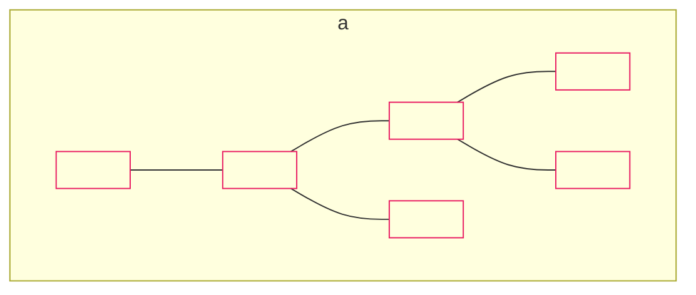

b)
A net consisting of six squares arranged in two vertical columns of three and two, with one square connecting them.
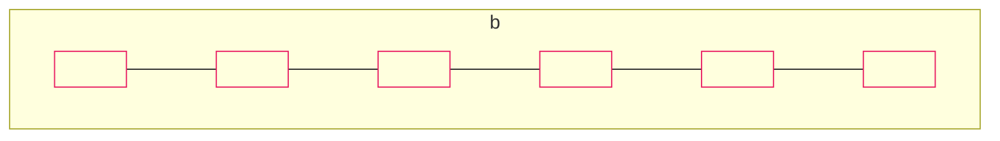

c)
A net consisting of six squares arranged in a diagonal step pattern.


d)
A net consisting of six squares arranged in a classic cross shape (t-shape).
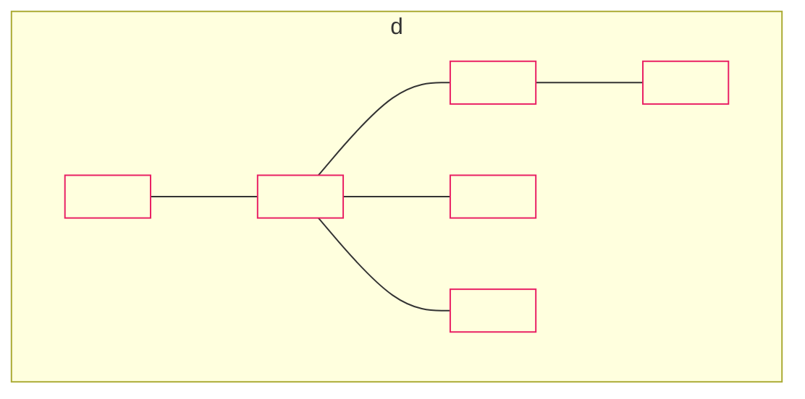

3. Observe these nets and identify the 3-D solid they are made of.

a)
A net consisting of four rectangles and two squares, forming a cuboid.
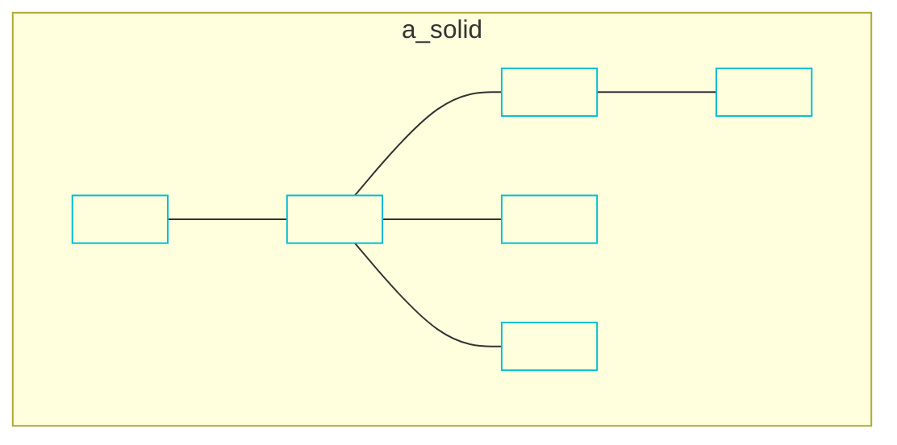

b)
A net consisting of a central square with four triangles attached to its sides, forming a square-based pyramid.
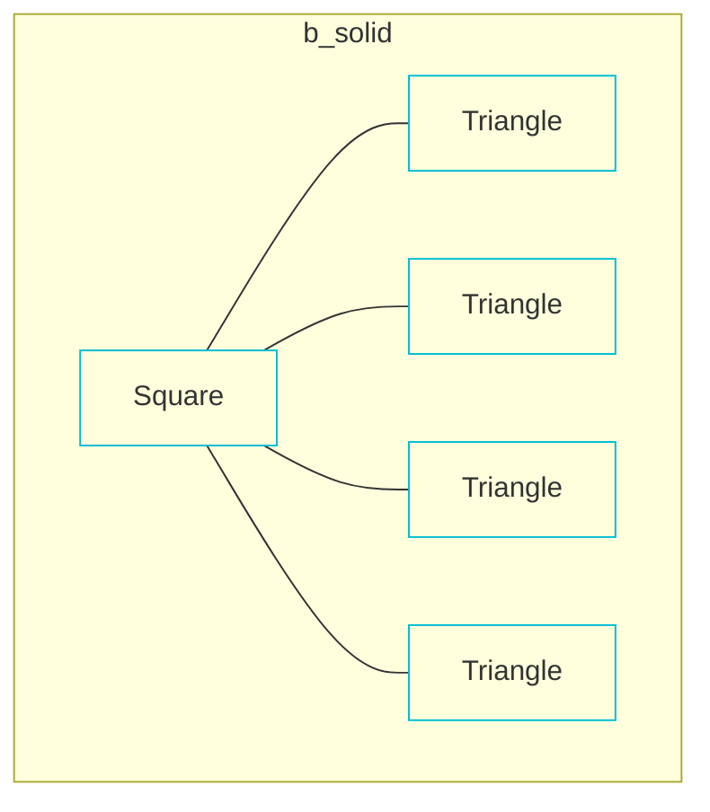

c)
A net consisting of six squares in a cross shape, forming a cube.


d)
A net consisting of four triangles and one square, forming a square-based pyramid.
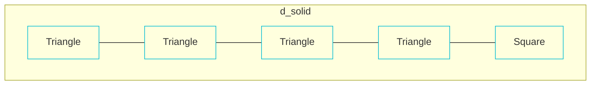

e)
A net consisting of six squares in a cross shape, forming a cube.
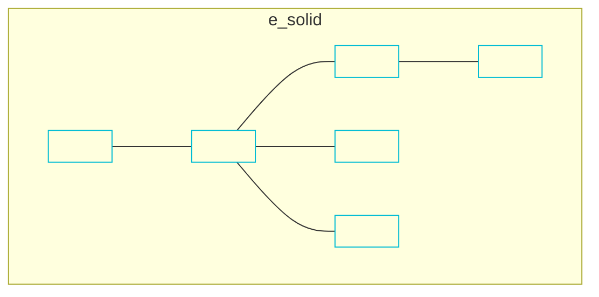


140

Mathematics-5 Unit 7: Geometry


# I Have Learnt to:

*   recognize straight and reflex angle.
*   recognize the standard units for measuring angles is $1^{\circ}$, which is defined as $\frac{1}{360^{\circ}}$ of a complete revolution.
*   identify, describing and estimating the size of angles.
*   classify angles as acute, right or obtuse.
*   compare angles with right angles and recognize that a straight line is equivalent to two right angles.
*   use protractor and ruler to construct:
    - a right angle
    - a straight angle
    - reflex angles of different measures
*   describe adjacent, complementary and supplementary angles.
*   identify and describing triangles with respect to their sides. (isosceles, equilateral, and scalene).
*   identify and describing triangles with respect to their angles. (Acute angled triangle, Obtuse angled triangle and right-angled triangles).
*   use protractor and ruler to construct a triangle when:
    - two angles and their included side is given.
    - two sides and included angle is given.
*   measure the lengths of the remaining sides and angles of the triangle.
*   recognize the kinds of quadrilateral (square, rectangle, parallelogram, rhombus, trapezium, and kite).

### Vocabulary
*   Right angle
*   Acute angle
*   Reflex angle
*   Adjacent angles
*   Complementary angles
*   Supplementary angles
*   Triangle
*   Equilateral Triangle
*   Isosceles Triangle
*   Scalene Triangle
*   Acute Angled Triangle
*   Obtuse Angled Triangle
*   Right Angled Triangle
*   Quadrilaterals
*   Symmetry
*   Nets
*   Parallelogram
*   Rhombus
*   Pyramids


141

Mathematics-5 Unit 7: Geometry


* identify and describe properties of quadrilaterals including square, rectangle, parallelogram, rhombus, trapezium, and kite, and classify those using parallel sides, equal sides and equal angles.
* use protractor and ruler to construct square and rectangle when lengths of sides are given.
* recognize different types of symmetry (Reflective and Rotational) in 2-D figures.
* identify lines of symmetry for given 2-D figures.
* find point of rotation and order of rotational symmetry of given 2-D figures
* identify cubes, cuboids and pyramids from their nets.
* describe and make 3-D objects (cubes, cuboids, cylinder, cone, sphere, pyramids).

# Review Exercise

1. Choose the correct options and fill in the blanks.
   a) Which of these is a reflex angle?
      i) $375^\circ$ ii) $215^\circ$ iii) $180^\circ$ iv) $90^\circ$
   b) The supplement of $20^\circ$ is:
      i) $160^\circ$ ii) $40^\circ$ iii) $70^\circ$ iv) $80^\circ$
   c) Sum of two right angles is equal to:
      i) Reflex angle ii) Straight angle iii) Acute angle iv) Obtuse angled
   d) Two angles will be called supplementary angles if their sum is equal to :
      i) $180^\circ$ ii) $90^\circ$ iii) $360^\circ$ iv) $100^\circ$
   e) Which of the following shapes is not a quadrilateral?
      i) [Square] ii) [Rhombus] iii) [Pentagon] iv) [Trapezium]
   f) A triangle in which its \_\_\_\_\_\_ sides are equal, is called an isosceles triangle.
      i) 1 ii) 2 iii) 3 iv) 4


142

Mathematics-5 Unit 7: Geometry


g) Which of the following is not the net of a cube?

i) A net consisting of four squares in a row, with one square attached to the top of the second square and one square attached to the bottom of the third square.
ii) A net consisting of four squares in a column, with one square attached to the left of the second square and one square attached to the right of the second square.
iii) A net consisting of three squares in a row, with two squares attached above the first and second squares, and one square attached below the third square.
iv) A net consisting of three squares in a row, with one square attached above the first square, and two squares attached below the second and third squares.

h) The order of the rotational symmetry of the shape (regular hexagon) is:
i) 1
ii) 2
iii) 3
iv) 4

i) Which of the following is showing adjacent angles?

i) Two angles, 1 and 2, sharing a common vertex and a common arm between them.
ii) Two angles, 1 and 2, sharing a common vertex but not a common arm between them (separated by another angle).
iii) Two angles, 1 and 2, sharing a common vertex and a common arm, forming a right angle.
iv) Two angles, 1 and 2, sharing a common vertex and a common arm, located on a straight line.

2. Draw these angles by using protractor and ruler.
a) $35^\circ$
b) $45^\circ$
c) $240^\circ$
d) $180^\circ$
e) $90^\circ$
f) $60^\circ$
g) $300^\circ$
h) $155^\circ$

3. Identify the adjacent angles.

a) A diagram showing three rays from a vertex, with angles labeled 'l' and 'm' sharing a common arm.
b) A diagram showing two intersecting lines, with angles labeled 'p' and 'q' which are vertically opposite.
c) A diagram showing a right angle divided into two angles of $40^\circ$ and $50^\circ$ sharing a common arm.
d) A diagram showing a straight line with a ray, forming two angles 'a' and 'b' sharing a common arm.

4. Make 5 pairs of each complementary and supplementary angles.

<table>
  <thead>
    <tr>
        <th>Complementary Angles</th>
        <th>Supplementary Angles</th>
    </tr>
  </thead>
  <tbody>
    <tr>
        <td>a) \_\_\_\_\_\_ + \_\_\_\_\_\_ = \_\_\_\_\_\_</td>
        <td>a) \_\_\_\_\_\_ + \_\_\_\_\_\_ = \_\_\_\_\_\_</td>
    </tr>
    <tr>
        <td>b) \_\_\_\_\_\_ + \_\_\_\_\_\_ = \_\_\_\_\_\_</td>
        <td>b) \_\_\_\_\_\_ + \_\_\_\_\_\_ = \_\_\_\_\_\_</td>
    </tr>
    <tr>
        <td>c) \_\_\_\_\_\_ + \_\_\_\_\_\_ = \_\_\_\_\_\_</td>
        <td>c) \_\_\_\_\_\_ + \_\_\_\_\_\_ = \_\_\_\_\_\_</td>
    </tr>
    <tr>
        <td>d) \_\_\_\_\_\_ + \_\_\_\_\_\_ = \_\_\_\_\_\_</td>
        <td>d) \_\_\_\_\_\_ + \_\_\_\_\_\_ = \_\_\_\_\_\_</td>
    </tr>
    <tr>
        <td>e) \_\_\_\_\_\_ + \_\_\_\_\_\_ = \_\_\_\_\_\_</td>
        <td>e) \_\_\_\_\_\_ + \_\_\_\_\_\_ = \_\_\_\_\_\_</td>
    </tr>
  </tbody>
</table>


143

Mathematics-5 Unit 7: Geometry


5. How many types of triangles are there with respect to their sides and angles?

6. Draw a triangle IJK in which, $\angle I = 70^\circ$, $IJ = 6.8\text{ cm}$ and $\angle J = 28^\circ$.

7. Draw a triangle PQR in which, $QR = 3.3\text{cm}$, $PQ = 5.2\text{ cm}$ and $\angle PQR = 75^\circ$.

8. Draw squares according to the given lengths with the help of protractor and ruler.
   - a) $4\text{ cm}$
   - b) $5.1\text{ cm}$
   - c) $3.6\text{ cm}$
   - d) $4.9\text{ cm}$

9. Draw rectangles with the help of protractor and ruler according to the given lengths and widths.
   - a) $\ell = 4\text{ cm}$, $w = 3.4\text{ cm}$
   - b) $\ell = 5\text{ cm}$, $w = 3\text{ cm}$
   - c) $\ell = 6.6\text{ cm}$, $w = 4.2\text{ cm}$
   - d) $\ell = 7\text{ cm}$, $w = 2.4\text{ cm}$

10. Encircle the figures which have reflective symmetry. Also draw their line of symmetry.
    - a) A blue right-angled scalene triangle.
    - b) A yellow irregular octagon (a rectangle with notched corners).
    - c) A green chevron/arrowhead shape pointing right.
    - d) A pink division symbol ($\div$).

11. Encircle the figures having rotational symmetry. Also write the order of their rotation and mark their centre of rotation.
    - a) An orange cross shape (like a plus sign rotated $45^\circ$).
    - b) A purple double-headed vertical arrow with a horizontal bar.
    - c) A blue wave/S-curve shape.
    - d) A green four-pointed star.

12. Use cardboard to make nets of various solids. Also write the number of their faces and the shape. Then fold them and verify whether you have created the correct net or not.


144

Unit 8: Perimeter and Area


# Perimeter and Area

## Learning Outcomes
**After completing this unit, you will be able to:**
* Differentiate between perimeter and area of a square and rectangular region.
* Identify the units for measurement of perimeter and area.
* Find and apply formulas to find perimeter and area of a square and rectangular region.
* Solve real life situations involving perimeter and area of square and rectangular regions.

The image depicts a park scene with a pond containing two fish, a grassy area with a squirrel, a duck with three ducklings, and a swing set.

> Wooden fence is to be fixed around a rectangular park. If you know the length and width of the park how can you find the required length of the fence?


145

Mathematics-5 Unit 8: Perimeter and Area


# Area and Perimeter

Sara and Raza are in the same school. There is a playground in their school.

> **Boy:** Do you know what is the shape of our playground? If a wall is to be constructed around the playground, what will be its total length?

> **Girl:** The playground is square shaped because its length and width are equal. The length of the wall around it will be equal to its perimeter.

A square is shown with the green interior labeled **Area** and the blue boundary line labeled **Perimeter**.

<table>
  <thead>
    <tr>
        <th>Area</th>
        <th>Perimeter</th>
    </tr>
  </thead>
  <tbody>
    <tr>
        <td>* The space covered by the surface of any 2-dimensional shape is called its area.</td>
        <td>* The total length of the boundary of a closed region is called its perimeter.</td>
    </tr>
    <tr>
        <td>* The units to measure the area are m<sup>2</sup> (squared metres) and cm<sup>2</sup> (squared centimetres) etc. (like 15cm<sup>2</sup>, 24m<sup>2</sup> etc.)</td>
        <td>* The units to measure the perimeter are m (metres), and cm (centimetres) etc. (like 15cm, 24cm etc.)</td>
    </tr>
    <tr>
        <td>* Example: The space inside the boundary of a park.</td>
        <td>* Example: The length of the fence around a region, the total length of a photo frame.</td>
    </tr>
  </tbody>
</table>

> [!NOTE]
> Ask the students to draw squares and rectangles of different measurement on the notebook, use blue colour to show its perimeter and green colour to show its area.


146

Mathematics-5 Unit 8: Perimeter and Area


Observe the given square and rectangle.

A rectangle with a blue boundary and green interior. The top and bottom sides are labeled 9m, and the left and right sides are labeled 3m.
A square with a blue boundary and green interior. All four sides are labeled 2m.

The total length of the boundary which highlighted with blue colour is called their perimeter.
While the green portion, surrounded by their boundaries is called their area.

### Try Yourself
Can we calculate the area and perimeter of the given figures? Give reason to support your answer.
[Three open-ended geometric shapes are shown: a rectangle missing its top side, a square missing its top side, and a U-shape.]

## Perimeter of a Square

[Image of a boy in a speech bubble]
> The window of our classroom is square shaped and length of one side is 2 metres. How can we find its perimeter?

[Image of a square window with a red frame, labeled 2m at the top]

> **Key Fact**
> The lengths of all sides of a square are equal.

[Image of a girl in a speech bubble]
> We can find it's perimeter by adding the length of one side of the window 4 times or by multiplying length of one side with 4.

Perimeter of a square $= 4 \times \text{length of one side}$
If we represent the length of the square by $\ell$, then:
Perimeter of a square $= 4 \times \ell$

[Image of a green square with side markings, labeled 2m at the top]
The length of one side of the window $= 2\text{ m}$
Perimeter of window $= 4 \times 2\text{ m} = 8\text{ m}$
So, the perimeter of the window is 8m.

### Try Yourself
Find the perimeter of the given squared shape.
[Image of a green square with side markings, labeled 9cm on the right side]


147

Mathematics-5 | Unit 8: Perimeter and Area


Usman has a square shaped picture frame with length of one side is 22.5cm. Find the perimeter of the frame.

Perimeter of squared frame = $4 \times \text{length of one side}$
$= 4 \times 22.5 \text{ cm}$
$= 90 \text{ cm}$

So, the perimeter of the picture frame is 90 cm.

> **Key Fact**
> Perimeter of a square = $4 \times \text{length of one side}$

The image shows a gold-colored square picture frame.

### Try Yourself
* Draw a square with the perimeter of 12 centimetres.
* A square shaped ground is 20 metre long. If a person takes 5 rounds of the ground, how much total distance does he cover?

## Perimeter of a Rectangle

The length of a book is 26 cm and its width is 19.5 cm. How can we find the perimeter of the book?

> We can find its perimeter by adding measurements of all sides.

The image shows a diagram of a rectangle with the top side labeled "Length" and the left side labeled "width".

If we denote length of the rectangle with '$l$' and width with '$w$', then:
Perimeter of rectangle = $l + l + w + w$
or
Perimeter of rectangle = $2l + 2w$
$= 2(l + w)$

> Ask the students to look around, identify square shaped objects and find their perimeter by using the formula.


148

Mathematics-5 | Unit 8: Perimeter and Area


Perimeter of rectangle $= 2 (\ell + w)$
$= 2(26\text{cm} + 19.5\text{cm})$
$= 2(45.5) \text{ cm}$
$= 91 \text{ cm}$

So, perimeter of the book is $91 \text{ cm}$.

> ### Try Yourself
> Measure the length and width of your teachers table and find its perimeter by using the formula.

> ### Key Fact
> Perimeter of rectangle $= 2(\text{length} + \text{width})$
> $= 2(\ell + w)$

**A rectangular pool is 10 metre long and 7.3 metre wide. Find the perimeter of the pool.**

Length of the pool $= 10\text{m}$
Width of the pool $= 7.3\text{m}$
Perimeter of rectangle $= 2 (\ell + w)$
Perimeter of the pool $= 2(10\text{m} + 7.3\text{m})$
$= 2(17.3)\text{m} = 34.6\text{m}$

So, the perimeter of the pool is $34.6\text{m}$.

**The length of a rectangular garden is 21 metres and its width is 16 metres. If the rate of fencing is Rs. 170 per metre, find the cost of fencing around it.**

Perimeter of the garden $= 2(\ell + w)$
$= 2(21 + 16)$
$= 2(37) = 74\text{m}$

Cost of 1 metre of fencing $= \text{Rs } 170$
Cost of 74 metres of fencing $= 74 \times \text{Rs } 170$
$= \text{Rs } 12\ 580$

So, the cost of fencing is $\text{Rs } 12\ 580$.

> ### Try Yourself
> The perimeter of a rectangular field is 66 metres. If the length of this field is 15 metres, then find the width of the field. Also tell the cost of putting barbed wire around the field if the rate is Rs 220 per metre.

<table>
    <tr>
        <td>[The image shows a teaching point icon]</td>
        <td>Ask to students to find rectangular objects in their classroom, measure their lengths and width and find the perimeter of each object.</td>
    </tr>
</table>
149

Mathematics-5 Unit 8: Perimeter and Area


# Exercise 1

1. Find the perimeter of the given squares.

a)
A yellow square with side length 7 m.
- Top side: 7 m
- Left side: 7 m

b)
A green square with side length 13 cm.
- Right side: 13 cm
- Bottom side: 13 cm

c)
An orange square with side length 4 m.
- Right side: 4 m
- Bottom side: 4 m

2. Find the perimeter of the given rectangles.

a)
A yellow rectangle.
- Length (bottom): 9 cm
- Width (right): 5 cm

b)
A green rectangle.
- Length (right): 8 m
- Width (bottom): 3 m

c)
A blue rectangle.
- Length (bottom): 12 m
- Width (right): 2 m

3. If the length of a square shaped crop field is 29m, what will be its perimeter?

4. The perimeter of a square shape is 72 cm. What will be its length?
(Accompanying image: A pink square with the text "Perimeter = 72cm" inside).

5. Find the perimeter of the squares of the given lengths by using formula.
a) 5 cm
b) 12 cm
c) 6 m
d) 19 cm
e) 26 m
f) 2.5 cm
g) 9.7 m
h) 15 m
i) 16.6 cm
j) 10 m
k) 7.1 cm
l) 2.7 cm

6. Find the perimeter of the rectangles of the given lengths and widths by using formula.
a) $\ell = 3 \text{ cm}, w = 2 \text{ cm}$
b) $\ell = 5.3 \text{ m}, w = 2.2 \text{ m}$
c) $\ell = 6 \text{ cm}, w = 4 \text{ cm}$
d) $\ell = 9 \text{ m}, w = 1.2 \text{ m}$
e) $\ell = 10 \text{ m}, w = 5.9 \text{ m}$
f) $\ell = 15 \text{ cm}, w = 12 \text{ cm}$


150

Mathematics-5 | Unit 8: Perimeter and Area


7. Children are playing in a square shaped playground. If the length of the playground is 12 metres, find its perimeter.
8. Harris wants to find out the perimeter of the square shaped notice board in his classroom. If the length of one side of the notice board is 2.5 metres, find the perimeter of the notice board.
9. If a rectangular room is 10.8 metres long and 8.8 metres wide. Find the perimeter of the room.
10. Nadia has a rectangular frame. The frame is 12 cm long and 8 cm wide. Nadia wants to put a ribbon around the frame.
    a) Find the required length of the ribbon.
    b) What will be the total cost of ribbon if 1 metre of it costs Rs. 5.

> **Hint**
> By multiplying the cost of the ribbon per metre with the perimeter of the frame will determine the total cost of the ribbon.

11. A building is 128 metres long and 96.5 metres wide.
    a) Find out its perimeter
    b) Find the total cost for the construction of boundary wall around this building if the rate of construction of wall is Rs. 470 per metre.

# Area of a Square

[A boy thinking]: My room is square shaped. Its length is 11 metres. How can I find its area?

[An illustration of a square-shaped bedroom with a bed, window, and furniture.]

[A girl explaining]: We can find the area of a square shaped room by multiplying its length with width.

> [Teaching Point Icon] Ask the students to look around for square shaped objects and then find their area.


151

Mathematics-5 Unit 8: Perimeter and Area


If we denote length of a side of the square by "$\ell$" then:

Area of a square = length of a side $\times$ length of the side

Length of the room = 11 m
Area of the room $= \ell \times \ell$
$= 11 \times 11\text{ m}^2$
$= 121\text{ m}^2$

So, the area of the room is $121\text{ m}^2$.

> **Key Fact**
> Area of square = length $\times$ length
> $= \ell \times \ell$

A square mirror has a length of 42 cm. What is its area?

Length of one side $(\ell) = 42\text{cm}$
Area of the mirror $= \ell \times \ell$
$= 42\text{cm} \times 42\text{cm}$
$= 1\ 764\text{ cm}^2$

So, the area of the mirror is $1\ 764\text{ cm}^2$.

### Try Yourself
Find the area of the coloured portion in the given figure.

[The figure shows a large green square with a side length of 20cm. Inside it, there is a smaller white square with a side length of 11cm. The "coloured portion" refers to the green area between the two squares.]

# Area of a Rectangle

The playground of my school has a rectangular flower bed with length is 7.5 metres and width of 4 metres. How can we find its area?

[The page includes an image of a rectangular flower bed with red flowers in a park setting.]

> Ask the students to look for rectangular objects in their classroom, measures their length and width.


152

Mathematics-5 | Unit 8: Perimeter and Area


The area of a rectangle can be found by multiplying its length with its width.
If we denote the length of the rectangle by "$l$" and width by "$w$", then:

Area of rectangle = Length $\times$ Width
Area of rectangle = $l \times w$

Length of the flower bed = 7.5m
Width of the flower bed = 4m
Area of the flower bed = $7.5 \times 4\text{m}^2$
= $30\text{m}^2$

So, the area of the flower bed is $30\text{m}^2$.

A diagram shows a brown rectangle representing a flower bed with a length of 7.5 m and a width of 4 m.

> ### Try Yourself
> Measure the length and width of your classroom. Then find the cost of tiling your classroom if the rate of tiling is Rs 455 $\text{m}^2$.

> ### Key Fact
> Area of rectangle = length $\times$ width
> = $l \times w$

A rectangular hospital has a perimeter equals to 294 metres. If its length is 85 metre, find its area.

Perimeter of rectangle = $2(l + w)$
$294\text{m} = 2(l + w)$
$294\text{m} = 2(85 + w)$
$294\text{m} = 170\text{m} + 2w$
$294\text{m} - 170 = 2w$
$124 = 2w$
$124 \div 2 = w$
$62\text{m} = w$

Area of rectangle = $l \times w$
Area of hospital = $85\text{m} \times 62\text{m}$
Area of hospital = $5270\text{m}^2$

So, the area of the hospital is $5270\text{m}^2$.

An illustration shows a modern multi-story hospital building with a blue glass facade and a red cross symbol.

> ### Try Yourself
> Draw two rectangles with different areas but same perimeters. Draw a square and a rectangle with same areas and perimeters.


153

Mathematics-5 Unit 8: Perimeter and Area


# Exercise 2

1. Find the area of the given squares.

a)
A yellow square with side lengths:
- Height: 2.5 m
- Width: 2.5 m

b)
A green square with side lengths:
- Height: 22 cm
- Width: 22 cm

c)
An orange square with side lengths:
- Height: 42.7 m
- Width: 42.7 m

2. Find the area of the given rectangles.

a)
A light blue rectangle with dimensions:
- Length: 4.5 cm
- Width: 3 cm

b)
A pink rectangle with dimensions:
- Length: 2 m
- Width: 6 m

c)
A light pink rectangle with dimensions:
- Length: 10 m
- Width: 1 m

3. The area of a rectangle is 96m<sup>2</sup>. If its width is 3m, then find its length.

4. Find the area of the squares of the given lengths by using formula.
a) 4.5 m
b) 9.3 cm
c) 8.8 m
d) 15 cm
e) 13 cm
f) 3 m
g) 6 m
h) 2.9 m
i) 5 cm
j) 9.2 m
k) 14 m
l) 1.1 cm

5. Find the area of the rectangles of the given lengths and widths by using formula.
a) $\ell = 5 \text{ cm}, w = 1.9 \text{ cm}$
b) $\ell = 4 \text{ m}, w = 3 \text{ m}$
c) $\ell = 6 \text{ cm}, w = 4 \text{ cm}$
d) $\ell = 7 \text{ cm}, w = 5 \text{ cm}$
e) $\ell = 10.5 \text{ cm}, w = 9 \text{ cm}$
f) $\ell = 20 \text{ m}, w = 17 \text{ m}$

6. A rectangular shaped ground has a length of 122m and width 108m. Find the area of the ground.


154

Mathematics-5 Unit 8: Perimeter and Area


7. The area of a school's main gate is $19.55\text{m}^2$.
a) If the width of the gate is $2.3\text{m}$, then find its length.
b) Find the cost of painting the gate if the rate of painting is Rs. 275 per $\text{m}^2$.

8. Area of a Masjid is $27540\text{m}^2$ and its length is $255\text{m}$. Find:
a) The perimeter of the Masjid.
b) The cost of carpeting the Masjid, if the rate of carpeting is Rs 275 per $\text{m}^2$.

9. Find the area of the blue part.

The image shows a large blue rectangle with two smaller shapes inside it: a yellow rectangle and a pink square.
- The large blue rectangle has a length of $22\text{ cm}$ and a width of $10\text{ cm}$.
- The yellow rectangle inside has a length of $6\text{ cm}$ and a width of $2\text{ cm}$.
- The pink square inside has sides of $4\text{ cm}$ each.

### I Have Learnt to:

* differentiate between perimeter and area of a square and rectangular region.
* identify the units for measurement of perimeter and area.
* find and applying formulas to find perimeter and area of a square and rectangular region
* solve real life situations involving perimeter and area of square and rectangular regions.

**Vocabulary**
* Perimeter
* Area
* Square
* Rectangle
* Unit
* Formula
* Region
* Measurement
* Rectangular
* Width


155

Mathematics-5 | Unit 8: Perimeter and Area


# Review Exercise

1. Choose the correct options and fill in the blanks.

a) If the length of a rectangle is 4 cm and width is 3.4 cm, then its perimeter will be equal to \_\_\_\_\_\_\_\_.
   i) 11.4 cm | ii) 7.4 cm | iii) 14.8 cm | iv) 10.8 cm

b) Formula to find the perimeter of the square is:
   i) $4 + \ell$ | ii) $4 - \ell$ | iii) $4\ell$ | iv) $\ell \times \ell$

c) The formula to find the perimeter of the rectangle is:
   i) $2(\ell + w)$ | ii) $2\ell + w$ | iii) $\ell + 2w$ | iv) $\ell + w$

d) Area of a rectangle is $45\text{m}^2$. If its length is 15 m then its width is:
   i) 6m | ii) 3m | iii) 5m | iv) 15m

e) The formula to find the area of the square is:
   i) $\ell \times \ell$ | ii) $2(\ell + w)$ | iii) $\ell + 2w$ | iv) $4\ell$

f) The formula to find the area of the rectangle is:
   i) $\ell \times w$ | ii) $2(\ell + w)$ | iii) $\ell + 2w$ | iv) $4\ell$

g) If the perimeter of the rectangle is 34 cm and we increase its length by 2 cm then there will be difference of \_\_\_\_\_\_\_\_ cm in its perimeter.
   i) 2 | ii) 4 | iii) 8 | iv) 6

h) If the length of one side of the square is 14 cm, then its perimeter will be \_\_\_\_\_\_\_\_.
   i) 14 cm | ii) 56 cm | iii) 256 cm | iv) 28 cm


156

Mathematics-5 Unit 8: Perimeter and Area


2. Find the perimeter and area of the squares of the given lengths by using formula.
   - a) 8.2 cm
   - b) 2.6 m
   - c) 12.8 m
   - d) 7.9 cm
   - e) 16 cm
   - f) 4.3 m
   - g) 5.7 m
   - h) 11 cm

3. Find the perimeter and area of the rectangles of the given lengths and widths by using formula.
   - a) $\ell = 6\text{ cm}, w = 3.4\text{ cm}$
   - b) $\ell = 1.2\text{ m}, w = 0.3\text{ m}$
   - c) $\ell = 10\text{ cm}, w = 13\text{ cm}$
   - d) $\ell = 17\text{ cm}, w = 8.5\text{ cm}$

4. The perimeter of a book is 100 cm. If it's width is 22 cm, find its length.

5. Laiba wants tiling for the floor of her kitchen. If the length of the kitchen is 3 metres and width is 2.5 metres then find the area of the kitchen.

6. The length of the fence around a square shaped garden is 24m. Find the length of the garden.

7. Daniya took a 42 cm long ribbon and made a rectangle with it. If the length of the rectangle is 15 cm, then find its width.

8. Find the area of the carrom board whose perimeter is 40 cm.


157

# Unit 9 Data Handling

## Learning Outcomes
**After completing this unit, you will be able to:**
* Find and describe average of given quantities in the data.
* Solve real life situations involving average.
* Organize the given data using bar graph.
* Read and interpret a bar graph given in horizontal and vertical form.
* Draw horizontal and vertical bar graphs for given data.
* Solve real life situations using data presented in bar graphs.

<table>
  <tbody>
    <tr>
        <td>Months</td>
        <td>January</td>
        <td>February</td>
        <td>March</td>
        <td>April</td>
        <td>May</td>
    </tr>
    <tr>
        <td>Average Temperature</td>
        <td>18°C</td>
        <td>19°C</td>
        <td>21°C</td>
        <td>24°C</td>
        <td>28°C</td>
    </tr>
  </tbody>
</table>

**Scale: 1 square = 5°C**

<table>
  <thead>
    <tr>
        <th>Average Temperature (°C)</th>
        <th>January</th>
        <th>February</th>
        <th>March</th>
        <th>April</th>
        <th>May</th>
        <th colspan="2"></th>
    </tr>
  </thead>
  <tbody>
    <tr>
        <td>40°</td>
        <td></td>
        <td></td>
        <td></td>
        <td></td>
        <td></td>
        <td colspan="2"></td>
    </tr>
    <tr>
        <td>35°</td>
        <td></td>
        <td></td>
        <td></td>
        <td></td>
        <td></td>
        <td colspan="2"></td>
    </tr>
    <tr>
        <td>30°</td>
        <td></td>
        <td></td>
        <td></td>
        <td></td>
        <td></td>
        <td colspan="2"></td>
    </tr>
    <tr>
        <td>25°</td>
        <td></td>
        <td></td>
        <td></td>
        <td></td>
        <td rowspan="2">28</td>
        <td colspan="2"></td>
    </tr>
    <tr>
        <td>20°</td>
        <td></td>
        <td></td>
        <td rowspan="2">21</td>
        <td rowspan="2">24</td>
        <td colspan="2"></td>
    </tr>
    <tr>
        <td>15°</td>
        <td rowspan="2">18</td>
        <td rowspan="2">19</td>
        <td></td>
        <td></td>
        <td></td>
    </tr>
    <tr>
        <td>10°</td>
        <td></td>
        <td></td>
        <td></td>
        <td></td>
        <td></td>
    </tr>
    <tr>
        <td>5°</td>
        <td></td>
        <td></td>
        <td></td>
        <td></td>
        <td></td>
        <td colspan="2"></td>
    </tr>
    <tr>
        <td>0°</td>
        <td colspan="7"></td>
    </tr>
  </tbody>
</table>

> Umair draw a graph of monthly average temperature for the first 5 months of 2020. Is this graph correct? If not then identify the mistake and correct it.


158

Mathematics-5 Unit 9: Data handling


# Average

> **Boy:** We went to the seaside yesterday. I collected 16 seashells, my brother collected 12 seashells and my sister collected 11 seashells. How can we divide these seashells equally among us?

> **Girl:** We will find the total number of collected seashells then divide the total number of seashells by the number of persons.

### Key Fact
To find the average of the given quantities, we find the sum of the quantities and divide this sum by the number of quantities.

$$\text{Average} = \frac{\text{Sum of quantities}}{\text{Number of quantities}}$$

Total number of the seashells $= 16 + 12 + 11$
$= 39$

Number of persons $= 3$

Number of seashells each person will get $= \frac{39}{3}$
$= 13$

**Long Division:**
```
    13
   ____
 3 ) 39
    -3
    ---
     09
    - 9
    ---
      0
```

Every person will get 13 seashells. We can say that 13 is the average of 16, 12 and 11. The average can be equal to one of the values.

> **Try Yourself**
> Find the average of 13, 34, 16 and 28.


159

Mathematics-5 Unit 9: Data handling


The length of 5 ropes is 2.4 m, 0.9 m, 1.6 m, 4.4 m and 3m respectively. Find the average length of these ropes.

> Average = $\frac{\text{Sum of the lengths}}{\text{Number of the ropes}}$
>
> Average = $\frac{2.4 + 0.9 + 1.6 + 4.4 + 3}{5}$
>
> Average = $\frac{12.3}{5}$
>
> Average = 2.46 m
>
> So, the average length of the rope is 2.46m.

In the annual exams, Ali got an average of 78 marks in 7 subjects. Find the total marks he got.

> Average marks obtained = $\frac{\text{Total marks obtained}}{\text{Number of subjects}}$
>
> Total marks obtained = Average marks obtained $\times$ Number of subjects
> = $78 \times 7$
> = 546
>
> So, Ali got 546 marks in 7 subjects.

### Try Yourself
Find the average of 11, 23, 37, 55 and 82.

If the sum of quantities is 1 840 and their average is 115, then find the number of quantities.

Average = $\frac{\text{Sum of quantities}}{\text{Number of quantities}}$

Number of quantities = $\frac{\text{Sum of quantities}}{\text{Average}}$

Number of quantities = $\frac{1\ 840}{115} = 16$

### Try Yourself
If the average of 40 quantities is 215, then find the sum of the quantities.

Divide the students into groups and ask them to measure the height of each of their group member and find their average height. Also compare their average with the other groups.


160

Mathematics-5 Unit 9: Data handling


### Try Yourself
Find the number of quantities, if their sum is 5200 and their average is 650.

### Challenge
Yousaf took 4 mathematics test in 4 weeks. The average marks he got in these 4 tests is 62. If he scored 80 marks in the test taken on the fifth week. Find out the new average of his total marks for the five weeks overall.

# Exercise 1

1. Find the average of the following:
   (a) 4, 13, 25, 32, 42, 52
   (b) 12kg, 16kg, 26kg, 42kg
   (c) 10cm, 13cm, 17cm, 16cm, 19cm
   (d) 5$\ell$, 15$\ell$, 30$\ell$, 25$\ell$, 40$\ell$

2. Munir recites 9, 11, 12, 10 and 8 A'yah of The Holy Quran in 5 days respectively. Find the average number of A'yah she recites in one day.

3. Saad has 16, Amna has 20, Sara has 15 and Ahmad has 9 pencils. Find the average of pencils.

4. The average number of students in 18 schools situated in a city is 1 150. Find the total number of students in these schools altogether.

5. On an average, Maryam baked 27 cakes for a bakery in 11 months. What is the total number of cakes that she baked?

6. A factory hired a total of 1 240 labourers in 4 years. Find the average number of labourers hired in a year.

7. The runs scored by the students of a class in a cricket match are given below.

<table>
  <thead>
    <tr>
        <th>Students</th>
        <th>Aimen</th>
        <th>Haniya</th>
        <th>Marwa</th>
        <th>Sara</th>
        <th>Nadia</th>
        <th>Saba</th>
        <th>Amna</th>
    </tr>
  </thead>
  <tbody>
    <tr>
        <td>Runs</td>
        <td>21</td>
        <td>52</td>
        <td>54</td>
        <td>33</td>
        <td>37</td>
        <td>47</td>
        <td>28</td>
    </tr>
  </tbody>
</table>

Find the average runs of the students.


161

Mathematics-5 Unit 9: Data handling


# Organize the Data using a Bar Graph

## Drawing a Bar Graph

> [A boy says:] The following table shows the details of the marks obtained out of the 10 marks in the Mathematics test during last 4 months. I want to show it in a bar graph. What will be the procedure?

<table>
  <tbody>
    <tr>
        <td>Months</td>
        <td>September</td>
        <td>October</td>
        <td>November</td>
        <td>December</td>
    </tr>
    <tr>
        <td>Obtained marks</td>
        <td>8</td>
        <td>6</td>
        <td>10</td>
        <td>9</td>
    </tr>
  </tbody>
</table>

> [A girl says:] The following method is used to draw a bar graph.

* Mark the horizontal line as X-axis and the vertical line as Y-axis.
* Write the name of the months on the X-axis and the marks obtained on the Y-axis.
* One square with Y-axis represents 1 mark.
* 8 marks were obtained in September. So, we will colour 8 squares along the Y-axis.
* Similarly, 6 marks were obtained in October. So, we will colour 6 squares along the Y-axis.
* Complete the bar graph by colouring the number of squares for the marks obtained in all the months.

<table>
    <tr>
        <th>TEACHING POINT</th>
        <th>Ask the students to take a survey in the school. For example the favourite subjects of the students, favourite food, favourite hobbies etc. Ask them to organise this data using bar graph.</th>
    </tr>
</table>
162

Mathematics-5 Unit 9: Data handling


# Bar Graph of Mathematics test
**Scale: 1 square = 1 number**

The following table represents the data from the vertical bar graph shown in the image:

<table>
  <thead>
    <tr>
        <th>Name of Months</th>
        <th>Marks Obtained</th>
    </tr>
  </thead>
  <tbody>
    <tr>
        <td>September</td>
        <td>8</td>
    </tr>
    <tr>
        <td>October</td>
        <td>6</td>
    </tr>
    <tr>
        <td>November</td>
        <td>10</td>
    </tr>
    <tr>
        <td>December</td>
        <td>9</td>
    </tr>
  </tbody>
</table>

> **Key Fact**
> * In a bar graph, the width of each bar is same.
> * The bar graph given above is a vertical bar graph. Similarly, we can draw a horizontal bar graph.

The given table shows the number of cars of different colours in a car parking during a month. Represent this data in a horizontal bar graph.

(Note: The image shows a parking lot with various colored cars including yellow, white, blue, red, and black/grey.)


163

Mathematics-5 | Unit 9: Data handling


<table>
  <thead>
    <tr>
        <th>Colour of cars</th>
        <th>Blue</th>
        <th>Black</th>
        <th>Grey</th>
        <th>Red</th>
    </tr>
  </thead>
  <tbody>
    <tr>
        <td>Number of cars</td>
        <td>80</td>
        <td>65</td>
        <td>90</td>
        <td>75</td>
    </tr>
  </tbody>
</table>

*   Mark the horizontal line as X-axis and the vertical line as Y-axis.
*   Write the number of cars on the X-axis and the colours of cars on the Y-axis.
*   One square with X-axis represents 10 cars.
*   Complete the bar graph by colouring the number of squares for the number of cars of each colour.

### Bar Graph of cars
**Scale: 1 square = 10 cars**

<table>
  <thead>
    <tr>
        <th>Colour of cars (Y-axis)</th>
        <th>0</th>
        <th>10</th>
        <th>20</th>
        <th>30</th>
        <th>40</th>
        <th>50</th>
        <th>60</th>
        <th>70</th>
        <th>80</th>
        <th>90</th>
        <th>X</th>
        <th colspan="7"></th>
    </tr>
    <tr>
        <th>Number of cars (X-axis)</th>
        <th>0</th>
        <th>10</th>
        <th>20</th>
        <th>30</th>
        <th>40</th>
        <th>50</th>
        <th>60</th>
        <th>70</th>
        <th>80</th>
        <th>90</th>
        <th colspan="8"></th>
    </tr>
  </thead>
  <tbody>
    <tr>
        <td>Red</td>
        <td>[colspan=7.5] (Red Bar)</td>
        <td></td>
        <td></td>
        <td></td>
        <td></td>
        <td></td>
        <td></td>
        <td></td>
        <td></td>
        <td></td>
        <td colspan="8"></td>
    </tr>
    <tr>
        <td>Grey</td>
        <td colspan="9">(Grey Bar)</td>
        <td></td>
        <td></td>
        <td></td>
        <td></td>
        <td></td>
        <td></td>
        <td></td>
        <td></td>
        <td></td>
    </tr>
    <tr>
        <td>Black</td>
        <td>[colspan=6.5] (Black Bar)</td>
        <td></td>
        <td></td>
        <td></td>
        <td></td>
        <td></td>
        <td></td>
        <td></td>
        <td></td>
        <td></td>
        <td colspan="8"></td>
    </tr>
    <tr>
        <td>Blue</td>
        <td colspan="8">(Blue Bar)</td>
        <td></td>
        <td></td>
        <td></td>
        <td></td>
        <td></td>
        <td></td>
        <td></td>
        <td></td>
        <td></td>
        <td></td>
    </tr>
  </tbody>
</table>

### Try It! Challenge
Record the information about the favourite hobby of your classmates in a table. Then organize it with the help of horizontal bar graph.


164

Mathematics-5 Unit 9: Data handling


# Reading a Bar Graph

> The given bar graph shows the number of flowers that bloomed in Huma's garden during five weeks.

The graph shows:
* 6 flowers bloomed during the first week.
* 4 flowers bloomed during the second week.
* 3 flowers bloomed during the third week.
* 2 flowers bloomed during the fourth week.
* 7 flowers bloomed during the fifth week.
* The maximum flowers bloomed during the fifth week.
* Minimum flowers bloomed during the fourth week.

**Flower in Huma's garden**
Scale: 1 square = 1 flower

<table>
  <thead>
    <tr>
        <th>Number of flowers</th>
        <th>Week 1</th>
        <th>Week 2</th>
        <th>Week 3</th>
        <th>Week 4</th>
        <th>Week 5</th>
    </tr>
    <tr>
        <th>Weeks</th>
        <th>Week 1</th>
        <th>Week 2</th>
        <th>Week 3</th>
        <th>Week 4</th>
        <th>Week 5</th>
    </tr>
  </thead>
  <tbody>
    <tr>
        <td>8</td>
        <td></td>
        <td></td>
        <td></td>
        <td></td>
        <td></td>
    </tr>
    <tr>
        <td>7</td>
        <td></td>
        <td></td>
        <td></td>
        <td></td>
        <td>7</td>
    </tr>
    <tr>
        <td>6</td>
        <td>6</td>
        <td></td>
        <td></td>
        <td></td>
        <td></td>
    </tr>
    <tr>
        <td>5</td>
        <td></td>
        <td></td>
        <td></td>
        <td></td>
        <td></td>
    </tr>
    <tr>
        <td>4</td>
        <td></td>
        <td>4</td>
        <td></td>
        <td></td>
        <td></td>
    </tr>
    <tr>
        <td>3</td>
        <td></td>
        <td></td>
        <td>3</td>
        <td></td>
        <td></td>
    </tr>
    <tr>
        <td>2</td>
        <td></td>
        <td></td>
        <td></td>
        <td>2</td>
        <td></td>
    </tr>
    <tr>
        <td>1</td>
        <td></td>
        <td></td>
        <td></td>
        <td></td>
        <td></td>
    </tr>
    <tr>
        <td>0</td>
        <td></td>
        <td></td>
        <td></td>
        <td></td>
        <td></td>
    </tr>
  </tbody>
</table>

Let's find the answer of the given question by observing the given bar graph.

**Shoe production at factory**
Scale: 1 square = 2500 pairs of shoes

<table>
  <thead>
    <tr>
        <th>Year</th>
        <th>0</th>
        <th>5000</th>
        <th>10000</th>
        <th>15000</th>
        <th>20000</th>
        <th>25000</th>
        <th>30000</th>
        <th>35000</th>
        <th>40000</th>
        <th>45000</th>
        <th colspan="2"></th>
    </tr>
    <tr>
        <th>Pair of shoes</th>
        <th>0</th>
        <th>5000</th>
        <th>10000</th>
        <th>15000</th>
        <th>20000</th>
        <th>25000</th>
        <th>30000</th>
        <th>35000</th>
        <th>40000</th>
        <th>45000</th>
        <th colspan="2"></th>
    </tr>
  </thead>
  <tbody>
    <tr>
        <td>2015</td>
        <td colspan="6">25000</td>
        <td></td>
        <td></td>
        <td></td>
        <td></td>
        <td></td>
        <td></td>
    </tr>
    <tr>
        <td>2014</td>
        <td>[colspan=5.5]22500</td>
        <td></td>
        <td></td>
        <td></td>
        <td></td>
        <td></td>
        <td></td>
        <td colspan="5"></td>
    </tr>
    <tr>
        <td>2013</td>
        <td colspan="4">15000</td>
        <td></td>
        <td></td>
        <td></td>
        <td></td>
        <td></td>
        <td></td>
        <td></td>
        <td></td>
    </tr>
    <tr>
        <td>2012</td>
        <td colspan="5">20000</td>
        <td></td>
        <td></td>
        <td></td>
        <td></td>
        <td></td>
        <td></td>
        <td></td>
    </tr>
    <tr>
        <td>2011</td>
        <td colspan="5">20000</td>
        <td></td>
        <td></td>
        <td></td>
        <td></td>
        <td></td>
        <td></td>
        <td></td>
    </tr>
  </tbody>
</table>


165

Mathematics-5 Unit 9: Data handling


*   In which year did the factory produce the most pairs of shoes? (2015)
*   In which year did the factory produce the least pairs of shoes? (2013)
*   In which years the factory made 20000 pairs of shoes? (2011 and 2012)
*   How many less pairs of shoes were produced in 2011 than in 2015?
    $25,000 - 20,000 = 5,000$ (Pair of shoes)
*   In which 2 years, the difference in the number of shoes in the factory is 10,000? (2013 and 2015)
*   How many pairs of shoes did the factory produce in these 5 years?
    $(20000+20000+15000+22500+25000) = 102,500$ pairs of shoes.

# Exercise 2

1. Saba asked about the most favourite fruit of each student in her class. The details of the answers are shown in the given table. Draw a horizontal bar graph of this data.

<table>
  <thead>
    <tr>
        <th>Favourite fruit</th>
        <th>Strawberry</th>
        <th>Apple</th>
        <th>Banana</th>
        <th>Mango</th>
    </tr>
  </thead>
  <tbody>
    <tr>
        <td>Number of students</td>
        <td>5</td>
        <td>4</td>
        <td>8</td>
        <td>9</td>
    </tr>
  </tbody>
</table>

2. The statistics of patients visiting a hospital during 5 months is given below. Draw a vertical bar of the given data.

<table>
  <thead>
    <tr>
        <th>Months</th>
        <th>February</th>
        <th>March</th>
        <th>April</th>
        <th>May</th>
        <th>June</th>
    </tr>
  </thead>
  <tbody>
    <tr>
        <td>Number of patients</td>
        <td>2</td>
        <td>6</td>
        <td>10</td>
        <td>12</td>
        <td>15</td>
    </tr>
  </tbody>
</table>

3. During a visit to a zoo the children saw different number of animals whose detail is given below. Draw its vertical bar graph.

<table>
  <thead>
    <tr>
        <th>Animals</th>
        <th>Lion</th>
        <th>Elephant</th>
        <th>Monkey</th>
        <th>Cheeta</th>
        <th>Snake</th>
        <th>Giraffe</th>
        <th>Zebra</th>
    </tr>
  </thead>
  <tbody>
    <tr>
        <td>Number of animals</td>
        <td>4</td>
        <td>2</td>
        <td>8</td>
        <td>3</td>
        <td>12</td>
        <td>6</td>
        <td>10</td>
    </tr>
  </tbody>
</table>


166

Mathematics-5 Unit 9: Data handling


4. In the following table the values of temperature in Lahore during a week of August are given. Draw a horizontal bar graph.

<table>
  <tbody>
    <tr>
        <td>Days of week</td>
        <td>Monday</td>
        <td>Tuesday</td>
        <td>Wednesday</td>
        <td>Thursday</td>
        <td>Friday</td>
        <td>Saturday</td>
        <td>Sunday</td>
    </tr>
    <tr>
        <td>Temperature (°C)</td>
        <td>32</td>
        <td>33</td>
        <td>30</td>
        <td>32</td>
        <td>36</td>
        <td>40</td>
        <td>38</td>
    </tr>
  </tbody>
</table>

5. Study the graph carefully to answer the given questions.

**Transportation used for going to school**
Scale: 1 square = 10 students

<table>
  <thead>
    <tr>
        <th>Transportation</th>
        <th>Number of students</th>
    </tr>
  </thead>
  <tbody>
    <tr>
        <td>Bus</td>
        <td>100</td>
    </tr>
    <tr>
        <td>Rickshaw</td>
        <td>60</td>
    </tr>
    <tr>
        <td>Car</td>
        <td>70</td>
    </tr>
    <tr>
        <td>Motorbike</td>
        <td>20</td>
    </tr>
    <tr>
        <td>Walk</td>
        <td>80</td>
    </tr>
  </tbody>
</table>

a. How many students come to school by car?
b. Is the number of students coming to school on motorbikes less than those coming by rickshaw? If yes, then how much less?
c. Which means of transport do the most students use and what is the number of students coming to school by this means of transport?
d. What is the total number of students coming by car, rickshaw and bus altogether?
e. Tell the number of students coming to school on foot.


167

Mathematics-5 | Unit 9: Data handling


6. Study the graph carefully to answer the given questions

**Pet animals**
Scale: 1 square = 1 student

<table>
  <thead>
    <tr>
        <th>Name of Animals</th>
        <th>0</th>
        <th>1</th>
        <th>2</th>
        <th>3</th>
        <th>4</th>
        <th>5</th>
        <th>6</th>
        <th>7</th>
        <th>8</th>
        <th>9</th>
        <th>10</th>
    </tr>
    <tr>
        <th></th>
        <th>Number of students</th>
        <th colspan="10"></th>
    </tr>
  </thead>
  <tbody>
    <tr>
        <td>Cat</td>
        <td colspan="9"></td>
        <td></td>
        <td></td>
    </tr>
    <tr>
        <td>Goat</td>
        <td colspan="4"></td>
        <td></td>
        <td></td>
        <td></td>
        <td></td>
        <td></td>
        <td></td>
        <td></td>
    </tr>
    <tr>
        <td>Cow</td>
        <td colspan="8"></td>
        <td></td>
        <td></td>
        <td></td>
    </tr>
    <tr>
        <td>Buffalo</td>
        <td colspan="7"></td>
        <td></td>
        <td></td>
        <td></td>
        <td></td>
    </tr>
  </tbody>
</table>

(a) How many students have cat as a pet?
(b) How many students have goat as a pet?
(c) Which is the most popular pet?
(d) In total, how many students have a pet at home?
(e) If the total number of students in the class is 35, find out how many students do not have any pets in their home?

### I Have Learnt to:
* find and describing average of given quantities in the data.
* solve real life situations involving average.
* organize the given data using bar graph.
* read and interpreting a bar graph given in horizontal and vertical form.
* draw horizontal and vertical bar graphs for given data.
* solve real life situations using data presented in bar graphs.

**Vocabulary**
* Average
* Data
* Bar Graph
* Horizontal Bar Graph
* Vertical Bar Graph


168

Mathematics-5 Unit 9: Data handling


# Review Exercise

1. Choose the correct options and fill in the blanks:
   a) The average of a number of items can be found by \_\_\_\_\_\_.
      i) Dividing sum of items by number of items
      ii) Adding sum of items and number of items
      iii) Multiplying sum of items by number of items
      iiv) Subtracting sum of items from number of items
   b) If a student got 19, 21, 22, 24 and 19 marks in different subjects in the monthly test, his average marks will be \_\_\_\_\_\_.
      i) 19 ii) 21 iii) 22 iv) 25
   c) To find the sum of the given items whose average is known, the formula is used:
      i) sum of items = average of items + number of items
      ii) sum of items = average of items - number of items
      iii) sum of items = average of items $\times$ number of items
      iiv) sum of items = $\frac{\text{average of items}}{\text{number of items}}$
   d) If the sum of some quantities is 600 and the average is 50, then number of quantities will be \_\_\_\_\_\_.
      i) 15 ii) 12 iii) 10 iv) 5
   e) Ahmed jumped 12 time in a minute, 9 times in second minute and 15 time in third minute. What will be the average of number of jumps Ahmed did \_\_\_\_\_\_.
      i) 9 ii) 11 iii) 12 iv) 15

2. A labourer earned Rs. 1 200 on the first day, Rs. 1 000 on the second day, Rs. 1 500 on the third day, Rs. 1 300 on the fourth day and Rs. 1 200 on the fifth day. Find out how many rupees he earned on average in five days?

3. Find out the average of six odd numbers from 1 to 11 and also find the average of six even numbers from 2 to 12. Tell which of these two average is greater in value, the even one or odd one?


169

Mathematics-5 | Unit 9: Data handling


4. A pharmacy earned a profit of Rs.50 000 in the first month, Rs.62 000 in the second month, Rs.68 000 in the third month, Rs.78 000 in the fourth month and Rs. 65 000 in the fifth month. Draw a vertical bar graph of the profit of the company for the five months.

5. The students of class-5 were asked to vote for their most favourite subjects. The following bar graph shows their responses. Read the graph carefully to answer the given questions.

**Favourite Subject**
Scale: 1 square = 1 student

<table>
  <thead>
    <tr>
        <th>Name of Subjects</th>
        <th>Number of students</th>
    </tr>
  </thead>
  <tbody>
    <tr>
        <td>Urdu</td>
        <td>5</td>
    </tr>
    <tr>
        <td>English</td>
        <td>6</td>
    </tr>
    <tr>
        <td>Arts</td>
        <td>10</td>
    </tr>
    <tr>
        <td>Science</td>
        <td>6</td>
    </tr>
    <tr>
        <td>Mathematics</td>
        <td>8</td>
    </tr>
    <tr>
        <td>Social Studies</td>
        <td>3</td>
    </tr>
  </tbody>
</table>

(a) How many students like Science and Mathematics?
(b) How many students like Arts?
(c) How many more students like Mathematics than science as their favourite subject?
(d) Which subjects are liked by the same number of students and what is their number?
(e) Study the graph to find out the total number of students in class-5.
(f) Tell the most favourite and the least favourite subject of class-5 students.


170

[The image shows a light green background with a stylized illustration of the Minar-e-Pakistan at the top, accompanied by a green crescent and star. Below the illustration is the title and lyrics of the National Anthem of Pakistan in Urdu calligraphy.]

# قومی ترانہ

کشورِ حسین شاد باد | پاک سرزمین شاد باد
--- | ---
ارضِ پاکستان | تُو نشانِ عزمِ عالی شان
مرکزِ یقین شاد باد | 

قُوّتِ اُخوّتِ عوام | پاک سرزمین کا نظام
--- | ---
پائندہ تابندہ باد | قوم ، مُلک ، سلطنت
شاد باد منزلِ مُراد | 

رہبرِ ترقّی و کمال | پرچمِ ستارہ و ہلال
--- | ---
جانِ استقبال | ترجمانِ ماضی، شانِ حال
سایۂ خدائے ذوالجلال | 


Punjab Curriculum and Textbook Board, Lahore