# GENERAL SCIENCE 6
Based on Single National Curriculum 2022

The cover page features several scientific illustrations:
- A large central image showing planet Earth surrounded by renewable energy sources including wind turbines and solar panels, with trees growing from the globe and water splashes.
- A diagram of a plant cell showing various organelles like the nucleus, vacuole, and chloroplasts.
- A microscopic view of red blood cells (erythrocytes) flowing through a blood vessel.

Punjab Curriculum and Textbook Board, Lahore

بِسْمِ اللهِ الرَّحْمٰنِ الرَّحِيْمِ

(In the Name of Allah, the Most Compassionate, the Most Merciful.)

# GENERAL SCIENCE
# 6

~~Web Version of PCTB Textbook~~
~~Not for Sale~~

**Based on Single National Curriculum 2022**

**ONE NATION, ONE CURRICULUM**

The image shows the logo of the Punjab Curriculum and Textbook Board, Lahore, which features a circular emblem with Urdu text inside.

# PUNJAB CURRICULUM AND TEXTBOOK BOARD, LAHORE

> All rights reserved with the **Punjab Curriculum and Textbook Board, Lahore.**
> No part of this book can be copied, translated, reproduced or used for preparation of test papers, guide books, key notes, helping books, etc.

# Author
**Atta Dastgeer**
Subject Specialist (Chemistry),
Former Director Manuscripts, PCTB, Lahore

## Review Committee
* **Dr. Saman Jamil**
  Ex. Senior Subject Specialist Chemistry,
  Punjab Curriculum and Textbook Board, Lahore.
* **Prof. Dr. Muhammad Nouman Sarwar**
  Department of Physics, Government College
  University, Lahore
* **Dr. Abdul Rauf**
  Assistant Professor of Chemistry, Government
  Graduate College of Science, Wahdat Road, Lahore
* **Ms. Rubina Amjad Qureshi**
  Subject Expert of Chemistry, Ex. Principal, Rising
  Stars Grammar School, Tajpura, Lahore
* **Prof. Dr. Farkhanda Manzoor**
  Head of Zoology Department, Lahore
  College for Women University, Lahore
* **Dr Shahbaz Ali**
  Associate Professor of Biology
  Government MAO College,
* **Sayyeda Rabab Batool**
  Associate Professor (Physics)
  Govt. Graduate College(W), Gulberg, Lahore.
* **Aysha Siddiqa**
  Mphil physics M.Ed SST
  GGHS Ali Raza Abad Lahore

**Dy. Director (Graphics)**
* Syeda Anjum Wasif

**Design & layout**
* Atif Majeed
* Kamran Afzal

**Illustration**
* Hafiz Inam ul Haq
* Aiyat ullah

**Director Manuscripts**
* Farida Sadiq

**Supervision & Coordination**
* Robeela Shabbir
  Subject Specialist (Biology)

**Composing**
* Atif Majeed

**Experimental Edition**

**Publisher:** Punjab Curriculum And Textbook Board, Lahore.
**Printer:** S. SHAUKAT NOOR PRINTER, LAHORE.

<table>
  <tbody>
    <tr>
        <td>Date of Printing</td>
        <td>PMIU</td>
        <td>PEF</td>
        <td>PEIMA</td>
        <td>MLWC</td>
        <td>Total Quantity</td>
    </tr>
    <tr>
        <td>February, 2023</td>
        <td>1,253,475</td>
        <td>278,048</td>
        <td>17,759</td>
        <td>350</td>
        <td>1,549,632</td>
    </tr>
  </tbody>
</table>

# Contents

<table>
  <thead>
    <tr>
        <th></th>
        <th>Units</th>
        <th>Topics</th>
        <th>Page</th>
    </tr>
  </thead>
  <tbody>
    <tr>
        <td rowspan="4">Biology</td>
        <td>1</td>
        <td>Cellular Organization</td>
        <td>1</td>
    </tr>
    <tr>
        <td>2</td>
        <td>Reproduction in Plants</td>
        <td>19</td>
    </tr>
    <tr>
        <td>3</td>
        <td>Balanced Diet</td>
        <td>30</td>
    </tr>
    <tr>
        <td>4</td>
        <td>Human Digestive System</td>
        <td>42</td>
    </tr>
    <tr>
        <td rowspan="3">Chemistry</td>
        <td>5</td>
        <td>Matter as Particles</td>
        <td>52</td>
    </tr>
    <tr>
        <td>6</td>
        <td>Elements and Compounds</td>
        <td>65</td>
    </tr>
    <tr>
        <td>7</td>
        <td>Mixtures</td>
        <td>79</td>
    </tr>
    <tr>
        <td rowspan="3">Physics</td>
        <td>8</td>
        <td>Energy</td>
        <td>96</td>
    </tr>
    <tr>
        <td>9</td>
        <td>Electricity</td>
        <td>109</td>
    </tr>
    <tr>
        <td>10</td>
        <td>Magnetism</td>
        <td>118</td>
    </tr>
    <tr>
        <td rowspan="2">Space and Technology</td>
        <td>11</td>
        <td>Technology in Everyday Life</td>
        <td>126</td>
    </tr>
    <tr>
        <td>12</td>
        <td>Solar System</td>
        <td>134</td>
    </tr>
    <tr>
        <td></td>
        <td>Index</td>
        <td>148</td>
        <td></td>
    </tr>
  </tbody>
</table>

# A WINDOW
# INTO LEARNING
# SCIENCE AND TECHNOLOGY

An illustration shows a scientist in a lab coat with various scientific symbols and equipment: a clock, an atom model, a molecule model, a microscope, and a beaker with pink liquid.

Science is research-based knowledge, practice-based skill and inquiry-based approach to investigate and learn further through scientific method. The key activities involved in scientific method are observation, experimentation and deduction. Technology is application of scientific knowledge for solving daily life problems, making arduous works easy and improving quality of life. In order to meet the globally recognized standards, we need to broaden our educating horizons and adopt scientific method to learn science.

The inquiries and activities of scientific method involve observations, experimentations and conclusions. Hypothesis, theory and principle, etc., are the developmental stages in scientific research.

General Science for Grade 6 is the first annual course of studies designed in Single National Curricula for Elementary Level Students. This manuscript is an attempt to be proved as the best Textbook for the said course of studies. Use of scientific method in the teaching-learning approach equipped therein the textbook makes it entirely different from the textbooks in the subjects of humanities group.

It has been developed as a source of information and tools for applying scientific method in research based studies.

Students' interest has been engaged in process based learning, in-depth studies and inquiries for making observations and conclusions through experiments, child-centered and teacher-guided activities and in doing science and technology.

## Acknowledgment

Honourable Prof. Muhammad Ali Shahid, Director Technical (Rtd.), Punjab Textbook Board and Prof. Javed Mohsin Malik, Principal (Rtd.), Federal Ministry of Education are acknowledged with thanks for using their ideas and content given in PCTB General Science Grade 5.

## Appeal

Valuable suggestions for the improvement of this book are cordially invited.

**(Author)**

An illustration at the bottom of the page shows various laboratory glassware including beakers, flasks, and test tubes filled with colorful liquids, alongside a microscope.

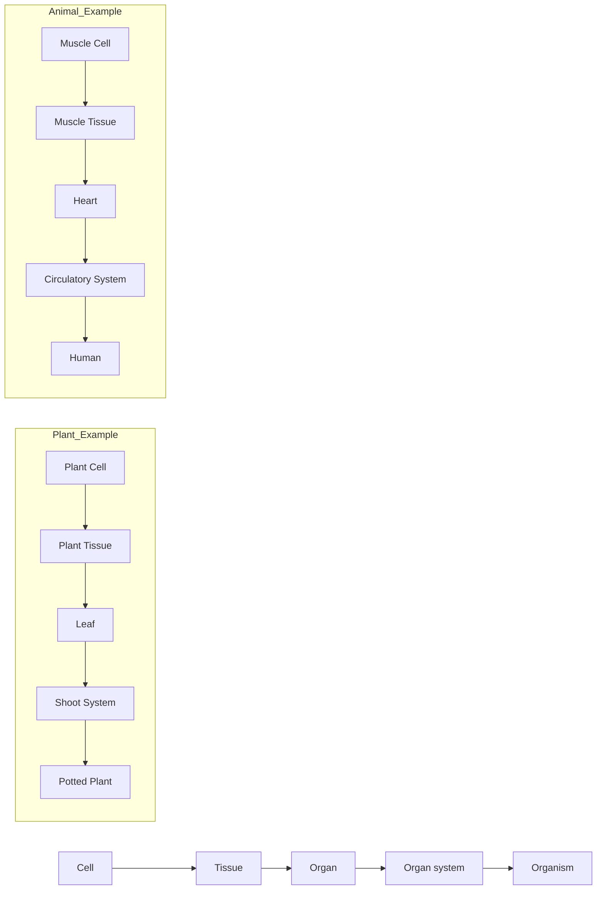

*   Think about the role of bricks in building our homes.
*   What are the bodies of living organisms made of?
*   What are cells and where do they come from?

# 01 Cellular Organization

### Students' Learning Outcomes
**After studying this chapter, students will be able to:**

*   Recognize cells as the basic units of life that are organized into tissues, organs, organ systems and organisms.
*   Arrange and rank different levels of cellular organizations - cells to tissues, organs and organisms.
*   Relate the structures of some common cells (nerve, muscle, epithelium and blood cells) to their functions.
*   Identify the structures present in an animal cell and plant cell as seen under a simple microscope and relate them to their functions (only cell membrane, cytoplasm, nucleus, cell wall, chloroplast, mitochondria and vacuole).
*   Describe the similarities and differences between the structures of plant and animal cells. Sketch the animal and plant cells and label key organelles in each.
*   Compare and contrast an animal cell and plant cell by preparing slides using onion peels and cheek cells.

### VOCABULARY

<table>
  <thead>
    <tr>
        <th>Cell</th>
        <th>Tissue</th>
        <th>Organ</th>
        <th>Organ system</th>
        <th>Organism</th>
    </tr>
  </thead>
  <tbody>
    <tr>
        <td>The basic unit of life</td>
        <td>Organization of similar cells</td>
        <td>Grouping of related tissues</td>
        <td>Coordination of different organs to complete the task</td>
        <td>Association of different organ systems</td>
    </tr>
  </tbody>
</table>
<table>
  <thead>
    <tr>
        <th>Epidermis</th>
        <th>Mitochondria</th>
        <th>Chloroplast</th>
        <th>Xylem</th>
        <th>Phloem</th>
    </tr>
  </thead>
  <tbody>
    <tr>
        <td>Outer covering of organs in plants</td>
        <td>Cell organelles related to produce energy from food</td>
        <td>Cell organelles which store light energy in the form of food</td>
        <td>Plant tissue which conducts water from roots to leaves</td>
        <td>Plant tissue which transports food prepared in leaves</td>
    </tr>
  </tbody>
</table>

# Recall what you have learnt in previous classes

Different body parts (organs) of animals and plants perform different functions. Our brain controls all the functions of our body. Heart pumps blood throughout the body. Stomach facilitates digestion of food. Liver produces chemicals (enzymes) which speed up digestion of food. Lungs conduct the exchange of gases. Kidneys help us to get rid of wastes. Roots in plants absorb water and nutrients from soil. Stem supports the plants and leaves facilitate in making food (**Figure 1.1**).

**Figure 1.1 Different organs in human body and a plant**

The figure shows a human body with various organs labeled:
*   Brain
*   Heart
*   Lungs
*   Liver
*   Stomach
*   Pancreas
*   Kidneys
*   Intestine
*   Bladder

The figure also shows a plant with various parts labeled:
*   Flower
*   Leaf
*   Fruit
*   Stem
*   Root

### Activity 1.1 Assessment

Write '**C**' against correct and '**I**' against incorrect statement in middle column. Also correct the incorrect statement and write it in the next column.

<table>
  <tbody>
    <tr>
        <td>Correct/Incorrect</td>
        <td>C/I</td>
        <td>Correct statement</td>
    </tr>
    <tr>
        <th>Different organs of the animals and plants have different shapes.</th>
        <th></th>
        <th></th>
    </tr>
    <tr>
        <th>Different organs of animals and plants perform same functions (jobs).</th>
        <th></th>
        <th></th>
    </tr>
    <tr>
        <th>Roots in plants absorb water and minerals from the soil.</th>
        <th colspan="2"></th>
    </tr>
  </tbody>
</table>

### Activity 1.2 Light Microscope

*   Look at the picture of a light microscope. It is an instrument used to see very small things which are not seen with naked eyes.

The image shows a light microscope with its various parts labeled:

*   **Eyepiece**: The lens at the top that you look through.
*   **Body tube**: Connects the eyepiece to the objective lenses.
*   **Coarse adjustment screw**: Used for initial focusing of the specimen.
*   **Fine adjustment screw**: Used for precise focusing of the specimen.
*   **Objective lenses**: Lenses with different magnification powers.
*   **Arm**: Supports the body tube and connects it to the base.
*   **Stage**: The flat platform where the slide is placed.
*   **Mirror**: Reflects light upwards through the specimen.
*   **Base**: The bottom support of the microscope.

*   Request your teacher explain different parts of the microscope and make you learn how to use it.

Here in this chapter, we will learn about the basic structural and functional units of living bodies.

### Inquiry 1.1

Think and discuss with your teacher and classmates:
*   What are bricks?
*   How are bricks organized in building your home?
*   Do the bricks eat food, breathe in air, grow and reproduce?

The following diagram illustrates the organization of bricks into a house:

*   What are the basic units that build up bodies of living organisms, i.e., plants, animals and microorganisms?

# 1.1 CELLS

The concept of cell has been taken from the cells of a honeycomb consisting of numerous small boxes/rooms **(Figure 1.2)**

A cell is defined as the structural as well as functional unit of the living organisms. An adult animal or plant consists of trillions of cells. There are about 50 to 60 trillion cells in an adult human body. Cells are too small to see through naked eyes. Microscopic structures of plant and animal cells are shown below **(Figure 1.3)**.

The image shows a close-up of a honeycomb with its characteristic hexagonal wax cells.
**Figure 1.2 Cells in a honeycomb**

The following diagrams illustrate the microscopic structures of a plant cell and an animal cell with their respective organelles labeled:

**Plant Cell**
*   Cell wall (outermost layer)
*   Cell membrane (inner layer)
*   Chloroplast
*   Golgi complex
*   Vacuole (large central)
*   Nucleus
*   Nucleolus
*   Cytoplasm
*   Mitochondria
*   Endoplasmic reticulum
*   Ribosomes

**Animal Cell**
*   Cell membrane (outermost layer)
*   Centrioles
*   Endoplasmic reticulum
*   Ribosomes
*   Golgi complex
*   Mitochondria
*   Cytoplasm
*   Nucleolus
*   Nucleus
*   Vacuoles (small)

**Figure 1.3 Microscopic structures of a plant cell and an animal cell**

### 1.1.1 Cell Organelles
Different structures or parts of the cells are called **cell organelles**. Some common cell organelles as seen under light microscope and their functions are as follows:

#### Cell wall
Cell wall is present in the cells of plants, algae, fungi and bacteria. It is not present in animal cells. It makes the outer covering of the cells. In plant cells, it is mainly composed of cellulose. It supports the cell and maintains its shape.

The diagram shows a simplified plant cell highlighting the following parts:
*   Cell wall
*   Cell membrane
*   Chloroplast
*   Nucleus
*   Vacuole
*   Cytoplasm
*   Mitochondrion

**Figure 1.4 Cell wall and cell membrane in a plant cell**

### Cell membrane
In animal cells, the outermost covering of the cell is called cell membrane. It is partially permeable and is also called **plasma membrane**. It separates the interior of the cells from the outer environment. In plant cell, it is found inside the cell wall (**Figure 1.4**). Cell membrane is composed of lipids and proteins. Things enter or leave the cell by passing across the cell membrane.

### Nucleus
Nucleus is the most important cell organelle. In animal cells, it is located almost in the centre of the cell (**Figure 1.5**). In plant cells, a large vacuole pushes it to one side of the cell. Nucleus acts as brain of the cell and controls all its functions. Nucleus is also bounded by a membrane called **nuclear membrane**. The material inside the nucleus is called **nucleoplasm**. Nucleoplasm contains thread like structures called **chromosomes**. Chromosomes are made up of DNA and protein.

The image shows a diagram of an animal cell with various organelles labeled:
- Golgi complex
- Vacuole
- Ribosomes
- Cell membrane
- Cytoplasm
- Endoplasmic reticulum
- Nucleus
- Nucleolus
- Nuclear membrane
- Mitochondrion
- Centrioles

**Figure 1.5 Nucleus in an animal cell**

You will learn about DNA in detail in higher classes. The nucleus also contains one or more small darkly coloured areas called **nucleoli** (singular: **nucleolus**).

### Cytoplasm
The content of the cell covered by cell membrane is called **cytoplasm**. It is a semi-viscous material that mainly consists of water, salts and proteins, etc. Most of the cell functions take place in cytoplasm. It facilitates the cell organelles floating in it to function properly.

### Chloroplast
Plant cells have **chloroplasts** containing green pigment called **chlorophyll** (**Figure 1.6**). This is the reason that the parts of the plants with chloroplasts in their cells look green. Chlorophyll absorbs energy from sunlight which is used in photosynthesis for production of food. Chloroplasts are thus called **food producers** in plant cells. Chloroplasts are not present in animal cells.

> **Do you know?**
> * Endoplasmic reticulum is a network of tubular membranes present in the cytoplasm of the cell. These are involved in transport of materials from one place to another in the cell.
> * Ribosomes are tiny structures in the cytoplasm which play important role in making proteins from amino acids.
> * Centrioles are two cylindrical bodies found close to each other near the nucleus in an animal cell. These are not found in plant cell. They play an important role by moving towards the opposite poles of the nucleus at the time of cell division.

The image shows a series of diagrams illustrating plant cell structures. A plant leaf is shown with a cross-section highlighting the following parts:
*   Cuticle
*   Upper Epidermis
*   Stoma

A single plant cell is magnified from the tissue, showing:
*   Chloroplast
*   Nucleus
*   Vacuole
*   Cell wall

A further magnification shows the internal structure of a **Chloroplast**.

**Figure 1.6 Chloroplast in plant cell**

### Mitochondria
Mitochondria are rod shaped and double membranous cell organelles present in the cytoplasm of a cell (**Figure 1.7**). The inner membrane in mitochondria has finger like structures called **cristae**. Mitochondria are known as power generators in the cells. This is because, energy producing reactions are taking place in the mitochondria. During respiration, oxygen reacts with food to produce energy.

The diagram of an animal cell shows various organelles:
*   Nucleolus
*   Nucleus
*   Cytoplasm
*   Mitochondrion
*   Golgi complex
*   Cell membrane

A detailed view of a **Mitochondrion** shows:
*   Inner membrane
*   Outer membrane
*   Cristae

**Figure 1.7 Mitochondrion in an animal cell**

### Vacuole
Cytoplasm of a plant cell contains a large organelle filled with water, food molecules and many other substances called **vacuole**. It helps to maintain the shape of plant cell. It helps the plants in growth. Animal cell contains many small vacuoles that store nutrients. Vacuoles can also store waste products to keep rest of the cell protected from their poisonous effects.

# Think Tank

Write what you think about and learn from the Figure given below:

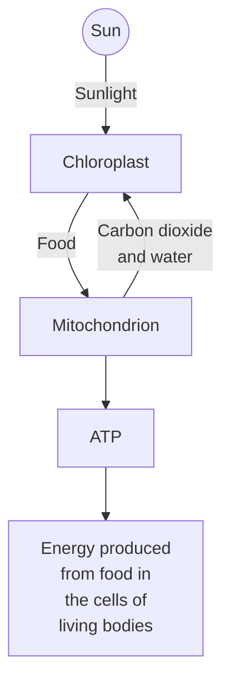

(Write your comments on your notebook and request your teacher to check and correct your comments.)

## Activity 1.3 Compare and contrast

*   Examine the structures given in Figure 1.3.
*   Describe the similarities and differences between an animal and a plant cell.

A Venn diagram is shown with two overlapping circles:
*   Left circle: **Plant cell**
*   Overlapping section: **Similarities**
*   Right circle: **Animal cell**

## Activity 1.4 Microscopic study

**Teacher Guide**
Facilitate students as under:
*   Provide prepared slides of animal and plant cells and help them examine these cells under light microscope.
*   Help them sketch animal and plant cells and label key organelles in each.

An illustration shows a student looking through a light microscope.

### Informative

*   Uni means one or single. Unicellular means single celled. Some organisms like bacteria, amoeba, euglena, paramecium and chlamydomonas, etc. are single celled organisms. These single cells can perform all the functions of their life independently, i.e., they can move, they can get food; they can breathe, grow and reproduce. Such organisms are called unicellular organisms.
*   Multicellular organisms are those whose bodies consist of many cells. Animals and plants are the examples of multicellular organisms.

The following images represent various unicellular organisms:
- **Amoeba**: An irregular-shaped cell with a nucleus and pseudopodia.
- **Euglena**: An elongated green cell with a flagellum.
- **Paramecium**: A slipper-shaped cell covered in cilia.
- **Bacteria**: A rod-shaped cell with flagella.
- **Chlamydomonas**: A spherical green cell with two flagella.

### Activity 1.5 Microscopic study

**Teacher Guide**
Facilitate students as under:
*   Take a drop of water from a pond and put it on the glass slide.
*   Examine the unicellular organisms present in the drop of pond water.
*   Draw sketches of the organisms you examined.

The illustration shows a student looking through a microscope at a slide, with a thought bubble showing a microscopic organism (Paramecium).

### 1.1.2 Shapes and functions of human body cells

Cells forming different structures or parts in human body are different in their shapes (**Figure 1.8**). Different shaped cells perform different functions.

**Muscle cells** are long and cylindrical. Their cylindrical shape helps them contract and relax to produce movement. **Nerve cells or neurons** are long and branched. They send messages from one part of the body to another. **Red blood cells** are disc shaped and filled with red coloured pigment 'haemoglobin'. Haemoglobin can attach oxygen or carbon dioxide. Due to haemoglobin, red blood cells take up oxygen from lungs and transport it to all the other body cells. On the other side red blood cells take up carbon dioxide from all the body cells and carry it to the lungs for its removal from the body. **White blood cells** are irregular in shapes. They help the body fight infection and other diseases. **Epithelial cells** are flat tile-shaped or cube-shaped. They are used to form sheets or layers, e.g., outermost layer of skin or inner lining of the intestine. **Bone cells** are flat, short and irregular in shape. They give shape and provide support to body parts.

Reproductive cells (sperms or eggs/ova) are used in sexual reproduction. We will learn about sexual reproduction in plants in next chapter.

The image shows various types of cells found in the human body:
*   **Nerve cell:** A long, branched cell with a central body and long extensions.
*   **Red blood cell:** A circular, biconcave disc-shaped cell.
*   **Epithelial cells:** Rectangular or column-shaped cells arranged closely together.
*   **Bone cell:** A star-shaped cell with many radiating processes.
*   **White blood cell:** A spherical cell with a granular interior.
*   **Muscle cell:** A long, spindle-shaped cell.
*   **Egg:** A large, spherical cell.
*   **Sperm cell:** A small cell with a head and a long, whip-like tail.

**Figure 1.8 Different shaped cells in human body**

### 1.1.3 Shapes and functions of plant cells
Cells forming different structures or parts in plants are different in their shapes. Different shaped cells in the leaf of a plant as shown below (Figure 1.9) perform different functions.

The image shows a cross-section of a plant leaf with various cell types labeled:
*   **Xylem cells:** Tubular structures for water transport.
*   **Upper epidermis:** The outermost layer of cells on the top of the leaf.
*   **Palisade mesophyll cells:** Elongated cells located just below the upper epidermis.
*   **Spongy mesophyll cells:** Irregularly shaped cells with air spaces between them.
*   **Lower epidermis:** The outermost layer of cells on the bottom of the leaf.
*   **Air space:** Gaps between spongy mesophyll cells.
*   **Phloem cells:** Tubular structures for food transport.
*   **Guard cells:** Kidney-shaped cells surrounding a stoma.
*   **Stoma:** A pore in the leaf surface for gas exchange.

**Figure 1.9 Cells of different shapes in a plant leaf**

**Epidermal cells** are tile-like, which form protective layers (upper epidermis and lower epidermis. **Mesophyll cells** are elongated or irregularly shaped. Their function is to prepare food. **Xylem cells** are tubular in shape used to conduct water. **Phloem cells** are also tubular in shape used for transport of food. **Guard cells** are kidney shaped which form pores in leaves called **stomata** for

exchange of gases and removal of water.

### 1.1.4 Levels of cellular organization
In multicellular organisms, cells with similar shapes and structures are organized for doing a particular job. Such an organization of cells is called **tissue**. Different tissues are organized for doing related jobs. Such organization of tissues forms an **organ**. Different organs are linked in different **organ systems** for performing different functions in the body of an **organism (Figure 1.10)**.

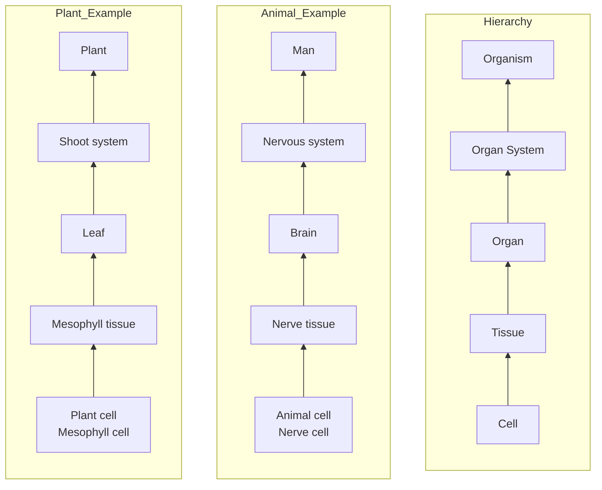
**Figure 1.10 Cellular levels from cell to organ system**

## 1.2 TISSUES
### 1.2.1 Plant Tissues
Plant cells are mostly rectangular in shape. Their shape is maintained due to rigid cell wall surrounding them and a large vacuole in the cytoplasm. Similar cells group together to form a tissue.

### Epidermal Tissue
Outer protective layer in roots, stem and leaves of plants is called **epidermis**. It is formed by tile-like cells, which are joined together to form single layered tissue called epidermis (**Figure 1.11**). The cells forming epidermal tissue are called epidermal cells.

### Mesophyll Tissue
Mesophyll tissue is also called photosynthetic tissue. It is specialized to prepare food and remove wastes. It is located between upper and lower epidermal layers in the leaves (**Figure 1.11**). Cells forming mesophyll tissue are called mesophyll cells. Palisade mesophyll cells are elongated and tightly packed together forming a layer beneath the upper epidermis. These cells are rich in chloroplasts and prepare food during photosynthesis. Spongy mesophyll cells are loosely arranged with air spaces among them. Spongy mesophyll is located below the palisade layer and above the lower epidermis. Photosynthesis also takes place in spongy mesophyll cells.

**Figure 1.11 Epidermal tissue**
The diagram shows a cross-section of a leaf with the following labeled parts:
*   Upper epidermis
*   Mesophyll (consisting of Palisade mesophyll and Spongy mesophyll)
*   Xylem
*   Phloem
*   Air space
*   Lower epidermis
*   Stoma

### Vascular Tissue
Vascular tissue is a complex tissue. It consists of two types of cells called xylem and phloem cells (**Figure 1.12**). Xylem and phloem cells are tubular in shape. Xylem cells form xylem tissue which conducts water from roots to leaves and phloem cells form phloem tissue which transports food from leaves to other parts of the plant. Xylem and phloem run parallel in plant bodies.

**Figure 1.12 Xylem and phloem tissues in plants**
The figure contains two parts:
(a) **Xylem**: Shows a diagram of Vessel and Tracheid. A plant diagram shows "Water and minerals" moving up from the roots.
(b) **Phloem**: Shows a diagram of Sieve tube and Companion cells. A plant diagram shows "Photosynthesis products" moving through the plant.

---

#### Activity 1.6 Preparing slides of onion cells
**Teacher Guide**
Facilitate students:
*   Manage the material, e.g., onion, needle, glass slide, cover slips, blotting paper, dropper, microscope, iodine solution, water, etc.
*   Prepare a slide of onion layer (tissue) following the procedure as under:
1.  Take a glass slide and put a water drop on its center.
2.  Peel off a thin layer from onion and place it at the center of the slide on water drop. Then, pour a little drop of iodine solution on the onion layer.
3.  Place a cover slip over the onion layer on glass slide.

The illustration shows hands using a needle to peel a thin layer from an onion, captioned "**Peeling onion skin**".

4. Conduct a microscopic study of the cells in the tissue forming onion layer.
5. Draw the diagram of cells in onion layer tissue you examined.

# Scientific Investigation

**Teacher Guide**
Facilitate the students:
Conduct a research work using the facilities in school library or internet facility to:
* Learn about xylem and phloem with reference to their:
  (a) location
  (b) composition
  (c) importance
* Relate the structures of xylem and phloem to the function they perform in the plant life.

### 1.2.2 Animal Tissues
Animal tissues include epithelial tissue, muscle tissue, nerve tissue, blood tissue, etc.

#### Epithelial Tissue
Epithelial tissue consists of epithelial cells, which are packed closely to form flat sheets or layers. This tissue makes the surface layer of skin and inner linings of the tubes or cavities in the body. Skin cells are like the tiles and are tightly attached to one another. They make a protective cover (skin) over the body (**Figure 1.13**).

The diagram of human skin layers shows:
* **Epidermis**: The outermost layer.
* **Dermis**: The middle layer containing glands and vessels.
* **Hypodermis**: The innermost layer.
**Figure 1.13 Layers of human skin**

#### Muscle Tissue
Muscle tissue consists of muscle cells (**Figure 1.14**). They have ability to contract and relax to produce movement. Cardiac muscles in the heart make the heart beat to pump blood for its circulation in the body. Skeletal muscles cause movement in bones.

Smooth muscles are present inside the body to cause movement in different organs.

The diagram of muscle tissue shows:
* **Cardiac muscle cell**: Branched cells found in the heart.
* **Skeletal muscle cell**: Long, striated cells attached to bones.
* **Smooth muscle cell**: Spindle-shaped cells found in internal organs like the stomach.
**Figure 1.14 Muscle tissue**

#### Nervous tissue
Each neuron has branched endings and a long fibre (**Figure 1.15**). Neurons forms nervous tissue to transmit messages from one part of the body to another.

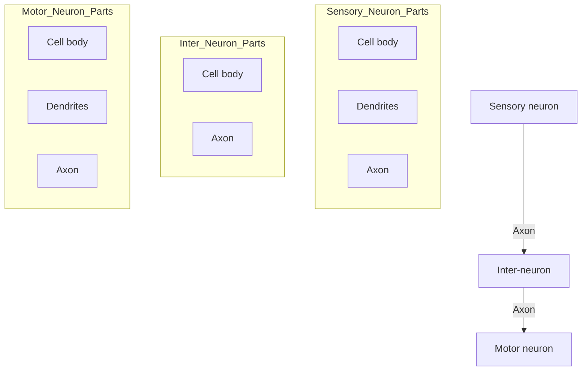
**Figure 1.15 Nerve tissue**

### Blood Tissue (Connective tissue)
Blood is a type of connective tissue consisting of blood cells. Blood tissue consists of blood cells (**Figure 1.16**). Blood circulates throughout the body to transport different materials from one part of the body to another. Red blood cells are round and flattened. They carry oxygen from lungs to the whole body cells. They also bring carbon dioxide from body cells to the lungs for breathing it out. White blood cells kill disease causing germs. Platelets make clots at injured parts to stop bleeding.

Plasma helps the body recover from injury, distributes nutrients, removes waste and prevents infection.

<table>
    <tr>
        <th>Blood Component</th>
        <th>Description</th>
    </tr>
    <tr>
        <td>**White blood cell**</td>
        <td>Irregularly shaped cells that kill germs.</td>
    </tr>
    <tr>
        <td>**Red blood cell**</td>
        <td>Round, flattened cells that carry oxygen.</td>
    </tr>
    <tr>
        <td>**Platelet**</td>
        <td>Small cell fragments that help in blood clotting.</td>
    </tr>
    <tr>
        <td>**Plasma**</td>
        <td>The liquid part of blood that carries nutrients and waste.</td>
    </tr>
</table>**Figure 1.16 Blood tissue**

---

### Activity 1.7 Preparing slide of cheek cells

**Teacher Guide**
Facilitate students to:
*   Manage the material, e.g., sterile cotton swabs, glass slide, plastic cover slip, tissue papers, pipette or dropper, methylene blue solution, microscope, etc.
*   Prepare a slide of human cheek cells following the procedure as under:

1.  Scrap inside of your mouth using a sterile cotton swab.
2.  Smear the cotton swab on the glass slide.
3.  Add a small drop of methylene blue solution on the specimen.
4.  Place a cover slip on the specimen.
5.  Remove the extra methylene blue solution by touching one side of the cover slip with tissue paper.
6.  Observe the specimen under microscope.
7.  Draw the sketch of the human cheek cells you examined under microscope.

**Diagram of Human Cheek Cells:**
The diagram shows several interconnected cheek cells with the following labeled parts:
*   **Nuclear membrane:** The boundary of the nucleus.
*   **Cytoplasm:** The jelly-like substance inside the cell.
*   **Cell membrane:** The outer boundary of the cell.
*   **Nucleus:** The dark, central organelle of the cell.

### Scientific Investigation
Facilitate students investigate different levels of cellular organization shown below:

The following diagram illustrates the levels of organization in a plant:
1. **Root hair cell**: A single specialized cell.
2. **Tissue**: A group of similar cells working together.
3. **Organ**: Different tissues organized to perform a specific function (e.g., a root tip).
4. **Organ system**: A group of organs working together (e.g., the root system).
5. **Organism**: The complete living plant.

## 1.3 ORGANS AND ORGAN SYSTEMS
In higher plants and animals, different tissues are organized for doing related jobs. Such an organization of tissues forms an **organ**. Different organs are linked to form an organ system.

### 1.3.1 Organs and organ systems in plants
**Root and shoot system in plants**
Root, stem, leaf and flower etc., are different organs in plants (**Figure 1.17**). Root and its branches make **root system** in plants which absorbs water and nutrients from the soil. Stem, its branches and flowers make the **shoot system** in plants. It supports the whole plant structure, vascular system for conduction water and transport of food and the reproduction system.

The following diagram (**Figure 1.17**) shows the organs and organ systems in a plant:
*   **Shoot system**: Includes the flower, leaves, and stem (above ground).
*   **Root system**: Includes the primary and secondary roots (below ground).

**Figure 1.17 Organs and organ systems in a plant**

### Scientific Investigation
**Teacher Guide**
Facilitate students conduct research work as under using library and internet facility:
*   Study the internal structure of root, stem and leaf.
*   Relate the internal structure of root, stem and leaf to their functions.

The following diagram shows the internal structures of plant organs:
*   **Internal Structure of Leaf**: Cross-section showing internal tissues of a leaf.
*   **Internal Structure of Stem**: Cross-section showing vascular bundles and other tissues in a stem.
*   **Internal Structure of Root**: Cross-section showing the arrangement of tissues in a root.

### 1.3.1 Organs and organ systems in human body
Different organ systems such as digestive system, breathing system, blood circulatory system and excretory system consisting of different organs work together in human body to keep it alive **(Figure 1.18)**

The following diagrams illustrate four major organ systems in the human body:

#### Breathing system
*   **Nasal cavity**
*   **Pharynx**
*   **Trachea**
*   **Larynx**
*   **Lungs**
*   **Bronchioles**
*   **Bronchus**
*   **Air sacs**

#### Digestive system
*   **Mouth**
*   **Salivary glands**
*   **Oral cavity**
*   **Oesophagus**
*   **Liver**
*   **Stomach**
*   **Pancreas**
*   **Small intestine**
*   **Large intestine**
*   **Rectum**
*   **Anus**

#### Excretory system
*   **Renal artery**
*   **Renal vein**
*   **Right kidney**
*   **Left kidney**
*   **Dorsal aorta**
*   **Ureter**
*   **Urinary bladder**
*   **Urethra**

#### Blood circulatory system
*   **Lung**
*   **Heart**
*   **Blood Vessels**

**Figure 1.18 Different organ systems of human body**

# Inquiry 1.2

Think and discuss with your teacher and classmates, the functions of the organs involved in the following organ systems in man.

1. Digestive system
2. Breathing system
3. Blood circulatory system
4. Excretory systm

# Activity 1.8 Assessment

(i) List the tissues and organs involved to form root system in plants.

<table>
  <thead>
    <tr>
        <th>Tissues</th>
        <th>Organs</th>
    </tr>
  </thead>
</table>

(ii) List the tissues and organs involved to form shoot system in plants.

<table>
  <thead>
    <tr>
        <th>Tissues</th>
        <th>Organs</th>
    </tr>
  </thead>
</table>

# KEY POINTS

* The structural as well as functional unit of the living organisms is called cell.
* Different structures or parts of the cells are called cell organelles.
* Similar cells are organized for doing a particular job. Such an organization of cells is called tissue.
* Outer protective layer in roots, stem and leaves of plants is called epidermis. It is formed by tile-like cells which are joined together to form single layered tissue called epidermal tissue.
* Epidermal tissue forming upper layer in the leaf structure is called upper epidermis and that forming lower layer is called lower epidermis.
* The cells forming epidermal tissue are called epidermal cells.

*   Mesophyll tissue is also called photosynthetic tissue. It is related to prepare food.
*   Vascular tissue is a complex tissue. It consists of two types of cells called xylem and phloem cells.
*   Xylem and phloem cells are tubular in shape. Xylem cells form xylem tissue which conducts water from roots to leaves and phloem cells form phloem tissue which transports food from leaves to other parts of the plant.
*   In epithelial tissue, cells are packed closely to form flat sheets or layers. This tissue makes the surface layer of skin and inner linings of the tubes or cavities in human body.
*   Muscle tissue consists of muscle cells which contract and relax to produce movement in the body.
*   Neurons form nerve tissue. neuron cells have branched endings and a long fibre. They transmit messages from one part of the body to another.
*   Different tissues are organized for doing related jobs. Such an organization of tissues forms an organ.
*   Different organs are linked in an organ system for a particular function.

# QUESTIONS

**1.1 Encircle the correct option.**

1.  **An animal cell has:**
    a. single vacuole
    b. two vacuoles
    c. many vacuoles
    d. no vacuole

2.  **Mitochondria are the cell organelles that play role in:**
    a. protein synthesis
    b. food production
    c. producing energy from food
    d. removing waste products

3.  **Chromosomes are present in:**
    a. chloroplast
    b. nucleus
    c. cell wall
    d. vacuole

4.  **Cell membrane is composed of:**
    a. proteins and lipids
    b. cellulose and lipids
    c. cellulose and proteins
    d. lipids

5.  **Chlorophyll is a pigment whose colour is:**
    a. red
    b. blue
    c. yellow
    d. green

6.  **Human skin is made of:**
    a. muscle tissue
    b. blood tissue
    c. epidermal tissue
    d. epithelial tissue

7.  **Oxygen is carried from lungs and supplied to the whole body by:**
    a. white blood cells
    b. red blood cells
    c. platelets
    d. bone cells

8.  **Site for respiration in a cell is:**
    a. nucleus
    b. endoplasmic reticulum
    c. chloroplast
    d. mitochondria

9. **Water is conducted from roots to leaves by:**
   a. xylem
   b. phloem
   c. epidermis
   d. mesophyll

10. **Kidneys perform functions related to:**
    a. digestive system
    b. breathing system
    c. circulatory system
    d. excretory system

### 1.2 Give short answers.
1. Name the cell organelle that controls the whole cell activity.
2. Write the function of blood in human body.
3. Enlist the organs involved in blood circulatory system in man.
4. Name the red coloured pigment present in red blood cells.

### 1.3 Differentiate between:
1. Animal cell and plant cell
2. Cytoplasm and nucleoplasm
3. Xylem and phloem
4. Epidermal tissue and epithelial tissue
5. Root system and shoot system in plants

### 1.4 Constructed Response Questions
1. Relate the structures of the following with the functions they perform.
   (a) Cell wall
   (b) Nerve cells
   (c) Xylem
   (d) Phloem
   (e) Vacuole in plant cell

2. Identify the organization of main tissues in the following and state their functions:

The image shows two diagrams:
(a) An illustration of a human arm lifting a dumbbell, highlighting the interaction between muscles and bones.
(b) An illustration of a plant in a pot with cross-sections of xylem and phloem tissues shown on either side.

### 1.5 Investigate
1. Function of muscle tissues in:
   (a) Heart
   (b) Stomach
   (c) Eye
2. Structure and functions of the following in plants:
   (a) Epidermal tissue
   (b) Mesophyll tissue
   (c) Chloroplast

### 1.6 Project
Make a simple microscope using no cost / low cost material with the help of your teacher and use it to examine the venation on plant leaves and different body parts of insects.

An illustration at the top shows a bee flying between two red flowers, with green arrows indicating a cycle and yellow pollen grains being transferred.

Three circular callouts contain the following questions:
*   Where do living things come from?
*   How do parts of the plants grow into new plants?
*   Why are flowers important?

# 02 Reproduction in Plants

## Students Learning Outcomes
**After studying this chapter, students will be able to:**

*   Describe different types of reproduction of plants.
*   Compare and contrast types of reproduction (sexual and asexual) in plants.
*   Distinguish between artificial and natural asexual reproduction in plants. (Budding, grafting, Bulbs, Tuber, Runners, cutting, and layering.)
*   Inquire how artificial propagation can lead to better quality yield in agriculture.

## VOCABULARY

<table>
  <tbody>
    <tr>
        <td>Species</td>
        <td>Gametes</td>
        <td>Pollination</td>
        <td>Stamen</td>
    </tr>
    <tr>
        <td>A group of organisms having a very large number of similarities.</td>
        <td>Reproductive cells (sperms or eggs)</td>
        <td>Transfer of pollen grains from anther of stamen to the stigma of the carpel</td>
        <td>Male reproductive part of the flower</td>
    </tr>
    <tr>
        <td>Carpel</td>
        <td>Zygote</td>
        <td>Grafting</td>
        <td>Tuber</td>
    </tr>
    <tr>
        <td>Female reproductive part of the flower.</td>
        <td>The cell produced by the fusion of gametes (sperm and egg)</td>
        <td>Artificial vegetative propagation (asexual reproduction) in plants.</td>
        <td>An underground stem which develops into new plant asexually</td>
    </tr>
  </tbody>
</table>

# Recall what you have learnt in previous classes

We have learnt about flowers which are reproductive organs in plants (**Figure 2.1**).

The image shows a diagram of a flower with its various parts labeled:
*   **Stamen** (Male reproductive part):
    *   Anther
    *   Filament
*   **Carpel** (Female reproductive part):
    *   Stigma
    *   Style
    *   Ovary
*   **Other parts**:
    *   Petal
    *   Sepal
    *   Ovule
    *   Pedicel

**Figure 2.1 Structure of a flower**

**Stamens** are the male reproductive parts of a flower and **carpels** are the female reproductive parts of the flower. Male reproductive parts of an organism produce **male gametes (sperms)** and female reproductive parts produce **female gametes (eggs or ova)**. In this chapter we will learn in detail, the process of reproduction in plants.

### Activity 2.1 Assessment
Write '**C**' against correct and '**I**' against incorrect statement in middle column. Also correct the incorrect statement and write it in the next column.

<table>
  <tbody>
    <tr>
        <td>Correct / Incorrect</td>
        <td>C / I</td>
        <td>Correct statement</td>
    </tr>
    <tr>
        <th>Pollen grains produced in the anther of a stamen are female reproductive cells containing female reproductive nuclei.</th>
        <th></th>
        <th></th>
    </tr>
    <tr>
        <th>Eggs are produced in the ovule, developed in the ovary (a part of the carpel) of a flower.</th>
        <th></th>
        <th></th>
    </tr>
    <tr>
        <th>Sperm cells are also called male sex cells.</th>
        <th></th>
        <th></th>
    </tr>
    <tr>
        <th>Ova or eggs are also called male sex cells.</th>
        <th colspan="2"></th>
    </tr>
  </tbody>
</table>

## 2.1 REPRODUCTION
Living organisms produce their offspring. The process by which living organisms produce offspring is called reproduction. Reproduction is of two types, i.e., sexual reproduction and asexual reproduction.

### 2.1.1 Sexual Reproduction in Plants

Sexual reproduction is a process in which a sperm and egg fuse to form a **zygote**. Zygote develops into embryo which after passing through many developmental stages forms a new organism. Mostly, the flowering plants reproduce sexually.

Sexual reproduction in plants involves the following processes:
* Pollination
* Fertilization
* Seed formation
* Seed germination

#### Pollination

Transfer of pollen grains from the anther of the stamen to the stigma of the carpel is called **pollination (Figure 2.2)**. Transfer of pollen grains from the anther of a flower to the stigma of the same flower **(A)** or to the stigma of another flower on the same plant **(B)** is called **self-pollination**. It takes place in pea, cotton and tomato, etc. Transfer of pollen grains from the anther of a flower to the stigma of the flower on another plant of the same species is called **cross-pollination**. It takes place in maize, papaya and rose, etc.

The image shows two plants with yellow flowers. 
- Arrow **A** shows pollen moving from anther to stigma within the same flower.
- Arrow **B** shows pollen moving from one flower to another flower on the same plant.
- Arrow **C** shows pollen moving from a flower on one plant to a flower on a different plant.

**(A & B) Self pollination, (C) Cross pollination**
**Figure 2.2 Pollination in flowering plants**

During pollination, pollen grains reach the stigma of the carpel. On the stigma, a pollen grain germinates and forms a thin tube called **pollen tube** containing two male gametes. Pollen tube grows, passes down through style and reaches the ovule in the **ovary (Figure 2.3)**.

The diagram illustrates the process of a pollen grain landing on the stigma, growing a pollen tube down the style into the ovary, and entering an ovule.
- **Stigma**: The top part where pollen lands.
- **Style**: The tube connecting stigma to ovary.
- **Ovary**: The base part containing ovules.
- **Pollen grain**: Lands on stigma.
- **Sperms**: Contained within the pollen tube.
- **Pollen tube**: Grows down the style.
- **Ovules**: Located inside the ovary.
- **Micropyle**: Opening in the ovule for the pollen tube.
- **Egg**: Female gamete.
- **Polar nuclei**: Located in the center of the embryo sac.
- **Embryo sac**: Structure inside the ovule.

**Figure 2.3 Transfer of male gamete to the female gamete**

#### Fertilization

In the ovary, pollen tube enters an ovule and releases its sperms in it. One of the two sperms fuses with the egg and forms **zygote**. This process is called **fertilization**. The other sperm fuses with two polar nuclei in the ovule to form a **triploid endosperm**. This is called double fertilization. The triploid endosperm develops to form a food source for the growing embryo.

# Seed formation

After fertilization, sepals, petals and stamens dry up and fall. Zygote develops into **embryo**. The ovule containing embryo forms **seed**. Ovary grows large and develops into a **fruit**. Fruit Protects seed(s). During seed formation, the ovule containing embryo, expands. The embryo gradually develops into **cotyledon(s), plumule** and **radicle (Figure 2.4)**. Cotyledon contains food for the embryo.

**Figure 2.4 Seed formation**
The diagram shows a cross-section of a developing seed with the following parts labeled:
- **Embryo** (consisting of):
    - Cotyledon
    - Plumule
    - Radicle
- **Embryo sac**
- **Testa (Seed coat)**

# Seed dispersal

Seeds of some plants are dispersed or carried to other places through animals, wind and water, etc. **(Figure 2.5)**.

**Figure 2.5 Seed dispersal**
The figure illustrates three methods of seed dispersal:
- **Seed dispersal by wind**: Shown by a sunflower with seeds blowing away.
- **Seed dispersal by water**: Shown by water lilies in a pond.
- **Seed dispersal by animal**: Shown by a bird carrying a seed in its beak.

# Seed germination

Seeds after their formation are dispersed through different means or sown in the soil for germination and grow into young plant. As shown in the bean seed structure **(Figure 2.6)**, radicle germinates to form root which grows into soil for water and salt absorption. Hypocotyl part of the plumule connects the plumule with radicle and epicotyl part of the plumule germinates to grow as leaves and stem of

**Figure 2.6 Bean seed structure**
The diagram shows the internal structure of a bean seed with the following parts labeled:
- **Seed coat**
- **Plumule** (consisting of):
    - Epicotyle
    - Hypocotyle
- **Radicle**
- **Cotyledon**

the shoot (Figure 2.7). Cotyledons form the first leaflets of seed. These leaflets provide food to the growing roots and shoot till the new leaves appear on the stem.

Figure 2.7 Germination of seed

### Scientific Investigation

Facilitate Students investigate as under:
- Search and arrange the flowers of China rose.
- Count the number of carpels in a flower

### Do you know?

1. Male parts (stamens) and female parts (carpels) are on separate plants in papaya. This is the reason it does not undergo self-pollination.
2. Number of ovules per ovary varies from plant to plant. There is only one ovule per ovary in the maize plant.

### Activity 2.3 Assessment

**Teacher Guide**

Write 'C' against correct and 'I' against incorrect statement in middle column. Also correct the incorrect statement and write it in the next column.

<table>
    <tr>
        <th>Correct / Incorrect</th>
        <th>C / I</th>
        <th>Correct statement</th>
    </tr>
    <tr>
        <td>China rose flowers always have only one carpel.</td>
        <td></td>
        <td></td>
    </tr>
    <tr>
        <td>Sexual reproduction involves male and female body parts (organs).</td>
        <td></td>
        <td></td>
    </tr>
    <tr>
        <td>Male gametes are formed in the ovule.</td>
        <td></td>
        <td></td>
    </tr>
</table>### Activity 2.4 Pollination in plants

**Teacher Guide**

Facilitate students:
Discuss the ways of pollination in plants and brainstorm about the identification of the characteristics of insect pollinated flowers, wind pollinated flowers and water Pollinated flowers.

> **Informative**
>
> The birds and bats also pollinate plants.

23

NOT FOR SALE-PESRP

> ### Activity 2.5
> **Teacher Guide**
> * Facilitate students as under:
> * Bring different flowers in classroom.
>   * ✓ Observe and record as under:
>   * ✓ Number of sepals \_\_\_\_\_\_\_\_ colour of sepals \_\_\_\_\_\_\_\_
>   * ✓ Number of petals \_\_\_\_\_\_\_\_ colour of petals \_\_\_\_\_\_\_\_
>   * ✓ Number of stamens \_\_\_\_\_\_\_\_ colour of stamens \_\_\_\_\_\_\_\_
>   * ✓ Number of carpels \_\_\_\_\_\_\_\_ colour of carpels \_\_\_\_\_\_\_\_
> * Dissect different parts of each flower, examine and draw sketch of each part.

### 2.1.2 Asexual Reproduction in Plants
Asexual reproduction is a process of producing offspring/ (young ones) which does not involve fusion of male and female gametes and formation of zygote. Asexual reproduction in plants is also termed as **vegetative propagation**. This is because, during this process, vegetative parts, i.e., roots, stem and leaves of the parent plant can grow into new plants. Plants reproduce asexually through natural **vegetative propagation**. New plants can also be produced by **artificial vegetative propagation**.

#### Natural vegetative propagation
Underground stems (bulb, tuber, etc.) and the runners are the examples of natural vegetative propagation in plants.

**Bulb**
An underground stem with thick leaves is called **bulb (Figure 2.8)**. The leaves store food. Onion, tulip, and daffodil have bulbs. There is an outgrowth in the centre of the bulb called **bud**, which grows into new plant when buried in the soil.

**Tuber**
Tuber is an underground thick stem of plant as in potato. It has 'eyes' which are actually buds. When pieces of potato having eyes are buried in the soil, new plants develop from them **(Figure 2.9)**.

**Runners**
In some plants such as strawberry and grasses, stems are spread horizontally above the ground. These stems are called **runners**. Runners have nodes where buds are present. New plants grow from these buds **(Figure 2.10)**.

The images on the right side of the page illustrate these concepts:
* **Figure 2.8 Bulb**: Shows a group of flower bulbs and a cross-section of an onion.
* **Figure 2.9 Tuber**: Shows a potato with 'eyes' (buds) and a new potato plant growing from a tuber.
* **Figure 2.10 Runner**: Shows a strawberry plant with a horizontal stem (runner) producing a new plant at a node where it touches the ground.

# Artificial vegetative propagation
Cutting, grafting, budding and layering are the examples of artificial vegetative propagation.

## Cutting
In this process, a part of the plant such as stem having buds on it is cut and planted in the soil (**Figure 2.11**). After some days, buds on the underground part of the cutting grow into roots and the buds on the areal part of the cutting grow to form stem and leaves. Rose, bougainvillea, sugar cane, etc., are the plants that can be grown using this technique.

The image for Figure 2.11 shows a stem being cut from a plant with shears, then the cut piece is planted in a pot where it begins to grow into a new plant.
**Figure 2.11 Cutting**

## Layering
Layering is the process of artificial propagation of plants during which a young branch of the plant is bent to the ground and covered with moist soil (**Figure 2.12**). After a few days, roots grow in the soil from the covered part of the branch. The attached stem with the roots is called **layer**. The branch can now be cut from the parent plant.

The image for Figure 2.12 shows a branch of a plant bent down into the soil and held in place with a peg. Roots are shown developing from the buried section of the branch.
**Figure 2.12 Layering**

## Grafting
Grafting is a technique used to join the cut piece from a plant with some other plant in such a way that both appear to be grown as a single plant (**Figure 2.13**). The cut piece of the plant is called **scion** and the plant to which it is attached is called **stock**. Tissues of both these parts will soon be joined together and grow into new variety of the plant. The stock provides nutrients to the scion.

The image for Figure 2.13 shows three steps: first, a scion being prepared; second, the scion being inserted into the stock; and third, the junction being wrapped securely.
**Figure 2.13 Grafting**

## Budding
Budding is a technique likewise the grafting. In this process, a bud is used as scion (**Figure 2.14**). Grafting and budding techniques are successfully used to get new varieties of mangoes and many other woody and nursery plants. The processes need a great deal of skill. Grafting and budding techniques give hardness, drought-tolerance or disease resistance.

The image for Figure 2.14 shows a close-up of a bud being grafted onto a stem and wrapped with white tape.
**Figure 2.14 Budding**

# Informative

*   Ginger plants grow from **rhizome**. A rhizome is an underground stem having nodes on it. The roots and leaves of the young plant grow from the nodes on rhizome.
*   Some plants like Bryophyllum have buds on the edges of their leaves. If such a leaf is detached from the plant and falls on soil, the buds on it may grow into new plant.

The image shows a ginger (Adrak) rhizome with green shoots and roots, and a leaf of a Bryophyllum plant with small plantlets growing along its edges.

### 2.1.3 Advantages of Artificial Propagation

Rapidly growing population has increased the demand of food; fruit, vegetables, cereals and flowers, etc. It is the artificial vegetative propagation technique which helps us to cope with the heavy demand of food and other agricultural products. Many plants can be grown from single plant using this technique. It is helpful to:

*   Produce better varieties of fruit and vegetables.
*   Grow required food producing plants again and again.
*   Produce seedless fruits, e.g., oranges, grapes, bananas, etc.
*   Combine good characteristics of two different varieties in a new plant.

> **Do you know?**
>
> Bamboo forests cover the huge area. Often all the plants in the bamboo forest are the offspring of a single plant that is reproducing asexually.

### Comparison of asexual and sexual reproduction

<table>
  <thead>
    <tr>
        <th>Asexual reproduction</th>
        <th>Sexual reproduction</th>
    </tr>
  </thead>
  <tbody>
    <tr>
        <td>* Gametes (sperms and eggs) are not formed.</td>
        <td>* Gametes are formed, which fuse to produce new plant.</td>
    </tr>
    <tr>
        <td>* Offspring have characteristics of only one parent.</td>
        <td>* Offspring have the characteristics of both the parent plants.</td>
    </tr>
    <tr>
        <td>* Large number of plants can be produced in short time.</td>
        <td>* Less number of plants can be produced in a limited time.</td>
    </tr>
    <tr>
        <td>* Offspring are identical to the parent.</td>
        <td>* Offspring are not identical to the parents.</td>
    </tr>
  </tbody>
</table>

# Scientific Investigation

**Teacher Guide**
Facilitate students investigate the scope of various professions, e.g., botanists, farmers, gardeners, florists, etc., How can they benefit from the technique of artificial propagation in plants?

# KEY POINTS

*   Reproduction is the process during which living organisms produce offspring.
*   Reproduction is of two types, i.e., sexual reproduction and asexual reproduction.
*   In sexual reproduction, male and female gametes fuse to produce a new organism.
*   In asexual reproduction, there is no fusion of male and female gametes.
*   Flowers are the reproductive organs in plants. Stamens are male parts of a flower; whereas carpels are female parts of the flower.
*   Each stamen consists of a filament and an anther. Male gametes are present in pollen grains which are produced in the anther.
*   Each carpel consists of stigma, style and ovary. Ovary contains ovules. Female gametes (eggs or ova) are present in the ovule.
*   Transfer of pollen grains from anther of stamen to the stigma of carpel is called pollination.
*   On reaching the stigma, pollen grain grows a tube (pollen tube) down in the style to reach the ovule in the ovary.
*   Fusion of male gamete with the female gamete to form a single fertilized egg (zygote) is called fertilization.
*   Vegetative propagation is an asexual reproduction process in which plants use their vegetative parts (root, stem or leaf) to produce new plants.
*   Cutting, grafting, budding and layering are the examples of artificial vegetative propagation.
*   Underground stems (bulb, tuber, etc.) and the runners are the examples of natural vegetative propagation in plants.

# QUESTIONS

**2.1 Encircle the correct option.**

1.  **Pollination is the transfer of:**
    a. sepal
    b. stamen
    c. pollen grain
    d. ovum

2.  **Zygote is formed as a result of:**
    a. self-pollination
    b. cross pollination
    c. fertilization
    d. double fertilization

3.  **Zygote develops into:**
    a. embryo
    b. embryo sac
    c. endosperm
    d. ovule

4.  **Asexual reproduction in which stem of a plant is buried in soil near the parent plant:**
    a. layering
    b. budding
    c. cutting
    d. grafting

5.  **The organ of a plant which takes part in sexual reproduction:**
    a. root
    b. stem
    c. leaf
    d. flower

6.  **The structure which is helpful to carry sperms to the ovary:**
    a. pollen tube
    b. stigma
    c. style
    d. ovary

7. **Which is the example of natural vegetative propagation?**
    a. runners' growth into new plant
    b. budding
    c. cutting
    d. grafting

8. **Production of new plant from underground stem is an example of:**
    a. sexual reproduction
    b. asexual reproduction
    c. self-pollination
    d. cross pollination

9. **Fusion of a sperm with two polar nuclei forms:**
    a. zygote
    b. embryo
    c. ovum
    d. endosperm

10. **Male reproductive cell:**
    a. egg
    b. sperm
    c. neuron
    d. zygote

### 2.2 Differentiate between:
1. Sexual reproduction and asexual reproduction
2. Self-pollination and cross pollination
3. Pollen grain and ovule
4. Fertilization and double fertilization
5. Budding and grafting
6. Scion and stock

### 2.3 Give short answers.
1. Name three self-pollinated plants.
2. Name three cross pollinated plants.
3. Name the underground stems that undergo natural vegetative propagation.
4. What are runners?
5. Name different parts of the carpel (female reproductive structure).

### 2.4 Constructed Response Questions
1. Sexual reproduction in plants involves production and fusion of male and female gametes.
    (a) What are gametes?
    (b) Where are gametes produced in a plant body?
    (c) How do male and female gametes approach each other for fusion?
    (d) Why do male and female gametes fuse with each other?
2. A flower can produce millions of pollen grains and less number of ovules. Why do you think it happens so?
3. What do you think is the most effective way of plants reproduction?
4. Describe the advantages of artificial vegetative propagation in plants.
5. Write a brief note on each of the following:
    (a) Cutting
    (b) Layering
    (c) Grafting
    (d) Budding

### 2.5 Scientific investigation:
**Teacher Guide**
Facilitate students conduct the activity and investigate as under:
1. Visit your school garden or any garden in your locality, observe, select and make a

list of 10 flowering plants.
2. Collect information/ knowledge about each of the 10 plants you selected using your school library or internet facility and record the data as under:

<table>
  <tbody>
    <tr>
        <td>Sr. No.</td>
        <td>Name of plant</td>
        <td>Mode of reproduction it undergoes (sexual, asexual or both)</td>
        <td>Type of pollination it undergoes (self, cross or both)</td>
        <td>Agent of pollination in case the plant undergoes cross pollination</td>
    </tr>
    <tr>
        <th>1</th>
        <th></th>
        <th></th>
        <th></th>
        <th></th>
    </tr>
    <tr>
        <th>2</th>
        <th></th>
        <th></th>
        <th></th>
        <th></th>
    </tr>
    <tr>
        <th>3</th>
        <th></th>
        <th></th>
        <th></th>
        <th></th>
    </tr>
    <tr>
        <th>4</th>
        <th></th>
        <th></th>
        <th></th>
        <th></th>
    </tr>
    <tr>
        <th>5</th>
        <th></th>
        <th></th>
        <th></th>
        <th></th>
    </tr>
    <tr>
        <th>6</th>
        <th></th>
        <th></th>
        <th></th>
        <th></th>
    </tr>
    <tr>
        <th>7</th>
        <th></th>
        <th></th>
        <th></th>
        <th></th>
    </tr>
    <tr>
        <th>8</th>
        <th></th>
        <th></th>
        <th></th>
        <th></th>
    </tr>
    <tr>
        <th>9</th>
        <th></th>
        <th></th>
        <th></th>
        <th></th>
    </tr>
    <tr>
        <th>10</th>
        <th colspan="4"></th>
    </tr>
  </tbody>
</table>

**Note:** Write NA (Not Applicable) in the column where the required information is not relevant to the plant under examination.

## 2.6 Project:
### Teacher Guide
Facilitate students conduct the project activity as under:
* Bring lily and any four other available flowers in the classroom.
* Examine, identify and separate the flower parts of the lily flower.
* Record the number of parts as under:
    1. Sepals = .....................
    2. Petals = .....................
    3. Stamens = .....................
    4. Carpels = .....................
* Open the ovary of the flower and observe what do you find inside?
* Draw a cross-section diagram of the dissected flower and label its parts.
* Conduct a discussion with your teacher and classmates and explain how different parts of a flower take part in the process of reproduction in plants?
* Repeat the above activity using each of the four other flowers you brought in the classroom.

The image shows a close-up photograph of a white lily flower with its petals, stamens, and pistil clearly visible.

The page features two images at the top: a food pyramid showing various food groups (grains, fruits, vegetables, dairy, proteins, and fats/sweets) and a circular plate arrangement of similar food items.

Below the images are three circular callouts with questions:
*   What will you suggest to eat for babies of age group 1 to 10 months?
*   Beef, mutton, butter, etc., are suggested to eat for the people of age group 10 to 40 years.
*   What should we eat regularly and what should we avoid to eat on regular basis?

# 03 Balanced Diet

## Students Learning Outcomes
**After studying this chapter, students will be able to:**

*   Identify the constituents of a balanced diet for humans as including protein, carbohydrates, fats and oils, water, minerals (limited to calcium and iron) and vitamins (limited to A, C and D), and describe the functions of these nutrients.
*   Identify the essential nutrients, their chemical composition, and food sources.
*   Identify and describe essential nutrients' deficiency disorders.
*   Recognize that a healthy diet contains a balance of food stuffs.
*   Correlate diet and fitness.

## VOCABULARY

<table>
  <tbody>
    <tr>
        <td>Nutrients</td>
        <td>Carbohydrates</td>
        <td>Proteins</td>
        <td>Fats</td>
    </tr>
    <tr>
        <td>Useful materials present in food</td>
        <td>Nutrients which are quick source of energy</td>
        <td>Nutrients required for growth, repair, reproduction and many other vital functions</td>
        <td>Nutrients which protect vital body organs and are richest source of energy</td>
    </tr>
  </tbody>
</table>
<table>
  <tbody>
    <tr>
        <td>Diet</td>
        <td>Balanced diet</td>
        <td>Vitamins</td>
    </tr>
    <tr>
        <td>A diet is all that we eat in a day</td>
        <td>Diet containing proper amount of each nutrient required by an individual</td>
        <td>Nutrients required by our body in very small quantities</td>
    </tr>
  </tbody>
</table>

# Recall what you have learnt in previous classes

We have learnt about the following:
* Ways of maintaining good health.
* Balanced diet
* Different food groups (**Figure 3.1**):

The image shows four circles representing different food groups:
1. **Fruit and vegetable group**: Contains various vegetables like cabbage, carrots, tomatoes, and fruits.
2. **Grain group**: Contains bread, rice, pasta, and grains.
3. **Milk and milk products**: Contains milk bottles, yogurt, and cheese.
4. **Meat group**: Contains raw meat, fish, chicken, eggs, and canned beans.

**Figure 3.1 Different food groups**

## Activity 3.1 Assessment

Write '**C**' against the correct and '**I**' against the incorrect statement in the middle column. Also correct the incorrect statement and write it in the next column.

<table>
  <tbody>
    <tr>
        <td>Correct/Incorrect</td>
        <td>C/I</td>
        <td>Correct statement</td>
    </tr>
    <tr>
        <th>Meat group of food includes milk and milk products (butter, cheese, yogurt, etc.)</th>
        <th></th>
        <th></th>
    </tr>
    <tr>
        <th>Grain group of food includes wheat, rice, barley, pearl millet, maize and pulses, etc.</th>
        <th></th>
        <th></th>
    </tr>
    <tr>
        <th>Milk group of food includes beef, mutton, fish, chicken and eggs, etc.</th>
        <th></th>
        <th></th>
    </tr>
    <tr>
        <th>Fruit and vegetable group of food includes fruit such as apple, orange, banana, mango, grapes, papaya, etc., and vegetables such as ladyfinger, turnip, radish, carrot, cabbage and potato, etc.</th>
        <th colspan="2"></th>
    </tr>
  </tbody>
</table>

## Inquiry 3.1

**Teacher Guide**
Facilitate students:
* Conduct an interactive discussion on the following hypothesis:

> **Hypothesis**
>
> **"Eating too many candies daily is not good for our health"**
>
> *   What do you conclude from the discussion?
>
> \____________________________________________________________________________________
>
> \____________________________________________________________________________________

Food provides us energy and nutrients needed for vital processes like growth, repair, reproduction and protection from diseases, etc. We use different types of foods. Most of the food items are immediate sources of energy. Some foods are best for providing nutrients for growth and repair. Some keep us healthy and protect from diseases. So, food items are divided into different food groups. Let us discuss different food groups, their sources and importance.

## 3.1 FOOD GROUPS AND SOURCES
Plants and animals are the main sources of food (**Figure 3.2**). Wheat, rice, vegetables fruits, etc., come from plants. Fish, meat, egg, milk, etc., are obtained from animals. Other foods we use are the products of those got from plants and animals.

The image shows various types of food items arranged in six panels:
1. A variety of fresh vegetables including carrots, tomatoes, and broccoli.
2. A variety of fresh fruits including grapes, bananas, and apples.
3. Fried fish fillets served with lemon wedges and fries.
4. A bowl of cooked white rice.
5. Dairy and poultry products including a pitcher of milk, eggs, and butter.
6. A bowl of meat curry or stew.

**Figure 3.2** Different types of foods

On the basis of nutrients, foods are classified as under:
*   Carbohydrates
*   Proteins
*   Fats
*   Vitamins
*   Minerals

### 3.1.1 Carbohydrates
Glucose, sugar, starch, etc., are the foods belonging to the group called **carbohydrates**. Sugars are present in honey, fruits, milk, etc. Wheat, rice, barley, potato, tomato and other vegetables

**(Figure 3.3)** are rich in carbohydrates called starch.

The image shows various foods rich in carbohydrates:
*   Rice
*   Bread
*   Chapatis
*   Bananas
*   Potatoes

**Figure 3.3 Foods rich in carbohydrates**

Carbohydrates are quick source of energy for our body. Most of the energy needs of our body are met by carbohydrates. So, they work as fuel for our body.

Carbohydrates are made from the elements of carbon, hydrogen and oxygen. On digestion in small intestine, carbohydrates are converted into simple sugars like glucose etc., which are absorbed in the blood through the walls of small intestine. During blood circulation, these glucose molecules are transported to every cell of our body. In mitochondria of our body cells, glucose is oxidized to release energy, carbon dioxide and water.

> **Point to ponder!**
> Why does our body need carbohydrates on daily basis?

$$C_6H_{12}O_6 + O_2 \rightarrow CO_2 + H_2O + \text{Energy}$$
$$\text{Glucose} \quad \text{Oxygen} \quad \text{Carbon dioxide} \quad \text{Water}$$

### 3.1.2 Proteins
Proteins are a food group which provides material for growth, repair and reproduction. Proteins are thus known as building blocks of our body. Meat, eggs, fish, pulses, milk, chicken, nuts, beans, peas, seeds, etc., **(Figure 3.4)** are the foods rich in proteins.

The image shows various foods rich in protein:
*   Pulses
*   Milk
*   Chicken
*   Eggs
*   Fish
*   Meat

**Figure 3.4 Foods rich in protein**

Proteins are made from the elements of carbon, hydrogen, oxygen and nitrogen. On digestion in small intestine, complex protein molecules are converted into simpler units called **amino acids**.

These amino acids are absorbed in blood through the walls of small intestine. During blood circulation, the said amino acids are transported to every body cell. It is the body cells where amino acids are reorganized into special kinds of proteins required for growth, repair and other vital functions. Substances such as **enzymes** and **antibodies** are also made of proteins.

> ### Informative
> Ribosomes are the cell organelles involved in protein synthesis from amino acids.

### 3.1.3 Fats
Butter, oil, animal fat, etc., are a food group known as **fats**. Fats are obtained from animals as well as plants. Milk, butter, ghee, cheese, animal fat, fish oil, etc., (**Figure 3.5**) are fat rich foods obtained from animals. Vegetable oils, such as olive oil, corn oil, coconut oil, mustard oil, etc., are obtained from plant seeds.

The image shows four types of foods rich in fats:
*   **Oil**: A glass bottle of yellow oil with olives next to it.
*   **Butter**: Slices of yellow butter on a white surface.
*   **Nuts**: A variety of mixed nuts including walnuts, almonds, and cashews.
*   **Cheese**: Several wedges and cubes of yellow cheese.

**Figure 3.5 Foods rich in fats**

Fats are stored under our skin and protect our body from the effects of temperature changes. They give safety cover to vital body organs, like heart, brain, kidney and liver. They keep our body warm. Fats are the secondary source of energy. They are used as a source of energy during the shortage of carbohydrates.

> ### Informative
> *   Fats are the richest source of energy. They produce more than two times energy produced by same amount of carbohydrates.
> *   A thick layer of fat under the skin of seals and walruses keeps them warm in the extreme conditions of Polar Regions.
> *   Edible oils are the fats which are liquid at room temperature.

### Scientific Investigation
**Teacher Guide**
Facilitate students to test the hypothesis as under:

**Hypothesis**
Fat containing food leaves mark while rubbing on paper.

**Procedure**
*   Take two pieces of absorbent paper, such as newspaper and mark them 'A' and 'B'.
*   Take a little drop of cooking oil and rub it on the paper 'A'.
*   Take a little drop of water and rub it on the paper 'B'.
*   Let the two samples (A and B) dry.
*   Examine the result of two papers (A and B).
*   Write what do you conclude from the test.

**Conclusion**
__________________________________________________________________________________________________
__________________________________________________________________________________________________

### 3.1.4 Vitamins

Vitamins are the component of food which are needed by our body in very small quantities. Vitamins do not produce energy, but they are essential for growth and proper body functioning. They protect us from diseases and keep our eyes, bones, teeth and gums healthy. Vitamins are of different types and are represented by letters of alphabet, e.g., Vitamin A, B, C, D, E and K. Different vitamins along with their sources and functions are given in **Table 3.1**.

> **Do you know?**
> * Vitamin A, D, E and K are not soluble in water. They are fat soluble.
> * Vitamin B and C are soluble in water.

**Table 3.1 Vitamins, their sources and functions**

<table>
  <thead>
    <tr>
        <th>Vitamin</th>
        <th></th>
        <th>Source</th>
        <th></th>
        <th>Function</th>
        <th></th>
    </tr>
  </thead>
  <tbody>
    <tr>
        <td>A</td>
        <td>Carrots, cod liver oil, etc.</td>
        <td>Keeps eyes healthy and protects from night blindness.</td>
        <td colspan="3"></td>
    </tr>
    <tr>
        <td>B</td>
        <td>Banana, fish, wheat, fresh meat, vegetables, grains, etc.</td>
        <td>Protects from Beriberi (lack of energy) and diseases of nervous system.</td>
        <td colspan="3"></td>
    </tr>
    <tr>
        <td>C</td>
        <td>Citrus fruits, orange, guava, broccoli, strawberry, etc.</td>
        <td>Keeps skin healthy and protects from Scurvy-swollen and bleeding gums.</td>
        <td colspan="3"></td>
    </tr>
    <tr>
        <td>D</td>
        <td>Milk, cod liver, soybean, etc.</td>
        <td>Protects from Rickets- A disease in which bones become soft and weak.</td>
        <td colspan="3"></td>
    </tr>
    <tr>
        <td>E</td>
        <td>Eggs, dry fruits, peas, etc.</td>
        <td>Keeps muscles healthy and protect them from diseases.</td>
        <td colspan="3"></td>
    </tr>
    <tr>
        <td>K</td>
        <td>Milk, leafy vegetables, fruits</td>
        <td>Essential for blood clotting.</td>
        <td colspan="3"></td>
    </tr>
  </tbody>
</table>

### 3.1.5 Minerals

Minerals like calcium, iron, iodine, fluorine, phosphorus, sodium, potassium, zinc, etc. are also essential part of our food. They are needed for formation of body tissues like bones, teeth and blood cells. They play very important role in growth of our body. Minerals are found in milk, meat, grains, vegetables, fruits, eggs, fish, etc., (**Figure 3.6**).

Functions and sources of a few minerals are given in **Table 3.2**.

**Figure 3.6 Sources of minerals**
The image shows various food items rich in minerals, including a bowl of cereal/grains, a plate of eggs, a glass of orange juice, a bowl of berries, a plate of fish, a wedge of cheese, a bowl of corn/grains, a loaf of bread, a salad, a bowl of yogurt, and a stick of butter.

**Table 3.2 Functions and source of minerals (calcium and iron)**

<table>
  <thead>
    <tr>
        <th>Minerals</th>
        <th></th>
        <th>Functions</th>
        <th></th>
        <th>Sources</th>
        <th></th>
    </tr>
  </thead>
  <tbody>
    <tr>
        <td>Calcium</td>
        <td>* Makes bones and teeth strong. * Makes muscles healthy. * Helps the blood clot.</td>
        <td>Milk, green vegetables, eggs, fish</td>
        <td colspan="3"></td>
    </tr>
    <tr>
        <td>Iron</td>
        <td>Makes haemoglobin in red blood cells that carry oxygen from lungs to all body cells.</td>
        <td>Liver, meat, eggs, dark green vegetables, apples, pomegranates</td>
        <td colspan="3"></td>
    </tr>
  </tbody>
</table>

> **Informative**
>
> Minerals of sodium, iodine and phosphorous are the important part of our food. They play key roles in our body as under:
> * Sodium maintains the balance of water and minerals. It regulates the blood pressure also.
> * Iodine is needed for production of thyroid hormones and normal functioning of thyroid.
> * Phosphorus is the component of bones, teeth, DNA, and RNA. It is also the part of energy packets (ATP).

Fibre and water are also important part of our food.

### 3.1.6 Fibre
Fibre is a type of carbohydrates which are not digested in human body. It is found in fruit, vegetables, brown rice, cereals, etc. it works as roughage and helps the food move easily through our intestines.

### 3.1.7 Water
Water is an essential component of our meals. We drink water directly. In addition, almost all our food items contain water. It helps in the movement of food in the alimentary canal, flow of blood in blood vessels, removal of wastes from the body and keeps the body at normal temperature.

> **Point to ponder!**
>
> The condition in which loss of water from the body is more and intake of water is less, is called dehydration.

## 3.2 BALANCED DIET
Different foods contain different amounts of nutrients. A diet is all that we eat in a day. A balanced diet contains proper amount per nutrient that our body needs. Over eating or intake of food containing nutrients in less amounts than needed in our body creates health problems. Use of balanced diet keeps our body healthy.

Food items are required in different amounts for the people of different age groups. Nutrients requirement depends on the age, job of the person and health conditions. A mixture of foods having proper amounts of all the nutrients needed for a person suitable to its age, job and health conditions is called **balanced diet** for that person. For the patients of high blood pressure, heart, kidneys, diabetes, etc., proper diets are suggested by the physicians.

### Correlation of Diet and Fitness
Eating a healthy balanced diet and regular exercise maintains physical and mental health. A chart of balanced diets for the people of different age groups having normal health conditions and doing routine works is given in Table 3.3. Use of diet as suggested in this Table keeps human body fit and healthy.

**Table 3.3 Chart of balanced diets for the people of different age groups**

<table>
  <tbody>
    <tr>
        <td>Age group</td>
        <td>Balanced diet</td>
    </tr>
    <tr>
        <td rowspan="5">Young age</td>
        <td>Milk (for baby of 1 to 12 month age)</td>
    </tr>
    <tr>
        <td>Milk, sugar, egg, fruit juice (for baby of 1 to 2 year age)</td>
    </tr>
    <tr>
        <td>Milk, sugar, egg, fruit, vegetables, rice, bread (for 3 to 4 year age)</td>
    </tr>
    <tr>
        <td>Milk, sugar, egg, fruit, vegetables, honey, rice, bread, butter, boneless chicken, fish (for 5 to 8 year age)</td>
    </tr>
    <tr>
        <td>Milk, sugar, egg, fruit, vegetables, honey, rice, bread, butter, cheese, chicken, fish, meat, dry fruit, (for 9 to 18 year age)</td>
    </tr>
    <tr>
        <td rowspan="2">Adult age</td>
        <td>Milk, sugar, egg, fruit, vegetables, honey, rice, bread, butter, cheese, chicken, fish, meat, dry fruit, beef, (for 19 to 40 year age)</td>
    </tr>
    <tr>
        <td>Milk, egg, fruit, vegetables, rice, bread, cheese, chicken, fish, dry fruit, (for 41 to 50 year age)</td>
    </tr>
    <tr>
        <td>Old age</td>
        <td>Milk (fat free), egg, fruit, vegetables, rice, bread, cheese, chicken, fish (for 50 to onwards)</td>
    </tr>
  </tbody>
</table>

### 3.2.1 Unbalanced Diet
A diet lacking one or more essential components of food needed by a person is called **unbalanced diet** for that person. We may become sick, if we use unbalanced diet. Continuous use of unbalanced diet affects the growth and health of our body.

### 3.2.2 Nutritional Deficiency Disorders
**Table 3.4** shows the effects of nutritional deficiency (unbalanced diet) in food.

**Table 3.4 Effects of unbalanced diet**
<table>
  <thead>
    <tr>
        <th>Deficiency in food</th>
        <th></th>
        <th>Effects</th>
        <th></th>
    </tr>
  </thead>
  <tbody>
    <tr>
        <td>Deficiency of proteins</td>
        <td>Affects the growth of body</td>
        <td colspan="2"></td>
    </tr>
    <tr>
        <td>Deficiency of vitamin A</td>
        <td>Affects vision</td>
        <td colspan="2"></td>
    </tr>
    <tr>
        <td>Deficiency of vitamin C</td>
        <td>Leads to bleeding of gums</td>
        <td colspan="2"></td>
    </tr>
    <tr>
        <td>Deficiency of vitamin D</td>
        <td>Causes weakness and softening of bones</td>
        <td colspan="2"></td>
    </tr>
    <tr>
        <td>Deficiency of iodine</td>
        <td>Causes goiter</td>
        <td colspan="2"></td>
    </tr>
    <tr>
        <td>Deficiency of iron</td>
        <td>Causes anaemia</td>
        <td colspan="2"></td>
    </tr>
  </tbody>
</table>

### Activity 3.2
* Match the effect with the cause:

<table>
  <thead>
    <tr>
        <th>Effect</th>
        <th></th>
        <th>Cause</th>
        <th></th>
    </tr>
  </thead>
  <tbody>
    <tr>
        <td>[Image of a red, irritated eye]</td>
        <td>Deficiency of proteins</td>
        <td colspan="2"></td>
    </tr>
    <tr>
        <td>[Image of bleeding gums and teeth]</td>
        <td>Deficiency of vitamin A</td>
        <td colspan="2"></td>
    </tr>
    <tr>
        <td>[Image of a malnourished child with visible ribs]</td>
        <td>Deficiency of vitamin C</td>
        <td colspan="2"></td>
    </tr>
    <tr>
        <td>[Image of a person with a large swelling on the neck (goiter)]</td>
        <td>Deficiency of vitamin D</td>
        <td colspan="2"></td>
    </tr>
    <tr>
        <td>[Image of bowed legs (rickets)]</td>
        <td>Deficiency of iodine</td>
        <td colspan="2"></td>
    </tr>
  </tbody>
</table>

## 3.3 FOOD PYRAMID

Food pyramid is a chart that helps us in choosing different food items for our daily diet. **Figure 3.7** shows such a chart of food items placed in different shelves. The base of the chart shows what we can take the maximum. The top of the chart shows what we should use the minimum.

The image shows a triangular food pyramid divided into four horizontal levels:
*   **Top Level (Smallest):** Fats, oils, etc. (Includes images of oil, butter, cupcakes, and cookies).
*   **Second Level:** 
    *   Left side: Milk, cheese, yogurt (Includes images of milk bottle, cheese, yogurt, and eggs).
    *   Right side: Meat, poultry, fish, nuts, eggs (Includes images of chicken, fish, and meat).
*   **Third Level:**
    *   Left side: Fruits (Includes images of apples, bananas, grapes, watermelon, and strawberries).
    *   Right side: Vegetables (Includes images of carrots, broccoli, tomatoes, and onions).
*   **Bottom Level (Largest):** Bread, cereals, rice, pasta (Includes images of bread loaves, grains, rice, and various types of pasta).

**Figure 3.7 Food pyramid**

### Activity 3.3
*   Record what you eat in the breakfast, lunch and dinner.

<table>
  <thead>
    <tr>
        <th>No.</th>
        <th></th>
        <th>Day</th>
        <th></th>
        <th>Breakfast</th>
        <th></th>
        <th>Lunch</th>
        <th></th>
        <th>Dinner</th>
        <th></th>
    </tr>
  </thead>
  <tbody>
    <tr>
        <td>1</td>
        <td>Monday</td>
        <td></td>
        <td></td>
        <td></td>
        <td colspan="5"></td>
    </tr>
    <tr>
        <td>2</td>
        <td>Tuesday</td>
        <td></td>
        <td></td>
        <td></td>
        <td colspan="5"></td>
    </tr>
    <tr>
        <td>3</td>
        <td>Wednesday</td>
        <td></td>
        <td></td>
        <td></td>
        <td colspan="5"></td>
    </tr>
    <tr>
        <td>4</td>
        <td>Thursday</td>
        <td></td>
        <td></td>
        <td></td>
        <td colspan="5"></td>
    </tr>
    <tr>
        <td>5</td>
        <td>Friday</td>
        <td></td>
        <td></td>
        <td></td>
        <td colspan="5"></td>
    </tr>
    <tr>
        <td>6</td>
        <td>Saturday</td>
        <td></td>
        <td></td>
        <td></td>
        <td colspan="5"></td>
    </tr>
    <tr>
        <td>7</td>
        <td>Sunday</td>
        <td colspan="8"></td>
    </tr>
  </tbody>
</table>

*   Examine the record and conclude whether your diet is balanced or not.

# KEY POINTS

*   Plants and animals are the main sources of our food.
*   Food provides us energy and matters essential for growth, repair and reproduction.
*   Carbohydrates, proteins, fats, vitamins and minerals are main groups of food.
*   Carbohydrates are the immediate source of energy.
*   Proteins are needed for growth, repair and other vital functions in the body.
*   Fats provide protection and safety cover to vital body organs, like, brain, heart, liver, etc. They are also the secondary source of energy.
*   Vitamins and minerals are required in small amounts, but, they are essential for proper growth and maintenance of good health.
*   Balanced diet contains proper amounts of all necessary nutrients.
*   Food pyramid helps to select proper diet.

# QUESTIONS

**3.1 Encircle the correct option.**

1.  **An immediate source of energy for our body is:**
    a. mango
    b. chicken
    c. mushroom
    d. meat

2.  **Food rich in proteins is:**
    a. potato
    b. grapes
    c. fish
    d. rice

3.  **Which food is best for providing fats?**
    a. fruits
    b. butter
    c. vegetables
    d. bread

4.  **Food rich in carbohydrates is:**
    a. corn oil
    b. beef
    c. egg
    d. starch

5.  **Source of vitamin A is:**
    a. table salt
    b. carrot
    c. mustard oil
    d. sugar

6.  **Source of starch is:**
    a. egg
    b. meat
    c. fish
    d. potato

7.  **Vegetable oils are included in the food group:**
    a. carbohydrates
    b. proteins
    c. fats
    d. vitamins

8.  **Balanced diet for an infant is:**
    a. fruit
    b. milk
    c. vegetable
    d. egg

9.  **Which vitamin makes the bones strong?**
    a. Vitamin A
    b. Vitamin B
    c. Vitamin C
    d. Vitamin D

10. **Iron is a:**
    a. vitamin
    b. mineral
    c. carbohydrate
    d. protein

**3.2 Write short answers.**
1. Why do we need food?
2. Name major food groups.
3. Name sources of vitamin A.
4. Enlist the sources of vitamin C and D.
5. List sources of minerals.
6. What is unbalanced diet?
7. Is table salt a mineral?

**3.3 Answer the following questions.**
1. What is balanced diet? Describe importance of balanced diet.
2. Describe sources and functions of carbohydrates.
3. Describe sources and functions of proteins.
4. State sources and functions of vitamins.
5. Explain the sources and functions of minerals.
6. Describe sources and functions of fats.
7. What is a food pyramid? Explain.
8. Why is it important to eat food from all food groups?

**3.4 Match column A with B.**

<table>
  <thead>
    <tr>
        <th>A</th>
        <th>B</th>
    </tr>
  </thead>
  <tbody>
    <tr>
        <td>A mineral found in table salt</td>
        <td>Food pyramid</td>
    </tr>
    <tr>
        <td>Building blocks of our body</td>
        <td>Balanced diet</td>
    </tr>
    <tr>
        <td>A chart that helps in choosing food</td>
        <td>Sodium</td>
    </tr>
    <tr>
        <td>A food that contains proper amounts of all the essential nutrients for a person</td>
        <td>Proteins</td>
    </tr>
    <tr>
        <td>Citrus fruits</td>
        <td>Goiter</td>
    </tr>
    <tr>
        <td>Deficiency of iodine</td>
        <td>Vitamin C</td>
    </tr>
  </tbody>
</table>

**3.5 Constructed Response Questions.**
1. What food can people eat to prevent them getting scurvy?
2. What food can people eat to prevent them getting rickets?
3. What does body need the following for?
   (a) glucose (b) fats (c) proteins
4. A diet containing some nutrients too much and some too little, is called unbalanced diet.
   (a) What can happen if someone takes unbalanced diet for a long time?
   (b) What will happen if there is deficiency of iron in the food?
   (c) What will happen if there is deficiency vitamin C?

5. Some people do not eat meat.
    (a) What should they eat to meet the deficiency of proteins?
    (b) How may they suffer if they take protein deficient food for a long time?
    (c) Name five proteins found in human body.

## 3.6 Investigate the disorders caused by deficiency of the following nutrients in human diet:
(a) Vitamin A
(b) Vitamin C
(c) Vitamin D
(d) Iron
(e) Calcium

## 3.7 Project:
* Enlist your 10 friends.
* Collect the information regarding their daily diet for 30 days and record the data as under:

<table>
  <tbody>
    <tr>
        <td>Sr. No.</td>
        <td>Name</td>
        <td>age</td>
        <td>Food items taken during breakfast</td>
        <td>Food items taken during lunch</td>
        <td>Food items taken at dinner</td>
        <td>Anything used other than the said routine meals</td>
        <td>Nutritional deficiency in the daily diet if any</td>
    </tr>
    <tr>
        <td>1</td>
        <td></td>
        <td></td>
        <td></td>
        <td></td>
        <td></td>
        <td></td>
        <td></td>
    </tr>
    <tr>
        <td>2</td>
        <td></td>
        <td></td>
        <td></td>
        <td></td>
        <td></td>
        <td></td>
        <td></td>
    </tr>
    <tr>
        <td>3</td>
        <td></td>
        <td></td>
        <td></td>
        <td></td>
        <td></td>
        <td></td>
        <td></td>
    </tr>
    <tr>
        <td>4</td>
        <td></td>
        <td></td>
        <td></td>
        <td></td>
        <td></td>
        <td></td>
        <td></td>
    </tr>
    <tr>
        <td>5</td>
        <td></td>
        <td></td>
        <td></td>
        <td></td>
        <td></td>
        <td></td>
        <td></td>
    </tr>
    <tr>
        <td>6</td>
        <td></td>
        <td></td>
        <td></td>
        <td></td>
        <td></td>
        <td></td>
        <td></td>
    </tr>
    <tr>
        <td>7</td>
        <td></td>
        <td></td>
        <td></td>
        <td></td>
        <td></td>
        <td></td>
        <td></td>
    </tr>
    <tr>
        <td>8</td>
        <td></td>
        <td></td>
        <td></td>
        <td></td>
        <td></td>
        <td></td>
        <td></td>
    </tr>
    <tr>
        <td>9</td>
        <td></td>
        <td></td>
        <td></td>
        <td></td>
        <td></td>
        <td></td>
        <td></td>
    </tr>
    <tr>
        <td>10</td>
        <td colspan="7"></td>
    </tr>
  </tbody>
</table>

* Examine the data regarding food items taken for 30 days by each of your friend whether it is a balanced diet or not.
* Suggest healthy tips to those who have used unbalanced diet during the past 30 days.

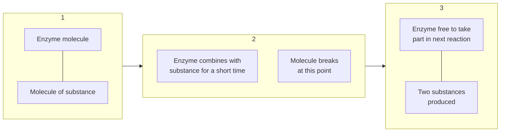

> Every activity or function of our body to keep us alive needs energy.

> Why do we eat food? In what form and where the food we eat is processed and utilized?

> Are the meat, potato, fruit, etc., used in our body, as such, like the use of spare parts in a machine?

# 04 Human Digestive System

### Students Learning Outcomes
**After studying this chapter, students will be able to:**

*   State the importance of digestion in the human body and describe physical and chemical digestion.
*   Sequence the main regions of Alimentary Canal, its associated organs and describe the functions of different parts of the Alimentary Canal.
*   Briefly describe the role of enzymes in digestion.
*   Conclude that blood transports the products of digestion to other parts of the body and the undigested products get egested/ defecated.
*   Briefly describe some major digestive disorders.

### VOCABULARY

<table>
  <tbody>
    <tr>
        <td>Glands</td>
        <td>Enzyme</td>
        <td>Salivary glands</td>
        <td>Gastric glands</td>
        <td>Bile</td>
        <td>Pancreatic juice</td>
    </tr>
    <tr>
        <td>Organs in our body which secrete enzymes and hormones</td>
        <td>Types of proteins that speed up chemical reactions occurring in our body</td>
        <td>Glands in oral cavity which secrete saliva containing enzymes that start digestion process in the oral cavity</td>
        <td>Glands in the walls of stomach which secrete gastric juice containing enzymes that facilitate digestion process in the stomach</td>
        <td>Fluid released by liver and stored in gallbladder. It helps in digestion of fats.</td>
        <td>Juice released by pancreas. It contains enzymes that complete digestion in small intestine</td>
    </tr>
  </tbody>
</table>

# Recall what you have learnt in previous classes

We have learnt about the followings in chapter 1 and 3 of this book:
* The organs involved in the digestive system in human body (**Figure 4.1**).
* Foods containing carbohydrates, fats, proteins, vitamins and, minerals etc., (**Figure 4.2**).

**Figure 4.1 Human digestive system**
The diagram shows a human torso with the following parts labeled:
* Oesophagus
* Stomach
* Small intestine
* Large intestine (colon)
* Appendix
* Rectum

**Figure 4.2 Different food groups**
The diagram is a circular chart showing various food groups with representative images:
* **Carbohydrates:** Bread, bananas, grains.
* **Vitamins:** Various fruits like papaya, grapes, and oranges.
* **Minerals:** Vegetables, nuts, cheese, and bread.
* **Fats:** Cooking oil, butter, and cheese.
* **Proteins:** Fish, meat, eggs, and pulses.

In this chapter we will learn:
* What is digestion of food?
* Why do foods containing carbohydrates, fats, proteins, etc. need to be digested?
* The organs and processes involved in digestion

## 4.1 DIGESTION
The food we eat mostly consists of large and complex molecules of carbohydrates, fats, proteins, etc. These complex food molecules cannot pass across the walls of small intestine for absorption into blood. In order to get the food absorbed into blood for its transport to every part of the body, it is first broken down into smaller diffusible pieces which can pass across the walls of small intestine.

The process during which large and complex food molecules are broken down into such smaller pieces which pass across the walls of small intestine and absorb into the blood is called **digestion** of food. The complete digestion of food comprises of two processes i.e., physical **digestion** and chemical digestion.

### Physical digestion
The crushing of large food molecules into smaller pieces is called **physical digestion**. In the oral cavity, large food molecules are chewed and crushed into small pieces with the help of teeth and tongue. Muscular walls of stomach also break down the food into smaller pieces.

### Chemical digestion
The change of non-diffusible food molecules into diffusible or soluble food molecules with the help of some chemical substances (**enzymes**) is called **chemical digestion**. Enzymes are special types of proteins in our body that speed up the different chemical processes. Amylase, lipase, protease, etc., are the examples of some enzymes that are involved in digestion of food. The enzymes change the composition of substances but don't undergo any change in their own composition.

#### Activity 4.1 Assessment
Write 'C' against the correct and 'I' against the incorrect statement in the middle column. Also correct the incorrect statement and write it in the next column.

<table>
  <thead>
    <tr>
        <th></th>
        <th>Correct/Incorrect</th>
        <th>C/I</th>
        <th>Correct statement</th>
    </tr>
  </thead>
  <tbody>
    <tr>
        <td>Bread, rice, potato, etc., are the sources of proteins.</td>
        <td></td>
        <td></td>
        <td></td>
    </tr>
    <tr>
        <td>Butter and oil are the sources of fats.</td>
        <td></td>
        <td></td>
        <td></td>
    </tr>
    <tr>
        <td>Fish and egg are the sources of carbohydrates.</td>
        <td colspan="3"></td>
    </tr>
  </tbody>
</table>

#### Inquiry 4.1
**Teacher Guide**
Facilitate students:
* Conduct a discussion on the following hypothesis:
**Hypothesis**
> "Enzymes are specific in their functions"

* What do you conclude from the discussion?
* \_________________________________________________________________________________________________
  \_________________________________________________________________________________________________

### 4.1.1 Human Digestive System
Human digestive system consists of a long tube called **alimentary canal** and **digestive glands (Figure 4.3)**.

The diagram below illustrates the human digestive system with the following labeled parts:
- **Oral cavity**
- **Mouth**
- **Salivary glands**
- **Pharynx**
- **Oesophagus**
- **Liver**
- **Gallbladder**
- **Pancreas**
- **Stomach**
- **Small intestine**
- **Large intestine**
- **Appendix**
- **Rectum**
- **Anus**

**Figure 4.3 Digestive system**

### 4.1.2 Alimentary Canal
Alimentary canal is a long tube in our body which begins at the mouth and ends at the anus. At different regions, alimentary canal is shaped into specific structures or organs which perform specific functions. These organs are oral cavity, oesophagus, stomach, small intestine and large intestine **(Figure 4.3)**.

#### Oral cavity
Mouth leads into oral cavity **(Figure 4.4)**. In the oral cavity, there are present four types of teeth (incisors, canines, pre-molars and molars) which cut and grind the food during chewing action. At floor of the oral cavity, there is a tongue which has taste buds to taste different kinds of foods. There are three pairs of salivary glands which open in the oral cavity to secrete **saliva**. You will learn about salivary glands and saliva in **Section 4.2**. Chewing activity mixes saliva in the food to make it soft. The well chewed and soft food is swallowed into the oesophagus through pharynx. Pharynx serves as a passage for food to enter the oesophagus and for air from nose to enter the larynx.

The diagram below illustrates the oral cavity with the following labeled parts:
- **Salivary glands**
- **Oral cavity**
- **Mouth**
- **Pharynx**

**Figure 4.4 Oral cavity**

> ### Informative
> Incisors are chisel-shaped. These are used to cut off food. Canines are conical or dagger shaped. These are used for tearing. Premolars are flat with two cusps (projections) on the surface. These are used to crush the food. Molars are flat with four cusps on the surface. The molars are used to grind the food.

### Oesophagus
The oesophagus is a narrow muscular tube through which food passes from oral cavity to the stomach **(Figure 4.5)**.

### Stomach
Stomach is a bag-shaped structure. Its walls secrete a liquid called gastric juice. Gastric juice consists of hydrochloric acid, enzymes and water.

The muscular action of stomach walls mixes the food with enzymes and hydrochloric acid. The acid helps to kill the germs present in the food and enzymes to break large protein structures into smaller pieces. The food stays about four hours in stomach. A semi-liquid food is released from stomach into small intestine at intervals.

### Small intestine
Small intestine is coiled muscular tube. It is about 6 to 7 metre long. The first part of small intestine gets bile from the gallbladder and pancreatic juice from pancreas. The enzymes present in pancreatic juice complete the digestion in small intestine. The second part of the small intestine has millions of tiny finger like projections called villi. Each villus contains tiny blood vessels **(Figure 4.6)**. The digested food is absorbed through the walls of these villi and passes into the blood stream. The undigested food particles are passed on into the large intestine.

### Large intestine
Some water and mineral salts are also absorbed into the blood through the walls of the large intestine. The remaining wastes move into the rectum as faeces which are expelled out through the anus.

**Figure 4.5 Oesophagus, stomach and intestines**
The diagram shows the human digestive system with the following parts labeled:
- Oesophagus
- Liver
- Stomach
- Pancreas
- Gallbladder
- Small intestine
- Large intestine

**Figure 4.6 Villus**
The diagram shows a cross-section of a villus with the following parts labeled:
- Epithelium
- Network of capillaries
- Lacteal
- Nerve

> ### Do you know?
> Enzymes are special types of proteins which are produced in living bodies and speed up the reactions occurring in living bodies.

## 4.2 DIGESTIVE GLANDS
Glands are special structures in living bodies which are concerned with secretion of specific substances in the body. Salivary glands, gastric glands, liver and pancreas are the digestive glands.

**Salivary glands** secrete a liquid called saliva in the oral cavity. Saliva contains enzymes which speed up the digestion process in oral cavity. **Gastric glands** secrete gastric juice in stomach. **Liver** is a gland which produces **bile**. Bile is stored in gallbladder. It enters the first part of small intestine through bile duct. Bile along with other enzymes helps in digestion of fats. **Pancreas** produces pancreatic juice which enters the first part of small intestine through pancreatic duct. Pancreatic juice contains enzymes which digest the food completely.

> ### Informative
> Digestion of carbohydrates, proteins or fats in laboratory requires high temperature and much time. Our body performs this function rapidly without raising body temperature. This is due to the enzymes in the body.

### Importance of Digestion
The large and complex food particles cannot pass across the cell membranes to enter the cells. It is the digestive system which converts the large food molecules into such smaller particles which can diffuse into the cells across the cell membranes. Starch, proteins, and fats are the foods consisting of complex molecules. Digestive enzymes convert starches into simple sugars, proteins into amino acids and fats into fatty acids and glycerol (Table 4.1).

**Table (4.1) Digestion in small Intestine**

<table>
  <tbody>
    <tr>
        <td>Substance</td>
        <td>Enzymes</td>
        <td>Products</td>
    </tr>
    <tr>
        <td rowspan="3">Carbohydrates</td>
        <td>amylase acts on starch</td>
        <td>maltose</td>
    </tr>
    <tr>
        <td>maltase acts on maltose</td>
        <td>glucose</td>
    </tr>
    <tr>
        <td>sucrase acts on sucrose</td>
        <td>glucose and fructose</td>
    </tr>
    <tr>
        <td>Proteins</td>
        <td>proteases</td>
        <td>amino acids</td>
    </tr>
    <tr>
        <td>Fats</td>
        <td>lipases</td>
        <td>fatty acids and glycerol</td>
    </tr>
  </tbody>
</table>

### Activity 4.2
Take a test tube. Fill it half with water. Pour 2-3 drops of any oil. Put your thumb on the mouth of test tube. Shake it well. After sometime, you will observe two layers. The upper layer of oil separates from lower water layer.
Now add some detergent and stir, you will see small droplets of oil evenly scattered. Bile acts like the detergent. It emulsifies large drops of fat into small droplets.

### Do you know?
The inner surface of the stomach wall contains thousands of glands called gastric glands.
These glands secrete gastric juice.
1. There are 30,000 gastric glands in the wall of the stomach.
2. You secrete 1 to 1.5 L gastric juice daily.

These simple sugars, amino acids, fatty acids and glycerol can pass across the cell membranes to diffuse into the cells. In the cells, they are either used to produce energy or stored as nutrients required for growth and other vital functions.

## 4.3 DISORDERS OF DIGESTIVE SYSTEM
The common disorders of digestive system are gastrouble, ulcer, diarrhoea and constipation. Here we will discuss diarrhoea and constipation.

### 4.3.1 Diarrhoea
When food in the large intestine is contaminated with toxic matter or infected with bacteria, it stimulates the waves of muscular contraction passing along the intestine to move at a fast speed. As a result, the semi-liquid faeces are passed out of the body frequently and water is not absorbed properly by the large intestine. This results into shortage of water and salts in the body. The water loss can result into dehydration. Dehydration can be controlled by the use of salt and sugar solution or oral rehydration salts (ORS). The patient should use fresh fruits and vegetables. He should use boiled water and freshly prepared food. He should also consult a physician if the problem is not controlled.

> **Mini Exercise**
> 1. What is the function of amylase, protease and lipase?
> 2. What will happen if there is no pancreas?
> 3. Where is bile produced?
> 4. Where is bile stored?

### 4.3.2 Constipation
If undigested food moves too slowly along the large intestine due to slow waves of muscular contraction, more water is absorbed into blood and faeces become hard and dry. Their removal becomes painful or difficult. It can be controlled by taking medicines which make faeces soft to discharge easily. The person suffering from constipation should use plenty of water or fluids and fibrous food, e.g., fruits and vegetables.

### 4.3.3 Ulcer
Excessive use of fast foods and fizzy drinks causes ulcer which is a sore on the lining of stomach, small intestine or oesophagus. Avoidance from fast foods and fizzy drinks keeps safe from ulcer.

> **Think Tank**
> 1. Why is your digestive canal long?
> 2. Overeating causes digestive diseases. Explain.

> **Brain teaser**
> Un-jumble the followings to make meaningful words:
>
> <table>
  <tbody>
    <tr>
        <td>&gt; aomhcts</td>
        <td>[ ]</td>
        <td>lgabdreladl</td>
        <td>[ ]</td>
    </tr>
    <tr>
        <td>&gt; shogpeoaus</td>
        <td>[ ]</td>
        <td>eitneitsn</td>
        <td>[ ]</td>
    </tr>
    <tr>
        <td>&gt; rivle</td>
        <td>[ ]</td>
        <td>yzemne</td>
        <td>[ ]</td>
    </tr>
    <tr>
        <td>&gt; echtaybrodsar</td>
        <td>[ ]</td>
        <td>igodsnite</td>
        <td>[ ]</td>
    </tr>
    <tr>
        <td>&gt;</td>
        <td colspan="3"></td>
    </tr>
  </tbody>
</table>

# Scientific Investigation

**Teacher Guide**
Facilitate students make use of school library and internet facility and investigate:
*   The causes of gas trouble and ulcer (digestive disorders).
*   How can we avoid these problems.

# KEY POINTS

*   Digestive system consists of alimentary canal and various digestive glands.
*   Alimentary canal consists of oral cavity, oesophagus, stomach, small intestine and large intestine.
*   Digestive glands include salivary glands, gastric glands, liver, and pancreas.
*   Oesophagus is just a passage way. No digestion takes place here.
*   Stomach is a bag like structure. Its digestive glands secrete gastric juice which contains hydrochloric acid, enzymes and water.
*   Bile is produced in liver and stored in gallbladder. Pancreatic juice is produced by pancreas. Bile breaks large drops of fats into small droplets. Digestion and absorption of food is completed in small intestine.
*   In large intestine, salt, water and minerals are absorbed. Undigested food is converted into faeces which are removed from the body through the opening of the rectum called anus.

# QUESTIONS

**4.1 Encircle the correct option.**
1.  Salivary glands secrete \_\_\_\_\_\_\_\_\_\_\_\_\_\_\_.
2.  The end products of digestion of proteins are \_\_\_\_\_\_\_\_\_\_\_\_\_\_\_.
3.  Finger-like projections in the lining of small intestine are called \_\_\_\_\_\_\_\_\_\_\_\_\_\_\_.
4.  Bile is secreted by \_\_\_\_\_\_\_\_\_\_\_\_\_\_\_.
5.  The function of the gallbladder is to store \_\_\_\_\_\_\_\_\_\_\_\_\_\_\_.

**4.2 Select the correct option.**
1.  **A part of the digestive system which is not in contact with food is:**
    a. small intestine
    b. stomach
    c. liver
    d. large intestine

2. **In humans, most of digestion takes place in:**
   a. mouth
   b. oesophagus
   c. stomach
   d. small intestine

3. **Saliva is produced in:**
   a. oral cavity
   b. oesophagus
   c. stomach
   d. small intestine

4. **The food digested by the enzyme "sucrase" belongs to nutrients group:**
   a. carbohydrates
   b. fats
   c. oils
   d. proteins

5. **The muscular tube leading from oral cavity to stomach:**
   a. small intestine
   b. large intestine
   c. oesophagus
   d. bile duct

6. **Germs present in food are killed in stomach by:**
   a. hydrochloric acid
   b. citric acid
   c. carbonic acid
   d. none of these

7. **Digestive enzymes convert starch into:**
   a. fatty acids
   b. vitamins
   c. minerals
   d. simple sugar

8. **Proteins are digested into:**
   a. fatty acids
   b. amino acids
   c. glycerol
   d. glucose

9. **Digested food is absorbed into blood through the walls of:**
   a. villi
   b. large intestine
   c. stomach
   d. bile duct

10. **Water and salts from undigested food are absorbed into blood through walls of:**
    a. small intestine
    b. large intestine
    c. villi
    d. gallbladder

### 4.3 Give short answer.
1. Define digestion.
2. How is chewing important in human digestive system?
3. Name the liquid which is secreted by salivary glands.
4. Describe the role of oesophagus in human digestive system.
5. Why do carbohydrates, fats and proteins need to be broken down into smaller molecules?
6. What are the products of digestion of carbohydrates, proteins and fats?
7. What structures secrete enzymes necessary for digestion in man?
8. How are villi important for absorption?
9. How is large intestine important in digestive system of man?

10. Write the functions of gall bladder.

## 4.4 Give answers in detail.
1. Describe alimentary canal and its different parts.
2. What happens to food in oral cavity?
3. Describe the functions of stomach in human digestive system.
4. Explain the role of small intestine in digestion and absorption of food.
5. Explain the functions of liver, bile, and pancreas.
6. Write note on:
   (a) diarrhoea (b) constipation

## 4.5 Constructed Response Questions
1. Briefly describe the role of the following in the digestion of food:
   (a) Oral cavity (b) Liver (c) Pancreas
2. Outline the functions of the following:
   (a) Salivary glands (b) Gastric glands
3. Proteins which speed up biochemical reactions are called enzymes. State the functions of the following enzymes:
   (a) amylase (b) protease (c) lipase

## 4.6 Investigate:
1. The role of enzymes in digestion.
2. Can digestion occur outside the living bodies?

## 4.7 Project:
**(BIODETERGENTS)**
* Use internet facility with the help of your teacher or parent(s) and learn the basic procedure to prepare biodetergents.
* Prepare biodetergent using enzymes.

**Note:**
i. Enzymes like proteases, amylases, lipases, cellulases, etc., are used in preparation of biodetergents (washing powders, etc.).
ii. Lipases break down the fats and oils. Proteases work to break down protein chains. Use of lipases and proteases in detergent will give you a product which will act as an excellent stain remover.
iii. Some fruit like pineapple, papaya, kiwi, banana peels, etc., contain proteases. Pineapple and papaya are the richest source of proteases.
iv. Yogurt, cheese, cream, etc., contain amylase, protease and lipase.

The image shows three beakers representing the three states of matter:
1.  A beaker containing a blue solid block, with a magnifying view showing particles packed tightly in a regular lattice.
2.  A beaker containing a blue liquid, with a magnifying view showing particles close together but in a more random arrangement.
3.  A beaker containing a blue liquid with bubbles and steam rising, with a magnifying view showing particles far apart and moving freely.

> What does particles in scientific language mean?

> The persons related to science often talk about atoms, molecules and ions. What are these?

> Is there any material thing not consisting of particles?

# 05 Matter as Particles

## Students Learning Outcomes
**After studying this chapter, students will be able to:**

*   Explain the Particle Theory of Matter.
*   Use particle model of matter to investigate the movement and arrangement of particles in three states.
*   Explain why gases and liquids take the shape of their containers but solids do not, in terms of the Particle Theory of Matter.
*   Discuss, using the particle theory of matter, why liquids and gases can flow easily but solids cannot.
*   Interpret the evidence for the existence of the particles in matter by observing daily life examples (adding air to expand a basketball, compressing air in a syringe, dissolving sugar in water, and evaporating salt water).
*   Apply the particle theory of matter to explain diffusion.
*   Explain the changes in states: Melting, freezing, evaporation, condensation, and sublimation, using the particle model of matter.

## VOCABULARY

<table>
  <tbody>
    <tr>
        <td>Melting</td>
        <td>Freezing</td>
        <td>Evaporation</td>
        <td>Boiling</td>
        <td>Condensation</td>
        <td>Sublimation</td>
    </tr>
    <tr>
        <td>Change of a solid object into its liquid state on heating</td>
        <td>Change of a liquid object into its solid state on cooling</td>
        <td>Change of a liquid into its gaseous state at any temperature</td>
        <td>Bubbling of a liquid into its gaseous state on heating</td>
        <td>Change of a gaseous object into its liquid state on cooling</td>
        <td>Change of a solid directly into its gaseous state without undergoing the liquid state</td>
    </tr>
  </tbody>
</table>

# Recall what you have learnt in previous classes

We have learnt that anything that has mass and occupies space is called **matter**. The quantity of matter in an object is called its **mass**. The space occupied by an object is called its volume. We have also learnt that:

*   Matter exists in three physical states (solid, liquid and gas)
*   Properties of solids, liquids and gases with respect to volume and shape
*   Arrangement of particles in solids, liquids, gases (**Figure 5.1**)

<table>
    <tr>
        <th>Solid</th>
        <th>Liquid</th>
        <th>Gas</th>
    </tr>
    <tr>
        <td>[The image shows particles arranged in a tight, regular grid pattern.]</td>
        <td>[The image shows particles close together but with no regular arrangement.]</td>
        <td>[The image shows particles far apart and scattered randomly.]</td>
    </tr>
    <tr>
        <td>Particles are arranged on regular pattern and packed strongly together. Particles can vibrate but not move.</td>
        <td>Particles are closely gathered with no distinct arrangement. Particles can move and slide around each other</td>
        <td>Particles are moving freely and randomly with no distinct arrangement. Particles move and collide with each other.</td>
    </tr>
</table>**Figure 5.1 Arrangement of particles in solids, liquids and gases**

### Activity 5.1 Assessment

Write 'C' against the correct and 'I' against the incorrect statement in the middle column. Also correct the incorrect statement and write it in the next column.

<table>
  <tbody>
    <tr>
        <td>Correct/Incorrect</td>
        <td>C/I</td>
        <td>Correct Statement</td>
    </tr>
    <tr>
        <th>Particles in solids are strongly packed with each other giving definite shape and definite volume to solid objects</th>
        <th></th>
        <th></th>
    </tr>
    <tr>
        <th>Particles in liquids have definite shape but no definite volume.</th>
        <th></th>
        <th></th>
    </tr>
    <tr>
        <th>Gases have neither definite shape nor definite volume.</th>
        <th></th>
        <th></th>
    </tr>
    <tr>
        <th>The distances between the particles of liquids are greater than that between the particles of gases.</th>
        <th colspan="2"></th>
    </tr>
  </tbody>
</table>

In this chapter we will learn about:
*   Particle theory of matter
*   Changes in states of matter
*   Diffusion of particles of matter

# Inquiry 5.1

**Teacher Guide**
Facilitate students:
*   Conduct a discussion on the following hypothesis:

**Hypothesis**
> "Gases have neither definite volume nor definite shape"

**Investigation**
*   Fill a balloon with air.
    1.  Examine and discuss the followings with your classmates and the teacher:
        (a) Shape of the air filled in the balloon.
        (b) Volume of the air filled in balloon
        (c) Distances between the particles of the air filled in the balloon.
*   Record your observation as under:

<table>
  <thead>
    <tr>
        <th>Shape</th>
        <th>Volume</th>
        <th>Distances between the particles</th>
    </tr>
  </thead>
  <tbody>
    <tr>
        <td rowspan="2"></td>
        <td rowspan="2"></td>
        <td rowspan="2"></td>
    </tr>
  </tbody>
</table>

*   Release the air filled in the balloon.
    2.  Discuss the followings with your classmates and the teacher:
        (d) Shape of air that has been released from the balloon.
        (e) Volume of the air that has been released from the balloon.
        (f) Distances between the particles of the air that have been released from the balloon.
*   Record your observation as under:

<table>
  <thead>
    <tr>
        <th>Shape</th>
        <th>Volume</th>
        <th>Distances between the particles</th>
    </tr>
  </thead>
  <tbody>
    <tr>
        <td rowspan="2"></td>
        <td rowspan="2"></td>
        <td rowspan="2"></td>
    </tr>
  </tbody>
</table>

*   What do you conclude from the discussion?
    __________________________________________________________________________________________
    __________________________________________________________________________________________

## 5.1 PARTICLE THEORY OF MATTER
Scientists have developed a particle model / theory as under:
1.  All matter is made of tiny (very small) particles.
2.  There are spaces between the particles of matter.

3. The particles of matter have forces of attraction between them.
4. The particles of every material thing are always in motion.
5. When heat is added to matter, the motion of its particles becomes faster (**Figure 5.2**).

The following diagram illustrates the effect of heat on particles:
- **Initial State:** A grid of 3x3 blue circular particles, each with vibration lines on either side, representing a solid or stationary state.
- **Process:** An arrow labeled "Heat" points to the next stage.
- **Intermediate State:** The same 3x3 grid of particles, but with more pronounced vibration lines and motion indicators.
- **Final State:** An arrow points to a scattered group of blue circular particles with motion trails, indicating rapid, random movement.

**Figure 5.2** Heating of material object

### 5.1.1 Particles in Material Objects

#### Particles in solids
In solids, particles have an orderly arrangement where they are present tightly packed with each other (**Figure 5.3**). The forces of attraction between them are the strongest. They cannot move freely, but, vibrate at their fixed positions. That is why they have fixed shape and fixed volume. The spaces among the particles of a solid are negligibly small.

The following illustration shows a blue toy building block (LEGO-style) with a callout showing its microscopic structure:
- **Microscopic View:** A highly organized, dense, and repeating grid of blue spherical particles packed closely together in rows and columns.

**Figure 5.3** Arrangement of particles in solids

#### Particles in liquids
In liquids like water, the particles are present very close to one another, but, they are not regularly arranged (**Figure 5.4**). The attractive forces between them are strong, but, weaker than solids.

The following illustration shows a glass beaker containing a clear liquid with a callout showing its microscopic structure:
- **Microscopic View:** Blue spherical particles that are close together but lack a rigid grid structure. They are distributed more randomly than in the solid state, with small, irregular gaps between them.

**Figure 5.4** Arrangement of particles in liquids

Due to strong forces of attraction, between them, the molecules of liquids cling together and do not leave apart. That is why the volume of liquids remains fixed. However, the molecules are free to slide and rotate over one another. They can change their positions due to their continuous movements and get the shape of a container in which they are kept. This is the reason that a liquid can flow or can be poured from one vessel to another under the effect of gravity. The spaces among the particles of a liquid are very small, but, greater as compared with solids. Thus, a liquid does not have a fixed shape, but, it has fixed volume. Liquids cannot be compressed easily, because, their particles are packed quite closely.

### Particles of gases
The forces of attraction between the particles of gases are negligible. The distances among their particles are much greater than those in solids and liquids. Gas particles are moving freely in all directions (**Figure 5.5**).

The image shows a blue balloon with gas particles (represented as blue spheres) escaping and spreading out into the surrounding space. The particles are widely spaced and arranged randomly.

**Figure 5.5 Arrangement of particles in gases**

Particles occupy all available space. They constantly collide with each other and with the walls of the container. When the particles of a gas are free to move, they will fill a container no matter how small or big is this. This is the reason that gases have neither fixed shape nor fixed volume.

> ### Mini Exercise
> * What is the physical state of the following things at normal temperature and pressure?
> **Sand, Vapours, Mercury, Flour, Oxygen, Honey**

Particle model explains that a matter which seems motionless consists of particles which are in constant motion.

> ### Scientific Investigation
> **Teacher Guide**
> Facilitate students:
> * Investigate and conduct a discussion to conclude about the inquiry as under on the basis of particle theory of matter:
>
> **Inquiry**
> * Why do gases and liquids take the shape of the container but solids cannot?
> * Why do liquids and gases flow easily, but, solids cannot?

### Hypotheses
*   The particles of solids can neither flow nor allow the solid objects change their shape and volume.
*   The particles of liquids can flow and allow the liquid objects change their shape, but, their volume remains fixed.
*   The particles of gases can flow and move freely to occupy all the available space giving gaseous objects neither fixed shape nor fixed volume.

### Investigation and discussion
✓ Particles in solids are orderly arranged, compactly and strongly packed. The attractive forces between them are the strongest. The spaces between them are very small. They cannot move freely, but, only vibrate on their fixed positions.
✓ Particles in liquids are very close to one another but they are not regularly arranged. The attractive forces between them are strong but weaker than that in solids. The spaces among the particles allow them to slide and rotate over each other.
✓ The particles in gases have negligibly small forces of attraction between them. They are moving freely in all directions having maximum distances between them.

### Conclusion
____________________
____________________
____________________

---

### Scientific Investigation
**To prove the existence of particles in matter**

#### Teacher Guide
Facilitate students:
*   Conduct the following activities to prove the existence of particles in matter.

#### Activity 5.2
1.  Take an uncapped not empty plastic bottle and put a balloon over its mouth.
2.  Squeeze the bottle and observe what happens to the balloon.
3.  What makes the balloon expand or inflate?

**Hypothesis:**
Air particles present in the bottle when pushed in the balloon by squeezing the bottle make the balloon expand or inflate.

**Conclusion:** ____________________

[The image shows a hand squeezing a plastic bottle with a blue balloon attached to its mouth. The balloon is partially inflated.]

#### Activity 5.3
1.  Take a basketball or football, pump air into it and observe what happens to the ball?
2.  What makes the ball tight?

**Hypothesis**
The particles present in the air when pushed in the ball make it tight.

**Conclusion:** ____________________

[The image shows a hand using a manual air pump to inflate a soccer ball.]

### Activity 5.4

1. Take a syringe, remove its needle, put your finger at its mouth and push the plunger in.
2. To what extent the plunger is pushed in the syringe?
3. What prevents the plunger to be pushed further in the syringe?

**Hypothesis**
The particles of air present in the syringe when pressed maximum prevent the plunger to be pushed in further.

**Conclusion:** _________________________________________________________________________________________________

The image shows a pair of hands holding a syringe. One finger is blocking the nozzle (mouth) of the syringe while the other hand pushes the plunger inward.

## 5.2 DIFFUSION OF PARTICLES

The movement of material particles from the area where they are more to the area where they are less is called **diffusion of particles**. Gases diffuse easily because their particles can move freely. Liquids can also diffuse but at slower rate as compared to gases.

### Activity 5.5

* Bring a bottle of perfume in the classroom.
* Take it to one corner of the room and push its button once to spray a little perfume there.
* You will feel fragrance in the whole room.
* What makes the whole room fragrant?

The image shows a hand pressing the nozzle of a perfume spray bottle, releasing a mist of fragrance.

### Think Tank

The pleasant smell of food being cooked in the kitchen reaches the other rooms of the house. How?

### Activity 5.6

* Collect pollen grains from some flowers.
* Take a glass slide, put a drop of water on it, add pollen grains into the water drop put on glass slide and examine it under the microscope.
* Observe the movement of pollen grains in the water drop under microscope.
* Share and discuss your observation with your classmates.
* Such a movement of particles (like pollen grains) in the liquid is termed as Brownian motion, as it was first observed by the Scientist Robert Brown.

The image shows a student looking through a microscope at a desk. A callout bubble from the microscope shows a diagram of particles moving in random, zigzag paths (Brownian motion).

Liquid particles can also diffuse if they have space to move into.

<table>
  <tbody>
    <tr>
        <td>Activity 5.7</td>
        <td>Activity 5.8</td>
    </tr>
    <tr>
        <td>* Pour a little quantity of milk into the water taken in a glass or beaker. * Observe the diffusion of milk particles into the water. [Illustration: A beaker of water with milk being poured into it from another container.]</td>
        <td>* Take a few crystals of salt and add the same in the water contained in a glass or beaker. * Observe what happens to the salt crystals added in water. [Illustration: A hand using a spoon to add salt crystals into a beaker of water.]</td>
    </tr>
  </tbody>
</table>

The rate of diffusion depends on the following factors:

**Size of the particles**
The smaller and lighter particles move faster and hence diffuse faster.

**Temperature**
Particles move faster on higher temperature and hence diffuse faster.

**Size of spaces between particles**
Large spaces between particles of a substance allow the particles of the other substance to diffuse into it easily.

## 5.3 CHANGES IN STATES OF MATTER
When some objects are heated, movement of their particles becomes rapid. Ultimately, solids convert into liquids and liquids convert into gases. When some objects are cooled, movement of their particles gets slower. Ultimately, gases convert into liquids and liquids convert into solids. It is the movement of particles that causes change in physical states of mater (**Figure 5.6**).

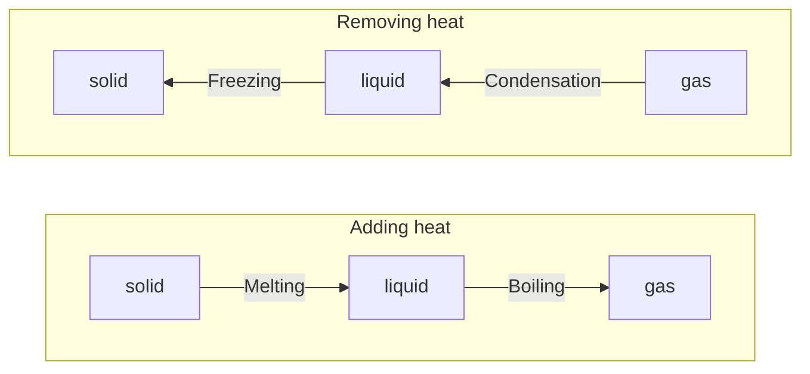

[The diagram above represents Figure 5.6. It shows three boxes containing spheres representing particles. In the 'solid' box, particles are tightly packed in a regular grid. In the 'liquid' box, particles are close together but disordered. In the 'gas' box, particles are far apart and disordered. Pink arrows pointing from solid to liquid (Melting) and liquid to gas (Boiling) are labeled "Adding heat". Pink arrows pointing from gas to liquid (Condensation) and liquid to solid (Freezing) are labeled "Removing heat".]

**Figure 5.6 Effect of adding and removing heat on arrangement of particles in solids, liquids and gases**

### 5.3.1 Processes Involving Change in States of Matter
Melting, boiling, condensation, freezing, evaporation, etc., are the processes involving change in physical states of matter.

#### Melting
When a solid is heated, its particles start vibrating with a more speed and the attractive forces between them are weakened. At a particular temperature, the movement of particles becomes very fast. It decreases the forces of attraction between the particles. At this point, the particles leave their fixed positions and the fixed shape of the solid is collapsed just like the collapse of a building. It turns the solid into its liquid state. This phenomenon is called **melting of a solid (Figure 5.7)**. The temperature at which a solid melts is called its **melting point**.

The image shows a lit orange candle with a flame. An arrow points to the liquid wax near the flame with the label "Melting of candle wax".
**Figure 5.7 Melting of wax**

> **Mini Exercise**
> * What happens to the ice cream, when it is kept outside the freezer?

#### Freezing
When a liquid is cooled, its particles slowly gain fixed positions in a particular shape and thus are converted into a solid. The phenomenon is called **freezing (Figure 5.8)** and the temperature at which a liquid turns into its solid form is called **freezing point**.

The image shows a yellow candle that is not lit, with solidified wax drippings on its side. A label points to the drippings: "Freezing of candle wax".
**Figure 5.8 Freezing of wax**

> **Activity 5.9**
> * Fill some ice kits with water and place them in a freezer.
> * Observe them next day.
> * What has happened to the liquid water in ice kits?

> **Do you know?**
> * The melting and freezing point of water is the same and it is 0°C.
> * The boiling point of water is 100°C.

#### Boiling
When a liquid like water is heated, its particles start moving very fast and the attractive forces between them are weakened. At a specific temperature, the movement of particles becomes so fast that they become independent of one another and the liquid water turns into gaseous water called steam. This process of changing liquid into its gaseous state is on heating called **boiling (Figure 5.9)** and the temperature at which a liquid boils in an open container is called its **boiling point**.

The image shows a pot of water on a tripod stand being heated by a Bunsen burner. Bubbles are visible in the water and steam is rising from the pot.
**Figure 5.9 Boiling of water**

### Condensation

Exactly, the reverse process occurs when a gas is cooled. The movement of its particles gets slower and slower and the attractive forces between them get stronger and stronger. At a lower temperature, the forces of attraction draw the molecules very close together to convert them into a liquid form. This process is called **condensation (Figure 5.10)**.

[The image shows a glass of cold water with water droplets forming on the outside surface.]
**Figure 5.10 Process of Condensation**

> #### Informative
> * When the water vapours in air meet any colder object, they are condensed. You may see water drops on inside of window pans in your classroom on a cold day.

> #### Mini Exercise
> * Mercury in the bulb of a thermometer expands, when placed under a person's armpit or tongue. Why?

### Evaporation

When a liquid like water is kept in an open container, its particles start escaping from its surface into an open atmosphere. This phenomenon is called **evaporation** and it takes place at all temperatures. The particles of a liquid evaporate after absorbing heat from the atmosphere **(Figure 5.11)**. The speed with which the particles evaporate increases with the increases in the temperature. Water evaporates faster in hot summer than in cold winter.

[The image shows mist or steam rising from the surface of a body of water, such as a lake or river, surrounded by trees.]
**Figure 5.11 Evaporation of water**

> #### Do you know?
> * Why wet clothes are spread in open sun to turn them dry?

> #### Activity 5.10
> * Place a big tray on a big stand as shown in the Figure.
> * Add some water in the tray.
> * Fill a beaker half with water and heat it under low flame after placing it below one side of the tray as shown in the Figure.
> * Record your observations.
>
> [The image illustrates the activity: A beaker of water is being heated on a tripod stand with a burner. Above it, a large tray is held by two stands. Water droplets are shown condensing on the underside of the tray and dripping down into a puddle on the surface below.]
> ________________________________________________________________________________
> ________________________________________________________________________________
> ________________________________________________________________________________

### Sublimation

Mostly, solid objects, when heated melt into their liquid states. If heating is continued, these liquids further change into their gaseous states. Some solids, e.g., iodine, ammonium chloride and naphthalene, etc., when heated, change directly into their gaseous states without undergoing the liquid states. This process is called **sublimation**.

Conversion of solid carbon dioxide (dry ice) directly into carbon dioxide gas is the best example of sublimation. Dry ice is often used to keep the materials cold and dry.

#### Activity 5.11

**Teacher Guide**
Facilitate the students conduct the activity as under:
*   Take some mixture of ammonium chloride and sand in a china dish.
*   Invert a glass funnel over the china dish.
*   Close the end of the funnel with a cotton swab.
*   Heat (slowly) the mixture of sand and ammonium chloride as shown in the Figure.
*   After sometime, white powder on the inner walls of the funnel will be observed.
*   What do you conclude from this activity?

The illustration shows a laboratory setup for sublimation: A china dish containing a mixture is placed on a wire gauze over a tripod stand. A Bunsen burner is heating the dish from below. An inverted glass funnel is placed over the china dish, with its stem plugged by a cotton swab. White powder is shown depositing on the inner walls of the funnel.

#### Science, Technology, Society and Environment

Evaporation produces cooling. This principle is used in the electric or electronics for making refrigerators and air conditioners, etc. The compressors in the AC and refrigerators, etc., compress a gas to change it into its liquid state. This liquified gas when allowed to evaporate gains heat from the surroundings and produces cooling.

### KEY POINTS

*   Anything which has a mass and occupies space is called matter.
*   Matter exists in three distinct forms; solid, liquid and gas.
*   Air is a mixture of many gases.
*   In solids, the particles have fixed positions, so they have fixed volumes and fixed shapes.
*   In liquids, the particles are present very close to one another, but, they are not arranged on regular pattern. Thus, a liquid does not have fixed shape but it has fixed volume.
*   In gases, the particles are moving freely in all directions and they are at a large distance from one another. Gases have neither fixed shape nor fixed volume.
*   When a solid is heated, it changes into its liquid form at a particular temperature. The process is called melting. Similarly, when a liquid is cooled, it changes into solid and the process is called freezing. A gas can also be converted into liquid by cooling it to sufficient low temperature.
*   When a liquid is heated in an open vessel, it changes into gaseous form at a particular

temperature. This process is called boiling.

*   Conversion of a liquid into its vapours is called evaporation, while, the reverse process is called condensation.
*   Movement of particles from the region where they are more to the region where they are less is called diffusion.
*   The change of solid objects directly into their gaseous state without undergoing the liquid phase is called sublimation.

# QUESTIONS

## 5.1 Encircle the correct options.

1.  **There are strong forces of attraction between the particles of:**
    a. solids
    b. liquids
    c. gases
    d. all of these

2.  **Solid and liquid objects cannot be compressed easily as their particles are:**
    a. closely packed
    b. loosely packed
    c. lacking spaces among them
    d. scattered irregularly

3.  **The process of changing gas into liquid:**
    a. melting
    b. evaporation
    c. freezing
    d. condensation

4.  **Changing of substance directly from solid state to gaseous state on heating is termed as:**
    a. boiling
    b. sublimation
    c. melting
    d. diffusion

5.  **Materials that don't take the shape of the container:**
    a. solids
    b. liquids
    c. gases
    d. all of these

6.  **When a gas condenses, it becomes a:**
    a. solid
    b. liquid
    c. crystal
    d. another gas

7.  **When a solid object is heated, its particles begin to:**
    a. vibrate fast
    b. vibrate slowly
    c. stop vibrating
    d. move freely

8.  **Boiling point of water is:**
    a. 0 °C
    b. 0 °F
    c. 100 °C
    d. 100 °F

9.  **Movement of particles from an area where they are more to an area where they are less:**
    a. boiling
    b. evaporation
    c. diffusion
    d. sublimation

10. **Which of the following is opposite to boiling?**
    a. evaporation
    b. freezing
    c. melting
    d. condensation

## 5.2 Give short answers.

1.  How can we change the physical state of matter?
2.  How do liquids differ from gases?

3. How do solids differ from liquids with regard to particles arrangement?
4. A liquid on cooling is converted into its solid state. What will happen to a solid when it is cooled?
5. Write down the names of five liquids and five gases which you know.

### 5.3 Differentiate the following:
1. Melting and freezing
2. Boiling and condensation
3. Evaporation and sublimation
4. Diffusion and compression

### 5.4 Give answers in detail.
1. Explain the use of the following processes in daily life:
   (a) Freezing (b) Boiling (c) Evaporation
   (d) Condensation (e) Melting
2. Why do solids have fixed volume and fixed shape?
3. Why do solids not flow like liquids and gases?
4. What is diffusion? Explain with the help of examples.
5. What is sublimation? Explain with the help of examples.

### 5.5 Constructed Response Questions
1. The steam and vapours present in air, both are gaseous states of water.
   (a) Why are the vapours in air invisible?
   (b) Why is the steam in air visible?
   (c) How are vapours formed?
   (d) How is steam formed?
2. Air is a mixture of nitrogen, oxygen, carbon dioxide and water, etc. Out of these entire why only water vapour falls down as dew after the sun set?
3. What happens to a gas when it is heated?
4. What happens to a gas when it is sufficiently cooled?

### 5.6 Investigate:
Use your school library and internet facility and investigate:
1. The factors affecting the rate of evaporation
2. The factors affecting the rate of diffusion

### 5.7 Project
Make models to describe the arrangement of particles in solids, liquids and gases. (Request your teacher for help in this regard).

# PERIODIC TABLE

## Key
<table>
    <tr>
        <td>**1**</td>
        <td>Atomic number</td>
    </tr>
    <tr>
        <td>**H**</td>
        <td>Symbol</td>
    </tr>
    <tr>
        <td>**1.0**</td>
        <td>Mass number</td>
    </tr>
    <tr>
        <td></td>
        <td>Name</td>
    </tr>
</table>## Groups
<table>
  <thead>
    <tr>
        <th>1</th>
        <th>2</th>
        <th>3</th>
        <th>4</th>
        <th>5</th>
        <th>6</th>
        <th>7</th>
        <th>8</th>
        <th>9</th>
        <th>10</th>
        <th>11</th>
        <th>12</th>
        <th>13</th>
        <th>14</th>
        <th>15</th>
        <th>16</th>
        <th>17</th>
        <th>18</th>
        <th></th>
    </tr>
    <tr>
        <th>Periods</th>
        <th colspan="12"></th>
        <th>Boron</th>
        <th>Carbon</th>
        <th>Nitrogen</th>
        <th>Oxygen</th>
        <th>Fluorine</th>
        <th>Helium</th>
    </tr>
  </thead>
  <tbody>
    <tr>
        <td>1</td>
        <td>Hydrogen 1 H 1.0</td>
        <td colspan="16"></td>
        <td>2 He 4.0</td>
    </tr>
    <tr>
        <td>2</td>
        <td>Lithium 3 Li 6.9</td>
        <td>Beryllium 4 Be 9.0</td>
        <td colspan="10"></td>
        <td>5 B 10.8</td>
        <td>6 C 12.0</td>
        <td>7 N 14.0</td>
        <td>8 O 16.0</td>
        <td>9 F 19.0</td>
        <td>Neon 10 Ne 20.2</td>
    </tr>
    <tr>
        <td>3</td>
        <td>Sodium 11 Na 23.0</td>
        <td>Magnesium 12 Mg 24.3</td>
        <td colspan="10"></td>
        <td>Aluminium 13 Al 27.0</td>
        <td>Silicon 14 Si 28.1</td>
        <td>Phosphorus 15 P 31.0</td>
        <td>Sulphur 16 S 32.1</td>
        <td>Chlorine 17 Cl 35.5</td>
        <td>Argon 18 Ar 39.9</td>
    </tr>
    <tr>
        <td>4</td>
        <td>Potassium 19 K 39.1</td>
        <td>Calcium 20 Ca 40.1</td>
        <td>Scandium 21 Sc 45.0</td>
        <td>Titanium 22 Ti 47.9</td>
        <td>Vanadium 23 V 50.9</td>
        <td>Chromium 24 Cr 52.0</td>
        <td>Manganese 25 Mn 54.9</td>
        <td>Iron 26 Fe 55.9</td>
        <td>Cobalt 27 Co 58.9</td>
        <td>Nickel 28 Ni 58.7</td>
        <td>Copper 29 Cu 63.5</td>
        <td>Zinc 30 Zn 65.4</td>
        <td>Gallium 31 Ga 69.7</td>
        <td>Germanium 32 Ge 72.6</td>
        <td>Arsenic 33 As 74.9</td>
        <td>Selenium 34 Se 79.0</td>
        <td>Bromine 35 Br 79.9</td>
        <td>Krypton 36 Kr 83.8</td>
    </tr>
    <tr>
        <td>5</td>
        <td>Rubidium 37 Rb 85.5</td>
        <td>Strontium 38 Sr 87.6</td>
        <td>Yttrium 39 Y 88.9</td>
        <td>Zirconium 40 Zr 91.2</td>
        <td>Niobium 41 Nb 92.9</td>
        <td>Molybdenum 42 Mo 95.9</td>
        <td>Technetium 43 Tc (99)</td>
        <td>Ruthenium 44 Ru 101.1</td>
        <td>Rhodium 45 Rh 102.9</td>
        <td>Palladium 46 Pd 106.4</td>
        <td>Silver 47 Ag 107.9</td>
        <td>Cadmium 48 Cd 112.4</td>
        <td>Indium 49 In 114.8</td>
        <td>Tin 50 Sn 118.7</td>
        <td>Antimony 51 Sb 121.8</td>
        <td>Tellurium 52 Te 127.6</td>
        <td>Iodine 53 I 126.9</td>
        <td>Xenon 54 Xe 131.3</td>
    </tr>
    <tr>
        <td>6</td>
        <td>Cesium 55 Cs 132.9</td>
        <td>Barium 56 Ba 137.3</td>
        <td>Lanthanides 57-71</td>
        <td>Hafnium 72 Hf 178.5</td>
        <td>Tantalum 73 Ta 181.0</td>
        <td>Tungsten 74 W 183.9</td>
        <td>Rhenium 75 Re 186.2</td>
        <td>Osmium 76 Os 190.2</td>
        <td>Iridium 77 Ir 192.2</td>
        <td>Platinum 78 Pt 195.1</td>
        <td>Gold 79 Au 197.0</td>
        <td>Mercury 80 Hg 200.6</td>
        <td>Thallium 81 Tl 204.4</td>
        <td>Lead 82 Pb 207.2</td>
        <td>Bismuth 83 Bi 209.0</td>
        <td>Polonium 84 Po (210)</td>
        <td>Astatine 85 At (210)</td>
        <td>Radon 86 Rn (222)</td>
    </tr>
    <tr>
        <td>7</td>
        <td>Francium 87 Fr (223)</td>
        <td>Radium 88 Ra (226)</td>
        <td>Actinides 89-103</td>
        <td colspan="15"></td>
    </tr>
  </tbody>
</table>

# 06 Elements and Compounds

### Students Learning Outcomes
**After studying this chapter, students will be able to:**

* Describe the structure of matter in terms of particles (i.e., atoms and molecules).
* Describe molecules as a combination of atoms (e.g., H2, O2 & CO2).
* Recognize the names and symbols for some common elements (first 10 elements of the Periodic Table) and recognize their physical properties.
* Differentiate that some elements are made of atoms and some elements exist as molecules and have different properties to a single atom of the element.
* Explain that compounds are formed by different types of elements joining together chemically forming a new substance.
* Illustrate the formation of a compound with the help of a word equation.
* Distinguish between elements and compounds.
* Explore the common elements and compounds in our daily life (Carbon, Nitrogen, Hydrogen, Aluminum, Water, Common salt, Sugar).
* Categorize elements into metals and non-metals of first 10 elements based on their physical properties.

### VOCABULARY

<table>
  <thead>
    <tr>
        <th>Atom</th>
        <th>Molecule</th>
        <th>Symbol</th>
        <th>Formula</th>
        <th>Element</th>
        <th>Compound</th>
    </tr>
  </thead>
  <tbody>
    <tr>
        <td>The smallest particle of matter which takes part in chemical reaction</td>
        <td>An atom or combination of atoms which can exist independently</td>
        <td>An abbreviation of an atom of an element representing a particular element</td>
        <td>An abbreviation of a molecule or ion representing a particular element or compound</td>
        <td>A pure substance consisting of only one kind of atoms</td>
        <td>A pure substance consisting of two or more different kinds of atoms</td>
    </tr>
  </tbody>
</table>

# Recall what you have learnt in previous classes

In class 5 as well as in chapter 5 of this book we have learnt about the particles of matter as under:

*   Arrangement of particles in three states (solid, liquid and gas) of matter
*   Distances and forces of attraction between the particles of solids, liquids and gases.
*   Properties of solid, liquid and gaseous objects with regards to their shapes and volumes (**Figure 6.1**).

The image shows three beakers representing the three states of matter:
1.  **Solid**: A beaker containing a blue brick-like solid. A magnifying circle shows particles (pink spheres) packed tightly together in a regular, fixed arrangement.
2.  **Liquid**: A beaker containing a blue liquid. A magnifying circle shows particles (pink spheres) close together but in a random, less organized arrangement than the solid.
3.  **Gas**: A beaker containing a blue gas (represented by wavy lines). A magnifying circle shows particles (pink spheres) far apart from each other with no regular arrangement.

**Figure 6.1** Particles in solid, liquid and gaseous object

### Activity 6.1 Assessment

Write '**C**' against the correct and '**I**' against the incorrect statement in the middle column. Also correct the incorrect statement and write it in the next column.

<table>
  <tbody>
    <tr>
        <td>Correct/Incorrect</td>
        <td>C/I</td>
        <td>Correct statement</td>
    </tr>
    <tr>
        <th>Quantity of matter possessed by an object is called its mass.</th>
        <th></th>
        <th></th>
    </tr>
    <tr>
        <th>The space occupied by an object is called its shape.</th>
        <th></th>
        <th></th>
    </tr>
    <tr>
        <th>The mass of an object per unit volume is called its density.</th>
        <th></th>
        <th></th>
    </tr>
    <tr>
        <th>All the particles of matter except that of solids are always in motion.</th>
        <th colspan="2"></th>
    </tr>
  </tbody>
</table>

In this chapter we will learn about:

*   Atoms and molecules (particles of pure matter)
*   Elements and compounds

> ### Informative
> Matter can be classified into two main categories, i.e., Pure matter and impure matter. Elements and compounds are the examples of pure matter. Mixtures are the examples of impure matter. The term 'substance' is used for pure matter (elements or compounds).

## 6.1 ELEMENT
All pure substances are either elements or compounds. The compounds are merely elements chemically combined together in a definite proportion. But what are the elements themselves made of? The answer is atoms.

An **element** is a substance which consists of only one kind of atoms. It is the simplest form of matter. It cannot be broken down into further simper substances by ordinary chemical reactions. There are 92 naturally occurring elements and many others are artificially prepared. The names and symbols of almost all the elements have been organized in a Table termed as **Periodic Table** shown as a profile picture of this chapter.

> ### Inquiry 6.1
> **Teacher Guide**
> Facilitate students:
> * Conduct an interactive discussion on the following hypothesis with your classmates and the teacher.
>
> **Hypothesis**
> > "An atom is the representative of an element"
>
> * Using library and internet facility and interaction with your classmates and teacher, investigate about the hypothesis mentioned above.
> * Prepare report and submit the same to your teacher for checking and further facilitation in the field of research on studies in chemistry.

### 6.1.1 Atom
An atom is the smallest particle of an element that can take part in a chemical reaction. Atoms of a particular element are alike but they are different from the atoms of other elements.

#### Structure of an atom
The major part of an atom is empty. Its central part is called nucleus. Modern research on atom shows that it consists of a large number of further smaller particles, the most important of which are (**Figure 6.2**):

* Proton
* Electron
* Neutron

The structure of a helium atom is shown below:

The diagram shows a central nucleus containing two protons (marked with +) and two neutrons. Two electrons (marked with -) are orbiting the nucleus in a circular shell.

<table>
    <tr>
        <th>Legend</th>
        <th>Particle</th>
    </tr>
    <tr>
        <td>(+)</td>
        <td>Proton</td>
    </tr>
    <tr>
        <td>( )</td>
        <td>Neutron</td>
    </tr>
    <tr>
        <td>(-)</td>
        <td>Electron</td>
    </tr>
</table>**Figure 6.2 Structure of helium atom**

### (i) Proton
Protons are the positively charged particles present in the nucleus of an atom. A proton carries a unit positive charge on it.

### (ii) Electron
Electrons are the negatively charged particles revolving around the nucleus of an atom in different orbits. An electron carries a unit negative charge on it.

### (iii) Neutron
Neutrons are the neutral particles. They have no charge on them. They are also present in the nucleus of an atom.

Protons, electrons and neutrons are known as the fundamental particles of an atom. The number of protons present in the nucleus of an atom is equal to the number of electrons present around the nucleus. It means that the number of positive charges is equal the number of negative charges present there. The atom is therefore, electrically neutral particle.

### Symbol
One or two letters from the English or Latin name of an element used to represent its one atom is called **symbol**. Usually the first capital letter of the name of the element is used as symbol. If there are two letters in the symbol, the first is capital and the second is small. For example, H is the symbol of hydrogen and Na is the symbol of sodium taken from its Latin name (Natrium).

### Atomic number (Z)
The number of protons present in an atom of an element is called atomic number of that element. It is denoted as **Z**. All the atoms of an element have the same number of protons. It means that the number of protons present in every atom of an element is equal to its **atomic number**.

### Mass number (A)
The total number of protons plus neutrons present in an atom of an element is called **mass number** of that element. It is denoted as **A**.

> **Informative**
> * The symbol of an element is used to act as one atom of that element.
> * Atomic number given on the symbol of an element in the Periodic Table indicates the number of protons present in one atom of that element.
> * The number of electrons present in an atom is equal to the number of protons there.

**Table 6.1** given below shows the atomic number, symbol and physical property of each of the first 10 elements of the Periodic Table.

**Table 6.1 First 10 Elements of the Periodic Table**

<table>
<thead>
<tr>
<th>Atomic Number</th>
<th></th>
<th>Name of element</th>
<th></th>
<th>Symbol</th>
<th></th>
<th>Physical property</th>
<th></th>
</tr>
</thead>
<tbody>
<tr>
<td>1</td>
<td>Hydrogen</td>
<td>H</td>
<td>Hydrogen is the lightest element.</td>
<td colspan="4"></td>
</tr>
<tr>
<td>2</td>
<td>Helium</td>
<td>He</td>
<td>Helium is a rare (noble) gas.</td>
<td colspan="4"></td>
</tr><tr>
<td>3</td>
<td>Lithium</td>
<td>Li</td>
<td>Lithium is a metal.</td>
</tr><tr>
<td>4</td>
<td>Beryllium</td>
<td>Be</td>
<td>Beryllium is a metal.</td>
</tr><tr>
<td>5</td>
<td>Boron</td>
<td>B</td>
<td>Boron is a metalldmetal like) element.</td>
</tr><tr>
<td>6</td>
<td>Carbon</td>
<td>C</td>
<td>Carbon is anon-metal.</td>
</tr>
<tr>
<td>7</td>
<td>Nitrogen</td>
<td>N</td>
<td>Nitrogen is a non-metal.</td>
<td colspan="4"></td>
</tr>
<tr>
<td>8</td>
<td>Oxygen</td>
<td>O</td>
<td>Oxygen is a non-metal.</td>
<td colspan="4"></td>
</tr>
<tr>
<td>9</td>
<td>Fluorine</td>
<td>F</td>
<td>Fluorine is a non-metal.</td>
<td colspan="4"></td>
</tr>
<tr>
<td>10</td>
<td>Neon</td>
<td>Ne</td>
<td>Neon is a rare (noble) gas.</td>
<td colspan="4"></td>
</tr>
</tbody>
</table>

### 6.1.2 Metals and Non-metals
The elements mentioned in the Periodic Table are classified into three groups, depending upon their physical and chemical properties. Two main groups include **metals** and **non-metals**. The third small group is called **metalloids**. The properties of metalloids resemble with both the metals and non-metals. Boron (B), silicon (Si), arsenic (As) and antimony (Sb) belong to this group (metalloids) of elements.

#### Metals
Metals are typically shiny solids that have moderate to high melting points. They are good conductors of both heat and electricity. Important examples of common metals are lithium, beryllium, sodium, magnesium, iron, aluminum, copper, zinc, silver and gold.

#### Lithium
Lithium is a soft silver coloured, lightest, highly reactive and flammable metal (**Figure 6.3**). It is stored in vacuum or inert atmosphere, or inert liquid such as purified kerosene or mineral oil. It is used in batteries and alloys. Its alloys are used to make bicycle frames, parts of air crafts, etc.

The image shows a few dark, irregular chunks of lithium metal.
**Figure 6.3 Lithium**

#### Beryllium
Beryllium is a light weight and strong metal (**Figure 6.4**). Its colour is steel-grey. It is a relatively rare element in the universe. Its alloys with copper and nickel are used to make springs and parts of space crafts.

The image shows a dark, textured piece of beryllium metal.
**Figure 6.4 Beryllium**

In addition to lithium and beryllium, other metals which are widely used in daily life are as under **(Figure 6.5)**:

The image shows various metals:
*   **Iron**: A bundle of iron rods.
*   **Copper**: A coil of copper wire.
*   **Aluminum**: Sheets of aluminum.
*   **Magnesium**: Blocks of magnesium labeled with "Mg".
*   **Silver**: Silver ingots.
*   **Gold**: Gold bars.
*   **Zinc**: A piece of zinc ore or metal.
*   **Sodium**: Sodium metal stored in a jar.

**Figure 6.5 Metals**

Iron is used to make machines, military weapons and hardware tools. Copper is widely used for making electric wires, because, it is the best metallic conductor of electricity after silver. Both magnesium and aluminium form strong low density alloys. They are used in manufacturing of automobiles, aircrafts and beverage cans. Solution of silver and gold in mercury called amalgams are used by the dentists to fill teeth. Zinc and tin are the metallic solids having low melting points. These are used as a protective coatings over iron to prevent rusting. Sodium metal is used in sodium vapour lamps for street lighting.

### Non-metals
Non-metals are dull substances having relatively low melting points. They are often poor conductors of heat and electricity. Common examples of non-metals are hydrogen, helium, neon, carbon, nitrogen, oxygen, fluorine, etc.

#### Hydrogen
Hydrogen is a colourless and odourless gaseous non-metal used to make fertilizers, banaspati ghee, glass, etc. It is also used to fill in weather balloons.

#### Helium and Neon
Helium and neon are non-reactive elements belonging to noble gases. Helium is filled in weather balloons. Neon is used in neon-sign boards **(Figure 6.6)**.

The image shows a neon sign board with the words "LIVE STREAM" in glowing blue and pink lights.
**(Figure 6.6) Neon sign board**

#### Carbon
Carbon is a solid non-metal. It is found in different forms, i.e., coal, graphite and diamond. Coal is a black solid used as fuel **(Figure 6.7)**. Graphite is shiny black and soft solid. It is used in making pencils and paints, etc. **(Figure 6.8)**.

Diamond is colourless, transparent and hardest solid. It is used in cutting glass and making jewellery (**Figure 6.9**).

The image shows three photographs:
1. A pile of black, rocky coal. (**Figure 6.7 Carbon (Coal)**)
2. A yellow lead pencil with a red eraser and a sharpened tip. (**Figure 6.8 Lead pencil**)
3. Three diamond rings with gold and silver bands. (**Figure 6.9 Diamond jewellery**)

### Nitrogen
Nitrogen is a colourless, odourless gas used in making fertilzers, nylon, dyes, medicines, etc. It makes 78% of the air in our surrounding. Nitrogen is an inert gas.

### Oxygen
Oxygen is a colourless, odourless gas. It is very reactive and helps in burning of things, welding and cutting of metals. 21% of air is oxygen. Living organisms use it while breathing.

### Boron
Boron is a **metalloid** having properties of both the metals and non-metals. It is a bad conductor of heat and electricity. It is used in eye drops and washing powders.

### 6.1.3 Can atoms exist independently?
Except noble gases, atoms of all the elements cannot exist independently.

#### Activity 6.2
*   Look at the last Group (Group 18) of the Periodic Table shown as profile of this chapter and record what you learn as under:

<table>
  <thead>
    <tr>
        <th>Atomic Number</th>
        <th>Name of element</th>
        <th>Symbol</th>
        <th>Physical property</th>
    </tr>
  </thead>
</table>

*   Elements you listed above are kept in Group 18 of the Periodic Table. These elements are known as noble gases or inert gases. Request your teacher make you learn why these elements are called noble gases or inert gases?

**Teacher Guide**
Facilitate students:
*   Investigate and conduct a discussion to conclude about the inquiry as under:

**Inquiry**
*   Why cannot atoms of all the elements except noble gases exist independently?
*   Why do atoms of noble gases exist independently?
*   What is electronic configuration?
*   What is the role of electronic configuration in independent existence of the atoms?

**Hypothesis:**
> "The atoms whose electronic configuration is stable can exist independently."

**Investigation and discussion:**
✓ In an atom electrons are found in different orbits and orbitals around its nucleus as shown in the atomic structures of hydrogen, helium and lithium atoms given below:

The image shows three atomic diagrams:
1.  **Hydrogen atom**: A central nucleus with one proton (+) and one electron (-) in the first orbit.
2.  **Helium atom**: A central nucleus with two protons (+) and two neutrons, and two electrons (-) in the first orbit.
3.  **Lithium atom**: A central nucleus with three protons (+) and four neutrons, with two electrons (-) in the first orbit and one electron (-) in the second orbit.

✓ Distribution of electrons in different orbits around the nucleus of an atom is called electronic configuration.
✓ According the formula ($2n^2$), the first orbit around the nucleus of an atom can have maximum 2 electrons to get it complete and second orbit can have maximum 8 electrons for its completion.
✓ The electronic configuration of an atom whose outermost orbit / orbital is completely filled is called stable electronic configuration.
✓ The electronic configuration of an atom whose outermost orbit / orbital is partially filled is called unstable electronic configuration.
✓ The atoms having unstable electronic configuration tend to get it stable either by losing electron (s) from the outermost orbit/orbital or by gaining electron(s) in its outermost orbit/orbital. They can do so by donating electron(s) to another atom or by gaining electron(s) from another atom or by sharing electron(s) with another atom. When do so, they get combination with them and lose their independence.
✓ Atoms whose electronic configuration is stable can exist independently.
✓ Which of the above shown atoms (hydrogen, helium, lithium) can exist independently?

**Conclusion:**
__________________________________________________________________________________________
__________________________________________________________________________________________
__________________________________________________________________________________________

### 6.1.4 Molecule

The atoms of noble gases can exist independently. The atoms other than that of noble gases cannot exist independently, but combine with other atoms to form groups, which can exist independently. The atoms of noble gases and the groups of two or more atoms which can exist independently are called **molecules**. A molecule consisting of one atom only is called **mono-atomic molecule (Figure 6.10)**. A molecule consisting of two atoms is called **di-atomic molecule (Figure 6.11)**. A molecule consisting of three atoms is called **tri-atomic molecule (Figure 6.12)**.

<table>
    <tr>
        <td>(A single pink sphere)</td>
        <td>(Two blue spheres joined)</td>
        <td>(Three blue spheres joined)</td>
    </tr>
    <tr>
        <td>**Figure 6.10 Helium**&lt;br/&gt;**(Mono-atomic molecule)**</td>
        <td>**Figure 6.11 Oxygen (O&lt;sub&gt;2&lt;/sub&gt;)**&lt;br/&gt;**(Di-atomic molecule)**</td>
        <td>**Figure 6.12 Ozone (O&lt;sub&gt;3&lt;/sub&gt;)**&lt;br/&gt;**(Tri-atomic molecule)**</td>
    </tr>
</table>As we have learnt that symbol is used to express one atom of an element. e.g., '**H**' is the symbol of hydrogen and '**O**' is the symbol of oxygen. The symbolic expression for a molecule is called **formula**. e.g., '**O2**' is the formula of oxygen which expresses one molecule of oxygen. Similarly, '**O3**' is the formula of ozone which expresses one molecule of ozone.

### 6.2 COMPOUND

When atoms of the same element combine, they form a molecule of that element. e.g., Two hydrogen atoms (**2H**) combine to form one hydrogen molecule (**H2**) **(Figure 6.13)**. When atoms of different elements combine, they form molecule of a compound. e.g., one atom of hydrogen (**H**) combines with one atom of iodine (**I**) to form one molecule of hydrogen iodide (**HI**) **(Figure 6.14)**. Two atoms of hydrogen (**2H**) combine with one atom of oxygen (**O**) to form one molecule of water (**H2O**) **(Figure 6.15)**. Similarly, one atom of carbon (**C**) combines with two atoms of oxygen (**2O**) to form one molecule of carbon dioxide (**CO2**) **(Figure 6.16)**. Hydrogen iodide, water and carbon dioxide are the examples of compounds.

<table>
    <tr>
        <td>(Two pink spheres joined)&lt;br/&gt;H—H</td>
        <td>(One pink and one yellow sphere joined)&lt;br/&gt;H—I</td>
        <td>(One blue sphere joined to two pink spheres)&lt;br/&gt;H—O&lt;br/&gt;&amp;nbsp;&amp;nbsp;&amp;nbsp;&amp;nbsp;&amp;nbsp;&amp;nbsp;</td>
        <td>&lt;br/&gt;&amp;nbsp;&amp;nbsp;&amp;nbsp;&amp;nbsp;&amp;nbsp;H</td>
        <td>(One pink sphere between two blue spheres)&lt;br/&gt;O=C=O</td>
    </tr>
    <tr>
        <td>**Figure 6.13 Molecule of hydrogen element (H&lt;sub&gt;2&lt;/sub&gt;)**</td>
        <td>**Figure 6.14 Molecule of hydrogen iodide (HI)**</td>
        <td>**Figure 6.15 Molecule of water (H&lt;sub&gt;2&lt;/sub&gt;O)**</td>
        <td>**Figure 6.16 Molecule of Carbon dioxide (CO&lt;sub&gt;2&lt;/sub&gt;)**</td>
    </tr>
</table>A compound is a pure substance that contains two or more kinds of elements chemically combined in a fixed proportion by weight. Ammonia (**NH3**), methane (CH4), sodium chloride (common salt) (**NaCl**), and sugar (**C12H22O11**) are also the examples of compounds. The word

equations for the formation of said compounds are given below:

Nitrogen + Hydrogen $\longrightarrow$ Ammonia
Carbon + Hydrogen $\longrightarrow$ Methane
Sodium + Chlorine $\longrightarrow$ Sodium chloride
Carbon + Hydrogen + Oxygen $\longrightarrow$ Sugar

# Scientific Investigation

**Teacher Guide**
Facilitate students:
* Find out the symbols and formulae of the elements used for the formation of the compounds (ammonia, methane, sodium chloride and sugar) as mentioned in the word equations given above.
* Replace the names of elements and compounds used in above mentioned word equations with their formulae and write the symbolic equations:

**Example:**
$$N_2 + 3H_2 \longrightarrow 2NH_3$$
(Nitrogen) + (Hydrogen) $\longrightarrow$ (Ammonia)

___________________________________________________________________________
___________________________________________________________________________
___________________________________________________________________________
___________________________________________________________________________
___________________________________________________________________________
___________________________________________________________________________
___________________________________________________________________________
___________________________________________________________________________
___________________________________________________________________________
___________________________________________________________________________
___________________________________________________________________________

* Investigate the quantity (number of molecules) of elements used for the formation of compounds in a fixed proportions as per definition of compounds given above.

## Uses of compounds
### Water
Water is a compound consisting of hydrogen and oxygen. It is used for drinking, washing, making food by plants and for making solutions of other substances.

### Carbon dioxide
Carbon dioxide is gaseous compound of carbon and oxygen. It is important part of the air and is used by plants for making food.

### Sodium chloride
Sodium chloride is a compound of sodium and chlorine known as common salt. It is an important part of our food. People use it to preserve fish and pickles, etc.

### Calcium carbonate
It is compound of calcium, carbon and oxygen. Marble is calcium carbonate chemically. It is used in building homes and for many other purposes.

### Sugar
Glucose, fructose, sucrose and many other sugars are the compounds of carbon, hydrogen and oxygen. Sugars are very important part of our food.

### Polythene
Polythene is a compound of carbon and hydrogen. It is used as plastic for making different items used in daily life.

# KEY POINTS

* All the material things are made of different types of matter.
* All forms of matter are composed of elements.
* An element is the simplest form of matter and it cannot be broken down into simpler substances by ordinary chemical means.
* An element is made of millions and millions of small alike particles called atoms.
* Except noble gases, atoms of all the elements cannot exist independently.
* The smallest particle of a substance which can exist independently is called Molecule.
* Elements are represented by symbols.
* Depending upon their physical and chemical properties, elements found in this world are classified into metals, non-metals and metalloids.
* A compound is a pure substance that contains two or more kind of elements combined chemically in a fixed ratio.

# QUESTIONS

**6.1 Encircle the correct option.**

1. **Which one of the following is a metallic element?**
   a. hydrogen &emsp; b. helium &emsp; c. lithium &emsp; d. carbon

2. **Which one of the following is a non-metallic element?**
   a. iron &emsp; b. aluminium &emsp; c. beryllium &emsp; d. oxygen

3. **Which one of the following is a metalloid element?**
   a. gold &emsp; b. boron &emsp; c. silver &emsp; d. nitrogen

4. **Choose an atom which can exist independently at room temperature?**
   a. Cu &emsp; b. Na &emsp; c. O &emsp; d. Ne

5. **How many hydrogen atoms are present in 1 molecule of ammonia?**
   a. 1 &emsp; b. 2 &emsp; c. 3 &emsp; d. 4

6. **How many atoms are present in one molecule of helium?**
   a. 1 &emsp; b. 2 &emsp; c. 3 &emsp; d. 4

7. **C6H12O6 is the formula of glucose. How many oxygen atoms are there in one molecule of glucose?**
   a. 3 &emsp; b. 6 &emsp; c. 9 &emsp; d. 12

8. **Which one of the following is an element?**
   a. O3 &emsp; b. CO2 &emsp; c. CH4 &emsp; d. H2O

9. **Number of neutrons in helium atom:**
   a. 1 &emsp; b. 2 &emsp; c. 3 &emsp; d. 4

10. The image shows a molecular model consisting of two different colored spheres (one light blue, one pink) bonded together.
    **This picture indicates the structure of:**
    a. an atom &emsp; b. an element &emsp; c. a compound &emsp; d. none of these

11. **Water, carbon dioxide, ammonia and methane are examples of:**
    a. atoms &emsp; b. elements &emsp; c. compounds &emsp; d. mixtures

12. **Hydrogen, helium, carbon, nitrogen and oxygen are examples of:**
    a. atoms &emsp; b. elements &emsp; c. compounds &emsp; d. mixtures

**6.2 Write short answer.**

1. Define element.
2. Write the names and symbols of any two metals.
3. Write the names and symbols of any four non-metals.

4. Write the names and symbols of any three noble gases.
5. Write the names and formulae of any five compounds.

### 6.3 Differentiate the followings:
1. Atom and molecule
2. Element and compound
3. Metal and non-metal
4. Metalloid and noble gas
5. Monoatomic molecule and polyatomic molecule

### 6.4 Constructed Response Questions.
1. N2, O2, CO2 and H2O are chemical formulae representing the molecules of different substances.
   (a) Which of these are the elements and which are the compounds?
   (b) How many atoms are present in each chemical formula?
   (c) Identify the elements present in each chemical formula.
2. Elements listed in Group - 18 of the Periodic Table are known as noble gases.
   (a) Why are these called noble gases?
   (b) How are noble gases different from other elements?
   (c) Is there any use of noble gases in daily life?

### 6.5 Investigate:
1. The composition, occurrence and properties of five metals, five non-metals and five compounds.
2. The uses of five metals, five non-metals and five compounds.

### 6.6 Project: Lab activities
**Teacher Guide**
Facilitate students conduct the lab activities as under:

#### Lab Activity 6.3
> Go to your school laboratory (Lab), wear lab coat and read the safety the measures given on the chart hanging on the wall in laboratory.
>
> **Material Required**
> Small plastic bottle, balloon, baking powder, lemon juice
>
> **Procedure:**
> 1. Uncap the plastic bottle and fill it one fourth with lemon juice.

2. Add some baking powder in the balloon.
3. Fix mouth opening of the balloon tightly over the mouth of the bottle.
4. Mix the baking powder in the balloon with the lemon juice in the plastic bottle and observe what happens.
5. Record your observations as under:

<table>
  <thead>
    <tr>
        <th>Activity</th>
        <th>Substance in the balloon</th>
        <th>Substance in the bottle</th>
    </tr>
  </thead>
  <tbody>
    <tr>
        <td>A plastic bottle containing liquid with a deflated blue balloon attached to its mouth.</td>
        <td></td>
        <td></td>
    </tr>
    <tr>
        <td>A plastic bottle containing liquid with an inflated blue balloon attached to its mouth.</td>
        <td colspan="2"></td>
    </tr>
  </tbody>
</table>

# Lab Activity 6.4

**Material Required**
Match box, gas burner, hand gloves and face mask, etc.

**Procedure:**
1. Bring a match stick from the match box.
2. Rub it with the side of the match box to make it burn.

<table>
  <thead>
    <tr>
        <th>Activity</th>
        <th>Substance you observe</th>
    </tr>
  </thead>
  <tbody>
    <tr>
        <td>A hand holding a lit matchstick producing a flame.</td>
        <td></td>
    </tr>
  </tbody>
</table>

The image shows hands pouring yellow and blue liquids from two beakers into a larger container, where they are mixing to form a green liquid.

*   Are the tea we take, the bread we eat and air we breathe pure matter?
*   Can you name a few things from your surroundings which exist in pure form?
*   Can you define pure and impure matter?

# 07 Mixtures

## Students Learning Outcomes
**After studying this chapter, students will be able to:**

*   Demonstrate that mixtures are formed when two or more substances mix with each other without the formation of a new substance.
*   Identify different types of mixtures.
*   Describe the difference between elements, compounds, and mixtures.
*   Differentiate between pure substances and mixtures on the basis of their formation and composition.
*   Describe alloys as mixtures of metals and some other elements.
*   Identify and explain examples of common mixtures from daily life.
*   Justify why air is considered as a mixture of gases.
*   Demonstrate ways of separating different mixtures.
*   Demonstrate the process of solution formation (using water as universal solvent)

### VOCABULARY

<table>
  <tbody>
    <tr>
        <td>Mixture</td>
        <td>Homogeneous mixture</td>
        <td>Heterogeneous mixture</td>
        <td>Filtration</td>
        <td>Distillation</td>
        <td>Chromatography</td>
    </tr>
    <tr>
        <td>Physical gathering of two or more substances</td>
        <td>Mixture whose composition is uniform</td>
        <td>Mixture whose composition is not uniform</td>
        <td>A method of separating insoluble solids from a mixture found in liquid state</td>
        <td>A method of separating liquid components from their mixture</td>
        <td>A method of separating coloured components from their mixture</td>
    </tr>
  </tbody>
</table>

# Recall what you have learnt in previous classes

In chapter 6 of this book, we have learnt that:

*   Matter is of two types, i.e., pure matter and impure matter.
*   Elements and compounds are the examples of pure matter.
*   Hydrogen and oxygen are gaseous elements whose chemical composition is shown below (**Figure 7.1**):

    H—H
    **Molecule of hydrogen element (H2)**
    (Represented by two pink spheres bonded together)

    O=O
    **Molecule of oxygen element (O2)**
    (Represented by two blue spheres bonded together)

    **Figure 7.1 Hydrogen and oxygen**

*   Water and carbon dioxide are the compounds whose chemical composition is shown as under (**Figure 7.2**)

    H—O
          |
         H
    **Molecule of water (H2O)**
    (Represented by one pink sphere bonded to two smaller blue spheres)

    O=C=O
    **Molecule of carbon dioxide (CO2)**
    (Represented by one pink sphere bonded between two blue spheres)

    **Figure 7.2 Water and carbon dioxide**

## Activity 7.1 Assessment

Write C against the correct and I against the incorrect statement in the middle column. Also correct the incorrect statement and write it in the next column.

<table>
  <thead>
    <tr>
        <th>Correct/Incorrect</th>
        <th>C/I</th>
        <th>Correct statement</th>
    </tr>
  </thead>
  <tbody>
    <tr>
        <td>Milk we use as liquid food is chemically a pure matter</td>
        <td></td>
        <td></td>
    </tr>
    <tr>
        <td>Bread we eat is chemically a pure matter.</td>
        <td></td>
        <td></td>
    </tr>
    <tr>
        <td>The term substance is used for the matter like soil, air and pond water.</td>
        <td></td>
        <td></td>
    </tr>
    <tr>
        <td>In a solution of sugar in water, both sugar and water molecules are found chemically combined with each other.</td>
        <td colspan="2"></td>
    </tr>
  </tbody>
</table>

# Inquiry 7.1

**Teacher Guide**
Facilitate students:
* Conduct a discussion on the following hypothesis with your teacher and classmates:
**Hypothesis**
> "Tea we take in the breakfast is mixture of many substances"
* Investigate and prepare a list of a few substances found in the tea.
* Request your teacher to examine the list you prepared and give you marks out of 10.
* Evaluate your learning in science from the marks you obtain in the scientific inquiry you conducted.

In this chapter we will learn about:
* Mixtures
* Types of mixtures
* Separating mixtures
* Difference between elements, compounds and mixtures

### Try yourself!
Water you drink and the air you breathe are mixtures. What are the components of these mixtures?

## 7.1 MIXTURES
The things we see in our surroundings don't exist in 100% pure form. They have other things mixed with them. A sample of such things is called mixture. In a mixture, many substances (elements or compounds) are gathered physically, not chemically combined. Soil, air, pond water, sea water, milk, vegetables, fruit, fizzy drinks, etc., are the examples mixtures. Mixtures are of two types, i.e., **heterogeneous mixture** and **homogeneous mixture**.

### 7.1.1 Heterogeneous Mixtures
A mixture whose composition and properties are not uniform throughout the sample is called heterogeneous mixture. Salad, sandwich, pizza, mixture of sugar crystals and sand, concrete slab, rock, etc., are the examples of heterogeneous mixtures (**Figure 7.3**).

The following images represent examples of heterogeneous mixtures:
* A bowl of fresh vegetable salad. (Label: Salad)
* A sandwich with various layers of fillings. (Label: Sandwich)
* A whole pizza with various toppings. (Label: Pizza)
* A petri dish containing sugar mixed in sand. (Label: Sugar mixed in sand)
* A rectangular concrete slab. (Label: Concrete slab)
* A piece of natural rock. (Label: Rock)

**Figure 7.3** Heterogeneous mixtures

### 7.1.2 Homogeneous Mixtures

A mixture having uniform composition and properties throughout the sample is called **homogeneous mixture**. Homogeneous mixtures also called **solutions**. Air, sugar water, rain water, vinegar, coffee, steel and other alloys of different metals with other metals or non-metals are the examples of homogeneous mixtures or solution (**Figure 7.4**).

The image shows six examples of homogeneous mixtures:
*   **Air**: Represented by a pink balloon.
*   **Sugar water**: Represented by a glass of clear liquid.
*   **Rainwater**: Represented by a glass of water outdoors.
*   **Vinegar**: Represented by a bottle of vinegar.
*   **coffee**: Represented by a cup of coffee.
*   **Steel**: Represented by a bundle of steel rods.

**Figure 7.4 Homogeneous mixtures**

#### Activity 7.2

*   Take four small beakers, mark them as 'A', 'B', 'C', 'D' and fill each half with water.
*   Add half teaspoonful of sugar in beaker 'A', a teaspoonful of flour in beaker 'B' a teaspoonful of cooking oil in beaker 'C' and a teaspoonful of vinegar in beaker 'D'.
*   Shake the mixtures well with the help of glass rod.
*   Let the mixtures settle.

The image shows four beakers labeled A, B, C, and D:
*   **A**: Clear liquid (sugar water).
*   **B**: Cloudy liquid with sediment at the bottom (flour and water).
*   **C**: Two distinct layers (oil and water).
*   **D**: Clear liquid (vinegar and water).

*   Observe the composition of the mixtures and record as under:

<table>
  <thead>
    <tr>
        <th>Mixture</th>
        <th>Composition (uniform / not uniform)</th>
        <th>Type of mixture Homogeneous / Heterogeneous</th>
    </tr>
  </thead>
  <tbody>
    <tr>
        <td>A</td>
        <td></td>
        <td></td>
    </tr>
    <tr>
        <td>B</td>
        <td></td>
        <td></td>
    </tr>
    <tr>
        <td>C</td>
        <td></td>
        <td></td>
    </tr>
    <tr>
        <td>D</td>
        <td colspan="2"></td>
    </tr>
  </tbody>
</table>

*   What do you conclude from this activity?

### 7.1.3 Solutions
When a teaspoon of sugar is added to a glass of water and stirred, sugar dissolves in water producing a homogeneous mixture. A homogeneous mixture of two or more substances is called a **solution (Figure 7.5)**. A solution, which is prepared by mixing only two substances, is called a **binary solution**.

#### Examples
Solution of salt in water, solution of sugar in water, solution of bromine in water, etc.

The image shows three beakers representing binary solutions:
1. A beaker containing a light blue liquid labeled "Salt Solution".
2. A beaker containing a light blue liquid labeled "Sugar solution".
3. A beaker containing an orange-brown liquid labeled "Bromine water".

**Figure 7.5 Binary solutions.**

#### Components of Solution
A binary solution consists of two components
* Solute
* Solvent

**(i) Solute**
The solute is a substance that dissolves. In a binary solution, solute is that component of the solution which is present in smaller quantity. e.g. In a 5% sugar solution in water, sugar is the solute.

**(ii) Solvent**
The solvent is the substance in which the solute or solutes dissolve and it forms the bulk of the solution **(Figure 7.6)**. In a binary solution, solvent is that component of the solution, which is present in large quantity. e.g., In a 5% sugar solution in water, water is the solvent.

The image illustrates the components of a solution:
1. A bowl of sugar with a spoon labeled "Sugar" and "Solute".
2. A glass of clear water labeled "Solvent".
3. A glass where sugar is being added to water with a spoon, labeled "Solution".

**Figure 7.6 Solute, solvent and solution.**

Most common solvents are liquids like water, alcohol, petrol, carbon disulphide, mercury, etc.
A solution is named on the name of the solute. e.g. 5% sugar solution in water will be named as sugar solution.

> ### Inquiry 7.2
> Air is a homogeneous mixture (solution) of gases. The major gases involved in its composition are:
>
> | Nitrogen = 78% | Oxygen = 21% | Carbon dioxide = 0.03% | All other fractions = 0.07% |
> | :--- | :--- | :--- | :--- |
>
> *   What is solvent in this solution (air)?
>     In a solution, the component, which is present in large quantity, is called solvent. Thus, nitrogen is the solvent in air as it is present in large quantity (78%).

### Aqueous Solutions
A solution in which water is used as a solvent is called **aqueous solution** (aqua means water). Water is the most common and widely used solvent. It is known as an excellent solvent because it can dissolve a large variety of substances in it due to its strong solvent action. However, there are many substances like grease, paint and some inks, etc., which cannot dissolve in water. They can dissolve in other types of solvents such as alcohol, petrol and benzene, etc. That is why we cannot wash off grease or paint stains with water.

### Types of Solutions
The most common solutions are those in which, a solid, a liquid or a gas is dissolved in a liquid solvent. However, there are many other solutions, which are formed by dissolving a solid in another solid, a liquid in another liquid, a gas in another gas or by other combinations of the three physical states of matter. Table 7.1 shows some examples of different types of solutions.

**Table 7.1 Different types of solutions**
<table>
  <thead>
    <tr>
        <th>State of solute</th>
        <th></th>
        <th>State of solvent</th>
        <th></th>
        <th>Examples of solution</th>
        <th></th>
    </tr>
  </thead>
  <tbody>
    <tr>
        <td>Solid</td>
        <td>Liquid</td>
        <td>1. Salt solution (salt dissolved in water) 2. Amalgam (tin, gold or copper dissolved in mercury)</td>
        <td colspan="3"></td>
    </tr>
    <tr>
        <td>Liquid</td>
        <td>Liquid</td>
        <td>Alcoholic drinks (alcohol dissolved in water)</td>
        <td colspan="3"></td>
    </tr>
    <tr>
        <td>Gas</td>
        <td>Liquid</td>
        <td>1. Fizzy drinks (carbon dioxide dissolved in water) 2. Sea and river water (oxygen dissolved in water)</td>
        <td colspan="3"></td>
    </tr>
    <tr>
        <td>Gas</td>
        <td>Gas</td>
        <td>Air (oxygen, carbon dioxide, noble gases dissolved in nitrogen)</td>
        <td colspan="3"></td>
    </tr>
    <tr>
        <td>Solid</td>
        <td>Solid</td>
        <td>1. Brass (zinc dissolved in copper) 2. Bronze (tin dissolved in copper)</td>
        <td colspan="3"></td>
    </tr>
  </tbody>
</table>

### Particle Model of Solutions
On dissolving in the solvent, the solute is broken down into tiny particles like atoms, molecules or ions that are mixed completely and evenly with the particles of the solvent (**Figure 7.7**). That is why

The figure shows three circular diagrams illustrating the dissolution process:
1.  The first circle shows separate solute particles (small dark blue dots) and solvent particles (larger light blue circles).
2.  The second circle shows the solvent particles surrounding and breaking down the solute particles.
3.  The third circle shows a uniform mixture of solute and solvent particles, labeled "Solution".

**Figure 7.7 When a solute dissolves in the solvent**

a solution is a homogeneous mixture. Its colour, density, appearance and other physical and chemical properties are the same in every part of the solution. Its composition is uniform and tiny solute particles, which are spread out evenly in the solvent are too small to reflect or block any light passing through the solution. Hence, if we shine a beam of light through a solution, the light will pass through the solution (**Figure 7.8**).

> ### Test yourself
> Name one metal that can dissolve solid gold easily at room temperature.
> (**Hint:** This metal exists in liquid state at ordinary room temperature.)

The solute particles dissolved in a solution are also to small that they are passed through the filter paper and no residue is left behind when we filter a solution.

### Strength or concentration of solutions
The strength or concentration of a solution depends upon the quantity of solute dissolved in the solution.

#### Activity and inquiry based learning
> ### Activity 7.3
> Take two glasses and mark them at the middle with a marker. Fill the glasses with water up to the mark. Add half teaspoonful of sugar in glass 1 and one teaspoonful of sugar in glass 2. Stir the two solutions well and record your observations.

The image shows a flashlight shining a beam of light through a glass containing a clear solution.
**Figure 7.8 A beam of light passes through a salt solution**

The image shows a filtration setup where a liquid is being poured through a funnel with filter paper into a beaker. No solid particles are visible on the filter paper.
**Figure 7.9 No residue is left behind when a solution is filtered**

The image shows two glasses (Glass 1 and Glass 2) filled with water to a marked line, each with a stirring rod. Next to them is a bowl labeled "Sugar".

<table>
  <tbody>
    <tr>
        <td>Q. No.</td>
        <td>Inquiry</td>
        <td>Reply</td>
    </tr>
    <tr>
        <td>1</td>
        <td>Which solution is sweeter?</td>
        <td>Solution in glass 2 is sweeter than solution in glass 1.</td>
    </tr>
    <tr>
        <td>2</td>
        <td>Which solution is stronger?</td>
        <td>The solution in glass 2 is stronger than the solution in glass 1.</td>
    </tr>
    <tr>
        <td>3</td>
        <td>Why is the solution of glass 2 stronger than that of glass 1?</td>
        <td>Because the solution in glass 2 has greater amount of sugar dissolved in it than the solution in glass 1.</td>
    </tr>
  </tbody>
</table>

### Dilute and concentrated solutions

**A solution, which contains relatively less amount of solute, dissolved in a large amount of solvent is called a dilute solution or weak solution.** For example, a solution of 1g sugar dissolved in 500cm3 water is a dilute solution than a solution of 20g sugar dissolved in 500cm3 water.

**A solution, which contains relatively large amount of solute dissolved in the same amount of solvent, is called concentrated solution or strong solution.** For example, a solution of 20g sugar dissolved in 500cm3 water is a concentrated solution than a solution of 1g sugar dissolved in 500cm3 water.

**The number of dissolved solute particles in a concentrated solution is more than that in a dilute solution of equal volume.**

> ### Inquiry 7.1
> **How can you make a dilute solution more concentrated and a concentrated solution more dilute?**
> A dilute solution becomes more concentrated if more solute is added into it. A Concentrated solution becomes dilute if more solvent is added into it.

#### Activity and inquiry based learning

> #### Activity 7.4
> Take a beaker. Fill it half with pure water. Add a half-tablespoon of common salt in it and shake well.
>
> <table>
  <tbody>
    <tr>
        <td>&gt; Q. No.</td>
        <td>Inquiry</td>
        <td>Reply</td>
        <td></td>
    </tr>
    <tr>
        <th>&gt;</th>
        <th>1</th>
        <th>What do you observe?</th>
        <th>The salt is dissolved and salt solution is formed.</th>
    </tr>
    <tr>
        <th>&gt;</th>
        <th>2</th>
        <th>Is this a compound?</th>
        <th>No, this is a mixture.</th>
    </tr>
    <tr>
        <th>&gt;</th>
        <th>3</th>
        <th>What type of mixture is this?</th>
        <th>It is a homogeneous mixture.</th>
    </tr>
    <tr>
        <th>&gt;</th>
        <th>4</th>
        <th>Why is it homogeneous?</th>
        <th>Because its composition is uniform, showing a single phase.</th>
    </tr>
    <tr>
        <th>&gt;</th>
        <th>5</th>
        <th>How can we separate the constituents of this mixture?</th>
        <th>We can separate the salt from this solution by heating it. On heating water will evaporate leaving behind the salt crystals.</th>
    </tr>
    <tr>
        <td>&gt;</td>
        <td colspan="3"></td>
    </tr>
  </tbody>
</table>
>
> The image shows a laboratory setup for heating a salt solution. A blue evaporating dish containing a liquid sits on a wire gauze supported by a tripod stand. A Bunsen burner underneath provides a flame to heat the dish.
> **Heating a salt solution**

### 7.1.4 Alloys
Alloys are the homogeneous mixtures of some metals with other elements. Alloys are formed by melting metals and other elements and mixing their molten forms which are then cooled and solidified. Pure iron is soft metal. When it is mixed with carbon, it forms steel which is hard and strong as compared to iron.

### Steel
Steel is an alloy of iron containing 20% carbon. It is hard and strong as compared to iron. Stainless steel is an alloy of iron, chromium and nickel (**Figure 7.10**). It is very strong and do not rust. It is used to make cooking pots, surgical tools, bodies of automobiles and many other usable things of daily life.

The image shows various stainless steel cooking pots and lids of different sizes.
**Figure 7.10 Objects made of stainless steel**

### Brass
Brass is an alloy of copper and zinc. It is used to make pipes, nozzles and jewellery. German silver is an alloy of copper, zinc and nickel (**Figure 7.11**).

Other examples of alloys
* Red gold (an alloy of gold and copper)
* White gold (an alloy of gold and silver)
* Sterling silver (an alloy of silver and copper)
* Silicon steel (an alloy of iron, carbon and silicon)

The image shows various items including a kettle, pots, cups, and a decorative box made of brass and German silver.
**Figure 7.11 Objects made of brass and German silver**

### Some Common Properties of Mixtures
1. No chemical reaction takes place during the formation of a mixture.
2. The constituents of a mixture do not lose their original properties.
3. Substances in a mixture can be mixed in any proportion.
4. The constituents of a mixture can be separated by simple physical methods.

### 7.1.5 Separating Mixtures
The following methods are used for separating the components of the mixtures:
Decantation and filtration are the methods used for separating insoluble solid from liquid component of the mixture.

#### Decantation
> **Activity 7.5**
> * Take the beaker or pot containing mixture wherein insoluble solid is settled at the bottom of the container.
> * Pour the liquid component slowly and carefully from the container to another empty container as shown in the Figure.
> * This process is called decantation.

The illustration shows a person pouring water from one beaker into another, leaving a layer of sand at the bottom of the first beaker.
* Sand (at the bottom of the tilted beaker)
* Water (being poured into the second beaker)

#### Filtration
> **Activity 7.6**
> **Teacher Guide**
> Facilitate students conduct the activity as under:
> * Fold the filter paper twice.

*   Open the folds in such a way that three layers come on one side and one on the other side to have its cone like shape.
*   Take a glass funnel, wet its inner side and fit the filter paper cone into it.
*   Set the apparatus as shown in the Figure.
*   Pour the liquid mixture having insoluble solid carefully on the filter paper layer fitted in the glass funnel with the help of a glass rod.
*   Place some empty flask or beaker below the stem of the funnel.
*   The liquid component of the mixture will pass through the filter paper into the empty flask placed below the funnel. This liquid component received in the empty flask is called filtrate.
*   The solid component of the mixture which will be left on the filter paper is called residue.
*   This process is called filtration.

The following diagrams illustrate the process of folding filter paper and the filtration setup:

Diagram 1: Folding the filter paper (shows a circle, a semi-circle, and a cone shape).
Diagram 2: Filtration setup showing a mixture being poured through a funnel with filter paper into a flask labeled "Filtrate".

### Distillation
Distillation is a method used to separate a solvent from a solution. This process needs heating the solution in a flask. The solvent vaporizes and vapours are condensed back into liquid and collected in separate container. The solute is left behind in the flask.

#### Activity 7.7
**Teacher Guide**
Facilitate students conduct the activity as under:
*   Add 50 cm3 sodium chloride solution in a round bottom flask fitted with a condenser.
*   Set the apparatus as shown in the Figure.
*   Heat the solution in the flask.
*   Water vapours will slowly pass through the condenser which are cooled there and flowed into the empty flask.
*   The common salt will be left behind in the round bottom flask.

The following diagram illustrates the distillation setup:
A round bottom flask containing "Impure water" is placed over "Heat". It is connected to a "Condenser". "Cold water from tap" enters the condenser and "Water out" exits. The condensed "Pure water" is collected in a conical flask.

### Sublimation
Please see the process and activity in chapter 5 of this book.

### Crystallization
In this process, the solvent is made to evaporate by heating slowly and the dissolved solid is crystallized out.

#### Activity 7.8
**Teacher Guide**
Facilitate students conduct the activity as under:
*   Take some salt (common salt) solution in a china dish.
*   Heat the solution slowly.
*   Solvent will evaporate leaving behind the saturated salt solution.
*   Stop heating when you observe that almost all the solvent is evaporated.
*   Let the salt be crystallized out.

The following diagram illustrates the crystallization process:
Two china dishes on wire gauzes over tripods. The first dish is being heated by a spirit lamp with vapors rising. The second dish shows the result after heating.

### Chromatography
Chromatography is a technique used for separation of coloured components of a mixture. In this method different solutes are dissolved in the same solvent as components of the mixture. When, the solution is made to move on chromatographic paper or some other stationary phase, the dissolved components (solutes) move on the paper along with the solvent at different rates. In this way, the coloured components become separated on the paper.

#### Activity 7.9
**Teacher Guide**
Facilitate students conduct the activity as under:
* Take a chromatographic paper strip and put a drop of green ink at the middle of one end of the paper strip.
* Hang the paper strip in a beaker containing a little quantity of water in such away that the edge of the paper strip having spot of green ink touches the water surface in the beaker as shown in the Figure.
* Let the water move in the chromatographic paper upwards for 10 to 15 minutes.
* Remove the paper strip from the water and let it dry.
* You will see bands of different colours on the paper strip.
* This indicates that different coloured components move through different distances on the chromatographic paper and get separated from each other.

[The image shows a setup for paper chromatography. A paper strip with a green ink spot is suspended in a beaker of water. As water moves up, the green ink separates into blue and yellow bands.]

## 7.2 DIFFERENCE BETWEEN ELEMENTS, COMPOUNDS AND MIXTURES
We have learnt about elements, compounds and mixtures. In order to understand the chemistry of these materials and difference between them, we need to go a somewhat ahead, i.e., beyond the curriculum scope for Grade-6 Science for some higher order learning through scientific investigation.

### Scientific Investigation
**Physical and chemical changes**
Physical and chemical changes are associated with the structure of the substances.
A change during which structure of the substance does not change is called physical change.
A change during which structure of the substance is changed is called chemical change.

**Activity and Inquiry Based Learning**

#### Activity 7.10
<table>
  <tbody>
    <tr>
        <td>Take water in a pan</td>
        <td>Inquiry</td>
        <td>Reply</td>
    </tr>
    <tr>
        <td rowspan="2">[The image shows a pan of water on a burner.]</td>
        <td>What is the structure of water?</td>
        <td>[The image shows a molecular model of water with one large red oxygen atom and two smaller blue hydrogen atoms.] H—O &amp;nbsp;&amp;nbsp;&amp;nbsp;&amp;nbsp;&amp;nbsp;| &amp;nbsp;&amp;nbsp;&amp;nbsp;&amp;nbsp;H</td>
    </tr>
    <tr>
        <td>What happens to water on heating it strongly?</td>
        <td>It changes into its gaseous state (steam)</td>
    </tr>
  </tbody>
</table>

<table>
  <thead>
    <tr>
        <th>Heat water strongly</th>
        <th>Inquiry</th>
        <th>Reply</th>
    </tr>
  </thead>
  <tbody>
    <tr>
        <td rowspan="2">A diagram shows a pot of water being heated on a burner with steam rising.</td>
        <td>What is the structure of steam?</td>
        <td>A molecular diagram showing one oxygen atom (red) bonded to two hydrogen atoms (blue). H—O &amp;nbsp;&amp;nbsp;&amp;nbsp;&amp;nbsp;&amp;nbsp;&amp;nbsp;| &amp;nbsp;&amp;nbsp;&amp;nbsp;&amp;nbsp;&amp;nbsp;H</td>
    </tr>
    <tr>
        <td>Whether the change of water into steam is physical or chemical change.</td>
        <td>Physical change.</td>
    </tr>
  </tbody>
</table>
<table>
  <thead>
    <tr>
        <th>Keep water in freezer</th>
        <th>Inquiry</th>
        <th>Reply</th>
    </tr>
  </thead>
  <tbody>
    <tr>
        <td rowspan="3">A diagram shows an ice cube tray filled with water inside a freezer.</td>
        <td>What happens to water on cooling it?</td>
        <td>It changes into ice (its solid state)</td>
    </tr>
    <tr>
        <td>What is the structure of ice?</td>
        <td>A molecular diagram showing one oxygen atom (red) bonded to two hydrogen atoms (blue). H—O &amp;nbsp;&amp;nbsp;&amp;nbsp;&amp;nbsp;&amp;nbsp;&amp;nbsp;| &amp;nbsp;&amp;nbsp;&amp;nbsp;&amp;nbsp;&amp;nbsp;H</td>
    </tr>
    <tr>
        <td>Whether the change of water into ice is physical or chemical change.</td>
        <td>Physical change.</td>
    </tr>
  </tbody>
</table>
<table>
  <thead>
    <tr>
        <th>Request your teacher pass electric current through water</th>
        <th>Inquiry</th>
        <th>Reply</th>
    </tr>
  </thead>
  <tbody>
    <tr>
        <td rowspan="4">A diagram of an electrolysis apparatus. It shows a power supply connected to two electrodes in water separated by a membrane. Hydrogen gas bubbles form at the negative electrode (cathode) and oxygen gas bubbles form at the positive electrode (anode).</td>
        <td>What happens to water when electric current is passed through it?</td>
        <td>Water changes into its constituents, i.e., hydrogen (H2) and oxygen (O2) elements.</td>
    </tr>
    <tr>
        <td>What is the structure of hydrogen gas?</td>
        <td>A molecular diagram showing two hydrogen atoms (pink) bonded together. H—H</td>
    </tr>
    <tr>
        <td>What is the structure of oxygen gas?</td>
        <td>A molecular diagram showing two oxygen atoms (blue) double-bonded together. O=O</td>
    </tr>
    <tr>
        <td>Whether the change of water into hydrogen and oxygen is physical or chemical change.</td>
        <td>Chemical change.</td>
    </tr>
  </tbody>
</table>

Chemical change is also termed as chemical reaction.

### 7.2.1 Difference between a mixture and a compound

<table>
  <thead>
    <tr>
        <th>Mixture</th>
        <th>Compound</th>
    </tr>
  </thead>
  <tbody>
    <tr>
        <td>1. A mixture is an impure matter.</td>
        <td>1. A compound is a pure matter.</td>
    </tr>
    <tr>
        <td>2. No chemical reaction occurs when a mixture is formed.</td>
        <td>2. A chemical reaction occurs when a compound is formed.</td>
    </tr>
    <tr>
        <td>3. Its composition may not be uniform.</td>
        <td>3. Its composition is uniform.</td>
    </tr>
    <tr>
        <td>4. Its constituents are not chemically combined.</td>
        <td>4. Its constituents are combined chemically.</td>
    </tr>
  </tbody>
</table>

<table>
  <thead>
    <tr>
        <th>Mixture</th>
        <th>Compound</th>
    </tr>
  </thead>
  <tbody>
    <tr>
        <td>5. Its constituents do not lose their original properties.</td>
        <td>5. Its constituents lose their original properties.</td>
    </tr>
    <tr>
        <td>6. Its constituents can be separated by simple physical methods.</td>
        <td>6. Its constituents cannot be separated by physical methods.</td>
    </tr>
    <tr>
        <td>7. Melting and boiling points are not sharp.</td>
        <td>7. Melting and boiling points are sharp and are the characteristics of a compound.</td>
    </tr>
  </tbody>
</table>

# Scientific Investigation
**Teacher Guide**
Facilitate students:
* Investigate and conduct a discussion to conclude about the inquiry as under:

**Inquiry**
* How are mixtures formed?
* How are compounds formed?

**Hypotheses**
1. "A physical change is involved during the formation of a mixture."
2. "A chemical change is involved during the formation of a compound."

**Investigation and discussion**
Activity and Inquiry Based Learning

## Activity 7.11
* Take some sulphur powder and mix it with iron fillings in a china dish.

The image shows a yellow powder (sulphur) mixed with dark grey particles (iron filings) in a white china dish. A bar magnet with a blue end marked 'S' is being used to attract the dark iron filings from the mixture.

**Mixture of sulphur powder and iron fillings.**

<table>
  <thead>
    <tr>
        <th>Q. No.</th>
        <th>Inquiry</th>
        <th>Reply</th>
    </tr>
  </thead>
  <tbody>
    <tr>
        <td>1</td>
        <td>What do you observe?</td>
        <td>A mixture is formed.</td>
    </tr>
    <tr>
        <td>2</td>
        <td>Is this a pure substance?</td>
        <td>No, it is an impure substance.</td>
    </tr>
    <tr>
        <td>3</td>
        <td>What type of mixture is this?</td>
        <td>It is a heterogeneous mixture.</td>
    </tr>
    <tr>
        <td>4</td>
        <td>Why is it heterogeneous?</td>
        <td>Because its composition is not uniform. The constituents are looking in separate phases.</td>
    </tr>
    <tr>
        <td>5</td>
        <td>How can we separate the constituents of this mixture?</td>
        <td>Take a bar magnet and move it in the china dish having the mixture. Iron fillings will be attracted and stuck to the magnet leaving behind the sulphur particles in the dish.</td>
    </tr>
  </tbody>
</table>

**Conclusion**
If more than one substances are mixed in such a way that they do not lose their original properties and can be separated easily, such a gathering of substances is called a mixture.

*   Heat the mixture of sulphur and iron fillings strongly in a china dish. It will change into black mass. Let this mass cool down and then grind it.
*   Observe this powder closely. Can you tell whether this powder still has separate particles of sulphur and iron present in it?
*   Move the bar magnet in it and observe.

The image shows a laboratory setup for heating a mixture. A china dish containing a mixture is placed on a wire gauze supported by a tripod stand. A spirit lamp is heating the dish from below. An arrow points to the contents of the dish, labeled "Iron sulphide". Below the diagram is the caption "Formation of iron sulphide."

<table>
  <thead>
    <tr>
        <th>Q. No.</th>
        <th>Inquiry</th>
        <th>Reply</th>
    </tr>
  </thead>
  <tbody>
    <tr>
        <td>1</td>
        <td>What happens to sulphur and iron fillings upon heating?</td>
        <td>Upon heating, they are changed into a black mass.</td>
    </tr>
    <tr>
        <td>2</td>
        <td>What is this black mass?</td>
        <td>It is iron sulphide.</td>
    </tr>
    <tr>
        <td>3</td>
        <td>Is this the same mixture of iron fillings and sulphur?</td>
        <td>No, it is a compound in which iron and sulphur have been combined in a definite proportion.</td>
    </tr>
    <tr>
        <td>4</td>
        <td>Is this a pure substance?</td>
        <td>Yes, it is a pure substance.</td>
    </tr>
    <tr>
        <td>5</td>
        <td>Can we separate the iron fillings from sulphur by moving the bar magnet in this substance?</td>
        <td>No, we cannot separate the constituents of a compound by simple physical method.</td>
    </tr>
    <tr>
        <td>6</td>
        <td>Do the sulphur and iron keep their individual properties in this black mass of iron sulphide?</td>
        <td>No, they have lost their original properties.</td>
    </tr>
  </tbody>
</table>

**Conclusion:**
____
____
____

# KEY POINTS

*   A mixture is an impure matter consisting of two or more pure substances not chemically combined with each other.
*   No chemical reaction takes place during the formation of a mixture.
*   The substances in a mixture can be in any proportion by mass.
*   Mixtures are of two types, i.e., heterogeneous mixture and homogeneous mixture.
*   A mixture whose composition and properties are not uniform throughout the sample is called heterogeneous mixture.
*   A mixture having uniform composition and properties throughout the sample is called homogeneous mixture.
*   Homogeneous mixtures are also called solutions.
*   Alloys are the solutions which occur in solid state.
*   The components of a mixture can be separated by simple physical methods.
*   Decantation, filtration, distillation, sublimation, crystallization, chromatography, etc., are different techniques for separating mixtures.

**7.1 Encircle the correct option.**

1. **Select the one that is different from the others.**
   a. ice
   b. water
   c. sodium
   d. steam

2. **Which is true for a compound?**
   a. a substance consisting of two or more elements loosely mixed together in a fixed ratio by mass.
   b. a substance consisting of two or more elements chemically combined in a fixed ratio by mass.
   c. a substance consisting of two or more elements physically mixed in any ratio by mass.
   d. a substance consisting of two or more metals mixed in their molten form.

3. **Which one of the following is not an element?**
   a. chlorine
   b. sulphur
   c. sugar
   d. zinc

4. **Which one of the following is non-metal?**
   a. phosphorus
   b. aluminium
   c. copper
   d. magnesium

5. **Which one of the following statement is false?**
   a. carbon, oxygen, hydrogen and silver are elements.
   b. water is made up of hydrogen and oxygen.
   c. an element is a substance, which can be decomposed by heating.
   d. gold is a metal.

6. **Which one of the following is matter?**
   a. heat
   b. rain
   c. sound
   d. light

7. **Which one of the following is mixture?**
   a. air
   b. water
   c. carbon dioxide
   d. oxygen

8. **Which one of the following is a homogeneous mixture?**
   a. soil
   b. steel
   c. graphite
   d. iron

9. **Which one of the following is a solution?**
   a. rock
   b. copper
   c. diamond
   d. brass

10. **Technique used for separation of coloured components of their mixture:**
    a. distillation
    b. chromatography
    c. sublimation
    d. crystallization

**7.2 Give short answers.**

1. Define a solute.
2. Define a solution
3. Give five examples of heterogeneous mixture.

4. Give five examples of homogeneous mixture.
5. Give three examples of alloys.

## 7.3 Differentiate between:
1. Homogeneous mixture and heterogeneous mixture
2. Crystallization and chromatography
3. Compound and mixture
4. Solute and solvent

## 7.4 Constructed Response Questions
1. Air is a mixture.
   (a) Enlist the elements present in the air
   (b) Enlist the compounds present in the air
   (c) Enlist the impurities (pollutants) of the air
2. Briefly describe the importance of the following in the air:
   (a) Nitrogen (b) Carbon dioxide (c) Oxygen
3. Underground water is a mixture of different substance.
   (a) Name the components of this mixture.
   (b) How can we filter the underground water for making it fit for drinking?
4. Metals are mixed with other elements for making alloys.
   (a) What type of mixture alloys are?
   (b) Describe the composition and use of different alloys.
   (c) Why do we make alloys?
5. Identify the solvent in the following:
   (a) Air (b) Steel (c) Brass

## 7.5 Investigate with the help of your teacher to learn about separation of immiscible liquids using separating funnel.

## 7.6 Project

### Teacher Guide
Facilitate students conduct a discussion on:
1. Safety measures in Science Laboratory
* While working in a chemistry laboratory for conducting experiments, we ought to take the following safety measures.
  (a) Wear a laboratory coat.
  (b) Wear safety spectacles.
  (c) Ensure the presence of a fire extinguisher, a shower and a first aid box in the laboratory.

(d) Always perform experiments in the presence of your science teacher.
(e) Never taste chemicals.

2. Fractional distillation of crude oil

The image illustrates the fractional distillation process of crude oil in a refinery. Crude oil is heated in a furnace and then enters a fractionating column where different components are separated based on their boiling points.

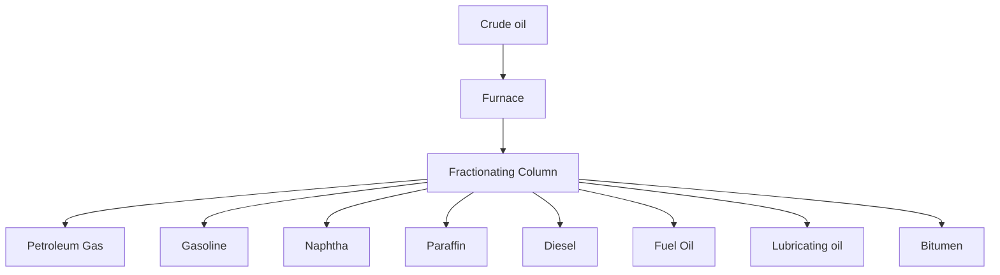

3. Test the following substances in the Laboratory to find out whether they are soluble in water or not:

<table>
  <tbody>
    <tr>
        <td>Sr. No.</td>
        <td>Name of solute</td>
        <td>Water as a solvent</td>
        <td>Soluble/insoluble</td>
    </tr>
    <tr>
        <td>1</td>
        <td>Common salt</td>
        <td></td>
        <td></td>
    </tr>
    <tr>
        <td>2</td>
        <td>Sugar</td>
        <td></td>
        <td></td>
    </tr>
    <tr>
        <td>3</td>
        <td>Glucose</td>
        <td></td>
        <td></td>
    </tr>
    <tr>
        <td>4</td>
        <td>Chalk powder</td>
        <td></td>
        <td></td>
    </tr>
    <tr>
        <td>5</td>
        <td>Sodium hydroxide</td>
        <td></td>
        <td></td>
    </tr>
    <tr>
        <td>6</td>
        <td>Sodium carbonate</td>
        <td></td>
        <td></td>
    </tr>
    <tr>
        <td>7</td>
        <td>Sodium bicarbonate</td>
        <td></td>
        <td></td>
    </tr>
    <tr>
        <td>8</td>
        <td>Calcium oxide</td>
        <td></td>
        <td></td>
    </tr>
    <tr>
        <td>9</td>
        <td>Copper sulphate</td>
        <td></td>
        <td></td>
    </tr>
    <tr>
        <td>10</td>
        <td>Iodine</td>
        <td></td>
        <td></td>
    </tr>
    <tr>
        <td>11</td>
        <td>Citric acid</td>
        <td></td>
        <td></td>
    </tr>
    <tr>
        <td>12</td>
        <td>Oil</td>
        <td></td>
        <td></td>
    </tr>
    <tr>
        <td>13</td>
        <td>Grease</td>
        <td colspan="2"></td>
    </tr>
  </tbody>
</table>

The top of the page features an image of a large solar farm with wind turbines in the background. Overlaid on this image are three circular callouts with questions:
*   What is Energy?
*   What is the difference between potential energy and kinetic energy?
*   What are the sources of energy?

# 08 Energy

### Students Learning Outcomes
**After studying this chapter, students will be able to:**

*   Recognize energy as a physical quantity.
*   Relate potential energy and kinetic energy.
*   Demonstrate an energy transfer such as a bouncing ball by energy transfer diagram, e.g., potential energy (gravitational potential energy, elastic potential energy), kinetic energy (motion, thermal, light, sound, electricity, etc.)
*   State the Law of Conservation of Energy and explain how the law applies to different situations.
*   Compare the Renewable Energy Sources (wind, water, Sun and plants) and Non-Renewable Sources of energy (coal, natural gas, crude oil).
*   Identify the advantages of using renewable energy resources.
*   Assemble and demonstrate a solar panel to operate a small fan. (STEAM)
*   Design and make a solar water heater. (STEAM)

### VOCABULARY

<table>
  <tbody>
    <tr>
        <td>Energy</td>
        <td>Kinetic energy</td>
        <td>Potential engergy</td>
        <td>Energy converter</td>
        <td>Solar panel</td>
    </tr>
    <tr>
        <td>Ability to do work</td>
        <td>Energy due to motion of an object</td>
        <td>Energy due to position of an object</td>
        <td>A device which converts one form of energy into another</td>
        <td>A device that converts solar energy into electricity</td>
    </tr>
  </tbody>
</table>

# Recall what you have learnt in previous classes

The ability to do work is called energy. For doing every work, we need energy. What makes us move? What makes the car run? What makes the food cook? What makes the plants prepare food? What makes the bulb glow? What is produced from beating a drum? The answer to all these questions is energy (**Figure 8.1**).

The following images illustrate different forms of energy:
- A car moving on a road (Mechanical energy).
- Food being cooked in a pan on a stove (Heat energy).
- A diagram of a leaf showing photosynthesis: Light energy and Carbon dioxide in, Oxygen out (Chemical energy).
- A person beating a drum (Sound energy).

**Figure 8.1 Different forms of energy**

### Activity 8.1 Assessment

Give examples of each form of energy mentioned below:

* Mechanical energy
* Electrical energy
* Heat energy
* Light energy
* Nuclear energy
* Chemical energy
* Sound energy

In this chapter, we will learn how to relate different forms of energy, energy transfer, conservation of energy and sources of energy.

### Inquiry 8.1

Identify the forms of energy used in the following systems to produce light.

- A burning candle.
- A glowing electric bulb.
- The Sun.

Heat, light, sound, electricity, mechanical energy, chemical energy, nuclear energy, etc., are different forms of energy. All these forms of energy can be put into two main categories, i.e., Potential Energy (P.E.) and Kinetic Energy (K.E.).

## 8.1 POTENTIAL ENERGY (P.E.)

The energy stored in an object due to its position or some chemical or mechanical process is called **potential energy (P.E.)**. Examples of potential energy are as under:

## Gravitational potential energy

An object placed on ground cannot do any work. When it is raised at certain height, i.e., lifted above the ground, work is done against the **Earth's gravity** which is stored in the object as energy due to its position and is called **gravitational potential energy (Figure 8.2)**.

The illustration shows a person standing on the ground. One brick lies on the ground next to his feet with the caption "This brick does not have potential energy". The person is holding another brick high above his head with the caption "This brick has the potential to fall. It has potential energy."

**Figure 8.2 Gravitational potential energy**

## Elastic potential energy or strain energy

Some materials can be easily squashed, stretched or bent by applying force on them but, they come back into their original shape when the force acting on them is removed. Stretched rubber band stores energy in it. Similarly, squashing or stretching or winding spring stores energy **(Figure 8.3)**. Such a stored energy is called **elastic potential energy or strain energy**.

The illustrations for Figure 8.3 include:
*   A hand stretching a red rubber band.
*   A hand pulling back a slingshot.
*   Hands compressing and stretching a metal spring.
*   A person pulling back the string of a bow.

### A toy car driven by a winding key

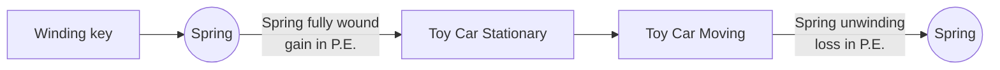

**Figure 8.3 Elastic potential energy or strain energy**

## Chemical energy

Energy stored in food, batteries, biomass, fossil fuels, etc., is the result of chemical processes and is thus called **chemical energy (Figure 8.4)**.

<table>
  <thead>
    <tr>
        <th>Cell/Battery</th>
        <th>Fuel</th>
        <th>Wood</th>
        <th>Food</th>
    </tr>
  </thead>
  <tbody>
    <tr>
        <td>An image showing a small battery cell and a large lead-acid battery.</td>
        <td>An image showing a barrel of oil, a gas cylinder, and a pile of coal.</td>
        <td>An image showing a cut log of wood.</td>
        <td>An image showing various food items like milk, vegetables, fruits, and eggs.</td>
    </tr>
  </tbody>
</table>

**Figure 8.4 Examples of stored chemical energy**

## 8.2 KINETIC ENERGY (K.E.)
The energy possessed by an object due to its motion is called **kinetic energy (K.E.)**. Any moving object has kinetic energy (**Figure 8.5**).

<table>
    <tr>
        <th>Flying airplane</th>
        <th>Boy cycling</th>
        <th>Moving car</th>
        <th>Rotating windmill</th>
        <th>Boy skateboarding</th>
        <th>Ball kicked by boy</th>
    </tr>
</table>**Figure 8.5 Kinetic energy of the objects**

Other examples of kinetic energy are as under:

### Heat energy
Energy of a substance due to movement of its particles is called **heat energy**. When a substance is heated, its particles move fast and its hotness or temperature increases. When a substance is cooled movement of its particles slows down and temperature decreases (**Figure 8.6**).

The image shows three beakers representing states of matter:
*   **Solid:** Particles are closely packed in a regular arrangement.
*   **Liquid:** Particles are close together but can move past each other.
*   **Gas:** Particles are far apart and moving rapidly, with heat being applied from below.

**Figure 8.6 Heat energy of the objects**

### Light energy
Light is a form of energy. It travels in the form of rays and waves.

### Sound energy
Sound is a form of energy. It is produced by vibrating objects.

### Electrical energy
Flow of electrical charge is called electrical energy or electricity. It is produced by electric generators.

### Mechanical energy
Mechanical energy is the energy possessed by an object due to its motion as well as due to its position. Therefore, it is the sum of kinetic energy and potential energy.

At hydropower stations, flowing water energy (K.E.) is used to produce electricity. In wind power stations, energy (K.E.) of wind is used to produce electricity.

> ### Informative
> Sound travels in waves and can be sensed with our ears. It needs medium to travel through. It cannot travel through vacuum. It travels fast through solids and liquids as compared to air. The speed of sound in water is almost 5 times greater than in air and about 15 times greater in solid objects than air.

## 8.3 ENERGY AS A PHYSICAL QUANTITY
A physical quantity is the property of matter or value of a system that can be quantified or measured. Energy is expressed as work done. It can be measured. It is therefore a physical quantity. In System International (SI), the standard unit used to measure energy is **Joule (J)**.

### Activity 8.2

**Teacher Guide**
Facilitate students perform activity as under:
*   Take four beakers or mugs and mark them as 1, 2, 3 and 4.
*   Fill the beaker 1, 2, 3 with water and beaker 4 with ice.
*   Dip thermometer in each beaker.
*   Place beaker 1 on low heating burner, beaker 2 in the sun, beakers 3 and 4 on the table in your class room.
*   After 4 to 5 minutes, observe and record the temperature of water in different beakers as under:

The image shows four beakers with thermometers:
(1) Beaker on a burner with a flame.
(2) Beaker in an open environment.
(3) Beaker on a flat surface.
(4) Beaker filled with ice cubes on a flat surface.

<table>
  <tbody>
    <tr>
        <td>Temperature of water in beaker 1</td>
        <td>Temperature of water in beaker 2</td>
        <td>Temperature of water in beaker 3</td>
        <td>Temperature of water in beaker 4</td>
    </tr>
    <tr>
        <td>.................................. °C</td>
        <td>.................................. °C</td>
        <td>.................................. °C</td>
        <td>.................................. °C</td>
    </tr>
  </tbody>
</table>

### Activity 8.3

**Teacher Guide**
Facilitate students to perform activity as under:
1.  Switch on the electric bulb, fan or any other electric appliance fitted in your room or classroom.
2.  Observe the reading scale on the electric meter fitted to measure the use of electricity in your school or home.
3.  Examine the electricity consumer bill served by the electric supply company last month.
4.  Discuss how monthly consumed electricity in your school or home is measured and utility bill is calculated.

## 8.4 LAW OF CONSERVATION OF ENERGY

After various experiments, scientists have concluded that **"Energy can neither be created nor be destroyed, but, it can be changed from one form to another."** This fact is known as law of conservation of energy. Let us explain this law with the help of a simple pendulum (Figure 8.7).

As shown in the Figure 8.7, the position **A** is the mean position of the bob (metallic ball). If it is displaced from position **A** to **B** and left free to move to and fro from position **B** to **C** and **C** to **B** by passing through **A**. During motion, its energy will be conserved as under:

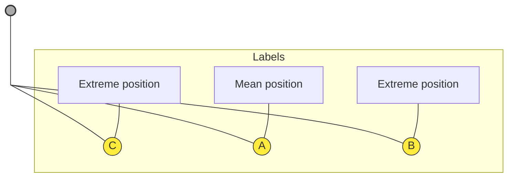
**Figure 8.7 Conservation of energy in the motion of a simple pendulum**

*   At positions **B** and **C**, it has maximum potential energy and no kinetic energy.
*   During motion from **B** to **A** and from **C** to **A**, its potential energy keeps converting into kinetic energy.
*   At position **A**, it has maximum kinetic energy and no potential energy.
*   During motion from **A** to **B** and then back from **A** to **C**, its kinetic energy keeps converting into potential energy.
*   During the process, energy is also consumed in the form of work done.

In this way, the energy keeps on changing its forms but not ceased.

# Activity 8.4 Energy Transfer (bouncing ball activity)

**Teacher Guide**
* Take a rubber ball and lift it up above the ground at certain height.
* Then leave it and let it fall towards the ground.

The ball, after hitting the ground, will bounce back, go up into the air to a certain height and then again fall towards the ground and go on repeating same processes.

```mermaid
graph LR
    subgraph Stage1 [1]
    S1_Text[GPE &rarr; KE]
    S1_Ball(( ))
    S1_Arrow[&#9660;]
    end

    subgraph Stage2 [2]
    S2_Text[KE &rarr; EPE]
    S2_Ball([ ])
    S2_Arrow[&#9650;]
    end

    subgraph Stage3 [3]
    S3_Text[EPE &rarr; KE]
    S3_Ball(( ))
    S3_Arrow[&#9650;]
    end

    subgraph Stage4 [4]
    S4_Text[KE &rarr; GPE]
    S4_Ball(( ))
    S4_Arrow[&#9650;]
    end

    style S1_Ball fill:#00BFFF,stroke:#333,stroke-width:2px
    style S2_Ball fill:#00BFFF,stroke:#333,stroke-width:2px
    style S3_Ball fill:#00BFFF,stroke:#333,stroke-width:2px
    style S4_Ball fill:#00BFFF,stroke:#333,stroke-width:2px
```

Observe/ Think and notice as under:

**Stage 1**
* The form of energy stored in the ball when you lift it up above the ground up to a certain height.
* During falling towards the ground, what form of energy is converting into what form.

**Stage 2**
* When ball hits the ground and gets its shape changed; what form of energy is converted into what.

**Stage 3**
* When the ball retains its shape; what form of energy is converted into what.

**Stage 4**
* When the ball bounces back and is moving up into the air; what form of energy is converting into what form.

<table>
    <tr>
        <td>*GPE</td>
        <td>: Gravitational Potential Energy</td>
    </tr>
    <tr>
        <td>*EPE</td>
        <td>: Elastic Potential Energy</td>
    </tr>
    <tr>
        <td>*KE</td>
        <td>: Kinetic Energy</td>
    </tr>
    <tr>
        <td>*PE</td>
        <td>: Potential Energy</td>
    </tr>
</table>**Result**
Write what do you conclude from this activity?
____________________________________________________________________________________________________
____________________________________________________________________________________________________
____________________________________________________________________________________________________

## Energy converters
It is our daily observation in our homes that electrical energy is converted into light, heat, sound and many other forms of energy or works done. The devices which convert one form of energy into another are called **energy converters**.

**Examples:**

<table>
  <thead>
    <tr>
        <th>Energy converter</th>
        <th></th>
        <th>Energy changes</th>
        <th></th>
    </tr>
  </thead>
  <tbody>
    <tr>
        <td>Plants</td>
        <td>Convert light energy into chemical energy stored in food</td>
        <td colspan="2"></td>
    </tr>
    <tr>
        <td>Car engine</td>
        <td>Converts chemical energy stored in fuel into heat energy, sound energy, etc.</td>
        <td colspan="2"></td>
    </tr>
    <tr>
        <td>Electric drill</td>
        <td>Converts electrical energy into kinetic energy, sound energy, and heat energy.</td>
        <td colspan="2"></td>
    </tr>
    <tr>
        <td>Washing machine</td>
        <td>Converts electrical energy into kinetic energy, sound energy, and heat energy.</td>
        <td colspan="2"></td>
    </tr>
  </tbody>
</table>

### Activity 8.5 Energy Converters
Think and explain what form of energy is converted into which form by the following converters:

*   **Electric fan**: (Image of a desk fan)
*   **Television**: (Image of a television set)
*   **Radio**: (Image of a portable radio)
*   **Solar panel**: (Image of a solar panel array)
*   **Mitochondria in living body cells**: (Diagram of a mitochondrion)

### Dissipation of energy
When energy is converted to a form of energy useful to us, many other forms of energy that are not useful to us may be produced and spread out. This spreading out of energy into different forms is called **dissipation of energy**. The dissipated forms of energy are wasted. Hence, the dissipated is also called **wasted energy**.

For example; when we switch on the electric bulb, light is useful to us, but the heat produced by glowing bulb is wasted and thus called dissipated energy.

## 8.4 SOURCES OF ENERGY
The Sun is the biggest source of energy. We also produce energy from flowing water, wind, plant, coal, crude oil, natural gas, uranium, etc. We need to overcome energy crises by efficient utilization of energy resources.

### 8.4.1 Renewable Sources of Energy
The sources of energy that will not go to end or that can be recovered are called **renewable sources of energy**. Solar energy, flowing water, wind, plants, etc., are the renewable sources of energy.

#### Solar Energy
The energy of the Sun which reaches on the Earth and other planets in the form of heat and light is called **solar energy**. We use solar energy in every walk of life. Plants use it for making food. Solar cells use it in calculators, watches, etc., (**Figure 8.8**). Solar energy is the everlasting source of energy. It is available for use free of cost all the time. It is pollution-free. It cannot go to end. It is thus called a renewable source of energy.

**Photosynthesis Diagram**
The diagram shows a plant under the sun.
*   **Sun**: Source of Light energy.
*   **Leaves**: Oxygen out; Carbon dioxide in.
*   **Roots**: Water and nutrients from the soil.

**Figure 8.8 (a) Plants use light energy.**

**Figure 8.8 (b) Making of solar panels.**

Solar heating systems use solar energy to heat water in our homes (**Figure 8.9**). Solar energy is converted into electrical energy by using solar panels (**Figure 8.10**).

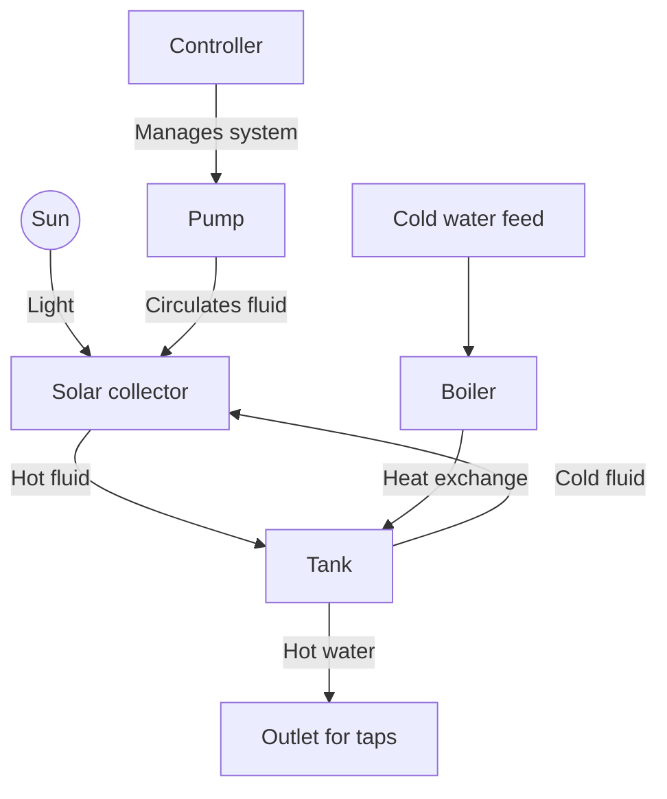
**Figure 8.9 Solar water heating system.**

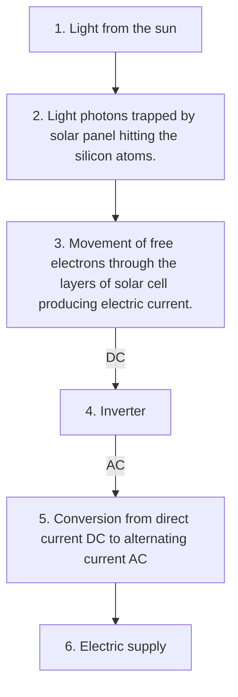
**Figure 8.10 Working of solar panels.**

### Activity 8.6
**Teacher Guide**
Assemble and demonstrate a solar panel to operate a small fan

**Material required**
Solar panel (10 watt), electric wires, a small DC fan, electric switch or key, etc.

**Procedure**
*   Take a piece of electric wire (1 meter long) and connect its one end with negative terminal of the solar panel and other with the fan.
*   Take two other pieces of electric wire (each half meter long) and connect one end of each of these with the switch or key.
*   Now connect free end of one wire with the fan and free end of the other wire with the solar panel.
*   Place the solar panel in the direct sunlight.
*   Switch on/ turn the key on and observe what happens.
*   The fan will start working using the electricity produced by solar panel.

The image shows a small solar panel connected to a blue plastic DC fan mounted on a wooden base with a switch.

### Flowing water energy
Hydroelectric power stations convert energy of flowing water (kinetic energy) into electricity (**Figure 8.11**). Flowing water is available free of cost. It is used to turn turbines which in turn move electric generators for producing electricity. It is a recoverable source. Hydropower is thus, a renewable source of energy.

**Figure 8.11 Hydropower plant**
The diagram shows a cross-section of a hydropower plant. It includes:
- A **Reservoir** of water held back by a **Dam**.
- A **Screen** at the intake to filter debris.
- A **Gate** to control water flow into the intake pipe.
- Water flowing down through a pipe (indicated by pink arrows) to a **Turbine**.
- The turbine is connected to a **Generator** housed in a building.
- The generator is connected to a **Transformer** and then to **Transmission lines** on a pylon.
- Water exits the turbine into an **Afterbay**.

> ### Inquiry 8.2
> Conduct an interactive discussion on the hypothesis that rivers and other flowing-water bodies are a renewable source of energy.

### Wind/Tidal energy
Wind moves the windmills (**Figure 8.12**) which in turn moves turbines to run electric generators for producing electricity. Wind is available free of cost. It does not produce any pollution. It cannot be finished and is therefore a renewable source of producing electricity.

**Figure 8.12 A wind farm**
The image shows several large white wind turbines with three blades each, situated in a yellow field under a blue sky.

### Biogas energy
Biogas energy is the heat energy that is produced from decay of organic wastes or by burning plant wood. It is used as fuel in homes. It is cheaper than other fuel and produces less pollution. It is also a renewable source of energy.

### 8.4.2 Non-renewable sources of energy
Coal, natural gas, and crude oil, etc., are non-renewable sources of energy (**Figure 8.13**).

The image shows three panels representing non-renewable energy sources:
1. A photograph of a **Coal mine** showing piles of coal.
2. A photograph of the **Sui gas field in Pakistan** showing industrial gas processing towers.
3. A diagram of a fractional distillation column for **Crude oil**.

The crude oil diagram illustrates the following products extracted at different levels:
*   Petroleum Gas
*   Gasoline
*   Naphtha
*   Paraffin
*   Diesel
*   Fuel oil
*   Lubricating oil
*   Bitumen

The diagram shows crude oil entering a furnace and then being processed in the distillation tower.

**Figure 8.13 Non-renewable sources of energy**

Non-renewable sources of energy are not recovered soon. They take very long time for their recovery. Permanent and extensive use of non-renewable sources of energy on large scale can create a huge shortage of these resources. This will result into a big energy problem. That is why we need to make maximum use of renewable energy resource for generating electricity and fulfilling our other needs of energy in terms of heat and light, etc.

### Advantages of using renewable energy sources
Renewable energy sources are available free of cost and they don't produce pollution while using them for generating electricity. Solar energy is an everlasting source of energy. Plants use it to make food. It maintains the temperature of our planet (the Earth) suitable for survival of life on it. We can use it to generate electricity through solar panels.

Flowing water in rivers and wind in the coastal areas are free of cost sources of kinetic energy that can be converted into electricity using turbines, windmills and electric generators.

> ### Scientific Investigation
> #### Comparison of Renewable and Non-Renewable Energy Sources
> **Teacher Guide**
> Facilitate students to investigate as under:
> *   Use your school library and internet resources and investigate about renewable and non-renewable sources of energy to enhance the learning given in your textbook.
> *   Conduct a comparison between renewable and non-renewable energy sources.
> *   Identify the advantages of using renewable energy sources.

> ### Brain teaser
> Un-jumble the followings to make meaningful words:
> <table>
  <tbody>
    <tr>
        <td>&gt; atoeptnil</td>
        <td>[ ]</td>
        <td>elvotinesi</td>
        <td>[ ]</td>
    </tr>
    <tr>
        <td>&gt; wnaeleebr</td>
        <td>[ ]</td>
        <td>anailttvirgo</td>
        <td>[ ]</td>
    </tr>
    <tr>
        <td>&gt; ceiktin</td>
        <td>[ ]</td>
        <td>silcate</td>
        <td>[ ]</td>
    </tr>
    <tr>
        <td>&gt; lrsoa</td>
        <td>[ ]</td>
        <td>npuuemdl</td>
        <td>[ ]</td>
    </tr>
    <tr>
        <td>&gt;</td>
        <td colspan="3"></td>
    </tr>
  </tbody>
</table>

# KEY POINTS

*   Ability to do work is called energy.
*   Gravity is the force of attraction between any two objects.
*   Size of gravitational force is related to mass of an object.
*   Result of an action or a process is in fact the result of the energy transfer.
*   A machine used to convert one form of energy into another is called energy converter.
*   Energy is not destroyed. It changes into other forms or work.
*   Some part of energy may also be is dissipated in surrounding during its conversion.
*   Solar energy, flowing water, wind and biogas, etc. are the renewable sources of energy.
*   Coal, crude oil, natural gas, etc., are non-renewable sources of energy.

# QUESTIONS

### 8.1 Encircle the correct option.

1.  **Temperature of an object is the measure of .................... of its particles:**
    a. gravitational potential energy
    b. strain energy
    c. kinetic energy
    d. sound energy

2.  **When we drill a hole in an object, which of the following forms of kinetic energy is useful to us?**
    a. sound
    b. heat
    c. light
    d. mechanical energy

3.  **Our food is a source of:**
    a. mechanical energy
    b. chemical energy
    c. sound energy
    d. electrical energy

4.  **An example of renewable energy sources:**
    a. coal
    b. natural gas
    c. wind
    d. petrol

5.  **During work done, energy is:**
    a. produced
    b. destroyed
    c. wasted
    d. converted into other form

6.  **Which of the following is not an energy converter?**
    a. table
    b. radio
    c. fan
    d. room heater

7. **A fruit after its detachment from a tree-stalk begins to convert energy due to its position into:**
   a. strain energy
   b. kinetic energy
   c. chemical energy
   d. electrical energy

8. **The mixture of gases formed by the decay of animals wastes:**
   a. greenhouse gas
   b. biogas
   c. natural gas
   d. water gas

9. **Engine of a vehicle starts working using:**
   a. electrical energy
   b. light energy
   c. heat energy
   d. sound energy

10. **During an energy conversion, the total amount of energy:**
    a. destroys
    b. decreases
    c. increases
    d. remains the same

## 8.2 Give short answer.
1. Name three forms of stored energy.
2. Dissipated energy is also called wasted energy. Why?
3. Define the law of conservation of energy.
4. Where does the energy produced by a dynamo come from?

## 8.3 Constructed Response Questions
1. Fill in the following columns:
   * "A" with the form of energy used by the converter.
   * "C" with the form(s) of energy produced by the converter.

<table>
  <thead>
    <tr>
        <th>A</th>
        <th>B (Energy converter)</th>
        <th>C</th>
    </tr>
  </thead>
  <tbody>
    <tr>
        <td></td>
        <td>Dynamo</td>
        <td></td>
    </tr>
    <tr>
        <td></td>
        <td>Catapult</td>
        <td></td>
    </tr>
    <tr>
        <td></td>
        <td>Burner</td>
        <td></td>
    </tr>
    <tr>
        <td></td>
        <td>Balloon while blowing up</td>
        <td></td>
    </tr>
    <tr>
        <td></td>
        <td>Tree</td>
        <td></td>
    </tr>
  </tbody>
</table>

2. Which main energy transfer takes place in the following examples?
   (a) A child kicking a football.
   (b) A person walking upstairs.

(c) Water being boiled in a kettle.
(d) A glowing bulb.

3 A driver turns the key of a car engine, the engine sounds 'rrr rrr rrr', but does not start. What can be the cause?

4 Imagine that you drop down a ball from a certain height. It makes a few bounces from the ground, moves some distance on the ground and finally comes to rest. Your friend says that the ball has lost all of its energy. How will you respond your friend's statement in the light of law of conservation of energy?

### 8.4 Investigate the examples of energy conversions on your way home from school by a bicycle.

### 8.5 Project
**Teacher Guide**
Facilitate students:
* Drop a metallic sphere from the heights of 5 cm, 10 cm, 15 cm, and 20 cm respectively on a uniform surface of sand.
* Measure the diameter of the pits made on sand surface by falling the metallic sphere from above mentioned heights.
* Plot a graph between the sphere's P.E. at the heights of 5 cm, 10 cm, 15 cm & 20 cm and the works done appeared in the form of pits of different diameters.
* Discuss the graph with your teacher and classmates.

The image shows a sandy beach with a small pit or indentation in the sand, likely representing the experiment described in the project where a sphere is dropped to create a pit. The ocean waves are visible in the background.

The image shows a high-voltage electricity pylon against a blue sky with clouds, with the sun shining through the structure.

*   Why is electricity important for us?
*   How do we produce electricity?
*   How are material objects charged?

# 09 Electricity

### Students Learning Outcomes
**After studying this chapter, students will be able to:**

*   Explain the phenomena of static electricity in everyday life.
*   Recognize electric current as a flow of charges.
*   Describe a simple circuit as a path for flow of charges.
*   Differentiate between open and closed circuits.
*   Draw and interpret simple circuit diagrams (using symbols).
*   Describe the characteristics of series and parallel circuits.
*   Draw and construct a series and parallel circuits.
*   Identify the use of series and parallel electric circuits in daily life.
*   Investigate the factors that affect the brightness of bulbs or speed of motors, number of batteries, number of bulbs, type of wire, length of wire, thickness of wire.
*   Assemble and operate a trip wire security alarm system using simple items. (STEAM)

### VOCABULARY

<table>
  <thead>
    <tr>
        <th>Electric current</th>
        <th>Electric circuit</th>
        <th>Electric switch</th>
        <th>Battery</th>
        <th>Static electricity</th>
        <th>Charge</th>
    </tr>
  </thead>
  <tbody>
    <tr>
        <td>Flow of electric charge</td>
        <td>The path along which electric charge flows</td>
        <td>A device used to open or close the electric circuit</td>
        <td>A source of electric charges</td>
        <td>Electricity due to charges at rest</td>
        <td>A basic property of matter</td>
    </tr>
  </tbody>
</table>

# Recall what you have learnt in previous classes

Electricity is a form of energy. It is produced by the charge. Charge is the basic property of matter. It is of two types, i.e., positive charge and negative charge. Positively charged protons and negatively charged electrons are present in every atom of the matter **(Figure 9.1)**.

The diagram shows an atom with a nucleus containing protons (marked with +) and neutrons, with electrons (marked with -) orbiting in shells.
*   **+** Proton
*   **●** Neutron
*   **-** Electron

**Figure 9.1 Electrons, neutrons and protons in an atom**

### Properties of charge
1. Like charges repel each other.
2. Opposite charges attract each other **(Figure 9.2)**.

The following table represents the interactions shown in Figure 9.2:

<table>
  <thead>
    <tr>
        <th>Like charges repel</th>
        <th>Opposite charges attract</th>
    </tr>
  </thead>
  <tbody>
    <tr>
        <td rowspan="2">Two positive charges with arrows pointing away from each other:   (← +) (+ →)   Two negative charges with arrows pointing away from each other:   (← -) (- →)</td>
        <td>Positive and negative charges with arrows pointing towards each other:   (+ →) (← -)</td>
    </tr>
  </tbody>
</table>

**Figure 9.2 Properties of charges**

> ### Inquiry 6.1
> **Teacher Guide**
> Facilitate students investigate and conduct a discussion to conclude about the inquiry as under:
> *   Despite the presence of positively charged protons and negatively charged electrons in an atom, it is known as a neutral particle. Why?
>
> **Investigation and discussion**
> *   As far as, the total number of negatively charged electrons remains equal to the total number of positively charged protons in an atom, the sum of negative charge cancels the effect of sum of the positive charge. In this way, the atom remains neutral.
> *   Some material objects, when rubbed with some other objects, lose or gain electrons. The object which loses electrons acquires positive charge on it, as the number of positively charged protons increases as compared to the number of electrons present there. On the other hand, the object which gains electrons, acquires negative charge on it, as the number of negatively charged electrons increases as compared to the number of protons present there.
> *   When a positively charged object comes close to the negatively charged object, both objects attract each other.
> *   When similarly charged objects come closer, they repel each other.
>
> **Conclusion:**
> __________________________________________________________________________________________
> __________________________________________________________________________________________

## 9.1 STATIC ELECTRICITY

The charge produced on an object remains there at rest. When the charge at rest is gathered on an object, it is known as **static electricity**. The word static means something at rest. Charge is often created when things are rubbed together.

Lightning (**Figure 9.3**) is an example of static electricity. When clouds rub against the air, a huge charge is gathered on them. When oppositely charged clouds approach or meet, a big spark is produced, which is called **lightning**.

The image shows a photograph of multiple bright blue lightning bolts striking down from a dark sky.
**Figure 9.3** Lightning

### Activity 9.1
*   Place a few paper bits on the table.
*   Pull a plastic comb through your dry hair twice or thrice in the same direction.
*   Bring the comb near the paper bits. Do the bits stick to it? Why does the comb attract these paper bits?
*   The reason for this phenomenon is that the comb has acquired charge.

The image shows a hand pulling a red comb through brown hair, and then the comb attracting small white bits of paper.

### Recall

### Activity 9.2
*   Suspend an inflated balloon with the stand using a thread.
*   Bring a piece of woolen cloth near to it. Does the cloth attract the balloon towards it?
*   Rub the balloon vigorously with the woolen cloth and then remove it.
*   Bring the cloth nearer the balloon slowly, once again.
*   Does the cloth attract the balloon this time? You will observe that the cloth attracts balloon this time.
*   The reason is that there was no charge on both of them before rubbing. After rubbing they have acquired opposite charges due to which they attract each other. The balloon has acquired negative charge and the cloth positive charge.

The image shows a person holding a blue cloth near a red balloon hanging from a stand. In the first frame, there is no interaction. In the second frame, after rubbing, the balloon is pulled toward the cloth.

### Activity 9.3
*   Suspend two inflated balloons with the stands using thread.
*   Place them at a small distance from each other as shown in the Figure.
*   Bring the balloons closer by moving the stands. Do the balloons attract or repel each other?
*   Rub each balloon with a woolen cloth. Bring them close, again. Do they attract or repel each other?
*   Now rub one balloon with woolen cloth and the other with a plastic comb or ruler.
*   Bring the balloons closer. Do they attract or repel each other? What inference do you draw from your observations?
*   When balloons were rubbed with woolen cloth, both of them acquired negative charge. Due to which they repelled each other.

The image shows two diagrams. The first shows two pink balloons hanging straight down. The second shows two pink balloons, both labeled with a minus sign (-), pushing away from each other.

*   When one balloon was rubbed with woolen cloth and the other with plastic object they acquired opposite charges. Hence, they attracted each other.

> **Point to ponder**
>
> What makes the balloon negatively charged when rubbed with woolen cloth?

The image shows two balloons hanging from stands. One balloon is marked with a "+" (positive charge) and the other with a "-" (negative charge). They are shown moving towards each other, indicating attraction.

## 9.2 CURRENT ELECTRICITY

When the positive terminal of battery is connected to its negative terminal through a metallic (copper) wire, charge begins to flow through the wire. The electricity produced by the flow of charge is called **current electricity (Figure 9.4)**.

The image (Figure 9.4) shows a battery connected to a glowing light bulb via blue wires.

**Figure 9.4 Current electricity**

### Electric Circuit

> **Electric circuit is a path of flow of current.**

In our homes, we turn ON the switch to light a bulb or to run a fan. The same switch is also used to turn them OFF. Various electric circuits are made for this purpose.

### Simple Electric Circuit

Let us make a simple electric circuit.

#### Activity 9.4

*   Insert a torch bulb in a holder.
*   Connect the bulb to a cell or battery through a switch with the help of metal wires as shown in the Figure.
*   Turn the switch ON and observe the bulb. Does it start glowing?
*   Now, turn the switch OFF and observe the bulb. Why did it stop glowing? When the switch is turned ON then why does the bulb start glowing?
*   Bulb starts glowing because an electric current flows through it.
*   Electric current passes through the cell or battery, bulb, switch and wires as shown in Figure. They together provide a path for current to flow through.

The diagram for Activity 9.4 shows a circuit consisting of a glowing bulb, a battery (two cells), and a closed switch, all connected by wires.

As you see in the Figure (Activity 9.4), the battery, bulb and switch are connected through wires in an electric circuit.

> **Bulb, battery or cell and switch are called the components of electric circuit.**

Battery is a source of electric current. The switch is used to control the flow of current and glowing bulb indicates that current is passing through it.

### Open and Closed Circuits

You have learnt that on turning the switch ON, the circuit becomes complete or **closed** due to which the current starts flowing through it. On turning the switch OFF, the circuit becomes

incomplete or OPEN, so the current stops flowing through the circuit. It is called **open circuit (Figure 9.5)**.

The image shows two illustrations of simple electric circuits.
1. **Closed circuit**: Shows a battery connected to a glowing light bulb via a closed switch and wires.
2. **Open circuit**: Shows a battery connected to a non-glowing light bulb via an open switch and wires.

**Figure 9.5 Open and closed circuit**

### Components of Electric Circuit
**Electric cell** or **battery**, **key (switch)**, **conductors (wires)**, **bulb** and other devices which are used for making an electric circuit are called components of an electrical circuit (**Figure 9.6**).

<table>
  <thead>
    <tr>
        <th>Electric components</th>
        <th>Electric cell</th>
        <th>Electric bulb</th>
        <th>Switch in ON position</th>
        <th>Switch in OFF position</th>
        <th>Battery</th>
        <th>Wire</th>
        <th></th>
    </tr>
  </thead>
  <tbody>
    <tr>
        <td rowspan="2"></td>
        <td>An image of a single AA battery.</td>
        <td>An image of a glowing yellow light bulb.</td>
        <td>An image of a closed knife switch.</td>
        <td>An image of an open knife switch.</td>
        <td>An image of a 12V car-style battery.</td>
        <td>An image of a pink wavy wire.</td>
        <td></td>
    </tr>
    <tr>
        <td>Symbols</td>
        <td>-| |+</td>
        <td>(image of a bulb symbol)</td>
        <td>(image of a closed switch symbol)</td>
        <td>(image of an open switch symbol)</td>
        <td>-| | | |+</td>
        <td>—</td>
    </tr>
  </tbody>
</table>
**Figure 9.6 Components of electric circuit**

A cell or battery is a device that stores chemical energy and converts it into electrical energy. A switch is a device which is used to open and close an electric circuit. Wire is a conductor which allows the current to pass through the circuit. A bulb is an electrical convertor which converts electrical energy to light energy.

### Circuit diagram
The diagram shown below describes an electric circuit. It is thus, called **circuit diagram (Figure 9.7)**

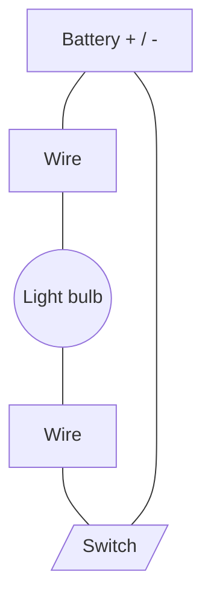
**Figure 9.7 Circuit diagram**

### 9.2.2 Types of Electric Circuit
Based upon the ways the electric devices are connected in the circuit, electric circuits are of two types, i.e., series circuit and parallel circuit.

#### Series circuit
In a series circuit, electric devices are connected one after the other across a source (cell or battery)

in a single lope (**Figure 9.8**). There is only one path for the electric current to flow. The current in a series circuit is the same throughout the circuit. We cannot turn ON and OFF every device independently.

[The image shows two series circuit diagrams. The first diagram has one battery, a switch, and two bulbs connected in a single loop. The second diagram has two batteries connected in series, a switch, and two bulbs in a single loop.]

**Figure 9.8**
**Series circuit**

In a series circuit, current is same in all the components connected in the circuit. Electric current in increases equally in all the components with the number of batteries connected in the circuit.

### Disadvantage of series circuits
Why series circuits are not recommended for domestic or industrial wirings? The reason is that if a fault happens at any part of the circuit, it stops the flow of current in the whole circuit (**Figure 9.9**).

[The image shows a series circuit with two batteries and two bulbs. One bulb is broken (unlit), and as a result, the second bulb is also unlit because the circuit is broken.]

**Figure 9.9 Series circuit**

### Parallel circuit
In a parallel circuit, two or more electric devices are connected independently across a source (cell or battery) giving multiple paths to the current to flow (**Figure 9.10**).

[The image shows two parallel circuit diagrams. The first diagram shows one battery and two bulbs connected in parallel branches, each with its own switch. The second diagram shows one battery and two bulbs in parallel, with one bulb lit and the other unlit due to an open switch in its branch.]

**Figure 9.10 Parallel circuit**

### Advantage of a parallel circuit over the series circuit
The advantage of a parallel circuit over a series circuit is that a break or fault at some branch or device will not stop the current flow to the other branches or devices. Only the faulty branch or device will have a break in current flow.

### Applications of parallel circuits
Parallel circuits are used in electric wiring in our homes, automobiles, e.g., for wiring car headlights. Parallel circuits are also used in computer hardware.

### Factors that affect the brightness of bulbs or speed of motors
Following are the factors that affect the brightness of bulbs or speed of motors:

#### Number of batteries
If the number of batteries connected in a series circuit is increased, the bulbs light up brighter or the speed of motor increases.

#### Number of bulbs
If the number of bulbs connected in a series circuit is increased without increasing the number of batteries, it makes the bulbs dimmer.

### Length of wire
Short wires conduct electric current more easily than long wires. The increase in length of the wire decreases the bulb's brightness. In case, electric motor is connected in the circuit, the increase in length of the wire decreases the speed of the motor.

### Thickness of wire
Thick wires carry more current as compared to thin wires. The bulb glows brighter if the thin wire is replaced with thick wire.

> **Do you know?**
> Lights of a ship are connected in a parallel circuit. If one light goes out, the rest keep on working.

## Tripwire Security Alarm

### Activity 9.5 Assemble and operate a tripwire security alarm

**Material Required**
Clothes clipper, electronic buzzer, lithium battery, two sided adhesive pads, a twist tie, fishing line, copper tape, etc.

**Procedure**
1. Squeeze the ends of a clothes clipper using the thread.
2. Wrap the copper tape around one open end of the clothes clipper.
3. Stick a black wire to top of the copper tape.
4. Attach a buzzer on the copper tape.
5. Place a sticky pad on inside end of the clothes clipper and stick the black wire on its top.
6. Place lithium cell on the top of this black wire keeping its negative side towards the black wire.
7. Take a 3 cm thin cardboard, make a hole in it using a needle.
8. Tie a strong thread around the hole of the cardboard and place it inside clothes clipper's mouth.
9. Release the twist tie at the back of the clothes clipper and attach the thread to the wall.
10. Run the thread across the doorway and make sure that it is tight but not tight to pull out the cardboard.

When some one crosses the thread, it pulls out the cardboard. The clothes clipper will close, completing the circuit and the buzzer will sound.

The following images illustrate the steps of the procedure:
<table>
  <tbody>
    <tr>
        <td>1</td>
        <td>[The image shows a clothes clipper with its ends squeezed together by a twist tie.]</td>
        <td>2</td>
        <td>[The image shows copper tape being wrapped around one open end of the clipper.]</td>
    </tr>
    <tr>
        <td>3</td>
        <td>[The image shows a black wire being stuck to the top of the copper tape.]</td>
        <td>4</td>
        <td>[The image shows a buzzer being attached on the copper tape.]</td>
    </tr>
    <tr>
        <td>5</td>
        <td>[The image shows a sticky pad and black wire being placed on the inside end of the clipper.]</td>
        <td>6</td>
        <td>[The image shows a lithium cell being placed on top of the black wire.]</td>
    </tr>
    <tr>
        <td>7</td>
        <td>[The image shows a needle making a hole in a small piece of cardboard.]</td>
        <td>8</td>
        <td>[The image shows a thread being tied to the cardboard and placed in the clipper's mouth.]</td>
    </tr>
    <tr>
        <td>9</td>
        <td>[The image shows the twist tie being released from the back of the clipper.]</td>
        <td>10</td>
        <td>[The image shows the completed alarm setup with the thread attached to a wall.]</td>
    </tr>
  </tbody>
</table>

# KEY POINTS
* Electricity is a form of energy. It is produced by the charge.
* When the charge at rest is gathered on an object, electricity is known as static electricity.
* The electricity produced by the flow of charge is called current electricity.
* Charge is the basic property of matter. It is of two types, i.e., positive charge and negative charge.
* Electric circuit is the path through which electric current flows.
* Cell or battery, electric wire, electric switch and the bulb, etc., are known as components of

an electric circuit.
*   Electric circuits are of two types, series circuit and parallel circuit.
*   In a series circuit, electrical components are connected one after another in a single loop. The same current flows through each component connected in a series circuit.
*   In a parallel circuit, electrical components are connected in parallel branches. The current flowing through each branch is less than the current flows out from the source (battery).
*   In a series circuit, if some fault happens at any part, it stops the flow of current in the whole circuit.
*   In a parallel circuit, a break or fault at some branch or device will not stop the flow of current through other branches or devices.
*   Increasing the number of batteries in a series circuit, increases the brightness of the bulbs.

# QUESTIONS

**9.1 Encircle the correct option.**

1.  **A positively charged particle:**
    a. electron
    b. proton
    c. neutron
    d. atom

2.  **A device that stores chemical energy and converts it into electric energy when connected in a circuit:**
    a. electric switch
    b. bulb
    c. cell
    d. metallic wire

3.  **A circuit that provides multiple paths to the current to flow:**
    a. series
    b. parallel
    c. open
    d. short

4.  **The type of circuit used in domestic wiring:**
    a. series
    b. parallel
    c. open
    d. short

5.  **A device used to open or close an electric circuit:**
    a. battery
    b. bulb
    c. switch
    d. wire

6.  **Increasing the number of batteries in a series circuit:**
    a. increases the brightness of the bulbs
    b. decreases the brightness of the bulbs
    c. converts the series circuit to parallel circuit
    d. stops the flow of current through the circuit

7.  **The current has only one path to flow through:**
    a. series circuit
    b. parallel circuit
    c. open circuit
    d. close circuit

**9.2 Give short answers.**
1. What is static electricity?
2. Is series circuit preferably used in home wiring?
3. What is current electricity?
4. What types of charges repel each other?
5. Name a few components of an electric circuit.

**9.3 Write answers in detail.**
1. Describe the factors that affect the brightness of the bulbs in series circuits.
2. Describe the characteristics of parallel circuit.
3. What is charge? How does it produce electricity?
4. Explain the phenomenon of lightning.

**9.4 Constructed Response Questions**
1. The electricity due to charges at rest is called static electricity.
    (a) Is it being mostly used in domestic wirings?
    (b) How can it be produced?
    (c) How can we make it useful in daily life?
2. Electric circuit is the path along which electric current flows.
    (a) Sketch an open and closed circuit and differentiate between the two.
    (b) What are series and parallel circuits?
    (c) Describe the advantages of a parallel circuit.
3. What type of circuit contains two or more branches for the current to flow? Explain.
4. Draw and interpret simple circuit diagrams using symbols.

**9.5 Investigate how electricity is produced and supplied to your town and home?**

**9.6 Project**

**Teacher Guide**
Facilitate students build a working model of simple alarm system by using simple easily available items.

[The top of the page features an image of a bar magnet with South (S) and North (N) poles, surrounded by iron filings that illustrate the magnetic field lines.]

*   What are magnets?
*   How are electromagnets made?
*   What do you know about the Earth's magnetism?

# 10 Magnetism

## Students Learning Outcomes
**After studying this chapter, students will be able to:**

*   Recognize that electric current has a magnetic field around it using a magnetic compass.
*   Recognize that a freely-moving magnet comes to rest pointing in a North-South direction.
*   Describe how to magnetize a magnetic material. Describe how to de-magnetize a magnet.
*   Construct an electromagnet and identify its application in daily life.
*   Compare different types of magnets (permanent, temporary and electromagnets).
*   Recognize that there is a space around a magnet where effect of magnetic force can be observed.
*   Draw magnetic field of a bar magnet using iron filings.
*   Recognize Earth's magnetic field which attracts a freely pivoted magnet to line up with it.

## VOCABULARY

<table>
  <tbody>
    <tr>
        <td>Magnet</td>
        <td>Magnetic field</td>
        <td>Electromagnet</td>
        <td>Pole</td>
        <td>Attractive force</td>
        <td>Repulsive force</td>
    </tr>
    <tr>
        <td>A material or object that can attract the objects made of iron, nickel and cobalt</td>
        <td>The area around a magnet in which its magnetic force is experienced</td>
        <td>A material that produces magnetic force with the help of electric current passing through it</td>
        <td>Part of the magnet with maximum magnetic force</td>
        <td>The force which attracts the objects towards each other</td>
        <td>The force which repels the objects away from each other</td>
    </tr>
  </tbody>
</table>

# Recall what you have learnt in previous classes

We have learnt:
* What are magnets?
* What are magnetic materials?
* What are non-magnetic materials?
* Properties of magnets

The image shows various objects being tested with a magnet: a bar magnet, a rock, iron nails, a pencil, and an eraser.
**Figure 10.1 Magnetic and non-magnetic materials**

## Inquiry 10.1

**Teacher Guide**
Facilitate students investigate and conduct discussion to conclude about the hypothesis as under:

**Hypothesis**
**"The force of gravity pulls things down, but a magnetic force acting on a small object may be able to pull it up against the gravity."**

**Investigation and discussion**
What will happen to a paper clip (tied with one end of a thread whose other end is tied and fixed in modeling clay is brought close to a magnet, but not touching with it) left free as shown in the Figure.

The diagram for Inquiry 10.1 shows:
* A wooden stand.
* Modeling clay on top of the stand holding a magnet.
* A paper clip suspended in mid-air below the magnet.
* A delicate thread connecting the paper clip to another piece of modeling clay on the base.

**Conclusion**
________________________________________________________________________________
________________________________________________________________________________

# Recall the following activities:

## Activity 10.1 Properties of a magnet

* Place a bar magnet along east-west direction on a table.
* Suspend another bar magnet from a stand using a thread over it so that it can rotate freely as shown in the Figure.
* Observe and note the direction of suspended magnet when it comes to rest.
* Now remove the magnet placed on the table.
* Observe and note the direction along which the suspended magnet come to rest.
* Why does it happen?

The diagram for Activity 10.1 shows:
* A wooden stand with a hook.
* A bar magnet suspended by a thread, labeled with 'S' (Blue) and 'N' (Red) poles.
* Another bar magnet placed on the table below it, also labeled with 'N' (Red) and 'S' (Blue) poles.
* A compass rose indicating North (N), South (S), East (E), and West (W) directions.

# Activity 10.2 Assessment

Write 'C' against the correct and 'I' against the incorrect statement in the middle column. Also correct the incorrect statement and write it in the next column.

<table>
  <tbody>
    <tr>
        <td>Correct/Incorrect</td>
        <td>C/I</td>
        <td>Correct statement</td>
    </tr>
    <tr>
        <th>Materials which are attracted by the magnet are called magnetic materials</th>
        <th></th>
        <th></th>
    </tr>
    <tr>
        <th>Materials which are not attracted by the magnet are called non-magnetic materials.</th>
        <th></th>
        <th></th>
    </tr>
    <tr>
        <th>A freely suspended magnet always points in the North-South direction.</th>
        <th></th>
        <th></th>
    </tr>
    <tr>
        <th>Like magnetic poles repel each other whereas opposite magnetic poles attract each other.</th>
        <th></th>
        <th></th>
    </tr>
    <tr>
        <th>The Earth behaves like a huge magnet.</th>
        <th colspan="2"></th>
    </tr>
  </tbody>
</table>

# Inquiry 10.2

**Teacher Guide**
Facilitate students investigate and conduct discussion to conclude about the hypothesis as under:

**Hypothesis**
> **"A freely suspended magnet always points in the north-south direction."**

**Conclusion**
__________________
__________________

The image shows a bar magnet suspended by a thread from a wooden stand. The magnet is tilted, with its North (N) pole pointing towards the North and its South (S) pole pointing towards the South, as indicated by a compass rose diagram next to it showing directions N, S, E, and W.

Why does the freely suspended magnet always points in the north-south direction? The answer to this question is a huge Earth's magnetism about which we already have learnt in class-5.

In this chapter we will learn:
* Magnetic field
* Making magnets and demagnetization
* Magnetic effect of electric current
* Electromagnets

# 10.1 MAGNETIC FIELD

A magnet exerts a force on an object (magnetic material) which is brought close to it. The region around a magnet where it can attract magnetic materials is called **magnetic field**. Magnetic field can be detected using iron filings. The tiny pieces of iron line up in a magnetic field (**Figure 10.2**).

The image shows two photographs of iron filings forming patterns around magnets. The first shows a bar magnet standing vertically with filings radiating outwards. The second shows a bar magnet with North (N) and South (S) poles, with filings forming curved lines between the poles.

**Figure 10.2 Magnetic field**

> ### Activity 10.3
> * Take a bar magnet and lay a piece of card over it.
> * Sprinkle the iron filings over the card and tap it gently.
> * What do you observe?
> * Lines made by iron filings around the magnet show the magnetic field.
> * Draw the magnetic field lines by using magnetic compass as shown in the Figure.
>
> The image shows a diagram of a bar magnet with N and S poles. Curved lines with arrows represent the magnetic field lines emerging from the North pole and entering the South pole.

### 10.1.1 Magnetic Effect of Electric Current

Magnets are of two types, i.e., permanent magnet and temporary magnet.

#### Permanent magnets
The magnets which don't lose their magnetic property easily are called **permanent magnets (Figure 10.3)**. Naturally occurring magnets, e.g., loadstone are permanent magnets. Alnico (an alloy of aluminium, nickel and cobalt) and ferrites (ceramic-like material made from a mixture of iron oxides with nickel, strontium or cobalt) are also the examples of permanent magnet.

The image shows various types of permanent magnets: a bar magnet being broken or joined, a horseshoe magnet, and a small rectangular magnet.

**Figure 10.3 Permanent magnet**

#### Temporary magnets
The objects such as iron or steel pieces are magnetized and converted into magnet in the presence of magnetic field or by rubbing permanent magnet on them. They lose their magnetic properties gradually or when magnet field is removed. Such magnets are called **temporary magnets (Figure 10.4)**.

The image shows two methods of creating temporary magnets. On the left, a permanent magnet is rubbed against an iron bar. On the right, a magnetized bar is shown attracting paperclips.

Iron bar to be magnetized
**Figure 10.4 Temporary magnet**

### 10.1.2 Magnetization (Making magnets)

#### Activity 10.4
* Take a bar magnet and an iron nail.
* Rub or stroke the bar magnet on the iron nail many times in the same direction.
* The iron nail will become temporary magnet.
* Check it by bringing near paper clips or common pins.

The image shows a hand holding a bar magnet and stroking it along an iron nail in a continuous circular motion as indicated by blue arrows.

#### Activity 10.5
* Take two bar magnets and an iron bar.
* Place the magnets in the middle of the bar with their opposite ends together.
* Rub the magnets on the bar in opposite directions.
* On reaching at the ends of iron bar, lift the magnets and put them again in the middle of the bar.
* Repeat the process many times.
* The iron bar will become temporary magnet.
* Test its magnetism by bringing it near the paper clips.

The image shows an iron bar labeled A and B. Two bar magnets are placed in the center with opposite poles (N and S) touching. Arrows indicate they are being rubbed outwards towards ends A and B, then lifted and returned to the center.

### 10.1.3 Demagnetization (How to demagnetize a magnet)
A magnet can lose its magnetic property by heating or hammering or dropping it. By heating or hammering or dropping, the particles in a magnet are disturbed and lose magnetic property. This process is called **demagnetization (Figure 10.5)**.

If a weak magnet is kept in the magnetic field of a strong magnet, the weaker magnet will lose its magnetism.

The image (Figure 10.5) illustrates three ways of demagnetization:
1. A hammer hitting a bar magnet.
2. A hand dropping a bar magnet, which then fails to attract pins.
3. A bar magnet being heated over a fire.

**Figure 10.5 Demagnetization**

## 9.2 ELECTROMAGNETS
When electric current flows through an object, it becomes a magnet. Such a magnet is called **electromagnet**. Electromagnet remains a magnet until electric current flows through it. When electric current stops flowing through the object, it is demagnetized. Electromagnets are temporary magnets.

#### Activity 10.6 How to make an electromagnet
* Take an iron nail, wind insulated copper wire around it and make a coil.
* Connect one end of coil to one terminals of a cell or battery.
* Connect the other end of the coil to the other terminal of the cell or batter through an electric switch/key.
* Turn the switch ON and bring the common pins or paper clips near the tip of the nail.
* Observe what happens with the common pins or paper clips.
* Now turn the switch OFF and observe what happens to the common pins or paper clips.

The image shows a circuit diagram:
* A battery with positive (+) and negative (-) terminals.
* An iron nail with a coil of insulated wire wrapped around it.
* A switch/key.
* The components are connected in a loop.

> ### Activity 10.7
> * Design a simple electric circuit as shown in the Figure.
> * Bring a compass needle near the wire when the switch is OFF.
> * Note the direction of the magnetic needle on the compass.
> * Now turn the switch ON and observe the direction of magnetic needle on the compass.
> * Turn the switch OFF and observe the compass.
> * What do you conclude from this activity?
>
> The illustration shows a circuit with a **Bulb**, a **Battery**, a **Switch**, and a **Compass** placed near the connecting wire.

An electromagnet works as a magnet only when electric current flows through it. While fitted in electric appliances, it can be switched ON and OFF. When current flows through it, it works as a magnet. When current stops flowing through it, it becomes an ordinary piece of metal.

### Factors affecting the strength of electromagnets
The following are the factors that affect the strength of electromagnets:

#### Increasing number of loops
Increasing the more turns or loops of wire increases the strength of electromagnets.

#### Increase in current
The strength of an electromagnet increases if greater current passes through it.

#### Metal core
Electromagnets are stronger if they are made by winding the wires around iron core. The iron bearing materials are the best for making electromagnets.

### Uses of Magnets
Since a magnet can pick small iron objects, so you may think that it is an ordinary thing to play with. In fact, there are many uses and advantages of magnets in our daily life. The electric bell that we use in our homes works with a magnet.

When you enjoy music, you receive sound through speakers. The magnet plays an important role to produce sound in the speaker. A dynamo produces electricity with the help of a magnet (**Figure 10.6**).

<table>
    <tr>
        <th>Electric bell</th>
        <th>Speaker</th>
        <th>Dynamo</th>
    </tr>
    <tr>
        <td>[Image of an electric bell]</td>
        <td>[Image of a speaker]</td>
        <td>[Image of a dynamo]</td>
    </tr>
</table>**Figure 10.6 Use of magnets**

Piece of iron or iron filings mixed with other materials can be separated with the help of a magnet as shown in **Figure 10.7 (a)**. **Figure 10.7 (b)** shows a crane lifting heavy iron objects with the help of a big magnet.

<table>
    <tr>
        <th>[Image of a bar magnet attracting iron filings from a bowl]</th>
        <th>[Image of a crane with a large magnetic attachment lifting metal]</th>
    </tr>
    <tr>
        <td>**Figure 10.7 (a) Separating materials**</td>
        <td>**Figure 10.7 (b) Crane**</td>
    </tr>
</table>

# KEY POINTS

*   A magnet is a piece of metal that can attract the objects made of iron, nickel and cobalt.
*   Materials which are attracted by the magnet are called magnetic materials.
*   Materials which are not attracted by the magnet are called non-magnetic materials.
*   Ends of a magnet are called its magnetic poles.
*   A freely suspended magnet always points in the North-South direction.
*   Like magnetic poles repel each other whereas opposite magnetic poles attract each other.
*   The Earth behaves like a huge magnet.
*   The magnets which don't lose their magnetic property easily are called permanent magnets.
*   The magnets which lose their magnetic properties gradually or when magnetic field is removed are called temporary magnets.
*   When electric current flows through an object, it becomes a magnet. Such a magnet is called electromagnet.
*   An electromagnet remains a magnet until electric current flows through it.
*   When electric current stops flowing through the object, it is demagnetized.

# QUESTIONS

### 10.1 Choose the correct option.

1.  **A magnet can attract objects made of**
    a. copper
    b. iron
    c. aluminum
    d. silver

2.  **The ends of a magnet are called its**
    a. sides
    b. heads
    c. terminals
    d. poles

3.  **A freely suspended bar magnet always stays along**
    a. east-west direction
    b. north-south direction
    c. any direction
    d. keeps oscillating

4.  **Magnet is not used in**
    a. dynamo
    b. an electric bell
    c. a speaker
    d. a heater

5.  **Which one is the true statement**
    a. North pole attracts north pole
    b. North pole repels north pole
    c. South pole repels north pole
    d. South pole attracts south pole

6.  **To increase the strength of an electromagnet, we can:**
    a. change the direction of the current.
    b. insert a wooden core inside a coil.
    c. increase the amount of current flowing
    d. decrease the amount of current flowing.

7.  **The space around a magnet where it can attract magnetic materials:**
    a. electric field
    b. magnetic field
    c. magnetic pole
    d. magnetic core

8. **Which will not cause a magnet lose its magnetism?**
   a. heating it
   b. dropping it repeatedly
   c. coating it with oil
   d. hitting it

9. **Which will not increase the strength of an electromagnet?**
   a. adding an iron core
   b. adding a plastic core
   c. coiling the wire
   d. increasing the current

### 10.2 Write short answers.
1. What is a magnet?
2. What is the difference between a permanent magnet and temporary magnet?
3. Write strokes method of making a magnet.
4. Define magnetic field.
5. Write names of five things which are made of magnetic material.

### 10.3 Give answers in detail.
1. Show with the help of an activity that a freely suspended bar magnet always points north to south direction.
2. How can you prove that like poles repel each other while unlike poles attract each other?
3. Describe a few uses of magnets.
4. A, B and C are three similar bars. One is a magnet, another iron bar and the third an aluminum bar. How would you identify which one is which?
5. How can you draw the magnetic field of a bar magnet using iron filings. Write down the procedure.
6. Describe applications of electromagnets in daily life.

### 10.4 Constructed Response Questions
1. You have a bar magnet without any indication of poles. How will you identify its north and south poles?
2. What causes the Earth's magnetic field?
3. How does metal core affect the strength of electromagnet?
4. How are electricity and magnetism related?

### 10.5 Investigate:
1. The metals which can be magnetized.
2. Do the other planets have magnetic field like the Earth?

### 10.6 Project
**Teacher Guide**
Facilitate students to construct electromagnets of different strengths.

The top of the page features a collage of images: a person planting a small plant in an orange pot with a trowel, an electric bell circuit, a small fan powered by a solar panel, and a hand holding a small electronic component with an LED and a switch.

Overlaid on the images are three circular callouts with questions:
*   What is agriculture? How is it important for us?
*   How are science and technology related?
*   What type of skill and technology we need to make better use of solar energy?

# 11 Technology in Everyday Life

### Students Learning Outcomes
**After studying this chapter, students will be able to:**

*   Grow seasonal plants and vegetables in earthen pots and demonstrate the effect of use of fertilizers on the growth of plants.
*   Prepare yogurt and cheese from milk to demonstrate the beneficial microorganisms.
*   Design a solar oven to convert solar energy into heat energy.
*   Assemble a circuit to demonstrate the working of an electric bell.

### VOCABULARY

<table>
  <tbody>
    <tr>
        <td>Agriculture</td>
        <td>Fertilizers</td>
        <td>Solar energy</td>
        <td>Solar oven</td>
        <td>Electromagnets</td>
    </tr>
    <tr>
        <td>An occupation related to growing crops and rearing animals</td>
        <td>Chemicals consisting of minerals and other nutrients used to enhance soil</td>
        <td>Energy coming from the Sun</td>
        <td>A device which makes use of solar energy for cooking foods</td>
        <td>Materials which become magnet until electricity is being passed through them</td>
    </tr>
  </tbody>
</table>

Agriculture is an occupation of growing crops and rearing animals. Farming is a part of agriculture, where crops are grown and animals reared on commercial scale by planning. In this unit, we will learn about growing seasonal plants and rearing domesticated birds and animals.

# 11.1 GROWING SEASONAL PLANTS AND VEGETABLES

Seasonal plants are mainly divided into two types, summer plants and winter plants.

### 11.1.1 Summer Plants

Summer season vegetables and other plants are grown generally in February - March and harvested in September - October.

**Examples:** Bitter gourd, Brinjal, Cucumber, Okra, Tomato, Pepper, etc.

<table>
    <tr>
        <th>Bitter gourd</th>
        <th>Brinjal</th>
        <th>Cucumber</th>
        <th>Okra</th>
        <th>Tomato</th>
        <th>Pepper</th>
    </tr>
    <tr>
        <td>(Image of Bitter gourd)</td>
        <td>(Image of Brinjal)</td>
        <td>(Image of Cucumber)</td>
        <td>(Image of Okra)</td>
        <td>(Image of Tomato)</td>
        <td>(Image of Pepper)</td>
    </tr>
</table>**Figure 11.1 Summer vegetables**

Summer season flowering plants are generally first grown in nursery beds as seedlings which are then transplanted in fields or earthen pots.

**Examples:** Sunflower, Rose Moss (Gul-e-Dopheri), Marigold (Gainda), Gul-e kalga (Kock's comb), Touch-me-not (Choimoi) and Zinnia.

<table>
    <tr>
        <th>Sunflower</th>
        <th>Rose moss</th>
        <th>Zinnia</th>
        <th>Marigold</th>
        <th>Cock's comb</th>
        <th>Touch me not</th>
    </tr>
    <tr>
        <td>(Image of Sunflower)</td>
        <td>(Image of Rose moss)</td>
        <td>(Image of Zinnia)</td>
        <td>(Image of Marigold)</td>
        <td>(Image of Cock's comb)</td>
        <td>(Image of Touch me not)</td>
    </tr>
</table>**Figure 11.2 Summer flowers**

### 11.1.2 Winter Plants

Winter season vegetables and other plants are grown generally in September - October and harvested in February - March.

**Examples:** Carrot, Radish, Spinach, Cabbage, Turnip, Garlic, etc.

<table>
    <tr>
        <th>Carrot</th>
        <th>Radish</th>
        <th>Spinach</th>
        <th>Cabbage</th>
        <th>Turnip</th>
        <th>Garlic</th>
    </tr>
    <tr>
        <td>(Image of Carrot)</td>
        <td>(Image of Radish)</td>
        <td>(Image of Spinach)</td>
        <td>(Image of Cabbage)</td>
        <td>(Image of Turnip)</td>
        <td>(Image of Garlic)</td>
    </tr>
</table>**Figure 11.3 Winter vegetables**

Winter season flowering plants are grown in November - December which bloom as beautiful flowers in March - April.

**Examples:** Candytuft, Calendula, Cosmos, Daisy, Dianthus, Petunia, etc.

The image shows six types of winter flowers:
1. **Candytuft**: Clusters of small purple flowers.
2. **Calendula**: A large orange daisy-like flower.
3. **Cosmos**: A pink flower with a yellow center.
4. **Daisy**: White petals with yellow centers.
5. **Dianthus**: Bright pink/red flowers with fringed edges.
6. **Petunia**: Purple trumpet-shaped flowers growing in a pot.

**Figure 11.4 Winter vegetables**

### 11.1.3 Gardening of seasonal plants/vegetable in earthen pot

#### Activity 11.1
**Material Required**
Earthen pot, soil (silt), leaf manure, farmyard manure, water, seeds of some seasonal plant.

**Procedure**
*   Take three earthen pot with holes in their bases and mark them A, B and C.

The image shows three empty brown earthen pots labeled A, B, and C.

*   Fill the three pots with the soil taken from farmyard.
*   Sow the seeds 1 to 2 inch deep in the soil in each of the earthen pots A, B, and C. Place the three pots on sunny place.
*   Sprinkle water regularly once a day on the soil where seeds sown in three pots.
*   Observe the growth of the seeds sown in the three pots after a few days.
*   Record your observations in your workbook on daily basis since the day you have sown seeds in earthen pot.
*   Discuss with your teacher the changes you observed in the process of germination and growth of seed during a period of 30 days.

The image shows the three pots (A, B, and C) now containing green leafy plants growing out of the soil.

### Activity 11.2
Mix the soil with well rotten leaf manure and farmyard manure and prepare it for sowing seeds or seedlings in it. Repeat the **Activity 11.1** by using the soil as prepared above and record your observations.

### Activity 11.3
* Repeat the **Activity 11.2** by using chemical fertilizers in the soil instead of manure and record your observations.

### Scientific Investigation
**Teacher Guide**
Facilitate students investigate and conduct a discussion on the following hypothesis:

**Hypothesis**
"Fertilizers enhance the production of agricultural crops"

**Data analysis and discussion:**

<table>
  <thead>
    <tr>
        <th>Discussion on the results of activities 11.1, 11.2 and 11.3</th>
        <th>Comparative analysis</th>
    </tr>
  </thead>
  <tbody>
    <tr>
        <td rowspan="3"></td>
        <td></td>
    </tr>
  </tbody>
</table>

**Conclusion**
________________________________________________________________________________
________________________________________________________________________________
________________________________________________________________________________

> ### Informative
> * 500 g = 0.5kg = ½ kg mixture of leaf manure and farmyard manure is generally used for making 1 ft2 land/soil enriched with nutrients necessary for plant growth.
> * Nitrogen, phosphorus and potassium are the elements necessary for plant growth and healthy production.
> * Chemical fertilizers like Urea, DAP (Di-Ammonium Phosphate) and Potash are generally used to add these elements in the soil to make it fertile for plant growth.
> * Vegetable plants like pumpkin, cucumber, muskmelon, pea, etc. are sown on soil beds.
> * Vegetable plants like okra, green chili, tomato, brinjal, cabbage, cauliflower, carrot, radish, turnip, onion and garlic, etc. are sown on the ridged-rows of soil made on land.

> ### Do you know?
> * Vegetable plants are attacked by insects, pets and diseases more in summer than in winter. In case of disease attack on plants, agriculture expert should be contacted.
> * Government of the Punjab launches special campaign for providing winter and summer vegetable seeds on subsidized rates to increase kitchen gardening in the Province.

## 11.2 PREPARATION OF MILK PRODUCTS
### 11.2.1 How to Make Yogurt at Home?
#### Material required
Milk, thermometer, one litre of raw milk and 2 table spoons of pre-made yogurt.

#### Procedure
1. Take about 2 L raw milk. Heat it with stirring until it reaches 180°F.
2. Switch OFF the burner and let the milk cool down to around 115 °F.
3. Add 2 tablespoons of pre-made yogurt and stir it to mix it thoroughly with the warm milk.
4. Place the milk in a cupboard or any other warm place where its temperature would remain around 115 °F.
5. Let the yogurt incubate for at least 10-12 hours.
6. Get the yogurt ready for use.

**Figure 11.1 Preparation of yogurt**
The figure shows a sequence of 6 steps:
1. Heating milk in a pot on a stove.
2. Letting the pot of milk cool.
3. Adding a spoonful of yogurt to the milk.
4. Stirring the mixture with a spoon.
5. Covering the pot with a cloth and lid in a warm place.
6. The final yogurt product in a bowl next to the pot.

## 11.3 Preparation of Cheese at Home
#### Material Required
Raw milk (1 L), Lemon juice (1 table spoon), white vinegar (distilled), salt or herb (optional).

### Procedure

1. Heat this milk to boil till the bubbles form around the edges of the pot.
2. Add one tablespoon of lemon juice or distilled white vinegar.
3. Against the burner provide low heat.
4. Let the acid curdle the milk. The curds (chunks of cheese) and whey (remaining liquid from the milk) will separate out fully after 10-20 minutes.
5. Separate the cheese from the whey.

The following images illustrate the preparation of cheese:
- Image 1: Adding a spoonful of liquid to a pot of milk on a burner.
- Image 2: The milk curdling in the pot.
- Image 3: Straining the curds through a cloth into a bowl.
- Image 4: The finished cheese balls.

**Figure 11.6 Preparation of Cheese**

## 11.3 HOW TO MAKE A SOLAR OVEN AND ASSEMBLE ELECTRIC BELL?

### 11.3.1 Making of Solar Oven

**Material required**
Cardboard, piece of aluminium foil, piece of black construction paper, plastic wrap or bag, pencil or wooden stick, scissors or knife, etc., food item to be cooked

**Procedure**
1. Take a cardboard box and cut its three sided flap out of its top.
2. Paste the aluminium foil on inside of the cut flap with the help of glue stick.
3. Paste black construction paper on the bottom of the box as shown in the Figure.
4. Place the food item to be cooked in box.

The following diagrams illustrate the construction of a solar oven:
- A technical diagram shows a box with a flap lined with Aluminum Foil, a Plastic wrap covering the opening, a Pencil propping the flap open, and Black construction paper at the bottom.
- A 3D illustration shows the completed solar oven placed outdoors under the sun.

**Figure 11.7 Solar oven**

5. Cover the box with plastic wrap.
6. Use the pencil as skewer to keep the flap or lid of the box not to fall down.
7. Solar oven is ready. Place it in the sun in such a way that light rays falling on aluminium foil reflect into the box

### Working of Solar Oven
Shiny surfaces reflect the light falling on them. Black coloured objects are good absorbers of sunlight. Aluminium foil reflects sunlight into the box, where black paper placed on bottom of the solar oven absorbs it maximum and creates hot surrounding enough to make the food cook.

### 11.3.2 Assembling an Electric Bell

#### Material required
U-shaped piece of iron, soft iron strip supported by a spring as armature, metal plate as gong, iron hammer, flexible steel strip, wire, battery, adjustable screw, etc.

#### Procedure
* Turn the metallic wire around the U-shaped piece of iron and make it coil of the electromagnet and fix it on a board.
* Take a soft iron strip. Attach iron hammer on its one side, flexible steel strip on its other side and make it fix in such a way that it should remain in contact with the adjustable screw.
* Fix a metallic gong to the base of the iron hammer in such a way that the hammer can strike on it.
* Connect one end of the coil of electromagnet with terminal T1 of the battery through an electric switch.
* Connect other end of the coli of electromagnet with the spring of the soft iron strip.
* The spring is connected with terminal T2 of the battery through adjustable screw.
* Switch ON the circuit by pressing the button and observe what happens.

#### Working of the bell
When the button connected with the switch is pushed, the circuit is switched ON and current flows through the coil of electromagnet via contact point. The electromagnet is magnetized and attracts the soft iron strip towards it. The hammer attached the soft iron strip gives a strike on the gong producing sound.

When soft iron strip is moved towards electromagnet, it gets detached from the screw. In this way, circuit breaks, electromagnet demagnetizes and soft iron strips comes to its original position.

The process is being repeated again and again and the bell goes on ringing till the push on the button is not released.

The image shows a diagram of an electric bell (Figure 11.8). It consists of a U-shaped electromagnet with coils of wire. A soft iron strip is positioned near the electromagnet, attached to a spring and an adjustable screw. A hammer is attached to the soft iron strip, positioned to strike a circular metal gong. The circuit includes a switch and a battery with terminals T1 and T2.

**Figure 11.8 Electric bell**

# KEY POINTS
* Plants are great blessings of Allah Almighty. They provide us food and oxygen.
* We grow seasonal plants and vegetables on large scale to meet our food needs.
* Use of fertilizers increases the soil fertility and gives us better yield of agricultural crops.
* Beneficial microorganisms (bacteria and yeast) turn the milk into yogurt and cheese.
* Electromagnets are used in electrical equipment. Electric bell works on the principle that electric circuit is being closed and breaks repeatedly by an electromagnet.
* Solar ovens use sunlight energy to cook food.

**13.1 Encircle the correct option.**

1. **Summer season vegetables are generally grown in:**
   a. November-December
   b. February-March
   c. April- May
   d. July-August

2. **Winter season vegetables are generally grown in:**
   a. January- February
   b. June-July
   c. July-August
   d. September-October

3. **Which of the following is a summer season vegetable?**
   a. radish
   b. carrot
   c. garlic
   d. brinjal

4. **Which of the following is a winter season vegetable?**
   a. turnip
   b. cucumber
   c. okra
   d. tomato

6. **Fertilizers provide the plants:**
   a. water
   b. air
   c. light
   d. nutrients

5. **Which of the following is not used in the preparation of yogurt?**
   a. raw milk
   b. prep
   c. thermometer
   d. red chilly

6. **Which of the following is not used in making cheese at home?**
   a. milk
   b. sugar
   c. salt
   (d) lemon juice

**13.2 Give short answer.**

1. Write names of some summer plants.
2. State names of some winter plants.
3. Write names of elements present in chemical fertilizers.
4. Give names of tools required for preparation of soil bed for vegetables.
5. Name the ingredients required for preparation of yogurt.
6. State the ingredients required for preparation of cheese.

**11.3 Write notes on the following.**

1. Fertilizers
2. Electric bell
3. Solar oven

**11.4 Investigate**

1. Importance and uses of technology in everyday life.
2. The ways technology can be helpful and harmful.
3. What are pesticides? How are they important?
4. Use of microorganisms in food industry.

The image shows a diagram of the Solar System with the Sun on the far left and planets (Mercury, Venus, Earth, Mars, Jupiter, Saturn, Uranus, and Neptune) orbiting it along dashed elliptical paths.

Three circular callouts contain the following questions:
*   What are stars and planets?
*   What are artificial satellites? How are they important for us?
*   What do you think about the existence of life on the planets other than the Earth?

# 12 Solar System

### Students Learning Outcomes
**After studying this chapter, students will be able to:**

*   Differentiate between the characteristics of different planets.
*   Describe the characteristics of asteroids, meteorites and comets.
*   Describe the uses of various satellites in space i.e., geostationary, weather, communication and Global Positioning System (GPS).
*   Investigate how artificial satellites have improved our knowledge about space and are used for space research.
*   Differentiate between planets and dwarf planets.
*   Inquire into the sighting of Halley's Comet; describe what they would feel if they saw it.

### VOCABULARY

<table>
  <tbody>
    <tr>
        <td>Mercury</td>
        <td>GPS</td>
        <td>Solar system</td>
        <td>Pluto</td>
        <td>Asteroids</td>
    </tr>
    <tr>
        <td>The planet closest to the Sun</td>
        <td>The abbreviation for global positioning system</td>
        <td>The system of the Sun and the planets revolving around it</td>
        <td>A dwarf planet</td>
        <td>Pieces of rocks and metals, etc. which revolve around the Sun.</td>
    </tr>
  </tbody>
</table>

The Sun and the planets are main parts of our solar system. The Sun has the central position in the solar system while the planets and many other objects are revolving around the Sun. The Earth is the only planet of the solar system on which life exists. This unit will give us a brief introduction of the stars, planets and natural satellites.

## 12.1 STARS AND PLANETS

We see several stars shining in the sky at night (**Figure 12.1**). The Sun is also a star. Have you ever thought what these stars are? These are huge spheres of burning gases which emit heat and light. In scientific terminology, a huge object which emits its own heat and light is called a star. In the universe, some stars are smaller than the Sun, whereas, others are bigger than the Sun. Some objects which revolve around the Sun are called planets. Planets are not stars because they do not shine with their own light. There are eight planets that revolve around the Sun. Our Earth is also a planet.

[The image shows a photograph of a galaxy or a dense cluster of stars in the night sky, appearing as numerous bright points of light against a dark blue and black background.]
**Figure 12.1 Stars in the sky at night**

## 12.2 SOLAR SYSTEM (THE SUN AND PLANETS)

The Sun and the planets, the satellites and the comets, etc., which revolve around the Sun make our solar system (**Figure 12.2**). The celestial objects are planets, dwarf planets and minor planets.

[The image shows a diagram of the Solar System with the Sun on the left and the eight planets in their respective orbits. The planets are labeled in order from the Sun: Mercury, Venus, Earth, Mars, Jupiter, Saturn, Uranus, and Neptune.]
**Figure 12.2 Solar System**

### The Sun
Our Sun is a medium sized star emitting heat and light continuously. It is very big as compared to the Earth. Its mass is 330,000 times more than that of the Earth. It is about $2 \times 10^{30} \text{kg}$. Its diameter is about 1,392,000 km, which is about 110 times bigger than that of the Earth. The temperature of the outer surface of the Sun is about 6,000°C, whereas, the temperature of its central part (core) is about 15,000,000°C. The Sun is composed of about 75% hydrogen and 25% helium by mass. In the Sun's core, hydrogen is being converted into helium. This conversion produces heat, sunlight and other radiations.

### The Planets
The eight planets which revolve around the Sun at different distances from the Sun are briefly in introduced as under:

### Mercury
Mercury (**Figure 12.3**) is a planet closest to the Sun having almost no atmosphere and no water. It is the smallest planet of the solar system. Its outer layer consists of rocks. Beneath the rocky layer, most of the planet comprises of iron.

[The image shows the planet Mercury, a greyish, cratered rocky sphere.]
**Figure 12.3 Mercury**

### Venus
Venus (**Figure 12.4**) is similar to the Earth in size and mass. Its atmosphere primarily consists of carbon dioxide which traps heat (green house effect) and makes it hotter than Mercury.

[The image shows the planet Venus, a yellowish-orange sphere covered in thick clouds.]
**Figure 12.4 Venus**

### Earth
Earth (**Figure 12.5**) is the third planet from the Sun. The central part of the Earth is solid iron core which creates magnetic field. It is surrounded by a thick layer of molten rocks called mantle. The surface of the Earth is made of water, air and solid ground. Its atmosphere consists of nitrogen, oxygen, carbon dioxide and other gases. Mass of the Earth is about $6 \times 10^{24} \text{kg}$. The Earth is the only planet where life exists.

[The image shows the planet Earth, featuring blue oceans, white clouds, and brown/green landmasses.]
**Figure 12.5 Earth**

### Mars
Mars (**Figure 12.6**) is also called red planet due to its radish colour. Its colour is due to a layer of iron-rich dust. The planet has a central core of iron, surrounded by a thick layer of rock. Mars has frozen water locking as ice. Scientists think that many millions of years ago, there was Earth like climate.

[The image shows the planet Mars, a reddish-orange sphere with some darker patches.]
**Figure 12.6 Mars**

### Jupiter
Jupiter (**Figure 12.7**) is the largest planet in the solar system. It is a gas planet mainly composed of hydrogen and helium gases. It has no real surface. The gaseous clouds create a stormy weather.

[The image shows the planet Jupiter, a large gas giant with distinct orange and white atmospheric bands.]
**Figure 12.7 Jupiter**

### Saturn
Saturn (**Figure 12.8**) is the second largest planet in the solar system. Like Jupiter, it is made up of gases mainly hydrogen and helium. Saturn is encircled by thin rings consisting of billions of snowballs. These rings are over 270,000 km in diameter. Through a telescope the planet appears beautiful due to its rings.

[The image shows the planet Saturn, a yellowish gas giant surrounded by a prominent, wide ring system.]
**Figure 12.8 Saturn**

### Uranus
Uranus (**Figure 12.9**) is also a gas planet, but its composition is different from other gas planets. It contains methane in addition to hydrogen and helium. Due to methane, it appears bluish-green in colour.

[The image shows the planet Uranus, a smooth, pale bluish-green sphere.]
**Figure 12.9 Uranus**

### Neptune
Neptune (**Figure 12.10**) has a core of molten rock. Around the core, there is very cold water layer. The top layer is made of hydrogen, helium and small amount of methane. Methane gives it blue colour.

[The image shows the planet Neptune, a deep blue sphere with some faint cloud streaks.]
**Figure 12.10 Neptune**

Some information about eight planets of solar system is summarized in **Table 10.1**.

**Table 10.1 Some information about eight planets**

<table>
  <thead>
    <tr>
        <th>Name of the planet</th>
        <th></th>
        <th>Diameter (km) (approx.)</th>
        <th></th>
        <th>Distance from the Sun (million km)</th>
        <th></th>
        <th>Revolution / orbit round the Sun</th>
        <th></th>
        <th>Rotation on axis (approx.)</th>
        <th></th>
    </tr>
  </thead>
  <tbody>
    <tr>
        <td>Mercury</td>
        <td>4,900</td>
        <td>58</td>
        <td>88 Earth days</td>
        <td>56.8 Earth days</td>
        <td colspan="5"></td>
    </tr>
    <tr>
        <td>Venus</td>
        <td>12,100</td>
        <td>110</td>
        <td>225 Earth days</td>
        <td>243 Earth days</td>
        <td colspan="5"></td>
    </tr>
    <tr>
        <td>Earth</td>
        <td>12,800</td>
        <td>150</td>
        <td>365.25 Earth days</td>
        <td>24 hours</td>
        <td colspan="5"></td>
    </tr>
    <tr>
        <td>Mars</td>
        <td>6,780</td>
        <td>228</td>
        <td>687 Earth days</td>
        <td>24 hours</td>
        <td colspan="5"></td>
    </tr>
    <tr>
        <td>Jupiter</td>
        <td>142,900</td>
        <td>780</td>
        <td>11.86 Earth years</td>
        <td>10 hours</td>
        <td colspan="5"></td>
    </tr>
    <tr>
        <td>Saturn</td>
        <td>120,800</td>
        <td>1430</td>
        <td>29.5 Earth years</td>
        <td>10 hours</td>
        <td colspan="5"></td>
    </tr>
    <tr>
        <td>Uranus</td>
        <td>51,200</td>
        <td>2870</td>
        <td>84 Earth years</td>
        <td>17.3 hours</td>
        <td colspan="5"></td>
    </tr>
    <tr>
        <td>Neptune</td>
        <td>49,500</td>
        <td>4500</td>
        <td>165 Earth years</td>
        <td>16 hours</td>
        <td colspan="5"></td>
    </tr>
  </tbody>
</table>
<table>
    <tr>
        <th>Informative</th>
        <th>Do you know?</th>
    </tr>
    <tr>
        <td>The Earth revolves anticlockwise around the Sun with the speed of about 109,000 km per hour.</td>
        <td>Mercury is the closest planet to the Sun and Venus is the closest planet to the Earth.</td>
    </tr>
</table>### Dwarf Planets
Pluto, Eris, Haumea, Ceres, and Makemake are the objects moving around the Sun and look like the Planets, but their sizes do not qualify for being planets. These are thus known as Dwarf planets. Pluto (**Figure 12.11**) is made up of rock and ice. Its size is almost 2/3 of the size of the Earth's moon. Different parts of Pluto's surface are covered with frozen water and different gases like nitrogen and methane, etc.

The image shows a small, rocky and icy celestial body representing Pluto.
**Figure 12.11 Pluto**

## 12.3 SATELLITES
The heavenly bodies which are moving around a star or a planet are called satellites (**Figure 12.12**). Planets and their moons are the examples of the satellites. The earth is a satellite of the Sun and moon is the satellite of the Earth.

The image shows an artificial satellite orbiting the Earth.
**Figure 12.12 Satellites**

### 12.3.1 Natural Satellites
The planets, their moons and many other heavenly bodies which are found naturally in the space are called natural satellites.

### 12.3.2 Asteroids
Asteroids are the pieces of rocks, metals or both the metals and rocks which revolve around the Sun. Most of the asteroids live in the region between the orbits of the Mars and the Jupiter (**Figure 12.13**). They make a belt between the Mars and the Jupiter which is called asteroid belt.

The image shows a diagram of the solar system highlighting the asteroid belt located between the orbits of Mars and Jupiter.
**Figure 12.13 Asteroids**

Asteroids have different shapes and sizes. 'Ceres' and 'Vesta' are the two such asteroids which have been seen with the help of telescope. Asteroids are also known as minor planets.

> **Do you know?**
>
> Most of the asteroids complete their revolution around the Sun in about 5 Earth years

### 12.3.3 Comets
In addition to the planets and asteroids, there are also some bodies revolving around the Sun and are called **comets (Figure 12.14)**. These are the lumps of frozen gases, rocks and dust particles. The comets revolve with very low speed and complete a revolution around the Sun in a long time. When they come close to the Sun, their speed becomes fast. They are only seen when they come close to the Sun. When a comet comes close to the Sun during its motion, its frozen matter changes to cloud of gases and dust which spreads along its one end. This cloud of gases is called 'coma'. It forms a long tail which is illuminated by the Sun. The tail of the coma points away from the Sun. This tail can be millions of kilometers long.

The image shows a comet with a bright head and a long, glowing white tail streaking across a dark, starry night sky.
**Figure 12.14 Comet's long shining tail**

#### Comet halley
A comet which has been seen many times in the sky is called Comet Halley because this was first seen by an English astronomer Halley in 1682. Comet Halley appears after every 76 years. It was seen in 1986 for the last time.

People in the past had been sighting the Comet Halley in different shapes. Some people sighted it as a long star. Some sighted it as having a tail spreading smoke on the sky. Many people in the past were afraid of this comet. If you could see the Comet Halley, you feel it as a star spreading light and different gases in the sky which make the shape of a long tail.

<table>
    <tr>
        <th>Informative</th>
    </tr>
    <tr>
        <td>* It is not necessary for a comet to be frozen water. It may be frozen carbon dioxide, methane and ammonia.</td>
    </tr>
    <tr>
        <td>* Comet has no light of its own. It reflects the light of the Sun.</td>
    </tr>
</table>> **Mini Exercise**
>
> Comet Halley is seen after every 76 years. When will it be seen next?

### 12.3.4 Meteorids
Besides the comets, there are a lot of small objects which revolve around the Sun. These are called **meteoroids**. Meteoroids are the pieces of rocks or metals which orbit around the Sun on different paths. Most of them are too small to be seen from the Earth. You might have seen scattering of fireballs in the sky. Many people call them **shooting star (Figure 12.15)**.

The image shows a bright streak of light, a meteor, descending through a dark blue night sky filled with stars.
**Figure 12.15 Shooting star**

In fact, it is not a star. It is a meteoroid enters the Earth's

atmosphere and burns, it is called **meteor**. Meteors cannot reach the Earth's surface. They burn completely and add dust in the atmosphere. Meteors burn up about 50 – 100 km above the Earth's surface.

If a large meteoroid enters the Earth's atmosphere and hits the Earth's surface without completely burning up, it makes a crater on the ground. Such a meteoroid is called **meteorite**.

> ### Informative
> Very long ago, a huge meteorite struck the Earth's surface and made a crater 180 metres deep and 1200 metres wide. This crater is located in Arizona (America).

The image shows a large, circular impact crater in a desert landscape, identified as the crater made by a meteorite in Arizona.

## 12.4 Artificial Satellites
The Moon is the natural satellite of our Earth. A large number of satellites are man-made and are launched into the space for orbiting the Earth. These man-made satellites are called **artificial satellites (Figure 12.16)**. Artificial satellites are playing a big role in making the human life standard better.

The image shows a modern artificial satellite with large solar panels orbiting above the Earth's surface.
**Figure 12.16 Artificial satellite**

The first artificial satellite was sent into the space by Russia in 1957. It was named Sputnik-I. Launching of Sputnik-I into space opened new horizons of research for the scientists. Afterwards, thousands of artificial satellites have been sent into the space.

### Sputnik
Russia launched the 1st ever human made satellite "Sputnik-1" on October 4, 1957 and it was the beginning of space age. The Sputnik was put into orbit around the Earth by SS-6 Rocket. Sputnik was a simple metal sphere **(Figure 12.17)** containing radio transmitter. In November 1957 much larger Sputnik -2 carrying a passenger, (a dog) was launched.

The image shows a spherical metal satellite with four long radio antennas extending from it.
**Figure 12.17 Sputnik**

### Explorer I
It was an American response to Sputnik launched on January 31, 1958. It was a lighter satellite **(Figure 12.18)**. Its weight was about 14 kg. The Van Allen Belts were discovered by the instruments on it. It is a region in space carrying charged particles. It was the 1st space discovery made by James Van Allen.

The image shows a cylindrical satellite with several antenna-like protrusions.
**Figure 12.18 Explorer I**

### 12.4.1 Geostationary Satellites
Geostationary satellites are the artificial satellites which revolve around the Earth at a height of 36000 km. The path on which geostationary satellites **(Figure 12.19)** move is called

**geostationary orbit**. These satellites complete one revolution around the Earth in the same time that is taken by the Earth to complete one spin around its axis. It means that a geostationary satellite completes one revolution around the Earth in 24 hours. That is why a satellite moving on the geostationary orbit looks stationary. Geostationary satellites are used for communication purposes.

### 12.4.4 Polar Orbiting Satellites
Polar orbiting satellites move in the polar orbit around the North and South poles of the Earth. These satellites scan the whole Earth during their motion.

> **Do you know?**
> The study of the Earth from orbiting satellites is known as remote sensing.

### 12.4.5 Low Earth-Orbit Satellites and Global Positioning System
Low Earth-orbit is an orbit which is close to the Earth. It is used for the Space Shuttles, Space Stations and Hubble telescopes. The satellites moving in Low Earth-orbit complete one revolution around the Earth in 90 minutes. These satellites revolve around the Earth in six different orbits and make a Global Positioning System (GPS) (Figure 12.21). This system helps a telephone receiver, or a mobile phone to catch signals from these satellites moving around the globe. The passengers can use this system for not only to know where they are travelling but to select the best route to their destination. The Earth satellites help us to take detailed photographs of the Earth's surface which are useful in research works in the fields of forestry, fisheries, mineral exploration and environment, etc. An aeroplane pilot, sailor of the boat or a desert hiker can use the GPS present in his mobile phone to find his position and get information about his surrounding.

### 12.4.2 Landsat
The purpose of Landsat programme is tracking Earth resources. It is jointly managed by NASA and US geological survey. It was started with the launch of Landsat-1 on July 23, 1972. So far eight satellites have been launched. Landsat-7 and Landsat-8 are presently active. The programme provides the longest continuous space based record of Earth features and changes occurring over time. It enables a user to inquire about satellite imagery over any portion of the Earth.

The page contains the following figures:
*   **Figure 12.19 Geostationary satellites**: An illustration of a satellite with large solar panels in space.
*   **Figure 12.20 Polar orbiting satellite**: A diagram showing a satellite in a vertical orbit passing over the Earth's poles.
*   **Figure 12.21 Global Positioning System**: An illustration of the Earth surrounded by a network of satellites in multiple orbits, representing the GPS constellation.

Landsat can take detailed photographs of the Earth surface which can help in agriculture, forestry, fisheries, mineral exploration, environmental monitoring and land management.

### 12.4.3 Communication Satellites
These satellites help to transmit communication signals of Radio, T.V and mobile phones from one place to another. There are over 200 Earth based stations for transmitting and receiving information through these satellites. You can also pick up the signals from the satellite using a dish antenna on your house. The largest system is managed by 126 counties, International Telecommunication Satellites Organization (INTELSAT). An INTELSAT VI satellite is shown in (**Figure 12.22**).

The image shows the Intel Sat Vi Satellite in orbit above the Earth.
**Figure 12.22 Intel Sat Vi Satellite**

#### Satellite Revolving Stations
The stations on the Earth which receive the messages from the satellites are called satellite receiving stations (**Figure 12.23**).

The image shows a large satellite dish antenna at a receiving centre in a snowy landscape.
**Figure 12.23 Satellite Receiving Centre**

## 12.5 KEY MILESTONES IN SPACE TECHNOLOGY

<table>
  <tbody>
    <tr>
        <td>1.</td>
        <td>October 4, 1957</td>
        <td>Soviet union launches 1st ever Sputnik 1.</td>
    </tr>
    <tr>
        <td>2.</td>
        <td>Nonmember 3, 1958</td>
        <td>Sputnik 2 carrying a passenger (a dog) was launched.</td>
    </tr>
    <tr>
        <td>3.</td>
        <td>January 31, 1958</td>
        <td>United Sates launches Explorer 1 to explore Van Allen radiation belt.</td>
    </tr>
    <tr>
        <td>4.</td>
        <td>April 12, 1961</td>
        <td>Soviet Cosmonaut Yuri Gagarin becomes the first human to enter space and return safely.</td>
    </tr>
    <tr>
        <td>5.</td>
        <td>July 20, 1969</td>
        <td>Neil Armstrong became the fisrt man to walk on the Moon in Apollo 11 mission.</td>
    </tr>
    <tr>
        <td>6.</td>
        <td>May 14, 1973</td>
        <td>United States launched its first experimental space station, the Sky Lab.</td>
    </tr>
    <tr>
        <td>7.</td>
        <td>August 20, 1975</td>
        <td>Launch of Viking 1, the first orbiter and lander sent to Mars, Viking 2 a few weeks later. Both landed safely on Mars and for six years sent back the images and data from the surface of Mars.</td>
    </tr>
    <tr>
        <td>8.</td>
        <td>August 20, 1977</td>
        <td>Launch of Voyager 2, one of a pair of spacecraft sent by NASA which was supposed to be a five-year mission to study Jupiter and Saturn. Voyagers 1 and 2 continue to send back pictures and data today, 40 years later from over 10 billion kilometers away.</td>
    </tr>
  </tbody>
</table>

<table>
  <tbody>
    <tr>
        <td>9.</td>
        <td>January 28, 1986</td>
        <td>First major catastrophe for NASA, when space shuttle challenger explodes 73 seconds after take off with seven crew members aboard.</td>
    </tr>
    <tr>
        <td>10.</td>
        <td>February 19, 1983</td>
        <td>Soviet Union Mir Space Station was launched.</td>
    </tr>
    <tr>
        <td>11.</td>
        <td>March 1994</td>
        <td>Completion of Global Positioning System (GPS).</td>
    </tr>
    <tr>
        <td>12.</td>
        <td>July 4, 1997</td>
        <td>Pathfinder lands on Mars. The rover Sojourner explored the Martian surface for more than 80 days.</td>
    </tr>
    <tr>
        <td>13.</td>
        <td>November 20, 1998</td>
        <td>First piece of the International Space Station was launched.</td>
    </tr>
    <tr>
        <td>14.</td>
        <td>August, 2012</td>
        <td>Another launching of unmanned spacecraft of voyager series to leave the solar system and enter interstellar space.</td>
    </tr>
    <tr>
        <td>15.</td>
        <td>August 6, 2012</td>
        <td>Unmanned spacecraft, a robotic rover Curiosity landed on Mars. It was launched on Nov. 26, 2011 to explore the environment of Mars.</td>
    </tr>
  </tbody>
</table>

# KEY POINTS

*   The Sun and the planets, satellites, comets, etc., which revolve around the Sun make our solar system.
*   The eight planets which revolve around the Sun at different distances are named as Mercury, Venus, Earth, Mars, Jupiter, Saturn, Uranus and Neptune.
*   An object moving around some heavenly body is called a satellite.
*   Asteroids are the pieces of rocks revolving around the Sun between Mars and Jupiter.
*   Comet is a lump of frozen gases, rocks and dust that orbits the Sun.
*   Large number of rocky material enters Earth's atmosphere each day. Most of them burn up while they enter Earth's atmosphere causing a streak of light. They are known as meteors.
*   Artificial Satellites are the objects put into orbit around the Earth.
*   Geostationary satellites keep pace with the Earth and complete one orbit in one day.
*   Satellites are used for very useful purposes such as Communication, Navigation, TV display across the world, Survey, Weather monitoring and Spying, etc.
*   International Space Station is a human made huge laboratory orbiting in pace around the Earth.

# QUESTIONS

### 12.1 Choose the correct option.

**1. Which is the largest planet?**
a. Earth
b. Mars
c. Jupiter
d. Venus

**2. Which is the nearest planet to the Sun?**
a. Saturn
b. Mercury
c. Venus
d. Earth

**3. How long does it take for a geostationary satellite to complete one orbit?**
a. one day
b. one week
c. one month
d. one year

4. **Which of the following emits its own light?**
   a. Moon
   b. Venus
   c. Sun
   d. Jupiter

5. **Before which planet, does the Venus orbit?**
   a. Mercury
   b. Mars
   c. Earth
   d. Saturn

6. **The system that locates the position of an object on the Earth surface is:**
   a. GRS
   b. GMS
   c. GPS
   d. PGS

7. **The 1st artificial satellite was sent into space in:**
   a. 1945
   b. 1955
   c. 1957
   d. 1962

8. **Tail of comet points:**
   a. towards the Sun
   b. away from the Sun
   c. towards the Earth
   d. away from the Earth

### 12.2 Differentiate between:
1. Stars and planets.
2. Planets and dwarf planets
3. Meteor and Meteorite
4. Natural satellites and artificial satellites

### 12.3 Briefly describe:
1. Characteristics of planets.
2. Characteristics of asteroids.
3. Characteristics of comets
4. Characteristics of meteorites

### 12.4 Constructed Response Questions
1. Scientist (Astronomers) makes predictions about space and try to prove them. State few predictions of the scientists about space.
2. Man is trying to travel to other planets. Which is the most likely planet, man intends to travel.

### 12.5 Investigate:
1. How artificial satellites have improved our knowledge about space and research.
2. How satellites know where we are?

# DENGUE FEVER

## INTRODUCTION

Dengue fever is a mosquito (*Aedes*) borne viral disease in human beings. "*Aedes*" usually prefers to live close to the human dwellings due to limited flight range. The female mosquito lays eggs in stagnant clean water bodies, tyres, used cans, flower pots, jars, containers that are used to provide water for animals, room air coolers, buckets and natural water holes in trees etc.

This mosquito is dark brown in colour with white spots and bands on the body that is why it is also known as "Asian Tiger Mosquito". It bites preferably in the early morning hours and before dusk, as compared to malarial mosquito which is mostly active at night.

An illustration shows an *Aedes* mosquito, which is dark with white markings on its legs and body.

## DENGUE FEVER

Dengue fever spreads by the bite of infected female *Aedes* mosquito that transfers the virus in the human body while sucking blood. Dengue fever is caused within two to four days after the bite of mosquito. It is caused by dengue virus (DENV). This virus has four types DENV-1, DENV-2, DENV-3 and DENV-4.

## SYMPTOMS AND DIAGNOSIS

Symptoms of the Dengue fever appear after the bite of infected female *Aedes* mosquito which include high fever, severe headache, pain behind eye balls, body pains particularly of joints, weakness and loss of appetite etc. In this condition the patient should contact a doctor immediately. In some patients, red rashes appears on the skin and mild bleeding may occur from the membranes of nose and mouth.

An infographic titled "Symptoms of Dengue" shows a mosquito biting human skin, surrounded by icons representing various symptoms:
*   Severe Headache
*   Pain Behind The Eyes
*   Severe Muscle And Joint Pains
*   Nausea
*   Vomiting
*   Rashes On The Skin

## PREVENTIVE MEASURES AND CONTROL

Following methods are very helpful to control mosquitoes:

*   Use of bed nets, mosquito repellents, mosquito mats and coils, screening of doors and windows with fine wire net.
*   Wearing of proper dress with long sleeved shirts and long pants etc. are some of the preventions that protect us from mosquito bites.
*   Use mosquito repellent lotion and coils.
*   Remove stagnant clean water from the buckets, flower pots, room coolers is mandatory.
*   Insecticides can be sprayed in the houses to kill the mosquitoes.
*   Overall cleanliness of the environment and destruction of breeding sites of mosquitoes is very important in controlling dengue fever.
*   Fogging and spraying of insecticide in the streets, roads, parks and breeding sites of mosquitoes is also helpful.

The page includes several circular images illustrating prevention methods:
- A window with wire mesh screening.
- A green mosquito coil.
- Buckets and containers holding water.
- A person spraying insecticide indoors.
- A person applying mosquito repellent lotion to their arm.

### PATIENT MANAGEMENT

The patient of Dengue fever must be managed according to symptoms. Initially, bed rest and use of paracetamol only as body temperature lowering medicine is advised by doctors. Adequate hydration (use of ORS/fresh juices) and proper rest makes most of the patients feel better in two weeks time. Some patients experience severe disease and require hospitalization.

### EXERCISE

1.  Name different types of dengue virus?
2.  Why is dengue mosquito known as Asian Tiger Mosquito?
3.  How can we prevent ourselves from mosquito bite?
4.  What is the peak time for Dengue mosquito bite?
5.  What are the symptoms of Dengue fever in second phase of disease?

The page includes an illustration of a mosquito (Aedes aegypti/albopictus) at the bottom right.

# CORONA VIRUS

Corona virus can cause a disease called Covid -19.

### Who can be more affected by Covid -19?
* Those people who have less immunity can get Corona virus.
* Senior citizen or those who are affected by some chronic disease.
* All health workers who are on front line and taking care of corona patient.

### SYMPTOMS OF COVID -19
COVID-19 affects different people in different ways. Most infected people will develop mild to moderate illness and recover without hospitalization.

**Most common symptoms :**
Fever, cough, tiredness, loss of taste or smell.

**Less common symptoms :**
Sore throat, headache, aches and pains, Diarrhoea, a rash on skin, or discolouration of Fingers or toes red or irritated eyes.

**Serious symptoms :**
Difficulty in breathing or shortness of breath, loss of speech or mobility, or confusion, chest pain.

### PATIENT MANAGEMENT
* Seek immediate medical attention if you have serious symptoms. Always call before visiting your doctor or health facility.
* People with mild symptoms who are otherwise healthy should manage their symptoms at home.
* On average, it takes 5–6 days from when someone is infected with the virus for symptoms to show, however it can take up to 14 days.

The following illustrations depict various symptoms of COVID-19:

<table>
  <tbody>
    <tr>
        <td>Muscle Pain</td>
        <td>Fever</td>
        <td>Cough</td>
    </tr>
    <tr>
        <td>Shortness of breath</td>
        <td>Sore Throat</td>
        <td>Headache</td>
    </tr>
  </tbody>
</table>

The page also includes illustrations of:
1. A group of five healthcare workers in protective gear (masks, scrubs, and full PPE).
2. A patient in a hospital bed being attended to by family members and a doctor.

# PRECAUTIONARY MEASURES

Take the following precautionary measures for corona before going to market :

An illustration shows a crowded market scene where several people are wearing face masks.

<table>
  <tbody>
    <tr>
        <td>Cover your face with mask in market.</td>
        <td>People more than 60 and children less than 15 should not go the market.</td>
        <td>Avoid to go to market daily.</td>
    </tr>
    <tr>
        <td>If you have cough or fever then do not go to market.</td>
        <td>Avoid to spend long time in market.</td>
        <td>Keep the sanitizer with you and use it regularly.</td>
    </tr>
    <tr>
        <td>Avoid to go to the shops which are rushy.</td>
        <td>Don't touch the things for few hours brought from market.</td>
        <td>Wash the fruits and vegetable before use.</td>
    </tr>
  </tbody>
</table>

## Activity

If your mother think of going market then which kind of precautionary measures you will take before going to market.

___________________________________________________________________________
___________________________________________________________________________
___________________________________________________________________________

<table>
  <tbody>
    <tr>
        <td>Reviewers:</td>
        <td>Prof Dr. Muhammad Ashraf Zia Dr. Somia Iqtadar, Robeela shabbir</td>
    </tr>
    <tr>
        <td>Supervised by:</td>
        <td>Robeela Shabbir</td>
    </tr>
    <tr>
        <td>Deputy Director (Graphics):</td>
        <td>Syeda Anjum Wasif</td>
    </tr>
    <tr>
        <td>Designing &amp; Illustration:</td>
        <td>Ayat Ullah</td>
    </tr>
  </tbody>
</table>

# Index

**A**
Alimentary canal: 45
Amino acids: 33
Artificial satellites: 139
Artificial vegetative propagation: 25

**B**
Balanced diet: 36
Battery, key (switch): 113
Bile: 47
Boiling point: 60
Boiling: 60
Bone cells: 8
Bulb: 113

**C**
Carbohydrates: 32
Cell organelles: 4
Chemical digestion: 44
Chlorophyll: 5
Chloroplasts: 5
Chromosomes: 5
Comets: 138
Condensation: 61
Conductors: 113
Cotyledon(s): 22
Cristae: 6
Cross-pollination: 21
Current electricity: 112
Cytoplasm: 5

**D**
Di-atomic molecule: 73
Digestion: 43
Digestive glands: 45

**E**
Eggs or ova: 20
Electric cell: 113
Element: 67
Embryo: 22
Energy: 96
Energy converters: 101
Enzymes: 44
Epidermal cells: 9
Epidermis: 11
Epithelial cells: 8
Evaporation: 61

**F**
Fats: 34
Fertilization: 21
Food producers: 5
Freezing point: 60
Fruit: 22

**G**
Gametes: 20
Geostationary orbit: 140
Geostationary satellites: 139

**H**
Haemoglobin: 8

**I**
Iodine: 37

**J**
Joule (J): 99

**K**
Kinetic energy (K.E): 99

**L**
Layering: 25
Lightning: 111

**M**
Mass: 53
Matter: 53
Melting point: 60
Melting: 60
Mesophyll cells: 9
Metalloid: 71
Meteor: 139
Meteoroids: 138
Mono-atomic molecule: 73
Muscle cells: 8

**N**
Nerve cells or neurons: 8
Neutral particle: 68
Nuclear membrane: 5
Nucleolus: 5
Nucleoplasm: 5

**O**
Oral Cavity : 45
Organ systems: 10, 14
Organ: 10, 14
Organism: 10, 14

**P**
Palisade mesophyll: 11
Periodic Table: 65, 67
Phloem cells Guard cells : 9
Physical digestion: 44
Plasma membrane: 5
Plumule: 22
Pollen tube: 21
Pollination: 21
Potential energy (P.E): 97

**R**
Radicle: 22
Red blood cells: 8

**S**
Saliva: 45
Salivary glands: 47
Scion: 25
Seed: 22
Self-pollination: 21
Shooting star: 138
Sperms: 20
Stock: 25
Stomata: 9
Sublimation: 62
Summer plants: 127
Symbol: 68
Spongy mesophyll: 11

**T**
Tissue: 10
Tri-atomic molecule: 73
Triploid endosperm: 21
Tidal energy: 104

**U**
Unbalanced diet: 37

**V**
Vacuole: 6
Vegetative propagation: 24

**W**
White blood cells: 8
Winter plants: 127

**X**
Xylem cells: 9

**Z**
Zygote: 21