# MATHEMATICS 6
Based on Single National Curriculum 2022

The cover page features several mathematical illustrations:

**Vertical Bar Graph**
A bar graph showing data over years from 2001 to 2007 on the X-axis and values from 0 to 7 on the Y-axis.
<table>
  <thead>
    <tr>
        <th>Year</th>
        <th></th>
        <th>Value (approximate)</th>
        <th></th>
    </tr>
  </thead>
  <tbody>
    <tr>
        <td>2001</td>
        <td>7</td>
        <td colspan="2"></td>
    </tr>
    <tr>
        <td>2002</td>
        <td>6</td>
        <td colspan="2"></td>
    </tr>
    <tr>
        <td>2003</td>
        <td>5</td>
        <td colspan="2"></td>
    </tr>
    <tr>
        <td>2004</td>
        <td>4</td>
        <td colspan="2"></td>
    </tr>
    <tr>
        <td>2005</td>
        <td>3</td>
        <td colspan="2"></td>
    </tr>
    <tr>
        <td>2006</td>
        <td>2</td>
        <td colspan="2"></td>
    </tr>
    <tr>
        <td>2007</td>
        <td>1</td>
        <td colspan="2"></td>
    </tr>
  </tbody>
</table>

**Geometry and Coordinate Plane**
A grid showing a reflection of a parallelogram across a horizontal axis.
- Original shape vertices: D, C, B, A
- Reflected shape vertices: D', C', B', A'
Below the grid are mathematical instruments: a set square, a protractor, a ruler, and a compass with a pencil.

**3D Geometry**
An illustration of a **cuboid** with labels for:
- **edge** (vertical side)
- **vertex** (top right corner)

**Measurement**
A thermometer showing a temperature scale from -40 to 40. The red liquid indicates a temperature of approximately 20 degrees.


Punjab Curriculum and Textbook Board, Lahore

بِسْمِ اللهِ الرَّحْمٰنِ الرَّحِيْمِ
(In the Name of Allah the most Beneficent the most Merciful)


# MATHEMATICS
# 6

Web Version of PCTB Textbook
Not for Sale

**Based on Single National Curriculum 2022**
**ONE NATION, ONE CURRICULUM**

The page features a circular green seal in the center bottom containing Urdu text:
پنجاب کریکولم اینڈ ٹیکسٹ بک بورڈ لاہور
Surrounded by the words: دیانت، امانت، صداقت، شرافت

**PUNJAB CURRICULUM AND**
**TEXTBOOK BOARD LAHORE**

**This textbook is based on Single National Curriculum 2022 and has been approved by the Board.**

All rights are reserved with the Punjab Curriculum and Textbook Board, Lahore.
No part of this textbook can be copied, translated, reproduced or used for preparation of test papers, guidebooks, keynotes and helping books.

# CONTENTS

<table>
  <thead>
    <tr>
        <th>1. Numbers and Operations</th>
        <th>(i) Factors and Multiples</th>
        <th>1</th>
    </tr>
    <tr>
        <th rowspan="4"></th>
        <th>(ii) Integers</th>
        <th>19</th>
    </tr>
    <tr>
        <th>(iii) Laws of Integers</th>
        <th>27</th>
    </tr>
    <tr>
        <th>(iv) Rate, Ratio and Percentage</th>
        <th>49</th>
    </tr>
    <tr>
        <th>(v) Sets</th>
        <th>69</th>
    </tr>
    <tr>
        <th>2. Algebra</th>
        <th>(i) Algebraic Expressions</th>
        <th>80</th>
    </tr>
    <tr>
        <th></th>
        <th>(ii) Linear Expression and Equations</th>
        <th>94</th>
    </tr>
    <tr>
        <th>3. Measurement</th>
        <th>Surface Area and Volume</th>
        <th>105</th>
    </tr>
    <tr>
        <th>4. Geometry</th>
        <th>(i) Symmetry</th>
        <th>126</th>
    </tr>
    <tr>
        <th></th>
        <th>(ii) Geometrical Constructions</th>
        <th>139</th>
    </tr>
    <tr>
        <th>5. Statistics and Probability</th>
        <th>Data Management</th>
        <th>159</th>
    </tr>
    <tr>
        <th></th>
        <th>Probability</th>
        <th>176</th>
    </tr>
    <tr>
        <th colspan="2">Answers</th>
        <th>182</th>
    </tr>
    <tr>
        <th colspan="2">Glossary</th>
        <th>188</th>
    </tr>
    <tr>
        <th colspan="2">Index</th>
        <th>189</th>
    </tr>
    <tr>
        <th colspan="2">Mathematical Symbols</th>
        <th>190</th>
    </tr>
  </thead>
  <tbody>
    <tr>
        <td>Domain</td>
        <td>Sub-Domain</td>
        <td>Page No.</td>
    </tr>
  </tbody>
</table>

**Author:** * Mr. Waqas Ahmed

**External Review Committee**
* Ghulam Murtaza
* Rakib Iqbal
* Athar Hussain
* Shabbir Hussain

**Supervised by:**
* Muhammad Akhtar Shirani, Subject Specialist
* Madiha Mehmood, Subject Specialist

**Director (Manuscripts):** Farida Sadiq
**Deputy Director (Graphics):** Syeda Anjum Wasif
**Developed by:** Educating Youth (EY) Publications (web: www.educatingyouth.net)
**Composed by:** Shakeel Ahmad
**Designed and Illustrated by:** Aleem Ahmad

**Experimental Edition**

Domain: Numbers and Operations


# Sub-Domain 1: FACTORS AND MULTIPLES

### Students' Learning Outcomes:
By the end of this sub-domain, students will be able to:
* Recognize factors of numbers up to 3-digit
* Multiples of numbers up to 2-digit.
* HCF and LCM.

> If a metro bus arrives in every 180 seconds and an orange train arrives in every 360 seconds near Hailey College then after how much time both bus and train will arrive altogether?

## 1.1 FACTORS AND MULTIPLES
### Factors
"Factors are the numbers which we multiply to get another number say, product or total".

For example,
[The image shows 18 orange circular icons arranged in a 6x3 grid]
Or $6 \text{ (factor)} \times 3 \text{ (factor)} = 18 \text{ (product)}$

### 1.1.1 Defining a Factor
If we divide a dividend by a divisor, we get quotient and remainder. Now look at the given expressions.

$$
\begin{array}{r} 12 \\ 1 \overline{) 12} \\ \underline{12} \\ 0 \end{array} \quad , \quad
\begin{array}{r} 6 \\ 2 \overline{) 12} \\ \underline{12} \\ 0 \end{array} \quad , \quad
\begin{array}{r} 4 \\ 3 \overline{) 12} \\ \underline{12} \\ 0 \end{array} \quad , \quad
\begin{array}{r} 3 \\ 4 \overline{) 12} \\ \underline{12} \\ 0 \end{array} \quad , \quad
\begin{array}{r} 2 \\ 6 \overline{) 12} \\ \underline{12} \\ 0 \end{array} \quad , \quad
\begin{array}{r} 1 \\ 12 \overline{) 12} \\ \underline{12} \\ 0 \end{array}
$$

$$
\begin{array}{l}
12 \div 1 = 12 \\
12 \div 2 = 6 \\
12 \div 3 = 4 \\
12 \div 4 = 3 \\
12 \div 6 = 2 \\
12 \div 12 = 1
\end{array}
$$

From the above examples, it can be seen that the number 12 is completely divisible by 1, 2, 3, 4, 6 and 12. The remainder in each case is zero (0). We can say that the factors of 12 are 1, 2, 3, 4, 6 and 12.

So, *"A factor is a number which divides the dividend completely leaving no remainder"*.

**Example 1** Which of the given numbers are the factors of 42. (i) 3 (ii) 5

**Solution**
<table>
  <tbody>
    <tr>
        <td>(i) 3</td>
        <td rowspan="2">(ii) 5</td>
        <td colspan="5"></td>
    </tr>
    <tr>
        <td rowspan="4">14<br/>3 ) 42<br/>3<br/>---<br/>12<br/>12<br/>---<br/>0</td>
        <td>or</td>
        <td>42 ÷ 3 = 14 with remainder '0'</td>
        <td rowspan="4">8<br/>5 ) 42<br/>40<br/>---<br/>2</td>
        <td>or</td>
        <td>42 ÷ 5 = 8 with remainder '2'</td>
    </tr>
    <tr>
        <td>As, dividend = quotient × divisor + remainder</td>
        <td>As, dividend = quotient × divisor + remainder</td>
        <td colspan="3"></td>
    </tr>
    <tr>
        <td>42 = 14 × 3 + 0</td>
        <td>42 = 8 × 5 + 2</td>
        <td colspan="3"></td>
    </tr>
    <tr>
        <td>Since, remainder is zero (0) so, 14 is factor of 42.</td>
        <td>Since, remainder is not zero (0) so, 5 is not factor of 42.</td>
        <td colspan="3"></td>
    </tr>
  </tbody>
</table>


Sub-Domain-1: FACTORS AND MULTIPLES | 1
NOT FOR SALE-PESRP

Domain: Numbers and Operations


> ### Fun Fact
> * All even numbers will have number 2 as their factor.
> * All numbers end with 5 will have 5 as their factor.
> * All numbers greater than 0 and end with a '0' will have 2, 5 and 10 as their factors.
> * Factors are always whole numbers or integers.

### Example 2
Write all the factors of 36 and 40.

**Solution**

<table>
  <tbody>
    <tr>
        <td colspan="2">36 = 1 × 36</td>
        <td colspan="2">40 = 1 × 40</td>
    </tr>
    <tr>
        <td colspan="2">36 = 2 × 18</td>
        <td colspan="2">40 = 2 × 20</td>
    </tr>
    <tr>
        <td colspan="2">36 = 3 × 12</td>
        <td colspan="2">40 = 4 × 10</td>
    </tr>
    <tr>
        <td colspan="2">36 = 4 × 9</td>
        <td colspan="2">40 = 5 × 8</td>
    </tr>
    <tr>
        <td colspan="2">36 = 6 × 6</td>
        <td colspan="2"></td>
    </tr>
    <tr>
        <td>As, 1, 2, 3, 4, 6, 9, 12, 18 and 36 can divide 36 completely.</td>
        <td>As, 1, 2, 4, 5, 8, 10, 20 and 40 can divide 40 completely.</td>
        <td colspan="2"></td>
    </tr>
    <tr>
        <td>Hence, the factors of 36 are 1, 2, 3, 4, 6, 9, 12, 18 and 36.</td>
        <td>Hence, the factors of 40 are 1, 2, 4, 5, 8, 10, 20, and 40.</td>
        <td colspan="2"></td>
    </tr>
  </tbody>
</table>

### Practice -1
List all the factors of each number.
i. 84
ii. 120
iii. 230
iv. 352

> **Note:** Every number greater than 1 has at least two factors. The number 1 and itself.
>
> **Remember:** Stop finding factors when the numbers start repeating.

### Multiples
"A multiple is the product or total which we get when we multiply one number by another number."

For example, multiples of 5 when we multiply 5 by another number:

* **5 boxes**: $1 \times 5$ (Image shows a group of 5 cubes)
* **10 boxes**: $2 \times 5$ (Image shows two groups of 5 cubes)
* **15 boxes**: $3 \times 5$ (Image shows three groups of 5 cubes)
* **20 boxes**: $4 \times 5$ (Image shows four groups of 5 cubes)

### 1.1.2 Defining a Multiple
We get multiples of 5 when we multiply it by another number, e.g, 5, 10, 15, 20. Let us consider the following.

$$
\begin{array}{r@{\quad}r}
8 & 6 \\
2 \overline{) 16} & 3 \overline{) 18} \\
\underline{-16} & \underline{-18} \\
0 & 0
\end{array}
$$

So, $16 \div 2 = 8$
So, $18 \div 3 = 6$

**Dividend $\div$ Divisor = Quotient**

Here, the divisor is called the factor because the remainder is zero (0). 2 is a factor of 16 and 3 is a factor of 18. In both cases the remainder is '0'.

Hence, "multiple of a given number is the dividend, for which the given number is its factor".


2 | Sub-Domain-1: FACTORS AND MULTIPLES
NOT FOR SALE-PESRP

Domain: Numbers and Operations


> **Fun Fact**
> * A number has unlimited multiples.
> * Every number is a multiple of itself.
> * Every multiple of a given number is greater than or equal to the given number.

### Thinking Time
i. Consider the following facts.

<table>
  <thead>
    <tr>
        <th>Operation</th>
        <th></th>
        <th>Result</th>
        <th></th>
    </tr>
  </thead>
  <tbody>
    <tr>
        <td>Even + Even</td>
        <td>Even</td>
        <td colspan="2"></td>
    </tr>
    <tr>
        <td>Even + Odd</td>
        <td>Odd</td>
        <td colspan="2"></td>
    </tr>
    <tr>
        <td>Odd + Even</td>
        <td>Odd</td>
        <td colspan="2"></td>
    </tr>
    <tr>
        <td>Odd + Odd</td>
        <td>Even</td>
        <td colspan="2"></td>
    </tr>
  </tbody>
</table>
What will happen when we use the operation subtraction instead of addition?

ii. Consider the following facts.

<table>
  <thead>
    <tr>
        <th>Operation</th>
        <th></th>
        <th>Result</th>
        <th></th>
    </tr>
  </thead>
  <tbody>
    <tr>
        <td>Even × Even</td>
        <td>Even</td>
        <td colspan="2"></td>
    </tr>
    <tr>
        <td>Even × Odd</td>
        <td>Even</td>
        <td colspan="2"></td>
    </tr>
    <tr>
        <td>Odd × Even</td>
        <td>Even</td>
        <td colspan="2"></td>
    </tr>
    <tr>
        <td>Odd × Odd</td>
        <td>Odd</td>
        <td colspan="2"></td>
    </tr>
  </tbody>
</table>
What will happen when we use the operation division instead of multiplication?

---

### Example 3
Which of the following number is the multiple of 6.
(i) 42
(ii) 52
(iii) 70

#### Solution
(i) 42
$$
\begin{array}{r}
7 \\
6 \enclose{longdiv}{42} \\
\underline{-42} \\
0
\end{array}
$$
So, 42 is multiple of 6 because 6 divides 42 completely.

(ii) 52
$$
\begin{array}{r}
8 \\
6 \enclose{longdiv}{52} \\
\underline{-48} \\
4
\end{array}
$$
52 is not the multiple of 6 because remainder is 4.

(iii) 70
$$
\begin{array}{r}
11 \\
6 \enclose{longdiv}{70} \\
\underline{-6} \\
10 \\
\underline{-6} \\
4
\end{array}
$$
70 is not the multiple of 6 because remainder is 4.

---

### Example 4
List first six multiples of 7, 9 and 12.

#### Solution
<table>
  <thead>
    <tr>
        <th>Multiples of 7</th>
        <th></th>
        <th>Multiples of 9</th>
        <th></th>
        <th>Multiples of 12</th>
        <th></th>
    </tr>
  </thead>
  <tbody>
    <tr>
        <td>1 × 7 = 7</td>
        <td>1 × 9 = 9</td>
        <td>1 × 12 = 12</td>
        <td colspan="3"></td>
    </tr>
    <tr>
        <td>2 × 7 = 14</td>
        <td>2 × 9 = 18</td>
        <td>2 × 12 = 24</td>
        <td colspan="3"></td>
    </tr>
    <tr>
        <td>3 × 7 = 21</td>
        <td>3 × 9 = 27</td>
        <td>3 × 12 = 36</td>
        <td colspan="3"></td>
    </tr>
    <tr>
        <td>4 × 7 = 28</td>
        <td>4 × 9 = 36</td>
        <td>4 × 12 = 48</td>
        <td colspan="3"></td>
    </tr>
    <tr>
        <td>5 × 7 = 35</td>
        <td>5 × 9 = 45</td>
        <td>5 × 12 = 60</td>
        <td colspan="3"></td>
    </tr>
    <tr>
        <td>6 × 7 = 42</td>
        <td>6 × 9 = 54</td>
        <td>6 × 12 = 72</td>
        <td colspan="3"></td>
    </tr>
    <tr>
        <td>Hence, 7, 14, 21, 28, 35 and 42 are the first six multiples of 7.</td>
        <td>Hence, 9, 18, 27, 36, 45 and 54 are the first six multiples of 9.</td>
        <td>Hence, 12, 24, 36, 48, 60 and 72 are the first six multiples of 12.</td>
        <td colspan="3"></td>
    </tr>
  </tbody>
</table>

---

### Practice -2
List the first five multiples of each number.
i. 3
ii. 11
iii. 29
iv. 73


Sub-Domain-1: FACTORS AND MULTIPLES | 3
NOT FOR SALE-PESRP

Domain: Numbers and Operations


> **Activity -1**
> Bring a matchbox and make few multiples of 3 using matchsticks.

> **Remember**
> To find the multiples of any given number simply multiply the given number by 1, 2, 3, 4, 5,...

## 1.2 IDENTIFICATION OF FACTORS UP TO 3-DIGIT NUMBERS

**Example 5** Which of the following numbers are the factors of 30 and why?
(i) 5 (ii) 7 (iii) 3 (iv) 11

**Solution**
(i) 5 is a factor of 30 because it divides 30 completely with zero remainder.
(ii) 7 is not a factor of 30 because it does not divide 30 completely with zero remainder.
(iii) 3 is a factor of 30 because it divides 30 completely with zero remainder.
(iv) 11 is not a factor of 30 because it does not divide 30 completely with zero remainder.

**Example 6** Which of the following numbers are the factors of 625 and why?
(i) 25 (ii) 17

**Solution**
(i) 25 is a factor of 625 because it divides 625 completely with zero remainder.
(ii) 17 is not a factor of 625 because it does not divide 625 completely with zero remainder.

## 1.3 IDENTIFICATION OF MULTIPLES OF NUMBERS UP TO 4-DIGIT

**Example 7** Identify which of the following numbers are the multiples of 13?
(i) 39 (ii) 45 (iii) 65 (iv) 99

**Solution**
(i) 39 is a multiple of 13. (ii) 45 is not a multiple of 13.
(iii) 65 is a multiple of 13. (iv) 99 is not a multiple of 13.

> **Practice -3** Write at least 5 multiples and all factors of: i. 36 ii. 45 iii. 76

## 1.4 PRIME NUMBERS AND COMPOSITE NUMBERS

We have learnt about the factors of the numbers in previous section.

### Prime numbers
*"A natural number which has only two different factors, 1 and the number itself, is called prime number."*

For example:
<table>
  <tbody>
    <tr>
        <td>(a) [Two footballs]</td>
        <td>(b) [Three footballs]</td>
        <td>(c) [Five footballs]</td>
        <td>(d) [Seven footballs]</td>
    </tr>
    <tr>
        <td>1 × 2</td>
        <td>1 × 3</td>
        <td>1 × 5</td>
        <td>1 × 7</td>
    </tr>
  </tbody>
</table>

As, 2, 3, 5, 7, ... have only two factors so, they are prime numbers. The set of prime numbers is denoted by the capital letter P.
$$P = \{2, 3, 5, ...\}$$


4 | Sub-Domain-1: FACTORS AND MULTIPLES
NOT FOR SALE-PESRP

Domain: Numbers and Operations


> **Challenge**
> Numbers 17 and 71 are the prime numbers with reversed digits. Write another pair of prime numbers with reversed digits.

<table>
    <tr>
        <th>Example 8</th>
        <th>Identify the prime number.</th>
        <th>(i) 41</th>
        <th>(ii) 38</th>
        <th>(iii) 51</th>
    </tr>
</table>**Solution**
(i) 41 is a prime number because it has only two factors 1 and 41.
(ii) 38 is not a prime number because it has more than two factors i.e., 1, 2, 19 and 38.
(iii) 51 is not a prime number because it has more than two factors i.e., 1, 3, 17 and 51.

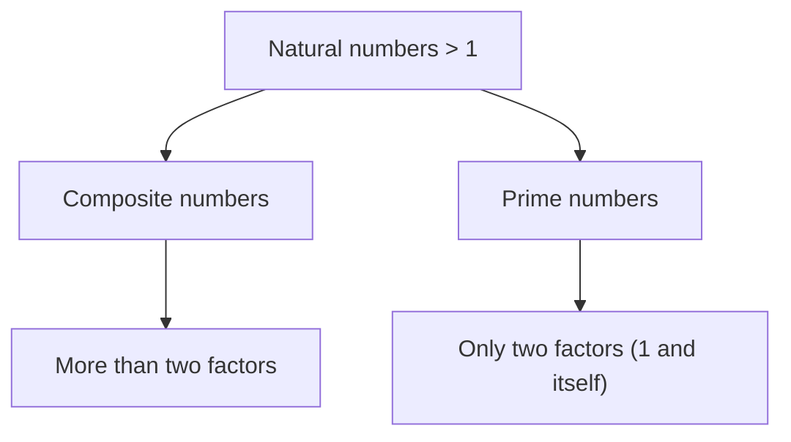

### Composite numbers
"A natural number which has more than two different factors is a composite number."

For example:
The image shows different ways to group 12 eggs:
- A single row of 12 eggs: $1 \times 12$
- Two rows of 6 eggs: $2 \times 6$
- Three rows of 4 eggs: $3 \times 4$

> **Interesting Information**
> A composite number can be expressed as a sum of two prime numbers. e.g.
> $3 + 5 = 8$

1, 2, 3, 4, 6 and 12 are the factors of 12. Number 12 has more than two different factors. So, 12 is a composite number. Similarly 4, 6, 8, 9, .... have more than two factors so they are composite numbers. The set of composite numbers is denoted by the capital letter C.
$$C = \{4, 6, 8, 9, ...\}$$

<table>
    <tr>
        <th>Example 9</th>
        <th>Identify the composite numbers:</th>
        <th>(i) 29</th>
        <th>(ii) 39</th>
        <th>(iii) 56</th>
    </tr>
</table>**Solution**
(i) 29 is not a composite number because it has only two factors.
(ii) 39 is a composite number because it has more than two factors i.e., 1, 3, 13 and 39.
(iii) 56 is a composite number because it has more than two factors i.e., 1, 2, 4, 7, 8, 14, 28 and 56.

> **Teaching Point**
> * Ask students to stand in an open space at least an-arm away from each other.
> * Tell them that you will be calling out numbers (such as 13, 21 or 101) and they will need to decide if the number is prime or composite.
> * If prime they should sit down, if composite they should stand up.


Sub-Domain-1: FACTORS AND MULTIPLES | 5
NOT FOR SALE-PESRP

Domain: Numbers and Operations


### Example 10
Identify the following numbers as prime, composite and neither prime nor composite numbers.
65, 77, 29, 1, 19, 63, 37

#### Solution
<table>
  <thead>
    <tr>
        <th>Prime</th>
        <th>Composite</th>
        <th>Neither Prime Nor-Composite</th>
    </tr>
  </thead>
  <tbody>
    <tr>
        <td>19, 29, 37</td>
        <td>63, 65, 77</td>
        <td>1</td>
    </tr>
  </tbody>
</table>

### Activity -1
Do a magic game. Copy all the numbers 1-100 and then perform with following steps.

<table>
  <tbody>
    <tr>
        <td>1</td>
        <td>2</td>
        <td>3</td>
        <td>4</td>
        <td>5</td>
        <td>6</td>
        <td>7</td>
        <td>8</td>
        <td>9</td>
        <td>10</td>
    </tr>
    <tr>
        <td>11</td>
        <td>12</td>
        <td>13</td>
        <td>14</td>
        <td>15</td>
        <td>16</td>
        <td>17</td>
        <td>18</td>
        <td>19</td>
        <td>20</td>
    </tr>
    <tr>
        <td>21</td>
        <td>22</td>
        <td>23</td>
        <td>24</td>
        <td>25</td>
        <td>26</td>
        <td>27</td>
        <td>28</td>
        <td>29</td>
        <td>30</td>
    </tr>
    <tr>
        <td>31</td>
        <td>32</td>
        <td>33</td>
        <td>34</td>
        <td>35</td>
        <td>36</td>
        <td>37</td>
        <td>38</td>
        <td>39</td>
        <td>40</td>
    </tr>
    <tr>
        <td>41</td>
        <td>42</td>
        <td>43</td>
        <td>44</td>
        <td>45</td>
        <td>46</td>
        <td>47</td>
        <td>48</td>
        <td>49</td>
        <td>50</td>
    </tr>
    <tr>
        <td>51</td>
        <td>52</td>
        <td>53</td>
        <td>54</td>
        <td>55</td>
        <td>56</td>
        <td>57</td>
        <td>58</td>
        <td>59</td>
        <td>60</td>
    </tr>
    <tr>
        <td>61</td>
        <td>62</td>
        <td>63</td>
        <td>64</td>
        <td>65</td>
        <td>66</td>
        <td>67</td>
        <td>68</td>
        <td>69</td>
        <td>70</td>
    </tr>
    <tr>
        <td>71</td>
        <td>72</td>
        <td>73</td>
        <td>74</td>
        <td>75</td>
        <td>76</td>
        <td>77</td>
        <td>78</td>
        <td>79</td>
        <td>80</td>
    </tr>
    <tr>
        <td>81</td>
        <td>82</td>
        <td>83</td>
        <td>84</td>
        <td>85</td>
        <td>86</td>
        <td>87</td>
        <td>88</td>
        <td>89</td>
        <td>90</td>
    </tr>
    <tr>
        <td>91</td>
        <td>92</td>
        <td>93</td>
        <td>94</td>
        <td>95</td>
        <td>96</td>
        <td>97</td>
        <td>98</td>
        <td>99</td>
        <td>100</td>
    </tr>
  </tbody>
</table>

*   Encircle the square box of number 1.
*   Leave square box of number 2, and shade all multiples of 2.
*   Leave square box of 3, and shade all multiples of 3.
*   Leave square box of 5, and shade all the multiples of 5.
*   Leave square box of 7, and shade all the multiples of 7.
*   All the numbers left shaded are prime numbers, between 1-100.
*   At the end list down all the prime numbers between 1-100.

The above process of finding all the prime numbers (1-100) is called the sieve of Eratosthenes.

### History
Eratosthenes was a Greek Mathematician. He introduced the sieve of Eratosthenes, an efficient method of identifying prime number. To know more about him visit the below link.
https://www.britannica.com/biography/Eratosthenes
(276BCE-194BCE)

### Practice -4
Twin primes are prime numbers that differ by 2. Such as 3 and 5. List all the twin primes between 1-100.

## Exercise - 1.1

1. Write all the factors of the following numbers:
   (i) 30 (ii) 41 (iii) 65 (iv) 78 (v) 105 (vi) 118 (vii) 165 (viii) 220
2. Write the first five multiples of the following numbers:
   (i) 7 (ii) 13 (iii) 19 (iv) 43 (v) 59
3. Write all prime numbers between 30 and 65.
4. Write all even prime numbers between 50 and 100.
5. List down all even prime natural and whole numbers.
6. List down all odd composite numbers between 50 and 100.
7. Write all neither prime nor composite natural and whole numbers.


6 | Sub-Domain-1: FACTORS AND MULTIPLES
NOT FOR SALE-PESRP

Domain: Numbers and Operations


> **Project - 1**
> Read the Sunday newspaper at your home and write the different digit numbers even, odd, prime, composite and neither prime nor composite numbers. Then write all factors and three multiples of each number.
>
> (i) \_\_\_\_\_\_\_\_\_\_ (ii) \_\_\_\_\_\_\_\_\_\_ (iii) \_\_\_\_\_\_\_\_\_\_ (iv) \_\_\_\_\_\_\_\_\_\_
> (v) \_\_\_\_\_\_\_\_\_\_ (vi) \_\_\_\_\_\_\_\_\_\_ (vii) \_\_\_\_\_\_\_\_\_\_ (viii) \_\_\_\_\_\_\_\_\_\_

> **Thinking Time**
> Which prime number cannot be doubled from the numbers in the 1-10 group?

# 1.5 PRIME FACTORS OF UP TO 4-DIGIT NUMBERS AND HOW TO EXPRESS THEM IN INDEX NOTATION

In the previous section 1.1 we have learnt how to find factors of a number.
*"The process of writing a given number into its factors is known as factorization"*
For example, $18 = 3 \times 6$
Here, 3 and 6 are the factors of 18.
Also $18 = 2 \times 9$
Here, again, numbers 2 and 9 are called factors of 18.

> **Remember**
> Any composite number can be written as a product of all of its prime factors.

### Prime factors
A composite number can be expressed as the product of two or more prime numbers, which are called prime factors.
*"The process of factorizing a number into its prime factors is known as prime factorization."*

Prime factorization can be done by using two methods.
(i) Division Method. (ii) Factor Tree Method.

> **Go Online**
> Practice the prime factorization by playing online game at http://www.mathplayground.com/factortrees.html

> **Practice -5**
> Find the prime factors of
> i. 30 ii. 210 iii. 633 iv. 310

**Example 11** Find the prime factorization of 36

**Solution**

<table>
    <tr>
        <th>Division Method</th>
        <th>Factor Tree Method</th>
    </tr>
    <tr>
        <td>```tsv [thead]2	36 [thead]2	18 [thead]3	9 [thead]3	3 	1 ``` &lt;br/&gt; So, $36 = 2 \times 2 \times 3 \times 3$</td>
        <td>```mermaid graph TD 36(36) --- 2((2)) 36 --- 18(18) 18 --- 2((2)) 18 --- 9(9) 9 --- 3((3)) 9 --- 3((3)) ``` &lt;br/&gt; So, $36 = 2 \times 2 \times 3 \times 3$</td>
    </tr>
</table>*Note: In the Factor Tree Method, 36, 18, and 9 are composite numbers; 2, 2, 3, and 3 are all prime factors.*


Sub-Domain-1: FACTORS AND MULTIPLES | 7
NOT FOR SALE-PESRP

Domain: Numbers and Operations


# Index Notation

We are familiar that; $100 = 10 \times 10 = 10^2$
$1000 = 10 \times 10 \times 10 = 10^3$ and $10000 = 10 \times 10 \times 10 \times 10 = 10^4$

The power (index or exponent) of a number says how many times to use the number in factorization.

For example, $36 = 2 \times 2 \times 3 \times 3$
Here, factor 2 is 2 times $= 2^2$ (Index = 2), factor 3 is 2 times $= 3^2$ (Index = 2)
So, prime factorization can be expressed as $36 = 2^2 \times 3^2$

*"The representation of prime factors in the exponential form is called index notation"*

Now, look at the following example;
The process to factorize a given number and to express its prime factors in the index notation is explained in this example.

> **Remember**
> 
> $2^5$
> - The number 5 is the **Index**
> - The number 2 is the **Base**

### Example 12
Find prime factorization of 108 then express the result in index notation.

**Solution**

**Division Method**
<table>
  <tbody>
    <tr>
        <td>2</td>
        <td>108</td>
    </tr>
    <tr>
        <td>2</td>
        <td>54</td>
    </tr>
    <tr>
        <td>3</td>
        <td>27</td>
    </tr>
    <tr>
        <td>3</td>
        <td>9</td>
    </tr>
    <tr>
        <td>3</td>
        <td>3</td>
    </tr>
    <tr>
        <td></td>
        <td>1</td>
    </tr>
  </tbody>
</table>

$108 = 2 \times 2 \times 3 \times 3 \times 3$
$= 2^2 \times 3^3$

> **Remember**
> $2 \times 2 \times 3 \times 3 \times 3$ is expanded form and $2^2 \times 3^3$ is index notation.

> **Challenge**
> * I am the product of two different prime factors
> * One of my factors is raised to the 2<sup>nd</sup> power.
> * My value is between 62 and 82.
> * Who am I?

> **Note**
> Students should use only one method to find prime factorization. If it is not specified in the problem.

### Practice - 6
Find the prime factors of the following numbers and express them in index notation.
i. 96
ii. 192
iii. 576
iv. 4,032

## Exercise - 1.2

1. Fill the spaces to complete the factor tree:

**(i) 20**
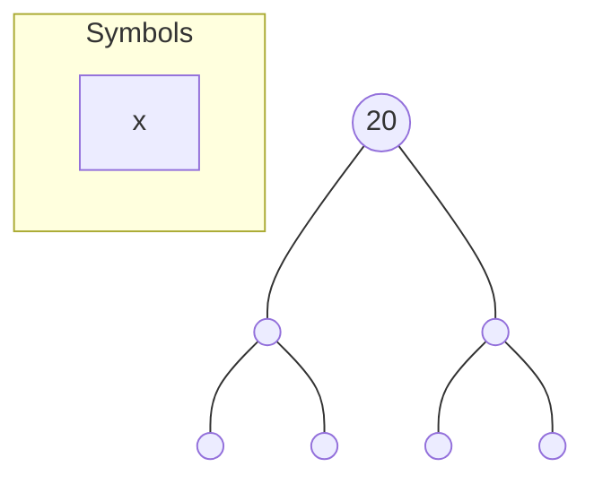
*(Note: The diagram represents a factor tree for 20 with empty circles and multiplication symbols between branches.)*

**(ii) 105**
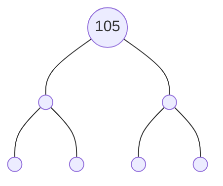
*(Note: The diagram represents a factor tree for 105 with empty circles and multiplication symbols between branches.)*

**(iii) 180**
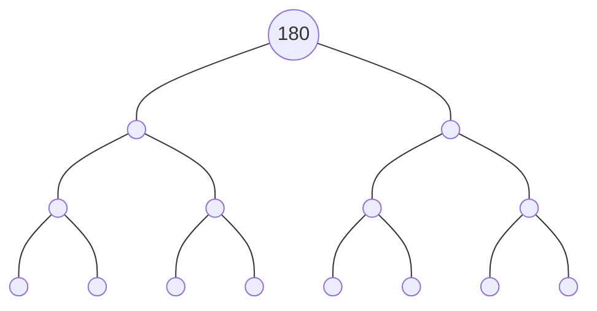
*(Note: The diagram represents a factor tree for 180 with empty circles and multiplication symbols between branches.)*


8 | Sub-Domain-1: FACTORS AND MULTIPLES
NOT FOR SALE-PESRP

Domain: Numbers and Operations


2. Write the following expanded forms into index notation:
(i) $5 \times 5 \times 5 \times 5 \times 7$
(ii) $2 \times 2 \times 5 \times 5 \times 5 \times 5 \times 7 \times 7 \times 7$
(iii) $3 \times 3 \times 3 \times 3 \times 5 \times 5 \times 5$
(iv) $11 \times 11 \times 11 \times 11 \times 13 \times 19 \times 19 \times 19$

3. Find the prime factors for the following using division method then express in index notation:
(i) 32 (ii) 90 (iii) 110 (iv) 115 (v) 225
(vi) 540 (vii) 1386 (viii) 2205 (ix) 6615 (x) 6075

4. Find the prime factors of the following numbers using factor tree method then express in index notation:
(i) 64 (ii) 125 (iii) 100 (iv) 500 (v) 188
(vi) 648 (vii) 1512 (viii) 3240 (ix) 7560 (x) 7875

5. Prove that prime factors of 2,600 are same using division method and factor tree method.

6. I am a product of three different numbers.
My greatest prime factor is 13.
I am between 100 and 200.
Who am I?

7. Find the number that is the product of the most prime numbers below 100.

8. Write these index notations into expanded form:
(i) $2^4 \times 3^2 \times 5^3$
(ii) $3^5 \times 5^4 \times 11^3$
(iii) $5^2 \times 7^4 \times 11^5$
(iv) $2^7 \times 3^4 \times 13^3 \times 17^2$

> **Project - 2**
> Search a 2-digit number, where the square of the sum of its digits is equal to the number obtained when its digits are reversed.

## 1.6 H.C.F AND L.C.M OF TWO OR THREE NUMBERS UP TO 3-DIGIT NUMBERS

### 1.6.1 HCF (Highest Common Factor)
We have learnt little more about factors and H.C.F (highest common factors) in our previous classes.
"H.C.F of two or more numbers is a greatest or highest number which divides all the given numbers."
The H.C.F is also called the greatest common factor (G.C.F) or greatest common divisor (G.C.D).
The above definition of H.C.F can also be defined as:
"H.C.F or highest common factor of two or more given numbers is the common factor of given numbers which is the greatest of all common factors".

> **Remember**
> The H.C.F is always smaller than or equal to the smallest number in the set of given numbers.


Sub-Domain-1: FACTORS AND MULTIPLES | 9
NOT FOR SALE-PESRP

Domain: Numbers and Operations


Now, look at the following example.

**Example 13** Yesterday Alisha plans to cover a blue sheet of paper completely with identical square boxes. The sheet of paper is $70\text{ cm}$ long and $50\text{ cm}$ wide. How can she find the side of the largest possible square?

**Solution**
Length of blue sheet of paper $= 70\text{ cm}$
Breadth of blue sheet of paper $= 50\text{ cm}$

We should divide each side into equal groups with equal lengths. This is same as to find the factors of $50$ and $70$.
Factors of $70 = 1, 2, 5, 7, 10, 14, 35, 70$
Factors of $50 = 1, 2, 5, 10, 25, 50$
The common factors of $70$ and $50$ are $1, 2, 5$ and $10$.
As, the Highest Common Factor of $50$ and $70$ is $10$.
Hence, the side of the largest possible square is $10\text{ cm}$.

[The image shows a grid representing the blue sheet of paper. The vertical side is labeled $70\text{ cm}$ and the horizontal side is labeled $50\text{ cm}$. The grid is divided into squares.]

### H.C.F of two or more than two numbers up to 3-digit by Prime Factorization Method

To find H.C.F using prime factorization, simply use the following rule.
H.C.F = Product of common prime factors of all given numbers.

**Example 14** Find H.C.F of $27, 54$ and $315$ by using prime factorization.

**Solution** First use division to find the prime factors of each number.

<table>
    <tr>
        <td>3</td>
        <td>27</td>
        <td></td>
        <td>2</td>
        <td>54</td>
        <td></td>
        <td>3</td>
        <td>315</td>
        <td></td>
    </tr>
    <tr>
        <td>3</td>
        <td>9</td>
        <td></td>
        <td>3</td>
        <td>27</td>
        <td></td>
        <td>3</td>
        <td>105</td>
        <td></td>
    </tr>
    <tr>
        <td>3</td>
        <td>3</td>
        <td></td>
        <td>3</td>
        <td>9</td>
        <td></td>
        <td>5</td>
        <td>35</td>
        <td></td>
    </tr>
    <tr>
        <td></td>
        <td>1</td>
        <td></td>
        <td>3</td>
        <td>3</td>
        <td></td>
        <td>7</td>
        <td>7</td>
        <td></td>
    </tr>
    <tr>
        <td></td>
        <td></td>
        <td></td>
        <td></td>
        <td>1</td>
        <td></td>
        <td></td>
        <td>1</td>
        <td></td>
    </tr>
</table>So, $27 = 3 \times 3 \times 3$
So, $54 = 2 \times 3 \times 3 \times 3$
So, $315 = 3 \times 3 \times 5 \times 7$

> **Remember**
> H.C.F (Highest Common Factor) is also called G.C.D (Greatest Common Divisor).

[Diagram showing arrows pointing from the common factors $3 \times 3$ in each prime factorization to a box labeled "common to 27, 54, and 315"]

Hence, H.C.F $= 3 \times 3 = 9$ i.e. H.C.F of $27, 54$ and $315$ is $9$.

### H.C.F of two or more than two numbers up to 3-digit by Long Division Method

To find H.C.F using long division method we use the following rules.
* Divide the largest number by the smallest number.
* Take remainder as divisor and divide the first divisor by it.
* Now, remainder will be taken as divisor and second divisor will be treated as dividend.


10 | Sub-Domain-1: FACTORS AND MULTIPLES
NOT FOR SALE-PESRP

Domain: Numbers and Operations


*   Continue this process again and again until remainder becomes zero.
*   The last divisor will be H.C.F.
*   In case of three numbers, first we find H.C.F of any two numbers. Then continue this process with remaining number till the last divisor. The last divisor is H.C.F of all the three numbers.

### Example 15
Shumaila has a box of 45 orange flavoured sweets and Nadeem has a box of 110 mango flavoured sweets. They have to divide up the sweets into small plates with equal number of sweets, each plate containing either orange flavoured or mango flavoured sweets only. Find the possible number of sweets in each plate.

**Solution**
Orange flavoured sweets = 45
Mango flavoured sweets = 110

To find the possible equal number of sweets in each plate, we should find the highest common factor for 45 and 110.

<table>
  <tbody>
    <tr>
        <td>3</td>
        <td>45</td>
        <td></td>
        <td>2</td>
        <td>110</td>
    </tr>
    <tr>
        <td>3</td>
        <td>15</td>
        <td></td>
        <td>5</td>
        <td>55</td>
    </tr>
    <tr>
        <td>5</td>
        <td>5</td>
        <td></td>
        <td>11</td>
        <td>11</td>
    </tr>
    <tr>
        <td></td>
        <td>1</td>
        <td></td>
        <td></td>
        <td>1</td>
    </tr>
  </tbody>
</table>

As,
$45 = 3 \times 3 \times 5$
$110 = 2 \times 5 \times 11$

So, H.C.F = 5
Hence, each plate will contain 5 sweets.

### Example 16
Nadeem wants to cut two wires into pieces of equal length. If the total length of wires are $108\text{ m}$ and $144\text{ m}$ respectively then what is the maximum length of each piece?

**Solution**
To find the maximum length of each piece we will find H.C.F of 108 and 144.

$$
\begin{array}{r|l}
108 & 144 \text{ (1} \\
& 108 \\
\hline
& 36 \text{ ) } 108 \text{ (3} \\
& \phantom{36 \text{ ) }} 108 \\
\hline
& \phantom{36 \text{ ) }} 0
\end{array}
$$

As, H.C.F of 108 and 144 is 36.
Hence, Nadeem will cut the wires into equal pieces with maximum length of each piece is $36\text{ m}$.

> **Remember:** If the H.C.F of two or more numbers is 1, then the numbers are called co-prime.

### Example 17
Find H.C.F of 65, 91 and 117 using long division method.

**Solution**
**Step-I** First we find H.C.F of 91 and 117.

$$
\begin{array}{r|l}
91 & 117 \text{ (1} \\
& 91 \\
\hline
& 26 \text{ ) } 91 \text{ (3} \\
& \phantom{26 \text{ ) }} 78 \\
\hline
& \phantom{26 \text{ ) }} 13 \text{ ) } 26 \text{ (2} \\
& \phantom{26 \text{ ) } 13 \text{ ) }} 26 \\
\hline
& \phantom{26 \text{ ) } 13 \text{ ) }} 0
\end{array}
$$

So, H.C.F of 91 and 117 is 13.

**Step-II** Now, we find H.C.F of 13 and 65.

$$
\begin{array}{r|l}
13 & 65 \text{ (5} \\
& 65 \\
\hline
& 0
\end{array}
$$

Hence,
The H.C.F of 65, 91 and 117 is 13.


Sub-Domain-1: FACTORS AND MULTIPLES | 11
NOT FOR SALE-PESRP

Domain: Numbers and Operations


### Practice - 7
Find the greatest length of measuring tape which can be used to measure exactly $160\text{ m}$, $280\text{ m}$ and $200\text{ m}$ length.

---

## Exercise - 1.3

1. Find H.C.F of each set of numbers using prime factorization method:
   - (i) 6 and 9
   - (ii) 25 and 45
   - (iii) 18 and 28
   - (iv) 5, 30 and 60
   - (v) 14, 28 and 112
   - (vi) 36, 54 and 108

2. Find H.C.F of each set of numbers using long division method:
   - (i) 110 and 170
   - (ii) 104 and 234
   - (iii) 400 and 3996
   - (iv) 32, 96 and 256
   - (v) 30, 168 and 288
   - (vi) 80, 215, 245 and 720

3. What is H.C.F of any two prime numbers?
4. Can the highest common factor of 8 and 64 be greater than 8? Explain your reasoning.
5. Aleezey has 16 Science books, 28 Mathematics books and 30 English books. She wants to pack these books equally without mixing the books and with no left over. What is the greatest number of books she can put in each package?
6. There are 50 students of grade VI, 70 students of grade VII and 80 students of grade VIII. A teacher wishes to arrange them in equal number of students in each row. Find the greatest number of students that could be arranged in a row.
7. A room is $10\text{ m } 15\text{ cm}$ long and $8\text{ m } 80\text{ cm}$ wide. The floor of the room is to be paved with square tiles. Find the length of the largest tile that can be used.

### Activity
- [ ] Write your 3-digit pocket money on a sheet of paper.
- [ ] Find H.C.F of three numbers you write on the paper.

---

### 1.6.2 L.C.M (Least Common Multiple)
We have learnt about common factors and L.C.M (Least Common Multiple) in previous grades.

"L.C.M of two or more numbers is a least number which is divisible by all the given numbers".

The above definition of L.C.M can also be defined as:
"L.C.M or least common multiple of two or more numbers is the smallest of all their common multiples".


12 | Sub-Domain-1: FACTORS AND MULTIPLES
NOT FOR SALE-PESRP

Domain: Numbers and Operations


Now, look at the following example.

**Example 18** One Sunday Nuzat plans to draw $15\text{ cm}$ long and $10\text{ cm}$ wide rectangle on a plastic sheet. She then makes copies of rectangle to form a square. Find the length of each side of this square.

**Solution**
Length of small rectangle $= 15\text{ cm}$
Breadth of small rectangle $= 10\text{ cm}$

First, we must find the multiples of 10 and 15 to get the length of a side of square.
Multiples of $10 = 10, 20, 30, 40, 50, 60, 70, 80, 90, 100, 110, 120, 130, 140, 150, 160, 170, 180, 190, 200, 210, 220, 230, 240, 250, 260, 270, 280, 290, 300, 310, \dots$
Multiples of $15 = 15, 30, 45, 60, 75, 90, 105, 120, 135, 150, 165, 180, 195, 210, 225, 240, 255, 270, 285, 300, 315, \dots$

The first two common multiples of 10 and 15 are 30 and 60.
The smallest is 30. This is called L.C.M (Least Common Multiple).
Hence, the length of each side of square is $30\text{ cm}$.

> **Remember**
> * If one number is a factor of the other then L.C.M is the greater number.
> * If the given numbers are prime numbers then L.C.M is the product of these numbers.

### L.C.M of two or more numbers by Prime Factorization Method
To find L.C.M by using the prime factorization method we use the following rule.
L.C.M = Product of common two or more prime factors $\times$ Product of non-common two or more prime factors.

**Example 19** Find the L.C.M (Least Common Multiple) of 54 and 144.

**Solution**
<table>
  <tbody>
    <tr>
        <td>2</td>
        <td>54</td>
        <td></td>
        <td>2</td>
        <td>144</td>
    </tr>
    <tr>
        <td>3</td>
        <td>27</td>
        <td></td>
        <td>2</td>
        <td>72</td>
    </tr>
    <tr>
        <td>3</td>
        <td>9</td>
        <td></td>
        <td>2</td>
        <td>36</td>
    </tr>
    <tr>
        <td>3</td>
        <td>3</td>
        <td></td>
        <td>2</td>
        <td>18</td>
    </tr>
    <tr>
        <td></td>
        <td>1</td>
        <td></td>
        <td>3</td>
        <td>9</td>
    </tr>
    <tr>
        <td></td>
        <td></td>
        <td></td>
        <td>3</td>
        <td>3</td>
    </tr>
    <tr>
        <td></td>
        <td></td>
        <td></td>
        <td></td>
        <td>1</td>
    </tr>
  </tbody>
</table>

Here, $54 = 2 \times 3 \times 3 \times 3$
$144 = 2 \times 2 \times 2 \times 2 \times 3 \times 3$
Common prime factors $= 2, 3, 3$
Non-common prime factors $= 2, 2, 2, 3$

So, L.C.M = Product of common prime factors $\times$ Product of non-common prime factors
$= 2 \times 3 \times 3 \times 2 \times 2 \times 2 \times 3$
$= 18 \times 24 = 432$

> **Remember**
> If three or more than three numbers are given to find the L.C.M, then consider a factor as common factor if it is common factor of two numbers or more than two numbers.

> **Challenge**
> Rida packs boxes of mangoes and boxes of oranges. Each box contains the same number of fruits. Rida packs 64 mangoes and 56 oranges.
> Nosheen says, 'There will be 7 pieces of fruit in each box.'
> Noureen says, 'There will be 8 pieces of fruit in each box.'
> Who is correct? Explain your answer.


Sub-Domain-1: FACTORS AND MULTIPLES | 13
NOT FOR SALE-PESRP

Domain: Numbers and Operations


### L.C.M of two or more numbers up to 3-digit by Division Method

To find L.C.M of two or more numbers by prime factorization needs a lots of calculation. So, the simple method is known as division method.

**Step – I** Write all the given numbers in a horizontal line, separate them by commas.
**Step – II** Choose a smallest possible prime number, which exactly divides at least one of the given numbers.
**Step – III** Write quotient directly under the number in the next row. If any number not divided exactly, then bring it down in the next row.
**Step – IV** Again choose a smallest possible prime number which exactly divides at least one of the numbers in second row.
**Step – V** Continue this process until all co-prime numbers are left in the last row.
**Step – VI** At the end multiply all the prime numbers by which we have divided and the co-prime numbers left in the last row. i.e. (L.C.M = Product of all divisors).

> **Thinking Time**
> What is the smallest 4-digit number which is divisible by 21, 56 and 63?

**Example 20** Minahil says to her friend Emaan that she is thinking of a number. Which is completely divisible by 16, 24 and 36 respectively. What secret number that Minahil could be thinking of?

**Solution** The secret number can be found by using L.C.M.

First given number = 16
Second given number = 24
Third given number = 36

L.C.M = product of all divisors
$= 2 \times 2 \times 2 \times 2 \times 3 \times 3 = 144$

Hence, Minahil can think 144.

<table>
  <tbody>
    <tr>
        <td>2</td>
        <td>16</td>
        <td>,</td>
        <td>24</td>
        <td>,</td>
        <td>36</td>
    </tr>
    <tr>
        <td>2</td>
        <td>8</td>
        <td>,</td>
        <td>12</td>
        <td>,</td>
        <td>18</td>
    </tr>
    <tr>
        <td>2</td>
        <td>4</td>
        <td>,</td>
        <td>6</td>
        <td>,</td>
        <td>9</td>
    </tr>
    <tr>
        <td>2</td>
        <td>2</td>
        <td>,</td>
        <td>3</td>
        <td>,</td>
        <td>9</td>
    </tr>
    <tr>
        <td>3</td>
        <td>1</td>
        <td>,</td>
        <td>3</td>
        <td>,</td>
        <td>9</td>
    </tr>
    <tr>
        <td>3</td>
        <td>1</td>
        <td>,</td>
        <td>1</td>
        <td>,</td>
        <td>3</td>
    </tr>
    <tr>
        <td></td>
        <td>1</td>
        <td>,</td>
        <td>1</td>
        <td>,</td>
        <td>1</td>
    </tr>
  </tbody>
</table>

> **Practice 8** Waqas is planting trees. He has enough trees to plant 7, 9 and 15 trees in each row. What is the least number of trees Waqas could have?

## Exercise - 1.4

1. Find L.C.M of each set of numbers using prime factorization method:
   (i) 8 and 18
   (ii) 28 and 49
   (iii) 20, 90 and 180
   (iv) 25, 35 and 45
   (v) 15, 25 and 65
   (vi) 150, 250 and 350

2. Find L.C.M of each set of numbers using division method:
   (i) 14 and 63
   (ii) 25 and 45
   (iii) 14, 28 and 84
   (iv) 7, 28 and 98
   (v) 220, 240, 260 and 280


14 | Sub-Domain-1: FACTORS AND MULTIPLES
NOT FOR SALE-PESRP

Domain: Numbers and Operations


3. A frog and a grasshopper start jumping together and jump along the same path. The frog always jumps $25\text{ cm}$ and the grasshopper always jumps $15\text{ cm}$. At what distance they will meet again?

4. A university bus arrives near UET Lahore in every 280 seconds and an orange train arrives in every 360 seconds. How often do train and bus arrive at the same time?

5. I am thinking of a number that is divisible by 29, 58 and 116. What is the smallest possible number that I could be thinking of?

6. The traffic lights at GPO chowk changes after every 30 seconds, 60 seconds, 90 seconds and 120 seconds respectively. If they change simultaneously at 9 a.m. at what time will they change again simultaneously? (**Hint:** 1 minute = 60 seconds).

7. Find the smallest 3 digit number divisible by 16, 24 and 30 respectively.

## 1.7 RELATIONSHIP BETWEEN HCF AND LCM

We are familiar that "The H.C.F is the greatest factor of two or more than two numbers which divides the number exactly with no remainder", while "The L.C.M of two or more than two numbers is the smallest number which is divisible by given numbers exactly". After discussing the definition of H.C.F and L.C.M, we will focus on the relationship between H.C.F and L.C.M along with real life problems.

**Example 21** Find the relationship between H.C.F and L.C.M of 12 and 21.

**Solution** First, we find the highest common factor (H.C.F.) of 12 and 21 is 3.
Then we find the least common multiple (L.C.M.) of 12 and 21 is 84.
$\text{H.C.F.} \times \text{L.C.M.} = 3 \times 84 = 252$
Also, the product of numbers $= 12 \times 21 = 252$
Therefore, product of H.C.F. and L.C.M. of 12 and 21 = product of 12 and 21.

**Example 22** Find the relationship between H.C.F and L.C.M of 32 and 48.

**Solution** Again, let us consider the two numbers 32 and 48
Prime factors of 32 and 48 are:
$32 = 2 \times 2 \times 2 \times 2 \times 2$
$48 = 2 \times 2 \times 2 \times 2 \times 3$
L.C.M. of 32 and 48 is 96, H.C.F. of 32 and 48 is 16;
$\text{L.C.M.} \times \text{H.C.F.} = 96 \times 16 = 1536$
Product of numbers $= 32 \times 48 = 1536$

So, from the explanation given in the above examples we conclude that the product of H.C.F and L.C.M of two numbers is equal to the product of two numbers.

or, $\text{H.C.F.} \times \text{L.C.M.} = \text{First number} \times \text{Second number}$
or, $\text{L.C.M.} = \frac{\text{First number} \times \text{Second number}}{\text{H.C.F.}}$


Sub-Domain-1: FACTORS AND MULTIPLES | 15
NOT FOR SALE-PESRP

Domain: Numbers and Operations


> **Challenge**
> Highest common factor (H.C.F) and least common multiple (L.C.M) of two numbers are 10 and 399 respectively. One number is 190, find the other number.

# Exercise - 1.5

1. Find the relationship between H.C.F and L.C.M of the following numbers:
   (i) 10 and 25
   (ii) 8 and 28
   (iii) 34 and 68
   (iv) 35 and 77
   (v) 110 and 230
   (vi) 160 and 380
2. Find the relationship between H.C.F and L.C.M of 680 and 584.
3. The H.C.F of two numbers is 36 and their L.C.M is 1260. If one of the numbers is 72, find the other number.
4. The H.C.F of two numbers is 48 and their L.C.M is 1440. If one of the numbers is 240, find the other number.

> **Activity -4**
> Find the relationship between the H.C.F and L.C.M of the prices of your Science and Mathematics textbooks.

## 1.8 SQUARE OF NUMBERS UP TO 2-DIGIT NUMBERS

Observe the following arrangements of apples.

*   **1-apple**: A single apple.
*   **4-apples**: Arranged in a 2x2 square array.
*   **9-apples**: Arranged in a 3x3 square array.
*   **16-apples**: Arranged in a 4x4 square array.

But 8-apples or 10-apples cannot be arranged in this way. Numbers or number of objects that can be arranged into a square array are known as square numbers.

> **Note**
> A square box/array should be full if we need to count the number as a square number. Here 12-apples are arranged in a square, but it does not full a square. So, 12 is not a square number.
> (Image shows 12 apples arranged in a 4x4 perimeter with the center 4 spots empty).

**Example 23**
Find the square number of the integers $-3$ and $7$.

**Solution**
To find the square of given integers or numbers, we simply multiply the number by itself. So,
$(-3) \times (-3) = (-3)^2 = 9$ and $7 \times 7 = 7^2 = 49$
Where, 9 and 49 are square numbers.

**Activity -4**
Colour the square numbers in red on the given number chart.

<table>
  <tbody>
    <tr>
        <td>×</td>
        <td>1</td>
        <td>2</td>
        <td>3</td>
        <td>4</td>
        <td>5</td>
        <td>6</td>
        <td>7</td>
        <td>8</td>
        <td>9</td>
        <td>10</td>
    </tr>
    <tr>
        <td>1</td>
        <td>1</td>
        <td>2</td>
        <td>3</td>
        <td>4</td>
        <td>5</td>
        <td>6</td>
        <td>7</td>
        <td>8</td>
        <td>9</td>
        <td>10</td>
    </tr>
    <tr>
        <td>2</td>
        <td>2</td>
        <td>4</td>
        <td>6</td>
        <td>8</td>
        <td>10</td>
        <td>12</td>
        <td>14</td>
        <td>16</td>
        <td>18</td>
        <td>20</td>
    </tr>
    <tr>
        <td>3</td>
        <td>3</td>
        <td>6</td>
        <td>9</td>
        <td>12</td>
        <td>15</td>
        <td>18</td>
        <td>21</td>
        <td>24</td>
        <td>27</td>
        <td>30</td>
    </tr>
    <tr>
        <td>4</td>
        <td>4</td>
        <td>8</td>
        <td>12</td>
        <td>16</td>
        <td>20</td>
        <td>24</td>
        <td>28</td>
        <td>32</td>
        <td>36</td>
        <td>40</td>
    </tr>
    <tr>
        <td>5</td>
        <td>5</td>
        <td>10</td>
        <td>15</td>
        <td>20</td>
        <td>25</td>
        <td>30</td>
        <td>35</td>
        <td>40</td>
        <td>45</td>
        <td>50</td>
    </tr>
    <tr>
        <td>6</td>
        <td>6</td>
        <td>12</td>
        <td>18</td>
        <td>24</td>
        <td>30</td>
        <td>36</td>
        <td>42</td>
        <td>48</td>
        <td>54</td>
        <td>60</td>
    </tr>
    <tr>
        <td>7</td>
        <td>7</td>
        <td>14</td>
        <td>21</td>
        <td>28</td>
        <td>35</td>
        <td>42</td>
        <td>49</td>
        <td>56</td>
        <td>63</td>
        <td>70</td>
    </tr>
    <tr>
        <td>8</td>
        <td>8</td>
        <td>16</td>
        <td>24</td>
        <td>32</td>
        <td>40</td>
        <td>48</td>
        <td>56</td>
        <td>64</td>
        <td>72</td>
        <td>80</td>
    </tr>
    <tr>
        <td>9</td>
        <td>9</td>
        <td>18</td>
        <td>27</td>
        <td>36</td>
        <td>45</td>
        <td>54</td>
        <td>63</td>
        <td>72</td>
        <td>81</td>
        <td>90</td>
    </tr>
    <tr>
        <td>10</td>
        <td>10</td>
        <td>20</td>
        <td>30</td>
        <td>40</td>
        <td>50</td>
        <td>60</td>
        <td>70</td>
        <td>80</td>
        <td>90</td>
        <td>100</td>
    </tr>
  </tbody>
</table>


16 | Sub-Domain-1: FACTORS AND MULTIPLES
NOT FOR SALE-PESRP

Domain: Numbers and Operations


# Exercise - 1.6

1. Identify the square numbers in the following numbers:
   - (i) 18
   - (ii) 25
   - (iii) 17
   - (iv) 17
   - (v) 17
   - (vi) 144
   - (vii) 79
   - (viii) 169
   - (ix) 68
   - (x) 121

2. Calculate the squares of the following numbers:
   - (i) 13
   - (ii) $-8$
   - (iii) 23
   - (iv) 17
   - (v) $-31$
   - (vi) 43
   - (vii) $-3$
   - (viii) 57
   - (ix) $-71$
   - (x) 93

> **Project - 3**
> Write the ages of all your family members on a chart paper. Recognise and identify whose age is a square number. Also, calculate the square of all ages.

# Review Exercise

1. Each of the following question is followed by four suggested options. In each case select the correct option.

   (i) A number which divides the dividend completely is called:
   - a. factors
   - b. multiples
   - c. L.C.M
   - d. H.C.F

   (ii) Zero (0) is multiple of every number except:
   - a. one
   - b. two
   - c. itself
   - d. five

   (iii) Any given number is even if the digit on its ones place is multiple of:
   - a. 1
   - b. 2
   - c. 3
   - d. 4

   (iv) Any given number is an odd number if the digit on its ones place is not the multiple of:
   - a. 1
   - b. 2
   - c. 3
   - d. 7

   (v) A composite number can always be expressed as a \_\_\_\_\_\_\_\_\_\_ of two primes:
   - a. product
   - b. difference
   - c. sum
   - d. none of these

   (vi) A number neither prime nor composite is \_\_\_\_\_\_\_\_\_\_
   - a. 1
   - b. 2
   - c. 3
   - d. 4

   (vii) The product of factors of a given number is always equal to:
   - a. prime number
   - b. composite number
   - c. given number
   - d. even number

   (viii) In $5^4$
   - a. 4 is base and 5 is power
   - b. 5 and 4 are bases
   - c. 4 and 5 are powers
   - d. 5 is base and 4 is power

   (ix) A number which divides all the given numbers is called:
   - a. H.C.F
   - b. L.C.M
   - c. Prime
   - d. Composite

   (x) A number which is divisible by all the given numbers is called:
   - a. H.C.F
   - b. L.C.M
   - c. Prime
   - d. Composite


Sub-Domain-1: FACTORS AND MULTIPLES | 17
NOT FOR SALE-PESRP

Domain Numbers and Operations


2. (i) Define factors and give an example. (ii) Define Multiples and give an example.
(iii) What are prime numbers? (iv) What are composite numbers?
(v) What do you know about index notation? (vi) Define prime factorization.
(vii) Define H.C.F (Highest Common Factor).
(viii) Define L.C.M (Least Common Multiple).

3. For an admission test the number of participants in grade VI, grade VII and grade VIII are 60, 84 and 108. Find the minimum number of participants who can sit in a row.

4. Three local taxies A, B and C arrive at a stop. Taxi A arrives at the stop every 20 minutes, taxi B arrives every 30 minutes and taxi C arrives every 40 minutes. All three taxies arrive at the stop at 10:30 am altogether. At what time will the three taxies arrive at the stop again?

[The image shows a yellow taxi cab.]

5. Find the largest number which when divided by 24, 36 and 60 leaves 3 as remainder in each case.

6. Three bells toll at regular interval of 10 minutes, 20 minutes and 30 minutes respectively. If they toll altogether at 12:00 noon. At what time will they next toll together?

> **Go Online** Practice the highest common factor (H.C.F) and least common multiples (L.C.M) by playing games at:
> https://www.transum.org/software/sw/starter_of_the_day/students/H.C.F.L.C.M.asp
> https://www.transum.org/software/sw/starter_of_the_day/students/H.C.F.L.C.M.asp?level=2

### Summary

*   A factor is a number which divides the dividend completely leaving no remainder.
*   Multiple of a given number is the dividend, for which the given number is its factor.
*   A natural number has only two different factors 1 and the number itself, is called a prime number.
*   A number which has more than two different factors, is called a composite number.
*   The process of factorizing a number into its prime factors is know as prime factorization.
*   H.C.F of two or more numbers is a highest number which divides all the given numbers.
*   L.C.M is a least number which is divisible by all the given numbers.

#### Activity -5

Match the square numbers by colouring the block with same colour.

<table>
  <tbody>
    <tr>
        <td>4<sup>2</sup></td>
        <td>225</td>
        <td>25</td>
        <td>8<sup>2</sup></td>
        <td>49</td>
    </tr>
    <tr>
        <td>100</td>
        <td>3<sup>2</sup></td>
        <td>7<sup>2</sup></td>
        <td>169</td>
        <td>15<sup>2</sup></td>
    </tr>
    <tr>
        <td>12<sup>2</sup></td>
        <td>81</td>
        <td>5<sup>2</sup></td>
        <td>16</td>
        <td>144</td>
    </tr>
    <tr>
        <td>64</td>
        <td>13<sup>2</sup></td>
        <td>9</td>
        <td>10<sup>2</sup></td>
        <td>9<sup>2</sup></td>
    </tr>
  </tbody>
</table>

> **Teaching Point**
> The questions in the exercises, practices and different activities are given as examples (symbols) for learning. You can use self generated questions (test items) conceptual type MCQ's, fill in the blanks, column matching, constructed response questions and (simple computations) based on cognitive domain (e.g. knowing = 40%, applying = 40% and reasoning = 20%) to assess the understanding of learners.


18 | Sub-Domain-1: FACTORS AND MULTIPLES
NOT FOR SALE-PESRP

Domain: Numbers and Operations


# Sub-Domain 2: INTEGERS

### Students' Learning Outcomes:
**By the end of this sub-domain, students will be able to:**
* Recognize and identify integers (positive integers, negative integers and neutral integer).
* Calculate absolute or numerical value of an integer.
* Using a number line, compare and arrange a given list of integers and their absolute values in ascending and descending order.

The image shows a number line with a starting point at 0.
* To the left of 0, a girl named **Saba** has moved **6 steps towards left**.
* To the right of 0, a boy named **Waqas** has moved **6 steps towards right**.

> The distance between Saba and Waqas is............?

## 2.1 INTEGERS
We know about the natural numbers and whole numbers. Also we have learnt about the number line of natural numbers and whole numbers respectively.

"Integers are in the form of positive numbers, negative numbers and zero (0) too."

The symbol we use for the set of integers is Z because of Zahlen, Zahlen is a German word for integers.

> **Teaching Point:** Tell the students about perfect numbers. The numbers which are equal to the sum of its positive divisors are known as perfect numbers. i.e $6 = 1 + 2 + 3$. So, 6 is a perfect number.


Sub-Domain-2: INTEGERS | 19
NOT FOR SALE-PESRP

- Domain Numbers and Operations

> **Remember** To understand the integers. Simply keep the following figures representation in your mind.

> So, the collection of integers can be understood by the given diagram.


### 2.2.1 Identification of Integers

Integers are also known as directed numbers because these are used to represent distance ..., $-3, -2, -1, 0, 1, 2, 3, ...$ along with the position or direction.

For example, Sakeena and Ali walk away from the starting point but they walk in opposite direction.


> **History** Arbermouth Holst was a German Mathematician. He introduced integer in the year 1563. He spent 15 years to invent a number system of addition and multiplication. Later on in 1890, Japanese Mathematicians worked on Arbermouth Holst's number system and created 'integers'. To know more about him, visit the link. https://mathematicacademy.weebly.com/history-of-math-connection.html

If Ali walked 6 steps heading towards right and Sakeena walked 6 steps heading towards left. The distance of 6 steps on the right side from starting point is shown by $+6$. The distance of 6 steps on the left side from starting point is shown by $-6$.

In our real life we use positive numbers as well as negative numbers, the concept of negative numbers is derived from our real life situation, for example:

- The temperature recorded $25^\circ C$ above zero as positive and correspondingly $-25^\circ C$ below zero as negative temperature.
- Similarly, Shahbaz earned Rs. 1500 in a day. He spent Rs. 500. We can write these numbers as integers.
  - Earned Rs. 1500, $+1500$ rupees ← Read: "Positive 1500 rupees"
  - Spent Rs. 500, $-500$ rupees ← Read: "Negative 500 rupees"

So, "The natural numbers are $1, 2, 3, ...$ are also called positive integers and the corresponding numbers $-1, -2, -3, ...$ are called negative integers".

We observed besides positive and negative integers, there is an integer which is neither positive nor negative that is zero (0).

So, "0 is an integer which is neither positive nor negative". It is called a neutral integer.

**Activity -1** Think and list any three real life situations where you use negative and positive numbers.
(i). ___________________________ (ii). ___________________________ (iii). ___________________________

> **Teaching Point** Ask students to give real life scenarios where they have seen negative numbers. Also, show following video to discuss real life examples of integers. (https://www.youtube.com/watch?v=9w7gwFA1HNI)

20 Sub-Domain-2: INTEGERS
NOT FOR SALE-PESRP

Domain: Numbers and Operations


> **Note**: Zero (0) is greater than every negative integer and smaller than every positive integer.

**Example 1**: Identify the integers in the following numbers.
$-42, +35, +21.6, -15.9, +\frac{18}{23}, +12, +29.8, -1\frac{5}{8}$

**Solution**:
Integers: $-42, 35, 12$
Non-integers: $+21.6, -15.9, +\frac{18}{23}, +29.8, -1\frac{5}{8}$

> **Challenge**
> There is only one number spelled with the same number of letters as itself.
> Which number is this?

### 2.2.2 Representation of Integers on Number Line
Integers can be represented on number line. The number line can help us to see the relationship between integers.

<table>
    <tr>
        <th></th>
        <th></th>
        <th></th>
        <th></th>
        <th></th>
        <th></th>
        <th></th>
        <th>Zero</th>
        <th></th>
        <th></th>
        <th></th>
        <th></th>
        <th></th>
        <th></th>
        <th></th>
    </tr>
    <tr>
        <td>&lt;---</td>
        <td></td>
        <td></td>
        <td></td>
        <td></td>
        <td></td>
        <td></td>
        <td></td>
        <td></td>
        <td></td>
        <td></td>
        <td></td>
        <td></td>
        <td></td>
        <td>---&gt;</td>
    </tr>
    <tr>
        <td></td>
        <td>-7</td>
        <td>-6</td>
        <td>-5</td>
        <td>-4</td>
        <td>-3</td>
        <td>-2</td>
        <td>-1</td>
        <td>0</td>
        <td>+1</td>
        <td>+2</td>
        <td>+3</td>
        <td>+4</td>
        <td>+5</td>
        <td>+6</td>
        <td>+7</td>
    </tr>
</table>Read: Negative 4 | Write: -4 <--- **Opposites** ---> Read: Positive 4 | Write: +4 or 4

Two integers are opposite (additive inverse) if they are at the same distance from zero on the number line, but on opposite sides of zero. Each integer has an opposite. For example.
(i) The opposite integer of $+4$ is $-4$.
(ii) The opposite integer of $-4$ is $+4$.

**Example 2**: Represent the following numbers on the number line. (i) 7 (ii) $-13$

**Solution**:
(i)
<table>
    <tr>
        <th></th>
        <th></th>
        <th></th>
        <th></th>
        <th></th>
        <th></th>
        <th></th>
        <th></th>
        <th>7</th>
        <th></th>
    </tr>
    <tr>
        <td>&lt;---</td>
        <td></td>
        <td></td>
        <td></td>
        <td></td>
        <td></td>
        <td></td>
        <td></td>
        <td></td>
        <td></td>
        <td>---&gt;</td>
    </tr>
    <tr>
        <td>-1</td>
        <td>0</td>
        <td>1</td>
        <td>2</td>
        <td>3</td>
        <td>4</td>
        <td>5</td>
        <td>6</td>
        <td>7</td>
        <td>8</td>
        <td>9</td>
    </tr>
</table>(ii)
<table>
    <tr>
        <th>-13</th>
        <th></th>
        <th></th>
        <th></th>
        <th></th>
        <th></th>
        <th></th>
        <th></th>
        <th></th>
        <th></th>
        <th></th>
        <th></th>
        <th></th>
        <th></th>
    </tr>
    <tr>
        <td>&lt;---</td>
        <td></td>
        <td></td>
        <td></td>
        <td></td>
        <td></td>
        <td></td>
        <td></td>
        <td></td>
        <td></td>
        <td></td>
        <td></td>
        <td></td>
        <td>---&gt;</td>
    </tr>
    <tr>
        <td>-14</td>
        <td>-13</td>
        <td>-12</td>
        <td>-11</td>
        <td>-10</td>
        <td>-9</td>
        <td>-8</td>
        <td>-7</td>
        <td>-6</td>
        <td>-5</td>
        <td>-4</td>
        <td>-3</td>
        <td>-2</td>
        <td>-1</td>
        <td>0</td>
    </tr>
</table>> **Remember**: The distance between any two points on the number line is always same or equal.

**Practice - 1**: Represent the following numbers on the number line. (i) $-8$ (ii) 11 (iii) $-21$

## Exercise - 2.1

1. List the natural numbers between 4 and 11.
2. What is a smallest natural number?
3. Write all the whole numbers less than 10.
4. Write all the natural number less than 13.
5. Give the short answer for each of the following question:
   (i) Is every prime number a natural number?
   (ii) Write the difference between natural numbers and whole numbers.
   (iii) How many natural numbers are the whole numbers?


Sub-Domain-2: INTEGERS | 21
NOT FOR SALE-PESRP

Domain: Numbers and Operations


6. On what number do all the alphabet stands for?

(i)
A number line starting from 0, 1, 2... with arrows pointing to letters:
*   S is at 4 (indicated by an upward arrow $\uparrow$S)
*   P is at 7 (indicated by a downward arrow P$\downarrow$)
*   A is at 12 (indicated by an upward arrow $\uparrow$A)

(ii)
A number line starting from 50, 51... with arrows pointing to letters:
*   V is at 54 (indicated by an upward arrow $\uparrow$V)
*   T is at 57 (indicated by a downward arrow T$\downarrow$)
*   X is at 61 (indicated by a downward arrow X$\downarrow$)
*   R is at 65 (indicated by an upward arrow $\uparrow$R)

7. Write each of the following as an integer with correct sign.
    (i) 48 degrees cooler.
    (ii) 48 degrees warmer.

8. Identify the corresponding point to the each integer given on the following number line:
A number line with points labeled:
<table>
  <tbody>
    <tr>
        <td>Point</td>
        <td>A</td>
        <td>B</td>
        <td>C</td>
        <td>D</td>
        <td>E</td>
        <td>F</td>
        <td>G</td>
        <td>H</td>
        <td>I</td>
        <td>J</td>
        <td>K</td>
    </tr>
    <tr>
        <td>Value</td>
        <td>-5</td>
        <td>-4</td>
        <td>-3</td>
        <td>-2</td>
        <td>-1</td>
        <td>0</td>
        <td>1</td>
        <td>2</td>
        <td>3</td>
        <td>4</td>
        <td>5</td>
    </tr>
  </tbody>
</table>
(i) B (ii) D (iii) G (iv) -5 (v) -3 (vi) 0

9. Draw number line and represent the following points on it.
    (i) 0, -8, 6, 3, -11 and -13
    (ii) 3, 8, 5, -11, -5 and -7

10. Write the opposite for the following integers.
    (i) 14 (ii) -24 (iii) 65 (iv) 39 (v) 0 (vi) -420

11. Identify the integers in the following numbers.
    $+12, -21.4, -17, 1\frac{2}{5}, 3\frac{9}{11}, -11.25, 18.4, +26, -57, 0$

12. Hadi has Rs. 12 in his pocket, but Neelam gives him Rs. 4 and Hamza gives him Rs. 3. How much money Hadi has in all? Show all this information on number line.

13. Describe and show your position on number line, if you begin at 8, move right 8 steps and then move left 8 steps.

14. When Saba woke up, her temperature was 101°F. Two hours later it was 4°F lower. What was her temperature then?

> **Project 1**
> Prepare a chart paper for the number line. Represent your obtained marks of grade-5 final exam on the number line.

## 2.3 ABSOLUTE OR NUMERICAL VALUE OF AN INTEGER

The concept of absolute value has many uses. We know about the number line. Every integer on the number line represents a distance from zero.

**For example,** Fatima is moving 10 steps to east and Shahid is moving 10 steps to west.

The image shows a number line with an origin at 0.
*   To the right (East), the numbers are positive: 1, 2, 3, 4, 5, 6, 7, 8, 9, 10. A boy is walking towards the West.
*   To the left (West), the numbers are negative: -1, -2, -3, -4, -5, -6, -7, -8, -9, -10. A girl is walking towards the East.
*   The center point 0 is labeled "Origin".


22 | Sub-Domain-2: INTEGERS
NOT FOR SALE-PESRP

Domain: Numbers and Operations


from the origin on the number line. Fatima is standing at point $-10$ and Shahid is standing at point $+10$, but cover the same distance from the origin.

So, we can say that
"Absolute value or numerical value of a number is its distance from zero on the number line and it is always positive or zero."

It is always denoted by symbol '$| \text{ } |$'. In the above example distance $10\text{m}$ left from zero can be written as '$|-10|$' and read it as absolute value of $-10$ is $10$.

### 2.3.1 Arrangement of absolute values of the given integers in ascending or descending order

Look at the following examples to understand the concept of ascending and descending order of absolute values.

**Example 3** Arrange the absolute values of the following numbers in ascending order.
$7, -14, 0, 15, -12, -2, 11$

**Solution** $7, -14, 0, 15, -12, -2, 11$
Here, $|7| = 7, |-14| = 14, |0| = 0, |15| = 15, |-12| = 12, |-2| = 2$ and $|11| = 11$
So, the required arrangements in ascending order of absolute values is $0, 2, 7, 11, 12, 14, 15$.

**Example 4** Arrange the absolute value of the following numbers in descending order.
$-6, 3, -13, 5, 0, -2, 12, -18$

**Solution** $-6, 3, -13, 5, 0, -2, 12, -18$
Here, $|-6| = 6, |3| = 3, |-13| = 13, |5| = 5, |0| = 0, |-2| = 2, |12| = 12$ and $|-18| = 18$
So, the required arrangement in descending order absolute values is $18, 13, 12, 6, 5, 3, 2, 0$.

**Example 5** Use number line to arrange the following numbers in ascending order:
$-2, -13, -18, |-5|, 3, -19, |-1|, |-12|$

**Solution** Since, $|-5| = 5$ and $|-1| = 1, |-12| = 12$
Now, use number line to order them

The image shows a number line ranging from $-20$ to $20$ with increments of $5$ marked. Specific points are labeled with boxes:
- A box labeled $-19$ points to the position $-19$.
- A box labeled $-18$ points to the position $-18$.
- A box labeled $-13$ points to the position $-13$.
- A box labeled $-2$ points to the position $-2$.
- A box labeled $|-1|$ points to the position $1$.
- A box labeled $3$ points to the position $3$.
- A box labeled $|-5|$ points to the position $5$.
- A box labeled $|-12|$ points to the position $12$.

Hence, Ascending order: $-19, -18, -13, -2, 1, 3, 5, 12$

> **Teaching Point**
> Use the following link to show the video for the explanation of the concept of absolute value. You can pause/stop the video at several interval and ask the questions from the students.
> http://www.youtube.com/watch?v=zxaT8Arckjo


Sub-Domain-2: INTEGERS | 23
NOT FOR SALE-PESRP

Domain: Numbers and Operations


**Example 6** Use number line to arrange the following numbers in descending order.
$$|-1|, -11, 4, |-9|, -7, -18, |-7|, 16$$

**Solution** Since, $|-1| = 1, |-9| = 9, |-7| = 7$
Now, use number line to order them

[The image shows a number line ranging from -20 to 20 with increments of 5 marked. Specific points are labeled above and below the line:]
*   **-18** (labeled above)
*   **-11** (labeled above)
*   **-7** (labeled above)
*   **|-1|** (which is 1, labeled below)
*   **4** (labeled above)
*   **|-7|** (which is 7, labeled above)
*   **|-9|** (which is 9, labeled below)
*   **16** (labeled above)

Hence, descending order: $16, 9, 7, 4, 1, -7, -11, -18$

> **Go Online** Use the following links to practice of arranging integers.
> *   https://www.mathplayground.com/mobile/numberballs_fullscreen.htm
> *   https://www.math-play.com/Millionaire-Game-Absolute-value/Millionaire_Game-Absolute-Value_htm5.html

# Exercise - 2.2

1. Arrange the following integers in ascending order:
   (i) $-7, 0, -4, 4, 3, -2, 1$
   (ii) $-1, -6, 7, -3, 0, 6, 17$

2. Arrange the following integers in descending order:
   (i) $-4, -2, 7, 16, 0, -1$
   (ii) $13, 24, -10, 0, 8, 5$

3. Write the absolute or numerical value of the following integers:
   (i) $-45$ (ii) $116$ (iii) $-209$ (iv) $0$ (v) $-2813$ (vi) $-501$

4. Arrange the absolute values of the following integers in ascending order:
   (i) $-13, 0, -4, 12, 16, -9, 17$
   (ii) $-18, 14, -12, -84, 44, 48$

5. Arrange the absolute values of the following integers in descending order:
   (i) $34, -9, 12, 17, -16, -21$
   (ii) $109, -215, 0, -85, -141, 149, 215$

> **Project - 2** Make a booklet and explain
> *   Which number is greater, $-17$ or $-30$?
> *   Prepare five flash cards for different integers and arrange them in ascending and descending order using number line.

# Review Exercise 2

1. Each of the question or incomplete statement is followed by four suggested options. In each case select the one that is correct.
   (i) The set of integers is mostly denoted by English capital letter:
       a. W
       b. N
       c. Q
       d. Z


24 | Sub-Domain-2: INTEGERS
NOT FOR SALE-PESRP

Domain: Numbers and Operations


**(ii) Integers are consisted of:**
*   a. Only positive whole numbers
*   b. Only negative whole numbers
*   c. Positive and negative whole number
*   d. Positive and negative whole number with zero

**(iii) An integer which is neither positive nor negative is:**
*   a. 0
*   b. 1
*   c. 2
*   d. 3

**(iv) On number line the distance between any two integers is always:**
*   a. Equal
*   b. Doubled
*   c. Triple
*   d. Half

**(v) The opposite numbers of $+2$ and $-3$ are:**
*   a. $+2$ and $3$
*   b. $-2$ and $3$
*   c. $-2$ and $-3$
*   d. $2$ and $-3$

**(vi) The absolute value of a number is its distance from:**
*   a. $-1$
*   b. $0$
*   c. $1$
*   d. $2$

**(vii) The numerical value of $-345$ is:**
*   a. $345$
*   b. $-345$
*   c. $34$
*   d. $3405$

**(viii) The ascending order of $1, -1, 0, 2, -3, 5$ is:**
*   a. $-3, -1, 0, 1, 2, 5$
*   b. $0, -1, 1, 2, -3, 5$
*   c. $5, 2, 1, 0, -1, -3$
*   d. $-1, 1, 0, -2, 3, 5$

**(ix) The descending order of $1, -1, 0, 2, -3, 5$ is:**
*   a. $-3, -1, 0, 1, 2, 5$
*   b. $0, 1, -1, 2, -3, 5$
*   c. $5, 2, 1, 0, -1, -3$
*   d. $-1, 0, 1, 2, -3, 5$

**(x) $-|-9| = \_\_\_\_\_\_\_\_ :$**
*   a. $-9$
*   b. $9$
*   c. $10$
*   d. $-10$

**(xi) $|-10| = \_\_\_\_\_\_\_\_ :$**
*   a. $-10$
*   b. $10$
*   c. $-9$
*   d. $9$

**2. Define the following:**
*   (i) Natural numbers
*   (ii) Whole numbers
*   (iii) Integers
*   (iv) Absolute value

**3. Represent the following integers on the number line:**
*   (i) $-7, 8, -2, -1$
*   (ii) $3, -2, 0, -4$
*   (iii) $-5, -1, -3, 0$
*   (iv) $7, -8, -10, 0, -13, 6$

**4. Arrange the following in ascending order:**
*   (i) $-3, 4, -4, 0, 2, 7$
*   (ii) $-7, 0, 4, -11, 1, -13$
*   (iii) $15, -4, 4, 5, -6, 0$

**5. Arrange the following in descending order:**
*   (i) $-4, 2, 0, -5, -7$
*   (ii) $-5, 12, 0, -3, 5$
*   (iii) $-6, 5, -2, 0, 8, 3$

**6. Represent the following absolute values on the number line:**
$-|8|, |-11|, -|-4|, |3|, -|7|, -3$

**7. An elevator is on the eighth floor. It goes 10 floors down and then up 3 floors. At which floor is the elevator now?**

**8. It is $-3^\circ\text{C}$ tonight. Neelam predicts it will be $18^\circ\text{C}$ warmer by noon tomorrow. What will be the temperature by noon tomorrow?**

**9. Calculate your age from your birth year, and explain which arithmetic operation you need to find your age.**


Sub-Domain-2: INTEGERS | 25
NOT FOR SALE-PESRP

Domain: Numbers and Operations


10. Write the absolute value for each integer: $15, 0, -18, -15, 13, 215, -131, 54$
11. Two metro buses left Kalma Chowk Station on the same time. One travelled $13\text{ km}$ towards Gujjumata. While the other travelled $9\text{ km}$ towards Shahdra, in the opposite direction. Find the total distance between the two buses.

> ### Activity - 2
>
> | Location | Level / Steps |
> | :--- | :--- |
> | **Roof/Terrace** | 7<br/>6<br/>5<br/>4<br/>3<br/>2 |
> | **Ground floor** | 1 |
> | | 1<br/>2<br/>3<br/>4<br/>5<br/>6 |
> | **Basement** | 7 |
>
> (The image shows a boy walking up stairs towards the Roof/Terrace and a girl walking down stairs towards the Basement.)
>
> If you move 2 steps up towards roof/terrace and your friend moves 5 steps down towards basement of a building then what is the difference between you and your friend's position? Can you represent both positions on number line? If yes then do it.

# Summary

* Natural numbers are counting number. The set of natural numbers is denoted by capital letter of English alphabet 'N'. e.g, $N = \{1, 2, 3, 4, 5, ...\}$
* The number zero (0) together with the natural or counting number gives us the list of whole numbers. The set of whole numbers is denoted by capital letter of English alphabet 'W'. e.g, $W = \{0, 1, 2, 3, 4, ...\}$
* Positive integers are numbers greater than zero (0), lie to the right of zero (0) on the number line.
* Negative integers are numbers less than zero (0), lie to the left of zero (0) on a number line.
* Set of integer is $\{0, \pm 1, \pm 2, \pm 3, ...\}$.
* Zero (0) is an integer which is neither positive nor negative.
* Any number on number line lying to the left of zero (0) is negative.
* Any number on the number line lying to the right of zero (0) is positive.
* The positive distance from zero (0) to any number on the number line is called absolute value.
* The absolute value of a number is always positive.

> ### Teaching Point
> The questions in the exercises, practices and different activities are given as examples (symbols) for learning. You can use self generated questions (test items) conceptual type MCQ's, fill in the blanks, column matching, constructed response questions and (simple computations) based on cognitive domain (e.g. knowing = 40%, applying = 40% and reasoning = 20%) to assess the understanding of learners.


26 | Sub-Domain-2: INTEGERS
NOT FOR SALE-PESRP

Domain: Numbers and Operations


# Sub-Domain 3: LAWS OF INTEGERS

**Students' Learning Outcomes:**
**By the end of this sub-domain, students will be able to:**

*   Add up to 2-digits like and unlike integers.
*   Verify commutative and associative laws.
*   Subtract up to 2-digits like and unlike integers.
*   Multiply up to 2-digits like and unlike integers.
*   Verify commutative, associative and distributive laws.
*   Divide like and unlike integers up to 2-digits.

<table>
    <tr>
        <th>Student -1</th>
        <th>Student -2</th>
    </tr>
    <tr>
        <td>$5 + 3 \times 4 \div 2$</td>
        <td>$5 + 3 \times 4 \div 2$</td>
    </tr>
    <tr>
        <td>$= 5 + 3 \times 2$</td>
        <td>$= 8 \times 4 \div 2$</td>
    </tr>
    <tr>
        <td>$= 5 + 6$</td>
        <td>$= 32 \div 2$</td>
    </tr>
    <tr>
        <td>$= 11$</td>
        <td>$= 16$</td>
    </tr>
</table>Who is doing well?

## 3.1 ADDITION AND SUBTRACTION UP TO 2-DIGITS LIKE AND UNLIKE INTEGERS

A number line can also be used to find the sum or difference between given integers. The addition of integers is same as the addition of whole numbers using number line. But there is a slight difference. On the number line when we add the positive integers we move towards right and when we add the negative integers we move towards left.

> **Remember**
> *   The integers with the same signs are called like integers.
> *   The integers with different signs are called unlike integers.

### 3.1.1 Addition of Integers
**Sum of two or more like integers**
The procedure to find the sum of two or more given negative integers is in the following examples.

**Example:** Use number line to find the sum of $-6$ and $-7$.
**Solution:** $(-6) + (-7)$

> **Remember**
> To find the sum, we add the given numbers.

**Step-i**
A number line is shown with a range from -13 to 1.
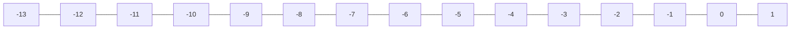
Draw a number line.

**Step-ii**
A number line showing a movement of 6 units to the left from 0 to -6.
```mermaid
graph LR
    Start(0) -- 6 Units Left --> End(-6)
```
Consider 0 as starting point and move 6 steps towards left reaching at $-6$


Sub-Domain-3: LAWS OF INTEGERS | 27
NOT FOR SALE-PESRP

Domain: Numbers and Operations


**Step-iii**
A number line showing a move of 6 units to the left from 0 to -6, and then a move of 7 units to the left from -6 to -13.
- Numbers on line: -13, -12, -11, -10, -9, -8, -7, -6, -5, -4, -3, -2, -1, 0, 1
- Arrow 1: From 0 to -6 (labeled 6 Units)
- Arrow 2: From -6 to -13 (labeled 7 Units)
Now move 7 more steps towards left reaching at -13.

**Step-iv**
A number line showing the final result of adding -6 and -7.
- Numbers on line: -13, -12, -11, -10, -9, -8, -7, -6, -5, -4, -3, -2, -1, 0, 1
- Arrow 1: From 0 to -6 (labeled 6 Units)
- Arrow 2: From -6 to -13 (labeled 7 Units)
- Result Arrow: From 0 to -13
Hence, $(-6) + (-7) = -13$

**Example 2** Use number line to find the sum of -4, -5, and -6.
**Solution** $(-4) + (-5) + (-6)$
A number line showing three consecutive moves to the left.
- Numbers on line: -15, -14, -13, -12, -11, -10, -9, -8, -7, -6, -5, -4, -3, -2, -1, 0, 1
- Arrow 1: From 0 to -4 (labeled 4 Units)
- Arrow 2: From -4 to -9 (labeled 5 Units)
- Arrow 3: From -9 to -15 (labeled 6 Units)
- Result Arrow: From 0 to -15
Hence, $(-4) + (-5) + (-6) = -15$

**Example 3** Use number line to find the sum of 6 and 7.
**Solution** $(+6) + (+7)$
A number line showing two consecutive moves to the right.
- Numbers on line: -2, -1, 0, 1, 2, 3, 4, 5, 6, 7, 8, 9, 10, 11, 12, 13, 14
- Arrow 1: From 0 to 6 (labeled 6 Units)
- Arrow 2: From 6 to 13 (labeled 7 Units)
- Result Arrow: From 0 to 13
Hence, $(+6) + (+7) = +13$

### Sum of unlike integers
The procedure to find the sum of two given integers is illustrated in the following examples.

**Example 4** Use number line to find the sum of 15 and -9.
**Solution** $(+15) + (-9)$
A number line showing a move to the right followed by a move back to the left.
- Numbers on line: -2, -1, 0, 1, 2, 3, 4, 5, 6, 7, 8, 9, 10, 11, 12, 13, 14, 15
- Arrow 1: From 0 to 15 (labeled 15 Units)
- Arrow 2: From 15 back to 6 (labeled 9 Units)
- Result Arrow: From 0 to 6
Hence, $(+15) + (-9) = +15 - 9 = +6$


28 | Sub-Domain-3: LAWS OF INTEGERS
NOT FOR SALE-PESRP

Domain: Numbers and Operations


**Example 5** Use number line to find the sum of $-4$ and $13$.

**Solution** $(-4) + (+13)$

Consider "0" as starting point and move 4 steps towards left, and then move 13 steps towards right. Reached at point $+9$.

The following number line illustrates the addition:
- A line with markings from -5 to 13.
- A blue arrow starts at 0 and moves 4 units to the left, ending at -4.
- A pink arrow starts at -4 and moves 13 units to the right, ending at 9.

Hence, $(-4) + (+13) = -4 + 13 = +9$

**Practice -1** Use number line to find the sum of:
(i) 5 and $-7$
(ii) $-11$ and $-5$
(iii) $-8$ and $18$
(iv) 6 and 10

### 3.1.2 Subtraction of Integers
Since the subtraction is the inverse process of addition. A number line can be used to find the difference between two integers. The word "difference" is a key word that means subtraction. The same procedure can be used to subtract integers which we have used to add integers using number line.

#### Recognize subtraction as the inverse process of addition
Subtraction is the inverse process of addition because "subtracting" a positive integer (subtrahends) from another given positive integer is the same as adding a negative integer (subtrahend) with reverse direction in another given positive integer.

#### Subtraction of like integers
**Example 6** Subtract: (i) 9 from 14 (ii) $-15$ from $-9$

> **Remember**
> To find the difference, we subtract the given numbers.

**Solution** (i) $(+14) - (+9)$
"Subtracting" $+9$ from 14 is same as "adding" 14 to $-9$.

The following number line illustrates the subtraction:
- A line with markings from -1 to 15.
- A blue arrow starts at 0 and moves 14 units to the right, ending at 14.
- A pink arrow starts at 14 and moves 9 units to the left, ending at 5.

Hence, $(+14) - (+9) = +5$

<table>
    <tr>
        <th>Teaching Point</th>
        <th>Use the following links to explain the concept of adding and subtracting integers.</th>
    </tr>
    <tr>
        <td>• https://www.youtube.com/watch?v=CfkaifC7tGY</td>
        <td>• https://www.youtube.com/watch?v=1DKWG5CBeek</td>
    </tr>
</table>
Sub-Domain-3: LAWS OF INTEGERS | 29
NOT FOR SALE-PESRP

Domain: Numbers and Operations


**(ii) $(-9) - (-15) = -9 + 15$**

Subtracting $(-15)$ from $(-9)$ is same as adding $(-9)$ to $15$.

A number line is shown from $-10$ to $6$.
- A pink arrow labeled "15 Units" starts at $-9$ and points right to $+6$.
- A blue arrow labeled "9 Units" starts at $0$ and points left to $-9$.
- A blue bracket indicates the distance from $0$ to $+6$.

Hence, $(-9) - (-15) = +6$

### Subtraction of unlike integers
The procedure to subtract the unlike integers is illustrated in the following examples.

**Example 7** Subtract: **(i)** $+5$ from $-12$ **(ii)** $13$ from $-5$

**Solution** **(i)** $(-12) - (+5) = -12 - 5$

Subtracting $+5$ from $-12$ is the same as adding $-12$ to $-5$.

A number line is shown from $-18$ to $6$.
- A pink arrow labeled "5 Units" starts at $-12$ and points left to $-17$.
- A blue arrow labeled "12 Units" starts at $0$ and points left to $-12$.
- A blue bracket indicates the distance from $0$ to $-17$.

Hence, $(-12) - (+5) = -17$

**(ii) $(-5) - (+13) = -5 - 13$**

Subtracting $(+13)$ from $(-5)$ is same as adding $(-5)$ to $-13$.

A number line is shown from $-18$ to $6$.
- A pink arrow labeled "13 Units" starts at $-5$ and points left to $-18$.
- A blue arrow labeled "5 Units" starts at $0$ and points left to $-5$.
- A blue bracket indicates the distance from $0$ to $-18$.

Hence, $(-5) - (+13) = -18$

> **Practice -2** Use number line to subtract the following integers.
> (i) 8 and 17 (ii) $-9$ and $-14$ (iii) $-11$ and 7 (iv) 8 and $-16$

### 3.1.3 Subtraction of one Integer from the other by changing the sign of the Integer
The following rule can be used to subtract integer from another integer.

**Rule** Change the sign of the integer to be subtracted and add according to the rules of addition.

> **Remember** While doing subtracting always write the greater integer first.


30 | Sub-Domain-3: LAWS OF INTEGERS
NOT FOR SALE-PESRP

Domain: Numbers and Operations


Look at the following examples.

### Example 8
Simplify the following:
(i) $(+9) - (+4)$
(ii) $(+16) - (-7)$
(iii) $(-40) - (-26)$
(iv) $(-68) - (+43)$

**Solution**

<table>
  <tbody>
    <tr>
        <td>(i) (+9) - (+4)</td>
        <td>(ii) (+16) - (-7)</td>
        <td>(iii) (-40) - (-26)</td>
        <td>(iv) (-68) - (+43)</td>
        <td colspan="2"></td>
    </tr>
    <tr>
        <td>= +(9 - 4)</td>
        <td>= +(16 + 7)</td>
        <td>= -(+40 - 26)</td>
        <td>= -68 - 43</td>
        <td colspan="2"></td>
    </tr>
    <tr>
        <td>= +5</td>
        <td>= +23</td>
        <td>= -14</td>
        <td>= -(68 + 43)</td>
        <td colspan="2"></td>
    </tr>
    <tr>
        <td colspan="3"></td>
        <td></td>
        <td></td>
        <td>= -111</td>
    </tr>
  </tbody>
</table>

### Example 9
In a holy month of Ramadan at noon on a Friday, the temperature of Lahore was $+41^\circ\text{C}$. At the time of opening roza the temperature was decreased by $13^\circ\text{C}$. What was the temperature at the time of opening the roza?

**Solution**
Temperature at noon $= +41^\circ\text{C}$
Decrease in temperature till opening time of roza $= +13^\circ\text{C}$
Now, temperature at opening time of roza $= (+41^\circ\text{C}) - (+13^\circ\text{C})$
$= +(41^\circ\text{C} - 13^\circ\text{C})$
$= +28^\circ\text{C}$
Hence, the temperature at opening time of roza was $+28^\circ\text{C}$.

> **Practice -3** Subtract the following by changing the signs: (i) $(-37) - (+14)$ (ii) $(-94) - (-29)$

We can perform four basic mathematical operations $(+, -, \times, \div)$ on integers. In our previous classes, we have learnt about these basic operations.

### 3.1.4 Addition and Subtraction of Integers without using number line
We know how to find the sum and difference of integers using number line. In previous section 3.1.1 and 3.1.2 we have discussed about them. Now in this section we will learn about addition and subtraction of two integers without using the number line. Here we will use the simple rule of addition and subtraction.

#### Addition of two integers with like signs
To add the given integers with like signs simply follow the method illustrated in the following example

### Example 10
Find the sum of: (i) $+14$ and $+19$ (ii) $-11$ and $-16$

**Solution**

<table>
  <tbody>
    <tr>
        <td>(i) +14 and +19</td>
        <td>(ii) -11 and -16</td>
    </tr>
    <tr>
        <td>+ (14 + 19) = +33</td>
        <td>- (11 + 16) = -27</td>
    </tr>
    <tr>
        <td>As, the common sign is '+' so the sum is positive.</td>
        <td>As, the common sign is '-' so the sum is negative.</td>
    </tr>
  </tbody>
</table>

**Go Online**
Use the link to play the online game.
http://www.mathplayground.com/ASB_Spidermatchinteger.html


Sub-Domain-3: LAWS OF INTEGERS | 31
NOT FOR SALE-PESRP

Domain: Numbers and Operations


> **Practice -4** Find the sum of: (i) 18 and 19 (ii) $-29$ and $-57$

### Addition of two integers with unlike signs
To add the given integers with unlike signs simply follow the method illustrated in the following example:

> **Example 11** Find the sum of
> (i) $-16$ and $+11$ (ii) $+70$ and $-22$ (iii) $0$ and $-70$ (iv) $+31$ and $0$

**Solution**

<table>
  <tbody>
    <tr>
        <td>(i) (-16) + (+11)</td>
        <td>As, the sign of greater value is negative so, the result is negative.</td>
        <td>(ii) (+70) + (-22)</td>
        <td>As, the sign of greater value is positive so, the result is positive.</td>
        <td colspan="2"></td>
    </tr>
    <tr>
        <td>= -16 + 11</td>
        <td rowspan="2"></td>
        <td>= 70 - 22</td>
        <td rowspan="2"></td>
        <td colspan="2"></td>
    </tr>
    <tr>
        <td>= -5</td>
        <td>= 48</td>
        <td colspan="2"></td>
    </tr>
    <tr>
        <td>(iii) (0) + (-70)</td>
        <td>As, the sign of greater value is negative so, the result is negative.</td>
        <td>(iv) (+31) + (0)</td>
        <td>As, the sign of greater value is positive so, the result is positive.</td>
        <td colspan="2"></td>
    </tr>
    <tr>
        <td>= 0 - 70</td>
        <td rowspan="2"></td>
        <td>= +31 + 0</td>
        <td rowspan="2"></td>
        <td colspan="2"></td>
    </tr>
    <tr>
        <td>= -70</td>
        <td>= +31</td>
        <td colspan="2"></td>
    </tr>
  </tbody>
</table>

> **Remember** While adding two integers with different signs simply subtract the integers and put the sign with result which is greater valued sign.

> **Note** The sum of any integer with zero (0) always give the same integer in result.

> **Practice -5** Find the sum of (i) 13 and $-18$ (ii) $-27$ and 48

## 3.2 VERIFICATION OF COMMUTATIVE AND ASSOCIATIVE LAWS
The following laws of addition are true for integers.

### Commutative law of addition
According to this law of addition, the sum of two integers unchanged by changing the "order". For example, $2 + 3 = 3 + 2 \Rightarrow 5 = 5$

> **Example 12** Verify the commutative law under addition for whole numbers 23 and 27.

**Solution** By the commutative law of addition.
$$23 + 27 = 27 + 23$$

<table>
  <tbody>
    <tr>
        <td>Take L.H.S</td>
        <td>Now, take R.H.S</td>
    </tr>
    <tr>
        <td>= 23 + 27</td>
        <td>= 27 + 23</td>
    </tr>
    <tr>
        <td>= 50</td>
        <td>= 50</td>
    </tr>
  </tbody>
</table>

As, L.H.S = R.H.S So, $23 + 27 = 27 + 23$
Hence, commutative law of addition is verified.

> **Remember**
> Commutative law with respect to subtraction does not hold. e.g.
> $8 - 3 \neq 3 - 8$


32 | Sub-Domain-3: LAWS OF INTEGERS
NOT FOR SALE-PESRP

Domain: Numbers and Operations


### Associative law of addition
According to this law of addition changing the "grouping" of addends does not change the sum.
For example,
$$(4 + 5) + 7 = 4 + (5 + 7)$$
$$9 + 7 = 4 + 12$$
$$16 = 16$$

> **Did You Know?**
> The sum of zero (0) and an integer is the same as that integer.
> For example, $0 + 7 = 7$ or $7 + 0 = 7$
> and the number '0' is called additive identity.

**Example 13** Verify the associative law of addition for the integers:
(i) $15, -16$ and $19$
(ii) $-14, -18$ and $23$

**Solution**
**(i) $15, -16$ and $19$**
By associative law
$(15 - 16) + 19 = 15 + (-16 + 19)$
Take L.H.S $= (15 - 16) + 19$
$= -1 + 19 = 18$
Now, take R.H.S $= 15 + (-16 + 19)$
$= 15 + 3 = 18$
As, L.H.S = R.H.S
Hence, associative law of addition verified.

**(ii) $-14, -18$ and $23$**
By associative law
$(-14 - 18) + 23 = -14 + (-18 + 23)$
Take L.H.S $= (-14 - 18) + 23$
$= -32 + 23 = -9$
Now, take R.H.S $= -14 + (-18 + 23)$
$= -14 + 5 = -9$
As, L.H.S = R.H.S
Hence, associative law of addition verified.

> **Practice - 6**
> (i) Verify commutative law for the integers $-49$ and $57$.
> (ii) Verify associative law for the integers $-17, 43$ and $64$.

> **Go Online**
> Play the different games online by using the below links.
> * https://www.mathgames.com/skill/3.37-properties-of-addition
> * https://www.mathgames.com/skill/3.38-solve-using-properties-of-addition
> * https://www.mathgames.com/skill/7.96-properties-of-addition-and-multiplication

### Exercise - 3.1

1. Use number line to simplify the following:
(i) $(+7) + (+9)$
(ii) $0 + (-10)$
(iii) $(-8) + (-6)$
(iv) $(+17) - (+8)$
(v) $(+11) + 0$
(vi) $(+13) + (+18) + (+8)$
(vii) $(+15) + (-3) + (-5)$
(viii) $(-8) - (-9)$
(ix) $7 - (-8)$

2. Use number line to find the difference of the following integers:
(i) $(+17) - (+11)$
(ii) $(-34) - (+16)$
(iii) $(+2) - (-4)$
(iv) $(-94) - (-19)$
(v) $(-8) - (-3)$
(vi) $(-81) - (+16)$
(vii) $(+12) - (+10)$
(viii) $(-9) - (-4)$
(ix) $47 - 18$

3. Verify associative law of addition for the integers $17, -21$ and $25$.
4. The sum of two integers is $-107$. One of them is $-49$, find the other.
5. Verify the commutative property of addition for $39$ and $-51$.
6. The difference between two integers is $48$, one of them is $14$, find the other.
7. Two orange trains left Samanabad station at the same time. One travelled $14\text{ km}$ towards Ali Town, while the other travelled $10\text{ km}$ towards Dera Gujran in the opposite direction. Find the total distance between both trains.

[The image shows a photograph of an Orange Line Metro Train on an elevated track in a city environment.]


Sub-Domain-3: LAWS OF INTEGERS | 33
NOT FOR SALE-PESRP

Domain: Numbers and Operations


> **Project - 1**
> Measure the temperature of yourself for one week.
> Then find the difference between the highest and the lowest temperature.
> [Image of a clinical thermometer showing a scale from 35 to 42 degrees Celsius]

# 3.4 MULTIPLICATION AND DIVISION OF INTEGERS

We have learnt about the multiplication and division of two or more numbers in our previous classes. Now in this section we will learn multiplication and division of two or more integers.

## 3.4.1 Multiplication of Integers

As we are familiar that multiplication is the shortest form of repeated addition.
For example $(+5) \times (+2)$. Multiplying $(+5)$ with $(+2)$ mean five jumps, each jump is two steps in the same direction.

**(a).** Five jumps, each jump is of two steps.

[Number line representation: Starting from 0, there are 5 consecutive jumps of 2 units each to the right, landing on +10.]
- Jump 1: 0 to +2 (2 Units)
- Jump 2: +2 to +4 (2 Units)
- Jump 3: +4 to +6 (2 Units)
- Jump 4: +6 to +8 (2 Units)
- Jump 5: +8 to +10 (2 Units)

Hence, $(+5) \times (+2) = +10$

**(b).** Two jumps, each jump is of five steps.

[Number line representation: Starting from 0, there are 2 consecutive jumps of 5 units each to the right, landing on +10.]
- Jump 1: 0 to +5 (5 Units)
- Jump 2: +5 to +10 (5 Units)

Hence, $(+2) \times (+5) = +10$

### Multiplication of two integers with like signs

When we multiply two integers having the "same" signs (both positive or both negative). Then the product of these integers is a positive integer. Now consider the following examples:

**Example 4** Solve the following using number line:
(i) $(+3) \times (+6)$
(ii) $(-6) \times (-2)$

**Solution**
**(i) $(+3) \times (+6)$**
Multiplying $(+3)$ with $(+6)$ means three jumps, each jump is six steps in the same direction.

> **Remember**
> When we multiply even number of integers with same sign the product is always positive.

[Number line representation: Starting from 0, there are 3 consecutive jumps of 6 units each to the right, landing on +18.]
- Jump 1: 0 to 6 (+6)
- Jump 2: 6 to 12 (+6)
- Jump 3: 12 to 18 (+6)

Hence, $(+3) \times (+6) = +18$


34 | Sub-Domain-3: LAWS OF INTEGERS
NOT FOR SALE-PESRP

Domain: Numbers and Operations


> **Note**
> In order to draw a large number on the number line, we need to fix a scale on the number line with equal intervals. For example, we take the distance between two points is equal to 50, then
> 1 unit $= 1 \times 50 = 50$, 7 units $= 7 \times 50 = 350$
>
> [The image shows a number line starting from -50 and going up to 450 with increments of 50: -50, 0, 50, 100, 150, 200, 250, 300, 350, 400, 450.]

**(ii) $(-6) \times (-2)$**

Multiplying $(-6)$ with $(-2)$ means six jumps, each jump is two steps in opposite direction of $-6$.

[The image shows a number line from -2 to +13. Starting from 0, there are six jumps of 2 units each moving to the right (positive direction), landing on +2, +4, +6, +8, +10, and finally +12.]

Hence, $(-6) \times (-2) = +12$

### Multiplication of two integers with unlike signs

When we multiply two integers having the "*different*" signs (one positive and other negative), the product of these integers is a negative integer. Now consider the following examples:

> **Remember**
> Rules for Multiplication
> * $(+) \times (+) = +$
> * $(+) \times (-) = -$
> * $(-) \times (+) = -$
> * $(-) \times (-) = +$

**Example 15** Solve the following using number line: (i) $(-3) \times (+6)$ (ii) $(+5) \times (-3)$

**Solution** **(i)** $(-3) \times (+6)$

Multiplying $(-3)$ with $(+6)$ means three jumps, each jump is of six steps in the same direction of $(-3)$.

[The image shows a number line from -18 to +2. Starting from 0, there are three jumps of 6 units each moving to the left (negative direction), landing on -6, -12, and finally -18.]

Hence, $(-3) \times (+6) = -18$

**(ii)** $(+5) \times (-3)$

Multiplying $(+5)$ with $(-3)$ means five jumps, each jump is of three steps in the same direction of $(-3)$.

[The image shows a number line from -15 to +2. Starting from 0, there are five jumps of 3 units each moving to the left (negative direction), landing on -3, -6, -9, -12, and finally -15.]

Hence, $(+5) \times (-3) = -15$


Sub-Domain-3: LAWS OF INTEGERS | 35
NOT FOR SALE-PESRP

Domain: Numbers and Operations


**Example 16** Find the product of the following integers without using the number line:
(i) $(+23)$ and $(+22)$
(ii) $(-8)$ and $(-15)$
(iii) $(+24)$ and $(-10)$
(iv) $(-36)$ and $(+11)$

**Solution**
<table>
    <tr>
        <td>**(i)** $(+23) \times (+22)$&lt;br/&gt;$= + (23 \times 22)$&lt;br/&gt;$= + 506$</td>
        <td>**(ii)** $(-8) \times (-15)$&lt;br/&gt;$= + (8 \times 15)$&lt;br/&gt;$= + 120$</td>
    </tr>
    <tr>
        <td>**(iii)** $(+24) \times (-10)$&lt;br/&gt;$= - (24 \times 10)$&lt;br/&gt;$= - 240$</td>
        <td>**(iv)** $(-36)$ and $(+11)$&lt;br/&gt;$= - (36 \times 11)$&lt;br/&gt;$= - 396$</td>
    </tr>
</table>> **Practice -6**
> Multiply:
> (i) 10 by -12
> (ii) 14 by -9
> (iii) 34 by 8
> (iv) -16 by 10

### 3.4.2 Division of Integers
Division of integers is same as the division of whole numbers. The procedure for dividing integers is same as we used for multiplying the integers.

*"The division is the inverse process of multiplication."*

**Division of two integers with like signs**
Since the division is an inverse process of multiplication, the division of an integer (dividend) by another given integer (divisor) means to find an integer (quotient) which when multiplied by the given integer, division will give dividend.

<table>
    <tr>
        <th>Multiplication</th>
        <th>Division</th>
    </tr>
    <tr>
        <td>$7 \times 6 = 42$</td>
        <td>$42 \div 6 = 7$ (same numbers)</td>
    </tr>
    <tr>
        <td>$7 \times 6 = 42$</td>
        <td>$42 \div 7 = 6$ (same numbers)</td>
    </tr>
</table>Look at the following expression:
<table>
    <tr>
        <th>$(+63)$</th>
        <th>$\div$</th>
        <th>$(+9)$</th>
        <th>$=$</th>
        <th>$(+7)$</th>
    </tr>
    <tr>
        <td>$\downarrow$</td>
        <td></td>
        <td>$\downarrow$</td>
        <td></td>
        <td>$\downarrow$</td>
    </tr>
    <tr>
        <td>Dividend</td>
        <td>$\div$</td>
        <td>Divisor</td>
        <td>$=$</td>
        <td>Quotient</td>
    </tr>
</table>Now, consider the following example:
**Example 17** Workout: **(i)** $(+45) \div (+5)$ **(ii)** $(-54) \div (-6)$

**Solution**
<table>
    <tr>
        <td>**(i)** $(+45) \div (+5)$&lt;br/&gt;$= (+45) \times \left(+\frac{1}{5}\right)$&lt;br/&gt;$= + \left(\frac{45}{5}\right) \because (+) \times (+) = (+)$&lt;br/&gt;$= + 9$</td>
        <td>**(ii)** $(-54) \div (-6)$&lt;br/&gt;$= (-54) \times \left(-\frac{1}{6}\right)$&lt;br/&gt;$= + \left(\frac{54}{6}\right) \because (-) \times (-) = (+)$&lt;br/&gt;$= + 9$</td>
    </tr>
</table>> **Practice -6** Divide. (i) $-48 \div 6$ (ii) $130 \div (-5)$ (iii) $-216 \div (-4)$ (iv) $105 \div 7$


36 | Sub-Domain-3: LAWS OF INTEGERS
NOT FOR SALE-PESRP

Domain: Numbers and Operations


### Division of two integers with unlike signs

Now, look at the expression:

$$
\begin{matrix}
(+70) & \div & (-10) & = & (-7) \\
\downarrow & & \downarrow & & \downarrow \\
\text{Dividend} & \div & \text{Divisor} & = & \text{Quotient}
\end{matrix}
$$

To divide $(+70)$ by $(-10)$ means to find an integer such as $(-7)$ which when multiplied by $(-10)$ will give $(+70)$. i.e.
$$(-10) \times (-7) = (+70)$$

**Example 18** Solve **(i)** $(+195) \div (-5)$ **(ii)** $(-80) \div (+8)$

**Solution**

<table>
    <tr>
        <th>(i) $(+195) \div (-5)$</th>
        <th>(ii) $(-80) \div (+8)$</th>
    </tr>
    <tr>
        <td>$= (+195) \times \left( -\frac{1}{5} \right) \quad \because (+) \times (-) = (-)$</td>
        <td>$= (-80) \times \left( +\frac{1}{8} \right) \quad \because (-) \times (+) = (-)$</td>
    </tr>
    <tr>
        <td>$= -\left( \frac{195}{5} \right)$</td>
        <td>$= -\left( \frac{80}{8} \right)$</td>
    </tr>
    <tr>
        <td>$= -39$</td>
        <td>$= -10$</td>
    </tr>
</table>### Division of an integer by zero (0)
Division of any number by zero (0) never comes to end at any stage and we cannot find the answer.
For example,

$$
\begin{array}{r@{\quad}r}
1 \\
0 \overline{) 8} \\
\underline{0} \\
8
\end{array}
\quad
\begin{array}{r@{\quad}r}
3 \\
0 \overline{) 8} \\
\underline{0} \\
8
\end{array}
$$

But no value work for 0 time because multiplication of any number with '0' is '0'. Therefore, the division of an integer by zero is not possible.

> **Remember**
> Zero (0) is an integer neither positive nor negative. When it is divided by any integer, the quotient is zero. But dividing any other integer is undefined.

**Activity -3** Measure your body temperature for a week and write down your temperature of each day then show the result on number line also, find the difference between the highest and the lowest temperature.

## 3.5 VERIFICATION OF COMMUTATIVE, ASSOCIATIVE AND DISTRIBUTIVE LAWS

The following laws of multiplication of integers are true for
### Commutative law of multiplication
According to this law of multiplication the product of two integers remains unchanged by changing their "order". For example
$$6 \times 5 = 5 \times 6$$
$$30 = 30$$


Sub-Domain-3: LAWS OF INTEGERS | 37
NOT FOR SALE-PESRP

Domain: Numbers and Operations


**Example 19** Verify the commutative law under multiplication for 24 and 28.

**Solution** By the commutative law of multiplication.
$$24 \times 28 = 28 \times 24$$

<table>
    <tr>
        <th>Take L.H.S</th>
        <th>Take R.H.S</th>
    </tr>
    <tr>
        <td>$= 24 \times 28$</td>
        <td>$= 28 \times 24$</td>
    </tr>
    <tr>
        <td>$= 672$</td>
        <td>$= 672$</td>
    </tr>
</table>As, L.H.S = R.H.S So, $24 \times 28 = 28 \times 24$
Hence, commutative law of multiplication is verified.

> **Remember**
> Commutative law of division of integers is not true. e.g.
> $3 \div 2 \neq 2 \div 3$

### Associative law of multiplication
According to this law of multiplication "changing grouping" of the factors does not change the product. For example, $(4 \times 5) \times 7 = 4 \times (5 \times 7)$
$$20 \times 7 = 4 \times 35$$
$$140 = 140$$

**Example 20** Verify the associative law for $-6, 7$ and $8$.

**Solution** By the associative law of multiplication we need to verify
$$(-6 \times 7) \times 8 = -6 \times (7 \times 8)$$

<table>
    <tr>
        <th>Take L.H.S</th>
        <th>Take R.H.S</th>
    </tr>
    <tr>
        <td>$= (-6 \times 7) \times 8$</td>
        <td>$= -6 \times (7 \times 8)$</td>
    </tr>
    <tr>
        <td>$= -42 \times 8$</td>
        <td>$= -6 \times 56$</td>
    </tr>
    <tr>
        <td>$= -336$</td>
        <td>$= -336$</td>
    </tr>
</table>As, L.H.S = R.H.S
Hence, associative law of multiplication is verified.

### Distributive law of multiplication
According to this law of multiplication, "multiplying a number by the group of numbers added together is same as doing each multiplication separately. For example,

The following diagram illustrates $4 \times (2 + 3) = (4 \times 2) + (4 \times 3)$ using groups of fruit:
- A grid of 4 rows and 5 columns (2 columns of apples and 3 columns of mangoes) equals a grid of 4 rows and 2 columns of apples plus a grid of 4 rows and 3 columns of mangoes.

<table>
  <tbody>
    <tr>
        <td>4 × (2 + 3)</td>
        <td>=</td>
        <td>4 × 2</td>
        <td>+</td>
        <td>4 × 3</td>
    </tr>
    <tr>
        <td>4 × 5</td>
        <td>=</td>
        <td>8</td>
        <td>+</td>
        <td>12</td>
    </tr>
    <tr>
        <td>20</td>
        <td>=</td>
        <td>20</td>
        <td colspan="2"></td>
    </tr>
  </tbody>
</table>


38 | Sub-Domain-3: LAWS OF INTEGERS
NOT FOR SALE-PESRP

Domain: Numbers and Operations


**Example 21** Verify the distributive law of multiplication for
$$-10 \times (7 + 13) = (-10 \times 7) + (-10 \times 13)$$

**Solution**
<table>
    <tr>
        <th>Take L.H.S</th>
        <th>Take R.H.S</th>
    </tr>
    <tr>
        <td>$= -10 \times (7 + 13)$</td>
        <td>$= (-10 \times 7) + (-10 \times 13)$</td>
    </tr>
    <tr>
        <td>$= -10 \times 20$</td>
        <td>$= -70 - 130$</td>
    </tr>
    <tr>
        <td>$= -200$</td>
        <td>$= -200$</td>
    </tr>
</table>As, L.H.S = R.H.S
Hence, distributive law is verified.

> **Practice -8**
> (i) Verify commutative law for integers 105 and -301.
> (ii) Verify the associative law of multiplication for integers -7, -13, -15.
> (iii) Verify distributive law
> $-15 \times (8 - 7) = (-15 \times 8) + (-15 \times -7)$.

> **Did You Know?**
> The integer "1" has a special rule in multiplication just as the number "0" has in case of addition. "The product of "1" and an integer is the same as that number". For example,
> $$1 \times 13 = 13 \quad \text{or} \quad 13 \times 1 = 13$$
> and the number 1 is known as multiplicative identity.

# Exercise - 3.2

1. Find the product of following integers using number line:
(i) $+4$ and $+5$
(ii) $-3$ and $+8$
(iii) $0$ and $-6$
(iv) $+11$ and $-2$
(v) $+5$ and $-5$
(vi) $-10$ and $-3$
(vii) $+9$ and $0$
(viii) $2$ and $-7$

2. Solve:
(i) $(+38) \times (-23)$
(ii) $(+24) \times (+15)$
(iii) $(-15) \times (-19)$
(iv) $(+23) \times (-41)$
(v) $(+74) \times (+0)$
(vi) $(-89) \times (-1)$

3. Find the quotient:
(i) $(+51) \div (+3)$
(ii) $(27) \div (-3)$
(iii) $(-54) \div (+9)$
(iv) $(-78) \div (-13)$
(v) $(+108) \div (-1)$
(vi) $(+156) \div 0$
(vii) $0 \div (+89)$
(viii) $(+1) \times (-228)$

4. Fill in the blanks with an appropriate integer:
(i) $(\_\_\_\_\_) \times (+7) = (-56)$
(ii) $(-3) \times (\_\_\_\_\_) = 30$
(iii) $(-21) \div (\_\_\_\_\_) = -3$
(iv) $(\_\_\_\_\_) \div (+12) = 60$
(v) $(+121) \times (\_\_\_\_\_) = 0$
(vi) $(-212) \div (\_\_\_\_\_) = (-212)$

5. Verify the following:
(i) $5 + 8 = 8 + 5$
(ii) $29 + 13 = 13 + 29$
(iii) $231 + 145 = 145 + 231$

6. Verify commutative law under addition for the following whole numbers:
(i) 29 and 39
(ii) 348 and 289
(iii) 828 and 215
(iv) 3335 and 411

7. Verify:
(i) $-5 \times (-7 \times 8) = (-5 \times -7) \times 8$
(ii) $-9 \times (-10 \times -7) = (-9 \times -10) \times -7$

8. Verify the distributive law:
(i) $7 \times (8 + 9) = 7 \times 8 + 7 \times 9$
(ii) $10 \times (30 - 20) = 10 \times 30 - 10 \times 20$


Sub-Domain-3: LAWS OF INTEGERS | 39
NOT FOR SALE-PESRP

Domain Numbers and Operations


9. The sum of two integers is 194. One of them is -28. Find the other integer.
10. Rabia asked her mother to hold her savings. At the start of July her saving was Rs. 100. At the end of July she added Rs. 250 more in her savings. In the month of August she borrowed Rs. 185 to spend. What is the remaining or owed amount?
11. On Sunday morning the temperature of Faisalabad city was 45°C. It dropped 3°C per hour due to weather condition. What was the total change in temperature after 5 hours?

> **Project - 2**
> Create a model for distributive law of multiplication. You can use material from your surrounding e.g. straws, buttons, fruits and etc.

## 3.5 THE ORDER OF MATHEMATICAL OPERATIONS (BODMAS RULE)

We are familiar with simplification of expressions from our previous classes. We have learnt about them. In routine life we add, multiply, subtract or divide two or more numbers for different purposes. After doing these we get our result in simplified form.

*"The process of getting a simplified number is known as simplification".*

To simplify the mathematical expression with two or more operations we use BODMAS rule. The letters of BODMAS are used for the order of operations which help us to simplify the given expressions. The order of operations used in the field of Mathematics, Science, Technology and many computer programming languages. For example,

Naseem has 30 eggs in each of six eggs trays. Seven other trays have 12 eggs in each tray. How many eggs does Naseem have in all?

To find how many eggs are there in all,
Naseem computes as follow = $6 \times 30 + 7 \times 12$
Total number of eggs = $6 \times 30 + 7 \times 12$
= $180 + 84$
= $264$

Therefore, Naseem has 264 eggs in all.

Now, look at the given numerical expression. $5 \times (45 \div 7) - (18 \div 3) + 8$
To simplify the above type of mathematical expressions, we use BODMAS rule.

### 3.5.1 Different kinds of Brackets

Brackets are the symbols which are used in pairs to group two or more numbers together with mathematical operations.
There are four kinds of brackets that are mentioned below.

(i) Bar or vinculum. "$\overline{\quad}$"
(ii) Parentheses or curved brackets or round brackets. "( )"
(iii) Braces or curly bracket. "{ }"
(iv) Square brackets or box brackets. "[ ]"

> ### History
> Achilles Reselfelt invented the BODMAS rule.
> To lean more about him, and the BODMAS rule visit the link.
> https://www.africafeeds.com/2021/12/16/importance-of-bodmas-rule/


40 | Sub-Domain-3: LAWS OF INTEGERS
NOT FOR SALE-PESRP

Domain: Numbers and Operations


### 3.5.2 Order of preferences as to remove the brackets from an expression

If any mathematical problem involving more than one bracket then brackets should be removed in the same orders. Look at the below example.

**(i) Two students solve same question in different order.**

<table>
  <thead>
    <tr>
        <th>(i)</th>
        <th></th>
        <th>Student-I</th>
        <th>(ii)</th>
        <th></th>
        <th>Student-II</th>
    </tr>
  </thead>
  <tbody>
    <tr>
        <td rowspan="5"></td>
        <td>$30 \times (40 - \overline{24 + 10}) + 7$<br/>$= 30 \times (40 - 24 - 10) + 7$<br/>$= 30 \times (40 - 34) + 7$<br/>$= 30 \times (6) + 7$<br/>$= 180 + 7 = 187$</td>
        <td rowspan="5"></td>
        <td>$30 \times (40 - \overline{24 + 10}) + 7$<br/>$= 30 \times (40 - 24 - 10) + 7$<br/>$= 30 \times (40 - 34) + 7$<br/>$= 30 \times 40 - 34 + 7$<br/>$= 1200 - 27 = 1173$</td>
        <td colspan="2"></td>
    </tr>
    <tr>
        <td>Right way</td>
        <td>Wrong way</td>
        <td colspan="2"></td>
    </tr>
  </tbody>
</table>

> For preference of sign in an arithmetic expression, simply follow the below steps. Always proceed from left to right.
> 
> (i) $3 + 8 - 4$
> $= 11 - 4 = 7$
> 
> (ii) $14 \div 2 \times 5$
> $= 7 \times 5 = 35$

**(ii) If there is a '+' sign before any pair of brackets, the brackets will be removed without changing the sign of the number within brackets. For example,**
$$3 + (6 - 2)$$
$$= 3 + (+4)$$
$$= 3 + 4 = 7$$

**(iii) If there is a '-' sign before any pair of brackets, the brackets will be removed by changing the sign of the number within brackets. For example,**
$$3 - (5 - 9)$$
$$= 3 - (-4)$$
$$= 3 + 4 = 7$$

**(iv) If there is no sign between a number (outside the pair of brackets) and a number within the brackets then there will be multiplication between them, and brackets will be removed after multiplication.**
For example,
$$7 (6 - 4)$$
$$= 7(2) = 7 \times 2 = 14$$

The order of solving brackets within the given expression is mentioned below.
(i) "$\overline{\quad}$", vinculum or bar is treated as first preference.
(ii) "( )" parentheses or curved brackets or round brackets are treated on second preference.
(iii) "{ }" curly brackets or braces are treated on third preference.
(iv) "[ ]" square brackets or box brackets are solved at the end.


Sub-Domain-3: LAWS OF INTEGERS | 41
NOT FOR SALE-PESRP

Domain: Numbers and Operations


**Example 22** Solve: $2020 - 18 [5 \times \{19 - 17 + (\overline{70 \div 10} + 5)\}]$

**Solution**
$= 2020 - 18 [5 \times \{19 - 17 + (7 + 5)\}]$ &emsp;&emsp;&emsp;&emsp; Vinculum solved
$= 2020 - 18 [5 \times \{19 - 17 + 12\}]$ &emsp;&emsp;&emsp;&emsp;&emsp; Parentheses solved
$= 2020 - 18 [5 \times \{2 + 12\}]$
$= 2020 - 18 [5 \times 14]$ &emsp;&emsp;&emsp;&emsp;&emsp;&emsp;&emsp;&emsp;&emsp; Curly brackets are solved
$= 2020 - 18 [70]$
$= 2020 - 1260$ &emsp;&emsp;&emsp;&emsp;&emsp;&emsp;&emsp;&emsp;&emsp;&emsp;&emsp; Square brackets are solved
$= 760$

### 3.5.3 Recognize BODMAS Rule

We have introductory discussion about the BODMAS rule in section 3.5.1. It shows the sequence, where more than one operations are performed in the simplification of mathematical expression.

In some circumstances we call it as, BIDMAS, BEDMAS, or PEDMAS created to remember order of operations.

The letters of BODMAS, are used for the order of fundamental operations.

<table>
  <thead>
    <tr>
        <th></th>
        <th colspan="2">BODMAS</th>
    </tr>
  </thead>
  <tbody>
    <tr>
        <td>B</td>
        <td>For Brackets</td>
        <td></td>
    </tr>
    <tr>
        <td>O</td>
        <td>For of or order of operations</td>
        <td></td>
    </tr>
    <tr>
        <td>D</td>
        <td>For Division</td>
        <td></td>
    </tr>
    <tr>
        <td>M</td>
        <td>For Multiplication</td>
        <td></td>
    </tr>
    <tr>
        <td>A</td>
        <td>For Addition</td>
        <td></td>
    </tr>
    <tr>
        <td>S</td>
        <td>For Subtraction</td>
        <td></td>
    </tr>
  </tbody>
</table>

By using the BODMAS rule, we can simplify any given mathematical expression involving brackets and arithmetic operations. Now look at the following examples:

**Example 23** Simplify: $3 \times 11 + 4 - 2 + (64 \div 8)$

**Solution**
$3 \times 11 + 4 - 2 + (64 \div 8)$ &emsp;&emsp;&emsp;&emsp; First compute expressions within the brackets
$= 3 \times 11 + 4 - 2 + (8)$
$= 3 \times 11 + 4 - 2 + 8$ &emsp;&emsp;&emsp;&emsp;&emsp;&emsp; Remove brackets
$= 33 + 4 - 2 + 8$ &emsp;&emsp;&emsp;&emsp;&emsp;&emsp;&emsp;&emsp; According BODMAS, apply multiplication
$= 37 - 2 + 8$ &emsp;&emsp;&emsp;&emsp;&emsp;&emsp;&emsp;&emsp;&emsp; Now, add or subtract from left to right
$= 35 + 8$
$= 43$

**Example 24** Simplify: $4 \times 2 - [28 \div \{3 + (8 + \overline{6 - 3})\}]$

**Solution**
$4 \times 2 - [28 \div \{3 + (8 + \overline{6 - 3})\}]$ &emsp;&emsp; First compute bar or vinculum.
$= 4 \times 2 - [28 \div \{3 + (8 + 3)\}]$ &emsp;&emsp;&emsp; Compute expression within round brackets.
$= 4 \times 2 - [28 \div \{3 + 11\}]$ &emsp;&emsp;&emsp;&emsp; Compute expression within braces.
$= 4 \times 2 - [28 \div 14]$ &emsp;&emsp;&emsp;&emsp;&emsp;&emsp;&emsp; Compute expression within square brackets.
$= 4 \times 2 - 2$ &emsp;&emsp;&emsp;&emsp;&emsp;&emsp;&emsp;&emsp;&emsp;&emsp; Multiply or divide from left to right.
$= 8 - 2$ &emsp;&emsp;&emsp;&emsp;&emsp;&emsp;&emsp;&emsp;&emsp;&emsp;&emsp;&emsp; Add or subtract from left to right.
$= 6$


42 | Sub-Domain-3: LAWS OF INTEGERS
NOT FOR SALE-PESRP

Domain: Numbers and Operations


**Example 25** Nabeel is a bookshop owner. He orders 30 new year diaries. The cost of each diary is Rs. 300. He paid Rs. 530 for shipping. How much Nabeel spent in all?

**Solution**
Total number of diaries = 30
Cost of each diary = Rs. 300
Shipping cost = Rs. 530
Total spending = $(30 \times 300) + 530$
= $9000 + 530 = 9530$
Therefore, Nabeel spend Rs. 9530 in all.

**Example 26** Waseem purchased the following items for his office. Four chairs at the rate of Rs. 950 each. Three tables at the rate of Rs. 2500 each. Two desktop computers at the rate of 4500 each. How much money did Waseem spend altogether?

**Solution**
Price of a chair = Rs. 950
Total number of chairs = 4
Price of four chairs = $950 \times 4 = \text{Rs. } 3800$
Price of a computer table = Rs. 2500
Total number of computer tables = 3
Price of three computer tables = $2500 \times 3 = \text{Rs. } 7500$
Price of a desktop computer = Rs. 4500
Total number of desktop computers = 2
Price of two desktop computers = $4500 \times 2 = \text{Rs. } 9000$
Total amount paid by Waseem = $(950 \times 4) + (2500 \times 3) + (4500 \times 2)$
= $3800 + 7500 + 9000 = 20,300$
Therefore, Waseem spent Rs. 20,300 altogether.

> **Remember**
> LCM stands for least common multiple.

### 3.5.4 Simplify the mathematical expressions involving fractions and decimals groupes

BODMAS rule can also use to simplify the mathematical expressions involving decimals and fractions. Now, look at the following examples:

**Example 27** Simplify $14.75 + [3.20 - \{1.60 \div 2 \times (12.50 + 13.90 - 5.90)\}]$

**Solution** $14.75 + [3.20 - \{1.60 \div 2 \times (12.50 + 13.90 - 5.90)\}]$
$= 14.75 + [3.20 - \{1.60 \div 2 \times (12.50 + 8.00)\}]$
$= 14.75 + [3.20 - \{1.60 \div 2 \times 20.50\}]$
$= 14.75 + \left[3.20 - \left\{1.60 \times \frac{1}{2} \times 20.50\right\}\right]$
$= 14.75 + [3.20 - \{0.80 \times 20.50\}]$
$= 14.75 + [3.20 - 16.40]$
$= 14.75 - 13.20$
$= 1.55$

*(Note: There is a calculation discrepancy in the original image where $3.20 - 16.40$ is written as $4.20 - 16.40$ and the final result is given as 2.55, but following the steps shown: $14.75 + [3.20 - 16.40] = 14.75 - 13.20 = 1.55$)*


Sub-Domain-3: LAWS OF INTEGERS | 43
NOT FOR SALE-PESRP

Domain: Numbers and Operations


**Example 28** One day Shabana went to Sunday bazar to buy vegetables with her mother. She bought $3\text{ kg}$ beetroot in Rs. 50 per kg, $\frac{1}{4}\text{ kg}$ garlic in Rs. 200 per kg, $2\frac{1}{2}\text{ kg}$ okra in Rs. 60 per kg and $5\text{ kg}$ onion in Rs. 20 per kg. How much money did she spend to buy all the vegetables?

**Solution**
Price of $1\text{kg}$ beetroot = Rs. 50
Price of $3\text{kg}$ beetroot = $3 \times 50$ = Rs. 150
Price of $1\text{kg}$ garlic = Rs. 200
Price of $\frac{1}{4}\text{kg}$ garlic = $\frac{1}{4} \times 200$ = Rs. 50
Price of $1\text{kg}$ okra = Rs. 60
Price of $2\frac{1}{2}\text{kg}$ okra = $2\frac{1}{2} \times 60 = \frac{5}{2} \times 60$ = Rs. 150
Price of $1\text{kg}$ onion = Rs. 20
Price of $5\text{kg}$ of onion = $5 \times 20$ = Rs. 100

By using the BODMAS rule.
Total price of all the vegetables = $(3 \times 50) + \left(\frac{1}{4} \times 200\right) + \left(2\frac{1}{2} \times 60\right) + (5 \times 20)$
$= 150 + 50 + 150 + 100 = 450$

Hence, Shabana spent Rs. 450 to buy all the vegetables.

> **Activity -4** Visit the nearest pizza shop with your mother / father and ask the price of different types of pizza then calculate the total price of all types of pizza using mathematical operations.
> (i) 3 large pizzas (ii) how many medium pizzas (iii) 6 small pizzas

# Exercise - 3.3

1. Simplify the following:
(i) $4 + 6 - 7 \times 15 \div 3$
(ii) $25 + (8 \times 24 \div 2 - 26)$
(iii) $44 - \{26 + (-84 \times 84 \div 42)\}$
(iv) $86 \div (37 + \{29 - (114 \div 6 + 9 - 5)\})$
(v) $230 \times [184 - \{276 \div 138 \times 124 \div 4 - 30\}]$
(vi) $221 + [616 - \{347 + (435 \div 3 \times 2 - 36 - 6)\}]$

2. Use the order of operations to simplify the following:
(i) $19.5 + 12.8 - 13.5$
(ii) $8.8 \div 2.2 - (-2.8)$
(iii) $30.8 \div (3.1 + 0.4)$
(iv) $16.31 + \{2.50 - (5.94 \div 2.20 \times 4.0 - 1.875)\}$
(v) $433.29 - [505.25 + \{113.18 \div (89.5 + 24.97 - 1.29)\}]$
(vi) $5.50 - [6.10 \times 2 - \{39 + (4.5 + 8 - 2)\}]$
(vii) $5.2 + [0.5 - \{6.4 + (-9 + 5 - 3)\}]$


44 | Sub-Domain-3: LAWS OF INTEGERS
NOT FOR SALE-PESRP

Domain: Numbers and Operations


3. Simplify the following by using order of operations:
(i) $3\frac{4}{99} + 4\frac{7}{33} - 5\frac{9}{11}$
(ii) $4\frac{8}{9} \times 3\frac{5}{14} \div 1\frac{1}{14}$
(iii) $\frac{7}{18} + \left( \frac{5}{9} \div \frac{1}{3} \right)$
(iv) $\frac{5}{9} + \left( \frac{7}{18} + \frac{1}{3} - \frac{1}{6} + \frac{1}{2} \right)$
(v) $\frac{8}{33} \times \left( \frac{9}{11} \div \frac{3}{22} \right)$
(vi) $\frac{5}{12} + \left\{ \frac{11}{24} - \left( \frac{2}{3} + \frac{7}{8} - \frac{2}{3} \right) \right\}$
(vii) $-3\frac{9}{24} \div \left[ 4\frac{3}{8} \times \left\{ \frac{1}{2} + \left( 5\frac{1}{2} - 6\frac{1}{2} \right) \right\} \right]$
(viii) $1\frac{5}{7} \text{ of } 21 + 3\frac{3}{4} \div \frac{3}{7} - 1\frac{1}{3}$

4. There are 320 students in a school. 220 students receive pocket money Rs. 50 per day and the rest receive Rs. 70 per day. To the management of school, a week is equal to six working days. How much amount all the students spend in a week?

5. A factory worker makes 90 bars of soap in a week and sells these at the rate of Rs. 250 each. Before the soap can all be sold, the workers found out 10 bars were nibbled by mice. How much will be the total sale at the end of a four week month?

6. Shazmeena had 30.50 metres of cloth. She used 12.60 metres of cloth for her suit. She gives 10.80 metres of cloth to her friend. How much cloth is left with Shazmeena?

7. The price of 20 kg chemical is Rs. 25000. Find the price of 13 kg chemical.

8. Nasreen bought 15 metres of cloth from the market. She used half of the cloth for her suit, $\frac{1}{3}$ part of it for her little daughter. She used remaining cloth for her nieces's suit. How much cloth did she use for her nieces's suit?

9. Sakeena required $24\frac{1}{4}$ metres long wire for a connection. She joined three length of wires $4\frac{3}{4}$ metres, $5\frac{1}{8}$ metres and $6\frac{1}{2}$ metres. How much more length of wire she needed?

> **Project - 2** Create your own word problem in which four operations are used.

# Review Exercise 3

1. Each of the following question is followed by four suggested options. In each case select the correct option.
(i) The inverse process of addition is called:
a. addition
b. subtraction
c. multiplication
d. division

(ii) The product of odd number of integers is always:
a. odd
b. odd and even
c. even
d. prime

(iii) The product of three negative integers is always:
a. positive
b. negative
c. even
d. odd


Sub-Domain-3: LAWS OF INTEGERS | 45
NOT FOR SALE-PESRP

Domain: Numbers and Operations


(iv) The sign of the product $(-6) \times (-6) \times (-6) \times (-6) \times (-6) \times (-6) \times (-6)$ is:
- a. $-$
- b. $+$
- c. $\times$
- d. $\div$

(v) $-150 \times -3 =$ \_\_\_\_\_\_\_\_\_\_
- a. $-50$
- b. $+450$
- c. $-450$
- d. $-100$

(vi) The process of getting a simplified number is called:
- a. purification
- b. simplification
- c. explanation
- d. exploration

(vii) [ ] brackets are known as:
- a. vinculum
- b. braces
- c. parentheses
- d. box brackets

(viii) If all the brackets are found in a given expression, then the first bracket which will be removed is:
- a. { }
- b. ( )
- c. \_\_\_\_\_\_\_\_\_\_
- d. [ ]

(ix) If a word 'of' exists in any expression it means:
- a. addition
- b. subtraction
- c. multiplication
- d. division

(x) While solving a mathematical expression always use BODMAS rule and proceed from:
- a. right to left
- b. left to right
- c. middle to left
- d. left to middle

(xi) In the given mathematical expression if all the brackets are involved, we will solve \_\_\_\_\_\_\_\_\_\_ bracket at the end:
- a. \_\_\_\_\_\_\_\_\_\_
- b. ( )
- c. { }
- d. [ ]

(xii) According to the BODMAS rule, first basic operation is performed:
- a. addition
- b. subtraction
- c. multiplication
- d. division

(xiii) $(33.5 + 90 - 70) \times 0$:
- a. $-254.5$
- b. $254.5$
- c. $0$
- d. $147$

(xiv) $\frac{3}{4} + \left( \frac{5}{7} - \frac{2}{7} \div \frac{2}{7} \right)$
- a. \_\_\_\_\_\_\_\_\_\_
- b. $1 \frac{1}{21}$
- c. $\frac{1}{28}$
- d. $\frac{13}{28}$

### 2. Give the short answer for each question:
(i) What are like integers?
(ii) What are unlike integers?
(iii) Write commutative law with respect to addition.
(iv) Write associative law with respect to addition.
(v) What is associative law of multiplication?
(vi) What is distributive law of multiplication?
(vii) What is BODMAS rule?

### 3. Simplify the following:
(i) $80 - [25 - \{20 - (7 - \overline{9 - 3})\}]$
(ii) $100 - [289 \div 17 \times 7) - (-5) - \{2 - \overline{17 - 10}\}]$
(iii) $3 \div 15 + [2.4 - \{0.50 \times (8.50 - \overline{4.60 - 2.60}\}]$
(iv) $4 \frac{3}{11} + \left[ 5 \frac{5}{8} \div \left\{ \frac{3}{5} + \left( 4 \frac{1}{5} \times 2 \frac{1}{6} - 3 \frac{1}{6} \right) \right\} \right]$


46 | Sub-Domain-3: LAWS OF INTEGERS
NOT FOR SALE-PESRP

Domain: Numbers and Operations


4. The sum of two integers is $-215$. If one of them is $-135$, then find the other.
5. The product of two integers is $-180$. If one of them is $10$, then find the other.
6. Find an integer that divides $-150$ to give $-3$.
7. The difference of two integers is $185$. If one of them is $400$, then find the other integer.
8. The sum of two integers is $-105$. If one of them is $95$, then find the other.
9. Anee is reading a book from the past three weeks. She reads $35$ pages everyday. She still has $200$ pages left. How many pages does the book have in all?
10. In how much time Raheel will cover $60$ kilometres distance with a speed of $10$ kilometre per hour?
11. Akbar is a shopkeeper. He sold $8 \frac{1}{4}$ kg rice, $6 \frac{1}{4}$ kg sugar and $12 \frac{1}{2}$ kg flour. How much did he sell in all?
12. Neelam has Rs. $1500$ balance in her mobile. She gave $\frac{3}{5}$ to Naila. Naila gave $\frac{1}{5}$ of her share to Nimra. How much share Nimra has?

### Project - 3
Calculate the age of your all siblings in days then find the difference between the youngest and the oldest ages by using BODMAS rule.

## Summary
* The integers with the same signs are called like integers.
* The integers with different signs are called unlike integers.
* According to the commutative law of addition, the sum of two integers remains unchanged by changing the "order".
* Zero ($0$) is an integer neither positive nor-negative.
* According to the associative law of addition changing the "grouping" of addends does not change the sum.
* According to the commutative law of multiplication the product of two integers remains unchanged by changing their "order".
* According to the associative law of multiplication "changing grouping" of the factors does not change the product.
* According to the distributive law of multiplication multiplying an integer by the group of integers added together is same as doing each multiplication separately.
* The product of two unlike integers is always negative.
* The product of two like integers with negative signs is always positive.
* Division of integer by zero ($0$) is not possible.


Sub-Domain-3: LAWS OF INTEGERS | 47
NOT FOR SALE-PESRP

Domain Numbers and Operations


<page_header>
Domain Numbers and Operations
</page_header>

*   The word BODMAS indicates the sequence in which more than one operations are performed in the simplification of mathematical expressions.
*   If there is a plus '+' sign before any pair of the brackets, the brackets will be removed without changing the sign of the numbers within brackets.
*   If there is a minus '-' sign before any pair of the brackets, the brackets will be removed with changing the sign of the number within brackets.
*   If there is no sign between a number (outside the pair of brackets) and a number within the brackets, then there will be multiplication between both numbers, and brackets will be removed after multiplication.
*   Brackets are solved in the following order 1<sup>st</sup> — vinculum of bar, 2<sup>nd</sup> ( ) parentheses, 3<sup>rd</sup> { } braces and 4<sup>th</sup> [ ] square brackets.

### Challenge

Look at the magic squares and complete each square such that the numbers in each square add up to the same sum horizontally, vertically or diagonally.

<table>
  <tbody>
    <tr>
        <td colspan="3">Square 1</td>
        <td colspan="3">Square 2</td>
        <td colspan="3">Square 3</td>
    </tr>
    <tr>
        <td></td>
        <td>-4</td>
        <td></td>
        <td>2</td>
        <td></td>
        <td>-5</td>
        <td></td>
        <td colspan="2"></td>
    </tr>
    <tr>
        <td>-1</td>
        <td>1</td>
        <td>5</td>
        <td>1</td>
        <td>-7</td>
        <td>-5</td>
        <td>-3</td>
        <td colspan="2"></td>
    </tr>
    <tr>
        <td>2</td>
        <td></td>
        <td></td>
        <td></td>
        <td>0</td>
        <td></td>
        <td></td>
        <td>-4</td>
        <td></td>
    </tr>
  </tbody>
</table>

> **Teaching Point**
>
> The questions in the exercises, practices and different activities are given as examples (symbols) for learning. You can use self generated questions (test items) conceptual type MCQ's, fill in the blanks, column matching, constructed response questions and (simple computations) based on cognitive domain (e.g. knowing = 40%, applying = 40% and reasoning = 20%) to assess the understanding of learners.


48 | Sub-Domain-3: LAWS OF INTEGERS
NOT FOR SALE-PESRP

Domain: Numbers and Operations


# Sub-Domain 4: RATE, RATIO AND PERCENTAGE

**Students' Learning Outcomes:**
**By the end of this sub-domain, students will be able to:**
*   Define and calculate ratio, equivalent ratio, rate and percentage.
*   Solve real life problems involving ratio, rate and percentage.

> How many eggs can be placed in four plates? If there are

[The image shows two plates with 6 eggs each, totaling 12 eggs.]
12 eggs in two plates

[The image shows three plates with 6 eggs each, totaling 18 eggs.]
18 eggs in three plates

## 4.1 RATIO
*"The ratio is a numerical comparison between two quantities or things of same kind."*

In our daily life we commonly use the word ratio while distributing the quantities, money and other things. for example,

[The image shows 4 green mangoes and 5 yellow mangoes.]
4 : 5

There are four green mangoes to five yellow mangoes.
A ratio can be expressed in three forms, **(i) Word form (ii) Ratio form (iii) Fraction form**

The above example of mangoes shows,
4 to 5 in words form
4 : 5 in ratio form
$\frac{4}{5}$ in fraction form.

> **Remember**
> Always compare the quantities of same kind with same unit. Beacuse the ratio of two same quantities can be defined, but the ratio of two different quantities is meaningless. e.g. We can not compare his/her weight with his/her height.

Each form is read as *"the ratio of 4 to 5"* similarly in general we use 'x' for the first quantity and 'y' for the second quantity and write them as $x : y$ as *"the ratio of x to y"*.
If more than two quantities are given we write them as $x : y : z$ in the form of ratio.

### 4.1.1 Defining a Ratio
Every country of the world has its national flag. A national flag is a flag that represents and symbolizes a country. Look at the Pakistan's National flag. It is in the ratio of height to length. Which is 2 : 3.

[The image shows the National flag of Pakistan.]

So for every 2 (centimetre, metre or feet) whatever of height there must be 3 of length.


Sub-Domain-4: RATE, RATIO AND PERCENTAGE | 49
NOT FOR SALE-PESRP

Domain: Numbers and Operations


**Example 1**
If we make a flag of $20\text{ cm}$ high, it must be $30\text{ cm}$ long.
If we make another flag of $40\text{ cm}$ high it must be $60\text{ cm}$ long.

But both times flag is still in the ratio $2 : 3$ so, we can say
"The ratio is a relation in which one quantity bears to another quantity of the same kind with regards to their magnitude".

### 4.1.2 Antecedent and Consequent in a Ratio

In previous section 4.1 we compared the green mangoes with yellow mangoes. The ratio of green to yellow is $4 : 5$. Here in this example the number 4 is the first element in the ratio and the number 5 is the second element in the ratio.
"The first element is called antecedent and the second element is called consequent."

Antecedent $\longrightarrow 4 : 5 \longleftarrow$ Consequent

**Example 2** Write down the antecedent and consequent of the following ratios:
(i) $7 : 9$
(ii) $a : b$
(iii) $19 : 20$

> **Remember**
> * Order of ratios always matters, i.e $4:5$ is not same as $5:4$.
> * Ratio is unit less or it has no unit.

**Solution**
<table>
  <tbody>
    <tr>
        <td>(i)</td>
        <td>7 : 9</td>
        <td>(ii)</td>
        <td>a : b</td>
        <td>(iii)</td>
        <td>19 : 20</td>
    </tr>
    <tr>
        <td></td>
        <td>Antecedent = 7</td>
        <td></td>
        <td>Antecedent = a</td>
        <td></td>
        <td>Antecedent = 19</td>
    </tr>
    <tr>
        <td></td>
        <td>Consequent = 9</td>
        <td></td>
        <td>Consequent = b</td>
        <td></td>
        <td>Consequent = 20</td>
    </tr>
  </tbody>
</table>

### 4.1.3 Calculation of Ratio

Ratios are the mathematical expressions in which we compare two or more quantities. Ratios can be calculated and written in several different ways. But principle ways have been discussed in the following examples:

**Example 3** Nimra wants to celebrate her birthday. She used 8 table spoons milk and 24 table spoons unsalted butter to make her birthday cake. Write the ratio of milk to unsalted butter.

**Solution**
Milk used for birthday cake = 8 table spoons
Unsalted butter used for birthday cake = 24 table spoons.
So, the ratio of milk to unsalted butter is $8:24 = 1:3$

**Example 4** There are 400 students and 40 teachers in a school. Write the ratio of teachers to students.

**Solution**
Number of teachers in the school = 40
Number of students in the school = 400
So, The ratio of teachers to students is $40 : 400 = 1 : 10$

> **Activity -1**
> Make a national flag with the ratio 2:3. Your flag measurement should be different from your friend's flag measurement.


50 | Sub-Domain-4: RATE, RATIO AND PERCENTAGE
NOT FOR SALE-PESRP

Domain: Numbers and Operations


## 4.1.4 Simplification of Given Ratio into Lowest (Equivalent) Form

We know that a ratio is another form of common fraction. To reduce the given ratios into the lowest (equivalent) form we divide each term of ratio by the H.C.F (Highest Common Factor) of all the terms. Look at the following examples:

**Example 5** Reduce the following ratios into the lowest equivalent ratios.
(i) $7 : 56$
(ii) $9 : 36 : 48$

**Solution**
**(i) $7 : 56$**
H.C.F of 7 and 56 is 7
Now, divide each term of the ratio by 7.
$= \frac{7}{7} : \frac{56}{7}$
$= 1 : 8$
Hence, the required lowest (equivalent) ratio is $1 : 8$.

**(ii) $9 : 36 : 48$**
HCF of 9, 36 and 48 is 3
Now, divide each term by 3.
$= \frac{9}{3} : \frac{36}{3} : \frac{48}{3}$
$= 3 : 12 : 16$
Hence, the required ratio is $3 : 12 : 16$.

> **Thinking Time**
> If Muddasar is 10 years old and Humaira is 8 years old. What is the ratio of their ages? What is the ratio of their ages after five years?

> **Remember**
> A ratio remains unchanged when both the terms are multiplied or divided by the same number. This is known as equivalent ratio.

**Example 6** There are 40 boys and 60 girls in two sections of Mathematics class. Find the ratio of boys to girls in both sections, also write the answer in the simplest form.

**Solution**
Number of boys in Mathematics class = 40
Number of girls in Mathematics class = 60
boys : girls
40 : 60

H.C.F of 40 and 60 is 20
Now, divide each term of ratio by 20.
$= \frac{40}{20} : \frac{60}{20}$
$= 2 : 3$
Hence, the ratio of boys to girls is $2:3$.

**Practice**
1. Simplify the following ratios: (i) $60 : 2000$ (ii) $25 : 625$
2. Rehman earns Rs. 500 in an hour and spend Rs. 350. Find the ratio of his income to expenditure.

## 4.1.5 Relationship Between Ratio and Fraction

We have discussed in section 5.1 that the ratio can also be expressed in fraction form. Where the numerator is called antecedent and the denominator is called consequent.
$$3 : 5 = \frac{3}{5}$$
Similarly, in general $a : b = \frac{a}{b}$ where '$a$' is antecedent and '$b$' is consequent.

A ratio has no unit. It is just a number which indicates how many times one quantity is greater than the other.


Sub-Domain-4: RATE, RATIO AND PERCENTAGE | 51
NOT FOR SALE-PESRP

Domain: Numbers and Operations


### Example 7
First write in fraction form and then simplify.
(i) $18 : 24$
(ii) $40 : 70$
(iii) $25 : 45$

#### Solution
<table>
    <tr>
        <th>(i) $18 : 24$</th>
        <th>(ii) $40 : 70$</th>
        <th>(iii) $25 : 45$</th>
    </tr>
    <tr>
        <td>$= \frac{18}{24}$</td>
        <td>$= \frac{40}{70}$</td>
        <td>$= \frac{25}{45}$</td>
    </tr>
    <tr>
        <td>$= \frac{3}{4}$</td>
        <td>$= \frac{4}{7}$</td>
        <td>$= \frac{5}{9}$</td>
    </tr>
    <tr>
        <td>Hence, $18 : 24 = 3 : 4$</td>
        <td>Hence, $40 : 70 = 4 : 7$</td>
        <td>Hence, $25 : 45 = 5 : 9$</td>
    </tr>
</table>> **Thinking Time**
> Suppose you grew at a rate of one feet per year. About how many feet tall would you be today?

### Practice -2
Write the given ratios in the form of fraction and simplify:
(i) $7 : 11$
(ii) $14 : 29$

### Example 8
Find the ratio of the following and write in the simplest form:
(i) $\frac{5}{6}$ and $\frac{2}{9}$
(ii) $1 \frac{1}{5} \text{ km}$, $1 \frac{11}{15} \text{ km}$, and $1 \frac{13}{30} \text{ km}$

#### Solution
**(i) $\frac{5}{6}$ and $\frac{2}{9}$**
$\frac{5}{6} : \frac{2}{9}$
$= \frac{5}{6} \times 18 : \frac{2}{9} \times 18$ (multiply both by LCM of 6 and 9)
$= 5 \times 3 : 2 \times 2$
$= 15 : 4$

**(ii) $1 \frac{1}{5} \text{ km}$, $1 \frac{11}{15} \text{ km}$, and $1 \frac{13}{30} \text{ km}$**
$1 \frac{1}{5} \text{ km} : 1 \frac{11}{15} \text{ km} : 1 \frac{13}{30} \text{ km} = \frac{6}{5} \text{ km} : \frac{26}{15} \text{ km} : \frac{43}{30} \text{ km}$
$= \frac{6}{5} \times 30 : \frac{26}{15} \times 30 : \frac{43}{30} \times 30$ (multiply both by LCM of 5, 15 and 30)
$= 36 : 52 : 43$

### Example 9
Naseem has Rs. 1600. She shared this amount with her two friends Rabia and Fatima in the ratio $3 : 5$. How much amount each of them received from Naseem?

#### Solution
Total amount with Naseem = Rs. 1600
The sum of money divided into $3 + 5 = 8$ equal parts.
Rabia and Fatima received 3 and 5 parts respectively.

Rabia received $= \frac{3}{8} \text{ of } 1600 = \frac{3}{8} \times 1600$
$= 3 \times 200 = \text{Rs. } 600$
So, Rabia received Rs. 600 from Naseem.

Similarly, Fatima received $= \frac{5}{8} \text{ of } 1600 = \frac{5}{8} \times 1600$
$= 5 \times 200 = \text{Rs. } 1000$
So, Fatima received Rs. 1000 from Naseem.

### Practice -3
Find the ratio of:
(i) $500 \text{ g to } 1 \text{ kg}$
(ii) $\frac{3}{5} \text{ to } \frac{7}{9}$

### Check
Rabia + Fatima = 1600
$600 + 1000 = 1600$
$1600 = 1600$


52 | Sub-Domain-4: RATE, RATIO AND PERCENTAGE
NOT FOR SALE-PESRP

Domain: Numbers and Operations


### 4.1.6 Continued Ratio

"As, the ratio is a numerical comparison between two quantities or things of same kinds". If 'a' and 'b' are two quantities having same units where $b \neq 0$ then the ratio of $a$ and $b$ can be written as,
$a : b$ (read as "a ratio b")

Sometime we compare more than two quantities.
"The comparison among three or more quantities is called continued ratio."
If $a, b, c, d, e$ and $f$ are in continued ratio then $a : b = b : c = c : d = d : e = e : f$

In fraction form $\frac{a}{b} = \frac{b}{c} = \frac{c}{d} = \frac{d}{e} = \frac{e}{f}$

> **Remember**
> Always compare the same quantities with same units.

There are many situations in our every day life where we use continued ratio such as,
(i) Ratio among the shares of profit between three or more persons.
(ii) Ratio among the prices of three or more different types of cars etc.

#### Example 10
Nadia wants to distribute Rs. 9435 among her three children. Nida, Rehan and Aleem. She distributed this money in such a way that Nida : Rehan = 4 : 5 and Rehan : Aleem = 3 : 2. How much money each child will get?

**Solution**
Total amount with Nadia = Rs. 9435
The ratio of Nida, Rehan and Aleem is,

```mermaid
graph TD
    A[Nida] --- B[Rehan]
    B --- C[Aleem]
    A1[4] --- B1[5]
    B2[3] --- C1[2]
    style A fill:none,stroke:none
    style B fill:none,stroke:none
    style C fill:none,stroke:none
    style A1 fill:none,stroke:none
    style B1 fill:none,stroke:none
    style B2 fill:none,stroke:none
    style C1 fill:none,stroke:none
```

<table>
    <tr>
        <th>Nida</th>
        <th>:</th>
        <th>Rehan</th>
        <th>:</th>
        <th>Aleem</th>
    </tr>
    <tr>
        <td>4</td>
        <td>:</td>
        <td>5</td>
        <td></td>
        <td></td>
    </tr>
    <tr>
        <td></td>
        <td></td>
        <td>3</td>
        <td>:</td>
        <td>2</td>
    </tr>
    <tr>
        <td>$4 \times 3$</td>
        <td>:</td>
        <td>$3 \times 5$</td>
        <td>:</td>
        <td>$5 \times 2$</td>
    </tr>
    <tr>
        <td>12</td>
        <td>:</td>
        <td>15</td>
        <td>:</td>
        <td>10</td>
    </tr>
</table>Sum of ratios $= 12 + 15 + 10 = 37$

Nida's share $= \frac{12}{37} \times 9435 = \text{Rs. } 3060$

Rehan's share $= \frac{15}{37} \times 9435 = \text{Rs. } 3825$

Aleem's share $= \frac{10}{37} \times 9435 = \text{Rs. } 2550$

<table>
    <tr>
        <th>Check</th>
    </tr>
    <tr>
        <td>To check our calculation we will add all shares. e.g $3060 + 3825 + 2550 = \text{Rs. } 9435$</td>
    </tr>
</table>**Practice -1** The total price of three electronic items is in the ratio washing machine to fridge is 2 : 3 and fridge to AC is 4 : 5. If Saba paid Rs. 98000, then find the price of each item.

> **Remember** To solve any type of word problem follow the below four steps.
> (i) **Read:** Read the statement of given problem and involve yourself in it until you understand.
> (ii) **Plan:** After understanding plan to find the required things and decide which method you need to apply for your solution.
> (iii) **Solve:** Make a calculation and find the required thing from the given facts.
> (iv) **Check:** Finally check your solution by applying different methods or revise your solution.


Sub-Domain-4: RATE, RATIO AND PERCENTAGE | 53
NOT FOR SALE-PESRP

Domain: Numbers and Operations


> **Activity -1**
> Ask the value of the given prize bond from your parents and then divide the valued amount among your all siblings in the ratio boys to girls as 1 : 2

# Exercise - 4.1

1. The table shows the obtained marks of grade-6 students in Mathematics test. Write down the each given ratio of obtained marks in other two forms.
(i) Zeeshan to Arslan.
(ii) Hiba to Shoukat.
(iii) Waseem to Rabia.
(iv) Ali to Arslan.
(v) Shoukat to Ali.
(vi) Shoukat to Ali to Arslan.
(vii) Waseem to Saima to Rabia.

<table>
  <tbody>
    <tr>
        <td>Name of pupil</td>
        <td>Marks</td>
    </tr>
    <tr>
        <td>Shoukat</td>
        <td>55</td>
    </tr>
    <tr>
        <td>Saima</td>
        <td>62</td>
    </tr>
    <tr>
        <td>Waseem</td>
        <td>46</td>
    </tr>
    <tr>
        <td>Ali</td>
        <td>85</td>
    </tr>
    <tr>
        <td>Rabia</td>
        <td>70</td>
    </tr>
    <tr>
        <td>Hiba</td>
        <td>35</td>
    </tr>
    <tr>
        <td>Arslan</td>
        <td>50</td>
    </tr>
    <tr>
        <td>Zeeshan</td>
        <td>80</td>
    </tr>
  </tbody>
</table>

2. Write each of the following into ratio form:
(i) $\frac{3}{5}$
(ii) $\frac{7}{12}$
(iii) $\frac{34}{37}$
(iv) $\frac{53}{59}$
(v) $\frac{101}{103}$
(vi) $\frac{x}{y}$
(vii) $\frac{x}{x+1}$
(viii) $\frac{a-b}{p+q}$

3. Express each ratio into the fraction form and then simplify:
(i) 50 : 60
(ii) 55 : 65
(iii) 30 : 60
(iv) 85 : 90
(v) 75 : 85
(vi) 85 : 95
(vii) 56 : 70
(viii) 0.6 : 0.9

4. During a PSL (Pakistan Super League) match Naveed completed his century in one hour while Sarfraz took 1 hour 30 minutes. What is the ratio of time taken by both the players to reach their centuries. Write the ratio in the simplest form.

5. Aneel's monthly salary is Rs. 55,000. He spends his monthly salary in the ratio 2 : 3 as saving and expenditure respectively. Find his monthly expenditure and saving.

6. Distribute Rs. 99,000 among three brothers Moeez, Zurain and Abdul Hadi. Such that Moeez : Zurain = 4 : 5 and Zurain : Abdul Hadi = 5 : 6.

> **Project - 1**
> Write your one month total pocket money and make a calculation for each of your sibling's share in the ratio 1 : 2.


54 | Sub-Domain-4: RATE, RATIO AND PERCENTAGE
NOT FOR SALE-PESRP

Domain: Numbers and Operations


# 4.2 RATE

Let's help Ali to buy bananas from the fruit shop.
The first kind of bananas cost is Rs. 168 for 12 bananas. The second kind of bananas cost is Rs. 60 for 6 bananas. Which kind of bananas Ali should buy?

> Uncle! I want to buy some bananas show me a good kind of bananas.

To find the result of this problem, we have to find each of their rate for an equal number of bananas, such as one banana.

Price of the first kind of a banana $= \frac{168}{12} = \text{Rs. } 14$

Price of the second kind of a banana $= \frac{60}{6} = \text{Rs. } 10$

Thus, we should suggest Ali to buy the second kind of bananas.
From the above example we concluded that
"A rate is a special kind of ratio in which the two terms are in different units."

> **Remember**
> A ratio is comparison of two or more numbers or things with same units. But the rate is special kind of ratio in which we compare two or more quantities with different units.

### Example 11
Shazmeena is buying jellybeans for her sister Sofia's birthday party. She buys a bag of 50 g of jellybeans that cost is Rs. 500. Shazmeena is wondering about the cost of 1 g of jellybeans. How can she find the cost of 1 g of jellybeans?

**Solution**
Cost of 50 g of jellybeans = Rs. 500
Cost of 1 g of jellybeans = ?

To find the cost of 1 g of jellybeans we need to divide as: $\frac{500 \div 50}{50 \div 50} = 10$

Hence, the cost of 1g of jellybeans is Rs. 10

**Practice - 2**
Nadeem pays Rs. 50 for parking his motorcycle in a shopping mall for 5 hours. Calculate the parking charges for 3 hours and 30 minutes.

## Exercise - 4.2

1. Nimra works in an office as a secretary. Last week she worked 35 hours and earned Rs. 29,995. Calculate.
   (i) How much amount Nimra earns per hour?
   (ii) How much amount Nimra earns for 10 hours?
   (iii) How much amount Nimra earns for 25 hours?

2. Naureen walked 2 km and 500 m in 50 minutes. What was her rate of walking in kilometre per hour?

3. Rehan drove his car at an average rate of 80 km per hour. How far did he drive in 5 hours?
   Hint: Use formula; Distance = rate $\times$ time


Sub-Domain-4: RATE, RATIO AND PERCENTAGE | 55
NOT FOR SALE-PESRP

Domain: Numbers and Operations


4. Shumail takes $2\frac{1}{2}$ hours to paint a $15\text{ m}$ long wall. What is his rate of painting wall per hour?
5. $7\text{ kg}$ of cooking oil cost is Rs. 2415. What is the cost of $5\text{ kg}$ of cooking oil?
6. Naeem has to pay Rs. 875 for 350 minutes of outgoing calls by using his mobile. Find:
(i) How much amount is charged for 7 minutes of outgoing calls?
(ii) The amount he has to pay if he makes 563 minutes of outgoing calls.

> **Activity -2**
> Visit the nearest shopping mall/store with your parents. Get the price of $10\text{ kg}$ Banaspati Ghee teen pack. Then calculate how much total amount you need to pay for $12\text{ kg}$ of Banaspati Ghee. Show your calculations to your teacher.

# 4.3 PERCENTAGE

We are familiar with the word percentage. We have learnt about it in our previous grade and normally heard the phrases like sale, sale up to 70% off in our daily life. We apply percentages on many things, like percentage discount, percentage of your obtained marks, etc. percentage is a short form of Latin word '*per centum*' meaning out of hundred which means the ratio of some numbers to hundred. A symbol % is used for percent.

**UP TO 70% OFF**

### 4.3.1 Percentage as a Fraction
Percent means the ratio of a given number to hundred. Look at the following figures:

<table>
    <tr>
        <td>A $10 \times 10$ grid with 1 square colored.</td>
        <td>A $10 \times 10$ grid with 40 squares colored.</td>
        <td>A $10 \times 10$ grid with 64 squares colored.</td>
    </tr>
    <tr>
        <td>1 out of 100 of the squares is coloured. So, "1 per 100" or $\frac{1}{100}$ means 1%.</td>
        <td>40 out of 100 of the squares coloured. So, "40 per 100" or $\frac{40}{100}$ means 40%.</td>
        <td>64 out of 100 of the squares coloured. So, "64 per 100" or $\frac{64}{100}$ means 64%.</td>
    </tr>
</table>
56 | Sub-Domain-4: RATE, RATIO AND PERCENTAGE
NOT FOR SALE-PESRP

Domain: Numbers and Operations


### 4.3.2 Expressing One Quantity as Percentage of Another

It is very common to write one number as percentage of another number. For example, it's used for calculating percentage of your obtained marks in a test or exam or working out costs on a project etc.

> **Remember**
> $100\% = \frac{100}{100}$. It means multiplying by 1 does not change the value.

Generally, to express one quantity as a percentage of another, write the given quantity as a fraction of the total and multiply it by 100% or $\frac{100}{100}$. Both the quantities expressed in the same unit.

#### Example 12
Waqar obtained 180 marks in his 1<sup>st</sup> term exams. The total marks of his all subjects are 200. Find the percentage of Waqar's obtained marks.

**Solution**
Total marks of all subjects = 200
Obtained marks = 180

$$Percentage\ of\ obtained\ marks = \frac{obtained\ marks}{total\ marks} \times 100$$
$$= \frac{180}{200} \times 100$$
$$= \frac{180}{200} \times 100 = 90\%$$

Hence, Waqar obtained 90% marks in his 1<sup>st</sup> term examination.

> **Practice -6**
> In a school, there are 13 male teachers and 20 female teachers. Calculate the percentage of
> (i) male teachers
> (ii) female teachers

> **Challenge**
> There are 97 boys and 3 girls reached in a school on time. If the total strength of school is 215 boys and 135 girls. What is the percentage of boys and girls that did not reach on time?

### 4.3.3 Percentage of Given Quantities

The method of finding the percentage has been illustrated in the following examples:

#### Example 13
Find the percentage of the following numbers:
(i) 6% of 100
(ii) 25% of 320
(iii) 42% of 1000

**Solution**

<table>
    <tr>
        <th>(i) 6% of 100</th>
        <th>(ii) 25% of 320</th>
        <th>(iii) 42% of 1000</th>
    </tr>
    <tr>
        <td>$= \frac{6}{100}$ of 100</td>
        <td>$= \frac{25}{100}$ of 320</td>
        <td>$= \frac{42}{100}$ of 1000</td>
    </tr>
    <tr>
        <td>$= \frac{6}{100} \times 100$</td>
        <td>$= \frac{25}{100} \times 320$</td>
        <td>$= \frac{42}{100} \times 1000$</td>
    </tr>
    <tr>
        <td>$= 6$</td>
        <td>$= 80$</td>
        <td>$= 420$</td>
    </tr>
</table>
Sub-Domain-4: RATE, RATIO AND PERCENTAGE | 57
NOT FOR SALE-PESRP

Domain: Numbers and Operations


**Example 14** Qadeer has Rs. 2000. Which is 40% of a new cycle.
How much more money does he have to arrange for the cycle?

> **Solution**
> 40% of total price of cycle $= 2000$
> Total quantity $=$ Given quantity $\div$ percentage.
> Total price of cycle $= 2000 \div 40\%$
> $= 2000 \div \frac{40}{100}$
> $= 2000 \times \frac{100}{40}$
> $= 5000$
> So, the total price of cycle is Rs. 5000
> More required money $= 5000 - 2000 = 3000$
> Hence, Qadeer needs Rs. 3000 more to buy a new cycle.

> **Remember**
> To calculate the total quantity always use the formula.
> Total quantity $=$ Given quantity $\div$ percentage.

**Activity -3** Calculate the percentage of your previous grade obtained marks.

**Practice -3** Find the value of each to the right: (i) 15% of 150 (ii) 1000% of Rs. 13.50

### 4.3.4 Comparison of two Quantities by Percentage

> Ali! in my school 550 out of 600 students passed the final exams and get promoted to next grades. What about your school result?

> Alina! in my school 380 out of 400 students passed the final exams and get promoted to next grade.

As, both the students from different schools are sharing the final exams result of their schools. Since $550 > 380$, does this mean that Alina's school result is better than Ali's school result? To handle this type of situations, we find the percentage result of both schools and compare their results.e.g

<table>
  <tbody>
    <tr>
        <td>Alina's school result</td>
        <td>Ali's school result</td>
    </tr>
    <tr>
        <td>Percentage result $= \frac{550}{600} \times 100\%$<br/>$= 91.67\%$</td>
        <td>Percentage result $= \frac{380}{400} \times 100\%$<br/>$= 95\%$</td>
    </tr>
  </tbody>
</table>

As, the percentage result of Ali's school is greater than the Alina's school result.
Therefore, Ali's school performed better.


58 | Sub-Domain-4: RATE, RATIO AND PERCENTAGE
NOT FOR SALE-PESRP

Domain: Numbers and Operations


**Example 15** There are two bags, *A* and *B*. Bag *A* contains 80 white marbles out of 350 total marbles. Bag *B* contains 65 white marbles out of 200 total marbles. Which bag contains higher percentage of white marbles?

**Solution**

<table>
    <tr>
        <th>Bag-*A*</th>
        <th>Bag-*B*</th>
    </tr>
    <tr>
        <td>No. of white marbles = 80</td>
        <td>No. of white marbles = 65</td>
    </tr>
    <tr>
        <td>Total no. of marbles = 350</td>
        <td>Total no. of marbles = 200</td>
    </tr>
    <tr>
        <td>White marbles percentage = $\frac{80}{350} \times 100\%$</td>
        <td>White marbles percentage = $\frac{65}{200} \times 100\%$</td>
    </tr>
    <tr>
        <td>$= 22.86\%$</td>
        <td>$= 32.5\%$</td>
    </tr>
</table>From the above calculation we can conclude that bag *B* contains higher percentage of white marbles.

**Practice -4** In an election, candidate *A* got 14570 votes out of 20,000 total votes. Candidate *B* got 13495 votes out of 15000 total votes. Which candidate got more votes?
(i) Candidate *A* (ii) Candidate *B* Also, calculate the percentage votes of each candidate.

### 4.3.5 Increasing or Decreasing of a Quantity by a Given Percentage

In our routine life, we observe changes happen everyday e.g. in the month of February, one day the temperature outside the home was warm and pleasant. Aslam wore a T-shirt and went to play cricket outside his house. But then on the next day it was cold and Aslam ends up wearing his sweater with pants. Similarly, changes take place in business and other field of life.

We calculate percentage increase/decrease and express the increase/decrease amount as percentage. The procedure to calculate the increasing or decreasing of a quantity by a given percentage is illustrated in the following examples:

**Example 16** A shopkeeper increases the price of an article by 10% from its original price. If the original price of the article is Rs. 5650, what will be the new price of the article?

**Solution**

An increase of 10% means for every Rs. 100 of the original price, there is an increase of Rs. 10. So, each Rs. 100 in the original price becomes Rs. 110 in the new price.

Therefore, new price : original price = 110 : 100

The fraction form is $\frac{\text{New price}}{\text{Original price}} = \frac{110}{100}$

New price $= \frac{110}{100} \times \text{original price}$
$= \frac{110}{100} \times 5650 = \text{Rs. } 6215$

Increase in price = new price - original price
= Rs. 6215 - Rs. 5650
= Rs. 565

Hence, the shopkeeper has increased Rs. 565 in the original price.


Sub-Domain-4: RATE, RATIO AND PERCENTAGE | 59
NOT FOR SALE-PESRP

Domain: Numbers and Operations


### Example 17
The original price of petrol is Rs. 161 per litre. If the government decreases its price by 12% then what will be the new price. Also, calculate the decreased amount.

#### Solution
A decrease of 12% means for every Rs. 100 of the original price, there is a decrease of Rs. 12. e.g each Rs. 100 in the original price becomes Rs. 88 in the new price.

So, new price : original price = 88 : 100

The fraction form is $\frac{\text{New price}}{\text{Original price}} = \frac{88}{100}$

$\text{New price} = \frac{88}{100} \times \text{original price}$
$= \frac{88}{100} \times 161 = \text{Rs. } 141.68$

$\text{Decrease in price} = \text{original price} - \text{new price}$
$= 161 - 141.68$
$= \text{Rs. } 19.32$

Hence, the decreased amount is Rs. 19.32

> **Remember** In general we use the formulas
> (i) New value = final percentage $\times$ original value
> (ii) Increase/decrease = percentage increase/decrease $\times$ original value

### Example 18
The price of calculator is decreased from Rs. 2000 to Rs. 1340 but the price of school bag is raised from Rs. 1799 to Rs. 2295. Find the percentage increase and percentage decrease of both prices.

#### Solution
<table>
  <thead>
    <tr>
        <th>Calculator</th>
        <th>School Bag</th>
    </tr>
  </thead>
  <tbody>
    <tr>
        <td>Original price = Rs. 2000</td>
        <td>Original price = Rs. 1799</td>
    </tr>
    <tr>
        <td>New price = Rs. 1340</td>
        <td>New price = Rs. 2295</td>
    </tr>
    <tr>
        <td>Decreased amount = 2000 - 1340</td>
        <td>Decreased amount = 2295 - 1799</td>
    </tr>
    <tr>
        <td>= Rs. 660</td>
        <td>= Rs. 496</td>
    </tr>
    <tr>
        <td>The percentage decrease</td>
        <td>The percentage increase</td>
    </tr>
    <tr>
        <td>$= \frac{\text{Decrease}}{\text{Original price}} \times 100\%$</td>
        <td>$= \frac{\text{Increase}}{\text{Original price}} \times 100\%$</td>
    </tr>
    <tr>
        <td>$= \frac{660}{2000} \times 100\%$</td>
        <td>$= \frac{496}{1799} \times 100\%$</td>
    </tr>
    <tr>
        <td>$= 33\%$</td>
        <td>$= 27.6\%$</td>
    </tr>
    <tr>
        <td>Hence, the price of calculator is decreased by 33%.</td>
        <td>Hence, the price of school bag is increased by 27.6%.</td>
    </tr>
  </tbody>
</table>

### Practice -5
(i) Increase 65 by 130%, what is the result?
(ii) Decrease 125 by 65%, what is the result?
(iii) In 2019, Naeem was given 10% increment in his basic salary of Rs. 25500. Find his new salary after increment.
(iv) In 2020, due to pandemic of Covid-19 Nadia suffered a pay cut off 20% in her basic pay of Rs. 30,000. Find her new salary after cut off.


60 | Sub-Domain-4: RATE, RATIO AND PERCENTAGE
NOT FOR SALE-PESRP

Domain: Numbers and Operations


<table>
    <tr>
        <th>Activity - 4</th>
        <th>Find percentage change in your grade-4 and grade-5 marks.</th>
    </tr>
</table># Exercise - 4.3

1. Write the percentage of the following coloured part of each figure:
   - (i) [A 10x10 grid with 24 squares shaded blue]
   - (ii) [A 10x10 grid with 45 squares shaded blue]
   - (iii) [A circle with the bottom half shaded blue]

2. Write the following percentages into the simplified form of fraction:
   - (i) 25%
   - (ii) 20%
   - (iii) 84%
   - (iv) 34%
   - (v) 93%

3. Solve the following:
   - (i) 8% of 100
   - (ii) 15% of 60 litres
   - (iii) 35% of 160
   - (iv) 80% of 900
   - (v) $9 \frac{1}{4}\%$ of 1000
   - (vi) $3 \frac{3}{8}\%$ of 80
   - (vii) 9.8% of 80
   - (viii) 8.9% of 900

4. Nimra obtained 125 marks out of 250. Calculate the percentage of obtained marks of Nimra.

5. There are 400 students in a school. 30% of them are left handed. How many students are right handed?

6. 65% of the students come from Govt. High School Model Town. If there are 1500 students in the school, then find how many students are not from Model Town?

7. Your Mathematics class is of 40 minutes duration. If your teacher spends 15 minutes to check copy work and remaining time to complete a mathematical activity. Find the percentage of:
   - (i) Time spent for copy work.
   - (ii) Time spent for mathematical activity.

8. Anee spends 80% of the total earning at the golf course last summer. If she spends Rs. 35,000, then find her total earning at golf course.

9. The 20% of a number is 120. Find the number.

10. The 70% of a tree is 3.8 m. Find the total height of the tree.

11. 20% of the students of a school were absent on a certain day. If there were 1200 students present in the school on that day, then find the total number of students.

12. Nadia used 6 kg of Banaspati Ghee out of 8 kg Banaspati Ghee in the month of March. She used 7 kg of Banaspati Ghee out of 10 kg Banaspati Ghee the month of April. In which month she used more Ghee than the other month?


Sub-Domain-4: RATE, RATIO AND PERCENTAGE | 61
NOT FOR SALE-PESRP

Domain: Numbers and Operations


13. In the month of Ramadan, Saleem donated Rs. 4500 to charity from his total salary of Rs. 45000. Aleem donated Rs. 6000 to charity from his salary of Rs. 55000. Who has donated the higher percentage of his monthly salary?
14. Increase 17 by 85%, what is the result?
15. Decrease 30 by 70%, what is the result?
16. In the month of September Salma got 15% increase in her monthly salary. If Salma's monthly salary is Rs. 45000, then what is her new salary?
17. After 12% of a bill has been deducted, Rs. 6536 remains to be paid. How much was the original bill?
18. The cost of a bicycle is raised from Rs. 8500 to Rs. 10,000. What is the percentage increase in the price of bicycle?

<table>
    <tr>
        <th>Project - 3</th>
        <th>Go Online</th>
    </tr>
    <tr>
        <td>Find the percentage increase/decrease in your previous two months electricity bills.</td>
        <td>Visit the below link to play games and practice percentage increase or decrease.&lt;br/&gt;https://www.quia.com/rr/230204.html</td>
    </tr>
</table># 4.4 TIME

Let's observe two clocks.

The image shows two types of clocks:
1. **24-hours clock**: An analog clock face showing both 12-hour numbers (1-12) and their 24-hour equivalents (13-24) on an inner circle.
2. **12-hours clock**: A standard analog clock face showing numbers 1 through 12.

As, we know that there are 24 hours in a day. To record time of the day we simply use 12 hours or 24 hours clock. The following number lines show few examples of different times of the day.

**a.**
The image shows a timeline representing a 24-hour day:
- It starts at **Midnight (12:00 AM)**, marked with a crescent moon.
- It progresses through **AM** hours: 2:00 AM, 4:00 AM, 6:00 AM, 8:00 AM, 10:00 AM, with a sun icon appearing as it approaches noon.
- It reaches **Noon (mid day) (12:00 PM)**.
- It continues through **PM** hours: 2:00 PM, 4:00 PM, 6:00 PM, 8:00 PM, 10:00 PM, with a crescent moon icon appearing as it approaches midnight.
- It ends at **Midnight (12:00 AM)**.

The timeline is divided into two segments:
- **12 hours (Before noon)** + **12 hours (After noon)** = **24 hours or 1 day**


62 | Sub-Domain-4: RATE, RATIO AND PERCENTAGE
NOT FOR SALE-PESRP

Domain: Numbers and Operations


b.
The following diagram illustrates a 24-hour timeline showing the transition from AM to PM.
- **Midnight (00)**: Represented by a crescent moon.
- **AM Period**: From 00 to 12 (Noon), represented by a rising sun.
- **Noon (mid day) (12)**: Represented by a full sun.
- **PM Period**: From 12 to 24 (Midnight), represented by a setting sun and a crescent moon at the end.

<table>
    <tr>
        <th>00</th>
        <th>2</th>
        <th>4</th>
        <th>6</th>
        <th>8</th>
        <th>10</th>
        <th>12</th>
        <th>14</th>
        <th>16</th>
        <th>18</th>
        <th>20</th>
        <th>22</th>
        <th>24</th>
    </tr>
</table>24 hours = 1 day

---

**Example 19**: Waqas leaves Lahore at 22:30 on Sunday and arrives Pirmahal $2 \frac{1}{2}$ hours later. At what time Waqas reached Pirmahal?

**Solution**: Since, $2 \frac{1}{2}$ hours = 2 hours, 30 minutes.
Let's use the number line:
The number line shows a jump from 22:30 to 01:00.
<table>
    <tr>
        <th>02:00</th>
        <th>04:00</th>
        <th>06:00</th>
        <th>08:00</th>
        <th>10:00</th>
        <th>12:00</th>
        <th>14:00</th>
        <th>16:00</th>
        <th>18:00</th>
        <th>20:00</th>
        <th>22:00</th>
        <th>00:00</th>
        <th>02:00</th>
        <th>04:00</th>
    </tr>
</table>Hence, Waqas arrives Pirmahal at 01:00 or 01:00 a.m. on Monday.

---

**Practice - 6**: Ajmal started playing cricket at 14:45 and ends at 18:00. How much time did he spend while playing cricket?

---

**Remember**
* a.m. stands for "ante meridiem" which means before mid day.
* p.m. stands for "post meridiem" which means "after mid day".

**Activity - 5**: Record the today's morning assembly time at your school on your notebook. Also, record your arrival time at home from school. Calculate the time interval between your recorded times.

---

### Exercise - 4.4

1. Convert the following 12-hours clock time into 24-hours clock time:
   (i) 7:45 p.m.
   (ii) 9:31 a.m.
   (iii) 8:35 p.m.

2. Convert the following 24-hours clock time into 12-hours clock time:
   (i) 15:48
   (ii) 23:15
   (iii) 19:43

3. A bus leaves for Peshawar at 4:30 p.m. It takes 6 hours to reach there. What time will it reach in Peshawar?

4. Nadia sleeps for 6 hours 30 minutes in a day. Today if she sleeps at 22:15, then on what time will she wake up?

5. The arrival time of Allama Iqbal Express at Lahore junction is 11:40 a.m. and its departure time is 12:10 p.m. How much time Allama Iqbal Express stayed at Lahore junction?


Sub-Domain-4: RATE, RATIO AND PERCENTAGE | 63
NOT FOR SALE-PESRP

Domain: Numbers and Operations


> **Project - 4**
> Make your daily schedule time table on a chart paper in both 12 hours clock and 24 hours clock. Also, calculate the time intervals between each salah time.

## 4.5 RELATION BETWEEN DISTANCE, TIME AND SPEED

We plan to travel, we always choose an appropriate mean which takes less time to cover the more distance. Time and distance are related to each other with speed.

For example: Zurain is travelling from Lahore to Bahawalpur. The distance covered by Zurain's car from Lahore to Bahawalpur at various intervals of time is shown below.

<table>
  <thead>
    <tr>
        <th>Time</th>
        <th>1h</th>
        <th>2h</th>
        <th>3h</th>
        <th>4h</th>
        <th>5h</th>
    </tr>
    <tr>
        <th>Distance covered</th>
        <th>86km</th>
        <th>172km</th>
        <th>258km</th>
        <th>344km</th>
        <th>430km</th>
    </tr>
  </thead>
</table>

As more time taken covers the more distance. Now, look at the following table that shows the time taken by Zurain's car to travel from Lahore to Bahawalpur at various speed.

<table>
  <thead>
    <tr>
        <th>Speed of car</th>
        <th>43km/h</th>
        <th>86km/h</th>
        <th>129km/h</th>
    </tr>
    <tr>
        <th>Time taken</th>
        <th>10h</th>
        <th>5h</th>
        <th>3h</th>
    </tr>
  </thead>
</table>

As more the speed of car takes the less time to cover the distance from Lahore to Bahawalpur.

When an object moves in a straight line at a speed, we can calculate its speed if we know how far it travels and how long it takes. This equation shows the relation between speed, distance travelled and time taken. i.e.

$$\text{Speed} = \frac{\text{Distance travelled}}{\text{Time taken}}$$

The unit of speed is $km/h$ (it is common unit).

**Example 20** Nadeem covers a distance of $150\text{ km}$ on his motorcycle in $3\text{ hours}$. Calculate the speed of his motorcycle.

**Solution**
Distance covered by Nadeem's motorcycle $= 150\text{ km}$
Time taken $= 3\text{ hours}$
Speed of motorcycle $= ?$

$$\begin{aligned} \text{Speed} &= \frac{\text{Distance travelled}}{\text{Time taken}} \\ &= \frac{150\text{ km}}{3\text{ h}} = 50\text{ km/h} \end{aligned}$$

Hence, the speed of Nadeem's motorcycle is $50\text{ km/h}$.

### 4.5.1 Conversion of Unit of Speed (Kilometre per Hour, Metre per Second and Vice Versa)

The most common unit of speed is kilometre/hour or miles per hour. These are the units that speedometer of your vehicle will show. There are also few other units of speed such as metre per second and kilometre per second etc.


64 | Sub-Domain-4: RATE, RATIO AND PERCENTAGE
NOT FOR SALE-PESRP

Domain: Numbers and Operations


### To convert the kilometre per hour to metre per second, we use

$$\frac{\text{Kilometre}}{\text{Hour}} = \frac{1\text{ km}}{1\text{ hour}} = \frac{1 \times 1000\text{ m}}{1 \times (60 \times 60)\text{ sec}}$$
$$= \frac{1000\text{ m}}{3600\text{ sec}} = \frac{5}{18}\text{ m/sec}$$

So, we can convert $km/h$ into $m/sec$ by multiplying $\frac{5}{18}\text{ m/sec}$.

> **Remember**
> - $1\text{ km} = 1000\text{ m}$
> - $1\text{ m} = 100\text{ cm}$
> - $1\text{ hour} = 60\text{ minutes}$
> - $1\text{ minute} = 60\text{ seconds}$
> - $1\text{ hour} = 3600\text{ seconds}$

---

#### Example 21
Convert $100\text{ km/h}$ into $m/sec$.

**Solution**
$100\text{ km/h}$
$= 100 \times \frac{5}{18}\text{ m/sec}$
$= 27.78\text{ m/sec}$

---

#### Example 22
The speed of car is $150\text{ km/hour}$. Find the speed of car in metre per second.

**Solution**
The speed of car $= 150\text{ km/hour}$.
$= 150 \times \frac{5}{18}\text{ m/sec}$
$= 41.7\text{ m/sec}$
$\therefore 1\text{ km/h} = \frac{5}{18}\text{ m/sec}$

---

### To convert metre per second to kilometre per hour we use

$$\frac{\text{Metre}}{\text{Second}} = \frac{1\text{ m}}{1\text{ sec}} = \frac{\left( \frac{1}{1000} \right)\text{ km}}{\left( \frac{1}{60 \times 60} \right)\text{ h}} = \left( \frac{60 \times 60}{1000} \right)\frac{\text{km}}{\text{h}}$$
$$= \frac{18}{5}\text{ km/h}$$

So, we can convert $m/sec$ into $km/h$ just by multiplying $\frac{18}{5}\text{ km/h}$.
Now, look at the following examples:

---

#### Example 23
Saba's car covers a distance of $2000\text{ m}$ in $5\text{ minutes}$. Calculate the speed of her car in $km/h$.

**Solution**
Distance covered by Saba's car $= 2000\text{ m}$
Time take to cover the distance of $2000\text{ m} = 5\text{ minutes}$
Speed of car $= ?$

$$\text{Speed} = \frac{\text{Distance travelled}}{\text{Time taken}}$$

$$= \frac{2000\text{ m}}{5\text{ minutes}}$$
$$= \frac{2000\text{ m}}{5 \times 60\text{ sec}}$$
$$= \frac{2000\text{ m}}{300\text{ sec}}$$
$= 6.7\text{ m/sec}$
$= 6.7 \times \frac{18}{5}\text{ km/h}$
$= 24.12\text{ km/h}$

$\therefore 1\text{ m/sec} = \frac{18}{5}\text{ km/h}$

Hence, the speed of Saba's car is $24.12\text{ km/h}$.

---

> **Practice -7**
> - Express $45\text{ m/s}$ in $km/h$.
> - Express $150\text{ km/h}$ in $m/s$.


Sub-Domain-4: RATE, RATIO AND PERCENTAGE | 65
NOT FOR SALE-PESRP

Domain: Numbers and Operations


# Exercise - 4.5

1. Convert the following into $m/sec$:
   (i) $14\ km/h$
   (ii) $40\ \frac{1}{2}\ km/h$
   (iii) $250\ km/h$

2. Convert the following into $km/h$:
   (i) $25\ m/sec$
   (ii) $130\ m/sec$
   (iii) $340\ \frac{1}{2}\ m/sec$

3. A car travels a distance of $749\ km$ in 7 hours. What was the speed of car?

4. Neelam cycles for 4 hours at a speed of $40\ km/h$. How much distance she covered?

5. A bus travels from one station to the other station, a distance of $672\ km$ in 7 hours. The bus is only allowed to travel at $95\ km/h$. Did the bus break the speed limit?

6. Shumaila is driving across the country. For the first 4 hours, she travels at $80\ km/h$. For the next 3 hours, she travels $90\ km/h$. Assuming that she has not stopped, what is her average travelling speed in $km/h$?

> **Project - 5**
> Suppose you are late from your school today. You have only 30 minutes to reach your school. How much fast you need to travel to reach at school on time?

# Review Exercise 4

1. Each of the question below is followed by four suggested options. Choose the one option that is correct.

   (i) The first term / element in ratio is called:
       a. consequent
       b. antecedent
       c. denominator
       d. numerator

   (ii) A ratio is written by putting the sign \_\_\_\_\_\_:
        a. ,
        b. ::
        c. :
        d. "

   (iii) The second term in the ratio is called:
         a. consequent
         b. antecedent
         c. denominator
         d. numerator

   (iv) The ratio between the length and breadth of our national flag is:
        a. 3 : 2
        b. 2 : 3
        c. 1 : 2
        d. 3 : 1

   (v) The ratio has no.
       a. symbol
       b. value
       c. importance
       d. unit

   (vi) The symbol of percent is:
        a. $\div$
        b. %
        c. $\times$
        d. +

   (vii) The word "per-centum" meaning is out of:
         a. 10
         b. 100
         c. 1000
         d. 10,000


66 | Sub-Domain-4: RATE, RATIO AND PERCENTAGE
NOT FOR SALE-PESRP

Domain: Numbers and Operations


**(viii) In percentage related problem the word 'of' means:**
a. addition or sum
b. subtraction or difference
c. times or multiplication
d. division or distribution

**(ix) The percentage of given quantity can be calculated by using the formula:**
a. $percentage = \frac{whole\ quantity}{part\ of\ quantity} \times 100\%$
b. $percentage = \frac{part\ of\ quantity}{whole\ quantity} \times 100\%$
c. $percentage = \frac{part\ of\ quantity}{whole\ quantity} \times \frac{1}{100}\%$
d. $percentage = \frac{total\ quantity}{obtained\ marks} \times 10\%$

**(x) 12 out of 15 can be written in percentage as:**
a. 70%
b. 80%
c. 85%
d. 90%

**(xi) 130% of 200 is:**
a. 210
b. 230
c. 250
d. 260

**(xii) An increase of 20% in Rs. 500 is:**
a. 50
b. 100
c. 150
d. 200

**(xiii) A decrease of 7% in Rs. 1200 is:**
a. Rs. 70
b. Rs. 74
c. Rs. 84
d. Rs. 90

### 2. Give the short answers for the following:
(i) Define ratio.
(ii) What do you know about antecedent and consequent?
(iii) Define rate.
(iv) What is the difference between rate and ratio?
(v) Define percentage.
(vi) What is 14% of 50?
(vii) Define continued ratio.

### 3. Write the following ratios in the simplest form:
(i) 90:100
(ii) 138 to 414
(iii) 13:21
(iv) 84:96:108
(v) 58:87:116
(vi) 124 to 155 to 186

### 4. Distribute Rs. 19740 among three sisters Rabia, Saima and Alina in a way,
Rabia : Saima = 3:5 and Saima : Alina = 5:7

### 5. Nadeem can type 2000 words in one hour. How many words he can type in 10 minutes?

### 6. Mushtaq spent Rs. 350 out of Rs. 1000. What percent of amount did he spend?

### 7. In a school election for head boy. Aleem got 52% of the votes and Hamza got the remaining votes. If the total number of vote cast is 500, then find the votes obtained by Hamza.

### 8. Aleezey bought a doll for Rs. 1500 after getting a decrease of 30%. Find the original price of doll.

### 9. The result of a number is 200. If it is decreased by 20%, then what is the original number?

### 10. Nadeem is a shopkeeper. He has 300 oranges at his shop that he has 15% more bananas than oranges and 30% less oranges than apples. Find the number of bananas and apples on the shop.


Sub-Domain-4: RATE, RATIO AND PERCENTAGE | 67
NOT FOR SALE-PESRP

Domain: Numbers and Operations


11. There are 36 boxes of fruit drink in 6 packets. How many drink have there in 10 packets?
12. Irza's cat catches 9 mice every 3 days. Laiba's cat catches 21 mice every 7 days. Do the two cats catch mice at the same ratio?
13. The rent of a house for 3 months is Rs. 54000. How much rent is paid for 5 months?
14. A train takes 2 hours to cover 150 kilometre. How long will it take the train to cover 900 kilometre?

> **Go Online**
> Visit the link to play online game about the topics discussed in this unit
> https://www.brainpop.com/games/unitrates/?topic_id=

# Summary

* The ratio is a comparison between two numbers or things of same kinds.
* Ratio can be written in three forms:
    * (i) Word form
    * (ii) Ratio form
    * (iii) Fraction form
* Ratio is unit less or it has no unit.
* The first term in ratio is called antecedent while the second term is called consequent.
* A rate is a special kind of ratio, in which the two terms are in different units.
* Any ratio having second term is 100 is called percentage.
* We use the symbol "%" instead of writing the word percentage.
* Any fraction can be written as percentage by multiplying $\frac{100}{100}$ or 100%
* For increasing or decreasing of a quantity in a given percentage, generally we use the formulae:
    * (i) New price = Final percentage $\times$ original price
    * (ii) Increase/decrease = percentage increase/decrease $\times$ original value

### Challenge

* Saba has 72 bottle caps.
* 50% of them are green.
* 0.25 of all caps are blue.
* They are in red, blue, green and yellow.
* One third of all caps are red.
* The remaining caps are yellow.
* How many bottle caps are there of each colour?

> **Teaching Point**
> The questions in the exercises, practices and different activities are given as examples (symbols) for learning. You can use self generated questions (test items) conceptual type MCQ's, fill in the blanks, column matching, constructed response questions and (simple computations) based on cognitive domain (e.g. knowing = 40%, applying = 40% and reasoning = 20%) to assess the understanding of learners.


68 | Sub-Domain-4: RATE, RATIO AND PERCENTAGE
NOT FOR SALE-PESRP

Domain: Numbers and Operations


# Sub-Domain 5: SETS

### Students' Learning Outcomes:
**By the end of this sub-domain, students will be able to:**

*   Use language, notation and Venn diagrams to represent different types of sets and their elements (empty, singleton, subsets, proper, improper subsets and universal set, finite and infinite sets).

---

[The image shows a collection of various Pakistani coins of different denominations and shapes.]
Can you form group of coins using these coins? If yes! then how many groups can be formed?

---

## INTRODUCTION
In our daily life we often use some words to speak which means "a collection" or "a grouping". For example,

<table>
    <tr>
        <th>Pile of books</th>
        <th>Bunch of keys</th>
        <th>School uniform a student wears</th>
        <th>Pakistan cricket team</th>
    </tr>
    <tr>
        <td>[Image of a bookshelf with books]</td>
        <td>[Image of a set of keys on a ring]</td>
        <td>[Image of a school uniform: shirt, pants, shoes, socks]</td>
        <td>[Image of the Pakistan national cricket team]</td>
    </tr>
</table>In Mathematics we use the word "set" to describe any collection of objects.
> "A set is a collection of well-defined and distinct objects."

The word well-defined means clearly described. There should be no uncertainty about which object belongs to the set and which does not. The above examples are the examples of set because the elements in each collection are well-defined and distinct, whereas the word "distinct" means no two objects of a set are identical.

Consider the following examples which are not representing the set:
(i) All good teachers in Punjab who participated in the contest.
(ii) All good storybooks in the library.

Here, we can examine that the word 'good' is not well define because a teacher may be good view of one person but may not be good for other. Similarly, a storybook in the library may be good in view of one person but may not be good for others.

The above example become sets if we rewrite them as
(iii) All teachers of Mathematics in Punjab who participated in the contest.
(Here the word "Mathematics" makes the statement true for a set).
(iv) All English storybooks in the library.
(Here the word "English" makes the statement true for a set).

> ### History
> [Portrait of George Cantor]
> George Cantor (1854-1981) was a Mathematician of 19<sup>th</sup> century. He was the first person who gave the concept of set theory. Which became the fundamental theory in Mathematics. To know more about him, visit the link:
> https://www.britannica.com/biography/Georg-Ferdinand-Ludwig-Philipp-cantor

Here in this unit we will learn in detail about sets, its notations and different types etc.


Sub-Domain-5: SETS | 69
NOT FOR SALE-PESRP

Domain: Numbers and Operations


# 5.1 NOTATION OF A SET AND ITS OBJECTS/ELEMENTS

Notation is a system of marks, signs, figures or characters that is used to represent information. Generally a set is represented with capital letter of English alphabet i.e. $A, B, C, \dots,$ and $Z$. But the elements of a set are written in brackets $\{ \}$, and separated by comma.

For example,
$A = \text{Set of days of a week.}$

> **Remember**
> Sunday $\in B$ but $\{ \text{Sunday} \} \notin B$, because 'Sunday' is an element of set $B$ and $\{ \text{Sunday} \}$ is another set.

The symbol '$\in$' is used to show the membership of a set and read as "belongs to" but '$\notin$' is used for "does not belong to" a set.

For example,
Monday $\in A$ but March $\notin A$
Friday $\in A$ but $\{ \text{Friday} \} \notin A$

Although any capital letter can be used for a set but some specific sets are denoted by certain letters, which are:
$N = \text{The set of natural numbers} = \{1, 2, 3, \dots\}$
$W = \text{The set of whole numbers} = \{0, 1, 2, \dots\}$
$Z = \text{The set of integers} = \{\dots, -2, -1, 0, +1, +2, \dots\}$
$E = \text{The set of even numbers} = \{0, 2, 4, 6, \dots\}$
$O = \text{The set of odd numbers} = \{1, 3, 5, 7, \dots\}$
$P = \text{The set of prime numbers} = \{2, 3, 5, 7, \dots\}$
$C = \text{The set of composite numbers} = \{4, 6, 8, 9, \dots\}$

### Practice -1
If $A = \{3, 4, 7, 8, 9\}$, then put the correct sign $\in$ or $\notin$ in the blank space.
(i) $2 \text{ \_\_\_\_\_\_ } A$
(ii) $9 \text{ \_\_\_\_\_\_ } A$
(iii) $13 \text{ \_\_\_\_\_\_ } A$
(iv) $8 \text{ \_\_\_\_\_\_ } A$

> **Note**
> The curly bracket $\{ \}$ are some time called set brackets or braces.

### Example 1
Write the elements of the following sets using symbol $\in$:
(i) $A = \text{Set of first five even numbers.}$
(ii) $B = \text{Set of all provinces of Pakistan.}$

<table>
  <tbody>
    <tr>
        <td>(i)</td>
        <td colspan="2">First five even numbers are 0, 2, 4, 6, and 8. These are elements of set A. We can write them as:</td>
        <td>(ii)</td>
        <td colspan="2">All provinces of Pakistan are Punjab, Khyber Pakhtunkhwa, Sindh and Balochistan. These are all elements of set B. We can write them as:</td>
    </tr>
    <tr>
        <td rowspan="5"></td>
        <td>0 ∈ A</td>
        <td rowspan="5"></td>
        <td>Punjab ∈ B</td>
        <td colspan="2"></td>
    </tr>
    <tr>
        <td>2 ∈ A</td>
        <td>Khyber Pakhtunkhwa ∈ B</td>
        <td colspan="2"></td>
    </tr>
    <tr>
        <td>4 ∈ A</td>
        <td>Sindh ∈ B</td>
        <td colspan="2"></td>
    </tr>
    <tr>
        <td>6 ∈ A</td>
        <td>Balochistan ∈ B</td>
        <td colspan="2"></td>
    </tr>
    <tr>
        <td>8 ∈ A</td>
        <td colspan="3"></td>
    </tr>
  </tbody>
</table>

> **Teaching Point**
> Perform different activities with students in the class to clear the concept of sets. e.g.
> * divide students into groups of 5-7.
> * give one set of numbers to each group.
> * write the name of students on the board.
> * call out a problem such as "the cardinal number of set A" where, total number of elements of set A is its cardinal number.
> * the first group to raise the correct number card reflecting the answer to your question gets a point.
> * continue for as long as desired. The group with the most points at the end of the game wins.


70 | Sub-Domain-5: SETS
NOT FOR SALE-PESRP

Domain: Numbers and Operations


## 5.2 DESCRIBING A SET

Mostly a set can be described in the following forms:

### Descriptive form
In descriptive form of a set, we simply describe a set in words. For example:
A = Set of items of school uniform a student wears.
B = Set of first five positive odd natural numbers.

### Tabular form
In tabular form of a set we list each element (or number), separated by a comma and then put curly brackets around the whole things. This form of separation is known as tabular form. For example:
A = {shoes, pent, socks, shirt, tie}
B = {1, 2, 3, ..., 10}
X = {Punjab, Sindh, Khyber Pakhtunkhwa, Balochistan, Gilgit Baltistan}

> **Remember**
> The dots (...) means continue on:
> The (ellipsis) between the first three elements and the last element denote the set is finite.
> But the dots at the end shows that set is infinite.

<table>
    <tr>
        <th>Note</th>
        <th>The descriptive form of a set is also known as statement form.</th>
    </tr>
</table>### Example 2
Write the following sets in tabular form:
(i) A = Set of colours in rainbow.
(ii) B = Set of vowels of English alphabet.

#### Solution
(i) A = Set of colours in rainbow.
**Tabular form:** A = {red, orange, yellow, green, indigo, violet, blue}

(ii) B = Set of vowels of English alphabet.
**Tabular form:** B = {a, e, i, o, u}

[The image shows a vibrant rainbow in a blue sky with white clouds.]

### Example 3
Write the following sets in descriptive form.
X = {blue, yellow, red}

#### Solution
X = {blue, yellow, red}
**Descriptive form:** X = Set of primary colours.

<table>
    <tr>
        <th>Note</th>
    </tr>
    <tr>
        <td>The tabular form of a set is also known as roster form.</td>
    </tr>
</table>### Just for Information
* In light the primary colours are red, green and blue. Write all colours in descriptive form of set.
* In pigment the primary colours are red, yellow and blue. Write all colours in tabular form of set.
* In physics the primary colours are slightly different from red, green and blue. Write all colours in tabular and descriptive form.


Sub-Domain-5: SETS | 71
NOT FOR SALE-PESRP

# Exercise - 5.1

1. State which of the following group of things is set and which is not? Also give the reason:

(i) 
(ii) 
(iii) 
(iv) 

2. Which of the following statements represent set. If yes then write 'true' in the given space otherwise write false:

(i) Set of all good pupils in Multan. ( )
(ii) Clever students in your school. ( )
(iii) Set of all prime numbers between 10 and 50. ( )
(iv) Set of all alphabet in the word Mathematics. ( )
(v) Set of all workbooks in your school bag. ( )
(vi) Set of reptiles. ( )
(vii) A = {1, 2, 3, 3, 4} ( )
(viii) X = {Waqas, Ali, Waqas}. ( )
(ix) Set of Nobel prize winners from the Punjab. ( )

3. If P = Set of prime numbers = {2, 3, 5, ...} then fill in the blanks using the symbols ∈ or ∉:

(i) 3 ____ P (ii) 14 ____ P (iii) 7 ____ P (iv) 9 ____ P (v) 39 ____ P
(vi) 29 ____ P (vii) 16 ____ P (viii) 13 ____ P (ix) 43 ____ P

4. Write the following sets in tabular form:

(i) A = Set of seasons in a year.
(ii) B = Set of names of days starting with W.
(iii) C = Set of Mathematics teachers in your school.
(iv) D = Set of your siblings.
(v) E = Set of letters in the word Punjab.
(vi) F = Set of last six months of Islamic calendar.
(vii) G = Set of last four prime ministers of Pakistan.
(viii) H = Set of first four prime numbers.
(ix) I = Set of all vowels used in the sentence ORANGE TRAIN.

5. Write the following sets in descriptive form of sets:

(i) A = {0, 1, 2, 3, 4, 5}
(ii) B = {Football, Hockey, Badminton, Cricket}
(iii) C = {a, b, c, d, ..., z}
(iv) D = {Lahore, Karachi, Peshawer, Quetta}
(v) E = {July, August, September, October, November, December}
(vi) F = {21, 22, 23, 24, 25, 26, 27, 28, 29, 30}
(vii) G = {Punjab, Sindh, Khyber Pakhtunkhwa, Balochistan}
(viii) D = {0, 2, 4, 6, 8, 10, 12, 14}
(ix) I = {Orange, Banana, Mango}

72 Sub-Domain-5: SETS
NOT FOR SALE-PESRP

Domain: Numbers and Operations


> **Project - 1**
> Use different objects at your home and form atleast 3 different sets. Name them as $A$, $B$ and $C$. On the next day show your working to your teacher.

# 5.3 DIFFERENT TYPES OF SETS

Following are the different types of sets:

### Empty / Void / Null set
We know very well about the meaning of the word empty. It means containing nothing, for example, when there is no student in the class. It means the class is empty. Similarly, when there is no element in the set, it means the set is empty. So, an empty set can be defined as,

*"A set which does not contain any element is known as empty set or void set or null set".*

It is denoted by { } or $\phi$, we read $\phi$ as phi,

For example, $B$ = The integers between 5 and 6
$B = \{ \}$ or $B = \phi$

### Singleton set
A set containing only one element is known as singleton set.

For example, $A$ = set of even prime numbers
$B = \{2\}$, $C = \{ \frac{1}{4} \}$

### Equal and equivalent sets

**(i) Equal Sets:** Two sets $A$ and $B$ are said to be equal sets if they have the same elements. Every element of set $A$ is an element of set $B$. Similarly, every element of set $B$ is an element of set $A$. It does not matter what order the elements are in the set, it just matter that the same elements are in each set. The equal sets are denoted as $A = B$.

For example, $A = \{1, 2, 3, 4, 5\}$, $B = \{1, 2, 3, 4, 5\}$
So, $A = B$

$P = \{a, e, i, o, u\}$, $Q = \{a, e, u, i, o\}$
So, $P = Q$

**(ii) Equivalent Sets:** Two sets $A$ and $B$ are said to be equivalent sets if they have the same number of elements. It is not necessary that the members of both sets are same. For example,

$A = \{2, 3, 4, 5\}$, $B = \{c, d, e, f\}$
Number of elements in set $A = 4$, Number of elements in set $B = 4$

As, the number of elements of set $A$ and $B$ are same so, $A$ is equivalent to $B$. It is denoted by $A \leftrightarrow B$, '$\leftrightarrow$' is the symbol which we use to denote the equivalent sets. Sometimes we use '~' for equivalent relation.

**In general:** Two or more sets are equivalent sets if their cardinal numbers are same, e.g.
$n(A) = 3$ and $n(B) = 3$ so, $n(A) = n(B) \Rightarrow A \leftrightarrow B$

<table>
    <tr>
        <th>Thinking Time</th>
    </tr>
    <tr>
        <td>Why empty set is a set?&lt;br/&gt;Even that there is no element in it.</td>
    </tr>
    <tr>
        <td></td>
    </tr>
    <tr>
        <td>Note</td>
    </tr>
    <tr>
        <td>$\{\phi\}$ or $\{\{ \}\}$ are not empty sets, because each contains one element namely the empty set $\phi$ or $\{ \}$ itself.</td>
    </tr>
</table>> **Teaching Point**
> Us the below online video link to explain the different types of sets.
> http://www.youtube.com/watch?v=8dup8yGWBhM


Sub-Domain-5: SETS | 73
NOT FOR SALE-PESRP

Domain: Numbers and Operations


> **Remember**
> The number of elements in a set is called its cardinal number. For example, $A = \{a, b, c, d\}$
> The cardinal number of $A$ is $n(A) = 4$. So, For equivalent sets the cardinal number should be same.

<table>
    <tr>
        <th>**Note**</th>
        <th>**Challenge**</th>
    </tr>
    <tr>
        <td>Two or more equal sets are also equivalent sets, but equivalent sets may or may not be equal. Infinite sets are always equivalent sets.</td>
        <td>If $X$ and $Y$ are two non-empty sets and $n(A) = n(B)$ then explain $A = B$ or $A \neq B$, explain with a counter example.</td>
    </tr>
</table>### Subset and superset of a set

#### (i) Subset
"A subset is a set which is contained in another set".

In other words, a set $A$ is said to be a subset of the set $B$ if all the elements of set $A$ are the elements of set $B$. It is denoted by the symbol $\subseteq$.

For example, $A = \{1, 2, 3, 4\}$ and $B = \{1, 2, 3, 4, 5\}$
As every element of set $A$ is an element of set $B$ so, $A$ is a subset of $B$. Symbolically it is written as $A \subseteq B$. If $A$ is not subset of $B$ then we write $A \not\subseteq B$.

> **Remember**
> To find the possible number of subsets we simply use $2^n$.

> **Remember**
> * Every set is a subset of itself. i.e. $A \subseteq A, B \subseteq B$
> * Empty set or $\phi$ is always a subset of every given set.
> * If $A \subseteq B$ and $B \subseteq A$ then $A = B$

#### (ii) Superset
"A superset is set which contains another set completely" e.g.
If $A \subseteq B$, then set $B$ is called the superset of set $A$. In the above example, $B$ is superset of set $A$. Symbolically, it is written as $B \supseteq A$.

### Proper and improper subsets of a set

#### (i) Proper subset
"A proper subset of a set $A$ is a subset of set $A$ that is not equal to set $A$".

In other words, if $B$ is proper subset of $A$ then all elements of $B$ are in $A$ but $A$ contains atleast one element that is not in $B$. Symbolically it can be written as $B \subset A$.

For example,
$A = \{a, e, i, o, u\}$
$B = \{a, i, o, u\}$
$B \subset A$ because $e \notin B$ but $e \in A$

> **Thinking Time**
> * Is an improper subset a superset?
> * Are equal sets supersets of each other?

#### (ii) Improper subset
Improper subset is a set which contains all the elements of original set.

For example,
$A = \text{Set of natural numbers less than 6.}$
$B = \text{Set of first five natural numbers.}$
As, $B = A$ So, $B$ is an improper subset of $A$ and we write it as $B \subseteq A$.

#### Go Online
Use the following online game link for practice of symbols used in set.
https://www.transum.org/software/SW/Starteroftheday/Students/SetNotation/Default.asp


74 | Sub-Domain-5: SETS
NOT FOR SALE-PESRP

Domain: Numbers and Operations


<table>
    <tr>
        <th>Activity -2</th>
        <th>Practice -2</th>
    </tr>
    <tr>
        <td>Choose any three students from your class. Write their names in a set. Then make all subsets and separate them as proper and improper subsets.</td>
        <td>Write all the subsets of A = {p,q} and separate them as proper and improper subsets.</td>
    </tr>
</table>### Universal set
Universal means pertaining to the whole of something specified, occurring everywhere. In sets, "A universal set is a collection of all elements or members of all related sets, known as its subsets".

Mostly a universal set is denoted by 'U'. For example, your school building can be considered as universal set and different classes e.g. primary section classes are elements or members of universal set.

In other words.
> U = All classes and teaching staff in your school.
> A = Primary section classes.
> B = Middle section classes.

> **Remember**
> A universal set can be a finite or infinite set.

When we study numbers in Mathematics we are interested in the set of natural numbers. The basic set is considered as a universal set, its subsets are, even numbers and odd numbers.
$$U = \{1, 2, 3, 4, 5, 6, 7, 8, 9, 10\}, A = \{2, 4, 6, 8, 10\}, B = \{1, 3, 5, 7, 9\}$$

### Finite set and infinite set
**(i) Finite set**
"A set consisting of a fixed number of elements which are countable, is called finite set". For example,
A = Number of students in grade 6, B = {8, 9, 10, 15, 20}

**(ii) Infinite set**
"A set consisting of unlimited number of elements which are not countable, is called an infinite set". For example,
A = Stars on the sky, B = set of whole numbers, C = {1, 3, 5, 7, ...}

> **Practice -3** Separate the finit and infinite sets.
> A = Students of grade-6, whose name start with alphabet 'T', B = {1, 3, 5, 7, 9, 11, ...}, C = {0, 2, 4, 6, 8, ..., 100}.

# Exercise - 5.2

**1. Separate the empty set from the following sets:**
(i) Set of even numbers between 6 and 7.
(ii) Set of integers between 0 and 1.
(iii) Set of hair on your head.
(iv) Set of English alphabet between P and Q.

**2. Separate the finite and infinite sets. First one is done for you:**
(i) Set of all multiples of 1 less than forty. (Finite)
(ii) Set of all classes in your school.
(iii) Set of all players in Pakistan cricket team.
(iv) Set of natural numbers.
(v) Set of all girls in the school.
(vi) {10, 20, 30, ..., 80}
(vii) Set of all Government High Schools in the Punjab.
(viii) Set of odd numbers.
(ix) Set of natural numbers greater than 30.


Sub-Domain-5: SETS | 75
NOT FOR SALE-PESRP

Domain: Numbers and Operations


3. Which of the following are the singleton sets? Also write the cardinal number of each set:
(i) $A = \{4, 5, 7\}$
(ii) $B = \{\text{Waseem}\}$
(iii) $C = \{a, b, c, d, e\}$
(iv) $D = \text{Set of odd numbers between 8 and 10.}$
(v) $E = \text{Set of composite numbers between 0 and 11.}$
(vi) $F = \text{Set of even prime numbers less than 10.}$

4. If $A = \text{Set of whole numbers up to 11}$, $B = \{2, 1, 3\}$, $C = \{ \}$, $D = \{0, 1, 2, 3, 4, 5, 6, 7, 8, 9, 10, 11\}$, $E = \{2\}$, $F = \{3, 4, 5\}$. Then put the correct symbol ($\subseteq, \supseteq, \subset, \not\subset, \text{ or } \leftrightarrow$).
(i) $A$ \_\_\_\_\_ $B$
(ii) $D$ \_\_\_\_\_ $A$
(iii) $C$ \_\_\_\_\_ $E$
(iv) $F$ \_\_\_\_\_ $A$
(v) $B$ \_\_\_\_\_ $F$
(vi) $E$ \_\_\_\_\_ $B$
(vii) $D$ \_\_\_\_\_ $B$
(viii) $F$ \_\_\_\_\_ $C$
(ix) $E$ \_\_\_\_\_ $E$

5. Identify which of the following pair of sets are equal or equivalent?
(i) $A = \{\text{Waqas, Waseem, Asghar}\}$, $B = \{\text{Asghar, Waseem, Waqas}\}$
(ii) $V = \{a, e, i, o, u\}$, $W = \{u, i, o, e, a\}$
(iii) $X = \{1, 2, 3, 4, 5, 6\}$, $Y = \{1, 2, 3, 4, 5, 6\}$
(iv) $P = \{pq, rs, t\}$, $Q = \{pq, rs, t\}$
(v) $D = \text{Set of vowels}$, $E = \{a, b, c, d, e\}$
(vi) $L = \text{Set of even numbers between 5 and 8}$
$M = \text{Set of whole numbers between 4 and 6}$
(vii) $N = \{\text{hockey, football, cricket}\}$ $O = \{\text{cricket, hockey, football}\}$

6. Write all the subsets of $A = \text{Set of primary colours}$, then identify the proper subsets and improper subsets.

7. Show that the following sets are equal:
$P = \text{Set of prime numbers less than 15}$, $Q = \{2, 3, 5, 7, 11, 13\}$

8. $A = \text{Set of letters in the word Faisalabad}$. Write the cardinal number of set $A$.

9. Write the name of your all family members in set notation then write a subset of your family members.

> **Project - 2**
> Make a booklet for all the different types of sets. Explain all types by using real life examples from your surroundings.

## 5.3 VENN DIAGRAM

We can represent all possible logical relationships between a finite collection of sets pictorially by using Venn diagram. In Venn diagram the elements of sets are enclosed within closed curve (circle or oval) and the universal set represented by a rectangle as shown in the figure 5.1
where, $U = \text{All students of grade (4-6) and teaching staff}$

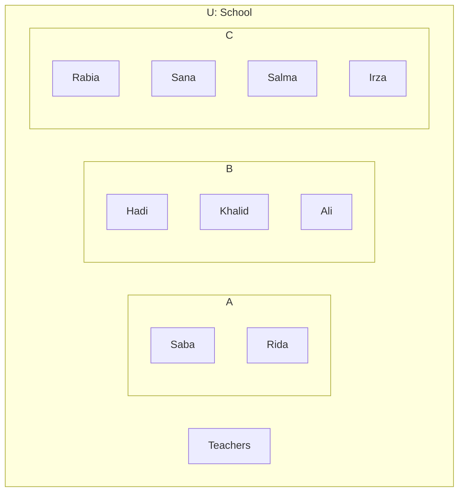
**Figure 5.1**

Grade-4 = {Saba, Rida}
Grade-5 = {Hadi, Khalid, Ali}
Grade-6 = {Rabia, Sana, Salma, Irza}


76 | Sub-Domain-5: SETS
NOT FOR SALE-PESRP

Domain: Numbers and Operations


> ### History
> John Venn was an English logician and mathematician. He introduced the venn diagram first time in 1880. To know more about him, visit the link: https://www.britannica.com/biography/John-venn

### 5.3.1 Representation of Sets Through Venn Diagram
It is very easy to understand relationship if we have something in visuals. Look at the following examples:

#### Example 5
If $U = \{1, 2, 3, 4, 5, ..., 12\}$ and $A = \{1, 4, 9\}$ then draw a venn diagram to represent the sets $U$ and $A$. Also, write the cardinal number of each set.

#### Solution
A rectangle represents the Universal set $U$. Inside it, a circle represents set $A$.
*   Elements inside circle $A$: 1, 4, 9
*   Elements outside circle $A$ but inside rectangle $U$: 2, 3, 5, 7, 8, 6, 10, 11, 12

Now, the cardinal numbers.
$n(U) = 12$ and $n(A) = 3$

> #### Practice -4
> If $U = \text{all colours of rainbow}$ and $X = \{\text{red, green, blue}\}$ then represent these sets using Venn diagram.

### 5.3.2 Representation of Subsets Using Venn Diagram

#### Example 6
If $A = \{1, 2, 3, 4, 5, 6, 7, 8\}$ and $B = \{4, 5, 6\}$ then represent these sets using Venn diagram.

#### Solution
As, $B \subseteq A$ then we can draw the Venn diagram as shown.
A large circle represents set $A$. Inside it, a smaller circle represents set $B$.
*   Elements inside circle $B$: 4, 5, 6
*   Elements inside circle $A$ but outside circle $B$: 1, 2, 3, 7, 8

#### Example 7
If $A = \{p, q\}$ then list of all proper subsets, improper subsets and draw Venn diagrams of these sets.

#### Solution
Look at the below figures.
1.  **(i)** A large circle $A$ containing $p$ and $q$, with an empty small circle inside representing the empty set $\phi$.
2.  **(ii)** A large circle $A$ containing $q$, with a small circle inside containing $p$ representing the subset $\{p\}$.
3.  **(iii)** A large circle $A$ containing $p$, with a small circle inside containing $q$ representing the subset $\{q\}$.
4.  **(iv)** A large circle $A$ with a small circle inside containing both $p$ and $q$ representing the improper subset $\{p, q\}$.

Since, $A = \{p, q\}$
**Proper subsets:** $\phi, \{p\}, \{q\}$ and **Improper subset:** $\{p, q\}$

> #### Practice -5
> Write all the subsets of $X = \{1, 2, 3\}$ and represent them using Venn diagram.

> ### Teaching Point
> Make three sets of hobbies. e.g. sports, reading and computer games.
> *   Set A for people who like sports.
> *   Set B for people who like reading.
> *   Set C for people who like computer games.
> Write the names of students in each set and construct Venn diagram.


Sub-Domain-5: SETS | 77
NOT FOR SALE-PESRP

Domain: Numbers and Operations


> **Go Online** Use the below link to practice online for venn diagram puzzles.
> https://www.univie.ac.at/future.media/moe/tests/mengen/duv.html

# Exercise - 5.3

1. The Venn diagram shows the elements in sets U and A then list all the elements of set U and A respectively.
   
   A Venn diagram shows a universal set U containing a subset A.
   - Inside circle A: hen, cat, dog
   - Outside circle A but inside rectangle U: goat

2. It is given that $U = \{a, c, d, e, f, i, g, o, h, u\}$, $X = \{a, e, i, o, u\}$ and $Y = \{c, d\}$. Draw a Venn diagram to show the above information.

3. It is given that $U = \text{Set of natural numbers less than 15}$, $A = \text{Set of natural numbers between 6 and 11}$ and $B = \text{Set of even prime numbers}$. Draw a Venn diagram to show the above information.

4. Read the Venn diagram and list the elements of each set.

   (i) A Venn diagram with two overlapping circles A and B.
   - Elements in B only: 4
   - Elements in intersection of A and B: 1, 3, 5
   - Elements in A only: 2, 6

   (ii) A Venn diagram with a rectangle U containing two disjoint circles A and B.
   - Elements in A: 13, 7
   - Elements in B: 2
   - Elements in U (outside A and B): 5, 6, 8, 10

   (iii) A Venn diagram with a rectangle containing circle X, which contains circle Y.
   - Elements in Y: (empty)
   - Elements in X (outside Y): 1, 3, 5, 7, 9

5. It is given that $A = \{\text{Nadeem, Neelam, Noureen, Nimra}\}$ and $B = \{\text{Neelam, Noureen}\}$ then draw a Venn diagram to represent the sets A and B.

### Project - 3
List all the name of your family members in a set. Then write all the subsets of that set. Finally draw a Venn diagram of each subset.
Note: Write maximum 4 names of your family members.

# Review Exercise 5

1. Each of the following question is followed by four suggested options. In each case select the correct option.

   (i) A set is always denoted by:
   - a. Capital letters of English alphabet
   - b. Roman Numerals
   - c. Small letters of English alphabet
   - d. Arabic numerals

   (ii) Statement form of set is also known as:
   - a. Tabular form
   - b. Descriptive form
   - c. Roster form
   - d. Set Builder form

   (iii) Roster form of sets is also known as:
   - a. Tabular
   - b. Descriptive
   - c. Set-builder
   - d. statement

   (iv) Symbols used to represent empty / void / null set are:
   - a. $=$ or $\cong$
   - b. $\subset$ or $\subseteq$
   - c. $\{\}$ or $\phi$
   - d. $\in$ or $\notin$


78 | Sub-Domain-5: SETS
NOT FOR SALE-PESRP

Domain: Numbers and Operations


(v) Any set containing only one element is called:
a. Even set
b. Singleton set
c. Positive set
d. Odd set

(vi) To find the total number of subsets of any given set we use:
a. $2n$
b. $n_2$
c. $n^2$
d. $2^n$

(vii) A set containing no element is known as:
a. Universal set
b. Singleton set
c. Empty set
d. Subset

(viii) The cardinal numbers of set A = {Pakistan, China, Bangladesh}:
a. 1
b. 3
c. 2
d. 4

(ix) If A = Set of letters in the word Islamabad then:
a. $x \in A$
b. $m \in A$
c. $c \in A$
d. $f \in A$

(x) The universal set in the Venn diagram is represented by the shape:
a. [Diamond shape]
b. [Rectangle shape]
c. [Circle shape]
d. [Triangle shape]

2. Define:
* Finite set
* Infinite set
* Universal set

3. Write the following sets in another form of sets:
(i) A = Set of your five friends
(ii) B = {0, -1, -2, -3, ...}
(iii) Set of school diaries in your bag

4. Write all the subsets of A = {1, 2, 8}.

5. Observe the Venn diagram and list all the elements of each set.

[The image shows a Venn diagram within a rectangular universal set U.
Set A contains elements: 1, 7, 3, 5, 2.
Set B contains elements: 4, 6, 9, 8, 2.
The intersection of A and B contains: 2.
Elements outside A and B but inside U are: 0, 10, 11, 12.]

6. If U = Set of integer between 1 and 30, A = {3, 6, 9, 12, 15, 18, 21, 27} and B = Set of all factors of 30 then draw a Venn diagram to illustrate the given information.

### Summary
* A set is a collection of well defined and distinct objects.
* A set having a fixed number of countable elements is known as finite set.
* A set having unlimited number of uncountable elements is known as infinite set.
* A set which does not contain any element is known as empty / void / null set.
* A set containing only one element is known as singleton set.
* An improper subset is a subset which contains all the elements of original set.
* A universal set is a collection of all elements or numbers of all related sets known as its subsets.
* A Venn diagram is used to show the relationships between a finite collection of sets pictorially.

> **Challenge**
> If A = {1, {2}} then write all subsets of A.


Sub-Domain-5: SETS | 79
NOT FOR SALE-PESRP

Domain: Algebra
Sub-Domain: 6
# ALGEBRAIC EXPRESSIONS


### Students' Learning Outcomes:
**By the end of this sub-domain, students will be able to:**

*   Recognize simple patterns from various number sequences.
*   Use letters to represent numbers, express basic arithmetical processes algebraically.
*   Evaluate algebraic expressions, add and subtract linear expressions.
*   Simplify linear expressions.

> If 'S' stands for samosas, 'F' stands for fries, and there are 8S + 10F in a packet. How many elements would there be if 2 samosas are taken out and 3 fries are added into the packet?
>
> The total bill of 8S and 10F is Rs. 350

## 6.1 RECOGNITION OF SIMPLE PATTERNS FROM VARIOUS SEQUENCES
We know that "A pattern is some phenomenon that repeats regularly based on a set rule or condition." In our previous classes we have learnt about different patterns.

### 6.1.1 Number Pattern/Sequence
Consider the following whole numbers.
0, 3, 6, 9, 12, 15, ...

The following number line illustrates the sequence:
*   From 0 to 3: +3
*   From 3 to 6: +3
*   From 6 to 9: +3
*   From 9 to 12: +3
*   From 12 to 15: +3

<table>
    <tr>
        <th>0</th>
        <th></th>
        <th></th>
        <th>3</th>
        <th>4</th>
        <th>5</th>
        <th>6</th>
        <th>7</th>
        <th>8</th>
        <th>9</th>
        <th>10</th>
        <th>11</th>
        <th>12</th>
        <th>13</th>
        <th>14</th>
        <th>15</th>
    </tr>
</table>Here, we get the numbers in the pattern/sequence by adding 3.
To solve the problems related to number patterns, we first need to find the rule followed in the given pattern/sequence, see the difference in the consecutive numbers in the given sequence. It will help you to understand the relationship between the numbers.

### Teaching Point
Encourage students to ask questions at any stage during learning process. Students questioning serve a wide variety of purposes. e.g.
*   to assess their understanding.
*   to keep learners engage during an explanation.
*   to develop their thinking or focus their attention on topic.


80 | Sub-Domain-6: ALGEBRAIC EXPRESSIONS
NOT FOR SALE-PESRP

Domain Algebra


**Example 1** For each of the following number pattern state a rule and find the next two terms:

(i) 17, 22, 27, ...
(ii) 56, 53, 50, ...
(iii) 729, 243, 81, ...
(iv) 4, 8, 16, ...

> **Remember**
> Each number in the given number sequence is called term.

### Solution

**(i) 17, 22, 27, ...**
**Rule:** Add 5 in the each term to get the next term in the sequence/pattern. So, the next two terms will be 32 and 37.

**(ii) 56, 53, 50, ...**
**Rule:** Subtract 3 from each term to get the next term in the sequence. So, the next two terms will be 47 and 44.

**(iii) 729, 243, 81, ...**
**Rule:** Divide each term by 3 to get the next term in the sequence. So, the next two terms will be 27 and 9.

**(iv) 4, 8, 16, ...**
**Rule:** Multiply each term by 2 to get the next term in the sequence. So, the next two terms will be 32 and 64.

> **Practice - 2** For each of the following sequences, state the rule to find the next two terms.
> i. 4, 14, 42, ...
> ii. -7, -14, -21, ...

> **Challenge** Which number pattern is used in sunflower?

**Go Online** Visit the link and play the sequence game online.
http://www.mathframe.co.uk/en/resources/resource/42/sequences

## Exercise - 6.1

1. For each of the following sequence state a rule and find the next two terms:
   (i) 9, 13, 17, ...
   (ii) 277, 287, 297, ...
   (iii) 14, 21, 28, 35, ...
   (iv) -84, -82, -80, ...

2. Write the next three terms in the sequence:
   (i) 1, 4, 9, ...
   (ii) 89, 87, 85, ...
   (iii) 12, 16, 20, ...
   (iv) 1, 1, 2, 3, 5, 8, ...

> **Project - 1** Make a poster of polygons in sequence according to the number of sides.

> **Teaching Point** Ask students to arrange in an increasing or decreasing order to give practice on sequences. You can use snacks or cereal to make a sequence of any pattern.


Sub-Domain-6: ALGEBRAIC EXPRESSIONS | 81
NOT FOR SALE-PESRP

Domain Algebra


# 6.2 USE OF LETTERS TO REPRESENT NUMBERS

We are very familiar about the natural numbers 1, 2, 3, ... and the use of basic four operations (addition, subtraction, multiplication and division) in arithmetic. In algebra, letters replace the numbers.

> ### History
> A muslim Arab Mathematician Al-khawrzmi (780 – 850 AD) is founder of modern algebra. He was one of the first to study algebraic expression. The word algebra is derived from the word Al-Jabr. He wrote a book named Al-Jaber-Wa-Al-Muqabala in 820 AD. He is known as the father of algebra.
> To know more about him, visit the link: http://www.famousscientists.org/muhammad-ibn-musa-al-khwarizmi

**In Arithmetic:** Numerals such as 1, 2, 3, ... etc are used, with each numeral having a fixed value.
* **(i)** $5 + 3 = 8$ means that the sum of 5 and 3 is equal to 8.
* **(ii)** $13 - 5 = 8$ means that the difference of 13 and 5 is 8.

**In Algebra:** A letter can symbolize any numeral, or any value assigned to it for example.
* **(i)** $a + b = c$ means that the sum of two numbers are represented by $a$ and $b$ is equal to $c$.
* **(ii)** $c - a = b$ means that the difference of two numbers are represented by $c$ minus $a$ equal to $b$.
If $a = 5$ and $b = 3$ then $c = 8$. If $a = 5$ and $c = 12$ then $b = 7$ i.e. $c - a = b$
$12 - 5 = 7$

## 6.2.1 Explanation for Variable and Constant

### (i) Variable
We know that in algebra, both numerals and letters of alphabet $a, b, c, ..., z$ are used. These letters of alphabet do not have any fix value.
So, *"A variable is a symbol or letter of alphabet that represents a quantity the value of which is not known"*.

### (ii) Constant
A constant is a quantity whose value remains unchanged (fixed).

**Example 2** Identify variable and constants in the following:
**(i)** $n + 8 = 7$
**(ii)** $n + m + 4$
**(iii)** $\ell - 14 = 34$

**Solution**
<table>
  <thead>
    <tr>
        <th></th>
        <th>Expression</th>
        <th>Variable</th>
        <th>Constants</th>
    </tr>
  </thead>
  <tbody>
    <tr>
        <td>(i)</td>
        <td>n + 8 = 7</td>
        <td>n</td>
        <td>7, 8</td>
    </tr>
    <tr>
        <td>(ii)</td>
        <td>m + n + 4</td>
        <td>m, n</td>
        <td>4</td>
    </tr>
    <tr>
        <td>(iii)</td>
        <td>ℓ - 4 = 34</td>
        <td>ℓ</td>
        <td>-4, 34</td>
    </tr>
  </tbody>
</table>


82 | Sub-Domain-6: ALGEBRAIC EXPRESSIONS
NOT FOR SALE-PESRP

Domain: Algebra


> **Did You Know?**
> The number 9 is a mysterious number. It can be found in every ones birth date either it contains 9 or not. As, I was born on 22-04-2001. The number 9 is hidden in this date. To find it, let's rewrite birth date as 22042001.
> * Now, rearrange the digits any order such as 20010422.
> * Subtract smaller number from greater e.g.
>   $$22042001$$
>   $$-20010422$$
>   $$\overline{2031579}$$
> * Add the digits of your result. $2 + 0 + 3 + 1 + 5 + 7 + 9 = 27$
> * Add $2 + 7 = 9$, similarly, find the number 9 in your birth date.

# Exercise - 6.2

1. Write the following sentences symbolically:
(i) The sum of numbers $n$ and 6 is 20.
(ii) The difference of numbers $n$ and 27 is 5.
(iii) Four times a number $n$ is less than 7.
(iv) Two times a number $n$ is more than 25.

2. Which of the following statements are true and which are false?
(i) Sum of five and eight is twenty.
(ii) Product of three and ten is thirty.
(iii) $9 + 19 = 28$.
(iv) $6 + (8 - 2) = 0$.
(v) $\frac{7}{8} + 3 > 16$.

3. Write the values of unknown which satisfy the following statements:
(i) $\Box + 18 = 36$
(ii) $3 : 5 :: \Box : 10$
(iii) $20\% \text{ of } 2000 = \Box$
(iv) $\frac{2}{5} + \Box = \frac{1}{10}$
(v) $\frac{7}{11} + \frac{1}{22} = \Box$

4. Identify the constants and variables.
(i) $n + 9 = 0$
(ii) $7p + 2 = 9$
(iii) $\frac{1}{3}xy$
(iv) $7i + 4 = 9$
(v) $m + n + 8$
(vi) $9x + y - 37$

**Project - 2**
Create atleast 5 algebraic sentences and separate variables and constants from your sentences.

## 6.3 ALGEBRAIC EXPRESSIONS
An algebraic expression is an expression built up by the combination of constants, and variable by the basic algebraic operations ($+, -, \times, \div$) for example $x + y$ and $4x + 5y + 5$ are algebraic expressions.

**Example 3** Write the following statements in an algebraic expression:
(i) The sum of an integer and 17
(ii) The difference of 15 and double of a number $n$.
(iii) Product of $a$ and $\frac{1}{2b}$
(iv) Divide $p$ by $4q$

**Solution**
(i) Let the integer be '$n$'
So, $n + 17$
(ii) Let the required number be '$n$'
So, $15 - 2n$
(iii) $a \times \frac{1}{2b}$
(iv) $p \div 4q$


Sub-Domain-6: ALGEBRAIC EXPRESSIONS | 83
NOT FOR SALE-PESRP

Domain Algebra


**Example 4** Alishah is $x$ years old. Write an algebraic expression for the following.

(i) Alishah's age before six years.
(ii) Six times Alishah's age after five years.
(iii) Half of Alishah's age six years ago.
(iv) The present age of Alishah's younger sister if her age was 5 years less than the half of Alishah's age three years ago.

**Solution**
(i) Alishah's present age $= x$ years
Alishah's age before six years $= x - 6$
(ii) $6(x + 5)$
(iii) $\frac{1}{2}(x - 6)$
(iv) Alishah's younger sister's age $= \frac{1}{2}(x - 3) - 5$

### 6.3.1 Terms of Algebraic Expression

Different parts of an algebraic expression are connected with each other by an addition (+) or subtraction (—) signs. Each separated part of the expression is known as term.

> **Remember**
> Operation of multiplication ($\times$) and division ($\div$) never connect the terms of algebraic expressions.

For example, $m + 3n + 6$ is an algebraic expression, here $m$, $3n$ and $6$ are the first, second and third terms respectively.

**Example 5** Separate each term of the following algebraic expressions.

(i) $a + b$
(ii) $3a + 5b + 9$
(iii) $8x + 4yz - 3$
(iv) $\frac{x}{y} + 4t + 1$

**Solution**

<table>
  <thead>
    <tr>
        <th></th>
        <th>Algebraic expression</th>
        <th>Terms of algebraic expression</th>
        <th>Number of terms</th>
    </tr>
  </thead>
  <tbody>
    <tr>
        <td>(i)</td>
        <td>a + b</td>
        <td>a, b</td>
        <td>2</td>
    </tr>
    <tr>
        <td>(ii)</td>
        <td>3a + 5b + 9</td>
        <td>3a, 5b, 9</td>
        <td>3</td>
    </tr>
    <tr>
        <td>(iii)</td>
        <td>8x + 4yz - 3</td>
        <td>8x, 4yz, -3</td>
        <td>3</td>
    </tr>
    <tr>
        <td>(iv)</td>
        <td>x/y + 4t + 1</td>
        <td>x/y, 4t, 1</td>
        <td>3</td>
    </tr>
  </tbody>
</table>


84 | Sub-Domain-6: ALGEBRAIC EXPRESSIONS
NOT FOR SALE-PESRP

Domain: Algebra


> **Note**
> * If any term of an algebraic expression consists of a numeral only, it is known as constant term i.e $9, -3$ and $1$ in example 5 (ii, iii, iv).
> * If any term of an algebraic expression contains variables only, it is known as variable term i.e $a, b$ in example 8 (i).

## 6.3.2 Explain the Terms, Coefficients and Constants in an Algebraic Expression

### Coefficients
In algebraic expression we always use a number or symbol to multiply with variable, that number or symbol is called multiplying factor of variable.

*"The multiplying factor of any variable in an algebraic expression is known as coefficient".*

Look at the below diagram.

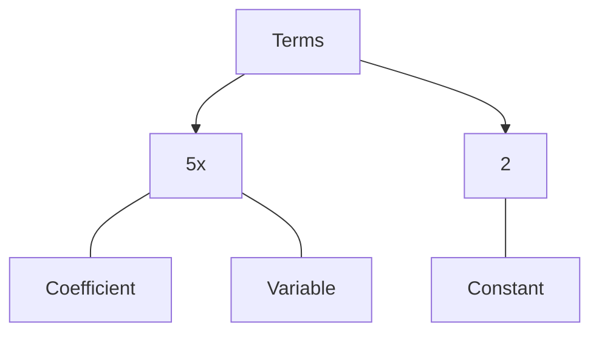
*(Note: In the diagram, '5' is the Coefficient, 'x' is the Variable, and '2' is the Constant)*

> **Remember**
> Any variable with no number have a coefficient i.e $x$ is realy $1x$.

### Example 6
Write the coefficients of each term of the expressions.
(i) $3a + 4b + c$
(ii) $4x + y - 3z$

> **Note**
> Sometimes in an algebraic expression alphabet letters represent coefficients. i.e. In expression $ax + bx + cx$, $x$ is variable and '$a$', '$b$' and '$c$' are coefficients.

**Solution**

<table>
  <thead>
    <tr>
        <th></th>
        <th>Algebraic expression</th>
        <th>Terms of algebraic expression</th>
        <th>Coefficients</th>
    </tr>
  </thead>
  <tbody>
    <tr>
        <td>(i)</td>
        <td>3a + 4b + c</td>
        <td>3a, 4b, c</td>
        <td>3, 4 and 1</td>
    </tr>
    <tr>
        <td>(ii)</td>
        <td>4x + y - 3z</td>
        <td>4x, y, -3z</td>
        <td>4, 1 and -3</td>
    </tr>
  </tbody>
</table>

### Constant terms
Look at the following cases.

**Case - I: Consider the algebraic expression**
$5a + 2b + 4$. If $a = 5$ and $b = 3$ then $5a + 2b + 4 = 5(5) + 2(3) + 4$
$= 25 + 6 + 4$

**Case - II: If $a = 2$ and $b = 4$ then**
$5a + 2b + 4 = 5(2) + 2(4) + 4$
$= 10 + 8 + 4$

In both cases we can observe that the third term does not change because 4 is constant. Similarly, in expressions $4x + 5$ and $2p + 4q + 1$, the numbers 5 and 1 are constants. Similarly, in expressions $3x + 2$ and $4p + 5q + 1$, the numbers 2 and 1 being independent of variable are constants.

Thus,
*"In an algebraic expression number appearing independent of a variable is called a constant term".*


Sub-Domain-6: ALGEBRAIC EXPRESSIONS | 85
NOT FOR SALE-PESRP

Domain: Algebra


**Example 7** Identify the variable, constant and coefficients of each term in the following algebraic expressions.
(i) $8x + 9y + 6$
(ii) $3a + 4b - 2$
(iii) $4xy - 3$

**Solution**
<table>
  <tbody>
    <tr>
        <td>(i) 8x + 9y + 6</td>
        <td>(ii) 3a + 4b - 2</td>
        <td>(iii) 4xy - 3</td>
    </tr>
    <tr>
        <td>Variables: x, y</td>
        <td>Variables: a, b</td>
        <td>Variables: xy</td>
    </tr>
    <tr>
        <td>Constant: 6</td>
        <td>Constant: -2</td>
        <td>Constant: -3</td>
    </tr>
    <tr>
        <td>Coefficients: 8, 9</td>
        <td>Coefficients: 3, 4</td>
        <td>Coefficient: 4</td>
    </tr>
  </tbody>
</table>

### 6.3.3 Like and Unlike Terms

**Thinking Time**
Can you write $2^9$ as 29? Explain.

#### Like terms
Look at the following:
Aleezey takes away an order of three packets of samosas from a samosa's shop.

[The image shows three boxes of samosas: the first box contains 2 samosas, the second box contains 4 samosas, and the third box contains 5 samosas.]

2 samosas + 4 samosas + 5 samosas = 11 samosas

**Remember**
In an algebraic expression the addition and subtraction can only be performed with like terms.

As, all three packets contain samosas, if she put all packets of samosas in large packet then the large packet will contain 11 samosas.

**In algebra Aleezey can write it as:** $2s + 4s + 5s = 11s$

**Note**
In the above expression, the power of variable in each term is 1. Each term is different by their variable.

So, "*The terms having the same variables with same indexes are known as like terms.*" The like terms can be combined to give a single term.

#### Unlike terms
Shahbaz takes away an order of the following terms from a restaurant.

[The image shows three boxes: the first box contains 5 samosas, the second box contains 5 packets of fries, and the third box contains 4 drinks.]

5 Samosas and 5 packet of Fries and 4 drinks

As all three packets contain different items. If he put all three packets of different items in a large packet then the large packet will contain 5 samosas, 5 packet of fries and 4 drinks.

**In algebra Shahbaz can write it as:** $5s + 5f + 4d = 5s + 5f + 4d$

So, "*The terms having the different variables are known as unlike terms.*"
Unlike terms can never combine to give the single term.


86 | Sub-Domain-6: ALGEBRAIC EXPRESSIONS
NOT FOR SALE-PESRP

Domain: Algebra


> **Remember**
> In an algebraic expression the unlike terms cannot perform addition or subtraction.

> **Go Online**
> Visit the below link and play online games to identify algebraic terms.
> http://www.mathgames.com/skill/6.6-identify-terms-coefficients-and-monomials

# Exercise - 6.3

1. Write the following statements in algebraic expressions:
   (i) The sum of $3a$ and $8$
   (ii) Difference of $5p$ and $5$
   (iii) Divide $5a$ by $8b$
   (iv) Product of a number $n$ and four times a variable $y$.
   (v) Cost of $n$ litres of cooking oil at Rs. 170 per litre.

2. Waseem is two times as old as Umar and Umar is three years older than Amir. If Umar is $n$ years old then write an algebraic expression of:
   (i) Waseem's age
   (ii) Umar's age
   (iii) Amir's age

3. Write the algebraic terms of the following expressions:
   (i) $n + 3$
   (ii) $2n + 6m$
   (iii) $\ell \times m \times n$
   (iv) $4xy + 6y - 5$
   (v) $ab + 2$

4. Write the coefficients of each term in the following algebraic expressions:
   (i) $4a + 3b$
   (ii) $23ab$
   (iii) $\frac{2}{5}xyz$
   (iv) $pqr + 85$
   (v) $15p + 81q + 9$

5. Separate the constants, variables and coefficients of each term in the following algebraic expressions:
   (i) $8a + 1$
   (ii) $3a + 2b - 4$
   (iii) $pq$
   (iv) $ax + by + c$
   (v) $3a + 4b + c$

6. Separate like terms in the following:
   $3a, 21m, 5a, 8p, 4m, 2s, 3p, 8\ell, 9a, 76a, 17bc, 9cb$.

7. Write the algebraic expressions by adding the following terms:
   (i) $x, y$
   (ii) $a, 2a, 3a$
   (iii) $x, -y, 3x$
   (iv) $p, pq, q, r$
   (v) $12a^2, 3b^2$
   (vi) $\frac{1}{y}, \frac{2}{x}, \frac{3}{2}$
   (vii) $2xy, yz, 4zx$
   (viii) $4x, 5x, 6x^2$

8. There are 25 girls and 27 boys in grade 6 in a school, and 30 boys and 23 girls in grade 7 in the same school. Write an algebraic expression to find the sum of girls and boys in both the grades.

9. Arslan is working at a burger shop. On Monday, he sold 40 burgers, 25 fries and 60 cold drinks. On Tuesday, he sold 35 burgers, 28 fries and 54 cold drinks. Write an algebraic expression and find how many burgers, fries and cold drinks did he sell in both the days?

### Teaching Point
Take a simple example like $2x + 2y - 9$ to explain the coefficients, variables and constants. Begin by asking students to identify the terms in the expression and then use the expression to draw attention to coefficient, variables and constants.


Sub-Domain-6: ALGEBRAIC EXPRESSIONS | 87
NOT FOR SALE-PESRP

Domain Algebra


> **Project - 3**
> Visit your nearest market. Choose any two or three food items and form at least two expressions, using the concept of like and unlike terms.

## 6.4 ADDITION AND SUBTRACTION OF GIVEN ALGEBRAIC EXPRESSIONS

### Addition
In the given algebraic expressions only like terms can be added to give a single term.
Look at the following examples for the procedure of addition.

#### Example 8
Add $4xy$, $3xy$ and $21xy$.

**Solution**

<table>
  <thead>
    <tr>
        <th>Vertical method of addition</th>
        <th>Horizontal method of addition</th>
    </tr>
  </thead>
  <tbody>
    <tr>
        <td rowspan="3">4xy<br/>3xy<br/>+ 21xy<br/>——<br/>28xy</td>
        <td>4xy + 3xy + 21xy</td>
    </tr>
    <tr>
        <td>= (4 + 3 + 21)xy</td>
    </tr>
    <tr>
        <td>= 28xy</td>
    </tr>
  </tbody>
</table>

> **Remember**
> * While adding vertically, like terms are arranged in same columns and then added.
> * While adding horizontally like terms are arranged together and added.

#### Example 9
Find the sum of following algebraic expressions using vertical method of addition.
$(8a + 4b - 2)$, $(8a + 7b - 4)$ and $(23a + 3b - 7)$

**Solution**
Vertical method of addition.
$$
\begin{array}{r}
8a + 4b - 2 \\
8a + 7b - 4 \\
+ 23a + 3b - 7 \\
\hline
39a + 14b - 13
\end{array}
$$

> **Practice - 2**
> (i) Add $3x + 2y$ and $4x - 7y$.
> (ii) Find the sum of $3a + 2b - 5c$ and $4a - b + 3c$

#### Example 10
Find the sum of the following algebraic expressions using horizontal method of addition.
$(ab + 3pq + 5rs)$, $(-4ab - 6pq + 7rs)$ and $(4ab + 2pq)$

**Solution**
Horizontal method of addition
$(ab + 3pq + 5rs)$, $(-4ab - 6pq + 7rs)$ and $(4ab + 2pq)$
$(ab + 3pq + 5rs) + (-4ab - 6pq + 7rs) + (4ab + 2pq)$

Arrange the terms having same variables.
$= ab - 4ab + 4ab + 3pq - 6pq + 2pq + 5rs + 7rs$
$= (1 - 4 + 4) ab + (3 - 6 + 2) pq + (5 + 7) rs$
$= ab - pq + 12rs$


88 | Sub-Domain-6: ALGEBRAIC EXPRESSIONS
NOT FOR SALE-PESRP

Domain Algebra


### Subtraction
As we know that subtraction is the reverse process of addition. In the given algebraic expressions the subtraction can be performed by changing the sign of each term of the expression to be subtracted and use the same procedure which we did in addition of algebraic expression. Now look at the following examples.

#### Example 11
Subtract: $17a$ from $30a$.

**Solution**
<table>
  <thead>
    <tr>
        <th>Vertical method of subtraction</th>
        <th>Horizontal method of subtraction</th>
    </tr>
  </thead>
  <tbody>
    <tr>
        <td>$30 a$</td>
        <td>$(30 a) - (+ 17 a)$</td>
    </tr>
    <tr>
        <td>$\pm 17 a$</td>
        <td>$= 30 a - 17 a$</td>
    </tr>
    <tr>
        <td>---</td>
        <td>$= (30 - 17) a$</td>
    </tr>
    <tr>
        <td>$13 a$</td>
        <td>$= 13 a$</td>
    </tr>
  </tbody>
</table>

#### Example 12
Find the difference of $6a - 5b + c$ and $2a + 2b - 8c$ using vertical method of subtraction.

**Solution**
Vertical method of subtraction.
$$
\begin{aligned}
& 6a - 5b + c \\
\pm & 2a \pm 2b \mp 8c \quad \text{(by changing the signs)} \\
\hline
& 4a - 7b + 9c
\end{aligned}
$$

> **Remember**
> * Always add the terms having same signs.
> * Always subtract the terms having different signs.

#### Example 13
Subtract $4xy - 3yz + 4xz$ from $30xy + 5yz - 8xz$ using horizontal method of subtraction.

**Solution**
Horizontal method of subtraction
$(30xy + 5yz - 8xz) - (4xy - 3yz + 4xz)$
$= 30xy + 5yz - 8xz - 4xy + 3yz - 4xz$

Arrange the terms having same variables $= 30xy - 4xy + 5yz + 3yz - 8xz - 4xz$
$= (30 - 4)xy + (5 + 3)yz - (8 + 4)xz$
$= 26xy + 8yz - 12xz$

> **Practice -3**
> (i) $5a - 3b$ from $8b - 4c$.
> (ii) $17x + 4y$ from $-37x - 13y$.

### Exercise - 6.4

**1. Add the following terms:**
(i) $x, x, x, x, x$
(ii) $3p, 4q, 8p, 9q$
(iii) $4a, 5a, 6a$
(iv) $4xy, 23xy, 3xy$
(v) $98pq, 2qr, 23rs$
(vi) $xy, 14yx, 3pq, 3pq, 54$
(vii) $8x, 2y, 5x, 6y, 3z, 9z, 2y$

**2. Sum of the following expressions:**
(i) $3p + 4q, 8p - 3q$
(ii) $\frac{5}{7}a + \frac{2}{3}b, \frac{1}{7}a - \frac{1}{3}b$
(iii) $5xy + 9yz, xz - 2yz, 9xy + 4yz$
(iv) $31x + 3y - 4z, 6x + 7y - 5z, x + y + z$
(v) $9p + 8q + 1, 6q - 3r + 2, 4p + 2r + 7$
(vi) $6p, 2q, 3q + 9r, 4r, -6p$


Sub-Domain-6: ALGEBRAIC EXPRESSIONS | 89
NOT FOR SALE-PESRP

Domain Algebra


3. Subtract:
(i) $3a + 2b$ from $15a + 25b$
(ii) $35xy + 3z$ from $48xy - 4z$
(iii) $16x + 2y - 3z$ from $25x - 3y + z$
(iv) $\frac{1}{3}l + \frac{3}{5}m - 8$ from $-\frac{1}{3}l + \frac{1}{5}m + 6$
(v) $27l + 3m - 4n$ from $-22l + 14m + 4n$

4. Solve:
(i) $(4x + 4y) + (5y - 4z) - (5x + 4y + 8z)$
(ii) $(7xy + 3yz) + (8xy - 6yz) - (9xy + 3yz + 2)$
(iii) $(4m + 5m - 2) - (3m + 2n)$
(iv) $(13p + 2q) - (6q - 2r) + 5r$

5. Kinza, Mahak and Rabia have $p$, $2q$ and $3r$ books respectively. How many books they have altogether?

6. Find perimeter of rectangle?
The image shows a rectangle with width $x+4$ and length $3x+4y+4z$.

7. If the perimeter of a triangle is $5x + 6y + 8z$ and the lengths of its two sides are $x + y + z$ and $x - 2y + 3z$ respectively. Find the length of third side of triangle.

> **Project - 4** | Make a booklet for the rules of addition and subtraction of algebraic expression.

## 6.5 SIMPLIFICATION OF ALGEBRAIC EXPRESSIONS GROUPED WITH BRACKETS

In an algebraic expression, when more than one operations are performed with several terms. Before evaluation of it we need to simplify. To simplify an algebraic expression we will use the same rule which we used in arithmetic expressions. We are familiar that brackets are used to indicate the order for performing the operations. We have learnt four kinds of brackets in unit - 5. These are the four basic grouping symbols or brackets. The operation involving these symbols are performed in the order shown below.

*   $\overline{\quad}$ Vinculum (1<sup>st</sup>)
*   $($ $)$ Parentheses or curved brackets or round brackets. (2<sup>nd</sup>)
*   $\{$ $\}$ Braces or curly brackets. (3<sup>rd</sup>)
*   $[$ $]$ Square brackets. (4<sup>th</sup>)

We will use the following algebraic expressions by grouping like terms:

**Example 14** Simplify the following algebraic expressions by grouping like terms:
$2a + 4b + 5a - 8b - 3a + 8c + 9$

**Solution**
$2a + 4b + 5a - 8b - 3a + 8c + 9$
$= 2a + 5a - 3a + 4b - 8b + 8c + 9$ (combine the like terms)
$= (2 + 5 - 3)a + (4 - 8)b + 8c + 9$
$= 4a - 4b + 8c + 9$


90 | Sub-Domain-6: ALGEBRAIC EXPRESSIONS
NOT FOR SALE-PESRP

Domain Algebra


**Example 15** Simplify the following algebraic expressions:
(i) $5x + 3(8x + 4y)$
(ii) $3a + [3b - \{5c + (2b + 4c)\}]$

**Solution**

<table>
  <tbody>
    <tr>
        <td>(i) 5x + 3(8x + 4y)</td>
        <td>(ii) 3a + [3b - {5c + (2b + 4c)}]</td>
    </tr>
    <tr>
        <td>= 5x + 24x + 12y</td>
        <td>= 3a + [3b - {5c + 2b + 4c}]</td>
    </tr>
    <tr>
        <td>= 29x + 12y</td>
        <td>= 3a + [3b - {2b + 9c}]</td>
    </tr>
    <tr>
        <td></td>
        <td>= 3a + [3b - 2b - 9c]</td>
    </tr>
    <tr>
        <td></td>
        <td>= 3a + [b - 9c]</td>
    </tr>
    <tr>
        <td></td>
        <td>= 3a + b - 9c</td>
    </tr>
  </tbody>
</table>

> **Note**
> The sign before the brackets is very important if it is plus (+) then remove the brackets without changing the signs of the each term inside the brackets. If it is minus (-) then change the signs of each term inside the bracket, while removing it.

### 6.5.1 Evaluation and Simplification of an Algebraic Expression
"The process of finding the value of an algebraic expression by substituting the numeric value in place of variable in each term of the expression, is known as evaluation".
Look the following examples. To evaluate an algebraic expression.

**Example 16** If $a = 2, b = 4, c = 3$, and $d = 5$ then evaluate the following expressions.
(i) $a + bc + 3d$
(ii) $4a + 2bc + d - ab$
(iii) $2ab + 3cd - (5ba - 4cd)$

**Solution**

<table>
  <tbody>
    <tr>
        <td>(i) a + bc + 3d</td>
        <td>(ii) 4a + 2bc + d - ab</td>
    </tr>
    <tr>
        <td>Substitute the values = (2) + (4)(3) + 3(5)</td>
        <td>Substitute the values = 4(2) + 2(4)(3) + (5) - (2)(4)</td>
    </tr>
    <tr>
        <td>= 2 + 12 + 15 = 29</td>
        <td>= 8 + 24 + 5 - 8 = 29</td>
    </tr>
  </tbody>
</table>
<table>
  <tbody>
    <tr>
        <td>(iii) 2ab + 3cd - (5ab - 4cd)</td>
        <td colspan="2"></td>
    </tr>
    <tr>
        <td>Substitute the values = 2ab + 3cd - (5ab - 4cd)</td>
        <td>Now, Substitute the values = -3(2)(4) + 7(3)(5)</td>
        <td></td>
    </tr>
    <tr>
        <td>= 2ab - 5ab + 3cd + 4cd</td>
        <td>= -24 + 105</td>
        <td></td>
    </tr>
    <tr>
        <td>= -3ab + 7cd</td>
        <td>= 81</td>
        <td></td>
    </tr>
  </tbody>
</table>

### Exercise - 6.5

1. Simplify the following:
(i) $x + y + 3x + 2y + 4x$
(ii) $a + a - (3a \div 3)$
(iii) $3a + \frac{1}{3}b + 3\{a + (2b - a + 4b \times 3)\}$
(iv) $4x + \{5a + (2a + (3a - 9a \div 3)\}$
(v) $a + [b + \{a - (b + a - b)\}]$
(vi) $[\{(2x + 4y) + 2z\} - 3y] + 2x - 12y$

2. Waqas, Waqar and Saif are selling bags of sweets. Waqas is selling 8 bags of sweets, Waqar is selling 12 bags of sweet and Saif is selling 20 bags of sweets. However Waqar decided to eat three of his bags of sweets as he was hungry. Saif decided to give 2 bags of sweets to his brother. Create an algebraic expression that represents the total amount of bags of sweets that they were selling altogether. Then simplify the expression.


Sub-Domain-6: ALGEBRAIC EXPRESSIONS | 91
NOT FOR SALE-PESRP

Domain Algebra


3. Evaluate the following when $x = 2, y = -5$ and $z = 8$
(i) $4x + y - z$
(ii) $2xy + yz - zx$
(iii) $4x + \left( \frac{1}{2}y + \frac{1}{14}z \right)$
(iv) $y(3x - z + 2y) + 2$
(v) $\frac{x(2y + 3z)}{3zx}$
(vi) $\frac{x + y}{z} + \frac{y + z}{x}$

4. If $a = 5, b = 8$ and $c = 20$ then evaluate: $b^2 - 4ac$.

5. Express the following into the simplest form and then evaluate it when $x = 8, y = 10$
$3x - 2 + [y + x - \{4 - x + (5 + y)\}]$

# Review Exercise 6

1. Each of the questions below is followed by four suggested options. In each case choose the correct option.

(i) $28 + 6$ is:
a. a geometric figure
b. an algebraic expression
c. an arithmetic expression
d. three dimensional figure

(ii) $p + 2q$ is:
a. a geometric figure
b. an algebraic expression
c. an arithmetic expression
d. three dimensional figure

(iii) In algebra a value that can be changed is called:
a. constant
b. variable
c. literal
d. coefficient

(iv) In algebra a fixed value that can never be changed is called:
a. constant
b. variable
c. literal
d. coefficient

(v) In algebraic expression we can add or subtract only:
a. like terms
b. unlike terms
c. literal
d. constant terms

(vi) The only operations that connect the algebraic terms are:
a. $+$
b. $\times, \div$
c. $+, -, \times$
d. $\times$

(vii) To simplify the algebraic expression we use:
a. exponent rule
b. BODMAS rule
c. DMAS rule
d. chain rule

(viii) In expression $4x + 5, 4$ is:
a. exponent
b. variable
c. constant
d. coefficient

(ix) Each number in the pattern is called:
a. term
b. expression
c. equation
d. constant

(x) The next term in the sequence $1, 1, 2, 3, 5, 8, \dots$
a. 10
b. 12
c. 13
d. 15

2. Define the following in a short way:
(i) Variable
(ii) Constant
(iii) Coefficient
(iv) Pattern


92 | Sub-Domain-6: ALGEBRAIC EXPRESSIONS
NOT FOR SALE-PESRP

Domain Algebra


3. Find the sum of:
(i) $2x + 3y - 4z$ and $5x + 16x - 9y$
(ii) $13xy + 2yz$, $5yx - 2xz$ and $4xy + 3zx$

4. Subtract the second expression from the first:
(i) $3x + 1$, $x - y$
(ii) $5x - 3y - 2z$, $7x + y - 3$

5. Write the coefficients, variables and constants in each term of the following expression:
(i) $ap + bq + c$
(ii) $2.5x + \frac{1}{3}y + 14$
(iii) $13p + 2q + 5$

6. Solve:
(i) $(13p + 2q) + (12p - q) - (8p + 3q)$
(ii) $(2xy + 3yz + 4zx) - (6xy - 2yz - 5) + (8xy + 2yz - 35)$

7. Find the perimeter of square field if length of its each side is $3x - y + 2z$.

8. Simplify the following expressions:
(i) $(p + q) - (2r - 3s) + (p + 5s)$
(ii) $(x + y) - (5x + \overline{3x - 4})$
(iii) $6x - [3x + \{2x - 4(\overline{x - 2}) + y\}]$

9. If $x = 5$ and $y = 7$ then evaluate $6x - [2x + \{2x - 4(\overline{x - 2}) + y\}]$

10. Write the missing numbers in the sequence below.
$1, 4, 9, 16, 25, \_\_\_\_\_\_, \_\_\_\_\_\_, 64, 81$. Also, state the rule.

### Challenge
Use pattern of four straight lines to join all 9 dots given on the mobile screen. Do not lift your pen or pencil while performing task.

[The image shows a mobile phone screen with a 3x3 grid of white dots on a pink background.]

### Summary
* Algebra is a system of symbols and letters of alphabet to replace numbers and find the secret.
* A pattern is some phenomenon that repeats regularly based on a set rule or condition.
* Pattern can be ascending, descending or multiples of a certain numbers.
* Each term in the sequence/pattern is called term.
* A variable is a symbol or letter of alphabet that represents a quantity, the value of which is not known.
* A constant is a fixed value that can never be changed. i.e, all numerals are constants.
* Algebraic expression is an expression built up by the combination of integers and constants, variables are connected with the basic algebraic operational signs ($+, -, \times, \div$).
* Each separated part of an algebraic expression is known as term.
* The terms having the same variables and exponents are known as like terms.
* The terms having the different variables and exponents are known as unlike terms.
* The process of finding the values of an algebraic expression by substituting the numeric value in place of variable in each term of expression is known as evaluation.


Sub-Domain-6: ALGEBRAIC EXPRESSIONS | 93
NOT FOR SALE-PESRP

Domain: Algebra
Sub-Domain: 7
# LINEAR EQUATIONS


**Students' Learning Outcomes:**
**By the end of this sub-domain, students will be able to:**
* Recognize algebraic equations.
* Differentiate between linear algebraic equations and linear algebraic expressions in one variable.
* Solve linear equations and apply them in real life situations.

[A boy asks: "Can you find the value of $x$ from $3x + 7 = x + 13$?" A weighing scale is shown between two boys. On the left pan, there are three blocks labeled '$x$' and seven small spheres. On the right pan, there is one block labeled '$x$' and thirteen small spheres. The scale is balanced. Another boy responds: "Yes! we can find by balancing them."]

## INTRODUCTION
An equation means that two things are equal and it is always denoted by an equal (=) sign. It can be compared to the pans of common balance in an equilibrium. The two sides of an equation are same as the two pans of scale and the equality sign shows that the two pans are equal. Take a look on the picture given on the right side where in arithmetics:

$$3 + 1 = 6 - 2$$

[An illustration of a weighing scale shows "3+1" on the left pan and "6-2" on the right pan, perfectly balanced.]

The equation says what is on the left side $(3 + 1)$ is equal to what is on the right $(6 - 2)$. The above weighing balance is an excellent example of an equation that we can observe in our daily life, in which:
(i) The two pans of the balance can be considered as two sides of an equation.
(ii) Equal sign "=" indicates that the two pans are in balance.
(iii) When we multiply, divide, add, or subtract on both sides the equation remains in balance.

So, we can say that an equation is like a statement "this is equal to that" so,
*"An equation is a statement that shows two mathematical expressions are equal".*

## 7.1 ALGEBRAIC EQUATION
We know that an equation is a statement which shows that two mathematical expressions are equal. Now, consider the following:
Aslam and Neelam write the algebraic sentences as equation. i.e.
**Aslam's equation:** Six times three increased by seven is twenty five $6(3) + 7 = 25$


94 | Sub-Domain-7: LINEAR EQUATIONS
NOT FOR SALE-PESRP

Domain: Algebra


Aslam's equation is a closed sentence, because it contains no variables. A closed sentence is either true or false. To determine whether an equation is true or false:
* Simplify each side of the equation by using BODMAS rule.
* Compare each side of the equation.
$$6(3) + 7 = 25$$
$$18 + 7 = 25$$
$$25 = 25 \text{ true}$$
The equation, $6(3) + 7 = 25$ is a true statement.

**Neelam's equation:** Twice a number $n$ plus seven equals twenty seven $2n + 7 = 27$

Neelam's equation is an open sentence because it contains a variable $n$. An open sentence is neither true nor false. To determine whether a value is a solution of an equation:
* Replace the variables with the given values.
* Simplify using the BODMAS rule and determine the value of variable which makes the statement true.

<table>
    <tr>
        <th>$2n + 7 = 27$ when $n = 10$</th>
        <th>When $n = 11$</th>
    </tr>
    <tr>
        <td>$2(10) + 7 = 27$</td>
        <td>$2(11) + 7 = 27$</td>
    </tr>
    <tr>
        <td>$20 + 7 = 27$</td>
        <td>$22 + 7 = 27$</td>
    </tr>
    <tr>
        <td>$27 = 27$ true</td>
        <td>$29 = 27$ false</td>
    </tr>
</table>$2n + 7 = 27$
It is the solution of the equation $2n + 7 = 27$ which makes a true statement.

So, Aslam's equation is an arithmetic equation and Neelam's equation is an Algebraic equation.
Thus, *"An algebraic equation is an open mathematical sentence which contains an equal sign '='."*
Some other examples of an algebraic equation are $n + 25 = 27$, $3n - 28 = 19$, etc.

### Practice - 1
Find the solution of each equation by observation.
(i) $4p - 3 = 5$
(ii) $6x + 1 = 13$

### Example 1
What is the value of $x$ if:
(i) $x + 7 = 10$
(ii) $x - 18 = 2$
(iii) $4x = 24$
(iv) $\frac{x}{3} = 3$

#### Solution
(i) The value of $x$ is 3 because $3 + 7 = 10$.
(ii) The value of $x$ is 20 because $20 - 18 = 2$.
(iii) The value of $x$ is 6 because $4 \times 6 = 24$.
(iv) The value of $x$ is 9 because $\frac{9}{3} = 3$

### Example 2
Write an algebraic expression for the following statements. Use $x$ as variable.
(i) One third of a number increased by sixteen.
(ii) Twice times the cost of a pen decreased by Rs. 7.
(iii) Two added to a number, multiplied by 15.
(iv) Three times a number decreased by 4.

> **Remember**
> a, b, c and x, y, z are written in alphabetical order.

#### Solution
(i) $\frac{1}{3}x + 16$
(ii) $2x - 7$
(iii) $(2 + x)15$
(iv) $3x - 4$

> **Thinking Time**
> To multiply a given number by 99. Simply multiply the given number by 100 and subtract the given number from the product.


Sub-Domain-7: LINEAR EQUATIONS | 95
NOT FOR SALE-PESRP

Domain Algebra


### 7.1.1 Difference between Algebraic Equations and Algebraic Expressions in One Variable

We have learnt in sub-domain 6 about algebraic expressions that an algebraic expression is a mathematical phrase, it is a combination of numbers, variables and mathematical operations. For example,
$$4x, 2a + 6, 3a + 2b - 7 \text{ and } \frac{1}{2}x + 5 \text{ etc.}$$
But an algebraic equation is formed by two algebraic expressions which are connected by the sign of equality '='.
For example, $2a = 8, 3x + 5 = 17 \text{ and } 5a + 2b - 2 = 2x + 4 \text{ etc.}$

### Exercise - 7.1

1. Read and write the following sentences as an arithmetic or algebraic equation:
(i) Four times a number nine increased by four is forty.
(ii) Twice a number four decreased by two is six.
(iii) Twice a number $n$ minus three equals twenty.
(iv) Half of a number $x$ increased by six equals twenty two.
(v) Three times six divided by three is six.
(vi) A number increased by 7 is 14.

2. Write the following equations into words form:
(i) $3(6) - 4 = 14$
(ii) $3n + 4 = 10$
(iii) $4(6) \div 6 = 4$
(iv) $6x - 3 = 15$

3. Identify the following as an equation or expression:
(i) $4x + 2$
(ii) $2m + 5 + 3n$
(iii) $3p + 2 = 8$
(iv) $7s - 5$
(v) $26x + 2 = 54$
(vi) $\frac{1}{5}p + \frac{1}{3} = q + 6$
(vii) $3x + 2y + 7$
(viii) $4x + 5y = 5x - 3y + 3$
(ix) $4x - 1 = 7$
(x) $\frac{3}{4}x - 5 = 4x$
(xi) $4x + \frac{1}{3}y + 1$

> **Practice - 2** Think and create at least 5 linear algebraic equations and 5 linear expressions.

## 7.2 LINEAR EQUATIONS

### 7.2.1 Linear Equation in One Variable

Linear equation in one variable is
*"The equation where the variable has an exponent or power of 1".*
Usually '1' is not shown on the variable (it is understood).
For example, $4x + 3 = 0, 3x = x - 3$
Generally we write linear equation as $ax + b = 0$

> **Remember**
> 
> $$ \text{Coefficient} \rightarrow 3 \text{ } x^{\substack{\text{Exponent} \\ \uparrow \\ 2}} $$
> $$\uparrow$$
> $$\text{Variable}$$
> 
> In an algebraic expression or an equation if a variable showing no power of exponent it means the variable contains exponent or power '1'.


96 | Sub-Domain-7: LINEAR EQUATIONS
NOT FOR SALE-PESRP

Domain: Algebra


## 7.2.2 Construction of Linear Expression and Linear Equation in One Variable

We know that an algebraic expression is a combination of variables, numbers and basic arithmetic operations. An open sentence can be written as algebraic expression or as an equation. Now consider the following examples:

### Example 3
Write an algebraic equation for the following statements:
(i) Five less than twice a number is ten.
(ii) A number $x$ decreased by 8 equals 18.
(iii) Divide a number $x$ by thirteen is 10.
(iv) One sixth of a number $x$ added to six is 10.

### Solution
(i) $2x - 5 = 10$
(ii) $x - 8 = 18$
(iii) $\frac{x}{13} = 10$
(iv) $\frac{1}{6}x + 6 = 10$

## 7.2.3 Solution of Linear Equations

In section 7.1 consider the Neelam's equation. Which is $2n + 7 = 27$
The above equation is true for $n = 10$ and false for any other value of $n$. The number 10 only makes the equation true.
So, *"The value of variable which makes an equation true is known as the solution of linear equation"*.

With the balance method we can solve equation by doing the same operations on both sides of the equal sign. As we discussed in section 7.1 that the two sides of an equation are same as the two pans of the weight balance.
Now, look at the following example,
Where we start removing (or adding) things from (or to) the weight balance until we are left with the equal scales.

### Example
Consider the equation and solve it for $x$.
$$3x + 7 = x + 13$$

### Solution
To make the balance and find the value of $x$. Take a bag $x$ of oranges and separate oranges for the numbers.

**Step I** On both sides we have separated oranges.
So, we can remove 7 oranges from both pans without loosing the equilibrium of weight balance.
So, from equation $3x + 7 = x + 13$
Subtract 7 from both sides.
$$3x + 7 - 7 = x + 13 - 7$$
$$3x = x + 6$$

The following diagrams illustrate the balance method:
1. A balance scale showing three bags labeled 'x' and 7 loose oranges on the left pan, and one bag labeled 'x' and 13 loose oranges on the right pan.
2. A second balance scale showing the result after removing 7 oranges from each side: three bags labeled 'x' remain on the left pan, and one bag labeled 'x' with 6 loose oranges remains on the right pan.


Sub-Domain-7: LINEAR EQUATIONS | 97
NOT FOR SALE-PESRP

Domain: Algebra


**Step II** We also have the $x$ bags of oranges, so, we can remove one $x$ bag of oranges from both pans without loosing the equilibrium of the weight balance.

So, subtract $x$ from both sides of the equation $3x = x + 6$
$$3x - x = x + 6 - x$$
$$2x = 6$$

[The image shows a balance scale with three bags labeled 'x' on the left pan and one bag labeled 'x' plus six individual oranges on the right pan.]

**Step III** Two orange bags are equal to 6 oranges. It means $6 \div 2 = 3$
So, divide both sides of the equation by 2.
$$\frac{2x}{2} = \frac{6}{2}$$
$$x = 3$$

[The image shows a balance scale with one bag labeled 'x' on the left pan and three individual oranges on the right pan.]

So, the example and explanation will help to solve any type of linear equation.

> **Note:** To maintain the equilibrium, add, subtract, multiply or divide by the same number to both the weight balance.

**Example 5** Solve the following linear equations:
(i) $n + 6 = 8$
(ii) $x - 9 = 35$

> **Remember**
> Do, the same operation on both sides of '=' sign in such a way you are left with the unknown variable.

**Solution**
(i) $n + 6 = 8$
Subtract 6 from both sides of the equation.
$$n + 6 - 6 = 8 - 6$$
$$n = 2$$

<table>
    <tr>
        <th>Check</th>
    </tr>
    <tr>
        <td>$n + 6 = 8$</td>
    </tr>
    <tr>
        <td>$(2) + 6 = 8$</td>
    </tr>
    <tr>
        <td>$8 = 8$ which is a true sentence.</td>
    </tr>
</table>(ii) $x - 9 = 35$
Add 9 on both sides of the equation.
$$x - 9 + 9 = 35 + 9$$
$$x = 44$$

<table>
    <tr>
        <th>Check</th>
    </tr>
    <tr>
        <td>$x - 9 = 35$</td>
    </tr>
    <tr>
        <td>$44 - 9 = 35$</td>
    </tr>
    <tr>
        <td>$35 = 35$ which is a true sentence.</td>
    </tr>
</table>**Example 6** Solve the following linear equations:
(i) $3a + 7 = 19$
(ii) $7x + 12 = 4x + 27$

**Solution**
(i) $3a + 7 = 19$
Subtract 7 from both sides of the equation.
$$3a + 7 - 7 = 19 - 7$$
$$3a = 12$$
Divide both sides of the equation by 3, $\frac{3a}{3} = \frac{12}{3}$
$$a = 4$$

<table>
    <tr>
        <th>Check</th>
    </tr>
    <tr>
        <td>$3a + 7 = 19$</td>
    </tr>
    <tr>
        <td>$3(4) + 7 = 19$</td>
    </tr>
    <tr>
        <td>$12 + 7 = 19$</td>
    </tr>
    <tr>
        <td>$19 = 19$</td>
    </tr>
    <tr>
        <td>Which is a true sentence.</td>
    </tr>
</table>> **Teaching Point**
> Bring the original balance in the classroom to perform the math activity as shown above.


98 | Sub-Domain-7: LINEAR EQUATIONS
NOT FOR SALE-PESRP

Domain: Algebra


**(ii)** $7x + 12 = 4x + 27$

Subtract 12 from both sides of the equation.
$$7x + 12 - 12 = 4x + 27 - 12$$
$$7x = 4x + 15$$

Now, subtract $4x$ from both sides of the equation.
$$7x - 4x = 4x + 15 - 4x$$
$$3x = 15$$

Divide both sides by 3
$$\frac{3x}{3} = \frac{15}{3}$$
$$x = 5$$

> **Check**
> $$7x + 12 = 4x + 27$$
> $$7(5) + 12 = 4(5) + 27$$
> $$35 + 12 = 20 + 27$$
> $$47 = 47$$
> Which is a true sentence.

**Go Online**
Visit the following online game links to practice algebraic equations.
https://www.mathgames.com/skill/3.75-solve-for-the-variable-with-addition-and-subtraction

---

**Example 7** Solve: **(i)** $\frac{1}{4}x + 6 = x - \frac{1}{3}$ **(ii)** $3.5x + 11 = 1.5x + 21$

**Solution**

**(i)** $\frac{1}{4}x + 6 = x - \frac{1}{3}$ (L.C.M of denominators $= 3 \times 4 = 12$)

Multiply the equation on both sides by L.C.M $= 12$
$$12 \left( \frac{1}{4}x + 6 \right) = 12 \left( x - \frac{1}{3} \right)$$
$$3x + 72 = 12x - 4$$

Add 4 on both sides of the equation
$$3x + 72 + 4 = 12x - 4 + 4$$
$$3x + 76 = 12x$$

Subtract $3x$ from both sides
$$3x + 76 - 3x = 12x - 3x$$
$$76 = 9x$$

Divide both sides of equation by 9
$$\frac{76}{9} = \frac{9x}{9}$$
$$x = \frac{76}{9}$$
$$x = 8\frac{4}{9}$$

> **Check**
> $$\frac{1}{4}x + 6 = x - \frac{1}{3}$$
> $$\frac{1}{4} \left( \frac{76}{9} \right) + 6 = \frac{76}{9} - \frac{1}{3}$$
> $$\frac{19}{9} + 6 = \frac{76}{9} - \frac{3}{9}$$
> $$\frac{19}{9} + \frac{54}{9} = \frac{76}{9} - \frac{3}{9}$$
> $$\frac{73}{9} = \frac{73}{9}$$
> Which is true sentence.

**(ii)** $3.5x + 11 = 1.5x + 21$

Subtract 11 from both sides of the equation.
$$3.5x + 11 - 11 = 1.5x + 21 - 11$$
$$3.5x = 1.5x + 10$$

Subtract $1.5x$ from both sides of the equation.
$$3.5x - 1.5x = 1.5x + 10 - 1.5x$$
$$2x = 10$$

Divide both sides of the equation by 2
$$\frac{2x}{2} = \frac{10}{2}$$
$$x = 5$$

> **Check**
> $$3.5x + 11 = 1.5x + 21$$
> $$3.5(5) + 11 = 1.5(5) + 21$$
> $$17.5 + 11 = 7.5 + 21$$
> $$28.5 = 28.5$$

**Go Online**
Visit the following online game links to practice algebraic equations.
https://www.mathgames.com/skill/3.76-solve-for-the-variable-with-muliplication-and-division


Sub-Domain-7: LINEAR EQUATIONS | 99
NOT FOR SALE-PESRP

Domain Algebra


## 7.1.4 Real Life Problems Involving Linear Equation

In Mathematics real life problems or word problems are representing situations. A real world problem is represented as text rather than in mathematical notation. In our daily life we face many word problems. To solve these problems we must know:

(i) Which information is given in the problem?
(ii) Which information is required?

### Example 8
Arslan and Waqas bought 30 books together. Waqas bought 8 books. How many books did Arslan buy?

**Solution**
Let Arslan bought $= x$ books
Waqas bought $= 8$ books
So, $x + 8 = 30$

Subtract 8 from both sides of the equation.
$$x + 8 - 8 = 30 - 8$$
$$x = 22$$
Hence, Arslan bought 22 books.

> **Remember**
> Always assume unknown/required value by a variable such as '$x$' or $n$. Or any of the alphabet.

> **Check**
> $$x + 8 = 30$$
> $$22 + 8 = 30$$
> $$30 = 30$$

---

### Example 9
What are the three consecutive numbers whose sum is 48?

**Solution**
Let the first number $= x$
Second number $= x + 1$
Third number $= x + 2$

So, $x + (x + 1) + (x + 2) = 48$
$x + x + 1 + x + 2 = 48$
$3x + 3 = 48$

Subtract 3 from both sides of the equation.
$$3x + 3 - 3 = 48 - 3$$
$$3x = 45$$

Divide both sides by 3.
$$\frac{3x}{3} = \frac{45}{3}$$
$$x = 15$$

Hence,
<table>
    <tr>
        <td>first number $= 15$</td>
        <td>Second number $= x + 1$</td>
        <td>Third number $= x + 2$</td>
    </tr>
    <tr>
        <td></td>
        <td>$= 15 + 1$</td>
        <td>$= 15 + 2$</td>
    </tr>
    <tr>
        <td></td>
        <td>$= 16$</td>
        <td>$= 17$</td>
    </tr>
</table>> **Remember**
> To solve any type of word problem simply follow these four steps.
> * Read the given statement again and again until you understand the problem.
> * Plan to solve.
> * Make solution.
> * Recheck the problem.

> **Check**
> $$x + (x + 1) + (x + 2) = 48$$
> $$15 + (15 + 1) + (15 + 2) = 48$$
> $$15 + 16 + 17 = 48$$
> $$48 = 48$$


100 | Sub-Domain-7: LINEAR EQUATIONS
NOT FOR SALE-PESRP

Domain: Algebra


**Example 10** Neelam bought 70 pomegranate for Rs. 820. Some of them are Rs. 10 each and the rest are Rs. 20 each. How many each kind of pomegranate has she bought?

**Solution** Let the number of pomegranate Neelam bought at Rs. 10 each $= x$
Number of pomegranate she bought at Rs. 20 each $= 70 - x$
Cost of $x$ pomegranate at Rs. 10 each $= 10x$
Cost of $(70 - x)$ pomegranate at Rs. 20 each $= 20 \times (70 - x)$

So, $10x + 20(70 - x) = 820$
$10x + 1400 - 20x = 820$

Subtracting 1400 from both sides of the equation.
$10x + 1400 - 20x - 1400 = 820 - 1400$
$10x - 20x = -580$
$-10x = -580$

Divide the equation both sides by $-10$.
$\frac{-10x}{-10} = \frac{-580}{-10}$
$x = 58$

> **Check**
> $10x + 20(70 - x) = 820$
> $10(58) + 20(70 - 58) = 820$
> $10(58) + 20(12) = 820$
> $580 + 240 = 820$
> $820 = 820$

Hence, Neelam bought 58 pomegranate at Rs. 10 each and 12 pomegranate at Rs. 20 each.

**Example 11** The present age of Saeed is 5 times as old as his daughter Rabia. After 20 years, the sum of their ages will be 100. How old was Saeed when Rabia was born?

**Solution** Let the present age of Rabia $= x$ year
The present age of Saeed $= 5x$
Rabia's age after 20 years $= x + 20$
Saeed's age after 20 years $= 5x + 20$

So, $(x + 20) + (5x + 20) = 100$
$x + 20 + 5x + 20 = 100$
$6x + 40 = 100$

Subtract 40 from both sides from the equation.
$6x + 40 - 40 = 100 - 40$
$6x = 60$

Divide the equation by 6
$\frac{6x}{6} = \frac{60}{6}$
$x = 10$

> **Check**
> $(x + 20) + (5x + 20) = 100$
> $(10 + 20) + (5(10) + 20) = 100$
> $30 + (50 + 20) = 100$
> $30 + 70 = 100$
> $100 = 100$

Hence, the present age of his daughter is 10 years and Saeed's age is 50 years.
So, Saeed's age when Rabia was born $= 50 - 10 = 40$ years.


Sub-Domain-7: LINEAR EQUATIONS | 101
NOT FOR SALE-PESRP

Domain Algebra


# Activity -2

1. Construct a linear equation in which the solution is the number of textbooks, work books and notebooks in your bag. The equation should comprise at least two operations.
   $2(16 - x) = 62$
2. Pass your paper to the student sitting to your right who will solve the equation and verify that answer.

# Exercise - 7.2

1. Identify the linear equations:
   (i) $4x + 5 = 8$
   (ii) $12x + 5 = 15 + \frac{1}{x}$
   (iii) $18x + 7 = 54$
   (iv) $\frac{x}{2} + 3 = 25$
   (v) $3x^2 = 80$
   (vi) $ax + b = c$
   (vii) $a\sqrt{x} + 6 = 9$
   (viii) $\frac{3}{x} + \frac{1}{2} = \frac{2}{9}$

2. Construct the following linear equations:
   (i) When a number $n$ is increased by 8 the result is 18.
   (ii) When a number $y$ is decreased by 7 the result is 14.
   (iii) The sum of two consecutive numbers is 29.
   (iv) Four times of a number $n$ is 23 more than twice the number.

3. Solve the following linear equations:
   (i) $x + 6 = 18$
   (ii) $x + 12 = 20$
   (iii) $5a - 5 = 20$
   (iv) $a - 15 = 20$
   (v) $2x - 5 = 35$
   (vi) $3n - 8 = 39$

4. The sum of a number $x$ and its double is 12. Find the number.
5. The sum of a number $x$ and its double is 15. Find the number.
6. Five times of a number $x$ is 100. Find the number.
7. Find the length of each side of square of whose perimeter is $36\text{ cm}$.
8. When Anora opened a book there are two pages in front of her. The sum of the page numbers is 161. If one page number is 81, what is the other page number?
9. In a cricket match Ahmed Shahzad and Shahid Afridi enhanced the scored of Pakistan cricket team by 96 runs, if Shahid Afridi scored 22 more than Ahmed Shahzad. Find the score of Ahmed Shahzad.
10. Namra is senior to Shumaila by 18 years. After six years, Namra will be twice as old as Shumaila. Find Namra's present age.
11. A number is divided into two parts, such that one part is 40 more than the other. If the two parts are in the ratio $2 : 3$, find the number.


102 | Sub-Domain-7: LINEAR EQUATIONS
NOT FOR SALE-PESRP

Domain: Algebra


12. A tractor trolly is loaded with sugar canes. The loaded weight of truck is 54,450 kg. If the sugar canes, weight is four times as heavy as the empty tractor trolly. Find the weight of the sugar canes.

[The image shows an illustration of a tractor pulling a trailer loaded with sugar canes.]

### Project - 2
Solve the following for $x$ and write the corresponding letter in the space below that are matches your answer.

<table>
    <tr>
        <td>(i)</td>
        <td>$8 + x = 16$</td>
        <td>(A)</td>
        <td>(ii)</td>
        <td>$2x - 8 = 6$</td>
        <td>(R)</td>
        <td>(iii)</td>
        <td>$x - 10 = 0$</td>
        <td>(B)</td>
    </tr>
    <tr>
        <td>(iv)</td>
        <td>$4 + 3x = 7$</td>
        <td>(P)</td>
        <td>(v)</td>
        <td>$2x + 5 = 9$</td>
        <td>(C)</td>
        <td>(vi)</td>
        <td>$4x - 4 = 16$</td>
        <td>(B)</td>
    </tr>
    <tr>
        <td>(vii)</td>
        <td>$9 + 2x = 17$</td>
        <td>(E)</td>
        <td>(viii)</td>
        <td>$6 + 2x = 24$</td>
        <td>(S)</td>
        <td>(ix)</td>
        <td>$3x - 6 = 3$</td>
        <td>(B)</td>
    </tr>
    <tr>
        <td>(x)</td>
        <td>$3x + 5 = 23$</td>
        <td>(Y)</td>
        <td></td>
        <td></td>
        <td></td>
        <td></td>
        <td></td>
        <td></td>
    </tr>
</table>What do witches put on their hair? Find the secret.

<table>
  <tbody>
    <tr>
        <td>9</td>
        <td>2</td>
        <td>8</td>
        <td>7</td>
        <td>4</td>
        <td></td>
        <td>9</td>
        <td>1</td>
        <td>5</td>
        <td>7</td>
        <td>6</td>
    </tr>
  </tbody>
</table>

# Review Exercise 7

1. Each of the question below is followed by four suggested options. In each case choose the correct option.

(i) An equation shows that two mathematical expressions are:
* a. unequal
* b. equal
* c. less than equal to
* d. greater than equal to

(ii) In the expression $6x^4$ the number 4 is:
* a. constant
* b. exponent
* c. coefficient
* d. base

(iii) The power of variable in a linear equation is always:
* a. 1
* b. 2
* c. 3
* d. 4

(iv) The exponent of variable in a linear equation is also known as:
* a. degree
* b. base
* c. coefficient
* d. constant

(v) $4x + 5$ is an:
* a. algebraic equation
* b. algebraic expression
* c. arithmetic equation
* d. arithmetic expression

(vi) $ax + b = 0$ is an:
* a. algebraic equation
* b. algebraic expression
* c. arithmetic equation
* d. arithmetic expression

(vii) The value of variable which makes an equation true is known as:
* a. Algebra
* b. arithmetics
* c. solution of an equation
* d. solution of an expression

(viii) Mathematical word problems represent:
* a. sentence
* b. situation
* c. variable
* d. constant


Sub-Domain-7: LINEAR EQUATIONS | 103
NOT FOR SALE-PESRP

Domain Algebra


(ix) To write an equation we use the sign:
a. $+$
b. $-$
c. $=$
d. $/$

(x) $x + 9 = 19$ is true for $x = \_\_\_\_\_\_\_\_$:
a. $1$
b. $10$
c. $2$
d. $20$

2. Solve the following equations:
(i) $3x + 6 = 2x - 9$
(ii) $8x + 4 = 2x + 28$
(iii) $\frac{1}{2}x + 5 = 10$
(iv) $\frac{1}{2}x + 2 = 5 - \frac{1}{6}x$
(v) $3.5x + 2.5 = 1.5x - 4.5$
(vi) $9x + \frac{3}{10} = x - \frac{2}{7}$

3. Solve the following equations:
(i) $2x + 5 = \frac{1}{2}x - 10$
(ii) $4.3p - 2.5 = -8.85p + 10.5$
(iii) $\frac{3}{7}x + \frac{1}{14} = 2 - x$
(iv) $\frac{1}{x} + \frac{2}{x} = 3$
(v) $4(x - 5) - 8(3x - 5) = 4(x + 1) - 2$
(vi) $\frac{7}{9} = \frac{7}{x}$

4. When a number is added to 4 times of itself, the result is 65. Find the number.
5. Abdullah is two more than 3 times as old as Yaseen. If the sum of both of their ages is 60 years. How old is Abdullah?
6. A number is divided into two parts, such that one part is 20 more than the other. If the two parts are in the ratio $3 : 2$, find the number.

# Summary
* A relationship of equality between two algebraic expressions is known as equation.
* An algebraic equation is an open Mathematical sentence which contains an equal sign, '$=$'
* The value of variable which makes an equation true is known as the solution of an algebraic equation.
* Do the same operation on both sides of '$=$' sign in such a way that you left with the value of unknown variable.
* In an algebraic expression or equation if a variable showing no power or exponent, it means the variable contains exponent or power '1'.

### Teaching Point
The questions in the exercises, practices and different activities are given as examples (symbols) for learning. You can use self generated questions (test items) conceptual type MCQ's, fill in the blanks, column matching, constructed response questions and (simple computations) based on cognitive domain (e.g. knowing = 40%, applying = 40% and reasoning = 20%) to assess the understanding of learners.


104 | Sub-Domain-7: LINEAR EQUATIONS
NOT FOR SALE-PESRP

Domain: Measurement


# Sub-Domain 8 SURFACE AREA AND VOLUME

**Students' Learning Outcomes:**
**By the end of this sub-domain, students will be able to:**

*   State and differentiate between area and perimeter and their units.
*   Recognize the formulae to calculate the area and perimeter, surface area, volume of different 2D and 3D shapes.

> If each side of the small square is $1\text{cm}$, then what is the volume of this rubik's cube?
> [Image of a boy pointing to a speech bubble and a Rubik's cube]

### INTRODUCTION
In our daily routine we observe many objects, figures and shapes which look like geometrical shapes, such as square, rectangle, and triangle, etc.
These are 2-Dimensional figures.
Similarly, we also observe and use different types of solid objects, such as ball, table, milk box, match box and fridge etc.
[Images of a soccer ball, a milk carton, a matchbox, and a refrigerator]
These are all 3-dimensional objects, e.g. look at the matchbox, it has 6-faces, 8-vertices and 12-edges.

## 8.1 PERIMETER AND AREA
### Perimeter
"The distance around any 2-dimensional closed shape is called perimeter."

<table>
  <tbody>
    <tr>
        <td>a.</td>
        <td>b.</td>
        <td>c.</td>
    </tr>
    <tr>
        <td>[Image of a fenced field with a tree]</td>
        <td>[Image of an empty room with a tiled floor]</td>
        <td>[Image of a Mathematics textbook cover]</td>
    </tr>
    <tr>
        <td>The length of fence around the field.</td>
        <td>The length of floor of your room.</td>
        <td>The total length of all sides of front page of your math book.</td>
    </tr>
  </tbody>
</table>

Mostly the distance and length is measured in kilometre ($km$), metre ($m$) and millimetre ($mm$).

### Area
The region enclosed within a boundary of a closed shape is called area.

<table>
  <tbody>
    <tr>
        <td>a.</td>
        <td>b.</td>
        <td>c.</td>
    </tr>
    <tr>
        <td>[Image of a grassy plot]</td>
        <td>[Image of a brick wall]</td>
        <td>[Image of a person painting a wall orange]</td>
    </tr>
    <tr>
        <td>The cost of weeding in the plot.</td>
        <td>The number of tiles in the wall.</td>
        <td>The cost of painting the wall.</td>
    </tr>
  </tbody>
</table>


Sub-Domain-8: SURFACE AREA AND VOLUME | 105
**NOT FOR SALE-PESRP**

Domain Measurement


## 8.1.1 Recognization of Formulae to Calculate the Area and Perimeter

The following are the some important results we covered in our primary classes to calculate the perimeter and area of square and rectangle.

<table>
  <thead>
    <tr>
        <th>Name</th>
        <th></th>
        <th>Figure</th>
        <th></th>
        <th>Perimeter</th>
        <th></th>
        <th>Area</th>
        <th></th>
    </tr>
  </thead>
  <tbody>
    <tr>
        <td>Square</td>
        <td>A square with all sides labeled $\ell$</td>
        <td>P = Sum of all sides<br/>$= \ell + \ell + \ell + \ell$<br/>$= 4\ell$</td>
        <td>A $= \ell \times \ell$<br/>$= \ell^2$</td>
        <td colspan="4"></td>
    </tr>
    <tr>
        <td>Rectangle</td>
        <td>A rectangle with length $\ell$ and width $b$</td>
        <td>P = Sum of all sides<br/>$= \ell + b + \ell + b$<br/>$= 2\ell + 2b$<br/>$= 2(\ell + b)$</td>
        <td>A $= \ell \times b$</td>
        <td colspan="4"></td>
    </tr>
  </tbody>
</table>

## 8.1.2 Calculation for Perimeter and Area of a Square and Rectangle

Perimeter and area of square and rectangle can be found by using the formula given in previous section 8.1.1.

### Perimeter and area of square

**Example 1** Find the perimeter of square whose length of each side is $5\text{ cm}$.

**Solution** Length of each side of square $= \ell = 5\text{ cm}$

Formula: Perimeter of square $= \text{P} = 4\ell$
$= 4 \times 5$
$= 20\text{ cm}$

Hence, the perimeter of above square is $20\text{ cm}$.

A $4 \times 4$ grid square with sides labeled $5\text{ cm}$.

**Example 2** Find the area of square if the length of each side of square is $6\text{ cm}$.

**Solution** The length of each side of square $= 6\text{ cm}$.

Formula: Area of square $= \text{A} = \ell^2$
$= (6)^2$
$= 6 \times 6$
$= 36\text{ cm}^2$

Hence, the area of square is $36\text{ cm}^2$

A $6 \times 6$ grid square with sides labeled $6\text{ cm}$.

> **Teaching Point**
> Ask students to bring a grid sheet or you provide them. Then ask the students to draw at one rectangular shaped object and one square shaped object on the grid. Finally ask them to calculate area and perimeter of drawn shapes.


106 | Sub-Domain-8: SURFACE AREA AND VOLUME
NOT FOR SALE-PESRP

Domain: Measurement


**Example 3** The length of each side of square flower bed is 8m. The cost of flowering is Rs. 30 per square metre and the cost of fencing is Rs. 20 per metre. Find the total cost of flowering and fencing the flower bed.

**Solution**
> Length of each side of flower bed $= \ell = 8\text{ m}$
> Cost of flowering $= 30\text{ per square metre.}$
> Cost of fencing $= 20\text{ per metre}$
> Now, Perimeter of square $= P = 4\ell$
> Perimeter of flower bed $= 4(8)$
> $= 32\text{ m}$
> So, the total length of fence is $32\text{ m.}$
> Cost of fencing $= 20 \times 32$
> $= \text{Rs. } 640$
> As, Area of square $= A = \ell^2$
> $= (8)^2$
> $= 8 \times 8$
> $= 64\text{ m}^2$
> Total cost of flowering $= 30 \times 64$
> $= \text{Rs. } 1920$
> Hence, the total cost of flowering is Rs. 1920 and the total cost of fencing is Rs. 640

The image shows a photograph of a rectangular flower bed with yellow and pink flowers in a green field under a blue sky.

### Perimeter and area of rectangle

**Example 4** Find the perimeter of the rectangle having length of $6\text{ cm}$ and breadth of $4\text{ cm.}$

**Solution** Length of rectangle $= \ell = 6\text{ cm,}$ Breadth of rectangle $= b = 4\text{ cm}$
Formula: Perimeter of rectangle $= P = (\ell + b)$
$= 2(6 + 4)$
$= 2(10)$
$= 20\text{ cm}$
Hence, the perimeter of rectangle is $20\text{ cm.}$

The image shows a rectangle drawn on a grid, with a height of 4 units (labeled $4\text{ cm}$) and a width of 6 units (labeled $6\text{ cm}$).

**Example 5** Find the area of the rectangle having length of $5\text{ cm}$ and breadth of $4\text{ cm.}$

**Solution** Length of rectangle $= \ell = 5\text{ cm,}$ Breadth of rectangle $= \ell = 4\text{ cm}$
Formula: Area of rectangle $= A = \text{Length} \times \text{Breadth} = \ell \times b$
$= 5 \times 4$
$= 20\text{ cm}^2$
Hence, the area of rectangle is $20\text{ cm}^2.$

The image shows a rectangle drawn on a blue grid, with a height of 4 units (labeled $4\text{ cm}$) and a width of 5 units (labeled $5\text{ cm}$).


Sub-Domain-8: SURFACE AREA AND VOLUME | 107
**NOT FOR SALE-PESRP**

Domain Measurement


**Example 6** Neelam made a Pakistani national flag for the national day. The flag is $2m$ wide and $3m$ long. The cost of cloth used in flag is Rs. 75 per $m^2$ and that of the lace used around the flag is Rs. 10 per metre. How much money did she spend to make the flag?

**Solution**
The length of flag $= \ell = 3\ m$
Breadth of flag $= b = 2\ m$
Perimeter of flag $= P = 2\ (\text{Length} + \text{Breadth}) = 2(\ell + b)$
$= 2\ (3 + 2)$
$= 2\ (5)$
$= 10\ m$

So, Neelam used $10\ m$ of lace around the flag.
Cost of lace for 1 metre $= 10$
Cost of lace for 10 metre $= 10 \times 10$
$= \text{Rs. } 100$

Now, area of flag $= A = \text{Length} \times \text{Breadth} = \ell \times b$
$= 3 \times 2$
$= 6\ m^2$

So, Neelam used $6\ m^2$ of cloth to make the flag.
Cost of cloth for $1\ m^2 = \text{Rs. } 75$
Cost of cloth for $6\ m^2 = 75 \times 6$
$= \text{Rs. } 450$

Total cost of the flag $= 100 + 450$
$= \text{Rs. } 550$
Hence, Neelam spent Rs. 550 to make a flag for national day.

> **Practice - 1**
> Find the area and perimeter of the rectangles if
> (i) length $= 7cm$ breadth $= 5cm$
> (ii) length $= 15cm$ breadth $= 13m$

> **Activity - 2**
> Use scale/ruler in your bag to measure length and breadth of the following objects then find the area and perimeter.
> (i) White board/black board
> (ii) Mathematics book
> (iii) Paper pad

**Example 7** Find the breadth of a rectangular field with length $20\ m$ and area $315\ m^2$. Also find the perimeter of the rectangular field.

**Solution**
Area of rectangular field $= 315\ m^2$
Length of rectangular field $= 20\ m$

$\text{Area of rectangle} = \text{length} \times \text{breadth}$
$\frac{\text{Area of rectangle}}{\text{Length}} = \text{Breadth}$

So, breadth of rectangular field
$= \frac{\text{Area of rectangular field}}{\text{Length of rectangular field}}$
$= \frac{315}{20} = 15.75\ m$

Now, Perimeter of rectangle
$= 2\ (\text{length} + \text{breadth})$
$= 2\ (\ell + b)$
$= 2\ (20 + 15.75)$
$= 2\ (35.75)$
$= 71.50\ m$

Hence, breadth of rectangular field is $15.75\ m$ and perimeter is $71.50\ m$.


108 | Sub-Domain-8: SURFACE AREA AND VOLUME
NOT FOR SALE-PESRP

Domain: Measurement


<table>
    <tr>
        <th>Activity -3</th>
        <th>Count the tiles of your classroom's wall. Find the area and perimeter of the classroom wall.</th>
    </tr>
</table>> **Go Online** Use the following online game links to practice area and perimeter.
> * https://www.splashlearn.com/s/math-games/find-the-perimeter-of-the-shapes-using-girds
> * https://www.splashlearn.com/s/math-games/find-the-perimeter-of-polygons
> * https://www.splashlearn.com/s/math-games/find-the-area-by-multiplying-the-side-lengths

### 8.1.3 Find Area of Path (Inside or Outside) of a Rectangle or Square

We have learnt about perimeter and area of square and rectangle. Now we will discuss about the area of path (inside or outside). It is observed that in a rectangular or square park, garden field, etc. Some space in the form of paths is left inside or outside. We will use the concept of the area of square and rectangle to determine the area of different paths.

Now look at the figure of rectangle.
The coloured portion represents the area of path.
Area of large rectangle = Outer length $\times$ Outer breadth
Area of small rectangle = Inner length $\times$ Inner breadth
So, Area of path = Area of large rectangle $-$ Area of small rectangle
$= (\text{outer length} \times \text{outer breadth}) - (\text{inner length} \times \text{inner breadth})$

The diagram shows a large pink rectangle with a smaller white rectangle inside it.
*   The horizontal dimension of the outer rectangle is labeled "outer length".
*   The vertical dimension of the outer rectangle is labeled "outer breadth".
*   The horizontal dimension of the inner rectangle is labeled "inner length".
*   The vertical dimension of the inner rectangle is labeled "inner breadth".
*   The distance between the inner and outer rectangle is labeled "width".

**Example 8** A rectangular park of length $80\text{ m}$ and breadth $50\text{ m}$ is to be surrounded externally by a path which is $4\text{ m}$ wide. Find the cost of turfing the path at the rate of Rs. $200$ per $m^2$.

**Solution**
Length of park with path $= 80\text{ m}$
Breadth of park with path $= 50\text{ m}$

Area of park with path $= A_1 =$ Outer length $\times$ Outer breadth
$= 80 \times 50 = 4000\text{ m}^2$

Inner length $= 80 - (2 \times 4)$
$= 80 - 8 = 72\text{ m}$

Inner breadth $= 50 - (2 \times 4)$
$= 50 - 8 = 42\text{ m}$

Area of park without path $= A_2 =$ Inner length $\times$ Inner breadth
$= 72 \times 42$
$= 3024\text{ m}^2$

Now, area of path of the park $= A_1 - A_2$
$= 4000 - 3024 = 976\text{ m}^2$

Cost of turfing on $1\text{ m}^2 =$ Rs. $200$
Cost of turfing on $976\text{ m}^2 = 200 \times 976 =$ Rs. $195,200$

Hence, the cost of turfing the park path is Rs. $195,200$.

The diagram for the example shows a blue rectangular path surrounding a white inner rectangle.
*   Outer length is $80\text{m}$.
*   Outer breadth is $50\text{m}$.
*   The path width at each corner is marked as $4\text{m}$.

<table>
    <tr>
        <th>Activity -4</th>
    </tr>
    <tr>
        <td>Find the area of aluminium or wooden strip of white/black board in your classroom.</td>
    </tr>
</table>
Sub-Domain-8: SURFACE AREA AND VOLUME | 109
NOT FOR SALE-PESRP

Domain: Measurement


> **Remember**
> If the path lies all around the park on the outside, then the length of the park including the park = length of the park + 2 $\times$ width of the path.
> Similarly, the breadth of the park including the path = breadth of the park + 2 $\times$ width of the path.

# Exercise - 8.1

1. Find the perimeter of the following shapes:
   - (i) **Square** with side $3.7\text{ cm}$
   - (ii) **Rectangle** with length $4.5\text{ cm}$ and breadth $2\text{ cm}$
   - (iii) **Square** with side $4\text{ cm}$
   - (iv) **Rectangle** with length $5\text{ cm}$ and breadth $2\text{ cm}$

2. Find the area and perimeter of the following shapes:
   - (i) **Rectangle** with length $6\text{ cm}$ and breadth $3\text{ cm}$
   - (ii) **Grid of squares**: A $4 \times 4$ grid where each small square has a side of $1\text{ cm}$
   - (iii) **L-shape**: A shape with a vertical side of $3\text{ cm}$, a horizontal top of $2\text{ cm}$, another vertical drop of $2\text{ cm}$, and a total base of $8\text{ cm}$.
   - (iv) **Plus shape**: A cross-like shape with various segments labeled $1\text{ cm}$ and $2\text{ cm}$.

3. A rectangular certificate is $250\text{ mm}$ wide and $180\text{ mm}$ long. Find its area and perimeter.
4. Find the length of each side of square painting if its perimeter is $49\text{ m}$.
5. The area of rectangle is $54\text{ cm}^2$. If the breadth of rectangle is $6\text{ cm}$, find its perimeter.
6. Find the breadth of rectangle if its area is $60\text{ cm}^2$ and length is $10\text{ cm}$. Also find its perimeter.
7. The perimeter of a square garden is $24\text{ km}$. Find its area.
8. Zahid wants to grow plants in a square field. He plants 12 trees in a row. The cost of planting a tree is Rs. 100. How much money will be spent to plant the trees in the field?
9. The length of rectangular field is $60\text{ m}$ and the breadth is $50\text{ m}$. A girl wants to fence the field. The cost of fencing the field is Rs. 108 per metre. Find the total cost of fencing the field.
10. Find the area of the shaded parts of each shape:
    - (i) A large square of $8\text{ cm} \times 8\text{ cm}$ with an inner square removed. The border width is $1.5\text{ cm}$.
    - (ii) A large rectangle $10\text{ cm}$ long. It contains smaller rectangles with dimensions $4.5\text{ cm} \times 2\text{ cm}$, $1\text{ cm} \times 1\text{ cm}$, and $4.5\text{ cm} \times 2\text{ cm}$.
    - (iii) A large rectangle $14\text{ cm} \times 8\text{ cm}$ with a cross-shaped shaded region. The horizontal bar is $4\text{ cm}$ high and the vertical bars are $3\text{ cm}$ wide.

11. A garden $100\text{ m}$ long and $50\text{ m}$ wide has a road $3\text{ m}$ wide all around the garden. Find the cost of paving the road at the rate of Rs. 250 per $\text{m}^2$.
12. In a square garden having each side of $25\text{ m}$, two paths $6\text{ m}$ wide cross each other at right angle at the middle. Find the total area of the paths.


110 | Sub-Domain-8: SURFACE AREA AND VOLUME
NOT FOR SALE-PESRP

Domain: Measurement


> **Project - 1**
> Calculate the area and perimeter for the cap of your lunch box. Make a layout of your school on a grid sheet and find area and perimeter of your classroom.

## 8.1.4 Altitude of Geometrical Figure

The word altitude means the height of an object above a reference level or sea level i.e.

When we are in an aeroplane, the attendant probably updates us that how high up the aeroplane is in the air. This is known as altitude of the aeroplane. This altitude refers to how high the aeroplane is with respect to sea level. In geometry

*"The altitude is measured of the shortest distance between the base and its top"*

Now, Look at the following geometrical figures.

*   **Triangle:** A triangle with vertices A, B, and C. A perpendicular line is drawn from vertex B to the base AC, labeled as "altitude".
*   **Parallelogram:** A parallelogram with vertices A, B, C, and D. A perpendicular line is drawn from vertex B to the extension of the base AD, labeled as "altitude".
*   **Trapezium:** A trapezium with vertices A, B, C, and D. A perpendicular line is drawn from vertex C to the base AD, labeled as "altitude".

**Example 9** Identify the altitudes of the following geometrical shapes:

(i)
A diagram showing a large rectangle ABCD containing two triangles.
*   A perpendicular line segment $DE$ is drawn from $D$ to the base $AB$.
*   A perpendicular line segment $BF$ is drawn from $B$ to the top side $DC$.

(ii)
A diagram showing a series of connected geometric shapes (triangles and parallelograms) with vertices A, B, C, D, E, F, G, H, T, J, K.
*   A perpendicular line segment $BC$ is drawn from $B$ to the base line.
*   A perpendicular line segment $DE$ is drawn from $E$ to the base line.
*   A perpendicular line segment $FG$ is drawn from $F$ to a diagonal line.
*   A perpendicular line segment $HT$ is drawn from $H$ to the base line.

**Solution**
(i) $m\overline{DE}$ and $m\overline{BF}$
(ii) $m\overline{BC}$, $m\overline{DE}$ and $m\overline{HT}$

## 8.1.5 Area of Parallelogram

### Parallelogram
A parallelogram is a 4-sided plane figure formed by two pairs of parallel lines. Opposite sides are equal in length and opposite angles are equal in measurement. The height is fixed. In a parallelogram when we draw perpendicular from any point of its opposite side, then this perpendicular is known as height and opposite side is known as its base.

A pink parallelogram is shown with vertices A, B, C, and D.
*   The bottom side AB is labeled as "Base".
*   A perpendicular line is drawn from vertex D to the base AB.
*   A vertical double-headed arrow to the right of the figure indicates the vertical distance, labeled as "height".

> **Remember**
> The altitude always makes the right angle with the base.


Sub-Domain-8: SURFACE AREA AND VOLUME | 111
NOT FOR SALE-PESRP

Domain Measurement


# Area of a parallelogram

To find the area of parallelogram consider a parallelogram $PQRS$

<table>
    <tr>
        <th>[colspan=2] Parallelogram Transformation Diagram</th>
    </tr>
    <tr>
        <td>A parallelogram $PQRS$ with a perpendicular line $QT$ dropped from vertex $Q$ to the base $PS$. A red arrow indicates the movement of the triangle $PQT$.</td>
        <td>A rectangle $TQRT'$ formed by moving the triangle $PQT$ to the other side of the parallelogram, attaching it to $RS$.</td>
    </tr>
    <tr>
        <td>A perpendicular $\overline{QT}$ is drawn on the base $\overline{PS}$.&lt;br/&gt;So, a triangle $PQT$ formed.</td>
        <td>The triangular area is being cut from $\overline{QT}$ and placed with $\overline{RS}$.&lt;br/&gt;So, we get a rectangle $TQRT'$</td>
    </tr>
</table>The above activity shows that a parallelogram can be converted into rectangle. So, the area of rectangle and area of parallelogram is same and we can use the same formula.

$$\text{Area of rectangle} = \text{Area of parallelogram}$$
$$\text{Length} \times \text{breadth} = m\overline{PS} \times m\overline{QT}$$

Here, the line segment $m\overline{QT}$ is "altitude" of the parallelogram $PQRS$, and $m\overline{PS}$ is base.
So, the area of parallelogram = base $\times$ altitude.
If we represent base of parallelogram with "$b$" and altitude with "$a$". Then $A = b \times a$

### Example 10
Find the area of a parallelogram if its base is $12\text{ cm}$ and perpendicular height is $8\text{ cm}$.

**Solution**
Base of parallelogram $= b = 12\text{ cm}$, Perpendicular height of parallelogram $= h = 8\text{ cm}$
**Formula:** Area of parallelogram $=$ base $\times$ perpendicular height
$$= b \times h$$
$$= 12 \times 8 = 96\text{ cm}^2$$
Hence, the area of parallelogram is $96\text{ cm}^2$.

(Diagram of a blue parallelogram with base $12\text{ cm}$ and height $8\text{ cm}$)

### Example 11
The area of parallelogram is $144\text{ cm}^2$, and the base of parallelogram is $18\text{ cm}$. Find the height of parallelogram.

**Solution**
Base of parallelogram $= b = 18\text{ cm}$, Area of parallelogram $= A = 144\text{ cm}^2$
**Formula:** Area of a parallelogram $=$ base $\times$ perpendicular height
$$A = b \times h$$
$$h = \frac{A}{b}$$
$$h = \frac{144}{18}$$
$$h = 8\text{ cm}$$
Hence, the height of parallelogram is $8\text{ cm}$.

(Diagram of a pink parallelogram with area $144\text{ cm}^2$ and base $18\text{ cm}$)

> **Practice -2**
> Calculate the area of parallelogram if its length is $13\text{cm}$ and altitude is $9\text{cm}$.


112 | Sub-Domain-8: SURFACE AREA AND VOLUME
NOT FOR SALE-PESRP

Domain Measurement


> **Remember**
> Altitude of a parallelogram is also known as perpendicular height of a parallelogram. So, we can write the formula for the area of a parallelogram as: Area of a parallelogram = base length $\times$ perpendicular height

### Perimeter of parallelogram
"The total length of the boundaries or all sides of a parallelogram is called its perimeter."

The perimeter of parallelogram is same as the perimeter of rectangle as both shapes have the same properties. Let "$a$" and "$b$" are the length of sides of the parallelogram.

We know that the opposite sides of parallelogram are equal. So, we can calculate the perimeter of parallelogram by using the formula.

Perimeter of parallelogram,
$$P = (a + b + a + b)$$
$$P = 2a + 2b$$
$$P = 2(a + b)$$

A diagram of a parallelogram is shown with base side labeled '$a$' and adjacent side labeled '$b$'.

**Example 12** Find the perimeter of the parallelogram, whose dimensions are $12\text{ cm}$ and $6\text{ cm}$.

**Solution**
Base of parallelogram $= 12\text{ cm}$
Side length of parallelogram $= 6\text{ cm}$
Perimeter of parallelogram $= 2(a + b)$
$P = 2(12 + 6)$
$P = 2(18) = 36\text{ cm}$

Hence, the required perimeter of parallelogram is $36\text{ cm}$.

A diagram of a parallelogram is shown with base $12\text{ cm}$ and side $6\text{ cm}$.

> **Practice -3**
> Calculate the perimeter of the parallelogram, whose dimensions are $11\text{ m}$ and $7\text{ m}$ respectively.

### 8.1.6 Area of a Trapezium

#### Trapezium
A trapezium is a quadrilateral with four sides and four angles. It has only two parallel sides. The trapezium is also known as trapezoid. i.e.

Two diagrams of trapeziums are shown:
1. Trapezium ABCD with parallel sides AB and DC.
2. Trapezium PQRS with parallel sides QR and PS.

**There are three kinds of trapezium.**

<table>
    <tr>
        <th>a Isosceles trapezium</th>
        <th>b Scalene trapezium</th>
        <th>c Right trapezium</th>
    </tr>
    <tr>
        <td>If the non-parallel sides of a trapezium are equal in length then the trapezium is called isosceles trapezium.</td>
        <td>If all the sides and all the angles of a trapezium are of different measurement then the trapezium is called scalene trapezium.</td>
        <td>If a trapezium has two right angles then the trapezium is called right trapezium.</td>
    </tr>
    <tr>
        <td>A diagram of an isosceles trapezium ABCD is shown where sides AD and BC are marked as equal.</td>
        <td>A diagram of a scalene trapezium ABCD is shown where all sides have different lengths.</td>
        <td>A diagram of a right trapezium ABCD is shown with right angles at vertices A and D.</td>
    </tr>
</table>
Sub-Domain-8: SURFACE AREA AND VOLUME | 113
NOT FOR SALE-PESRP

Domain Measurement


> **Remember** **Regular Trapezium:**
> A trapezium whose non-parallel sides are equal in length and its base angles are equal is known as regular trapezium.

## Area of trapezium

To find the area of trapezium, we consider the following two congruent trapeziums with perpendicular height $h$ and the opposite sides $S_1$ and $S_2$ respectively.

[The image shows a blue trapezium with top side $S_1$, bottom side $S_2$, and a dashed vertical line representing height $h$. Next to it is an identical pink trapezium.]

Now, put the above two trapeziums together, as shown in the figure below to form a parallelogram. (We can form a parallelogram by rotating the original trapezium at $180^\circ$)

[The image shows the blue trapezium and the pink trapezium (inverted) joined together to form a parallelogram. The base of the parallelogram is $S_2 + S'_1$ and the top is $S'_2 + S_1$. The height is $h$.]

As, Area of parallelogram = base $\times$ perpendicular height
$= b \times h$
$= (S'_1 + S_2) \times \text{perpendicular height} \quad \because S_1 = S'_1$
$= (S_1 + S_2) \times \text{perpendicular height}$

The area of original trapezium is one half of the area of the parallelogram.
So, the area of trapezium $= \frac{1}{2} (\text{side}_1 + \text{side}_2) \times \text{perpendicular height}$
$$A = \frac{1}{2} (S_1 + S_2) \times h$$

### Example 13
Find the area of trapezium whose length of parallel sides is $10\text{ cm}$ and $12\text{ cm}$ respectively, with perpendicular height $8\text{ cm}$.

**Solution**
Longer base of trapezium $= S_1 = 12\text{ cm}$
Shorter base of trapezium $= S_2 = 10\text{ cm}$
Height of trapezium $= h = 8\text{ cm}$

[The image shows a trapezium PQRS with parallel sides $SR = 10\text{ cm}$ and $PQ = 12\text{ cm}$, and a perpendicular height of $8\text{ cm}$.]

Formula: Area of trapezium $= \frac{1}{2} (\text{side}_1 + \text{side}_2) \times \text{perpendicular height}$
$= \frac{1}{2} (S_1 + S_2) \times h$
$= \frac{1}{2} (12 + 10) \times 8\text{cm}$
$= 88\text{ cm}^2$

Hence, the area of trapezium is $88\text{ cm}^2$

> **Thinking Time**
> Derive the formula for area of trapezium using area of triangle. You may get help from your teacher.

### Practice -4
Find the area of trapezium whose length of parallel sides is $15\text{ cm}$ and $12\text{ cm}$ respectively, its perpendicular height is $6\text{ cm}$.


114 | Sub-Domain-8: SURFACE AREA AND VOLUME
NOT FOR SALE-PESRP

Domain: Measurement


### Perimeter of trapezium
"The sum of all sides of a trapezium is called its perimeter." Perimeter can be calculated by using the formula:
$$Perimeter\ of\ trapezium = P = a + b + c + d$$
Where $a, b, c$ and $d$ are the length of sides of the trapezium.

**Example 14** If the lengths of parallel sides of a trapezium are $15\ cm$ and $10\ cm$, and non-parallel sides are $6\ cm$ each. Find its perimeter.

**Solution**
Lengths of parallel sides = $15\ cm$ and $10\ cm$
Lengths of non-parallel sides = $6\ cm$ each
Perimeter of trapezium = $P = a + b + c + d$
$P = 15 + 6 + 10 + 6$
$= 21 + 16 = 37\ cm$
Hence, the perimeter of trapezium is $37\ cm$.

[The image shows a trapezium with sides labeled: $a = 15\ cm$, $b = 6\ cm$, $c = 10\ cm$, and $d = 6\ cm$.]

> **Practice -5**
> What is the perimeter of trapezium $ABCD$? If $m\overline{AB} = 20\ cm, m\overline{BC} = 4\ cm, m\overline{CD} = 13\ cm$ and $m\overline{AD} = 5\ cm$

### 8.1.7 Area of Triangle

#### Triangle
We know about triangle that it is a polygon having three sides and three angles. In previous classes we have learnt about different types of triangle such as, equilateral, isosceles, scalene and right angled triangle. In the figure $ABC$ is a triangle.

[The image shows a triangle $ABC$ with a vertical dashed line representing the height from vertex $C$ to the base $AB$.]

#### Area of a triangle
Consider a parallelogram $PQRS$ which is divided into two equal triangles, $PQS$ and $QRS$.
As, $Area\ of\ parallelogram = base \times perpendicular\ height$
So, The area of the $\Delta PQS$ is half the area of parallelogram.
Similarly,
The area of the $\Delta QRS$ is also half the area of parallelogram.

[The image shows a parallelogram $PQRS$ divided by a diagonal $SQ$. Triangle $PQS$ is shaded yellow. The base is labeled $PQ$ and the perpendicular height is labeled from $S$ to the base.]

$$Area\ of\ triangle = \frac{1}{2} \times base \times height$$
$$A = \frac{1}{2}(b \times h), \text{This formula can also be used for other triangles.}$$

When we draw opposite parallel sides of triangle $ABC$. We see the area of triangle $ABC$ still half the area of the parallelogram $ABCD$.

[The image shows two diagrams. The first is a triangle $ABC$ with its height indicated. The second shows the same triangle $ABC$ as part of a larger parallelogram $ABCD$, illustrating that the triangle's area is half that of the parallelogram.]

> **Remember**
> The height of the triangle is always measured at right angle to the base.


Sub-Domain-8: SURFACE AREA AND VOLUME | 115
NOT FOR SALE-PESRP

Domain Measurement


**Example 15** Find the area of the triangle having base length $12\text{ cm}$ and the height $8\text{ cm}$.

**Solution**
Base length of triangle $= b = 12\text{ cm}$
Perpendicular height of triangle $= h = 8\text{ cm}$

Formula: Area of triangle $= \frac{1}{2} \times \text{base} \times \text{height}$
$= \frac{1}{2} \times (b \times h)$
$= \frac{1}{2} (12 \times 8)$
$= \frac{96}{2} = 48\text{ cm}^2$

Hence, the area of triangle is $48\text{ cm}^2$

The image shows a triangle with a base of $12\text{ cm}$ and a perpendicular height indicated by a dashed line labeled $8\text{ cm}$.

> **Practice - 6**
> Find the area of triangle $ABC$ having base length $9\text{ cm}$ and its perpendicular height $5\text{ cm}$.

### Perimeter of a triangle
"The sum of all sides of a triangle is called its perimeter."
To calculate the perimeter of any triangle we use formula:
Perimeter $= P = a + b + c$
Where $a$, $b$, and $c$ are the length of all sides of given triangle.

> **Remember**
> Observe the diagram carefully to solve the problem.

**Example 16** Find the perimeter of triangle $ABC$ having lengths of sides $6\text{ cm}$, $7\text{ cm}$ and $8\text{ cm}$ respectively.

**Solution**
Length of $\overline{mAB} = 6\text{ cm}$
Length of $\overline{mBC} = 7\text{ cm}$
Length of $\overline{mAC} = 8\text{ cm}$
Perimeter of triangle $P = \overline{mAB} + \overline{mBC} + \overline{mAC}$
$= 6 + 7 + 8$
$= 21\text{ cm}$

Hence, the required perimeter of the triangle is $21\text{ cm}$.

The image shows a triangle $ABC$ with side lengths $AB = 6\text{ cm}$, $BC = 7\text{ cm}$, and $AC = 8\text{ cm}$.

> **Practice - 7**
> Find the length of missing side of triangle whose perimeter is $36\text{ cm}$ and two sides are $10\text{ cm}$ and $11\text{ cm}$ respectively.

# Exercise - 8.2

1. Identify the altitudes of the following figures:

(i) A large triangle $ABF$ containing several internal lines. Points on the base are $A, C, D, E, F$. Altitudes are shown as perpendicular lines from $B$ to the base at points $C$ and $D$.
(ii) A triangle $PQR$ with an altitude $RS$ perpendicular to base $PQ$. There is also a line segment $QT$ perpendicular to side $PR$.
(iii) A parallelogram $ABCD$ with internal lines. Points on the base are $A, F, B$. Altitudes are shown as perpendicular lines $DF$ and $EB$ to the base lines.


116 | Sub-Domain-8: SURFACE AREA AND VOLUME
NOT FOR SALE-PESRP

Domain: Measurement


2. Calculate the area and perimeter for each of these parallelograms, trapeziums and triangles:

(i) A parallelogram with a base of $3\text{ cm}$ and a side length of $8\text{ cm}$.
(ii) A parallelogram with a base of $10\text{ cm}$ and a perpendicular height of $5\text{ cm}$.
(iii) A trapezium with a top base of $4\text{ cm}$, a bottom base of $8\text{ cm}$, and a perpendicular height of $3\text{ cm}$.
(iv) A right-angled trapezium with a bottom base of $5\text{ cm}$, a left vertical side of $3\text{ cm}$, and a right vertical side of $7\text{ cm}$.
(v) A triangle with a base of $6\text{ cm}$ and a perpendicular height of $4\text{ cm}$.
(vi) A triangle with a base of $10\text{ cm}$ and a perpendicular height of $4\text{ cm}$ drawn to a side of $5\text{ cm}$.

3. Find the area of each shaded shape:

(i) A composite shape consisting of a trapezium (top base $4\text{ cm}$, bottom base $8\text{ cm}$, height $4\text{ cm}$) on top of a rectangle (base $8\text{ cm}$, height $3\text{ cm}$). The shaded part is the bottom rectangle and the trapezium.
(ii) A large triangle with a base of $8\text{ cm}$ and a height of $6\text{ cm}$. Inside it is a smaller unshaded triangle with a base of $2\text{ cm}$ and a height of $4\text{ cm}$. The shaded area is the region between the two triangles.
(iii) A rectangle with a base of $10\text{ cm}$ and a height of $7\text{ cm}$. Inside it is a shaded trapezium with a top base of $4\text{ cm}$ and a bottom base of $10\text{ cm}$ that spans the full height of the rectangle.

4. The area of a parallelogram is $126\text{ cm}^2$ and its perpendicular height is $9\text{ cm}$. Find its base. Also, calculate its perimeter.
5. The base and area of parallelogram is $9\text{ cm}$ and $99\text{ cm}^2$ respectively. Find its perpendicular height.
6. The parallel sides of a trapezium are $25\text{ cm}$ and $30\text{ cm}$ and its area is $192.5\text{ cm}^2$. What is the height of trapezium?
7. A trapezium has a longer base that is $25\text{ cm}$ and the height is $5\text{ cm}$. The area of trapezium is $200\text{ cm}^2$. What is the shorter base of the trapezium?
8. The height of a triangular garden is $55\text{ m}$ and base is $90\text{ m}$. Find the number of flowers in the garden if 20 flowers are in the area of each square metre.

<table>
    <tr>
        <th>Project - 2</th>
        <th>Make a booklet for all the formulae and apply them to self created questions. Create at least one question for area and perimeter of:</th>
    </tr>
    <tr>
        <td>(i) square</td>
        <td>(ii) rectangle</td>
    </tr>
    <tr>
        <td>(iii) parallelogram</td>
        <td>(iv) triangle</td>
    </tr>
</table>
Sub-Domain-8: SURFACE AREA AND VOLUME | 117
NOT FOR SALE-PESRP

Domain Measurement


# 8.2 3-DIMENSIONAL SHAPES/FIGURES (CUBE AND CUBOID)

The solid figures are 3-dimensional figures. These figures have height, width and depth. All solid figures have thickness and can be held in our hand. For example, cube, cuboid etc.

## 8.2.1 Units of Surface Area and Volume

### Surface area
We have learnt about area and perimeter in our previous section. The area of any 2-dimensional figure or shape is the measurement of space occupied by the figure, such as a unit square has the area of 1 square unit.

A square with side lengths of 1 cm has an area of $1\text{ cm} \times 1\text{ cm} = 1\text{ cm}^2$.

Similarly, the surface area of any three-dimensional solid figure is the sum of the areas of all of its faces. Which is also measured in square units. For example a cube has 6-faces. If the area of each face is $1\text{ cm}^2$ then the surface area of cube will be the sum of area of all its faces i.e.
$$1\text{ cm}^2 + 1\text{ cm}^2 + 1\text{ cm}^2 + 1\text{ cm}^2 + 1\text{ cm}^2 + 1\text{ cm}^2 = 6\text{ cm}^2$$

### Volume
*"The volume is the quantity of three dimensional space enclosed by a closed surface".*

The volume of the solid figure like cube or cuboid is the number of cubic units that it contains. The cubic units may be cubic centimetres or cubic metres and so on. If one side length of cube is 1cm then its volume will be $1\text{ cm} \times 1\text{ cm} \times 1\text{ cm} = 1\text{ cm}^3$.

A cube with side length 1 cm has a volume of $1\text{ cm}^3$.

> **Remember**
> Most of the time the dimensions of cube or cuboid are given in different units. They will be converted into the same unit before calculating the volume and surface area.

## 8.2.2 Find Surface Area and Volume of Cube and Cuboid

### Surface area of cube
In the cube, the length, breadth and height are same.
$$\text{length} = \text{breadth} = \text{height}$$
The surface area of cube can be calculated by using the formula.
**Formula:** Surface area of cube $= 6 \times (\text{length} \times \text{length})$
$= 6 \times (\text{length})^2$
$= 6\ell^2$

A diagram shows a cube with dimensions labeled as Length, Length, and Length. Below it, a net of a cube is shown with one face labeled 'L'.

### Example 17
The following figure shows a cube with $8\text{ cm}$ long each side. Find the total surface area of the figure.

**Solution**
Length of each side of cube $= \ell = 8\text{ cm}$
Surface area of cube $= 6\ell^2$
$= 6(8)^2$
$= 6 \times 64$
$= 384\text{ cm}^2$
Hence, the required surface area of cube is $384\text{ cm}^2$.

A diagram shows a pink cube with a side length labeled as 8 cm.


118 | Sub-Domain-8: SURFACE AREA AND VOLUME
NOT FOR SALE-PESRP

Domain Measurement


> **Practice -8** Use formula to find the surface area of cube having length of each side $10\text{cm}$.

### Surface area of cuboid
We are familiar that in cuboid shaped solids, the area of opposite surfaces is same.

Area of face (i) = length $\times$ breadth
$= \ell \times \text{b}$

Area of face (ii) = breadth $\times$ height
$= \text{b} \times \text{h}$

Area of face (iii) = height $\times$ length
$= \text{h} \times \ell$

So, the total surface area of cuboid
$= 2 \times \{ \text{Area of face (i)} + \text{Area of face (ii)} + \text{Area of face (iii)} \}$
$\text{S} = 2 \{(\ell \times \text{b}) + (\text{b} \times \text{h}) + (\text{h} \times \ell)\}$

The diagram shows a net of a cuboid with faces labeled:
- Face-(i) has dimensions $\ell$ and $\text{b}$.
- Face-(ii) has dimensions $\text{h}$ and $\text{b}$.
- Face-(iii) has dimensions $\ell$ and $\text{h}$.

**Example 18** The following figure shows a rectangular cuboid $9\text{ cm}$ long $8\text{ cm}$ wide and $7\text{ cm}$ high. Find the total surface area of cuboid.

**Solution**
Length of cuboid $= \ell = 9\text{ cm}$
Breadth of cuboid $= \text{b} = 8\text{ cm}$
Height of cuboid $= \text{h} = 7\text{ cm}$

Surface area of cuboid $= 2 \{(\ell \times \text{b}) + (\text{b} \times \text{h}) + (\text{h} \times \ell)\}$
$= 2 \{(9 \times 8) + (8 \times 7) + (7 \times 9)\}$
$= 2 [72 + 56 + 63]$
$= 2 [191]$
$= 382\text{ cm}^2$

Hence, the total surface area of cuboid is $382\text{ cm}^2$.

The diagram shows a 3D cuboid with dimensions:
- Length $= 9\text{ cm}$
- Width $= 8\text{ cm}$
- Height $= 7\text{ cm}$

> **Activity -3** Use formula to find the surface area of your new shoes box.

### Volume of cube
As we are familiar that the length, breadth and height are same in any cube.
$\therefore \text{length} = \text{breadth} = \text{height}$

So, we can use the formula to find volume of cube.
Volume of cube $= \text{length} \times \text{length} \times \text{length}$
$\text{V} = \ell \times \ell \times \ell = \ell^3$

> **Practice -9**
> Find the volume of cube having length of each side $7\text{cm}$.

<table>
    <tr>
        <th>Teaching Point</th>
        <th>Ask students one day before to bring empty boxes of cube or cuboid shape in the class, then next day find the volume of those boxes.</th>
    </tr>
</table>
Sub-Domain-8: SURFACE AREA AND VOLUME | 119
NOT FOR SALE-PESRP

Domain Measurement


**Example 19** A room is shaped like a cube. Its measurement is $9\text{ m}$ on each edge. What is the total volume and total surface area of 5 such rooms?

**Solution** Length of an edge of a room $= \ell = 9\text{ m}$.

**(i) Surface area**
Surface area of cube $= 6 \times (\text{length})^2 = 6\ell^2$
$= 6(9)^2$
$= 6 \times 81$
$= 486$
Surface area of 5 rooms $= 5 \times 486$
$= 2430\text{ m}^2$

**(ii) Volume**
Volume of cube $= (\text{length})^3$
$V = \ell^3$
$= (9)^3$
$= 729$
Volume of 5 rooms $= 5 \times 729$
$= 3645$
Hence, the surface area of 5 rooms is $2430\text{ m}^2$ and the volume of 5 rooms is $3645\text{ cm}^3$.

> **Thinking Time**
> What happens to the volume of the cube if you double the length of its one edge.

> **Challenge**
> Calculate the volume of your sleeping room. You may get help from your parents or siblings.

### Volume of cuboid
In the cuboid shape solids the measurement of atleast one edge is different from other two edges.
So, we can use the formula to find volume of cuboid $=$ length $\times$ breadth $\times$ height
$= \ell \times b \times h$

The image shows a cuboid with labels for length, breadth, and height.

**Example 20** Find the volume of cuboid if it is $7\text{cm}$ long, $5\text{ cm}$ wide and $5\text{ cm}$ high.

**Solution**
Length of cuboid $= \ell = 7\text{ cm}$
Breadth of cuboid $= b = 5\text{ cm}$
Height of cuboid $= h = 5\text{ cm}$

Volume of cuboid $=$ length $\times$ breadth $\times$ height
$V = \ell \times b \times h$
$= 7 \times 5 \times 5$
$= 175$
Hence, the volume of cube is $175\text{ cm}^3$.

The image shows a cuboid with dimensions $7\text{ cm}$ (length), $5\text{ cm}$ (breadth), and $5\text{ cm}$ (height).

> **Practice - 9**
> A container is $20\text{ m}$ long, $3\text{ m}$ wide and $5\text{ m}$ high. What is the surface area and volume of the container.

**Example 21** Find the total surface area of a solid cuboid of volume $560\text{ cm}^3$ with $10\text{ cm}$ of length and $7\text{cm}$ of breadth.

**Solution**
Volume of solid cuboid $= V = 560\text{ cm}^3$
Length of solid cuboid $= \ell = 10\text{ cm}$
Breadth of solid cuboid $= b = 7\text{ cm}$

$\text{Height of solid cuboid} = \frac{\text{Volume of solid cuboid}}{\text{length} \times \text{breadth}}$
$h = \frac{V}{\ell \times b} = \frac{560\text{ cm}^3}{10\text{ cm} \times 7\text{ cm}} = 8\text{ cm}$


120 | Sub-Domain-8: SURFACE AREA AND VOLUME
NOT FOR SALE-PESRP

Domain Measurement


Total surface area of solid cuboid $= 2 [(\text{length} \times \text{breadth}) + (\text{breadth} \times \text{height}) + (\text{height} \times \text{length})]$
$= 2 \{(10 \times 7) + (7 \times 8) + (8 \times 10)\}$
$= 2 [70 + 56 + 80]$
$= 2 \times 206$
$= 412 \text{ cm}^2$

Hence, the total surface area of solid cuboid is $412 \text{ cm}^2$.

# Exercise - 8.3

1. Find the volume and surface area of the following figures:

(i)
A cuboid with dimensions:
Length = $4 \text{ cm}$
Breadth = $5 \text{ cm}$
Height = $3 \text{ cm}$

(ii)
A cube with dimensions:
Length = $9 \text{ cm}$
Breadth = $9 \text{ cm}$
Height = $9 \text{ cm}$

(iii)
A cuboid with dimensions:
Length = $49 \text{ mm}$
Breadth = $30 \text{ mm}$
Height = $35 \text{ mm}$

2. Complete the following table for each solid shape:

<table>
  <thead>
    <tr>
        <th></th>
        <th>Length</th>
        <th>Breadth</th>
        <th>Height</th>
        <th>Surface area</th>
        <th>Volume</th>
    </tr>
  </thead>
  <tbody>
    <tr>
        <td>(i)</td>
        <td>$7 \text{ cm}$</td>
        <td>$8 \text{ cm}$</td>
        <td>$8 \text{ cm}$</td>
        <td></td>
        <td></td>
    </tr>
    <tr>
        <td>(ii)</td>
        <td></td>
        <td>$10 \text{ cm}$</td>
        <td>$10 \text{ cm}$</td>
        <td></td>
        <td>$950 \text{ cm}^3$</td>
    </tr>
    <tr>
        <td>(iii)</td>
        <td>$18 \text{ cm}$</td>
        <td></td>
        <td>$20 \text{ cm}$</td>
        <td></td>
        <td>$1080 \text{ cm}^3$</td>
    </tr>
    <tr>
        <td>(iv)</td>
        <td>$7 \text{ cm}$</td>
        <td>$16 \text{ cm}$</td>
        <td></td>
        <td>$200 \text{ cm}^2$</td>
        <td></td>
    </tr>
    <tr>
        <td>(v)</td>
        <td>$15 \text{ cm}$</td>
        <td></td>
        <td>$15 \text{ cm}$</td>
        <td></td>
        <td>$2025 \text{ cm}^3$</td>
    </tr>
    <tr>
        <td>(vi)</td>
        <td></td>
        <td>$17 \text{ m}$</td>
        <td>$17 \text{ m}$</td>
        <td>$1734 \text{ m}^2$</td>
        <td></td>
    </tr>
    <tr>
        <td>(vii)</td>
        <td>$11 \text{ mm}$</td>
        <td></td>
        <td>$11 \text{ mm}$</td>
        <td></td>
        <td>$1331 \text{ mm}^3$</td>
    </tr>
  </tbody>
</table>

3. A container is $50 \text{ m}$ long, $20 \text{ m}$ wide and $25 \text{ m}$ high. Find the capacity of the container.
4. The inside of a cubical box measures $15 \text{ cm}$ on each edge. How many cubes each measuring $1 \text{ cm}$ on each edge will fit inside the box?
5. Find the total surface area of a solid cube of volume $8000 \text{ cm}^3$.
6. How much water can a cubical water tank contain if it is $6 \text{ m}$ long, $3 \text{ m}$ wide and $5 \text{ m}$ high?
7. A wall has to be built with length $19 \text{ m}$, thickness $3.5 \text{ m}$ and height $9 \text{ m}$. What is the volume of the wall in cubic metres?


Sub-Domain-8: SURFACE AREA AND VOLUME | 121
NOT FOR SALE-PESRP

Domain Measurement


8. Hamza wants to wrap a gift pack in a box for his brother. The top and bottom of the box are $32\text{ cm}$ by $15\text{ cm}$. The sides are $9\text{ cm}$ by $8\text{ cm}$, and the front and back are also $9\text{ cm}$ by $8\text{ cm}$. How much wraping paper will be used to wrap the gift pack?

9. A metal cupboard is $3\text{ m}$ long $400\text{ cm}$ high and $1000\text{ mm}$ wide. What is the cost of painting the cupboard at the rate of Rs. 100 per $\text{m}^2$.

<table>
    <tr>
        <th>Project - 3</th>
        <th>Measure the length, breadth and height of your geometry box and calculate the total surface area and volume.</th>
    </tr>
</table># Review Exercise 8

1. Each of the following question is followed by four suggested options. In each case select the option.

(i) To calculate the length of boundary we use the formula of:
* a. volume
* b. area
* c. perimeter
* d. cube

(ii) The measurement of region enclosed by any two dimensional closed figure is called:
* a. perimeter
* b. volume
* c. area
* d. cube

(iii) The sum of all sides of rectangle is called:
* a. volume
* b. area
* c. perimeter
* d. cuboid

(iv) The formula to calculate the breadth of each opposite side of rectangle is:
* a. $l = b + \frac{P}{2}$
* b. $b = \frac{P}{2} - l$
* c. $P = 2(l + b)$
* d. $A = \frac{1}{2}(l \times b)$

(v) If the area of rectangle is given, then length of rectangle can be calculated by the formula:
* a. $b = \frac{A}{l}$
* b. $l = \frac{A}{b}$
* c. $b = \frac{l}{A}$
* d. $l = \frac{b}{A}$

(vi) If the area of rectangle is given, then breadth of rectangle can be calculated by the formula:
* a. $b = \frac{A}{l}$
* b. $l = \frac{A}{b}$
* c. $b = \frac{l}{A}$
* d. $l = \frac{B}{A}$

(vii) Altitude is also known as:
* a. hypotenuse
* b. diagonal
* c. base
* d. perpendicular height

(viii) The formula of area of parallelogram is same as the formula of area of:
* a. square
* b. rectangle
* c. triangle
* d. circle

(ix) When the area of trapezium is given, the height of trapezium can be calculated by using the formula:
* a. $H = 2\text{ A}(s_1 + s_2)$
* b. $H = \frac{2A}{s_1 + s_2}$
* c. $H = \frac{s_1 + s_2}{2A}$
* d. $H = \frac{2(s_1 + s_2)}{A_1}$


122 | Sub-Domain-8: SURFACE AREA AND VOLUME
NOT FOR SALE-PESRP

Domain Measurement


(x) The area of trapezium is:
a. $\frac{1}{3} \div (\text{sum of parallel sides}) \times \text{perpendicular height.}$
b. $\frac{1}{2} + (\text{sum of parallel sides}) \times \text{perpendicular height.}$
c. $\frac{1}{2} \times (\text{sum of parallel sides}) \times \text{perpendicular height.}$
d. $\frac{1}{2} - (\text{sum of parallel sides}) \times \text{perpendicular height.}$

(xi) The area of triangle can be calculated by formula:
a. $A = \ell \times b$
b. $A = \frac{1}{2} (\ell \times h)$
c. $A = 2 (\ell + b)$
d. $A = \frac{1}{3} (\ell \times b)$

(xii) The half of the area of rectangle is called the area of:
a. square
b. rectangle
c. triangle
d. circle

(xiii) Your textbook of Mathematics is a:
a. 1-D object
b. 2-D object
c. 3-D object
d. circle shaped

(xiv) The sum of the areas of all the faces of any three-dimensional solid is known as its:
a. circumference
b. surface area
c. volume
d. diameter

(xv) One and the only dimension-less figure is:
a. circle
b. point
c. triangle
d. rectangle

(xvi) If the volume of any solid cube is given, we can find the length of its each side by using the formula:
a. $\ell = \sqrt[3]{V}$
b. $\ell = \sqrt[4]{V}$
c. $\ell = \sqrt{V}$
d. $\ell = \sqrt[\frac{1}{5}]{V}$

(xvii) If the total surface area of any solid cube is given we can find the length of its each side by using the formula:
a. $\ell = \sqrt[3]{\frac{S}{6}}$
b. $\ell = \sqrt{\frac{S}{6}}$
c. $\ell = \sqrt[\frac{1}{3}]{\frac{S}{6}}$
d. $\ell = \sqrt[\frac{1}{2}]{\frac{S}{6}}$

(xviii) The volume of cuboid can be calculated by using the formula:
a. $V = 4\ell^2$
b. $V = \ell^3$
c. $V = \ell \times b \times h$
d. $V = \sqrt[3]{\ell}$

(xix) The total surface area of the cube can be calculated by using the formula:
a. $S = 6\ell^2$
b. $S = \ell \times b \times h$
c. $S = \frac{\ell^2}{6}$
d. $\ell = \sqrt{\frac{5}{6}}$

(xx) If the length of an edge of a solid cube is $1\text{ m}$, the volume of the solid cube is:
a. $1\text{ m}^3$
b. $2\text{ m}^3$
c. $3\text{ m}^3$
d. $4\text{ m}^3$


Sub-Domain-8: SURFACE AREA AND VOLUME | 123
NOT FOR SALE-PESRP

Domain Measurement


2. Define the following:
(a) Area
(b) Perimeter
(c) Volume of cube
(d) Volume of cuboid
(e) Surface area of cube
(f) Surface area of cuboid

3. Find the area of each shaded region:

(i)
A composite shape consisting of two identical rectangles attached to the sides of a central square.
- The central square has sides of $10\text{ cm}$.
- Two smaller rectangles are shaded within the shape, each measuring $4\text{ cm}$ by $2\text{ cm}$.
- The outer dimensions of the side extensions are $5\text{ cm}$ and $5\text{ cm}$.

(ii)
A large right-angled triangle with a smaller right-angled triangle cut out from the center.
- Large triangle: base = $5\text{ cm}$, height = $8\text{ cm}$.
- Small inner triangle (unshaded): base = $2\text{ cm}$, height = $3\text{ cm}$.

(iii)
A large rectangle with a smaller rectangle cut out from the center.
- Large rectangle: length = $4\text{ cm}$, width = $3.5\text{ cm}$.
- Small inner rectangle (unshaded): length = $2\text{ cm}$, width = $1\text{ cm}$.

4. Find the area and perimeter of the following shapes.

(i)
An L-shaped (or U-shaped) polygon.
- Left vertical side: $6\text{ cm}$
- Top left horizontal side: $2\text{ cm}$
- Inner vertical side: $4\text{ cm}$
- Inner horizontal side: $3\text{ cm}$
- Top right horizontal side: $3\text{ cm}$

(ii)
A cross-shaped polygon.
- Top horizontal side: $2\text{ cm}$
- Upper left vertical side: $2.5\text{ cm}$
- Middle left horizontal side: $2.5\text{ cm}$
- Bottom vertical side: $3\text{ cm}$

5. Namra and Momina go for jogging every morning. Namra covers a distance around a square of length $300\text{ m}$ and Momina goes around a rectangular field with length and breadth of $250\text{ m}$ and $200\text{ m}$ respectively. Who covers more distance Namra or Momina?

6. Gulzar spent Rs. 250 per square metre to pave the road in the garden. The garden is $150\text{ m}$ long and $9\text{ m}$ wide and the road is $3\text{ m}$ wide. How much money did he spend in all?

7. Nadia cuts a $30\text{ cm}$ by $5\text{ cm}$ cloth into 6 equal parts. Find the area of each piece.

8. Zahoor wants to paint the main gate of his house with white colour. The dimensions of the gate are 10 feet and 12 feet. How much money Zahoor needs to spend for painting of his house gate at the cost of Rs. 500 per square foot?

9. A match box measures $4\text{ cm} \times 2.5\text{ cm} \times 1.5\text{ cm}$. What will be the volume of packet containing 12 such boxes?

10. Waqas wants to wrap a gift in a box for Ahmad. The top and bottom of the box are $21\text{ cm}$ by $8\text{ cm}$ respectively. The sides are $8\text{ cm}$ by $6\text{ cm}$ and the front and back are $8\text{ cm}$ by $6\text{ cm}$. How much wrapping paper will be needed to wrap the gift?

11. Waqas and Saba are building a cuboid shaped room for their daughter. If the room is 6 feet high, 10 feet wide and 8.5 feet long then how much space will there be inside?


124 | Sub-Domain-8: SURFACE AREA AND VOLUME
NOT FOR SALE-PESRP

Domain: Measurement


# Summary

*   The distance around any two dimensional closed shape is called perimeter.
*   The region enclosed within the boundary of a closed shape is called area.
*   The perimeter of square can be calculated by using the formula:
    Perimeter $= 4 \times \text{side length} = 4 \ell$
*   The area of square can be calculated by using formula:
    Area $= \text{side length} \times \text{side length} = \ell \times \ell = \ell^2$
*   The perimeter of rectangle can be calculated by using formula:
    Perimeter $= 2 (\text{length} + \text{breadth}) = 2 (\ell + \text{b})$
*   The area of rectangle can be calculated by using formula:
    Area $= \text{length} \times \text{breadth} = (\ell \times \text{b})$
*   The area of path can be calculated by using formula:
    Area of path = Area of larger shape $-$ Area of smaller shape
*   The altitude is also known as perpendicular height.
*   A parallelogram is a 4-sided closed shape formed by two pairs of parallel lines.
*   Area of parallelogram can be calculated by using the formula:
    Area $= \text{base length} \times \text{perpendicular height}$
*   A trapezium is a quadrilateral with four sides and four angles. It has only two parallel lines.
*   If any trapezium has only one pair of parallel equal sides in measurement the trapezium is called regular trapezium.
*   The area of trapezium can be calculated by using the formula:
    Area $= \frac{1}{2} (\text{base}_1 + \text{base}_2) \times \text{Perpendicular height} = \frac{1}{2} (\text{S}_1 \times \text{S}_2) \times \text{h}$
*   The area of triangle can be calculated by using the formula:
    Area $= \frac{1}{2} (\text{side} \times \text{side}) = \frac{1}{2} (\text{b} \times \text{h})$
*   The volume is a quantity or amount of space enclosed by a closed surface or container.
*   The surface area of a solid figure is the sum of the area of all its faces.
*   3-dimensional figures/shapes are the solid figures which have thickness and can be held in human hand.
*   A 3-dimensional solid body bounded by six square surfaces is known as cube.
*   A 3-dimensional solid body bounded by six rectangular surfaces is known as cuboid.
*   The surface area of cuboid can be calculated by using the formula:
    $\text{S} = 2 [(\ell \times \text{b}) + (\text{b} \times \text{h}) + (\text{h} \times \ell)]$
*   The surface area of cube can be calculated by using the formula: $\text{S} = 6 \ell^2$
*   The volume of cuboid can be calculated by using the formula: $\text{V} = \ell \times \text{b} \times \text{h}$
*   The volume of cube can be calculated by using the formula: $\text{V} = \ell^3$

> **Go Online**
> Use the following online game links to practice volume of cube and cuboid.
> https://www.splashlearn.com/s/math-games/find-volume-using-the-formula
> https://www.splashlearn.com/s/math-games/solve-the-word-problems-related-to-volume


Sub-Domain-8: SURFACE AREA AND VOLUME | 125
NOT FOR SALE-PESRP

Domain: Geometry


# Sub-Domain 9: SYMMETRY

**Students' Learning Outcomes:**
**By the end of this sub-domain, students will be able to:**
* Identify 2-D, 3-D shapes with respect to their characteristics.
* Differentiate between parallel and intersecting lines.
* Identify transversal angles related to them and recognize rotational symmetry.

> Allah used beautiful Mathematics in creating the world. How can you identify the symmetrical lines in leaves, butterfly and a flower.

[The image shows a cartoon boy pointing to a box containing images of green leaves, a colorful butterfly, and a yellow sunflower, illustrating symmetry in nature.]

## 9.1 IDENTIFICATION OF 2-D AND 3-D SHAPES WITH RESPECT TO THEIR CHARACTERISTICS

We are familiar about the different types of geometrical shapes such as line, rays, triangles, rectangles and other different types like polygons, etc. Some of them are one-dimensional figures and some are two-dimensional figures. We have learnt about these figures in our previous classes.

### 1-Dimensional figures
The figures that have only length, these figures do not have width or thickness.

For example,
* Line segment (a straight line with two endpoints)
* Curve line (a curved line)
* Ray (a line with one endpoint extending infinitely in one direction)
* Line (a straight line extending infinitely in both directions)

### 2-Dimensional figures
The figure that can be drawn on paper. These figures have no thickness but they have width and height. For example,

* **Square**: [A yellow square with labels for 'width' on the bottom and 'height' on the right side]
* **Rectangle**: [A pink rectangle]
* **Triangle**: [A light blue triangle]

> **Teaching Point**
> Encourage students to ask questions at any stage during learning process. Students questioning serves a wide variety of purposes. e.g.
> * to assess their understanding.
> * to keep learners engage during an explanation.
> * to develop their thinking or focus their attention on topic.


126 | Sub-Domain-9: SYMMETRY
NOT FOR SALE-PESRP

Domain Geometry


### 3-Dimensional figures
The solid figures are 3-dimensional figures. These figures have height, width and depth. All solid figures have thickness and can be held in our hand. For example,

#### i. Cube
A 3-dimensional solid body bounded by six square surfaces is known as cube.
A cube and its net is given in the figure.

*   **Square surfaces:**
    *   (i) $ABCD$ and $EFGH$ (opposite surfaces)
    *   (ii) $ABFE$ and $DCGH$ (opposite surfaces)
    *   (iii) $ADHE$ and $BCGF$ (opposite surfaces)
*   **Vertices:** There are 8 vertices of cube, i.e. $A, B, C, D, E, F, G$ and $H$
*   **Edges:** There are 12 edges of a cube, i.e. $\overline{AB}, \overline{BC}, \overline{CD}, \overline{AD}, \overline{BF}, \overline{FG}, \overline{GC}, \overline{GH}, \overline{HE}, \overline{HD}, \overline{AE}$ and $\overline{EF}$

[The image shows a pink 3D cube with vertices labeled A through H, and its corresponding net consisting of six squares arranged in a cross shape.]

#### ii. Cuboid
A 3-dimensional solid body bounded by six rectangular surfaces is known as cuboid.
A cuboid and its net is given in the figure.

*   **Rectangular Surfaces:**
    *   (i) $ABCD$ and $EFGH$ (opposite surfaces)
    *   (ii) $ADHE$ and $BCGF$ (opposite surfaces)
    *   (iii) $ABFE$ and $DCGH$ (opposite surfaces)
*   **Vertices:** There are 8 vertices of a cuboid i.e. $A, B, C, D, E, F, G$ and $H$
*   **Edges:** There are 12 edges of a cuboid i.e. $\overline{AB}, \overline{BC}, \overline{CD}, \overline{AD}, \overline{BF}, \overline{FG}, \overline{GC}, \overline{GH}, \overline{HE}, \overline{HD}, \overline{AE}$ and $\overline{EF}$

[The image shows a light blue 3D cuboid with vertices labeled A through H, and its corresponding net consisting of six rectangles.]

#### iii. Cylinder
A 3-dimensional solid body with two circular surfaces of equal radius and one curved surface between them is known as cylinder.
A cylinder and its net is given in the figure.

*   **Surfaces:** A cylinder has 2 circular and 1 curved surface.
*   **Vertices:** A cylinder has no vertex.
*   **Edges:** It has 2 edges.

[The image shows a yellow 3D cylinder and its net consisting of a rectangle and two circles.]

#### iv. Sphere
A 3-dimensional solid body with completely round surface whose all points on its outer surface are at an equal distance from a fixed point is known as sphere.
A sphere is given in the figure. The fixed point is called centre ($F$) and distance ($m\overline{PF}$) is called radius of the sphere.

[The image shows a pink 3D sphere with a center point F, a point P on the surface, and a dashed line representing the radius PF.]


Sub-Domain-9: SYMMETRY | 127
NOT FOR SALE-PESRP

Domain Geometry


> **Note**
> The fixed point "P" is called the centre of the sphere.

### iv. Hemisphere
A 3-D shape made from cutting a sphere into two equal halves with one flat side is known as hemisphere.
* **Surfaces:** It has one flat and one curved surface.
* **Vertices:** It has no vertex.
* **Edges:** It has one curved edge.

### v. Cone
A 3-dimensional solid body with one circular surface and a slanting curved surface is known as cone.
A cone and its net is given in the figure.
* **Surfaces:** A cone has two surfaces.
* **Vertices:** A cone has only one vertex.
* **Edges:** A cone has only one edge.

<table>
    <tr>
        <th>**Note**</th>
        <th>**Activity -1**</th>
    </tr>
    <tr>
        <td>The distance between the centre of the base of cone and its vertex is called height of the cone. But the distance of the vertex from any point on the boundary is known its slant height.</td>
        <td>Observe in your surrounding and write the names of at least two real life objects that resemble with cube, cuboid, cylinder, sphere, cone, rectangle, circle and hemisphere.</td>
    </tr>
</table>## Exercise 9.1

1. Write the name of 3-dimensional figures which resemble to these objects:
   * (i) [Image of a smartphone]
   * (ii) [Image of a party hat]
   * (iii) [Image of a football]
   * (iv) [Image of dice]
   * (v) [Image of a water tank]
   * (vi) [Image of a bowl]

2. Sort 1-D, 2-D and 3-D shapes.
   * (i) [Diagram of a cone] Cone
   * (ii) [Diagram of a rectangle] Rectangle
   * (iii) [Diagram of a cylinder] Cylinder
   * (iv) [Diagram of a line] Line
   * (v) [Diagram of a square] square
   * (vi) [Diagram of a cube] Cube
   * (vii) [Diagram of a triangle] Triangle
   * (viii) [Diagram of a cuboid] Cuboid

3. Write down the edges, surfaces and vetices of the following:
   * (i) cylinder
   * (ii) cuboid
   * (iii) cube
   * (iv) cone
   * (v) hemisphere

> **Teaching Point**
> Bring the original 2-D and 3-D objects in the classroom to explain the concept with their characteristics.


128 | Sub-Domain-9: SYMMETRY
NOT FOR SALE-PESRP

Domain Geometry


> **Interesting Information**
> Our brain can be divided into left side and right side which are called the left hemisphere and the right hemisphere. Information passes between the two hemispheres by a bundle of nerves and fibers making them work as a single unit.
>
> [Image showing a human brain with labels: "left hemisphere" and "right hemisphere"]

> **Practice -1**
> Prepare a chart paper for all 2-D and 3-D geometrical figures and relate them with corresponding real life object (at least one).

## 9.2 PARALLEL LINES, INTERSECTING LINES, PERPENDICULAR LINES AND TRANSVERSAL

### i. Parallel lines
The railway track and zebra crossing never intersect each other at any point.

[Image of a railway track receding into the distance]
[Image of a zebra crossing on a road]

"Two or more lines which extends in the same direction and remain the same distance apart are called parallel lines." e.g.

(a)
[Diagram of two parallel lines with single arrows, labeled AB and CD]

(b)
[Diagram of two parallel lines with double arrows, labeled GE and HF]

(c)
[Diagram of three horizontal parallel lines with double arrows, labeled MN, OP, and Q]

In the above figures the parallel lines are represented by the single or double arrow.
The symbol "||" is used to represent the parallel lines.

> **Remember**
>
> (i) **Line:** A line is a series of points that extends in both directions without ends. e.g., $\overleftrightarrow{AB}$
> [Diagram of a line with arrows at both ends, points A and B marked]
>
> (ii) **Ray:** A ray is a line with one end point. e.g., $\overrightarrow{AB}$
> [Diagram of a ray starting at point A and passing through point B with an arrow]
>
> (iii) **Line segment:** A line segment is a part of line that is made by joining two points together. e.g., $\overline{AB}$
> [Diagram of a line segment with endpoints A and B]

### ii. Intersecting lines/non-parallel lines
The legs of the table and hands of a scissors are crossing each other.

[Image of a table with X-shaped legs]
[Image of a hand holding a pair of open scissors]

"Two lines that are intersecting each other at a single point are called intersecting lines." The point where these lines intersect is called point of intersection.
e.g.,

(a)
[Diagram of two lines AB and CD intersecting at point P]

(b)
[Diagram of multiple lines (UW, SQ, RT, PV) intersecting at a central point O]

In the above figures all are the intersecting lines.


Sub-Domain-9: SYMMETRY | 129
NOT FOR SALE-PESRP

Domain: Geometry


# Practice -2
Identify the parallel and intersecting lines.

(i)
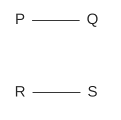
(Line PQ and Line RS are parallel)

(ii)
```mermaid
graph LR
    A --- B
    C --- D
    style A visibility:hidden
    style B visibility:hidden
    style C visibility:hidden
    style D visibility:hidden
```
(Line AB and Line CD intersect at a point)

## iii. Perpendicular lines
Observe in your surroundings e.g.,

<table>
    <tr>
        <th>a</th>
        <th>b</th>
        <th>c</th>
    </tr>
    <tr>
        <td>A tall tree on the ground.</td>
        <td>An electric pole or pole of our national flag on the pavement.</td>
        <td>Corner of two adjacent walls and high buildings.</td>
    </tr>
</table>"Two or more lines that meet or intersect each other at right angle ($90^\circ$) are called perpendicular lines."

e.g.,

(a)
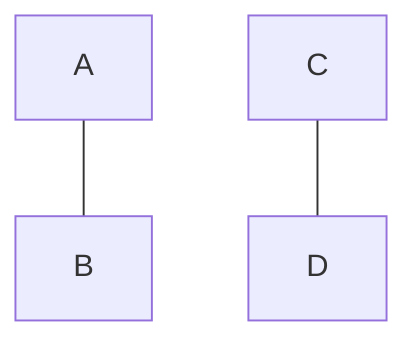
Perpendicular lines

(b)
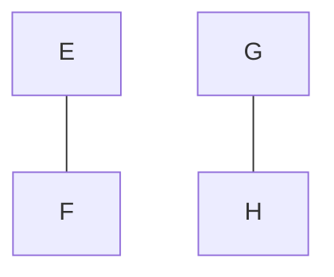
Perpendicular lines

> **Fun Fact**
> Perpendicular lines are always intersecting lines but intersecting lines may or may not be perpendicular.

## iv. Transversel
Observe the road crossing on the railway track.

(The image shows a road crossing a railway track at an angle, illustrating a transversal.)

"A line that passes through two or more lines at two distinct points is called transversel".

A line $PQ$ passing through the pair of parallel lines $AB$ and $CD$. The line $PQ$ is called transversel.

# Practice -3
Identify the perpendicular lines.

(i)
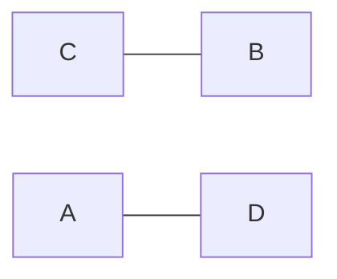

(ii)
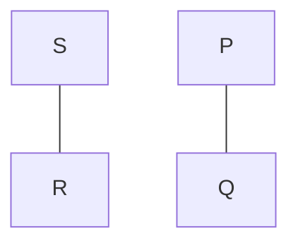

(iii)
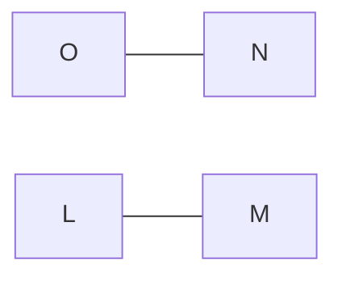

---

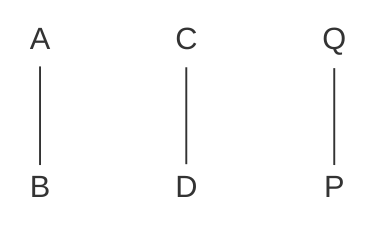
Figure 9.2.1 shows a transversal line $PQ$ intersecting two parallel lines $AB$ and $CD$, creating angles $a, b, c, d$ at the first intersection and $e, f, g, h$ at the second intersection.


130 | Sub-Domain-9: SYMMETRY
NOT FOR SALE-PESRP

Domain Geometry


### Transversel angles
When a transversal intersects two parallel or non parallel lines, it forms different kinds of angles. These angles can be categorized into several types:
* Interior angles.
* Exterior angles.
* Pair of corresponding angles.
* Pair of alternate interior angles.
* Pair of alternate exterior angles.
* Pair of interior angle on the same side of transversal.

Let's understand the angles from figure 9.2.1 made by transversal.

<table>
  <tbody>
    <tr>
        <td>Sr.No.</td>
        <td>Type of angles</td>
        <td>Angles</td>
    </tr>
    <tr>
        <td>1</td>
        <td>Interior angles</td>
        <td>∠c, ∠d, ∠e, ∠f</td>
    </tr>
    <tr>
        <td>2</td>
        <td>Exterior angles</td>
        <td>∠a, ∠b, ∠g, ∠h</td>
    </tr>
    <tr>
        <td>3</td>
        <td>Pairs of corresponding angles</td>
        <td>∠a and ∠e, ∠b and ∠f<br/>∠c and ∠g, ∠d and ∠h</td>
    </tr>
    <tr>
        <td>4</td>
        <td>Pairs of alternate interior angles</td>
        <td>∠c and ∠f<br/>∠d and ∠e</td>
    </tr>
    <tr>
        <td>5</td>
        <td>Pairs of alternate exterior angles</td>
        <td>∠a and ∠h<br/>∠b and ∠g</td>
    </tr>
    <tr>
        <td>6</td>
        <td>Pairs of interior angles on the same side of transversal</td>
        <td>∠c and ∠e<br/>∠d and ∠f</td>
    </tr>
  </tbody>
</table>

From the above discussion, we conclude that the angles associated with the transversal will have the following properties:
(i) The corresponding angles are equal in measurement.
(ii) The alternate angles are equal in measurement.
(iii) The interior angles are supplementary.

The converse statement for above properties are also true. e.g.
(i) If the corresponding angles are equal, then the two lines are parallel.
(ii) If the alternate angles are equal, the two lines are parallel.
(iii) If the interior angles are supplementary then the two lines are parallel.

The figure shows two lines $l_1$ and $l_2$ intersected by a transversal.
Angles $a$ and $b$ are on line $l_1$.
Angles $c$ and $d$ are on line $l_2$.
$\angle a + \angle b$ are supplementary
$\angle c + \angle d$ are supplementary
$l_1 \parallel l_2$

### Vertically opposite angles
"When two lines intersect at a point then the opposite angles are formed at the point of intersection. These angles are called vertically opposite angles."
In the figure 9.2.2, $\angle a$ and $\angle d$, $\angle b$ and $\angle c$ are vertically opposite angles.

The figure 9.2.2 shows two intersecting lines $AB$ and $CD$.
The angles formed at the intersection are $a, b, c, d$.
**Figure 9.2.2**

> **Remember**
> A pair of vertically opposite angles are always equal to each other.


Sub-Domain-9: SYMMETRY | 131
NOT FOR SALE-PESRP

Domain Geometry


**Example 1** If the measure angle $a = 60^\circ$ then find the values of other angles on the intersecting lines $AB$ and $CD$.

**Solution** As, vertically opposite angles are equal so, $m\angle a = m\angle d = 60^\circ$.
Since, $\angle a$ and $\angle b$ are supplementary. So,
$$m\angle a + m\angle b = 180^\circ$$
$$60^\circ + m\angle b = 180^\circ$$
$$m\angle b = 180^\circ - 60^\circ$$
$$m\angle b = 120^\circ.$$
Now, by applying the property of vertically angles
$$m\angle b = m\angle c = 120^\circ.$$

The image shows two intersecting lines $AB$ and $CD$. The angles formed at the intersection are labeled $a$, $b$, $c$, and $d$. Angle $a$ is given as $60^\circ$.
**Figure 9.2.3**

> **Challenge**
> If the value of the largest angle made by intersecting lines is $109^\circ$. Then find the other angles.

**Example 2** Calculate the value of unknown angles in the figure.

**Solution** In the figure, $\overleftrightarrow{AB}$ and $\overleftrightarrow{CD}$ are parallel lines. $T_1$ and $T_2$ are the transversals.

**For transversal $T_1$**
$m\angle j = 107^\circ$ (vertically opposite angles)
$m\angle i + 107^\circ = 180^\circ$ (adjacent angles on a line are supplementary)
$m\angle i = 180^\circ - 107^\circ$
$m\angle i = 73^\circ$
$m\angle i = m\angle h = 73^\circ$ (vertically opposite angles)

Now, $m\angle i = m\angle n = 73^\circ$ (alternate angles are equal)
and $m\angle k = 107^\circ$
$m\angle k = m\angle l = 107^\circ$ and $m\angle n = m\angle m = 73^\circ$ (vertically opposite angles are equal)

**For transversal $T_2$**
$m\angle a = 70^\circ$ (vertically opposite angles are equal)
$m\angle a + m\angle b = 180^\circ$ (adjacent angles on a line are supplementary)
$70^\circ + m\angle b = 180^\circ$
$m\angle b = 180^\circ - 70^\circ$
$= 110^\circ$
So, $m\angle b = m\angle c = 110^\circ$ (vertically opposite angles are equal)
Now, $m\angle b = m\angle d = 110^\circ$, (corresponding angles are equal)
$m\angle d = m\angle e = 110^\circ$, (vertically opposite angles)
$m\angle a = m\angle g = 70^\circ$ and $m\angle f = 70^\circ$ ($m\angle f = m\angle g$)

The image shows two parallel horizontal lines $CD$ (top) and $AB$ (bottom) intersected by two transversals $T_1$ and $T_2$.
- At the intersection of $CD$ and $T_1$, angles are labeled $l, m, n, k$.
- At the intersection of $AB$ and $T_1$, angles are labeled $107^\circ, i, h, j$.
- At the intersection of $CD$ and $T_2$, angles are labeled $70^\circ, b, c, a$.
- At the intersection of $AB$ and $T_2$, angles are labeled $f, d, e, g$.
**Figure 9.2.4**

> **Activity -1**
> Make a comparison between the properties of parallel lines and intersecting/perpendicular lines. Differentiate them by giving real life examples from your surroundings.

> **Practice -4**
> Find the value of $x$ in the figure.
> The image shows two parallel lines intersected by a transversal. One interior angle is labeled $160^\circ$ and an alternate interior angle is labeled $x$.

**Go Online** Visit the following links to play games online.
- http://www.mathgames.com/skill/8.46-transversal-of-parallel-lines
- http://www.transum.org/software/SW/starter_of_the_day/students/angleparallel.asp


132 | Sub-Domain-9: SYMMETRY
NOT FOR SALE-PESRP

Domain Geometry


# Exercise - 9.2

1. Identify the parallel, intersecting and perpendicular lines:

(i) Two lines $PQ$ and $RS$ that intersect at a point.
(ii) Two lines $AB$ and $CD$ that intersect at a point.
(iii) Two lines $LM$ and $ON$ that intersect at a point.
(iv) Two lines $WY$ and $XZ$ that are parallel to each other.
(v) Two lines $AB$ and $CD$ that intersect at a right angle (perpendicular).
(vi) Two vertical lines with arrows pointing in opposite directions, parallel to each other.

2. Find the unknown angles of the intersecting lines:

(i) Two intersecting lines where one angle is $30^\circ$. The unknown angles are labeled $a$, $b$, and $c$.
(ii) Two intersecting lines where one angle is $120^\circ$. The unknown angles are labeled $p$, $q$, and $r$.

3. Observe the diagram and write all:
(i) Pair of corresponding angles
(ii) Pair of alternate angles
(iii) Exterior angles

The diagram shows two parallel lines intersected by two transversals $T_1$ and $T_2$.
Angles at the first intersection ($T_1$): $a, b, c, d, e, f, g, h$.
Angles at the second intersection ($T_2$): $i, j, k, l, m, n, o, p$.

4. Calculate the values of unknown angles in the following diagrams:

(i) Two intersecting lines $A$ and $B$ crossed by another line $C$. One angle is $100^\circ$, and the unknown angle is $x$.
(ii) Two parallel lines $NO$ and $LM$ intersected by transversal $T_1$. One angle is $60^\circ$, and the unknown angle is $x$.
(iii) Two intersecting lines $AB$ and $CD$ intersected by transversal $T_1$. One angle is $111^\circ$, and the other is $3x$.
(iv) Two parallel lines $LM$ and $NO$ intersected by transversal $T_1$. Two interior angles on the same side are $6x$ and $2x$.
(v) Two parallel lines intersected by transversal $T_1$. Two exterior angles are $110^\circ$ and $150^\circ$. An interior angle is labeled $x$.

### Project - 2
Draw a transversal for non-parallel lines. Does these transversal hold the same properties that holds for parallel lines? If yes, then prepare a chart for all the properties, also give an example from your surroundings.


Sub-Domain-9: SYMMETRY | 133
NOT FOR SALE-PESRP

Domain: Geometry


# 9.3 SYMMETRY

Symmetry is all around us in nature and in the field of art and design.

It is defined as, "one shape is identical to the other shape when it is moved, rotated or flipped, then we say this shape is in symmetrical shape." In our previous class, we have learnt about symmetry and the line of symmetry. e.g.

"A line that divides an object into two identical pieces, is called line of symmetry." Here, in this section, we will learn more about symmetry.

The image shows three circular frames containing examples of symmetry in nature: green leaves, a butterfly, and a sunflower.

### 9.3.1 Types of Symmetry

Here, we will discuss about two types of symmetry:
(i) Reflective symmetry
(ii) Rotational symmetry

#### i. Reflective symmetry
"If a shape or pattern is reflected in a mirror line or line of symmetry then this type of symmetry is called reflective symmetry". For example,

The first image shows a landscape where a mountain is reflected in a lake. The horizontal dashed line represents the mirror line.
Caption: The reflection of mountain in the lake.

The second image shows a blue butterfly with a vertical dashed line through its center.
Caption: The left side is reflection of right side.

In the above figures, the mirror line divides figures into two parts.

**Example 3** Complete the following shapes according to the given mirror line or line of symmetry.

(i) A blue rectangle on a grid with a horizontal dashed line at its base.
(ii) A blue "U" shape on a grid with a horizontal dashed line at its base.
(iii) A blue semi-circle on a grid with a horizontal dashed line at its flat top.

**Solution** Draw the same shape on the other side of mirror line or line of symmetry. Simply, flip the shapes and complete them.

(i) The blue rectangle is mirrored below the dashed line with a yellow rectangle of the same size, forming a larger rectangle.
(ii) The blue "U" shape is mirrored below the dashed line with a yellow inverted "U" shape, forming an "H" like shape.
(iii) The blue semi-circle is mirrored above the dashed line with a yellow semi-circle, forming a full circle.


134 | Sub-Domain-9: SYMMETRY
NOT FOR SALE-PESRP

Domain: Geometry


> **Practice -5** Look at the pattern in the grid. If the pattern is reflected in the two lines of symmetry. What colour will these squares be?
>
> $A \quad B \quad C$
> $D \quad E \quad F$
> $G \quad H \quad I$
>
> Copy the pattern and colour the rest of the corresponding squares, when it is reflected in the mirror lines.

The grid shows a $6 \times 6$ square divided into four quadrants by a horizontal and a vertical dashed mirror line. The top-right quadrant contains a $3 \times 3$ pattern of colored squares (yellow, blue, green, grey). The other three quadrants contain letters indicating where the reflected colors should go.

<table>
  <thead>
    <tr>
        <th></th>
        <th></th>
        <th></th>
        <th></th>
        <th></th>
        <th></th>
        <th colspan="8"></th>
    </tr>
  </thead>
  <tbody>
    <tr>
        <td></td>
        <td>E</td>
        <td rowspan="3"></td>
        <td>Yellow</td>
        <td>Blue</td>
        <td>Yellow</td>
        <td colspan="8"></td>
    </tr>
    <tr>
        <td>B</td>
        <td rowspan="3"></td>
        <td>Blue</td>
        <td>Grey</td>
        <td>Blue</td>
        <td colspan="8"></td>
    </tr>
    <tr>
        <td></td>
        <td>G</td>
        <td rowspan="3"></td>
        <td>Green</td>
        <td>Yellow</td>
        <td>Green</td>
        <td colspan="6"></td>
    </tr>
    <tr>
        <td>I</td>
        <td>H</td>
        <td rowspan="3"></td>
        <td rowspan="3"></td>
        <td colspan="8"></td>
    </tr>
    <tr>
        <td>A</td>
        <td rowspan="3"></td>
        <td>C</td>
        <td rowspan="3"></td>
        <td rowspan="3"></td>
        <td colspan="6"></td>
    </tr>
    <tr>
        <td></td>
        <td>F</td>
        <td>D</td>
        <td rowspan="3"></td>
        <td colspan="5"></td>
    </tr>
  </tbody>
</table>

> **Activity -2** Fold a piece of paper in such a way that each part is equal to other part and identify mirror line.

## ii. Rotational symmetry

Observe in your surroundings, some of the shapes you see will have line of symmetry but some of the shapes you see, looks the same as you turn them e.g.

<table>
    <tr>
        <th>a</th>
        <th>b</th>
        <th>c</th>
    </tr>
    <tr>
        <td>![Pedestal fan]</td>
        <td>![Wheel of tractor]</td>
        <td>![Circular table]</td>
    </tr>
    <tr>
        <td>Pedestal fan.</td>
        <td>Wheels of tractor.</td>
        <td>Circular table.</td>
    </tr>
</table>"If a shape rotated about a point to another position and still looks the same then the shape has rotational symmetry."

In the above figures all the shapes above have rotational symmetry.

"Number of times a shape looks the same in one full turn is called order of symmetry."

For example:
The image shows a pink rectangle and a pink letter "S" with curved arrows indicating rotation.
This rectangle and the letter "S" has rotational symmetry of order 2.

### Example
Rotate the square and find the order of symmetry.

The image shows a $2 \times 2$ grid with the top-right square colored yellow and a center point labeled 'O'.

> **Remember**
> A fixed point around which the rotation occurs is called the centre of rotation.

### Solution

<table>
    <tr>
        <th>a</th>
        <th>b</th>
        <th>c</th>
        <th>d</th>
    </tr>
    <tr>
        <td>$1^{st}$ rotation</td>
        <td>$2^{nd}$ rotation</td>
        <td>$3^{rd}$ rotation</td>
        <td>$4^{th}$ rotation</td>
    </tr>
    <tr>
        <td>![Square with yellow top-left]</td>
        <td>![Square with yellow bottom-left]</td>
        <td>![Square with yellow bottom-right]</td>
        <td>![Square with yellow top-right]</td>
    </tr>
</table>At $4^{th}$ rotation figure came on its original position. So, the order of symmetry is 4 around $90^\circ$.


Sub-Domain-9: SYMMETRY | 135
NOT FOR SALE-PESRP

Domain: Geometry


**Go Online** Visit the following links and play the online games.
https://www.mathgames.com/skill/8.73-reflections-graph-the-image
Visit the below link for more practice about rotational symmetry.
https://www.mathsisfun.com/geometry/symmettry-rotational.html

**Practice - 6**
Draw the following shapes and rotate each figure at 90°. Also, write the order of symmetry for each shape.
* Circle
* Rectangle
* Rhombus
* Kite

# Exercise - 9.3

1. Use the concept of reflective symmetry to complete the following shapes:
   * (i) [A grid showing the top half of a blue triangle with a horizontal dashed line of symmetry]
   * (ii) [A grid showing the left half of a blue semi-circle with a vertical dashed line of symmetry]
   * (iii) [A grid showing the right half of a blue semi-circle with a vertical dashed line of symmetry]
   * (iv) [A grid showing half of a blue geometric shape with a diagonal dashed line of symmetry]
   * (v) [A grid showing half of a blue geometric shape with a diagonal dashed line of symmetry]
   * (vi) [A grid showing the left half of a blue 'H' shape with a vertical dashed line of symmetry]

2. Rotate the following shapes and write the order of symmetry:
   * (i) [A circle containing a three-petaled floral design centered at point O]
   * (ii) [A circle containing a four-petaled floral design centered at point O]
   * (iii) [A pink triangle with a vertex labeled O]

3. Draw the possible lines of symmetry for the following shapes:
   * (i) [A green leaf]
   * (ii) [A parallelogram]
   * (iii) [An isosceles trapezoid]
   * (iv) **T**
   * (v) **P**
   * (vi) **U**

4. Draw a shape with exactly two lines of symmetry.
5. Draw a shape with exactly 6 lines of symmetry.
6. Draw a shape with exactly 3 order of rotation.
7. Draw a shape with exactly 6 order of rotation.
8. Find the order of rotational symmetry for the following shapes.
   * (i) [A square]
   * (ii) [A five-pointed star]
   * (iii) [An L-shaped polygon]

**Project - 3**
Observe in your surrounding and make a list of at least four items that have a line of symmetry. Also, draw them and write order of rotational symmetry.


136 | Sub-Domain-9: SYMMETRY
NOT FOR SALE-PESRP

Domain: Geometry


# Review Exercise 9

1. Each of the following questions is followed by four suggested options. In each case select the correct option.
    (i) A sphere is a 3-dimensional solid object. It has:
        a. 6 surfaces, 12 edges, 8 vertices
        b. 0 surfaces, 0 edges, 1 vertices
        c. 0 surfaces, 0 edges, 0 vertices
        d. 1 surface, 0 edges, 0 vertices
    (ii) A cuboid has:
        a. 4 faces
        b. 6 faces
        c. 12 faces
        d. 8 faces
    (iii) A hemisphere has
        a. 0 edges
        b. 1 edge
        c. 2 edges
        d. 4 edges
    (iv) Two lines that never intersect each other at any point are called:
        a. perpendicular lines
        b. intersecting lines
        c. transversal lines
        d. parallel lines
    (v) Perpendicular lines always intersect each other at:
        a. $20^\circ$
        b. $45^\circ$
        c. $90^\circ$
        d. $120^\circ$
    (vi) A point where two lines intersect each other is called:
        a. corner point
        b. centre point
        c. point of intersection
        d. none of these
    (vii) A line that passes through two or more parallel lines at distinct points is called:
        a. perpendicular
        b. transversal
        c. altitude
        d. hypotenuse
    (viii) If the value of largest angle made by intersecting lines is $120^\circ$, then the value of its opposite angle will be:
        a. $60^\circ$
        b. $80^\circ$
        c. $110^\circ$
        d. $120^\circ$
    (ix) Line that divides an object into two identical pieces is called:
        a. perpendicular line
        b. mirror line
        c. segment
        d. ray
    (x) Number of times a shape looks the same in one full turn is called:
        a. symmetry
        b. center of symmetry
        c. power of symmetry
        d. order of symmetry

2. Define the following:
    (i) Parallel lines
    (ii) Non-parallel lines/ intersecting lines
    (iii) Perpendicular lines
    (iv) Transversal
    (v) Vertically opposite angles
    (vi) Symmetry
    (vii) Reflective symmetry
    (viii) Rotational symmetry

3. Differentiate between 2-D and 3-D shapes and give one example for each one.

4. Find the value of $x$ in the following figures:

    (i) [Diagram showing two parallel lines intersected by a transversal line $PQ$. The interior angles shown are $111^\circ$ and $(2x+1)^\circ$.]
    (ii) [Diagram showing two parallel lines $CD$ and $AB$ with a zigzag line between them forming angles of $54^\circ$, $x$, and $59^\circ$.]


Sub-Domain-9: SYMMETRY | 137
NOT FOR SALE-PESRP

Domain Geometry


5. In each of the following questions, copy the grid and the object $P$. Draw the image $Q$ when the object is rotated by the angle stated, about the centre of rotation $O$:

(i)
[The image shows a grid with a right-angled triangle $P$ and a point $O$. The triangle $P$ has vertices at $(1, 4)$, $(1, 1)$, and $(3, 1)$ relative to a local grid origin. Point $O$ is at $(4, 4)$.]
Rotation by $90^\circ$ clockwise about $O$

(ii)
[The image shows a grid with a rectangle $P$ and a point $O$. The rectangle $P$ has vertices at $(1, 2)$, $(1, 4)$, $(3, 4)$, and $(3, 2)$. Point $O$ is at $(4, 4)$.]
Rotation by $180^\circ$ about $O$

(iii)
[The image shows a grid with an L-shaped object $P$ and a point $O$. Point $O$ is at $(4, 4)$.]
Rotation by $180^\circ$ about $O$

(iv)
[The image shows a grid with a triangle $P$ and a point $O$. Point $O$ is at $(4, 4)$.]
Rotation by $90^\circ$ anti-clockwise about $O$

(v)
[The image shows a grid with a pentagonal shape $P$ and a point $O$. Point $O$ is at $(4, 4)$.]
Rotation by $180^\circ$ about $O$

(vi)
[The image shows a grid with an L-shaped object $P$ and a point $O$. Point $O$ is at $(4, 4)$.]
Rotation by $90^\circ$ anti-clockwise about $O$

# Summary

* The figures that have only length are called 1-D figures.
* The figures that can be drawn on paper, these figures have no thickness but they have length and width/height. These figures are called 2-D figures.
* The figures that have length, width and depth are called 3-D figures.
* Two or more lines which extend in the same direction and remain the same distance apart are called parallel lines.
* Two lines that are intersecting each other at a single point are called intersecting lines. The point where these lines intersect, is called point of intersection.
* Two lines that meet or intersect each other at right angle ($90^\circ$) are called perpendicular lines.
* A line that passes through two or more lines at distinct points is called transversal.
* When two lines intersect at a point then the opposite angles are formed at the point of intersection. These angles are called vertically opposite angles.
* A line that divides an object into two identical pieces is called line of symmetry.
* If a shape or a pattern is reflected in a mirror line or line of symmetry then this type of symmetry is called reflective symmetry.
* If a shape is rotated about a point to another position and still looks the same then the shape has rotational symmetry.
* Number of times a shape looks the same in one full turn is called order of symmetry.

> **Teaching Point**
> The questions in the exercises, practices and different activities are given as examples (symbols) for learning. You can use self generated questions (test items) conceptual type MCQ's, fill in the blanks, column matching, constructed response questions and (simple computations) based on cognitive domain (e.g. knowing = 40%, applying = 40% and reasoning = 20%) to assess the understanding of learners.


138 | Sub-Domain-9: SYMMETRY
NOT FOR SALE-PESRP

Domain: Geometry
Sub-Domain: 10 GEOMETRICAL CONSTRUCTIONS


# GEOMETRICAL CONSTRUCTIONS

**Students' Learning Outcomes:**
**By the end of this sub-domain, students will be able to:**
* Construct angles of different measures.
* Define bisectors of an angle, bisector and perpendicular bisector of a line segment.

> Which is the maximum angle that can be formed by opening your laptop screen?
> [The image shows two laptops: one opened at an angle of $110^\circ$ and another at $90^\circ$]

## INTRODUCTION

We are familiar with the geometry, it is a branch of Mathematics. The word geometry comes from the Greek that means "measurement of the earth." It concerns with the properties of points, straight lines and curved lines, and surface of solids. "A line segment is a part of a line that is bounded by two distinct end points and contains every point on the line between its end points." The part from A to B of the above line is known as line segment. It is denoted by $\overline{AB}$.

### Remember
* **Line:** A line is a series of points that extends in both directions without ends.
  [Diagram of a line with arrows on both ends labeled "Line"]
* **Ray:** A ray is a line with one end point.
  [Diagram of a ray starting at point A and extending through B labeled "Ray"]
  [Diagram of a line segment between points A and B labeled "Line"]

## 10.1 CONSTRUCTION OF LINE SEGMENT
We can draw a line segment by using compass and ruler. Look at the following examples.

### Example 1
Draw a line segment $m\overline{AB} = 4\text{ cm}$ using ruler.

**Construction:** To draw a line segment simply follow the steps below.

<table>
    <tr>
        <th>Step I</th>
        <th>Step II</th>
    </tr>
    <tr>
        <td>[Illustration of a hand marking a point A]</td>
        <td>[Illustration of a ruler with point A at the 0 mark]</td>
    </tr>
    <tr>
        <td>Mark a point $A$ on a paper.</td>
        <td>Place a ruler such that its zero point should be attached with point $A$.</td>
    </tr>
    <tr>
        <td></td>
    </tr>
    <tr>
        <td>Step III</td>
        <td>Step IV</td>
    </tr>
    <tr>
        <td>[Illustration of a ruler with point A at 0 and a hand marking point B at 4cm]</td>
        <td>[Illustration of a line segment drawn between points A and B]</td>
    </tr>
    <tr>
        <td>Mark another point $B$, $4\text{cm}$ from point $A$ by using ruler.</td>
        <td>Now, join points $A$ and $B$ together and then remove the ruler. $m\overline{AB} = 4\text{ cm}$ is the required line segment.</td>
    </tr>
</table>
Sub-Domain-10: GEOMETRICAL CONSTRUCTIONS | 139
NOT FOR SALE-PESRP

Domain Geometry


**Example 2** Draw a line segment of $5\text{ cm}$ using compass.

**Contraction:** To draw a line segment simply follow the below steps.

### Step I
A ray $AO$ is drawn on a paper starting from point $A$ and extending through point $O$.
Draw a ray $\vec{AO}$ on a paper.

### Step II
A compass is shown with its needle at the $0$ mark of a ruler and its pencil tip at the $5\text{ cm}$ mark.
Place the needle of compass at point '$O$' using ruler and open it $5\text{ cm}$, as shown above.

### Step III
The compass, set to $5\text{ cm}$, is placed with its needle at point $A$ to draw an arc on the ray $\vec{AO}$.
Place the needle of the compass at point $A$, then draw an arc $5\text{ cm}$ on $\vec{AO}$.

### Step IV
The arc intersects the ray at a point labeled $B$. The distance from $A$ to $B$ is $5\text{ cm}$.
The arc cuts $\vec{AO}$ at $B$ so, $m\overline{AB} = 5\text{ cm}$ is a required line segment.

---

### Practice - 1
(i) Use your ruler to draw a line segment of $6\text{ cm}$.
(ii) Use your compass to draw a line segment of $9\text{ cm}$.

---

## 10.2 PERPENDICULAR BISECTOR OF A LINE SEGMENT

'Bi' means two and 'section' means part so, bisection means divide into two equal parts.

The perpendicular bisector of a line segment is a line which makes a right angle with given line segment and divide it into two equal parts.

A perpendicular bisector always passes through the mid point of the line segment. It can be constructed by using a pair of compass and ruler.

Now, look at the following example to draw the perpendicular bisector of a given line segment.

A diagram shows a horizontal line segment $XY$. A vertical line '$l$' passes through the center of $XY$ at a $90^\circ$ angle (indicated by a square symbol). The vertical line is labeled "Perpendicular" on top and "Bisector" on the bottom.


140 | Sub-Domain-10: GEOMETRICAL CONSTRUCTIONS
NOT FOR SALE-PESRP

Domain Geometry


**Example 3** Draw a perpendicular bisector of $m\overline{AB} = 6\text{ cm}$.

**Construction:** To draw perpendicular bisector simply follow the following steps.

<table>
    <tr>
        <th>Step I</th>
        <th>Step II</th>
    </tr>
    <tr>
        <td>[The image shows a horizontal line segment AB with a label "6cm" above it.]&lt;br/&gt;Draw $m\overline{AB} = 6\text{ cm}$.</td>
        <td>[The image shows a compass with its needle at point A, drawing two arcs, one above and one below the line segment AB.]&lt;br/&gt;Open the compass more than half of $m\overline{AB}$. With centre at $A$ draw two arcs on both sides of $\overline{AB}$.</td>
    </tr>
    <tr>
        <td></td>
    </tr>
    <tr>
        <td>Step III</td>
        <td>Step IV</td>
    </tr>
    <tr>
        <td>[The image shows a compass with its needle at point B, drawing two arcs that intersect the previous arcs at points L and M.]&lt;br/&gt;With center at $B$ draw two arcs of same radius cutting previous arcs at $L$ and $M$ respectively.</td>
        <td>[The image shows a vertical dashed line passing through the intersection points L and M, crossing the line segment AB at point O. The segments AO and OB are both labeled "3cm".]&lt;br/&gt;Join $L$ and $M$ with blue line cutting $\overline{AB}$ at point $O$, $O$ is a right angle.&lt;br/&gt;So, $\overleftrightarrow{LM}$ is a perpendicular bisector of $\overline{AB}$ and $m\overline{AO} = m\overline{OB} = 3\text{ cm}$.</td>
    </tr>
</table>> **Note:** While drawing perpendicular bisector, on notebook only draw step (iv) figure and write all steps of construction.

> **Remember:** The perpendicular bisector is also known as right bisector.

### 10.2.1 Difference between Bisector and Perpendicular Bisector

**Bisector**
Bisector is a line that divides something e.g., line segment or angle into two equal parts.

**Perpendicular bisector**
Perpendicular bisector is a line that bisects a given line segment at a right angle. Also, it passes through the midpoint of the line segment.

### 10.2.2 Construction of a Perpendicular to a Given Line from a Point on it

The method to draw a perpendicular to a given line at a given point is explained in the following example:


Sub-Domain-10: GEOMETRICAL CONSTRUCTIONS | 141
NOT FOR SALE-PESRP

Domain Geometry


# Example 4 Draw a perpendicular to $\overleftrightarrow{AB}$ at a given point on $\overleftrightarrow{AB}$.

**Construction:** To draw the perpendicular to $\overleftrightarrow{AB}$ at a given point, simply follow the steps below.

### Step I
A horizontal line with arrows at both ends is labeled $A$ on the left and $B$ on the right. A point $X$ is marked on the line between $A$ and $B$.
Draw a line $AB$ of given measurement and mark point $X$ on the line.

### Step II
A semi-circle is drawn with its center at point $X$, intersecting the line $AB$ at points $S$ (left) and $T$ (right). A compass is shown positioned at point $X$.
With the help of compass draw a semi-circle of any radius with centre at point '$X$'. This circle touching line $AB$ at points $S$ and $T$ respectively.

### Step III
A compass is shown with its needle at point $S$, drawing an arc above the line $AB$.
Mark an arc above the line of any radius centre at point $S$.

### Step IV
A compass is shown with its needle at point $T$, drawing a second arc that intersects the first arc at a point labeled $Y$.
Now mark another arc above the line with the same radius centred at point $T$. This arc cuts the first arc at point $Y$.

### Step V
A dashed vertical line is drawn from point $Y$ down to point $X$ on the line $AB$.
Now, join point $Y$ with $X$. So, $\overleftrightarrow{XY}$ is required perpendicular to $\overleftrightarrow{AB}$ at a given point $X$ on it.

---

### Practice -3
Draw a line segment $AB = 5\text{ cm}$, then mark a point $P$ on it and draw a perpendicular at this point.

### Note
While drawing bisector on notebook, only draw step (V) figure and write all steps of construction.

---

## 10.2.3 Construction of a Perpendicular to a Given Line from a Point outside the Line
The method to draw a perpendicular to a given line from a point outside the line is explained in the following example.


142 | Sub-Domain-10: GEOMETRICAL CONSTRUCTIONS
NOT FOR SALE-PESRP

Domain Geometry


**Example 5** Draw a perpendicular to the line from a point $X$ outside the line.

**Construction:** To draw perpendicular to the line from a point outside, simply follow the following steps.

### Step I
[The image shows a horizontal line with arrows at both ends, labeled with points A and B. A point X is marked above the line.]
Draw $\overleftrightarrow{AB}$ of any measurement and mark point $X$ above the line as shown.

### Step II
[The image shows a compass with its needle at point X, drawing an arc that intersects line AB at two points, labeled L and M.]
Draw an arc of any radius with centre at point $X$. The arc should cut the line at two points say $L$ and $M$.

### Step III
[The image shows the compass needle placed at point L, drawing a small arc below the line AB.]
Mark second arc of same radius with centre at $L$.

### Step IV
[The image shows the compass needle placed at point M, drawing another small arc below the line AB that intersects the arc from Step III at point Y.]
Mark third arc of same radius with centre at $M$, this arc cuts the second arc at point $Y$.

### Step V
[The image shows a dashed vertical line connecting point X and point Y, passing through line AB.]
Join point $X$ with $Y$, with line $\overleftrightarrow{XY}$.
So, $\overleftrightarrow{XY}$ is required perpendicular to $\overleftrightarrow{AB}$ from a point $X$ outside the line.

> **Practice -4**
> Draw a perpendicular bisector to the line segment $m\overline{AB} = 6cm$, from point "P" that is outside the line.

> **Note**
> While drawing perpendicular on notebook, only draw step (V) figure and write all points in construction steps.

**Go Online**
Visit the following link to show construction of line bisection.
https://www.mathspad.co.uk/i2/construct.php

**Remember**
A right bisector always intersects the given line at a right angle (90°). It can be checked by using protractor.


Sub-Domain-10: GEOMETRICAL CONSTRUCTIONS | 143
NOT FOR SALE-PESRP

Domain Geometry


# Exercise - 10.1

1. Draw line segments of the following measurements using ruler and compass:
(i) $5\text{ cm}$ (ii) $3.9\text{ cm}$ (iii) $7\text{ cm}$ (iv) $5.7\text{ cm}$ (v) $6.5\text{ cm}$

2. Draw the right bisectors of the following line segments:
(i) A line segment AB drawn at an angle.
(ii) A horizontal line segment PQ.
(iii) A line segment XY drawn at an upward angle.
(iv) $7.8\text{ cm}$ (v) $8\text{ cm}$ (vi) $90\text{ mm}$ (vii) $6.7\text{ cm}$

3. Draw the perpendicular bisectors of the following line segments:
(i) $7\text{ cm}$ (ii) $6.8\text{ cm}$ (iii) $8\text{ mm}$ (iv) $92\text{ mm}$ (v) $5.8\text{ cm}$

4. Draw a perpendicular from the out side point on the following line segments:
(i) $8.9\text{ cm}$ (ii) $7.8\text{ cm}$ (iii) $110\text{ mm}$ (iv) $7\text{ cm}$ (v) $9\text{ cm}$

5. Draw a $m\overline{AB} = 8\text{ cm}$ mark a point $P$ outside it, on some height over $\overline{AB}$ then draw perpendicular from point $X$ to $\overline{AB}$.

> **Project - 1**
> Make a booklet of rules/steps of construction for line segment, line bisector and perpendicular bisector.

> **History**
> Euclid was a Greek Mathematician. He was the first person who introduced the term "Geometry". Because of his contribution in geometry he is known as the "father of geometry." To know more about his contribution in mathematics, go online and visit the following link.
> http://www.math.goodreads.com/author/show/125792.Euclid
> (365BC-275BC)

## 10.3 CONSTRUCTION OF ANGLES

If a person rises the screen of a laptop slowly, the edge rises and creates a gap between the screen and the base. If the screen is raised higher, the two sides remain joined at one end, the space between the other two ends is increased. Moving the screen higher we get different positions.

Rising of screen from different angles between the base and the screens, so, an angle refers to the space between two surfaces or intersecting lines at the point where they meet.

The following images illustrate angles formed by a laptop screen:
*   A laptop screen opened at a $110^\circ$ angle.
*   A laptop screen opened at a $60^\circ$ angle.
*   A laptop screen opened at a $90^\circ$ angle.

In previous classes, we have learnt about the construction of angles of different measures using protractor. Now, we will learn the construction of angle by using the pair of compasses.


144 | Sub-Domain-10: GEOMETRICAL CONSTRUCTIONS
NOT FOR SALE-PESRP

Domain: Geometry


### 10.3.1 Construction of Angle Equal in Measure of a Given Angle

We can construct an angle equal in measure of a given angle using compass. Look at the following example.

**Example 6** Construct $m\angle AOB = 60^\circ$.

[The image shows a given angle $AOB$ measuring $60^\circ$ with vertex $O$ and rays $\vec{OA}$ and $\vec{OB}$.]

**Construction:**

<table>
    <tr>
        <th>Step I</th>
        <th>Step II</th>
    </tr>
    <tr>
        <td>[Diagram showing a horizontal ray $\vec{PQ}$ starting at point $P$.]</td>
        <td>[Diagram showing the original angle $AOB$ with an arc drawn from center $O$ intersecting $\vec{OA}$ at $S$ and $\vec{OB}$ at $T$.]</td>
    </tr>
    <tr>
        <td>Draw $\vec{PQ}$ of any suitable measurement as shown above.</td>
        <td>Draw an arc of any radius with centre at point $O$. This arc cuts $\vec{OA}$ at point '$S$' and $\vec{OB}$ at point $T$.</td>
    </tr>
    <tr>
        <td>**Step III**</td>
        <td>**Step IV**</td>
    </tr>
    <tr>
        <td>[Diagram showing ray $\vec{PQ}$ with an arc drawn from center $P$ intersecting the ray at point $X$.]</td>
        <td>[Diagram showing a compass measuring the distance between points $S$ and $T$ on the original angle.]</td>
    </tr>
    <tr>
        <td>With centre '$P$' draw an arc of radius equal to $m\overline{OS}$ to cut $\vec{PQ}$ at point $X$.</td>
        <td>Now, place the compass on $S$ and take the measurement of arc $ST$, as given.</td>
    </tr>
    <tr>
        <td>**Step V**</td>
        <td>**Step VI**</td>
    </tr>
    <tr>
        <td>[Diagram showing the arc from step III being intersected by a second arc drawn from center $X$ to create point $Y$.]</td>
        <td>[Diagram showing the final constructed angle $QPR$ where a ray $\vec{PR}$ is drawn through point $Y$. The angle measures $60^\circ$.]</td>
    </tr>
    <tr>
        <td>Place the needle at point $X$ and draw another arc which cut the first arc at point $Y$.</td>
        <td>Now, draw $\vec{PR}$ which is passing through point $Y$. $m\angle QPR$ is required angle.&lt;br/&gt;Hence, $m\angle QPR = m\angle AOB = 60^\circ$.</td>
    </tr>
</table>> **Note:** While constructing angle of given angle's measurement, only draw step (VI) figure using the above steps and write all steps of construction.

#### Teaching Point
Explain the concept of angle bisector by using to following activity.
* Divide the class into small groups, and provide each group with a large piece of paper, a protractor, a ruler, a pencil, and some art supplies.
* Instruct each group to make a large X on the paper by connecting the corners of the paper using two diagonal lines.
* Point out the four angles that have formed, and tell students to find and draw the angle bisector of each angle.
* Tell students that this will from additional angles, witch will have their own bisectors, and so on.
* Students should continue finding bisectors until they have a given number of sections.


Sub-Domain-10: GEOMETRICAL CONSTRUCTIONS | 145
NOT FOR SALE-PESRP

Domain Geometry


### 10.3.2 Construction of an Angle Twice in Measure of a Given Angle

Look at the following example to draw an angle twice in measure of a given angle.

#### Example 7
Construct an angle twice in measure of $m\angle AOB = 60^\circ$

**Construction:**

The image shows a given angle $\angle AOB$ where $O$ is the vertex, $OA$ is the horizontal ray, and $OB$ is the ray at $60^\circ$.

**Step I**
Follow the method which we have used in example-6 Step (I-V) for the construction of $m\angle QPR$.

**Step II**
The image shows a compass with its needle at point $Y$ on an arc, drawing another arc that intersects at point $Z$. The base line is $PQ$, with point $X$ on the arc.
Now, draw another arc with centre at point $Y$ having same radius. This arc cut the first arc at point $Z$, as shown.

**Step III**
The image shows a ray $PR$ drawn from point $P$ through the intersection point $Z$. The angle $\angle QPR$ is labeled as $120^\circ$.
Now, draw $\vec{PR}$ which is passing through the point $Z$. The angle $m\angle QPR$ is the required angle.

> **Note**
> While constructing double angle of given angle's measurement on notebook, only draw step (iii) figure and write all points in construction steps.

---

### 10.3.3 Use Compass to Bisect a Given Angle

Bisection of an angle means to divide the given angle into two equal angles. Now look at the following example.

> **Remember**
> Bisector of an angle means division of given angle into two equal parts.

#### Example 8
Draw the bisector of the angle $m\angle AOB = 60^\circ$

**Construction:**

**Step I**
Draw an arc of any radius at point '$O$', which cuts $\vec{OA}$ at point $X$ and $\vec{OB}$ at point $Y$.
The image shows a compass drawing an arc across the two rays of angle $\angle AOB$, intersecting them at points $X$ and $Y$.

**Step II**
Now, with centre at point $X$ draw an arc of any radius as shown.
The image shows a compass with its needle at point $X$, drawing a small arc in the interior of the angle.


146 | Sub-Domain-10: GEOMETRICAL CONSTRUCTIONS
NOT FOR SALE-PESRP

Domain Geometry


### Step III
The image shows a geometric construction where a compass is placed at point Y to draw an arc that intersects a previous arc at point Z within an angle AOB.
With centre at point $Y$ draw another arc of same radius which cuts the first arc at point $Z$.

### Step IV
The image shows the final step of bisecting an angle where a ray OZ is drawn from the vertex O through the intersection point Z.
Now, join point $O$ with $Z$ and draw $\vec{OZ}$. So, $\vec{OZ}$ is the required angle bisector.

> **Note**
> While bisecting a given angle on notebook, only draw figure in step (IV) and write all other steps in construction steps.

### Practice - 6
The image shows an angle AOB measuring 75 degrees.
Divide $\angle AOB$ into two equal angles.

### 10.3.4 Construction of Angles
The method of construction of different types of angles using compass is illustrated in the following examples.

> **Remember**
> An angle of $60^\circ$ is a basic angle in construction of angles.

#### Construction of angle $60^\circ$
**Example 9** Construct an angle of $60^\circ$ with the help of compass.

**Construction:**

### Step I
The image shows a horizontal ray starting from point O and passing through point A.
Draw $\vec{OA}$ of any measurement.

### Step II
The image shows a compass drawing an arc from center O that intersects the ray OA at point X.
With centre at point $O$ draw an arc of any radius, which cuts $\vec{OA}$ at point $X$.

### Step III
The image shows a compass placed at point X drawing a second arc that intersects the first arc at point Y.
Now, draw second arc of same radius with centre at point $X$. Which cuts the first arc at point $Y$.

### Step IV
The image shows a ray OB drawn from point O through the intersection point Y, forming a $60^\circ$ angle with ray OA.
Join point $Y$ with point $O$ and draw $\vec{OB}$.
Hence, $m\angle AOB = 60^\circ$ is the required angle.


Sub-Domain-10: GEOMETRICAL CONSTRUCTIONS | 147
NOT FOR SALE-PESRP

Domain Geometry


# Construction of angle 30°

**Example 9** Construct $m\angle AOB = 30^\circ$ using compass.

**Construction:**

As $\frac{60^\circ}{2} = 30^\circ$, first construct angle $60^\circ$ and then bisect it.

<table>
    <tr>
        <th>Step I</th>
        <th>Step II</th>
    </tr>
    <tr>
        <td>[The image shows a diagram of a $60^\circ$ angle $AOC$ constructed with a compass. Point $O$ is the vertex, ray $OA$ is the base, and ray $OC$ passes through the intersection point $Y$ of two arcs.]</td>
        <td>[The image shows a compass with its needle at point $X$ (where the first arc intersects ray $OA$) drawing a small arc in the interior of $\angle AOC$.]</td>
    </tr>
    <tr>
        <td>Use all the steps of example 8, and construct $m\angle AOC = 60^\circ$ as shown above.</td>
        <td>With centre at point $X$ mark an arc of any radius as shown above.</td>
    </tr>
    <tr>
        <td></td>
    </tr>
    <tr>
        <td>Step III</td>
        <td>Step IV</td>
    </tr>
    <tr>
        <td>[The image shows a compass with its needle at point $Y$ (where the arc intersects ray $OC$) drawing a second small arc that intersects the first one at point $Z$.]</td>
        <td>[The image shows a ray $OB$ drawn from point $O$ through the intersection point $Z$. The angle $AOB$ is labeled as $30^\circ$.]</td>
    </tr>
    <tr>
        <td>Now draw third arc with centre at point $Y$ of same radius. The third arc cuts the second arc at point $Z$.</td>
        <td>Join point $Z$ with point $O$, and draw $\vec{OB}$.&lt;br/&gt;Hence, $m\angle AOB = 30^\circ$ is the required angle.</td>
    </tr>
</table># Construction of angle 90°

**Example 10** Draw $m\angle AOB = 90^\circ$ using compass.

**Construction:**

> **Remember**
> $m\angle AOB = m\angle BOC = 30^\circ$ and
> $m\angle AOB + m\angle BOC = 60^\circ$

<table>
    <tr>
        <th>Step I</th>
        <th>Step II</th>
    </tr>
    <tr>
        <td>[The image shows a horizontal ray starting at point $O$ and passing through point $A$.]</td>
        <td>[The image shows a compass with its needle at point $O$ drawing a large semi-circular arc that intersects ray $OA$ at point $X$.]</td>
    </tr>
    <tr>
        <td>Draw $\vec{OA}$, as shown above</td>
        <td>Draw an arc of any radius with centre at point $O$, as shown above. Which cuts $\vec{OA}$ at point $X$.</td>
    </tr>
</table>
148 | Sub-Domain-10: GEOMETRICAL CONSTRUCTIONS
NOT FOR SALE-PESRP

Domain Geometry


### Step III
[The image shows a geometric construction. A ray OA is drawn. A large arc is drawn with center O, intersecting OA at point X. A second arc is drawn with center X, intersecting the first arc at point Y. A compass is shown drawing a third arc with center Y, intersecting the first arc at point Z.]

Draw the second arc centre at $X$ cutting the previous arc at $Y$. Draw third arc centre at point $Y$ cutting the first arc at point $Z$.

### Step IV
[The image shows the same construction as Step III. A compass is shown drawing a fourth arc above the first arc, with its center at point Y.]

Draw fourth arc of the any radius with centre at point $Y$.

### Step V
[The image shows the same construction as Step IV. A compass is shown drawing a fifth arc with center Z, which intersects the fourth arc at point S.]

Now, with centre at point $Z$ draw fifth arc of the same radius as in step IV which cuts fourth arc at point $S$, as shown above.

### Step VI
[The image shows the completed construction. A ray OB is drawn from point O through the intersection point S. The angle AOB is labeled as $90^\circ$.]

Join point $S$ with $O$ and draw $\vec{OB}$.
Hence, $m\angle AOB = 90^\circ$ is the required angle.

---

## Construction of angle $45^\circ$

### Example 11
Construct $m\angle AOB = 45^\circ$ using compass.

**Construction:** As, $\frac{90^\circ}{2} = 45^\circ$, so construct angle $90^\circ$ then bisect it.

> **Thinking Time**
> Construct an angle $90^\circ$ using compass by another method.

### Step I
[The image shows a $90^\circ$ angle construction similar to Step VI. A vertical dashed line passes through point O and the intersection point S. The point where this dashed line intersects the main arc is labeled T.]

Use all the steps of example 10 and construct an angle of $90^\circ$ where $\vec{OC}$ passing through the point '$T$'.

### Step II
[The image shows the beginning of the bisection of the $90^\circ$ angle. A compass is shown drawing a new arc with center at point X.]

Draw an arc of any radius with centre at point $X$ as shown above.


Sub-Domain-10: GEOMETRICAL CONSTRUCTIONS | 149
NOT FOR SALE-PESRP

Domain Geometry


### Step III
[The image shows a geometric construction using a compass. A semi-circle is drawn from point O on line OA. Points X, Y, Z, and T are marked on the arc. A compass is placed at point T to draw a small arc intersecting another arc at point U.]

Now, with centre at point $T$ draw another arc with previous radius which cuts the first arc at point $U$.

### Step IV
[The image shows the completed construction of a 45° angle. A ray OB is drawn from point O through the intersection point U. The angle AOB is labeled as 45°.]

Join point $U$ with $O$ and draw $\vec{OB}$.
Hence, $m\angle AOB = 45^\circ$ is the required angle.

---

<table>
    <tr>
        <th>Thinking Time</th>
        <th>Remember</th>
        <th>Note</th>
    </tr>
    <tr>
        <td>Construct an angle 45° using compass by another method.</td>
        <td>$m\angle AOB = m\angle BOC = 45^\circ$ and&lt;br/&gt;$m\angle AOB + m\angle BOC = 90^\circ$</td>
        <td>We bisect the angle between 60° and 90°.&lt;br/&gt;We will use the fact $\frac{60^\circ + 90^\circ}{2} = 75^\circ$</td>
    </tr>
</table>---

## Construction of angle 75°
**Example 12** Construct an angle of 75° using compass.

**Construction:**

### Step I
[The image shows the initial setup for constructing a 90° angle. A semi-circle is drawn on line OA from point O. Points X, Y, Z, and T are marked, with a dashed line OC passing through T.]

Use all the steps of example 10 to construct an angle of 90°. Where $\vec{OC}$ is passing through the point $T$.

### Step II
[The image shows a compass placed at point Y on the arc to draw a small arc in the region between the 60° (Y) and 90° (T) marks.]

With the centre at point $Y$ draw an arc of any radius as shown above.

### Step III
[The image shows a compass placed at point T to draw a second small arc that intersects the first arc at point U.]

Now with the centre at point $T$. Draw another arc with previous radius which cuts the first arc at point $U$.

### Step IV
[The image shows the final construction. A ray OB is drawn from point O through the intersection point U, forming the 75° angle.]

Join point $U$ with $O$ and draw $\vec{OB}$.
Hence, $m\angle AOB = 75^\circ$ is the required angle.


150 | Sub-Domain-10: GEOMETRICAL CONSTRUCTIONS
NOT FOR SALE-PESRP

Domain Geometry


<table>
    <tr>
        <th>Thinking Time</th>
        <th>Remember</th>
    </tr>
    <tr>
        <td>Draw an angle of $75^{\circ}$ with the help of compass by another method if possible.</td>
        <td>While drawing angle of $75^{\circ}$ on notebook, only draw figure of step (IV) and write all steps of construction.</td>
    </tr>
</table>## Construction of angle $120^{\circ}$

**Example 13** Construct an angle of $m\angle AOB = 120^{\circ}$ using compass.

**Construction:** As, $60^{\circ} + 60^{\circ} = 120^{\circ}$, construct an angle of $60^{\circ}$ twice to get an angle $120^{\circ}$.

<table>
    <tr>
        <th>Step I</th>
        <th>Step II</th>
    </tr>
    <tr>
        <td>The image shows a compass drawing a large arc from point O, intersecting ray OA at point X.</td>
        <td>The image shows a compass centered at point X, drawing a second arc that intersects the first arc at point Y.</td>
    </tr>
    <tr>
        <td>Draw $\vec{OA}$. Then with centre at point $O$ mark a long arc of any radius which is cuts $\vec{OA}$ at point $X$.</td>
        <td>Draw an other arc of previous radius with centre at point $X$ which cuts the first arc at point $Y$.</td>
    </tr>
    <tr>
        <td></td>
    </tr>
    <tr>
        <td>Step III</td>
        <td>Step IV</td>
    </tr>
    <tr>
        <td>The image shows a compass centered at point Y, drawing a third arc that intersects the first arc at point Z.</td>
        <td>The image shows a ray OB drawn from point O through point Z, forming a $120^{\circ}$ angle with ray OA.</td>
    </tr>
    <tr>
        <td>Now, draw the third arc of same radius with centre at point $Y$, which cuts the first arc at point $Z$.</td>
        <td>Join point $Z$ with point $O$ and draw $\vec{OB}$.&lt;br/&gt;Hence, $m\angle AOB = 120^{\circ}$ is the required angle.</td>
    </tr>
</table>## Construction of angle $105^{\circ}$

**Example 14** Construct, $m\angle AOB = 105^{\circ}$ by using compass.

**Construction:** As $90^{\circ} + 15^{\circ} = 105^{\circ}$, construct an angle of $90^{\circ}$ and bisect the angle between $90^{\circ}$ and $120^{\circ}$.

<table>
    <tr>
        <th>Step I</th>
        <th>Step II</th>
    </tr>
    <tr>
        <td>The image shows the construction of $90^{\circ}$ (ray OC) and $120^{\circ}$ (ray OD) angles on the same base ray OA. Point Z is on the $120^{\circ}$ arc and point S is on the $90^{\circ}$ arc.</td>
        <td>The image shows a compass centered at point Z, drawing a small arc in the region between the $90^{\circ}$ and $120^{\circ}$ rays.</td>
    </tr>
    <tr>
        <td>Use all the steps of example 10 and example 13 to construct an angle of $90^{\circ}$ and $120^{\circ}$ respectively.</td>
        <td>Draw an arc of any radius with centre at point $Z$ as shown above.</td>
    </tr>
</table>
Sub-Domain-10: GEOMETRICAL CONSTRUCTIONS | 151
NOT FOR SALE-PESRP

Domain Geometry


### Step III
The image shows a geometric construction where a compass is used to draw an arc from point T.
Now, draw another arc of same radius with centre at point $T$ which cuts the previous arc at $U$.

### Step IV
The image shows the final construction of the angle with a ray $\vec{OB}$ passing through point $U$.
Join point $U$ with point $O$ and draw $\vec{OB}$.
Hence, $m\angle AOB = 105^\circ$ is the required angle.

> **Thinking Time**
> Draw an angle $105^\circ$ using the equation $120^\circ - 15^\circ = 105^\circ$ if possible.

> **Remember**
> As, $m\angle AOC = 90^\circ, m\angle COB = 15^\circ$
> so, $m\angle AOC + m\angle COB = 105^\circ$

## Exercise - 10.2

1. Bisect the following angles:
   - (i) An angle $m\angle YOX = 55^\circ$
   - (ii) An angle $m\angle CAB = 70^\circ$
   - (iii) $120^\circ$
   - (iv) $90^\circ$
   - (v) $80^\circ$
   - (vi) $120^\circ$

2. Construct the following angles using compass:
   - (i) $30^\circ$
   - (ii) $60^\circ$
   - (iii) $120^\circ$
   - (iv) $90^\circ$
   - (v) $45^\circ$
   - (vi) $75^\circ$
   - (vii) $105^\circ$
   - (viii) $150^\circ$

> **Practice - 1**
> Use straws to make models of angle $30^\circ, 60^\circ, 90^\circ$ and $120^\circ$.

## 10.4 FINDING UNKNOWN ANGLES OF A STRAIGHT LINE AND TRIANGLE

In our previous classes, we have learnt about triangles that "*A polygon with three straight edges and three angles is known as triangle*".

The image shows a triangle with vertices labeled X, Y, and Z.
In the figure polygon $XYZ$ is a triangle having three sides, $\overline{XY}, \overline{YZ}, \overline{XZ}$ and three angles $\angle X, \angle Y$ and $\angle Z$, respectively. In this section we will learn different methods to find the unknown angles in a triangle (interior and exterior angles).

> **Remember**
> A polygon is a closed shape which has three or more straight edges.

> **Interesting Information**
> Samosa is in triangular shape.
> (The image shows a picture of a samosa).


152 | Sub-Domain-10: GEOMETRICAL CONSTRUCTIONS
NOT FOR SALE-PESRP

Domain Geometry


## 10.4.1 Finding of Unknown Angles

In our previous grades we have learnt about different types of angles. Let's recall these angles. Such as

<table>
    <tr>
        <th>(i) Acute angle</th>
        <th>(ii) Right angle</th>
    </tr>
    <tr>
        <td>An angle which is less than 90°, is called an acute angle. e.g. $m\angle AOB = 55^\circ$.&lt;br/&gt;&lt;br/&gt;[Diagram of an acute angle $\angle AOB$ measuring 55°]</td>
        <td>An angle which is equal to 90°, is called right angle. e.g. $m\angle XOL = 90^\circ$.&lt;br/&gt;&lt;br/&gt;[Diagram of a right angle $\angle XOL$ measuring 90°]</td>
    </tr>
    <tr>
        <td></td>
    </tr>
    <tr>
        <td>(iii) Obtuse angle</td>
        <td>(iv) Straight angle</td>
    </tr>
    <tr>
        <td>An angle which is greater than 90°, is called an obtuse angle. e.g. $m\angle POQ = 110^\circ$.&lt;br/&gt;&lt;br/&gt;[Diagram of an obtuse angle $\angle POQ$ measuring 110°]</td>
        <td>An angle which is equal to 180°, is called straight angle. e.g. $m\angle AOB = 180^\circ$.&lt;br/&gt;&lt;br/&gt;[Diagram of a straight angle $\angle AOB$ measuring 180°]</td>
    </tr>
    <tr>
        <td></td>
    </tr>
    <tr>
        <td>(v) Reflex angle</td>
        <td>(vi) Complete angle</td>
    </tr>
    <tr>
        <td>An angle which is greater than 180°, but less than 360°, is called reflex angle. e.g. $m\angle XOY = 225^\circ$.&lt;br/&gt;&lt;br/&gt;[Diagram of a reflex angle $\angle XOY$ measuring 225°]</td>
        <td>An angle which is equal to 360°, is called complete angle. e.g. $\angle O = 360^\circ$.&lt;br/&gt;&lt;br/&gt;[Diagram of a complete angle at point O measuring 360°]</td>
    </tr>
</table>We also, need to know about
* Complementary angles
* Supplementary angles
* Adjacent angles

<table>
    <tr>
        <th>(i) Complementary angles</th>
        <th>(ii) Supplementary angles</th>
    </tr>
    <tr>
        <td>If the sum of two angles is 90°, then the angles are called complementary angles. e.g. $30^\circ + 60^\circ = 90^\circ$.&lt;br/&gt;&lt;br/&gt;[Diagram showing two adjacent angles of 30° and 60° forming a 90° angle]</td>
        <td>If the sum of two angles is 180°, then the angles are called supplementary angles. e.g. $140^\circ + 40^\circ = 180^\circ$.&lt;br/&gt;&lt;br/&gt;[Diagram showing two adjacent angles of 140° and 40° on a straight line]</td>
    </tr>
    <tr>
        <td></td>
    </tr>
    <tr>
        <td>(iii) Adjacent angle</td>
    </tr>
    <tr>
        <td>Two angles are said to be adjacent angles if&lt;br/&gt;$\diamond$ they have common vertex $\diamond$ they have common arm.&lt;br/&gt;$\diamond$ they lie on opposite sides of the common arm.&lt;br/&gt;e.g. $\angle AOC$ and $\angle BOC$ are adjacent angles. $\overline{OC}$ is the common arm and O is the common vertex.&lt;br/&gt;&lt;br/&gt;[Diagram showing adjacent angles $\angle AOC$ and $\angle BOC$ sharing vertex O and arm OC]</td>
    </tr>
</table>
Sub-Domain-10: GEOMETRICAL CONSTRUCTIONS | 153
NOT FOR SALE-PESRP

Domain Geometry


> ### History
> Lorenzo-Mascheroni was an Italian Mathematician. He was professor of Mathematics at Pavia. He proved that any geometrical construction which is done by compass and straight edge ruler can also be done with the pair of compasses only. To know more about his contribution in Mathematics go online and visit the link.
> https://www.mathshistory.st-andrews.ac.uk/Biographies/Mascheroni/
> (1750-1800)

### Example 15
Find the value of unknown angles in the following figures.

(i)
The figure shows a straight line with a ray originating from a point on it. The angles formed are $135^\circ$ and $x$.

(ii)
The figure shows a straight line with two rays originating from a point on it. The angles formed are $88^\circ$, $x$, and $37^\circ$.

#### Solution
(i)
$135^\circ + x = 180^\circ$ (supplementary angles)
$x = 180^\circ - 135^\circ$
$\therefore x = 45^\circ$

(ii)
$80^\circ + x + 37^\circ = 180^\circ$ (supplementary angles)
$x + 117^\circ = 180^\circ$
$x = 180^\circ - 117^\circ$
$\therefore x = 63^\circ$

> ### Practice -9
> Find the value of unknown angles in the figure.
> The figure shows a straight line with two rays originating from a point on it. The angles formed are $x$, $y$, and $70^\circ$.

### 10.4.2 Triangles
We know that "*A triangle is a polygon with three straight edges and three angles*".
Triangles can be classified into different categories according to these sides and angles.

#### Types of triangles with respect to sides

<table>
  <tbody>
    <tr>
        <td>(i) Equilateral triangle</td>
        <td>(ii) Isosceles triangle</td>
        <td>(iii) Scalene triangle</td>
    </tr>
    <tr>
        <td>A triangle of which all three sides are equal is called equilateral triangle. e.g $\Delta ABC$ is an equilateral triangle.</td>
        <td>A triangle with 2 equal sides is called isosceles triangle. e.g $\Delta XYZ$ is an isosceles triangle.</td>
        <td>A triangle of which all three sides are different, is called scalene triangle. e.g $\Delta LMN$ is a scalene triangle.</td>
    </tr>
    <tr>
        <td>The image shows triangle ABC with all sides marked as equal and all angles marked as equal.</td>
        <td>The image shows triangle XYZ with two sides marked as equal and two base angles marked as equal.</td>
        <td>The image shows triangle LMN with all sides and angles of different lengths/measures.</td>
    </tr>
    <tr>
        <td>All the angles in an equilateral triangle are $60^\circ$.</td>
        <td>Two angles of an isosceles triangle are always equal.</td>
        <td>All angles of scalene triangle are different.</td>
    </tr>
  </tbody>
</table>


154 | Sub-Domain-10: GEOMETRICAL CONSTRUCTIONS
NOT FOR SALE-PESRP

Domain: Geometry


> **Remember**
> The sum of all interior angles of any triangle is always equal to $180^\circ$.

## Types of triangle with respect to angles

<table>
  <tbody>
    <tr>
        <td>(i) Acute triangle</td>
        <td>(ii) Obtuse triangle</td>
        <td>(iii) Right triangle</td>
    </tr>
    <tr>
        <td>A triangle, of which all 3 interior angles are acute angles, is called an acute angled triangle e.g $\Delta ABC$.</td>
        <td>A triangle, of which 1 interior angle is an obtuse angle is called obtuse angled triangle. e.g $\Delta XYZ$.</td>
        <td>A triangle, of which 1 interior angle is right angle is called right angled triangle. e.g $\Delta LMN$.</td>
    </tr>
    <tr>
        <td>[The image shows an acute triangle ABC with all angles less than 90 degrees.]</td>
        <td>[The image shows an obtuse triangle XYZ with angle Y being greater than 90 degrees.]</td>
        <td>[The image shows a right triangle LMN with a square symbol at vertex M indicating a 90 degree angle.]</td>
    </tr>
  </tbody>
</table>

## Exterior angles of a triangle
Observe the following triangle $LMN$

[The image shows a triangle LMN with interior angles $a$, $b$, and $c$. The sides are extended to form exterior angles $x$, $y$, and $z$.]

(i) $\angle a$, $\angle b$ and $\angle c$ are interior angles of $\angle LMN$.
(ii) $\angle x$, $\angle y$ and $\angle z$ are exterior angles of $\angle LMN$.

"An angle which is formed by any side of a triangle and the extension of its adjacent side is called exterior angle".

In the above figure $\overline{LM}$ is extended to form $\angle x$. $\overline{MN}$ is extended to form $\angle y$ and $\overline{NL}$ is extended to form $\angle z$.

### Fun Fact
(i) An exterior angle is equal to the sum of two opposite interior angles.
(ii) The sum of all exterior angles of any triangle is always equal to $360^\circ$. In the above $\Delta LMN$.
$$x + y + z = 360^\circ$$

[Diagram showing a triangle with interior angles $a$ and $c$ labeled as "2 opposite interior angles" and an exterior angle $x$ labeled as "Exterior angle".]

### Challenge
Show that the sum of all interior angles of a triangle is equal to $180^\circ$.

### Example 16
Find the value of $x$ in the following figures.

(i) [Image of a triangle with interior angles $38^\circ$ and $67^\circ$, and an exterior angle $x$.]
(ii) [Image of two connected triangles. The first has interior angles $43^\circ$ and $56^\circ$. The second has an interior angle $35^\circ$ and an exterior angle $x$. The angle $t$ is at the vertex where they meet.]

### Solution
**(i)**
$x = 38^\circ + 67^\circ$ (sum of two opposite interior angles)
$x = 105^\circ$

**(ii)**
$t + 43^\circ + 56^\circ = 180^\circ$ (sum of interior angles of $\Delta$)
$t = 180^\circ - 43^\circ - 56^\circ$
$t = 81^\circ$
$x = 35^\circ + 81^\circ$ (sum of opposite interior angles)
$= 116^\circ$


Sub-Domain-10: GEOMETRICAL CONSTRUCTIONS | 155
NOT FOR SALE-PESRP

Domain Geometry


# Exercise - 10.3

1. Find the value of unknown angles.
   - (i) [Diagram showing a straight line with a ray forming two angles: $x^\circ$ and $126^\circ$]
   - (ii) [Diagram showing two intersecting lines forming vertically opposite and adjacent angles: $47^\circ$, $41^\circ$, and $x^\circ$]
   - (iii) [Diagram showing a straight line with a perpendicular ray and another ray forming angles: $x^\circ$, a right angle symbol, and $42^\circ$]

2. The measurement of two angles is $89^\circ$ and $107^\circ$. Do these angles form a straight line?

3. The measurement of four angles is $83^\circ$, $142^\circ$, $34^\circ$ and $63^\circ$. Which three angles of them form a straight line?

4. Find the value of $x$ and $y$ in the following figures:
   - (i) [Diagram of intersecting lines with angles: $48^\circ$, $x$, $y^\circ$, and $145^\circ$]
   - (ii) [Diagram of intersecting lines with angles: $123^\circ$, $x$, $137^\circ$, and $y$]
   - (iii) [Diagram of intersecting lines with angles: $165^\circ$, $x$, $24^\circ$, and $y$]

> **Practice - 10**
> Find the value of $P$.
> [Diagram of a triangle with interior angles $45^\circ$ and $29^\circ$, and an exterior angle formed by another triangle with angles $27^\circ$ and $P$]

5. Find the value of $x$ in the following figures.
   - (i) [Triangle with angles $63^\circ$, $66^\circ$, and exterior angle $x$]
   - (ii) [Triangle with angles $80^\circ$, $50^\circ$, and exterior angle $x$]
   - (iii) [Triangle with angles $45^\circ$, $48^\circ$, and exterior angle $x$]
   - (iv) [Two triangles: first with angles $60^\circ$, $68^\circ$, and exterior angle $x$; second with angles $38^\circ$, $54^\circ$, and exterior angle $x$]

6. Calculate all the interior and exterior angles of an equilateral triangle.

7. Find the size of each interior angle of regular 3 sides polygon.

> **Practice - 11**
> Make a star on a chart paper then find the value of each interior and exterior angle of your star. (**Hint:** Use regular polygons in your star). [Image of a five-pointed star]

# Review Exercise 10

1. Each of the following questions is followed by four suggested options. In each case select the correct option.
   - (i) A line has \_\_\_\_\_\_ end points:
     - a. one
     - b. two
     - c. three
     - d. no
   - (ii) A ray has \_\_\_\_\_\_ starting point/points:
     - a. one
     - b. two
     - c. three
     - d. none of these
   - (iii) A line segment has \_\_\_\_\_\_ end points:
     - a. one
     - b. two
     - c. three
     - d. none
   - (iv) The basic angle in the construction of geometry is:
     - a. $30^\circ$
     - b. $45^\circ$
     - c. $60^\circ$
     - d. $75^\circ$
   - (v) The angle which can not be constructed using compass is:
     - a. $45^\circ$
     - b. $90^\circ$
     - c. $56^\circ$
     - d. $60^\circ$


156 | Sub-Domain-10: GEOMETRICAL CONSTRUCTIONS
NOT FOR SALE-PESRP

Domain Geometry


**(vi)** Any closed shape having three straight edges and three angles is called:
a. pentagon b. hexagon c. triangle d. rectangle

**(vii)** In the right angled triangle, the largest side is called:
a. base b. perpendicular c. hypotenuse d. line segment

**(viii)** In equilateral triangle the sum of lengths of any two sides is \_\_\_\_\_\_\_\_\_\_\_\_\_\_\_\_ the third side:
a. equal to b. less than c. greater than d. none of these

**(ix)** A right bisector intersects the line at an angle of:
a. $30^\circ$ b. $60^\circ$ c. $90^\circ$ d. $120^\circ$

**(x)** The sum of interior angles in a triangle is always equal to:
a. $60^\circ$ b. $120^\circ$ c. $180^\circ$ d. $270^\circ$

**(xi)** The sum of exterior angles of a triangle is always equal to:
a. $90^\circ$ b. $270^\circ$ c. $180^\circ$ d. $360^\circ$

### 2. Define the following:
(i) Line (ii) Line segment (iii) Ray (iv) Angle (v) Acute angle (vi) Obtuse angle (vii) Right angle (viii) Scalene triangle (ix) Complementary angles (v) Reflex angle

### 3. Draw the perpendicular to the following lines at given point.
(i) A horizontal line segment with points $P$ and $G$ marked on it.
(ii) A vertical line segment with a point $B$ marked to its right.
(iii) A diagonal line segment labeled $X$ and $Z$ with a point $G$ marked below it.

### 4. Bisect $m\angle A = 80^\circ$.

### 5. Draw the following angles with the help of compass and then draw the bisector of each angle.
(i) $135^\circ$ (ii) $105^\circ$ (iii) $45^\circ$

### 6. Divide all the angles into four equal parts, given in Q.5.

### 7. Find the value of unknown angle in the following figures.
(i) A diagram showing a straight line with three angles meeting at a point on the line. The angles are labeled $\frac{1}{2}x$, $2x$, and $\frac{1}{2}x$.
(ii) A diagram showing two intersecting lines. The angles around the intersection are labeled $x$, $2x$, $140^\circ$, and $y$.

> **Project - 4**
>
> Observe the triangles in the structure of the bridge. Search a bridge around you. Triangles are used in many structures because they are stable. A triangle has three sides and if these are fixed in length, then estimate the angles in the each triangle. Complete the details of your work on a chart paper.
>
> [The image shows a red truss bridge over water, highlighting the triangular structural elements.]


Sub-Domain-10: GEOMETRICAL CONSTRUCTIONS | 157
NOT FOR SALE-PESRP

Domain Geometry


# Summary

*   A line is series of points having no end point and it extends in both directions.
*   A ray is a line with one end point.
*   A line segment is a part of line that is bounded by two distinct end points.
*   The right bisector of a line segment is also known as perpendicular bisector.
*   The angle 60° is a basic angle in construction of angles.
*   Any polygon with three straight edges and three angles is known as triangle.
*   A polygon is a closed shape which has three or more straight edges.
*   An angle which is less than 90°, is called an acute angle.
*   An angle which is equal to 90°, is called right angle.
*   An angle which is greater than 90°, is called an obtuse angle.
*   An angle which is greater than 180° but less than 360° is called a reflex angle.
*   An angle which is equal to 180° is called a straight angle.
*   If the sum of two angles is 90° then these angles are called complementary angles.
*   If the sum of two angles is 180° then these angles are called supplementary angles.
*   Two angles are said to be adjacent angles if
    - they have common vertex
    - they have common arm
    - they lie on opposite sides of the common arm
*   A triangle with all sides equal in length, is called equilateral triangle.
*   A triangle with two sides equal in length is called an isosceles triangle.
*   A triangle of which all three sides are different in length is called scalene triangle.
*   A triangle of which all three interior angles are acute angles is called an acute angled triangle.
*   A triangle of which 1-interior angle is obtuse angle is called an obtuse angled triangle.
*   A triangle of which one interior angle is equal to 90° then the triangle is called right angled triangle.

### Teaching Point
> The questions in the exercises, practices and different activities are given as examples (symbols) for learning. You can use self generated questions (test items) conceptual type MCQ's, fill in the blanks, column matching, constructed response questions and (simple computations) based on cognitive domain (e.g. knowing = 40%, applying = 40% and reasoning = 20%) to assess the understanding of learners.


158 | Sub-Domain-10: GEOMETRICAL CONSTRUCTIONS
**NOT FOR SALE-PESRP**

Domain: Statistics and Probability


# Sub-Domain 11: DATA MANAGEMENT

### Students' Learning Outcomes:
**By the end of this sub-domain, students will be able to:**
* Recognize different types of graphs.
* Differentiate between grouped and ungrouped data, continuous and discrete variables.
* Calculate mean, median, and mode.

---

### [Bar Graph and Pie Chart Analysis]

#### Bar Graph: Obtained Marks of Students
The graph shows obtained marks on the y-axis (0 to 10) and names of students on the x-axis.

<table>
  <thead>
    <tr>
        <th>Student Name</th>
        <th></th>
        <th>Obtained Marks</th>
        <th></th>
    </tr>
  </thead>
  <tbody>
    <tr>
        <td>Naseem</td>
        <td>3</td>
        <td colspan="2"></td>
    </tr>
    <tr>
        <td>Ahmed</td>
        <td>6</td>
        <td colspan="2"></td>
    </tr>
    <tr>
        <td>Rabia</td>
        <td>4</td>
        <td colspan="2"></td>
    </tr>
    <tr>
        <td>Sobia</td>
        <td>7</td>
        <td colspan="2"></td>
    </tr>
    <tr>
        <td>Qaiser</td>
        <td>5</td>
        <td colspan="2"></td>
    </tr>
    <tr>
        <td>Saima</td>
        <td>5</td>
        <td colspan="2"></td>
    </tr>
    <tr>
        <td>Nida</td>
        <td>9</td>
        <td colspan="2"></td>
    </tr>
  </tbody>
</table>

**If each bar in the bar graph represents the obtained marks of the students, then find:**
* Who has maximum marks?
* Who has minimum marks?

#### Pie Chart: Population Stages of Pakistan
The pie chart shows the distribution of population by age groups.

<table>
  <thead>
    <tr>
        <th>Age Group</th>
        <th></th>
        <th>Percentage</th>
        <th></th>
        <th>Angle</th>
        <th></th>
    </tr>
  </thead>
  <tbody>
    <tr>
        <td>Before working age (1-17) years</td>
        <td>36%</td>
        <td>130°</td>
        <td colspan="3"></td>
    </tr>
    <tr>
        <td>Working age (18-65) years</td>
        <td>57%</td>
        <td>205°</td>
        <td colspan="3"></td>
    </tr>
    <tr>
        <td>After working (65+) years</td>
        <td>7%</td>
        <td>25°</td>
        <td colspan="3"></td>
    </tr>
  </tbody>
</table>

**If each sector in the pie graph represents the working stages of population of Pakistan.**
* How much part of population represents working age?
* How much part of population represents after working age?

---

### INTRODUCTION
In our previous classes, we have learnt about data.
*"Data is a collection of any information and facts, such as numbers, words, measurements, observations or even description of things."*
Numerical data or information is very valuable because it helps us to understand the changes which take place in our daily lives. For example, numerical data or information about temperature helps us to know the condition of water. We can collect the data by several ways i.e. surveys, interviews, observation and questionnaire, etc.

> **Remember**
> A survey is a method of collecting information/data about a group.


Sub-Domain-11: DATA MANAGEMENT | 159
NOT FOR SALE-PESRP

Domain: Statistics and Probability


# 11.1 GROUPED AND UNGROUPED DATA

Most surveys or observations produce a large amount of numerical data. It is so complicated to draw the meaningful conclusion from large range of numerical data. To make the meaningful results of data collection, the data is classified into two groups/categories.

### Ungrouped data
The data which provides us information or data points individually is known as ungrouped data.

**Example 1** The following table shows the scores of Pakistan cricket team in a one day international cricket match. The runs of each player are showing.

<table>
  <thead>
    <tr>
        <th>Name of players</th>
        <th>Sarfaraz</th>
        <th>Umar</th>
        <th>Hafeez</th>
        <th>Shoaib</th>
        <th>Yasir</th>
        <th>Amir</th>
        <th>Kamran</th>
        <th>Shahid</th>
        <th>Faheem</th>
        <th>Waseem</th>
        <th>Waqar</th>
    </tr>
  </thead>
  <tbody>
    <tr>
        <td>Runs</td>
        <td>19</td>
        <td>25</td>
        <td>15</td>
        <td>45</td>
        <td>80</td>
        <td>20</td>
        <td>7</td>
        <td>18</td>
        <td>9</td>
        <td>28</td>
        <td>5</td>
    </tr>
  </tbody>
</table>

### Grouped data
The data which is given in intervals or groups provide us the information about the data.
In the above example, the runs of the players can be organized into the following classes or groups or intervals.

> 0 – 19 &emsp;&emsp; 20 – 39 &emsp;&emsp; 40 – 59 &emsp;&emsp; 60 – 79 &emsp;&emsp; 80 – 99

The below frequency table shows the runs of the players in groups or classes.

<table>
  <thead>
    <tr>
        <th>Runs	Tally mark	Frequency</th>
        <th></th>
    </tr>
  </thead>
  <tbody>
    <tr>
        <td>0 – 19	<s>||||</s> |	6</td>
        <td></td>
    </tr>
    <tr>
        <td>20 – 39</td>
        <td>||	3</td>
    </tr>
    <tr>
        <td>40 – 59</td>
        <td>1</td>
    </tr>
    <tr>
        <td>60 – 79		0</td>
        <td></td>
    </tr>
    <tr>
        <td>80 – 99</td>
        <td>1</td>
    </tr>
  </tbody>
</table>

> **Activity -1**
> Ask the obtained marks of class-5 result of your all classfellows and show the result in grouped and ungrouped tables.

# 11.2 CONTINUOUS AND DISCRETE VARIABLES

Since, we are familiar about variable that a variable is a quantity whose value changes. Here, we will discuss two types of variables.
* Discrete variables
* Continuous variables

> **Remember**
> The frequency of an event is the number of times the event occurred in an information or study or data.


160 | Sub-Domain-11: DATA MANAGEMENT
NOT FOR SALE-PESRP

Domain: Statistics and Probability


### (i) Discrete variables
"A variable whose values are obtained by counting is called discrete variable." For example,

*   **a**
    Blue marbles in the jar.
*   **b**
    Number of tails when flipping a coin.
*   **c**
    Number of children in a family.

### (ii) Continuous variables
"A variable whose value is obtained by measurement is called continuous variable". For example,

*   **a**
    Height of a student of grade 6 is 5 feet.
*   **b**
    Distance from a city to another city is 25.3 km.
*   **c**
    Mass of student is 49.7 kg.

> **Activity -2**
> Observe in your surrounding and give at least three examples of discrete variables and three of continuous variables.

# Exercise - 11.1

1. Define the following:
    *   Data
    *   Ungrouped data
    *   Grouped data

2. Observe the following tables and identify as grouped or ungrouped frequency table:

(i)
<table>
  <thead>
    <tr>
        <th colspan="2">The table shows the ages of students.</th>
    </tr>
    <tr>
        <th>Name of students</th>
        <th>Ages in years</th>
    </tr>
  </thead>
  <tbody>
    <tr>
        <td>Aliya</td>
        <td>10</td>
    </tr>
    <tr>
        <td>Shumaila</td>
        <td>15</td>
    </tr>
    <tr>
        <td>Samreen</td>
        <td>8</td>
    </tr>
    <tr>
        <td>Sameen</td>
        <td>7</td>
    </tr>
    <tr>
        <td>Aleezay</td>
        <td>16</td>
    </tr>
    <tr>
        <td>Laiba</td>
        <td>11</td>
    </tr>
    <tr>
        <td>Arsheena</td>
        <td>10</td>
    </tr>
  </tbody>
</table>

(ii)
<table>
  <thead>
    <tr>
        <th colspan="2">The table shows the obtained marks of grade 6 students.</th>
    </tr>
    <tr>
        <th>Marks</th>
        <th>Frequency</th>
    </tr>
  </thead>
  <tbody>
    <tr>
        <td>1 - 20</td>
        <td>5</td>
    </tr>
    <tr>
        <td>21 - 40</td>
        <td>10</td>
    </tr>
    <tr>
        <td>41 - 60</td>
        <td>12</td>
    </tr>
    <tr>
        <td>61 - 80</td>
        <td>21</td>
    </tr>
    <tr>
        <td>81 - 100</td>
        <td>25</td>
    </tr>
  </tbody>
</table>


Sub-Domain-11: DATA MANAGEMENT | 161
NOT FOR SALE-PESRP

Domain Statistics and Probability


**(iii) The below table shows the sales record of toys in a toys shop.**

<table>
  <thead>
    <tr>
        <th>Prices of toys (Rs)	[thead]Tally mark	[thead]Frequency</th>
        <th></th>
    </tr>
  </thead>
  <tbody>
    <tr>
        <td>1 – 100	<s>||||</s> <s>||||</s> <s>||||</s> <s>||||</s> <s>||||</s> <s>||||</s> <s>||||</s> <s>||||</s>	40</td>
        <td></td>
    </tr>
    <tr>
        <td>101 – 200	<s>||||</s> <s>||||</s> <s>||||</s> <s>||||</s>	20</td>
        <td></td>
    </tr>
    <tr>
        <td>201 – 300	<s>||||</s> <s>||||</s> <s>||||</s> <s>||||</s> <s>||||</s> <s>||||</s> <s>||||</s> <s>||||</s> <s>||||</s>	45</td>
        <td></td>
    </tr>
    <tr>
        <td>301 – 400	<s>||||</s> <s>||||</s> <s>||||</s> <s>||||</s> <s>||||</s> <s>||||</s>	30</td>
        <td></td>
    </tr>
    <tr>
        <td>401 – 500	<s>||||</s> <s>||||</s> <s>||||</s> <s>||||</s> <s>||||</s> <s>||||</s> <s>||||</s>	35</td>
        <td></td>
    </tr>
    <tr>
        <td>501 – 600	<s>||||</s> <s>||||</s> <s>||||</s> <s>||||</s> <s>||||</s> <s>||||</s> <s>||||</s> ||</td>
        <td>38</td>
    </tr>
  </tbody>
</table>

**(iv) The table shows the distance covered by a bus in a week.**

<table>
  <thead>
    <tr>
        <th>Days</th>
        <th>Monday</th>
        <th>Tuesday</th>
        <th>Wednesday</th>
        <th>Thursday</th>
        <th>Friday</th>
        <th>Saturday</th>
        <th>Sunday</th>
    </tr>
    <tr>
        <th>Distance(km)</th>
        <th>150</th>
        <th>95</th>
        <th>215</th>
        <th>317</th>
        <th>415</th>
        <th>210</th>
        <th>125</th>
    </tr>
  </thead>
</table>

**3.** For each of the following, write discrete variable or continuous variable.

(i) Number of people in a school.
(ii) Mass of a mobile.
(iii) Number of pages in your Mathematics book.
(iv) The size of your shoe.
(v) The volume of your water bottle.
(vi) The number of players in football team.

**4.** A school keeps the record of blood groups of all students who donate blood every year. Is that record a discrete variable or continuous variable?

> **Practice -1** Count total number of trees and students in your school.
> * Arrange your data in the form of grouped or ungrouped data.
> * Which type of variable you need to use for your data?

## 11.3 GRAPHS

Have you seen the graphs around you, like in the newspapers, television, magazines and books etc? The purpose of graph is to show numerical facts in visual form, so that it can be understood quickly, easily and clearly.

In our previous classes, we have learnt about graphs.

*"A graph is a diagram representing a system of connections or interrelations among two or more things by a number of lines, pictures, distinctive dots and bars, etc".*

We use a graph to display a data in a simple and attractive way. There are different types of graphs such as pictograph, line graph, bar graph and multiple bar graph.

### 11.3.1 A Bar Graph

*"A bar graph is a graphical display of data using bars of different heights."*

There are two types of bar graphs:
* Horizontal bar graph
* Vertical bar graph


162 | Sub-Domain-11: DATA MANAGEMENT
NOT FOR SALE-PESRP

Domain: Statistics and Probability


### Horizontal bar graph
<table>
    <tr>
        <th>Name of students</th>
        <th>Mass of students (kg)</th>
    </tr>
    <tr>
        <td>Neelam</td>
        <td>50</td>
    </tr>
    <tr>
        <td>Ayesha</td>
        <td>30</td>
    </tr>
    <tr>
        <td>Namra</td>
        <td>40</td>
    </tr>
    <tr>
        <td>Ahmed</td>
        <td>20</td>
    </tr>
    <tr>
        <td>Waqas</td>
        <td>10</td>
    </tr>
</table>> This is bar graph showing the mass of grade 6 students.

### Vertical bar graph
<table>
    <tr>
        <th>Name of students</th>
        <th>Obtained marks</th>
    </tr>
    <tr>
        <td>Naseem</td>
        <td>10</td>
    </tr>
    <tr>
        <td>Ahmed</td>
        <td>6</td>
    </tr>
    <tr>
        <td>Rabia</td>
        <td>7</td>
    </tr>
    <tr>
        <td>Sobia</td>
        <td>5</td>
    </tr>
    <tr>
        <td>Qaiser</td>
        <td>4</td>
    </tr>
    <tr>
        <td>Saima</td>
        <td>9</td>
    </tr>
    <tr>
        <td>Nida</td>
        <td>8</td>
    </tr>
</table>> This is bar graph showing the obtained marks of students in a class test.

> **Remember**
> A bar graph is also known as bar chart.

> **Note**
> Always choose a scale that allows all the data to be represented clearly in the available space.

## Simple bar graphs
The procedure to draw the horizontal and vertical bar graphs is explained in the following examples.

### Example 2
The students of different classes in a school were asked that how many of students had read the storybooks in summer vacation. The results are shown in the following table. Show this result in horizontal bar graph.

<table>
  <thead>
    <tr>
        <th>Name of class</th>
        <th>III</th>
        <th>IV</th>
        <th>V</th>
        <th>VI</th>
        <th>VII</th>
        <th>VIII</th>
        <th>IX</th>
        <th>X</th>
    </tr>
    <tr>
        <th>Number of students</th>
        <th>8</th>
        <th>4</th>
        <th>3</th>
        <th>5</th>
        <th>9</th>
        <th>10</th>
        <th>5</th>
        <th>6</th>
    </tr>
  </thead>
</table>

### Solution: Horizontal bar graph for number of students in each class.
**Steps of drawing a horizontal bar graph.**
(i) Draw two lines XX' and YY' on a graph paper. Both lines are perpendicular to each other and cut at point '0'. The horizontal line is called X-axis and the vertical line is called Y-axis.
(ii) Give the title as Horizontal bar graph for number of students in each graph.
(iii) Lable X-axis as '*Number of students*' and Y-axis as '*Name of classes*'.
(iv) Make a scale, for each axis (on X-axis each large square box = 1 student and on Y-axis large square box represents a class).
(v) Make bars of equal width at equal distance on Y-axis according to the given data.

**Scale:**
X-axis: Each large square box = 1 student.
Y-axis: Each large square box represents a class.

<table>
    <tr>
        <th>Name of classes (Y-axis)</th>
        <th>Number of students (X-axis)</th>
    </tr>
    <tr>
        <td>X</td>
        <td>6</td>
    </tr>
    <tr>
        <td>IX</td>
        <td>5</td>
    </tr>
    <tr>
        <td>VIII</td>
        <td>10</td>
    </tr>
    <tr>
        <td>VII</td>
        <td>9</td>
    </tr>
    <tr>
        <td>VI</td>
        <td>5</td>
    </tr>
    <tr>
        <td>V</td>
        <td>3</td>
    </tr>
    <tr>
        <td>IV</td>
        <td>4</td>
    </tr>
    <tr>
        <td>III</td>
        <td>8</td>
    </tr>
</table>
Sub-Domain-11: DATA MANAGEMENT | 163
NOT FOR SALE-PESRP

Domain: Statistics and Probability


**Example 3** Given below are the seats won by different political parties in the polling outcome of a national assembly election 2018.

<table>
  <thead>
    <tr>
        <th>Political parties</th>
        <th></th>
        <th>A</th>
        <th>B</th>
        <th>C</th>
        <th>D</th>
        <th>E</th>
        <th>F</th>
    </tr>
    <tr>
        <th>Seats won</th>
        <th></th>
        <th>80</th>
        <th>55</th>
        <th>36</th>
        <th>25</th>
        <th>10</th>
        <th>30</th>
    </tr>
  </thead>
</table>

Draw a vertical bar graph to represent the polling results.

**Solution**
**Vertical bar graph for polling results of 2018 election.**

**Steps of drawing a vertical bar graph.**
(i) Draw two lines XX' and YY' on a graph paper. Both lines are perpendicular to each other and cut at point '0'. The horizontal line is called $X-axis$ and the vertical line is called $Y-axis$.
(ii) Give the graph title (vertical bar graph for polling results of 2018 election).
(iii) Label X-axis as "*political parties*" and Y-axis as "*number of seats won*".
(iv) Make a scale, for each axis (on Y-axis each large square box = 10 seats. On X-axis each large square box represents a political party).
(v) Make bars of equal width at equal distance on X-axis according to the given information.

**Vertical bar graph for polling results of 2018 election**
**Scale:**
X-axis: Each large square box represents a political party.
Y-axis: Each large square box = 10 seats.

<table>
  <thead>
    <tr>
        <th>Number of Seats (Y-axis)</th>
        <th></th>
        <th>Political parties (X-axis)</th>
    </tr>
  </thead>
  <tbody>
    <tr>
        <td>80</td>
        <td>A</td>
        <td></td>
    </tr>
    <tr>
        <td>55</td>
        <td>B</td>
        <td></td>
    </tr>
    <tr>
        <td>36</td>
        <td>C</td>
        <td></td>
    </tr>
    <tr>
        <td>25</td>
        <td>D</td>
        <td></td>
    </tr>
    <tr>
        <td>10</td>
        <td>E</td>
        <td></td>
    </tr>
    <tr>
        <td>30</td>
        <td>F</td>
        <td></td>
    </tr>
  </tbody>
</table>

> **Remember** The graphs used in example 2 and example 3 are known as simple bar graphs.

**Practice - 1** The following table shows the number of copies of a book a publishing house distributed to the dealers in each year from 2015 to 2022.

<table>
  <thead>
    <tr>
        <th>Years</th>
        <th></th>
        <th>2015</th>
        <th>2016</th>
        <th>2017</th>
        <th>2018</th>
        <th>2019</th>
        <th>2020</th>
        <th>2021</th>
        <th>2022</th>
    </tr>
    <tr>
        <th>No. of copies</th>
        <th></th>
        <th>50,000</th>
        <th>40,000</th>
        <th>55,000</th>
        <th>30,000</th>
        <th>60,000</th>
        <th>70,000</th>
        <th>75,000</th>
        <th>90,000</th>
    </tr>
  </thead>
</table>

Use bar graph to illustrate the above information.

### Multiple bar graphs
"A graph that shows the conformation/data through multiple bars on the graph is called multiple bar graph".
Each data value is represented by a column in the same graph. The procedure to draw the multiple bar graph is illustrated in the following example.


164 | Sub-Domain-11: DATA MANAGEMENT
NOT FOR SALE-PESRP

Domain: Statistics and Probability


**Example 4** Nadeem is a vegetable shop owner. He recorded the number of kilograms of vegetables sold over two days period. The results are listed on the table below. Create a multiple bar graph to display the data. At the end, list three conclusions that can be made about the data.

<table>
  <thead>
    <tr>
        <th>Vegetables</th>
        <th></th>
        <th>1<sup>st</sup> day sale</th>
        <th></th>
        <th>2<sup>nd</sup> day sale</th>
        <th></th>
    </tr>
  </thead>
  <tbody>
    <tr>
        <td>Carrot</td>
        <td>35kg</td>
        <td>40kg</td>
        <td colspan="3"></td>
    </tr>
    <tr>
        <td>Potato</td>
        <td>55kg</td>
        <td>60kg</td>
        <td colspan="3"></td>
    </tr>
    <tr>
        <td>Cauliflower</td>
        <td>30kg</td>
        <td>40kg</td>
        <td colspan="3"></td>
    </tr>
    <tr>
        <td>Peas</td>
        <td>50kg</td>
        <td>40kg</td>
        <td colspan="3"></td>
    </tr>
    <tr>
        <td>Tomatoes</td>
        <td>50kg</td>
        <td>55kg</td>
        <td colspan="3"></td>
    </tr>
    <tr>
        <td>Romaine lettuce</td>
        <td>35kg</td>
        <td>50kg</td>
        <td colspan="3"></td>
    </tr>
  </tbody>
</table>

**Solution**
**Steps of drawing a vertical bar graph.**
(i) Draw two lines XX' and YY' on the graph paper. Both lines are perpendicular to each other and cut at point '0'. The horizontal line is called X-axis and the vertical line is called Y-axis.
(ii) Give title as "multiple bar graph for vegetables."
(iii) Label X-axis as "type of vegetables." and Y-axis as vegetables sold (kg).
(iv) Make a key for bars of data.
(v) Make bars of equal width and at equal distance on x-axis.

**Multiple bar graph for vegetables.**
Key:
[ ] 1<sup>st</sup> day (Yellow)
[ ] 2<sup>nd</sup> day (Pink)

<table>
  <thead>
    <tr>
        <th>Vegetables sold (kg)</th>
        <th></th>
        <th>1<sup>st</sup> day</th>
        <th></th>
        <th>2<sup>nd</sup> day</th>
        <th></th>
    </tr>
  </thead>
  <tbody>
    <tr>
        <td>Carrot</td>
        <td>35</td>
        <td>40</td>
        <td colspan="3"></td>
    </tr>
    <tr>
        <td>Potato</td>
        <td>55</td>
        <td>60</td>
        <td colspan="3"></td>
    </tr>
    <tr>
        <td>Cauliflower</td>
        <td>30</td>
        <td>40</td>
        <td colspan="3"></td>
    </tr>
    <tr>
        <td>Peas</td>
        <td>50</td>
        <td>40</td>
        <td colspan="3"></td>
    </tr>
    <tr>
        <td>Tomatoes</td>
        <td>50</td>
        <td>55</td>
        <td colspan="3"></td>
    </tr>
    <tr>
        <td>Romaine lettuce</td>
        <td>35</td>
        <td>50</td>
        <td colspan="3"></td>
    </tr>
  </tbody>
</table>
*(Note: The graph shows types of vegetables on the X-axis and weight in kg on the Y-axis ranging from 0 to 60.)*

**Example 5** The graph below shows the number of students enrolled in two different schools of Lahore. Read the graph and answer the following questions.

(i) Make a table for enrolled students of both schools.
(ii) How many less students enrolled in school-B in year 2020 than 2019?
(iii) How many total number of students enrolled in school-A in 5 years?
(iv) How many total students enrolled in 2017 in both schools?

**Number of students enrolled in schools.**
Key:
[ ] School-A (Pink)
[ ] School-B (Yellow)

<table>
  <thead>
    <tr>
        <th>Years</th>
        <th></th>
        <th>School-A</th>
        <th></th>
        <th>School-B</th>
        <th></th>
    </tr>
  </thead>
  <tbody>
    <tr>
        <td>2016</td>
        <td>250</td>
        <td>450</td>
        <td colspan="3"></td>
    </tr>
    <tr>
        <td>2017</td>
        <td>700</td>
        <td>350</td>
        <td colspan="3"></td>
    </tr>
    <tr>
        <td>2018</td>
        <td>550</td>
        <td>450</td>
        <td colspan="3"></td>
    </tr>
    <tr>
        <td>2019</td>
        <td>850</td>
        <td>600</td>
        <td colspan="3"></td>
    </tr>
    <tr>
        <td>2020</td>
        <td>100</td>
        <td>200</td>
        <td colspan="3"></td>
    </tr>
  </tbody>
</table>
*(Note: The graph shows Years on the X-axis and Number of students on the Y-axis ranging from 0 to 800+.)*


Sub-Domain-11: DATA MANAGEMENT | 165
NOT FOR SALE-PESRP

Domain: Statistics and Probability


### Solution

(i)
<table>
  <thead>
    <tr>
        <th>Years</th>
        <th>2016</th>
        <th>2017</th>
        <th>2018</th>
        <th>2019</th>
        <th>2020</th>
    </tr>
    <tr>
        <th>School-A</th>
        <th>400</th>
        <th>700</th>
        <th>600</th>
        <th>800</th>
        <th>200</th>
    </tr>
    <tr>
        <th>School-B</th>
        <th>500</th>
        <th>400</th>
        <th>500</th>
        <th>600</th>
        <th>300</th>
    </tr>
  </thead>
</table>

(ii) 600 students - 300 students = 300 students.
(iii) $400 + 700 + 600 + 800 + 200 = 2700$
Hence, 2700 students enrolled in school-A in 5 years.
(iv) 700 students + 400 students = 1100 students.

### Practice -2
Draw a multiple bar graph for the below set of data that shows the obtained marks of two students.

<table>
  <thead>
    <tr>
        <th></th>
        <th>Maths</th>
        <th>English</th>
        <th>Urdu</th>
        <th>Science</th>
        <th>Islamiyat</th>
        <th>GK</th>
    </tr>
    <tr>
        <th>Ali</th>
        <th>35</th>
        <th>25</th>
        <th>28</th>
        <th>37</th>
        <th>45</th>
        <th>48</th>
    </tr>
    <tr>
        <th>Ahmed</th>
        <th>40</th>
        <th>30</th>
        <th>45</th>
        <th>35</th>
        <th>25</th>
        <th>40</th>
    </tr>
  </thead>
</table>

### Exercise - 11.2

1. The table shows the monthly sale of water coolers in a shop in 2018. Draw the horizontal bar graph.

<table>
  <thead>
    <tr>
        <th>Name of month</th>
        <th>April</th>
        <th>May</th>
        <th>June</th>
        <th>July</th>
        <th>August</th>
        <th>September</th>
    </tr>
    <tr>
        <th>Number of water coolers</th>
        <th>50</th>
        <th>40</th>
        <th>80</th>
        <th>35</th>
        <th>25</th>
        <th>15</th>
    </tr>
  </thead>
</table>

2. The following data shows the number of students of school who were late during a week. Construct a horizontal bar graph to show this information.

<table>
  <thead>
    <tr>
        <th>Days</th>
        <th>Monday</th>
        <th>Tuesday</th>
        <th>Wednesday</th>
        <th>Thursday</th>
        <th>Friday</th>
        <th>Saturday</th>
    </tr>
    <tr>
        <th>Number of students</th>
        <th>15</th>
        <th>10</th>
        <th>25</th>
        <th>10</th>
        <th>10</th>
        <th>27</th>
    </tr>
  </thead>
</table>

3. Draw a vertical bar graph for the money collected by a teacher for charity.

<table>
  <thead>
    <tr>
        <th>Name of students</th>
        <th>Ahmed</th>
        <th>Humaira</th>
        <th>Sobia</th>
        <th>Afshan</th>
        <th>Aleezey</th>
        <th>Rabia</th>
        <th>Arslan</th>
        <th>Saima</th>
    </tr>
    <tr>
        <th>Amount (Rs)</th>
        <th>20</th>
        <th>90</th>
        <th>50</th>
        <th>70</th>
        <th>30</th>
        <th>20</th>
        <th>40</th>
        <th>10</th>
    </tr>
  </thead>
</table>


166 | Sub-Domain-11: DATA MANAGEMENT
NOT FOR SALE-PESRP

Domain: Statistics and Probability


4. Construct vertical bar graph using the daily sale of jeans and dress shirts sale at Ali's shop. The daily sale record is shown in the given table. Also, represent the result on horizontal bar graph.

<table>
  <thead>
    <tr>
        <th>Day</th>
        <th>T-shirts</th>
        <th>Dress shirts</th>
    </tr>
  </thead>
  <tbody>
    <tr>
        <td>Monday</td>
        <td>40</td>
        <td>20</td>
    </tr>
    <tr>
        <td>Tuesday</td>
        <td>60</td>
        <td>25</td>
    </tr>
    <tr>
        <td>Wednesday</td>
        <td>35</td>
        <td>20</td>
    </tr>
    <tr>
        <td>Thursday</td>
        <td>80</td>
        <td>60</td>
    </tr>
    <tr>
        <td>Friday</td>
        <td>65</td>
        <td>30</td>
    </tr>
    <tr>
        <td>Saturday</td>
        <td>28</td>
        <td>37</td>
    </tr>
    <tr>
        <td>Sunday</td>
        <td>60</td>
        <td>85</td>
    </tr>
  </tbody>
</table>

5. Draw the multiple bar graph for the data given Q.4.

6. The following bar graph shows the sales record of different flavoured ice-creams of two shopes. Read the graph and give the answers of given questions.

**Sales of different ice-cream flavours**

**Key**
[ ] Shop-A (Pink)
[ ] Shop-B (Yellow)

<table>
  <thead>
    <tr>
        <th>Flavour</th>
        <th>Shop-A (Pink)</th>
        <th>Shop-B (Yellow)</th>
    </tr>
  </thead>
  <tbody>
    <tr>
        <td>mango</td>
        <td>80</td>
        <td>70</td>
    </tr>
    <tr>
        <td>almond</td>
        <td>120</td>
        <td>110</td>
    </tr>
    <tr>
        <td>chocolate</td>
        <td>80</td>
        <td>60</td>
    </tr>
    <tr>
        <td>coconut</td>
        <td>80</td>
        <td>100</td>
    </tr>
    <tr>
        <td>vanilla</td>
        <td>110</td>
        <td>100</td>
    </tr>
  </tbody>
</table>

(i) How many mango ice-creams were sold by shop-A?
(ii) Which flavour of ice-cream do people like most in shop-A?
(iii) Find the total number of chocolate ice-creams sold by shop-A and shop-B.
(iv) Which shop sold 80 coconut ice-creams?

> **Project - 2**
> Visit your the nearest market and get the latest prices of the following vegetables, show the information on horizontal and vertical bar graphs.

<table>
  <tbody>
    <tr>
        <td>(i)</td>
        <td>Potato</td>
        <td>[Image of potatoes]</td>
        <td>Rs. ____</td>
        <td>(v)</td>
        <td>Tinda</td>
        <td>[Image of tinda]</td>
        <td>Rs. ____</td>
    </tr>
    <tr>
        <td>(ii)</td>
        <td>Cauliflower</td>
        <td>[Image of cauliflower]</td>
        <td>Rs. ____</td>
        <td>(vi)</td>
        <td>Tomato</td>
        <td>[Image of tomatoes]</td>
        <td>Rs. ____</td>
    </tr>
    <tr>
        <td>(iii)</td>
        <td>Beet Root</td>
        <td>[Image of beetroots]</td>
        <td>Rs. ____</td>
        <td>(vii)</td>
        <td>Okra</td>
        <td>[Image of okra]</td>
        <td>Rs. ____</td>
    </tr>
    <tr>
        <td>(iv)</td>
        <td>Carrot</td>
        <td>[Image of carrots]</td>
        <td>Rs. ____</td>
        <td>(viii)</td>
        <td>Bottle Gourd</td>
        <td>[Image of bottle gourd]</td>
        <td>Rs. ____</td>
    </tr>
  </tbody>
</table>


Sub-Domain-11: DATA MANAGEMENT | 167
NOT FOR SALE-PESRP

Domain: Statistics and Probability


## 11.3.2 Pie Chart

A graph in which data is represented by "pie chart" or sector of circle is known as pie graph. When we have many quantities in data, we use a pie graph or pie chart to represent these quantities. It shows the contribution of each value to the total.

<table>
    <tr>
        <th>Key</th>
    </tr>
    <tr>
        <td>[ ] Before working age (1 - 7) years</td>
    </tr>
    <tr>
        <td>[ ] Working age (18 - 65) years</td>
    </tr>
    <tr>
        <td>[ ] After working (65+) years</td>
    </tr>
</table>**Pie Chart Representation:**
*   Before working age (1 - 7) years: 57% ($205^\circ$)
*   Working age (18 - 65) years: 36% ($130^\circ$)
*   After working (65+) years: 7% ($25^\circ$)

> **Note:** This information have been taken in the face.

### Reading a pie graph
We know that a circle has an angle of $360^\circ$. In a pie chart, the values/quantities are represented by sectors of a circle. It is useful to show or compare various quantities. Look the following example.

**Example 6:** Waqar did a survey in his school where he asked all the children to name their favourite colours. The results are shown in the pie chart. If there are 800 students in the school, then study the pie graph and answer the following questions:

<table>
    <tr>
        <th>Key</th>
    </tr>
    <tr>
        <td>[ ] Represented Red</td>
    </tr>
    <tr>
        <td>[ ] Represented Orange</td>
    </tr>
    <tr>
        <td>[ ] Represented black</td>
    </tr>
    <tr>
        <td>[ ] Represented blue</td>
    </tr>
</table>**Pie Chart Representation:**
*   Orange: 38% ($137^\circ$)
*   Red: 25% ($90^\circ$)
*   Blue: 19% ($68^\circ$)
*   Black: 18% ($65^\circ$)

(i) Which is the most favourite colour among the students, and how many students like this colour?
(ii) Which is the least favourite colour among students? Also, tell how many number of students like this colour?
(iii) How many more students like blue colour than black colour?
(iv) How many students like red colour?

**Solution:** Total number of students in the school = 800 students

(i) The most favourite colour among students is orange because its representing sector is the largest in the pie graph.
Orange colour sector represents = 38 %
Number of students like orange colour = 38% of 800
$$= \frac{38}{100} \times 800 = 304 \text{ students}$$

(ii) The least favourite colour among students is black because the representing sector is the smallest in the pie graph.
Black colour represents = 18 %
Number of students like black colour = 18% of 800
$$= \frac{18}{100} \times 800 = 144 \text{ students}$$

(iii) Blue sector represents = 19%
Number of students like blue colour = 19% of 800
$$= \frac{19}{100} \times 800 = 152 \text{ students}$$
Now, Blue sector's students - black sector's students
$$152 - 144 = 8 \text{ students}$$
Therefore, 8 more students like blue colour than black colour.


168 | Sub-Domain-11: DATA MANAGEMENT
NOT FOR SALE-PESRP

Domain: Statistics and Probability


(iv) Red sector represents $= 25\%$
Number of students like red sector $= 25\% \text{ of } 800$
$= \frac{25}{100} \times 800$
$= 200 \text{ students}$

> **Activity -3**
> Take a blank sheet and draw a circle with compass and then use information given in example-3 then make a pie chart as given in particular example.

### Drawing a pie chart
To draw a pie chart for given data, follow the following steps:
(i) Draw a circle of any radius.
(ii) Find the central angle of each sector by using the formula.
$$\text{Angle of sector} = \frac{\text{Value of the sector}}{\text{Total value}} \times 360^\circ$$
(iii) Join the centre to the circle.
(iv) Start with the horizontal radius and draw radii making corresponding to the value of respective sectors.
(v) Repeat the process for all the data values or groups.
(vi) At the end shade every sector of the data values of different colours.

[The image shows a circle with a center point and a horizontal radius labeled "Radius".]

**Example 7** Rabia wrote her daily time table on a paper and wanted to draw a pie chart of her time table. How can she draw the graph? If she spent her time as follow:

<table>
  <thead>
    <tr>
        <th>Activities</th>
        <th>Sleeping</th>
        <th>School</th>
        <th>Watching T.V</th>
        <th>Homework</th>
        <th>Playing</th>
    </tr>
    <tr>
        <th>Time (hours)</th>
        <th>8</th>
        <th>6</th>
        <th>5</th>
        <th>3</th>
        <th>2</th>
    </tr>
  </thead>
</table>

**Solution** Total number of hours in a day $= 24$

$$\text{Angle of sleeping sector} = \frac{8 \text{ hours}}{24 \text{ hours}} \times 360^\circ = 120^\circ$$
$$\text{Angle of school sector} = \frac{6 \text{ hours}}{24 \text{ hours}} \times 360^\circ = 90^\circ$$
$$\text{Angle of homework sector} = \frac{2 \text{ hours}}{24 \text{ hours}} \times 360^\circ = 30^\circ$$
$$\text{Angle of T.V sector} = \frac{5 \text{ hours}}{24 \text{ hours}} \times 360^\circ = 75^\circ$$
$$\text{Angle of playing sector} = \frac{3 \text{ hours}}{24 \text{ hours}} \times 360^\circ = 45^\circ$$

Now, construct pie chart using angle of each sector.

[The image shows a pie chart divided into five sectors with the following angles: $120^\circ$, $90^\circ$, $75^\circ$, $45^\circ$, and $30^\circ$.]

**Key**
- [x] Sleeping time (Blue sector, $120^\circ$)
- [x] School time (Yellow sector, $90^\circ$)
- [x] T.V watching time (Light blue sector, $75^\circ$)
- [x] Playing time (Pink sector, $45^\circ$)
- [x] Home work time (Grey sector, $30^\circ$)


Sub-Domain-11: DATA MANAGEMENT | 169
NOT FOR SALE-PESRP

Domain: Statistics and Probability


# Exercise - 11.3

1. Mr. Shahid gave his class surprise tests at the beginning and end of year. The given pie charts shows the grades. Study the pie graphs, do you think he must be happy with the results?

<table>
    <tr>
        <th>End of term result</th>
        <th>Beginning result</th>
        <th>Key</th>
    </tr>
    <tr>
        <td>(Pie chart showing mostly A and B grades)</td>
        <td>(Pie chart showing mostly C, D, and F grades)</td>
        <td>[ ] A - grades&lt;br/&gt;[ ] B - grades&lt;br/&gt;[ ] C - grades&lt;br/&gt;[ ] D - grades&lt;br/&gt;[ ] F - grades</td>
    </tr>
</table>2. The pie graph shows the percentage of obtained marks. If Waqas obtained 300 marks out of 400 marks, then study the graph and find the marks obtained in each subject. Also, tell in which subjects Waqas obtained maximum and minimum marks?

<table>
    <tr>
        <th>Pie Chart Data (Percentage)</th>
        <th>Key</th>
    </tr>
    <tr>
        <td>English: 25%&lt;br/&gt;Science: 20%&lt;br/&gt;Mathematics: 15%&lt;br/&gt;Urdu: 30%&lt;br/&gt;Islamiyat: 10%</td>
        <td>[ ] English&lt;br/&gt;[ ] Science&lt;br/&gt;[ ] Mathematics&lt;br/&gt;[ ] Urdu&lt;br/&gt;[ ] Islamiyat</td>
    </tr>
</table>3. Aleezey is using social media network regularly. The following pie graph is showing the result of likes, comments, inbox messages and shares on her posts in the month of June 2022. Study the pie graph and answer the given questions.

<table>
    <tr>
        <th>Pie Chart Data (Percentage)</th>
        <th>Key</th>
    </tr>
    <tr>
        <td>Likes: 55%&lt;br/&gt;Comments: 35%&lt;br/&gt;Inbox Messages: 7%&lt;br/&gt;Shares: 3%</td>
        <td>[ ] Likes&lt;br/&gt;[ ] Comments&lt;br/&gt;[ ] Inbox Messages&lt;br/&gt;[ ] Shares</td>
    </tr>
</table>Aleezey received 6000 likes, comments and shares on her posts then.
(i) Find the number of likes, comments, inbox messages and shares on Aleezey's posts.
(ii) How many more likes are there than comments?
(iii) How many less shares are there than likes?
(iv) How many inbox messages are there?

> **Go Online**
> Visit the following link to play online game.
> https://www.transum.org/software/sw/starter_of_the_day/students/pie_charts.asp

4. Draw the pie charts for the following data tables:

(i) The following table shows the amount of money raised through fund raising by a group of students.

<table>
  <thead>
    <tr>
        <th>Charity walk</th>
        <th>3000</th>
    </tr>
    <tr>
        <th>Donation from parents</th>
        <th>2500</th>
    </tr>
    <tr>
        <th>Donation from teachers</th>
        <th>3200</th>
    </tr>
    <tr>
        <th>Ticket selling</th>
        <th>8400</th>
    </tr>
    <tr>
        <th>Dressing-up-day</th>
        <th>2500</th>
    </tr>
  </thead>
  <tbody>
    <tr>
        <td>Income source</td>
        <td>Income (Rs.)</td>
    </tr>
  </tbody>
</table>

(ii) The following table shows the number of students in a school who achieved each grade.

<table>
  <thead>
    <tr>
        <th>Distinction</th>
        <th>100</th>
    </tr>
    <tr>
        <th>Merit</th>
        <th>250</th>
    </tr>
    <tr>
        <th>Pass</th>
        <th>400</th>
    </tr>
    <tr>
        <th>Fail</th>
        <th>100</th>
    </tr>
  </thead>
  <tbody>
    <tr>
        <td>Grades</td>
        <td>Number of students</td>
    </tr>
  </tbody>
</table>
<table>
    <tr>
        <th>Project -2</th>
        <th>Draw a pie chart of your grade 5 final term obtained marks in each subject.</th>
    </tr>
</table>
170 | Sub-Domain-11: DATA MANAGEMENT
NOT FOR SALE-PESRP

Domain: Statistics and Probability


## 11.4 CALCULATION OF MEAN, MEDIAN AND MODE

The most common numerical measures in statistical data are mean, median and mode. These measures are also called averages in statistics. These are also known as measures of central tendency.
"Central tendency of data is the value that represents the whole data or the stages at which the largest number of items tends to concentrate and so it is called central tendency."

### (a) Mean

In order to find the mean of few number of quantities, first we add then divide them by the total number of quantities. It can be calculated by formula.

$$\text{Mean} = \frac{\text{Sum of quantities/values}}{\text{Number of quantities/values}}$$

[The image shows five children with their weights: 37kg, 45kg, 48kg, 45kg, and 60kg. Below them, it states: Mean = 47kg]

**Example 8** The height of 5 children is 1.7 metre, 1.9 metre, 1.4 metre, 1.6 metre and 1.3 metre. Find the mean height of the children.

**Solution**
$$\text{Mean height} = \frac{\text{Sum of heights}}{\text{Number of children}}$$
$$= \frac{1.7 + 1.9 + 1.4 + 1.6 + 1.3}{5} = \frac{7.9}{5}$$
$$= 1.58\text{ m}$$

Therefore, the mean height of each children is 1.58 m.

[The image shows a child standing next to a height scale ranging from 10 to 150.]

**Example 9** The mean of Rs. 75, Rs. 45, Rs. 60 and $x$ is Rs. 67.5. Calculate the value of $x$.

**Solution**
Since,
$$\text{Mean value} = \frac{\text{Sum of values}}{\text{Number of values}}$$
$$67.5 = \frac{75 + 45 + 60 + x}{4}$$
$$67.5 = \frac{180 + x}{4}$$
$$67.5 \times 4 = 180 + x$$
$$270 = 180 + x \implies x = 270 - 180 = 90$$

Therefore, the required value of $x$ is Rs. 90.

> **Practice -4**
> 1. In Lahore the temperature of five days in winter was 18°C, 19°C, 20°C, 17°C and 37°C. Find the mean of temperature.
> 2. The mean of height of five numbers is 10. Find the value of $x$ if the numbers are 79, 94, $x$, 105 and 200.

> **Activity -4** | Find the mean of listed prices of your all books.


Sub-Domain-11: DATA MANAGEMENT | 171
NOT FOR SALE-PESRP

Domain: Statistics and Probability


### (b) Median
"The median in statistics is the middle most value in the given set of data."
In order to find the median, we simply arrange the values/data in an ascending or descending order, then find the middle values.
The middle term can be calculated by using the following formula:

$$\text{Middle term} = \left( \frac{n + 1}{2} \right)^{\text{th}} \text{ term, where } n \text{ is total number of observations}$$

**Example 10** Find the median of the following set of data 45, 42, 53, 61, 44, 59 and 64.

**Solution**
$$\text{Middle term} = \frac{n + 1}{2}$$
$$= \frac{7 + 1}{2} = 4$$
The median is the fourth term in the set of data. So, arrange the data in an ascending order.
Ascending order: 42, 44, 45, **53**, 59, 61, 64
(Note: 53 is indicated as the $4^{\text{th}}$ term)
Hence, the median is 53.

**Example 11** Find the median of 92, 49, 87, 75, 101, 69, 105, 80, 115 and 108.

**Solution**
$$\text{Middle term} = \left( \frac{n + 1}{2} \right)^{\text{th}} \text{ term} = \left( \frac{10 + 1}{2} \right)^{\text{th}} \text{ term} = 5.5^{\text{th}} \text{ term}$$
The median is the $5.5^{\text{th}}$ term in the set of data. So, arrange the given set of data in an ascending order.
Ascending order: 49, 69, 75, 80, **87, 92**, 101, 105, 108, 115
(Note: 87 and 92 are indicated as the middle values for the $5.5^{\text{th}}$ term)

$$\text{Median} = \text{Mean of two middle values} = \frac{87 + 92}{2} = 89.5$$
Hence, the median is 89.5

> **Remember**
> If the given set of data is even then find the mean of two middle values to get median.

**Practice -5** Find the median of the following set of data:
(i) 7.5, 4.6, 2.9, 3.8, 7.5, 8.4, 5.9
(ii) 9.4, 8.7, 8.5, 7.4, 6.9, 8.9, 7.8, 9.9

**Activity -5**
Find the mode of all students marks of your class.

### (c) Mode
"The value that appears most frequently in the set of data is called mode."
A set of given data may have one mode, more than one mode, or no mode.
In order to find the mode in the given set of data, we simply, observe the data and write the most appeared value.

**Example 12** Find the mode of 4, 4, 7, 8, 9, 13, 4, 13, 6, 0, 13, 15 and 13.

**Solution** Arrange the data in an ascending order. 0, 4, 4, 4, 6, 7, 8, 9, 13, 13, 13, 13, 15
As, the most appeared value is 13. Therefore, mode = 13.


172 | Sub-Domain-11: DATA MANAGEMENT
NOT FOR SALE-PESRP

Domain: Statistics and Probability


> **Practice -6**
> From the following sizes of kids trousers, find the model size of trousers.
> 28, 30, 25, 37, 29, 25, 33, 34, 25, 27 and 25.

# Exercise - 11.4

1. Find the mean of the following data:
   - (i) 8, 9, 7, 14, 15, 10 and 20
   - (ii) $14kg, 13kg, 10kg, 15kg$ and $25kg$
   - (iii) $13m, 14m, 37m, 24m, 20m, 16m$ and $19m$
   - (iv) 2.4, 8.4, 7.8, 4.6, 7.7 and 9.7
   - (v) $134km, 415km, 168km, 250km, 424km, 342km$ and $241km$
   - (vi) $42.6^\circ C, 34^\circ C, 37^\circ C, 41^\circ C, 38.6^\circ C, 42.6^\circ C,$ and $40.3^\circ C$

2. Nadeem read a storybook of 150 pages in 6 days. What is his per day reading of book pages?

3. The marks obtained by the students of grade 6 in the subject of Mathematics are given below.
   85, 84, 80, 70, 71, 90, 55, 45, 78, 33, and 39. Find the mean of obtained marks.

4. The mean of 10 numbers is 29.01, seven number of them are 10, 15, 18, 34, 45, 26 and 32. The remaining three numbers are equal to $k$. What is the value of $k$?

5. Find the mode and median for each set of data given in Q.1.

6. The scores of 12 students in a Mathematics class test are 18, 17, 18, 13, 9, 11, 13, 24, 22, 18, 11, 18. Find the model score of the class.

7. Find the median of the given set of data 47.5, 40, 25.5, 27.7, 49.8, 32.4, 9.6, 8.4, 40.

> **Project - 4**
> Visit your the nearest market. Get the prices of at least five electronic items then find the mean, median and mode of your collected data e.g.
> (a) [Image of an iron]
> (b) [Image of a television]
> (c) [Image of a laptop]
> (d) [Image of a smartphone]
> (e) [Image of a microwave oven]

> **Go Online**
> Visit the following link and complete the online quiz about mean, median and mode.
> http://www.mathgames.com/skill/7.90-interpret-charts-to-find-mean-median-mode-and-range.

# Review Exercise 11

1. Each of the following question is followed by four suggested options. In each case select the correct option.
   - (i) The collection of any information or fact is called:
     a. frequency
     b. interval
     c. information
     d. data
   - (ii) The data can be classified into:
     a. 2 types
     b. 3 types
     c. 4 types
     d. 5 types

> **Activity -6**
> Collect the data of ages of 15 people and find the mean, median and mode of your collected data.


Sub-Domain-11: DATA MANAGEMENT | 173
NOT FOR SALE-PESRP

Domain: Statistics and Probability


**(iii) The tally marks show:**
a. data
b. class
c. frequency
d. graph

**(iv) The bar graph is also known as:**
a. Pie chart
b. bar chart
c. line graph
d. pictograph

**(v) Pie slices are used to draw:**
a. bar chart
b. pie chart
c. line graph
d. pictograph

**(vi) The total angle used in pie chart is:**
a. $90^\circ$
b. $180^\circ$
c. $270^\circ$
d. $360^\circ$

**(vii) The mean is also known as:**
a. speed
b. distance
c. average
d. addition

### 2. Define the following:
(i) data
(ii) grouped data
(iii) ungrouped data
(iv) mean
(iv) median
(v) mode
(iii) bar graph

### 3. Which table is showing the grouped data and which is showing the ungrouped data?

(i) The sales record of a month for a bookshop is shown in the table.

<table>
  <thead>
    <tr>
        <th>Number of books</th>
        <th>Days</th>
    </tr>
  </thead>
  <tbody>
    <tr>
        <td>201 – 250</td>
        <td>4</td>
    </tr>
    <tr>
        <td>251 – 300</td>
        <td>8</td>
    </tr>
    <tr>
        <td>301 – 350</td>
        <td>13</td>
    </tr>
    <tr>
        <td>351 – 400</td>
        <td>5</td>
    </tr>
    <tr>
        <td>401 – 450</td>
        <td>10</td>
    </tr>
  </tbody>
</table>

(ii) Number of visitors at an exhibition at expo-centre Lahore.

<table>
  <thead>
    <tr>
        <th>Days</th>
        <th>Number of visitors</th>
    </tr>
  </thead>
  <tbody>
    <tr>
        <td>Saturday</td>
        <td>150</td>
    </tr>
    <tr>
        <td>Sunday</td>
        <td>200</td>
    </tr>
    <tr>
        <td>Monday</td>
        <td>325</td>
    </tr>
    <tr>
        <td>Tuesday</td>
        <td>250</td>
    </tr>
    <tr>
        <td>Wednesday</td>
        <td>175</td>
    </tr>
    <tr>
        <td>Thursday</td>
        <td>100</td>
    </tr>
    <tr>
        <td>Friday</td>
        <td>195</td>
    </tr>
  </tbody>
</table>

### 4. Draw a horizontal and vertical bar graphs of your obtained marks of each subject of your recent monthly test.

### 5. These pie charts show how people travel to work in Model Town and Awan Town. The population of the towns are given.

**Model Town Lahore**
Population = 100,000

<table>
    <tr>
        <th>Category</th>
        <th>Percentage</th>
        <th>Angle</th>
    </tr>
    <tr>
        <td>Bike</td>
        <td>30%</td>
        <td>$108^\circ$</td>
    </tr>
    <tr>
        <td>Cars</td>
        <td>14%</td>
        <td>$50^\circ$</td>
    </tr>
    <tr>
        <td>Bus</td>
        <td>41.5%</td>
        <td>$149^\circ$</td>
    </tr>
    <tr>
        <td>Walk</td>
        <td>8.5%</td>
        <td>$31^\circ$</td>
    </tr>
    <tr>
        <td>Train</td>
        <td>6%</td>
        <td>$22^\circ$</td>
    </tr>
</table>**Awan Town Lahore**
Population = 125,000

<table>
    <tr>
        <th>Category</th>
        <th>Percentage</th>
        <th>Angle</th>
    </tr>
    <tr>
        <td>Bike</td>
        <td>39%</td>
        <td>$140^\circ$</td>
    </tr>
    <tr>
        <td>Cars</td>
        <td>9%</td>
        <td>$32^\circ$</td>
    </tr>
    <tr>
        <td>Bus</td>
        <td>38%</td>
        <td>$137^\circ$</td>
    </tr>
    <tr>
        <td>Walk</td>
        <td>12%</td>
        <td>$43^\circ$</td>
    </tr>
    <tr>
        <td>Train</td>
        <td>2%</td>
        <td>$8^\circ$</td>
    </tr>
</table>Compare the both graphs and answer the following questions:
(i) In which town do more people travel to work by cars and how many people are travelling by car?
(ii) In which town how many more people are travelling by bikes?
(iii) Find how many people are travelling by walk, train and bus in each town?


174 | Sub-Domain-11: DATA MANAGEMENT
NOT FOR SALE-PESRP

Domain: Statistics and Probability


6. The number of students of 7 different classes is given below. Draw the vertical bar graph.

<table>
  <thead>
    <tr>
        <th>Classes</th>
        <th>1</th>
        <th>2</th>
        <th>3</th>
        <th>4</th>
        <th>5</th>
        <th>6</th>
        <th>7</th>
    </tr>
    <tr>
        <th>No. of students</th>
        <th>15</th>
        <th>25</th>
        <th>18</th>
        <th>29</th>
        <th>30</th>
        <th>25</th>
        <th>35</th>
    </tr>
  </thead>
</table>

7. The number of bed sheets manufactured by a factory during six consecutive weeks is given below. Represent this data using bar graph.

<table>
  <thead>
    <tr>
        <th>Weeks</th>
        <th>1<sup>st</sup></th>
        <th>2<sup>nd</sup></th>
        <th>3<sup>rd</sup></th>
        <th>4<sup>th</sup></th>
        <th>5<sup>th</sup></th>
        <th>6<sup>th</sup></th>
    </tr>
    <tr>
        <th>No. of bed sheets</th>
        <th>350</th>
        <th>200</th>
        <th>250</th>
        <th>300</th>
        <th>150</th>
        <th>425</th>
    </tr>
  </thead>
</table>

8. The following table shows the record of weekly pocket money of two students. Read the table and draw multiple bar graph.

<table>
  <thead>
    <tr>
        <th></th>
        <th>Monday</th>
        <th>Tuesday</th>
        <th>Wednesday</th>
        <th>Thursday</th>
        <th>Friday</th>
        <th>Saturday</th>
    </tr>
    <tr>
        <th>First student</th>
        <th>35</th>
        <th>60</th>
        <th>70</th>
        <th>90</th>
        <th>80</th>
        <th>100</th>
    </tr>
    <tr>
        <th>Second student</th>
        <th>60</th>
        <th>80</th>
        <th>50</th>
        <th>100</th>
        <th>55</th>
        <th>50</th>
    </tr>
  </thead>
</table>

# Summary

* Data is a collection of any information and facts.
* The frequency of an event is the number of times the event occurred in an information/data.
* The data which provides us information or data points individually is called as ungrouped data.
* The data which is given in intervals or groups is called grouped data.
* The bar graph is graphical display of data using bars of different height.
* A graph in which data is represented by "pie chart" or sector of circle is known as pie graph.
* In the circle/pie chart the total angle of the circle is $360^\circ$.
* Angle of sector can be calculated by using the formula: $\text{Angle of sector} = \frac{\text{Value of the sector}}{\text{Total value}} \times 360^\circ$
* The average of given data is also known as mean.
* $\text{Mean} = \frac{\text{Sum of values}}{\text{Number of values}}$
* The middle term in any set of data is called median if it is arranged in an ascending or descending order.
* To calculate middle term, we use the formula: $\text{Median} = \left( \frac{n + 1}{2} \right)^{\text{th}} \text{ term}$
* The most appeared value in any set of data is called mode.

> **Teaching Point**
> The questions in the exercises, practices and different activities are given as examples (symbols) for learning. You can use self generated questions (test items) conceptual type MCQ's, fill in the blanks, column matching, constructed response questions and (simple computations) based on cognitive domain (e.g. knowing = 40%, applying = 40% and reasoning = 20%) to assess the understanding of learners.


Sub-Domain-11: DATA MANAGEMENT | 175
NOT FOR SALE-PESRP

Domain: Statistics and Probability


# Sub-Domain 12: PROBABILITY

### Students' Learning Outcomes:
**By the end of this sub-domain, students will be able to:**
*   Explain experiments, outcomes, sample space, events, equally likely events and probability of a single event.
*   Differentiate the outcomes that are equally likely and not equally likely to occur. (including real-world word problems).

[A cartoon illustration of a boy pointing to a speech bubble that says: "What will happen when you roll a dice once? Predict your possible outcome/result."]

[An image showing hands playing a board game with dice and colorful game pieces.]

## INTRODUCTION
Have you ever heard about a toss before the start of a cricket match between two cricket teams (e.g. Pakistan and Indian cricket teams) on television (TV)? A coin is used for toss to decide that which team will bat first.

[An image of cricket captains and officials on a field for a toss, with a banner that reads "THE FINAL ICC CHAMPIONS TROPHY".]

Similarly, there are many aspects of uncertainty and chances in our routine life. e.g. Will Pakistan cricket team win the match? If I throw a dice will I score double of 5? It is likely to rain. Should I go outside with umbrella?

To overcome these types of situations we use the term "probability" in Mathematics.
"Probability is the branch of Mathematics that measures how likely something will happen."
We use it to find the probability of an outcome of an event. Here, we are going to learn a few basic concepts, probability formulas involved to calculate the probability of different types of situations.

## 12.1 EXPERIMENT
In statistics "an experiment is any procedure that can be repeated many times and has a well defined sets of possible outcomes". There are two kinds of experiments.

### Scientific experiment
This is an experiment for which outcome can be predicted with certainty beforehand such as oxygen and hydrogen or add two numbers such as 4 and 5, etc.


176 | Sub-Domain-12: PROBABILITY
**NOT FOR SALE-PESRP**

Domain: Statistics and Probability


### Random experiment
An experiment for which the outcome cannot be predicted except that it is known to be one of the set of possible outcomes, is called a random experiment. e.g. for any given triangle, without knowing the three angles, we can clearly say that the sum of measures of interior angles of a triangle is 180°. Similarly, tossing a coin and rolling a dice, are examples of random experiment.

<table>
  <tbody>
    <tr>
        <td>Experiments</td>
        <td>[The image shows a hand tossing a coin]</td>
        <td>[The image shows hands playing a board game with dice and colorful pieces]</td>
        <td>There are 4 green balls and 5 red balls in the bag. A ball is drawn at random. [The image shows a bag with green and red balls]</td>
    </tr>
    <tr>
        <td>Possible outcomes</td>
        <td>[The image shows both sides of a coin: Head and Tail]</td>
        <td>[The image shows the six faces of a die: 1, 2, 3, 4, 5, 6]</td>
        <td>[The image shows a green ball and a red ball]</td>
    </tr>
  </tbody>
</table>

Since, our interest lies in the random experiment, so in this text by experiment we mean random experiment.

## 12.2 SAMPLE SPACE AND AN EVENT

### Sample space
For a random experiment, the set of all possible outcomes of a random experiment is called a sample space and is denoted by $S$. The elements of $S$ are called sample points of outcomes.

> **Note**
> An element of the sample space is called sample point.

For example

(i) Tossing a coin once, then
$S = \{H, T\}$
where H and T are the possible outcomes.
[Image of a coin showing Head and Tail]

> **Remember**
> **Outcome:** A possible result of a random experiment is called its outcome.

(ii) Tossing a coin twice, then the possible outcomes in the sample space are
$\{HH, HT, TH, TT\}$

(iii) Consider an experiment of rolling a dice. The possible outcomes of this experiment are 1, 2, 3, 4, 5 and 6.
If we are interested in the number of dots on the upper face on the dice.

(iv) Rolling two dice, then we have sample space
$$S = \begin{pmatrix} (1,1) & (1,2) & (1,3) & (1,4) & (1,5) & (1,6) \\ (2,1) & (2,2) & (2,3) & (2,4) & (2,5) & (2,6) \\ (3,1) & (3,2) & (3,3) & (3,4) & (3,5) & (3,6) \\ (4,1) & (4,2) & (4,3) & (4,4) & (4,5) & (4,6) \\ (5,1) & (5,2) & (5,3) & (5,4) & (5,5) & (5,6) \\ (6,1) & (6,2) & (6,3) & (6,4) & (6,5) & (6,6) \end{pmatrix}$$

> **Practice - 1**
> Write down the sample space for tossing a coin three times.


Sub-Domain-12: PROBABILITY | 177
NOT FOR SALE-PESRP

Domain: Statistics and Probability


## Events

Let $S$ be the sample space of an experiment. Any subset $E$ of $S$ is called an event associated with the experiment. For example $E = \{HH, TT\}$ is an event associated with the experiment of tossing a coin twice. There are two types of events.

### (i) Simple event
"An event which contains a single point of sample space is known as a simple event" e.g.
$S = \{H, T\}$ then $E = \{H\}$ is a simple event.

### (ii) Compound event
"An event which contains more than one point of sample space is called compound event." e.g.
If $S = \{HH, HT, TH, TT\}$ then $E_1 = \{HH, TT\}$ and
$E_2 = \{HT, TH\}$ represent compound events.

### (iii) Equally Likely Events
Two events are said to be equally likely if they have equal chances of happening. For example when we toss a coin there are equal chances of getting a head or a tail. So, getting a head and tail by tossing a coin are equally likely events. When a dice is rolled then getting an odd number and getting an even number are equally likely events.

> **Note:** If the random experiment results in $P$ and $P \in S$, We say that the event $A$ occurs or happens.

### (iv) Not Equally Likely Events
An event is said to be not equally likely if one or more events are more likely to occur than others.

For example, if you were using a dice that always landed with six facing up, that would be not equally likely event. Similarly, a matchbox has 6 faces but all the faces are not equally likely. So, each face has different occurring value.

## 12.3 PROBABILITY OF SINGLE EVENT

We use a formula to calculate the probability of an event to occur. "How likely something is to occur / happen is called probability".
Let $S$ be the sample space of a random experiment, and $E$ be an event. The probability that an event $E$ will occur, is denoted by $P(E)$. So,

$$\text{Probability of an event occur} = \frac{\text{Number of favourable outcomes}}{\text{Total number of outcomes}}$$

$$P(E) = \frac{n(E)}{n(S)}$$

<table>
    <tr>
        <th>Project - 1</th>
    </tr>
    <tr>
        <td>Differentiate equally likely and not equally likely outcomes/events with examples from your surrounding.</td>
    </tr>
</table>
178 | Sub-Domain-12: PROBABILITY
NOT FOR SALE-PESRP

Domain: Statistics and Probability


> **Note:** Not equally likely event is also known as unfair event and equally likely event is also known as fair event.

**Practice -2:** Shahbaz and Amina has 4 new vehicles this year, 2 cars and 2 wagons. What is the probability that their next number will be a car?

**Example 1:** Find the Probability of getting an even number when a dice is rolled.

**Solution:** Sample space $= S = \{1, 2, 3, 4, 5, 6\}$
$$n(S) = 6 \quad n(E) = 3$$
So, $$P(E) = \frac{n(E)}{n(S)} = \frac{3}{6} = \frac{1}{2}$$

**Example 2:**
(i) Find a probability that a tail will turn up if a coin is tossed.
(ii) Find a probability that an odd number has shown up if a fair dice is tossed.

**Solution:**
(i) Here $S = \{H, T\}$
Let $A =$ set of tails
$= \{T\}, n(A) = 1$
Since, the outcomes are equally likely, then by using the formula:
$$P(A) = \frac{n(A)}{n(S)} = \frac{1}{2}$$

(ii) Here $S = \{1, 2, 3, 4, 5, 6\}$
Let $B =$ set of odd numbers has shown up
$= \{1, 3, 5\}$
Since, the outcomes are equally likely then we have
$$P(A) = \frac{n(B)}{n(S)} = \frac{3}{6} = \frac{1}{2}$$

**Remember:** The probability of an event is always a number from 0 to 1 (inclusive). Look at the below probability scale.

<table>
    <tr>
        <th>Impossible</th>
        <th>Unlikely</th>
        <th>Even chance or equally likely</th>
        <th>Likely</th>
        <th>Certain</th>
    </tr>
    <tr>
        <td>0</td>
        <td></td>
        <td></td>
        <td></td>
        <td>1</td>
    </tr>
    <tr>
        <td>(Symbol: Circle with slash)</td>
        <td>(Symbol: Red dice showing 1)</td>
        <td>(Symbol: Two coins)</td>
        <td>(Symbol: Blue dots)</td>
        <td>(Symbol: Blue bucket)</td>
    </tr>
    <tr>
        <td></td>
        <td>1-in-6 chance</td>
        <td></td>
        <td>4-in-5 chance</td>
        <td></td>
    </tr>
</table>**Do you Know?**
* If the probability of an event occurring is '0', we call it an impossible event.
* If the probability of an event occurring is '1', we call it certain event.

**Example 3:** Aleezey is playing cards with her friend when she draws a card from a pack of 56 cards numbered from 1 to 56. What is probability of drawing a number that is perfect of square?

**Solution:** Here $S = \{1, 2, 3, \dots, 56\}$
$B =$ Set of perfect square numbers.
$= \{1, 4, 9, 16, 25, 36, 49\}$
Since, the outcomes are equally likely then we have $P(B) = \frac{n(B)}{n(S)} = \frac{7}{56} = \frac{1}{8}$


Sub-Domain-12: PROBABILITY | 179
NOT FOR SALE-PESRP

Domain: Statistics and Probability


# Exercise - 12.1

1. Each of the letters in the words Jammu Kashmir are on separate cards, face down on the table. If you pick a card at random, what is the probability that its letters will be J and K?
2. What is the probability of rolling a dice at:
   (i) rolling a '5'?
   (ii) rolling a number greater than '6'?
   (iii) rolling a number less than or equal to '3'?
3. Two unbiased coins are tossed what is the probability of obtaining:
   (i) all tails
   (ii) one head
   (iii) one tail
   (iv) all heads
4. There are 5 green colours, 3 red colours and 4 blue colours in a box. What is the probability that:
   (i) all colours are green
   (ii) all colours are blue
   [The image shows a box of "ART COLOUR WAX CRAYONS" with a cartoon character.]
5. Consider a random experiment of tossing three coins each coin toss only once.
   (i) Find the sample space $S$ if we want to determine the exact sequence of tails and heads obtained.
   (ii) Find the probability of two tails only.
6. What is the probability of number at least 5 when two dice are rolling once. Also find the probability of number at least 1.
7. There are 200 Covid-19 patients in a private hospital in Lahore. Of these 20 are selected to undergo a special treatment that increases the percentage cured rate from 60% to 85%. What is the probability that a patient received a special treatment if the patient is known to be cured?
8. Two girl students and two boy students enter in a classroom and take 4 seats random in a row. What is the probability that the boy students take the two end seats?

# Review Exercise 12

1. Each of the following questions is followed by four suggested options. In each case select the correct option.
   (i) The branch of Mathematics that measures how likely it is that something will happen, is called:
       a. event
       b. probability
       c. rounding off
       d. estimation
   (ii) There are \_\_\_\_\_\_ kinds of expriments:
       a. 1
       b. 2
       c. 3
       d. 4
   (iii) The set of all possible outcomes of a random experiment is called:
       a. sample space
       b. event
       c. head
       d. tail
   (iv) A possible result of random experiment is called:
       a. event
       b. estimation
       c. outcome
       d. scientific experiment
   (v) The sample space for rolling a dice is:
       a. $S = \{1, 2, 3, 4, 5, 6\}$
       b. $S = \{0, 1, 2, 3\}$
       c. $S = \{0, 1, 2, 3, 4\}$
       d. $S = \{1, 2, 3, 4, 5\}$


180 | Sub-Domain-12: PROBABILITY
NOT FOR SALE-PESRP

Domain: Statistics and Probability


**(vi) An event that contains a single point is called:**
a. simple event
b. compound event
c. likely event
d. exclusive event

**(vii) The probability of single event can be calculated by using the formula:**
a. $P(E) = \frac{n(F)}{S}$
b. $P = \frac{E}{S}$
c. $P(E) = \frac{n(E)}{n(S)}$
d. $P(E) = \frac{E}{n(S)}$

**(viii) The probability of heads for tossing a coin is:**
a. 1
b. 2
c. $\frac{1}{2}$
d. $\frac{1}{3}$

**(ix) The probability of letter 'E' in the word MATHEMATICS is:**
a. $\frac{2}{11}$
b. $\frac{1}{11}$
c. $\frac{3}{11}$
d. $\frac{1}{2}$

### 2. Define the following in a short way:
(i) Probability
(ii) Experiment
(iii) Sample space
(iv) Outcome
(v) Simple event
(vi) Compound event
(vii) Random experiment
(viii) Equally likely event
(ix) Scientific experiment

3. The two coins are tossed. Find the probability that two tails are obtained.
4. The two dice are rolled, find the probability that the sum is an even prime.
5. A spinner is divided into 8 equal sectors numbered 1 through 8. If the spinner is spun, is it certain, likely, unlikely, equally likely or impossible that it lands on a number less than 5? Also, find its probability of numbers less than 5.

# Summary

* An experiment for which the outcome cannot be predicted except that it is known to be one of a set of possible outcomes is known as random experiment.
* The set of all possible outcomes of a random experiment is known as sample space. It is usually denoted by $S$.
* Let $S$ be a sample space of an experiment. Any subset $E$ of $S$ is known as an event associated with the experiment.
* Two events are said to be equally likely if they have equal chances of happening.
* An event containing one sample points is called a simple event.
* An event containing at least two sample points is called a compound event.
* Let $S$ be a sample space and $E$ be an event of an experiment then the probability of the event can be calculated by using the formula.
$$\text{Probability of an event occur} = \frac{\text{Number of favourable outcomes}}{\text{Total number of outcomes}}$$
$$P(E) = \frac{n(E)}{n(S)}$$

<table>
    <tr>
        <th>Go Online</th>
        <th>To play the different online games and practice the mathematical concepts visit the following links.</th>
    </tr>
    <tr>
        <td>[colspan=2]</td>
    </tr>
    <tr>
        <td>- https://www.educatingyouth.net/videos</td>
        <td>- https://www.calculator.net/probability-calculator.html</td>
    </tr>
</table>
Sub-Domain-12: PROBABILITY | 181
NOT FOR SALE-PESRP

# ANSWERS


## Exercise - 1.1

1. (i) 1, 2, 3, 5, 6, 10, 15, 30
(ii) 1, 41
(iii) 1, 5, 13, 65
(iv) 1, 2, 3, 6, 13, 26, 39, 78
(v) 1, 3, 5, 7, 15, 21, 35, 105
(vi) 1, 2, 59, 118
(vii) 1, 3, 5, 11, 15, 33, 165
(viii) 1, 2, 4, 5, 10, 22, 44, 55, 110, 220

2. (i) 7, 14, 21, 28, 35
(ii) 13, 26, 39, 52, 65
(iii) 19, 38, 57, 76, 95
(iv) 43, 86, 129, 172, 215
(v) 59, 118, 177, 236, 295

3. 31, 37, 41, 43, 47, 53, 61
4. No even prime numbers
5. 2
6. 51, 55, 57, 63, 65, 69, 75, 77, 81, 85, 87, 91, 93, 95, 97, 99
7. 1

## Exercise - 1.2

1. (i) 2, 10
2, 2, 5
(ii) 3, 35
3, 5, 7
(iii) 2, 90
2, 2, 45
2, 2, 3, 15
2, 2, 3, 3, 5

2. (i) $5^4 \times 7$
(ii) $2^2 \times 5^4 \times 7^3$
(iii) $3^4 \times 5^3$
(iv) $11^4 \times 13^1 \times 19^3$

3. (i) $2 \times 2 \times 2 \times 2 \times 2$
(ii) $2 \times 3 \times 3 \times 5$
(iii) $2 \times 5 \times 11$
(iv) $5 \times 23$
(v) $3 \times 3 \times 5 \times 5$
(vi) $2 \times 2 \times 3 \times 3 \times 3 \times 5$
(vii) $2 \times 3 \times 3 \times 7 \times 11$
(viii) $3 \times 3 \times 5 \times 7 \times 7$
(ix) $3 \times 3 \times 3 \times 5 \times 7 \times 7$
(x) $3 \times 3 \times 3 \times 3 \times 3 \times 5 \times 5$

4. (i) $2^6$
(ii) $5^3$
(iii) $2^2 \times 5^2$
(iv) $2^2 \times 3^3$
(v) $2^2 \times 47$
(vi) $2^3 \times 3^4$
(vii) $2^3 \times 3^3 \times 7$
(viii) $2^3 \times 3^4 \times 5$
(ix) $2^3 \times 3^3 \times 5 \times 7$

5. Activity based.
6. 182
7. 70

8. (i) $2 \times 2 \times 2 \times 2 \times 3 \times 3 \times 5 \times 5 \times 5$
(ii) $3 \times 3 \times 3 \times 3 \times 3 \times 7 \times 7 \times 7 \times 11 \times 11 \times 11$
(iii) $5 \times 5 \times 5 \times 5 \times 5 \times 5 \times 7 \times 7 \times 7 \times 11 \times 11 \times 11$
(iv) $2 \times 2 \times 2 \times 2 \times 2 \times 2 \times 2 \times 3 \times 3 \times 3 \times 3 \times 13 \times 13 \times 13 \times 17 \times 17$

## Exercise - 1.3

1. (i) 3
(ii) 5
(iii) 2
(iv) 5
(v) 14
(vi) 18

2. (i) 10
(ii) 2
(iii) 4
(iv) 32
(v) 6
(vi) 5

3. 1
4. No, A number greater than 8 cannot be factor of 8.
5. 2 books of each subject
6. 10 students
7. $5cm$

## Exercise - 1.4

1. (i) 72
(ii) 196
(iii) 180
(iv) 1575
(v) 975
(vi) 5250

2. (i) 126
(ii) 225
(iii) 84
(iv) 196
(v) 480480

3. $75\text{ cm}$
4. 42 minutes or 2520 sec
5. 3364
6. 09:00 pm or 21:00
7. 240

## Exercise - 1.5

1. (i) 250
(ii) 224
(iii) 2312
(iv) 2695
(v) 25300
(vi) 60800

2. 397120
3. 630
4. 288

## Exercise - 1.6

1. (ii), (v), (vi), (viii) and (x)
2. (i) 169
(ii) 64
(iii) 529
(iv) 289
(v) 961
(vi) 1849
(vii) 9
(viii) 3249
(ix) 5041
(x) 8649

## Review Exercise 1

1. (i) a
(ii) c
(iii) b
(iv) b
(v) c
(vi) a
(vii) a
(viii) c
(ix) a
(x) b

2. 8, 643
3. 12
4. 12:30 p.m.
5. 363
6. 1:00 p.m.

## Exercise - 2.1

1. 5, 6, 7, 8, 9, 10
2. 1
3. 0, 1, 2, 3, 4, 5, 7, 8, 9
4. 1, 2, 3, 4, 5, 6, 7, 8, 9, 10, 11, 12
5. (i) Yes.
(ii) 0 is whole number but it is not natural number.
(iii) All natural numbers are whole numbers.

6. (i) S = 4, P = 7, A = 12
(ii) A = 54, T = 57, I = 61, R = 65

7. (i) -48
(ii) +48

8. (i) -4
(ii) -2
(iii) T
(iv) A
(v) C
(vi) F

9. (i)
The image shows a number line from -13 to 11. A blue arrow starts at -13 and points to the right, ending at 11.

(ii)
The image shows a number line from -11 to 8. A blue arrow starts at -11 and points to the right, ending at 8.

10. (i) -14
(ii) +24
(iii) -65
(iv) +39
(v) 0
(vi) +420

11. +12, -17, +26, -57, 0
12. 7
13. 8
14. $97^\circ F$

## Exercise - 2.2

1. (i) -7, -4, -2, 0, 1, 3, 4
(ii) -6, -3, -1, 0, 6, 7, 17

2. (i) 16, 7, 0, -1, -2, -4
(ii) 24, 13, 8, 5, 0, -10

3. (i) 45
(ii) 116
(iii) 209
(iv) 0
(v) 2813
(vi) 501

4. (i) 0, 4, 9, 12, 13, 16, 17
(ii) 12, 14, 18, 44, 48, 84

5. (i) 34, 21, 17, 16, 12, 9
(ii) 215, 215, 149, 141, 109, 85, 0

## Review Exercise 2

1. (i) d
(ii) d
(iii) a
(iv) a
(v) b
(vi) b
(vii) a
(viii) a
(ix) c
(x) a
(xi) b

3. (i)
The image shows a number line from -7 to 9. A blue arrow starts at -2 and points to the right, ending at 8.

(ii)
The image shows a number line from -6 to 5. A blue arrow starts at -2 and points to the right, ending at 4.

(iii)
The image shows a number line from -6 to 3. A blue arrow starts at -5 and points to the right, ending at 1.

(iv)
The image shows a number line from -13 to 8. A blue arrow starts at -9 and points to the right, ending at 6.

4. (i) -4, -3, 0, 2, 4, 7
(ii) -13, -11, -7, 0, 1, 4
(iii) -6, -4, 0, 4, 5, 15

5. (i) 2, 0, -4, -5, -7
(ii) 12, 5, 0, -3, -5
(iii) 8, 5, 3, 0, -2, -6

6.
The image shows a number line from -8 to 11. Specific points are highlighted with pink boxes above them: |-8| at -8, |-7| at -7, |+4| at 4, |3| at 3, and |-11| at 11.


182 | Answers
NOT FOR SALE-PESRP

7. 1<sup>st</sup> floor
8. 15°C
9. Activity based
10. 15, 0, 18, 15, 13, 215, 131, 54
11. 22 km

### Exercise - 3.1

1. (i) +16 (ii) -10 (iii) -14 (iv) +9 (v) +11 (vi) +39 (vii) +7 (viii) +1 (ix) +15
2. (i) +6 (ii) -50 (iii) +6 (iv) -75 (v) -5 (vi) -97 (vii) +2 (viii) -5 (ix) 29
4. -156
6. 62
7. 24 km

### Exercise - 3.2

1. (i) +20 (ii) -24 (iii) 0 (iv) -22 (v) -25 (vi) +30 (vii) 0 (viii) -14
2. (i) -874 (ii) +360 (iii) 285 (iv) -943 (v) 0 (vi) +89
3. (i) -17 (ii) -9 (iii) -6 (iv) +6 (v) -108 (vi) undefined (vii) 0 (viii) -228
4. (i) -8 (ii) -10 (iii) 7 (iv) 720 (v) 0 (vi) 1
9. 222
10. Rs. 165
11. 30°C

### Exercise - 3.3

1. (i) -25 (ii) 95 (iii) 186 (iv) 2 (v) 41860 (vi) 230
2. (i) 18.8 (ii) 6.8 (iii) 8.8 (iv) 26.76 (v) -72.96 (vi) 46.8 (vii) 6.3
3. (i) $1\frac{43}{99}$ (ii) $15\frac{13}{135}$ (iii) $2\frac{1}{18}$ (iv) $1\frac{11}{18}$ (v) $1\frac{5}{18}$ (vi) $-1\frac{1}{3}$ (vii) $1\frac{19}{35}$ (viii) $43\frac{5}{12}$
4. Rs. 108,000
5. Rs. 87,500
6. 7.1 m
7. Rs. 16,250
8. 2.5 m
9. $7\frac{7}{12}$ metres

### Review Exercise 3

1. (i) b (ii) a (iii) b (iv) a (v) b (vi) b (vii) d (viii) b (ix) c (x) b (xi) d (xii) d (xiii) c (xiv) d
3. (i) 74 (ii) -9 (iii) -0.65 (iv) 4.71
4. -80
5. -18
6. 50
7. 585
8. -200
9. 935 pages
10. 6 hours
11. 27 kg
12. Rs. 180

### Exercise - 4.1

1. (i) 80 : 50 (ii) 35 : 55 (iii) 46 : 70 (iv) 85 : 50 (v) 35 : 85 (vi) 55 : 85 : 50 (vii) 46 : 62 : 70
2. (i) 3 : 5 (ii) 7 : 12 (iii) 34 : 37 (iv) 53 : 59 (v) 101 : 103 (vi) x : y (vii) x : x+1 (viii) a - b : p + q
3. (i) $\frac{5}{6}$ (ii) $\frac{11}{13}$ (iii) $\frac{1}{2}$ (iv) $\frac{17}{18}$ (v) $\frac{15}{17}$ (vi) $\frac{17}{19}$ (vii) $\frac{4}{5}$ (viii) $\frac{2}{3}$
4. $\frac{2}{3}$, 2:3
5. Expenses = 33000, Savings = 22000
6. Moeez: Rs. 26,400, Zurain: Rs. 33,000, Abdul Hadi: Rs. 39,600

### Exercise - 4.2

1. (i) Rs. 857 (ii) Rs. 8570 (iii) Rs. 21,425
2. 3 km/h
3. 400 km
4. 6 m/h
5. Rs. 1725
6. (i) Rs. 17.5 (ii) Rs. 1407.5

### Exercise - 4.3

1. (i) 33% (ii) 30% (iii) 50%
2. (i) $\frac{1}{4}$ (ii) $\frac{1}{5}$ (iii) $\frac{21}{25}$ (iv) $\frac{17}{50}$ (v) $\frac{93}{100}$
3. (i) 8 (ii) 9 litre (iii) 56 (iv) 720 (v) 92.5 (vi) 270 (vii) 7.84 (viii) 80.1
4. 50%
5. 280 students
6. 525 students
7. (i) 37.5% (ii) 62.5
8. Rs. 43,750
9. Rs. 600
10. Rs. 5.43m
11. Rs. 6000 student
12. march
13. Aleem
14. 31.45
15. 9
16. Rs. 51,750
17. Rs. 7320.32
18. 17.65%

### Exercise - 4.4

1. (i) 19:45 (ii) 21:31 (iii) 20:35
2. (i) 03:48 p.m. (ii) 11:15 p.m. (iii) 07:43 p.m.
3. 10:30 p.m.
4. 04:45
5. 30 minutes

### Exercise - 4.5

1. (i) $3\frac{8}{9}$ m/sec (ii) $11\frac{1}{4}$ m/sec (iii) $69\frac{4}{9}$ m/sec
2. (i) 90 km/h (ii) 468 km/h (iii) $1225\frac{4}{9}$ km/h
3. 107 km/h
4. 160 km
5. yes
6. 84.29 km/h

### Review Exercise 4

1. (i) b (ii) c (iii) a (iv) b (v) d (vi) b (vii) b (viii) c (ix) b (x) b (xi) d (xii) b (xiii) c
3. (i) 9:10 (ii) 1:3 (iii) 13:21 (iv) 7:8:9 (v) 2:3:4 (vi) 4 to 5 to 6
4. Rabia: Rs. 3948, Saima: Rs. 6580, Alina: Rs. 9212
5. 333.3 words
6. 35%
7. 240 votes
8. Rs. 1950
9. 160
10. Bananas = 345, Apples = 390
11. 60 boxes
12. yes
13. Rs. 90,000
14. 12 hours

### Exercise - 5.1

1. (i) It is a set because all geometrical instruments are distinct
(ii) It is a set because all vehicles are distinct
(iii) It is not a set because tea cups are repeating
(iv) It is a set because all flowers are distinct
2. (i) False (ii) False (iii) True (iv) True (v) True (vi) True (vii) False (viii) False (ix) True
3. (i) $\in$ (ii) $\notin$ (iii) $\in$ (iv) $\notin$ (v) $\notin$ (vi) $\in$ (vii) $\notin$ (viii) $\in$ (ix) $\in$
4. (i) A = {spring, summer, autumn, winter}
(ii) B = {Wednesday}
(iii) Activity based
(iv) Activity based
(v) E = {p, u, n, j, a, b}
(vi) F = {Rajab, Shaban, Ramadan, Shawwal, Dhu al Qidha, Zhul Hajj}
(vii) G = {Imran Khan, Nawaz Sharif, Shahid Khaqan Abbasi, Yousaf Raza Ghaliani}


Answers | 183
NOT FOR SALE-PESRP

(viii) H = {2, 3, 5, 7} (ix) I = {a, e, i, o}
5. (i) A = Set of first five whole number
(ii) B = Set of four games
(iii) C = Set of English alphabets
(iv) D = Set of all provincial capitals of Pakistan
(v) E = Set of last six months of solar colander
(vi) F = Set of whole numbers between 20 and 31
(vii) G = Set of all provinces of Pakistan
(viii) H = Set of even numbers upto 14
(ix) I = Set of three fruits

### Exercise - 5.2

1. (i) empty set (ii) empty set (iii) not an empty set (iv) empty set
2. (i) finite (ii) finite (iii) finite (iv) infinite (v) finite (vi) finite (vii) finite (viii) finite (ix) infinite
3. (i) n(A) = 3, not singleton (ii) n(B) = 1, singleton
(iii) n(C) = 5, not singleton (iv) n(D) = 1, singleton
(v) n(E) = 5, not singleton (vi) n(F) = 1, singleton
4. (i) $\supset$ (ii) $\longleftrightarrow, \subseteq$ (iii) $\subset$ (iv) $\longleftrightarrow$ (v) $\supset$ (vi) $\subset$ (vii) $\supset$ (viii) $\supset$
5. (i) equal (ii) equal (iii) equal (iv) equal (v) equivalent (vi) equivalent
6. **Proper subsets:** { }, {Red}, {Yellow}, {Blue}, {Red, Yellow}, {Red, Blue}, {Yellow, Blue}
**Improper Subsets:** {Red, Yellow, Blue}
8. n(A) = 6
9. Activity based

### Exercise - 5.3

1. U = {goat, cat, hen, dog}
A = {hen, cat, dog}
2. 
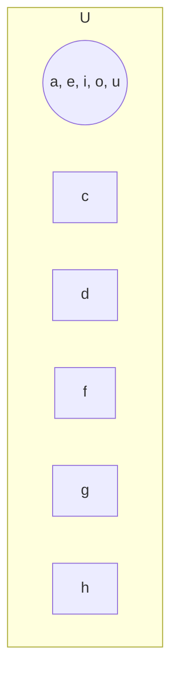
3. 
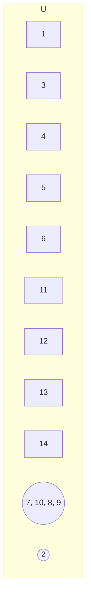
4. (i) A = {1, 2, 3, 4, 5, 6}, B = {1, 3, 5}
(ii) U = {2, 4, 5, 6, 7, 8, 9, 10, 13}, A = {7, 13}, B
(iii) X = {1, 3, 5, 7, 9}, Y = { }
5. 
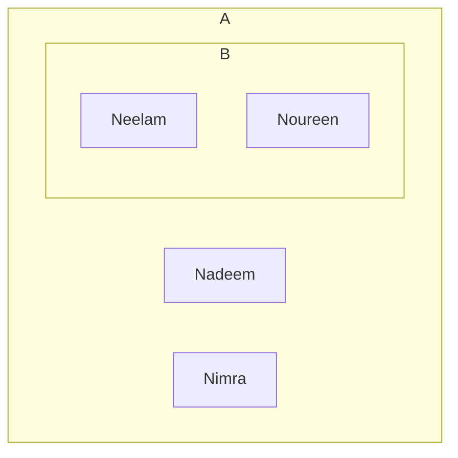

### Review Exercise 5

1. (i) a (ii) b (iii) a (iv) c (v) b (vi) d (vii) c (viii) b (ix) a (x) x
3. (i) Activity based (ii) B = Set of negative whole numbers (iii) {school diary}
4. { }, {1}, {2}, {1, 2}, {8}, {1, 8}, {2, 8}, {1, 2, 8}
5. U = {0, 1, 2, 3, 4, 5, 6, 7, 8, 9, 10, 11, 12},
A = {1, 2, 3, 5, 7}, B = {2, 4, 6, 8, 9}
6. 
```mermaid
graph TD
    subgraph U
    A((9, 12, 18, 21, 27))
    B((1, 2, 5, 10))
    A --- 3 --- B
    A --- 6 --- B
    A --- 15 --- B
    26
    28
    29
    19
    20
    22
    23
    25
    24
    4
    7
    8
    10
    11
    13
    14
    16
    17
    end
```

### Exercise - 6.1

1. (i) 21, 25 (ii) 307, 317 (iii) 42, 49 (iv) -78, -76
2. (i) 25, 36, 49 (ii) 83, 81, 79 (iii) 24, 28, 32 (iv) 13, 21, 34

### Exercise - 6.2

1. (i) n + 6 = 20 (ii) n - 27 = 5 (iii) 4n < 7 (iv) 2n > 25
2. (i) False (ii) True (iii) True (iv) False (v) False
3. (i) 18 (ii) 6 (iii) 400 (iv) $\frac{3}{10}$ (v) $\frac{15}{22}$
4. (i) C = 9, 0 ; V = n (ii) C = 7, 2, 9, V = p
(iii) C = $\frac{1}{3}$, V = xy (iv) C = 7, 4, 9, V = i
(v) C = 8, V = m, n (vi) C = 9, -37, V = x, y

### Exercise - 6.3

1. (i) 3a + 8 (ii) 5p - 5 (iii) 5a $\div$ 8b (iv) 4 ny or n (4y) (v) Rs. 170n
2. (i) 2n (ii) n (iii) n - 3
3. (i) n ; 3 (ii) 2n ; 6m (iii) lmn (iv) 4xy, 6y, -5 (v) ab, 2
4. (i) 4, 3 (ii) 23 (iii) $\frac{2}{5}$ (iv) 1, 85 (v) 15, 81
5. 
<table>
  <thead>
    <tr>
        <th></th>
        <th>Constant</th>
        <th>Variable</th>
        <th>Coefficient</th>
    </tr>
  </thead>
  <tbody>
    <tr>
        <td>i</td>
        <td>1</td>
        <td>a</td>
        <td>8</td>
    </tr>
    <tr>
        <td>ii</td>
        <td>-4</td>
        <td>a, b</td>
        <td>3, 2</td>
    </tr>
    <tr>
        <td>iii</td>
        <td>0</td>
        <td>p, q</td>
        <td>1</td>
    </tr>
    <tr>
        <td>iv</td>
        <td>C</td>
        <td>xy</td>
        <td>a, b</td>
    </tr>
    <tr>
        <td>v</td>
        <td>C</td>
        <td>a, b</td>
        <td>3, 4</td>
    </tr>
  </tbody>
</table>
6. 3a, 5a, 9a, 76a
21m, 4m
8p, 3p
2s
8l
7. (i) x + y (ii) 6a (iii) 4x - y (iv) p + pq + q + r (v) 12a<sup>2</sup> + 3b<sup>2</sup> (vi) $\frac{1}{y} + \frac{2}{x} + \frac{3}{2}$ (vii) 2xy + yz + 4zx (viii) 9x + 6x<sup>2</sup>
8. (25g + 27b), (23g + 30b), 48g + 57b
9. 75b, 53f, 114c


184 | Answers
NOT FOR SALE-PESRP

### Exercise - 6.4

1. (i) $5x$ (ii) $11p + 13q$ (iii) $15a$ (iv) $30xy$
(v) $98pq + 2qr + 23rs$ (vi) $15xy + 6pq + 54$ (vii) $13x + 10y + 5z$

2. (i) $11p - q$ (ii) $\frac{6}{7}a + \frac{1}{3}b$ (iii) $15xy + 11yz$
(iv) $38x + 11y - 8z$ (v) $13p + 14q - r + 10$ (vi) $5q + 13r$

3. (i) $12a - 23b$ (ii) $13xy - 7z$ (iii) $9x - 5y + 4z$
(iv) $-\frac{2}{3}\ell - \frac{2}{5}m + 14$ (v) $-49\ell - 11m + 8n$

4. (i) $-x + 5y - 12z$ (ii) $2(3x - 3yz)$ (iii) $6m + 2n - 2$
(iv) $13p - 4q + 7r$

5. $p + 2q + 3r$ 6. $8x + 8y + 8z + 8$ 7. $3x + 7y + 5z$

### Exercise - 6.5

1. (i) $8x + 3y$ (ii) $a$ (iii) $3a + 42\frac{1}{3}b$ (iv) $4x + 7a$
(v) $a + b$ (vi) $4x - 11y + 2z$

2. $8b + (12b - 3b) + (20b - 2b)$, Total bags of sweets = 35 bags.

3. (i) $-5$ (ii) $-76$ (iii) $\frac{85}{14}$ (iv) $62$
(v) $\frac{7}{12}$ (vi) $\frac{9}{8}$ 4. $-336$ 5. $29$

### Review Exercise 6

1. (i) c (ii) b (iii) b (iv) a (v) a (vi) a (vii) b (viii) d (ix) a (x) c

3. (i) $23x - 6y - 4z$ (ii) $22xy + 2zy + zx$

4. (i) $2x + y + 1$ (ii) $-2x - 4y - 2z + 3$

5.
<table>
  <thead>
    <tr>
        <th></th>
        <th>Coefficient</th>
        <th>Variable</th>
        <th>Constant</th>
    </tr>
  </thead>
  <tbody>
    <tr>
        <td>a</td>
        <td>a, b</td>
        <td>p, q</td>
        <td>-</td>
    </tr>
    <tr>
        <td>b</td>
        <td>2.5, $\frac{1}{3}$</td>
        <td>x, y</td>
        <td>14</td>
    </tr>
    <tr>
        <td>c</td>
        <td>13, q</td>
        <td>p, q</td>
        <td>5</td>
    </tr>
  </tbody>
</table>

6. (i) $17p + 2q$ (ii) $4xy + 7yz + 4zx - 30$ 7. $12x - 4y + 8z$

8. (i) $7p + q - 10r + 45s$ (ii) $-14x - 8y + 12$ (iii) $5x - y - 8$

9. $24$ 10. $36, 49$

### Exercise - 7.1

1. (i) $4(9) + 4 = 40$ (ii) $2(4) - 2 = 6$ (iii) $2n - 3 = 20$
(iv) $\frac{1}{2}x + 6 = 22$ (v) $3(6) \div 3 = 6$ (vi) $x + 7 = 14$

3. {i, ii, iv, vii, xi} are expressions
{iii, v, vi, viii, ix and x} are equations

### Exercise - 7.2

1. i, iii, iv are linear equation

2. (i) $n + 8 = 18$ (ii) $y - 7 = 14$
(iii) $(x + 1) + (x + 2) = 29$ (iv) $4n = 2n + 23$

3. (i) $12$ (ii) $7$ (iii) $5$ (iv) $35$ (v) $15$ (vi) $15\frac{2}{3}$

4. $4$ 5. $5$ 6. $20$ 7. $9$ 8. $90$

9. $37$ 10. $30$ years 11. $80$ and $120$ 12. $43, 560$ kg

### Review Exercise 7

1. (i) b (ii) b (iii) a (iv) a (v) b (vi) a (vii) c (viii) a (ix) a (x) b

2. (i) $-15$ (ii) $4$ (iii) $10$ (iv) $4\frac{1}{2}$ (v) $-3.5$ (vi) $-\frac{41}{560}$

3. (i) $-10$ (ii) $0.98$ (iii) $1\frac{7}{20}$ (iv) $1$ (v) $\frac{3}{4}$ (vi) $9$

4. $13$ 5. $47$ years 6. $60$ and $40$

### Exercise - 8.1

1. (i) $14.8$ cm (ii) $13$ cm (iii) $16$ cm (iv) $14$ cm

2. (i) $A = 18$ cm$^2$, $P = 16$ cm (ii) $A = 16$ cm$^2$, $P = 16$ cm
(iii) $A = 14$ cm$^2$, $P = 18$ cm (iv) $A = 5$ cm$^2$, $P = 12$ cm

3. $A = 45000$ mm, $P = 860$ mm 4. $12.25$ m 5. $30$ cm, $32$ cm

6. $32$ cm 7. $36$ km$^2$ 8. Rs. $14400$ 9. Rs. $11000$

10. (i) $96$ cm$^2$ (ii) $44$ cm$^2$, $1$ cm$^2$ (iii) $24$ cm$^2$

11. Rs. $163500$ 12. $264$ m$^2$

### Exercise - 8.2

1. (i) $\overline{BC}$ (ii) $\overline{RS}$ and $\overline{PT}$ (iii) $\overline{AF}$ and $\overline{CE}$

2. (i) $24$ cm$^2$ (ii) $50$ cm$^2$ (iii) $18$ cm$^2$ (iv) $25$ cm$^2$
(v) $12$ cm$^2$ (vi) $25$ cm$^2$

3. (i) $3.2$ cm (ii) $57$ cm$^2$ (iii) $49$ cm$^2$

4. $14$ cm 5. $11$ cm 6. $7$ cm 7. $55$ cm 8. $49500$ flowers

### Exercise - 8.3

1. (i) $60$ cm$^3$, $96$ cm$^2$ (ii) $729$ cm$^3$, $486$ cm$^2$ (iii) $5145$ mm$^3$, $8470$ mm$^2$

2. (i) $352$ cm$^2$, $448$ cm$^3$ (ii) $9.5$ cm$^2$, $580$ cm$^3$
(iii) $3$ cm, $948$ cm$^3$ (iv) $0.5$ cm, $56$ cm$^2$
(v) $9$ cm, $990$ cm$^2$ (vi) $17$ m, $4913$ m$^3$
(vii) $11$ m, $726$ cm$^2$

3. $25000$ m$^3$ 4. $3375$ 5. $2400$ cm$^2$ 6. $90$ m$^3$

7. $598.5$ m$^3$ 8. $1248$ cm$^2$ 9. Rs. $3800$

### Review Exercise 8

1. (i) c (ii) c (iii) c (iv) b (v) a (vi) d (vii) b (viii) b (ix) c (x) b (xi) c (xii) c (xiii) b (xiv) b (xv) a (xvi) a (xvii) c (xviii) a (xix) a

3. (i) $16$ cm$^2$ (ii) $17$ cm$^2$ (iii) $12$ cm$^2$

4. (i) $34$ cm, $30$ cm$^2$ (ii) $33$ cm 7. $25$ cm$^2$

5. Momina 6. Rs. $121,500$ 8. Rs. $60,000$ 9. $180$ cm$^3$ 10. $70$ sheets 11. $510$ square feet

### Exercise - 9.1

1. (i) Cuboid (ii) Cone (iii) Sphere (iv) Cube (v) Cylinder (vi) Hemisphere

2.
<table>
  <thead>
    <tr>
        <th></th>
        <th>1-D</th>
        <th>2-D</th>
        <th>3-D</th>
    </tr>
  </thead>
  <tbody>
    <tr>
        <td>Line</td>
        <td>Square, rectangle triangle</td>
        <td>Cube, cuboid cylinder</td>
        <td></td>
    </tr>
  </tbody>
</table>


Answers | 185
NOT FOR SALE-PESRP

3. (i) Surfaces = 3, Vertices = 0, Edges = 2
(ii) Surfaces = 6, Vertices = 8, Edges = 12
(iii) Surfaces = 6, Vertices = 8, Edges = 12
(iv) Surfaces = 1, Vertices = 1, Edges = 1
(v) Surfaces = 1, Vertices = 0, Edges = 1

# Exercise - 9.2

1. (i) Parallel lines
(ii) Intersecting lines
(iii) Intersecting lines
(iv) Parallel lines
(v) Intersecting lines
(vi) Intersecting lines

2. (i) $a = 30^\circ, b = 150^\circ, c = 150^\circ$
(ii) $r = 120^\circ, p = q = 60^\circ$

3. (i) $d$ and $f$, $b$ and $h$, $a$ and $g$, $c$ and $e$, $m$ and $i$, $\ell$ and $o$, $n$ and $j$, $k$ and $p$
(ii) $d$ and $e$, $a$ and $h$, $m$ and $k$, $n$ and $\ell$
(iii) $f$ and $b$, $c$ and $g$, $i$ and $o$, $j$ and $p$

4. (i) $x = 80^\circ$
(ii) $x = 120^\circ$
(iii) $x = 23$
(iv) $x = 22.5$
(v) $x = 80^\circ$

# Exercise - 9.3
Activity based

# Review Exercise 9

1. (i) c (ii) b (iii) b (iv) d (v) c (vi) c (vii) b (viii) d (ix) b (x) d

4. (i) $x = 34^\circ$
(ii) $247^\circ$

5. Activity based

# Exercise - 10.1
Activity based

# Exercise - 10.2
Activity based

# Exercise - 10.3

1. (i) $54^\circ$ (ii) $92^\circ$ (iii) $48^\circ$
2. No
3. $83^\circ, 63^\circ$ and $34^\circ$
4. (i) $x = 132^\circ, y = 35^\circ$
(ii) $x = 57^\circ, y = 43^\circ$
(iii) $x = 15^\circ, y = 156^\circ$
(iv) $68^\circ$
5. (i) $129^\circ$ (ii) $130^\circ$ (iii) $87^\circ$
6. Each interior angle=$60^\circ$, Each exterior angle=$120^\circ$
7. $60^\circ$

# Review Exercise 10

1. (i) d (ii) a (iii) b (iv) c (v) c (vi) c (vii) c (viii) c (ix) c (x) c (xi) c
7. (i) $90^\circ$ (ii) $x = 60^\circ, y = 40^\circ$

# Exercise - 11.1

2. (i) Ungrouped (ii) Grouped (iii) Grouped (iv) Ungrouped
3. (i) Discrete variable (ii) Continuous variable (iii) Discrete variable (iv) Continuous variable (v) Continuous variable (vi) Discrete variable
4. Continuous

# Exercise - 11.2

1. **Horizontal Bar Graph**
<table>
  <thead>
    <tr>
        <th>Month</th>
        <th></th>
        <th>Number of fans</th>
    </tr>
  </thead>
  <tbody>
    <tr>
        <td>April</td>
        <td>40</td>
        <td></td>
    </tr>
    <tr>
        <td>May</td>
        <td>60</td>
        <td></td>
    </tr>
    <tr>
        <td>June</td>
        <td>30</td>
        <td></td>
    </tr>
    <tr>
        <td>July</td>
        <td>20</td>
        <td></td>
    </tr>
    <tr>
        <td>August</td>
        <td>50</td>
        <td></td>
    </tr>
    <tr>
        <td>September</td>
        <td>10</td>
        <td></td>
    </tr>
  </tbody>
</table>
**Scale:**
x-axis: Each large square box = 10 student.
y-axis: Each rectangular bar shows number a month.

2. **Vertical bar graph**
<table>
  <thead>
    <tr>
        <th>Days of a week</th>
        <th></th>
        <th>Number of student</th>
    </tr>
  </thead>
  <tbody>
    <tr>
        <td>Monday</td>
        <td>20</td>
        <td></td>
    </tr>
    <tr>
        <td>Tuesday</td>
        <td>25</td>
        <td></td>
    </tr>
    <tr>
        <td>Wednesday</td>
        <td>15</td>
        <td></td>
    </tr>
    <tr>
        <td>Thursday</td>
        <td>30</td>
        <td></td>
    </tr>
    <tr>
        <td>Friday</td>
        <td>10</td>
        <td></td>
    </tr>
    <tr>
        <td>Saturday</td>
        <td>20</td>
        <td></td>
    </tr>
  </tbody>
</table>
**Scale:**
x-axis: Each large square box = 10 student
y-axis: Each rectangular bar shows a day

3. **Vertical bar graph**
<table>
  <thead>
    <tr>
        <th>Name of student</th>
        <th></th>
        <th>Amount (Rs)</th>
    </tr>
  </thead>
  <tbody>
    <tr>
        <td>Ahmed</td>
        <td>60</td>
        <td></td>
    </tr>
    <tr>
        <td>Humaira</td>
        <td>40</td>
        <td></td>
    </tr>
    <tr>
        <td>Sobia</td>
        <td>50</td>
        <td></td>
    </tr>
    <tr>
        <td>Afshan</td>
        <td>30</td>
        <td></td>
    </tr>
    <tr>
        <td>Aleezy</td>
        <td>80</td>
        <td></td>
    </tr>
    <tr>
        <td>Rabia</td>
        <td>20</td>
        <td></td>
    </tr>
    <tr>
        <td>Arslan</td>
        <td>70</td>
        <td></td>
    </tr>
    <tr>
        <td>Saima</td>
        <td>40</td>
        <td></td>
    </tr>
  </tbody>
</table>
**Scale:**
x-axis: Each rectangular bar shows a student
y-axis: Each large square box=Rs.10

4. **Vertical bar graph**
<table>
  <thead>
    <tr>
        <th>Name of student</th>
        <th></th>
        <th>Amount (Rs) - T-shirt (Yellow)</th>
        <th>Amount (Rs) - Dress shirt (Orange)</th>
    </tr>
  </thead>
  <tbody>
    <tr>
        <td>Monday</td>
        <td>60</td>
        <td>40</td>
        <td></td>
    </tr>
    <tr>
        <td>Tuesday</td>
        <td>70</td>
        <td>50</td>
        <td></td>
    </tr>
    <tr>
        <td>Wednesday</td>
        <td>80</td>
        <td>60</td>
        <td></td>
    </tr>
    <tr>
        <td>Thursday</td>
        <td>90</td>
        <td>30</td>
        <td></td>
    </tr>
    <tr>
        <td>Friday</td>
        <td>50</td>
        <td>70</td>
        <td></td>
    </tr>
    <tr>
        <td>Saturday</td>
        <td>30</td>
        <td>80</td>
        <td></td>
    </tr>
    <tr>
        <td>Sunday</td>
        <td>70</td>
        <td>90</td>
        <td></td>
    </tr>
  </tbody>
</table>
**Scale:**
x-axis: Each yellow rectangular bar represent T-shirt and orange bar represent dress shirts
y-axis: Each large square box = 10 shirts


186 | Answers
NOT FOR SALE-PESRP

6. (i) 80 (ii) almond (iii) 140 (iv) A

### Exercise - 11.3

1. He must be happy because the end of term result is better
2. English: 75 Science: 60 Mathematics: 90 Urdu: 30 Islamiat: 45
3. (i) likes: 3,300, comments: 2100, Inbox message: 420, shares: 180
(ii) 1200 (iii) 3,120 (iv) 420
4. (i) [The image shows a pie chart with the following sections: Parents, Teachers, Ticket selling, Dressing up day, Charity walk]
(ii) [The image shows a pie chart with the following sections: Merit, Distinction, Fail, Pass]

### Exercise - 11.4

1. (i) 11.86 (ii) 15.4 kg (iii) 20.4 m (iv) 6.8 (v) 282 km (vi) 39.4°C
2. 25 pages
3. 66.4 marks
4. $k = 36.7$
5. 
<table>
  <thead>
    <tr>
        <th></th>
        <th>(i)</th>
        <th>(ii)</th>
        <th>(iii)</th>
        <th>(iv)</th>
        <th>(v)</th>
        <th>(vi)</th>
    </tr>
  </thead>
  <tbody>
    <tr>
        <td>Mode</td>
        <td>no mode</td>
        <td>no mode</td>
        <td>no mode</td>
        <td>no mode</td>
        <td>no mode</td>
        <td>42.6</td>
    </tr>
    <tr>
        <td>Median</td>
        <td>10</td>
        <td>14</td>
        <td>19</td>
        <td>7.75</td>
        <td>250</td>
        <td>40.3</td>
    </tr>
  </tbody>
</table>
6. 18
7. 30.05

### Review Exercise 11

1. (i) d (ii) a (iii) c (iv) b (v) b (vi) b (vii) d (viii) c (ix) d
3. (i) grouped data (ii) Ungrouped data
4. Activity based
5. (i) Model town, 41,500 people (ii) 18,750 more people
(iii)
<table>
  <thead>
    <tr>
        <th>Name of town</th>
        <th>Walk</th>
        <th>Train</th>
        <th>Bus</th>
    </tr>
  </thead>
  <tbody>
    <tr>
        <td>Model town</td>
        <td>6,000</td>
        <td>14,000</td>
        <td>8,500</td>
    </tr>
    <tr>
        <td>Awan town</td>
        <td>2,500</td>
        <td>11,250</td>
        <td>15,000</td>
    </tr>
  </tbody>
</table>

6. 
> **Scale:**
> x-axis: Each large square box represent 5 students.
> y-axis: Each green bar represent a class.

**Horizontal bar graph**
[The image shows a horizontal bar graph representing "Number of students" on the x-axis (scale 5 to 40) and "Classes" on the y-axis (1 to 7). The bars represent the following approximate values:]
<table>
  <thead>
    <tr>
        <th>Class (y-axis)</th>
        <th>Number of students (x-axis)</th>
    </tr>
  </thead>
  <tbody>
    <tr>
        <td>1</td>
        <td>15</td>
    </tr>
    <tr>
        <td>2</td>
        <td>25</td>
    </tr>
    <tr>
        <td>3</td>
        <td>35</td>
    </tr>
    <tr>
        <td>4</td>
        <td>20</td>
    </tr>
    <tr>
        <td>5</td>
        <td>30</td>
    </tr>
    <tr>
        <td>6</td>
        <td>40</td>
    </tr>
    <tr>
        <td>7</td>
        <td>25</td>
    </tr>
  </tbody>
</table>

7. 
> **Scale:**
> x-axis: Each orange bar represents the weeks.
> y-axis: Each large square box represents 50 bedsheets.

**Vertical bar graph**
[The image shows a vertical bar graph representing "Weeks" on the x-axis (1st to 6th) and "Number of bedsheets" on the y-axis (0 to 400). The bars represent the following approximate values:]
<table>
  <thead>
    <tr>
        <th>Weeks (x-axis)</th>
        <th>Number of bedsheets (y-axis)</th>
    </tr>
  </thead>
  <tbody>
    <tr>
        <td>1st</td>
        <td>150</td>
    </tr>
    <tr>
        <td>2nd</td>
        <td>200</td>
    </tr>
    <tr>
        <td>3rd</td>
        <td>300</td>
    </tr>
    <tr>
        <td>4th</td>
        <td>250</td>
    </tr>
    <tr>
        <td>5th</td>
        <td>350</td>
    </tr>
    <tr>
        <td>6th</td>
        <td>400</td>
    </tr>
  </tbody>
</table>

8. 
> **Key**
> First student: [Yellow square]
> Second student: [Pink square]

**Multiple bar graph**
[The image shows a multiple bar graph representing "Days of the week" on the x-axis and "Pocket money" on the y-axis (0 to 100). The bars represent the following approximate values:]
<table>
  <thead>
    <tr>
        <th>Days of the week</th>
        <th>First student (Yellow)</th>
        <th>Second student (Pink)</th>
    </tr>
  </thead>
  <tbody>
    <tr>
        <td>Monday</td>
        <td>60</td>
        <td>40</td>
    </tr>
    <tr>
        <td>Tuesday</td>
        <td>70</td>
        <td>80</td>
    </tr>
    <tr>
        <td>Wednesday</td>
        <td>50</td>
        <td>65</td>
    </tr>
    <tr>
        <td>Thursday</td>
        <td>85</td>
        <td>45</td>
    </tr>
    <tr>
        <td>Friday</td>
        <td>80</td>
        <td>55</td>
    </tr>
    <tr>
        <td>Saturday</td>
        <td>100</td>
        <td>50</td>
    </tr>
  </tbody>
</table>

### Exercise - 12.1

1. (i) $\frac{1}{5}$
2. (i) $\frac{1}{6}$ (ii) 0 (iii) $\frac{1}{12}$
3. (i) $\frac{1}{4}$ (ii) $\frac{1}{2}$ (iii) $\frac{1}{2}$ (iv) $\frac{1}{4}$
4. (i) $\frac{1}{12}$ (ii) $\frac{1}{12}$
5. (i) {HHH, HHT, HTH, THH, HTT, THT, TTH, TTT} (ii) $\frac{3}{8}$
6. $\frac{11}{36}$ and $\frac{11}{36}$
7. $\frac{459}{10000}$ or 0.0459
8. $\frac{1}{2}$
9. $\frac{35}{143}$

### Review Exercise 12

1. (i) b (ii) b (iii) a (iv) c (v) a (vi) a (vii) c (viii) c (ix) c (x) b
3. $\frac{1}{4}$
4. $\frac{1}{36}$
5. equally likely $\frac{1}{2}$


Answers 187
NOT FOR SALE-PESRP

# GLOSSARY

**Absolute Value:** The positive distance from zero to any number on the number line is called absolute value.

**Algebraic Equation:** An algebraic equation is an open mathematical sentence which contains an equal sign i.e

**Area:** The size of surface or amount of surface covered by any closed shape is called area.

**Altitude:** The altitude is measure of the shortest distance between the base and its top.

**Bar Graph:** A bar graph is a graphical display of data using of different heights.

**BODMAS:** BODMAS, stands for brackets, order of operation, multiplication division, addition and subtraction.

**Cube:** A 3-dimensional solid body bounded by six square surfaces is known as cube.

**Cuboid:** A 3-dimensional solid body bounded by six rectangular surfaces is known as cuboid.

**Cylinder:** A 3-dimensional solid body with two circular surfaces of equal radius and one curved surface between them is known as cylinder.

**Cone:** A 3-dimensional solid body with one circular surface and a slanting surface is known as cone.

**Data:** Data is a collection of any information or facts.

**Empty Set:** A set which does not contain any element is called empty set.

**Even Numbers:** Even number is a number which is multiple of 2.

**Factor:** A factor is a number which divide the dividend completely leaving no remainder.

**Grouped Data:** The data which is given in intervals / groups, it provides us the information about groups it is known as grouped data.

**Graph:** A graph is a diagram representing a system of interrelation among two or more things by a number of lines, pictures distinctive dots and bars etc.

**Set:** A set is a collection of well defined and distinct objects.

**Finite Set:** A set having a finite number of elements is known as finite set.

**Infinite Set:** A set having unlimited number of elements is known as finite set.

**Singleton Set:** A set which contains only one element is called singleton set.

**Subset:** A subset is a set which contain in another set.

**Superset:** A superset is a set which contain another set.

**Subset:** A proper subset of a set A is subset of A which is not equal to set A.

**Improper Subset:** Improper subset is a subset which contains all the elements of original set.

**Natural Numbers:** Natural numbers are counting numbers. 1, 2, 3, ..., are all natural numbers.

**Continued Ratio:** The comparison among three or more quantities is called continued ratio.

**Rate:** A rate is a special kind of ratio in which the two terms are in different units.

**Universal set:** A universal set is a collection of all elements or members of all related sets known as subsets of universal set.

**Venn diagram:** A diagram that represent the possible logical relationship between finite collection of sets pictorially.

**Pattern:** A pattern is a some phenomenon that repeats regularly based on a set rule or condition.

**Parallel lines:** Two or more lines which extends in the same directions and remain the same distance apart.

**Intersecting lines:** Two lines that are intersecting each other at a single point is called intersecting lines.

**Point of intersection:** The point where two lines are intersecting each other.

**Perpendicular lines:** Two or more lines that meet or intersect each other at right angle.

**Transversal:** A line that passes through two or more of the parallel lines.

**Vertically opposite angles:** When two lines intersect at a point then opposite angles formed because of intersection.

**Symmetry:** A line that divide an object into two identical pieces.

**Reflective symmetry:** If a shape or pattern is reflected in a mirror line or line of symmetry then this type of symmetry is called reflective symmetry.

**Rotational symmetry:** If a shape is rotated about a point to another position and still look the same then the shape has rotational symmetry.

**Order of symmetry:** Number of times a shape looks the same in one full turn is called order of symmetry.

**Centre of rotation:** A find point around which the rotation occurs is called the centre of rotation.

**Acute angle:** An angle which is less than 90°.

**Right angle:** An angle which is equal to 90°.

**Obtuse angle:** An angle which is greater than 90° but less than 180°.

**Straight angle:** An angle which is equal to 180°.

**Reflex angle:** An angle which is greater than 180° but less than 360°.

**Complete angle:** An angle which is equal to 360°.

**Complementary angles:** If the sum of two angles is equal to 90°, then angles are complementary angles.

**Supplementary angle:** If the sum of two angles is 180°, then the angles are supplementary angles.

**Equilateral triangle:** A triangle with all three sides are equal.

**Isosceles triangle:** A triangle with 2 equal sides.

**Scalene triangle:** A triangle with all three sides are different.

**Acute triangle:** A triangle with all three interior angles are acute angles.

**Obtuse triangle:** A triangle with one interior angle is obtuse angle.


188 | Glossary
**NOT FOR SALE-PESRP**

# INDEX

<table>
  <tbody>
    <tr>
        <td>Factors</td>
        <td>7,8,9</td>
        <td>Parentheses</td>
        <td>40,41</td>
        <td>Intersecting</td>
        <td>131,132</td>
    </tr>
    <tr>
        <td>Multiples</td>
        <td>12,13,15</td>
        <td>Braces</td>
        <td>40,41</td>
        <td>Perpendicular</td>
        <td>130,131</td>
    </tr>
    <tr>
        <td>Fun Facts</td>
        <td>2,7</td>
        <td>Curly brackets</td>
        <td>42,43</td>
        <td>Rotational symmetry</td>
        <td>136,137</td>
    </tr>
    <tr>
        <td>Note</td>
        <td>21,23,24</td>
        <td>Square brackets</td>
        <td>40,43</td>
        <td>Graph</td>
        <td>138,139</td>
    </tr>
    <tr>
        <td>Remember</td>
        <td>27,34,35</td>
        <td>Order of preferences</td>
        <td>41,42</td>
        <td>Vertical bar graph</td>
        <td>164,165</td>
    </tr>
    <tr>
        <td>Thinking time</td>
        <td>51,52,73</td>
        <td>Expressions</td>
        <td>42,43</td>
        <td>Horizontal bar graph</td>
        <td>165,166</td>
    </tr>
    <tr>
        <td>Challenge</td>
        <td>79,94,95</td>
        <td>Fractions</td>
        <td>43,44</td>
        <td>Mean</td>
        <td>173,174</td>
    </tr>
    <tr>
        <td>Interesting information</td>
        <td>131,161</td>
        <td>Decimals</td>
        <td>43,44</td>
        <td>Median</td>
        <td>173,174</td>
    </tr>
    <tr>
        <td>Prime numbers</td>
        <td>4,5</td>
        <td>Rate</td>
        <td>45,46</td>
        <td>Mode</td>
        <td>178,179</td>
    </tr>
    <tr>
        <td>Composite numbers</td>
        <td>5,6,7</td>
        <td>Ratio</td>
        <td>49,50</td>
        <td>Experiment</td>
        <td>179,180</td>
    </tr>
    <tr>
        <td>History</td>
        <td>6,20</td>
        <td>Percentage</td>
        <td>49,50</td>
        <td>Sample space</td>
        <td>76,77</td>
    </tr>
    <tr>
        <td>Project</td>
        <td>22,34,35</td>
        <td>Antecedent</td>
        <td>50,51</td>
        <td>Proper subset</td>
        <td>76,77</td>
    </tr>
    <tr>
        <td>Indices</td>
        <td>9,182</td>
        <td>Consequent</td>
        <td>50,51</td>
        <td>Improper subset</td>
        <td>76,77</td>
    </tr>
    <tr>
        <td>Go online</td>
        <td>182,183</td>
        <td>Simplification</td>
        <td>51,52</td>
        <td>Linear equation</td>
        <td>96,97</td>
    </tr>
    <tr>
        <td>Division</td>
        <td>3,7,8</td>
        <td>Continued ratio</td>
        <td>53,54</td>
        <td>Area</td>
        <td>107,108</td>
    </tr>
    <tr>
        <td>Multiplication</td>
        <td>20,33,34</td>
        <td>Activity</td>
        <td>54,55</td>
        <td>Perimeter</td>
        <td>107,108</td>
    </tr>
    <tr>
        <td>Addition</td>
        <td>34,39</td>
        <td>Percentage as fraction</td>
        <td>55,56</td>
        <td>Volume</td>
        <td>107,108</td>
    </tr>
    <tr>
        <td>Subtraction</td>
        <td>42,45</td>
        <td>Comparison</td>
        <td>49,50</td>
        <td>Surface area</td>
        <td>106,107</td>
    </tr>
    <tr>
        <td>Highest Common Factors (HCF)</td>
        <td>50,51</td>
        <td>Percentage increase</td>
        <td>59,60</td>
        <td>Rectangle</td>
        <td>108,109</td>
    </tr>
    <tr>
        <td>Least Common Multiples (LCM)</td>
        <td>52,184</td>
        <td>Percentage decrease</td>
        <td>60,61</td>
        <td>Square</td>
        <td>109,110</td>
    </tr>
    <tr>
        <td>Relationship between HCF and LCM</td>
        <td>15,16</td>
        <td>Set</td>
        <td>69,70</td>
        <td>Altitude</td>
        <td>113,114</td>
    </tr>
    <tr>
        <td>Summary</td>
        <td>18,26</td>
        <td>Descriptive form</td>
        <td>71,72</td>
        <td>Trapezium</td>
        <td>117,118</td>
    </tr>
    <tr>
        <td>Integers</td>
        <td>26,27</td>
        <td>Tabular form</td>
        <td>71,72</td>
        <td>Isosceles</td>
        <td>115,116</td>
    </tr>
    <tr>
        <td>Natural Numbers</td>
        <td>70,71</td>
        <td>Empty set</td>
        <td>73,74</td>
        <td>Scalene</td>
        <td>115,116</td>
    </tr>
    <tr>
        <td>Whole Numbers</td>
        <td>70,75</td>
        <td>Singleton set</td>
        <td>73,74</td>
        <td>Reflective symmetry</td>
        <td>136,137</td>
    </tr>
    <tr>
        <td>Number line</td>
        <td>21,22</td>
        <td>Equal set</td>
        <td>73,74</td>
        <td>Bisector</td>
        <td>142,143</td>
    </tr>
    <tr>
        <td>Absolute value</td>
        <td>23,24</td>
        <td>Equivalent set</td>
        <td>73,74</td>
        <td>Perpendicular bisector</td>
        <td>142,143</td>
    </tr>
    <tr>
        <td>Ascending order</td>
        <td>23,24</td>
        <td>Cardinal number</td>
        <td>74,75</td>
        <td>Line segment</td>
        <td>143,144</td>
    </tr>
    <tr>
        <td>Descending order</td>
        <td>25,26</td>
        <td>Subset</td>
        <td>74,75</td>
        <td>Ray</td>
        <td>158,159</td>
    </tr>
    <tr>
        <td>Numerical value</td>
        <td>23,24</td>
        <td>Sequence</td>
        <td>81,82</td>
        <td>Angle bisector</td>
        <td>158,159</td>
    </tr>
    <tr>
        <td>Like integers</td>
        <td>27,28</td>
        <td>Variable</td>
        <td>84,85</td>
        <td>Acute</td>
        <td>144,145</td>
    </tr>
    <tr>
        <td>Unlike integers</td>
        <td>27,28</td>
        <td>Constant</td>
        <td>86,87</td>
        <td>Obtuse</td>
        <td>144,145</td>
    </tr>
    <tr>
        <td>Sum of integers</td>
        <td>27,28</td>
        <td>Terms of algebraic expression</td>
        <td>86,87</td>
        <td>Data</td>
        <td>161,162</td>
    </tr>
    <tr>
        <td>Universal subset</td>
        <td>75,76</td>
        <td>Coefficients</td>
        <td>87,88</td>
        <td>Statistics</td>
        <td>163,164</td>
    </tr>
    <tr>
        <td>Finite set</td>
        <td>73,74</td>
        <td>Like terms</td>
        <td>87,88</td>
        <td>Probability</td>
        <td>178,179</td>
    </tr>
    <tr>
        <td>Infinite set</td>
        <td>73,74</td>
        <td>Unlike terms</td>
        <td>87,88</td>
        <td>Grouped</td>
        <td>91,162</td>
    </tr>
    <tr>
        <td>Venn diagram</td>
        <td>76,77</td>
        <td>Evaluation</td>
        <td>91,92</td>
        <td>Ungrouped</td>
        <td>162,163</td>
    </tr>
    <tr>
        <td>Pattern</td>
        <td>81,82</td>
        <td>Linear expression</td>
        <td>98,99</td>
        <td>Continuous</td>
        <td>162,163</td>
    </tr>
    <tr>
        <td>Subtraction of integers</td>
        <td>29,30</td>
        <td>Cube</td>
        <td>107,108</td>
        <td>Discrete</td>
        <td>162,163</td>
    </tr>
    <tr>
        <td>Commutative law of addition</td>
        <td>32,33</td>
        <td>Cuboid</td>
        <td>108,109</td>
        <td>Multiple bar graph</td>
        <td>164,165</td>
    </tr>
    <tr>
        <td>Multiplication of integers</td>
        <td>34,35</td>
        <td>Vertices</td>
        <td>129,130</td>
        <td>Pie chart</td>
        <td>170,171</td>
    </tr>
    <tr>
        <td>Division of integers</td>
        <td>36,37</td>
        <td>Edges</td>
        <td>129,130</td>
        <td>Events</td>
        <td>177,178</td>
    </tr>
    <tr>
        <td>Commutative law of multiplication</td>
        <td>37,38</td>
        <td>Symmetry</td>
        <td>131,132</td>
        <td>Compound</td>
        <td>180,181</td>
    </tr>
    <tr>
        <td>Associative law of multiplication</td>
        <td>37,38</td>
        <td>2-dimensional figures</td>
        <td>130,131</td>
        <td>Simple</td>
        <td>180,181</td>
    </tr>
    <tr>
        <td>Distributive law of multiplication</td>
        <td>39,40</td>
        <td>3-dimensional figures</td>
        <td>132,133</td>
        <td>Probability formula</td>
        <td>180</td>
    </tr>
    <tr>
        <td>BODMAS rule</td>
        <td>40,41</td>
        <td>Cylinder</td>
        <td>130,131</td>
        <td>Equally likely event</td>
        <td>180,181</td>
    </tr>
    <tr>
        <td>Vinculum</td>
        <td>40,41</td>
        <td>Hemisphere</td>
        <td>131,132</td>
        <td>Not equally likely event</td>
        <td>180,181</td>
    </tr>
    <tr>
        <td></td>
        <td></td>
        <td>Cone</td>
        <td>129,130</td>
        <td></td>
        <td></td>
    </tr>
    <tr>
        <td></td>
        <td></td>
        <td>lines</td>
        <td>131,132</td>
        <td></td>
        <td></td>
    </tr>
    <tr>
        <td></td>
        <td></td>
        <td>Parallel</td>
        <td>131,132</td>
        <td colspan="2"></td>
    </tr>
  </tbody>
</table>


Index | 189
NOT FOR SALE-PESRP

# Mathematical Symbols / Notatoins

<table>
  <thead>
    <tr>
        <th>Symbol 	[thead]	Name 	[thead]	Symbol 	[thead]	Name</th>
        <th></th>
    </tr>
  </thead>
  <tbody>
    <tr>
        <td>=	equal to	×	multiplication</td>
        <td></td>
    </tr>
    <tr>
        <td>≠	not equal to	÷	division</td>
        <td></td>
    </tr>
    <tr>
        <td>&gt;	greater than</td>
        <td>|	absolute value</td>
    </tr>
    <tr>
        <td>&lt;	less than	⇒	meterial implication</td>
        <td></td>
    </tr>
    <tr>
        <td>≤	less than or equal to	∀	for all</td>
        <td></td>
    </tr>
    <tr>
        <td>≥	greater than or equal to	{ }	set brackets</td>
        <td></td>
    </tr>
    <tr>
        <td>+	addition	$\phi$	empty set</td>
        <td></td>
    </tr>
    <tr>
        <td>-	subtraction	$\in$	belongs to</td>
        <td></td>
    </tr>
    <tr>
        <td>$\subseteq$	subset	$\notin$	does not belong to</td>
        <td></td>
    </tr>
    <tr>
        <td>$\subset$	proper subset	( )	parenthese</td>
        <td></td>
    </tr>
    <tr>
        <td>$\supseteq$	superset	$\parallel$	parallel</td>
        <td></td>
    </tr>
    <tr>
        <td>$\perp$	perpendicular	$\approx$	approximately equal to</td>
        <td></td>
    </tr>
    <tr>
        <td>%	percentage	$\pi$	pi</td>
        <td></td>
    </tr>
    <tr>
        <td>$\angle$	angle	U	universal set</td>
        <td></td>
    </tr>
    <tr>
        <td>:	ratio</td>
        <td></td>
    </tr>
  </tbody>
</table>

# Reference Books

* Common core standards for middle school Mathematics by Amitra Schwols, Kathleen Dempsey and John Kendall.
* The praxis study companion middle school Mathematics by ETS.
* Oxford new syllabus Mathematics 7<sup>th</sup> edition published by Oxford University press.
* New additional Mathematics by Ho so thong, Khor Nyak Hiong published by EPB PAN PACIFIC.
* CBSE Mathematics for grade - 6. Written by R. C. Yadav.
* Principal of Mathematical analysis by Walter Rudin. 3<sup>rd</sup> edition.
* Mathematics 6 published by PTB published in 2018.
* Mathematics 10 - AJK textbook board written by Mr. Waqas Ahmed published in 2017.
* Math Mammoth-Grade-6. A work text south African version written by Maria Miller.
* Solution for all Mathematics Grade-6, Learner's Book illustrations and design macmillan South Africa (pty) Ltd, 2012, and written by Kaasief Hassan, Connie Skelton and Sari Smit.


190 | Mathematical Symbols
**NOT FOR SALE-PESRP**