Full page cover design for Computer Science 7 textbook

# COMPUTER
# SCIENCE

# 7

Based on **Single National Curriculum 2022**

Collage of technology images including a robotic hand touching a human hand over a keyboard, a keyboard with a "Cyber Ethics" key, an ICT interface, and industrial robotic arms

**Cyber**
**Ethics**

Punjab Curriculum and Textbook Board logo

**Punjab Curriculum and Textbook Board, Lahore**

بِسْمِ اللهِ الرَّحْمٰنِ الرَّحِيْمِ

(In the Name of Allah, the Most Compassionate, the Most Merciful.)

# 7 COMPUTER SCIENCE

Illustration of colorful curved glass tiles

Digital wireframe of a dinosaur on a tablet screen

Person wearing a VR headset in a futuristic interface

AI concept illustration with a hand touching a digital globe

3D printer creating a model of a human heart

Based on Single National Curriculum 2022

ONE NATION, ONE CURRICULUM

Punjab Curriculum and Textbook Board logo

# PUNJAB CURRICULUM AND TEXTBOOK BOARD, LAHORE

This textbook is based on Single National Curriculum 2022 and has been approved by the Board.

**All rights are reserved with the Punjab Curriculum and Textbook Board, Lahore.**
No part of this textbook can be copied, translated, reproduced or used for preparation of test papers, guidebooks, keynotes and helping books.

# Contents

<table>
  <thead>
    <tr>
        <th>Unit</th>
        <th>Topic</th>
        <th>Page</th>
    </tr>
  </thead>
  <tbody>
    <tr>
        <td>1</td>
        <td>Emerging Technologies</td>
        <td>1</td>
    </tr>
    <tr>
        <td>2</td>
        <td>Digital Skills</td>
        <td>16</td>
    </tr>
    <tr>
        <td>3</td>
        <td>Computational Thinking</td>
        <td>43</td>
    </tr>
    <tr>
        <td>4</td>
        <td>Programming</td>
        <td>57</td>
    </tr>
    <tr>
        <td>5</td>
        <td>Digital Citizenship</td>
        <td>81</td>
    </tr>
    <tr>
        <td>6</td>
        <td>Entrepreneurship in Digital Age</td>
        <td>96</td>
    </tr>
    <tr>
        <td> </td>
        <td>Answers</td>
        <td>110</td>
    </tr>
  </tbody>
</table>

Web Version of PCTB Textbook Not for Sale watermark

**Author**

Jahanzaib Khan
Subject Specialist (Computer Science)
Punjab Curriculum and Textbook Board, Lahore

**Review Committee**

* **Abdul Hameed**
  Associate Professor (Computer Science)
  Govt. Shalimar Graduate College, Lahore
* **Waqas Ali Khan**
  Computer Instructor
  FGEI (C/G), Lahore, Cantt
* **Rabia Anwar**
  Associate Lecturer
  University of Central Punjab, Lahore
* **Kashif Shahzad**
  SST (Computer Science)
  Govt. Muslim H/S No.2, Civil Lines, Lahore

**Dy Director (Graphics)**

Anjum Wasif

**Director Manuscripts**

Farida Sadiq

**Design & Layout**

Aleem Ur Rehman

**Supervision**

Jahanzaib Khan
SS (Computer Science)

**Composing**

Umair Tariq

**illustration**

Ayat Ullah

Experimental Edition

# UNIT 1 Emerging Technologies

**Students Learning Outcomes**

After completing this unit students will be able to:
* Define and apply the following emerging technologies:
    - Robotics
    - Artificial intelligence
    - self-driving cars
    - 3D printing
    - virtual reality & augmented reality
    - 3D and holographic imaging
* Recognize the progression in various technologies (e.g. 1<sup>st</sup> generation computer processors to 12<sup>th</sup> generation computer processors etc).
* Describe the application and impact of emerging technologies.
* Identify different I/O ports of a computer system (USB port, Type-C port, HDMI port, SATA port, PCI-express port, etc.)
* Identify different peripherals of a computer system (e.g. graphic card, printers, scanners, mouse, keyboard, webcams etc.)
* Identify and describe the applications of different peripherals.

## 1.1 Emerging Technology

The term emerging technology is generally used to describe a new technology, it may also refer to the advancement in existing technology. The development of emerging technologies also refers to technical, institutional and social changes.

Illustration of a hand holding a digital globe representing IOT and emerging technologies

Fig. 1.1 Emerging Technologies

**Important characteristics of emerging technology**

* Innovation
* Fast growth
* Consistency
* Prominent impact

Emerging technologies have created new opportunities and challenges, related to copyrights, patents, and licensing etc.

**Some Examples of are:** Robotics, Artificial intelligence, self-driving cars, 3D printing, virtual reality & augmented reality and 3D and holographic imaging etc.

<page_number>1</page_number>

**Extra Bit!**

Interdisciplinary studies involve the combination of two or more disciplines into one activity.

## 1.2 Robotics

Photograph of a humanoid robot interacting with a digital interface

Fig. 1.2 Robot

Robotics is an Interdisciplinary branch of computer science and mechanical engineering that involves the design, manufacture, operation and use of robots. The goal of the robotics is to create intelligent machines that can assist humans in a various ways. Robots are mostly used in manufacturing industries, medical field, agriculture, military and in entertainment etc.

**Do you Know?**

The word robotics was derived from the word robot and the word robot comes from the Slavic word robota, which means work/job

## 1.3 Artificial Intelligence (AI)

AI icon over a digital brain graphic

Fig. 1.3 Artificial Intelligence

Artificial intelligence refers to technologies that make device act and think like a human. Voice recognition and decision-making are features of human intelligence that artificial intelligence may possess.

## 1.4 Self-driving cars

Interior view of a self-driving car

Fig. 1.4 Self Driven Car

A self-driving car, also known as robotic car that is capable of sensing its environment and moving safely with little or no human input. Many companies such as Google, and Tesla have been developing and using self-driven cars for several years.

## 1.5 3D printing

Photograph of a 3D printer creating a red heart model

Fig. 1.5 Picture of 3D Printing

Three-dimensional (3D) printing is a process that creates a three-dimensional physical object from a digital design. 3D printers may also be called additive manufacturing printers or fabrication printers.

<page_number>2</page_number>

A person wearing a VR headset interacting with a virtual interface

Fig. 1.6 Virtual Reality

## 1.6 Virtual Reality

Virtual Reality (VR) is a technology that enables a person to interact with an artificial three-dimensional visual or other sensory environment. VR technology is widely used in medical and manufacturing industries.

## 1.7 Augmented Reality

Augmented Reality (AR) is the integration of real-world environment and computer-generated content. Unlike Virtual Reality (VR), AR users experience a real-world environment with generated information overlaid on top of it. AR plays an important role in medical science.

A person holding a tablet showing a virtual living room overlaid on a real space

Fig. 1.7 Augmented Reality

3D glasses with red and blue lenses

Fig. 1.8 3D image

## 1.8 3D Imaging

3D imaging is a process of creating a three-dimensional image on a two-dimensional surface. In recent years, 3D imaging has become important in industrial and consumer applications.

## 1.9 Holographic imaging

A hologram is a three-dimensional image, created with photographic projection. Unlike 3D or virtual reality on a two-dimensional computer display, a hologram is a truly three-dimensional and free-standing image.

A holographic dinosaur appearing above a tablet screen

Fig. 1.9 Holographic image

> **Do you Know?**
>
> The term hologram is taken from the Greek words holos (whole) and gramma (message).

## 1.10 Computer Ports

Diagram of a computer tower showing various ports: Serial Port, Display Port, USB Type-A, HDMI, Power, and Ethernet Port

Fig. 1.10 Computer Ports

A port is a physical point or a jack provided on a computer using which an external device can be connected to the computer. It acts as an interface or a point of attachment between computer and external devices. It can also be a point through which information flows from a program to the computer or over the Internet. Some of the computer ports are discussed below:

<page_number>3</page_number>

# Important Information

## 12th Gen Intel Core processor lineup

<table>
  <thead>
    <tr>
        <th>CPU Part Number</th>
        <th>CPU Category</th>
        <th>Processor Cores (PE)</th>
        <th>Processor Threads</th>
        <th>Intel® Smart Cache (L3)</th>
        <th>Processor Base Power (W)</th>
        <th>Single P-core Turbo Freq</th>
        <th>Single E-core Turbo Freq</th>
        <th>GFX Execution Units</th>
        <th>PCHS</th>
    </tr>
  </thead>
  <tbody>
    <tr>
        <td>Intel® Core i9 - 12900E Processor</td>
        <td>IOT</td>
        <td>16 (8+8)</td>
        <td>24</td>
        <td>30 MB</td>
        <td>65</td>
        <td>Up to 5 GHz</td>
        <td>Up to 3.8 GHz</td>
        <td>32 EU</td>
        <td>Intel H610 chipset<br/>Intel H610E chipset</td>
    </tr>
    <tr>
        <td>Intel Core i9 - 12900TE Processor</td>
        <td>IOT</td>
        <td>16 (8+8)</td>
        <td>24</td>
        <td>30 MB</td>
        <td>35</td>
        <td>Up to 4.8 GHz</td>
        <td>Up to 3.6 GHz</td>
        <td>32 EU</td>
        <td>Intel H610 chipset<br/>Intel H610E chipset</td>
    </tr>
    <tr>
        <td>Intel Core i9 -12900 Processor</td>
        <td>Mainstream</td>
        <td>16 (8+8)</td>
        <td>24</td>
        <td>30 MB</td>
        <td>65</td>
        <td>Up to 5 GHz</td>
        <td>Up to 3.8 GHz</td>
        <td>32 EU</td>
        <td>Intel H610 chipset<br/>Intel H610E chipset</td>
    </tr>
    <tr>
        <td>Intel Core i7 - 12700E Processor</td>
        <td>IOT</td>
        <td>12 (8+4)</td>
        <td>20</td>
        <td>25 MB</td>
        <td>65</td>
        <td>Up to 4.8 GHz</td>
        <td>Up to 3.6 GHz</td>
        <td>32 EU</td>
        <td>Intel H610 chipset<br/>Intel H610E chipset</td>
    </tr>
    <tr>
        <td>Intel Core i7 - 12700TE Processor</td>
        <td>IOT</td>
        <td>12 (8+4)</td>
        <td>20</td>
        <td>25 MB</td>
        <td>35</td>
        <td>Up to 4.6 GHz</td>
        <td>Up to 3.6 GHz</td>
        <td>32 EU</td>
        <td>Intel H610 chipset<br/>Intel H610E chipset</td>
    </tr>
    <tr>
        <td>Intel Core i7 -12700 Processor</td>
        <td>Mainstream</td>
        <td>12 (8+4)</td>
        <td>20</td>
        <td>25 MB</td>
        <td>65</td>
        <td>Up to 4.8 GHz</td>
        <td>Up to 3.6 GHz</td>
        <td>32 EU</td>
        <td>Intel H610 chipset<br/>Intel H610E chipset</td>
    </tr>
    <tr>
        <td>Intel® Core™ i5-12500E Processor</td>
        <td>IOT</td>
        <td>6 (6+0)</td>
        <td>12</td>
        <td>18 MB</td>
        <td>65</td>
        <td>Up to 4.5 GHz</td>
        <td>Up to 3.6 GHz</td>
        <td>32 EU</td>
        <td>Intel H610 chipset<br/>Intel H610E chipset</td>
    </tr>
    <tr>
        <td>Intel® Core™ i5-12500TE Processor</td>
        <td>IOT</td>
        <td>6 (6+0)</td>
        <td>12</td>
        <td>18 MB</td>
        <td>35</td>
        <td>Up to 4.3 GHz</td>
        <td>-</td>
        <td>32 EU</td>
        <td>Intel H610 chipset<br/>Intel H610E chipset</td>
    </tr>
    <tr>
        <td>Intel® Core™ i5 - 12500 Processor</td>
        <td>Mainstream</td>
        <td>6 (6+0)</td>
        <td>12</td>
        <td>18 MB</td>
        <td>65</td>
        <td>Up to 4.6 GHz</td>
        <td>-</td>
        <td>32 EU</td>
        <td>Intel H610 chipset<br/>Intel H610E chipset</td>
    </tr>
    <tr>
        <td>Intel® Core™ i5 - 12400 Processor</td>
        <td>Mainstream</td>
        <td>6 (6+0)</td>
        <td>12</td>
        <td>18 MB</td>
        <td>65</td>
        <td>Up to 4.4 GHz</td>
        <td>-</td>
        <td>24 EU</td>
        <td>Intel H610 chipset<br/>Intel H610E chipset</td>
    </tr>
    <tr>
        <td>Intel® Core i3 - 12100E Processor</td>
        <td>IOT</td>
        <td>4 (4+0)</td>
        <td>8</td>
        <td>12 MB</td>
        <td>60</td>
        <td>Up to 4.2 GHz</td>
        <td>-</td>
        <td>24 EU</td>
        <td>Intel H610 chipset<br/>Intel H610E chipset</td>
    </tr>
    <tr>
        <td>Intel® Core i3 - 12100TE Processor</td>
        <td>IOT</td>
        <td>4 (4+0)</td>
        <td>8</td>
        <td>12 MB</td>
        <td>35</td>
        <td>Up to 4.0 GHz</td>
        <td>-</td>
        <td>24 EU</td>
        <td>Intel H610 chipset<br/>Intel H610E chipset</td>
    </tr>
    <tr>
        <td>Intel® Core i3 - 12100 Processor</td>
        <td>Mainstream</td>
        <td>4 (4+0)</td>
        <td>8</td>
        <td>12 MB</td>
        <td>60</td>
        <td>Up to 4.3 GHz</td>
        <td>-</td>
        <td>24 EU</td>
        <td>Intel H610 chipset<br/>Intel H610E chipset</td>
    </tr>
  </tbody>
</table>

<page_number>4</page_number>

# 1.10.1 USB port

USB (Universal Serial Bus) is a plug and play interface that allows a computer to communicate with peripheral and other devices. Today, it has replaced PS/2 connectors, game ports, serial and parallel ports, etc. Examples of peripherals that are connected via USB include computer keyboards and mice, video cameras, printers, portable media players, mobile (portable) digital telephones, disk drives, and network adapters.

USB ports and connector

Fig. 1.11 USB

<table>
  <thead>
    <tr>
        <th colspan="4">USB Specifications - Versions</th>
        <th>Do you Know?</th>
    </tr>
    <tr>
        <th>Version</th>
        <th>Known Name</th>
        <th>Year Introduced</th>
        <th>Date Rate</th>
        <th>Power Capabilities</th>
    </tr>
  </thead>
  <tbody>
    <tr>
        <td>USB v1.1</td>
        <td>N/A</td>
        <td>1998</td>
        <td>12Mbps</td>
        <td>150mA @ 5V, 0.75 Watts</td>
    </tr>
    <tr>
        <td>USB v2.0</td>
        <td>High-Speed-USB</td>
        <td>2000</td>
        <td>480Mbps</td>
        <td>500mA @ 5V, 2.5 Watts</td>
    </tr>
    <tr>
        <td>USB v3.0</td>
        <td>Super-Speed USB</td>
        <td>2008</td>
        <td>5Gbps</td>
        <td>1.5A @ 5V, 7.5 Watts</td>
    </tr>
    <tr>
        <td>USB v3.1</td>
        <td>SuperSpeed+USB</td>
        <td>2013</td>
        <td>10Gbps</td>
        <td>20A @ 5V, 12V, 20V - 100 Watts</td>
    </tr>
  </tbody>
</table>

# 1.9.2 Type-C port

It is the latest design of the USB port that comes with 24 pins. It can handle a current of 3A. It is also used in devices for fast charging. One of the distinguishing features of this port is that it has no up or down orientation, which means you don't need to flip the male connecter over to plug it in the USB port.

Type-C Port close-up

Fig. 1.12 Type-C Port

**Do you Know?**

Thunderbolt 3 and USB-C features diagram

<page_number>5</page_number>

### 1.9.3 HDMI port

HDMI stands for "High Definition Media Interface" is a digital interface developed to connect high definition devices such as digital cameras, LED's and gaming consoles, etc., to computers with HDMI ports. The advanced version of HDMI, can transfer video signals of up to a resolution of 4096x2160.

Photograph of an HDMI port on a device

Fig. 1.13 HDMI port

Diagram showing HDMI connections between a gaming console, media player, projector, display device, and soundbar

### 1.9.4 SATA port

SATA stands for Serial Advanced Technology Attachment. It is also known as Serial ATA or SATA. It enables storage devices, such as hard drives and optical drives, to communicate with the motherboard using a high-speed serial cable over two pairs of conductors. We can plug our hard drives in and out of the ports without switching off your computer which makes it a very efficient and durable connector to connect your external hard drives to the motherboard.

Illustration of two SATA ports labeled SATA6G_3 and SATA6G_4

Fig. 1.14 SATA Ports

**SATA Data Pinout**
1. **GND** Ground
2. **A+** Transmit
3. **A-** Transmit
4. **GND** Ground
5. **B-** Receive -
6. **B+** Receive +
7. **GND** Ground

Diagram of a 7-pin SATA Data Connector
SATA Connector

Technical drawing of a Serial ATA (SATA) Connector showing data and power connections
Serial ATA (SATA) Connector

Diagram of a 15-pin SATA Power Connector pinout
**Power pin 1**
<table>
    <tr>
        <th>pin1</th>
        <th></th>
    </tr>
    <tr>
        <td></td>
        <td>+3.3VDC</td>
    </tr>
    <tr>
        <td></td>
        <td>+3.3VDC</td>
    </tr>
    <tr>
        <td></td>
        <td>+3.3VDC</td>
    </tr>
    <tr>
        <td></td>
        <td>COM</td>
    </tr>
    <tr>
        <td></td>
        <td>COM</td>
    </tr>
    <tr>
        <td></td>
        <td>COM</td>
    </tr>
    <tr>
        <td></td>
        <td>+5 VDC</td>
    </tr>
    <tr>
        <td></td>
        <td>+5 VDC</td>
    </tr>
    <tr>
        <td></td>
        <td>+5 VDC</td>
    </tr>
    <tr>
        <td></td>
        <td>COM</td>
    </tr>
    <tr>
        <td></td>
        <td>COM</td>
    </tr>
    <tr>
        <td></td>
        <td>COM</td>
    </tr>
    <tr>
        <td></td>
        <td>+12 V1 DC</td>
    </tr>
    <tr>
        <td></td>
        <td>+12 V1 DC</td>
    </tr>
    <tr>
        <td>**15**</td>
        <td>+12 V1 DC</td>
    </tr>
</table>

<page_number>6</page_number>

## 1.9.5 Express port

PCI stands for "Peripheral Component Interconnect". It is also known as PCIe. It is an interface standard for connecting high-speed components with your computer system. Every desktop PC has a number of PCIe slots. You can use PCIe to add GPUs (video cards, graphics cards), Wi-Fi cards or SSD cards in your computer.

Photograph of PCIe x1 and PCIe x16 slots on a motherboard

Fig. 1.15 PCIe ports

## Difference between GPU and CPU Architecture

CPU architecture diagram showing a few large cores GPU architecture diagram showing thousands of small cores

<table>
  <thead>
    <tr>
        <th>CPU</th>
        <th>GPU</th>
    </tr>
  </thead>
  <tbody>
    <tr>
        <td>* CPU stands for Central Processing Unit</td>
        <td>* GPU stands for Graphics Processing Unit</td>
    </tr>
    <tr>
        <td>* CPUs have few strong cores</td>
        <td>* GPUs have thousands of weaker cores</td>
    </tr>
    <tr>
        <td>* Suited for serial workloads</td>
        <td>* Suited for parallel workloads</td>
    </tr>
    <tr>
        <td>* Quick access to System Memory (RAM)</td>
        <td>* Can only access vRAM quickly</td>
    </tr>
  </tbody>
</table>

## 1.10 Peripherals Devices

Peripheral device are also known as Peripheral, computer peripheral or input/output device. Peripherals are commonly divided into three kinds: input devices, output devices, and storage devices.

An **input device** is any hardware device that sends data to a computer, allowing you to interact with and control it.

An **output device** is a piece of computer hardware that receives data from a computer and then translates it into audio, visual, textual, or hard copy such as a printed document.

Let us study some of computer peripheral here:

<page_number>7</page_number>

Keyboard Mouse Joystick Trackball
Scanner Touchscreen Webcam Microphone

Fig. 1.16 Computer Peripheral

## 1.10.1 Mouse

A mouse is a small input device which is used to control the movement of the cursor on the computer screen. It also allows users to move and select folders, text, files, and icons on a computer. Mouse is put on a hard-flat surface to use. When the users move the mouse, a pointer called cursor moves in the same direction on the display screen.

Almost every mouse has three buttons, left, right and scroll on it. These buttons are used for manipulating any objects and text as well. A mouse uses a laser or LED light to control the movement on the screen.

Mouse

Fig. 1.17 Mouse

## Uses of Mouse

A mouse is capable of performing various functions on a computer, Some of them are as follows:
**Move the mouse pointer:** The main function of a mouse is to move the mouse cursor on the screen in the desired direction.

**Select:** A mouse provides the option to select the text, file, or folder and many files at once.

**Open a program:** You can open a folder, icon, or other objects using mouse. To open a file, folder, or an icon you are required to move the cursor over it then double click on the object that you want to open or execute.

**Drag-and-drop:** When you select something, it can also be moved from one place to another using the drag-and-drop method. In this method, first, you need to highlight the file or an object that you want to move. Then, move this file while pressing the mouse button and drop it on the desired location.

**Hovering:** When you move the mouse pointer on any object, hover changes the color of links, and by clicking on that link, you can go on the destination page.

**Scroll Up & Down:** If you are working on a large document, you need to scroll up or down a page. Scroll button of the mouse helps to up and down your document page.

**Combination Activities:** A mouse can be used in many combination activities like, Ctrl + Mouse click can be used for the hyperlink in new windows.

<page_number>8</page_number>

# 1.10.2 Keyboard

Keyboard is the most common and very popular input device. It helps to input data into the computer. The layout of the keyboard is like that of traditional typewriter, although there are some additional keys provided for additional functions.

Keyboards are of two sizes 84 keys or 101/102 keys, but now keyboards with 104 keys or 108 keys are also available.

Diagram of a standard computer keyboard layout

Fig. 1.18 Keyboard

## Components of Keyboard

Computer keyboards exist in a variety of styles and configurations; however the fundamental parts of all keyboards are the same. A standard computer keyboard is composed of the following components:

* Typing keys
* Control Keys
* Function keys
* Navigation keys
* Numeric Keys

## Typing keys

These keys include letter, number, punctuation, and symbol keys found on a traditional keyboard.

## Control keys

These keys are used alone or in combination with other keys to perform certain actions. The most frequently used control keys are Ctrl, Alt, the Windows logo key and Esc.

## Function keys

The function keys are used to perform specific tasks. They are labeled as F1, F2, F3, and so on, up to F12. The functionality of these keys varies from program to program.

## Navigation keys

These keys are used for moving around in documents or webpages and editing text. They include the arrow keys, Home, End, Page Up, Page Down, Delete, and Insert.

## Numeric keypad

The numeric keypad is handy for entering numbers i.e 0-9 quickly. The keys are grouped together in a block like a conventional calculator or adding machine.

<page_number>9</page_number>

Diagram of a computer keyboard showing Typing keys, Function keys, Control keys, Navigation keys, and Numeric keypad

## 1.10.3 Printers

A printer is an output device that prints on paper. Printers print text documents, images, or a combination of both. The two most common types of printers are inkjet and laser printers. Laser printers are a typical choice for businesses as well as individuals.

## Types of Printers

There are several types of printers available today. Some of them are discussed below: decorative icon

### Inkjet Printers

Photograph of an inkjet printer

Fig. 1.24 Inkjet Printers

Inkjet printers recreate a digital image by spraying ink on paper. These printers are mostly used as personal printers.

### Laser Printers

Laser printers are used to create high-quality prints by passing a laser beam at a high speed over a negatively charged drum to create an image. Color laser printers are more often found in offices.

Photograph of a laser printer

Fig. 1.25 Laser Printer

### 3D Printers

Photograph of a 3D printer

Fig. 1.26 3D Printer

3D printers are a relatively new printer technology. 3D printing creates a physical object from a digital file. It works by adding layer upon layer of material until the print job is complete and the object is whole.

### LED Printers

LED printers are similar to laser printers but use a light-emitting diode array in the print head instead of a laser.

Diagram of an LED printer showing Photoreceptor Drum, Lens Array, Printhead, LED Board, and Control Chip
Fig. 1.27 LED Printer

<page_number>10</page_number>

## 1.10.4 Scanners

Scanner is an input device, which works like a photocopy machine. It is used when some information is available on paper and it is to be transferred in the computer for further manipulation.

Scanner captures images from the paper and converts them into a digital form that can be stored in computer. These images can be edited before they are printed.

photograph of a flatbed scanner

Fig. 1.28 Scanner

> **Do you Know?**
>

> The first scanner was the MS-200, created in 1984 by the company Microtek

## Properties of a Scanner

**Resolution**

One of the essential features of scanner is the resolution that it is capable of capturing. It is measured in dots per inch. More dots per inch mean high quality of scanning.

**Color depth**

The color depth is an important concept that refers to the number of bits needed for the representation of the color of each pixel. The higher the color depth, the more colors the scanner can capture.

**Recognition**

To scan a document, optical character recognition is essential. Computer must convert the file to a text document to identify alphanumeric characters. A scanner provides this facility.

## 1.10.5 Webcams

A webcam is a video camera attached to a computer to record or stream to the computer or computer network. They are primarily used for live streaming or social media. Many laptops have a webcam built in to their screen, but external webcams are also available. Webcam can be used for following purposes:

photograph of an external webcam

Fig. 1.29 Webcam

* Still Images

* Video Recodring

* Video Conferencing

<page_number>11</page_number>

## 1.10.6 Graphic Card

Graphics Card

Fig. 1.30 Graphics Card

A graphics card is an expansion card which generates output images to a display device, such as a computer monitor. A graphics card provides high-quality visual display by processing and executing graphical data using advanced graphical techniques, features and functions. A graphics card is also known as a graphics adapter, graphics controller, graphics accelerator card or graphics board.

A graphics card is primarily designed to remove the graphical processing tasks from the processor or RAM. It includes a dedicated graphical processing unit (GPU) and a dedicated RAM that helps it to process graphical data quickly.

> Web Version of PCTB Textbook
> Not for Sale

<page_number>12</page_number>

# Summary

* Emerging Technology refers new technology, it may also refer to the advancement in existing technology.

* Robotics is an Interdisciplinary branch of Computer Science and Mechanical Engineering that involves the design, manufacture, operation and use of Robots.

* Artificial intelligence refers to technologies that make device act and think like a human.

* A self-driving car is capable of sensing its environment and moving safely with little or no human input.

* Virtual Reality (VR) is a technology that enables a person to interact with an artificial three-dimensional visual or other sensory environment.

* Augmented Reality (AR) is the integration of real-world environment and computer-generated content.

* A hologram is a three-dimensional image, created with photographic projection.

* Three-dimensional (3D) printing is a process that creates a three-dimensional physical object from a digital design.

* A port is a physical point or a jack provided on a computer using which an external device can be connected to the computer.

* USB (Universal Serial Bus) is a plug and play interface that allows a computer to communicate with peripheral and other devices.

* Computer Peripherals are commonly divided into three kinds: input devices, output devices, and storage devices.

* Scanner is an input device which is used when some information is available on paper and it is to be transferred in the computer for further manipulation.

* A graphics card is an expansion card which generates output images to a display device, such as a computer monitor.

Web Version of PCTB Textbook Not for Sale watermark

<page_number>13</page_number>

Exercise logo

**Tick ($\checkmark$) the Correct Answer:**

1. Emerging Technology Includes:

* a. robotics
* b. Artificial intelligence
* c. Self-driven cars
* d. All

2. The goal of      is to make device act and think like human.

* a. Artificial Intelligence
* c. Virtual Reality

* b. 3D printing
* d. Augmented Reality

3. A self-driving is car, also known as:

* a. Robotic car
* b. Beautiful Car
* c. Automatic car
* d. Manual car

4.      is the integration of real-world environment and computer generated content.

* a. VR
* b. AR
* c. CR
* d. All

5. A three-dimensional image created with projection is called

* a. Telegrams
* b. histogram
* c. hologram
* d. Photogram

6. A      is a physical point on a computer using which an external device can be connected to the computer.

* a. Device
* b. Peripheral
* c. Port
* d. Drive

7. USB stands for:

* a. Unique Series Bus
* c. Universal State Bus

* b. Unique State Bus
* d. Universal Serial Bus

8. GPU is added in computer using:

* a. SATA
* b. USB
* c. HDMI
* d. PCIe

9. Computer peripheral are:

* a. Input devices
* b. Output devices
* c. Processing devices
* d. Both a and b

10. The devices which sends data to computer are known as:

* a. Input devices
* c. Output devices

* b. Processing devices
* d. Both a and b

**Briefly answer the following questions**

1. Discuss Robotics and its applications.

2. What is Artificial Intelligence? How is it helpful for humans?

3. Who does operate a self-driven cars ?

4. Differentiate between 2D and 3D printing.

5. Write down the functions of USB Port.

6. Differentiate between Type-C and HDMI ports.

7. What is usage of SATA port.

8. For which purpose do we use PCIe?

9. Discuss Computer Peripherals.

10. Differentiate between Hovering and scrolling.

11. Discuss printers and their types.

12. For which purposes do we use Scanner?

13. Discuss main properties of Scanner.

<page_number>14</page_number>

**Answer the following questions in detail**

1. Define Emerging Technology, discuss three real world examples.

2. What are Holographic imaging? Discuss its application.

3. Discuss Computer Ports and their types.

4. What is computer mouse? Discuss its functions.

5. Differentiate between Virtual Reality (VR) and Augmented Reality.

6. What is Keyboard? Discuss its main components.

7. What are the use of function keys in Keyboard?

**Write the functions of the following:**

1. HDMI port
2. Type-C Port
3. SATA Port
4. Graphic Card
5. Webcam

Web Version of PCTB Textbook Not for Sale watermark

**Activity Based Questions**

1. Make a chart of different Ports and display it in classroom.

2. Visit computer lab and identify different parts of computer that are in use.

3. Identify the application of following in real life and note down.

Illustration of a printer

Illustration of a humanoid robot interacting with digital interfaces

Illustration of a webcam

4. Students (Individual/Group) are to research any emerging technology of their choice and present their findings to the whole class.

5. Students will be asked to inspect a computer in the lab and identify the type of port that is in use

<page_number>15</page_number>

# UNIT 2 Digital Skills

## Students Learning Outcomes

* Describe the purpose of a word processor.
* Create and edit a document using any word processing software (e.g., MS Word, Google Docs, notepad, Open Office, etc.)
    * Open a new Word document and tinker with the user interface of the word processor (MS Word).
    * Add and modify the text (underline, bold, italicize, font style, font size, font color) to a document in the word processor (MS Word).
    * Save and open files in the word processor (MS Word).
    * Format a document in the word processor (MS Word) (text alignment, bullets, page margins, page layout, spacing, indent).
    * Insert, resize and add text in images in the document.
    * Cut, copy, and paste text/image into a document.
    * Use spell-check.
    * Create and modify numbered and bulleted lists.
    * Demonstrate understanding of the difference between Save and Save as.
    * Insert and format a table.
    * Add header, footer, and page numbers in a document.
    * Use thesaurus and synonym features.
    * Apply a procedure to print a document.
* Create a multimedia presentation by:
    * Adding new slides.
    * Adding various objects on the slides (image, text, video, audio, etc.)
    * Adding notes.
    * Creating a slideshow and an executable file.
    * Explain the importance of a presentation tool.
* Define the following terms:
    * email address
    * password
    * contacts
* Use an email service to create an email account.
* Create an electronic mail, with the appropriate subject line, content, and signature, adding in appropriate addressee, cc, bcc, and attachments.
* Send and receive emails with attachments.
* Organize emails using different folders/labels.
* Demonstrate ability to log in and log out from an email inbox.
* Demonstrate ability to use email as a means of authentication for another website login password.
* List the uses of electronic mail (e-mail).
* Identify and explain the common platforms for electronic mail.
* Create an e-mail address, and how to send electronic mail (tone, language, etc).
* Demonstrate the process of authentication.
* Demonstrate an appropriate use of email (signing out after usage etc).
* Explain standard email protocols like SMTP and POP3 and implications for those who use them.

<page_number>16</page_number>

# 2.1 The Purpose of a Word Processor

The word processor is one of the most-used computer applications in education. There are four primary functions of word processors which are:

Word Processors Software logos: Microsoft Word, WordPerfect, Dragon NaturallySpeaking, LibreOffice Writer, Scrivener, Google Docs, Ragtime

* Composing
* Editing
* saving
* printing

Microsoft Word logo

## 2.1.1 Word Processing Software

A word processor is a program that allows us to enter, format, save and print text. Text are words and numbers. Microsoft Word (MS Word) is a popular word-processing program used mainly for creating documents, such as brochures, letters, learning activities, quizzes, tests, and students' homework assignments.

Microsoft Word icon

## 2.1.2 Open a new Word Document

When creating new document in Word, you will often want to start with a new blank document. We have to follow the given steps to open new document in word.

1. Open Word. Or, if Word is already open, select File > New.

2. In the Search for online templates box, enter a search word like letter, resume, or invoice. Or, select a category under the search box like Business, Personal, or Education.

3. Click a template to see a preview.

4. Select Create.

Screenshot of Microsoft Word "New" document interface showing various templates like "Bold modern resume", "Modern chronological resume", and "Polished cover letter"

<page_number>17</page_number>

## 2.1.3 Interface of the Word Processor (MS Word).

Below given is the interface of a Microsoft Word 2016 document when opened.

Screenshot of Microsoft Word 2016 interface with labels for Quick Access Toolbar, Tabs, Title Bar, Help Button, Window Controls, Ribbon, Vertical Scroll Bar, Horizontal Scroll Bar, and Zoom in/out controls.

## 2.1.4 Adding and Modifying the Text (underline, bold, italicize, font style, font size, font color) to a Document in the Word Processor (MS Word)

Microsoft Word is a word processors software which offers many features which are not found in a traditional text editor or a plain-text file. Some of the most common features of Word includes changing the format (e.g., center), editing the font type, size, and color, inserting pictures, and much more.

Formatting that you apply to text is referred to as character formatting. In the Word document, you can apply character formatting. An individual character formatting includes font, font size, bold, italic, underline, strikethrough, subscript, superscript, font color, and highlight color. Font face can be used to change the shape of the text. This in other words mean that you can alter the handwriting. Font size can change the size of the font and text color can help changing the color of the text. To format any text in the Word document, we first need to select the text. Then we can format the text by using the tabs from the Home tab.

Close-up screenshot of the Microsoft Word Home tab ribbon showing Clipboard, Font, Paragraph, and Styles groups.

<page_number>

18
</page_number>

There are 3 types of Font styles on the home tab:

1. **Bold**: this makes the text appear thick and darker.

2. *Italics*: this makes the text slant towards one side.

3. <u>Underline</u>: this makes the text underlined with when selected.

## 2.1.5 Save and Open Files in the Word Processor (MS Word).

After writing text in the document, it is important to save it. This allows us to open it and use it later.

* To save, we go to the File tab and press save option or click save button on the quick access toolbar.

Screenshot of the MS Word "Save As" interface showing the file directory and save options.

* To open a saved file, we go to the File tab and click on Open button.

Screenshot of the MS Word "Open" interface showing recent documents and folders with dates.

<page_number>19</page_number>

# 2.1.6 Format a Document in the Word Processor

* **Text alignment**

One of the essential things about formatting text in any word processor is the ability to align the text. You need to align pieces of text to the left, to the right, or center it on the page. Microsoft Word lets you do that easily. To make things even simpler for you, we have created this guide which illustrates four different ways of aligning text in Word, both horizontally and vertically.

Screenshot of Microsoft Word Paragraph alignment options showing Left Align, Center Align, Right Align, and Justify

* **Page margins**

One of the first things that readers will notice when they see a document is the line spacing and margins. Not only that, but certain courses and citation styles call for certain formatting standards that determine what line spacing and margins you should use.

Margins are the blank spaces that lies on the top, bottom, and left and right sides of a document. They are important because they help make a document look neat and professional. To change margins, click on the Margins button, found on the Page Layout tab.

Screenshot of Microsoft Word Page Setup group under the Layout tab highlighting the Margins button

* **Page layout**

The Page Layout Tab lets you control the look and feel of your document in Microsoft Word. You can apply a global design to your document by using one of the available themes and color schemes. You can also change the document orientation, page size, margins, indentation, line spacing and paragraph settings (How to use them).

Screenshot of Microsoft Word Layout tab showing Page Setup and Paragraph groups with Orientation options (Portrait and Landscape) visible

<page_number>20</page_number>

### 2.1.7 Insert, Resize and Add Text in Images in the Document

1. Place your cursor where you want to insert the image. (This is an approximate placement. You can change the alignment with the text after inserting the images, as shown in the section below.)

2. Select the **Insert** tab.

3. Select the **Pictures** button in the Illustrations group.

4. Select the location of the image from the **Insert Picture From** menu

    * This Device lets you choose an image stored on your computer or network server.

    * Stock Images lets you choose stock images, icons, cutout people, stickers, and illustrations.

    * Online Pictures lets you search for images through Bing, Microsoft's search engine. This option also provides a link to OneDrive

5. Locate the image in the **Insert Picture** dialog box

6. Select the **Insert** button.

Screenshot of Microsoft Word interface showing the Insert tab, Pictures button, and the Insert Picture dialog box with numbered steps 2, 3, 4, and 6.

<page_number>

21
</page_number>

**Resize the image:**

* Select the image. A border with resizing handles will appear when the image is selected.

* Select one of the resizing handles and then drag the image to a new size.

**Align an Image with the Text in Microsoft Word**

1. Select the image.

2. Select the Layout Options button.

3. Select an option from the layout menu: In Line with Text, square, tight, through, top and bottom, behind text and In Front of Text.

## 2.1.8 Cut, Copy, and Paste Text/Image into a Document

**Cutting:** When you cut text or an image, you are removing it from its original location, which can be your current Word document or another editable location, such as Microsoft Excel or Google Docs. Once cut, it will be placed in the Clipboard, which is a temporary storage area on your computer.

**Copying:** When you copy text or an image, you are placing a duplicate in the Clipboard, but you are not removing it from its original location.

**Pasting:** After cutting or copying, you can then use the paste function to move the text or image from the Clipboard to a new location in your document.

**To Cut or Copy**

1. Select the text or image you want to cut or copy.

2. Press the keyboard shortcut;

    * Cut: **Ctrl + X**
    * Copy: **Ctrl + C**

Your text or image should now be cut or copied.

**To Paste**

1. Place your cursor where you want to insert the text or image.

2. Press the keyboard shortcut: **Ctrl + V**

Your text or image should now be pasted into the new location in your document.

**The ribbon method** requires more steps than the keyboard shortcuts; however, it offers more customization options for pasting.

**To Cut or Copy**

1. Select the text or image you want to cut or copy.

2. Select the **Home** tab in the ribbon.

3. Select cut/copy from clipboard group.

<page_number>22</page_number>

Microsoft Word Home tab ribbon screenshot

## 2.1.9 Use spell-check.

Spell check in Word is a useful built-in tool to proof your writing, it can be adjusted in several ways. You can spell check in Microsoft Word by using its built-in spelling and grammar checker.

* If enabled, it will automatically underline spelling and grammatical errors.

Microsoft Word Review tab ribbon screenshot showing Spelling & Grammar tool

* You can also open the Spelling & Grammar dialog box to manually check all of the spelling and grammar issues in a document at once shortcut key "F7" is used to check the grammatical errors.

## 2.1.10 Create and modify numbered and bulleted lists.

The difference between numbered list and a bulleted list in Microsoft word is that numbered list has the corresponding number associated with it or the current number of sentence that you are writing, whereas a bulleted list does not contain any numbers but only have plain bullets.

<table>
  <thead>
    <tr>
        <th>Create a numbered list</th>
        <th>Create a bulleted list</th>
    </tr>
  </thead>
</table>

Bulleted and numbered lists help to simplify steps or items to readers. We often use bulleted lists to highlight important pieces of our lessons. Manuals often include numbered lists to assist readers with step-by-step instruction.

A bullet is usually a black circle, but it can be any other symbol used to highlight items in a list. Use bullets to list items that do not have to be in any particular order.

Numbers—or letters—are used when information must be in a certain order. You can use the default bullets and numbering settings by clicking the appropriate button on the Formatting toolbar.

<page_number>23</page_number>

**To create a bulleted list:**

* Click the **Bullets button** on the **Formatting** toolbar.

* Type the first item on your list, and press **Enter**.

* The next line will begin automatically with a new bullet.

* Type the next item on your list, and press **Enter**.

* When your list is complete, press the Enter key **twice** to stop the bulleted list.

Screenshot of Microsoft Word Bullets menu

Screenshot of Microsoft Word Numbering Library menu

**To create a numbered list:**

1. Click the **Numbering button** on the **Formatting** toolbar.

2. Type the first item on your list, and press **Enter**.

3. The next line will begin automatically with the next number.

4. Type the next item on your list, and press **Enter**.

5. When your list is complete, press the Enter key **twice** to stop the numbered list.

## 2.1.11 Difference between Save and Save as

**1. Save:**

Save allows us to update the last saved version so that it will match with the current working version and that last saved work will be updated with the new work. Short cut key for Save is Ctrl+S or Shift+F12 or Alt+Shift+F2. It is frequently used to prevent losing changes because it goes on saving your updated work. So we can say Save is used to apply changes to your current file. So you can use Save when you do not want to change the name and location of the document.

**2. Save As:**

Save As allows us to save our work for the first time and also it will ask for in what name it will be saved and where it will be saved. Short cut key Save As is F12 or Alt+F+A. It is used to create a new file and/or preserve original file (Backup file). So, we can say Save As is used to apply changes on a new file. So, you can use Save As when you want to change the name, location, and format of the document.

<table>
  <thead>
    <tr>
        <th>SAVE</th>
        <th>SAVE AS</th>
    </tr>
  </thead>
  <tbody>
    <tr>
        <td>A Command in the File menu that stores the data back to the file and folder it originally came from</td>
        <td>A command in the File menu that allows to store a new file or to store the file in a new location</td>
    </tr>
    <tr>
        <td>Helps to prevent data loss and to update the lastly preserved file with the latest content</td>
        <td>Helps to store a new file or to store an existing file in a new location with the same name or with a different name</td>
    </tr>
    <tr>
        <td>Applies to a current file</td>
        <td>Can apply to a new file</td>
    </tr>
    <tr>
        <td>Has only one step</td>
        <td>Requires some additional steps</td>
    </tr>
    <tr>
        <td>Does not allow saving the file in some other format</td>
        <td>Allows the user to change File format</td>
    </tr>
  </tbody>
</table>

<page_number>24</page_number>

## 2.1.12 Insert and Format a Table.

The method is appropriate for most users who want to create a basic table for general use.

1. Place your cursor where you want to insert the table.

2. Select the **Insert** tab in the ribbon.

Screenshot of Microsoft Word Ribbon showing the Insert tab and Table button

3. Select the **Table** button in the Tables group.

4. Move your pointer across and down the grid to select the number of cells (organized as rows and columns) needed in your table.

5. The selected cells will turn orange. Click the selected (orange) part of the grid or press **Enter** on your keyboard to insert the table.

Screenshot of Microsoft Word Table drop-down menu with a 6x3 grid selection

## 2.1.13 Add Header, Footer and Page Numbers in a Document

In Microsoft Word, Headers and Footers are used to insert additional information such as title, file name, date and page numbers, etc. The presence of both header and footer in the Word document makes your document look more professional and easier to read as well as understand.

Headers appear at the top margin of the Word document, while Footers appear at the bottom margin of the Word document.

To insert a header and footer in Microsoft Word, follow the below given basic steps:

* Open the new or an existing Word document in which you want to insert header and footer.

* Go to the **Insert** tab at the top of the Ribbon.

Screenshot of Microsoft Word Ribbon showing Header, Footer, and Page Number options

* Click on either header or footer drop-down menu in the Header & Footer section.

## 2.1.14 Use Thesaurus and Synonym Features

The Thesaurus is a software tool that is used in the Microsoft Word document to look up (find)

<page_number>25</page_number>

synonyms (words with the same meaning) and antonyms (words with the opposite meaning) for the selected word.

Screenshot of Microsoft Word context menu showing Synonyms and Thesaurus options

Generally, the Thesaurus is used in the Word documents when we write an email, letter, project report, or research papers.

Open a new Word document or an existing Word document.

Type a new word or search a word from an existing document that you want for the Thesaurus.

Highlight the typed or selected word. A blue background will appear behind the word.

Right-click on the selected or typed word. A drop-down menu will appear on the screen. Place cursor on the Synonyms option. Click on the word that you think is best.

## 2.1.15 Apply a procedure to print a document.

The document in word can be printed easily provided with the fact that you have a printer attached to your device and its software installed in the system.

The following are the steps used to print a document:

* Open your Microsoft Word document by double clicking the file on your computer or going to File > Open... from the Microsoft Word app.

* With your document open, go to File > Print...

Screenshot of Microsoft Word Print settings menu

* Choose your printing options from the popup box that appears, and then click Print or OK.

## 2.2 Create a multimedia presentation

A multimedia presentation consists of a set of media objects, such as images, text objects, video clips, and audio streams. These are presented in accordance with various sequential constraints

Microsoft PowerPoint logo

specifying when the object should be presented, and spatial constraints specifying where the object should be presented on a screen. In modern world multimedia presentations range from the millions of PowerPoint presentations created by users world wide, to more sophisticated presentations that are authored using specialized tools. The easiest way to create a multimedia presentation is in Microsoft PowerPoint. You can

<page_number>26</page_number>

add in video, a soundtrack and also a reasonable degree of animation. The biggest advantage of making multimedia presentations in PowerPoint is that it is easy for anyone to be able to edit the presentation.

Screenshot of PowerPoint Home tab showing New Slide options

## 2.2.1 Adding new Slides.

The following are the steps to start working on presentation and to add the slide:

1. On the Home tab, click New Slide.

2. In the New Slide dialog box, select the layout that you want for your new slide.

3. Select Add Slide

## 2.2.2 Adding Various Objects on the Slides (image, text, video, audio, etc.)

The dynamic features of PowerPoint provide many ways to insert clip art, images, audio or graphic into a slide. You can import files saved in several different formats or add your own graphic or PowerPoint has its own gallery of Microsoft clip art images.

1. To insert a clipart, choose a slide layout that has a content placeholder.

2. Click the Insert Clip Art button in the placeholder.

**The following steps can be used to insert an object to the PowerPoint presentation:**

1. Click in the slide where you want to place an object.

2. On the Insert tab, in the Text group, click Object.

3. If the object does not already exist, click Create new.

4. To display the content in your presentation, clear the Display as icon check box.

Screenshot of PowerPoint Insert tab showing Tables and Images groups

## 2.2.3 Adding notes.

Power Point speaker notes help the speaker emphasize the main points during a presentation. Therefore, adding presenter simple notes to the PowerPoint slide makes it easier for the presenter to present. Using this method, there are multiple features to customize your PowerPoint notes further.

<page_number>27</page_number>

**1. Open the PowerPoint Presentation**

Open the PowerPoint presentation and under the PowerPoint menu bar, click the "View" > "Notes" button to add notes. Alternatively, you can also click the "Notes" button on the bottom of PowerPoint.

**2. Add Notes**

Click the "Click to add notes" section to input the speaker PowerPoint notes in the particular slide. There is no limit as to the number of notes to add.

Screenshot of PowerPoint View menu and comments pane

### 2.2.4 Creating a Slideshow and an executable file.

When you have completed your slides, press "F5" to start show from first slide. Use arrow keys for navigation.

To set up the Slideshow, select Slide Show > Set Up Slide Show and choose one of the following:

* Browsed by an individual (window): Run the slideshow automatically and inside a window. This option works best when you save the slideshow to a CD.

* Browsed at a kiosk (full screen): Run the slideshow automatically and at full-screen size. This option works best when you convert the slideshow to a video.

Select OK when you're finished.

**Add Timings to Each Slide in the Slideshow**

Now it's time to decide how long each slide will appear in the slideshow. To begin, select Slide

<page_number>28</page_number>

Show > Rehearse Timings. The slideshow displays in full screen with a Recording toolbar and a timer.

While timing your presentation, use the Recording toolbar to advance through the presentation.

1. Select Next (arrow pointing to the right) to go to the next slide when the desired timing has been reached.

1. Select Pause to start and stop the timing.

2. Select Repeat to restart recording the time for the selected slide.

3. When you're finished and have set the time for the last slide, close the Recording toolbar.

4. Select Yes to keep the recorded slide timings.

## How to Edit Timings on a Slide

If you need to increase or decrease the time for your slideshow, change how long slides appear during the slideshow.

To change the timing for a slide:

1. Select View > Slide Sorter.

2. Select Transitions.

3. Select a slide.

4. In the Advance Slide After text box, enter how long the slide should appear in the slideshow before proceeding to the next slide, then press Enter.

5. The new timing applies to the slide.

### 2.2.5 Explain the importance of a presentation tool.

Microsoft PowerPoint is one of the most popular multimedia tool that is being used by numerous people of all ages in their own capacities. It assists in presenting our views in more attractive and precise way with numerous special effects. In only a few clicks, user can add graphics, text, visuals, sounds and many more effects. In most of the Business meetings, PowerPoint presentation makes the sessions more interesting for the listeners compared to old traditional way of representation.

Here are some benefits of the Microsoft PowerPoint which adds importance to any of the presentations for any kind of users.

1. **Point to Point Focus:** PowerPoint helps in driving presentation focused detailed by pointing on important ideas or points through the slides. Rather writing paragraphs or stories on what you would like to present, a detailed statement with some voice or Animated or Graphical representation will make it more eye catching and interesting for listeners. This will help in letting us convey the message in a very detailed way with less of efforts and time saving.

2. **Attractive Visuals** – Visual representation leaves an impression in our mind rather listening


Web Version of PCTB Textbook for Sale watermark

<page_number>29</page_number>

to verbal statements. PowerPoint have different multimedia options that will help users to represent with a colourful background, text and animation giving striking look to the representation.

3. **Numerous Resources:** PowerPoint have numerous features to add references from Internet by a single click offering a series of cues.

4. **Breaking the complexity:** With the Presentation, presenter gets the chance to use his skills to represent in a simpler way and saves efforts of users and his own. PowerPoint also has the capability of using laser pointers for narration that helps presenter to have an eye-eye contact with the audience at the same time concentrating on the bullet points.

5. **User Ownership:** PowerPoint gives an option to digital signature to the presentation that will not let any of users the modifying or adding any of the content to presentation without the consent of the user.

6. **Multimedia capability:** PowerPoint has ability to convert the presentation into Video or audio and can be shared on Internet and can be saved in DVD through DVD burner for parties, functions, academics, entertainment, etc. It also has the capability to be viewed on any device like iPhone, Samsung Galaxy, Blueberry etc

7. **Easy accessible:** PowerPoint slide can be easily sent on email, shared through external storage devices.

## 2.3 The uses of electronic-mail (e-mail)

Electronic mail, commonly shortened to "email," is a communication method that uses electronic devices to deliver messages across networks.

Google mail can function as an email client connecting to the gmail server using a single organization protocol, as well as to standard mail servers using POP3 or IMAP protocol. It provides a multi-pane view for easy browsing of your mailboxes. You can use Word to compose email. Moreover, it is bundled with an effective client-side junk mail filtering tool.

Google Mail icon

### 2.3.1 Create an electronic mail

To communicate with the help of the computer using e-mail, you will need:

1. Email address

2. Password

3. The e-mail address of the person to whom you wish to send the e-mail

4. Internet connection

<page_number>30</page_number>

Screenshot of a Gmail inbox showing various WeTransfer emails

# Types of emails

You should remove from list

1 **BOUNCED**
An email delivery on which is problematic or impossible

2 **MALFORMED**
An email of incorrect format which doesn't meet standards

3 **FAKE**
A set of symbols created fake emails generator

4 **INACTIVE AN**
Addresss which receives but never reads the newsletters

5 **SERVICE**
An email of support@company.com or team@company.com format

6 **UNSUBSCRIBED**
An address the owner which has refused to receive your message

7 **DUPLICATE**
An email which is mentioned in the list more than one time

8 **SPAM TRAP**
An email which was specially created for identifying spammers

<page_number>31</page_number>

## 2.3.2 Use an email service to create an email account

1. Click the compose button in left panel.

2. Enter a recipient's address. To: Contains the primary recipient's address. ...

    * To: Contains the primary recipient's address.

    * Cc (Carbon Copy): Sends a copy of the email to a secondary address.

    * Bcc (Blind Carbon Copy): Sends an additional copy to someone without anyone else knowing—except you, of course. Display this feature by clicking the Bcc button on the Options tab of the message.

    * If a recipient is in your Address Book, you can also click the To, Cc, or Bcc button to open the Select Names dialog box.

Screenshot of Gmail interface showing the Compose button and a New Message window

If you want to send the message to more than one person, insert a semicolon (;) between each email address.

3. Enter a subject in the Subject line.

4. Enter the message text in the body of the email.

5. Click the Send button

## 2.3.3 Send and Receive emails with Attachments.

An email attachment is a computer file that is sent within an email message. Mostly we can find the attached files in the Reading Pane, directly under the message header or subject. Occasionally, you'll see the attachments in the message body. Double-click the attachment icon to open the attachment. The following are the types of files that can be attached in an email as an attachment.

* bmp (Bitmap Image File)

* gif (Graphical Interchange Format File)

* jpg and jpeg (JPEG Image)

* pdf (Portable Document Format file)

* doc and .docx (Microsoft Word document)

* xls and .xlsx (Microsoft Excel spreadsheet)

* csv (Comma-separated values)

* zip (Data compression file)

### Some Good Habits for Writing an email

1. Use a clear, professional subject line

2. Proofread every email you send

3. Write your email before entering the recipient email address

4. Double check you have the correct recipient

<page_number>32</page_number>

5. Ensure you CC all relevant recipients

6. You don't always have to "reply all"

7. Reply to your emails

8. Include a signature block

9. Use the appropriate level of formality

10. Keep emails brief and to the point

## 2.3.4 Organize emails using different folders/labels.

Screenshot of Outlook folder context menu showing "New Folder..." option

Folders provide a way to organize email messages, calendars, contacts, and tasks in gmail. To add a folder to the folder pane, do the following:

In the left pane of Mail, Contacts, Tasks, or Calendar, right-click where you want to add the folder, and then click New Folder. A new folder will be created that can be renamed as desired.

## 2.3.5 Log in an email inbox

Google Sign in screen

To log into an email account in outlook, you first need to open the outlook application or browse it on the website. The following steps can be used to log into your account in Microsoft outlook.

1. Go to mail.google.com page.

2. Click on gmail signin option

3. Enter the email address and select next

4. Enter password and click on next button

## 2.3.6 An appropriate use of email (signing out after usage etc.)

On the other hand, its always safe to log out of your account if you are not using a personal device to access your account. To sign out your account, the following step can be followed:

1. On the top left of Gmail page click on user name. Some menu options will be displayed.

2. From the displayed options, click sign out button.

Screenshot of Gmail interface showing the account menu with the "Sign out" button

<page_number>33</page_number>

# 2.3.7 Use email as a means of Authentication for Another Website Login Password.

**There are 3 common Authentication Type:**

* Password-based authentication. Passwords are the most common methods of authentication.

* Certificate-based authentication.

* Biometric authentication.

**There are 3 major methods used in email authentication, all based on DNS TXT records:**

* DKIM (Domain Keys Identified Mail)

* SPF (Sender Policy Framework)

* DMARC (Domain-based Message Authentication, Reporting, and Conformance)

**DKIM (DomainKeys Identified Mail)**

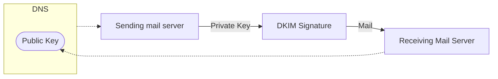

**SPF (Sender Policy Framework)**

### The SPF Authentication process

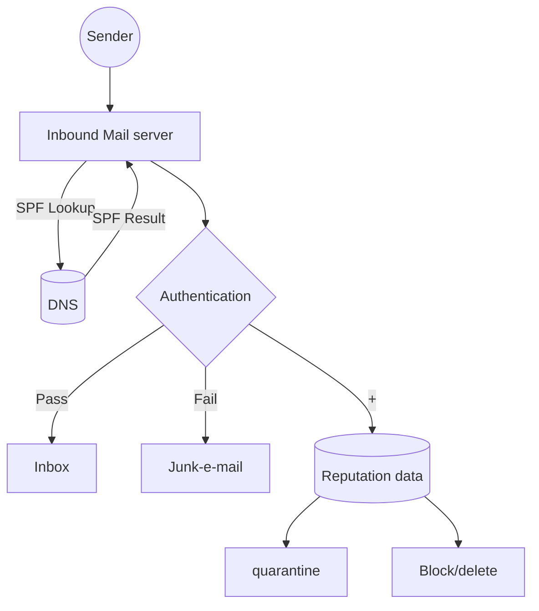

<page_number>34</page_number>

# DMARC (Domain-based Message Authentication, Reporting, and Conformance)

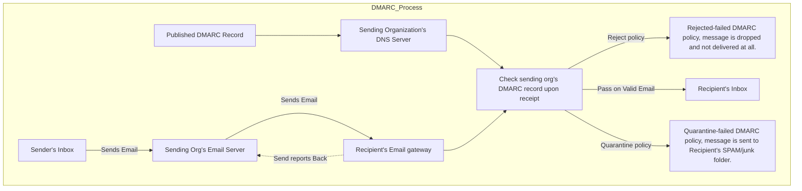

## 2.3.8 Uses of Electronic mail (e-mail).

There are several uses of emails in this modern world. People around us are now preferring things to be fast and more text savvy in order to save us time. This is why email is being widely used and recommended as a mode of communication all around the globe.

The following are the uses of an electronic mail:

* Communicate with people all over the world for free
* Connect with more than one person at a time by sending group mails
* Document interactions
* Work in collaboration
* Can send attachments
* Can keep a conversation together for multiple people
* rating calendars and appointments

EMAIL icon

## 2.3.9 The common Platforms for Electronic mail.

There are several platforms for electronic emails widely being used in the world currently. Some of the most commonly used sites are:

* Gmail
* Microsoft Outlook
* Yahoo Mail.
* AOL.
* Zoho
* ProtonMail.
* com

## 2.3.10 Create an e-mail Address, and How to Send Electronic mail (tone, language, etc.)

Using a free Gmail.com account, you can access your email, calendar, tasks, and contacts from anywhere you have an internet connection. When you are ready to open a new email account at gmail:

1. Open a web browser, go to the gmail.com sign up screen, and select **Create account**.

2. Select "For myself" option, new window will be displayed.

Web Version of OCR Textbook Not for Sale watermark

<page_number>35</page_number>

3. Enter first name, last name and user name in the relevant fields.

4. Enter a **password**, then confirm password and press next button.

5. Enter phone number and recovery email address (these fields are optional).

6. Enter your birthday.

7. Click on the drop-down arrow and select the gender, then click next button.

8. New pages for privacy and terms read these policies and click on "I agree" (you must read the privacy and term provided by gmail).

9. Gmail will set up your account and display a welcome screen. You can now open new gmail account on the web programs, on computers and mobile devices.

Collage of Google account creation screenshots with instructional annotations

<page_number>36</page_number>

### 2.3.11 Process of authentication.

Email authentication is a technical solution to verify that an email is not forged. In other words, it provides us with a way to authenticate that an email comes from who it claims to be from. Email authentication is most often used to block harmful or fraudulent uses of email such as spam.

### 2.3.12 Email Protocols

Email protocol is defined as a set of rules defined to ensure that emails can be exchanged between various servers and email clients in a standard manner. This makes sure that the email is universal and works for all users.

The common protocols for email delivery are usually Post Office Protocol (POP), Internet Message Access Protocol (IMAP), and Simple Mail Transfer Protocol (SMTP). Each of these protocols has a standard methodology to deal with the emails and also has defined functions.

* **POP (Protocol)**

POP stands for Post Office Protocol. Email clients use the POP protocol support the server to download the emails. This is primarily a one-way protocol and does not sync back the mails to the server.

* **IMAP (Protocol)**

IMAP stands for Internet Message Access Protocol. It is a standard email retrieval (incoming) protocol. It stores email messages on a mail server and enables the recipient to view and manipulate them as they were stored locally on their device(s).

* **SMTP (Protocol)**

SMTP stands for Simple Mail Transfer Protocol. SMTP is the principal email protocol that is responsible for the transfer of emails between email clients and email servers.

Illustration of Multi-Factor Authentication showing a shield with a checkmark, a lock with a grid, and a key with a circuit pattern.

<page_number>37</page_number>

# Summary

* The word processor is one of the most-used computer applications in education.

* There are four primary functions of word processors are:

    - Composing

    - Editing

    - saving

    - printing

* Microsoft Word (MS Word) is a popular word-processing program used mainly for creating documents, such as brochures, letters, learning activities, quizzes, tests, and students' homework assignments.

* To format any text in the Word document, we first need to select the text. Then we can format the text by using the tabs from the Ribbon.

* To save, we go to the File tab and press save or click save button on the quick access toolbar.

* To open a saved file, we go to the File tab and click on Open button.

* The difference between numbered list and a bulleted list in Microsoft word is that numbered list has the corresponding number associated with it or the current number of sentence that you are writing, whereas a bulleted list does not contain any numbers but only have plain bullets.

* Save allows us to update the last saved version so that it will match with the current working version and that last saved work will be updated with the new work.

* Short cut key for Save is Ctrl + S or Shift + F12 or Alt + Shift + F2.

* Save As allows us to save our work for the first time and also it will ask for in what name it will be saved and where it will be saved.

* We can insert a table from the insert tab and click on the table button.

* Headers appear at the top margin of the Word document, while Footers appear at the bottom margin of the Word document.

* The header and the footer can be added from the insert tab on the ribbon.

* The Thesaurus is a software tool that is used in the Microsoft Word document to look up (find) synonyms (words with the same meaning) and antonyms (words with the opposite meaning) for the selected word.

* A multimedia presentation consists of a set of media objects, such as images, text objects, video clips, and audio streams.

* Open the PowerPoint presentation and under the PowerPoint menu bar, click the "View" > "Notes" button to add notes. Alternatively, you can also click the "Notes" button on the bottom of PowerPoint.

* To set up the slideshow, select Slide Show > Set Up Slide Show.

* Click the New Email button on the Home tab of Mail. Press Ctrl + N.

    - Enter a recipient's address. To: Contains the primary recipient's address.

    - To: Contains the primary recipient's address.

    - Cc (Carbon Copy): Sends a copy of the email to a secondary address.

<page_number>38</page_number>

* Bcc (Blind Carbon Copy): Sends an additional copy to someone without anyone else knowing—except you, of course. Display this feature by clicking the Bcc button on the Options tab of the message.

* If a recipient is in your Address Book, you can also click the To, Cc, or Bcc button to open the Select Names dialog box.

* To communicate with the help of the computer using e-mail, you will need:

    * An e-mail address

    * A password

    * The e-mail address of the person to whom you wish to send the e-mail

    * Internet connection

* An email attachment is a computer file that is sent within an email message.

* In the left pane of Mail, Contacts, Tasks, or Calendar, right-click where you want to add the folder, and then click New Folder. A new folder will be created that can be renamed as desired.

* There are 5 common Authentication Type:

    * Password-based authentication. Passwords are the most common methods of authentication. ...

    * Multi-factor authentication.

    * Certificate-based authentication. ...

    * Biometric authentication. ...

    * Token-based authentication. ok icon

* There are three major methods used in email authentication, all based on DNS TXT records:

    * DKIM (DomainKeys Identified Mail)

    * SPF (Sender Policy Framework)

    * DMARC (Domain-based Message Authentication, Reporting, and Conformance)

* The common protocols for email delivery are usually Post Office Protocol (POP), Internet Message Access Protocol (IMAP), and Simple Mail Transfer Protocol (SMTP).

* POP stands for Post Office Protocol. Email clients use the POP protocol support the server to download the emails. This is primarily a one-way protocol and does not sync back the mails to the server.

* SMTP stands for Simple Mail Transfer Protocol. SMTP is the principal email protocol that is responsible for the transfer of emails between email clients and email servers.

<page_number>39</page_number>

# Exercise icon Exercise

Tick (✓) the Correct Answer:

1. To open a word document, we go to the      tab.

a. Open b. File c. Home d. Insert

2.      is a word processor, that allows us to enter, format, save and print text.

a. MS Excel b. MS PowerPoint c. MS Word d. MS Paint

3. We can format the text from the      tab.

a. File b. Format c. Insert d. Home

4.      make the text appear thicker and darker.

a. Italics b. Format c. Font face d. Bold

5. There are      types of alignments in text formatting in Word.

a. 3 b. 4 c. 5 d. 6

6. The      tab lets you control the look and the feel of your document in Microsoft Word.

a. Layout b. Margin c. Caption d. Format

7. We can insert the image in the Word document from the      tab.

a. Insert b. File c. Home d. View

8. We can resize the image by clicking and dragging on its     .

a. Outline b. Center c. Resize handles d. Arrows

9. The keyboard shortcut to copy is     .

a. Ctrl + X b. Ctrl + C c. Ctrl + P d. Ctrl + S

10. We can insert the table in the Word document from the      tab.

a. File b. Home c. Insert d. View

11.      appears at the top margin of the Word document.

a. Footer b. Title c. Address bar d. Header

12. To Print the Word document, we go to the      tab.

a. Print b. File c. Format d. Insert

13. The easiest way to create a multimedia presentation is to create it on     .

a. Microsoft Word b. Microsoft Excel
c. Microsoft PowerPoint d. Microsoft Paint

14. The keyboard shortcut to create new email is     .

a. Ctrl + S b. Ctrl + N c. Ctrl + M d. Ctrl + X

<page_number>40</page_number>

15. It is always safe to      your account, if not using it.
a. Protect
b. Sign out
c. Sign in
d. Delete

## Briefly answer the following questions

1. Write a note on benefits of the Microsoft PowerPoint which adds importance to any of the presentation for any kind of users.

2. State the different ways in which we can use email as a mean of authentication for another website.

3. Discuss the importance and uses of email.

4. Write the proper protocol of signing out the email account when not using it.

5. Elaborate on the use of thesaurus and synonyms features in Microsoft Word.

6. Differentiate between save and save a As tool on the file tab.

7. Describe the purpose of a word processor.

8. Identify and explain the common platforms for electronic mail.

9. Define the following terms:

    * Recipient

    * Attachments

    * Password

    * Email address

10. Explain the standard protocols like SMTP and POP3.

## Answer the following questions in detail

1. Prepare a presentation on the book the students read last time; while incorporating all the tools.

2. Create an email address using common freely available platforms like Microsoft or Google. Teachers can conduct a demonstration, and students can follow the process and create their own email inboxes.

3. Ask the students to write 3 things they have learned about the email, make 2 personal connections to email, or write 2 things they didn't understand about email, and 1 area that needs to be discussed with the peers or teacher.

4. Engage students with the topic by asking them to open Microsoft Word and allowing them to navigate freely for three minutes. At the end of this time, ask them to share experiences, questions, and comments.

* Tell students they will be learning to use this program, then ask them to consider why learning to use Microsoft Word will be beneficial to them.

* Have them open a New Document.

* Have students preview the menus briefly by running their mouse across each but not

<page_number>41</page_number>

opening any options under. Preview and predict what each tab does.

* Discuss features and allow students to ask questions, but instruct them to refrain from going further than exploration for now.

* Ask - Which feature will you use to:

  - Determine margins?

  - Create page borders?

  - Check spellings?

  - Add a table of contents?
  - Preview the document?

# Activity Based Questions

1. Students will prepare a presentation on the book they read last time; while incorporating all the tools.

2. Students will create an email address using common freely available platforms like Microsoft or Google. Teachers can conduct a demonstration, and students can follow the process and create their own email inboxes.

Web Version of PCTB Textbook Not for Sale watermark

PCTB Textbook logo

<page_number>42</page_number>

# UNIT 3 Computational Thinking

**Students learning Outcomes**

After completing this unit students will be able to:

* Explain that an algorithm is a sequence of precisely described instructions.

* Describe how to apply computational thinking to solve a complex problem (breaking down a problem, identifying important information, logical thinking, and confidence in decision making).

* Extract relevant information required to solve the problem (abstraction).

* Break down a problem by identifying patterns/similarities to solve a complex problem.

* Write and design algorithms for complex problems.

* Draw a flowchart (input, output, process, and decisions) to graphically represent an algorithm.

* Determine where to use a finite loop and infinite loop.

* Infer clear instructions to be considered for an algorithm to produce correct results.

* Recognize that more than one algorithm can solve a given problem.

* Distinguish between problems where If and If then else condition can be applied.

* Apply finite and infinite loops in algorithm building.

* Identify problems where If then Else condition can be applied.

* Break down a problem and create a sub-solution for each of its parts.

* Recognize whether an input is fit to determine the correct output.

## 3.1 Computational Thinking

Computational Thinking (CT) involves a set of problem-solving skills and techniques we use to solve a problem. Computational thinking allows us to take a complex problem, understand what the problem is and develop possible solutions for this problem. We can then present these solutions in a way that a computer, a human, or both, can understand.

## Cornerstones of Computational Thinking

There are many techniques that are used for problem solving using Computational thinking, some of the key steps to

Venn Diagram showing the intersection of Computing, Computational Thinking, and Computer Science

Fig. 3.1 Venn Diagram of Computational Thinking

<page_number>43</page_number>

computational thinking techniques are:

*   **Decomposition:** Breaking a task or problem into steps or parts.

*   **Pattern Recognition:** Finding similarities between comparable and problems.

*   **Generalization and Abstraction:** Discover the principles that cause these patterns.

*   **Algorithm Design:** Develop the instructions to solve similar problems and repeat the process.

## Decomposition

Decomposition is breaking down complex problems into smaller, more manageable parts. If you can break down a big problem into smaller problems, you can solve them easily. Decomposition is an important life skill.

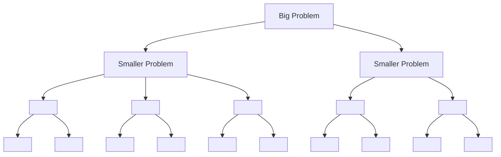

**Example:**

We want to host a holiday dinner, Decomposition of the task will be:

*   Select the menu

*   Enlist support from others in the kitchen

*   Task people with what to bring

*   Determine the process by which to cook the different elements

*   Set the time for the event.

## Pattern recognition

Pattern recognition is looking for patterns in the problem and determining if there could be any of the problems or solutions we have faced in the past can be applied here. It may also involve recognizing shapes, sounds or images.

Grid of various geometric shapes (squares, circles, triangles, hexagons) in different colors (blue, grey, pink) illustrating pattern recognition

**Example:**

Pattern Recognition is used to identify similarities between decomposed problems. If 

 we are developing a game, we can recognize similar objects, patterns, and actions. Finding these allows us to apply the same, or slightly modified, approach which makes our solution more efficient.

### Do you Know?

Patterns are the laws of nature and life that present themselves in all disciplines of life.

### Extra Bit!

Interdisciplinary studies involve the combination of two or more disciplines into one activity.

<page_number>44</page_number>

## Generalization and Abstraction

Abstraction helps us learn to identify the details that are relevant to solving the problem and ignoring the details that are not relevant to the problem we are solving while generalization allows us to create generic idea of what the problem is and how to solve it. Once we have recognized patterns, we need to put it in its simplest terms so that it can be used whenever we need to use it.

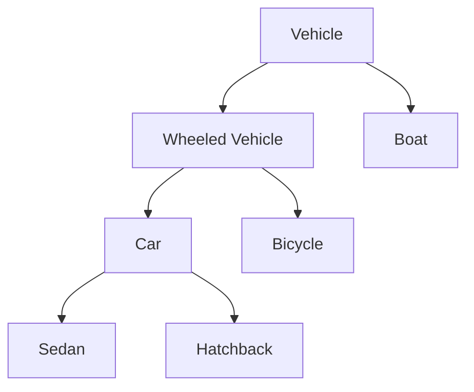
Diagram showing generalization from specific car types to the general category of Vehicle

## Algorithm Design

An algorithm is a set of instructions for solving a problem or accomplishing a task. In simple words we can say that an algorithm is a sequence of instructions or steps that can be followed by humans and computers to complete a specific task. It is a systematic procedure that produces the answer to a question or the solution of a problem in a finite number of steps.

### Characteristics of an Algorithm

**Clear and Unambiguous:** Each step an algorithm should be clear in all aspects and must lead to only one meaning.

**Well-Defined Inputs:** Inputs of an algorithm should be well-defined.

**Well-Defined Outputs:** The algorithm must clearly define what output will be and it should be well-defined as well.

**Finite-ness:** The algorithm should terminate after a finite time.

**Feasible:** The algorithm must be simple, generic, and practical, so that it can be executed with the available resources.

**Language Independent:** The Algorithm must be programming language-independent.

### Types of Algorithms

There are several types of algorithms. Some important algorithms are:

**Brute Force Algorithm:** It is the simplest approach to solve a problem. Brute Force Algorithm goes through all possible solutions until required solution is found.

**Recursive Algorithm:** In this algorithm, a problem is broken into several sub-parts and called the

<page_number>45</page_number>

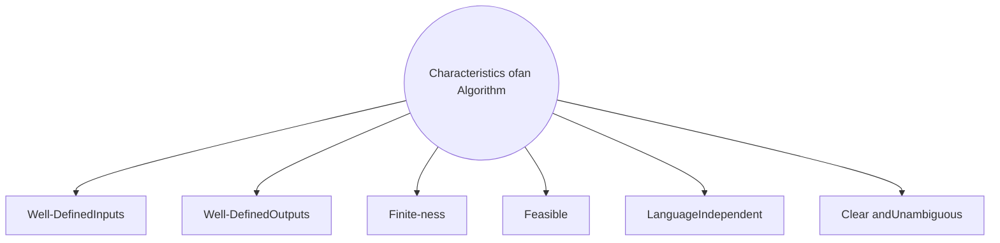

Fig. 3.1 Characteristics of an algorithm

**Sorting Algorithm:** The algorithms which help in arranging a group of data in a particular manner are called sorting algorithms.

**Divide and Conquer Algorithm:** This algorithm breaks a problem into sub-problems, solves a single sub-problem and merges the solutions together to get the final solution.

**Randomized Algorithm:** In the randomized algorithm we use a random number so it gives immediate benefit. The random number helps in deciding the expected outcome.

### Sequence Structure

In sequnce structure steps of an alogorithm / program are executed in the same order as they are written.

### Selection Structure

In conditional structure, a statement or set of statements are executed only if condition is true otherwise else part of program is executed.

**Example**

we can apply if then else condition is finding whether a member is even or odd.

### Lepitaton Structure

In problem solving, a loop is a sequence of instructions that is executed again and again until a certain condition is true. If the condition becomes false, the statements outside the branches the

<page_number>46</page_number>

loop are executed.

## Types of Loops

There are two most common types of loops:

* Finite loops

* Infinite loops

## Finite Loops

The most common type of loop is finite loop. There type of loops have explicit end and these loops execute their bodies for a fixed number of times. A finite loop stops when the condition is false.

## Infinite Loops

An infinite loop, does not have an explicit end. It runs for an infinite time because its condition remains true for iterations.

**Example:** Repeat forever feature is used for infinite loops in scratch in which object/sprite will repeat its action forever.

## Examples of Computational Thinking in Real Life

Computational thinking can be observed in the way people make decisions, do basic arithmetic, and solve problems. The following examples demonstrate how computational thinking is being used to solve real-world problems:

* Using an algorithm to find the best route between your school and your home based on traffic and other factors like construction or road blocks.

* Following a recipe to bake a cake is an example of an algorithm.

* Planning a budget involves pattern recognition and decomposition when you determine your spending habits in each category.

## Essentials of writing an Algorithm

In order to write an algorithm, the following things are needed as a pre-requisite:

* The **problem** that is to be solved by this algorithm i.e. clear problem definition.

* The **limitations** of the problem must be considered while solving the problem.

* The **input** to be taken to solve the problem.

* The **output** to be expected when the problem is solved.

* The **process/solution** to this problem, is within the given limitations/ constraints.

Then we write the algorithm with the help of the above parameters such that it solves the problem.
**Example 1.** Solve the problem to add three numbers and print the sum.

### Step 1: Fulfilling the pre-requisites

As discussed above, in order to write an algorithm, its pre-requisites must be fulfilled.

1. **The problem that is to be solved by this algorithm:** Add 3 numbers and print their sum.

2. **The constraints/ limitations of the problem that must be considered while solving the problem:** The numbers must contain only digits and no other characters.

3. **The input to be taken to solve the problem:** The three numbers to be added.

4. **The output to be expected when the problem is solved:** The sum of the three numbers taken as the input i.e. a single integer value.

5. **The solution to this problem, in the given constraints:** The solution consists of adding 3

<page_number>47</page_number>

numbers. It can be done with the help of '+' operator, or bit-wise, or any other method.

## Step 2: Designing the algorithm

Now let's design the algorithm with the help of the above pre-requisites:

### Algorithm to add 3 numbers and print their sum:

1. START

2. Declare 3 integer variables num1, num2 and num3.

3. Take the three numbers, to be added, as inputs in variables num1, num2, and num3 respectively.

4. Declare an integer variable sum to store the resultant sum of the 3 numbers.

5. Add the 3 numbers and store the result in the variable sum.

6. Print the value of the variable sum

7. END

**Example 2:** Solve the problem print whether a number is even or odd.

## Step 1: Fulfilling the pre-requisites

As discussed above, in order to write an algorithm, its pre-requisites must be fulfilled.

1. **The problem that is to be solved by this algorithm:** print whether a number is even or odd.

2. **The constraints/ limitations of the problem that must be considered while solving the problem:** The number must contain only digits and no other characters.

3. **The input to be taken to solve the problem:** A number to be checked whether it is even or odd.

4. **The output to be expected when the problem is solved:** Evaluate and print value whether even or odd.

5. **The solution to this problem, in the given constraints:** The solution consists taking remainder of the given number, checking whether the remainder is zero or not. It can be done with the help of 'rem' operator by dividing it with 2 or any other method.

## Step 2: Designing the algorithm

Now let's design the algorithm with the help of the above pre-requisites:

### Algorithm to find whether given number is even or odd

1. START

2. Declare an integer variable num1.

3. Take the number, to be checked, as inputs in variables num1.

4. Declare an integer variable remainder to store the resultant remainder by 2 of the number.

5. Remainder = num1 % 2 (% operator is used to get remainder).

6. Check IF remainder = 0, then print "number is even', Otherwise print "number is Odd'

7. END

## Flowchart

A flow chart is a pictorial or symbolic representation of an algorithm. Each step in the flowchart is represented by a symbol which contains a short description of that step. Arrows are used to link different processes in flowchart and they also show the flow of the flowchart. Flowcharts are used in analyzing, designing, documenting or managing a process or program.

<page_number>48</page_number>

# Commonly Used Symbols in Flowcharts

<table>
  <thead>
    <tr>
        <th>Symbol</th>
        <th>Name</th>
        <th>Description</th>
    </tr>
  </thead>
</table>
mermaid
graph TD
    A([ ])
```	Terminal / Terminator	Oval represents start or stop point of a flowchart
```mermaid
graph TD
    A[ ]
<table>
  <tbody>
    <tr>
        <td>↑ ↓</td>
        <td>Arrow</td>
        <td>Arrow represents direction of flow from one step or decision to another.</td>
    </tr>
  </tbody>
</table>
mermaid
graph TD
    A[/ /]
```	Input/ Output	Parallelogram represent input or output
```mermaid
graph TD
    A{ }
```	Decision	Diamond represents decision
```

## Rules for Drawing Flowcharts

We should follow the following rules while drawing a flowchart:

1. Use conventional flowchart symbols

2. Every flow chart must have the start and Endpoints.

3. Each symbol should have one exit point except the decision symbol.

4. Flow lines should not cross each other.

5. The flow lines coming out of the decision symbol should be labeled properly.

## Advantages of Flowchart

* Easy to make

* Easy to understand

* Mistakes can be easily identified

* Debugging becomes possible (The process of removing errors is called debugging).

* Logics can be easily understood.

## Disadvantages of Flowchart

* Difficult to present complex programs.

* Modification is difficult

* Time consuming

* Difficult to understand for people who don't know flowchart symbols

<page_number>49</page_number>

**Examples of Flowcharts**

**Example 1:** Draw a flowchart to polish your shoe

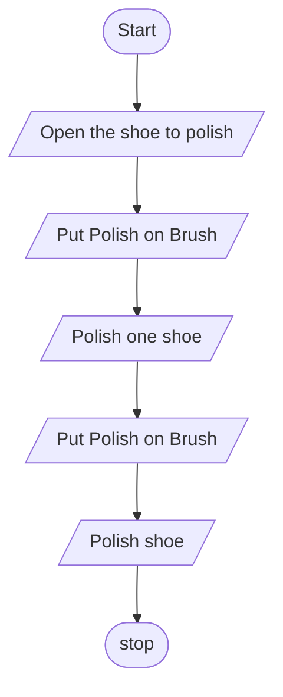

**Example 2:** Draw a flowchart to add three numbers and print the sum

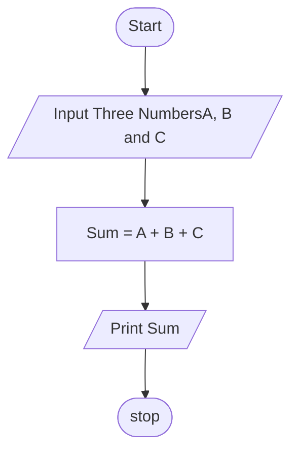

<page_number>50</page_number>

Example 3: Algorithm to find whether a number is even or odd.

> **Extra Bit!**
> "Mod" % is used to take remainder/modulus of an integer

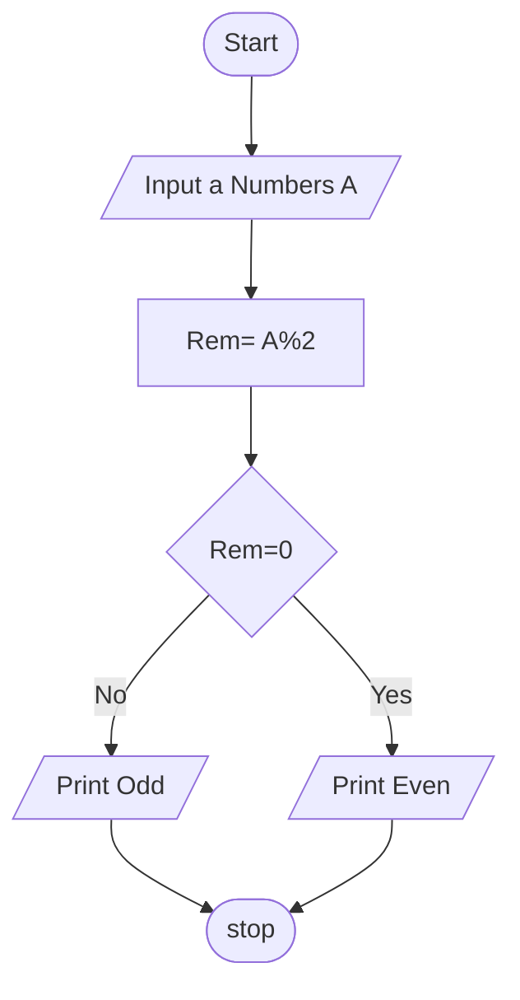

Example 4: Draw a flowchart to print first 10 integers

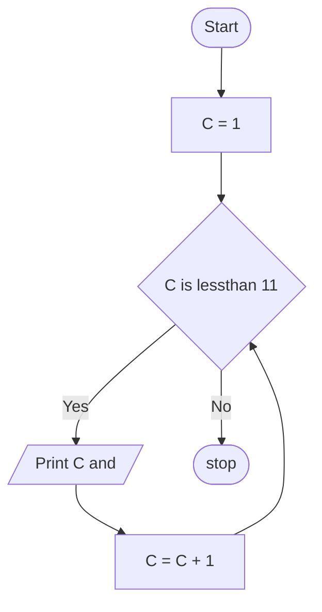

<page_number>51</page_number>

**Example 5:** Draw a flowchart to print the table of given Number up to 10

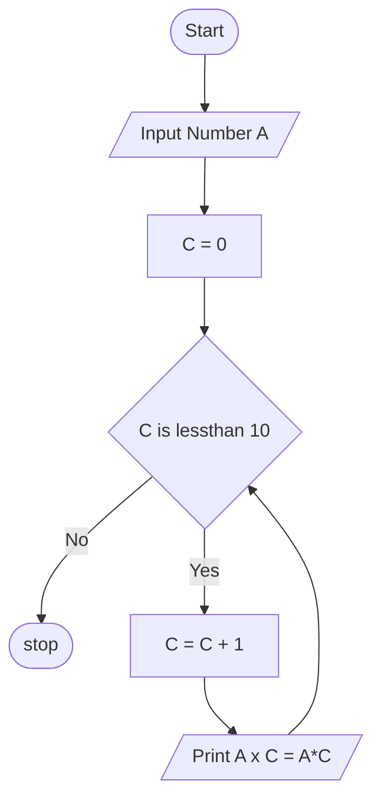

## Efficiency of a Solution

There can be more than one solution for one problem and one solution can be more efficient than others. Efficiency of a solution is measured by following parameters:

* No of steps executed by the solution to solve the problem.
* Memory consumed by the solution.

So we can say that efficiency of a solution is always measured in terms of no. of steps taken by the solution. The solution which solves a problem in less no. of steps is considered more efficient than that which takes more steps for solution because memory is not an issue for computer systems now.

Let us see the following example:

## Write an algorithm to find largest number from three numbers

**Solution1:**

1. Start.
2. Take three unique numbers in A, B, C.
3. Set A = largest
4. Check if B is greater than largest, set B = largest
5. Check if C is greater than largest, set C is largest,
6. Print largest
7. Stop.

<page_number>52</page_number>

**Solution 2:**

1. Star

2. Input three unique numbers A,B and C

3. Check If A is greater than B, then go to step 6

4. Check If B is greater than C, then print B is largest and go to step 8

5. Print C is largest and go to step 8

6. Check If A greater than C, then print A is largest and go to step 8

7. Print C is largest

8. End

**Analysis**

We can see that solution1 and solution2 are solving the same problem. Solution 1 is solving the problem in seven steps and using four variables A, B, C and largest while Solution2 is solving the same problem in 8 steps and it is using three variables A, B, C. As solution1 solves problem in less No. of steps we can say that solution1 is more efficient than Solution2 although it consumed less memory.

DOK logo
Web Version of PCTB Textbook Not for Sale watermark

<page_number>53</page_number>

# Summary

* Computational Thinking (CT) involves a set of problem-solving skills and techniques we use to solve a problem.

* Breaking a task or problem into steps or parts is known as Decomposition

* Discover the principles that cause the patterns in a problem is called Generalization

* An algorithm is a finite set of instructions for solving a problem or accomplishing a task.

* Brute Force Algorithm goes through all possible solutions until required solution is found.

* In **Recursive Algorithm**, a problem is broken into several sub-parts and called the same procedure again and again.

* Searching algorithms are used for searching elements or groups of elements from a particular data.

* Divide and Conquer Algorithm breaks a problem into sub-problems, solves a single sub-problem and merges the solutions together to get the final solution.

* In problem solving, a loop is a sequence of instructions that is executed again and again until a certain condition is true.

* An infinite loop, have not an explicit end. It runs on an infinite time because its condition is not false in any iteration.

* A flow chart is a pictorial or symbolic representation of an algorithm. Each step in the flowchart is represented by a symbol which contains a short description of that step.

* Efficiency of a solution is measured by following parameters:

    - No of steps executed by the solution to solve the problem

    - Memory consumed by the solution

Exercise icon **Exercise**

Tick (✓) the Correct Answer:

1. Breaking down a problem into sub problems is called:

    a. generalization [ ] b. pattern Recognition [ ] c. deconstruction [ ] d. Design [ ]

2. Discover the principles that cause the patterns of a problem is called.

    a. generalization [ ] b. pattern Recognition [ ] c. deconstruction [ ] d. Design [ ]

3. Set of instructions to solve a problem is called:

    a. directions [ ] b. instructions [ ] c. algorithm [ ] d. Design [ ]

4. The algorithm which goes through all possible solutions until required solution is found is called:

    a. Recursive Algorithm [ ] c. Brute force algorithm [ ]
    b. Searching algorithm [ ] d. sorting algorithm [ ]

5. The algorithms which help in arranging a group of data in a particular manner are called:

    a. Recursive Algorithm [ ] c. Brute force algorithm [ ]

<page_number>54</page_number>

b. Searching algorithm d. sorting algorithm

6. The algorithm which breaks a problem into sub-problems, solves a single sub-problem and merges the solutions is called:

a. Recursive Algorithm b. Brute force algorithm

c. divide and conquer Algorithm d. sorting algorithm

7. The algorithm which uses a random number so that it gives immediate benefit is called:

a. Recursive Algorithm b. divide and conquer Algorithm

c. Brute force algorithm d. random algorithm

8. The sequence where we repeat specific set of instruction again and again is called:

a. loop b. sequence c. condition d. all

9. The loops which have to be terminated are called:

a. Infinite loops b. Finite loops c. intermediate loops d. simple loops

10. The loops which are never going to end are called:

a. Infinite loops b. Finite loops c. intermediate loops d. simple loops

**Briefly answer the following questions**

1. Define computational thinking in your words.

2. Enlist techniques of computational thinking.

3. What do you mean by Decomposition?

4. Elaborate generalization and abstraction.

5. Define Algorithm in your words.

6. Enlist the characteristics of an algorithm.

7. Differentiate between recursive and brute force algorithm.

8. Differentiate between searching and sorting algorithm.

9. What are loops? Discuss its types.

10. Enlist advantages and disadvantages of flowcharts.

**Answer the following questions in detail**

1. Define pattern reorganization in your words.

2. Write an algorithm to find sum of three numbers.

3. Write the algorithm to find whether given number is even or odd.

4. Write down rules of writing a flowchart.

5. Why don't we consider memory in measuring efficiency of an algorithms.

6. Draw a flowchart to find sum of three numbers.

7. Draw a flowchart to find whether given number is even or odd.

8. How can we measure the efficiency of a solution?

**Activity Based Questions**

1. Take a mathematical problem and identify whether it's a sequencing/loops/condition problem or a combination of all and apply the concept and write step by step solution by applying algorithmic thinking.

2. Take a science problem and identify whether it's a sequencing/loops/condition problem or a combination of all and apply the concept and write step by step solution by applying.

<page_number>55</page_number>

algorithmic thinking.

3. Take a **computer problem** and identify whether it's a sequencing/loops/condition problem or a combination of all and apply the concept and write step by step solution by applying algorithmic thinking.

4. Design an activity like celebrating a day/planning a festivity activity (Group activity), and identify whether it's a sequencing/loops/condition problem or a combination and apply the concept and write step by step solution by applying algorithmic thinking.

Web Version of PCTB Textbook Not for Sale watermark

<page_number>56</page_number>

# UNIT 4 Programming

**Students learning Outcomes**

After completing this unit students will be able to:

* Describe that computers store information using binary codes.
* Differentiate between binary and decimal number systems.
* Explain that computer can only understand specific instructions.

    - Convert binary numbers into decimal numbers
    - Convert decimal numbers into binary numbers
    - Text, image, and sound representation in binary numbers
* Encode and decode text in binary using protocols of ASCII
* Encode and decode images in binary using protocols such as RGB
* Articulate that a combination of programming constructs can be put together to create more complex projects.

    - The concept of combining events & coordinates to allow a user to move a sprite or a sprite, to move a sprite automatically without user intervention.
    - The concept of setting a condition using mathematical operators on a variable
    - The concept of creating, setting, and changing a variable under certain conditions to either increase value
* Write a program that will:

    - Allow the user to move a sprite using arrow keys.
    - Make sprites move automatically without user intervention when the program starts. Award the player a score point under certain conditions, such as if they can touch another sprite that is automatically moving, or if the player clicks on a moving sprite.
    - Create a countdown timer

## 4.1 Computers store information using binary codes

Computers represent everything as numbers. In fact, they can represent everything using the combination of only two numbers that are zero and one. Expressing numbers as a set of zeroes and ones is known as using binary numbers. In computers the numbers are represented by electronic switches. An open switch represents a zero and a closed switch represents a one. With enough switches, virtually anything can be represented as numbers. Another name for these switches is "bits". These bits are stored in our computers' memories.

Eight bits together makes what we call a "byte" of data. You've probably heard of how many megabytes (approximately millions of bytes) or gigabytes (approximately trillions of bytes) your computer can store. Ultimately the amount of memory in your computer

> **Do you Know?**
>
> Bit is the short form of Binary Digit

<page_number>57</page_number>

determines how many numbers can be represented

**Binary explained**

The binary number system was refined in the 17th century by Gottfried Leibniz. In mathematics and in computing systems, a binary digit, or bit, is the smallest unit of data. Each bit has a single value of either 1 or 0, which means it can't take on any other value.

Computers are machines that represent numbers using binary code in the form of digital 1s and 0s inside its central processing unit (CPU) and RAM. These digital numbers are electrical signals that are either on or off inside the CPU or RAM.

## 4.2 Binary and Decimal number systems

**Decimal Number System Definition**

The decimal number system is defined as a number system that represents a number with a base of 10 and uses 10 symbols - 0, 1, 2, 3, 4, 5, 6, 7, 8, and 9. It is also known as the Hindu-Arabic number system in which each digit has a position and it is ten times more significant than the previous digit. It also uses a decimal point to represent decimal fractions. For example, if we take 36 as a decimal number, here, 3 is ten times more than 6. Decimal numbers are written as 45<sub>10</sub>, 118<sub>10</sub>, and so on. It is the most commonly known number system in which the numbers can be identified easily even if the base is not written. In other words, if the base of a number is not written, it is considered to be a decimal number.

**Binary Number System Definition**

The binary number system is a number system with base 2 in which numbers are represented only by two digits, 0 and 1. The smallest unit of data in a computer is called a bit, which is the abbreviated form of 'binary digit'. A bit has a single binary value which is either 1 or 0. Binary numbers are written as 110<sub>2</sub>, 10<sub>2</sub> and are mostly used in computers for programming or coding since the computer understands the language of only the binary digits, that is, 0 and 1. It should be noted that in a binary number, the bit to the extreme left is called the Most Significant Bit (MSB), and the bit to the extreme right end is known as the Least Significant Bit (LSB). The remaining part shows the magnitude of the number.

<table>
  <tbody>
    <tr>
        <td>1 Bit</td>
        <td>= Binary Digit</td>
    </tr>
    <tr>
        <td>8 Bits</td>
        <td>= 1 Byte</td>
    </tr>
    <tr>
        <td>1024 Bytes</td>
        <td>= 1 KB [Kilo Byte]</td>
    </tr>
    <tr>
        <td>1024 KB</td>
        <td>= 1 MB [Mega Byte]</td>
    </tr>
    <tr>
        <td>1024 MB</td>
        <td>= 1 GB [Giga Byte]</td>
    </tr>
    <tr>
        <td>1024 GB</td>
        <td>= 1 TB [Terra Byte]</td>
    </tr>
    <tr>
        <td>1024 TB</td>
        <td>= 1 PB [Peta Byte]</td>
    </tr>
    <tr>
        <td>1024 PB</td>
        <td>= 1 EB [Exa Byte]</td>
    </tr>
    <tr>
        <td>1024 EB</td>
        <td>= 1 ZB [Zetta Byte]</td>
    </tr>
    <tr>
        <td>1024 ZB</td>
        <td>= 1 YB [Yotta Byte]</td>
    </tr>
    <tr>
        <td>1024 YB</td>
        <td>= 1 Bronto Byte</td>
    </tr>
    <tr>
        <td>1024 Brontobyte</td>
        <td>= 1 Geop Byte</td>
    </tr>
  </tbody>
</table>

Table 4.1

In contrast, the decimal numbering system is a base-10 system, where each possible place in a

<page_number>58</page_number>

number can be one of 10 digits (0-9). In a multidigit number, the rightmost digit is in the first place, the digit next to it on the left is in 10<sup>th</sup> place, the digit further left is in 100<sup>th</sup> place and so on.

**Let us understand this with an example**

In the four-digit number 1,980, here are the places occupied by each digit.

<table>
  <tbody>
    <tr>
        <td>1</td>
        <td>9</td>
        <td>8</td>
        <td>0</td>
    </tr>
    <tr>
        <td>1,000th place</td>
        <td>100th place</td>
        <td>10th place</td>
        <td>1st place</td>
    </tr>
  </tbody>
</table>

### Binary number - 1010

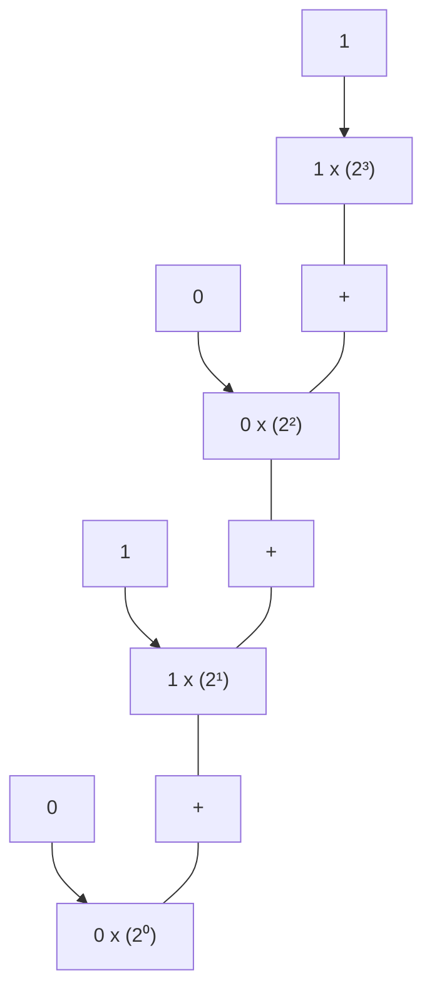

### 10 (Decimal Equivalent)

<table>
  <thead>
    <tr>
        <th>Unit</th>
        <th>Abrivation</th>
        <th>Binary Value</th>
        <th>Decimal Size</th>
    </tr>
  </thead>
  <tbody>
    <tr>
        <td>Bit</td>
        <td>b</td>
        <td>0 or 1</td>
        <td>1/8 of a byte</td>
    </tr>
    <tr>
        <td>Byte</td>
        <td>B</td>
        <td>8 bits</td>
        <td>1 byte</td>
    </tr>
    <tr>
        <td>Kilobyte</td>
        <td>KB</td>
        <td>1024¹ bytes</td>
        <td>1000 bytes</td>
    </tr>
    <tr>
        <td>Megabyte</td>
        <td>MB</td>
        <td>1024² bytes</td>
        <td>1,000,000 bytes</td>
    </tr>
    <tr>
        <td>Gigabyte</td>
        <td>GB</td>
        <td>1024³ bytes</td>
        <td>1,000,000,000 bytes</td>
    </tr>
    <tr>
        <td>Terabyte</td>
        <td>TB</td>
        <td>1024⁴ bytes</td>
        <td>1,000,000,000,000 bytes</td>
    </tr>
    <tr>
        <td>Petabyte</td>
        <td>PB</td>
        <td>1024⁵ bytes</td>
        <td>1,000,000,000,000,000 bytes</td>
    </tr>
    <tr>
        <td>Exabyte</td>
        <td>EB</td>
        <td>1024⁶ bytes</td>
        <td>1,000,000,000,000,000,000 bytes</td>
    </tr>
    <tr>
        <td>Zettabyte</td>
        <td>ZB</td>
        <td>1024⁷ bytes</td>
        <td>1,000,000,000,000,000,000,000 bytes</td>
    </tr>
    <tr>
        <td>Yottabyte</td>
        <td>YB</td>
        <td>1024⁸ bytes</td>
        <td>1,000,000,000,000,000,000,000,000 bytes</td>
    </tr>
  </tbody>
</table>

Table illustrating the differences between measuring in binary vs. decimal systems

<page_number>59</page_number>

**The importance of binary code:**

The binary number system is the base of all computing systems and operations. It enables devices to store, access and manipulate all types of information directed to and from the CPU or memory. This makes it possible to develop applications that enable users to do every task we prefer it through computer some of them are following:

1. view websites;

2. create and update documents

3. play games

4. view streaming video and other kinds of graphical information;

5. access software; and

6. perform calculations and data analyses.

The binary schema of digital 1s and 0s offers a simple and elegant way for computers to work. It also offers an efficient way to control logic circuits and to detect an electrical signal's true (1) and false (0) states.

Data For Computer System

Data For Computer System binary grid

# 4.3 Number System Conversion

## Binary to Decimal

**Gottfried Leibniz (1646-1716)**

Leibniz, the last universal genius, invented at least two things that are essential for the modern world: calculus, and the binary system.

He invented the binary system around 1679, and published in 1701. This became the basis of virtually all modern computers.

Portrait of Gottfried Leibniz

To convert binary into decimal we used positional location method in which each digit has a wait based on its position in the number. This is achieve by multiplying each digit by the base (2) raised to the power depending upon the position of the digit. At end we sum all the values obtained from digits to get the decimal number.

Let us consider following example:

* Convert the binary number 101101<sub>2</sub> to a decimal number.

Binary to Decimal Conversion Using Positional Notation Methed

<table>
  <thead>
    <tr>
        <th>Calculation</th>
        <th>Result</th>
    </tr>
  </thead>
  <tbody>
    <tr>
        <td>1 × 2⁰</td>
        <td>1</td>
    </tr>
    <tr>
        <td>0 × 2¹</td>
        <td>0</td>
    </tr>
    <tr>
        <td>1 × 2²</td>
        <td>4</td>
    </tr>
    <tr>
        <td>1 × 2³</td>
        <td>8</td>
    </tr>
    <tr>
        <td>0 × 2⁴</td>
        <td>0</td>
    </tr>
    <tr>
        <td>1 × 2⁵</td>
        <td>32</td>
    </tr>
    <tr>
        <td>SUM →</td>
        <td>45</td>
    </tr>
  </tbody>
</table>

**Step1:** List out the power of 2 for all the digits starting from right most position. The first position will be 2⁰ and the next will be 2¹ and so on.

**Step2:** We will multiplying the value of each digit with its respective binary number starting from

<page_number>60</page_number>

right most position.

**Step3:** Add all the values regard in the result and express binary number in decimal as shown in the figure.

# Decimal to Binary

**Step 1:** Divide the given decimal number by 2 and note down the remainder.

**Step 2:** Now, divide the obtained quotient by 2, and note the remainder again.

**Step 3:** Repeat the above steps until you get 0 as the quotient.

**Step 4:** Now, write the remainders in such a way that the last remainder is written first, followed by the rest in the reverse order.

**Step 5:** This can also be understood in another way which states that the Least Significant Bit (LSB) of the binary number is at the top and the Most Significant Bit (MSB) is at the bottom. This number is the binary value of the given decimal number.

Diagram showing the step-by-step division of decimal number 100 by 2 to find its binary equivalent (1100100)2, highlighting quotients and remainders.

**Let us understand this with an example**

**Example: Convert the decimal number 14<sub>10</sub> to binary.**

Solution: We will start dividing the given number (14) repeatedly by 2 until we get the quotient as 0. We will note the remainders in order.

There are different methods of converting numbers from decimal to binary. When we convert numbers from decimal to binary, the base of the number changes from 10 to 2. It should be noted that all decimal numbers have their equivalent binary numbers. The following table shows the decimal to binary chart of the first 20 whole numbers.

Diagram illustrating the conversion of decimal number 14 to binary by repeated division by 2, showing remainders 0, 1, 1, 1 resulting in (1110)2.

## Example 1: Convert 172<sub>10</sub> to binary.

Solution: For decimal to binary conversion, let us first divide the given number by 2 and note down the remainders as shown in the following table.

<table>
  <tbody>
    <tr>
        <td>2</td>
        <td>172</td>
        <td> </td>
    </tr>
    <tr>
        <td>2</td>
        <td>86</td>
        <td>0</td>
    </tr>
    <tr>
        <td>2</td>
        <td>43</td>
        <td>0</td>
    </tr>
    <tr>
        <td>2</td>
        <td>21</td>
        <td>1</td>
    </tr>
    <tr>
        <td>2</td>
        <td>10</td>
        <td>1</td>
    </tr>
    <tr>
        <td>2</td>
        <td>5</td>
        <td>0</td>
    </tr>
    <tr>
        <td>2</td>
        <td>2</td>
        <td>1</td>
    </tr>
    <tr>
        <td> </td>
        <td>1</td>
        <td>0</td>
    </tr>
  </tbody>
</table>

(172)<sub>10</sub> = (1010100)<sub>2</sub>

* **Text, image, and sound representation in binary numbers**

<page_number>61</page_number>

**Text:**

When any key on a keyboard is pressed, it needs to be converted into a binary number so that it can be processed by the computer and the typed character can appear on the screen.

Illustration showing a person typing 'A' on a keyboard, which is processed by the CPU as binary code 0100 0001 and displayed on a monitor.

# A = 0100 0001

<table>
    <tr>
        <th>Letter</th>
        <th>Binary number</th>
    </tr>
    <tr>
        <td>A</td>
        <td>0100 0001</td>
    </tr>
</table>

We need a code to represent each character and number in binary.. One code we can use for this is called ASCII. The ASCII code takes each character on the keyboard and assigns it a binary number. ASCII is seven bit code For example:

* the letter 'a' has the binary number 0110 0001 (this is the decimal number 97)

* the letter 'b' has the binary number 0110 0010 (this is the decimal number 98)

* the letter 'c' has the binary number 0110 0011 (this is the decimal number 99)

Text characters start at binary number 0 in the ASCII code, but this covers special characters including punctuation, the return key and control characters as well as the number keys, capital letters and lower-case letters.

> **Do you Know?**
> **ASCII** stand for (American Standard Code for Information Interchange)

ASCII code can only represented 2<sup>7</sup> = 128 characters, which is enough for most words in English but not enough for other languages. ASCII code was extent to 2<sup>8</sup>=256 characters but still, it was insufficient to represent other languages. If you want to use accents in European languages or larger alphabets such as Cyrillic (the Russian alphabet) and Chinese Mandarin then more characters are needed. Therefore, another code, called Unicode, was created. This meant that computers could be used by people using different languages as unicode can represent more than

<page_number>62</page_number>

65000 characters.

## Images:

Images also need to be converted into binary in order for a computer to process them so that they can be seen on our screen. Digital images are made up of pixels. Each pixel in an image is made up of binary numbers.

<table>
  <tbody>
    <tr>
        <td>0</td>
        <td>0</td>
        <td>1</td>
        <td>1</td>
        <td>1</td>
        <td>1</td>
        <td>0</td>
        <td>0</td>
    </tr>
    <tr>
        <td>0</td>
        <td>0</td>
        <td>1</td>
        <td>0</td>
        <td>0</td>
        <td>1</td>
        <td>0</td>
        <td>0</td>
    </tr>
    <tr>
        <td>0</td>
        <td>0</td>
        <td>0</td>
        <td>1</td>
        <td>1</td>
        <td>0</td>
        <td>0</td>
        <td>0</td>
    </tr>
    <tr>
        <td>0</td>
        <td>1</td>
        <td>1</td>
        <td>1</td>
        <td>1</td>
        <td>1</td>
        <td>1</td>
        <td>0</td>
    </tr>
    <tr>
        <td>0</td>
        <td>1</td>
        <td>0</td>
        <td>1</td>
        <td>1</td>
        <td>0</td>
        <td>1</td>
        <td>0</td>
    </tr>
    <tr>
        <td>0</td>
        <td>1</td>
        <td>0</td>
        <td>1</td>
        <td>1</td>
        <td>0</td>
        <td>1</td>
        <td>0</td>
    </tr>
    <tr>
        <td>0</td>
        <td>0</td>
        <td>0</td>
        <td>1</td>
        <td>1</td>
        <td>0</td>
        <td>0</td>
        <td>0</td>
    </tr>
    <tr>
        <td>0</td>
        <td>1</td>
        <td>1</td>
        <td>1</td>
        <td>1</td>
        <td>1</td>
        <td>1</td>
        <td>0</td>
    </tr>
  </tbody>
</table>

If we say that 1 is black (or on) and 0 is white (or off), then a simple black and white picture can be created using binary.

To create the picture, a grid can be set out and the squares colored (1 - black and 0 - white). But before the grid can be created, the size of the grid must be known. This data is called metadata and computers need metadata to

Pixel art of a smiley face on a grid

<table>
  <tbody>
    <tr>
        <td>0</td>
        <td>0</td>
        <td>0</td>
        <td>0</td>
        <td>0</td>
        <td>0</td>
        <td>0</td>
        <td>0</td>
    </tr>
    <tr>
        <td>0</td>
        <td>1</td>
        <td>1</td>
        <td>0</td>
        <td>0</td>
        <td>1</td>
        <td>1</td>
        <td>0</td>
    </tr>
    <tr>
        <td>0</td>
        <td>1</td>
        <td>1</td>
        <td>0</td>
        <td>0</td>
        <td>1</td>
        <td>1</td>
        <td>0</td>
    </tr>
    <tr>
        <td>0</td>
        <td>0</td>
        <td>0</td>
        <td>0</td>
        <td>0</td>
        <td>0</td>
        <td>0</td>
        <td>0</td>
    </tr>
    <tr>
        <td>0</td>
        <td>0</td>
        <td>0</td>
        <td>0</td>
        <td>0</td>
        <td>0</td>
        <td>0</td>
        <td>0</td>
    </tr>
    <tr>
        <td>0</td>
        <td>1</td>
        <td>0</td>
        <td>0</td>
        <td>0</td>
        <td>0</td>
        <td>1</td>
        <td>0</td>
    </tr>
    <tr>
        <td>0</td>
        <td>0</td>
        <td>1</td>
        <td>1</td>
        <td>1</td>
        <td>1</td>
        <td>0</td>
        <td>0</td>
    </tr>
    <tr>
        <td>0</td>
        <td>0</td>
        <td>0</td>
        <td>0</td>
        <td>0</td>
        <td>0</td>
        <td>0</td>
        <td>0</td>
    </tr>
  </tbody>
</table>

know the size of an image. If the metadata for the image to be created is 10x10, this means the picture will be 10 pixels across and 10 pixels down.

This example shows an image created in this way:

### Colors Representation in Binary code

Most commonly, colors are represented in computers using 8-bit numbers. This means that a set of eight zeroes and ones is used to represent a given color component. Every possible combination of eight zeroes and ones gives us 256 possible levels of color we can represent. For example, the decimal integer 0 is represented in 8-bit binary digits as 00000000, while the decimal integer 255 is represented as 11111111.

There are many ways to represent colors with numbers. The most common method in computers is to represent the amount of red, green, and blue primary lights required to mix together to create the desired colors. This is the tradition because most computer displays work by adding together amounts of RGB primaries and the numbers can be used to directly display colors. If 8-bit numbers are used, then we can have values ranging from 0 - 255 for each of the RGB primaries of the color. In that case, black would be represented by (R=0, G=0, B=0) and white by (255,255,255). The red, green, and blue primaries would be represented by (255,0,0), (0,255,0), and (0,0,255) respectively. Similarly, the cyan, magenta, and yellow secondaries would be represented by (0,255,255), (255,0,255), and (255,255,0). Intermediate colors are represented with intermediate numbers. For

<page_number>63</page_number>

example, a middle gray might be (128,128,128) and a pale-yellow color (200,180,120).

As mentioned above, computers represent these numbers as binary numbers instead of decimal integers. Some computer programs represent colors in hexadecimal numbers. Hexadecimal doesn't have ten numerals like decimal (0123456789), but rather has 16 numerals represented by our normal decimal numerals and the first 6 letters of the alphabet (0123456789ABCDEF). The list below shows examples of colors represented with 8-bit decimal, binary, and hexadecimal numbers that all mean exactly the same thing.

<table>
  <thead>
    <tr>
        <th>Color Name</th>
        <th>(Decimal RGB)</th>
        <th>(Binary RGB)</th>
        <th>(Hexadecimal RGB)</th>
    </tr>
  </thead>
  <tbody>
    <tr>
        <td>Black</td>
        <td>(0,0,0)</td>
        <td>(00000000,00000000,00000000)</td>
        <td>(00,00,00)</td>
    </tr>
    <tr>
        <td>White</td>
        <td>(255,255,255)</td>
        <td>(11111111,11111111,11111111)</td>
        <td>(FF,FF,FF)</td>
    </tr>
    <tr>
        <td>Red</td>
        <td>(255,0,0)</td>
        <td>(11111111,00000000,00000000)</td>
        <td>(FF,00,00)</td>
    </tr>
    <tr>
        <td>Green</td>
        <td>(0,255,0)</td>
        <td>(00000000,11111111,00000000)</td>
        <td>(00,FF,00)</td>
    </tr>
    <tr>
        <td>Blue</td>
        <td>(0,0,255)</td>
        <td>(00000000,00000000,11111111)</td>
        <td>(00,00,FF)</td>
    </tr>
    <tr>
        <td>Cyan</td>
        <td>(0,255,255)</td>
        <td>(00000000,11111111,11111111)</td>
        <td>(00,FF,FF)</td>
    </tr>
    <tr>
        <td>Magenta</td>
        <td>(255,0,255)</td>
        <td>(11111111,00000000,11111111)</td>
        <td>(FF,00,FF)</td>
    </tr>
    <tr>
        <td>Yellow</td>
        <td>(255,255,0)</td>
        <td>(11111111,11111111,00000000)</td>
        <td>(FF,FF,00)</td>
    </tr>
    <tr>
        <td>Gray</td>
        <td>(128,128,128)</td>
        <td>(10000000,10000000,10000000)</td>
        <td>(80, 80, 80)</td>
    </tr>
    <tr>
        <td>Pale Yellow</td>
        <td>(200,180,120)</td>
        <td>(11001000,10110100,01111000)</td>
        <td>(C8,B4,78)</td>
    </tr>
  </tbody>
</table>

Ultimately it is the display or decoding of the numbers that determines the color that you see. (200,180,120) does not turn out to be exactly the same color on all computer displays or printers. This complexity is what makes accurate color reproduction a serious technical and scientific challenge.

**Sound:**

The sound waves are analogue and in order to store the waves digitally on the computer, we need to convert the waveform into a numerical representation so that the waveform can be stored in binary. To do this, we use an Analogue-to-Digital Convertor (ADC). The ADC works by taking samples of the sound wave at regular intervals and display the diagram.

The quality and size of the file is affected by two factors - sample rate and bit rate. The sample rate refers to the number of samples taken every second and that the greater the frequency of the samples, the better the sound quality.

The bit rate refers to the number of bits used to store each sample and that the more bits that are sampled, the better the accuracy of the file but also the greater the file size.

Alternatively, students could use Audacity (Free audio editor) to explore how sound is stored on a computer. Students could be given an .MP3 file which they open in Audacity and zoom in to see

<page_number>64</page_number>

# Sound Wave

<table>
  <thead>
    <tr>
        <th>Time</th>
        <th>Sample</th>
    </tr>
  </thead>
  <tbody>
    <tr>
        <td>1</td>
        <td>3.2</td>
    </tr>
    <tr>
        <td>2</td>
        <td>3.9</td>
    </tr>
    <tr>
        <td>3</td>
        <td>5</td>
    </tr>
    <tr>
        <td>4</td>
        <td>6.5</td>
    </tr>
    <tr>
        <td>5</td>
        <td>8</td>
    </tr>
    <tr>
        <td>6</td>
        <td>9</td>
    </tr>
    <tr>
        <td>7</td>
        <td>9</td>
    </tr>
    <tr>
        <td>8</td>
        <td>8</td>
    </tr>
    <tr>
        <td>9</td>
        <td>6</td>
    </tr>
    <tr>
        <td>10</td>
        <td>4</td>
    </tr>
    <tr>
        <td>11</td>
        <td>2.2</td>
    </tr>
    <tr>
        <td>12</td>
        <td>1.2</td>
    </tr>
    <tr>
        <td>13</td>
        <td>2.2</td>
    </tr>
    <tr>
        <td>14</td>
        <td>4.5</td>
    </tr>
    <tr>
        <td>15</td>
        <td>7</td>
    </tr>
    <tr>
        <td>16</td>
        <td>8.2</td>
    </tr>
    <tr>
        <td>17</td>
        <td>7</td>
    </tr>
    <tr>
        <td>18</td>
        <td>4.5</td>
    </tr>
    <tr>
        <td>19</td>
        <td>3</td>
    </tr>
    <tr>
        <td>20</td>
        <td>3</td>
    </tr>
    <tr>
        <td>21</td>
        <td>4.5</td>
    </tr>
  </tbody>
</table>

Screenshot of audio editing software interface showing waveforms

the value of each sample. Students could then export the sound file using different sample rates and investigate the effect the sample rate has on sound quality.

## 4.4 Scratch

Scratch is a programming software that makes it easy for us to create interactive games, animations and stories. When scratch opens, it displays a single character by default that is called sprite. We can program sprite to move and interact with the user.

When we open sprite, the following is the displayed interface:

Scratch cat mascot

Fig. 5.4 Sprite

<page_number>65</page_number>

Diagram of the Scratch 3.0 interface with labels for Code Tab (Blocks Palette), Costumes/backdrop Tab (Paint Editor), Sound Tab (Sound Editor), Menu Bar, Scroll Bar, Script, Sprite, Stage Size, Code Area, Sprite Header, Sprite Info Pane, Choose a Sprite, Choose a Backdrop, and Extensions Library.

Fig. 5.5 Scratch Interface

<table>
  <thead>
    <tr>
        <th>Interface parts</th>
        <th>Description</th>
    </tr>
  </thead>
  <tbody>
    <tr>
        <td>Block categories</td>
        <td>This shows the category of the blocks. You can click on the category to see the script blocks it contains.</td>
    </tr>
    <tr>
        <td>Block Palettes</td>
        <td>It has the list of blocks that can be added to your program when creating it. To add a block, you simply click on it and drag it to the script area.</td>
    </tr>
    <tr>
        <td>Script Area</td>
        <td>This is the place where you add the script blocks to create a program.</td>
    </tr>
    <tr>
        <td>Stage</td>
        <td>This is where the program runs and you can see Sprite in action.</td>
    </tr>
    <tr>
        <td>Sprite List</td>
        <td>As it suggests from the name it shows the sprite used in the program. We can add, delete, or modify Sprites, or change the stage background (backdrop) from here.</td>
    </tr>
    <tr>
        <td>X and Y coordinates</td>
        <td>Tell us the exact X and Y coordinates of the sprite on stage. Whereas location (0,0) is in the middle of the stage.</td>
    </tr>
  </tbody>
</table>

<page_number>66</page_number>

## 4.4.1 Combination of Programming Constructs

* **The concept of combining events & coordinates to allow a user to move a sprite or a sprite moves automatically without user intervention.**

**What is Movement?**

Movement is the most basic function in any game. It's the first thing you do when you start a new game, and it's present in almost every game made in Scratch.

In real life, movement is the only way that we can interact with the world. Just by thinking about it, we move our arms and legs to walk or do anything that we want. Just like in real life, movement is the primary way that we interact with games. By pressing the arrow keys, players tell their characters to move around on screen and complete tasks.

Illustration of a sprite sheet showing a bear character walking in six frames

**Making characters walk or move around in games lets them interact more with your world.**

Because it can be used for almost anything, we should learn how to make sprites move before anything else. This is perfect for Scratchers who are just getting started, and want to make their own creations! In next topic we will explain how to create a sprite and make it controllable.

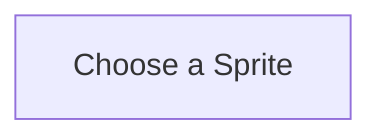

Making a Sprite Move

<page_number>67</page_number>

## Step 1. Select a Sprite.

To start coding in Scratch, we need to create something called a sprite. Every entity in a Scratch project is a sprite. These sprites are characters in your game, which can move around and execute code. By creating scripts for the sprites to execute, we can give them commands and tell them to do anything we want!

Right now, the only sprite in our project is the Scratch Cat, who is in every project by default. If you want to create a new sprite, you can click the Choose a Sprite button, found in the bottom right of the screen. If you simply want to make the cat move, you can skip ahead to step two.

Select a Scratch sprite character using this button at the bottom right of your new project screen.

Clicking this button should bring you to the Sprite Menu, a library of different sprites which you can use in your game. Click on whichever character you like, and Scratch will create them as a new sprite in your game.

Screenshot of the Scratch "Choose a Sprite" menu showing various animal characters like Bat, Bear, Beetle, and Cat, along with Scratch code blocks for movement.

<page_number>68</page_number>

> Here's what this code says:
> 

> "When you press the right arrow key, point towards the right, then move forward 10 steps."

**Scratch offers a wide variety of sprites for you to customize your project with.**

**Step 2. Program your sprite.**

Now that we have a sprite, it's time to make it controllable. To make your sprite move, we need to use Scratch blocks in order to create a simple script.

The easiest way to make a sprite move is to use Event Listeners. Check out this code block, which makes sprites move to the right:

**Code with an event listener for simple movement to the right.**

> **Tip:** To make this process faster, you can right click on your existing code and click Duplicate. This will create a copy of these blocks, which means you don't need to drag and drop as much.

The code consists of a yellow event listener block followed by two blue motion blocks. The motion blocks actually move the sprite, while the event listener block tells the sprite when to move.

This movement works for any direction. By adding in more blocks like this, we can give our sprite the ability to move in any direction we'd like. Now that we can move to the right, let's create more scripts to make our hedgehog move in all four cardinal directions!

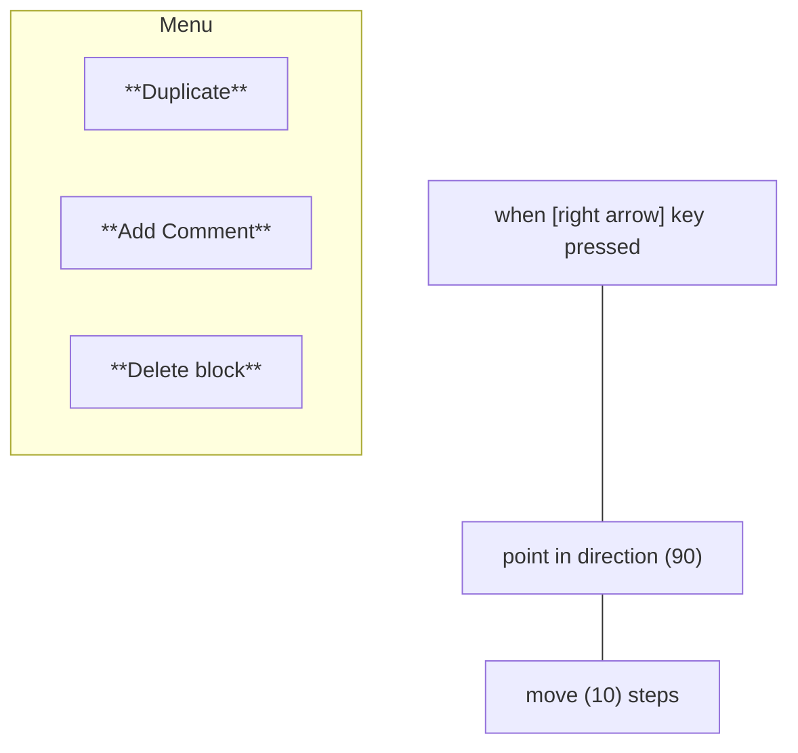

Easily duplicate your code by right clicking and selecting "Duplicate."

Now we have scripts to move in all four directions. Let's take a look at how our sprite moves in each direction. What are the differences between these four blocks of code?

<page_number>69</page_number>

```mermaid
graph TD
    subgraph "Right Movement"
    A1[when right arrow key pressed] --> B1[point in direction 90]
    B1 --> C1[move 10 steps]
    end

    subgraph "Left Movement"
    A2[when left arrow key pressed] --> B2[point in direction -90]
    B2 --> C2[move 10 steps]
    end

    subgraph "Up Movement"
    A3[when up arrow key pressed] --> B3[point in direction 0]
    B3 --> C3[move 10 steps]
    end

    subgraph "Down Movement"
    A4[when down arrow key pressed] --> B4[point in direction 180]
    B4 --> C4[move 10 steps]
    end
```

**Duplicate and edit your code like above to allow your sprite to move in each direction.**

Notice that for each direction, two things are different:

1. The blocks run when different keys are pressed. For example, our character moves up when the up-arrow key is pressed, and down when the down arrow key is pressed

2. The point in direction blocks specify different directions. The numbers in these blocks are degrees, which each represent one of the cardinal directions (right/left/up/down). When these blocks run, they tell our sprite to point towards a specific direction.

The move ten steps block remains the same for all four directions. No matter which direction we move in, we always move at the same speed.

* **The concept of setting a condition using mathematical operators on a variable**
When we create a computer program, sometimes we need to "remember" a value so that we can use it many times in our code. The best way to do so it to use a variable and assign it a value. A variable is a named structure that is used by the computer to remember/hold a value.

* When we create a variable, we give it a name and call it a such in the program.

* We assign a value to a variable. This value can be a string, a number, or a letter.

* We can change the value of the variable as many times as we want in the program.

* We can create as many variables as we want in our program.
In Scratch, the variable category allows us to create variables, assign value to them, and use them. To create a variable in Scratch, we go to the Variables category and click on make a variable and the following dialogue will appear:

<page_number>

70
</page_number>

Once we give the variable a name, several blocks will appear to help us use the variable:

Screenshot of Scratch 3.29.1 interface showing the Variables category and the New Variable dialog box.

In this course we will only learn about two important variable blocks.

set number 1 to 0 block This block assigns a value to the variable.

If we created more than one variable, we click on the arrow to choose the variable we want to assign the value to. Dropdown menu showing variables: message1, my variable, and number 1 selected.

A variable can be set to a number or a string.

set my Variable to Hello block or set my Variable to 12 block

Remember: We should always assign a value to the variable before we can use it in our script. set my Variable to 12 block

message 1 variable block This block can be used in our script to report the value saved within the variable.

For example, say message1 for 2 seconds block will display the value saved within the variable called Number 1.

<page_number>71</page_number>

* **The concept of creating, setting, and changing a variable under certain conditions to either increase value**

We learned in the previous chapter that the operator can be used to assign the operator number to the variable within the specified range.

Review the script below:

Scratch script showing setting two variables to random numbers and saying their product

We do the following in the script:

Assign a random number between 1 and 11 to a variable called Number.

Assign a random number between 1 to 11 to a variable called Number 2.

Display the product of the both numbers.

Running this script will look something like this:

Notice when running the above script, the sprite does not mention which two random numbers were chosen.

What if we want it to display the random numbers that were chosen as well as their product?

This can be done by using many nested blocks:

Scratch script using nested join blocks to display the numbers and their product

Now the sprite displays the numbers as well as results.

* **Allow the user to move a sprite using arrow keys.**

**X - Y Method:**

The easiest way to do this is by first selecting the sprite you want to move. Then, add the following steps to the scrips area:

The sprite will move when the arrow keys are pressed however it will point the same direction.

**Step Method**

Using these steps, the sprite will turn around while it moves. This is not recommended in a sprite that must turn for other reasons.

<page_number>

72
</page_number>

```mermaid
graph TD
    subgraph Block1 [ ]
        B1_1[when up arrow key pressed]
        B1_2[point in direction 0]
        B1_3[move 10 stage]
        B1_1 --> B1_2
        B1_2 --> B1_3
    end

    subgraph Block2 [ ]
        B2_1[when up arrow ey pressed]
        B2_2[change y by 10]
        B2_1 --> B2_2
    end

    subgraph Block3 [ ]
        B3_1[when down arrow key pressed]
        B3_2[point in direction 180]
        B3_3[move 10 stage]
        B3_1 --> B3_2
        B3_2 --> B3_3
    end

    subgraph Block4 [ ]
        B4_1[when up arrow key pressed]
        B4_2[change y by 10]
        B4_1 --> B4_2
    end

    subgraph Block5 [ ]
        B5_1[when right arrow key pressed]
        B5_2[point in direction 90]
        B5_3[move 10 stage]
        B5_1 --> B5_2
        B5_2 --> B5_3
    end

    subgraph Block6 [ ]
        B6_1[when up arrow key pressed]
        B6_2[change y by 10]
        B6_1 --> B6_2
    end

    subgraph Block7 [ ]
        B7_1[when up arrow key pressed]
        B7_2[point in direction -90]
        B7_3[move 10 stage]
        B7_1 --> B7_2
        B7_2 --> B7_3
    end

    subgraph Block8 [ ]
        B8_1[when left arrow key pressed]
        B8_2[change x by -10]
        B8_1 --> B8_2
    end
```

<page_number>73</page_number>

**Loop Method**

Both methods above can also be written as such below (note in this example the X-Y method is used but the steps method will work with this code too if changing direction is desired):

## Working with loops in Scratch:

In Control Blocks, there are two types of loops block available. One work for the specific iterations and other loop is forever loop that terminates when a condition is meet. Otherwise, it will behave as a infinite loop.

**Repeat Loop:**

This loop may repeat any code written in it for the number of iteration you define in the start of the loop

Scratch forever loop block

**Program Example:**

Write a program that print change the direction of your sprite at 15 degree for 20 times with a delay of 0.25 second.

**Solution:**

Join the following blocks for the program

Scratch code block: When green flag clicked, repeat 20, wait .25 seconds, turn 15 degrees

**Forever Loop Block:**

This loop will keep on repeating the code in it until a condition is met. If you don't apply a condition, it will become an infinite loop.

**Program Example:**

Write a program that displays a timer, starting from 100, and exiting the program at 0. The value of time should be changed after every 0.5 second.

<page_number>74</page_number>

Solution:
Join the following blocks for the program.

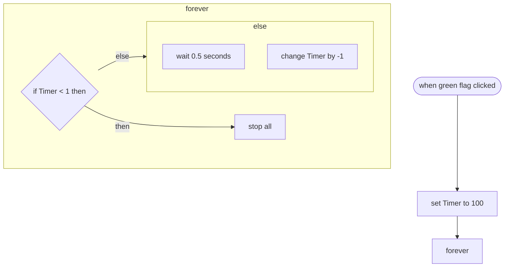

<page_number>75</page_number>

# Summary

* Computers represent everything as numbers. In fact, they can represent everything using the combination of only two numbers that are zero and one.

* Expressing numbers as a set of zeroes and ones is known as using binary numbers. In computers the numbers are represented by electronic switches.

* Expressing numbers as a set of zeroes and ones is known as using binary numbers. In computers the numbers are represented by electronic switches.

* Eight bits together makes what we call a "byte" of data. You've probably heard of how many megabytes (approximately millions of bytes) or gigabytes (approximately trillions of bytes) your computer can store. The decimal number system is defined as a number system that represents a number with a base of 10 and uses 10 symbols - 0, 1, 2, 3, 4, 5, 6, 7, 8, and 9.

* The binary number system is a number system with base 2 in which numbers are represented only by two digits, 0 and 1. The smallest unit of data in a computer is called a bit, which is the abbreviated form of 'binary digit'.

* The binary number system is the base of all computing systems and operations. It enables devices to store, access and manipulate all types of information directed to and from the CPU or memory.

* To convert numbers from decimal to binary, the given decimal number is divided repeatedly by 2 and the remainders are noted down till we get 0 as the final quotient.
A code where each number represents a character can be used to convert text into binary. One code we can use for this is called ASCII.

* ASCII code can only store 128 characters, which is enough for most words in English but not enough for other languages.

* Digital images are made up of pixels. Each pixel in an image is made up of binary numbers.

* Colors are represented in computers using 8-bit numbers. This means that a set of eight zeroes and ones is used to represent a given color component.

* The sound waves are analogue and that, in order to store the waves digitally on the computer, we need to convert the waveform into a numerical representation so that the waveform can be stored in binary. To do this, we use an Analogue-to-Digital Convertor (ADC).

* The quality and size of the file is affected by two factors - sample rate and bit rate. The sample rate refers to the number of samples taken every second and that the greater the frequency of the samples, the better the sound quality.
The bit rate refers to the number of bits used to store each sample and that the more bits that are sampled, the better the accuracy of the file but also the greater the file size.

* When we create a computer program, sometimes we need to "remember" a value so that we can use it many times in our code.

<page_number>76</page_number>

Exercise logo

Tick (✓) the Correct Answer:

1. The term      also refers to any digital encoding /decoding system in which there are exactly two possible states.

a. Digital b. Binary c. Python d. Programming

2.      bits together makes, what we call a "byte" of the data.

a. 6 b. 7 c. 8 d. 9

3. To convert numbers from decimals to binary, the given decimal numbers is divided repeatedly by      and the remainder are noted down till we get 0 or 1 as the final quotient.

a. 2 b. 3 c. 4 d. 5

4.      are made up of pixels.

a. Binary numbers b. Decimals
c. Programs d. Digital images

5. ASCII code can only store up to      characters which is enough for most of the words in English but not enough for other languages.

a. 128 b. 256 c. 64 d. 124

6.      are represented in computer using 8-bit numbers.

a. Numbers b. Letters c. Images d. Colors

7. We need      to convert the sound waves into numerical representation.

a. Audio to digital converter b. Audio to digits converter
c. Analogue to digital converter d. Analogue to digits converter

8. The best way to remember a value when designing the program is to use a     .

<page_number>77</page_number>

a. Variable b. Value

c. Number d. Binary

9. The      is/are analogue.

a. Light b. Numbers c. Values d. Sound

10. The decimal number system is a number system that represents a number with a base of     .

a. 2 b. 3 c. 5 d. 10

**Briefly answer the following questions**

1. Describe how computers can save information using binary codes.

2. Differentiate between binary and decimal number systems.

3. How does a computer convert binary numbers into decimals?

4. How does the computer convert decimal numbers into binary numbers?

5. Write a note explaining the conversion of text, image and sound representation in binary code.

**Project based Questions:**

1. Students can conduct an activity to give instructions to complete a simple task like drawing a cat or a dog. Prompt: "Make groups of two, each student should have one piece of paper and a pencil. Student 1 will draw an animal, and then using instructions only (no hand gestures or any other movement) give student 2 instructions on how to draw the same image." The learning objective is to understand that computers need specific instructions through a programming language and that instructions need to be very specific, and there is a need for standard terminology to navigate across the paper. Students can describe what kind of instructions a computer may need to be able to run programs.

2. Break down a computer/phone / online game you have played into simple instructions in the local language. Prompts/follow-up questions could include

(1) What is the objective of the game?

<page_number>78</page_number>

(2) How many sprites are there in the game?

(3) How does the player move?

(4) How does the player win (if applicable)?

(5) How does the player lose (if applicable)?

(6) What instructions have been given to the computer to make this game?

3. Create a program which uses takes input from the user to move a sprite, has at least two sprites, uses programming fundamental constructs like coordinates, conditionals, loops, and variables. Suggested prompts could be: o Add a player sprite and a "food" sprite that the player needs to chase.

4. Combining events and instructions to change coordinates, make the player sprite move right, left, up, and down when the player presses the upright arrow key, left arrow key, up arrow key, and down arrow key respectively.

5. Combining events and instructions to automatically move the "food" sprite (e.g., glide or go to a random position).

6. Create a score variable, set it to zero when the game starts, and use a conditional to change the variable when the player touches the second sprite.

**Activity Based Questions**

PCTB Textbook watermark

1. Students can conduct an activity to give instructions to complete a simple task like drawing a cat or a dog.

2. Break down a computer/phone / online game you have played into simple instructions in the local language. Prompts/follow-up questions could include

(1) What is the objective of the game?
(2) How many sprites are there in the game?

(3) How does the player move?

(4) How does the player win (if applicable)?

(5) How does the player lose (if applicable)?

(6) What instructions have been given to the computer to make this game?

3. Create a program which uses takes input from the user to move a sprite, has at least

<page_number>79</page_number>

two sprites, uses programming fundamental constructs like coordinates, conditionals, loops, and variables. Suggested prompts could be:

* Add a player sprite and a "food" sprite that the player needs to chase.

* Combining events and instructions to change coordinates, make the player sprite move right, left, up, and down when the player presses the upright arrow key, left arrow key, up arrow key, and down arrow key respectively.

* Combining events and instructions to automatically move the "food" sprite (e.g. glide or go to a random position).

* Create a score variable, set it to zero when the game starts and use a conditional to change the variable when the player touches the second sprite.

Web Version of PCTB Textbook
Not for Sale

<page_number>80</page_number>

# UNIT 5 Digital Citizenship

# Digital Citizenship

**Students Learning Outcomes**
* Explain ethics and what constitutes an ethical issue in digital environments.
* Outline the importance of being safe, responsible, and respectful online.
* Explain key concepts of copyright, plagiarism, and piracy.
* Evaluate digital media bias and messaging.
**identify:**
* Improper use of computer resources.
* Steps to secure information privacy and confidentiality.
* Possible dangers of the internet and related security measures.
**Skills:**
**Students will be able to:**
* Identify the common uses of the internet such as business, social networking, entertainment, information/news.
* Identify appropriate and inappropriate behavior when navigating the digital environment.

## 5.1 Ethics

Ethics is the discipline concerned with what is morally good and bad or morally right and wrong. The term is also applied to any system or theory of moral values or principles. Ethics is based on well-founded standards of right and wrong that prescribe what humans should do, usually in terms of rights, obligations, benefits to society, fairness, or specific virtues.

## Ethical Issues

<table>
  <thead>
    <tr>
        <th>Category</th>
        <th>Value</th>
    </tr>
  </thead>
  <tbody>
    <tr>
        <td>Central Theme</td>
        <td>Ethics For Success</td>
    </tr>
    <tr>
        <td>Value 1</td>
        <td>Honesty</td>
    </tr>
    <tr>
        <td>Value 2</td>
        <td>Responsibility</td>
    </tr>
    <tr>
        <td>Value 3</td>
        <td>Trust &amp; Respect</td>
    </tr>
    <tr>
        <td>Value 4</td>
        <td>Leadership</td>
    </tr>
    <tr>
        <td>Value 5</td>
        <td>Quality</td>
    </tr>
    <tr>
        <td>Value 6</td>
        <td>Integrity</td>
    </tr>
  </tbody>
</table>

Fig. 5.1 Ethics

An ethical issue is a circumstance in which a moral conflict arises in a society or workplace. It is a situation in which a moral standard is being challenged. Ethical issues occur when a moral problem occurs. These issues include:

* Privacy and confidentiality
* Issues related to socially vulnerable populations
* Health insurance discrimination
* Employment discrimination
* Individual responsibility

<page_number>81</page_number>

**Extra Bit!**

> Aristotle proposed that ethics is the study of human relations in their most perfect form. He called it the science of proper behavior.

* Issues related to race and ethnicity

* Implementation of laws

## 5.2 Ethics in Digital Environment

Web Version of SCERTB Textbook Not for Sale logo

Today we live in a digital world and most of our relationships have moved online to chats, messengers, social media and many other ways of online communication. We can say that identifying and obeying the principles of being online is called digital ethics.

### Ethical Issues in Digital Environment

Technology has given us many benefits such as 5G, Virtual Reality, Mixed Reality, Artificial Intelligence, Driverless vehicles, Digital Assistants, Robots, Smart Devices and automation are a few of the many technologies available. However, technology also has a variety of negative impacts, some of common Ethical issues in digital environment are given below:

Word cloud of ethics related terms including Honesty, Values, Truth, Morals, and Conduct

* Misuse of Personal Information

* Misinformation and Deep Fakes

* Lack of Oversight and Acceptance of Responsibility

* Social and Political Instability

### Importance of being safe, responsible, and respectful online

As we spend most of our time online and store most of the things online, it is therefore very important to understand how to protect both our devices and our information from malicious elements online. Leaving your devices unprotected can result in anything as small as a slower computer, right through to losing all the money in your bank account, to identity theft.

Good digital citizen will encourage positive and healthy interactions online, maintaining awareness of common online scams or toxic behavior. They will avoid cyber-bullying on social media or other digital platforms, focusing on empathy when interacting with others online. Following are some important activities of Digital Citizens being online:

<page_number>82</page_number>

## Responsible Digital Citizenship

You must understand the consequences of posting photos and videos, and uploading other personal content. Once this content is online, it is very hard to get rid of and can become part of your permanent online reputation. Also, photos can be altered or shared without your permission.

All Good Digital Citizens: Protect private information for themselves and others, Respect themselves and others, Stay safe online, Stand up to Cyberbullying when they see it happening, Balance the time they spend online and using media, Respect copyright and intellectual property, Carefully manage their Digital Footprint

## Respectful Digital Citizen/Be Respectful when online

Fig. 5.2 Characteristics of good Digital Citizen

Respect for yourself and other people is important in all relationships, and it's no different when you are online. You should treat online friends with as much respect as face-to-face friends. We can achieve this by not creating or forwarding nasty or humiliating emails, images or text messages about anyone else.

## Protect Your Reputation

Being a responsible digital citizen means having the online social skills to take part in online community life in an ethical and respectful way. Responsible digital citizenship also means:

* Behaving lawfully

* Protecting your privacy and that of others

* Recognizing your rights and responsibilities when using digital media

* Thinking about how your online activities affect yourself, other people you know, and the wider online community.

## Properties of Good Digital Citizen

Respect the rights of others.

* Practice tolerance

* Be informed about the world around you.

* Respect the property of others.

* Be compassionate.

* Take responsibility for your actions.

* Pay taxes

Illustration of digital media icons and devices

### Extra Bit!

> If you are getting nasty or bullying comments, you should block or unfriend people who do not treat you with respect.

<page_number>83</page_number>

## Protect your privacy

There are several ways you can protect your privacy being online:

* Share only as much personal information as necessary

* Keep privacy settings up to date on social media sites, so your profile is not publicly available.

* Keep passwords private.

* Check the location settings and services on smart phones, tablets and apps.

<table>
  <thead>
    <tr>
        <th></th>
        <th>ONLINE PRIVACY PROTECTION</th>
    </tr>
  </thead>
  <tbody>
    <tr>
        <td>LOGIN</td>
        <td>Password</td>
    </tr>
    <tr>
        <td>100%</td>
        <td>Autonomy</td>
    </tr>
    <tr>
        <td>Security</td>
        <td>Search?</td>
    </tr>
    <tr>
        <td>DATA</td>
        <td>Card***</td>
    </tr>
  </tbody>
</table>

## Keep an Eye Out for Scams

There are numerous ways cybercriminals can scam someone online. Many of these scams can be avoided with the right knowledge and tools. Here are three common scams you should look out for:

* **Phishing:** In phishing a scammer sends you a malicious link, designed to trick a person into revealing sensitive information to the attacker. Phishing allows the attacker to observe everything while the victim is navigating the site, and transverse any additional security boundaries with the victim.

Fig. 5.3 Phishing

Illustration of a laptop with a red exclamation mark on an envelope, representing a phishing scam

Fig. 5.4 Fake Website

* **Fake Websites:** Fake Websites are common with shopping website, cybercriminals will create a fake site to require you to enter personal information and misuse it afterwards.

* **Tech Support Scams:** Fake tech support agents will often ask for login information or remote access to your computer. They will then ask for money to fix your computer, this is a red flag! A real tech support agent would not usually ask for any payment.

Warning message on a computer screen claiming viruses were detected and providing a fake tech support number

Fig. 5.3 Fake Warning

## 5.3 Uses of Internet

Positive uses of the Internet makes our lives easy and simple. The Internet provides us with useful data, information, and knowledge for personal, social, and economical development. Some of the common uses of Internet are:

### 5.3.1 Use of Internet in Business

Internet has become an integral part of your business these days. Applications of the Internet in business have long ago surpassed email and having a basic website. Some common usages of internet in Business are as under:

<page_number>84</page_number>

## 5.3.2 Uses of Internet in E-commerce

According to the U.S Census Bureau E-commerce accounted for 14 percent of all retail sales in 2020. E-commerce is an important part of the economy. Government services are increasingly available over the Internet, for consumers and businesses alike. Many businesses such as Amazon and Shopify stores, always operate on the Internet for all sales and customer interactions.

E-commerce illustration showing various online shopping icons around a computer screen

## 5.3.3 Marketing and CRM

<table>
  <thead>
    <tr>
        <th>Funnel Stage</th>
        <th>Category</th>
    </tr>
  </thead>
  <tbody>
    <tr>
        <td>Raw Leads</td>
        <td>Marketing Automation</td>
    </tr>
    <tr>
        <td>Viable Leads</td>
        <td>Marketing Automation</td>
    </tr>
    <tr>
        <td>Nurtured Leads</td>
        <td>Marketing Automation</td>
    </tr>
    <tr>
        <td>Active Leads</td>
        <td>Marketing Automation</td>
    </tr>
    <tr>
        <td>Marketing Qualified Leads</td>
        <td>Marketing Automation</td>
    </tr>
    <tr>
        <td>Sales Accepted Leads</td>
        <td>CRM</td>
    </tr>
    <tr>
        <td>Opportunities</td>
        <td>CRM</td>
    </tr>
    <tr>
        <td>Closed / Won</td>
        <td>CRM</td>
    </tr>
  </tbody>
</table>

Fig. 5.7 CRM

CRM stands for Client Relationship Management (CRM), is a software that encompasses a wide range of data to help businesses to better serve their customers, increase purchases and to find new customers. CRM analytics allows businesses to customize interactions to fit individuals, rather than offering the same generic interaction with everyone. Furthermore tools like Facebook Pixel, can target new customers based on websites they visit, posts they like and even the videos they watch on YouTube.

## 5.3.4 Collaboration and Document Storage

Tools like Google Drive and Microsoft OneDrive and Dropbox allow you to collaborate on projects in real time, regardless of where they are located. you can update, edit and comment on documents as they are being drafted while permission to access and edit the documents can be controlled by the creator of the file.

## 5.3.5 Videoconferencing, Chat and Remote Employees

Many businesses are integrating some remote work into their normal operations for the foreseeable future, reducing costs associated with housing employees while using video conferencing, in-house chat applications and social media to keep their teams together even when they're physically distant.

Businesses are also embracing video conferencing and online chat for customer interactions. Automated chatbots integrated into a company's website can answer client questions quickly, without having to wait for an online representative to answer common questions(Like using internet in Business).

Illustration of a person working remotely on a laptop with a cat nearby

Fig. 5.8 Working Remotely

<page_number>85</page_number>

## 5.3.6 Uses of Internet in Social Networking

Illustration of a web social network with a computer and various icons The term social networking refers to the use of internet-based social media sites to stay connected with friends, family, colleagues, or customers. Social networking can have a social purpose, a business purpose, or both, through sites like Facebook, Twitter, Instagram, and Pinterest etc.

Social networking also involves the development and maintenance of personal and business relationships using technology.

## 5.3.7 Uses of Internet in Entertainment

You are probably already paying for an internet connection at home to make sure you have email and social media access. From there, you can locate and enjoy plenty of content on the internet from your phone, TV or computer. Popular, free online entertainment resources include:

* YouTube videos
* Podcasts
* Music streaming such as Pandora or Spotify
* News sites such as ARY, Geo, Bol News, Dunia News and National Public Radio etc.
* Game sites, including King.com and Miniclip

Collage of various social media and internet service logos including LinkedIn, foursquare, YouTube, vimeo, facebook, twitter, Blogger, flickr, tumblr, and others

Fig. 5.9 Internet in Entertainment

## 5.4 Copyright

Copyright is a type of intellectual property rights that protect original works of an owner. In copyright law there are different types of works, including paintings, photographs, illustrations, musical compositions, sound recordings, computer programs, books, poems, blog posts, movies, architectural works, plays, and so much more.

Copyright seal with the word COPYRIGHT in a red circle and banner

Fig. 5.10 Copyright

## 5.5 Plagiarism

Presenting other's work or ideas as your own, with or without consent is called plagiarism. This covers all published and unpublished material whether in electronic or in printed form. Plagiarism is academic dishonesty and a disciplinary offence.

### Types of plagiarism

There are various types of plagiarism some of them are:

* **Global plagiarism** means plagiarizing an entire text.
* **Paraphrasing plagiarism** means rephrasing someone else's ideas and presenting them as if they were your own original thoughts.
* **Patchwork plagiarism** means copying phrases and ideas from different sources and compiling

<page_number>86</page_number>

them into a new text.

*   **Self-plagiarism** means recycling previous work that you've already submitted or published.

## 5.6 Piracy

The act of illegally reproducing copyrighted material, such as books, computer programs, and films is called piracy. It is an act of criminal violence with the goal of stealing others ideas and innovations.

## 5.7 Digital Media Bias

Media bias occurs when a news outlet allows opinions to affect the news they report. Media criticism is the act of examining and analyzing the messaging in mass media. A media outlet may reveal bias in how it reports specific news stories or which stories they choose to cover, i.e., suppose more important than others to cover or emphasize.

### Types of Media Bias

Media Bias includes:

*   Slant Bias

*   Spin Bias

*   Sensationalism Bias

*   Story choice Bias

*   Word choice Bias

*   Omission Bias

Illustration of a laptop with a skull and crossbones on the screen and a progress bar at 75%
Watermark text: Web Version of PCTB Textbook Not for Sale

Media bias manifests in the selection of news stories (what the editors find most relevant or important) and how they are covered.

## 5.8 Importance of Unbiased Media

An unbiased manner is generally considered to be a good thing. It is important for news channels to do their best to provide a balanced view, to gather perspectives across the political spectrum, to become aware of different worldviews, and to avoid the types of media bias. Designating a media

Stop sign icon with text "STOP media bias"

source as "unbiased" can also be a way to hide bias or hush criticism, debate and dialogue.

Unbiased news that evenly and fairly represents multiple perspectives on contentious issues is a good thing. Biased news given from a conservative perspective is also an important part of the media landscape, as long as the outlet makes its bias transparent.

<page_number>87</page_number>

# How to Avoid Media Bias

The following things we can do when the problems are associated with media bias:

* Provide multiple perspectives on news and issues to empower the reader.

* Strengthen our media literacy skills.

* Try to get all sides of an issue.

* When it comes to news outlets, watch different channels with different tendencies

* Remember if it sounds too good to be true, it probably is?

* Read the footnotes and caveats in advertisements, or promotions

Web Version of PCB Textbook Not for Sale

## 5.9 Misuse of Computer Resources

Misuse of computer resources are not limited to physical misuse, it also includes:

* **Unauthorized access:** Accessing computers, computer software, computer data, or networks without authorization

* **Improper use:** Using computer resources for a purpose other than the purpose for which they were intended or authorized.

* **Illegal use:** Violating any software licensing or copyright.

* **Interfering with others:** Harassing or threatening other users or interfering with their access to SAO (Service Oriented Architecture) computing facilities (that's piracy).

* **Improper alteration of system files:** Unauthorized modification of accounting system files or audit trails to alter or delete records of use.

Illustration of a hooded hacker using a laptop with email icons in the background

Fig. 5.11 Illegal use of computer

## 5.10 How to Secure Information Privacy and Confidentiality

"**Privacy**" is a person's right to have some control over how his or her personal information is used, collected, and shared. "**Confidentiality**" refers to the extent information is able to be kept secret.

Maintaining your online privacy is a big issue. Not knowing how to protect your personal information online can cost hugely. It can also lead to personal stress or worse if the wrong people get hold of your personal data. Following are

Illustration of a person using a key to unlock a digital folder

Fig. 5.12 Security of your personal Data

<page_number>88</page_number>

some important tips that you should follow to secure your information privacy and confidentiality.

Key icon

**Pick strong and unique passwords**

Too many people pick passwords that are easy to remember and are obviously linked to their personal lives, instead of words which are difficult to guess or break. You should pick strong passwords mixing capitalized letters, numbers and symbols, and vary your passwords as much as possible.

VPN icon

**Use a VPN**

Nowadays, most of the web users take advantage of Virtual Private Networks (VPN) to add an extra layer of personal privacy on the internet. These tools encrypt data that leaves your computer and route it via third-party servers.

Email icon

**Avoid clicking on links and attachments in emails**

Email phishing has reached at extreme level. Every day, we seem to receive messages asking us to believe hard luck stories or click on strangely worded links. Often, these messages look extremely convincing and can persuade people that they really do have to hand over their details to them.

In case of an attachment, make sure you also scan it with anti- malware software first.

http://www icon

**Log out of any website properly**

If you do not log out of websites, you can leave the door open to anyone else to access your accounts. It is like leaving your wallet in a store that you intend to return hte next day. This is important for laptop users because if your computer gets stolen, a thief can easily access private data with the help of automatic logins. If you use auto logins because you cannot remember all the different passwords, you should use a password manager instead.

Incognito mode icon

**Use your browser's incognito mode**

If you cannot use a VPN, at least ensure that the next person who uses this computer cannot see your browsing history by turning on the "incognito mode." It also deletes cookies and temporary files which can track your online activity.

Anti-malware icon

**Keep your anti-malware up to date**

Trojan horses and worms can infect your computer and feed whatever you type straight to the hands of criminals. You can avoid this kind of infection by keeping your anti-malware software up to date.

Web Version of PCTB Textbook watermark

<page_number>89</page_number>

BEWARE OF WHAT YOU SHARE ONLINE! logo

**Be careful what you share online**

These days, social media is most people's online activity. But the popularity of platforms like Instagram and Twitter have made them a hotspot for phishers and other cyber-criminals. This makes it vital to focus on protecting your privacy on social media. So be careful about publicly sharing your identity, location, and your date of birth.

## 5.11 Possible Dangers of the Internet

The Internet is a great place to find information, but it's also full of dangers. These dangers can be hard to avoid, and they are often overlooked by the average user. We will discuss some of common dangers of Internet:

Illustration of a person using a laptop with binary code overlay

Fig. 5.13 Dangers of Internet

Social media icons (Snapchat, Facebook, Pinterest, Twitter, Instagram) surrounding a person's hands

**Depression and Anxiety**

Depression and Anxiety icon

Spending too long on social networking sites could adversely affect your mood. In fact, chronic social users are more likely to report poor mental health, including symptoms of anxiety and depression.

Fig. 5.14 Depression and Anxiety

**Cyberbullying**

Before social media, bullying was something that was only possible to do face-to-face. However, now people can bully others online. Cyberbullying is a form of bullying using electronic means.

Cyberbullying are also known as online bullying. It has become increasingly common, especially among teenagers, as the digital sphere has expanded and technology has advanced.

Illustration of a person sitting hunched over in front of a laptop, looking sad

Fig. 5.14 Cyberbullying

**Example:** Cyberbullying is when someone bullies or harasses others on the internet and other digital spaces, particularly on social media sites.

**FOMO (Fear of Missing Out)**

Fear of Missing Out (FOMO) is a phenomenon that became prominent around the same time as the rise of social media. Unsurprisingly, it is one of the most widespread negative effects of social media on society. People keep on posting online only due to the fear that they are also spending a wonderful life and they are also important.

<page_number>90</page_number>

FOMO illustration with people and social media icons

Fig. 5.15 FOMO

**Unrealistic Expectations**

As most people are probably aware, social media forms unrealistic expectations of life and friendships in our minds. Most social media sites have a severe lack of online authenticity. People share their exciting adventures, post about how much they love their significant other on social Media with heavily staged photos.

**Unhealthy Sleep Patterns**

Other bad thing about social media is that spending too much time on it can lead to poor sleep. If you feel that your sleep patterns have become irregular, leading to a drop in productivity, try to cut down on the amount of time you browse social media.

Web Version of CTB Textbook Not for Sale watermark

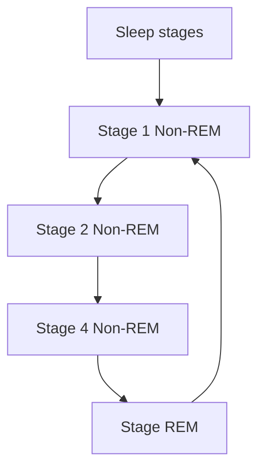

Fig. 5.16 Sleep Stages

<page_number>91</page_number>

# Summary

* Ethics is the discipline concerned with what is morally good and bad or morally right and wrong.

* An ethical issue is a circumstance in which a moral conflict arises in a society or workplace.

* Identifying and obeying the principles of being online is called digital ethics.

* Leaving your devices unprotected can result in anything as small as a slower computer, right through to losing all the money in your bank account, to identity theft.

* Being a responsible digital citizen means having the online social skills to take part in online community life in an ethical and respectful way.

* In phishing a scammer sends you a malicious link, designed to trick a person into revealing sensitive information to the attacker.

* Positive use of the Internet makes our lives easy and simple. The Internet provides us with useful data, information, and knowledge for personal, social, and economic development.

* According to the U.S Census Bureau, E-commerce accounted for 14 percent of all retail sales in 2020.

* Client Relationship Management (CRM) is a software that encompasses a wide range of data to help businesses to better serve their customers, increase purchases and to find new customers.

* The term social networking refers to the use of internet-based social media sites to stay connected with friends, family, colleagues, or customers.

* Copyright is a type of intellectual property rights that protect original works of an owner.

* Presenting other's work or ideas as your own, with or without consent is called plagiarism.

* The act of illegally reproducing copyrighted material, such as books, computer programs, and films is called piracy.

* Media bias occurs when a news outlet allows opinions to affect the news they report.

* Spending too long on social networking sites could adversely affect your mood.

* Fear of Missing Out (FOMO) is a phenomenon that became prominent around the same time as the rise of social media.

* As most people are probably aware, social media forms unrealistic expectations of life and friendships in our minds.

<page_number>92</page_number>

Exercise logo

Tick (✓) the Correct Answer:

1. The ways of online communication involve:

a. Social media [ ] b. Messengers [ ] c. chats [ ] d. All [ ]

2. Leaving your devices unprotected can result in:

a. Slow down your computer [ ] c. Fast your computer [ ]
b. Gain money [ ] c. All [ ]

3. In      scammer sends you a malicious link, designed to trick a person into revealing sensitive information to the attacker

a. Fake Websites [ ] b. Tech Support [ ] c. Phishing [ ] d. None [ ]

4. Fake      agents will often ask for login information or remote access to your computer.:

a. Fake Websites [ ] b. Tech Support [ ] c. Phishing [ ] d. None [ ]

5. Which of following is not use of internet

a. E-commer [ ] b. CRM [ ] c. SRM [ ] d. All [ ]

6. CRM stands for:

a. Client Relationship Model [ ] c. Client Relationship Management [ ]

b. Customer Relation Module [ ] d. Client Relation Module [ ]

7. The term      refers to the use of internet-based social media sites.

a. social networking [ ] c. social websiting [ ]

b. media networking [ ] d. websiting [ ]

8.      is a type of intellectual property rights that protect original works of an owner.

a. cyberbulling [ ] b. plagiarism [ ] c. piracy [ ] d. copyright [ ]

9. illegally reproducing copyrighted material, such as books, computer programs, and films is called.

a. cyberbulling [ ] b. plagiarism [ ] c. piracy [ ] d. copyright [ ]

<page_number>93</page_number>

10. Accessing computers, computer software, computer data, or networks without authorization is called:

a. unauthorized access [ ]
c. authorized access [ ]
b. illegal use [ ]
d. improper experiments [ ]

## Answer the following questions briefly

1. Define Ethics.

2. Justify that plagiarism is an offence.

3. Define Phishing in your words.

4. Enlist issues of digital ethics.

5. Discuss any three uses of internet in business.

6. Define CRM.

7. Discuss use of internet in Entertainment.

8. Define copyright in your words.

9. Differentiate between piracy and plagiarism.

## Answer the following questions in detail

1. Define Ethics in digital environment.

2. Discuss the importance of being safe and responsible digital citizenship.

3. How can we protect our reputation online?

4. How can we avoid Media Bias?

5. Enlist the misuse of computer resources.

6. Discuss the impacts of Media Bias.

7. How can we say that Tech Support scams are harmful?

8. What do you mean by responsible digital citizen?

## Project Based Questions

1. Students will work in groups and present how to protect their online identity and computer

2. The teacher will place students in groups, and request each group to prepare a chart of ethical rules regarding the use of ICT. Students will present their posters, and the teacher can display posters in class.

3. The teacher can hold a debate, where two students can argue for and against the impact of using social media. The debate can include positives of social media, and students listening to the debate can vote for the winning debater. The teacher can ask reflection questions about the advantages of social media, such as connection to

Web Version of PCTB Textbook Not for Sale

<page_number>94</page_number>

distant friends and relatives, selling goods & services, advertising revenue, learning more about culture and the world, entertainment, etc. The teacher can also ask reflection questions related to the negative impact of social media, such as health.

**Activity Based Question**

1. The teacher will place students in groups, and ask each group to prepare a chart of ethical rules regarding the use of ICT. Students will present their posters, and the teacher can display posters in class.

Web Version of PCTB Textbook
Not for Sale

<page_number>95</page_number>

# UNIT 6 Entrepreneurship in Digital Age

## Students learning Outcomes

After completing this unit students will be able to:

* Define Business Plan and its components.

* Describe the basics of the components of a business plan.

* Explain the concept of promotion, value proposition, and quality assurance.

* Discuss the importance of project management and media literacy as a tool for a business plan.

* Understand the difference between payment and transactions.

* Describe and apply the tools and techniques used for digital marketing.

* Design and develop a digital marketing plan and its component.

* Discuss Search Engine Optimization (SEO), using social media websites such as Instagram, Twitter, and Blogs.

* Analyze how technology is an enable in entrepreneurship.

* Name and describe the digital platforms that can be used for entrepreneurship.

## 6.1 Business plan:

A business plan is one of the most integral steps in setting your journey to run a successful business, whether as a sole trader, partnership or limited company.

### 6.1.1 Define business plan and its components:

A business plan is an essential written document that provides a detailed description and a complete overview of the company's future. All businesses must have a business plan. This plan should explain the business strategy and the key goals to get from where you are now to where you want to be in the future. It is also an important tool for an established company that's moving in a new direction. It can also act as a benchmark for the performance of your company.

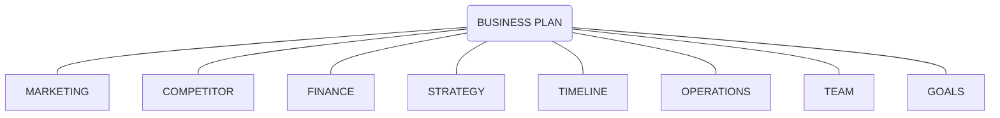


Web Version of PCTB Textbook Not for Sale watermark

<page_number>96</page_number>

**Key Sections of Business Plan:**

1. An executive summary

2. A business description

3. Detail of market strategies

4. Competitor analysis

5. A design and development plan of your products and services

6. Information about your operations and management plan

7. Financial information, planning and factors

<table>
  <thead>
    <tr>
        <th>Number</th>
        <th>Component</th>
    </tr>
  </thead>
  <tbody>
    <tr>
        <td>1</td>
        <td>Executive Summary</td>
    </tr>
    <tr>
        <td>2</td>
        <td>Research &amp; Due Diligence</td>
    </tr>
    <tr>
        <td>3</td>
        <td>Define Products &amp; Services</td>
    </tr>
    <tr>
        <td>4</td>
        <td>Marketing Plan</td>
    </tr>
    <tr>
        <td>5</td>
        <td>Strategic Plan</td>
    </tr>
    <tr>
        <td>6</td>
        <td>Operational Plan</td>
    </tr>
    <tr>
        <td>7</td>
        <td>Financial Plan &amp; Projections</td>
    </tr>
  </tbody>
</table>

* **Executive summary:**

This may include a table of contents, company background, market opportunity, management overviews, competitive advantages, and financial highlights.

* **Business description and structure:**

This is where you explain in detail why you are in business and what products are you selling. You also describe your manufacturing process, availability of materials, how you handle inventory and fulfillment, and other operational details. However, if you are providing services, describe them and their value proposition to customers. Include other details such as strategic relationships, administrative issues, intellectual property you may own, expenses, and the legal structure of your company.

* **Competitor Analysis:**

For any business to initiate in a market, the research should always be done on the competitors of that business. A complete and thorough research is always helpful in designing suitable strategies to meet the demand and supply of the product/ service being offered.

* **Development plan of your products:**

This is a path way of how the plan will be executed and implemented. The production of the product/service being offered needs to follow a set of formulated instructions in order to come into being. It has to be a set procedure with measures of quality control and scrutinized actions.

* **Market research and strategies:**

Elaborate on your market analysis and explain your marketing strategy, including sales forecasts, deadlines and milestones, advertising, public relations to formulate a successful business plan. That's how you combat your competition. If you can't produce a lot of data analysis, you can provide testimonials from existing customers.

* **Management and personnel:**

Provide bios of your company executives and managers and explain how their expertise will help you meet business goals. Investors need to evaluate risk, and often, a management team with lots

<page_number>97</page_number>

of experience may lower perceived risk.

* **Financial documents:**

This is where you provide the numbers and digits that back up everything you explained in your organizational and marketing sections. Include conservative projections of your profit and loss statements, balance sheet, and your cash flow statements for the next three years.

## 6.2 Promotion

Promotions can be defined as the entire set of activities, which communicates the product, brand or service to the user. The idea is to make people aware, attract and induce to buy the product, in preference over others.

There are numerous types of promotions. Promotions include advertisments, press releases, consumer promotions (schemes, discounts, contests), while below the line include trade discounts, freebies, incentive trips, awards and so on. Sales promotion is a part of the overall promotion effort.

Illustration of a megaphone surrounded by various communication and social media icons like SMS, email, and speech bubbles

> **Do you Know?**
>
> The term value proposition is believed to have first appeared in a McKinsey & Co. industry research paper in 1988, which defined it as "a clear, simple statement of the benefits, both tangible and intangible, that the company will provide, along with the approximate price it will charge each customer segment for those benefits."

## 6.3 Value proposition

A value proposition in marketing is a concise statement of the benefits that a company is delivering to customers who buy its products or services. It serves as a declaration of intent, both inside the company and in the marketplace.

## 6.4 Quality assurance

The quality assurance is a process that helps a business adheres to its product's quality standards set by the company or its industry. Another way to define the quality assurance is that it is the company's process for improving the quality of its

```mermaid
graph TD
    A((QUALITYASSURANCE))
    B[MONITORANDCONTROL] --> C[IDENTIFYISSUES WITHPROCESS]
    C --> D[GENERATECORRECTIVEACTIONS]
    D --> E[VERIFYCORRECTIVEACTION]
    E --> F[IMPLEMENTCORRECTIVEACTION]
    F --> B
    A --- B
    A --- C
    A --- D
    A --- E
    A --- F
```

<page_number>98</page_number>

products.

Many businesses view their quality assurance program as a promise to internal stakeholders and customers that the company will deliver high-quality products that provide a positive user experience.

It is for this reason that quality assurance is a broad process for preventing quality failures. The quality assurance team is involved in all stages of a product's development that are production, testing, packaging, and delivery. In contrast, quality control is a narrower process. Quality control focuses on detecting mistakes, errors, or missed requirements in a product.

## 6.5 Importance of Project Management and Media Literacy:

It is pertinent to know how an organization perceives project management. Handling projects tends to be an intimidating task hence, It requires a thorough understanding of project scheduling, planning, reporting, tracking, and the importance of project management. To become a competent project manager, you are required to have a detailed understanding of project management and the importance of project management in addition to its various job roles.

Illustration of project management concepts featuring a person in a gear surrounded by icons for communication, tools, time, and data.

As defined by the Project Management Institute, "Project management is about the application of skills knowledge, tools, and techniques to project activities to meet project requirements." It also involves various policies, principles, and procedures to guide a project from the initial stage until its completion. The landscape of project management is changing with every passing day. Project management also brings leadership and direction to projects.

Media literacy enables the population to understand and contribute to public discourse, and, eventually, make sound decisions when electing their leaders. People who are media literate can adopt a critical stance when decoding media messages, no matter their views regarding a position.

## 6.6 Payments:

Payment is the voluntary transfer of money, equivalent, or other valuable items from one person to another in exchange for goods or services received or to meet a legal obligation. The person who

<page_number>99</page_number>

gives the money is often known as the payer, while the person who gets the money is called the payee.

Payment is the exchange of money, goods, or services for goods in an acceptable amount to both parties and has been agreed upon in advance. You can pay with cash, a cheque, a wire transfer, a credit card, a debit card, or even crypto currency.

## 6.7 Transactions:

A transaction is a complete agreement between a buyer and a seller to exchange goods, services, or financial assets in return for money. The term is also commonly used in corporate accounting. In business bookkeeping, this plain definition can get tedious.

### 6.7.1 Difference between payments and transactions:

A payment is the trade of value from one party (such as a person or company) to another for goods, or services, or to fulfill a legal obligation. Payment can take a large variety of forms. Barter, the exchange of one good or service for another, is a form of payment. A transaction is an agreement between a buyer and a seller to exchange goods, services or financial instruments.

This can be called an instance of buying or selling something.

In accounting, the events that affect the finances of a business must be recorded manually/electronically, this will be called accounting transaction.

## 6.8 Tools and techniques used in digital marketing:

Technology has vastly risen in popularity and importance in the business world over the last decade, this is why it is important to realize what marketing strategies play an important part in helping companies digitally improve their sales and brand image.

There are 9 different digital marketing techniques:

1. **Social media Marketing:** A strong presence on social media platforms is the most important digital marketing tool. There are many ways to promote a brand's social media presence. This is now considered an essential technique to grow digitally.

2. **Search engine Optimization:** Search Engine Optimization is a digital marketing technique that involves creating more traffic to a website by making sure a website appears higher up in the results of a search engine like Google. This technique aids a business in marketing by improving a brand's awareness.

3. **Email marketing:** Email is a great marketing technique to get customers to return to a brand and purchase new products. First, a company must get people to sign up for an email list after they have made a purchase which can be associated with a process of getting customer loyalty and relation building. Then, based on the knowledge they receive from the emails, it is highly likely these customers will return.

<page_number>100</page_number>

**4. Content Marketing:** Content marketing is creating valuable and relevant content consistently on platforms. A brand can practice content marketing as a tool to achieve better brand awareness by marketing itself as a company that is in touch with and important to the world.

**5. Video marketing:** Video marketing works in coherence with content marketing and is also a popular technique in digital marketing because of the easy access to videos that technology has provided. By creating quality commercials, companies can inflict a long-lasting brand image on its audience heads and get them to think about purchasing.

**6. Web advertising:** Brands can get themselves more effective marketing and advertising by creating clickable advertisements to put on popular websites.

Illustration of a computer screen with social media icons (Google+, Instagram, LinkedIn, Pinterest, Twitter, Facebook, WhatsApp, YouTube) and a bar chart

**7. Affiliate advertising:** Affiliate advertising is when a brand pays to have a valuable spokesperson with a large audience, usually a blogger or social media influencer, to post about their company so that a company can increase its circulation.

### Affiliate marketing

```mermaid
graph LR
    A[Advertiser] -- "① partners with" --> B[Publisher]
    B -- "② promotes to" --> C[Customer]
    C -- "③ buys from" --> A
    A -- "④ pays" --> B
```

**8. Overall personalization:** Personalizing brand awareness and creating a unique style can make people believe whether a company is successful or not.

**9. Creating an App:** The last of the popular digital marketing techniques is creating an app. Creating an app for a brand can give viewers an accessible means of communication and show

<page_number>101</page_number>

where to purchase and get notified about new products.

## 6.9 Search Engine Optimization:

SEO stands for "search engine optimization." It means the process of improving your site to increase its visibility when people search for products or services related to your business in Google, Bing, and other search engine. The better visibility your pages have in search results, the more likely you are to gain attention and attract prospective and existing customers to your business.

SEO is a fundamental part of digital marketing because people make trillions of searches every year, often with commercial intent to find information about products and services. Search is often the primary source of digital traffic for brands and complements other marketing channels. Greater visibility and ranking higher in search results than your competition can have a material impact on your bottom line.

### The SEO Pyramid

For optimal results, start with a strong base, and build you way up.

```mermaid
graph TD
    A[SOCIALSite UserEngagement FeaturesSocial Media & Viral Marketing]
    B[LINK BUILDINGManual Requests & Link CreationScalable, content-Based Link Strategies]
    C[KEYWORD RESEARCH & TARGETINGKeyword Brainstorming term/ Phrase SelectionOn-Page Targeting-Titles, Metas, URLs, H1s, Text, Internal Anchor text]
    D[ACCESSIBLE, QUALITY CONTENTUnique text content bot Accessibility URL StructureInternal Link Architecture Sitemaps Server Response Codes]

    A --- B
    B --- C
    C --- D
```

## 6.9.1 Twitter twitter logo

Twitter emerged from the podcasting venture Odeo, which was founded in 2004 by Evan William, Biz Stone, and Noah Glass. Apple announced in 2005 that it would add podcasts to its digital media application iTunes, and Odeo's leadership felt that the company could not compete with Apple.

<page_number>102</page_number>

and a new direction was needed. Odeo's employees were asked about any interesting side projects they had, and engineer Jack Dorsey proposed a short message service (SMS) on which one could send/ share small bloglike updates with friends. Glass proposed the name Twttr. Dorsey sent the first tweet ("just setting up my twttr") on March 21, 2006, and the completed version of Twitter Debuted in July 2006. Seeing a future for the product, in October 2006 Williams, Stone, and Dorsey bought out Odeo and started Obvious Corp. to further develop it.

## 6.9.2 Snapchat Snapchat icon

Spiegel and his co-founder, Bobby Murphy, told Forbes that they met at Stanford University and created Peekaboo, the first version of Snapchat, in the spring of 2011. They wanted to create an app that would send photos that would eventually disappear, and the initial Picaboo app was launched in the iOS App Store in July -- to little fanfare.

This led them to integrate a workaround solution to the screenshot problem: Users could take screenshots on their iPhones, rendering the disappearing effect of Picaboo messages useless. Instead, they built a notification so users would be able to see if someone took a screenshot of their disappearing photo.

In September, Spiegel and Murphy rebranded the app as Snapchat, added the ability to caption photos, and relaunched in the iOS App Store. They focused on the app's technological innovations, more than branding and marketing to make the experience more dynamic than traditional advertising.

## 6.9.3 Blogs Blog icon

A blog (a shortened version of "weblog") is an online journal or informational website displaying information in reverse chronological order with the latest posts appearing first, at the top. It is a platform where a writer or a group of writers share and express their views on an individual subject and put it before the audience of the entire globe.

## 6.10 Technology as an enabler in entrepreneurship:

Whilst 'entrepreneur enabling' is about working with and supporting individuals, entrepreneurship enablers are those who make it possible for entrepreneurs to emerge and grow in the first place. They affect the infrastructure and the culture that others demonstrate is important in regeneration. Technology plays a very important role in todays' world of modernization to help grow an entrepreneurship.

```mermaid
graph TD
    A((Digital Enabler)) --- B((Digital Technology))
    B --- C((Digital Outcome))
    B --- D((Digital Context))
    A --- C
    A --- D
    C --- D
```

<page_number>103</page_number>

```mermaid
graph TD
    A[ICT AS ENABLER*Provides Opportunities**Creates Constraints*] --> C(New Business Process)
    B[ICT AS IMPLEMENTER*Provides Modeling Tools**and Systems Engineering*] --> C
```

# 6.11 Digital Platforms used for Entrepreneurship

Entrepreneurship is widely advocated as a primary driving force of innovation and economic growth. Given today's technological and digital challenges, digital entrepreneurship in particular is a phenomenon on the rise, both through the digitization of existing businesses and the creation of digital enterprises.

Platforms (in the context of digital business) exist at many levels. They can range from high-level platforms that enable a platform business model to low-level platforms that provide a collection of business and/or technology capabilities that other products or services consume to deliver their own business capabilities.

Illustration of a digital brain with various technology icons like cloud, email, settings, and data charts

Some common and the most renowned examples of successful digital platforms are: Social media platforms like Facebook, Twitter, Instagram, and LinkedIn.

A Digital Business Platform provides a mechanism to recombine the technologies in ways to deliver new business capabilities in innovative and transformative ways. It provides a logical layer that separates the business logic for digital transformation from the technology applications that power it.

<page_number>104</page_number>

**Digital platforms:**

* Social media and media-sharing platforms, like Instagram or YouTube.

* Knowledge platforms, such as Quora or Reddit.

* Service-orientated platforms, like Airbnb.

* Ecommerce platforms, like Alibaba

```mermaid
graph TD
    Center["Types ofPlatform BusinessModels"] --- SocialMedia["**Social MediaPlatforms**(e.g Facebook,Linkedin, and Twitter)"]
    Center --- Communication["**CommunicationPlatforms**(e.g WhatsApp, Skype,WeChat, and LINE)"]
    Center --- Search["**SearchPlatforms**(e.g Google, Bing,Yahoo, and Safari)"]
    Center --- SharingEconomy["**Sharing Economy Platforms**• Sharing of capacity-constrained assetsand resources (e.g. cars and bicycles)• Peer-to-peer sharing (focus of thisarticle, e.g, Airbnb and Uber)• Sharing of platform owner-providedassets (e.g. ZipCar)• Sharing of capacity-unconstrainedresources (e.g. file, music, andinformation sharing; mostly peer-to-peer)"]
    Center --- Matching["**MatchingPlatforms**(e.g TaskRabbit, Tinder,and e-Harmony)"]
    Center --- ContentReview["**Content & ReviewPlatforms**(e.g YouTube,TripAdvisors, and Yelp)"]
    Center --- Booking["**BookingAggregators**(e.g Booking.com,Expedia, and Pagoda)"]
    Center --- Retail["**RetailPlatforms**(e.g Amazon, Etsy,Ebay, and Craiglist)"]
    Center --- Payment["**Payment Platforms**(e.g PayPal, Alipay, andVisa)"]
    Center --- Development["**DevelopmentPlatforms**(e.g appstores and,gaming consoles)"]
    Center --- Crowdsourcing["**Crowdsourcing &CrowdfundingPlatforms**(e.g InnoCentive andKickstarter)"]
```

<page_number>105</page_number>

# Summary

* A business plan is an essential written document that provides a detailed description and a complete overview of the company's future.

* A business plan should include seven key sections:

    * an executive summary

    * a business description

    * details of market strategies

    * competitor analysis

    * a design and development plan of your products and services

    * information about your operations and management plan

    * financial information, planning and factors

* Promotions can be defined as the entire set of activities, which communicates the product, brand or service to the user.

* A value proposition in marketing is a concise statement of the benefits that a company is delivering to customers who buy its products or services.

* The quality assurance is a process that helps a business adheres to its product's quality standards set by the company or its industry.

* Payment is the voluntary transfer of money, equivalent, or other valuable items from one person to another in exchange for goods or services received or to meet a legal obligation.

* The person who gives the money is often known as the payer, while the person who gets the money is called the payee.

* A transaction is a completed agreement between a buyer and a seller to exchange goods, services, or financial assets in return for money.

* There are 9 different digital marketing techniques; social media marketing, search engine optimization, email marketing, content marketing, video marketing, web advertising, affiliate advertising, overall personalization and creating an App.

* SEO stands for "search engine optimization." It means the process of improving your site to increase its visibility when people search for products or services related to your business in Google, Bing, and other search engine.

* A Digital Business Platform provides a mechanism to recombine the technologies in ways to deliver new business capabilities in innovative and transformative ways.

<page_number>106</page_number>

Exercise logo

Tick ($\checkmark$) the Correct Answer:

1. A      is an essential written document that provides a detailed description of company's future.
    - a. Quality assurance [ ]
    - b. Entrepreneurship [ ]
    - c. Business plan [ ]
    - d. Project management [ ]

2.      may include a table of content, company's background, market opportunity and financial highlights.
    - a. Business description [ ]
    - b. Competitors analysis [ ]
    - c. Financial documents [ ]
    - d. Executive summary [ ]

3.      can be defined as a set of activities, which communicates the product, brand or services to the user.
    - a. Value proposition [ ]
    - b. Promotion [ ]
    - c. Quality assurance [ ]
    - d. Entrepreneurship [ ]

4. A      is a completed agreement between a buyer and seller to exchange goods, services or financial assets for money.
    - a. Payment [ ]
    - b. Transaction [ ]
    - c. Financial statements [ ]
    - d. Contract [ ]

5.      is the digital marketing technique that involves creating more traffic to a website by making sure that the website appears higher up in the results in search.
    - a. Search engine optimization [ ]
    - b. Email marketing [ ]
    - c. Social media marketing [ ]
    - d. Content marketing [ ]

6. A      is an online journal or information website displaying information.
    - a. Tweet [ ]
    - b. Snapchat [ ]
    - c. Blogs [ ]
    - d. Facebook profile [ ]

7. A      in marketing is a concise statement of the benefits that a company is delivering to the customers who buys its product or services.
    - a. Competitors analysis [ ]
    - b. Quality assurance [ ]
    - c. Promotion [ ]
    - d. Value proposition [ ]

<page_number>107</page_number>

8.      includes the sales forecast, deadlines and milestones, advertising, public relations to formulate a successful business plan.

* a. Financial document
* c. Market research and strategies

* b. Management and personnel
* d. Development plan of your product

9.      enables the populace to understand and contribute to the public discourse, and eventually make sound decision when electing their leaders.

* a. Project management
* c. Quality assurance

* b. Media literacy
* d. Social media marketing

10.      is the voluntary transfer of money equivalent, or other valuable items from one person to the other person in exchange of goods and items.

* a. Payments
* b. Transactions
* c. Barter
* d. Contracts

**Briefly Answer the following questions:**

1. Elaborate the difference between a transaction and a payment.

2. Write a note on the tools and technique used in the digital marketing.

3. What role does a digital marketing play in today's world?

4. How does the search engine optimization help the business grow?

5. How does the technology promote the entrepreneurship in the economy?

6. State and explain the types of digital platforms used for entrepreneurship.

7. How does the project management help in developing a business plan?

8. Write a note on key component of a business plan.

9. What is the use of a business plan in the ideology of developing a business?

10. Why is market research important when planning to set up a business?

**Activity Based Questions**

1. Students can identify and list down problems that can be solved by a new product or service.

2. Divide the students into 2 groups.

<page_number>108</page_number>

* Name both groups as Group A and Group B respectively.

* Ask each group to research various emerging technologies of their choice and present features, applications, advantages, and disadvantages.

3. Students pick one sustainable development goal and create a prototype within their context. Students can use whatever materials or resources are available (paper/ pen, video on a phone, drawing of a cartoon, making a poster, etc).

Web Version of PCTB Textbook
Not for Sale

<page_number>109</page_number>

# Answers

## Unit 1
<table>
  <tbody>
    <tr>
        <td>1</td>
        <td>D</td>
    </tr>
    <tr>
        <td>2</td>
        <td>A</td>
    </tr>
    <tr>
        <td>3</td>
        <td>C</td>
    </tr>
    <tr>
        <td>4</td>
        <td>B</td>
    </tr>
    <tr>
        <td>5</td>
        <td>C</td>
    </tr>
    <tr>
        <td>6</td>
        <td>C</td>
    </tr>
    <tr>
        <td>7</td>
        <td>D</td>
    </tr>
    <tr>
        <td>8</td>
        <td>D</td>
    </tr>
    <tr>
        <td>9</td>
        <td>D</td>
    </tr>
    <tr>
        <td>10</td>
        <td>A</td>
    </tr>
  </tbody>
</table>

## Unit 3
<table>
  <tbody>
    <tr>
        <td>1</td>
        <td>C</td>
    </tr>
    <tr>
        <td>2</td>
        <td>B</td>
    </tr>
    <tr>
        <td>3</td>
        <td>C</td>
    </tr>
    <tr>
        <td>4</td>
        <td>C</td>
    </tr>
    <tr>
        <td>5</td>
        <td>d</td>
    </tr>
    <tr>
        <td>6</td>
        <td>B</td>
    </tr>
    <tr>
        <td>7</td>
        <td>D</td>
    </tr>
    <tr>
        <td>8</td>
        <td>A</td>
    </tr>
    <tr>
        <td>9</td>
        <td>A</td>
    </tr>
    <tr>
        <td>10</td>
        <td>A</td>
    </tr>
  </tbody>
</table>

## Unit 5
<table>
  <tbody>
    <tr>
        <td>1</td>
        <td>D</td>
    </tr>
    <tr>
        <td>2</td>
        <td>A</td>
    </tr>
    <tr>
        <td>3</td>
        <td>C</td>
    </tr>
    <tr>
        <td>4</td>
        <td>B</td>
    </tr>
    <tr>
        <td>5</td>
        <td>C</td>
    </tr>
    <tr>
        <td>6</td>
        <td>C</td>
    </tr>
    <tr>
        <td>7</td>
        <td>A</td>
    </tr>
    <tr>
        <td>8</td>
        <td>D</td>
    </tr>
    <tr>
        <td>9</td>
        <td>B</td>
    </tr>
    <tr>
        <td>10</td>
        <td>A</td>
    </tr>
  </tbody>
</table>

## Unit 2
<table>
  <tbody>
    <tr>
        <td>1</td>
        <td>B</td>
    </tr>
    <tr>
        <td>2</td>
        <td>C</td>
    </tr>
    <tr>
        <td>3</td>
        <td>D</td>
    </tr>
    <tr>
        <td>4</td>
        <td>D</td>
    </tr>
    <tr>
        <td>5</td>
        <td>A</td>
    </tr>
    <tr>
        <td>6</td>
        <td>A</td>
    </tr>
    <tr>
        <td>7</td>
        <td>A</td>
    </tr>
    <tr>
        <td>8</td>
        <td>C</td>
    </tr>
    <tr>
        <td>9</td>
        <td>B</td>
    </tr>
    <tr>
        <td>10</td>
        <td>C</td>
    </tr>
    <tr>
        <td>11</td>
        <td>D</td>
    </tr>
    <tr>
        <td>12</td>
        <td>B</td>
    </tr>
    <tr>
        <td>13</td>
        <td>C</td>
    </tr>
    <tr>
        <td>14</td>
        <td>C</td>
    </tr>
    <tr>
        <td>15</td>
        <td>B</td>
    </tr>
  </tbody>
</table>

Web Version of PCTB Textbook Not for Sale watermark

## Unit 4
<table>
  <tbody>
    <tr>
        <td>1</td>
        <td>b</td>
    </tr>
    <tr>
        <td>2</td>
        <td>c</td>
    </tr>
    <tr>
        <td>3</td>
        <td>c</td>
    </tr>
    <tr>
        <td>4</td>
        <td>D</td>
    </tr>
    <tr>
        <td>5</td>
        <td>a</td>
    </tr>
    <tr>
        <td>6</td>
        <td>d</td>
    </tr>
    <tr>
        <td>7</td>
        <td>c</td>
    </tr>
    <tr>
        <td>8</td>
        <td>a</td>
    </tr>
    <tr>
        <td>9</td>
        <td>d</td>
    </tr>
    <tr>
        <td>10</td>
        <td>d</td>
    </tr>
  </tbody>
</table>

## Unit 6
<table>
  <tbody>
    <tr>
        <td>1</td>
        <td>B</td>
    </tr>
    <tr>
        <td>2</td>
        <td>D</td>
    </tr>
    <tr>
        <td>3</td>
        <td>C</td>
    </tr>
    <tr>
        <td>4</td>
        <td>B</td>
    </tr>
    <tr>
        <td>5</td>
        <td>A</td>
    </tr>
    <tr>
        <td>6</td>
        <td>C</td>
    </tr>
    <tr>
        <td>7</td>
        <td>D</td>
    </tr>
    <tr>
        <td>8</td>
        <td>B</td>
    </tr>
    <tr>
        <td>9</td>
        <td>C</td>
    </tr>
    <tr>
        <td>10</td>
        <td>A</td>
    </tr>
  </tbody>
</table>

<page_number>110</page_number>