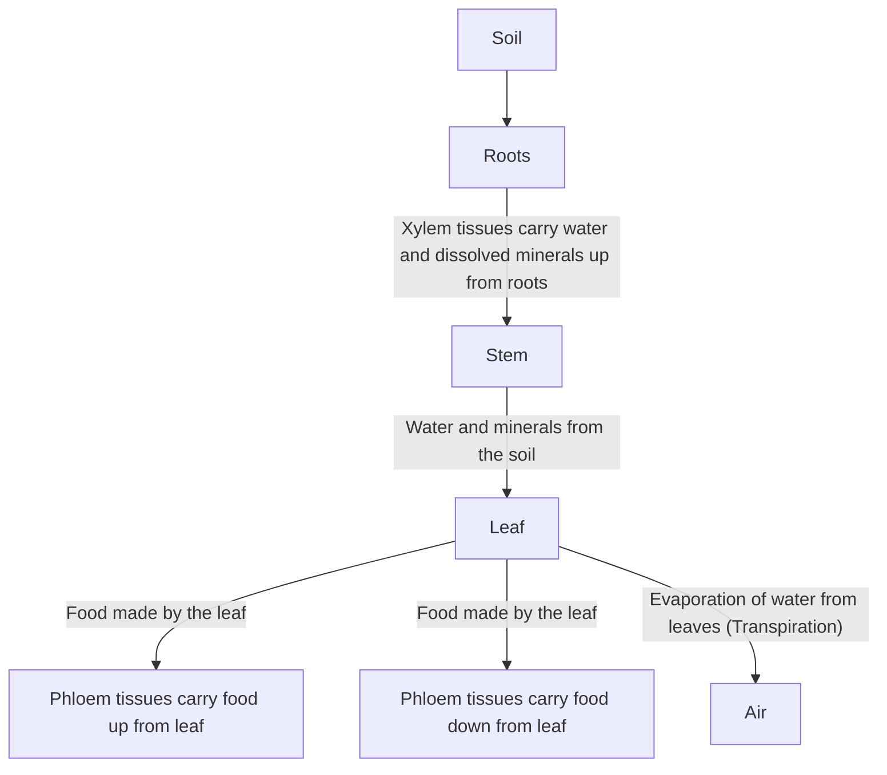
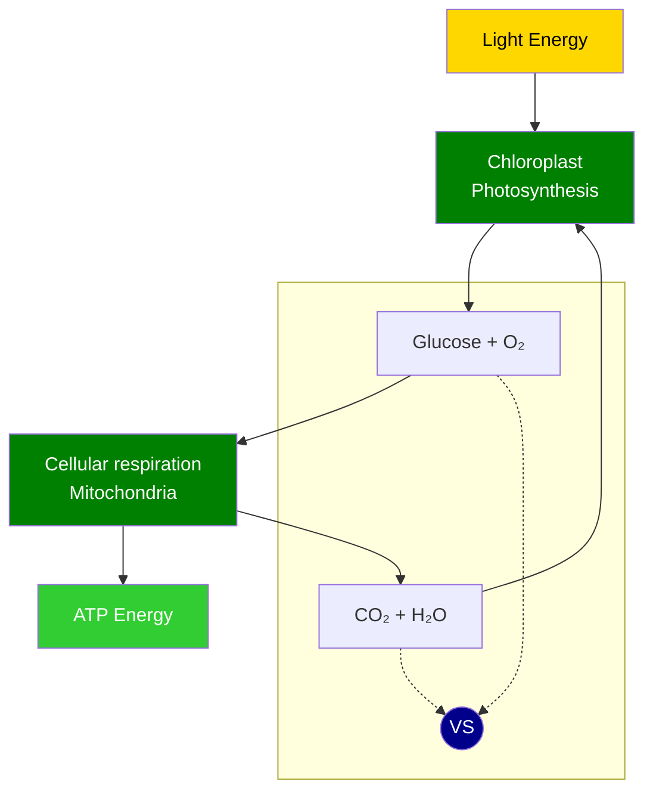
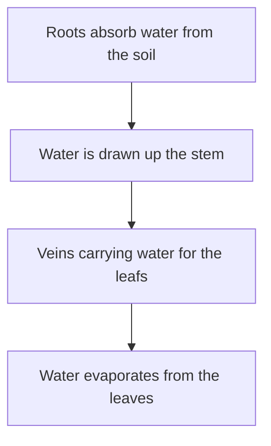
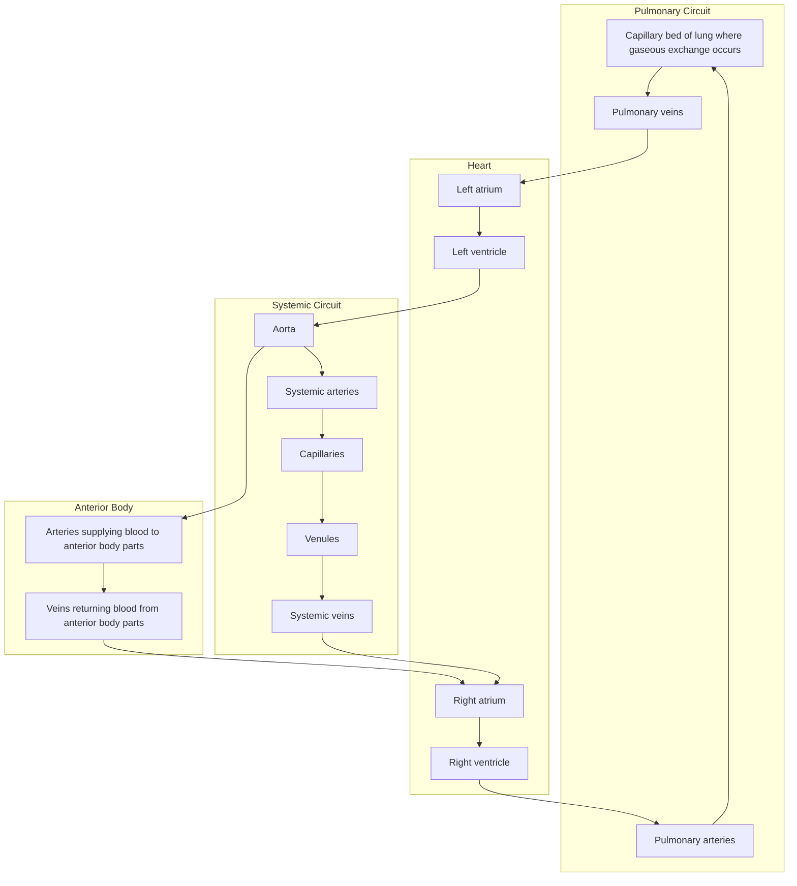
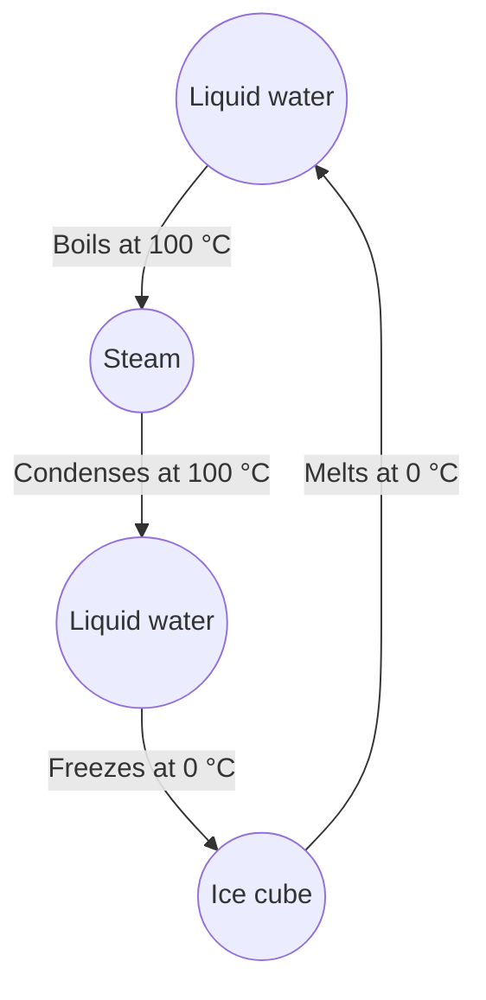
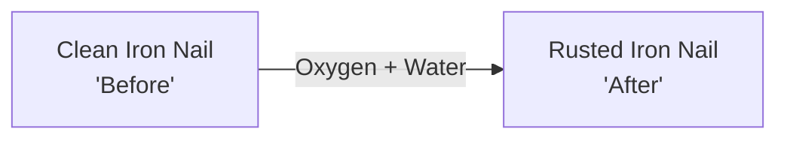
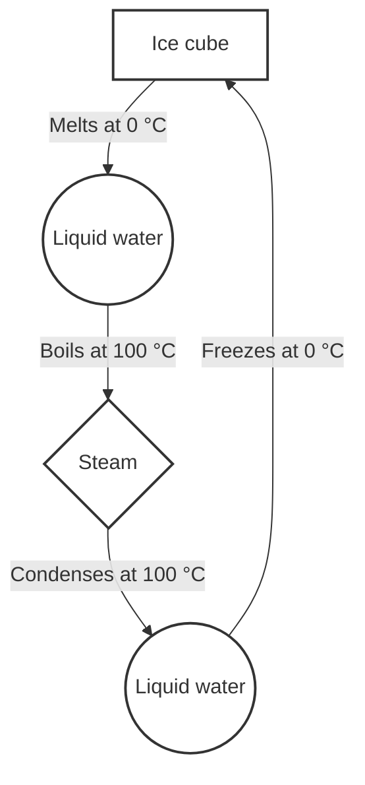
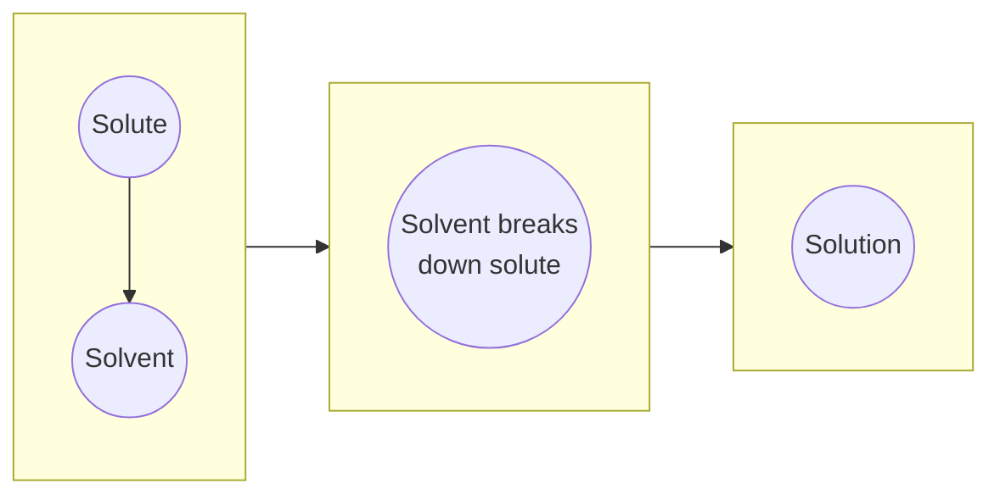
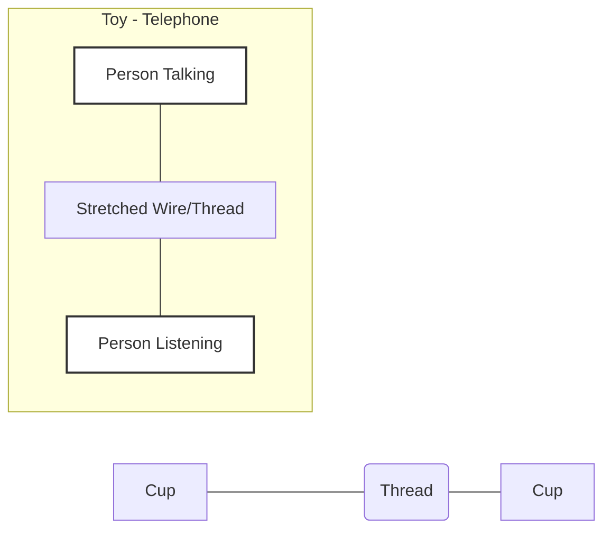

بِسْمِ اللّٰهِ الرَّحْمٰنِ الرَّحِيْمِ
(In the Name of Allah, the Most Compassionate, the Most Merciful.)

# GENERAL SCIENCE 7

Based on Single National Curriculum 2022
**ONE NATION, ONE CURRICULUM**

The page contains a watermark diagonally across the center that reads: "Web Version of PCTB"

The logo of the Punjab Curriculum and Textbook Board, Lahore is present, featuring a circular emblem with Urdu text and a star.

**PUNJAB CURRICULUM AND TEXTBOOK BOARD, LAHORE**

### Author
**Atta Dastgeer**
Subject Specialist (Chemistry),
Former Director Manuscripts, PCTB, Lahore

### Review Committee
* **Dr. Saman Jamil**
  Ex. Senior Subject Specialist Chemistry,
  Punjab Curriculum and Textbook Board, Lahore.
* **Prof. Dr. Muhammad Nouman Sarwar**
  Department of Physics, Government College
  University, Lahore
* **Dr. Abdul Rauf**
  Assistant Professor of Chemistry, Government
  Graduate College of Science, Wahdat Road, Lahore
* **Bashir Ahmed Naz**
  Rtd. Associate Professor of Chemistry,
  Govt. Graduate College, Jhang.
* **Prof. Dr. Farkhanda Manzoor**
  Head of Zoology Department, Lahore
  College for Women University, Lahore
* **Dr Shahbaz Ali**
  Associate Professor of Biology
  Government MAO College,
* **Sayyeda Rabab Batool**
  Associate Professor (Physics)
  Govt. Graduate College(W), Gulberg, Lahore.
* **Aysha Siddiqa**
  Mphil physics M.Ed SST
  GGHS Ali Raza Abad Lahore

**Dy. Director (Graphics)**
* Syeda Anjum Wasif

**Design & layout**
* Atif Majeed
* Kamran Afzal

**Illustration**
* Hafiz Inam ul Haq
* Aiyat ullah

**Director Manuscripts**
* Farida Sadiq

**Supervision & Coordination**
* Robeela Shabbir
  Subject Specialist (Biology)

**Composing**
* Atif Majeed

**Experimental Edition**

**Publisher:** Punjab Curriculum And Textbook Board, Lahore.
**Printer:**

<table>
  <tbody>
    <tr>
        <td>Date of Printing</td>
        <td>PMIU</td>
        <td>PEF</td>
        <td>PEIMA</td>
        <td>MLWC</td>
        <td>Total Quantity</td>
    </tr>
    <tr>
        <td>February, 2023</td>
        <td colspan="5"></td>
    </tr>
  </tbody>
</table>

# Contents

<table>
  <thead>
    <tr>
        <th>Subject</th>
        <th>Units</th>
        <th>Topics</th>
        <th>Page</th>
    </tr>
  </thead>
  <tbody>
    <tr>
        <td rowspan="4">Biology</td>
        <td>1</td>
        <td>Plant Systems</td>
        <td>1</td>
    </tr>
    <tr>
        <td>2</td>
        <td>Human Respiratory and Circulatory Systems</td>
        <td>18</td>
    </tr>
    <tr>
        <td>3</td>
        <td>Immunity and Diseases</td>
        <td>32</td>
    </tr>
    <tr>
        <td>4</td>
        <td>Structure of an Atom</td>
        <td>44</td>
    </tr>
    <tr>
        <td rowspan="3">Chemistry</td>
        <td>5</td>
        <td>Physical and Chemical Changes</td>
        <td>54</td>
    </tr>
    <tr>
        <td>6</td>
        <td>Chemical Bonds</td>
        <td>68</td>
    </tr>
    <tr>
        <td>7</td>
        <td>Solutions</td>
        <td>78</td>
    </tr>
    <tr>
        <td rowspan="3">Physics</td>
        <td>8</td>
        <td>Force and Motion</td>
        <td>88</td>
    </tr>
    <tr>
        <td>9</td>
        <td>Waves and Energy</td>
        <td>103</td>
    </tr>
    <tr>
        <td>10</td>
        <td>Heat and Temperature</td>
        <td>119</td>
    </tr>
    <tr>
        <td rowspan="2">Space and Technology</td>
        <td>11</td>
        <td>Technology in Everyday Life</td>
        <td>131</td>
    </tr>
    <tr>
        <td>12</td>
        <td>Earth and Space</td>
        <td>139</td>
    </tr>
    <tr>
        <td></td>
        <td colspan="2">Index</td>
        <td>155</td>
    </tr>
  </tbody>
</table>

# A WINDOW INTO LEARNING SCIENCE AND TECHNOLOGY

An illustration shows various laboratory glassware including a round-bottom flask with blue liquid, a beaker with blue liquid, an Erlenmeyer flask with yellow liquid, and a test tube setup on a stand with a red liquid being heated by a Bunsen burner.

Science is research-based knowledge, practice-based skill and inquiry-based approach to investigate and learn further through scientific method. The key activities involved in scientific method are observation, experimentation and deduction. Technology is application of scientific knowledge for solving daily life problems, making arduous works easy and improving quality of life. In order to meet the globally recognized standards, we need to broaden our educating horizons and adopt scientific method to learn science.

The inquiries and activities of scientific method involve observations, experimentations and conclusions. Hypothesis, theory and principle, etc., are the developmental stages in scientific research.

General Science for Grade 7 is the second annual course of studies designed in Single National Curricula for Elementary Level Students. This manuscript is an attempt to be proved as the best Textbook for the said course of studies. Use of scientific method in the teaching-learning approach equipped therein the textbook makes it entirely different from the textbooks in the subjects of humanities group.

It has been developed as a source of information and tools for applying scientific method in research based studies.

Students' interest has been engaged in process based learning, in-depth studies and inquiries for making observations and conclusions through experiments, child-centered and teacher-guided activities and in doing science and technology.

## Acknowledgment

Honourable Prof. Muhammad Ali Shahid, Director Technical (Rtd.), Punjab Textbook Board and Prof. Javed Mohsin Malik, Principal (Rtd.), Federal Ministry of Education are acknowledged with thanks for using their ideas and content given in PCTB General Science Textbooks.

## Appeal

Valuable suggestions for the improvement of this book are cordially invited.

(Author)

An illustration at the bottom shows a hand holding a magnifying glass over several documents and checklists, symbolizing research and review.

Food is the basic need of every cell of all the organisms

How does a plant obtain food and transport it to every cell of its body?

What are vascular bundles and their function in plants?

# 01 Plant Systems

## Students' Learning Outcomes

**After studying this chapter, students will be able to:**

*   Explain the root and shoot system in plants. Label different parts of leaf, stem and root (external and internal structure).
*   Predict the role of xylem and phloem in transport of water and food in plants by observing the cross section of the stem.
*   Define the process of photosynthesis and derive word equations for it.
*   Know that plants require minerals to maintain healthy growth and life processes (limited to magnesium to make chlorophyll and nitrates to make proteins).
*   Explain that the structure of leaves is adapted to the process of photosynthesis.
*   Describe the process of respiration and write word equations for it. Compare and contrast the processes of photosynthesis and respiration.
*   Investigate the phenomena of transpiration and its importance in a plant (wind, temperature, light, humidity affecting rate of transpiration in plants).
*   Explore and apply natural raise of water based on the principle of transpiration.

### VOCABULARY

<table>
  <tbody>
    <tr>
        <td>Root hairs</td>
        <td>Vascular bundles</td>
        <td>Mesophyll cells</td>
        <td>Chlorophyll</td>
        <td>Stomata</td>
        <td>Transpiration</td>
    </tr>
    <tr>
        <td>Outgrowths of epidermal cells in plant roots which absorb water and nutrients from the soil</td>
        <td>A system consisting of xylem and phloem for conduction of water and transport of food in plants</td>
        <td>Cells which are rich in chloroplast and specialized for preparation of food during photosynthesis</td>
        <td>Green coloured pigment in chloroplast which absorbs light photosynthesis</td>
        <td>Tiny openings in plant leaves for gaseous exchange and removal of extra water</td>
        <td>Loss or removal of extra water from aerial parts of plants</td>
    </tr>
  </tbody>
</table>

# Recall what you have learnt

We have learnt about:
* Organs and organ systems in plants (**Figure 1.1**)
* Root and shoot system in plants
* Xylem and phloem
* Chloroplasts

The image shows a diagram of a plant with its various organs and cross-sections of tissues.
* **Plant Organs:** The diagram labels the Flower, Fruit, Leaf, Stem, and Root.
* **Tissue Cross-sections:**
    * **Leaf:** Shows internal structure.
    * **Stem:** Shows internal structure.
    * **Root:** Shows internal structure.
* **Legend for Tissues:**
    * [ ] Dermal tissue (represented by red color)
    * [ ] Vascular tissue (represented by green/blue color)
    * [ ] Ground tissue (represented by yellow/tan color)

**Figure 1.1 Organs and organ systems in plants**

## Activity 1.1 Assessment

Write '**C**' against the correct and '**I**' against the incorrect statement in the middle column. Also correct the incorrect statement and write it in the next column.

<table>
  <tbody>
    <tr>
        <td>Correct/Incorrect</td>
        <td>C/I</td>
        <td>Correct statement</td>
    </tr>
    <tr>
        <th>Leaves in plants absorb water and nutrients from soil.</th>
        <th></th>
        <th></th>
    </tr>
    <tr>
        <th>Photosynthesis takes place in the underground parts of the plants.</th>
        <th></th>
        <th></th>
    </tr>
    <tr>
        <th>Xylem tissue conducts water from roots to leaves.</th>
        <th></th>
        <th></th>
    </tr>
    <tr>
        <th>Phloem transports food from leaves to other parts of the plant.</th>
        <th colspan="2"></th>
    </tr>
  </tbody>
</table>

In this chapter we will learn the following systems in plants:
* Root and shoot system
* Respiration
* Photosynthesis
* Transpiration

# 1.1 ROOT AND SHOOT SYSTEM IN PLANTS
## 1.1.1 Root System
Roots are the underground parts of the plants forming a system specialized for absorption of water and minerals from the soil (**Figure 1.2**).

The image shows a diagram of a root system with the following labeled parts:
*   **Secondary root**: Branches growing from the primary root.
*   **Primary root**: The main central root.
*   **Tertiary root**: Smaller branches growing from the secondary roots.
*   **Root hairs**: Fine, hair-like structures on the root surface.
*   **Region of maturation**: The upper part of the root tip where cells differentiate.
*   **Region of elongation**: The middle part of the root tip where cells increase in length.
*   **Region of cell division**: The lower part of the root tip where new cells are formed.
*   **Root cap**: A protective covering at the very tip of the root.

**Figure 1.2 Parts of root**

> **Recall**
> *   Zygote is the first cell formed by the fusion of reproductive cells (male and female gametes) during sexual reproduction of plants and animals.
> *   The initial stage of development of multicellular organisms formed by the cell divisions and growth of zygote is called embryo.

The initial root which grows from radicle of the embryo is the **primary root or tap root**. Its further branches form **secondary** and **tertiary** root system. The tips of roots and shoots in plants consist of tissues formed by the cells called meristematic tissues. These cells are specialized for growth. These cells increase in number by rapid cell division.

Root tip is covered by hard and protective structure called **root cap**. It protects the newly born soft cells from being damaged and environmental stresses. It enables root tip to grow through soil. More and more cells are formed by rapid cell divisions in this region causing the root to grow deep into the soil and elongate the root behind. The **region of maturation** has root hairs. **Root hairs** are thread like outgrowths of epidermal cells which increase the surface area for absorption of water. Plants, like grasses and strawberry have thread like roots spread in soil but not growing deep. Such roots are called **fibrous roots (Figure 1.3)**.

The image shows two types of root systems: a Taproot system, characterized by a single main root growing vertically downwards with smaller lateral roots, and a Fibrous Root system, consisting of a dense network of roots of similar size originating from the base of the stem.

**Figure 1.3 Taproot and fibrous roots**

## Internal structure of root
The main parts in the internal structure of root are epidermis, cortex, endodermis vascular bundles, i.e., xylem and phloem (**Figure 1.4**). The arrangement of these parts are shown in a transverse section (TS) of the root. (**Figure 1.5**).

The following diagrams illustrate the internal anatomy of a root:

**Figure 1.4 Structures inside the root**
This longitudinal diagram shows the following parts:
- Phloem
- Xylem
- Cortex parenchyma cells
- Root hair
- Apical Meristem

**Figure 1.5 Internal structure of root**
This transverse section (TS) diagram shows the following parts:
- Root hair
- Epidermis
- Cortex
- Endodermis
- Pericycle
- Phloem
- Pith
- Metaxylem
- Protoxylem

### Epidermis
Epidermis is an outermost layer of thin walled cells having unicellular outgrowths called **root hairs**. Epidermis provides protection and helps in absorption of water and minerals from the soil.

### Cortex
Inside the epidermis, many layers of thin walled and rounded cells form cortex. Water and minerals absorbed by root hairs in epidermis are transported towards xylem through cortex for onward conduction to leaves.

### Endodermis
The innermost layer of cortex which consists of barrel shaped cells is called endodermis. It

regulates the movement of water and hormones, etc., into and out of the vascular system.

### Vascular system
Xylem and phloem form vascular system. Xylem conducts water and minerals absorbed from roots to leaves through stem. Phloem transports food from leaves to roots and other parts of the plants.

> ### Inquiry 1.1
>
> **Teacher Guide**
>
> Facilitate students conduct an interactive discussion of the following:
> * Absorption of water and nutrients (minerals, etc.) by root hairs from soil and their diffusion towards xylem present in the centre of root.
> * Conduction of water and dissolved minerals by xylem tissue from roots to leaves through stem.
>
> The diagram shows the pathway of water from the soil into the root. It starts at a root hair (part of the Epidermis) surrounded by soil particles and water. The water moves through the large cells of the Cortex, passes through the Endodermis (marked with an arrow pointing to the Casparian strip), and finally enters the Xylem vessels where arrows indicate upward movement.
>
> Labels in diagram: Water, Epidermis, Cortex, Endodermis, Xylem.
>
> * Recall what you have learnt about diffusion.
> * Do water and dissolved minerals (nutrients) move from soil to xylem tissue in the roots following the principle of diffusion through membranes of the cells in epidermis, cortex and endodermis, etc.?

> ### Activity 1.2 Examining internal structure of root
>
> **Teacher Guide**
>
> Facilitate students:
> * Take some herbaceous plant.
> * Cut the transverse section (TS) of its root.
> * Prepare a glass slide of the TS.
> * Examine the TS under microscope.
> * Identify different parts of the root.
> * Draw an explanatory sketch of the TS.
>
> The diagram illustrates a transverse section of a root with the following parts labeled:
> * epidermis (with root hairs)
> * cortex (parenchyma)
> * endodermis (with Casparian strip)
> * pericycle
> * phloem (sieve and companion cell)
> * xylem (vessel element)

### 1.1.2 Shoot System
The areal parts of the plants such as stem, its branches, leaves, flowers and fruit, etc., specialized for different functions make the **shoot system**. Here we will discuss stem and leaves.

### Stem
Stem is usually the aerial part of the plant. It provides support to its branches, leaves, flowers and fruit, etc. Vascular bundles (xylem and phloem) run through stem to leaves for transport of material within the plant body. A sketch of internal structure of stem (**Figure 1.6**) is self-explanatory with regards to the arrangement of different tissues in the plants.

### Leaf
Stem and its branches bear leaves. Leaves are the organs which are well exposed to light and well adapted for preparation of food during photosynthesis. A leaf is provided with the stalk called **petiole**. Its flat green part is called **blade** or **lamina**, which has many veins. The middle strong vein is called **midrib (Figure 1.7)**. Different shaped cells, as shown in the cross section of a leaf (**Figure 1.8**), perform different functions.

---

**Figure 1.6 Internal structure of stem**
The diagram shows a cross-section of a stem with the following labeled parts from the outer layer to the center:
*   Epidermal hair
*   Cuticle
*   Epidermis
*   Collenchyma
*   Chlorenchyma
*   Parenchyma
*   Endodermis
*   Bundle Cap
*   Phloem
*   Cambium
*   Xylem
*   Pith

---

**Figure 1.7 Leaf**
The diagram shows a leaf with the following labeled parts:
*   Margin: The outer edge of the leaf blade.
*   Midrib: The central vein running down the middle.
*   Veins: The branching network from the midrib.
*   Petiol: The stalk connecting the leaf to the stem.

---

**Figure 1.8 Internal structure of leaf**
The diagram shows a cross-section of a leaf with the following labeled parts:
*   Cuticle (Upper layer)
*   Palisade Mesophyll cells
*   Xylem (Part of the vascular bundle)
*   Phloem (Part of the vascular bundle)
*   Spongy mesophyll cells
*   Air space
*   Lower epidermis
*   Cuticle (Lower layer)
*   Guard cell
*   Stomatal pore
*   Low water vapor (indicated by arrows exiting through the stomata)

Epidermal cells are tile-like and forming protective layers (upper epidermis and lower epidermis). Palisade mesophyll cells are elongated, spongy mesophyll cells are irregularly shaped having air spaces among them. Their function is to prepare food. Xylem tissue consists of tubular shaped cells used to conduct water. Phloem cells are also tubular in shape and used for transport of food. There are openings in the lower epidermis called stomata (sing. stoma). Each pore is surrounded by a pair of guard cells. They allow exchange of carbon dioxide and oxygen. They also diffuse out water vapour.

### 1.1.3 Role of Xylem and Phloem in transport of water and food

Water and minerals diffuse from soil to roots and are conducted towards leaves through stem by xylem and the food prepared in leaves is transported to different parts of the plant through phloem (**Figure 1.9**).

**Figure 1.9 Transportation of materials in plants**

> **Do you know?**
> * Recall what you have learnt about solute, solvent, solution and diffusion of particles.
> * The quantity of a solute dissolved in a given quantity of solution is termed as concentration.
> * 1L sugar solution containing 3 teaspoonful of sugar dissolved in it, is more concentrated as compared to 1L sugar solution containing 1 teaspoonful of sugar dissolved in it.
> * Solvent is the component of a solution which is present comparatively in large quantity.
> * Water in the air is solute not solvent.

### Conduction of water and dissolved minerals
Movement of material particles from the area where they are more to the area where they are less is called diffusion. The **diffusion** through membranes (like cell membranes) is called **osmosis**. As the concentration of water and dissolved minerals is more in soil as compared to the root cells, they move in the root tissue (osmosis). The xylem is a tissue in plants which forms a system of pipelines (**xylem vessels**) from roots to leaves through stem for the conduction of water, only in one direction (**Figure 1.10**).

The diagram shows a potted plant with arrows indicating the upward movement of water from the roots, through the stem, to the leaves. A detailed cross-section of a leaf shows water moving through the xylem, endodermis, cortex, and epidermis, eventually exiting through the stomata as transpiration.

**Figure 1.10 Conduction of water in plants**

### Transport of food (Translocation)
Food prepared by photosynthesis in leaves (carbohydrates, i.e., glucose, sucrose, etc.) enters the phloem **sieve tube elements** in dissolved form through **companion cells**. It is then transported

to all other parts of plant body through phloem **(Figure 1.11)**.

Xylem tissue consists of dead cells joined end to end with no end walls to form a continuous tube. Phloem is composed of living cells called sieve tubes, companion cells and phloem parenchyma. **Parenchyma** is a type permanent tissue forming major part of ground tissue in plants. The main function of parenchyma is to store and assimilate food.

### Stomata
A large number of stomata **(Figure 1.12)** in lower epidermis of the leaf helps in absorption of carbon dioxide and release of surplus oxygen in the environment.

The following diagram illustrates the transport of food in plants:

[The diagram shows the transport of water and food in a plant. It features a Xylem tube with upward-moving water and a Phloem tube with sieve-tube elements. A leaf cell is shown producing sucrose, which enters the phloem via a companion cell. The sucrose then travels down to a root cell via another companion cell. Water is shown moving between the xylem and phloem.]

**Figure 1.11 Transport of food in plants**

The following diagram illustrates stomata in leaves:

[The diagram shows a leaf with a callout to a microscopic view of stomata. It further illustrates a "Stoma open" state with turgid guard cells and a "Stoma closed" state with flaccid guard cells.]

**Figure 1.12 Stomata in leaves**

Distribution of chloroplast in mesophyll tissue for maximum absorption of sunlight, regular supply of water through xylem tissue and carbon dioxide through stomata are the features of leaf that facilitate photosynthesis.

## 1.2 PHOTOSYNTHESIS
Photosynthesis is defined as the process during which carbon dioxide and water combine in the presence of sunlight and chlorophyll to form glucose (food) and oxygen.

$$\text{Carbon dioxide} + \text{Water} + \text{Sunlight energy} \xrightarrow{\text{Chlorophyll}} \text{Food (Glucose)} + \text{Oxygen}$$

The process of photosynthesis depends on the following factors:

### Light
Photosynthesis requires energy for combining carbon dioxide and water to form glucose (food). Sunlight provides this energy. The rate of photosynthesis depends upon the intensity of light. There is more light intensity at noon, so, the rate of photosynthesis is fast at the noon. In the evening or morning, the rate of photosynthesis is slower due to less light intensity. Photosynthesis

stops at night, because, there is no sunlight at night.

> **Do you know?**
> Light consists of seven colours but chlorophyll absorbs blue and red light.

### Carbon Dioxide
Air contains 0.35 to 0.4 % carbon dioxide. If there is more amount of carbon dioxide in the environment, the rate of photosynthesis will be fast, but once the carbon dioxide concentration reaches a certain level, there is no further increase in the rate of photosynthesis. Less quantity of carbon dioxide in an environment slows down the process of photosynthesis.

### Water
Besides carbon dioxide, water is also an essential requirement for photosynthesis. If it is not available as much as require, the rate of photosynthesis will be affected and plant will produce less food.

### Chlorophyll
The process of photosynthesis cannot take place without chlorophyll. It is only the chlorophyll which absorbs sunlight and makes it usable in the photosynthesis process. Chlorophyll is present in chloroplasts which are present in photosynthetic cells (mesophyll).

### Temperature
Like many other chemical reactions, photosynthesis is also affected by temperature. The suitable temperature for this process is 25 – 35°C. At very high or very low temperatures, the process of

### 1.2.1 Adaptations in leaf structure for photosynthesis
1. The blades of leaves are flat and absorb maximum light required for photosynthesis.
2. Thin blades of leaves make the light and carbon dioxide reach the internal parts easily.
3. Thick layer of palisade mesophyll containing large number of chloroplasts just beneath the upper epidermis can make maximum absorption of light to make food for the plant.
4. Maximum air spaces among spongy mesophyll near the lower epidermis provide an easy passage for carbon dioxide to diffuse into cells containing chloroplasts to facilitate photosynthesis.
5. Numerous stomata in the lower epidermis absorb maximum carbon dioxide from the air needed for photosynthesis.
6. Division of vascular bundles into small branches spread throughout the leaf makes an easy and maximum water supply needed for photosynthesis.

> **Do you know?**
> * Photosynthesis takes place mainly in leaves; but, in some plants it occurs in green stems also. The process actually occurs inside the chloroplasts in the cells of leaves and stem.

**Teacher Guide**
Facilitate students to prove that photosynthesis occurs in the leaves

**Background Information**
Glucose made during photosynthesis is converted into starch which is stored in different parts of the plant including leaves. The presence of starch in a leaf proves that photosynthesis takes place in the leaf. The presence of starch in the leaf can be checked by iodine test.

**Iodine Test**
Iodine solution is yellow in colour. When one or two drops of iodine solution are added in starch solution, the colour of iodine solution changes to blue.

1. Fill a beaker (500mL) half with water, heat it till boiling and dip a green leaf in boiling water for 2 to 3 minutes.
2. Fill a test tube with alcohol up to its half. Remove the leaf from boiling water and dip it in alcohol.
3. Keep the test tube containing the leaf in boiling water for a few minutes, so that chlorophyll dissolves in alcohol.

The following images illustrate the first three steps:
- Image 1: A green leaf is being boiled in a beaker of water over a spirit lamp.
- Image 2: The leaf is placed into a test tube containing alcohol.
- Image 3: The test tube with the leaf and alcohol is placed into the beaker of boiling water (water bath).

4. Remove the leaf from alcohol and again dip it in boiling water so that it becomes soft.
5. Place the leaf in a dish and spread it.

The following images illustrate steps 4 and 5:
- Image 4: The decolorized leaf is spread out in a glass petri dish.
- Image 5: Iodine solution is being dropped onto the leaf using a dropper, and blue-black patches are appearing.

6. Pour a few drops of iodine solution on the leaf with the help of a dropper.
7. You will see that the colour of the iodine solution becomes blue. This will prove that the starch is present in the leaf.

### Mineral nutrition in plants
Minerals are the chemical substances required by an organism for growth and other vital functions. Carbon, hydrogen, oxygen, nitrogen, magnesium, etc. are the nutrients required by plants in large quantities. Carbon, hydrogen and oxygen are obtained from carbon dioxide and water. The other nutrients like magnesium and nitrogen are obtained from the soil dissolved in water.

#### Magnesium
Magnesium is required by plants for the formation of chlorophyll. It is helpful for the functioning of enzymes to produce carbohydrates and fats. Its deficiency causes poor growth, yellowing and wilting of leaves.

#### Nitrogen
Nitrogen in the form of its compounds, (nitrates) dissolved in soil water, is required by plants for making chlorophyll and amino acids. Amino acids form proteins. Chlorophyll is necessary for photosynthesis. Proteins are necessary for growth, repair and other developments and defensive functions. Deficiency in nitrogen makes the leaves pale green or yellow. It affects the rate of photosynthesis and growth in plants.

## 1.3 RESPIRATION IN PLANTS
Respiration is defined as the process during which glucose (food) reacts with oxygen to produce carbon dioxide, water and energy required for survival of life.

$$ \text{Food (Glucose)} + \text{Oxygen} \longrightarrow \text{Carbon dioxide} + \text{Water} + \text{Chemical energy} $$

Respiration takes place in all the cells of living bodies. The mitochondria which are found in the cells perform the process of respiration. For this reason, mitochondria **(Figure 1.13)** are called power house of the cell.

### Importance of Respiration
Respiration is the only process which provides energy in usable form by living things. This process continues all the time in all kinds of living organisms. Stopping of respiration means death of the organism. In plants, the oxygen required for respiration comes from photosynthesis.

**Figure 1.13 Comparison between photosynthesis and respiration**

> ### Informative
> * Plants absorb carbon dioxide and release oxygen during day time, whereas, at night, they absorb oxygen and release carbon dioxide.
> * In plants, exchange of gases takes place through stomata, whereas, in the animals this work is performed by the lungs.

### 1.3.1 Comparison and Contrast between Photosynthesis and Respiration
1. Photosynthesis takes place in green plants, algae and some bacteria, whereas, respiration takes place in all the living things.
2. Photosynthesis takes place in chloroplasts, whereas, respiration takes place in mitochondria.
3. Photosynthesis uses sunlight energy to prepare food, whereas, respiration releases energy from food which is used for growth and performing all other body functions.
4. The **products** made during photosynthesis, i.e., glucose and oxygen are the **reactants** of respiration.
5. The products of respiration, i.e., carbon dioxide and water are the reactants of photosynthesis.

### 1.4 TRANSPIRATION
Plants continuously absorb water from soil through roots. The same is being conducted to leaves where it is used in photosynthesis. The excessive water is removed through stomata and from the aerial parts of the plants. The loss of water from aerial parts of the plants is called transpiration **(Figure 1.14)**.

**Figure 1.14 Transpiration in plants**

### Activity 1.3 Transpiration in plants

*   Take a potted plant and sprinkle water on the soil in the pot, where the plant is grown.
*   Cover the plant with a transparent polythene bag.
*   Tie the mouth of the bag around the base of the stem as shown in the Figure.
*   Place the plant in sunlight for 4–5 hours.
*   You will observe drops of water on the inner side of the polythene bag.
*   Where do these water drops come from?

**Conclusion:** _________________________________________________________________________________________________________
______________________________________________________________________________________________________________________

The illustration shows a potted plant covered with a transparent polythene bag. Labels indicate:
- Polythene bag
- Leaf
- Water droplets

### Capillary action

Very narrow glass tubes are called capillary tubes. Water moves up in the capillary tubes due to interaction between water molecules and surface of the tubes (**Figure 1.15**). This effect is called **capillary action**.

The illustration shows a container of water with three glass tubes of different diameters inserted into it. The water level rises highest in the narrowest tube and lowest in the widest tube.
- Water level is lower in wider spaces where surface tension is reduced
- Water is attracted to the sides of the container

**Figure 1.15 Capillary action**

Capillary action in narrow xylem vessels in small plants helps water move up towards leaves.

#### Do you know?
*   Water filled in a glass tube faces two types of forces. One is the attractive force between the molecules of water (intermolecular force) and the other is the force between the molecules of water and glass surface.
*   The force between the molecules of water is termed as cohesive force, whereas, the forces between the water molecules and glass surface is termed as adhesive force.
*   If the adhesive force is greater than the cohesive force, water rises up the tube through capillary action.
*   In narrow tubes, the adhesive force becomes greater than the cohesive force which makes the water rise up the tubes through capillary action.
*   Water rise up in xylem vessels is a natural example of capillary action.
*   In narrow tubes, the adhesive force becomes greater than the cohesive force which makes the water rise up the tubes through capillary action.
*   Water rise up in xylem vessels is a natural example of capillary action.

### 1.4.1 Natural Raise of Water Based on Principle of Transpiration

Transpiration is the water escape from the pores in leaves or stems (stomata). It develops suction force in the xylem bundles, causing the water rise up. Tall trees having more surface area for transpiration cause strong suction force or transpiration pull on water in the xylem bundles. The increased transpiration pull in tall trees causes the plant to absorb more water.

> **Informative**
>
> Capillary action and transpiration pull are the causes of natural raise of water in the materials. Building materials such as bricks and concrete blocks, etc., when come in contact with moisture, water rises into their pores due to capillary action and makes the material damped. Water is also raised in the pores of paper and plaster. Wicking of paint between the hairs of a paintbrush and movement water through sand are also the examples in this regard.

### Importance of transpiration

Transpiration pulls the water through air spaces in spongy mesophyll and keeps the mesophyll moist, which is essential for the exchange of gases. Effects of evaporation of water from leaves or stems are:

*   cools the surface of the leaves and the surroundings as well,
*   allows the movement of minerals from the soil to different parts of the plant,
*   helps in growth and development.
*   controls the temperature of the plants.

### 1.4.2 Factors Affecting the Rate of Transpiration

Wind, temperature, light and humidity are the main factors that affect the rate of transpiration.

#### Wind
The still air surrounding the plant leaves becomes humid and resists the diffusion of water from leaves into the air. It decreases the rate of transpiration. Wind sweeps the humidity away from leaves surroundings and increases the rate of transpiration.

#### Temperature
Rise in temperature provides more energy to the water molecules for evaporation from the leaves surfaces, hence, increases the rate of transpiration.

#### Light
In sunlight, the stomata remain open for removal of water through them. At night stomata are closed. In this way light also affects the rate of transpiration.

#### Humidity
Humid air surrounding the plants contains more amount of water, thus, decreasing the rate of diffusion of water molecules from plants leaves into air. It slows down the transpiration. The rate of transpiration is rapid in dry air.

> **Point to ponder**
>
> *   Gravity does not affect the capillary action. Request your teacher to explain why?

> ### Informative
> * When guard cells of stomata absorb water, they swell up and make the stomata open.
> * When guard cells lose water, stomata are closed.
> * Generally, stomata remain open during day time and are closed at night.
>
> **Diagram of Stomata:**
> The diagram shows two states of stomata:
> 1. **Stoma open:** Two swollen guard cells create an opening (stoma). Labels include: Chloroplast, Cell Wall, Stoma, Inner cell wall, Guard cells (swollen), Vacuole, and Nucleus.
> 2. **Stoma closed:** Two shrunken guard cells pressed together, closing the opening. Label: Guard cells (shrunken).

# KEY POINTS

* Roots are the underground parts of the plants forming a system specialized for absorption of water and nutrients from the soil.
* Root hairs are thread like outgrowths of epidermal cells which increase the surface area for absorption of water and minerals.
* The areal parts of the plants such as stem, its branches, leaves, flowers and fruit, etc., specialized for different functions make the shoot system.
* Xylem and phloem form vascular system. Xylem conducts water from roots to leaves through stem. Phloem transports food from leaves to roots and other parts of the plants.
* Photosynthesis is process during which carbon dioxide and water combine in the presence of light and chlorophyll to produce food (glucose) and oxygen.
* Respiration is a process during which food (glucose) reacts with oxygen to produce carbon dioxide, water and energy.
* The loss of water from aerial parts of the plants is called transpiration.
* Wind, temperature, light and humidity are the main factors that affect the rate of transpiration.
* Capillary action and transpiration pull are the causes of natural raise of water based on the principle of transpiration.

# QUESTIONS

**1.1 Encircle the correct option.**

**(i) Water and dissolved salts are conducted from roots to leaves by:**
<table>
  <tbody>
    <tr>
        <td>a. root hairs</td>
        <td>b. xylem</td>
        <td>c. phloem</td>
        <td>d. stomata</td>
    </tr>
  </tbody>
</table>

**(ii) The innermost layer of cortex in the root:**
<table>
  <tbody>
    <tr>
        <td>a. epidermis</td>
        <td>b. endodermis</td>
        <td>c. pericycle</td>
        <td>d. cambium</td>
    </tr>
  </tbody>
</table>

(iii) **What is required for photosynthesis in addition to light?**
a. oxygen and carbon dioxide
b. oxygen and water
c. carbon dioxide and water
d. nitrogen and water

(iv) **Oxygen and ------------------- are the products of photosynthesis:**
a. water
b. carbon dioxide
c. glucose
d. chlorophyll

(v) **The products of respiration are carbon dioxide and:**
a. water
b. oxygen
c. mitochondria
d. chloroplast

(vi) **The loss of water from aerial parts of the plants:**
a. respiration
b. photosynthesis
c. evaporation
d. transpiration

(vii) **Chlorophyll is present in:**
a. mesophyll cells
b. upper epidermis
c. lower epidermis
d. endodermis

(viii) **Mineral required in the formation of chlorophyll:**
a. iodine
b. iron
c. phosphorus
d. magnesium

(ix) **The force between the molecules of water:**
a. adhesive force
b. cohesive force
c. repulsive force
d. magnetic force

(x) **Rate of transpiration decreases with the increase of:**
a. temperature
b. light intensity
c. humidity in air
d. wind speed

### 1.2 Give short answers.
1. What is primary root?
2. What is secondary root?
3. State the function of root cap.
4. Write word equation for photosynthesis.
5. Write word equation for respiration.

### 1.3 Differentiate between:
1. Root system and shoot system
2. Xylem and phloem
3. Diffusion and osmosis
4. Epidermis and endodermis
5. Transpiration and evaporation
6. Capillary action and transpiration pull

### 1.4 Answer the following questions:
1. Describe the following in plants:
(i) Photosynthesis
(ii) Respiration
(iii) Transpiration
2. Draw and label the internal structures of the following:
(i) Root
(ii) Stem
(iii) Leaf
3. Compare and contrast the process of photosynthesis and respiration.
4. Describe the factors affecting the rate of transpiration.
5. Describe the importance of vascular bundles in plants.

### 1.5 Constructed Response Questions
1. Photosynthesis does not take place in animals but it is beneficial for animals also. How?
2. Plants produce food and oxygen during photosynthesis, which does not take place

at night. Where do plants get oxygen from for respiration at night?
3. Why should not we sleep under tree at night?
4. How the structure of leaf is adapted to the process of photosynthesis?
5. Why is transpiration important for plants?
6. Describe the role of magnesium and nitrogen in plants nutrition.
7. Explore the natural raise of water based on the principle of transpiration.

### 1.6 Investigate:
(i) Function of the following in plants:
(a) Root hairs (b) Stomata (c) Spongy mesophyll
(ii) Internal structure and functions of the following in plants:
(a) root (b) stem (c) leaf

### 1.7 Project: (Scientific Investigation)
**Prove that oxygen is produced by plants during photosynthesis**

**Teacher Guide**
Facilitate students to conduct the experiment as under:

**Procedure**
1. Take a few twigs of hydrilla plant and insert them in a short stemmed funnel as shown in the Figure.
2. Place the funnel in a beaker containing water and provide support to keep the funnel at the bottom of the beaker.
3. Invert a test tube full of water over the stem of the funnel.
4. Make sure that the inverted test tube over the stem of the funnel remains fixed there.
5. To increase the amount of dissolved carbon dioxide in the water, a little quantity of sodium bicarbonate (backing powder) may be added in the beaker.
6. Carefully, place the apparatus in the sun for 2 to 3 hours.

**Diagram of the Experiment**
The diagram shows a beaker filled with water. Inside the beaker, a glass funnel is placed upside down over some Hydrilla plants. A test tube is inverted over the stem of the funnel. Bubbles of gas are seen rising from the Hydrilla, through the funnel, and collecting at the top of the test tube. Sunlight is shown shining on the apparatus.

Labels in the diagram:
*   Gas (at the top of the inverted test tube)
*   Water (inside the beaker and test tube)
*   Hydrilla (plant inside the funnel)
*   Sunlight (arrows pointing towards the beaker)
*   Support to keep funnel at the bottom (orange blocks at the base of the funnel)

**Observation**
*   Gas bubbles liberated from the hydrilla plant reach the top of the inverted test tube.
*   The gas displaces the water downwards.

**Prediction**
Gas reached the top of the inverted test tube stem is oxygen which is produced during photosynthesis in hydrilla in the presence of sunlight.

**Test**
Test the gas produced during the experiment by applying the test for oxygen as under:
**Test for oxygen gas**
The glowing splint on getting oxygen relights and bursts back into flame.

**Conclusion:**
................................................................................................................................................................................

The top of the page features illustrations of the human lungs, a detailed view of alveoli, and a human heart. Below these illustrations are three circular callouts with questions:

*   Where does oxygen react with food to release energy?
*   How are food and oxygen carried to the site of respiration?
*   Where do products of respiration go?

# 02 Human Respiratory and Circulatory SYSTEMS

## Students' Learning Outcomes
**After studying this chapter, students will be able to:**

*   Differentiate between the processes of respiration and breathing.
*   Differentiate between aerobic and anaerobic respiration.
*   Trace the path of air in and out of the body and how the oxygen it contains is used during the process of respiration.
*   Sketch and label the human circulatory system.
*   Hypothesize how exercises of varying intensity (from rest to high-intensity interval training) would impact their pulse rate, test their hypothesis, calculate their pulse rate and record their findings.
*   Describe the role and function of major organs in the human respiratory system including trachea, lungs and alveoli (air sacs).
*   Explain that living organisms have a complex transport system for transfer of various solids, liquids, and gases across the body.
*   Describe the structure and function of the human heart.
*   Explain how blood circulates in the human body through a network of vessels (arteries, veins and capillaries), and transports gases, nutrients, wastes and heat.
*   Compare and contrast arteries, veins and capillaries.
*   Describe the composition of blood and the functions of red cells, white cells, platelets and plasma.

### VOCABULARY

<table>
  <thead>
    <tr>
        <th>Inhalation</th>
        <th>Exhalation</th>
        <th>Respiration</th>
        <th>Arteries</th>
        <th>Veins</th>
        <th>Capillaries</th>
    </tr>
  </thead>
  <tbody>
    <tr>
        <td>Breathing the air into lungs</td>
        <td>Breathing the air out of lungs</td>
        <td>Reaction of oxygen with food (glucose) to release energy</td>
        <td>Vessels that carry blood from heart to other body parts</td>
        <td>Vessels that carry blood back to heart from other body parts</td>
        <td>Tiny branches of arteries for exchange of materials in body tissues</td>
    </tr>
  </tbody>
</table>

# Recall what you have learnt

We have learnt briefly about:
* Human body organs, lungs and heart
* Gaseous exchange in lungs
* Blood circulation by the heart

The image shows two diagrams of the human body systems.

**Breathing system:**
A diagram of the human torso showing the respiratory system with the following labels:
* Nasal cavity
* Pharynx
* Trachea
* Larynx
* Lungs
* Bronchioles
* Bronchus
* Air sacs

**Blood circulatory system:**
A diagram showing the heart and blood vessels circulating blood through the lungs and the rest of the body with the following labels:
* Lung
* Heart
* Blood Vessels

**Figure 2.1 Breathing and blood circulatory systems**

### Activity 2.1 Assessment

Write 'C' against the correct and 'I' against the incorrect statement in the middle column. Also correct the incorrect statement and write it in the next column.

<table>
  <tbody>
    <tr>
        <td>Correct/Incorrect</td>
        <td>C/I</td>
        <td>Correct statement</td>
    </tr>
    <tr>
        <th>We breathe in, to get carbon dioxide.</th>
        <th></th>
        <th></th>
    </tr>
    <tr>
        <th>Chloroplasts are the cell organelles where food is oxidized to release energy.</th>
        <th></th>
        <th></th>
    </tr>
    <tr>
        <th>Cardiac muscles in the heart contract and relax to pump the blood and circulate it throughout the body.</th>
        <th></th>
        <th></th>
    </tr>
    <tr>
        <th>It is the chlorophyll which gives red colour to the blood.</th>
        <th colspan="2"></th>
    </tr>
  </tbody>
</table>

In this chapter we will learn about the following processes in human body:
* Breathing
* Respiration
* Blood circulation

# 2.1 BREATHING

Air enters the body through the nostrils. The nostrils lead into **nasal passage** or **nasal cavity** (Figure 2.2). Dust and bacteria, etc., are trapped by the hair and mucus in the nasal passage. The air is also warmed and moistened in the nasal passage. From here, air is passed to windpipe or trachea through **larynx** or voice box. The opening of air passage in the larynx is called **glottis** which has a lid called **epiglottis**. The epiglottis prevents food from entering the trachea. Trachea divides into two tubes called **bronchi** (singular: **bronchus**). The bronchi carry air into the lungs, one to each lung. The walls of the trachea and bronchi bear cilia and have mucus, which trap dust particles and bacteria. Inside the lungs, the bronchi branch into smaller tubes called **bronchioles**. Each bronchiole ends in a group of **air sacs** or **alveoli** (singular **alveolus**). The lungs look like sponges due to the presence of alveoli. Millions of alveoli are found in the lungs. They are surrounded by thick network of blood capillaries.

Anatomical diagram of the human respiratory system showing the following parts:
- Nasal passage
- Epiglottis
- Pharynx
- Oral cavity
- Glottis
- larynx
- Trachea
- Bronchi
- Lung

**Figure 2.2 Respiratory system in man**

Gaseous exchange takes place in the alveoli (**Figure 2.3**). Oxygen from the air diffuses into blood through the walls of the alveoli. At the same time, carbon dioxide carried by the blood from the body cells diffuses out into the alveoli. From the alveoli, it passes out of the body. Blood during its circulation supplies each of the body cells with oxygen and collects carbon dioxide produced in the cells during oxidation of food.

Diagram showing a cluster of alveoli (air sacs) surrounded by a network of blood capillaries (red and blue vessels).
- Air sacs
- Alveoli

**Figure 2.3 Blood supply to alveoli**

### Mechanism of Breathing
When we breathe in, rib muscles contract pulling the ribs up and out and chest cavity expands. At the same time, diaphragm contracts and flattens. The space inside the chest cavity becomes larger.

As a result, air enters into the lungs. This is called inspiration. The reverse of this process is called expiration (**Figure 2.4**).

### Inspiration
*   Rib muscles contract
*   Diaphragm contracts (moves down)

### Expiration
*   Rib muscles relax
*   Diaphragm relaxes (moves up)

**Figure 2.4 Mechanism of breathing**

---

### Activity 2.2
*   Take a test tube. Pour lime water into it. Put a straw in the test tube. Now breathe out gently through the straw. Lime water in the tube bubbles when you breathe into it. Lime water becomes milky. It proves that carbon dioxide is given out during respiration.

---

### Activity 2.3
*   Take a plastic bottle. Cut its bottom. Take a Y-shaped glass tube. Bind a balloon at each of the forked ends of the glass tube as shown in the Figure. Pass stem of the tube through the hole in a cork. Fix the cork at the mouth of the bottle. Make it air tight with wax. The stem of glass tube represents the trachea, branch tubes are the bronchi, and balloons represent the lungs. The bottle represents the chest cavity.
*   Take a large balloon and cut off its mouth. Stretch this balloon across the bottom of the bottle. Fix it with a rubber band or gum. Tie a thread or rubber band at the bottom of the stretched balloon sheath. The balloon sheath will represent the diaphragm.
*   Can you predict what will happen to the internal balloons if you pull down the balloon sheath (diaphragm)?

**Q. How is this model like an actual breathing system in our body?**

**Model Components:**
*   Y-shaped glass tube (trachea & bronchi)
*   Bottle (chest cavity)
*   Balloon (lung)
*   Stretched balloon sheath (diaphragm)

**Observations from Model:**
*   When the diaphragm is pushed up: Volume decreases, pressure increases (balloons deflate).
*   When the diaphragm is pulled down: Volume increases, pressure decreases (balloons inflate).

---

The pathway that the air follows during inspiration and expiration for exchange of gases is shown in **Figure 2.5**.

> **Do you know?**
> *   Total surface area of the alveoli in both the lungs has been estimated to be more than the whole area of your skin.

**(a)**

**Figure 2.5 (a) Pathway of the air breathing in and out**

**Figure 2.5 (b) Gaseous exchange in an alveolus**
The diagram shows an alveolus surrounded by a blood capillary. 
*   Air moves in and out of the alveolus.
*   Carbon dioxide (CO2) diffuses from the blood capillary into the alveolus.
*   Oxygen (O2) diffuses from the alveolus into the blood capillary.

# 2.2 RESPIRATION

Blood during its circulation, provides oxygen to every cell in the body. In the cells of our body, oxygen reacts with food (glucose) molecules to convert them into carbon dioxide and water along with the release of energy in the form of ATP (Adenosine triphosphate). The process is called respiration. The whole process of respiration is completed in a series of reactions, each of which is facilitated by a specific enzyme.

Respiration is of two types; aerobic respiration and anaerobic respiration.

### 2.2.1 Aerobic Respiration
The respiration process during which food is broken down to release energy in the presence of oxygen is called **aerobic respiration**.

$$C_6H_{12}O_6 + O_2 \longrightarrow CO_2 + H_2O + ATP$$
$$(Glucose) + (Oxygen) \quad (Carbon\ dioxide) + (Water) + (Energy)$$

Aerobic respiration takes place in the mitochondria of the cells in all plants, animals and our own body cells.

### 2.2.2 Anaerobic Respiration
The breakdown of food substances in the absence of oxygen is called **anaerobic respiration**. This process releases energy less than aerobic respiration. Yeast respires aerobically in the presence of oxygen. It can also respire anaerobically in the absence of oxygen. The products of anaerobic respiration in yeast are ethanol, carbon dioxide and energy.

$$Glucose \longrightarrow Ethanol\ (alcohol) + Carbon\ dioxide + Energy$$

Due to production of alcohol, the anaerobic respiration in yeast is also known as **alcoholic fermentation**.

Our muscles normally respire aerobically. When we run fast, enough oxygen is not available for the muscle cells to respire aerobically. Our muscles respire anaerobically. Lactic acid is the product in this reaction.

$$Glucose \longrightarrow Lactic\ acid + Energy$$

Lactic acid thus produced is transported to liver which convertS it back into glucose.

**Difference between aerobic and anaerobic respiration**

<table>
  <thead>
    <tr>
        <th>Aerobic respiration</th>
        <th>Anaerobic respiration</th>
    </tr>
  </thead>
  <tbody>
    <tr>
        <td>It takes place in the presence of oxygen.</td>
        <td>It takes place in the absence of oxygen.</td>
    </tr>
    <tr>
        <td>Large amount of energy is released in aerobic respiration.</td>
        <td>Small amount of energy is released in anaerobic respiration.</td>
    </tr>
    <tr>
        <td>Carbon dioxide and water are the products of aerobic respiration.</td>
        <td>Lactic acid is produced in muscles. Ethanol and carbon dioxide are produced in yeasts.</td>
    </tr>
  </tbody>
</table>

### Informative
*   Units for the measure of energy are joules (J) and kilojoules (kJ). The other commonly used unit to measure energy is calorie (cal) or kilocalorie (kcal).
*   One gram glucose produces about 3800 calories of energy.

### Do you know?
*   A substance that speeds up a chemical reaction is called catalyst.
*   The chemical reactions taking place In living bodies are called biochemical reactions.
*   The catalysts of biochemical reactions are the enzymes which are special types of proteins.

### Difference between breathing and respiration

<table>
  <thead>
    <tr>
        <th>Breathing</th>
        <th>Respiration</th>
    </tr>
  </thead>
  <tbody>
    <tr>
        <td>Breathing is the exchange of gases by inhalation and exhalation of the air.</td>
        <td>Respiration is a process to release energy from food during a series of reactions, each of which is catalyzed by a specific enzyme.</td>
    </tr>
    <tr>
        <td>It takes place in alveoli of the lungs.</td>
        <td>It takes place in mitochondria of the cells.</td>
    </tr>
    <tr>
        <td>The purpose of breathing is to provide oxygen to all the body cells and getting rid of carbon dioxide produced in the cells.</td>
        <td>The purpose of respiration is to provide energy to the whole body for carrying on the activities of life.</td>
    </tr>
    <tr>
        <td>Rib muscles in the chest cavity and diaphragm play key role in inhaling and exhaling the air.</td>
        <td>Muscles are not involved during the process of respiration.</td>
    </tr>
    <tr>
        <td>Enzymes are not involved in breathing activity.</td>
        <td>Enzymes are involved in all the reactions of respiration.</td>
    </tr>
  </tbody>
</table>

### Activity 2.4
*   Open the lid of a bottle containing fizzy drink.
*   You will observe the chemical reaction taking place in the bottle.
*   Add a little quantity of common salt in the bottle.
*   What do you observe?
*   Discuss the catalysts and their functions with your teacher and classmates.

The illustration shows two bottles of fizzy drink. The first bottle shows CO2 gas at the top. The second bottle shows the reaction after adding salt, with many CO2 bubbles rising and escaping from the top.

### 2.2.3 Respiratory Diseases
The common respiratory diseases or disorders are common cold, pneumonia and asthma.

### Common cold
Common cold is the most common infectious disease of human respiratory system. It is a viral infection. Its symptoms are cough, sore throat, running nose, nasal congestion and sneezing. The best way to avoid this problem is thorough and regular washing of hands, getting rest and using liquids in diets. There is no proper medicine for common cold. If the symptoms persist, consult your doctor.

### Pneumonia
It is another common illness which occurs in all age groups. Pneumonia is a lungs disease. It can be caused by bacterial, viral and fungal infections. The symptoms are cough, chest pain, fever and difficulty in breathing. During pneumonia, the alveoli are filled with a fluid (pus), which prevents oxygen from reaching the blood and makes breathing painful. Pneumonia is treated with antibiotics as advised by the physician.

As a preventive measure, wash hands frequently to avoid germs, use tissue paper or handkerchief while coughing or sneezing.

### Asthma
It is a form of difficult breathing. Commonly, it is an allergic response of the body to substances like pollen, household dust, a particular food or feathers from pillow. A characteristic whistling sound is produced during breathing. Asthma can be avoided by keeping ourselves safe from pollen, household dust and feathers from pillow.

## 2.3 BLOOD CIRCULATION
Living organisms need essential substances in every cell to carry on its activities. They also need to get rid of the waste matters produced in each cell. In unicellular organisms, this is achieved simply by diffusion. In multicellular organisms, there is a need of transport system. Transport system can be defined as a system by which materials are carried from one part of the body to another.

A system that works for transport of materials in our body is called **circulatory system (Figure 2.6)**. The human circulatory system consists of heart, blood vessels and blood. Blood is a fluid which circulates throughout the body. The blood circulates in two types of vessels. One type of blood vessels (arteries) takes the blood out of the heart to all over the body. The other type of blood vessels (veins) brings the blood towards the heart from all over the body.

The image shows a diagram of the human circulatory system with the following labels:
- **Vein**: Pointing to a blue blood vessel in the arm.
- **Artery**: Pointing to a red blood vessel in the arm.
- **Heart**: Pointing to the heart in the center of the chest.

**Figure 2.6 Circulatory System**

> **What is diffusion?**
> The net movement of molecules from a region where they are in higher concentration to a region where they are in lower concentration is called diffusion.

### 2.3.1 Heart
The organ that pumps the blood in blood vessels is called heart. Where is heart located? Put your hand on the upper left side of your chest. Do you feel something beating? The organ which is beating is your heart. What is the shape of the heart? The heart is somewhat cone-shaped **(Figure 2.7)**. The size of human heart is about the size of the fist. It is present in the chest cavity between the two lungs. It is a muscular organ. The heart is enclosed in a thin double-layered transparent membrane called **pericardium**.

The image shows the external structure of the human heart with the following parts labeled:
*   **Aorta**: The large artery at the top.
*   **Pulmonary artery**: Located just below the aorta.
*   **Pulmonary veins**: Vessels entering the left side of the heart.
*   **Left atrium**: The upper chamber on the right side of the image.
*   **Left Ventricle**: The lower chamber on the right side of the image.
*   **Right atrium**: The upper chamber on the left side of the image.
*   **Right ventricle**: The lower chamber on the left side of the image.

**Figure 2.7 External structure of human heart**

Internally, the heart consists of four chambers. The upper two chambers are called **atria** and the lower two chambers are called **ventricles**. The atria are divided into **left atrium** and **right atrium**. The ventricles are also divided into **right ventricle** and **left ventricle**. Atria are thin-walled chambers as compared to ventricles. Left ventricle is thicker than the right ventricle. The left atrium opens into the left ventricle. The right atrium opens into the right ventricle. The flow of blood from atria to ventricles is regulated by valves which prevent the backflow of the blood.

#### Working of Heart
The right atrium receives deoxygenated blood (blood with less oxygen) through two veins; one carrying blood from upper part of the body and the other from lower part of the body. The left atrium receives oxygenated blood (blood with more oxygen) from the lungs.

Both atria contract at the same time and pump the blood from left atrium to left ventricle and from

right atrium to right ventricle. The two ventricles contract at the same time. During this contraction, the blood from left ventricle is pumped towards all the body parts (except lungs) through the main artery called **aorta** and the blood from right ventricle is pumped towards the lungs.

### 2.3.2 Blood Vessels
The blood vessels (**Figure 2.8**) that carry blood away from the heart are called **arteries**. **Aorta** is the main artery. It branches to form small arteries. The arteries branch again to form **arterioles**. The arterioles divide and become tiny vessels called **capillaries**. Capillaries provide a large surface area for the exchange of materials between the blood and the tissues. Capillaries re-unite to form small veins called **venules**. The venules join to form bigger veins. The veins carry blood back to the heart.

Arteries are thick-walled. When an artery constricts, its lumen (space) becomes narrower and less blood flows through it in a given time. Arteries have no valves. In places where the arteries are close to the skin, such as wrist, one can feel the expansion of the arteries as pulse. The pulse tells us the rate of **heart beat**. The blood flows under high pressure in the arteries. When the blood reaches a vein, it flows slowly and smoothly. So the walls of the veins need not be as thick and muscular as those of the arteries. Veins have larger lumen. Most of the veins have internal valves to prevent backflow of the blood. Capillaries are very thin walled vessels through which the exchange of materials between blood and tissues takes place.

**Figure 2.8 Structure and Function of Blood Vessels**

> ### Activity 2.5
> * Observing blood vessels in human body.
> * Touch your wrist along the line of the thumb. You will feel pulsating movement. This is a blood vessel called artery.
> * Arteries are found deeply below the skin. The blood in the arteries is pulsating and pressure in them fluctuates with the heartbeat.
> * Wrap a strap around your arm tightly and examine the arm carefully. You would observe bluish vessels just beneath the skin.
> * These bluish vessels are the veins. They look bluish because they contain deoxygenated blood.
> * Can you find blood vessels anywhere else in your body?

[The image shows a person's hand with two fingers pressed against the wrist of the other hand to feel the pulse.]

# Mini Exercise
What type of blood is received by right atrium. Oxygenated or deoxygenated blood?

# Activity 2.6
**Making a Pulse Counter**
* For the observation of artery, teacher will make and show small pulse counter to students.

**Materials:** Thumb pin, matchstick, cutter / knife, scotch tape.

**Procedure:**
1. Take a matchstick and wrap sticking tape around the base of the match stick. Insert the pointed end of the thumb pin into the base of the match stick.
2. Sharpen the head of the match stick and put a ball of packing material on it.
3. Put the finished product on the artery of the wrist. It will become a small pulse counter.

The following diagrams illustrate the steps to create a pulse counter:
* **Diagram 1:** Shows a matchstick attached vertically to a thumb pin base.
* **Diagram 2:** Shows the matchstick with a "Ball of packing material" attached to the top head.
* **Diagram 3:** Shows the completed pulse counter placed on the wrist of a closed fist to monitor the pulse.

### 2.3.3 Comparison of Arteries, Veins and Capillaries

<table>
  <tbody>
    <tr>
        <td>Arteries</td>
        <td>Veins</td>
        <td>Capillaries</td>
    </tr>
    <tr>
        <th>Carry blood away from the heart</th>
        <th>Carry blood towards the heart</th>
        <th>Provide surface area for exchange of materials between the body cells and blood cells</th>
    </tr>
    <tr>
        <th>Thick walled vessels</th>
        <th>Thin walled vessels</th>
        <th>Very thin walled</th>
    </tr>
    <tr>
        <th>Facing high blood pressure</th>
        <th>Facing low blood pressure</th>
        <th>Facing low blood pressure</th>
    </tr>
    <tr>
        <th>Having no valves</th>
        <th>Veins have valve</th>
        <th>No valve</th>
    </tr>
    <tr>
        <th>Carry blood having oxygen and nutrients for the body cells, except pulmonary artery which carries deoxygenated blood.</th>
        <th>Return blood carrying carbon dioxide and other wastes, except pulmonary vein which carries oxygenated blood</th>
        <th>Provide oxygen and nutrients to the cells and collect carbon dioxide and other wastes from the cells.</th>
    </tr>
  </tbody>
</table>

### Activity 2.7 Measuring heart beat through pulse rate

*   Press your index and middle fingers on inside of the wrist right below the base of the thumb and feel your pulse or the pulse of someone else.
*   Count the beats you feel for one minute.
*   Record the pulse rate ( \_\_\_\_\_\_ beats per minute).
*   Repeat the activity twice more, take an average pulse rate and record it in the chart.
*   Take exercise by running for 2 – 3 minutes and observe the pulse rate immediately after exercising.

#### Pulse rate per minute

<table>
  <thead>
    <tr>
        <th>Time</th>
        <th></th>
        <th>1st count</th>
        <th></th>
        <th>2nd count</th>
        <th></th>
        <th>3rd count</th>
        <th></th>
        <th>Average</th>
        <th></th>
    </tr>
  </thead>
  <tbody>
    <tr>
        <td>Before exercise</td>
        <td></td>
        <td></td>
        <td></td>
        <td></td>
        <td colspan="5"></td>
    </tr>
    <tr>
        <td>After exercise</td>
        <td colspan="9"></td>
    </tr>
  </tbody>
</table>

### Scientific Investigation

**Teacher Guide**
Facilitate the students to investigate and conduct an interactive discussion on the following:
1.  What is cholesterol, its sources and effects on human health?
2.  How does physical exercise keep you fit and healthy?

### Scientific Investigation

**Teacher Guide**
Facilitate the students to investigate the carriers in science related to respiratory system such as respiratory therapists, pulmonologists, etc.
**Respiratory therapists** have an advanced knowledge of healthcare for human lungs and breathing system. They can examine your breathing system, diagnose and treat problems, recommend exercises and monitor progress.
**Pulmonologists** are the specialists of chest and respiratory problems. They can assist and treat patients of pneumonia, tuberculosis, asthma and other chest related issues.

## 2.4 BLOOD
Our blood is 55 % plasma and 45 % blood cells suspended in the plasma. Plasma is 92 % water. Plasma without fibrinogen (blood clotting proteins) and blood cells is called serum.

### Blood cells
Blood cells are of three types, i.e., red blood cells (RBCs), white blood cells (WBCs) and platelets (**Figure 2.9**).

The image shows a diagram of a blood vessel containing plasma and red blood cells. Next to it are individual illustrations of Red blood cells (biconcave discs), Platelets (small irregular fragments), and a White blood cell (a larger cell with a visible nucleus).

**Figure 2.9 Blood cells**

### Red blood cells (RBCs)
Red blood cells (RBCs) are disc shaped and slightly concave on both sides They contain haemoglobin (a red coloured protein) which gives them red colour. This is the haemoglobin in the red blood cells which carries oxygen from the lungs and supplies it to all the body cells during blood circulation. Haemoglobin also carries carbon dioxide from the blood cells and leaves it at the lungs for its removal from the body. Red blood cells exist for 120 days in the blood stream. They are finally fragmented in the liver.

### White blood cells (WBCs)
White blood cells (WBCs) are colourless. They have no coloured pigment. They are part of the body's immune system. They help the body fight infection and other diseases. There are five types of white blood cells which are different in their structure and function. These are larger in size than the red blood cells. Their main function is to protect the body from disease causing microorganisms (pathogens).

### Platelets
Platelets are not complete cells. These are fragments of cytoplasm enclosed by membranes. Platelets play an important role in blood clotting. They also help to slow or stop bleeding and healing wounds.

> **Informative**
>
> If there is an injury or cut in our body, platelets break apart and release a special chemical that works with proteins in the plasma and produce a web which traps red blood cells. The trapped red blood cells then dry and form a scab on injured site.

### 2.4.1 Disorders of Human Transport System
There are several disorders of human transport system, but we shall discuss heart attack and hypertension in this unit.

#### Heart Attack
A heart attack is the death of the part of heart muscle due to lack of blood supply. Coronary arteries supply blood to the heart. If a blood clot is made in coronary artery, it may block coronary artery. As a result, blood as well as oxygen supply to the heart is blocked. This condition leads to death of heart muscles.

In his situation, suddenly, the person feels discomfort or intense pain in the centre of chest. The pain may spread to shoulders, arm, neck or jaw. Other symptoms of heart attack include shortness of breath, sweating, and fainting. Coronary bypass is widely used surgical process to remove the blockage in coronary arteries.

#### Hypertension
Blood pressure is the force, blood exerts on the walls of arteries or veins in the body. Prolonged high blood pressure is called hypertension. During hypertension, the heart has to pump the blood harder. Obesity and lack of exercise lead to hypertension. Increase in rate of heart beat, sweating, discomfort and sinking of heart are the common symptoms. Weight loss, regular exercise, healthy food and medication can prevent hypertension.

# KEY POINTS

*   Inhalation and exhalation of air is called breathing
*   Respiration a process during which energy is released from food in series or reactions, each of which is catalyzed by a special type of enzyme.
*   Respiration which takes place using oxygen is called aerobic respiration. Respiration which takes place in the absence of oxygen is called anaerobic respiration.
*   Circulatory system consists of heart, blood vessels and blood.
*   Blood vessels that carry blood from heart to other parts of the body are called arteries.
*   Blood vessels that bring the blood back to heart from the other body parts are called veins.
*   The tiny blood vessels which provide surface in the body tissues for exchange of materials between blood cells and body cells are called capillaries.
*   Our blood is 55 % plasma and 45 % blood cells suspended in the plasma. Plasma is 92 % water.
*   Plasma without fibrinogen (blood colouring proteins) and blood cells is called serum.
*   Blood cells are of three types, i.e., red blood cells (RBCs), white blood cells (WBCs) and platelets.

# QUESTIONS

**2.1 Encircle the correct option.**

1.  **Exchange of gases takes place in:**
    a. lungs
    b. bronchioles
    c. alveoli
    d. blood

2.  **Trachea divides into two :**
    a. bronchi
    b. veins
    c. villi
    d. ribs

3.  **The part of the heart which receives blood from lungs:**
    a. left atrium
    b. right atrium
    c. left ventricle
    d. right ventricle

4.  **Left atrium opens into:**
    a. right atrium
    b. right ventricle
    c. left ventricle
    d. aorta

5.  **Right atrium receives:**
    a. oxygenated blood
    b. deoxygenated blood
    c. both types of blood
    d. no blood

6.  **Blood vessels that carry blood away from the heart are:**
    a. capillaries
    b. veins
    c. arteries
    d. venules

7.  **Aerobic respiration takes place in:**
    a. mitochondria
    b. chloroplasts
    c. nucleus
    d. blood vessels

8.  **Products of anaerobic respiration in yeasts are -------- along with energy:**
    a. carbon dioxide and water
    b. ethanol and carbon dioxide
    c. oxygen and water
    d. lactic acid and water

9.  **Exchange of material in the body tissues and blood takes place in:**
    a. aorta
    b. ventricles
    c. veins
    d. capillaries

10. **Which of the following plays an important role in blood clotting?**
    a. red blood cells
    b. white blood cells
    c. platelets
    d. bone cells

**2.2 Differentiate between:**
1. Aerobic and anaerobic respiration
2. Oxygen and carbon dioxide
3. Breathing and respiration
4. Arteries and veins
5. Capillaries and alveoli

**2.3 Give short answers.**
1. Name the body parts involved in breathing system.
2. Name the products of anaerobic respiration which occurs in muscles.
3. Name different blood cells.
4. Where does blood oxygenate?
5. Name different chambers of human heart.

**2.4 Answer the following questions.**
1. Describe the functions of different valves in human heart and veins.
2. How does human heart work?
3. Explain the structures and functions of the following
   (a) Arteries (b) Veins (c) Capillaries
4. Explain the role of chest and rib muscles in breathing system.
5. Describe the composition of blood.

**2.5 Constructed Response Questions**
1. Explain the difference between burning and respiration.
2. Blood circulatory system plays a key role in cellular respiration. Explain how?
3. Anaerobic respiration occurs when the body cannot get enough oxygen for aerobic respiration to take place. Explain with example of the situation when and where anaerobic respiration takes place in human body.

**2.6 Project:**
Investigate the heartbeat of your ten friends in terms of feeling pulse rate as under:
* Counting pulse per minutes

<table>
  <thead>
    <tr>
        <th>Sr. #</th>
        <th></th>
        <th>Name</th>
        <th></th>
        <th>1st count</th>
        <th></th>
        <th>2nd count</th>
        <th></th>
        <th>3rd count</th>
        <th></th>
        <th>Average</th>
        <th></th>
    </tr>
  </thead>
  <tbody>
    <tr>
        <td>1</td>
        <td></td>
        <td></td>
        <td></td>
        <td></td>
        <td></td>
        <td colspan="6"></td>
    </tr>
    <tr>
        <td>2</td>
        <td></td>
        <td></td>
        <td></td>
        <td></td>
        <td></td>
        <td colspan="6"></td>
    </tr>
    <tr>
        <td>3</td>
        <td></td>
        <td></td>
        <td></td>
        <td></td>
        <td></td>
        <td colspan="6"></td>
    </tr>
    <tr>
        <td>4</td>
        <td></td>
        <td></td>
        <td></td>
        <td></td>
        <td></td>
        <td colspan="6"></td>
    </tr>
    <tr>
        <td>5</td>
        <td></td>
        <td></td>
        <td></td>
        <td></td>
        <td></td>
        <td colspan="6"></td>
    </tr>
    <tr>
        <td>6</td>
        <td></td>
        <td></td>
        <td></td>
        <td></td>
        <td></td>
        <td colspan="6"></td>
    </tr>
    <tr>
        <td>7</td>
        <td></td>
        <td></td>
        <td></td>
        <td></td>
        <td></td>
        <td colspan="6"></td>
    </tr>
    <tr>
        <td>8</td>
        <td></td>
        <td></td>
        <td></td>
        <td></td>
        <td></td>
        <td colspan="6"></td>
    </tr>
    <tr>
        <td>9</td>
        <td></td>
        <td></td>
        <td></td>
        <td></td>
        <td></td>
        <td colspan="6"></td>
    </tr>
    <tr>
        <td>10</td>
        <td colspan="11"></td>
    </tr>
  </tbody>
</table>

* Is the pulse rate of all of your friends same?
* If it is different, explain why?

[The top of the page features an illustration of a family (two adults and two children) wearing face masks, protected by a transparent bubble and a shield. Outside the bubble are green virus-like particles. Three circular callouts contain text:]

*   Germs causing diseases are found everywhere in our surrounding.
*   Harmful viruses and bacteria enter our body when we eat, breathe or touch our surrounding.
*   What makes us safe from diseases?

# 03 Immunity and Diseases

## Students' Learning Outcomes

**After studying this chapter, students will be able to:**

*   Explain various lines of defences that the body has against pathogens.
*   Describe the three types of immunity in humans; innate, adaptive, and passive.
*   Identify the various types of pathogens that cause infectious diseases.
*   Describe the parts of the immunity system and how they function to produce an immune response.
*   Illustrate how adaptive immunity develops overtime.
*   Visualize the ways to add additional layers of defence (such as wearing masks, using sanitizers, etc.).
*   Propose some common strategies for strengthening their immune system.
*   Explain how infectious diseases such as hepatitis, covid-19, typhoid, and dengue are caused, how they are tested and diagnosed, and how they can be prevented.
*   Suggest ways in which communities of people can safeguard against the spread of infectious diseases.

## VOCABULARY

<table>
  <tbody>
    <tr>
        <td>Immunity</td>
        <td>Infection</td>
        <td>Antibodies</td>
        <td>Pathogens</td>
        <td>Parasite</td>
    </tr>
    <tr>
        <td>Ability of an organism's body to defend itself against disease-causing organisms</td>
        <td>Entry and growth of microorganisms into bodies of other organisms</td>
        <td>Proteins that protect human body when an unwanted substance enters it</td>
        <td>Disease causing microorganisms</td>
        <td>An organism living in the body of another organism for food that may cause diseases</td>
    </tr>
  </tbody>
</table>

# Recall what you have learnt:

We have learnt about the following:
*   Viruses and microorganisms that cause diseases (**Figure 3.1**)

The image shows four types of disease-causing agents:
1.  **Virus**: A spherical structure with protein spikes on its surface.
2.  **Bacteria**: Various shapes including rod-shaped (bacilli), spherical (cocci), and spiral-shaped (spirilla).
3.  **Plasmodium**: A microscopic view showing a crescent-shaped parasite within or near cells.
4.  **Fungus**: A cluster of rounded and elongated fungal structures.

**Figure 3.1 Disease causing agents**

*   Contagious diseases
*   Non-contagious diseases
*   How can we avoid diseases?
*   Prevention of diseases

## Activity 3.1 Assessment

Write '**C**' against the correct and '**I**' against the incorrect statement in the middle column. Also correct the incorrect statement and write it in the next column.

<table>
  <tbody>
    <tr>
        <td>Correct/Incorrect</td>
        <td>C/I</td>
        <td>Correct statement</td>
    </tr>
    <tr>
        <th>Diseases that can be transmitted from one person to another are called contagious diseases.</th>
        <th></th>
        <th></th>
    </tr>
    <tr>
        <th>Diseases that are not transferred from one person to another are called contagious diseases.</th>
        <th></th>
        <th></th>
    </tr>
    <tr>
        <th>Cancer and diabetes are the examples of contagious diseases.</th>
        <th></th>
        <th></th>
    </tr>
    <tr>
        <th>Flu, polio, TB, COVID-19 and hepatitis are the examples of non-contagious diseases.</th>
        <th></th>
        <th></th>
    </tr>
    <tr>
        <th>Vaccination is a method of keeping us safe from a disease by injecting weak or killed germs of that disease into our body.</th>
        <th></th>
        <th></th>
    </tr>
    <tr>
        <th>Wearing mask can allow germs enter into our body from environment through nose and mouth.</th>
        <th></th>
        <th></th>
    </tr>
    <tr>
        <th>Penicillin was the first antibiotic</th>
        <th colspan="2"></th>
    </tr>
  </tbody>
</table>

# Inquiry 3.1

## Teacher Guide

Facilitate students:

- Conduct an interactive discussion on the following:
  - (a) What do you think about the disease shown in the picture and how can it be avoided?
  - (b) What is antibiotic?
  - (c) Penicillin was the first antibiotic derived from a fungus known as Penicillium.
- What do you conclude from the discussion?

(a) _______________________________________________________________________

      _______________________________________________________________________

      _______________________________________________________________________

(b) _______________________________________________________________________

      _______________________________________________________________________

      _______________________________________________________________________

(c) _______________________________________________________________________

      _______________________________________________________________________

      _______________________________________________________________________

> Figure 3.2 Shedding of dead cells from human skin

## 3.1 LINES OF DEFENCE AGAINST PATHOGENS

Microorganisms that cause diseases in human body are called **pathogens**. Entry and growth of pathogens into our body is called **infection**. Pathogens are found everywhere in our surrounding. They enter our body when we breathe, eat, touch surrounding and through injuries. What makes us safe from their harmful effects? The answer to this question is **physical barriers** and **immunity**.

### 3.1.1 Physical Barriers

Our skin, mucous membranes, hairs, cilia, saliva, etc., make the first line of defence against infections. They act as barriers to the entry of foreign organisms into body cells. Human skin has an outer multilayered thick cover of mostly dead cells called epidermis. The dead cells of epidermis keep on shedding (Figure 3.2) and expelling the pathogens away from skin. A pigment called melanin is present in epidermis. It darkens skin and protects us from harmful effects of sunlight.

34

The moist linings of body organs / cavities like mouth, nose, lungs, stomach, etc., are the membranes which produce a thick fluid called **mucus**. These linings are thus called mucus membranes. The mucous traps foreign organisms (pathogens) and stops their entry into the body cells.

The **hairs** in nose filter out the dust, pollutants and microbes, etc., from the air breathed into trachea and lungs. **Cilia** lining the nostrils, nasal cavity and pharynx send these particles to digestive system. **Saliva** in the mouth (oral cavity) has antiseptic properties and kills the microorganisms in the food. It also washes the teeth and oral cavity. Constant blinking of eyes and **tears** also flushes and wipes away the pathogens.

### 3.1.2 Chemical Barriers
Acidity of skin secretions inhibits the bacterial growth. **Gastric juice** secreted by the linings of stomach walls contains **hydrochloric acid** which kills the pathogens present in the food.

An enzyme **'lysozyme'** produced in tears, perspiration and saliva breaks the bacterial cell wall which leads to their death.

**Sebum** is an unsaturated fatty acid in the perspiration. It provides a protective film on the skin which inhibits growth of microbes on the skin.

### 3.1.3 Nonspecific Defence
Nonspecific defence includes phagocytosis, inflammatory response, fever and complementary reactions, etc.

#### Phagocytosis
Phagocytosis is a cellular process of ingesting and eliminating foreign substance and microorganisms. A type of white blood cells called phagocytes perform this function. **(Figure 3.3)**.

**Figure 3.3 Phagocytosis**

#### Inflammatory response
When a body tissue is damaged or injured, it causes **inflammation**. Heat or burning effect, pain, redness, swelling, loss of function, etc., are the signs of inflammation. Inflammatory response is a part of the body's defence mechanism in which special cells called inflammatory cells are sent at the affected site. They remove the harmful foreign substances / pathogens from the site and begin the healing process.

> **Informative**
>
> Interferon is a chemical secreted by infected cells helping against the pathogens.

## 3.2 IMMUNITY or SPECIFIC DEFENCE

The pathogens like virus, bacteria, fungi, toxins, etc., cause the body to produce special proteins called **antibodies**. Antibodies are produced by lymphocytes, in response to antigens present on pathogens. The antibodies work to destroy only those antigens which stimulate their production. After production, an antibody identifies the antigen, develops a lock and key relationship with it and neutralizes it (**Figure 3.4**). As the antibodies work against particular antigens, the defence system so developed is called **specific defence**.

The image illustrates the interaction between antigens and antibodies. It shows various shaped antigens (purple, yellow, red, blue, green, and tan) and how specific antibodies have binding sites that match the shape of a specific antigen.
- **Antigens**: Various geometric shapes representing different pathogens.
- **Antigen-binding site**: The specific part of the antibody that fits the antigen.
- **Antibody**: Y-shaped protein molecules.
- **Lock-and-key relationship**: Antigens and antibodies have a lock-and-key relationship. Depending on the antigens present, specific antibodies are produced.

**Figure 3.4 Antibody produced for a particular antigen**

Two types of white blood cells called **B-lymphocytes** and **T-lymphocytes** are involved in immunity production.

B-lymphocytes show response by production of antibodies and antitoxins. This is called **humoral response**. T-lymphocytes directly fight with pathogens to remove them from body. It is called **cell-mediated response**.

### 3.2.1 Types of Immunity
#### Innate immunity
The **innate immunity** is inherited from parents and protects the individual since birth. It is always

present in the body and generates a rapid response. It exhibits less potency. Innate immunity generates a non-specific immune response. Redness and swelling caused by white blood cells around a wound is an example of innate immunity (**Figure 3.5**).

### 3.2.2 Adaptive immunity
The immunity acquired by an individual after the birth is called **adaptive immunity**. It is developed in response to external factors. It generates a delayed response in 5 – 6 days. It exhibits higher potency and produces specific immune response. Vaccination against a virus is the example of adaptive immunity (**Figure 3.6**).

Adaptive immunity is again of two types, active immunity and passive immunity.

#### Active immunity
Active immunity is a type of adaptive (acquired) immunity by which a body produces its own antibodies in response to the pathogens entered in the body. Active immunity takes time in producing antibodies and giving response. It is more effective and long lasting. In order to acquire active immunity against a disease, weak or dead pathogens of the said disease are injected in the body in the form of vaccine (**Figure 3.7**).

#### Passive immunity
Passive immunity is a type of adaptive (acquired) immunity by which readymade antibodies are transferred to the individual. Passive immunity is fast in providing immediate response. It is less effective and not long lasting. Immunity produced by the antibodies present in mother's milk is the example of passive immunity (**Figure 3.8**).

A photograph shows a person's knee with a red, swollen abrasion.
**Figure 3.5 Redness and swelling around a wound**

A photograph shows a person receiving a vaccination in their upper arm.
**Figure 3.6 Vaccination against a virus**

A photograph shows a gloved hand holding a syringe and a vial labeled "Tetanus vaccine".
**Figure 3.7 Tetanus vaccine**

An illustration shows a mother breastfeeding her infant.
**Figure 3.8 Passive immunity**

## 3.3 PATHOGENS CAUSING INFECTIOUS DISEASES
Infectious diseases are those which are caused by the entry and growth of pathogens in the body of an individual. Viruses, bacteria, fungi and other parasites are the pathogens causing infectious diseases.

### 3.3.1 Viruses

Viruses are tiny particles which can cause infectious diseases. A complete virus is composed of the genetic material called **genome** covered by a **coat** called **capsid**. In some cases an additional coat called **envelope** is also present around the capsid (**Figure 3.9**). Capsid is the protective coat made of **proteins**. Envelope, where present, is often covered with **spikes** that help to identify the host cell.

A virus after invading a host cell uses components of the host cell and replicates rapidly for producing more and more viruses of its own kind. On completion of replication cycle, the new viruses damage the host cell and are released to invade the other cells of the host body. In this way, the host cells are damaged and destroyed rapidly. The diseases caused by viruses in human are AIDS, COVID-19, hepatitis, polio, common cold, measles, etc. (**Figure 3.10**).

[The image shows a diagram of a typical enveloped virus with the following labeled parts: Envelope, Genome, Capsid, and Spikes.]
**Figure 3.9 A typical enveloped virus**

[The image shows six different types of viruses: Polio virus, Hepatitis B virus, COVID-19 virus, Smallpox virus, Measles virus, and Common cold virus.]
**Figure 3.10 Viruses causing different diseases**

> #### Informative
> * Antibiotics do not kill viruses and therefore are ineffective as a treatment for viral infections.
> * Antiviral medications can sometimes be used depending on the type of virus.

### 3.3.2 Bacteria

Bacteria are single celled microorganisms found in every type of environment. A bacterial cell is simply a **nucleoid** or **DNA** without any nuclear membrane present in the cytoplasm surrounded by a plasma membrane and an outer protective cell wall. Some bacteria have protective capsule over the cell wall (**Figure 3.11**). Ribosomes are the sites for protein synthesis.

[The image shows a diagram of a bacterial cell with the following labeled parts: Cytoplasm, DNA, Ribosomes, Capsule, Cell Wall, Plasma Membrane, Bacterial Flagellum, and Pilus.]
**Figure 3.11 Bacterial cell**

One or more flagella help the cell to move. Pili can help certain bacteria attach with host cell.

Cholera, diarrhea, typhoid, tuberculosis, tetanus, etc., are the diseases caused by bacteria (**Figure 3.12**).

<table>
  <tbody>
    <tr>
        <td>Typhoid causing bacteria</td>
        <td>Cholera causing bacteria</td>
        <td>Tetanus causing bacteria</td>
        <td>Diarrhea causing bacteria</td>
        <td>Tuberculosis causing bacteria</td>
    </tr>
  </tbody>
</table>
**Figure 3.12 Bacteria causing diseases**

### 3.3.3 Fungi
Fungi are simple organisms that can be single celled or multicellular. They cannot make their own food as fungal cells don't have chlorophyll. They often grow on dead bodies or decaying matter. A typical fungal cell contains a true nucleus, mitochondria, endoplasmic reticulum and golgi apparatus. They have thick walls. The organism's body consists of filaments called **hyphae**. Fungi reproduce by means of spores. Yeast, mould, mushroom, etc. are examples of fungi (**Figure 3.13**).

<table>
  <tbody>
    <tr>
        <td>Yeast</td>
        <td>Mould</td>
        <td>Mushroom</td>
    </tr>
  </tbody>
</table>
**Figure 3.13 Common fungi**

Athletes foot, jock itch, ringworm, etc., are the diseases caused by fungi (**Figure 3.14**).

<table>
  <tbody>
    <tr>
        <td>Athletes foot</td>
        <td>Jock itch</td>
        <td>Ringworm</td>
    </tr>
  </tbody>
</table>
**Figure 3.14 Diseases caused by fungi**

### 3.3.4 Parasites
The organisms that live in or on the body of other organisms are called **parasites**. The organisms on which parasites live are called **hosts**. Parasites obtain food from the hosts. The two main types of parasites which cause diseases in humans are **endoparasites** and **ectoparasites**. The parasites that live inside the body of host (most commonly in blood stream) are called endoparasites. e.g.,

malarial parasite, tape worm, round worm, etc. are the examples of endoparasites **(Figure 3.15)**. The parasites that live outside the bodies of the hosts are called ectoparasites. Insects, such as ticks, lice and mosquitoes, etc., are examples of ectoparasites **(Figure 3.16)**. Worms are larger, multicellular organisms that can live inside as well as outside the human body.

The image shows three types of endoparasites: a blue crescent-shaped Malarial parasite, a long yellowish segmented Tapeworm, and several pinkish-red coiled Roundworms.
**Figure 3.15 Endoparasites**

The image shows three types of ectoparasites: a Tick attached to skin, a close-up of a Louse (Lice), and a Mosquito on skin.
**Figure 3.16 Ectoparasites**

## 3.4 PARTS OF IMMUNE SYSTEM
The system of body parts (cells, tissues, organs) that work together to defend the body against the attacks of pathogens is called **immune system (Figure 3.17)**.

The organs involved in immune system are found throughout the body and work to produce **'lymphocytes'** and are thus known as **lymphoid organs**. Lymph nodes, thymus, spleen, bone marrow, tonsils, adenoids, appendix and peyer's patches, etc., are the organs called **lymphoid organs**.

### Lymph nodes
Lymph nodes are small glands that contain immune cells and found in different parts of the body. When foreign invader enters the body, lymph nodes are activated. They replicate themselves, analyze the foreign body, produce specific lymphocytes and send them to fight off the invader (pathogen).

The image shows a diagram of the human body with various parts of the immune system labeled:
- Tonsils and Adenoids (in the head/neck area)
- Thymus (in the upper chest)
- Bone marrow (indicated in the arm bone)
- Axillary lymph nodes (in the armpit area)
- Spleen (in the upper abdomen)
- Peyer's patch (in the small intestine)
- Appendix (at the beginning of the large intestine)
- Inguinal lymph nodes (in the groin area)

**Figure 3.17 Parts of human immune system**

### Thymus
Thymus is found in the upper part of the chest, beneath the breast bone. It facilitates maturation of **'T lymphocytes'** which provide cell mediated immunity. The specific task of thymus is to learn, recognize or remember the invader and initiate for the production or selection of T lymphocytes so that their attack can be quickly mounted the next time this invader is encountered.

### Spleen
Spleen is purple coloured organ, found in the upper region of left abdomen and protected by rib cage. It stores white blood cells that defend human body against foreign invaders. It filters the blood to destroy old and damaged red blood cells.

### Bone marrow
Bone marrow inside the bones produces billions of new blood cells every day and releases them into the blood stream. Bone marrow has stem cells which differentiate into specific cell types, red blood cells, white blood cells, platelets and many other types of immune cells. It strengthens the immune system in our body.

### Tonsils
Tonsils are a pair of soft tissues present inside the throat that fight against the infections. They swell up in response to infection.

### Adenoids
Adenoids are a patch of soft tissues located behind the nasal cavity. Like tonsils, they help to keep the body healthy. They trap harmful bacteria or viruses we breathe in or swallow. They are important infection fighters in babies and young children.

### Appendix
Appendix is a pouch like organ between the small intestine and large intestine. It helps in the maturation of B lymphocytes and takes part in the production of some antibodies.

### Peyer's patches
Peyer's patches are the lymphoid tissues present in small intestine. They form an important part of immune system for preventing the growth of pathogenic bacteria in the intestines.

### 3.4.1 Adaptive Immunity Developed Over Time
Adaptive immunity is not present at birth. It develops when a person's immune system finds and recognizes some foreign invader. Development of adaptive immunity takes days or even weeks. Adaptive immunity is more specific to the pathogens and has memory. It develops after the exposure to an antigen either from a pathogen or some vaccine.

## 3.5 AVOIDING INFECTIONS
Understanding the ways microorganisms enter our bodies can help to prevent infection. The best way to avoid infection is to keep our bodies and environment clean. Following are some ways that help to prevent infection:

1. Dirty hands are major source of germs. The germs enter into our body, when we touch our eyes, nose and mouth with dirty hands. Wash your hands before you eat, after you use washroom/toilet, and whenever you touch something used by a sick person **(Figure 3.18)**.
2. Take a bath at least once a day.
3. We can protect ourselves from food infections by eating healthy and fresh food that is free of germs. Wash fruit and vegetables before eating. Avoid eating items that are not properly covered from dust.
4. Keep our home, school and surrounding clean.
5. Clean cuts and bruises in the skin right away with soap and clean water. Covering the wound with bandage also helps to keep infection away.
6. Learn principles of good health and act accordingly.

The image shows a person washing their hands with soap under a running faucet in a sink.
**Figure 3.18 Washing hands with soap washes off the germs**

# KEY POINTS

* The ability of human body to defend itself against disease causing agents (pathogens) is called immunity.
* The response of human body to a foreign particle (pathogen) in the form of producing antibodies against a specific antigen is called immune response.
* The innate immunity in inherited from parents and protects the individual since birth. It is always present in the body and generates a rapid response.
* The immunity acquired by an individual after the birth is called adaptive immunity. It is developed in response to external factors.
* Active immunity is a type of adaptive (acquired) immunity by which a body produces its own antibodies in response to the pathogens entered in the body.
* Passive immunity is a type of adaptive (acquired) immunity by which readymade antibodies are transferred to the individual.
* Viruses, bacteria, fungi and other parasites are the pathogens causing infectious diseases.
* Hepatitis, typhoid, COVID-19, etc., are the examples of infectious diseases.

# QUESTIONS

## 3.1 Encircle the correct option.

1. **A pigment in the skin that protects harmful effects of sunlight:**
   a. melanin
   b. haemoglobin
   c. lymphocyte
   d. lysozyme

2. **Hydrochloric acid is found in:**
   a. salavia
   b. gastric juice
   c. bile
   d. pancreatic juice

3. **........................... is the inflammation of liver.**
   a. tuberculosis
   b. typhoid
   c. COVID-19
   d. hepatitis

4. **Billions of new blood cells are produced daily in:**
   a. heart
   b. lever
   c. spleen
   d. bone-marrow

5. **Nuclear membrane is not found in:**
   a. plant cell
   b. animal cell
   c. bacterial cell
   d. fungal cell

## 3.2 Give short answers.

1. Define the following:
   (a) Pathogen
   (b) Antigen
   (c) Infection
   (d) Phagocytosis

## 3.3 Answer the following questions

1. Describe the physical barriers against the pathogens in human body.
2. Explain the non-specific defence against pathogens in human body.
3. Give brief introduction of pathogens (virus, bacteria, fungi). Explain how can they enter human body?
4. What are infectious diseases? Give examples.
5. Describe the parts of immune system.
6. How can we avoid infections?

## 3.4 Constructed Response Questions

1. What do you think are the modes of transmission of diseases?
2. What do mean by personal hygiene? Describe some basic principles in this regard.
3. Illustrate and give brief introduction of lymphoid organs.

## 3.5 Investigate how can we strengthen our immune system?

## 3.6 Make placards to create awareness against infectious diseases.

The image shows two atomic models.
1.  **Sodium (Na) Atom Model**: A central nucleus containing P=11 (protons) and N=12 (neutrons). It is surrounded by three electron shells: the first shell has 2 electrons, the second shell has 8 electrons, and the third shell has 1 electron.
2.  **Chlorine (Cl) Atom Model**: A central nucleus containing P=17 (protons) and N=18 (neutrons). It is surrounded by three electron shells: the first shell has 2 electrons, the second shell has 8 electrons, and the third shell has 7 electrons.

Below the diagrams are three blue circular callouts with the following questions:
*   What do you think about the structure of an atom?
*   What is Periodic Table?
*   What is electronic configuration?

# 04 Structure of an Atom

## Students' Learning Outcomes
**After studying this chapter, students will be able to:**

*   Describe and draw the structure of an atom in terms of electrons, protons and neutrons.
*   Describe how an atom is electrically neutral.
*   Differentiate between atomic number and mass number.
*   Determine the atomic number and mass number of elements on the basis of the number of protons, electrons and neutrons.
*   Show the arrangement of electrons in K, L and M shells of elements.
*   Draw the atomic structures of first eighteen elements in the Periodic Table.
*   Explain that the Periodic Table is a way to organize elements in a systematic order.
*   Recognize periods and groups in the Periodic Table.

### VOCABULARY

<table>
  <thead>
    <tr>
        <th>Electron</th>
        <th>Proton</th>
        <th>Neutron</th>
        <th>Atomic number</th>
        <th>Mass number</th>
        <th>Isotopes</th>
    </tr>
  </thead>
  <tbody>
    <tr>
        <td>A negatively charged particle of an atom found around its nucleus</td>
        <td>A positively charged particle of an atom found in its nucleus</td>
        <td>A neutral particle of an atom found in its nucleus</td>
        <td>Number of protons present in an atom</td>
        <td>Total number of protons and neutrons present in an atom</td>
        <td>Atoms of the same element having different mass numbers</td>
    </tr>
  </tbody>
</table>

# Recall what you have learnt:
We have learnt as under:

## Atom
An atom is the smallest particle of an element that can take part in a chemical reaction. Atoms of a particular element are alike but they are different from the atoms of other elements.

## Structure of an atom
The major part of an atom is empty. Its central part is called nucleus. Modern research on atomic structure shows that it consists of a number of smaller particles, the most important of which are (**Figure 4.1**):
* Proton
* Electron
* Neutron

### (i) Proton
Protons are the positively charged particles present in the nucleus of an atom. A proton carries a unit positive charge on it.

### (ii) Electron
Electrons are the negatively charged particles revolving around the nucleus of an atom in different orbits. An electron carries a unit negative charge on it.

### (iii) Neutron
Neutrons are the neutral particles. They have no charge on them. They are also present in the nucleus of an atom.

Protons, electrons and neutrons are known as the fundamental particles of an atom. The number of protons present in the nucleus of an atom is equal to the number of electrons present around the nucleus. It means that the number of positive charges is equal the number of negative charges present there. The atom is therefore, electrically **neutral particle**.

**Figure 4.1 Structure of helium atom**
The diagram shows a central nucleus containing two red circles with '+' signs (protons) and two green circles (neutrons). Two blue circles with '-' signs (electrons) are shown revolving in an orbit around the nucleus.
Legend:
* Red circle with + : Proton
* Green circle : Neutron
* Blue circle with - : Electron

## Symbol
One or two letters from the English or Latin name of an element used to represent its one atom is called **symbol**. Usually the first capital letter of the name of the element is used as symbol. If there are two letters in the symbol, the first is capital and the second is small. For example, H is the symbol of hydrogen and Na is the symbol of sodium taken from its Latin name (Natrium).

## Atomic number (Z)
The number of protons present in an atom of an element is called atomic number of that element. It is denoted as **Z**. All the atoms of an element have the same number of protons.

## Mass number (A)
The total number of protons plus neutrons present in an atom of an element is called **mass number** of that element. It is denoted as **A**.

# Activity 4.1 Assessment

*   Examine the structures shown below:

The diagrams show the atomic structures of Hydrogen, Helium, and Lithium:
- **Hydrogen atom**: A central nucleus containing 1 proton (+), with 1 electron (-) in the first shell.
- **Helium atom**: A central nucleus containing 2 protons (+) and 2 neutrons (unmarked), with 2 electrons (-) in the first shell.
- **Lithium atom**: A central nucleus containing 3 protons (+) and 4 neutrons (unmarked), with 2 electrons (-) in the first shell and 1 electron (-) in the second shell.

*   Record your observation in the chart given below:

<table>
  <thead>
    <tr>
        <th>Name of element</th>
        <th>Symbol</th>
        <th>Atomic Number (Z)</th>
        <th>Mass number (A)</th>
    </tr>
  </thead>
</table>

Mathematically we can write:
**Mass number = Number of protons + Number of neutrons**
**A = Z + Number of neutrons.**
**Number of neutrons = A - Z**

We can find the number of protons, electrons and neutrons in an atom of an element by knowing its atomic number and mass number. For example atomic number of phosphorus is 15 and its mass number is 31. Since atomic number is the number of protons present in an atom, it means that:
The number of protons in phosphorus atom = 15
We know that, in an atom, the number of protons is equal to the number of electrons.
Hence, the number of electrons in phosphorus atom = 15
Mass number = Number of protons + Number of neutrons
A = Z + Number of neutrons.
Number of neutrons = A - Z
Number of neutrons in phosphorus atom = 31 - 15 = 16

# Activity 4.2 Assessment

*   Find out and write the number of protons, electrons and neutrons in the atoms of the following elements:

<table>
  <thead>
    <tr>
        <th>Name of element</th>
        <th>Symbol</th>
        <th>Atomic Number (Z)</th>
        <th>Mass Number (A)</th>
        <th>No. of protons</th>
        <th>No. of electrons</th>
        <th>No. of neutrons</th>
    </tr>
  </thead>
  <tbody>
    <tr>
        <td>Oxygen</td>
        <td>O</td>
        <td>8</td>
        <td>16</td>
        <td></td>
        <td></td>
        <td></td>
    </tr>
    <tr>
        <td>Magnesium</td>
        <td>Mg</td>
        <td>12</td>
        <td>24</td>
        <td></td>
        <td></td>
        <td></td>
    </tr>
    <tr>
        <td>Phosphorus</td>
        <td>P</td>
        <td>15</td>
        <td>31</td>
        <td></td>
        <td></td>
        <td></td>
    </tr>
    <tr>
        <td>Potassium</td>
        <td>K</td>
        <td>19</td>
        <td>39</td>
        <td colspan="3"></td>
    </tr>
  </tbody>
</table>

> ### Informative
> *   The symbol of an element is used to represent one atom of that element.
> *   Atomic number given on the symbol of an element in the Periodic Table indicates the number of protons present in one atom of that element.
> *   The number of electrons present in an atom is equal to the number of protons.

In this chapter we will learn about:
*   Atom – An electrically neutral particle
*   Energy levels or shells
*   Distribution of electrons in K, L and M shells
*   Atomic structures of first 18 elements
*   Periodic Table

## 4.1 ATOM – AS A NEUTRAL PARTICLE

We have learnt about charge and that like charges repel each other and opposite charges attract each other. The number of positively charged protons present in an atom is equal to the number of negatively charged electrons present there. It means that the total positive charge on an atom (due to protons) is equal to the total negative charge on it (due to electrons). The equal amounts of positive and negative charges cancel the effect of each other. An atom is therefore electrically neutral particle **(Figure 4.2)**.

The image shows a diagram of a Neon atom. It consists of a central nucleus containing 10 protons (P=10) and 10 neutrons (N=10). Surrounding the nucleus are two concentric circular shells. The inner shell contains 2 electrons, and the outer shell contains 8 electrons, for a total of 10 electrons.

**Figure 4.2 Neon atom**

## 4.2 SHELLS OR ORBITS

Areas around the nucleus of an atom where electrons are found are known as shells or orbits. First, second, third and fourth shells are named as K, L, M and N respectively. An integer ‘n’ is used to describe the position of these shells around the nucleus of an atom. For the first K shell n = 1, for the second L shell n = 2, for the third M shell n = 3 and for the fourth N shell n = 4. The maximum number of electrons which each shell can accommodate can be determined by using the formula $2n^2$ **Table (4.1)**.

**Table 4.1 electrons in different shells around an atom**

<table>
  <thead>
    <tr>
        <th>Shell</th>
        <th>Value of n</th>
        <th>Name of the shell</th>
        <th>Maximum of number of electrons = 2n²</th>
    </tr>
  </thead>
  <tbody>
    <tr>
        <td>First</td>
        <td>1</td>
        <td>K</td>
        <td>2n² = 2 x 1² = 2 x 1 = 2</td>
    </tr>
    <tr>
        <td>Second</td>
        <td>2</td>
        <td>L</td>
        <td>2n² = 2 x 2² = 2 x 4 = 8</td>
    </tr>
    <tr>
        <td>Third</td>
        <td>3</td>
        <td>M</td>
        <td>2n² = 2 x 3² = 2 x 9 = 18</td>
    </tr>
    <tr>
        <td>Fourth</td>
        <td>4</td>
        <td>N</td>
        <td>2n² = 2 x 4² = 2 x 16 = 32</td>
    </tr>
  </tbody>
</table>

# 4.3 ATOMIC STRUCTURES OF FIRST 18 ELEMENTS

Atomic structures of first eighteen (18) elements of the Periodic Table are shown as follows:

<table>
  <thead>
    <tr>
        <th>Element Diagram</th>
        <th>Element Diagram</th>
        <th>Element Diagram</th>
    </tr>
  </thead>
  <tbody>
    <tr>
        <td>Nucleus: P=1 Shells: 1 shell with 1 electron</td>
        <td>Nucleus: P=2, N=2 Shells: 1 shell with 2 electrons</td>
        <td>Nucleus: P=3, N=4 Shells: 2 shells (2, 1)</td>
    </tr>
    <tr>
        <td>Hydrogen ($^{1}_{1}\text{H}$)</td>
        <td>Helium ($^{4}_{2}\text{He}$)</td>
        <td>Lithium ($^{7}_{3}\text{Li}$)</td>
    </tr>
    <tr>
        <td>Nucleus: P=4, N=5 Shells: 2 shells (2, 2)</td>
        <td>Nucleus: P=5, N=6 Shells: 2 shells (2, 3)</td>
        <td>Nucleus: P=6, N=6 Shells: 2 shells (2, 4)</td>
    </tr>
    <tr>
        <td>Beryllium ($^{9}_{4}\text{Be}$)</td>
        <td>Boron ($^{11}_{5}\text{B}$)</td>
        <td>Carbon ($^{12}_{6}\text{C}$)</td>
    </tr>
    <tr>
        <td>Nucleus: P=7, N=7 Shells: 2 shells (2, 5)</td>
        <td>Nucleus: P=8, N=8 Shells: 2 shells (2, 6)</td>
        <td>Nucleus: P=9, N=10 Shells: 2 shells (2, 7)</td>
    </tr>
    <tr>
        <td>Nitrogen ($^{14}_{7}\text{N}$)</td>
        <td>Oxygen ($^{16}_{8}\text{O}$)</td>
        <td>Fluorine ($^{19}_{9}\text{F}$)</td>
    </tr>
    <tr>
        <td>Nucleus: P=10, N=10 Shells: 2 shells (2, 8)</td>
        <td>Nucleus: P=11, N=12 Shells: 3 shells (2, 8, 1)</td>
        <td>Nucleus: P=12, N=12 Shells: 3 shells (2, 8, 2)</td>
    </tr>
    <tr>
        <td>Neon ($^{20}_{10}\text{Ne}$)</td>
        <td>Sodium ($^{23}_{11}\text{Na}$)</td>
        <td>Magnesium ($^{24}_{12}\text{Mg}$)</td>
    </tr>
    <tr>
        <td>Nucleus: P=13, N=14 Shells: 3 shells (2, 8, 3)</td>
        <td>Nucleus: P=14, N=14 Shells: 3 shells (2, 8, 4)</td>
        <td>Nucleus: P=15, N=16 Shells: 3 shells (2, 8, 5)</td>
    </tr>
    <tr>
        <td>Aluminum ($^{27}_{13}\text{Al}$)</td>
        <td>Silicon ($^{28}_{14}\text{Si}$)</td>
        <td>Phosphorus ($^{31}_{15}\text{P}$)</td>
    </tr>
    <tr>
        <td>Nucleus: P=16, N=16 Shells: 3 shells (2, 8, 6)</td>
        <td>Nucleus: P=17, N=18 Shells: 3 shells (2, 8, 7)</td>
        <td>Nucleus: P=18, N=22 Shells: 3 shells (2, 8, 8)</td>
    </tr>
    <tr>
        <td>Sulphur ($^{32}_{16}\text{S}$)</td>
        <td>Chlorine ($^{35}_{17}\text{Cl}$)</td>
        <td>Argon ($^{40}_{18}\text{Ar}$)</td>
    </tr>
  </tbody>
</table>

# Mini Exercise

*   Draw diagrams of atomic structures of the following atoms:
    (a) Magnesium ($Z = 12, A = 24$) (b) Aluminum ($Z = 13, A = 27$)
    (c) Silicon ($Z = 14, A = 28$) (d) Phosphorus ($Z = 15, A = 31$)
    (e) Sulphur ($Z = 16, A = 32$)

# Activity 4.3

Complete the structures of the given atoms by filling electrons in different shells.

The image shows two incomplete atomic diagrams:
1.  **Carbon atom ($Z = 6, A = 12$):** A nucleus labeled $P=6, N=6$ surrounded by two concentric circular shells.
2.  **Oxygen atom ($Z = 8, A = 16$):** A nucleus labeled $P=8, N=8$ surrounded by two concentric circular shells.

## 4.4 PERIODIC TABLE

Scientists have arranged the elements in a table called the Periodic Table (**Figure 4.3**). Elements in the Periodic Table are arranged on the basis of their properties and arrangement of electrons around the nuclei in their atoms. Elements kept in columns (groups) have same number of electrons in their outermost shells. They have similar properties. In the rows (periods) from left to right, elements are arranged in an order of increasing atomic numbers.

### Key
The key explains the layout of each element cell in the table:
*   **1**: Atomic number
*   **H**: Symbol
*   **1.0**: Mass number
*   **Hydrogen**: Name

### Figure 4.3 The Periodic Table of Elements

<table>
  <thead>
    <tr>
        <th>Periods</th>
        <th>Groups 1</th>
        <th>2</th>
        <th>3</th>
        <th>4</th>
        <th>5</th>
        <th>6</th>
        <th>7</th>
        <th>8</th>
        <th>9</th>
        <th>10</th>
        <th>11</th>
        <th>12</th>
        <th>13</th>
        <th>14</th>
        <th>15</th>
        <th>16</th>
        <th>17</th>
        <th>18</th>
    </tr>
    <tr>
        <th>1</th>
        <th>1 H 1.0 Hydrogen</th>
        <th colspan="16"></th>
        <th>2 He 4.0 Helium</th>
    </tr>
    <tr>
        <th>2</th>
        <th>3 Li 6.9 Lithium</th>
        <th>4 Be 9.0 Beryllium</th>
        <th colspan="10"></th>
        <th>5 B 10.8 Boron</th>
        <th>6 C 12.0 Carbon</th>
        <th>7 N 14.0 Nitrogen</th>
        <th>8 O 16.0 Oxygen</th>
        <th>9 F 19.0 Fluorine</th>
        <th>10 Ne 20.2 Neon</th>
    </tr>
    <tr>
        <th>3</th>
        <th>11 Na 23.0 Sodium</th>
        <th>12 Mg 24.3 Magnesium</th>
        <th colspan="10"></th>
        <th>13 Al 27.0 Aluminium</th>
        <th>14 Si 28.1 Silicon</th>
        <th>15 P 31.0 Phosphorus</th>
        <th>16 S 32.1 Sulphur</th>
        <th>17 Cl 35.5 Chlorine</th>
        <th>18 Ar 39.9 Argon</th>
    </tr>
    <tr>
        <th>4</th>
        <th>19 K 39.1 Potassium</th>
        <th>20 Ca 40.1 Calcium</th>
        <th>21 Sc 45.0 Scandium</th>
        <th>22 Ti 47.9 Titanium</th>
        <th>23 V 50.9 Vanadium</th>
        <th>24 Cr 52.0 Chromium</th>
        <th>25 Mn 54.9 Manganese</th>
        <th>26 Fe 55.9 Iron</th>
        <th>27 Co 58.9 Cobalt</th>
        <th>28 Ni 58.7 Nickel</th>
        <th>29 Cu 63.5 Copper</th>
        <th>30 Zn 65.4 Zinc</th>
        <th>31 Ga 69.7 Gallium</th>
        <th>32 Ge 72.6 Germanium</th>
        <th>33 As 74.9 Arsenic</th>
        <th>34 Se 79.0 Selenium</th>
        <th>35 Br 79.9 Bromine</th>
        <th>36 Kr 83.8 Krypton</th>
    </tr>
    <tr>
        <th>5</th>
        <th>37 Rb 85.5 Rubidium</th>
        <th>38 Sr 87.6 Strontium</th>
        <th>39 Y 88.9 Yttrium</th>
        <th>40 Zr 91.2 Zirconium</th>
        <th>41 Nb 92.9 Niobium</th>
        <th>42 Mo 95.9 Molybdenum</th>
        <th>43 Tc (99) Technetium</th>
        <th>44 Ru 101.1 Ruthenium</th>
        <th>45 Rh 102.9 Rhodium</th>
        <th>46 Pd 106.4 Palladium</th>
        <th>47 Ag 107.9 Silver</th>
        <th>48 Cd 112.4 Cadmium</th>
        <th>49 In 114.8 Indium</th>
        <th>50 Sn 118.7 Tin</th>
        <th>51 Sb 121.8 Antimony</th>
        <th>52 Te 127.6 Tellurium</th>
        <th>53 I 126.9 Iodine</th>
        <th>54 Xe 131.3 Xenon</th>
    </tr>
    <tr>
        <th>6</th>
        <th>55 Cs 132.9 Cesium</th>
        <th>56 Ba 137.3 Barium</th>
        <th>Lanthanides 57-71</th>
        <th>72 Hf 178.5 Hafnium</th>
        <th>73 Ta 181.0 Tantalum</th>
        <th>74 W 183.9 Tungsten</th>
        <th>75 Re 186.2 Rhenium</th>
        <th>76 Os 190.2 Osmium</th>
        <th>77 Ir 192.2 Iridium</th>
        <th>78 Pt 195.1 Platinum</th>
        <th>79 Au 197.0 Gold</th>
        <th>80 Hg 200.6 Mercury</th>
        <th>81 Tl 204.4 Thallium</th>
        <th>82 Pb 207.2 Lead</th>
        <th>83 Bi 209.0 Bismuth</th>
        <th>84 Po (210) Polonium</th>
        <th>85 At (210) Astatine</th>
        <th>86 Rn (222) Radon</th>
    </tr>
    <tr>
        <th>7</th>
        <th>87 Fr (223) Francium</th>
        <th>88 Ra (226) Radium</th>
        <th>Actinides 89-103</th>
        <th colspan="15"></th>
    </tr>
  </thead>
</table>

### 4.4.1 Periods

Horizontal rows of elements in the Periodic Table are called periods. **Table 4.2** given below shows the number of elements kept in different periods of the Periodic Table based on an order of their increasing atomic numbers.

**Table 4.2 Different Periods of the Periodic Table**

<table>
  <thead>
    <tr>
        <th>Period No.</th>
        <th></th>
        <th>Name of the Period</th>
        <th></th>
        <th>Number of Elements</th>
        <th></th>
        <th>Range of Atomic Numbers</th>
        <th></th>
    </tr>
  </thead>
  <tbody>
    <tr>
        <td>1st</td>
        <td>Short Period</td>
        <td>2</td>
        <td>1 to 2</td>
        <td colspan="4"></td>
    </tr>
    <tr>
        <td>2nd</td>
        <td>Normal Period</td>
        <td>8</td>
        <td>3 to 10</td>
        <td colspan="4"></td>
    </tr>
    <tr>
        <td>3rd</td>
        <td>Normal Period</td>
        <td>8</td>
        <td>11 to 18</td>
        <td colspan="4"></td>
    </tr>
    <tr>
        <td>4th</td>
        <td>Long Period</td>
        <td>18</td>
        <td>19 to 36</td>
        <td colspan="4"></td>
    </tr>
    <tr>
        <td>5th</td>
        <td>Long Period</td>
        <td>18</td>
        <td>37 to 54</td>
        <td colspan="4"></td>
    </tr>
    <tr>
        <td>6th</td>
        <td>Very Long Period</td>
        <td>32</td>
        <td>55 to 86</td>
        <td colspan="4"></td>
    </tr>
    <tr>
        <td>7th</td>
        <td>Very Long Period</td>
        <td>32</td>
        <td>87 to 118*</td>
        <td colspan="4"></td>
    </tr>
  </tbody>
</table>

### 4.4.2 Groups

Columns of the Periodic Table are called **groups**. There are eighteen groups in the Periodic Table. Groups are numbered on the basis of number of electrons in the outermost shells or valence shells of their atoms. For example, each element of group 1 contains one electron in the outermost shell or valence shell of its atoms. Each element of group 2 contains two electrons in the outermost shell or valence shell of its atoms.

Groups 1 and 2 and 13 to 17 contain normal elements. Groups 3 to 12 contain transition elements. The elements of group 18 are called noble gases. **Table 4.3** below shows distribution of different families of elements in groups 1 to 18.

**Table 4.3 Different Groups of the Periodic Table**

<table>
  <thead>
    <tr>
        <th>Group No.</th>
        <th></th>
        <th>Number electrons in valence shell</th>
        <th></th>
        <th>Family name of elements</th>
        <th></th>
    </tr>
  </thead>
  <tbody>
    <tr>
        <td>1</td>
        <td>1</td>
        <td>Alkali metals</td>
        <td colspan="3"></td>
    </tr>
    <tr>
        <td>2</td>
        <td>2</td>
        <td>Alkaline earth metals</td>
        <td colspan="3"></td>
    </tr>
    <tr>
        <td>3 to 12</td>
        <td></td>
        <td>Transition metals</td>
        <td colspan="3"></td>
    </tr>
  </tbody>
</table>

<table>
  <tbody>
    <tr>
        <td>13</td>
        <td>3</td>
        <td>Boron family</td>
    </tr>
    <tr>
        <td>14</td>
        <td>4</td>
        <td>Carbon family</td>
    </tr>
    <tr>
        <td>15</td>
        <td>5</td>
        <td>Nitrogen family</td>
    </tr>
    <tr>
        <td>16</td>
        <td>6</td>
        <td>Oxygen family</td>
    </tr>
    <tr>
        <td>17</td>
        <td>7</td>
        <td>Halogen family</td>
    </tr>
    <tr>
        <td>18</td>
        <td>8</td>
        <td>Noble gases</td>
    </tr>
  </tbody>
</table>

> **Do you know?**
> * Carbon, hydrogen, oxygen, nitrogen, phosphorus and calcium are the six elements which contribute about 99 % of our body mass.

# KEY POINTS

* An atom is the smallest particle of an element that can take part in a chemical reaction.
* Electrons, protons and neutrons are the fundamental particles of an atom.
* Protons and neutrons are located in the central part of an atom called nucleus, whereas, electrons are found around the nucleus in different shells.
* The number of protons present in the nucleus of an atom is equal to the number of electrons found around the nucleus in different shells.
* The number of protons present in the nucleus of an atom of an element is called atomic number of that element.
* Total number of protons and neutrons present in the nucleus of the atom of an element is called mass number of that element.
* The areas around the nucleus of an atom where electrons are found are known as shells.
* First, second, third and fourth shells are named as K, L, M and N shells.
* An integer 'n' is used to describe the position of a shell around the nucleus of an atom.
* The maximum number of electrons which a shell can accommodate can be determined by the formula $2n^2$.
* Scientists have arranged the elements in a table called the Periodic Table.
* Elements in the Periodic Table are arranged on the basis of their properties and arrangement of electrons around the nuclei of their atoms.

**4.1 Encircle the correct option.**

1. **An element with fifteen protons in its atomic nucleus has atomic number:**
   a. 5
   b. 10
   c. 15
   d. 20

2. **The central part of an atom is called:**
   a. electron
   b. proton
   c. neutron
   d. nucleus

3. **Letter K is used to express the -------- shell around the nucleus of an atom.**
   a. 1st
   b. 2nd
   c. 3rd
   d. 4th

4. **The total number of electrons which M shell can accommodate:**
   a. 2
   b. 8
   c. 18
   d. 32

5. **The particle of an atom having negative charge on it:**
   a. electron
   b. proton
   c. neutron
   d. nucleus

6. **Atomic number of element present in period 2 and group 15 of the Periodic Table:**
   a. 4
   b. 5
   c. 6
   d. 7

7. **How many periods are there in the Periodic Table?**
   a. five
   b. six
   c. seven
   d. eight

8. **Formula showing maximum number of electrons in a shell:**
   a. n2
   b. 2n2
   c. 3n2
   d. 4n2

9. **The mass of an atom is almost due to the:**
   a. electrons
   b. protons
   c. neutrons
   d. nucleus

10. **The particles of an element having different mass numbers:**
    a. protons
    b. neutrons
    c. atoms
    d. isotopes

**4.2 Write short answers.**
1. What is atom?
2. Define element.
3. What type of charge is present on neutron?
4. What do you mean by atomic number?
5. What is mass number?

**4.3 Constructed Response Questions**
1. Oxygen is a non-metallic element.
   (a) What is atomic number of oxygen?

(b) In which group of the Periodic Table, oxygen is located?
(c) In which period of the Periodic Table, oxygen is located?
(d) How many electrons are required by oxygen atom to complete its valence shell

2. Sodium is a metallic element.
(a) What is symbol of sodium?
(b) What is atomic number of sodium?
(c) What is the period number of sodium in Periodic Table?
(d) What is the group number of sodium in Periodic Table?
(e) Name the family of metals, sodium belongs to.

3. Name the members of the following families in the Periodic Table:
(a) Alkali metals
(b) Alkaline earth metals
(c) Halogens
(d) Nobel gases

4. Name the element having the same period number and group number.
5. What does **Al1327** indicate?
6. Why do H and Be exist as atoms while He and Ne as molecules?
7. What does electronic configuration mean?
8. What is the difference between an atom and isotope?

### 4.4 Investigate the isotopes and their uses.
### 4.5 Project
1. Draw the atomic structures of sodium and magnesium having atomic number 11 and 12 respectively.
2. Draw the atomic structures of chlorine and argon having atomic number 17 and 18.

[The top of the page features two illustrations. The first shows a pot of water boiling on a burner. The second is a diagram of the electrolysis of water, showing a power supply connected to two electrodes (negative and positive) in a container of water separated by a membrane. Hydrogen bubbles are forming at the negative electrode and oxygen bubbles at the positive electrode, with $H^{+}$ ions moving through the membrane.]

> What is water chemically?

> What happens to water when electric current is passed through it?

> Why do we paint the objects made of iron?

# 05 Physical and Chemical Changes

### Students' Learning Outcomes

**After studying this chapter, students will be able to:**

*   Differentiate between physical and chemical changes while considering daily life examples.
*   Recognize that oxygen is needed in combustion, rusting and tarnishing.
*   Explore methods of preventing rusting.
*   Relate uses of materials to their chemical properties (e.g., tendency to rust, flammability).
*   Evaluate Impact of combustion reaction on environment.
*   Relate uses of materials to their physical properties (e.g., melting point, boiling point, solubility, thermal conductivity).
*   Distinguish between physical and chemical properties of matter.

### VOCABULARY

<table>
  <thead>
    <tr>
        <th>Chemical reaction</th>
        <th></th>
        <th>Reactant</th>
        <th></th>
        <th>Product</th>
        <th></th>
        <th>Tarnish</th>
        <th></th>
        <th>Chemical equation</th>
        <th></th>
        <th>Flammability</th>
        <th></th>
    </tr>
  </thead>
  <tbody>
    <tr>
        <td>A change in the chemical structure and composition of a substance</td>
        <td>A substance which takes part in a chemical reaction</td>
        <td>A substance which is formed during a chemical reaction</td>
        <td>A thin film of corrosion metallic formed over the objects of copper, brass, magnesium, etc.</td>
        <td>Representation of a chemical reaction in terms of symbols, formulae and signs</td>
        <td>Ability of a substance to catch fire.</td>
        <td colspan="6"></td>
    </tr>
  </tbody>
</table>

# Recall what you have learnt

Physical and chemical changes are associated with the structures of substances.
A change during which the structure of a substance does not change is called physical change.
A change during which the structure of a substance is changed is called chemical change

## Activity and inquiry based learning

### Activity 5.1

<table>
  <tbody>
    <tr>
        <td>Take water in a pan</td>
        <td>Inquiry</td>
        <td>Reply</td>
    </tr>
    <tr>
        <td rowspan="2">Illustration of water in a pan on a tripod stand.</td>
        <td>What is the structure of water?</td>
        <td>A molecular model showing one oxygen atom (red) bonded to two hydrogen atoms (blue). H—O &amp;nbsp;&amp;nbsp;&amp;nbsp;&amp;nbsp;&amp;nbsp;&amp;nbsp;| &amp;nbsp;&amp;nbsp;&amp;nbsp;&amp;nbsp;&amp;nbsp;H</td>
    </tr>
    <tr>
        <td>What happens to water on heating it strongly?</td>
        <td>It changes into its gaseous state (steam)</td>
    </tr>
    <tr>
        <td rowspan="2">Illustration of boiling water in a pan with steam rising.</td>
        <td>What is the structure of steam?</td>
        <td>A molecular model showing one oxygen atom (red) bonded to two hydrogen atoms (blue). H—O &amp;nbsp;&amp;nbsp;&amp;nbsp;&amp;nbsp;&amp;nbsp;&amp;nbsp;| &amp;nbsp;&amp;nbsp;&amp;nbsp;&amp;nbsp;&amp;nbsp;H</td>
    </tr>
    <tr>
        <td>Whether the change of water into steam is a physical or a chemical change.</td>
        <td>Physical change.</td>
    </tr>
    <tr>
        <td rowspan="3">Illustration of an ice cube tray filled with blue ice.</td>
        <td>What happens to water on cooling it?</td>
        <td>It changes into its ice (its solid state)</td>
    </tr>
    <tr>
        <td>What is the structure of ice?</td>
        <td>A molecular model showing one oxygen atom (red) bonded to two hydrogen atoms (blue). H—O &amp;nbsp;&amp;nbsp;&amp;nbsp;&amp;nbsp;&amp;nbsp;&amp;nbsp;| &amp;nbsp;&amp;nbsp;&amp;nbsp;&amp;nbsp;&amp;nbsp;H</td>
    </tr>
    <tr>
        <td>Whether the change of water into ice is a physical or a chemical change.</td>
        <td>Physical change.</td>
    </tr>
    <tr>
        <td>Request your teacher pass electric current through water</td>
        <td>Inquiry</td>
        <td>Reply</td>
    </tr>
    <tr>
        <td rowspan="4">Diagram of electrolysis of water: - Power supply with positive (+) and negative (-) terminals. - Electrodes immersed in water. - Membrane separating the two sides. - Hydrogen gas bubbles forming at the cathode (-). - Oxygen gas bubbles forming at the anode (+). - H+ ions shown in the solution.</td>
        <td>What happens to water when electric current is passed through it?</td>
        <td>Water changes into its constituents, i.e., hydrogen (H2) and oxygen (O2) elements.</td>
    </tr>
    <tr>
        <td>What is the structure of hydrogen gas?</td>
        <td>A molecular model showing two hydrogen atoms (red) bonded together. H—H</td>
    </tr>
    <tr>
        <td>What is the structure of oxygen gas?</td>
        <td>A molecular model showing two oxygen atoms (blue) double-bonded together. O=O</td>
    </tr>
    <tr>
        <td>Whether the change of water into hydrogen and oxygen is a physical or a chemical change.</td>
        <td>Chemical change.</td>
    </tr>
  </tbody>
</table>

# 5.1 PHYSICAL AND CHEMICAL CHANGES

The changes, which take place in the substances, fall into two groups.
* Physical changes
* Chemical changes

## 5.1.1 Physical Changes

A change in the physical properties of a substance is called physical change. Physical change is a temporary change. The form of a substance appears as the result of a physical change can be reversed into its original form by a simple physical method. For example, water on freezing changes into ice, which can be reversed to liquid water on heating. Water on heating changes into steam, which can be reversed to liquid water on cooling. **(Figure 5.1)**

**Figure. 5.1 Conversion of one state of water to another.**

During physical changes substances do not lose their chemical structure and chemical properties. Other examples of physical changes are given below.

### Heating of zinc oxide
Zinc oxide is a white solid substance. Its colour changes from white to yellow on heating. And then on cooling, it changes back to original white colour. This change of colour is a physical change.

> ### Activity 5.2
> Take a small quantity of zinc oxide (a white solid) in a china dish. Heat it and observe the change in colour from white to yellow. Stop heating and observe the reverse of the physical change on cooling.
>
> **Heating of zinc oxide.**
> (The image shows a china dish containing yellow zinc oxide being heated over a wire gauze on a tripod stand by a spirit lamp burner.)

> ### Brain teaser
> Physical changes don't make new substances. When sugar is dissolved in water, a sweet solution formed is different from pure water. Is this a physical change?

### Heating of nichrome wire
Nichrome wire is silver-grey in colour. On heating, it first becomes red-hot and then white-hot. On cooling, its original silver-grey colour is returned.

### Dissolving common salt in water

When some common salt is mixed in water, it dissolves. It is a physical change because the salt remains the same chemically in the solution and can be separated by boiling the solution. On boiling, water evaporates and white residue of common salt is left behind. **(Figure 5.2)**

The illustration for Figure 5.2 shows two parts:
1. A beaker containing a blue liquid (water) with a glass rod inside, labeled "Beaker" and "Glass rod".
2. An evaporating dish containing "Salt solution" placed on a wire gauze over a tripod stand. A Bunsen burner is heating the dish, causing steam to rise.

**Figure 5.2 Dissolving common salt in water and boiling the solution**

### 5.1.2 Chemical Changes or Chemical Reactions

A change in chemical properties of a substance is called **chemical change**. As chemical properties are associated with the chemical structure of a substance, hence a change in chemical structure of a substance or substances, which results into new kinds of substances with different properties is called a chemical change or chemical reaction.

During chemical changes, entirely new substances with different physical and chemical properties are formed. These new substances cannot be reversed into their original forms by simple physical methods. Rusting of iron, burning of fuel and digestion of food, etc., are the examples of chemical changes or chemical reactions.

The things, which take part in a chemical reaction, are called **reactants**. The new substances, which are produced in a chemical reaction, are called **products** of the reaction.

### 5.1.3 Role of Oxygen in Natural Chemical Reactions

#### Combustion

When we rub a matchstick on the side of the matchbox, it begins to burn. The process of burning is called **combustion**. Combustion is a chemical change which appears when oxygen of the air reacts with the fuel like coal, etc.

$$C + O_2 \longrightarrow CO_2 + \text{Heat}$$

> ### Scientific Investigation
> **Teacher Guide**
> Facilitate the students to conduct the activity and investigation as under:
> 1. What is cholesterol, its sources and effects on human health?
> 2. How does physical exercise keep you fit and healthy?

### Activity 5.3

* Light a candle with the help of a matchstick.
* Cover the burning candle by a beaker as shown in the Figure, so that air cannot enter inside the beaker.
* Observe what happens to the burning candle.

The illustration for Activity 5.3 shows a sequence of three steps:
1. A lit candle burning freely.
2. A glass beaker being placed over the lit candle.
3. The candle flame extinguishing and smoke rising inside the sealed beaker.

### Hypothesis
> **"Oxygen is needed in combustion."**

### Investigation and discussion
*   Conduct an interactive discussion on what you observe during the activity 5.9.
*   Encircle the correct option from those given against the following inquiry:

#### Inquiry 5.1
*   The burning candle extinguishes because:
    a. carbon dioxide of the air is cut off.
    b. oxygen of the air is cut off.
    c. nitrogen of the air is cut off.
    d. water in the air is cut off.
*   What do you conclude?

**Conclusion**
\_________________________________________________________________________________________________________________
\_________________________________________________________________________________________________________________

### Rusting
It is our general observation that things made of iron get rusted if placed in open air for a few days. Rusting is a chemical change during which oxygen in the moist air reacts with the iron (Fe) to convert it into iron oxide (rust):

$$Fe + O_2 \text{ (moist air)} \longrightarrow Fe_2O_3$$

The image shows several iron nails covered in reddish-brown rust.
**Figure 5.3 Rusting of iron**

### Scientific Investigation
**Teacher Guide**
Facilitate the students to conduct the activity and investigation as under:

#### Activity 5.4
*   Take an iron nail and clean it by rubbing with sand paper.
*   Place it in moist air for 4 to 5 days.
*   Observe what happens to the nail.

The following diagram illustrates the process of rusting:

#### Activity 5.5
*   Take three small iron nails and clean them by rubbing with sand paper.
*   Place one nail dipped half in water, the second nail completely dipped in boiled water covered with a layer of oil and the third nail in dry air over solid calcium chloride for 4 to 5 days.
*   Observe what happens to the three nails.

The experimental setup is described in the table below:

<table>
  <thead>
    <tr>
        <th>Test tube 1</th>
        <th>Test tube 2</th>
        <th>Test tube 3</th>
    </tr>
  </thead>
  <tbody>
    <tr>
        <td>Nail half-submerged in water with air above.</td>
        <td>Nail completely submerged in boiled water with a layer of oil on top to block air.</td>
        <td>Nail in a dry test tube with solid calcium chloride at the bottom to absorb moisture.</td>
    </tr>
    <tr>
        <td>Result: Rusted nail</td>
        <td>Result: No rust</td>
        <td>Result: No rust (Dry air)</td>
    </tr>
  </tbody>
</table>

> **Hypothesis**
>
> **"Oxygen is needed in rusting."**
>
> **Investigation and discussion**
> * Conduct an interactive discussion on what you observe during the activity 5.4.

### Inquiry 5.2

* Which of the following is agreed upon during the discussion with the teacher?
    a. Nail in test tube 1 rusted because both moisture and oxygen were provided.
    b. Nail in test tube 2 could not rust because oxygen was not provided.
    c. Nail in test tube 3 could not rust because moisture was not provided.
    d. Rusting needs dry air.
* What do you conclude?

**Conclusion**
________________________________________________________________________________

### Tarnishing

Chemical reaction of oxygen with other substances is called **oxidation**. We have learnt combustion and rusting as examples of oxidation. Tarnishing is also an example of oxidation. Tarnish is a thin film of corrosion that forms on the surface of the objects made of silver, copper, brass, aluminium, magnesium, etc. The thin layer formed on the objects by tarnishing is dull, blackish or grayish in colour. Tarnishing happens when atmospheric oxygen reacts with these substances (**Figure 5.4**). It also occurs when non-metals other than oxygen, e.g., sulphur react with the outer surface of metals objects. Unlike corrosion or rust, tarnish is a surface phenomenon.

> **Brain teaser**
>
> Metals are used to make alloys which are rust resistant. Is this a chemical change?

The image shows several old, tarnished silver coins overlapping each other. They appear dull and discolored with dark patches.
**Figure 5.4 Tarnished coins**

Tarnish can also be caused by the reaction with hydrogen sulphide or sulphur dioxide. Silver needs hydrogen sulphide to tarnish. It can tarnish with oxygen over time.

$$\text{Silver} + \text{Hydrogen sulphide} + \text{Oxygen} \longrightarrow \text{Silver sulphide} + \text{Water}$$

### Heating of sugar

When sugar is heated strongly, it is changed into a black mass of carbon and water. Water evaporates in the form of steam. Water and carbon are chemically quite different substances from the sugar. They cannot be converted back into sugar by physical methods. So this is a chemical change.

The image shows two steps of an experiment. In the first step, a test tube containing white sugar is heated over a burner. In the second step, after heating, the substance in the test tube has turned into a black mass labeled "Carbon", and steam is shown escaping from the tube.
**Fig. 5.5 Heating of sugar**

$$\underset{\text{Sugar}}{\text{C}_{12}\text{H}_{22}\text{O}_{11}\text{(s)}} \xrightarrow{\text{Heat}} \underset{\text{Carbon}}{12\text{C (s)}} + \underset{\text{Water}}{11\text{H}_2\text{O (g)}}$$

### Heating of potassium chlorate
When a small amount of potassium chlorate is heated in a test tube, it first melts into a clear liquid. On further heating, bubbles of a gas escape from it and a white solid potassium chloride is left behind in the test tube. The gas given off is oxygen.

$$2\text{KClO}_3 \text{ (s)} \xrightarrow{\text{ }} 2\text{KCl (s)} + 3\text{O}_2 \text{ (g)}$$
$$\text{Potassium chlorate} \quad \quad \text{Potassium chloride}$$

Potassium chloride and oxygen are quite different chemically from potassium chlorate.

### Burning of magnesium in air
When a piece of magnesium ribbon is heated in air, it burns brightly and a white ash is formed. This white ash is a new substance, magnesium oxide with different composition and properties from those of magnesium and oxygen.

$$\text{Mg (s)} \xrightarrow{\text{ }} \text{O}_2 \text{ (g)} + 2\text{MgO (s)}$$
$$\text{Magnesium} \quad \quad \text{Oxygen} \quad \quad \text{Magnesium Oxide}$$

The illustration shows a Bunsen burner heating a magnesium ribbon held by tongs, which then transforms into white ash (magnesium oxide).
**Figure 5.6 Burning of magnesium in air**

### Comparison between physical and chemical changes

<table>
  <thead>
    <tr>
        <th>Physical Change</th>
        <th>Chemical Change</th>
    </tr>
  </thead>
  <tbody>
    <tr>
        <td>1. It involves a change in the physical properties of a substance.</td>
        <td>1. It involves a change in the chemical properties of a substance.</td>
    </tr>
    <tr>
        <td>2. The chemical composition of the substance does not change.</td>
        <td>2. The chemical composition of the substances change and new substances with different properties are formed.</td>
    </tr>
    <tr>
        <td>3. It is easily reversible.</td>
        <td>3. It is not easily reversible.</td>
    </tr>
  </tbody>
</table>

### 5.1.4 Impact of Combustion on Environment
Combustion includes burning of fuel. The energy needs in almost all the fields and domestic set up is met by burning of fuel. On the other side, the gaseous emission during burning of fuel is the primary source of environmental pollution. **Table 5.1** given below reveals different kinds of gaseous emissions from combustion and their effects on environment:

**Table 5.1 Effects of emissions from combustion on the environment**

<table>
  <thead>
    <tr>
        <th>Products of combustion</th>
        <th>Effects on environment</th>
    </tr>
  </thead>
  <tbody>
    <tr>
        <td>Carbon dioxide, Nitrous oxide, water vapours and methane</td>
        <td>Increase greenhouse effect which causes global warming</td>
    </tr>
    <tr>
        <td>Carbon monoxide (CO) and particulate (dust, soot, fumes, etc.)</td>
        <td>Incomplete combustion produces carbon monoxide which is a poisonous gas. Carbon monoxide and particulate cause smog in the environment.</td>
    </tr>
    <tr>
        <td>Sulphur dioxide (SO₂), nitric oxide (NO) and volatile organic compounds (VOCs)</td>
        <td>Causing smog and acid rain</td>
    </tr>
  </tbody>
</table>

<table>
  <tbody>
    <tr>
        <td>Lead, sulphur, etc., (Trace elements)</td>
        <td>Lead and sulphur, etc. are potential carcinogens. Their existence in environment causes fatal diseases like cancer.</td>
    </tr>
    <tr>
        <td>Compound of hydrogen with fluorine, chlorine, bromine, iodine, etc.</td>
        <td>Potential carcinogens. Also cause global warming.</td>
    </tr>
  </tbody>
</table>

## 5.2 CHEMICAL EQUATION

The representation of a chemical reaction in terms of symbols, formulae and signs is called chemical equation. A chemical equation is used to describe a chemical reaction. In a chemical equation, the formulae or symbols of the reactants are written on the left-hand side and the formulae or symbols of the products are written on the right-hand side. The reactants and products are separated by an arrow, which is directed towards the products. For example, the picture given below shows a reaction of sulphur with oxygen to form sulphur dioxide.

The image shows a molecular representation of the reaction:
- One yellow sphere representing **Sulphur**
- plus (+)
- Two blue spheres joined together representing **Oxygen**
- arrow ($\longrightarrow$)
- One yellow sphere joined with two blue spheres representing **Sulphur dioxide**

The chemical equation for this chemical change or chemical reaction is as follows.

$$S (s) + O_2 (g) \longrightarrow SO_2 (g)$$

In this chemical change, sulphur and oxygen are called reactants as they take part in the chemical reaction and sulphur dioxide is the product of the reaction. In the chemical equation of this reaction, (s) indicates the solid state of sulphur and (g) indicates the gaseous states of oxygen and sulphur dioxide. Sulphur dioxide is a quite different thing from sulphur and oxygen.

Similarly, when zinc metal reacts with hydrochloric acid, zinc chloride is formed and hydrogen gas is given off. This chemical change can be represented by the chemical equation as below.

$$Zn (s) + 2HCl (aq) \longrightarrow ZnCl_2 (aq) + H_2 (g)$$
$$\text{Zinc} \quad \text{Hydrochloric acid} \quad \text{Zinc chloride} \quad \text{Hydrogen}$$

In this chemical change, zinc and hydrochloric acid are the reactants as they take part in the reaction. Zinc chloride and hydrogen are the products as they are produced in the result of the chemical reaction. In the chemical equation of this reaction, (s) indicates the solid state, (aq) indicates the aqueous state (dissolved in water) and (g) indicates the gaseous state of the substances. The chemical equation also shows that one mole (gram atom) of zinc reacts with two moles (gram molecule) of hydrochloric acid to form one mole zinc chloride and one mole of hydrogen gas.

## 5.3 PHYSICAL AND CHEMICAL PROPERTIES

Physical properties are due to the physical behaviour of the substances. For example some substances exist in solid state, some exist in liquid state and some in gaseous state at normal temperature and pressure. Hence state is a physical property. Similarly colour, taste, odour, elasticity, strength, density, hardness, melting point, boiling point, solubility and conductance etc. are the physical properties of matter. We would discuss here a few of them.

### (i) Hardness
The hardness of a material is its ability to withstand scratches and wear. A substance can scratch all other substances that are softer than it, but cannot scratch those that are harder. Diamond and graphite are the two forms of carbon. Diamond is extremely hard and can only be cut by other diamond. Graphite is soft.

The image shows:
(a) A hand holding a red plastic object being scratched by an iron nail.
(b) A brilliant-cut diamond and a pile of dark grey graphite powder.

**Figure 5.7 (a) The iron nail scratches the plastics**
**(b) Two forms of carbon, diamond and graphite**

### (ii) Solubility
The solubility of a substance in a solvent (usually liquid) is the maximum amount of that substance which can be dissolved in 100 gram of the solvent at a particular temperature and pressure. Water is the most common solvent because a large number of substances can dissolve in it. The substances that do not dissolve in water may be soluble in other solvents.

The diagram shows a spoon pouring a substance (solute) into a glass of water (solvent).
*   The substance that dissolves is called the **solute**.
*   The substance that dose the dissolving is called the **solvent**.

**Fig. 5.8 The solute and the solvent together make up a solution.**

#### Activity 5.6
Take 500 cm3 water in a beaker. Add 10 g sugar in it, shake well and observe.

<table>
  <thead>
    <tr>
        <th></th>
        <th>Questions</th>
        <th>Answers</th>
    </tr>
  </thead>
  <tbody>
    <tr>
        <td>1</td>
        <td>What happens to the sugar?</td>
        <td>It dissolves in water.</td>
    </tr>
    <tr>
        <td>2</td>
        <td>What is this property of sugar called?</td>
        <td>Solubility.</td>
    </tr>
    <tr>
        <td>3</td>
        <td>Is the solubility a physical property?</td>
        <td>Yes, solubility is a physical property of matter.</td>
    </tr>
  </tbody>
</table>

### (i) Melting point
Melting point is the specific temperature for a solid at which, it begins to melt. A temperature at which, solid state of a substance is in equilibrium with its liquid state at standard pressure is called melting point of that substance. For example, the melting point of water is 0 °C.

The image shows a lit candle with wax melting and dripping down.

**Fig. 5.9 Candle wax melts when heated**

### (i) Boiling point
Boiling point is the specific temperature for a liquid at which, it begins to boil and converts from liquid state to gaseous state. The temperature at which, the vapor pressure of a liquid becomes equal to the atmospheric pressure is called boiling point of that liquid. For example the boiling point of water is 100 °C.

[The image shows a pot of water boiling on a stove with steam rising from it.]
**Figure 5.10 Water boils at 100 °C to become steam**

### 5.3.1 Chemical Properties
Chemical properties are associated with the chemical structure of the substance. A change in the chemical properties of a substance is called chemical change or chemical reaction.

## 5.4 USING CHEMICAL PROPERTIES OF MATERIALS
Reactivity, flammability, acidity, etc., are the chemical properties of the materials due to which they are used in preparing useful products.

### Reactivity
Reactivity is the tendency of substance to under go chemical reactions. Decomposition of baking powder on heating produces carbon dioxide. Due to this property, baking powder is used in the materials of bakery products (bread, etc.). Carbon dioxide produced from baking powder on heating makes the products (bread, etc.) porous, soft and fluffy.

Chlorine is used in detergents and stain removers due to its bleaching nature in the presence of moisture. This property of chlorine and other substances in the detergents is used for cleaning laundry and other washing purposes.

### Acidity
Acidity in stomach produced due to hydrochloric acid in gastric juice is used in digestion of food. Acidity produced by acidity regulators helps to preserve the original taste and colour of food products. It also prevents the growth of dangerous microorganisms in preserved food products.

### Flammability
Flammability is the ability of substances to burn. Burning of acetylene with oxygen produces a high temperature flame used for welding and cutting of metals **(Figure 5.11)**.

[The image shows a person wearing protective gear using an acetylene torch to weld or cut metal, producing a bright blue and orange flame.]
**Figure 5.11 Acetylene flame**

## 5.5 USING PHYSICAL PROPERTIES OF MATERIALS
Conductivity, solubility, freezing point, boiling point, etc., are the physical properties of the materials due to which they are used for various purposes in life.

### Conductivity
Conductivity is a physical property of metals to conduct electric current through them. Metallic wire, e.g., copper wire is spread in electric wirings in our homes, schools, industries and where the electricity is required. In this way, the conductivity of copper is used for making use of electricity in almost every walk of life.

### Solubility
Water is an excellent solvent. Due to this property, water dissolves digested food and facilitates its passage into blood through walls of the intestines. Most of the medicines are dissolved in water to be injected into blood. Nutrients in soil are dissolved in water for their diffusion into roots.

### Freezing point
Milk, milk products and other food items are freezed at their freezing points to increase their shelf life. A variety of medicines is kept at freezing points to store them for long time.

### Boiling point
During fractional distillation of crude oil, different components (natural gas, petrol, diesel, etc.) are separated at their boiling points.

> **Do you know?**
> When rocks become extremely hot, they transform into a liquid called magma or lava.

## 5.6 PREVENTION OF RUSTING
The objects made of iron are damaged if they are not kept safe from rusting. We can take the following measures to prevent metallic objects from rusting:

### Applying oil
Coating a layer of oil on the objects keeps the air and moisture away from them. In this way, the objects remain safe from rusting.

### Applying paints
Applying paint on the surface of the objects keeps the air and moisture away from them. In this way, the objects remain safe from rusting.

### Forming alloy
Making alloys of iron is a better method to avoid rusting. Stainless steel is an alloy of iron that can be used in many cases.

### Dry coating
Applying rust-preventing dry coating is useful in shipping, storage, etc. These coatings dry quickly forming a protective layer on metal parts and equipment.

### Proper storage
Proper storage of metal parts and equipment in a dry or low moist area where temperature conditions are not suited to rusting is also a better strategy to avoid rusting.

### Galvanizing
Application of protective zinc coating over iron or steel products is called galvanizing. It is an excellent rust barrier.

### Coat powder
A solid powder of acrylic, vinyl, epoxy, etc., is used to keep the moisture away from the metal object. In this way rusting can be avoided.

# KEY POINTS

*   The substances possess certain characteristics, which distinguish them from each other. These characteristics of the substances are called their properties.
*   Physical state, colour, odour, taste, melting point, boiling point, solubility and conductance etc. are examples of the physical properties.
*   Burning of fuel, digestion of food and rusting of iron etc. are the examples of chemical properties.
*   A change in physical properties of a substance is called physical change.
*   A change in chemical properties of a substance is known as chemical change or chemical reaction.
*   The representation of a chemical reaction in terms of symbols, formulae and signs is called chemical equation. A chemical equation is used to describe a chemical reaction.
*   A chemical change in the chemical structure and composition of a substance is called chemical reaction.
*   A substance that takes part in a chemical reaction is called reactant.
*   A substance which is formed during a chemical reaction is called product.
*   The representation of chemical reaction in terms of symbols, formulae and signs is called chemical equation.
*   A chemical reaction of oxygen with some other substance is called oxidation. Combustion, rusting and tarnishing are the examples of oxidation.
*   Both the oxygen and moisture are needed for rusting.
*   Oil, paints, dry coating, alloy formation, galvanizing, proper storage, etc,, are the measures to avoid rusting of metals.

# QUESTIONS

**5.1 Select one or more answers as indicated?**

**(i) Three of the following are alike. Select the one that is different from the others.**
a. Solubility
b. Conductance
c. Oxidation
d. Boiling of a substance

**(ii) A physical change occurs when:**
a. Iron rusts.
b. Solution of common salt is heated
c. A piece of wood burns.
d. Sugar is heated strongly.

**(iii) A gas produced on heating solid potassium chlorate is:**
a. Hydrogen
b. Carbon dioxide
c. Methane
d. Oxygen

<body>
    
    <h4>(iv)</h4>
    
Select all that happen during a chemical change.

    <ul>
        <li>a. A temporary change occurs.</li>
        <li>b. Composition of the substances is changed.</li>
        <li>c. Properties of the substances are changed.</li>
        <li>d. New substances with different properties are formed.</li>
    </ul>
    
    <h4>(v)</h4>
    
Freezing of a liquid is a:

    <ul>
        <li>a. chemical change.</li>
        <li>b. chemical property.</li>
        <li>c. physical change.</li>
        <li>d. None of above.</li>
    </ul>
    
    <h4>(vi)</h4>
    
What are the products when electric current is passed through water?

    <ul>
        <li>a. only steam</li>
        <li>b. hydrogen and steam</li>
        <li>c. hydrogen and oxygen</li>
        <li>d. oxygen and steam</li>
    </ul>
    
    <h4>(vii)</h4>
    
A piece of iron is kept in open air for 5 days. A film of corrosion formed over it is:

    <ul>
        <li>a. iron oxide</li>
        <li>b. iron sulphide</li>
        <li>c. iron chloride</li>
        <li>d. iron hydride</li>
    </ul>
    
    <h4>(viii)</h4>
    
During combustion, a substance reacts with:

    <ul>
        <li>a. hydrogen</li>
        <li>b. water</li>
        <li>c. carbon dioxide</li>
        <li>d. oxygen</li>
    </ul>
    
    <h4>(xi)</h4>
    
The temperature at which a liquid's vapour pressure is equal to the external pressure surrounding the liquid is:

    <ul>
        <li>a. melting point</li>
        <li>b. boiling point</li>
        <li>c. freezing point</li>
        <li>d. highest temperature</li>
    </ul>
    
    <h4>(x)</h4>
    
Silver + Hydrogen sulphide + Oxygen → Silver sulphide + water

    
The above reaction is known as:

    <ul>
        <li>a. combustion</li>
        <li>b. rusting</li>
        <li>c. tarnishing</li>
        <li>d. dehydration</li>
    </ul>
    
    <h3>5.2 Define the following:</h3>
    <ol>
        <li>Physical change</li>
        <li>Chemical change</li>
        <li>Physical property</li>
        <li>Chemical property</li>
        <li>Melting point</li>
        <li>Freezing point</li>
        <li>Boiling point</li>
        <li>Solubility</li>
        <li>Rusting</li>
        <li>Tarnishing</li>
    </ol>
    
    <h3>5.3 Complete the following:</h3>
    <table>
        <tr>
            <td>(a) Hydrogen</td>
            <td>+</td>
            <td>Oxygen</td>
        </tr>
<tr>
            <td>(b) Carbon</td>
            <td>+</td>
            <td>Oxygen</td>
        </tr>
<tr>
            <td>(c) Methane</td>
            <td>+</td>
            <td>Oxygen</td>
        </tr>
<tr>
            <td>(d) Nitrogen</td>
            <td>+</td>
            <td>Hydrogen</td>
        </tr>
<tr>
            <td>(e) Iron</td>
            <td>+</td>
            <td>Sulphur</td>
        </tr>
    </table>
    
    <h3>5.4 Answer the following questions.</h3>
    <ol>
        <li>What are physical changes? Explain with examples.</li>
        <li>Describe role of oxygen in various chemical reactions that occur naturally.</li>
        <li>How can we prevent the objects made of iron from rusting?</li>
    </ol>
    
</body>

4. Describe the uses of materials with respect to their physical properties.
5. Describe the uses of materials with respect to their chemical properties.

## 5.5 Constructed Response Questions

1. The gas we use in our kitchen is mostly methane.
   (a) What are the reactants when we burn methane is burnt?
   (b) What are the products when we burn methane is burnt?
   (c) Write the word equation for burning of methane.
2. Wet clothes are hanged in the sun and they become dry.
   (a) What happens to the water in wet clothes?
   (b) What makes its removal from the clothes?
   (c) Is this a chemical change?
   (d) Name the process involved in this change
3. Observe the phenomena given in Figure and answer the following questions.
   (a) Point out the changes being happened.
   (b) Identify the chemical changes occurring therein.
   (c) Identify the physical changes occurring therein.
   (d) Name the processes involved in the whole phenomena.

## 5.6 Investigate the role of boiling points of different components of crude oil in their separation during fractional distillation of crude oil.

## 5.7 Project:
### Teacher Guide
Facilitate the students to:
(a) conduct a seminar in your school on "the impact of emissions from combustion of fuel on the environment".
(b) invite some experts from Environmental Protection Authority (EPA) for throwing light on the topic.
(c) collect the data from EPA experts regarding pollutants and their effects on the environment.
(d) conduct a research and prepare a research paper on the topic under discussion (impact of emissions from combustion of fuel on the environment) for publication in your school magazine.

The top of the page features diagrams illustrating ion formation:
*   **Sodium (Na) to Sodium Ion (Na+):** A sodium atom is shown losing one electron (indicated by a red arrow pointing away from the atom) to become a positively charged sodium ion.
*   **Chlorine (Cl) to Chloride Ion (Cl-):** A chlorine atom is shown gaining one electron (indicated by a red arrow pointing towards the atom) to become a negatively charged chloride ion.

Below the diagrams are three inquiry circles:
*   How do atoms of metallic elements exist?
*   How do atoms of non-metallic elements exist?
*   How do atoms of noble gases exist?

# 06 Chemical Bonds

### Students' Learning Outcomes
**After studying this chapter, students will be able to:**

*   Define valency and explain the formation of ions.
*   Write chemical formulae on the basis of valency of the constituent elements. such as H2O, NaCl, NH3, CO2, CO, etc.
*   Recognize that a chemical bond results from the attraction between atoms in a compound and that the atoms' electrons are involved in this bonding.

### VOCABULARY

<table>
  <tbody>
    <tr>
        <td>Electronic configuration</td>
        <td>Valency</td>
        <td>Chemical bond</td>
        <td>Cation</td>
    </tr>
    <tr>
        <td>Arrangement of electrons around the nucleus of an atom</td>
        <td>Combining capacity of an atom of the element</td>
        <td>A force that combines the atoms together</td>
        <td>An cation is formed when an atom loses electron(s)</td>
    </tr>
  </tbody>
</table>
<table>
  <tbody>
    <tr>
        <td>Ionic bond</td>
        <td>Anion</td>
        <td>Covalent bond</td>
    </tr>
    <tr>
        <td>Chemical bond formed by complete transfer of electron(s) form one atom to another</td>
        <td>An anion is formed when an atom gains electron(s)</td>
        <td>Chemical bond formed by mutual sharing of electrons between the atoms</td>
    </tr>
  </tbody>
</table>

# Recall what you have learnt
We have learnt about:
* Atoms, molecules and electronic configuration (**Figure 6.1**)
* Electrons around the nucleus of an atom are arranged in different shells (K, L, M and N)
* Maximum number of electrons each of the first (K), second (L), third (M) and fourth (N) shell can accomodate

The following diagrams illustrate atomic and molecular structures:
* **(a) Atom**: Shows a nucleus with one proton (+) and one electron (-) in the first shell.
* **(b) Atomic structure of lithium**: Shows a nucleus with three protons (+) and four neutrons, with two electrons in the first shell and one electron in the second shell.
* **(c) Monoatomic molecule**: Shows a nucleus with two protons (+) and two neutrons, with two electrons in the first shell.
* **(d) Diatomic molecule**: Shows two atoms bonded together.

**Figure 6.1 Atom, monoatomic molecule and diatomic molecule**

### Activity 6.1 Assessment
Write 'C' against the correct and 'I' against the incorrect statement in the middle column. Also correct the incorrect statement and write it in the next column.

<table>
  <tbody>
    <tr>
        <td>Correct / Incorrect</td>
        <td>C / I</td>
        <td>Correct</td>
    </tr>
    <tr>
        <th>Figure 6.1 (a) given above is of hydrogen atom.</th>
        <th></th>
        <th></th>
    </tr>
    <tr>
        <th>In Figure 6.1 (b) given above, the outermost shell (orbit) is completely filled with electrons.</th>
        <th></th>
        <th></th>
    </tr>
    <tr>
        <th>In Figure 6.1 (c) given above, the outermost shell (orbit) is completely filled with electrons.</th>
        <th></th>
        <th></th>
    </tr>
    <tr>
        <th>The particle shown in Figure 6.1 (d) above cannot exist independently.</th>
        <th colspan="2"></th>
    </tr>
  </tbody>
</table>

In this chapter we will learn about:
* Ion
* Valency
* Chemical bond

## 6.1 ION
An atom whose outermost orbit (shell) is completely filled with maximum number of electrons that it can accommodate, does not need any more electron(s). Its electronic configuration is complete or stable. The atom having **stable electronic configuration** can exist independently and the particle that can exist independently is called molecule (**Figure 6.1-c**).

An atom whose outermost orbit (shell) is not completely filled with maximum number of electrons that it can accommodate has an incomplete or **unstable electronic configuration**. The atoms with unstable electronic configuration tend to have a completely filled outermost orbit (attain stable electronic configuration). They can do so either by gaining electron(s) or by losing electron(s). When an atom loses electron(s), it becomes positively charged (**Figure 6.2**). This is because the number of electrons decreases there than the number of protons in the atom.

When an atom gains electron(s) from some other atom, it becomes negatively charged (**Figure 6.3**). This is because the number of electrons increases there than the number of protons in the atom.

The charged particle (atom or group of atoms) is called **ion**.

The positively charged atom or group of atoms is termed as **cation**.

[The image shows a diagram of a Sodium atom (Na) with one electron in its outermost shell. An arrow points away from the electron, indicating it is being lost. A second diagram shows a Sodium ion (Na⁺) with the outermost shell now empty, resulting in a positive charge.]
**Figure 6.2 Sodium atom loses electron and attains a positive charge on it**

[The image shows a diagram of a Chlorine atom (Cl) with seven electrons in its outermost shell. An arrow points toward the shell, indicating an electron is being gained. A second diagram shows a Chloride ion (Cl⁻) with eight electrons in its outermost shell, resulting in a negative charge.]
**Figure 6.3 Chlorine atom gains electron and attains a negative charge on it**

<table>
  <tbody>
    <tr>
        <td>Na Sodium atom</td>
        <td>→</td>
        <td>Na+ Sodium ion</td>
        <td>+</td>
        <td>e– Electron</td>
    </tr>
    <tr>
        <td>K Potassium atom</td>
        <td>→</td>
        <td>K+ Potassium ion</td>
        <td>+</td>
        <td>e– Electron</td>
    </tr>
    <tr>
        <td>Ca Calcium atom</td>
        <td>→</td>
        <td>Ca2+ Calcium ion</td>
        <td>+</td>
        <td>2e– Electron</td>
    </tr>
    <tr>
        <td>Al Aluminium atom</td>
        <td>→</td>
        <td>Al3+ Aluminium ion</td>
        <td>+</td>
        <td>3e– Electron</td>
    </tr>
  </tbody>
</table>

### Informative
*   Hydrogen atom (protium) has only one proton in its nucleus and only one electron around the nucleus.
*   When it loses electron, the leftover particle is only the proton, therefore, hydrogen ion is also termed as proton.
*   When a molecule of ammonia (NH3) gains a proton (H+), it forms ammonium ion (NH4+).
*   When a water (H2O) molecule gains a proton (H+), it forms oxonium ion (H3O+).

The positively charged atom or group of atoms is termed as cation.

$$ \text{Cl (Chlorine atom)} + \text{e}^- \text{ (Electron)} \longrightarrow \text{Cl}^- \text{ (Chloride ion)} $$
$$ \text{Br (Bromine atom)} + \text{e}^- \text{ (Electron)} \longrightarrow \text{Br}^- \text{ (Bromide ion)} $$
$$ \text{O (Oxygen atom)} + 2\text{e}^- \text{ (Electron)} \longrightarrow \text{O}^{2-} \text{ (Oxide ion)} $$
$$ \text{N (Nitrogen atom)} + 3\text{e}^- \text{ (Electron)} \longrightarrow \text{N}^{3-} \text{ (Nitride ion)} $$

**Table 6.1 Some common ions**

<table>
  <thead>
    <tr>
        <th>Positive Ions</th>
        <th></th>
        <th>Negative Ions</th>
        <th></th>
    </tr>
  </thead>
  <tbody>
    <tr>
        <td>Hydrogen ion</td>
        <td>H+</td>
        <td>Fluoride ion</td>
        <td>F-</td>
    </tr>
    <tr>
        <td>Silver ion</td>
        <td>Ag+</td>
        <td>Iodide ion</td>
        <td>I-</td>
    </tr>
    <tr>
        <td>Cuprous ion</td>
        <td>Cu+</td>
        <td>Hydroxide ion</td>
        <td>OH-</td>
    </tr>
    <tr>
        <td>Cupric ion</td>
        <td>Cu2+</td>
        <td>Sulphide ion</td>
        <td>S2-</td>
    </tr>
    <tr>
        <td>Calcium ion</td>
        <td>Ca2+</td>
        <td>Sulphate ion</td>
        <td>SO42-</td>
    </tr>
    <tr>
        <td>Magnesium ion</td>
        <td>Mg2+</td>
        <td>Carbonate ion</td>
        <td>CO32-</td>
    </tr>
    <tr>
        <td>Zinc ion</td>
        <td>Zn2+</td>
        <td>Bicarbonate ion</td>
        <td>HCO3-</td>
    </tr>
    <tr>
        <td>Cobalt ion</td>
        <td>Co2+</td>
        <td>Nitrate ion</td>
        <td>NO3-</td>
    </tr>
    <tr>
        <td>Nickel ion</td>
        <td>Ni2+</td>
        <td>Phosphate ion</td>
        <td>PO43-</td>
    </tr>
    <tr>
        <td>Ferrous ion</td>
        <td>Fe2+</td>
        <td>Carbide ion</td>
        <td>C4-</td>
    </tr>
    <tr>
        <td>Ferric ion</td>
        <td>Fe3+</td>
        <td>Chlorate ion</td>
        <td>ClO3-</td>
    </tr>
    <tr>
        <td>Chromium ion</td>
        <td>Cr3+</td>
        <td>Acetate ion</td>
        <td>CH3COO-</td>
    </tr>
    <tr>
        <td>Bismuth ion</td>
        <td>Bi3+</td>
        <td colspan="2"></td>
    </tr>
  </tbody>
</table>

## 6.2 VALENCY

Atoms except noble gases have unstable electronic configuration and they cannot exist independently. In order to get their electronic configuration stable, they tend to gain electron(s) or lose electron(s). For this tendency, they combine with other atoms and form molecules or formula units which can exist independently.

The combining capacity of atoms with other atoms is called **valency**. Hydrogen atom can donate one electron or gains one electron to get its electronic configuration stable. As It can donate one electron, it has one unit capacity to be combined with another atom. Hence, its valecy is one (1). Valency of an element is also defined as the number of hydrogen atoms that can combine or displace with one atom of that element.

For example; valency of chlorine is 1, as it combines with one hydrogen atom to form hydrogen chloride (HCl). Valency of oxygen is 2, as it combines with two hydrogen atoms to form water (H2O). Valency of nitrogen is 3, as it combines three hydrogen atoms to form ammonia (NH3). Similarly, valency of carbon is 4, as it combines with four hydrogen atoms to form methane (CH4).

Valency of an ion or radical is equal to the magnitude of charge on it. For example, valency of sodium ion (Na+) is 1+, valency of chloride ion (Cl-) is 1-. Valency of calcium ion (Ca2+) is 2+ and valency of oxide ion (O2-) is 2-.

### 3.2.1 Chemical Formula
A symbolic representation of one molecule of an element or a compound is called chemical formula. The chemical formula of a substance shows the number and kinds of atoms present in its one molecule or formula unit. Symbols show the kinds of atoms and subscript numbers show the number of atoms present. For example H2 is the chemical formula of hydrogen. It shows that each molecule of hydrogen gas contains two hydrogen atoms. Similarly H2O is the chemical formula of water. It shows that each molecule of water contains two atoms of hydrogen and one atom of oxygen chemically combined together.

[The image shows two chemical formulas with labels. H2 has a line from the 'H' to a box labeled "Symbol" and a line from the '2' to a box labeled "Subscription". H2O has a line from the 'H' and 'O' to the "Symbol" box and a line from the '2' to the "Subscription" box.]

**Table 6.2 Chemical Formulae of some elements and compounds**

<table>
  <thead>
    <tr>
        <th>Positive Radicals / Positive Ions</th>
        <th>Negative Radicals / Negative Ions</th>
        <th colspan="2"></th>
    </tr>
  </thead>
  <tbody>
    <tr>
        <td>Hydrogen</td>
        <td>H₂</td>
        <td>Water</td>
        <td>H₂O</td>
    </tr>
    <tr>
        <td>Oxygen</td>
        <td>O₂</td>
        <td>Carbon dioxide</td>
        <td>CO₂</td>
    </tr>
    <tr>
        <td>Nitrogen</td>
        <td>N₂</td>
        <td>Ammonia</td>
        <td>NH₃</td>
    </tr>
    <tr>
        <td>Fluorine</td>
        <td>F₂</td>
        <td>Methane</td>
        <td>CH₄</td>
    </tr>
    <tr>
        <td>Chlorine</td>
        <td>Cl₂</td>
        <td>Hydrochloric acid</td>
        <td>HCl</td>
    </tr>
    <tr>
        <td>Bromine</td>
        <td>Br₂</td>
        <td>Sulphuric acid</td>
        <td>H₂SO₄</td>
    </tr>
    <tr>
        <td>Iodine</td>
        <td>I₂</td>
        <td>Glucose</td>
        <td>C₆H₁₂O₆</td>
    </tr>
  </tbody>
</table>

### How to write a formula
For ionic compounds oppositely charged ions give shape to the formula. Following is the procedure for writing a chemical formula.
1. Write the symbols of oppositely charged ions side by side, the positive ion to the left and negative ion to the right.
2. Cross the valencies to the lower right of each ion. If valencies are equal, don't cross, as they cancel each other.

**Example:** Write down the formulae of sodium sulphate and aluminium chloride.

**Step 1:** According to rule 1 write down the positive ion on the left hand side and negative ion on the right hand side.

<table>
  <tbody>
    <tr>
        <td>Na⁺</td>
        <td>SO₄⁻²</td>
        <td>Al³⁺</td>
        <td>Cl⁻</td>
    </tr>
  </tbody>
</table>

**Step 2:** Cross the valencies to set the formula.

Na+ SO4-2 (with arrows crossing valencies)
Al3+ Cl- (with arrows crossing valencies)

Hence the formulae of sodium sulphate and aluminium chloride are:

<table>
    <tr>
        <th>Na&lt;sub&gt;2&lt;/sub&gt;SO&lt;sub&gt;4&lt;/sub&gt;</th>
        <th>AlCl&lt;sub&gt;3&lt;/sub&gt;</th>
    </tr>
    <tr>
        <td>Sodium sulphate</td>
        <td>Aluminium chloride</td>
    </tr>
</table>### Activity 6.2 Assessment

Write the chemical formulae of different compounds using oppositely charged ions given below in the **Table**. Write name of the compound also. An example is shown.

**Positive and negative radicals**

<table>
  <thead>
    <tr>
        <th>Cations ↓ Anions →</th>
        <th>Cl- Chloride ion</th>
        <th>O-2 Oxide ion</th>
        <th>NO3-1 Nitrate ion</th>
        <th>SO4-2 Sulphate ion</th>
    </tr>
  </thead>
  <tbody>
    <tr>
        <td>Na+ Sodium ion</td>
        <td>NaCl Sodium Chloride</td>
        <td>Na2O Sodium oxide</td>
        <td>NaNO3 Sodium Nitrate</td>
        <td>Na2SO4 Sodium Sulphate</td>
    </tr>
    <tr>
        <td>K+ Potassium ion</td>
        <td></td>
        <td></td>
        <td></td>
        <td></td>
    </tr>
    <tr>
        <td>NH4+ Ammonium ion</td>
        <td></td>
        <td></td>
        <td></td>
        <td>(NH4)2SO4 Ammonium Sulphate</td>
    </tr>
    <tr>
        <td>Ca+2 Calcium ion</td>
        <td></td>
        <td></td>
        <td>Ca(NO3)2 Calcium Nitrate</td>
        <td></td>
    </tr>
    <tr>
        <td>Mg+2 Magnesium ion</td>
        <td></td>
        <td></td>
        <td></td>
        <td></td>
    </tr>
    <tr>
        <td>Zn+2 Zinc ion</td>
        <td></td>
        <td></td>
        <td></td>
        <td></td>
    </tr>
    <tr>
        <td>Fe+2 Ferrous ion</td>
        <td></td>
        <td></td>
        <td></td>
        <td></td>
    </tr>
    <tr>
        <td>Al+3 Aluminium ion</td>
        <td></td>
        <td></td>
        <td></td>
        <td></td>
    </tr>
    <tr>
        <td>Cr+3 Chromium ion</td>
        <td colspan="4"></td>
    </tr>
  </tbody>
</table>
<table>
  <thead>
    <tr>
        <th>Cations ↓ Anions →</th>
        <th>Br- Bromide ion</th>
        <th>S-2 Sulphide ion</th>
        <th>CO3-2 Carbonate ion</th>
        <th>HCO3- Bicarbonate ion</th>
    </tr>
  </thead>
  <tbody>
    <tr>
        <td>Na+ Sodium ion</td>
        <td></td>
        <td></td>
        <td></td>
        <td></td>
    </tr>
    <tr>
        <td>Mg+2 Magnesium ion</td>
        <td></td>
        <td></td>
        <td></td>
        <td></td>
    </tr>
    <tr>
        <td>Bi+3 Bismuth ion</td>
        <td></td>
        <td></td>
        <td></td>
        <td></td>
    </tr>
    <tr>
        <td>Ba+2 Barium ion</td>
        <td colspan="4"></td>
    </tr>
  </tbody>
</table>

# 6.3 CHEMICAL BOND
Atoms attain stability by having 2 or 8 electrons in the outermost shell like noble gases. For this tendency atoms combine with other atoms forming chemical bonds. A chemical bond is a force of attraction between atoms that holds them together in a substance. Chemical bonds are formed in three ways:
1. By donating valence shell electrons to other atoms.
2. By gaining electrons from the valence shell of other atoms.
3. By mutual sharing of valence shell electrons between the atoms.

### Types of chemical bond
Chemical bonds are of two types:
* Ionic bond
* Covalent bond

### 6.3.1 ionic Bond
A chemical bond formed by complete transfer of electron from one atom to another atom is called ionic bond (**Figure 6.4**). This bond is formed when one atom loses electron from its outermost shell and the other atom gains this electron in its outermost shell. The atom losing electrons forms a positively charged ion (cation) and the atom gaining electron forms a negatively charged ion (anion).

The following diagram illustrates the formation of an ionic bond between a sodium atom and a chlorine atom. The sodium atom (Na) has one electron in its outermost shell, which it transfers to the chlorine atom (Cl), which has seven electrons in its outermost shell. This results in a positively charged sodium ion (Na+) and a negatively charged chloride ion (Cl-), which together form sodium chloride (NaCl).

**Figure 6.4 Ionic bond between sodium and chloride ions**

The chemical process can be represented as follows:

<table>
  <tbody>
    <tr>
        <td>Na [br/&gt;] Sodium atom</td>
        <td>→</td>
        <td>Na+ [br/&gt;] Sodium ion</td>
        <td>+</td>
        <td>1e- [br/&gt;] Electron</td>
    </tr>
    <tr>
        <td>Cl [br/&gt;] Chlorine atom</td>
        <td>+</td>
        <td>e- [br/&gt;] Electron</td>
        <td>→</td>
        <td>Cl- [br/&gt;] Chloride ion</td>
    </tr>
    <tr>
        <td>Na+ [br/&gt;] Sodium ion</td>
        <td>+</td>
        <td>Cl- [br/&gt;] Chloride ion</td>
        <td>→</td>
        <td>NaCl [br/&gt;] Sodium chloride</td>
    </tr>
  </tbody>
</table>

Ionic bonds are formed between metallic and non-metallic atoms. This is because, metals have a tendency to lose their outermost shell electrons to form positively charged ions (cations). Whereas, non-metals have a tendency to gain electrons in their outermost shell to form negatively charged ions (anions). Cations and anions are oppositely charged ions having electrostatic force of attraction between them making/forming ionic bond.

### 6.3.2 Covalent Bond
A chemical bond formed by mutual sharing of electrons between bonded atoms is called covalent

bond. Covalent bonds are of three types:
1. Single covalent bond
2. Double covalent bond
3. Triple covalent bond

### 1. Single covalent bond
A covalent bond formed by mutual sharing of one electron pair between bonded atoms is called single covalent bond. It is denoted by one dot pair or cross pair or dot and cross pair or one short line between the bonded atoms.

**Example:**
Hydrogen atom has one electron in its outermost shell. Two hydrogen atoms combine through a single covalent bond in which each atom equally contributes one electron in a mutually shared electron pair (**Figure 6.5**).

The diagram shows two hydrogen atoms (H), one with a blue dot electron and one with a red cross electron. They combine (indicated by a red arrow) to form a molecule where the two atoms share the dot and cross electron pair in an overlapping region. This is also represented as H – H.

**Figure 6.5 Single covalent bond**

Other examples of single covalent bond are Cl2, HCl, H2O, etc.

### 2. Double covalent bond
A covalent bond formed by mutual sharing of two electron pairs between bonded atoms is called double covalent bond. It is denoted by two dot pairs or cross pairs or dot and cross pairs or two short lines between the bonded atoms.

**Example:**
Oxygen atom has six electrons in its outermost shell. Two oxygen atoms combine through a double covalent bond in which each atom equally contributes two electrons forming two mutually shared electron pairs (**Figure 6.6**).

The diagram shows two oxygen atoms (O), each with six valence electrons (one with blue dots, one with red crosses). They combine (indicated by a red arrow) to form a molecule where the two atoms share two pairs of electrons (two dots and two crosses) in an overlapping region. This is also represented as O = O.

**Figure 6.6 Double covalent bond**

Other example of double covalent bond is CO2.

### 3. Triple covalent bond
A covalent bond formed by mutual sharing of three electron pairs between bonded atoms is called triple covalent bond. It is denoted by three dot pairs or cross pairs or dot and cross pairs or three short lines between the bonded atoms.

**Example:**
Nitrogen atom has five electrons in its outermost shell. Two nitrogen atoms combine through a

triple covalent bond in which each atom equally contributes three electrons forming three mutually shared electron pairs (**Figure 6.7**).

The formation of a nitrogen molecule ($N_2$) is shown below:

Two nitrogen atoms, each with an electron configuration of (2, 5), combine. One atom is represented with dots and the other with crosses for its valence electrons. They share three pairs of electrons to form a triple bond, resulting in each atom having a stable configuration of (2, 8).

$$ \text{:N} \vdots + \vdots \text{N:} \rightarrow \text{:N} \equiv \text{N:} $$

(2, 5) + (2, 5) $\rightarrow$ (2, 8) (2, 8)
**2 Nitrogen atoms** $\rightarrow$ **$N_2$ Molecule** or **N $\equiv$ N**

**Figure 6.7** Triple covalent bond

# KEY POINTS

*   The charged particle (atom or group of atoms) is called ion.
*   The positively charged atom or group of atoms is termed as cation.
*   The negatively charged atom or group of atoms is termed as anion.
*   When an atom or group of atoms gains or loses electrons, it acquires charge. The charged particle is called ion.
*   The combining capacity of an element is called valency.
*   A symbolic representation of one molecule of an element or a compound is called its formula.
*   A chemical bond is a force of attraction between atoms that holds them together in a substance.
*   A chemical bond formed by complete transfer of electron from one atom to another atom is called ionic bond.
*   A covalent bond formed by mutual sharing of one electron pair between bonded atoms is called single covalent bond.
*   A covalent bond formed by mutual sharing of two electron pairs between bonded atoms is called double covalent bond.
*   A covalent bond formed by mutual sharing of three electron pairs between bonded atoms is called triple covalent bond.

# QUESTIONS

### 6.1 Encircle the correct option.

1.  **A molecule consists of two or more**
    a. compounds
    b. atoms
    c. formulae
    d. elements

2.  **Which of the following is a cation?**
    a. $H_2$
    b. $H_2O$
    c. $CO_2$
    d. $NH_4^+$

3.  **Which of the following is an anion?**
    a. F
    b. Cl
    c. $S^{2-}$
    d. $NH_3$

4. **Oxygen is a:**
   a. monovalent element
   b. divalent element
   c. trivalent element
   d. tetravalent element

5. **Chemical bond between N2 molecule is:**
   a. ionic
   b. single covalent
   c. double covalent
   d. triple covalent

6. **How many atoms form one molecule of chlorine gas?**
   a. 1
   b. 2
   c. 3
   d. 4

7. **Outermost shell of sodium atom has \_\_\_\_\_\_\_\_\_\_ electron(s):**
   a. 1
   b. 2
   c. 3
   d. 4

8. **Outermost shell of chlorine atom has \_\_\_\_\_\_\_\_\_\_ electrons:**
   a. 1
   b. 2
   c. 6
   d. 7

9. **Which of the following has stable electronic configuration?**
   a. H
   b. He
   c. C
   d. Li

10. **Which of the following has double covalent bond?**
    a. Br2
    b. CO2
    c. HCl
    d. N2

## 6.2 Define the following and explain with examples.
1. Valency
2. Ion
3. Formula
4. Bond
5. Electronic configuration

## 6.3 Answer the following questions.
1. Write the symbols for the following:
   Copper, iron, chlorine, potassium, argon, phosphorus, beryllium, carbon, calcium, silicon.
2. Write the chemical formulae of the following:
   Sodium bicarbonate, calcium hydroxide, ammonia, potassium chloride, acetic acid, ammonium hydroxide, sulphuric acid, nitric acid, benzene, methane.
3. In what way the molecule of an element is different from that of a compound?
4. State the number and kinds of atoms present in carbon tetrachloride (CCl4)?
5. Differentiate the following
   (a) Symbol and formula
   (b) Positive ion and negative ion.

## 6.4 Investigate the metallic bond.

## 6.5 Project: Construct models to explain ionic and covalent bonds using low cost or no cost material.

Solvent + Solute = Solution

*   What is solute?
*   What is solvent?
*   How are solutions important?

# 07 Solutions

## Students' Learning Outcomes

**After studying this chapter, students will be able to:**

*   Demonstrate the process of solution formation (using water as universal solvent).
*   Distinguish among solute, solvent and solution; saturated and unsaturated solution.
*   Define solubility.
*   Recognize that the amount of solute which dissolves in a given solvent has an upper limit.
*   Identify the factors which affect the solubility of a solute in a solvent and recognize the importance of these factors in homes and industries.
*   Explain what is meant by a concentrated and dilute solution.
*   Identify ways of accelerating the process of dissolving materials in a given amount of water and provide reasoning (i.e., increasing the temperature, stirring, and breaking the solid into smaller pieces increases the process of dissolving).
*   Explore the effectiveness of various cleaning solutions in cleaning tarnished and oxidized coins (STEAM)
*   Make a rock candy with sugar using crystal seeding technique (STEAM).

### VOCABULARY

<table>
  <tbody>
    <tr>
        <td>Solute</td>
        <td>Solvent</td>
        <td>Solution</td>
        <td>Aqueous solution</td>
        <td>Saturated solution</td>
        <td>Unsaturated solution</td>
    </tr>
    <tr>
        <td>The component of a solution present in smaller quantity</td>
        <td>The component of a solution present in large quantity</td>
        <td>Homogeneous mixture of two or more substances</td>
        <td>Solution of a substance in water</td>
        <td>Solution to which no more solute can be dissolved at a particular temperature</td>
        <td>Solution to which further amount of solute can be dissolved at a particular temperature</td>
    </tr>
  </tbody>
</table>

# Recall what you have learnt
## Solutions
When a teaspoon of sugar is added to a glass of water and stirred, sugar dissolves in water producing a homogeneous mixture. A homogeneous mixture of two or more substances is called a **solution (Figure 7.1)**. A solution, which is prepared by mixing only two substances, is called a **binary solution**.

### Examples
Solution of salt in water, solution of sugar in water, solution of bromine in water, etc.

The image shows three beakers representing binary solutions:
1. A beaker containing a clear liquid labeled "Salt Solution".
2. A beaker containing a clear liquid labeled "Sugar solution".
3. A beaker containing an orange-colored liquid labeled "bromine water".

**Fig. 7.1 Binary solutions**

### Components of Solution
A binary solution consists of two components
(i) Solute (ii) Solvent

#### (i) Solute
The solute is a substance that dissolves. In a binary solution, solute is that component of the solution which is present in smaller quantity. e.g. In a 5% sugar solution in water, sugar is the solute.

#### (ii) Solvent
The solvent is the substance in which the solute or solutes dissolve(s) and it forms the bulk of the solution **(Figure 7.2)**. In a binary solution, solvent is that component of the solution, which is present in large quantity. e.g., In a 5% sugar solution in water, water is the solvent.

The image illustrates the components of a solution:
1. A bowl of sugar labeled "Solute".
2. A glass of clear liquid labeled "Solvent (water)".
3. A glass where sugar is being added from a spoon into the water, labeled "Solution".

**Fig. 7.2 Solute, solvent and solution.**

Most common solvents are liquids like water, alcohol, petrol, carbon disulphide, mercury, etc.
A solution is named on the name of the solute. e.g. 5% sugar solution in water will be named as sugar solution.

## Aqueous Solutions
A solution in which water is used as a solvent is called aqueous solution (aqua means water). Water is the most common and widely used solvent. It is known as an excellent solvent because it can dissolve a large variety of substances in it due to its strong solvent action. However, there are many substances like grease, paint and some inks etc., which cannot dissolve in water. They can dissolve in other types of solvents such as alcohol, petrol and propane, etc. That is why we cannot wash off grease or paint stains with water.

## Types of Solutions
The most common solutions are those in which, a solid, a liquid or a gas is dissolved in a liquid solvent. However, there are many other solutions, which are formed by dissolving a solid in another solid, a liquid in another liquid, a gas in another gas or by other combinations of the three physical states of matter. **Table 7.1** shows some examples of different types of solutions.

**Table 7.1 Different types of solutions**
<table>
  <thead>
    <tr>
        <th>State of solute</th>
        <th></th>
        <th>State of solvent</th>
        <th></th>
        <th>Examples of solution</th>
        <th></th>
    </tr>
  </thead>
  <tbody>
    <tr>
        <td>Solid</td>
        <td>Liquid</td>
        <td>1. Salt solution (salt dissolved in water) 2. Amalgam (tin, gold or copper dissolved in mercury)</td>
        <td colspan="3"></td>
    </tr>
    <tr>
        <td>Liquid</td>
        <td>Liquid</td>
        <td>Alcoholic drinks (alcohol dissolved in water)</td>
        <td colspan="3"></td>
    </tr>
    <tr>
        <td>Gas</td>
        <td>Liquid</td>
        <td>1. Fizzy drinks (carbon dioxide dissolved in water) 2. Sea and river water (oxygen dissolved in water)</td>
        <td colspan="3"></td>
    </tr>
    <tr>
        <td>Gas</td>
        <td>Gas</td>
        <td>Air (oxygen, carbon dioxide, noble gases dissolved in nitrogen)</td>
        <td colspan="3"></td>
    </tr>
    <tr>
        <td>Solid</td>
        <td>Solid</td>
        <td>1. Brass (zinc dissolved in copper) 2. Bronze (tin dissolved in copper)</td>
        <td colspan="3"></td>
    </tr>
  </tbody>
</table>

## Particle Model of Solutions
On dissolving in the solvent, the solute is broken down into tiny particles like atoms, molecules or ions that are mixed completely and evenly with the particles of the solvent (**Figure 7.3**). That is why

**Figure 7.3 When a solute dissolves in the solvent**

a solution is a homogeneous mixture. Its colour, density, appearance and other physical and chemical properties are the same in every part of the solution. Its composition is uniform and tiny solute particles, which are spread out evenly in the solvent are too small to reflect or block any light passing through the solution. Hence, if we shine a beam of light through a solution, the light will pass through the solution (**Figure 7.4**).

The image shows a flashlight shining a beam of light through a clear glass containing a salt solution. The light beam passes straight through the liquid without being scattered.
**Figure 7.4 A beam of light passes through a salt solution**

The solute particles dissolved in a solution are also too small that they are passed through the filter paper and no residue is left behind when we filter a solution **(Figure 7.5)**.

### Strength or concentration of solutions
The strength or concentration of a solution depends upon the quantity of solute dissolved in the solution.

#### Activity and inquiry based learning

The image shows a laboratory setup for filtration. A glass funnel containing filter paper is held by a stand over a beaker. A solution is being poured from another beaker into the funnel using a glass rod. The liquid passing through the filter paper into the receiving beaker is clear, indicating no residue is left on the filter paper.
**Figure 7.5 No residue is left behind when a solution is filtered**

---

#### Activity 7.1
Take two glasses and mark them at the middle with a marker. Fill the glasses with water up to the mark. Add half teaspoonful of sugar in glass 1 and one teaspoonful of sugar in glass 2. Stir the two solutions well and record your observations.

The image shows two glasses, labeled Glass 1 and Glass 2, filled with water to a red mark. Next to them is a bowl labeled "Sugar" with a spoon.

<table>
  <thead>
    <tr>
        <th>Q. No.</th>
        <th></th>
        <th>Inquiry</th>
        <th></th>
        <th>Reply</th>
        <th></th>
    </tr>
  </thead>
  <tbody>
    <tr>
        <td>1</td>
        <td>Which solution is sweeter?</td>
        <td>Solution in glass 2 is sweeter than solution in glass 1.</td>
        <td colspan="3"></td>
    </tr>
    <tr>
        <td>2</td>
        <td>Which solution is stronger?</td>
        <td>The solution in glass 2 is stronger than the solution in glass 1.</td>
        <td colspan="3"></td>
    </tr>
    <tr>
        <td>3</td>
        <td>Why is the solution of glass 2 sweeter than that of glass 1?</td>
        <td>Because the solution in glass 2 has greater amount of sugar dissolved in it than the solution in glass 1.</td>
        <td colspan="3"></td>
    </tr>
  </tbody>
</table>

---

### Dilute and concentrated solutions
**A solution, which contains relatively less amount of solute, dissolved in a large amount of solvent is called a dilute solution or weak solution.** For example, a solution of 1g sugar dissolved in 500 cm3 water is a dilute solution than a solution of 20 g sugar dissolved in 500 cm3 water.

**A solution, which contains relatively large amount of solute dissolved in the same amount of solvent, is called concentrated solution or strong solution.** For example, a solution of 20 g sugar dissolved in 500 cm3 water is a concentrated solution than a solution of 1 g sugar dissolved in 500 cm3 water.

**The number of dissolved solute particles in a concentrated solution is more than that in a dilute solution of equal volume.**

### Activity 7.2 Assessment

Write C against the correct and I against the incorrect statement in the middle column. Also correct the incorrect statement and write it in the next column.

<table>
  <tbody>
    <tr>
        <td>Correct/Incorrect</td>
        <td>C/I</td>
        <td>Correct statement</td>
    </tr>
    <tr>
        <th>A solution which is prepared by mixing only two substances, one is solute and the other is solvent is called binary solution.</th>
        <th></th>
        <th></th>
    </tr>
    <tr>
        <th>A solution can be diluted by adding more solute into it.</th>
        <th></th>
        <th></th>
    </tr>
    <tr>
        <th>A solution is a pure matter.</th>
        <th></th>
        <th></th>
    </tr>
    <tr>
        <th>Stainless steel is a solution.</th>
        <th colspan="2"></th>
    </tr>
  </tbody>
</table>

In this chapter we will learn about:
* Saturated and Unsaturated solutions
* Solubility
* Ways of accelerating the process of dissolving materials

## 7.1 UNSATURATED AND SATURATED SOLUTIONS
Depending upon the amount of solute dissolved, the solutions can be classified as unsaturated, saturated and super-saturated solutions.

### Unsaturated solution
If 5 g salt is added to 500 cm3 of water in a beaker and stirred, it will dissolve in the water. If some more salt is added to this solution, it will also be dissolved. Such a solution to which further amount of the solute can also be dissolved at a particular temperature is called unsaturated solution.

### Saturated solution
If some salt is added to 500 cm3 of water in a beaker and stirred, it will dissolve in water. If more salt is added to the solution and stirred, there will be a time when the salt will not dissolve anymore. **Such a solution to which no more solute can be dissolved at a particular temperature is called a saturated solution.** If more solute is added at the same temperature, the excess remains undissolved at the bottom of the container.

### Activity 7.3
Take 100g of water in a beaker. Add half teaspoon full of sugar and stir. Keep on adding sugar and stirring until the sugar starts settling down at the bottom of the beaker. Filter the solution in another beaker. Keep it at room temperature. This solution is called saturated solution of sugar at room temperature.

The illustration shows three steps:
1. A hand stirring sugar into a beaker of water with a glass rod.
2. A beaker where sugar has settled at the bottom, labeled "Sugar settle down".
3. A filtration setup where the solution is being poured through a funnel with filter paper into a clean beaker.

<table>
  <thead>
    <tr>
        <th></th>
        <th>Questions</th>
        <th>Answers</th>
    </tr>
  </thead>
  <tbody>
    <tr>
        <td>1</td>
        <td>What type of solution is this at room temperature?</td>
        <td>This is a saturated solution of sugar at room temperature.</td>
    </tr>
    <tr>
        <td>2</td>
        <td>Can you dissolve more sugar in it?</td>
        <td>If temperature does not change, no more sugar will dissolve into it.</td>
    </tr>
    <tr>
        <td>3</td>
        <td>What will happen if you add some more sugar into this solution?</td>
        <td>Sugar will remain undissolved and settle at the bottom of the beaker.</td>
    </tr>
  </tbody>
</table>

## 7.2 SOLUBILITY
A substance, which can be dissolved in a solvent, is said to be soluble in that solvent. A substance, which cannot be dissolved in a solvent, is said to be insoluble in that solvent. For example salt is insoluble in oil but soluble in water.

Do you know there is a limit to the quantity of salt, which can be dissolved in 100 g water at room temperature?

Yes, no more solute would dissolve, when the solution becomes saturated at a particular temperature. Different substances have different capabilities to be dissolved in the same solvent at a particular temperature.

For example; Sodium nitrate (NaNO3) is more soluble in water than silver chloride (AgCl). Similarly, sulphur dioxide (SO2) is more soluble in water than carbon dioxide (CO2). Different solvents have different solvent-actions for the same solute to dissolve them. For example, naphthalene is more soluble in benzene than in water. Solubility of a substance (solute) in a solvent is defined as:

> "The maximum amount of a solute required to saturate 100 g of a solvent at a particular temperature is called solubility of the solute in the solvent."

### 7.2.1 Factors Affecting Solubility
Following are the factors that affect solubility:
* Nature of the solute and solvent
* Temperature of the solution.
* Pressure.

#### Nature of solute and solvent
The principle of dissolution is that like dissolves like. Water has ionic character. The ionic compounds like sodium chloride, silver nitrate, silver chloride, etc. are dissolved in water. The covalent compounds are dissolved in covalent solvent.

#### Temperature
Generally, an increase in temperature of the solution increases the solubility of a solid solute. For example, greater amount of sugar is dissolved in hot water than in cold water. Solubility of gases decreases with the increase in temperature of the solution. For example, solubility of carbon dioxide in soda water decreases when temperature increases.

### Pressure
Pressure affects the solubility of gaseous solutes in liquid solvents. Carbon dioxide is dissolved in soda water. When the cap on the soda bottle is opened, the pressure on the solution is released and carbon dioxide dissolved under pressure begins to bubble out.

> ### Inquiry 7.1
> **Teacher Guide**
> Facilitate students:
> *   Test the solubility of common salt in cold water and in hot water.
> *   Conduct an interactive discussion and conclude whether the solubility of common salt in water increases or decreases with the increase in temperature.

### How does solubility affect everyday life?
There are many practical applications of solubility in daily life, especially in industries. A few are mentioned below:
1. In carbonated drinks, carbon dioxide remains dissolved in water due to its solubility in water.
2. Paints are dissolved in the solvents like alcohol and ether, etc. These solvents help to dry the paint.
3. Water soluble dyes are used in textile industry on greater scale as dyes (coloured substances) are used to create colourful patterns on clothes.
4. Solubility is very important in pharmaceutical industry. It is helpful to achieve the desired concentration of the drugs in solutions.
5. Use of solubility parameters is very important in petroleum industry.

> **Informative**
> Gold is stable even to strong acids. A special mixture of nitric acid and hydrochloric acid can dissolve it. This mixture is known as "aqua regia", which is a Latin for "royal water", because of its special ability to dissolve gold.

### 7.3 WAYS OF ACCELERATING THE PROCESS OF DISSOLVING MATERIALS
Size of the solute particles, stirring the solution and the temperature, etc., are the ways used to accelerate the process of dissolving materials.

### Stirring

> ### Activity 7.4
> **Teacher Guide**
> Facilitate students to:
> *   Conduct the following activity to prove the hypothesis:
>
> **Hypothesis**
> > **"The mixture that is stirred dissolves faster than the mixture that is not stirred."**
>
> 1. Take two equal sized beakers.
> 2. Label them as **A** and **B**.
> 3. Fill each beaker with 100 mL water.

4. Add one teaspoon full of sugar in each beaker.
5. Stir the sugar added in beaker **A** with the help of a stirrer.
6. Don't stir the sugar added in beaker **B**.
7. Observe both the mixtures.
8. What do you conclude?

**Conclusion:**
_____________________________________________________________________________________________________________________
_____________________________________________________________________________________________________________________

### Size of the particles

#### Activity 7.5

**Teacher Guide**
Facilitate students to:
* Conduct the following activity to prove the hypothesis:

**Hypothesis**
> **"Fine salt dissolves faster than the coarse salt."**

1. Take two equal sized beakers.
2. Label them as **A** and **B**.
3. Fill each beaker with 100 mL water.
4. Add one teaspoon full of table salt in beaker **A**.
5. Add one teaspoon full of rock salt in beaker **B**.
6. Stir the mixture in beaker **A** and note time the salt takes to dissolve completely.
7. Now stir the mixture in beaker **B** and note time the salt takes to dissolve completely.
8. Which salt takes more time to dissolve?
9. What do you conclude?

**Conclusion**
_____________________________________________________________________________________________________________________
_____________________________________________________________________________________________________________________

#### Activity 7.6

**Teacher Guide**
Facilitate students to:
* Conduct the following activity to prove the hypothesis:

**Hypothesis**
> **"Rate of dissolution can be increased by increasing the temperature."**

1. Take two equal sized beakers.
2. Label them as **A** and **B**.
3. Fill beaker **A** half with cold water.

4. Fill beaker **B** half with hot water.
5. Add one teaspoon full of sugar in beaker **A**.
6. Add one teaspoon full of sugar in beaker **B**.
7. Stir the mixture in beaker **A** and note time the salt takes to dissolve completely.
8. Now stir the mixture in beaker **B** and note time the salt takes to dissolve completely.
9. What do you conclude?

**Conclusion**
_____________________________________________________________________________________________________________________
_____________________________________________________________________________________________________________________

### Activity 7.7 Use of solutions for cleaning tarnished or oxidized coins

* Take a small beaker and fill it half with vinegar solution.
* Dip the tarnished or oxidized coins in the vinegar solution for 30 minutes.
* Remove the coins and gently scrub the residue over them with the toothbrush.
* Rinse the dirt off with water and dry with a cloth.
* Get the tarnished or oxidized coins clean.

# KEY POINTS

* A solution to which further amount of the solute can also be dissolved at a particular temperature is called unsaturated solution.
* A solution to which no more solute can be dissolved at a particular temperature is called a saturated solution.
* The maximum amount of a solute required to saturate 100 g of a solvent at particular temperature is called solubility the solute in that solvent.
* Nature of solute and solvent, temperature and pressure, etc., are the factors affecting the solubility.
* Size of the solute particles, stirring the solutions and the temperature, etc., are the ways used to accelerate the process of dissolving materials.

# QUESTIONS

### 7.1 Encircle the correct option.

1. **Which of the following is insoluble in water?**
   a. sodium chloride
   b. oil
   c. table salt
   d. baking powder

2. **A solution to which no more solute can be dissolved at a particular temperature is called:**
   a. dilute solution
   b. concentrated solution
   c. saturated solution
   d. unsaturated solution

3. **A concentrated solution can dissolve in it:**
   a. no further amount of solute
   b. less quantity of solute
   c. large quantity of solute
   d. amount of solute equal to the amount of solvent

4. **Amount of solute required to saturate 100 g of solvent at a particular temperature is called:**
   a. molarity
   b. molality
   c. normality
   d. solubility

5. **A solution having relatively less amount of solute dissolved in it is called:**
   a. dilute solution
   b. binary solution
   c. concentrated solution
   d. saturated solution

## 7.2 Define the followings:
1. Binary solution
2. Aqueous solution
3. Solute
4. Homogeneous mixture
5. Unsaturated solution

## 7.3 Constructed Response Questions
1. Describe preparation of a solution.
2. Describe the factors affecting the solubility.
3. Explain the effect of temperature on the solubility of table salt in water.
4. Describe the importance of solutions in daily life.
5. How can we increase the process of dissolution?

## 7.4 Investigate the importance of solubility in textile and pharmaceutical industries.

## 7.5 Project: Prepare rock candy
### Teacher Guide
Facilitate students to prepare rock jelly.
### Procedure
* Dip a few bamboo sticks in water for a few minutes.
* Roll each stick in the pot containing sugar.
* Fill some jars with hot saturated sugar solution.
* Add food colour and flavor of your choice in sugar solution taken in jars.
* Submerge the bamboo sticks separately in each jar.
* Remove the sticks from the jars after 5 to 6 days.
* Enjoy the candy.

[The top of the page features an illustration of a boy pushing a large wooden box. A red arrow pointing left is labeled "Push", a blue arrow pointing left is labeled "Motion", and a red arrow pointing right at the base of the box is labeled "Friction".]

> What makes the things at rest move?
>
> What makes the moving objects stop motion?
>
> What is gravitational acceleration?

# 08 Force and Motion

### Students' Learning Outcomes
**After studying this chapter, students will be able to:**

*   Describe the effect of force on changing the speed and direction of motion with time.
*   Define and state the SI unit of force.
*   Formulate the relationship between speed, distance and time.
*   State SI (System International) unit of speed.
*   Calculate average speed.
*   Interpret a distance-time graph.
*   Give examples of contact forces and non-contact forces.
*   Demonstrate that forces always work in action and reaction pairs (equal in magnitude, opposite in direction).

### VOCABULARY

<table>
  <tbody>
    <tr>
        <td>Force</td>
        <td>Distance</td>
        <td>Speed</td>
        <td>Gravity</td>
        <td>Displacement</td>
        <td>N (newton)</td>
    </tr>
    <tr>
        <td>Push, pull, friction, gravity, etc.</td>
        <td>Measure of how far apart objects or points are</td>
        <td>Measure of how fast or slow an object moves per unit time</td>
        <td>The Earth's pull on objects</td>
        <td>Shortest distance between two points</td>
        <td>Standard quantity or unit used for measuring force</td>
    </tr>
  </tbody>
</table>

# Recall what you have learnt
We have learnt:
* The act of push and pull
* Gravity
* Friction

**Figure 8.1** given below will help you recall what you have learnt about force.

The figure shows four illustrations:
1. A boy riding a bicycle (representing motion/force).
2. A boy kicking a football (representing application of force).
3. An apple falling from a tree towards the ground (representing gravity).
4. A person pushing a heavy box across a rough surface. An arrow pointing left is labeled "Motion" and an arrow pointing right is labeled "Friction". The contact area is labeled "Rough Surface".

**Figure 8.1 Examples of force**

### Activity 8.1 Assessment
Write **C** against the correct and **I** against the incorrect statement in the middle column. Also correct the incorrect statement and write it in the next column.

<table>
  <tbody>
    <tr>
        <td>Correct/Incorrect</td>
        <td>C/I</td>
        <td>Correct statement</td>
    </tr>
    <tr>
        <th>Kicking a football is application force on it</th>
        <th></th>
        <th></th>
    </tr>
    <tr>
        <th>Whatever is thrown upward, return to the ground is due to the Earth's push on the objects.</th>
        <th></th>
        <th></th>
    </tr>
    <tr>
        <th>Force makes the thing at rest move.</th>
        <th></th>
        <th></th>
    </tr>
    <tr>
        <th>Friction stops or tends to stop the moving objects.</th>
        <th></th>
        <th></th>
    </tr>
    <tr>
        <th>Machines make the work easier.</th>
        <th colspan="2"></th>
    </tr>
  </tbody>
</table>

In this chapter we will learn about:
* Force
* Unit of force
* Relationship between speed, distance and time
* Contact forces and non-contact forces

## 8.1 FORCE
Push and pull makes the things move. Gravity is the Earth's pull on the objects. Moving objects cannot stop if there is no friction. Push and pull, gravity and friction are the examples of the force.

### 8.1.1 Effects of Force
Force can (**Figure 8.2**):
* make the things at rest move.
* stop the moving objects.

*   change the speed of a moving object.
*   change the direction of a moving object.
*   change the shape of an object.

<table>
    <tr>
        <td>[rowspan=2] A boy pushing a shopping cart and two boys pushing/pulling a cabinet. &lt;br/&gt; **Force makes the objects move**</td>
        <td>A goalkeeper catching a soccer ball. &lt;br/&gt; **Force stops the moving object**</td>
    </tr>
    <tr>
        <td></td>
    </tr>
    <tr>
        <td>A boy pushing a rolling tire. &lt;br/&gt; **Force changes the speed**</td>
        <td>A hand squeezing a soft ball. &lt;br/&gt; **Force changes the shape of object**</td>
        <td>A batsman hitting a cricket ball. &lt;br/&gt; **Force changes the direction of motion**</td>
    </tr>
</table>**Figure 8.2 Effects of force**

### 8.1.2 Change in speed
Consider you are moving by a bicycle at certain speed. If your friend pushes the bicycle from behind, the speed of your bicycle will increase and it will move faster. If he pulls your moving bicycle from behind, the speed of bicycle will decrease and you will move slower.

If a force is applied on a moving object in the direction of motion, its speed increases. If the force is applied in the direction opposite to the direction of motion of the object, its speed decreases.

### 8.1.3 Change in direction
In a cricket match, when the bowler throws ball towards batsman, he hits the ball. In this way, the direction of motion of the ball is changed. The force exerted by the batsman on the moving ball changes its direction of motion.

> **Do you know?**
> 1. The quantity of matter in an object is called its mass (m)
> 2. The Earth pulls the things towards itself. The Earth's pull on the objects is called gravity.
> 3. How fast things move towards the Earth is termed as acceleration due to gravity (g). The value of 'g' is taken as 10 N/kg.
> 4. The quantities of mass, force, length, time, etc., that can be measured are called physical quantities.
> 5. The standard quantity used to measure that quantity is called its unit.
> 6. According to International System of Units, called Standard International (SI):
>    * The standard quantity of mass used to measure it is kilogram (kg). Hence, SI unit of mass is kilogram (kg). Gram (g), milligram (mg), etc. are smaller units of mass.

*   The standard quantity of length or distance used to measure it is kilometre (km). Hence, SI unit of length or distance is kilometre (km). Metre (m), millimetre (mm), etc. are smaller units of length or distance.
*   The standard quantity of time used to measure it is second (s). Hence, SI unit of time is second (s). Minute (min), Hour (hr), etc., are the bigger units of time.

## 8.2 UNIT OF FORCE

Force is a physical quantity. The Standard International (SI) unit of force is newton. The symbol used for newton is 'N'.

**Weight** is a force. In fact, it is the gravitational force acting on an object. The symbol used for weight is 'w'. If 'm' is mass is of an object and 'g' is the acceleration due to gravity having value (10 N / kg), then we can express weight as:

$$w = mg \quad \dots \dots \dots (1)$$

The weight (force) acting on an object of mass 1 kg can be calculated using equation (1) as:

$$w = mg$$
$$w = 1 \text{ (kg)} \times 10 \text{ N/kg}$$
$$w \text{ (force)} = 10 \text{ N}$$

<table>
    <tr>
        <td>[rowspan=2] w</td>
    </tr>
    <tr>
        <td>m</td>
        <td>g</td>
    </tr>
</table>Thus, the weight (force) of 1 kg mass on the Earth is 10 N.
It means weight (force) of 1000 g mass = 10 N.
The weight (force) of 100 g mass = 1 N

> **The standard one newton force is the force (weight) that the Earth acts on an object of mass 100 g.**

**Problem 8.1:** Calculate the weight (force) of an object having mass 5 kg on the Earth's surface.
**Solution:**
m (mass) = 5 kg
g = 10 N/kg
w = mg
w = 5 kg $\times$ 10 N/kg
w = 50 N

### Mini Exercise
Calculate the weight of an object of mass 10 kg on the surface of the Earth.

### Test yourself!
What will be the weight of an object of mass 10 kg on the moon, where value of g is 1.6 N/kg.

### Think Tank
Suppose the spherical shape of the Earth as shown in the Figure. Person 'A' is standing on the ground in Pakistan.

(i) Which country is opposite to Pakistan on the Earth's surface?
(ii) Why doesn't the person 'B' standing on the ground in Brazil fall away into the space from the Earth?
(iii) What is the direction of the Earth's gravitational force or gravity?

[The image shows a blue circle representing Earth. A person labeled 'A' is standing on top of the circle at a location labeled "Pakistan". Another person labeled 'B' is standing upside down at the bottom of the circle at a location labeled "Brazil".]

<table>
    <tr>
        <th>Informative</th>
        <th>Brain teaser</th>
    </tr>
    <tr>
        <td>An English scientist, Sir Isaac Newton (1642 – 1727) was the first who understood the gravitational force.</td>
        <td>Suppose a metallic block consists of ten billion particles. If we take it on the moon, how many particles does it consist of at the moon?</td>
    </tr>
</table>The position where the same force of gravity acts on two objects of different masses, the object with bigger mass has the greater weight.

### 8.2.1 Newton – The Unit of Force
The SI unit of force is **Newton (N)**. It is named after the English Scientist Sir Isaac Newton. On the Earth, a body of mass 100g has a weight of about 1 N. For example, a medium sized apple has a mass about 100g. The gravitational pull on this apple is 1 N approximately, i.e., its weight is 1 N.

**The Earth's gravitational field strength (g) is 10 N/kg.** This means that for each kg of mass, an object will experience 10 N of force.

> **The gravitational acceleration (g) is a constant and equal to 9.8 meter per second square (ms-2).**

**Problem 8.2:** Calculate the weight of a wooden block of mass 45 kg. The value of g = 10ms-2.

**Solution:**
<table>
  <tbody>
    <tr>
        <td>Mass of the block (m)</td>
        <td>=</td>
        <td>45 kg</td>
    </tr>
    <tr>
        <td>Gravity acting on it (g)</td>
        <td>=</td>
        <td>10ms⁻²</td>
    </tr>
    <tr>
        <td>Weight (W)</td>
        <td>=</td>
        <td>?</td>
    </tr>
    <tr>
        <td>W</td>
        <td>=</td>
        <td>mg</td>
    </tr>
    <tr>
        <td>W</td>
        <td>=</td>
        <td>45 kg × 10ms⁻² = 450 N (Ans.)</td>
    </tr>
  </tbody>
</table>

### 8.2.2 Measuring Force
Force is measured by using an instrument called **force meter**. The force meter is a spring balance (**Figure 8.3**), which is of two types; extension spring balance and compression spring balance. In an extension spring balance, when a pulling force acts on its extension, it stretches and the pointer moves along the scale, showing the value of force. In the compression spring balance, its spring compresses when a pushing force acts on it.

The image shows two types of spring balances: a vertical extension spring balance with a hook and a circular compression/dial spring balance.
**Figure 8.3 Spring balance**

## 8.3 RELATIONSHIP BETWEEN SPEED, DISTANCE AND TIME
### 8.3.1 Force and Motion
Force is needed to make a body move. When we apply some force on an object, it moves and covers some distance in the direction of applied force.

Speed of a moving object tells us how fast or slow it moves. If you drive your vehicle at greater

speed, you will move fast and cover more distance in a given time. If you drive the vehicle at slower speed, you will move slow and cover less distance in the given time. Speed is defined as the distance travelled per unit time.

$$\text{Speed} = \frac{\text{Distance}}{\text{Time}} \quad \dots \dots \dots (2)$$

This equation (2) reveals that speed is a measure of the distance, an object travels, per unit time. If distance covered is denoted by **S**, speed by **v** and time by **t**, the equation (2) may symbolically be written as:

$$v = \frac{S}{t}$$

The unit for measuring speed can be derived by dividing the unit of distance kilometer (km) or metre (m) by the unit of time hours (hr) or second (s). The unit of speed is therefore kilometre per hour (km/hr or km hr-1) or metre per second (m/s or m s-1).

**Problem 8.3:** A boy runs 240 m in 80 second. Calculate its speed.

**Solution:** $v = \frac{S}{t} = \frac{240 \text{ m}}{80 \text{ s}} = 3 \text{ ms}^{-1}$

Speed, distance and time are related as under:

<table>
    <tr>
        <td>Distance / (Speed</td>
        <td>Time)</td>
        <td>Distance / (Speed</td>
        <td>Time)</td>
        <td>Distance / (Speed</td>
        <td>Time)</td>
    </tr>
    <tr>
        <td>Distance = Speed $\times$ Time</td>
        <td>Speed = $\frac{\text{Distance}}{\text{Time}}$</td>
        <td>Time = $\frac{\text{Distance}}{\text{Speed}}$</td>
    </tr>
</table>### 8.3.2 Types of Speed
* Uniform speed
* Variable speed
* Average speed

#### Uniform speed
If an object travels the same distance in the same intervals of time, its speed is called **uniform speed**.

**Example:** If a vehicle covers 70 km in first hour, 70 km in second hour and 70 km in third hour, its speed is uniform, i.e., 70 km/hr.

The following graph represents Uniform Speed:
A graph with Speed on the y-axis and Time (t) on the x-axis. A horizontal line represents "Uniform Speed", indicating that speed remains constant as time increases.

### Variable speed
If a car travels different distances in the same intervals of time, its speed is called **variable speed**.

**Example:** If a car travels 55 km in first hour, 64 km in second hour and 75 km in third hour, the car will have variable speed.

### Average speed
The speed of an object may vary during the total time it has moved. The **average speed** can be calculated by dividing the total distance an object covers by the total time it takes to cover that distance.

[The image shows a line graph with Distance on the y-axis and Time on the x-axis. The line starts at the origin, goes up at a constant slope, then becomes horizontal for a period, and then continues upward at a steeper slope. The label "Variable Speed" is placed near the line.]

$$\text{Average speed} = \frac{\text{Total distance covered}}{\text{Total time taken}}$$

#### Problem 8.4
A person travels by car at a speed of 60 km/hr for 2 hours and then slows down to 40 km/hr for the next 2 hours. Calculate the average speed?

**Solution:** Suppose S1 is the first distance and S2 is the second distance travelled.
We know:
$S = v \times t$
$S_1 = 60 \text{ km hr}^{-1} \times 2 \text{ hr} = 120 \text{ km}$
$S_2 = 40 \text{ km hr}^{-1} \times 2 \text{ hr} = 80 \text{ km}$

Total distance $= S = S_1 + S_2$
$S = 120 \text{ km} + 80 \text{ km}$
$S = 200 \text{ km}$

Total time $= t = t_1 + t_2$
$t = 2 \text{ hr} + 2 \text{ hr}$
$t = 4 \text{ hr}$

$$\text{Average speed} = \frac{\text{Total distance covered}}{\text{Total time taken}}$$
$$= \frac{200 \text{ km}}{4 \text{ hr}} = 50 \text{ km hr}^{-1}$$

#### Problem 8.5
A student covers 80 m in 8 s and 120 m in 12 s. Calculate his average speed?

**Solution:**
Total distance covered $= S_1 + S_2$
$= 80 \text{ m} + 120 \text{ m}$
$= 200 \text{ m}$

Total time taken $= t_1 + t_2 = 8 \text{ s} + 12 \text{ s} = 20 \text{ s}$

Average speed $= \frac{\text{Total distance covered}}{\text{Total time taken}}$
$= \frac{200 \text{ m}}{20 \text{ s}} = 10 \text{ m s}^{-1}$

**Problem 8.6**
A motor car covers 100 m in 5 seconds. If the speed is uniform, find its value.

**Solution**
Distance (S) = 100 m
Time (t) = 5 s
Speed (v) = ?

We know:
$$v = \frac{S}{t}$$
$$v = \frac{100\text{ m}}{5\text{ s}}$$
$$= 20\text{ m s}^{-1}$$

**Problem 8.7**
A boy runs for 20 seconds with a uniform speed of 5m/s. Find the distance he covers?

**Solution**
Speed (v) = 5 m s-1
Time (t) = 20 s
Distance (S) = ?

We know:
S = v × t
S = 5 m s-1 × 20 s = 100 m
S = 100 m

**Problem 8.8**
A train took 12 minutes to travel 10 km from station **A** to **B** and 24 minutes to travel 20 km from station **B** to **C**. Calculate the average speed of train in km/hr.

**Solution**
Total distance = 10 km + 20 km = 30 km
Total time = 12 min + 24 min = 36 min
Time in hours = $$\frac{36}{60}$$ = 0.6 hr
Average speed = ?

We know:
$$v = \frac{S}{t}$$
$$v = \frac{30\text{ km}}{0.6\text{ hr}} = 50\text{ km hr}^{-1}$$

### Problem 8.9
The distance of the Earth from the Sun is 149,000,000 km. The speed of light is 300,000 km/s. What is the time taken for light to travel from the Sun to the Earth?

**Solution**
Distance (S) = 149,000,000 km
Speed (v) = 300,000 km s-1
Time (t) = ?

We know:
$$t = \frac{S}{v}$$
$$t = \frac{149000000 \text{ km}}{300000 \text{ km s}^{-1}} = 496.7 \text{ s} = 8 \text{ min } 16.7 \text{ s}$$

### 8.3.3 Distance and Displacement
Suppose a man travels 10 m from point **A** to **B**, 15 m from **B** to **C** and finally 10 m from point **C** to **D**. In this way he covers a distance of 35 m.
Distance = AB + BC + CD
Distance = 10 m + 15 m + 10 m = 35 m

> **Displacement is defined as the shortest distance between two points.**

In above example, 35 m is the distance a man travels from initial point **A** to final point **D** via **B** and **C**; but it is not the shortest distance between initial and final points (**A** and **D**).
The shortest distance from point **A** to **D** is 15 m which is represented by the line **AD**.
Thus, the distance = 35 m
and displacement = 15 m

[The image shows a rectangle with vertices A, B, C, and D. Side AB is 10 m, side BC is 15 m, side CD is 10 m, and side AD is 15 m. Arrows indicate a path from A to B to C to D.]

### Problem 8.10
An object moves from point **P** to **S** along a rectangular path **PQRS** as shown in the Figure. Find:
(i) Total distance covered.
(ii) Displacement from **P** to **S**.

**Solution:**
(i) Total distance = PQ + QR + RS
= 1 m + 3 m + 1 m = 5 m
(ii) To find the displacement we join P to S by a straight line, hence
Displacement = PS
= 3 m

[The image shows a rectangle with vertices P, Q, R, and S. Side PQ is 1 m, side QR is 3 m, side RS is 1 m, and side SP is 3 m. Arrows indicate a path from P to Q to R to S.]

### 8.3.4 Distance, Time Graph
The relationship between two variable quantities (e.g., distance and time) can be shown with the help of a graph.

> **Activity 8.2**
>
> **Teacher Guide**
> Facilitate students:
> *   Understand and show the relationship between distance and time with the help of a graph as under:
>
> Suppose a person travels continuously and covers the distance 10 m in 4 s, 20 m in 8 s, 30 m in 12 s, 40 m in 16 s, 50 m in 20 s and 60 m in 24 s.
>
> <table>
  <tbody>
    <tr>
        <td>&gt; Distance (m)</td>
        <td>0</td>
        <td>10</td>
        <td>20</td>
        <td>30</td>
        <td>40</td>
        <td>50</td>
        <td>60</td>
    </tr>
    <tr>
        <td>&gt; Time (s)</td>
        <td>0</td>
        <td>4</td>
        <td>8</td>
        <td>12</td>
        <td>16</td>
        <td>20</td>
        <td>24</td>
    </tr>
    <tr>
        <td>&gt;</td>
        <td colspan="7"></td>
    </tr>
  </tbody>
</table>
>
> If the distances covered are shown vertically on Y-axis and the time intervals taken for covering the said distances are shown horizontally on X-axis, The distance-time relation can be represented with the help of a graph as under:
>
> **Distance-Time Graph**
>
> <table>
  <thead>
    <tr>
        <th>&gt;</th>
        <th>Distance (metres) (Y-axis)</th>
        <th>Time (seconds) (X-axis)</th>
    </tr>
  </thead>
  <tbody>
    <tr>
        <td>&gt; 0</td>
        <td>0</td>
        <td></td>
    </tr>
    <tr>
        <td>&gt; 10</td>
        <td>4</td>
        <td></td>
    </tr>
    <tr>
        <td>&gt; 20</td>
        <td>8</td>
        <td></td>
    </tr>
    <tr>
        <td>&gt; 30</td>
        <td>12</td>
        <td></td>
    </tr>
    <tr>
        <td>&gt; 40</td>
        <td>16</td>
        <td></td>
    </tr>
    <tr>
        <td>&gt; 50</td>
        <td>20</td>
        <td></td>
    </tr>
    <tr>
        <td>&gt; 60</td>
        <td>24</td>
        <td></td>
    </tr>
    <tr>
        <td>&gt;</td>
        <td colspan="2"></td>
    </tr>
  </tbody>
</table>
>
> The graph shows a straight line starting from the origin (0,0) and passing through the points (4, 10), (8, 20), (12, 30), (16, 40), (20, 50), and (24, 60).
>
> This graphs shows that:
> 1. The person took 4 seconds to go from each marker post to the next and so its speed was constant.
> 2. The distance travelled is 2.5 metre every second (= 10m/4s) and so its speed is 2.5 m/s.

# 8.4 CONTACT AND NON-CONTACT FORCES

Forces can broadly be categorized as:
* Contact forces
* Non-contact forces

### 8.4.1 Contact Forces
**Contact forces** are those forces that act only when objects are in physical contact with other objects and bring about necessary changes.

**Examples of contact forces**
#### 1. Push and pull
For pushing a box ahead and pulling a rope in opposite directions, we need to make physical contact with them (**Figure 8.4**).

The image shows two illustrations:
1. A person pushing a large blue box to the right.
2. Two people engaged in a tug-of-war, pulling a rope in opposite directions.

**Figure 8.4 Push and pull (contact forces)**

For pushing and pulling the objects, the **muscular force** of animals and humans is applied. Muscular force is also an example of contact force (**Figure 8.5**).

The image shows a horse pulling a wooden cart with a person sitting on it, while another person pushes the cart from behind.

**Figure 8.5 Pushing and pulling a cart**

#### 2. Frictional force
When a boy stops paddling, the bicycle facing the **frictional force** between its tyres and the ground stops to move (**Figure 8.6**). The frictional force is produced due to a contact between tyres of bicyle and the ground. The frictional force is therefore a contact force.

The image shows a boy riding a bicycle. An arrow pointing to the left indicates the direction of motion, while an arrow on the ground pointing to the right indicates the direction of the frictional force.

**Figure 8.6 Frictional force stops the moving bicycle**

### 3. Mechanical force

Force is required for lifting heavy objects. Such a force is provided by the machines like cranes. The force exerted by a machine is called **mechanical force**. Machines do not produce force by themselves. They need energy from other sources to produce force. For lifting a heavy object, the object and the crane come in contact with each other. Therefore, the mechanical force that makes the crane lift the object is also a contact force (**Figure 8.7**).

The image shows a yellow crane lifting a large red shipping container using cables.
**Figure 8.7 Crane lifting heavy objects**

### 8.4.2 Non-Contact Forces

Some forces do not involve physical contact between the objects on which they act. They act through the space between them. Such forces are called **non-contact forces**.

#### Example of non-contact forces

Magnetic force (**Figure 8.8**), electrostatic force (**Figure 8.9**) and gravitational force (**Figure 8.10**) are the examples of non contact forces.

The first image shows two bar magnets with North (N) and South (S) poles; one is suspended by a string and is being repelled by another magnet held by a hand. The second image shows a horseshoe magnet held by a hand attracting several green paperclips from a distance.
**Figure 8.8 Magnetic forces**

The image shows a hand rubbing a pink balloon, which then attracts small bits of paper and shows positive and negative charges interacting.
**Figure 8.9 Electrostatic force**

The image shows a boy standing on a chair and dropping a ball. An arrow pointing downwards is labeled "Gravity," indicating the force pulling the ball toward the ground.
**Figure 8.10 Gravitational force**

### 8.4.3 Action and Reaction Forces

A book placed on a table exerts a force (equal to weight of the book) on the table. This force is called **action**. In response to the action, an equal force is exerted in opposite direction by the table on the book. Such a responding force is called **reaction**. **(Figure 8.11)**.

The space shuttle engines push out hot gases as an action force and the hot gases exert a reaction force on the shuttle engine, which makes the shuttle lift up **(Figure 8.12)**.

In both the above mentioned examples, action and reaction are two equal forces, but their directions are opposite. Newton explains this kind of force in a law which is known as the third law of motion This law is stated as:

> **"To every action, there is an equal and opposite reaction".**

A diagram shows a book on a table. A blue arrow points upwards from the book labeled "Reaction", and a red arrow points downwards from the book through the table labeled "Action".
**Figure 8.11 Book placed on table**

A diagram shows a space shuttle lifting off. Fire and hot gases are being pushed downwards from the engines, while the shuttle moves upwards.
**Figure 8.12 A space shuttle**

# KEY POINTS

*   Push, pull, gravity, friction, etc., are the examples of the force.
*   Force is a physical quantity. The Standard International (SI) unit of force is newton. The symbol used for newton is 'N'.
*   Force can change the direction of motion.
*   Force is measured by using an instrument called force meter. The force meter is a spring balance, which is of two types; extension spring balance and compression spring balance.
*   The shortest distance between two points is called displacement.
*   Speed is defined as the distance travelled per unit time
*   If an object travels the same distance in the same intervals of time, its speed is called uniform speed.
*   If a force is applied on a moving object in the direction of motion, its speed increases.
*   If the force is applied in the direction opposite to the direction of motion of the object, its speed decreases.
*   If an object travels different distances in the same intervals of time, its speed is called variable speed.

*   The average speed can be calculated by dividing the total distance an object covers by the total time it takes to cover that distance.
*   Contact forces are those forces that act only when objects are in physical contact with other objects and bring about necessary changes.
*   Some forces do not involve physical contact between the objects on which they act. They act through the space between them. Such forces are called non-contact forces.

# QUESTIONS

**8.1 Encircle the correct option.**

1.  **An example of contact force:**
    a. electrostatic force
    b. muscular force
    c. magnetic force
    d. gravity

2.  **The force between two negatively charged particles is:**
    a. gravitational
    b. frictional
    c. repulsion
    d. attraction

3.  **Which statement is true?**
    a. for every action force, there is a smaller reaction force in the opposite direction
    b. for every action force, there is a smaller reaction force in the same direction
    c. for every action force, there is an equivalent reaction force in opposite direction
    d. for every action force, there is an equivalent reaction force in the same direction

4.  **The Earth's pull on the objects is called:**
    a. gravity
    b. frictional force
    c. electrostatic force
    d. magnetic force

5.  **A batsman hits the ball back towards the bowler, which effect of force is seen:**
    a. change of shape
    b. change of direction
    c. change of state from motion to rest
    d. change of state form rest to motion

6.  **Which one of the following statements is correct?**
    a. $1\text{ m} = 1000\text{ km}$
    b. $\text{m/s}$ is the unit of displacement
    c. $\text{N}$ is the unit of force
    d. $1\text{hr} = 60\text{ s}$

7.  **Which one of the following statements is not correct?**
    a. Displacement is the shortest distance between two points.
    b. Displacement is the distance covered in one second.
    c. Metre (m) is the unit of displacement.
    d. Rate of change of distance with time is called speed.

**8.2 Define the following:**
1. Contact forces.
2. Non-contact forces.
3. Gravitational force
4. Displacement
5. Speed

**8.3 Constructed Response Questions**
1. A rocket has been fired upward to launch a satellite in its orbit. Name the two forces acting on the rocket immediately after leaving the launching pad.

2. Briefly describe the effect of non-contact force on each of the following:
   a. Falling of apple from the tree
   b. A foot ball that is kicked
   c. Iron pins are attracted towards a magnet
   d. A porter carrying a load
   e. Charged comb attracts small pieces of paper
   f. Bringing like poles of two magnets near each other

3. The detail of a 12 hours journey of a car with an average speed of 60 km/hr is given below:

<table>
  <tbody>
    <tr>
        <td>Duration</td>
        <td>Distance covered</td>
    </tr>
    <tr>
        <td>0 – 2 hours</td>
        <td>X</td>
    </tr>
    <tr>
        <td>2 – 6 hours</td>
        <td>240 km</td>
    </tr>
    <tr>
        <td>6 – 12 hours</td>
        <td>240 km</td>
    </tr>
  </tbody>
</table>

What is the value of X?

### 8.4 Investigate:

1. The readings obtained during an experiment in which a toy train runs down a slope.

<table>
  <thead>
    <tr>
        <th>Time in seconds</th>
        <th>0</th>
        <th>2</th>
        <th>4</th>
        <th>6</th>
        <th>8</th>
        <th>10</th>
    </tr>
    <tr>
        <th>Distance of train in metres</th>
        <th>0</th>
        <th>10</th>
        <th>20</th>
        <th>30</th>
        <th>40</th>
        <th>50</th>
    </tr>
  </thead>
</table>

   a. Use the data in the Table to plot a graph of distance on Y-axis against time on X-axis.
   b. State what the graph tells you about the motion of the toy train:
      (i) During the first second
      (ii) From 2 to 4 seconds
      (iii) From 8 to 10 seconds

### 8.5 Project:

1. Make a track 30 m long and 50 cm wide.
2. Walk fast along this track. Ask your friend to note the time taken by you for covering the distance 30 m.
3. Repeat the above activity at least three times. Record your findings in a Table as shown below:

<table>
  <thead>
    <tr>
        <th>S.No.</th>
        <th>Duration</th>
        <th>Average time taken</th>
        <th></th>
    </tr>
  </thead>
  <tbody>
    <tr>
        <td>1.</td>
        <td></td>
        <td rowspan="3">____________ seconds</td>
        <td></td>
    </tr>
    <tr>
        <td>2.</td>
        <td></td>
        <td></td>
    </tr>
    <tr>
        <td>3.</td>
        <td colspan="2"></td>
    </tr>
  </tbody>
</table>

Distance travelled = 30 m
Average speed = Distance/time = \_\_\_\_\_\_\_\_\_\_\_\_\_\_\_ m/s.

The image shows a blue background with a waveform pattern and a human ear. Three circular callouts contain the following questions:
*   What are waves?
*   What is wavelength?
*   Is the sound wave similar to light wave?

# 09 Waves and Energy

## Students' Learning Outcomes

**After studying this chapter, students will be able to:**

*   Define a wave.
*   Compare the types of waves (mechanical and electromagnetic) with daily life examples.
*   Distinguish between Longitudinal and Transverse waves.
*   Identify; water wave and Sound wave as mechanical wave; light wave as electromagnetic wave.
*   Define the terms: Wavelength, frequency, and time period of wave.
*   Define and relate: Pitch and frequency. Amplitude and frequency.
*   Explain the factors affecting pitch and loudness of sound.
*   Compare and interpret waveforms in terms of pitch and loudness.
*   Construct the inverse relation between time period and frequency
*   Relate common phenomenon (e.g., echo, hearing thunder after seeing lightning) to the properties of sound.

### VOCABULARY

<table>
  <tbody>
    <tr>
        <td>Mechanical waves</td>
        <td>Electromagnetic waves</td>
        <td>Wavelength</td>
        <td>Frequency</td>
        <td>Time period</td>
    </tr>
    <tr>
        <td>Waves which require material medium to travel through</td>
        <td>Waves which don't require any material medium to travel through</td>
        <td>Distance between the peaks of two consecutive crests or troughs in a wave</td>
        <td>Number of cycles or waves of a vibrating object passing through a point in one second</td>
        <td>The time during which an object completes one wave cycle</td>
    </tr>
  </tbody>
</table>

# Recall what you have learnt
* Sound is a form of energy
* Vibrating objects produce sound (**Figure 9.1**)

The image shows three musical instruments: a Guitar, a Drum, and a Flute.

**Figure 9.1 Musical instruments**

* Sound needs material medium to travel through
* Noise pollution

### Activity 9.1 Assessment
Write 'C' against the correct and 'I' against the incorrect statement in the middle column. Also correct the incorrect statement and write it in the next column.

<table>
  <tbody>
    <tr>
        <td>Correct/Incorrect</td>
        <td>C/I</td>
        <td>Correct Statement</td>
    </tr>
    <tr>
        <th>Speed of sound in air is 340 m s-1</th>
        <th></th>
        <th></th>
    </tr>
    <tr>
        <th>Speed of sound in water is 1,500 m s-1</th>
        <th></th>
        <th></th>
    </tr>
    <tr>
        <th>Speed of sound in iron is 5,000 m s-1</th>
        <th></th>
        <th></th>
    </tr>
    <tr>
        <th>Sound can travel through vacuum.</th>
        <th colspan="2"></th>
    </tr>
  </tbody>
</table>

In this chapter we will learn about:
* Waves
* Mechanical waves
* Electromagnetic waves

## 9.1 WAVES
If we drop a pebble in the still water in a pond, water is disturbed and ripples are produced on its surface, we call them waves. These waves spread out in all directions from the place where the pebble hits (**Figure 9.2**) and water particles begin to move up and down. Waves are very important for us. They transport energy from one place to another without transporting matter.

What happens when we clap? Clapping makes the air particles vibrate to produce sound waves (**Figure 9.3**).

The image shows ripples spreading out in concentric circles on a water surface.
**Figure 9.2 Waves on water surface**

The image shows two hands about to clap, with faint curved lines indicating sound waves being produced.
**Figure 9.3 Clapping produces sound**

Waves are of two types:
* Mechanical waves
* Electromagnetic waves

Mechanical waves require material medium (solid, liquid, gas) to travel through. Sound waves are the examples of mechanical waves. Electromagnetic waves don't require any material medium to travel through. Light waves are the examples of electromagnetic waves.

## 9.2 MECHANICAL WAVES
Transverse waves and longitudinal waves are the examples of mechanical waves.

### 9.2.1 Transverse Waves
The wave in which particles of the medium vibrate perpendicular to the direction of waves is called **transverse wave**.

The diagram illustrates a transverse wave on a rope. A hand is shown moving one end of the rope up and down (indicated by a vertical dashed arrow), while the wave travels horizontally to the right (indicated by a horizontal arrow labeled "Direction of wave"). The rope forms a series of peaks and valleys. The peaks are labeled "Crest" and the valleys are labeled "Trough". The other end of the rope is fixed to a vertical wall.
**Figure 9.4 Transverse wave**

Transverse waves are produced in a stretched string as shown above (**Figure 9.4**). These waves travel in the form of crests and troughs. The highest point of a wave is called the **crest**. The lowest point of a wave is the **trough**. A complete wave cycle will have both crest and trough. Transverse waves can only be produced in solids or on the surface of a liquid.

> ### Activity 9.2
> Take a long spiral spring also called slinky spring. Fix its one end at a rigid support as shown in Figure (a). Shake the other end up and down. What do you observe? As a disturbance passes along the spring, its coils start moving up and down. The disturbances that appear in the forms of waves are called transverse waves. Transverse waves can

also be observed in a rope by vibrating its one end as shown in Figure (b).

The image shows two illustrations of wave motion.
(a) A hand vibrating a slinky spring to create a longitudinal wave with compressions and rarefactions.
(b) A hand vibrating a rope fixed to a wall to create a transverse wave.

### 9.2.2 Longitudinal Waves
The waves in which particles of the medium vibrate parallel to the direction of motion of the waves are called longitudinal waves.

> **Activity 9.3**
>
> Place a slinky spring on a table. Fix its one end at a rigid support (Figure). Push and pull its free end periodically with quick successions. A part of the spring will be compressed with a sudden push. The compression will move to
>
> The illustration shows a slinky spring on a wooden base. A hand is pushing and pulling the spring.
> - A double-headed arrow above the spring is labeled: "coils vibrate to and fro"
> - A single-headed arrow below the spring pointing left is labeled: "Motion of waves"
>
> adjacent part of the spring when the compressed part of the spring returns to its original state: Where as sudden pull elongates a part of the spring causing a rarefaction. This rarefaction follows the compression. As a result, coils of the slinky spring start moving forward and backward. A chain of compressions and rarefactions appear to move from free end to fix end along the spring. In this case, the particles of the medium vibrate parallel to the direction in which waves travel.

Sound waves are also longitudinal waves which can be demonstrated by the following activity.

> **Activity 9.4**
>
> Fix a lit candle in front of vibrating cone of a loud speaker as shown in the Figure. The vibrating cone of loudspeaker produces sound. You will see that the flame of the candle flicks back and forth due to the sound produced by the loud speaker. It can be concluded that in sound waves, the particles of air vibrate back and forth. However, the sound waves travel in the forward direction.
>
> The illustration shows a loudspeaker on the left emitting sound waves (represented by orange curved lines) towards a lit candle on the right. The flame of the candle is shown flickering.

### Sound as a compressional wave
Sound wave is an example of longitudinal wave. When someone beats a drum sound is produced by the drum due to vibrations of its diaphragm. The rapid movement of the diaphragm produces disturbances in the air. These disturbances spread out in all direction. When the diaphragm moves

outward from its normal position, it pushes the nearby air particles. This creates a high density region (high pressure zone) called **compression** as shown in **Figure 9.5**.

When the diaphragm moves inward from its normal position, the air particles relax and spread out. This creates a region of low density (low pressure zone). This is called **rarefaction**. As the diaphragm continues to vibrate, a series of alternate compressions and rarefactions move out in the direction of sound waves.

The image shows a drum with its diaphragm vibrating. Lines point to dense regions of air particles labeled "Compression" and less dense regions labeled "Rarefaction".
**Figure 9.5 Sound waves contain a series of alternate compressions**

> **Do you know?**
> Sound waves are pressure waves. Greater is the difference in pressure between successive compression and rarefaction louder is the sound.

## 9.3 BASIC TERMS RELATED TO WAVES
To study waves, we come across various terms e.g., amplitude, wavelength, frequency, and time period. **Figure 9.6** shows a graph for sound pressure verses time. Sound pressure swings about normal (atmospheric pressure) in a region as rarefaction follows compression. Sound pressure has its highest value at the middle of a compression and lowest value at the middle of a rarefaction.

The image shows a graph of Sound pressure on the y-axis (High, Normal, Low) versus Time on the x-axis. A sinusoidal wave is superimposed over a visual representation of air particle density (compressions and rarefactions).
**Figure 9.6 Sound pressure verses time graph for sound waves**

### Amplitude
The maximum displacement of the vibrating objects from its mean position is called its **amplitude (Figure 9.7)**. It is measured in the unit 'metre (m)'. For the wave with larger amplitude, the sound will be louder.

The image shows a wave with labels for "Crest or peak" and "Trough". Vertical arrows from the mean position to the crest and trough are labeled "amplitude".
**Figure 9.7 Amplitude**

### Wavelength
Wavelength is the distance between the centres of the compressions or rarefactions of two consecutive waves. In **Figure 9.8**, point **B** and **F** are the centres of two adjacent compressions. The distance between **B** and **F** is equal to wavelength of the wave. The wavelength of a wave is measured in metre (m). It is represented by the symbol **$\lambda$** (pronounced as Lambda). Similarly, point **D** and **H**

The image shows a wave with points A, B, C, D, E, F, G, H, and I marked. A horizontal arrow between peaks B and F is labeled "wavelength". Another horizontal arrow between troughs D and H is also labeled "wavelength".
**Figure 9.8 Wavelength**

are the centres of two adjacent rarefactions. Thus the distance between **D** and **H** is also equal to the wavelength **$\lambda$** of the wave. It is to be noted that the distances between the points **A** and **E** as well as **C** and **G** are also equal the wavelength of the wave.

### Frequency
Frequency is the number of waves produced in one second. It is equal to the number of times a body vibrates in one second. Frequency of a wave is represented by the letter '**f**'. Unit of frequency is cycle per second (**c/s**) also called **hertz (Hz)**. For example; if a body vibrates 4 times in one second, its frequency is 4 Hz. The frequency of drum band is 30 Hz means that the diaphragm of the drum is vibrating 30 times in one second. Low, medium and high frequency waves are shown in **Figure 9.9**.

The image shows three wave patterns plotted on a graph with "Amplitude" on the y-axis and "Time" on the x-axis:
1. A wave with long wavelength labeled "Low Frequency".
2. A wave with medium wavelength labeled "Medium Frequency".
3. A wave with short wavelength labeled "High Frequency".
**Figure 9.9 Waves of different frequencies**

> ### Activity 9.5
> * Take a large tub filled with water and a pencil. Move tip of the pencil up and down in water near the edge of the tub. Circular ripples will appear on the surface of water.
> * What happens if you increase or decrease the rate of dipping the pencil in water?
> * Does the distance between waves vary with the rate of dipping the pencil in water?
> * What happens If you increase the force of dipping the pencil?
>
> The image shows a red tub filled with blue water. A green pencil is being dipped into the water, creating concentric circular ripples.

It is observed that wavelength of a wave goes on decreasing with the increase in the frequency of the wave. Thus, wavelength is inversely proportional to the frequency of a wave.

$$\lambda \propto \frac{1}{f} \quad \text{or} \quad f\lambda = \text{constant}$$

### Time period
The time during which a body completes one wave cycle is called the **time period**. It is represented by **T**.

### 9.3.1 Relationship between Frequency and Time Period
In terms of time period, a wave is measured as to how long it takes to complete a cycle whereas in terms of frequency a wave is measured as how many cycles it completes in a particular period time.

If in time period **T**, the number of vibration is one, then the mathematical relationship between frequency and time period is:

$$f = \frac{1}{T}$$

[The image contains two wave diagrams. The first diagram shows a pink wave with two complete cycles within "1 unit of time". A single cycle is labeled as "Period". Below it, the text says "Number of cycles = frequency". The second diagram shows a blue wave on a coordinate system with "Amplitude" on the y-axis and "Time" on the x-axis. One cycle is labeled "T" with the text "T = 0.5 second/cycle".]

For example; In the Figure above, a rope wave completed two cycles in one second. Its frequency is two cycles per second. If the frequency is two cycles per second, the time of one cycle will be half a second. Mathematically, it can be written as:

$$T = \frac{1}{F} = \frac{1}{2} = 0.5 \text{ second}$$

It shows that the frequency of a wave and time period is inversely proportional to each other.

**Problem 9.1:** An object produces a sound with a frequency of 50 Hz. Find its time period.

**Solution:** Time period $= \frac{1}{\text{Frequency}} = \frac{1}{50} = 0.02 \text{ second}$

**Problem 9.2:** A pendulum oscillates 50 times in 5 seconds. Find its time period and frequency.

**Solution:**
No. of cycles 'N' = 50
Total time take 't' = 5 s

**Step 1:** Calculating the frequency
The frequency of a wave is the number of cycles per unit time.
$$f = \frac{N}{t} = \frac{50}{5} = 10 \text{ Hz}$$

**Step 2:** Calculating the time period
$$\text{Time period} = \frac{1}{\text{Frequency}} = \frac{1}{10} = 0.1 \text{ second}$$

So, the time period is 0.1 second and frequency is 10 Hz.

### Audible frequency range
All the day long you hear different sounds. Sound is produced when a body vibrates. Can you hear all the sounds produced by various vibrating bodies? You may think so, but it is not true. We cannot hear all the sounds produced by vibrating bodies. Our hearing range is limited. The sounds that we can hear are called audible sounds.

#### Activity 9.6
[The image shows a hand holding a string with an eraser attached, acting as a pendulum.]
*   Take a string of nearly 25 cm long. Tie your eraser at its one end. Hold it from its other end and allow the eraser to move to and fro like a pendulum. Count the vibrations made by the eraser in one minute (60 seconds).
    1.  What is the frequency of the vibrating eraser?
    2.  Do you hear the sound produced by the vibrating eraser?
    3.  Why you do not hear sound of the vibrating eraser?

*   Stretch a rubber band. Pluck it at its middle.
    1.  Can you count the vibrations set up in a rubber band in 1 second?
    2.  Do you hear the sound produced by the vibrating rubber band?

A photograph shows two hands stretching a thin rubber band horizontally.

### Do you know?

Infrasonic waves are those inaudible sound waves that have frequencies below 20 Hz. Ultrasonic waves are those inaudible sound waves that have frequencies above 20 kHz.

Human ear cannot hear sound of a body that is vibrating with a frequency less than 20 Hz. It also cannot hear sound of a body that is vibrating with a frequency more than 20,000 Hz (20 kHz). Thus, audible range of frequencies for humans is between 20 Hz to 20,000 Hz. Audible frequency range is different for different animals (**Table 9.1**).

**Table 9.1 Audible frequency range of various animals**

<table>
<thead>
<tr>
<th>Receiver</th>
<th>Frequency range</th>
<th colspan="2"></th>
</tr>
</thead>
<tbody>
<tr>
<td>Dog</td>
<td>40 Hz</td>
<td>–</td>
<td>50 kHz</td>
</tr>
<tr>
<td>Cat</td>
<td>45 Hz</td>
<td>–</td>
<td>65 kHz</td>
</tr>
<tr>
<td>Cow</td>
<td>23 Hz</td>
<td>–</td>
<td>35 kHz</td>
</tr><tr>
<td>Rabbit</td>
<td>360 Hz</td>
<td>–</td>
<td>42 kHz</td>
</tr><tr>
<td>Mouse</td>
<td>1000 Hz</td>
<td>–</td>
<td>91 kHz</td>
</tr><tr>
<td>Bat</td>
<td>2000 Hz</td>
<td>–</td>
<td>120 kHz</td>
</tr><tr>
<td>Elephant</td>
<td>16 Hz</td>
<td>–</td>
<td>12 kHz</td>
</tr>
<tr>
<td>Gold Fish</td>
<td>20 Hz</td>
<td>–</td>
<td>3 kHz</td>
</tr>
<tr>
<td>Dolphin</td>
<td>2000 Hz</td>
<td>–</td>
<td>150 kHz</td>
</tr>
<tr>
<td>Owl</td>
<td>200 Hz</td>
<td>–</td>
<td>12 kHz</td>
</tr>
</tbody>
</table>

## 9.4 CHARACTERISTICS OF SOUND

Think of various sounds you hear everyday. What makes them different from one another? Complete the Table given below.

A photograph shows a person striking a large metal plate (gong) with a wooden mallet.

<table>
<thead>
<tr>
<th>Name Sound</th>
<th>Weak</th>
<th>Loud</th>
<th>Grave</th>
<th>Shrill</th>
</tr>
</thead>
<tbody>
<tr>
<td>lion</td>
<td></td>
<td>✓</td>
<td>✓</td>
<td></td>
</tr>
<tr>
<td>Sparrow</td>
<td>✓</td>
<td></td>
<td></td>
<td>✓</td>
</tr>
<tr>
<td>Bell</td>
<td></td>
<td></td>
<td></td>
<td></td>
</tr>
<tr>
<td>Drum</td>
<td></td>
<td></td>
<td></td>
<td></td>
</tr>
<tr>
<td>Cow</td>
<td></td>
<td></td>
<td></td>
<td></td>
</tr>
<tr>
<td>Crow</td>
<td></td>
<td></td>
<td></td>
<td></td>
</tr>
<tr>
<td>Horn</td>
<td></td>
<td></td>
<td></td>
<td></td>
</tr>
<tr>
<td>Whistle</td>
<td colspan="4"></td>
</tr>
</tbody>
</table>

**Figure 9.10 Striking hammer on a metal plate produces loud and shrill sound.**

### 9.4.1 Pitch of Sound

> The characteristic of sound by which a shrill sound can be distinguished from a grave one is called the pitch of the sound.

Note the difference in the sounds of a drum and a bell. The sound of a bell is shrill while sound of a drum is grave. Let us perform an activity to understand it.

The image shows a red drum with two drumsticks and a golden bell.
**Figure 9.11 A drum and a bell**

#### Activity 9.7

*   Take a bicycle and keep it on its stand. Paddle the bicycle slowly. Hold a piece of card. Insert other end of the card into the moving spokes of the rear wheel. The spokes of the rotating wheel makes the card vibrate. The vibrating card produces sound. Gradually increase the speed of the wheel by paddling more rapidly. Observe the change in the sound of the card.
    1.  Can you estimate the frequency of the vibrating card when the wheel was rotating slowly?
    2.  How does the sound change on increasing the speed of the wheel?
    3.  What change do you notice in the sound other than loudness?
    4.  How does the frequency of vibrating card vary with the speed of the wheel?
    5.  How do you relate pitch of sound with the frequency?

The image shows a bicycle on a stand with a card being held against the spokes of the rear wheel.
**Sound of varying pitch is produced by pushing a card into the spokes of a rotating bicycle wheel.**

We can conclude from the above activity that an object produces grave sound of low pitch when vibrating with low frequency. The pitch of sound increases with the increase in the frequency of vibration. A shrill sound has a high pitch while a grave sound has a low pitch.

#### Informative

Each spoke passing before the card causes it to vibrate. Let the wheel has 40 spokes. When the wheel rotates once in one second then $40 \times 1 = 40$ spokes pass before the card in one second. Hence, the card vibrates 40 time in one second. Thus, the card produces a sound of frequency 40 Hz. When the wheel completes five rounds in one second then $40 \times 5 = 200$ spokes pass before the card in one second. Hence, the card vibrates 200 times in one second. In this case, the card produces a sound of frequency 200 Hz.

A drum produces a grave sound of low pitch. It is because its diaphragm vibrates with a low frequency. A bell produces shrill sound. A shrill sound of it is because a bell vibrates with a high frequency.

Voices of children are of high pitch as compared to elders. Voices of men are of low pitch as compared to women. Voices of birds are of high pitch than animals.

### 9.4.2 Loudness of Sound
Another important property of sound is its loudness. What do you do to make a louder sound?

#### Activity 9.8
*   Strike a drum gently. Note the sound produced by it. Again, strike the drum bit strongly. Note the sound produced by it. Go on striking the drum repeatedly with increasing force. Note the sound produced by it and the amplitude of the vibrating diaphragm in each case.
    1.  Does the loudness of sound depend on the size and shape of the vibrating body?
    2.  Does the loudness of sound depend on the amplitude of the vibrating body?
    3.  Does the amplitude of vibration depend on the force hitting the body?
    4.  What do you conclude from this activity?

[The image shows a colorful drum being struck by two drumsticks. Text next to it reads: "Loudness of sound from a drum depends on the amplitude of its vibrating diaphragm."]

#### PROJECT (Design a musical instrument)
Take six nails, three thin wires and a piece of wood about half inch thick, 20 inches long and 3 inches wide. Fix three nails on one of its smallest sides. Fix three nails on the top of wooden piece. Stretch thin wires between each set of nails as shown in **Figure 9.12**. Put a pencil under these wires. Move the pencil towards the edge to tighten the wires. Hold a coin with your fingers. Slide its edge on these wires one by one and listen their sounds.

[The image shows a wooden board with three wires stretched across it, held by nails, representing a simple stringed instrument.]
**Figure 9.12 Designing a musical instrument**

*   Do sounds produce by the wires have same pitch?
*   Does length of a wire affect the pitch of sound?
*   Can you vary the pitch of sounds produced by these wires?
*   What happens to the sound when you loosen or tighten a wire?
*   Can you play it as a musical instrument?

### 9.4.3 Echo
**Echo** is a sound that is repeated because the sound waves are reflected back. Sound waves can bounce off smooth, hard objects in the same way as a rubber ball bounces off a wall. Although the direction of the sound changes, the echo sounds the same as the original sound, as shown in the **Figure 9.13**.

Echo is heard clearly when reflecting surface is at least 17 metres away. Echoes can be heard in

[The image shows a person shouting towards a wall. Blue dashed arcs represent the outgoing sound waves, and solid blue arcs represent the reflected echo waves. Arrows indicate the "Direction of sound" towards the wall and "Direction of echo" away from the wall.]
**Figure 9.13 Echo**

small spaces with hard objects like walls. That is why echoes can be heard in a canyon, cave, or mountain range. Sounds are not always reflected. If they meet a soft surface, such as a cushion, they will be absorbed and will not bounce back.

> ### Do you know?
> * Louder sounds are considered harmful for human ears.
> * Dolphins can hear sounds underwater from up to 25 km away.
> * Sound can travel about 4 times faster in water than in air.
> * Sounds are characterized from their loudness, pitch and quality.
> * If some explosion takes place on the Sun, the sound of the explosion will not reach the Earth, because there is a vacuum between Earth and the Sun.

### Activity 9.9

* Take two tin cans, use them to make a toy telephone in which vibrations travel along with a stretched cord.
* Make one hole in the bottom of each tin can.
* Connect the two cans through a fine reel thread or thin metal wire as shown in the Figure.
* Keep the thread stretched and talk into the can. It will make bottom of the can vibrate.
* The vibrations so produced travel along with the wire and make the bottom of the other can vibrate.

The following diagram illustrates the construction and use of a toy telephone:

**Sound travels in a solid object**

### Thunder sound reaches the ground after lightning

Lightning and thunder take place in the sky at the same time due to the release of energy. Thunder is a sound wave whereas, lightning is the emission of electromagnetic energy. Lightning is seen earlier and thunder is heard later. It is because, light travels faster than sound. Hence, you see lightning immediately, but it takes the sound of thunder a few seconds to reach you **(Figure 9.14)**.

The image shows a dramatic night sky with a large bolt of lightning striking down towards a flat field under dark, heavy storm clouds.

**Figure 9.14 Lightning and thunder**

### Relationship of amplitude and frequency

Amplitude tells us how much energy is there with the wave. A high amplitude wave is a high-energy wave, and a low-amplitude wave is a low-energy wave. In case of sound waves; a high amplitude sound will be loud, and a low amplitude sound will be quiet. In case of light waves, a high amplitude beam of light will be bright, and a low amplitude beam of light will be dim (**Figure 9.15**).

<table>
    <tr>
        <th>Low-energy wave</th>
        <th>High-energy wave</th>
    </tr>
    <tr>
        <td>A wave with small vertical displacement (amplitude).</td>
        <td>A wave with large vertical displacement (amplitude).</td>
    </tr>
    <tr>
        <td>An image of a mouse next to a small speaker.</td>
        <td>An image of a hand holding a flashlight emitting a bright beam.</td>
    </tr>
    <tr>
        <td>An image of a dim light bulb.</td>
        <td>An image of a bright light bulb.</td>
    </tr>
</table>**Figure 9.15 Dim and bright lights**

Amplitude is not the only factor that affects the energy of a wave. The other factor is frequency. A wave of a particular amplitude will transmit more energy per second if it has a higher frequency, because more waves are passing by in a given period of time. Thus, amplitude and frequency are the two factors that affect the energy transferred by a wave.

## 9.5 ELECTROMAGNETIC WAVE
**Electromagnetic waves** or **EM waves** are the waves that are created as a result of vibrations between an electric field and a magnetic field. A light wave which is visible to our eyes is a part of electromagnetic wave (**Figure 9.16**).

**Visible light**
700 nm | 600 nm | 500 nm | 400 nm
--- | --- | --- | ---
(Red) | (Orange/Yellow) | (Green/Blue) | (Violet)

**Electromagnetic Spectrum Diagram**
The diagram shows a wave increasing in frequency from left to right.
*   **Radio waves**: Longest wavelength, lowest frequency.
*   **Microwave**
*   **Infrared**
*   **Visible light**: A small section expanded into the color spectrum.
*   **Ultraviolet**
*   **X-rays**
*   **Gamma**: Shortest wavelength, highest frequency.

**WAVELENGTH (meters)**
<table>
    <tr>
        <th>LONGER $\leftarrow$</th>
        <th></th>
        <th></th>
        <th></th>
        <th></th>
        <th></th>
        <th></th>
        <th></th>
        <th></th>
        <th></th>
        <th></th>
        <th></th>
        <th></th>
        <th></th>
        <th></th>
        <th>$\rightarrow$ SHORTER</th>
    </tr>
    <tr>
        <td>$10^2$</td>
        <td>$10^1$</td>
        <td>$1$</td>
        <td>$10^{-1}$</td>
        <td>$10^{-2}$</td>
        <td>$10^{-3}$</td>
        <td>$10^{-4}$</td>
        <td>$10^{-5}$</td>
        <td>$10^{-6}$</td>
        <td>$10^{-7}$</td>
        <td>$10^{-8}$</td>
        <td>$10^{-9}$</td>
        <td>$10^{-10}$</td>
        <td>$10^{-11}$</td>
        <td>$10^{-12}$</td>
        <td>$10^{-13}$</td>
    </tr>
</table>**Figure 9.16 Electromagnetic wave**

> [!NOTE]
> **Do you know?**
> UV, X-rays and Gamma rays are dangerous as they have a small wavelength and high energy. They can damage human body cells causing cancer.

The human eye can detect only a range of wavelength of electromagnetic wave between 400 - 700 nm (nano metre). This range of wavelength in electromagnetic waves is called **visible light**. Light waves are different from other waves because they can travel in the vacuum. Light wave is categorized according to frequency or wavelength.

When a beam of light from the Sun enters a glass prism, it is split into seven colours (**Figure 9.17**), i.e., violet, indigo, blue, green, yellow, orange and red. These colours make visible part of the electromagnetic radiation. 400 nm is the wavelength of violet colour, whereas, 700 nm is the wavelength of red colour.

The image shows a glass prism with a beam of white light entering from the left. As the light passes through the prism, it refracts and disperses into a spectrum of seven colors: Red, Orange, Yellow, Green, Blue, Indigo, and Violet. These colors are projected onto a white screen on the right.

**Figure 9.17 Different colours in visible light**

### Applications of electromagnetic waves:
Electromagnetic waves with high frequency or short wavelength include ultraviolet light, X-rays and Gamma rays. Electromagnetic waves with low frequency or longer wavelength include infrared light, microwaves and radio waves. Some of the applications of electromagnetic waves are given below:

*   **Radiowave:** communications - radio, telephone and television
*   **Microwave:** cooking, as it heats the water or fat in food stuffs in microwave oven.
*   **Infra red waves:** short-range communication such as remote contacts
*   **Visible:** Illuminates things as we can see them
*   **UV:** Sterilization, as it kills bacteria
*   **X-rays:** To see through soft tissue and look at the skeleton
*   **Gamma rays:** Used to kill cancer cells during gamma rays radiotherapy

> ### Brain teaser
> Electromagnetic waves are produced due to electric and magnetic fields. Both fields oscillate perpendicular to each other.
> *   Conduct an interactive discussion using library and internet resources.
>
> The image shows a 3D representation of an electromagnetic wave. It consists of an electric field ($\vec{E}$) oscillating vertically (red lines) and a magnetic field ($\vec{B}$) oscillating horizontally (blue lines). Both fields are perpendicular to each other and to the direction of wave propagation ($c$). The wavelength ($\lambda$) is indicated as the distance between two consecutive peaks of the electric field.

# KEY POINTS

*   Waves are the patterns of vibratory motion that transfer energy from one place to another without transferring matter.
*   Waves which require material medium to travel through are called mechanical waves.
*   Waves which don't require any material medium to travel through are called electromagnetic waves.
*   In transverse waves, the vibrations of particles are perpendicular to the direction of waves.
*   In longitudinal waves, the vibrations of particles are parallel to the direction of waves.
*   Sound wave is a longitudinal wave which travels through the medium.
*   Light wave is electromagnetic wave which does not require material medium to travel through.
*   Wavelength is the distance between two consecutive compressions or rarefactions.
*   Frequency is the number of cycles or waves of a vibrating object passing through a point in one second.
*   When sound waves are reflected back from a hard surface, an echo is heard.
*   Loudness of sound depends upon amplitude, surface area of vibrating object and distance from the object producing the sound.

# QUESTIONS

**9.1 Encircle the correct option.**

1.  **Sound waves are not:**
    a. compressional waves
    b. transverse waves
    c. mechanical waves
    d. low frequency waves

2.  **Sound cannot pass through:**
    a. solid
    b. liquid
    c. gasses
    d. vacuum

3.  **The speed of sound in air is:**
    a. 100 m/s
    b. 340 m/s
    c. 1000 m/s
    d. 330 km/s

4. **Which of the following animals can respond to lowest frequency?**
   a. cat
   b. cow
   c. dog
   d. elephant

5. **Which of the following animals can respond to highest frequency?**
   a. bat
   b. cat
   c. frog
   d. dolphin

6. **Which have audible range for 2 k Hz and 120 k Hz?**
   a. human
   b. owl
   c. bat
   d. dolphin

7. **Which of the following features is the height of the wave from the rest position or midline?**
   a. frequency
   b. amplitude
   c. pitch
   d. wavelength

8. **Which of the following features of a wave is the number of waves that pass by each second?**
   a. loudness
   b. amplitude
   c. frequency
   d. wave speed

9. **What is transferred by the movement of waves?**
   a. matter
   b. energy
   c. nothing
   d. both the matter and energy

10. **What type of wave does not need matter to travel through?**
    a. mechanical
    b. electromagnetic
    c. sound
    d. transverse

11. **Which sequence of visible colour is correct from longest wavelength to short wavelength?**
    a. violet, indigo, blue, green, orange, yellow, red
    b. red, orange, yellow, green, blue, indigo, violet
    c. red, yellow, green, orange, violet, blue, indigo
    d. red, yellow, green, orange, violet, indigo, blue

**9.2 Define the following:**
1. Wave
2. Electromagnetic wave

3. Wavelength
4. Frequency
5. Amplitude
6. Time period

### 9.3 Answer the following questions.
1. How can you differentiate between longitudinal and transverse waves?
2. Why we consider sound waves as longitudinal waves?
3. Give examples of sounds that differ in
   (1) loudness (2) pitch?
4. What is meant by audible sound?
5. What is the audible frequency range of human?
6. What is the audible frequency range of a bat?
7. Which type of sounds are used in some emergency?

### 9.4. Constructed Response Questions
1. State some important uses of sounds.
2. How can you prove that animals or birds also communicate with one another?
3. Why we cannot hear the whistle of a bat?
4. Why you can hear very weak sound easily in the night but not during the day?
5. The given wave is transverse in nature.
   Identify and write the names for A, B, X and Y

   The image shows a transverse wave diagram with the following labels:
   - **B**: Points to the peak (crest) of the wave.
   - **A**: Points to the valley (trough) of the wave.
   - **X**: Points to the vertical distance from the equilibrium line to a crest (amplitude).
   - **Y**: Points to the horizontal distance between two consecutive troughs (wavelength).

6. For a transverse wave as shown in the Figure, Answer the following questions:
   a. What is the amplitude of the wave?
   b. What is the wavelength of the wave?

   The image shows a graph of a transverse wave:
   - The vertical axis is labeled **y (cm)** with values from 0 to 8. The wave oscillates between y=0 and y=8, with the equilibrium line at y=4.
   - The horizontal axis has values 0, 2, 4, 6, 8, 10, 12.
   - Based on the graph:
     - The peak is at 8 cm and the equilibrium is at 4 cm, so the amplitude is $8 - 4 = 4 \text{ cm}$.
     - One full cycle starts at 0 and ends at 8, so the wavelength is $8 \text{ units}$.

### 9.5 Investigate:
Snake, fish, frog and locust do not have ears. How do they hear sound?

# Chapter 10: Heat and Temperature

## Guiding Questions

* Why do we feel things hot or cold?
* Are the heat energy and temperature same?
* What is kinetic molecular theory?

## Heat Transfer Methods Diagram

The diagram illustrates three methods of heat transfer using a pot on a stove:

* **Conduction**: Heat transfer through direct contact from the hotter end to the colder end (shown through the pot handle)
* **Convection**: Transfer of heat from one place to another by actual movement of liquid or gaseous particles (shown by arrows in the water)
* **Radiation**: Spreading out of heat directly from the source in the form of rays (shown as wavy lines from the flame)

## Students' Learning Outcomes

After studying this chapter, students will be able to:

* Describe the expansion of the three states of matter on heating, and contraction on cooling, in terms of particles.
* Predict the effects of heat gain and heat loss.
* Compare all three scales of temperature (including inter-conversion of temperature scales).
* Define the terms heat and temperature on the basis of Kinetic Molecular Theory.
* Explain why metals are good thermal conductors and fluids are poor conductors of heat on the basis of particle model.
* Construct the concept of heat conduction, convection and radiation by applying particle theory including daily life examples.
* Identify the effects of thermal expansion and contraction with their applications in daily life.
* State and explain the practical methods of thermal insulation used for constructing buildings.

## Vocabulary

<table>
<tr>
<td>
<strong>Heat</strong> 
The measure of thermal energy of a substance
</td>
<td>
<strong>Temperature</strong> 
Degree of hotness or coldness of an object
</td>
<td>
<strong>Conduction</strong> 
Flow of heat through a matter from hotter end to the colder end
</td>
<td>
<strong>Convection</strong> 
Transfer of heat from one place to another by actual movement of liquid or gaseous particles
</td>
<td>
<strong>Radiation</strong> 
Spreading out of heat directly from the source in the form of rays
</td>
</tr>
</table>

### What you have learnt
* Heat
* Temperature
* Thermometer

In this chapter we will learn about:
* Heat and temperature
* Modes of heat transfer
* Thermal expansion and contraction
* Thermal insulation in buildings

## 10.1 HEAT AND TEMPERATURE
Heat is a form of energy. It travels from hot object to cold object. As we have learnt that particles in all the three states of matter are always in a state of motion. The energy due to the motion of particles is called kinetic energy. It is also known as **thermal energy**. Heat is the measure of thermal energy of all the particles of a substance.

We have also learnt that the tiny particles making all the three states of matter are atoms, molecules or ions, etc. Because of constant motion, the atoms and molecules in all the material objects have average kinetic energy. When an object is heated or cooled, the average **kinetic energy** of its atoms, molecules or ions increases or decreases (**Figure 10.1**).

The following diagram illustrates the effect of heat on material particles:

<table>
    <tr>
        <th>Molecules in cold state</th>
        <th>Molecules in hot state</th>
    </tr>
    <tr>
        <td>( ( 🟠 ) ) ( ( 🟠 ) ) ( ( 🟠 ) )&lt;br/&gt;( ( 🟠 ) ) ( ( 🟠 ) ) ( ( 🟠 ) )&lt;br/&gt;( ( 🟠 ) ) ( ( 🟠 ) ) ( ( 🟠 ) )</td>
        <td>((( 🟠 ))) ((( 🟠 ))) ((( 🟠 )))&lt;br/&gt;((( 🟠 ))) ((( 🟠 ))) ((( 🟠 )))&lt;br/&gt;((( 🟠 ))) ((( 🟠 ))) ((( 🟠 )))</td>
    </tr>
    <tr>
        <td>Particles have less vibration/motion</td>
        <td>Particles have more vibration/motion</td>
    </tr>
</table>**Figure 10.1 Effect of heat on material particles**

### Heat loss or heat gain
When water or some other object is placed in a freezer, it loses thermal energy (heat loss). As a result, it becomes cold. When some ice cubes taken in a beaker are heated on a burner, the thermal energy of ice increases (heat gain). As a result, it melts.

### 10.1.1 Temperature
When we touch a steel plate placed in the sunlight on a hot summer day, we feel that it is hot. When we touch the same plate placed outside in a winter night, we feel that it is cold. It is our sense of touch that tells us whether an object is hot or cold.

#### Activity 10.1
* Put some boiling water in a glass.

*   Place a steel spoon in it.
*   Touch the spoon with your finger. Is it hot?
*   Wait for a short time and touch the spoon again. Is it hot now?
*   After another small interval, touch the spoon again. Is it hotter than before?
*   We will observe that the spoon becomes hotter and hotter with the passage of time. We say that the temperature of the spoon is rising.

The degree of hotness or coldness of an object is called its temperature. The hotter is an object, the greater is its temperature. Heat and temperature are closely related. The temperature of an object can be changed by the addition or removal of heat.

### 10.1.2 Thermometer

> **The device used to measure temperature of an object is called thermometer.**

A thermometer is usually made of a glass tube having a fine bore in it. The tube contains a bulb at its lower end. The bulb is filled with mercury or alcohol (**Figure 10.2**).

[The image shows a horizontal thermometer with labels: Bulb containing mercury or alcohol, Scale, Narrow tube, and Glass.]
**Figure 10.2 Thermometer**

When the bulb of a thermometer is made in contact with the hot object, the alcohol/mercury expands and its level rises in the tube. At a cold place, the alcohol/mercury contracts and its level falls down in the tube. The alcohol or mercury level in the glass tube indicates the temperature.

### 10.1.3 Common Scales of Temperature

Short lines are marked on the thermometer to note the alcohol/mercury level. These are called temperature scales. Two temperature scales are commonly used:
(i) Centigrade or Celsius scale
(ii) Fahrenheit scale

**Figure 10.3** shows the two scales on the thermometers. These scales are based on the temperatures of melting of ice and boiling water.

> **The temperatures of melting ice and boiling water are two fixed temperatures.**

On the Centigrade scale, the interval between two fixed temperatures is divided into 100 equal divisions. Each division is called a centigrade degree (°C). On the Fahrenheit scale, the interval between two fixed temperatures is divided into 180 equal divisions. Each division is called a Fahrenheit degree (°F).

[The image shows two vertical thermometers side-by-side for comparison.]

<table>
  <thead>
    <tr>
        <th>Centigrade or Celsius thermometer</th>
        <th>Fahrenheit thermometer</th>
    </tr>
  </thead>
  <tbody>
    <tr>
        <td>100°C (Boiling point of water)</td>
        <td>212°F (Boiling point of water)</td>
    </tr>
    <tr>
        <td>0°C (Melting point of ice)</td>
        <td>32°F (Melting point of ice)</td>
    </tr>
    <tr>
        <td>Scale: 0 to 100 divisions</td>
        <td>Scale: 32 to 212 (180 divisions)</td>
    </tr>
  </tbody>
</table>

**Figure 10.3**

### Kelvin or Absolute scale
Kelvin or Absolute scale for measuring temperature is adopted by System International (SI). As reference points, the freezing point of water in Kelvin scale is 273 K and the boiling point of water is 373 K. Interval between these two fixed points is divided into 100 equal intervals. Each interval on the scale is called one Kelvin and denoted by K.

*   For converting the temperature given in °C to Kelvins, 273 is added to the given value.
    Temperature in K = Temperature in °C + 273
*   For converting the temperature given in Kelvins to °C, 273 is subtracted from the given value.
    Temperature in °C = Temperature in K – 273

#### Activity 10.2
**Teacher Guide**
Facilitate students:
*   Examine the temperature scales given below.
*   How to convert the temperature given in Kelvin scale to Celsius scale.

<table>
  <thead>
    <tr>
        <th>Description</th>
        <th>Fahrenheit</th>
        <th>Celsius</th>
        <th>Kelvin</th>
    </tr>
  </thead>
  <tbody>
    <tr>
        <td>Boiling point of water</td>
        <td>212 °F</td>
        <td>100 °C</td>
        <td>373 K</td>
    </tr>
    <tr>
        <td>Human body temperature</td>
        <td>98.6 °F</td>
        <td>37 °C</td>
        <td>310 K</td>
    </tr>
    <tr>
        <td>Freezing point of water</td>
        <td>32 °F</td>
        <td>0 °C</td>
        <td>273 K</td>
    </tr>
  </tbody>
</table>

### Formulae for interconversion temperature scales (°C and °F)

<table>
    <tr>
        <th>Celsius to Fahrenheit</th>
        <th>Fahrenheit to Celsius</th>
    </tr>
    <tr>
        <td>$$°F = \frac{9}{5} (°C + 32)$$</td>
        <td>$$°C = \frac{5}{9} (°F - 32)$$</td>
    </tr>
</table>**Table 10.1 Comparison of heat and temperature**
<table>
  <thead>
    <tr>
        <th>Heat</th>
        <th>Temperature</th>
    </tr>
  </thead>
  <tbody>
    <tr>
        <td>Heat is the measure of thermal energy of a substance. It is the total kinetic energy of all the particles of a substance.</td>
        <td>The degree of hotness or coldness of an object is called its temperature. It is the measure of average kinetic energy of all the particles of a substance.</td>
    </tr>
    <tr>
        <td>SI unit of heat is Joule (J).</td>
        <td>SI (System International) has adopted Kelvin scale for measuring temperature.</td>
    </tr>
    <tr>
        <td>Other unit of heat is Calories (cal).</td>
        <td>Other scales are Fahrenheit, Celsius/Centigrade</td>
    </tr>
  </tbody>
</table>

## 10.2 THERMAL EXPANSION AND CONTRACTION

Therm means heat. Thermal expansion is the expansion of material objects on heating. It means that things expand on heating and contract on cooling. In this section, we will get to learn about thermal expansion and contraction of solids, liquids and gases.

### 10.2.1 Thermal Expansion and Contraction of Solids, Liquids and Gasses

Usually solids expand on heating and contract on cooling. When a solid is heated, its particles gain energy and vibrate more vigorously about their fixed positions forcing each other further apart. As a result, the solid object expands. Similarly, particles in a liquid or gas gain energy on heating and are forced further apart. The degree of expansion depends on the nature of the substance. For a given rise in temperature a liquid will expand more than a solid. Gases expand enormously on heating. They can cause explosions on heating in a confined space.

Some solids expand very little such that we may not notice the expansion. Different metals expand or contract at different temperatures and by different amounts. For example, one metre long brass rod increases 1 mm in length when its temperature increases by 100 °C.

> **Informative**
>
> In a fire, the thermal expansion of steel beams, concrete and glass can cause considerable damage.

#### Activity 10.3: Thermal Expansion and Contraction of Solids

*   Take a metal ball and a ring through which the metal ball slips by touching the walls of the ring at room temperature.
*   Now heat the metal ball to a high temperature and then try to pass it through the ring.
*   What do you observe and why it happens so?
*   Let the metal ball be cooled at room temperature and again try to pass through the ring.
*   What do you observe now and why it happens so?

**Diagram Description:**
The diagram shows a metal ball and a ring. In the first part, the ball is being passed through the ring. Labels indicate "Metal ring" and "Metal ball". In the second part, the ball is shown resting on top of the ring, unable to pass through after being heated.

### 10.2.2 Thermal Expansion and Contraction of Liquids

#### Activity 10.4

*   Take a round bottomed flask and fill it fully with coloured water.
*   Pass a glass tube which is open at its both ends through a cork or rubber plug and fit into the mouth of the flask tightly as shown in the Figure.
*   Note the level of the coloured liquid in the glass tube.
*   Now heat the flask over a burner.
*   Observe what happens to the level of the coloured water in the glass tube.
*   Record what do you observe?
*   Do not switch the burner off and wait for noting the next happening to the level of the coloured water in the glass tube.
*   Now switch the burner off and let the hot system come back to room temperature.
*   Note the level of the liquid again in the glass tube.

**Diagram Description:**
The diagram illustrates a round-bottomed flask filled with "Coloured liquid" being heated by a burner. A glass tube passes through a stopper. Labels indicate "Real expansion" (the total rise from the initial level) and "Apparent expansion" (the observed rise in the tube).

The above activity will let you know that first the level of coloured liquid in the glass tube falls and after some time it rises up. This is because on heating, first the flask expands and its volume or capacity to contain a liquid increases. This makes the level of the colourd water in the glass tube fall. When the flask gets hot, the coloured water filled in it absorbs heat. This makes the liquid expand and its level in the glass tube rises up. It shows that liquids expands on heating. When the system is cooled to room temperature, the level of the water in glass tube falls to its original position. It means, liquids contract on cooling.

Liquids in drums and pans may overflow when heated. This is due to the fact that liquids expand at a greater rate than solids.

### 10.2.3 Thermal Expansion and Contraction of Gases
Gases expand on heating and contract on cooling, let us do the following activity.

> #### Activity 10.5
> * Take an empty round bottomed flask.
> * Pass a glass tube which is open at its both ends through a cork or rubber plug and fit into the mouth of the flask tightly.
> * Invert the system and dip the outer end of glass tube in the water taken in a beaker or glass in such a way that the level of water in the glass tube cannot disturb.
> * Note the level of water in the glass tube.
> * Heat the flask as shown in the Figure.
> * We will see that air bubbles come out of the tube.
> * Where do bubbles in the water come from?
> * Remove the burner and let the flask be cooled.
> * Note the level of water in the glass tube again.
> * What happens to water level in the glass tube and why?
>
> [The image shows a round-bottomed flask inverted with its neck fitted with a cork and a glass tube. The glass tube is submerged in a beaker of water. A burner is heating the flask, causing air bubbles to escape from the end of the tube into the water.]

This activity will make you learn that air in the empty flask expands on heating. As a result, air in the flask expends and air bubbles come out from water. On cooling, the air inside the flask contracts, as result, a suction is created in the flask which pulls the water level in glass tube up.

> #### Do you know?
> If air is filled into the car tyres to the fullest. The tyres often burst in the hot afternoon. This is because of expansion of air on getting heat from the surrounding.

### 10.2.4 Applications of Expansion and Contraction
#### Riveting
When a hot solid object is cooled, it contracts and strong forces are developed during the process of contraction. These forces are used in riveting the metallic objects together. Hot riveting is a common method to fasten two metal plates firmly. A rivet consists of a smooth cylindrical shaft

with a head on one end (**Figure 10.4**). The end opposite to its head is called buck-tail. For joining the two steel plates, they are placed one above the other and holes are drilled in them. The rivets (small steel rods) are made red hot and inserted in the holes of the plates (**Figure 10.5**). The ends of the rivet are hammered into the hole. This becomes easy because heating of rivets softens them. When the rivets cool, they force plates to come closer and firmly grip them together. This makes the joints water–proof or steam–proof.

The image shows two solid metal rivets with rounded heads and cylindrical bodies.
**Figure 10.4 Solid Rivets**

The following diagram illustrates the process of riveting:
- (a) Shows two steel plates with a hot rivet inserted through aligned holes.
- (b) Shows a hammer striking the hot rivet to flatten the buck-tail.
- (c) Shows the finished joint where the cooled rivet has contracted, pulling the plates tightly together.

**Figure 10.5**
(a) hot rivet inserted through holes in two steel strips.
(b) one end on the rivet is hammered flat to form a new rivet head.
(c) when the rivet cools, it contracts and pulls the steel plates tightly.

### Fixing a metal tyre over the wheel
The metal tyre which is to fix over the wheel is made smaller in diameter as compared to the wheel. On heating, it expands and its diameter increases. So, it is first heated and then fixed over the wheel. On cooling, the metal tyre contracts and fits over the wheel tightly (**Figure 10.6**).

The following diagram illustrates fixing a metal tyre:
- (a) Shows a separate cold metal tyre and a wooden wheel.
- (b) Shows the heated, expanded metal tyre placed loosely over the wheel.
- (c) Shows the cooled tyre tightly fitted around the wheel.

**Figure 10.6**
(a) The cold metal tyre and wheel.
(b) Expanded metal tyre fixed loosely over the wheel.
(c) On cooling the tyre is firmly fitted over the wheel.

### 10.2.5 Uses of Expansion and Contraction in Everyday Life
#### Expansion gaps in concrete road
Concrete in roads and paths expands in the summer because of high temperature. This makes the roads ruptured. To avoid such loss, small gaps are left after every few meters in the concrete roads and paths (**Figure 10.7**).

The images show a brick-paved area and a paved road with visible expansion joints/gaps.
**Figure 10.7 Gaps in concrete surface of road**

### Railway tracks
Railway tracks expand in hot days. If there is no gap, this is very dangerous for trains. Train can derail and endanger passengers.

[The image shows two photographs of railway tracks. The left photo shows a close-up of a rail joint with a small gap. The right photo shows a railway track that has buckled and bent significantly due to heat expansion.]
**Figure 10.8** Railway Track

### Expansion of bridges
In building bridges, engineers must account for expansion in their design. This is because gaps are left at one end, and that end is supported by rollers (**Figure 10.9**).

[The image is a diagram of an iron bridge. It shows a truss structure spanning a body of water. One side of the bridge is labeled "Fixed end" and is anchored directly to the concrete support. The other side is labeled "Movable joint" and shows the bridge deck resting on "Rollers" over the concrete support to allow for movement.]
**Figure 10.9** Iron bridge

Rollers allow bridge to slide over them smoothly when expanded. Otherwise, large stresses would arise and the concrete would crack.

### Overhead power and telephone wires
Overhead cables and telephone wires raised on poles expand during hot summer days. They contract in cold weather and become tight (**Figure 10.10**). They may even snap. Allowance is made for the expansion or contraction so that the wires do not sag too much during the day or snap at night. To prevent this, they are strung loosely from pole to pole to allow for contraction.

[The image is an illustration showing power lines strung between two pylons across a hilly landscape. The lines are shown with a visible sag to account for temperature changes.]
**Figure 10.10** Overhead power and telephone wires

### Large bends in pipes
Water pipes and pipelines can expand during hot weather and may burst. The bends in pipes allow them to expand or contract without cracking.

### Mercury or alcohol in thermometer
Mercury and alcohol are used in thermometers. These liquids expand and rise up in the tube when they get hotter. They contract and fall down in the tube on becoming cold.

# 10.3 MODES OF HEAT TRANSFER

## 10.3.1 Conduction

In solids, atoms or molecules are tightly held together. They vibrate constantly about their mean positions. When one part of a solid object is heated, its atoms or molecules gain heat energy, due to which their vibrations become stronger. They collide with the neighbouring atoms or molecules and cause them to vibrate strongly. In this way, they transfer their heat energy to the neighbouring atoms or molecules and onwards.

The transfer of heat from one part of the solid to its other parts by vibrations and collisions of the particles (atoms or molecules) is called conduction of heat (**Figure 10.11**).

The image for Figure 10.11 shows a hand holding a metal rod over a candle flame. A red arrow indicates the direction of heat flow from the heated end of the rod toward the hand.
**Figure 10.11 Conduction of Heat**

### Good and poor conductors of heat

The material that allow heat to travel through them faster are called **good conductors of heat**. Metals are good conductors of heat. Because, in metals heat is not only conducted by vibrating atoms but also by the free electrons. Iron, copper, silver and aluminium metals are the examples of good conductors of heat.

The materials which do not allow heat to pass through them easily, are called **bad conductors of heat**. Non metals are bad conductors of heat as they do not have free electrons in them. Wood, rubber and glass, etc., are the examples of bad conductors of heat.

> ### Activity 10.6
>
> * Take a cup and fill it with boiling water.
> * Dip a metal spoon and a plastic spoon in boiled water.
> * After 2-3 minutes, touch the handle of metal spoon. Does it feel hot?
> * Now touch the handle of plastic spoon. Does it feel hot?
> * You will observe that the metal spoon becomes hot to touch while the plastic spoon remains at room temperature and we can touch it easily.
> * What do you conclude from this activity?
>
> The image accompanying this activity shows a white cup on a saucer filled with water, with a red plastic spoon and a silver metal spoon dipped inside.

## 10.3.2 Convection

The transfer of heat from one place to another by actual movement of liquid or gaseous particles is called **convection** of heat (**Figure 10.12**). In this method, molecules of liquid or gasses which are in contact with a hotter part of the container get hot.

The image for Figure 10.12 shows a pot of water on a gas stove burner. Inside the pot, blue and red arrows illustrate the circular movement of water currents (convection currents) as it is heated.
**Figure 10.12 Convection of heat**

These hot molecules being lighter, rises up and cold molecules come down to fill the place. In this way, molecules of liquids and gases transfer heat by their actual movement.

### 10.3.3 Radiation
The third method of heat transfer is **radiation**. In this method, heat spreads out directly from the source in the form of heat rays (**Figure 10.13**). Radiation process does not require any material medium for heat transfer. Like light, heat rays can pass through transparent material such as air, glass, water, etc. Heat from the Sun reaches the Earth through the radiation process.

The image shows a person sitting near a campfire, warming their hands. Heat rays are depicted as wavy lines moving from the fire towards the person.
**Figure 10.13 Radiation of heat**

## 10.4 THERMAL INSULATION IN BUILDINGS
Material objects such as cork, foam, wool, cotton, timber, ceramic tiles, and some plastic products, etc., are non conductors of heat. These are used for thermal insulation in buildings. Entrance of heat through windows can be reduced using double glazing panes, i.e., two joined glass panes having air in between them. There are special paints whose coating is also helpful in thermal insulation.

### 10.4.1 The Vacuum Flask
A vacuum flask is a double walled vessel (**Figure 10.14**). It is designed such that it hardly allows heat to enter into the flask or to come out of it. Therefore, it keeps the temperature of its contents for several hours. As a result, the liquids placed in it remain hot or cold for a longer period.

The image shows a blue cylindrical vacuum flask with a black strap.
**Figure 10.14 Vacuum flask**

# KEY POINTS
* The energy that transfers from one object to another because of a temperature difference between them is called heat.
* All matter is composed of tiny particles, i.e., atoms, molecules or ions. The particles are always in a state of constant motion. Due to this motion of material particles, all material objects have an average kinetic energy.
* Solids expands when heated and contracts when cooled. Some solids expand very little so that we may not notice the expansion. However, some solids expand or contract significantly on heating or cooling.
* Hot riveting is a common method for fastening two metal plates firmly.

*   When a liquid is heated, its particles begin to move fast, inter particle distances increase and so the liquid expands. The reverse happens when the liquid is cooled.
*   When a gas is heated, its particles move fast and inter particle spaces increase. As a result the gas expands and develops pressure on the walls of the container. The reverse happens when the gas is cooled.
*   In conduction, molecules of an object transfer a part of their energy to the neighbouring molecules. This is the mode of transfer of heat in solids.
*   In convection, heat is transferred by actual movements of molecules of the liquids or gasses.
*   In radiation, heat is emitted by the source in the form of rays. Heat from the sun reaches us by this method.

# QUESTIONS

### 10.1 Encircle the correct option.

1.  **The degree of hotness or coldness is called:**
    a. thermal contraction
    b. thermal expansion
    c. temperature
    d. heat

2.  **The bulb of the thermometer is filled with:**
    a. oil
    b. alcohol
    c. water
    d. salt

3.  **Centigrade scale is also called:**
    a. Fahrenheit scale
    b. Kelvin scale
    c. Absolute scale
    d. Celsius scale

4.  **The temperature of boiling water in centigrade scale is:**
    a. $0^{\circ}\text{C}$
    b. $32^{\circ}\text{C}$
    c. $37^{\circ}\text{C}$
    d. $100^{\circ}\text{C}$

5.  **The temperature of melting ice in Fahrenheit scale is**
    a. $0^{\circ}\text{F}$
    b. $32^{\circ}\text{F}$
    c. $100^{\circ}\text{F}$
    d. $212^{\circ}\text{F}$

6.  **When a 10 cm iron rod is heated to high temperature:**
    a. its volume decreases.
    b. its volume increases.
    c. its density remains the same.
    d. none of these.

7.  **The average energy due to movement of molecules in a substance is called:**
    a. potential energy.
    b. electric energy.
    c. kinetic energy.
    d. chemical energy.

8. **The energy that transfers from one object to another due to the temperature difference is called:**
   a. atomic energy
   b. heat energy
   c. light energy
   d. sound energy

9. **The gaps are left after every few metres in the railway tracks, so that:**
   a. they cannot be de-tracked in summer due to expansion.
   b. they cannot be de-tracked in winter due to expansion.
   c. they cannot be de-tracked in summer due to contraction.
   d. they cannot be de-tracked at night due to contraction.

10. **The rise of liquid in the thermometer is due to:**
    a. evaporation
    b. contraction
    c. expansion
    d. sublimation

11. **The contraction of the objects on cooling is due to:**
    a. reduction in size of the particles.
    b. increase in size of the particles.
    c. increase in inter particle distances.
    d. decrease in inter particle distances.

12. **An empty steel container is sealed and heated, which of the following properties of the gas is likely to increase?**
    a. mass
    b. pressure
    c. volume
    d. density

## 10.2 Give short answers.
1. Define heat.
2. Name three modes of heat transfer.
3. Which two temperatures are the base of Celsius and Fahrenheit temperature scales?
4. Give five examples of good conductors of heat.
5. Give five examples of bad conductors of heat.

## 10.3 Constructed Response Questions
1. How are expansion and contraction useful in thermometers?
2. Explain why hot air balloons rise up.
3. What does amongst the solid, liquid or gas expand fast and why?
4. Expansion and contraction can be helpful in many areas of life. Explain.
5. What do you mean by kinetic energy of particles?
6. Substances do not expand or contract at the same rate. Why?
7. Describe the uses of expansion and contraction of liquids.

## 10.4 Project
### Teacher Guide
Facilitate students investigate the peculiar behaviour of water during contraction and expansion.

The image shows a garden sprinkler spraying water over green grass. Superimposed on the image are three blue circles containing questions:
*   What does irrigation mean?
*   What are food preservatives?
*   What is stethoscope?

# 11 Technology in Everyday Life

### Students' Learning Outcomes
**After studying this chapter, students will be able to:**

*   Design a model to demonstrate drip and sprinkler irrigation system for conservation of water.
*   Use different techniques of preserving foods like orange juice, apple jam and pickles.
*   Make a simple Stethoscope.
*   Make a sanitizer using suitable substances

### VOCABULARY

<table>
  <tbody>
    <tr>
        <td>Drip Irrigation</td>
        <td>Sprinkler Irrigation</td>
        <td>Sanitizer</td>
        <td>Stethoscope</td>
    </tr>
    <tr>
        <td>Application of water only to the root zone of the plants</td>
        <td>Application of water on the surface of crop and soil</td>
        <td>A liquid mixture used to kill germs</td>
        <td>A medical device used for listening heart beat and counting pulse rate of human body</td>
    </tr>
  </tbody>
</table>

## We have learnt about
* Growing seasonal plants and vegetables
* Preparation of milk products

In this chapter we will learn about:
* Drip and sprinkler irrigation system
* Techniques of preserving foods
* Making a simple stethoscope
* Making a sanitizer

# 11.1 DRIP AND SPRINKLER IRRIGATION
### Drip Irrigation
Drip irrigation is a type of irrigation system by which wastage of water and nutrients is controlled by allowing water to drip slowly to the roots of plants. This system distributes water through a network of pipes, valves, tubing, etc.

### Sprinkle Irrigation
Sprinkle irrigation involves use of pipes to distribute water with the help of spray heads which moisten the whole soil surface.

> ### Activity 11.1 Making a simple drip irrigation system
>
> **Material required**
> Plastic bottles, drip pipes each fitted with needle and valve/stopper, glue gun, thread, small sized screw driver potted plants, etc.
>
> **Procedure**
> 1. Take clean plastic bottles, cut there bottom ends and make holes in their lids using hot screw driver.
> 2. Hang the bottles above the potted plants with some supports with the help of the thread.
> 3. Attach the needle ends of the drip pipes with the stems of the potted plants in such a way that the needles can drip water to the roots of the plants.
> 4. Insert the other ends of the drip pipes in the bottles through holes in their lids.
> 5. Put some glue with the help of glue gun to fix the hole and pipe.
> 6. Fill the bottles with water through their cut ends.
> 7. Water will start dripping and easily be able to reach plant roots.
> 8. We can stop dripping of water with the help of stoppers or valves fitted in the drip pipes.
>
> The activity is illustrated with two images:
> - The first image shows the materials: a plastic bottle, drip tubing with a needle and valve, a roll of white thread, a pair of scissors, and a small screwdriver.
> - The second image shows the completed setup: several plastic bottles are hung upside down from a wooden frame above a row of potted plants. Drip lines are connected from the bottle caps down to the base of each plant.

# Activity 11.2 Sprinkler irrigation system

**Material required**
Plastic bottle, plastic pipe, tub or plastic water tank, glue gun, iron nail, etc.

**Procedure**
1. Take a plastic water tank, make a hole in it slightly above its bottom and place it at certain height.
2. Fix one end of the plastic pipe in the hole made in water tank.
3. Put some glue with the help of glue gun to fix the pipe in the hole in water tank.
4. Fix the other end of the pipe over the mouth of a plastic bottle and apply the glue with the help of glue gun.
5. Make small holes in the bottom of the plastic bottle with the help hot iron nail.
6. Hang the plastic bottle over the plants.
7. Fill the water tank with water containing dissolved chemical fertilizers.
8. The water with dissolved salts (fertilizers) will flow through the pipe and begin to sprinkle over the plants through the holes in plastic bottle as shown in Figure.

The image shows a plastic bottle suspended upside down, connected to a green hose. Water is spraying out from small holes in the bottom of the bottle, creating a sprinkler effect over a grassy area.

## 11.2 TECHNIQUES OF PRESERVING FOODS
The techniques used for food preservation involve preventing growth of microorganisms in the food. It is done by drying/dehydrating and adding some preservatives in the food.

# Activity 11.3 Making and preserving pickles

**Material required**
Unripened mangoes, pickle jar, salt, vinegar (preservative), mustard seeds etc.

**Procedure**
1. Take some unripened mangoes, cut them into pieces and make them dry by keeping in the sun.
2. Put the dried pieces of mangoes in salt water and keep it overnight.
3. Take the dried pieces of mangoes in jar and add vinegar solution (preservative) in to it.
4. Air tight the jar with lid.
5. After 15 days, we will observe pickles in the jar.

The image shows a glass jar with a yellow lid filled with mango pickles in a liquid solution.

# Activity 11.4 How to prepare onion pickle?

**Material required**
2 cinnamon sticks, 6 whole cloves, pinch crushed red pepper flakes, 1 cup (240 mL) of vinegar, ½ cup (120 mL) freshly-squeezed lime juice, ½ cup (100 g) of sugar, 1 tablespoon of common salt

**Procedure**
1. Add sliced onions to a bowl. Pour enough boiling water to cover them. After one minute, drain water and transfer onion to a glass jar with a lid.
2. Heat cinnamon, cloves and the red pepper flakes in a small saucepan over medium flame for 3 to 5 minutes until fragrant.
3. Add vinegar, lime juice, sugar and salt.
4. Heat and cook until sugar and salt are dissolved.
5. Taste for sweetness, then add more sugar if needed.
6. Pour brine over onions.

The image shows a glass jar filled with sliced red onions submerged in a dark red pickling liquid.

# Activity 11.5 How to prepare lemon pickle?

**Material required**
Lemons (cut into circular slices = ½ kg), sugar (1½ cup), acetic acid (1 cup)

**Procedure**
1. Boil the lemon slices separately in their own juice to make them soft.
2. Add sugar and acetic acid to the cooked mixture.
3. Leave outside for about 15 days.
4. Keep it in refrigerator.

The image shows a glass jar containing whole or halved yellow lemons coated in a spiced pickling mixture.

# Activity 11.6 Making and preserving Jam

**Material required**
Sliced apple (2 bowl), sugar (1/3 cup), cinnamon (1 small stick), orange zest (1 table spoon), lemon juice (preservative)

**Procedure**
1. Take a jar, wash it with water and place it for drying.
2. Mix the sliced apple, sugar, cinnamon stick, orange zest and lemon juice..

3. Cook the mixture at medium heat, stir it from time to time until the mixture comes to simmer
4. Reduce the heat to medium-low and allow the mixture to continue to slightly simmer for 20 to 30 minutes.
5. The apple jam is ready to use and store it.

The images show the process of making apple jam:
1. A bowl of fresh red apples.
2. Chopped apple pieces in a pot.
3. Mashing the cooked apples in a pot.
4. A glass jar filled with finished apple jam.

### Activity 11.7 Making and preserving orange juice

**Material required**
Y shaped tube, fine plastic tube, cotton, balloon, scissors, etc.

**Procedure**
1. Rinse the orange underwater.
2. Peel the oranges and slice them into four parts.
3. Add some honey or sugar and a few ice cubes.
4. Place the sliced oranges into the grinder.
5. Grind the slices until they become juicy.
6. Sieve the juice over a mesh strainer.
7. Put the juice in glass container and seal them tightly.

The image shows fresh oranges, some sliced in half, and a glass of orange juice on a wooden board.

## 11.3 SIMPLE STETHOSCOPE

### Activity 11.8 Making and preserving apple orange juice

**Material required**
Y-shaped tube, fine hallow plastic tube, cotton, balloon, scissors, etc.

**Procedure**
1. Take two pieces of fine hallow plastic tubes.
2. Fix one end of each hallow tube over each of the upper limbs of Y-shaped tube.
3. Fix the cotton swabs on the free ends of the two fine hallow tubes fitted with the limbs of Y-shaped tube.
4. Take another slightly long piece of fine hallow tube and fix its one end over the third limb of Y-shaped tube.
5. Fix the free end of the long hallow tube over the stamp of the funnel.

The images show the materials and steps for making a simple stethoscope:
- **Top image:** Materials laid out including a Y shaped Tube, Balloon, Cotton, Funnel, Tube, and Scissors.
- **Middle image:** Hands connecting the plastic tubes to the Y-shaped tube.
- **Bottom image:** Hands assembling the final parts of the stethoscope.

6. Cut the balloon from its neck and wrap the lower part of the balloon over the funnel.
7. A simple and home made stethoscope is ready for use.

The image shows a completed homemade stethoscope consisting of a funnel covered with a balloon membrane, connected to plastic tubing.

# 11.4 HAND SANITIZER

## Activity 11.9 Preparation of sanitizer

**Materials**
Isopropyl alcohol, glycerin, distilled water, plastic or glass container

**Procedure**
1. Take four cups of isopropyl alcohol and one-fourth cup of house hold hydrogen per oxide, one teaspoon full of glycerin and one cup of distilled water.
2. Mix all the ingredients in a container.
3. Hand sanitizer is ready for use.

The image shows a plastic pump bottle labeled "Hand sanitizer".

## Activity 11.10 Home made sanitizer

**Materials**
Alcohol, aloe vera gel, essential oil such as tea tree oil or lavender oil or lemon juice.

**Procedure**
1. Mix alcohol and aloe vera in the ratio of 2:1.
2. Add few drops of essential oil or lemon juice as required.
3. A home made sanitizer is ready for use.

The images show the process of making sanitizer:
1. A white spoon mixing a green gel (aloe vera) in a glass bowl.
2. The mixture being stirred.
3. A person adding drops from a small brown essential oil bottle into the green mixture.

# KEY POINTS

*   Technology is the application of scientific knowledge in daily life.
*   Irrigation can be done by two methods.
*   Drip irrigation is watering to the roots of plants under the soil surface.
*   Sprinkler irrigation is spraying water on the soil surface bearing plants.
*   Preservatives are used to preserve foods.
*   Brine water is a mixture of salt and water.
*   Stethoscope is used to check heart beat and blood pressure.
*   Sanitizers are used to kill germs.
*   Hand sanitizer is an antiseptic used to clean hands without using water.
*   It is a medicine used to stop the growth of germs.

# QUESTIONS

**11.1 Encircle the correct option.**

1.  **Conservation of water means**
    (a) a using water
    (b) save water
    (c) avoiding water
    (d) wasting water

2.  **While preparing pickles, which is not used as preservating agent:**
    (a) honey
    (b) salt
    (c) vinegar
    (d) pepper

3.  **Which is not used in making mango pickle?**
    (a) mango slices
    (b) honey
    (c) table salt
    (d) turmeric powder

4.  **Which is not used in the preparation of lemon prickle?**
    (a) lemon
    (b) sugar
    (c) acetic acid
    (d) tea leaves

5.  **Which is not used in the preparation of orange juice?**
    (a) garlic
    (b) orange
    (c) sugar
    (d) water

## 11.2 Write short answers.
1. What type of irrigation is more beneficial either drip or sprinkler?
2. List the ingredients required for preparation of mango pickle.
3. What are the ingredients required for preparation of onion pickle.
4. Name the ingredients required for preparation of lemon pickle.
5. State the ingredients required for preparation of orange juice.

## 11.3 Answer the following questions.
1. What does irrigation mean? Explain drip and sprinkler irrigation.
2. Describe preparation of mango prickle?
3. Write the preparation of onion prickle?
4. Describe the preparation of lemon prickle?
5. State the preparation of orange juice.

## 11.4 Constructed Response Questions
1. Why should farmers implement rain water harvesting.
2. Which is the best technology to preserve meat, milk and fish products.
3. How can technology enhance students learning.
4. What keeps our food fresh for long time.

## 11.5 Investigate
1. Find out how the technology helped during the pandemic COVID-19.
2. Take a thermometer, check and note the temperature of your classmate.

## 11.6 Project
Prepare pickle by using mustered oil at home.

The image shows the Earth in space with two satellites orbiting it. There are three circular callouts with questions:
*   Is there gravity in the space?
*   Why do objects float in a spaceship orbiting the Earth?
*   What are constellations?

# 12 Earth and Space

## Students' Learning Outcomes
**After studying this chapter, students will be able to:**

*   Recognize that the force of gravity keeps planets and moons in their orbits.
*   Differentiate between mass and weight, using examples of weightlessness experienced by astronauts on the surface of the Moon.
*   Recognize that tides are caused by the gravitational pull of the Moon.
*   Describe the effects of the Earth's annual revolution around the Sun, given the tilt of its axis (e.g., different seasons, different constellations visible at different times of the year).
*   Describe how seasons in Earth's Northern and Southern Hemispheres are related to Earth's annual movement around the Sun.

### VOCABULARY

<table>
  <tbody>
    <tr>
        <td>Mass</td>
        <td>Weight</td>
        <td>Weightlessness</td>
        <td>Tides</td>
    </tr>
    <tr>
        <td>The amount of matter in an object</td>
        <td>Gravitational force acting on an object</td>
        <td>A situation where a mass has zero weight</td>
        <td>The waves that move through an ocean in response to the forces exerted by the Moon or the Sun</td>
    </tr>
  </tbody>
</table>

## Recall what you have learnt
We have learnt about solar system (The Sun and Planets) and that the Earth being part of the solar system is the third planet from the Sun. The surface of the Earth is made of water, air and solid ground. Its atmosphere consists of nitrogen, oxygen, carbon dioxide and other gases. Mass of the Earth is about $6 \times 10^{24} \text{kg}$. The Earth is the only planet where life exists.

In this chapter we will learn:
* Gravitational force
* Mass and weight
* Weightlessness
* Tides
* Annual rotation of the Earth around the Sun

# 12.1 GRAVITATIONAL FORCE
Every object in this universe attracts every other object towards its centre. The force of attraction between objects (masses) is called **gravitational force**. The effect of the gravitational force between two small masses is too little to be felt. However, the effects of gravitational forces exerted by massive objects such as the Sun and the Earth are easily observable. Planets are revolving around the Sun and moon revolves around the Earth due to gravitational force (**Figure 12.1**). If there is no gravitational force of the Sun, the planets will not continue to revolve around it.

[The image contains two diagrams illustrating gravitational force.]

**Diagram (a):** Shows the Sun at the center with the Earth orbiting it in a circular path. The Moon is shown orbiting the Earth.
Caption: (a) The sun's gravity pulls the planets and their moons to orbit around it.

**Diagram (b):** Shows the Earth with a person standing on it. The Moon is shown in orbit around the Earth. An arrow labeled "Gravity" points from the Moon toward the Earth. Another arrow labeled "Going this way" indicates the Moon's tangential velocity.
Caption: (b) The gravitational force makes the moon to move round the Earth

**Figure 12.1 Skin cells in skin tissue (epithelial tissue)**
*(Note: The caption in the original image appears to be a misprint as it describes biological cells while the diagrams show astronomical orbits.)*

The space around an object where gravitational force acts is called its **gravitational field**.

### 12.1.1 The Earth's Gravity
The gravitational force or gravity of our Earth pulls the objects, which are within its gravitational field towards its centre. Thus due to the Earth's gravity, the things dropped from some height, fall to the ground.

> ### Informative
> The Earth takes one year to move once around the Sun and Moon takes 29 days to move once around the Earth.

### Activity 12.1

1. Take a battery operated toy car.
2. Tie a string around it.
3. Tie the other end of the string to a nail fixed on the floor.
4. Switch on the car and observe its motion.
5. What will happen to the toy car when the fixed end of the string is made free.
6. Observe its motion by making it free.
7. Relate your observation with the orbital motion of the moon around the Earth.

[The image shows a diagram of a toy car attached to a central point by a string, moving in a circular path indicated by dashed lines.]

## 12.2 MASS AND WEIGHT

Anything that has mass and occupies space is called **matter**. **Mass** is a measure of the amount of matter in an object. Its value does not depend on its location. The gravitational force acting on an object is called its **weight**. The value of weight can be changed with location of the object on the Earth's surface, on the Moon, or on other planet and in the space. Mass and weight are measured in different units. The unit for mass is kilogram (kg). As weight is a force, its unit is newton (N).

The weight of an object in the Earth's gravitational field depends on two factors:
* Mass of the object
* Acceleration due to gravity

The stronger the gravity, the greater the acceleration due to gravity (g). If acceleration due to gravity (g) is constant, then weight (w) increases with the increase in mass (m). If mass (m) is constant then weight increases with the increase in gravity (g).

Mathematically we can write:
$$W = mg$$

Where,
$W$ = weight of the object
$m$ = mass of the object
$g$ = acceleration due to gravity

Thus at the position where the same force of gravity acts on two objects of different masses, the object with bigger mass has the greater weight.

**Difference between mass and weight.**

<table>
  <thead>
    <tr>
        <th>Mass</th>
        <th>Weight</th>
    </tr>
  </thead>
  <tbody>
    <tr>
        <td>(i) The quantity of matter in an object is called its mass.</td>
        <td>(i) The gravitational force acting on an object is called its weight.</td>
    </tr>
    <tr>
        <td>(ii) The mass of an object remains constant everywhere, whether it is measured at a point far away from the centre of the Earth or very close to its centre.</td>
        <td>(ii) Weight of an object is not a constant quantity as its value is different at different distances from the centre of the Earth.</td>
    </tr>
    <tr>
        <td>(iii) Mass of an object cannot be zero.</td>
        <td>(iii) Weight of an object may be zero.</td>
    </tr>
  </tbody>
</table>

> **Informative**
> The weight of an object of mass 1 kg on Earth surface is about 10 N.

## 12.3 WEIGHTLESSNESS

The weight of an object is due to the gravitational force acting on it which may vary from place to place. An astronaut when leaves the Earth for traveling in space, gets changes in his weight. As he goes far from the Earth, its weight decreases. If he lands on the Moon's surface, his weight will be less due to smaller gravity of the Moon as compared to that of the Earth. Gravity of the Moon is six times less than that of the Earth.

**Weightlessness** is a situation where a mass has zero weight. Things float around in a satellite and spaceships orbit the Earth as they have no weight (**Figure 12.2**). In fact, gravity of the Earth causes the satellite or the spaceship to circle the Earth. Hence, all objects inside a satellite become weightless. Therefore, all objects are to be fixed inside the satellite, otherwise they will float away. Astronauts have foothold to keep them still while they are working. They sleep in sleeping bags strapped to the walls of the cabin so that they do not bump into other objects when they are asleep. Sometimes, it looks as if they are standing along the wall of the cabin.

The image shows an astronaut floating inside a spacecraft cabin, demonstrating weightlessness. Other crew members are also visible in the background, floating in various orientations.

**Figure 12.2 Astronaut in space**

### Activity 12.2
Take a plastic bottle filled with water. Hold it upside down at certain height. Remove its lid and drop it. Observe what happens. Why does it happens so?

### Activity 12.3
**Teacher Guide**
Facilitate students to conduct the activity as under:
*   Arrange a visit to a high rise building in a town having an elevator.
*   Carry along a scale for weighing.
*   A group of 3 or 4 students should enter the elevator.
*   One student should stand on the scale. Note the weight of student on the scale as the elevator just starts moving. Also note the weight while coming back just before stopping.
*   Conduct an interactive discussion on weight:
    1. While just moving upwards.
    2. While just before stopping.

### Informative
What will be the weight of the objects falling freely from certain height?

## 12.4 TIDES
**Tides** are the waves that move through oceans in response to gravitational force exerted by the Moon or the Sun. The winds push the surface water in the oceans into ripples called **waves**. These waves move towards the sea shore. When they go back after striking the seashore, it is noticed as the sea shrinks away at the shore and then gradually regains its water level. Such daily changes in the level of ocean water are known as tides. These are caused by the gravitational force of the Moon and the Sun as well as the rotation of the Earth on its axis.

The Moon is closer to the Earth than the Sun. It pulls the ocean water more strongly. At high tide, the water level rises up the shore. At low tide, it recedes back at regular intervals. As the Earth spins, each place has a high tide twice a day. The water bulges out on both sides of the Earth as shown in **Figure 12.3**.

The following diagram illustrates the phenomenon of tides:

[The diagram shows the Earth surrounded by a light blue oval representing the ocean water bulge. The Moon is positioned to the right of the Earth. The bulge is elongated towards and away from the Moon, labeled as "High tide" on both the side facing the Moon and the opposite side. The areas perpendicular to the Moon's pull are labeled "Low tide". An arrow points from the Earth's water bulge towards the Moon, indicating gravitational pull.]

**Figure 12.3 Tides due to gravitational pull of the moon**

# Informative

When the Sun and Moon lined up with the Earth, their combined gravitational pull creates higher tides called spring tide. It happens when the Moon is in its new phase or full phase.

The diagram shows the alignment of the Sun, Earth, and Moon.
*   **Sun**: Large yellow sphere on the right.
*   **new Moon**: Small grey sphere between the Earth and the Sun.
*   **Earth**: Blue and green sphere in the center.
*   **full Moon**: Small grey sphere on the left side of the Earth.
*   **solar tide**: Indicated by an arrow pointing to the bulge on the Earth facing the Sun.
*   **lunar tide**: Indicated by an arrow pointing to the bulge on the Earth facing the Moon.

# Informative

*   The Moon's pull is strongest on the part of the Earth directly facing the Moon.
*   Low tides help the fishermen move forwards in the sea and high tides help them come back more easily.

# Do you know?

*   The use of tides as a renewable energy source to generate electricity is called tidal energy.
*   The Moon creates tides also in our atmosphere. They are called lunar winds. Lunar winds move eastwards in the morning and westwards in the evening.

## 12.5 ANNUAL REVOLUTION OF THE EARTH AROUND THE SUN

We have different seasons in different parts of the world in a year. The seasons on the Earth are due to its revolution around the Sun and that it tilts on one side. The Earth moves around the Sun. Such movement of the Earth is called its **revolution** around the Sun **(Figure 12.4)**. The path the Earth takes to revolve around the Sun is called its **orbit**. The Earth completes one revolution around the Sun in 365 days. We call it one year.

The following diagram illustrates the Earth's revolution around the Sun:

*   **Center**: The Sun.
*   **Orbit**: An elliptical path showing the Earth at four different positions.
*   **Top Position**: 21st March (Equal day and night). Season: Spring (moving towards Summer) and Winter (moving from Winter).
*   **Left Position**: 22nd June (Longest day). The North Pole (N) is tilted towards the Sun.
*   **Bottom Position**: 23rd September (Equal day and night). Season: Summer (moving towards Autumn) and Autumn (moving from Summer).
*   **Right Position**: 22nd December (Longest night). The North Pole (N) is tilted away from the Sun.
*   **Earth's Tilt**: In all positions, the Earth's axis is tilted at the same angle.

**Figure 12.4 Earth's revolution around the Sun**

# How do Seasons Change?

The Earth's axis of rotation is tilted at certain angles with respect to its plane of rotation around the Sun. Due to this axial tilt, different regions of the Earth change their distance from the Sun during revolution around the Sun. This causes the change in seasons on the Earth. Pakistan lies in the northern hemisphere of the Earth. Let us see how seasons change in the northern hemisphere of the Earth.

As shown in Figure 12.4, on 22nd June, the Earth's northern hemisphere is close to the Sun and is hot as compared to the southern hemisphere which is away from the Sun and is cold. Thus, there is summer season in northern hemisphere of the Earth and winter season in its southern hemisphere in the months of June and July.

On 22nd December, the Earth's northern hemisphere is away from the Sun and is cold as compared to the southern hemisphere which is close to the Sun and is hot. Thus, there is winter season in northern hemisphere of the Earth and summer season in its southern hemisphere in the months of December and January.

On 21st March and 23rd September, no hemisphere of the Earth is tilted towards the Sun, hence, there are moderate seasons in northern and southern hemispheres, i.e., spring in northern hemisphere and autumn in southern hemisphere.

**Do you know?**
- In polar region of the Earth, the Sun never sets in midsummer. It is known as midnight Sun. While in midwinter, the Sun never rises for many days.
- There is summer on the hemisphere leaning towards the Sun while there is winter on the other hemisphere.

> **Activity 12.4**
>
> Arrange a globe in front of a shining lamp. Name the countries where:
>
1. There is summer season. ____________________________________
2. There is winter season. ______________________________________
3. You can see the midnight Sun. _______________________________
4. You cannot see the Sun rise for many days. _____________________________________

# Occurence of Day and Night

The half of the Earth's surface faces solar radiations and looks bright on this side of the Earth, there is day. The other half of the Earth's surface remains dark and there is night (Figure 12.5).

During spin, as the dark region of the Earth moves into Sun's light, it gets Sunrise. The Sun comes

145

into view and there occurs day. On the other side, as the bright region of the Earth moves out of the Sun's light, it gets sunset. The Sun disappears and there occurs night. In this way day and night occur on the Earth. Since the Earth completes its one rotation about its axis in 24 hours, the total duration of one day and one night is 24 hours.

The image shows a diagram of the Earth rotating on its axis while being illuminated by solar radiation from the Sun. One half of the Earth is labeled "Day" (the side facing the Sun) and the other half is labeled "Night" (the side facing away from the Sun).

**Figure 12.5 Spin of the Earth and occurrence of day and night**

### Activity 12.5

**Teacher Guide**
Facilitate students conduct an interactive discussion on:
*   Occurrence of day and night.
*   Observe which part the ball is lighted strongly and will be hot.
*   Also observe which part of the ball is away from the bulb and will be cold.
*   Make the observations (as above) by placing the ball at position 2, 3 and 4.
*   Consider the ball as the Earth, the bulb as the Sun and predict seasons on different parts the Earth at position 1, 2, 3 and 4 during its revolution around the Sun.

The image shows a diagram for the activity. A central light bulb represents the Sun. A ball representing the Earth is shown in an orbital path at four positions:
*   **Position 1:** To the left of the bulb.
*   **Position 2:** Below the bulb.
*   **Position 3:** To the right of the bulb.
*   **Position 4:** Above the bulb.

## 12.6 CONSTELLATIONS
At night we see countless number of stars in the sky. Some groups of stars look forming a specific pattern or shape. This specific pattern of stars is known as **constellation**. The constellations are helpful in mapping the sky. Earth's revolution around the Sun causes the constellations appear during certain part of the year. It is easy to recognize a star by constellation. Ursa Major, Great bear, Leo, and Orion are some famous constellations.

**Ursa Major or big dipper:** Ursa Major or big dipper constellation (**Figure 12.6**) consists of seven stars. Four stars make the bowl and three stars form its handle. A bright star on the end of the bowl points to the **pole star**. It is an area of the sky which can be used for reference purpose for the

whole sky.

**Leo:** Leo (**Figure 12.7**) is another famous constellation which is seen on th sky from March to May each year.

**Orion:** The pattern of star in Orion is shown in the **Figure 12.8**.

**Great bear:** The pattern of star in Great bear is shown in the **Figure 12.9**.

The images show the following star patterns:
- **Figure 12.6 Ursa Major**: A constellation resembling a ladle or dipper with a long handle.
- **Figure 12.7 Leo**: A constellation resembling a crouching lion.
- **Figure 12.8 Orion**: A constellation resembling a hunter with a belt of three stars.
- **Figure 12.9 Great bear**: A constellation showing the full outline of a bear, including the Ursa Major section.

> ### Informative
>
> *   **Where stars are born**
>     There are huge clouds of dust and gas spread out across the universe. These clouds are called nebulae. A nebula may form from the gas and dust produced when a star explodes in a supernova. It may also be developed as gravity pulls together the gas and dust in intergalactic space. In this type of nebula, the forces of gravity between the atoms and molecules of helium and hydrogen gas bring them together into a huge ball. The force of gravity continues to act between the gas particles and squashes them closer and closer together, and the pressure inside the ball increases. Eventually, the pressure pushing on the hydrogen atoms becomes so great that they fuse together to make helium atoms and release energy as heat and light. Gradually, the ball begins to glow and eventually, as the pressure continues to increase and more hydrogen is converted into helium, the ball starts to shine and becomes a star. The star is then said to be "born". As this " birthing" process takes place inside nebulae, They are called stellar nurseries and many stars can be forming inside them at the same time.

*   **Astronomy across the world**
    Even the earliest humans would have looked up at the night sky and wondered at it. As time went on, human civilisations began to explain the night sky in a variety of ways and related it to events taking place on the Earth. Today we are still fascinated by the night sky, and scientists study it to find out more about it and our place in the universe. This in turn helps us try to understand to existence, and for many, this means trying to conserve the conditions on Earth which sustain life by maintaining ecosystems and trying to control climate change.
    Astronomy is the study of objects found in space, such as stars, planets, moons and asteroids. It is also the study of phenomena that occur in space, like the formation of stars, the movement of galaxies and the formation of planets. Scientists who study astronomy are called astronomers and many of them work in observatories around the world, collecting data from huge telescopes which use light or radio waves to look into space. There are major observatories all around the world - some of the biggest can be found in the USA, the Canary Islands and Chile. Most observatories are built away from cities, where the sky is not as polluted, so a clearer view of space can be seen.

### Do you know?
There are 88 constellations covering the whole sky. In old days they were used to set direction for navigation in the sea.

### Activity 12.6
Learn about the constellations using your library and internet resources.

# KEY POINTS

*   Gravitational force of the Earth pulls all objects towards its surface.
*   The Earth moves around the Sun due to the gravitational force.
*   The Moon revolves around the Earth due to the Earth's gravity. The gravity of Earth keeps the artificial satellites move around it.
*   Weight is the gravitational force of the Earth acting on an object.
*   The tilt and orbital motion of the Earth around the Sun cause different seasons.
*   The gravitational forces of Moon and the Sun cause the tides in the oceans.
*   Tides are also a source of energy called tidal energy.
*   The seasons in the northern part of the world are different from southern part of the world.
*   When there is summer season in the northern hemisphere, there is winter in the southern hemisphere.
*   Specific patterns of stars on the sky are known as constellations.

**12.1 Encircle the correct option.**

1.  **An object is attracted towards the Earth due to:**
    a. pull
    b. push
    c. gravity
    d. friction

2.  **Which of the following is the major cause of tides?**
    a. heating oceans by the Sun
    b. gravitational pull of the Moon
    c. earthquakes on the surface of the ocean floor
    d. change in the wind direction.

3.  **Seasons on the Earth's surface are caused by:**
    a. spin motion of the Earth about its own axis
    b. orbital motion of the Earth around the Sun
    c. tilt of Earth on its axis
    d. the tilt of Earth and orbital motion of the Earth around the Sun.

4.  **What is the season on 22nd June in the southern hemisphere?**
    a. spring
    b. autumn
    c. summer
    d. winter

5.  **The weight of an object on Earth's surface is 600 N. What will be its weight on the Moon's surface?**
    a. 600 N
    b. 300 N
    c. 200 N
    d. 100 N

6.  **The tides are highest during:**
    a. day
    b. night
    c. half Moon
    d. full Moon

**12.2 Answer the following questions briefly.**

1.  An athlete can jump 5 metre up on the Earth, how high he can jump on the Moon?
2.  A person can throw a shot put 2 metres away. How long will be his throw on the Moon's surface?
3.  Which of the Sun or Moon has a greater pull on the ocean's water? Give reason of your answer.

4. Differentiate force exerted by the Moon on the waters at the near surface and that exerted on the water of far surface.
5. What will be the season in Australia when there is summer in Pakistan?

## 12.3 Constructed response questions.
1. What happens to mass and weight of an astronaut when he leaves the Earth and travels to the Moon?
2. Comment on the statement: The tides wash in and out of beaches, shores and harbours twice a day.
3. If tides are caused by the gravity of the Moon, why other objects on the Earth are not affected by it?
4. What kind of seasons will be on our Earth, if it was not tilted about its axis?

## 12.4 Investigation:
Select some constellation patterns from internet or library. Paste their images in your notebook. Try to explore those constellations on a clear night sky and share your findings with class.

## 12.5 Project
* Make your own weighing machine using a spring. You need a spring, a stand, an object of known weight, an object of unknown weight. Using the principle that extension in the spring is proportional to the weight, design your spring balance. Using mathematics, find the unknown weight.
* Make the following studies using library and internet resources.
    1. Why the life of blue stars is less than yellow or red stars?
    2. How does a constellation differ from a galaxy?
    3. Does life exist on other stars?
    4. Do other star have planets revolving around them?

# DENGUE FEVER

## INTRODUCTION

The mosquito is considered as an important vector for human diseases. The *Anopheles* mosquito is responsible for the spread of malaria while *Aedes* mosquito is responsible for spreading dengue.

The mosquito hides itself in a variety of places e.g. in the dark corners, behind the picture frames, curtains and under the furniture. It bites human beings almost all the time, but different mosquito species have different feeding times (some feed at night and some feed during the day time, etc). When an infected female *Aedes* mosquito bites the human being, it transfers the virus into his body which causes Dengue fever. It is an infectious disease of warm and humid parts of the earth.

## DENGUE MOSQUITO

The dengue virus multiplies in the body of the female *Aedes* mosquito. The *Aedes* mosquito is of dark brown in colour with white spots and stripes on its body. The mosquito is responsible for the transmission of the diseases like malaria and yellow fever. In order to save oneself from these diseases, it is very important that various preventive measures, including destruction of the breeding sites should be adopted.

## DENGUE VIRUS

Four different types of dengue viruses are responsible for Dengue Fever. One or more than one type of virus can enter into female *Aedes* mosquito while biting an infected person and when this mosquito bites other human being, injects virus along with saliva. Recovery after infection with one type of virus can produce lifelong immunity to that type but severe complications can occur on secondary infection by other serotype of virus, serious disease can occur.

## SYMPTOMS OF DENGUE FEVER

The salient features of this disease are
*   High fever usually above 102°F.
*   Severe headache and pain behind the eyes.
*   Weakness and fatigue.
*   Pain in the muscles and joints because of which it is also called "Break Bone Fever".
*   Chill, nausea or rash on the skin may also occur.
*   Gradually the white blood cells (WBC) and

[The image shows a diagram of a mosquito inside a red circle, with a red arrow pointing towards a human figure illustrating the symptoms of Dengue.]

### SYMPTOMS OF DENGUE
*   **Severe headache** (indicated at the forehead)
*   **A mild to high temperature** (indicated at the head)
*   **Pain behind the eyes** (indicated at the eyes)
*   **Redness of the mouth** (indicated at the mouth)
*   **Joint pain** (indicated at the elbow)
*   **Rash** (indicated on the arm)
*   **Muscle pain** (indicated on the arm)

the platelets count decrease.
* Majority of the patients recover after 5-7 days.

# COMPLICATION OF DENGUE FEVER
Dengue fever, in severe cases, can develop into Dengue Haemorrhagic Fever (DHF). Patients can present with bleeding. In such cases the patient should be immediately admitted to the hospital. In case of severe disease, it can develop into a more severe form known as Dengue Shock Syndrome (DSS). The initial symptoms of Dengue fever, Dengue Haemorrhagic fever and Dengue Shock Syndrome (DSS) may be similar and difficult to differentiate.

## Diagnostic Tests
The diagnosis of this disease is based upon careful observations of the symptoms accompanied with various blood tests.

## PREVENTIVE MEASURES AND CONTROL
The image shows a small plant in a glass vase filled with water, illustrating a potential breeding ground for mosquitoes.

This disease can be controlled by following the famous saying that "Prevention is better than cure". The best way to avoid this disease is to minimize the chances of contact between the mosquito and the human being. For this purpose people should wear clothes with long sleeves, use mosquito nets and coils, mosquito repellents to keep themselves secure from the mosquito bites.

At household level, every corner of the house should be sprayed with some suitable insect killer and the principles of hygiene should be strictly observed. The water should not be allowed to stand at any place such as flower pots, air cooler, flower vases and the places where animals drink water. Work at community level for spray of insecticides all around your houses, streets etc.

# PATIENT MANAGEMENT
The patient is a person who suffers from a disease. A complete understanding of the symptoms of the disease as it progresses through different phases is very important in this regard.

### Early Phase
Since this phase is marked by high fever, care should be taken to prevent the rise in temperature. In case of high grade fever sponging with moderately cold water should be done. Paracetamol should be given to the patient on doctor's advice to subside temperature and pain.

### Later Phase
The later phase is characterized by the rapid decrease in the fluid level of the patient; therefore the appropriate level of fluid should be maintained in the body of the patient by giving fresh juices or ORS (Oral Rehydration Salt).

In severe cases the patient enters into a condition of unconsciousness or shock. He should be immediately admitted to a hospital and instructions of the doctor should be strictly followed.

# EXERCISE
Q.1: What are the symptoms of dengue fever?
Q.2: Which preventive Measures should be taken against dengue?

# CORONA VIRUS

Use of mask protect the normal person from corona patient. You should use mask when you are out side the house in market, banks, or any public place. Proper use, and cleaning of masks also affects how well they protect you. Follow these steps for putting on and taking off your mask:

<table>
  <tbody>
    <tr>
        <td>1</td>
        <td>2</td>
        <td>3</td>
        <td>4</td>
    </tr>
    <tr>
        <td>[Illustration of washing hands with soap and water]</td>
        <td>[Illustration of inspecting a surgical mask]</td>
        <td>[Illustration of a person in a hijab putting on a mask]</td>
        <td>[Illustration of a person wearing a mask correctly]</td>
    </tr>
    <tr>
        <td>Wash your hands before touching the mask.</td>
        <td>Inspect the mask for tears or holes.</td>
        <td>Adjust the mask to your face without leaving gaps on the sides.</td>
        <td>Cover your mouth, nose and chin.</td>
    </tr>
    <tr>
        <td>5</td>
        <td>6</td>
        <td>7</td>
        <td>8</td>
    </tr>
    <tr>
        <td>[Illustration of identifying the metal strip on a mask]</td>
        <td>[Illustration of pressing the metal strip over the nose]</td>
        <td>[Illustration of a person wearing a mask with the colored side out]</td>
        <td>[Illustration of a person avoiding touching the front of the mask]</td>
    </tr>
    <tr>
        <td>Find the top side where the metal piece or stiff edge is.</td>
        <td>Place the metal piece or stiff edge over your nose.</td>
        <td>Ensure the colored-side faces outwards.</td>
        <td>Avoid touching the mask.</td>
    </tr>
    <tr>
        <td>9</td>
        <td>10</td>
        <td>11</td>
        <td>12</td>
    </tr>
    <tr>
        <td>[Illustration of removing the mask by the ear loops]</td>
        <td>[Illustration of holding the mask away from the face]</td>
        <td>[Illustration of discarding the mask into a closed bin]</td>
        <td>[Illustration of washing hands after disposal]</td>
    </tr>
    <tr>
        <td>Remove the mask from behind the ears or head.</td>
        <td>Keep the mask away from you while removing it.</td>
        <td>Discard the mask immediately after use preferably into a closed bin.</td>
        <td>Wash your hands after discarding the mask.</td>
    </tr>
  </tbody>
</table>

### Be careful
* Don't put masks on anyone who has trouble breathing or is unconscious or otherwise unable to remove the mask without help.
* Don't put masks on children under 2 years of age.

# THE METHOD OF MAKING MASK

### Materials
The materials required are:
*   Cloth (blue with white polka dots)
*   Scissors
*   Needle and thread
*   Elastic (15cm)
*   Kitchen paper

---

### Steps

1.  **Cut two cloth rectangles 25cm x 15cm**
    An illustration shows a piece of blue polka-dot cloth being measured and cut into two rectangles, each 25cm in length and 15cm in width.

2.  **Place on top of each other, lengthways**
    The two cut rectangles are placed directly on top of one another.

3.  **Fold over the top of the fabric 0.6cm and stitch all the way across**
    An illustration shows the top edge of the layered fabric folded down slightly (0.6cm) and secured with a green dashed line representing stitching.

4.  **Fold the bottom up and stitch 2.5cm inwards from the edge on either side - this will create a filter pocket**
    The bottom edge is folded up. Stitching is applied only 2.5cm from each side edge, leaving the middle section open to form a pocket.

5.  **Fold the shorter sides in about 1cm and stitch - leaving a gap to thread elastic**
    The left and right vertical edges are folded inward by 1cm and stitched down, creating a hollow hem or channel on both sides.

6.  **Thread a 15cm piece of elastic through the hem on one side and tie the ends. Repeat on the other side**
    Elastic bands are threaded through the side channels and knotted to form ear loops.

7.  **Put kitchen paper inside pocket as filter**
    A piece of kitchen paper is inserted into the pocket created in step 4.

**Gather the side of the mask on the elastic and adjust so the mask fits your face. Then, stitch the elastic in place.**

**Activity: The student should make the mask at home and then bring it to the class to show it to the teacher.**

---

<table>
  <tbody>
    <tr>
        <td>Reviewers:</td>
        <td>Prof Dr. Muhammad Ashraf Zia Dr. Somia Iqtadar, Robeela shabbir</td>
    </tr>
    <tr>
        <td>Supervised by:</td>
        <td>Robeela Shabbir</td>
    </tr>
    <tr>
        <td>Deputy Director (Art &amp; Design):</td>
        <td>Syeda Anjum Wasif</td>
    </tr>
    <tr>
        <td>Designing &amp; Illustration:</td>
        <td>Ayat Ullah</td>
    </tr>
  </tbody>
</table>

## A

* Action: 100
* Adaptive immunity: 37
* Air sacs: 20
* Alcoholic fermentation: 22
* Alveoli: 20
* Alveolus: 20
* Amplitude: 107
* Anaerobic respiration: 22
* Antibodies: 36
* Aorta: 26
* Arteries: 26
* Arterioles: 26
* Average speed: 94

## B

* Bad conductors of heat: 127
* Bimetallic Strips: 125
* Binary solution: 79
* Blade or lamina: 6
* B-lymphocytes: 36
* Bronchi: 20
* Bronchioles: 20
* Bronchus: 20

## C

* Capillaries: 26
* Capsid: 38
* Cation: 70
* Cell-mediated response: 36
* Cilia: 35
* Cinnamon: 134
* Circulatory system: 24
* Coat: 38
* Companion cells: 7
* Compression: 107
* Constellation: 146
* Contact forces: 98
* Contraction: 127
* Convection: 127
* Crest: 105

## D

* Diffusion: 7
* Drip irrigation: 132

## E

* Ectoparasites: 39
* Electric Iron: 125
* Endoparasites: 39
* Envelope: 38
* Epidermis: 34
* Epiglottis: 20
* Expansion: 127

## F

* Fibrous roots: 3
* Frictional force: 98

## G

* Gastric juice: 35
* Genome: 38
* Glottis: 20
* Good conductors of heat: 127
* Gravitational force: 140
* Great bear: 147
* Groups: 50

## H

* Hairs: 35
* Heart beat: 26
* Hertz (Hz): 108
* Hosts: 39
* Humoral response: 36
* Hydrochloric acid: 35
* Hyphae: 39

## I

* Immunity: 34
* Infection: 34
* Inflammation: 35
* Innate immunity: 36
* Ion: 70

## K

* Kinetic energy: 120

## L

* Larynx: 20
* Left atrium: 25
* Left ventricle: 25
* Leo: 147
* Lymphocytes: 40
* Lymphoid organs: 40

Lysozyme: 35

**M**

Mass number: 45
Mass: 141
Matter: 141
Mechanical force 99
Melanin: 34
Midrib: 6
Mmune system: 40
Mucus: 34
Mucus: 35
Muscular force: 98

**N**

Nasal cavity: 20
Nasal passage: 20
Neutral particle: 45
Newton (N) 92
Non-contact forces 99
Nucleoid or DNA: 38

**O**

Orbit: 144
Orion: 147
Osmosis: 7
Oxidation: 58

**P**

Parasites: 39
Parenchyma: 8
Pathogens: 34
Pericardium: 25
Petiole: 6
Physical barriers: 34
Pole star: 146
Preservation 133
Primary root or tap root: 3
Products: 57
Proteins: 38

**R**

Radiation: 128
Rarefaction: 107
Reactants: 57
Region of maturation: 3
Revolution: 144
Right atrium: 25
Right ventricle: 25
Riveting 123
Root cap: 3
Root hairs: 3, 4

**S**

Saliva: 35
Sanitizer 136
Sebum: 35
Secondary: 3
Shoot system: 5
Sieve tube elements: 7
Solution: 79
Specific defence: 36
Spikes: 38
Sprinkle irrigation 132
Stable electronic configuration: 69
Stethoscope 135
Symbol: 45

**T**

Tears: 35
Tertiary: 3
Thermal expansion 120
T-lymphocytes: 36
Transverse wave: 105
Trough: 105

**U**

Uniform speed. 93
configuration: 70

**V**

Valency: 71
Variable speed 94
Ventricles: 25
Venules: 26

**W**

Waves: 143
Weight 91
Weight: 141
Weightlessness: 142

**X**

Xylem vessels: 7