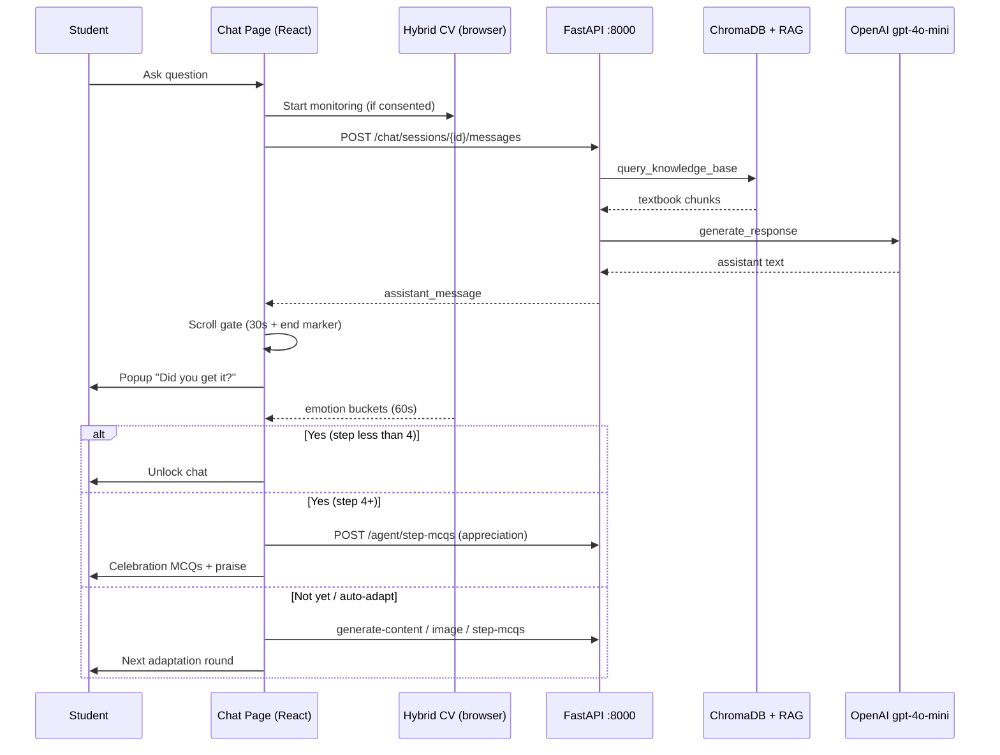

# AUTISTUDY WORKING

**AutiStudy — System Architecture & Working Document**

| Field | Value |
|-------|-------|
| Document type | Technical architecture (journal-style) |
| Period | Q1 2026 working reference |
| Repository | `AutiStudy-App` monorepo (`backend/` + `frontend/`) |
| Audience | Developers, reviewers, thesis/journal appendices |
| Status | **Latest** · June 2026 |
| Version tag | `v4.1-adaptive-agent` |
| Snapshots | `frontend/versions/latest/` |

---

## Abstract

AutiStudy is an adaptive AI tutoring platform designed for autistic learners in grades 4–7 (Pakistan curriculum). The system combines retrieval-augmented generation (RAG) over textbook content, multimodal explanations (text, visuals, speech), and a browser-based computer-vision (CV) agent that monitors engagement and drives a structured comprehension-check flow. Architecturally, the product is a **monorepo** (`AutiStudy-App`): a **FastAPI backend** (`backend/`) that owns persistence, LLM/RAG, and content generation, and a **Next.js 14 frontend** (`frontend/`) that owns the student experience, real-time emotion fusion, and the popup-gated adaptation ladder. There is **no Streamlit UI** — the Next.js app is the sole student-facing interface. This document explains how both halves work together, how data flows end-to-end, and how design decisions map to user-facing behaviour.

---

## 1. Introduction & Problem Context

Traditional chat tutors treat every learner the same: they answer a question and immediately accept the next one. For many autistic students, that pattern is overwhelming—long answers arrive before prior content is processed, comprehension is never checked systematically, and emotional state is ignored.

AutiStudy addresses this with three coordinated ideas:

1. **Curriculum-grounded answers** — replies are anchored in grade-appropriate textbook material via hybrid RAG (dense + sparse retrieval, reranking).
2. **Multimodal adaptation** — when understanding fails, the tutor escalates through simpler text, flowcharts, read-aloud, images, breathing exercises, and step MCQs.
3. **Privacy-preserving CV** — webcam frames never leave the browser; only derived emotion probabilities influence tutoring policy.

The result is not a single “AI chatbot” but a **dual-runtime system**: Python services for intelligence and storage, React services for interaction, timing, and affective computing.

---

## 2. System Overview

### 2.1 High-level topology

```
┌─────────────────────────────────────────────────────────────────────────────┐
│                         STUDENT BROWSER (Next.js 14)                        │
│  ┌─────────────┐  ┌──────────────────┐  ┌───────────────────────────────┐  │
│  │ Chat UI     │  │ Adaptive Agent   │  │ Expression Lab (A/B/C bench)  │  │
│  │ + Markdown  │  │ Panel + CV hooks │  │ MediaPipe / face-api / Hybrid │  │
│  └──────┬──────┘  └────────┬─────────┘  └───────────────────────────────┘  │
│         │                  │                                                  │
│         │    lib/api/client.ts  +  direct fetch to /api/agent/*             │
└─────────┼──────────────────┼────────────────────────────────────────────────┘
          │                  │
          │   HTTP JSON (Bearer token) · CORS :3000 → :8000
          ▼                  ▼
┌─────────────────────────────────────────────────────────────────────────────┐
│                    FastAPI BACKEND (backend/api_server.py)                  │
│  Auth · Chat · Quiz · Analytics · Parent · Agent content endpoints          │
│         │                                                                    │
│         ├── chat_engine.py ──► utils/llm.py ──► OpenAI gpt-4o-mini         │
│         │                      └── utils/rag.py ──► ChromaDB textbooks      │
│         ├── utils/visual_aids.py ──► KaTeX cards, emoji math, DALL·E         │
│         └── utils/media_agent.py ──► ReAct tool agent (legacy/full path)     │
└─────────────────────────────────────────────────────────────────────────────┘
          │
          ▼
┌─────────────────────────────────────────────────────────────────────────────┐
│  JSON-on-disk persistence (backend data/ — read/written by FastAPI + React) │
│  data/users.json · data/chats.json · data/sessions.json · quiz_data/ · …   │
└─────────────────────────────────────────────────────────────────────────────┘
```

### 2.2 Runtime ports & dev commands

| Service | Port | Command (from `frontend/`) |
|---------|------|----------------------------|
| Next.js frontend | 3000 | `npm run dev` |
| FastAPI backend | 8000 | `npm run dev:api` |
| Both together | — | `npm run dev:all` |

Environment variable `NEXT_PUBLIC_API_URL` overrides the default API base `http://127.0.0.1:8000`.

### 2.3 Design principle: shared data, split intelligence

The React app is a **rich client** that calls the FastAPI backend over HTTP; the backend reads and writes the same JSON files on disk. CV and comprehension timing live entirely in the browser because:

- Latency for 15 FPS face analysis must stay local.
- Privacy: raw video is not transmitted.
- The backend focuses on what requires secrets (OpenAI keys) and heavy models (Chroma, rerankers).

---

## 3. Backend Architecture (`backend/`)

### 3.1 Repository layout

```
backend/
├── api_server.py          # FastAPI REST API — sole integration surface for the UI
├── chat_engine.py         # Bridge: API ↔ RAG/LLM/visual aids/TTS
├── quiz_engine.py         # GPT-powered quiz generation
├── config/secrets.toml    # API keys (gitignored; see secrets.toml.example)
├── requirements.txt
├── data/                  # JSON persistence (users, chats, sessions, parents)
├── quiz_data/             # Per-student quiz analytics files
├── OneSharedChromaDB/     # Chroma vector store for RAG
├── temp_generated_images/ # Generated illustrations (served at /api/generated-images)
└── utils/                 # Core business logic
    ├── auth.py, session.py, chat_db.py, quiz_db.py, parent_db.py
    ├── llm.py, rag.py, visual_aids.py, emotion.py, secrets.py
    ├── teaching_agent.py, media_agent.py, agent_memory.py
    └── book_parser.py, ocr.py, …
```

Textbook markdown for RAG lives in **`frontend/books_mds/`** (Grade 4–7, subject folders). The backend reads these paths via `utils/book_parser.py` (`BOOKS_DIR = …/frontend/books_mds`).

### 3.2 FastAPI server (`api_server.py`)

**Framework:** FastAPI + Uvicorn  
**Authentication:** `Authorization: Bearer <token>` from `data/sessions.json` (7-day TTL)  
**CORS:** `localhost:3000`, `3001`, `127.0.0.1:3000`  
**Static files:** `/api/generated-images` → `temp_generated_images/`  
**Concurrency:** 16-worker thread pool for blocking OpenAI/Chroma calls

#### Endpoint domains

**Health & debug**

| Method | Path | Purpose |
|--------|------|---------|
| GET | `/` | API metadata |
| GET | `/api/health` | Liveness check |
| GET | `/api/debug/openai-ping` | OpenAI connectivity (dev) |

**Student authentication**

| Method | Path | Purpose |
|--------|------|---------|
| POST | `/api/auth/register` | Register (grade 4–7, password rules) |
| POST | `/api/auth/login` | Login; bcrypt + legacy SHA-256 migration |
| POST | `/api/auth/logout` | Invalidate token |
| GET | `/api/auth/me` | Current profile |
| POST | `/api/auth/child/signup` | Multipart B-Form OCR + CNIC verification |
| POST | `/api/users/me/password` | Change password |

**Parent authentication & dashboard**

| Method | Path | Purpose |
|--------|------|---------|
| POST | `/api/auth/parent/signup` | Link parent to child |
| POST | `/api/auth/parent/login` | Parent login |
| GET | `/api/parent/dashboard` | Child analytics |
| GET | `/api/parent/report` | LLM-generated progress report |

**Dashboard / user data**

| Method | Path | Purpose |
|--------|------|---------|
| GET | `/api/users/me/stats` | Stars, streak, quiz totals |
| GET | `/api/users/me/subjects` | Grade subjects + last studied |
| GET | `/api/users/me/recent-chats` | Recent sessions |
| GET | `/api/users/me/recent-quizzes` | Recent quiz attempts |

**Chat / tutor (core)**

| Method | Path | Purpose |
|--------|------|---------|
| GET | `/api/chat/config` | RAG/images/speech availability flags |
| GET/POST | `/api/chat/sessions` | List / create chat sessions |
| GET/DELETE | `/api/chat/sessions/{id}` | Load / delete session |
| POST | `/api/chat/sessions/{id}/messages` | Send user message → RAG reply |
| POST | `/api/chat/sessions/{id}/image` | Generate visual aid (polymorphic) |
| POST | `/api/chat/speech` | TTS → base64 MP3 |
| POST | `/api/chat/sessions/{id}/quiz` | Generate quiz from chat history |

**Quiz & analytics**

| Method | Path | Purpose |
|--------|------|---------|
| GET | `/api/quiz/chapters` | Textbook chapters for grade+subject |
| POST | `/api/quiz/generate` | Fresh MCQs |
| POST | `/api/quiz/submit` | Score + persist + award stars |
| GET | `/api/analytics` | Full student analytics |

**Adaptive agent (content & tools)**

| Method | Path | Purpose |
|--------|------|---------|
| POST | `/api/agent/analyze-emotion` | Vision emotion (legacy ladder) |
| POST | `/api/agent/run` | Full ReAct agent (Vision + GPT-4o tools) |
| POST | `/api/agent/decide` | Fast path: browser emotion → ReAct |
| POST | `/api/agent/generate-content` | Text for adaptation actions (flowchart, simplify, …) |
| POST | `/api/agent/step-mcqs` | MCQs: `default` · `teaching` · `appreciation` modes |
| POST | `/api/agent/session-summary` | Persist session to long-term memory |
| GET | `/api/agent/memory` | Student memory summary |

### 3.3 Chat pipeline: from message to answer

When the frontend calls `POST /api/chat/sessions/{id}/messages`:

```
1. api_server validates Bearer token
2. chat_db saves user message to data/chats.json
3. chat_engine.generate_reply() invoked with:
      - user_message, grade, subject, history, language
      - preferred_format: normal | simplified | step_by_step_flowchart | with_visual_description
4. utils/llm.generate_response(use_rag=True):
      a. utils/rag.query_knowledge_base() → Chroma + BM25 + reranker
      b. Build system prompt (EN/UR) with grade, subject, format hint
      c. Inject retrieved textbook context OR off-topic / wrong-subject guardrails
      d. Append last 10 turns + user message
      e. OpenAI gpt-4o-mini (max_tokens≈600, temperature=0.7)
5. Assistant message saved to chats.json
6. JSON returned: { user_message, assistant_message }
```

**Fallback chain:** no API key → friendly placeholder; RAG unavailable → direct GPT without retrieval.

#### RAG (`utils/rag.py`)

| Component | Detail |
|-----------|--------|
| Vector store | ChromaDB `OneSharedChromaDB` / collection `ptb_textbooks` |
| Embeddings | `all-MiniLM-L6-v2` |
| Reranker | `cross-encoder/ms-marco-MiniLM-L-6-v2` |
| Maths pipeline | 65% dense + 35% BM25 → cross-encoder → intent filter |
| Science / CS | Dense + BM25 → RRF fusion → keyword gate |
| Relevance | Threshold ~0.35 on-topic; ~0.55 off-topic |

#### LLM system prompt highlights (`utils/llm.py`)

- Autism-friendly: short sentences, step-by-step, everyday examples.
- Does **not** ask “did you understand?” — that is handled by the frontend CV agent.
- First answers capped (~4–6 sentences); longer topics use “read this part first / tell me more”.
- Math formatting: `$...$` inline, `$$...$$` block, `\frac`, `\times`, etc.
- Urdu mirror prompt for bilingual sessions.

### 3.4 Visual aids (`chat_engine` → `utils/visual_aids.py`)

`POST /api/chat/sessions/{id}/image` returns a **discriminated union** by `kind`:

| Kind | Use case |
|------|----------|
| `image` | DALL·E / GPT-image illustration |
| `math_steps` | KaTeX step card |
| `emoji_counting` | Emoji number line for small arithmetic |
| `factor_tree`, `fraction_bar`, `number_line` | Structured math visuals |
| `bar_chart`, `percentage_bar`, `times_table` | Data / tables |
| `geometry`, `ratio` | Domain-specific cards |

The frontend attaches visuals to the **latest local assistant bubble** (adaptation messages included).

### 3.5 Text-to-speech

`POST /api/chat/speech` → OpenAI `tts-1` → base64 MP3.  
Frontend plays via `HTMLAudioElement` with optional Web Audio gain boost (`lib/audio/playTtsAudio.ts`).

### 3.6 Agent content generation

The **browser** decides *when* to adapt (via `TutorComprehensionFlow` + CV). The **backend** generates *what* to show:

**`POST /api/agent/generate-content`** actions include:

- `SIMPLIFY_EXPLANATION`
- `SHOW_FLOWCHART_STEPS`
- `SHOW_VISUAL_EXPLANATION`
- `USE_VOICE_AID`
- `SUGGEST_BREAK` / `SUGGEST_TRY_TOMORROW`

**`POST /api/agent/step-mcqs`** modes:

| Mode | When used |
|------|-----------|
| `default` | Generic step MCQs |
| `teaching` | Student skipped “main idea” recall — step-by-step with hints |
| `appreciation` | Student said Yes at step 4+ — celebration quiz |

### 3.7 Persistence model

All storage is **file-based JSON** — no SQL server.

| File | Contents |
|------|----------|
| `data/users.json` | Accounts, bcrypt passwords, grade, stars, badges |
| `data/sessions.json` | Bearer tokens → email (7-day TTL) |
| `data/chats.json` | Per-email chat sessions + rich message payloads |
| `data/parents.json` | Parent accounts linked to children |
| `quiz_data/{email}_quiz.json` | Quiz attempts, streaks, subject stats |
| `data/agent_memory/{hash}.json` | Long-term agent memory per student |

Chat messages support extended fields: `image_url`, `math_steps`, `emoji_counting`, `factor_tree`, and other visual payload types.

### 3.8 Legacy vs current agent paths

Three overlapping agent architectures coexist:

1. **Rule-based modality ladder** (`utils/teaching_agent.py`) — used by `/api/agent/analyze-emotion`.
2. **ReAct Media Agent** (`utils/media_agent.py`) — GPT-4o function calling for `/api/agent/run` and `/api/agent/decide`.
3. **Browser-policy + cheap content** (current React path) — `TutorPolicyEngine` + `TutorComprehensionFlow` + `/api/agent/generate-content` + `/api/agent/step-mcqs`.

Production chat uses path **#3** for the comprehension ladder; path **#2** remains for full ReAct agent runs; path **#1** is a legacy rule-based modality ladder (superseded by #3 in the UI).

---

## 4. Frontend Architecture (`frontend/`)

### 4.1 Repository layout

```
frontend/
├── app/                    # Next.js 14 App Router pages
│   ├── chat/page.tsx       # Main tutor (~2900 lines — core product)
│   ├── dashboard/, quiz/, analytics/
│   ├── parent/dashboard/, parent/report/
│   └── expression-lab/     # CV strategy benchmark (A/B/C)
├── components/
│   ├── agent/              # AdaptiveAgentPanel, UnderstandingCheck, …
│   ├── landing/, layout/, settings/
├── lib/
│   ├── api/client.ts       # Typed HTTP client
│   ├── agent/              # State machines, policy, emotion engines
│   ├── hooks/              # useAdaptiveTutorAgent, useComprehensionFlow, …
│   ├── audio/playTtsAudio.ts
│   └── auth/, i18n/, settings/
├── expression-lab/           # Shared CV classifiers + lab UI
├── public/face-api-models/ # Local CNN weights
├── books_mds/              # Curriculum markdown (RAG source)
└── docs/                   # Specs including this document
```

### 4.2 Application routes

| Route | Auth | Purpose |
|-------|------|---------|
| `/` | Public | Landing |
| `/login`, `/signup` | Public | Student auth |
| `/dashboard` | Student | Stats, subjects, recent activity |
| `/chat` | Student | Subject picker |
| `/chat?session={id}` | Student | Active tutor session |
| `/quiz`, `/analytics` | Student | Assessment & progress |
| `/parent/*` | Parent token | Parent dashboard & report |
| `/expression-lab/*` | Public | CV strategy comparison lab |

**Root providers:** `LocaleProvider` (en/ur), `AuthProvider`, `SettingsProvider`, `SmoothScrollProvider`.

### 4.3 API client (`lib/api/client.ts`)

Central wrapper:

- Base URL: `NEXT_PUBLIC_API_URL` or `http://127.0.0.1:8000`
- Token: `localStorage.autistudy_token` → `Authorization: Bearer`
- Namespaces: `authApi`, `userApi`, `chatApi`, `quizApi`, `parentApi`
- Agent endpoints called via raw `fetch` from hooks (not namespaced)

Key chat methods:

```typescript
chatApi.send(id, content, preferredFormat?)
chatApi.generateVisualAid(id)
chatApi.speak(text, language)
chatApi.generateChatQuiz(id)
```

### 4.4 Chat page: three-state machine

The chat route is one page with URL-driven states:

```
/chat                    → SubjectPicker (choose Maths, Science, …)
/chat?subject=Maths      → Bootstrap (POST session, redirect)
/chat?session=<uuid>     → Conversation (messages + agent panel)
```

#### Message send flow

```
Student types → input blocked? (popup / MCQ / breathing / image view)
             → flowOnStudentQuestion() + agentOnStudentNewMessage()
             → agentGetPreferredFormat() → chatApi.send()
             → optimistic user bubble + server assistant reply
             → flowOnAssistantAnswer() → scroll + read gate starts
```

#### Rich message rendering

Assistant bubbles render via `react-markdown` + `remark-math` + `rehype-katex`. Eleven+ inline visual components map backend `kind` payloads to UI (emoji rows, factor trees, number lines, etc.).

### 4.5 Dual-layer adaptive system

The chat page runs **two coordinated hooks**:

```
┌─────────────────────────────────────────────────────────────────┐
│                        app/chat/page.tsx                         │
├────────────────────────────┬────────────────────────────────────┤
│  useAdaptiveTutorAgent     │  useComprehensionFlow               │
│  CV + engagement machine   │  Popup ladder + gates + MCQs        │
└────────────┬───────────────┴──────────────┬─────────────────────┘
             │                              │
             ▼                              ▼
   HybridEmotionEngine              TutorComprehensionFlow
   ComprehensionStateMachine         emotionBuckets.ts
   AdaptiveAgentPanel               UnderstandingCheck / StepMcqPanel
```

#### Layer A — `useAdaptiveTutorAgent`

**Purpose:** Real-time webcam analysis and proactive format hints.

Pipeline:

1. `getUserMedia` → shared `videoRef`
2. `useMediaPipeEmotion` (~15 FPS) — blendshapes, EAR, head pose
3. `useFaceApiEmotion` (~2 FPS) — CNN expressions from local weights
4. Every 2s: `HybridEmotionEngine.process()` → 8 lab emotions + engagement probabilities
5. `ComprehensionStateMachine` — states: IDLE, MONITORING, ESCALATING, UNDERSTOOD, …

Signal priority (documented in code):

| Priority | Source | Weight |
|----------|--------|--------|
| 1 | Direct popup feedback (Yes / Not yet) | 0.50 |
| 2 | Chat behaviour (silence, repeated Q, confusion keywords) | 0.30 |
| 3 | Camera probabilities | 0.20 |

**Outputs to UI:** `AdaptiveAgentPanel` (webcam, emotion bars, learning signals, escalation badge).

**Outputs to chat:** `getPreferredFormat()` influences the next `chatApi.send()` format hint.

#### Layer B — `useComprehensionFlow`

**Purpose:** Mandatory “Did you get it?” popup and five-step adaptation ladder.

Implemented by:

- **`TutorComprehensionFlow`** — pure state class (phases, rounds, gates, blocking)
- **`useComprehensionFlow`** — React orchestration, timers, API calls
- **`emotionBuckets.ts`** — maps hybrid scores → `happy` | `neutral_serious` | `distressed`

### 4.6 Popup-gated comprehension flow (current behaviour)

#### Gate before popup appears

| Content type | Gate condition |
|--------------|----------------|
| **Text answer** | Scroll to end marker (`IntersectionObserver`) **AND** 30s read window (`TEXT_READ_MS`) |
| **Read aloud** (round 2) | TTS fully finishes |
| **Image** (round 3) | Image generated **AND** 60s view window (`IMAGE_VIEW_MS`) |

Only after the gate clears does `activatePopup()` run and the **60s CV window** (`POPUP_WAIT_MS`) begin.

#### During popup (60 seconds)

| CV bucket | Behaviour |
|-----------|-----------|
| **happy** | Rotate prompt text only — no auto-adapt |
| **neutral_serious** | Auto-adapt after ~4s stable OR 60s timeout |
| **distressed** | Auto-adapt sooner (confused/sad/tired thresholds) |

Input is **blocked** while popup is open. Typing triggers amber “Please tap Yes or Not yet” (`typingBlocked`).

#### Adaptation ladder (rounds 1–5)

| Round | Trigger | Action |
|-------|---------|--------|
| **1** | Not yet / auto-adapt | Short flowchart via `SHOW_FLOWCHART_STEPS` → scroll gate → popup |
| **2** | Not yet / auto-adapt | Read aloud (TTS, gain-boosted) → popup after speech ends |
| **3** | Not yet / auto-adapt | Generate image → 60s image view → popup |
| **4** | Not yet / auto-adapt | Recall MCQs (2 questions) → see MCQ logic below |
| **5** | Not yet / auto-adapt | Breathing modal (~15s inhale/hold/exhale) → popup |

After all 5 rounds exhausted: friendly message, chat unlocks, ladder resets.

#### MCQ logic (round 4)

**Phase 1 — Recall (always)**

1. *Do you remember what you asked about?*
2. *What was the main idea of the answer?*

**Phase 2 — Teaching (conditional)**

If Q2 answer is **“I don’t know yet”** or **“Skip this”** → fetch `mode=teaching` MCQs from backend (step-by-step with hints).

**Phase 3 — Appreciation (conditional)**

If popup shows **Help step 4/5+** and student taps **Yes, I got it!** (regardless of happy/sad CV):

- Warm appreciation message
- `mode=appreciation` celebration MCQs (2–3 easy questions)
- Final praise → chat unlocks

**Wrong answers:** 2-line `wrong_hint` in panel, retry allowed.

**MCQs never run** if student taps Yes at steps 1–3 (before step 4 threshold).

### 4.7 Expression Lab & production CV

The lab (`/expression-lab`) benchmarks three strategies:

| ID | Strategy | Engine | Typical FPS |
|----|----------|--------|-------------|
| A | MediaPipe | 52 blendshapes + geometry rules | ~15 |
| B | face-api.js | TinyFaceDetector + FaceExpressionNet | ~2 |
| C | **Hybrid** | Weighted fusion + 3s buffer | ~10 |

**Production uses Strategy C** via `HybridEmotionEngine`:

```
Webcam
  ├─ MediaPipe → FaceSignalBuffer (8s rolling average)
  └─ face-api.js → CNN expression scores
         ↓
  classifyHybrid() + LabSignalBuffer (3s smoothing)
         ↓
  hybridScores[8 emotions] → emotionBuckets → comprehension decisions
                          → AdaptiveAgentPanel bars
```

Eight lab emotions: `happy`, `sad`, `frustrated`, `bored`, `tired`, `inattentive`, `confused`, `neutral`.

**Privacy:** Raw frames never sent to server. Only aggregated probabilities drive policy.

### 4.8 Key UI components

| Component | Role |
|-----------|------|
| `AdaptiveAgentPanel` | Fixed right panel — webcam, hybrid emotion bars, learning signals |
| `UnderstandingCheck` | “Did you get it?” Yes / Not yet popup |
| `StepMcqPanel` | Inline MCQs during recall / teaching / appreciation phases |
| `BreathingModal` | Full-screen breathing exercise (round 5) |
| `CameraConsentModal` | One-time camera permission (localStorage consent) |

### 4.9 Frontend dependencies (selected)

| Package | Role |
|---------|------|
| `next` 14 | App Router, SSR/CSR |
| `@mediapipe/tasks-vision` | Face Landmarker |
| `face-api.js` | CNN expressions |
| `framer-motion` | Popup animations |
| `react-markdown` + `katex` | Message + math rendering |
| `concurrently` | `dev:all` script |

---

## 5. End-to-End Journals: Three Representative Flows

### 5.1 Flow A — Successful comprehension (happy path)

1. Student asks: *“What is photosynthesis?”*
2. Backend RAG retrieves Grade 7 General Science chunks → gpt-4o-mini produces a short answer.
3. Frontend starts **scroll gate** (30s + end marker).
4. Popup: *“Did you get it?”* — CV runs 60s.
5. Student smiles (happy bucket) → prompt may rephrase; no auto-adapt.
6. Student taps **Yes** → popup closes, `adaptationRound` resets, CV may pause if happy.
7. Student asks next question — cycle repeats.

### 5.2 Flow B — Struggling learner (full ladder)

1. Student receives answer; popup appears after read gate.
2. Face shows confused/tired → after 4s or 60s, **auto-adapt round 1** (flowchart).
3. Still struggling → rounds 2 (TTS), 3 (image + 60s view), 4 (recall MCQs).
4. On MCQ Q2, student picks *“I don’t know yet”* → teaching MCQs load with hints.
5. After MCQs → popup again.
6. Still struggling → round 5 breathing modal → popup again.
7. If still Not yet after round 5 → ladder exhausted message, chat unlocks.

### 5.3 Flow C — Step 4 Yes with appreciation

1. Student reaches help step 4/5 on popup.
2. Taps **Yes, I got it!** — CV mood ignored.
3. Appreciation intro message + celebration MCQs (`mode=appreciation`).
4. Final praise message → chat unlocks.

---

## 6. Security, Privacy & Operational Notes

| Topic | Implementation |
|-------|----------------|
| Authentication | Bearer tokens in localStorage; bcrypt passwords |
| CV privacy | All inference client-side; no video upload |
| CORS | Explicit allowlist for dev origins |
| API keys | Backend only (env / `backend/config/secrets.toml`) |
| Startup warmup | Background thread preloads RAG + OpenAI TLS (Windows-sensitive) |
| Data durability | JSON files — suitable for demo/single-server; not horizontally scaled |

---

## 7. Known Architectural Tensions & Future Work

1. **Three agent paths** — legacy rule-based ladder, ReAct media agent, and browser-policy flow coexist; consolidation would reduce maintenance.
2. **JSON persistence** — simple but limits concurrency and audit trails.
3. **Subject naming** — `"Computer"` vs `"Computer Science"` mismatch in some modules.
4. **ChromaDB path** — `OneSharedChromaDB/` must exist locally or RAG degrades to pure GPT.
5. **Spec drift** — `docs/adaptive-agent-flow.md` original spec listed breathing before MCQs; **implemented order is MCQs (4) then breathing (5)**.

---

## 8. Glossary

| Term | Meaning |
|------|---------|
| **RAG** | Retrieval-Augmented Generation — textbook chunks injected into LLM prompt |
| **Hybrid CV** | MediaPipe geometry + face-api CNN fusion (Strategy C) |
| **Popup gate** | Condition that must clear before “Did you get it?” appears |
| **CV window** | 60s face monitoring while popup is open |
| **Adaptation round** | 1–5 escalation step in `TutorComprehensionFlow` |
| **Emotion bucket** | Collapsed CV state: happy / neutral_serious / distressed |
| **Preferred format** | Hint to backend for answer style (simplified, flowchart, …) |

---

## 9. Reference Diagram — Complete Request Lifecycle



---

## 10. Conclusion

AutiStudy is architecturally a **hybrid intelligent tutoring system**: the backend supplies curriculum-grounded language and multimodal content generation, while the frontend supplies timing, affective sensing, and a strict pedagogical protocol (read → check → adapt). The separation keeps latency-sensitive CV local and secret-bearing LLM calls centralized. The popup-gated comprehension ladder is the product’s distinguishing feature—it transforms a generic chatbot into a tutor that waits, watches, and adapts when understanding fails.

For the live popup specification and Mermaid flowchart, see also: `docs/adaptive-agent-flow.md` (note: ladder order in code may differ slightly from earliest spec).

---

*Document: AUTISTUDY WORKING · AutiStudy Platform Architecture · Q1 2026*
