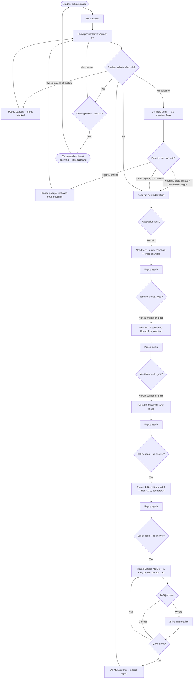

# Adaptive Agent — Popup-Gated Comprehension Flow

> Saved spec for AutiStudy chat CV + comprehension popup ladder.  
> Last updated from product discussion (May 2026).

## Rules summary

1. **Every bot answer** → mandatory **“Have you got it?”** popup.
2. Student **cannot type/send** until popup is answered — or until **all step MCQs** are finished.
3. If student tries to type → popup **dances** (bounce/pulse) until they pick Yes/No.
4. **1-minute timer** while popup is open → CV monitors face the whole time.
5. **Neutral face for 1 min** → treated as **serious** → auto-adapt (same as sad/frustrated).
6. **Happy** during 1 min → keep/dance popup, rephrase question (no auto-adapt).
7. **Yes + happy** → stop CV judging until **next user question**.
8. **No** (or serious/sad during 1 min) → run adaptation ladder (below), then popup again.
9. **Breathing** = full-screen modal (blurred background, SVG, countdown) — not a chat message.
10. **MCQs** = no popup during quiz; block input until **all** step MCQs done; easy, short, one per concept step (not too many); wrong answer → 2-line hint in panel; then popup returns.

---

## Flowchart

---

## Adaptation ladder

| Round | Trigger | Output |
|-------|---------|--------|
| 1 | No, or serious/sad/neutral 1 min | Short text + `Step 1 → Step 2 → …` + emoji example |
| 2 | No, or serious/sad/neutral 1 min | Read aloud (Round 1 text) |
| 3 | No, or serious/sad/neutral 1 min | DALL·E / visual aid image |
| 4 | Serious + no popup answer | Breathing modal (3s count + deep breath SVG) |
| 5 | Still serious + no answer | Easy step MCQs (1 per topic step, minimal text) |

---

## CV emotion buckets

| Bucket | Detection | Action during 1 min wait |
|--------|-----------|---------------------------|
| **happy** | Smile / happy dominant | Dance popup only |
| **neutral_serious** | Neutral face ~1 min | Auto-adapt |
| **distressed** | Sad, frustrated, angry, confused high | Auto-adapt |

---

## Input blocking

| Phase | Can type/send? |
|-------|----------------|
| Popup waiting | No |
| MCQ session | No (until all steps done) |
| Breathing modal | No |
| After Yes (happy) | Yes |
| After all MCQs + popup answered | Yes |
